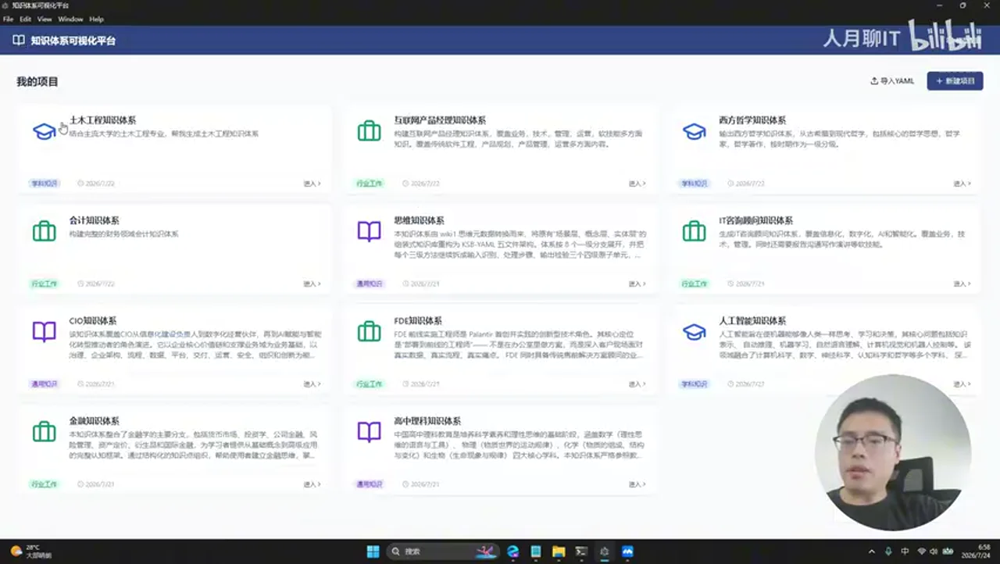
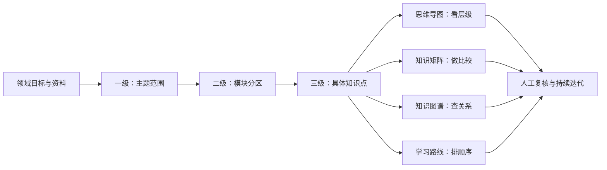
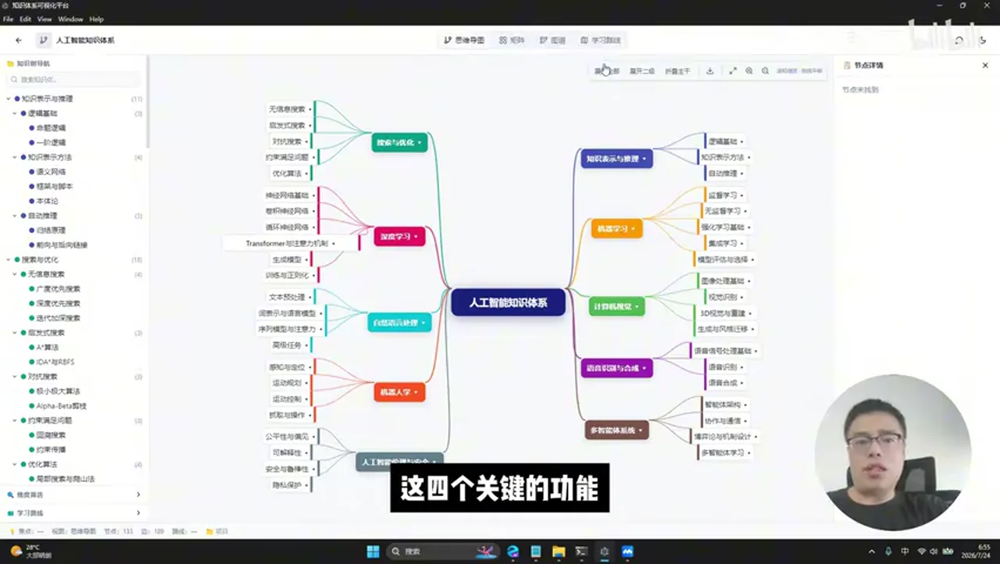
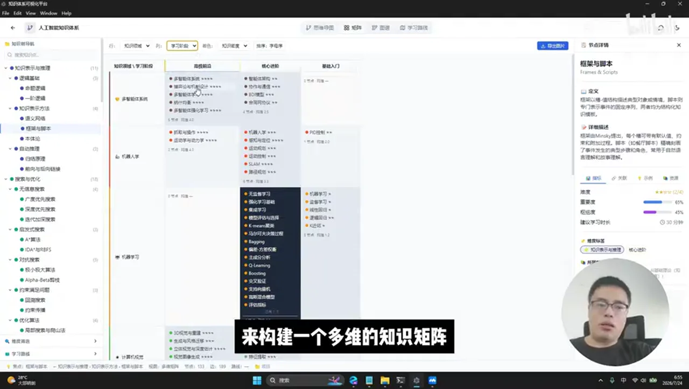
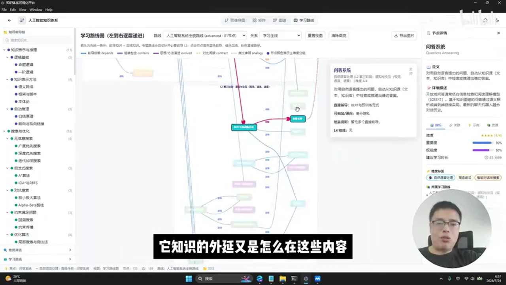
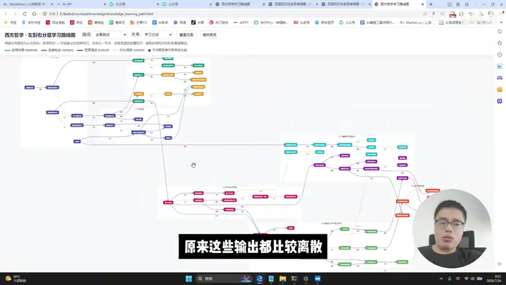
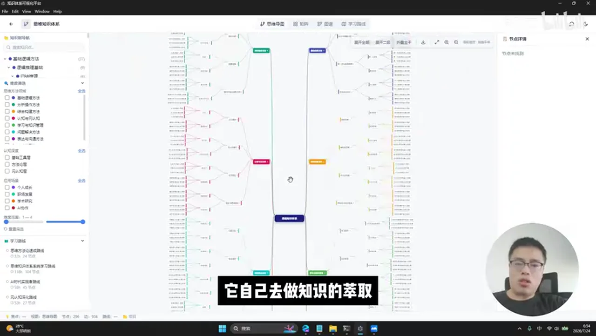
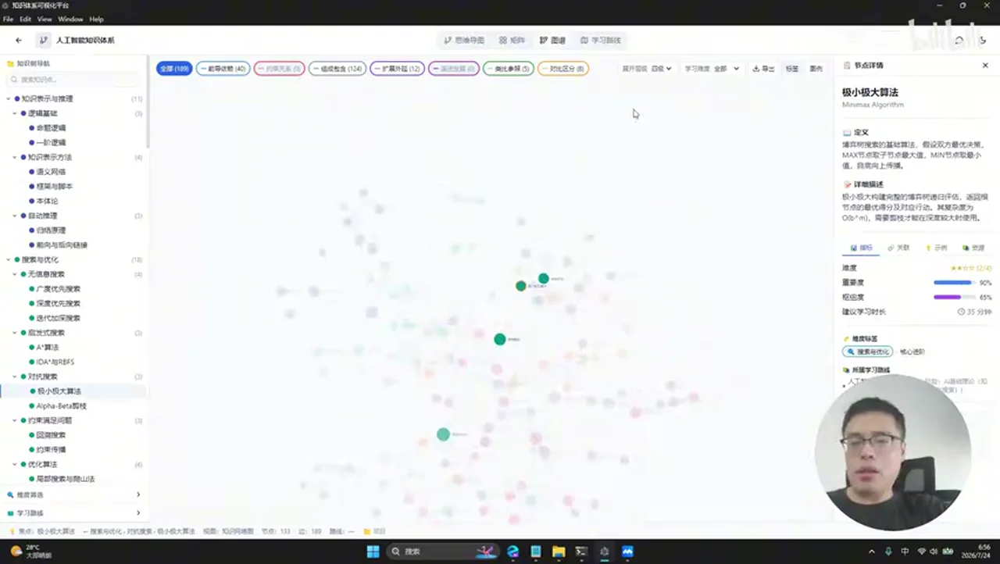
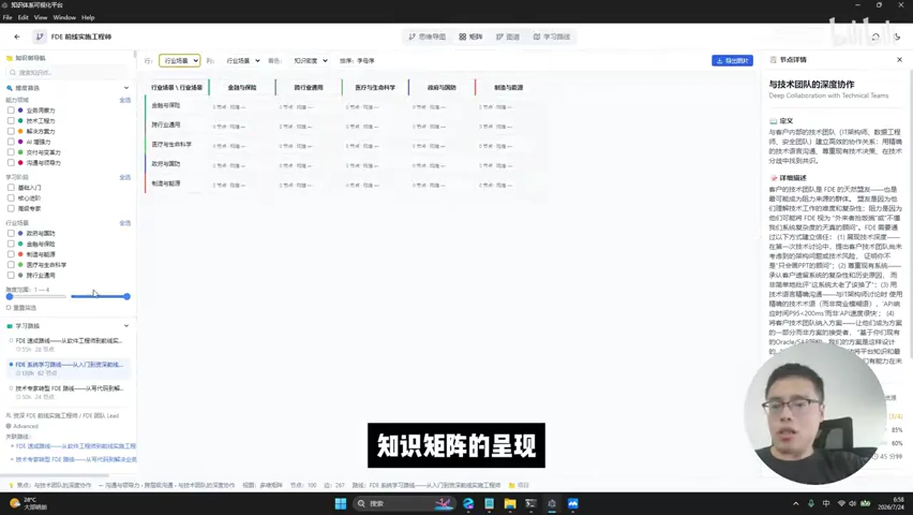
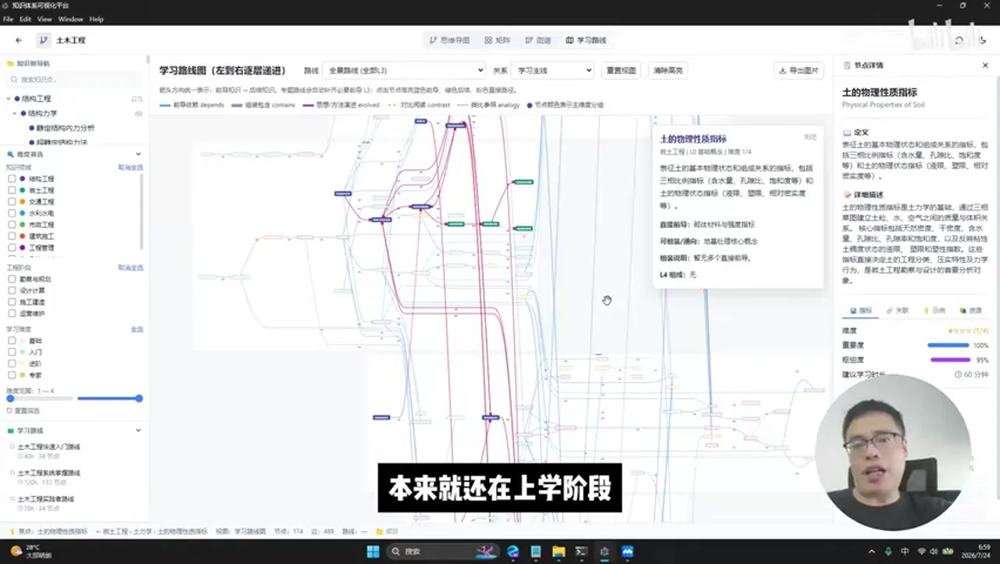

# 总结稿

## 内容概览

视频展示了作者正在构建的“AI 辅助可视化知识体系平台”。它试图把过去由提示词生成、散落在多个 Markdown 文件中的知识内容，统一整理为可创建、导入、浏览和关联的项目。用户可以输入金融、人工智能、土木工程等主题并选择知识类别，也可以把已有知识库先整理成结构化文件后导入。作者称平台覆盖“三层知识体系架构”；从演示可确认的是，知识树会按一级、二级、三级分类，但视频没有进一步给这三层规定统一的语义名称。更稳妥的理解是：先划分领域和模块，再下钻到具体知识点，随后用关系和学习顺序把节点重新组织起来。

平台主要提供四种互相联动的视图。思维导图用于展现一个领域的树状全貌和层级分支；知识矩阵把知识领域、学习阶段、难度、重要度等维度交叉排列，便于横向比较；知识图谱围绕所选节点展示依赖、包含、演化、对比、类比等关系；学习路线则按目标场景组织先修知识、当前节点和后续外延。作者强调，这四种视图并非四份彼此独立的内容，而是对同一批知识节点的不同投影：选中知识树节点后，中央视图和右侧详情会随之联动。

输入流程有两条：一是填写主题、描述和类别后让 AI 生成初稿；二是导入已有的结构化资料。视频口述提到 Markdown，界面画面还出现 YAML 导入入口，但没有说明格式规范、校验机制、模型来源和生成耗时。作者展示了人工智能、金融、FDE、CIO、西方哲学、土木工程及高中学科等项目，并把使用场景扩展到职场能力建设、大学专业学习和未知领域入门。

这段内容本质上是作者自己的产品演示，不是公开基准测试。画面能证明演示版本存在创建、导入和多视图浏览入口，却不能证明“任意领域”都能稳定生成高质量内容，也不能证明体系必然完整、评分客观或学习路线正确。尤其是知识图谱中的边和路线中的前置依赖，一旦生成错误，会把结构化外观误当成可靠结论。视频中的“Printer”仅是语音近似，具体术语无法从上下文确定，应继续保留不确定标记。

更可靠的复用方式不是把 AI 输出直接当成教材，而是采用六步闭环：先定义领域边界与目标读者，再接入带出处的权威资料；让 AI 生成层级、矩阵、关系和路线初稿；请领域专家复核节点；单独检查关系边、先修条件和遗漏；最后在学习与实践反馈中持续迭代。这样，平台更适合作为知识结构的工作台和审阅界面，而不是自动产生“完整正确知识”的黑箱。

# 辅助理解

## 先看清它解决的是什么问题

作者要解决的不是“让 AI 多写几篇文章”，而是把散落的提示词输出、Markdown 文档和已有知识库，组织成一个可以持续浏览、比较和规划学习的项目。首页把不同领域分别作为项目管理，演示样例横跨人工智能、金融、土木工程、西方哲学、CIO、FDE 等主题。

*作者演示的项目库覆盖学科、岗位与通用主题，并提供新建和 YAML 导入入口；这些样例只能证明演示库中存在相应项目，不能推出平台对任意领域都同样有效。*

作者称平台覆盖“三层知识体系架构”。视频没有为三层给出一套正式、固定的名称，明确展示的是知识树按一级、二级、三级分类。因此可以把它理解为由宏观主题逐步下钻至模块与具体知识点的层级，而不应擅自把三层包装成已经定义好的学术模型。层级只是知识的骨架；矩阵、图谱和路线进一步给骨架增加观察维度、关系以及行动顺序。

## 两条输入路径

第一条路径是 AI 生成：填写主题和描述，选择学术知识、行业工作或通用知识等类别，再触发生成。它适合从空白开始快速做出结构草案。

*作者演示的 AI 生成入口：填写主题和描述、选择知识类别后开始生成；画面只证明该入口存在，不能证明后台模型、生成质量或结果无需修订。*

第二条路径是导入已有资料。口述称可把知识体系原模型整理为一组 Markdown 文件后导入；画面中另有 YAML 导入入口。两种说法说明作者希望兼容“AI 从零起草”和“用本地知识库打底”，但视频没有展示 YAML 模式、Markdown 目录约定、来源追踪、冲突处理和导入校验，不能假定任意文件都能无损接入。

## 四种视图其实是同一批节点的四种投影

### 1. 思维导图：回答“这个领域由什么组成”

思维导图把中心主题展开成主分支和下级节点，适合快速检查范围、层级与明显空白。平台左侧知识树、中间画布和右侧节点详情联动，使用户能够从全局结构进入单点说明。

*人工智能知识体系的思维导图示例：中心主题展开为机器学习、视觉、语言、推理等分支；这是作者演示中的分类结果，层级是否合理、是否遗漏仍需人工审核。*

### 2. 知识矩阵：回答“同一批知识可以怎样比较”

树结构一次只能突出一条父子路径，矩阵则把学习阶段、知识领域、难度、重要度、成熟度和建议学习时长等属性交叉排列。它适合识别某一阶段应该覆盖哪些模块，也能发现某个区域是否过密或空缺。不过，界面中的评分和学习时长属于演示数据，不会因为被可视化就自动获得客观性。

*知识矩阵按领域、学习阶段等维度交叉排列，并在右侧呈现节点属性；这些标签和评分需要可追溯依据，不能直接视为通用标准。*

### 3. 知识图谱：回答“知识点之间是什么关系”

知识图谱不再只表示父子层级，而是把节点间的依赖、包含、演化、对比或类比呈现为网络。其价值在于揭示跨分支联系，但风险也集中在“边”：一个节点名称可能正确，连接关系却可能是 AI 推测。视频展示了关系视图与知识树联动，却没有逐项验证具体关系。

### 4. 学习路线：回答“为了某个目标应按什么顺序学”

学习路线是在关系网络上增加场景和顺序。作者展示了快速入门、系统学习、机器学习等不同路线，并声称可以看到前导知识和后续外延。路线不是普通目录；它实际上包含了对学习目标、依赖强弱和学习者起点的判断。

*从左到右的学习路线示例：节点间可标注依赖、包含、演化、对比和类比；路线是否正确、是否适合具体学习者，仍需领域专家和真实学习反馈复核。*

这四种视图可以形成互补：导图负责范围，矩阵负责切片，图谱负责关系，路线负责行动。但它们共享同一数据基础；如果底层节点或关系有误，四种视图可能一起呈现同一错误，而不是相互独立地证明它。

## 使用场景与边界

视频把平台定位于三类场景：为职场岗位建立能力模型，为学生整理专业或学科结构，以及为陌生领域规划入门路线。它也展示了跨领域项目列表，说明界面设计具有复用意图。可是，这仍是作者的产品演示，不是与其他工具对照的公开评测。视频没有公布测试集、专家评分、错误率、覆盖率、学习效果或可复现的生成配置，因此“任意领域”“完整知识体系”和“路线正确”均未获独立验证。

“Printer”一词在转写中只是近似音译，邻近内容涉及技术工程力、业务洞察力、解决方案能力及交付与变革力，但这些线索不足以唯一确定原词。保留“Printer（具体术语不清）”比猜成某个职位或本体术语更可靠。

## 可复用的更可靠工作流

1. **定义范围**：写清目标读者、问题边界、预期深度和不纳入内容，避免“完整”成为无法检验的口号。
2. **接入有出处资料**：优先使用教材、标准、论文、官方文档和组织内部已确认资料，并为节点保存来源、版本与日期。
3. **生成结构**：让 AI 先生成知识树、矩阵维度、候选关系和学习路线草案，把它视为压缩整理工具，而非权威来源。
4. **专家复核**：检查概念名称、定义、覆盖范围、难度评分和适用人群，标记争议观点与不同学派。
5. **检查关系与前置依赖**：单独验证每条关键边，尤其检查循环依赖、错误先修、层级混淆和路线断点。
6. **持续迭代**：把学习者反馈、任务表现和资料更新回写到节点，定期审查过期内容，并保留修订记录。

## 外部事实核验（2026-07-29）

本次共检查 5 项会影响方法可信度的客观断言：

- **[01:04] 多项目、多领域支持：未核验。** 视频和画面能证明作者进行了多项目演示，但没有独立产品文档或公开测试来确认支持范围及稳定性。
- **[01:22] 输入任意领域即可生成完整知识体系：未核验。** “任意”和“完整”是强断言，没有公开覆盖率或专家评测支持。
- **[01:28] 从本地知识库或 Markdown 导入后形成完整体系：未核验。** 演示和口述说明存在这条流程，但格式约束、抽取准确率、冲突处理和完整性均未公开。
- **[03:28] 节点与关系可表达知识网络：部分确认。** 这与 [W3C RDF 图模型](https://www.w3.org/TR/rdf10-concepts/)用节点和有向关系表达陈述的基本思想相符；但这不能证明平台生成的具体关系正确。
- **[03:45] 可生成包含前导知识、依赖和外延的完整路线：未核验。** 界面展示了路线功能，但没有公开证据证明依赖正确、覆盖完整或学习效果更好。

另外两份外部材料仅用于补充风险控制，**不是视频演示的内容，也不构成对该产品的评测**：[NIST《Generative AI Profile》](https://www.nist.gov/publications/artificial-intelligence-risk-management-framework-generative-artificial-intelligence)提醒生成式 AI 可能产生编造、自动化偏误和信息完整性风险；[UNESCO《Guidance for Generative AI in Education and Research》](https://www.unesco.org/en/articles/guidance-generative-ai-education-and-research?hub=66973)强调教育场景中的准确性、有效性与人工验证。两者共同支持的实践结论是：生成结果应回链原始资料，并由领域专家和真实使用过程复核，而不是因为结构漂亮就默认可信。

# Data

## 增强转写稿

## 校订转写稿

[00:00] Hello，大家好，我是人月聊 IT。
[00:03] 今天来讲一讲我最近做的一个偏比较系统、完整的产品，
[00:08] 就叫基于 AI 辅助的可视化知识体系构建平台。
[00:14] 实际上在前面我的文章和视频里，
[00:16] 都专门分享过如何通过 AI 辅助去构建一个完整的知识体系。
[00:21] 但是前面可能仅仅是一个简单的提示词，或者是比较离散的一些文件输出。
[00:28] 比如说我
[00:29] 实现了一个完整的知识体系构建的提示词，
[00:33] 然后基于这个提示词，它就会输出很多相关的知识体系呈现方式，
[00:38] 类似于思维导图的呈现，
[00:41] 或者类似于学习路线的呈现。
[00:44] 但是原来这些输出都比较离散，所以说接着我就做了一个很重的事情：
[00:48] 基于我整个知识体系构建的完整方法论，
[00:52] 我又重新做了一次梳理，把它变成一个完整的、
[00:56] 覆盖
[00:57] 三层知识体系架构的这么一个完整的知识体系构建平台。
[01:02] 这个平台里面，
[01:04] 最大的一个作用就是，它是支持多个项目、多个领域的知识体系构建的。
[01:10] 你可以通过这个地方输入，
[01:12] 比如我要构建金融、我要构建人工智能的知识体系，
[01:16] 你直接输入，
[01:18] 然后选择知识体系的分类，然后开始生成知识体系。
[01:22] 这个时候 AI 大模型就会基于这么一个领域，
[01:26] 去帮你生成完整的知识体系。
[01:28] 当然，比如说你本地已经有一个完整的知识库，
[01:31] 也可以用我的提示词先输出知识体系的原模型。知识体系的原模型，
[01:36] 其实就是一堆独立的 Markdown 文件。
[01:39] 当你输出了这个知识体系的原模型以后，你可以通过我提供的导入 Markdown 文件的功能，
[01:45] 直接将这个知识体系导进来。
[01:48] 好了，我们再来挑几个有代表性的知识体系，做一个简单的讲解。
[01:52] 从这个图大家可以看到，类似于金融、人工智能、FDE、IT 咨询顾问，
[01:58] 互联网产品经理、土木工程、西方哲学，
[02:00] 基本上，
[02:01] 你希望构建的知识体系，通过这种方式都可以去构建。
[02:06] 包括里面还有一个思维的知识体系。思维的知识体系实际上就是基于我已有的
[02:12] 思维的文档知识库，
[02:13] 它自己去做知识的萃取，最终形成完整的知识体系，也是完全可以的。
[02:19] 类似于它可以构建高中学科的知识体系，
[02:23] 它可以去构建金融的知识体系，
[02:26] 它可以去构建人工智能的知识体系。
[02:29] 进到某一个知识体系以后，大家可以看到左边就是一个完整的知识树结构，
[02:34] 按照知识的一级、二级、三级去进行知识的分类。
[02:38] 整个知识体系就分为了思维导图、多维知识矩阵、知识图谱和学习路线这四个关键的功能。
[02:45] 整个知识体系也可以完整地去做展开。
[02:48] 你点右边的某一个节点的时候，大家可以看到，实际上它跟思维导图上面的节点是有完整对应的。
[02:55] 包括最右边栏目，它就会有这个知识点详细的一个解释。
[02:59] 然后进到矩阵。矩阵其实是我觉得相当重要的一个功能，
[03:03] 就是我们可以基于不同的知识维度，共同去构建一个多维的知识矩阵表格。
[03:10] 比如说基于人工智能的知识领域，
[03:12] 我们可以按学习阶段来构建一个多维的知识矩阵。
[03:16] 你就清楚了，要学习人工智能，我基础入门该学哪些东西，
[03:20] 我核心进阶该学哪些东西，我高级该学哪些东西。每个点，
[03:25] 它究竟该怎么学，都有一个完整的展示。
[03:28] 包括我们还可以去构建一个知识图谱。
[03:31] 知识图谱构建完了以后一样的，它跟左边的知识树节点是完整联动的。
[03:37] 选到左边不同的树节点，就会围绕这么一个知识点，
[03:41] 显示它完整的知识网络结构图。
[03:45] 接着就是学习路线功能。学习路线我们分很多种，它就会基于场景输出。
[03:50] 比如说你有机器学习的路线，你有系统化学习的路线，你有快速入门的路线。
[03:56] 每种路线它都会输出一个完整的学习路线图。
[04:00] 这个学习路线图里面就有完整的前后依赖关系。
[04:03] 基于每个依赖节点，你就可以看得到，我要学习这个知识点，
[04:07] 首先要掌握哪一些前导知识。
[04:10] 学了这个知识点以后，它知识的外延又是怎么样的。
[04:13] 所以说这些内容，它都会有一个完整的展示。
[04:17] 所以这样的话，大家就可以看到，我整个的思维导图、知识矩阵、
[04:21] 知识图谱，包括学习路线，它们都不是孤立的。
[04:25] 它将传统的思维导图这种知识树，形成了一个完完整整的知识图谱或者知识网络，
[04:32] 而且围绕你的问题和场景，
[04:35] 系统化地去帮你规划相应的学习路线。
[04:38] 这个才是我构建这么一个体系化的知识结构最核心的内容。
[04:43] 所以我们还可以去构建类似于现在本体论的“Printer”（音译，具体术语不清）的知识体系。
[04:47] 所以它也一样，会去输出完整的
[04:50] 知识网络结构。比如说，
[04:52] 你现在如果是要系统化学习
[04:54] “Printer”（音译，具体术语不清），你整个的知识学习路线究竟是怎么样，
[04:57] 有哪一些前导知识，有哪一些依赖的节点，
[05:00] 包括整个“Printer”工程师（音译，具体术语不清）的知识结构，
[05:04] 比如包括了技术工程力、
[05:06] 业务洞察力、解决方案能力、
[05:09] 交付与变革力，每一个里面又有哪一些细分的知识点，
[05:12] 包括它有一个完整的知识矩阵的呈现。
[05:17] 类似于你在不同的学习阶段，你就应该学习哪些内容。
[05:21] 包括我也输出了相关的、
[05:23] 类似于 CIO 的知识体系，
[05:29] 包括最近我做的类似于西方哲学的知识体系。
[05:40] 大家可以看得到，整个里面都有一个很完整的显示。
[05:46] 包括你未知的领域，一样的道理。
[05:48] 你比如说是土木工程专业，
[05:51] 你大学刚入学，你究竟该怎么样去构建一个完整的土木工程知识体系，
[05:55] 它也会有一个完整的输出，
[05:57] 类似于详细的学习路线的一个输出。
[06:01] 所以我感觉，整个知识体系的这么一个构建平台，
[06:04] 它已经不是简单地只适合你工作以后怎么样去构建一个知识体系、
[06:10] 去规划你的学习路线。
[06:12] 它仍然适合，比如说你现在本来就还在上学阶段，
[06:16] 你怎么样去构建你的专业、你的学科的知识体系，
[06:19] 并且有规则、有计划地去制定相关的一些学习路线，完全适合。
[06:25] 包括完整的知识体系结构的一些展示。
[06:30] 好了，今天关于知识体系这么一个系统化的构建平台，
[06:34] 就跟大家简单地分享到这里。

## 术语表

- **AI 大模型**：视频中用于按领域生成知识体系内容的模型。
- **Markdown 文件**：平台可导入的独立文本文件格式；原始转写误作“压抹文件”。
- **知识树**：按一级、二级、三级组织知识点的层级结构。
- **知识矩阵**：按学习阶段等多个维度组织知识点的表格。
- **知识图谱**：展示知识点及其关联关系的网络结构。
- **学习路线**：包含前导知识、依赖节点和后续外延的学习顺序图。
- **Printer**：原始语音的近似音译，缺少足够上下文，未强行改写成某个特定英文术语。

## 原始转写稿

[00:00] Hello 大家好 我是任月聊IT
[00:03] 今天来讲一讲我最近做的一个偏比较系统完整的产品
[00:08] 就叫基于AI辅助的可视化的知识体系构建平台
[00:14] 实际在前面我文章和视频
[00:16] 都专门的分享过如何通过AI辅助去构建一个完整的知识体系
[00:21] 但是前面可能仅仅是一个简单的提示词或者是比较离散的一些文件输出
[00:28] 比如说我
[00:29] 实现了一个完整的知识体系的构建的提示词
[00:33] 然后基于这个提示词它就会输出很多相关的知识体系的呈现方式
[00:38] 类似于示威导图的呈现
[00:41] 或者类似于学习路线的呈现
[00:44] 但是原来这些输出都比较离散 所以说接着我就做了一个很壮的事情
[00:48] 基于我整个知识体系构建的完整的方法论
[00:52] 我又重新做了一次梳理把它变成一个完整的
[00:56] 覆盖
[00:57] 三层知识体系架构的这么一个完整的知识体系构建平台
[01:02] 这个平台里面
[01:04] 最大的一个作用就是它是支持多个项目多个领域的知识体系的构建的
[01:10] 你可以通过这个地方输入
[01:12] 比如我要构建金融我要构建人工智能的知识体系
[01:16] 你直接输入
[01:18] 然后选择知识体系的分类然后开始生成知识体系
[01:22] 这个时候AI大模型就会基于这么一个领域
[01:26] 去帮你生成完整的知识体系
[01:28] 当然比如说你本地已经有一个完整的知识库
[01:31] 也可以用我的题子词先输出知识体系的原模型 知识体系的原模型
[01:36] 其实就是一堆的独立的压抹的文件
[01:39] 当你输出了这个知识体系的原模型以后你可以通过我提供的导入压抹文件的功能
[01:45] 直接将这个知识体系导进来
[01:48] 好了 我们再来挑几个有代表性的知识体系 我们做一个简单的讲解
[01:52] 从这个图大家可以看到类似于金融 人工智能 FDE IT 资讯顾问
[01:58] 互联网产品经历 图目工程 西方哲学
[02:00] 基本上
[02:01] 你希望构建了知识体系你通过这种方式都可以去构建
[02:06] 包括里面还有一个思维的知识体系 思维的知识体系实际上就是基于我已有的
[02:12] 思维的文档知识库
[02:13] 他自己去做知识的 萃取最终形成的完整的知识体系也是完全可以的
[02:19] 类似于他可以构建高中学科的知识体系
[02:23] 他可以去构建金融的知识体系
[02:26] 他可以去构建人工智能的知识体系
[02:29] 进到某一个知识体系以后大家可以看到左边就是一个完整的知识数结构
[02:34] 按照知识的一级二级三级去进行知识的分类
[02:38] 整个知识体系他就分为了思维导图 多维知识体证 知识图谱和学习 路线这四个关键的功能
[02:45] 整个知识体系他也可以完整的去做展开
[02:48] 你点右边的某一个节点的时候大家可以看到 实际上他跟思维导图上面的节点他是有完整的对应的
[02:55] 包括最右边栏目他就会有这个知识点详细的一个解释
[02:59] 然后进到举证 举证其实是我觉得相当重要的一个功能
[03:03] 就是我们可以基于不同的知识维度 共同去构建一个多维的知识举证表格
[03:10] 比如说基于人工智能的知识领域
[03:12] 我们可以按学习阶段来构建一个多维的知识举证
[03:16] 你就清楚了要学习人工智能 我基础入门该学哪些东西
[03:20] 我核心进阶该学哪些东西 我高级该学哪些东西 每个点
[03:25] 他究竟该怎么学都有一个完整的展示
[03:28] 包括我们还可以去构建一个知识图谱
[03:31] 知识图谱的构建完了以后一样的 他跟左边的知识数节点他是完整的联动的
[03:37] 选到不同的左边的数的节点就会围绕这么一个知识点
[03:41] 显示他完整的知识网络结构图
[03:45] 接着就是学习路线功能 学习路线我们分很多种 他就会基于场景输出
[03:50] 比如说你有机器学习的路线 你有系统化学习的路线 你有快速入门的路线
[03:56] 每种路线他都会输出一个完整的学习路线图
[04:00] 这个学习路线图里面就有完整的前后依赖关系
[04:03] 基于每个依赖节点 你就可以看得到我要学习这个知识点
[04:07] 他首先要掌握哪一些前导的知识
[04:10] 学了这个知识点以后 他知识的外言又是怎么样的
[04:13] 所以说在这些内容他都会有一个完整的展示
[04:17] 所以这样的话大家就可以看到我整个的思维导图知识矩正
[04:21] 知识图谱包括学习路线他都不是顾虑的
[04:25] 他将传统的思维导图这种知识度形成了一个完完整整的知识图谱或者是知识网络
[04:32] 而且围绕你的问题和场景
[04:35] 系统化的去帮你规划相近的学习路线
[04:38] 这个才是我构建这么一个体系化的知识结构最核心的内容
[04:43] 所以我们还可以去构建类似于现在本体论的Printer的知识体系
[04:47] 所以他也一样的他会去输出完整的
[04:50] 知识网络结构比如说
[04:52] 你现在如果是要系统化学习
[04:54] Printer你整个的知识学习路线究竟是怎么样
[04:57] 有哪一些前导知识有哪一些依赖的节点
[05:00] 包括整个的Printer工程师他的知识结构
[05:04] 比如包括了技术工程力
[05:06] 业务洞察力解决方案能力
[05:09] 交付与变革力每一个里面又有哪一些细分的知识点
[05:12] 包括他有一个完整的知识矩阵的呈现
[05:17] 类似于你在不同的学习阶段你就应该学习哪些内容
[05:21] 包括我也输出了相关的
[05:23] 类似于CIO的知识体系
[05:29] 包括最近我做的类似于西方哲学的知识体系
[05:40] 大家可以看得到整个里面都有一个很完整的显示
[05:46] 包括你未知的领域一样的道理
[05:48] 你比如说是土木工程专业
[05:51] 你大学刚入学你究竟该怎么样去构建一个完整的土木工程的知识体系
[05:55] 他也会有一个完整的输出
[05:57] 类似于详细的学习路线的一个输出
[06:01] 所以我感觉整个知识体系的这么一个构建平台
[06:04] 他已经不是简单的只是适合你工作以后怎么样去构建一个知识体系
[06:10] 去规划你的学习路线
[06:12] 他仍然是适合比如说你现在本来就还在上学阶段
[06:16] 你怎么样去构建你的专业你的学科的知识体系
[06:19] 并且有规则有计划的去制定相关的一些学习路线完全适合
[06:25] 包括完整的知识体系结构的一些展示
[06:30] 好了今天关于知识体系这么一个系统化的构建平台
[06:34] 就跟大家简单的分享到这里

## 原始关键帧

### 关键帧 1

### 关键帧 2

### 关键帧 3

### 关键帧 4

### 关键帧 5

### 关键帧 6

### 关键帧 7

### 关键帧 8

### 关键帧 9

### 关键帧 10

### 关键帧 11

### 关键帧 12

### 关键帧 13

