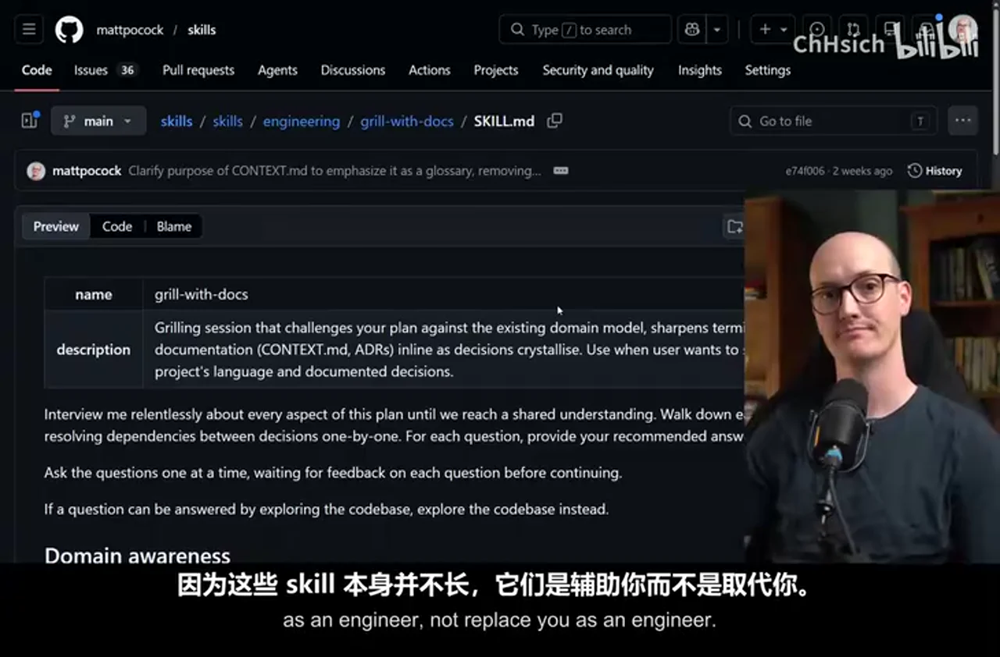
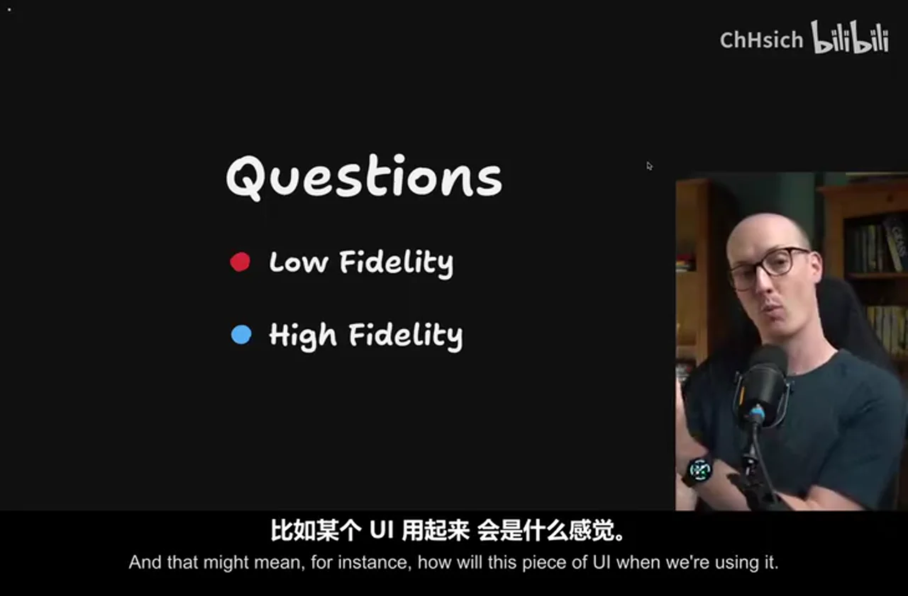
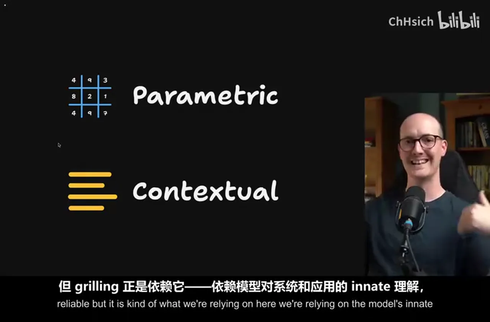
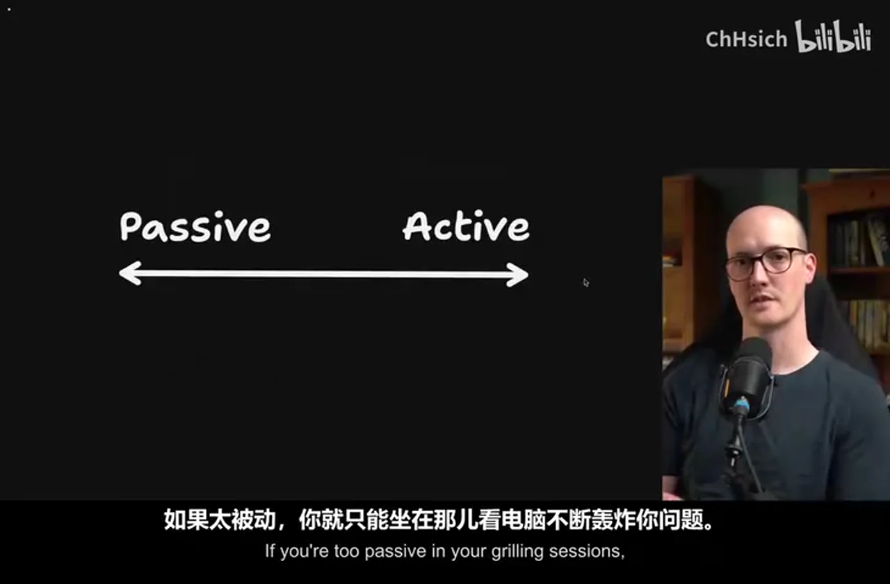

# 总结稿

暂无总结。

# 辅助理解

# Data

## 原始转写稿

[00:00] mygrilmi skills and grilward docs have been out there for a while now
[00:03] and people all around the world are using them as a replacement for plan mode in agents
[00:08] however I sometimes hear from people using them
[00:10] like codecs just ask me 200 questions this issue here
[00:14] and I kind of wince a little bit
[00:17] the idea of these skills is that they relentlessly question you
[00:20] is that they continually ask you questions
[00:23] until you reach a shared understanding about something
[00:25] and what that does is it relies on the skill of the person answering the questions
[00:29] in other words you using the grilmi skill need to be good at planning
[00:35] you need to understand things like scope
[00:37] you need to have a sense of what questions require what level of fidelity to answer
[00:42] and this is why I want to make this video
[00:44] I want to make you really good at using these skills
[00:48] because these skills themselves are really not super long
[00:50] and they're designed to aid you as an engineer
[00:53] not replace you as an engineer
[00:55] so I've got a list of nine things that people get wrong with these skills
[00:59] but before we do that we're going to look at a few lenses
[01:02] for how to understand those failure modes
[01:05] because if we don't understand them in the correct way
[01:07] we're not going to be able to change them
[01:08] now if you like the way I teach and you like the thing I'm teaching about
[01:11] then you are going to really enjoy my AI coding for real engineers cohort
[01:15] which the next one starts on June 1st
[01:18] it has only one day and 11 hours left for 30% off
[01:22] so definitely you want to get on that
[01:24] hopefully I can post this video today
[01:26] so you have time to actually purchase it
[01:27] so let's get started
[01:28] the first thing to consider here is that when we go into a grilling session
[01:31] what we're really trying to do is answer questions
[01:35] there are probably some things that we don't know about the thing that we're going to build
[01:39] now these questions come at different levels of fidelity
[01:42] that are required to answer
[01:44] I'm taking this language from Ryan Singer's amazing book "Shape Up"
[01:47] high fidelity questions are questions where you need a really zoomed in
[01:52] really detailed high fidelity image in order to understand it
[01:56] and that might mean for instance how will this piece of UI feel
[02:01] when we're using it
[02:02] should we split all of these form fields into multiple different pages
[02:05] or should we have one enormous form where we fill them in
[02:08] the only real way you're going to get kind of understanding of that
[02:13] is a high fidelity prototype or actually building the whole thing
[02:17] whereas low fidelity questions are questions that you don't need
[02:20] a high fidelity kind of prototype or image to answer
[02:23] things like what should what URL should this root live on
[02:27] or things like that
[02:28] you really just need to answer the question
[02:30] and the first failure mode I see with the grill me skills
[02:32] is trying to answer high fidelity questions
[02:36] during a grilling session
[02:37] in other words there are questions that are grillable
[02:40] in other words answerable in a grilling session
[02:42] and questions that are ungrillable
[02:44] questions that are not answerable in a grilling session
[02:47] so then what do you do when you encounter an ungrillable question
[02:50] when the question is about feel
[02:52] when you need to actually see something higher fidelity
[02:55] in order to answer it
[02:57] well the thing I tend to do is I tend to have
[02:59] a prototyping handoff
[03:01] so let's imagine that in my first session here in the blue
[03:05] I've done some grilling and I reach an ungrillable question
[03:08] a question that I need to see in a higher fidelity
[03:11] what I do is I use the handoff skill
[03:13] which I will link to below
[03:15] to handoff to a prototyping session
[03:18] where I will then spend another session
[03:20] kind of just prototyping on that question
[03:22] seeing it in a higher fidelity
[03:24] and then whatever I learn from that
[03:26] I will handoff back to the original grilling session
[03:29] so that I can continue with the grillable questions
[03:32] so that's what a lot of my sessions look like
[03:34] where you have a grill with docs
[03:35] you then handoff to a prototype session
[03:38] and you handoff back to the original grill
[03:40] with doc session
[03:41] that's how I answer those more higher fidelity questions
[03:44] the next concept we need to understand here is scope
[03:47] how large a thing you are grilling
[03:50] if the thing you are grilling is too big
[03:52] then you are going to end up hitting two problems
[03:54] most of all if the scope is too large
[03:56] then you are probably going to have
[03:57] high fidelity questions
[03:59] that are kind of hidden in there
[04:01] that is quite hard to answer
[04:03] without actually seeing the full thing
[04:05] it's always easier to build off of something
[04:08] that you know works
[04:09] and that you've done a good job on
[04:11] rather than trying to endlessly plan scope out
[04:14] into the future
[04:15] this is what a lot of people hit
[04:17] when they try to schedule
[04:18] you know days and days of tasks
[04:20] for their AI to work on
[04:22] is that they end up with crap
[04:24] because they aren't building on a foundation
[04:27] that they are aligned with
[04:28] in other words they've tried to sort of
[04:30] push out too far into the future
[04:33] without building on something solid
[04:34] there's also a practical constraint here
[04:36] if you end up grilling on too large a thing
[04:40] you're going to end up hitting the dumb zone of the model
[04:42] sure you might start your grilling session
[04:44] with a you know nearly empty context window
[04:46] but as you keep going and going and going
[04:48] ok you've hardly got to the thing
[04:50] that you're
[04:51] not even answered half the questions yet
[04:53] and we're still hitting the dumb zone up here
[04:55] at which point you might need to hand off
[04:57] or compact or do something a little bit awkward
[05:00] all of which could have been avoided
[05:01] if you've just picked a smaller scope to start with
[05:04] and then you'd be able to comfortably grill
[05:06] within the smart zone
[05:07] for those who don't know
[05:08] about 120k is where I estimate
[05:11] most state-of-the-art models
[05:12] that's where their dumb zone begins
[05:14] and so you've got to keep a really keen eye
[05:16] on your context window
[05:17] in order to make sure you don't push past that
[05:19] because the model will start getting too strained
[05:21] kind of in its attention relationships
[05:23] and start making stupider decisions
[05:25] what this basically means is if you start out
[05:27] with a large scope like this
[05:29] which is probably too big for the agent to handle
[05:31] instead it might be better to ahead of time
[05:34] ask the agent to break down this scope
[05:36] into smaller scopes
[05:37] which you can then grill on individually
[05:39] and answer all of those questions
[05:41] the next lens I want you to look at here is
[05:43] whether you're being passive
[05:45] or whether you're being active with the agent
[05:48] and specifically in your grilling sessions
[05:50] many of these huge grilling sessions
[05:52] that I see people having
[05:53] I worry that they're being too passive
[05:55] with the agent
[05:56] when I'm doing grilling
[05:57] I'm always quite active
[05:59] always trying to lead the conversation
[06:01] and remember it's a conversation
[06:03] not an interview
[06:04] the agent is asking you these questions
[06:06] but you know it is your job
[06:08] to figure out where you're going
[06:09] and figure out the scope
[06:10] and keep things on track
[06:12] and so if you're being too passive
[06:14] then it's very easy for the agent
[06:15] to just do stupid things
[06:16] with the interview
[06:17] like ask you 540 questions
[06:20] explode the scope
[06:22] ask questions about stuff
[06:23] that are way too low fidelity
[06:25] you have to take an active hand
[06:27] but it's also possible to be too active
[06:29] to just keep grilling on something
[06:31] that is just too low fidelity
[06:33] when you need to actually build something
[06:35] to see the thing in action
[06:37] and so there are two failure modes hidden here
[06:38] being too passive in other words
[06:40] sitting back too much
[06:41] and actually being a bit too pigheaded
[06:44] and not getting to code fast enough
[06:47] so it's important to consider
[06:48] when you're using these skills
[06:49] where you fall on this axis
[06:51] whether you're too passive
[06:52] or whether you're actually
[06:52] just a bit too pushy and active
[06:54] another failure mode here
[06:55] is that people don't value
[06:57] the thing that they're creating
[06:58] during the grilling session
[07:00] which is that when you're answering
[07:01] these questions
[07:02] when you're growing this context window
[07:04] with really valuable
[07:06] you know, answers that you've given
[07:08] designed decisions that you've taken
[07:10] this little blue bit of context window here
[07:12] is incredibly valuable
[07:13] now usually your goal here
[07:15] is that if you've got enough budget left
[07:16] then you can immediately
[07:18] start going ahead and implementing
[07:19] in other words, you plan for a little while
[07:20] and then you go
[07:21] ok, let's just implement this
[07:23] we don't need to hand off
[07:23] we've got enough space left in the context window
[07:26] to just implement it
[07:27] based on the design decisions
[07:28] I've already taken
[07:29] however, if you're already at the point
[07:30] where you need to
[07:31] you know, quit out of this
[07:32] you need to basically hand off
[07:34] then it's probably time to make a PRD
[07:37] my 2prd skill is a nice way
[07:39] of creating a hand-off document
[07:41] that's kind of more tailored to engineering
[07:43] which can be useful on a multi-session
[07:45] or just a single session
[07:46] but one crazy thing
[07:47] I've seen people getting wrong
[07:48] is they actually
[07:49] clear the context first
[07:51] and they create a new context window
[07:53] and just run 2prd in there
[07:55] this is totally crazy to me
[07:57] what are you doing
[07:57] you've created this incredible session here
[08:00] where you've got this
[08:01] you know, 100,000 tokens
[08:03] of really good design decisions
[08:05] and you're just going to chuck it away
[08:06] every grilling session
[08:07] every decision that you make in that session
[08:09] is so valuable
[08:11] you know, that should be recorded somewhere
[08:13] and either turned into code
[08:15] or put into like a hand-off document
[08:17] that you can kind of refer to later
[08:19] it is really important
[08:20] that you don't just chuck away
[08:21] the stuff inside the grilling session
[08:23] I think probably this is just a skill issue
[08:24] people need to be a lot more aware
[08:26] of context management
[08:27] about kind of the decisions they're making
[08:29] in terms of clearing
[08:31] compacting
[08:32] handing off
[08:32] so yeah, that was a crazy one for me
[08:34] make sure you preserve
[08:35] the decisions that you've made
[08:37] in your grilling session
[08:38] and create some kind of hand-off artifact
[08:40] about them
[08:40] another thing people get wrong
[08:41] is that they use
[08:42] too dumb a model
[08:44] for grilling
[08:45] understanding which questions
[08:46] are low fidelity
[08:47] understanding which questions
[08:48] are high fidelity
[08:49] figuring out what the right questions
[08:51] to ask
[08:52] to prompt you to make a stronger design
[08:54] that is something you need
[08:56] a good model for
[08:57] if we think about where models
[08:58] draw their knowledge from
[08:59] there are kind of two sources
[09:01] the first one is their contextual knowledge
[09:03] the stuff that you have
[09:04] passed them specifically
[09:06] in their context
[09:07] this might be from reading files
[09:08] or from user prompts
[09:09] or from research they do
[09:10] by calling tools
[09:12] and bringingthe tool results back
[09:13] but there's also their parametric knowledge
[09:15] the things that they were trained
[09:16] to see and understand
[09:18] this is much less reliable
[09:20] but it is kind of what
[09:21] we're relying on here
[09:23] we're relying on
[09:24] the model's innate understanding
[09:27] ofsystems and applications
[09:29] to prompt us
[09:30] with good ideas of things
[09:31] we might not have considered yet
[09:33] because if we had considered them
[09:35] then we'd have
[09:35] passed them in as contextual knowledge
[09:37] but we're relying on
[09:39] its kind of innate understanding
[09:41] in order to provide us
[09:42] with off-the-wall suggestions
[09:44] strange ideas
[09:45] now when you're relying on
[09:46] parametric knowledge
[09:47] like this
[09:47] you need a model
[09:48] with lots of parameters
[09:50] and that is usually
[09:51] what the big frontier models have
[09:53] and not only that
[09:54] but they're also
[09:55] top of the line trained
[09:56] they are also just more capable
[09:58] than smaller models
[10:00] and so using two-dumber model
[10:01] is a really common
[10:02] failure mode I see during grilling
[10:04] because we're so reliant
[10:05] on parametric knowledge
[10:06] what most people don't know is
[10:07] you can actually use
[10:08] a kind of
[10:09] dumber model for implementation
[10:11] because most of the information
[10:12] you're passing there
[10:13] is contextual
[10:14] you know by the time you get to
[10:15] implementation
[10:16] you've usually got a detailed
[10:17] implementation plan
[10:18] you're passing in
[10:19] the relevant files
[10:20] and the codebase
[10:20] so it's got
[10:21] some things to copy
[10:22] you know
[10:22] not a lot of that
[10:23] is parametric
[10:24] it's mostly contextual
[10:25] finally and this is a
[10:26] dead simple one
[10:26] but so many people don't do this
[10:28] you should grill
[10:28] multiple sessions in parallel
[10:30] usually the way it works
[10:31] is I'm grilling
[10:31] one session
[10:32] and then I type something to it
[10:34] or usually I'm dictating to it
[10:36] I answer its question
[10:37] and then I go over into
[10:38] the other session
[10:39] that's usually finished
[10:40] by that point
[10:41] I answer its question
[10:42] and then I go back
[10:43] to the original session
[10:44] and I just bounce around
[10:45] like this
[10:46] people say this is
[10:47] context switching
[10:48] but really it's just
[10:49] managing two separate
[10:50] slack threads
[10:51] at the same time
[10:52] you know it's really
[10:53] not that hard
[10:54] and sure you're making
[10:55] a lot of high-level
[10:56] decisions here
[10:57] but this is really
[10:58] the only way I've found
[10:59] of increasing throughput
[11:00] and getting more
[11:01] planning done in less time
[11:03] usually I max out at
[11:04] two sessions here
[11:05] unless one of them is
[11:06] doing a particularly
[11:06] long running task
[11:07] like some research
[11:08] in which case
[11:09] I will try three
[11:10] if I'm feeling spicy
[11:11] and feeling high energy
[11:12] but mostly two is my limit
[11:13] but either way
[11:14] I'm doubling my throughput
[11:15] and it feels
[11:16] pretty nice to do
[11:17] and you should definitely
[11:18] be doing this
[11:18] if you have the mental
[11:19] capacity for it
[11:20] I also think that grilling
[11:21] is something that
[11:21] you do get better at
[11:23] and as you get better
[11:23] at it
[11:24] you can add more
[11:25] throughput
[11:25] and more parallelism
[11:26] so let's summarise
[11:27] all the things we learned
[11:28] we learned
[11:28] that grilling is primarily
[11:29] about questions
[11:31] we have low-fidelity
[11:32] questions
[11:32] and high-fidelity
[11:33] questions
[11:33] low-fidelity
[11:35] can be answered
[11:36] just by a
[11:36] question and answer
[11:37] in other words
[11:37] it's a
[11:38] grillable question
[11:39] but high-fidelity
[11:40] ones
[11:40] are ungrillable
[11:41] you may need to
[11:42] go into a
[11:42] prototype mode
[11:43] by using
[11:44] handoff
[11:45] to handoff
[11:45] to a
[11:45] prototyping session
[11:47] to just
[11:47] figure out
[11:48] that question
[11:49] or maybe
[11:49] that question
[11:50] and a bunch of others
[11:51] and then go back
[11:52] to the original
[11:52] grilling
[11:52] to continue
[11:53] figuring out
[11:54] the correct
[11:54] scope of the work
[11:55] is essential
[11:56] if you try
[11:57] to grill too much
[11:58] then you will end up
[11:59] just kind of
[12:00] blowing through
[12:01] your context window
[12:01] burning your own
[12:02] stamina
[12:03] and
[12:03] you won't have anything
[12:04] to show for it
[12:05] if you're too
[12:05] passive
[12:06] in your grilling
[12:06] sessions
[12:07] then you're
[12:07] just gonna
[12:07] sit there
[12:08] while the computer
[12:09] just says
[12:09] you know
[12:10] bombards you
[12:11] with more
[12:11] and more questions
[12:12] but if you're too
[12:13] active
[12:13] then you might
[12:14] end up just
[12:15] grilling endlessly
[12:16] on
[12:16] low-fidelity
[12:17] questions
[12:18] when
[12:18] what you
[12:18] really need
[12:19] is just
[12:19] to get to code
[12:20] you need a
[12:20] smart model
[12:21] so that you
[12:21] can rely
[12:22] on its
[12:22] parametric
[12:23] information
[12:23] to give
[12:24] you
[12:24] better
[12:25] sugestions
[12:26] and give
[12:26] you
[12:26] better
[12:27] questions
[12:27] to answer
[12:28] and finally
[12:28] I would recommend
[12:29] grilling
[12:29] two sessions
[12:30] at once,once you've mastered these basics and you understand what each session is doing
[12:34] you should be able to flip between them really nicely
[12:36] and probably
[12:37] you could even go up to four if you have a more plastic brain than I do
[12:40] overall thanks for watching pals
[12:41] and if you enjoyed this then you'll
[12:43] really enjoy my air-coding cohort
[12:45] for real engineers
[12:47] which is
[12:47] whoa
[12:48] one day ten hours left to get it at a discount
[12:50] you get a bunch of video content
[12:52] and interactive exercises
[12:53] organised in a way for maximum speed
[12:56] and maximum efficiency of learning
[12:57] you get
[12:58] me to answer your questions
[12:59] in office hours
[13:00] and in the discord chat
[13:02] you know
[13:02] it's great
[13:02] by the way
[13:03] if you dug this video
[13:04] my youtube is exploding recently
[13:05] so thank you all for that
[13:06] so massively appreciate it
[13:08] I really enjoy making these videos
[13:10] I'm loving making the skills
[13:11] I think we're up to
[13:12] we just beat
[13:14] Gary Tan's G-stack
[13:15] in terms of number of stars
[13:16] which is wild to me
[13:17] and if you have an idea for a video
[13:19] you want me to make next
[13:20] then let me know about it
[13:21] cause I thrive
[13:22] off your suggestions
[13:24] and your ideas
[13:25] so thanks for watching
[13:25] and I will see you very soon

## 原始关键帧

### 关键帧 1

### 关键帧 2

### 关键帧 3

### 关键帧 4

### 关键帧 5

### 关键帧 6

### 关键帧 7

### 关键帧 8

### 关键帧 9

### 关键帧 10

