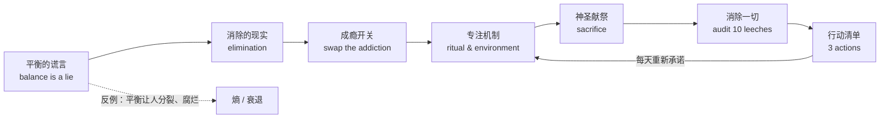
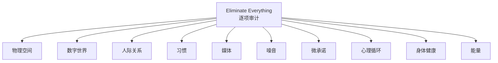

## 一句话理解

"专注力 = 消除一切不服务于使命的东西 + 把多巴胺瘾从刺激迁到产出 + 用仪式与环境让大脑自动进入深度状态。"

## 概念地图

## 平衡的谎言

{{frame:1}}

视频把"平衡"重新定义为逃避全情投入的体面说法：它让你既当工作者又当朋友、伴侣、梦想家，直到灵魂被拆散、忘记自己在为什么而战。作者的解药是"允许自己偏执"——为北极星（north star）建立围墙，不是把世界挡在外面，而是把自己关在里面，防止自己逃离。

## 消除的现实

{{frame:3}}

专注不是"少做一点"，而是"永远不再做某些事"：不跟旧习惯讨价还价，而是直接烧掉枯木。作者建议从物理空间开始，每月做一次"消除仪式"，并忍受戒断期的不适——那种痒和恐慌恰恰证明方向正确。

## 成瘾开关：多巴胺迁移

{{frame:6}}

这是全片最反直觉的点：你并不是在"戒瘾"，而是在更换供应商。把手机、零食、Netflix 等短效刺激拿走后，大脑对多巴胺的渴求不会消失，只会转向唯一剩下的来源——工作。于是"你既是庄家也是瘾君子，毒品是你自己的产出"，最终完成一件事本身变成快感来源。

> 备注（非视频内容）：视频称这是"基础化学"，把复杂的神经机制简化为多巴胺；这是作者的高度简化表述。科学研究支持多巴胺参与动机与奖赏，但不支持"成瘾只是多巴胺互换"这种说法。

## 专注机制：仪式、顺序与环境

{{frame:7}}

- 仪式（ritual）不是例行公事而是"驱魔"：同样的杯子、本子、关门动作、固定音乐，让大脑学会"仪式开始=其他一切都死掉"。
- 顺序：每天把最难的事放在最前面；第一个深度块（约 30–45 分钟后）会进入"脑中杂音消失"的状态。
- 环境：承认意志力被高估——删除捷径、把手机留在家里、去图书馆或空房间，给旧自己设陷阱，让分心比行动更难。
- 审计：像运动员对待表现一样记录自己的注意力数据，定期纠偏。

## 神圣献祭

成长是孤独的，代价是放手。作者给出的心理框架：把"失去"仪式化——说出你在放下什么、感谢它把你带到这里、然后关门。恐惧被重新定义为野心的税与进步的证据："如果你没有感到恐惧，说明你赌得不够大。"

## 消除一切：十个隐性吸血鬼

{{frame:9}}

{{frame:10}}

每类泄漏点都对应具体操作：物理空间（每个物品都是习惯触发器）、数字世界（通知是老虎机拉杆）、人际（不齐心的亲友是脚踝上的重负）、习惯（垃圾食物=垃圾大脑，睡眠优先）、媒体（99% 是噪音）、噪音（沉默让工作复利）、微承诺（每个"maybe"都是别人塞给你的优先级）、心理循环（早晨把脑子倒到纸上）、身体健康（身体是意志力的载体）、能量（记录什么让你清醒、什么让你宿醉）。

## 阅读提醒

- 视频大量使用绝对化断言（"平衡是谎言""99% 的媒体是噪音"），属于修辞而非可验证事实。
- 唯一可验证的引用（塞涅卡名句）经核查归属存疑，详见总结中的事实核查说明。
- 若目标是可持续的"12 小时专注"，可结合 Cal Newport《深度工作》的温和框架使用（外部补充，非视频内容）。
