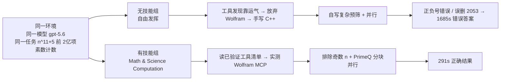
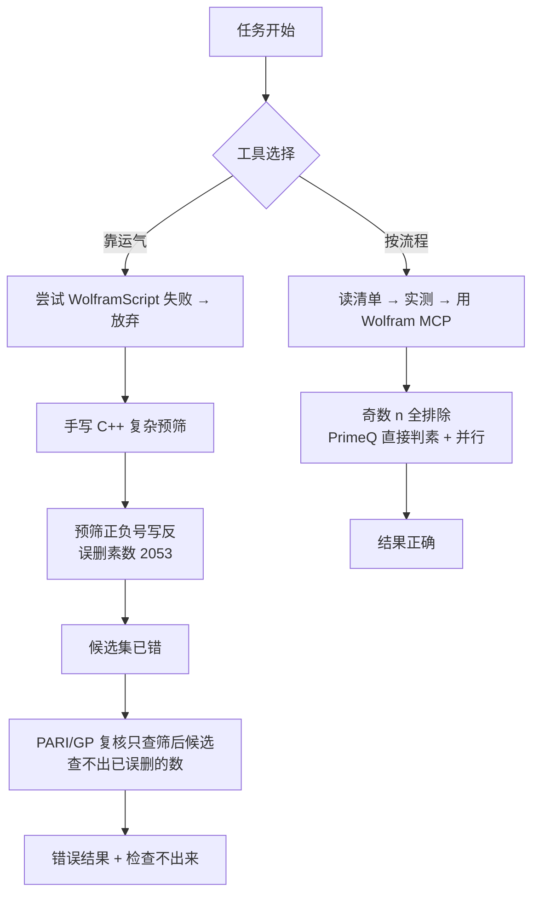

## 一句话理解

"通用模型像一位知识渊博但没有固定流程的实习生：你给不给它一套'已验证工具 + 明确流程 + 少写复杂代码'的封装，决定了它交付的是稳定正确的结果，还是一次靠运气的赌博。"

## 对照实验长什么样

## 两条分叉与错误放大

{{frame:7}}

核心教训：**链式任务中，早期错误会进入后续每一步的上下文并被放大；自我检查只能发现'检查对象内'的错误，所以必须把关键步骤也纳入验证（如先验证筛选器本身）。**

## 封装：PrimeQ vs 手写筛

{{frame:8}}

- `PrimeQ` 是 Mathematica 内置的素性判定函数，内部会根据整数类型选择高效的判定策略——这就是"成熟封装"。
- 无技能组不用 PrimeQ，就得自己写"预筛 + probable-prime + 证明型复核"一整套逻辑：整数表示、筛分条件、符号、并行分片、汇总，每一步都是出错点。
- 类比：手算"二次函数"时，把"判别式 Δ = b²−4ac"和"配方"当作两步封装，千锤百炼后几乎不会错；把每一步都展开算，错误率立刻上升。

{{frame:5}}

## 什么是"检查对了对象"

无技能组的复核流程是"对筛选后留下的候选做严格素性证明"。问题在于：**被误删的素数根本不在候选集里**。验证流程本身没有 bug，验证的对象错了——所以它"认认真真地证明了一个错误集合的性质"。

## 个人 benchmark：把改造落地

{{frame:10}}

作者的建议是把"能不能做"的讨论，换成"效率高不高、成本低不低、可不可靠（运行 1000 次错几次）"的度量，再用真实失败案例持续调优你的 AI 工作系统。

## 阅读提醒

- 这是作者单次对照实验（n=1），样本量小，291s/1685s 的具体数字仅代表该次运行。
- 视频把"通用模型不可靠"归因于缺少流程与封装，这是作者经验性论点，不是对所有场景的普适结论。
- 数学部分（奇数排除、10^88 量级、2053 为素数）已独立核实。
