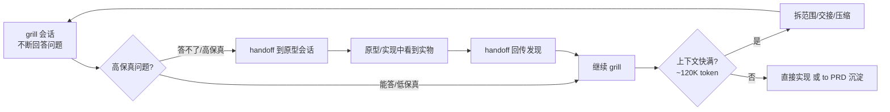
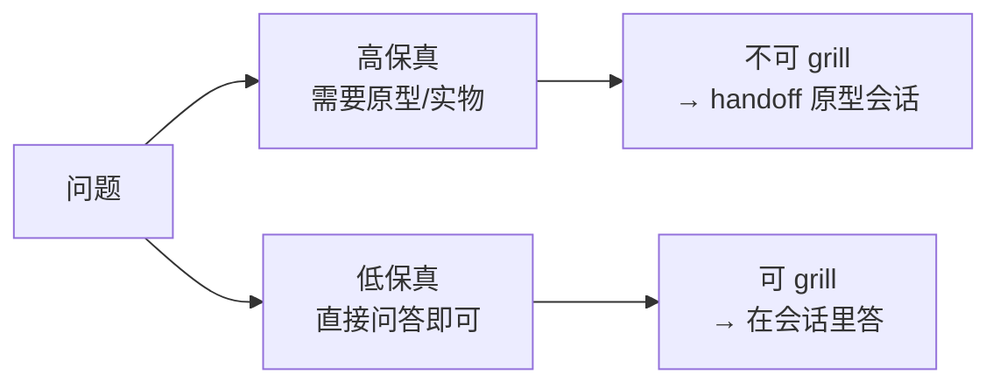
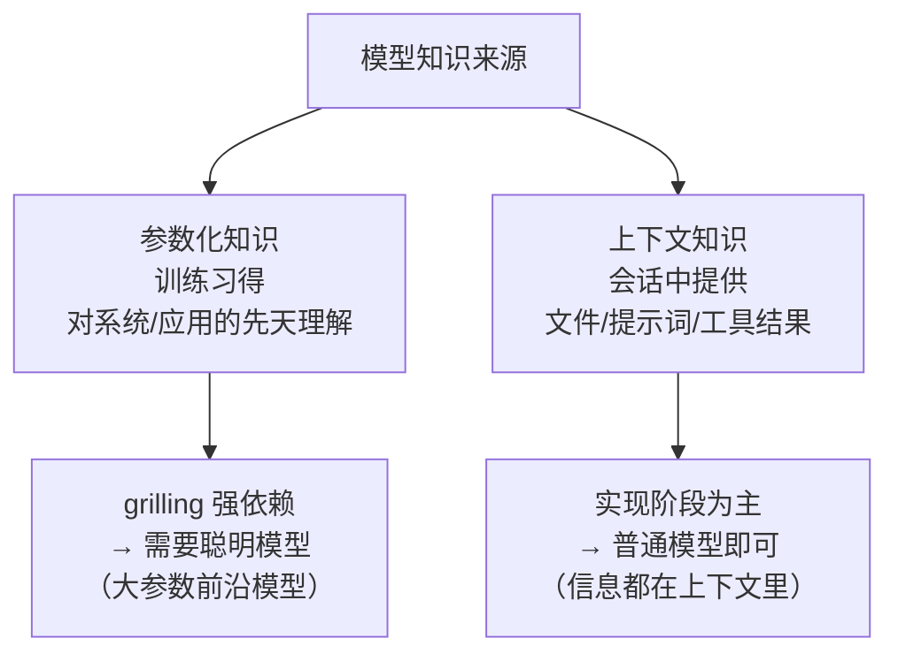

## 一句话理解

"追问式规划（grilling）本质是把'我该怎么设计'拆成一个个问题，由你决定哪些直接答、哪些做原型、哪些跳过——而模型的聪明程度决定问题质量，你的规划能力决定最终架构。"

## 核心工作流：grill → handoff → 原型 → 回传

{{frame:2}}

## 保真度：哪些问题该在会话里答

{{frame:5}}

- 高保真的典型例子："这个 UI 用起来什么感觉？""表单拆成多页还是一页？"——看不到东西就答不准。
- 低保真的典型例子："路由放哪个 URL？"——回答即可。
- 误区：拿高保真问题在纯问答里硬答，或反过来在低保真问题上反复纠结不写代码。

## 主动 vs 被动：对话，不是采访

{{frame:7}} {{frame:9}}

- 太被动：agent 会问 540 个问题、无限扩范围、问一堆低保真问题——因为它在"采访"你，而不是等你的方向。
- 太主动：死磕低保真问题，迟迟不进入代码，规划成了拖延。
- 平衡点：由你定方向、范围、节奏；保真度不够就去做原型，保真度够了就尽快实现。

## 参数化知识 vs 上下文知识：为什么追问要用聪明模型

{{frame:8}}

追问的价值在于模型用"训练里见过的无数系统和模式"给你出主意、指出你没考虑过的方向；这种能力来自参数化知识，规模越大通常越可靠。实现阶段模型主要是"照上下文抄"，所以可以用更便宜的模型。

## 变笨区（作者估计，非精确事实）

视频估计当前主流模型大约在上下文 12 万 token 之后进入"变笨区"——注意力关系变得吃力，决策质量下降。所以：范围拆小、盯紧上下文、及时交接/压缩。这是 Matt Pocock 的经验估计，并非精确指标。

## 阅读提醒

- 标题说 9 个误区，视频正文以"四个视角 + 若干坑"的方式展开，笔记已按内容归纳，未逐条对上数字。
- "约 12 万 token 变笨"是作者估计；不同模型实际表现差异很大。
- 促销信息（6 月 1 日开营、30% 折扣倒计时）已过期，仅作为视频背景，不做行动依据。
