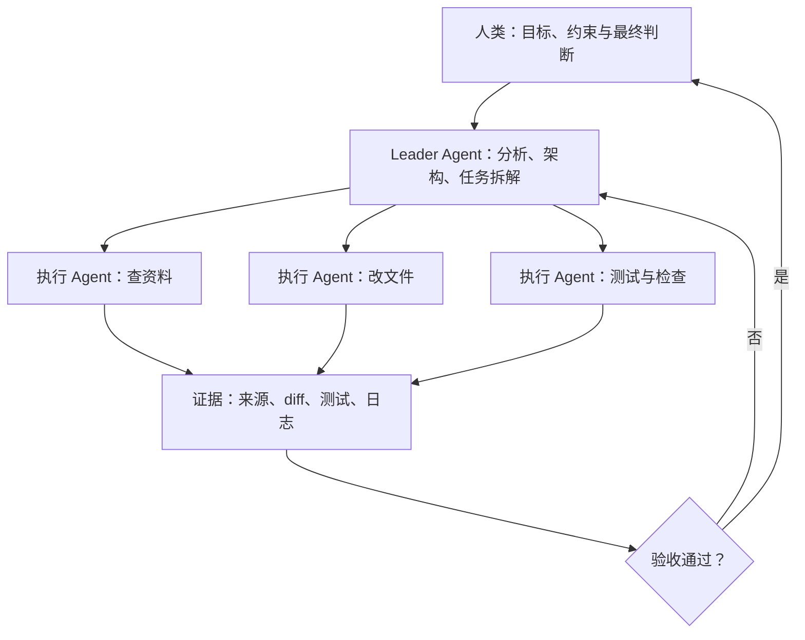

# 总结稿

视频分享了作者在 2026 年中期形成的一套 Agent 工作流。核心变化不是让 AI 多写代码，而是把原本依赖个人记忆、临场判断且难以恢复的做事方式，改造成显式、可检查、可回滚的工程系统。

第一层是模型分工。作者不再让一个模型包办所有工作，而是把自己更信任、交互体验更好的模型当作 Leader，负责项目分析、架构设计和任务编排，再将改文件、查资料等执行工作交给成本较低的 sub-agent。这种“强 Leader + 多执行 Agent”的效果与成本优势是作者的个人经验，并非经统一基准验证的普遍结论；视频中的模型排名、降智和幻觉评价也都依赖特定时间、任务与版本。

第二层是 Agent 友好的环境设计。作者借“八荣八耻”强调查阅而非暗猜、确认而非模糊执行、复用而非重复创造、测试而非跳过验证。人类调度者也要承担责任：不能凭臆想替 Agent 下结论；Agent 反复犯错时，应改进 AGENTS.md、补充小工具或把踩坑沉淀成短而新的笔记；不要把长期未维护的 CLAUDE.md 一股脑塞进上下文。Agent 友好不是无限增加提示，而是减少隐式状态和不可逆操作。

Jujutsu（jj）是作者采用的具体例子。它会自动快照工作区，并通过 Change ID、operation log、undo、revert 和 restore 提供较强的追踪与恢复能力。官方文档支持这些核心机制，但视频对 Git 与 jj 的比较是高度简化的个人工作流说明；远端发布或外部系统副作用仍可能无法自动撤销。

第三层是少而有用的 Skill。作者认为 Skill 应补足领域盲区、解决个人痛点或模板化高频流程。每天使用的 `grilling` 会围绕计划逐项追问，一次只问一个问题；能从代码库或环境查明的事实就主动查询，把人的注意力留给真正需要决策的地方。其目标不是拖慢执行，而是在动手前暴露隐藏依赖、架构约束和边界条件，把“未知的未知”尽可能转成显式问题。原始 Skill 文件确认了这些规则。

最后是语音输入。作者用它快速捕获自然思考，再让模型容忍少量转写错误。这是个人效率选择，而不是 Agent 工程的必要条件。整套方法可以概括为：分层调度、主动核验、改造环境、控制上下文、逐问澄清，并用可回滚工具承接执行。

# 辅助理解

## 一套以“可回滚”为中心的 Agent 工作流

视频的主线不是模型排行榜，而是工作流的重构：把人脑中的隐式经验转换成 Agent 能理解、能检查、失败后能恢复的系统。作者采用“Leader + sub-agent”分层结构：Leader 负责分析、架构和任务编排，多个执行 Agent 承担查资料、改文件等具体工作。

*图：作者设想的分层 Agent 编排。画面是工作流示意，不是产品的真实调度记录，也不能单独证明效果等价或成本更低。*

这里最重要的不是固定使用哪款模型，而是把职责、证据与回退路径显式化。作者关于 Fable 5、GPT-5.5 和 Opus 4.8 的优劣判断来自个人任务和当时版本，没有可复现题集，不能当作通用基准。

## 人与 Agent 都要遵守的协作纪律

视频引用的“Agent 八荣八耻”把可靠执行拆成可操作的对照：查阅而非暗猜、确认而非含糊、复用而非重复创造、测试而非跳过验证、遵循架构而非随意破坏、诚实表达未知而非假装理解。

*图：视频列出的 Agent 协作自检原则。它是一组规范性建议，并非软件自动执行的安全策略。*

作者进一步把责任拉回人类调度者：不要用“人类幻觉”替代调查；Agent 出错时，先问环境是否缺少清晰指令或顺手工具；上下文膨胀时，把经验压缩成短、准、新的说明，而不是长期堆积旧文档。

*图：人类侧的三项提醒——主动查证、改善 Agent 友好度、控制上下文膨胀。具体文档和工具仍需按项目设计。*

可以用一个简单自检表落实：

1. **事实能否直接查？** 能查代码库、文档或运行结果，就不要让人或 Agent 猜。
2. **决策权属于谁？** 架构取舍、风险接受和产品方向由人确认。
3. **失败是否可定位？** 每个任务要有明确输入、输出和验收证据。
4. **错误是否可恢复？** 文件修改、版本状态和外部副作用都应预设回退方式。
5. **经验是否仍有效？** 指令应短小、可维护，并标明时间与适用边界。

## Jujutsu：用可恢复状态降低协作风险

作者偏爱 Jujutsu（jj），因为它减少了对暂存区等隐式状态的依赖，并强化了操作追踪。官方文档确认：多数 `jj` 命令会自动快照工作区；operation log 记录修改仓库的操作，可逐步 `undo`、撤销指定操作或恢复旧状态；同一 change 的历史版本也可通过 Change ID 和 evolog 追踪。

*图：作者对 Git 与 Jujutsu 的简化对比。可见的 `jj new`、`jj undo`、`jj op log` 体现其个人用法，不是完整迁移指南。*

因此，“可回滚”应理解为降低仓库内错误的恢复成本，而非保证任何操作都无害。已经推送到外部服务、发出的消息、删除的云资源等副作用仍需单独的权限和补偿机制。

## 用 grilling 把未知变成问题

作者每天使用的 `grilling` 是一种逐问式澄清协议：沿计划的决策树逐个追问，每次只问一个问题；环境中可以查明的事实由 Agent 自己查，真正的决策再交给用户。这些规则可由 Matt Pocock 的原始 `SKILL.md` 直接确认。

*图：逐问式需求澄清示例。Postgres、行级权限和 JWT 只是画面中的示例建议，不能脱离具体项目照搬。*

这种方式的价值在于暴露隐藏依赖、边界条件和架构冲突，尤其是最容易被忽略的“未知的未知”。它可能花十分钟，也可能持续数小时；适合高歧义、高风险任务，不必机械套到每个小修改上。

语音输入只是作者降低输入摩擦的手段。Karpathy 的早期 vibe coding 叙述确实包含通过语音转写与工具交互的内容，但这只说明一种个人用法；“比打字快”“不打断心流”“模型能自动容忍转写错误”仍属于情境化体验。

## 外部事实核验（2026-07-29）

- **确认｜00:27 项目规模。** [Nagi-ovo/voyager](https://github.com/Nagi-ovo/voyager) 在核验时为 19,288 Star；数字会继续变化。
- **部分确认｜00:42 贡献者排序。** [贡献者页面](https://github.com/Nagi-ovo/voyager/graphs/contributors)能确认作者以及 codex、claude、Jules 等账号的贡献，但当前排序与视频的信息图不完全一致，且受时间点和归因口径影响。
- **未验证｜01:08 模型排名与质量波动。** 没有可复现题集、评分规则和模型快照，只能视为作者体验。
- **未验证｜01:36 分层调度“几乎同效且更省”。** 可作为实践假设，实际收益取决于任务、上下文传递、价格与重试成本。
- **确认｜03:02 Jujutsu 可恢复机制。** [Operation log](https://docs.jj-vcs.dev/latest/operation-log/)与 [Working copy](https://docs.jj-vcs.dev/latest/working-copy/)支持自动快照、操作日志和恢复能力；外部副作用不在保证范围内。
- **确认｜03:57 grilling 规则。** [原始 Skill](https://github.com/mattpocock/skills/blob/main/skills/productivity/grilling/SKILL.md)明确要求一次一问、主动查事实、决策留给用户。
- **部分确认｜05:18 语音与 vibe coding。** 视频引用的原帖截图包含 SuperWhisper，但当前环境无法直接读取 X 原帖全文，因此保留归因边界。

# Data

## 增强转写稿

[00:00] 2026 年过得真快。年初我还在被 AntiGravity 里的 Opus 4.5 和 Gemini 3 折磨。
[00:12] 如今已经苦尽甘来，高强度用着 Claude Code 配 Fable 5，Codex 配 GPT-5.5。
[00:19] 对 AI 的认识可以说是翻天覆地。先说说我平时都拿 Agent 干什么。
[00:27] 除了日常的科研学习，我还凭兴趣维护一个开源项目 Gemini Voyager，19,000 多 Star。
[00:35] 它就是我实践 Agent 协作的地方。看它的贡献者阵容你就懂了。
[00:42] 第一贡献者是我，第二是 Claude，第三是 Codex，后面还跟着 Gemini。
[00:49] 这期视频就聊聊我是怎么指挥它们的。
[00:54] 先看现状。断更了两个月的社群飞书文档，现在可以更新一下了。
[01:00] 综合、[听不清]、Agent 的交互、信息查找，四个维度我都重新调研了一遍。
[01:08] 结果，Fable 5 一个人就包揽了三个维度的第一。Fable 5 目前是断档地强，回来了，都回来了。
[01:18] 前段时间 GPT-5.5 降智，Opus 4.8 幻觉严重，我睡前的皮质醇直接爆表。
[01:27] 换回 Fable 之后，整个人才回到那种特别舒服的状态。不过现在每周只能花一半额度在 Fable 身上。
[01:36] 于是我把它当成核心 Leader，做项目分析、架构设计、任务编排。
[01:43] 改文件、查资料这些实活，自动发给若干 GPT-5.5 sub-agent 去做。
[01:50] 几乎一样的效果，额度开销却低得多。Fable 也在用类似的思路。
[01:59] 我越来越觉得 Agent 时代真正重要的，不是让 AI 替我多写几行代码，而是重新审视那些习以为常的工作流。
[02:10] 有人把它总结成了 Agent 的“八荣八耻”。
[02:14] 那作为调度者，我们也该有自己的荣辱。
[02:18] 以人类幻觉为耻，以动手核实为荣。别拿豆包式的臆想当方案，跳过动手查证。
[02:27] 以傲慢自大为耻，以 Agent 友好为荣。
[02:31] 它做错了，先别急着说“就这”。想想是加条 AGENTS.md，还是给它写个小工具。
[02:41] 以上下文膨胀为耻，以简化操作为荣。把踩坑提炼成一份笔记，别把三个月没更新的 CLAUDE.md 硬塞给它。
[02:49] 再插一句，写项目我现在更爱用 Jujutsu，也就是 jj，而不是 Git。
[02:55] 提交只要一行 jj，Agent 不用再处理 add、commit、push 这一整套。
[03:02] 而架构安全和 operation log，让 Agent 搞砸了不再吓人，只是一次可回滚的普通操作。
[03:11] 说到底，所谓 Agent 友好，就是把人脑里隐式的、不可恢复的流程，改造成显式的、可回滚的工程系统。
[03:24] 我的核心观点是：skill 不在多，有用才行。
[03:29] 那些改变人生的神级 skill，很可能早就在你上下文里吃灰，又肥又重，又脱离模型。
[03:37] 能补你不懂的领域知识，比如设计之于程序员；
[03:42] 能解决你生活里的痛点，比如给 Windows 总结 PowerShell；
[03:48] 能把你高频的流程模板化，比如读论文、传文件、发邮件。还有一个我每天必用的 prompt，叫 grilling。
[03:57] 它会就我计划的每个方面不断追问，一次只问一个，直到我们达成共识。
[04:04] 能靠查代码库回答的，它就直接去查。
[04:08] 这早就内化成习惯了。我直接用语音，说出这次想怎么被它“烤”。
[04:14] 可以把认知拆成四个象限：已知的未知是 grill 的主场。
[04:23] 它把你想不清的地方一层层问出来，而最值钱的是未知的未知。
[04:30] 顺着依赖、架构、边界条件，帮你发现压根没想到的问题。
[04:36] 其实这套认知我早就潜移默化地在用了。
[04:40] 直到看到那篇文章，才把我脑子里隐性的想法清清楚楚地摆了出来。那感觉简直了。
[04:48] grill 一次，短则十分钟，长则几个小时。
[04:53] 但都值得。从 vibe coding 到 agentic engineering，也许就差这一个思维模式。
[05:03] 最后聊聊语音输入。一句话：不用固定在键盘前，能快速抓住当时的想法。
[05:10] 给模型的输入更接近真实的自然思考，速度远快于打字，还不打断心流。
[05:18] 考古一下，[疑似 Karpathy] 当初提 vibe coding 时，顺便就提了语音输入。
[05:24] 现在的模型已经内化了对语音识别错误的容忍。
[05:28] 就算转错几个词，它也会想，你可能把 Claude 写成 cloud，然后按对的理解。
[05:36] 我体验下来效果最好的还是[语音输入工具名听不清]，为此还专门买了个麦克风。
[05:41] 你也可以试试豆包、微信输入法、闪电说，不是非得花这个钱。
[05:47] 觉得语音输入尴尬是你自己的事，自己用着舒服就好。
[05:53] 2026 下半场，继续把隐式的经验变成可回滚的系统。

## 术语表

- **Claude Code / CC**：视频中的主调度 Agent；原始转写多次误作 “Cloud Code” 或 “Cloud”。
- **Codex exec**：视频简介明确提到由 CC 通过它调度较便宜的 GPT-5.5；本段口语转写中主要表现为 Codex 与 GPT-5.5 sub-agent。
- **Fable 5、GPT-5.5、Opus 4.8**：按视频原话保留型号，不对其正式产品名或版本真实性作推断。
- **sub-agent**：接受核心 Agent 分派的改文件、查资料等执行任务。
- **AGENTS.md / CLAUDE.md**：项目中的 Agent 指令文件；前者由语境校正，后者由 “Cloud.MD” 校正。
- **Jujutsu / jj**：视频中与 Git 对比的版本控制工具及其命令名。
- **skill / prompt**：可复用的领域能力与提示流程。
- **grilling / grill**：逐个追问计划、暴露未知依赖和边界条件的工作方式；名称与视频简介所引 skill 链接一致。

## 原始转写稿

[00:00] 2026年过得真快,年初我还在被AntiGravity里的Opus 4.5和Gemini3折磨。
[00:12] 如今已经偷看自由,高强度用着Cloud Code配Fable 5, Codex配GBT 5.5。
[00:19] 对AI的认识可以说是翻天覆地,先说说我平时都拿Agent干什么。
[00:27] 除了日常的科研学习,我还凭兴趣维护一个开源项目,Gemini Voyager,19000多star。
[00:35] 它就是我实践Agent协作的地方,看它的贡献者阵容你就懂了。
[00:42] 第一贡献者是我,第二是Cloud,第三是Codex,后面还跟着Gemini。
[00:49] 这期视频就聊聊我是怎么指挥他们的。
[00:54] 先看现状,断根了两个月的社群飞输文档,现在可以更新一下喽。
[01:00] 综合,皮质纯友好,Agent的交互,信息查找,四个维度我都重新讨了一遍。
[01:08] 结果,Fable 5一个人就包来了三个维度的第一,Fable 5目前是断档的强,回来了都回来了。
[01:18] 前段时间GPT5.5降质,Opus 4.8幻觉严重,我睡前的皮质纯直接爆表。
[01:27] 换回Fable之后,整个人才回到那种特别舒服的状态,不过现在每周只能花一半额度在Fable身上。
[01:36] 于是我把它当成核心Leader,做项目分析,架构设计,任务编排。
[01:43] 改文件、查资料这些实伙,自动发给若干的GPT5.5 sub-agent去做。
[01:50] 几乎一样的效果,额度开销却低得多,File也在用类似的思路。
[01:59] 我越来越觉得Agent时代真正重要的,不是让AIT我多些几行代码,而是重新审视那些习以为常的工作流。
[02:10] 有人把它总结成了Agent的八戎八尺。
[02:14] 那作为调度者,我们也该有自己的容许。
[02:18] 以人类幻觉为尺,以动手疏手为容,别拿豆包式的意想当方案,跳过了动手查证。
[02:27] 以傲慢次大为尺,以Agent友好为容。
[02:31] 他做错了,先别急着说,就这,想想是加条Agent's MB,还是给他写个小功绩。
[02:41] 以上下文膨胀为尺,以简化操作为容,把彩坑提炼成一份笔记,别把三个月没更新的Cloud.MD硬塞解它。
[02:49] 再插一句,写项目我现在更爱用GiGiuzu,也就是GiGi,而不是Git。
[02:55] 提交,只要一行GiGiu,Agent不用再处理AddCommitPushG整转。
[03:02] 而架架安度和Oplog,让Agent搞砸了,不再吓人,只是一次可回滚的普通操作。
[03:11] 说到底,所谓Agent友好,就是把人脑里影视的,不可恢复的流程,改造成显示的,可回滚的工程系统。
[03:24] 我的核心观点是,skill不再多,有用才新。
[03:29] 那些改变人生的神级skill,很可能早就在你上下文理机会,又废偷肯,又脱离模型,
[03:37] 能补你不懂的领域知识,比如设计至于程序员,
[03:42] 能解决你生活里的痛点,比如给Windows总结PowerShell,
[03:48] 能把你高频的流程模板化,比如读论文转件发板,还有一个我每天必用的prompt,叫Griomi。
[03:57] 它会就我计划的每个方面不间断追问,一次只问一个,直到我们达成共识。
[04:04] 能靠查代码库回答的,它就直接去查。
[04:08] 这早就内化成习惯了,我直接用语音,说出这次想怎么被它烤的。
[04:14] 可以把认知拆成四个相写,一知的未知是quail的主场,
[04:23] 它把你想不清的地方一层层问出来,而最值钱的是未知的未知。
[04:30] 认着依赖、架构、边界条件,帮你发现压杆没想到的问题。
[04:36] 其实这套认知我早就前一幕化在用了。
[04:40] 直到看到那篇文章,才把我脑子里隐性的想法清清楚楚的摆了出来,那感觉简直嘛。
[04:48] grill一次,短则十分钟,长则几个小时。
[04:53] 但都值得从videcoding到agentic engineering,也许就差这一个思维模式。
[05:03] 最后聊聊语音输入,一句话,不用固定在键盘前能快速扎住当时的想法。
[05:10] 给模型的输入更接近真实的自然思考,速度远快已打字,还不打断心流。
[05:18] 考古一下,coppercy当初提videcoding,身边就提了语音输入。
[05:24] 现在的模型已经内化了对语音识别错误的如人。
[05:28] 就算转错几个词,它也会想,你可能把cloud写成cloud,然后按对的理解。
[05:36] 我体验下来效果最好的还是types,为此还专门买了个麦克风。
[05:41] 你也可以试试豆包、微信输入法、闪电说,不是非得花这个钱。
[05:47] 觉得语音输入尴尬是你自己的事,自己用着舒服就好。
[05:53] 2026下半场,继续把影视的经验,变成可回滚的系统。

## 原始关键帧

### 关键帧 1

### 关键帧 2

### 关键帧 3

### 关键帧 4

### 关键帧 5

### 关键帧 6

### 关键帧 7

### 关键帧 8

### 关键帧 9

### 关键帧 10

