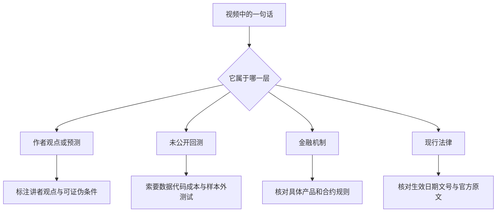
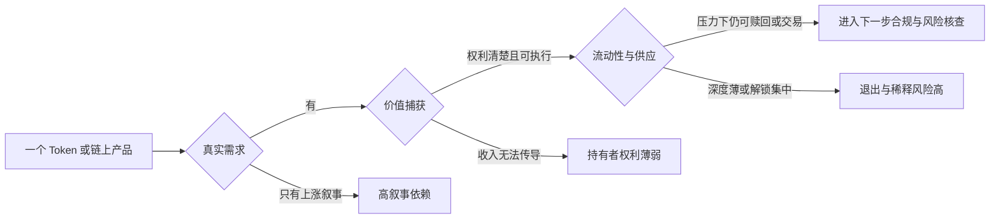
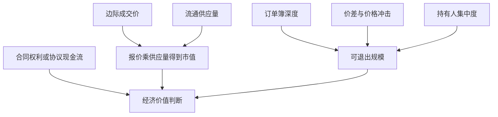
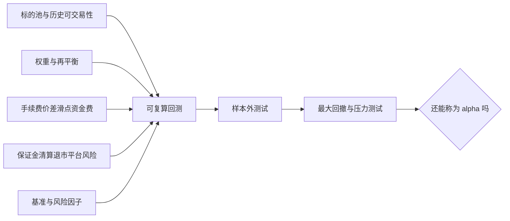
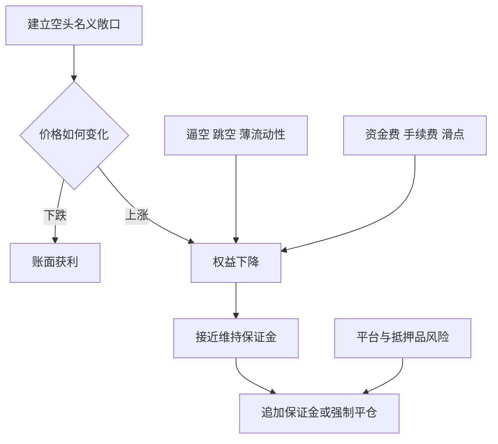
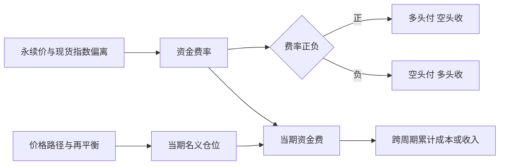
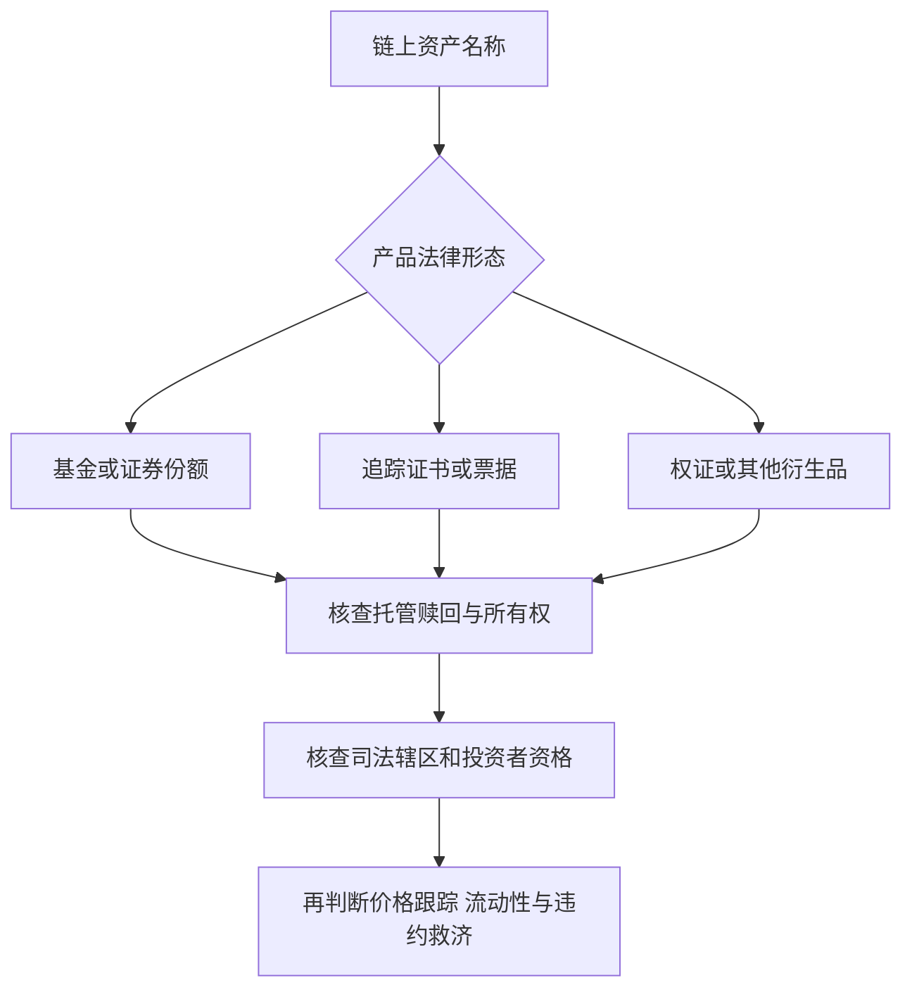
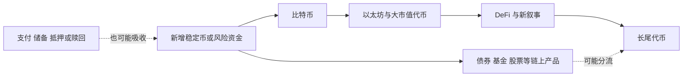
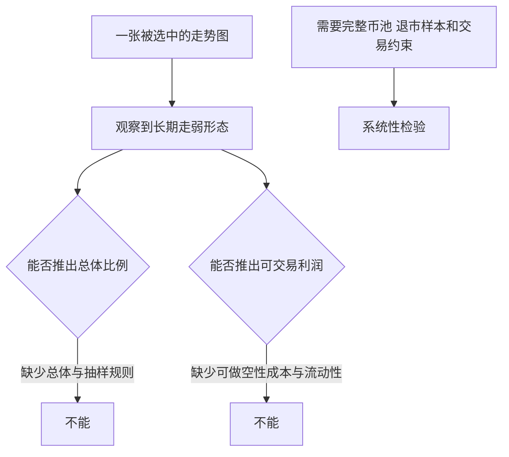
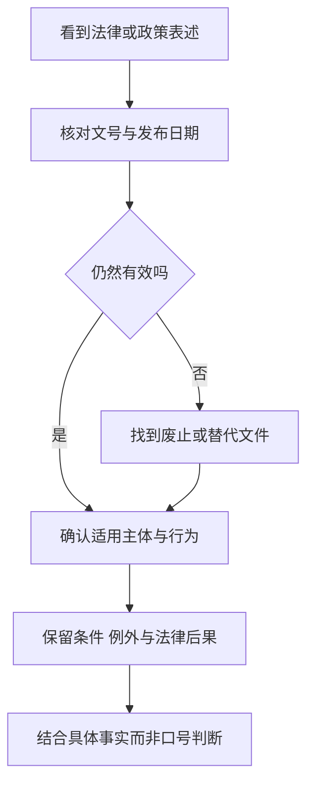

# 总结稿

[打开单页 HTML 总结](assets/bilibili-BV1iv8j6EEMP-summary.html)

## 核心结论

视频提出一套强烈的看空叙事：大量长尾山寨币缺少可验证的持有需求、价值传导与持续流动性；当稳定币可以转向债券、基金、股票等链上现实资产时，纯叙事代币对资金的吸引力可能下降。这个框架值得用来提出问题，但视频进一步给出的“99%都是垃圾”“山寨币末日必然到来”仍是**作者观点和预测**，不是有清晰总体、判据与数据集支持的统计结论。[00:06–00:36] [CFTC 对 ICO 失败与欺诈估计的谨慎表述](https://www.cftc.gov/LearnAndProtect/AdvisoriesAndArticles/caution_of_digital_currencies.html)

最重要的阅读方法不是接受或反驳结论，而是把内容严格分成四层：

| 层级    | 视频内容                            | 可采用程度                              |
| ----- | ------------------------------- | ---------------------------------- |
| 作者观点  | “99%”“山寨币末日”“赌场时代结束”            | 只能归因于讲者，不能当统计或预测事实                 |
| 未公开回测 | 0.5 倍杠杆、等权分散空头、横盘获 alpha、资金费可忽略 | 缺少数据、代码、成本、样本外测试与最大回撤，无法复算         |
| 金融机制  | 市值、流动性、杠杆、资金费、RWA 权利结构          | 部分可由官方材料核验，但必须保留产品与合约差异            |
| 现行法律  | 中国大陆虚拟货币与 RWA 规则                | 必须以当前官方文件为准，不能用“个人交易合法”或“完全不受保护”概括 |

> 本文只做内容整理与风险核验，不构成投资建议或法律意见，也不提供币种、平台、仓位、杠杆、入金或交易执行建议。

## 论证主线

1. **长尾代币的价值问题**：视频认为，很多代币价格主要依赖叙事、成交和后续买盘，缺少协议收入如何传导给持有人的可验证机制。[01:25–01:39]
2. **市值不等于可兑现财富**：流通供应量乘边际成交价得到市值，但薄订单簿无法保证所有持有人按该价格退出。这个提醒成立；不过市值仍是规模指标，不能说它“完全没有信息”。[03:20–03:53] [Investor.gov 的市值定义](https://www.investor.gov/introduction-investing/investing-basics/glossary/market-capitalization)
3. **RWA 形成替代选择**：视频认为，稳定币资金以后可以进入链上债券、基金、股票或商品敞口，不必继续沿风险阶梯流向山寨币。[03:08–05:30] 现实中确有代币化投资产品，但它们可能是基金份额、票据、权证、追踪证书或合成敞口，并不自动等于底层资产所有权。[香港证监会代币化产品通函](https://apps.sfc.hk/edistributionWeb/gateway/EN/circular/doc?refNo=26EC22)
4. **筛选门槛提高**：视频后半段承认并非每个 Token 都归零，更值得检查的是实际使用需求、价值捕获、稀释承担者和压力环境下的流动性。[05:31–06:40]
5. **交易平台激励与杠杆**：视频用“100 倍等于出 1 借 99”解释名义敞口和手续费。它只是直觉模型：期货或永续合约未必发生逐笔借款，维持保证金、标记价格、资金费和清算都取决于具体规则。[07:15–07:35] [CFTC：杠杆会放大虚拟货币合约损益](https://www.cftc.gov/LearnAndProtect/AdvisoriesAndArticles/understand_risks_of_virtual_currency.html)

## 回测与做空主张：目前不能复算

视频正文建议把山寨币组成等权组合、使用较厚保证金整体做空，并说“一定”能获得不错收益；简介又补充“0.5 倍杠杆”“横盘获得 alpha”和“资金费率影响可忽略”。[01:43–02:07]

这些说法没有公开以下最低复核材料：

- 标的池、历史纳入日期、退市和当时不可做空样本；
- 权重、再平衡、抵押品、清算和平台故障处理；
- 手续费、价差、滑点、资金费、借贷和市场冲击；
- 基准、风险因子、最大回撤、压力测试与样本外表现。

因此，不能把一段未公开回测写成已验证 alpha，更不能重复“保证盈利”。官方风险材料明确指出不存在保证盈利的交易策略，杠杆会放大损失；空头还面对价格上涨、逼空、流动性和强平等尾部风险。[CFTC 虚拟货币交易风险提示](https://www.cftc.gov/LearnAndProtect/AdvisoriesAndArticles/understand_risks_of_virtual_currency.html) [Investor.gov 做空风险说明](https://www.investor.gov/introduction-investing/general-resources/news-alerts/alerts-bulletins/investor-bulletins-51)

“币价下跌后名义价值变小”也不足以证明资金费可忽略。永续合约资金费可正可负；在负资金费时空头可能向多头付款，而且费用会按结算周期累积。[Coinbase 官方资金费说明](https://help.coinbase.com/en/coinbase/derivatives/funding-rate)

## RWA 与“小米股票上链”的准确边界

截至 2026-08-20，存在小米相关链上产品，但“上链”不能简化成“直接拥有小米股票”：

- Backed Assets 的 Xiaomi xStock（XIAOx）是跟踪小米 1810 股价的链上**追踪证书**，仅面向符合资格且不在受限司法辖区的投资者；发行与赎回有自己的费用、托管和条款。[XIAOx 官方产品页](https://assets.backed.fi/products/xiaomi-xstock)
- UBS 于 2024 年发行过以小米股票为标的的以太坊**代币化认购权证**，当时售予 OSL；它是结构化衍生品，不是开放给所有人的小米现货股票。[UBS 官方公告](https://www.ubs.com/global/it/media/display-page-ndp/en-20240207-tokenized-warrant.html)

核查任何 RWA 时应分开看：发行人、底层权利、托管、赎回、预言机、交易场所、投资者资格、司法辖区与违约救济。“有真实资产名称”不等于本金安全、足够流动、可在任何地区合法购买或拥有底层资产法律所有权。

## 中国大陆现行法律边界

视频简介主要沿用银发〔2021〕237 号的表述，但该通知已于 **2026-02-06** 被银发〔2026〕42 号同时废止。综合稿必须引用现行通知，而不是把旧文件继续写成当前有效规则。[银发〔2021〕237 号原文](https://www.pbc.gov.cn/tiaofasi/144941/3581332/4348658/index.html) [现行银发〔2026〕42 号官方文本](https://www.csrc.gov.cn/csrc/c100028/c7614318/content.shtml)

现行规则的准确读法是：

- 境内法币与虚拟货币兑换、币币兑换、中央对手方买卖、信息中介与定价、代币发行融资、虚拟货币相关金融产品交易等，并非只限于“开交易所”，均在通知列明的禁止范围内。
- 境外单位和个人不得以任何形式**非法向境内主体**提供虚拟货币相关服务；不能据此宣称境外平台可正常面向大陆居民经营。
- 对个人投资，通知写的是：投资虚拟货币、RWA 代币及相关金融产品**违背公序良俗的**，相关民事法律行为无效、损失自行承担；涉嫌破坏金融秩序或金融安全的依法查处。不能删掉条件后说“所有个人交易自动无效”，也不能反向说“个人交易合法、没人管”。
- “法律完全不保护财产”同样过度。合同效力、返还、补偿和责任要结合交易结构、时间与具体请求判断。[最高人民法院法答网精选答问](https://www.court.gov.cn/zixun/xiangqing/426912.html)
- 境内代币发行融资在现行通知中属于被严格禁止和取缔的相关非法金融活动；面向不特定对象吸收资金并承诺回报，还可能触及非法集资规则。保证高收益是重大欺诈和非法集资红旗，但具体法律责任仍需结合宣传、对象、资金用途、主观故意和金额判断。[《防范和处置非法集资条例》](https://xzfg.moj.gov.cn/front/law/detail?LawID=675)

## 可迁移的项目核查框架

与其问“这个币会不会涨”，不如先问：

1. **真实需求**：谁必须持有？需求来自使用、抵押、结算，还是只来自上涨预期？
2. **价值捕获**：协议收入、费用或法律权利如何传导给持有人？这种权利能否执行？
3. **供应与稀释**：解锁、增发和激励由谁承担？集中持有人何时能够退出？
4. **流动性**：价差、深度、成交质量、赎回能力和压力环境下买盘如何？
5. **产品与法域**：持有的是现货、衍生品、票据、基金份额还是追踪证书？谁可购买，在哪个司法辖区可执行？

这五问用于辨别证据与权利，不是自动评分模型；回答得好也不等于价格必涨、产品合规或适合任何个人。

### 观众补充（仅作风险线索）

观众材料的范围是：平台报告评论 **74** 条，API 当前可访问 74 条，实际抓取 **39/74** 条顶层热门评论，启发式筛出 **20** 条候选；弹幕抓取与平台报告均为 **0**。样本有明显热门偏差，不含嵌套回复正文，也不是历史弹幕全集。

评论里出现了“多次高倍后最终归零”、平台消失导致家庭损失、RWA 流动性不足、做空被逼空，以及“无脑空”等相互冲突的叙述。它们只能提示路径风险、托管风险和需要核查的问题，不能证明总体收益分布、平台责任、具体欺诈或任何可执行策略；尤其不能把匿名评论转成币种或做空建议。

# 辅助理解

## 先把四种话语拆开

这段视频同时使用了市场判断、回测叙述、金融机制和法律语言。四者的证据门槛不同：强烈观点可以帮助提出问题，却不能替代统计；作者说“做过回测”也不等于外部可复算；金融公式要绑定具体合约；法律结论则必须使用核验日仍有效的官方文本。

例如“99%”“末日”“必然死得难看”属于第一层；0.5 倍杠杆、分散做空获 alpha 和资金费可忽略属于第二层；市值、资金费和杠杆属于第三层；“个人交易合法”“财产完全不受保护”属于第四层。把层级拆开，才能避免把表达力度误认为证据强度。

## 价值筛选不是价格预测

视频最有迁移价值的部分，不是“应该看空什么”，而是对代币提出三组问题：是否有必须持有的真实需求；收入、费用或权利能否传导给持有人；在供应释放和压力环境中是否仍有流动性。

这不是“满足三项就会上涨”的打分器。真实需求可能消失，法律权利可能难执行，流动性可能在压力中蒸发，价格也可能已经透支预期。它只把“白皮书、上所、社群热度”换成更可核验的问题。

## 市值、现金流与可兑现价值是三件事

市值通常以供应量乘当前报价计算。最后一笔或边际成交能给全部供应量标价，却不代表所有筹码都能在不压低价格的情况下成交；现金流则取决于产品或协议有没有把收入和法律权利传导给持有人。

[Investor.gov](https://www.investor.gov/introduction-investing/investing-basics/glossary/market-capitalization)支持“价格乘数量”的基本定义。视频关于市值不等于可兑现现金的提醒成立；但市值仍可以比较规模，不能因其不等于现金流就断言它没有任何信息。

## 为什么未公开回测不能升级成策略结论

作者简介称，0.5 倍杠杆、较厚保证金、等权分散做空在横盘环境中得到 alpha，资金费影响可忽略；正文进一步用了“一定”获得不错收益的措辞。缺少可复算材料时，这些只能保留为作者报告的结果。

当前材料缺少上述链路，尤其容易出现：用今天仍存在的币回看历史造成幸存者偏差；假设所有币一直可做空；忽略退市、挤兑、资金费与成交冲击；把市场方向暴露误称为 alpha。因此不能从“等权”推导风险均衡，也不能从“较低杠杆”推导安全。

## 做空与杠杆为什么有不对称尾部

对多头而言，未加杠杆时单一资产价格最低到零；对空头而言，价格上涨没有同样的自然上限。保证金只是抵押缓冲，价格快速逆向、相关性突然升高、流动性消失或平台规则变化，都可能在最终判断发生前先触发强平或减仓。

[CFTC](https://www.cftc.gov/LearnAndProtect/AdvisoriesAndArticles/understand_risks_of_virtual_currency.html)明确指出杠杆会放大虚拟货币保证金合约的损益，并可能导致追加保证金、平仓或超过初始投入的损失；[Investor.gov](https://www.investor.gov/introduction-investing/general-resources/news-alerts/alerts-bulletins/investor-bulletins-51)也说明传统证券空头理论损失无上限。这里用于解释风险，不是在建议采用任何空头、杠杆或对冲策略。

## 资金费不是一个固定的小数

永续合约没有传统到期日，通常用周期性资金费帮助合约价贴近现货指数。费率的正负决定付款方向，仓位名义价值决定当期金额，持有路径和再平衡决定累计结果。

[Coinbase 官方规则](https://help.coinbase.com/en/coinbase/derivatives/funding-rate)给出的公式是名义价值乘资金费率，并明确费率可能为负、此时空头付款。币价下跌可能让固定币数仓位的后续美元名义价值变小，但不足以证明历史累计资金费、极端负费率或再平衡后的成本可忽略。

## RWA 的名字与法律权利不能混为一谈

链上显示一个股票、债券或商品名称，并不回答持有人究竟拥有什么。它可能是底层证券份额，也可能是追踪证书、权证、票据或合成衍生品；发行人、托管、抵押、赎回、预言机和合格投资者限制共同决定实际权利。

截至 2026-08-20，Backed Assets 的 [Xiaomi xStock](https://assets.backed.fi/products/xiaomi-xstock) 是跟踪小米 1810 股价的链上追踪证书；UBS 的[小米标的代币化认购权证](https://www.ubs.com/global/it/media/display-page-ndp/en-20240207-tokenized-warrant.html)则是结构化衍生品。两者支持“存在小米相关链上产品”，却不支持“任何人都直接拥有链上小米现货股票”。

## 风险资金扩散只是一个待检验模型

视频把旧山寨季描述为比特币上涨后，风险偏好逐级扩散到以太坊、大市值代币、DeFi、新叙事和长尾币；又推测 RWA 会截留稳定币资金，使这条链路变弱。

这张模型提醒我们：稳定币供应增加并不等于每个山寨币都会上涨；稳定币也可能用于支付、抵押、储备、赎回或 RWA。但视频没有提供因果时间序列来证明 RWA 已经系统性挤出山寨币资金，因此“分流”仍是市场结构假说，不是已验证预测。

## 个案走势图不能证明总体，也不能证明可交易利润

画面展示的是讲者选取的一张长期走弱价格图，但币名、坐标、时间窗、数据源、退市状态和流动性都不清楚。它最多说明一种可能出现的路径，不能推出“99%归零”，也不能证明在真实市场中能按图中价格建立和退出空头。

## 法律核查必须先做版本控制

视频简介援引了银发〔2021〕237 号，但截至核验日，该通知已被 2026-02-06 发布的银发〔2026〕42 号同时废止。现行文件继续覆盖虚拟货币兑换、撮合、代币发行融资、相关金融产品与境外主体向境内提供服务，并明确 RWA 代币化相关规则。

- [银发〔2021〕237 号](https://www.pbc.gov.cn/tiaofasi/144941/3581332/4348658/index.html)用于理解历史规则，但不是当前有效依据。
- [银发〔2026〕42 号](https://www.csrc.gov.cn/csrc/c100028/c7614318/content.shtml)是核验日的现行官方文本，并明确写明 2021 通知同时废止。
- 现行文本对个人投资的表述带有“违背公序良俗”的条件。不能删掉条件后说所有个人交易自动无效，也不能反向说个人交易天然合法或无人监管。
- [最高人民法院公开答问](https://www.court.gov.cn/zixun/xiangqing/426912.html)显示，合同效力、返还与补偿仍需结合具体类型、时间和请求判断；“法律完全不保护财产”不是准确概括。

### 观众材料只提供风险线索

观众分析实际抓取平台报告评论中的 **39/74** 条顶层热门评论，筛出 **20** 条候选；弹幕为 **0**，且不是历史全集。它存在热门偏差、不含嵌套回复正文，不能据此计算观点比例或推断总体共识。

观众自述“多次高倍后归零”与“平台消失造成家庭损失”，也有人警告逼空后又主张“高市值山寨无脑空”。这些相互冲突的材料适合提醒路径依赖、平台托管和绝对化策略风险，却不是经审计的账户记录、市场数据或法律结论。

> 本文不构成投资建议或法律意见，不提供币种、平台、仓位、杠杆、入金或交易执行建议。任何产品和具体事实都需结合最新官方规则、产品条款及有资质专业意见判断。

## 外部事实核验

### 声明 1（00:06）

- 视频陈述：99%以上的加密货币都是骗局或垃圾。
- 核验状态：未验证
- 核验结果：未验证。视频没有定义加密货币总体、观察日期、‘骗局/垃圾’判据或分类数据，因此99%不是可复现统计。CFTC的官方投资者提示只说不同研究对ICO欺诈的估计从5%到80%以上，且对象是ICO而不是全部加密资产；这既不能支持99%，也不能把项目失败、低流动性、无现金流和欺诈混为一类。该数字只能作为讲者的强烈观点引用。
- 检索日期：2026-08-20
- 来源：
  - [CFTC — Use Caution When Buying Digital Coins or Tokens](https://www.cftc.gov/LearnAndProtect/AdvisoriesAndArticles/caution_of_digital_currencies.html)（primary）

### 声明 2（01:51）

- 视频陈述：以0.5倍杠杆等权分散做空一组altcoin，在横盘震荡时能够获得alpha。
- 核验状态：未验证
- 核验结果：未验证。公开材料中没有可复算的标的池、历史纳入日期、权重与再平衡规则、交易所和合约、保证金口径、资金费率、手续费、滑点、退市和不可做空样本、清算规则、样本外测试或风险因子基准。因而无法判断所谓alpha是否只是市场方向、规模/流动性暴露、幸存者偏差或回看偏差。监管机构关于杠杆和做空的材料只证明此类头寸存在放大损失与尾部风险，不能替作者的回测背书。
- 检索日期：2026-08-20
- 来源：
  - [CFTC — Understand the Risks of Virtual Currency Trading](https://www.cftc.gov/LearnAndProtect/AdvisoriesAndArticles/understand_risks_of_virtual_currency.html)（primary）
  - [Investor.gov — An Introduction to Short Sales](https://www.investor.gov/introduction-investing/general-resources/news-alerts/alerts-bulletins/investor-bulletins-51)（primary）

### 声明 3（02:07）

- 视频陈述：保证金够厚并分散做空，就一定能够获得好收益。
- 核验状态：存在矛盾
- 核验结果：不成立。CFTC明确提示不存在保证盈利的投资或交易策略，并说明虚拟货币波动在保证金期货中会放大利润和亏损；市场逆向时可能被迫补充保证金或平仓，最终损失可能超过初始投入。分散和较低名义杠杆可能降低某些单一标的风险，但不能保证收益，也不能消除相关性突变、逼空、跳空、流动性、清算、平台和抵押品风险。
- 检索日期：2026-08-20
- 来源：
  - [CFTC — Understand the Risks of Virtual Currency Trading](https://www.cftc.gov/LearnAndProtect/AdvisoriesAndArticles/understand_risks_of_virtual_currency.html)（primary）
  - [Investor.gov — An Introduction to Short Sales](https://www.investor.gov/introduction-investing/general-resources/news-alerts/alerts-bulletins/investor-bulletins-51)（primary）

### 声明 4（01:51）

- 视频陈述：该分散做空策略的资金费率影响可以忽略，因为币价下跌后名义仓位和资金费都会下降。
- 核验状态：未验证
- 核验结果：未验证。Coinbase的永续合约规则显示，资金费通常等于仓位名义价值乘资金费率，费率可正可负；负资金费时空头向多头付款，且按固定周期反复结算。价格下跌可能降低固定币数仓位后续的美元名义价值，但不能证明此前累计资金费、极端负费率、再平衡后的名义仓位或不同平台规则可忽略。没有逐期持仓与费率数据，无法重现该结论。
- 检索日期：2026-08-20
- 来源：
  - [Coinbase Help — Funding rates (International Derivatives)](https://help.coinbase.com/en/coinbase/derivatives/funding-rate)（primary）
  - [Coinbase Help — US Perpetual-Style Futures Settlement & Other Mechanics](https://help.coinbase.com/en/derivatives/perpetual-style-futures/settlement-and-other-mechanics)（primary）

### 声明 5（01:54）

- 视频陈述：厚保证金和低杠杆足以让分散空头策略安全。
- 核验状态：存在矛盾
- 核验结果：不成立。厚保证金和较低敞口可以延后或降低部分清算风险，但CFTC明确指出杠杆会放大虚拟货币合约的损益，并可能导致追加保证金、强平或超过初始投入的损失；Investor.gov说明传统证券空头理论损失无上限，因为价格可持续上涨。加密永续合约的实际损失和清算受合约条款限制，但逼空、跳空、相关性上升、流动性枯竭、自动减仓、平台故障和抵押品贬值仍不会被‘厚保证金’消除。
- 检索日期：2026-08-20
- 来源：
  - [CFTC — Understand the Risks of Virtual Currency Trading](https://www.cftc.gov/LearnAndProtect/AdvisoriesAndArticles/understand_risks_of_virtual_currency.html)（primary）
  - [Investor.gov — An Introduction to Short Sales](https://www.investor.gov/introduction-investing/general-resources/news-alerts/alerts-bulletins/investor-bulletins-51)（primary）

### 声明 6（03:20）

- 视频陈述：市值等于供应量乘当前报价，但不等于所有持有人可以兑现的现金价值。
- 核验状态：部分确认
- 核验结果：部分确认。监管投资者教育材料对股票市值的标准定义是当前公开市场价格乘总流通股数；加密资产常以相同乘法口径使用流通供应量。视频关于‘不能让全部持有人按边际报价同时兑现’的提醒合理，因为集中度、自由流通量、订单簿深度和价格冲击会限制可兑现价值。但‘市值完全不能说明价值’过于绝对：它仍可作为规模指标，只是不能等同现金、净资产、法律权利或可无冲击变现额。
- 检索日期：2026-08-20
- 来源：
  - [Investor.gov — Market Capitalization](https://www.investor.gov/introduction-investing/investing-basics/glossary/market-capitalization)（primary）

### 声明 7（03:57）

- 视频陈述：所有加密资产都不给持有人现金流或正向回报。
- 核验状态：存在矛盾
- 核验结果：该全称命题不成立。CFTC强调数字代币附带何种权利必须逐项核查，并指出部分代币可能承诺项目未来回报或收益分成；当前也存在由发行人设计为跟踪证券经济敞口、带有赎回或抵押安排的代币化产品。很多普通代币确实没有可依法执行的现金流权利，但不能据此推导‘所有加密资产都没有现金流或回报权利’。价格上涨、协议激励、质押奖励和合同现金流还应分开讨论。
- 检索日期：2026-08-20
- 来源：
  - [CFTC — Use Caution When Buying Digital Coins or Tokens](https://www.cftc.gov/LearnAndProtect/AdvisoriesAndArticles/caution_of_digital_currencies.html)（primary）
  - [Ondo Finance — Ondo Stocks](https://ondo.finance/ondo-stocks)（primary）

### 声明 8（04:30）

- 视频陈述：股票、债券、基金或商品等现实资产已经出现链上代币化产品。
- 核验状态：已确认
- 核验结果：确认一般性存在，但不能把所有产品统称为链上现货所有权。香港证监会已有获认可投资产品代币化及二级交易框架；UBS曾在以太坊发行以小米股票为标的的代币化认购权证；Ondo公开提供以证券作支持、给予经济敞口的代币化股票和ETF。不同产品可能是基金份额、票据、权证、追踪证书或合成敞口，持有人权利、赎回、托管、司法辖区和可交易对象均不相同。
- 检索日期：2026-08-20
- 来源：
  - [Hong Kong SFC — Circular on tokenisation of SFC-authorised investment products](https://apps.sfc.hk/edistributionWeb/gateway/EN/circular/doc?refNo=26EC22)（primary）
  - [UBS — Launch of tokenized warrant on Ethereum](https://www.ubs.com/global/it/media/display-page-ndp/en-20240207-tokenized-warrant.html)（primary）
  - [Ondo Finance — Ondo Stocks](https://ondo.finance/ondo-stocks)（primary）

### 声明 9（08:03）

- 视频陈述：小米股票已经‘上链’并可交易。
- 核验状态：部分确认
- 核验结果：部分确认，必须明确产品和资格边界。Backed Assets在2026-08-06更新的官方页面列出Xiaomi xStock（XIAOx）：它是Backed Assets (JE) Limited发行、在以太坊/EVM兼容网络及Solana上的追踪证书，目标是跟踪小米集团1810股票价格，仅面向符合资格且不在受限司法辖区的投资者；它不是直接持有小米股票本身。另有UBS于2024年发行、以小米股票为标的的以太坊代币化认购权证，但该产品当时售予OSL，是结构化衍生品而非面向所有人的小米现货股票。因此‘存在小米相关链上产品’成立，‘任何人都能在链上买到小米股票所有权’不成立。
- 检索日期：2026-08-20
- 来源：
  - [Backed Assets — Xiaomi xStock (XIAOx)](https://assets.backed.fi/products/xiaomi-xstock)（primary）
  - [UBS — Launch of tokenized warrant on Ethereum](https://www.ubs.com/global/it/media/display-page-ndp/en-20240207-tokenized-warrant.html)（primary）

### 声明 10（07:15）

- 视频陈述：100倍杠杆就是用户出1、交易所借99，并且全部手续费都按100计算。
- 核验状态：部分确认
- 核验结果：仅是粗略的名义敞口直觉，不是普适的合约定义。100倍通常表示名义头寸约为初始保证金的100倍，但永续合约/期货未必发生交易所向用户逐笔借出99单位本金；初始保证金、维持保证金、标记价格、手续费、资金费、清算和自动减仓由具体合约规则决定。CFTC确认保证金期货只需投入标的价值的一部分，因此价格变动对权益影响被放大；但‘所有费用一律按100’必须查看具体交易所费率表，不能泛化。
- 检索日期：2026-08-20
- 来源：
  - [CFTC — Understand the Risks of Virtual Currency Trading](https://www.cftc.gov/LearnAndProtect/AdvisoriesAndArticles/understand_risks_of_virtual_currency.html)（primary）
  - [Coinbase Help — Funding rates (International Derivatives)](https://help.coinbase.com/en/coinbase/derivatives/funding-rate)（primary）

### 声明 11（00:13）

- 视频陈述：在中国大陆，国家法律完全不保护个人持有或交易虚拟货币形成的财产利益。
- 核验状态：存在矛盾
- 核验结果：表述过度，不能概括为‘完全不保护’。截至核验日，现行银发〔2026〕42号规定：投资虚拟货币、RWA代币及相关金融产品若违背公序良俗，相关民事法律行为无效，损失自行承担；涉嫌破坏金融秩序或金融安全的依法查处。最高人民法院公开答问也显示，合同效力和返还/补偿后果要结合交易类型、时间与具体请求判断，例如在特定挖矿合同无效情形下，返还取得财产的请求仍可能获支持，但折算法币补偿未必获支持。‘监管高风险、合同救济可能受限’比‘任何财产利益都不受保护’准确。
- 检索日期：2026-08-20
- 来源：
  - [中国证监会转载银发〔2026〕42号通知](https://www.csrc.gov.cn/csrc/c100028/c7614318/content.shtml)（primary）
  - [最高人民法院 — 法答网精选答问（第二批）](https://www.court.gov.cn/zixun/xiangqing/426912.html)（primary）

### 声明 12（00:13）

- 视频陈述：中国大陆只禁止开交易所；虚拟货币经营性业务的禁止范围基本限于此。
- 核验状态：存在矛盾
- 核验结果：不准确，禁止范围明显更广。银发〔2021〕237号已将法币与虚拟货币兑换、币币兑换、中央对手方买卖、交易信息中介和定价、代币发行融资、虚拟货币衍生品交易等列为非法金融活动，并规定境外交易所经互联网向境内居民提供服务同样属于非法金融活动。更重要的是，该2021通知已于2026-02-06被银发〔2026〕42号同时废止；现行通知继续禁止境内虚拟货币兑换、撮合、代币发行融资和相关金融产品交易，并新增/明确RWA代币化、稳定币及境内主体赴境外相关活动的规则。不能把现行法概括成‘只不能开交易所’。
- 检索日期：2026-08-20
- 来源：
  - [中国人民银行 — 银发〔2021〕237号通知](https://www.pbc.gov.cn/tiaofasi/144941/3581332/4348658/index.html)（primary）
  - [中国证监会转载银发〔2026〕42号通知](https://www.csrc.gov.cn/csrc/c100028/c7614318/content.shtml)（primary）

### 声明 13（00:13）

- 视频陈述：境外虚拟货币交易所可以正常向中国大陆境内居民提供服务。
- 核验状态：存在矛盾
- 核验结果：不成立。银发〔2021〕237号明确把境外虚拟货币交易所通过互联网向境内居民提供服务列为非法金融活动，并规定对境内工作人员及明知或应知而仍提供营销、支付结算、技术支持者依法追责。现行银发〔2026〕42号进一步表述为境外单位和个人不得以任何形式非法向境内主体提供虚拟货币相关服务，并规定对明知或应知而协助者依法追责。具体个人责任仍取决于行为和法律构成，但不能据此推导境外平台面向境内服务被允许。
- 检索日期：2026-08-20
- 来源：
  - [中国人民银行 — 银发〔2021〕237号通知](https://www.pbc.gov.cn/tiaofasi/144941/3581332/4348658/index.html)（primary）
  - [中国证监会转载银发〔2026〕42号通知](https://www.csrc.gov.cn/csrc/c100028/c7614318/content.shtml)（primary）

### 声明 14（00:13）

- 视频陈述：大陆个人只要‘合法入金’，自行去交易所交易并亏损就属于合法且不会被监管关注。
- 核验状态：存在矛盾
- 核验结果：不成立，也无法从‘可能未被逐案执法’推出合法。现行银发〔2026〕42号没有把所有个人持有行为概括为同一罪名，但明确个人投资虚拟货币、RWA代币及相关金融产品若违背公序良俗，民事行为无效、损失自担；涉嫌破坏金融秩序或金融安全的依法查处。通知还禁止金融机构为虚拟货币相关业务提供账户、划转和清算结算等服务，并禁止境外主体非法向境内主体提供相关服务。入金路径还可能涉及外汇、支付、反洗钱、诈骗资金来源、平台访问与税务等事实问题，因此不能使用‘个人交易合法’或‘0个人会管’的结论。
- 检索日期：2026-08-20
- 来源：
  - [中国证监会转载银发〔2026〕42号通知](https://www.csrc.gov.cn/csrc/c100028/c7614318/content.shtml)（primary）
  - [中国人民银行 — 银发〔2021〕237号通知](https://www.pbc.gov.cn/tiaofasi/144941/3581332/4348658/index.html)（primary）

### 声明 15（00:13）

- 视频陈述：任何个人虚拟货币或RWA代币交易都自动无效，且所有损失一律自行承担。
- 核验状态：部分确认
- 核验结果：过度概括。银发〔2026〕42号第十九项的文字带有明确条件：投资虚拟货币、RWA代币及相关金融产品‘违背公序良俗的’，相关民事法律行为无效，由此引发的损失自行承担；涉嫌破坏金融秩序、危害金融安全的依法查处。它不能省略条件后改写为每一笔个人交易自动无效，也不能替代法院对具体合同、时间、交易结构、返还请求和双方过错的判断。2021通知使用了相同的条件式结构，但已于2026通知生效时废止。
- 检索日期：2026-08-20
- 来源：
  - [中国证监会转载银发〔2026〕42号通知](https://www.csrc.gov.cn/csrc/c100028/c7614318/content.shtml)（primary）
  - [最高人民法院 — 法答网精选答问（第二批）](https://www.court.gov.cn/zixun/xiangqing/426912.html)（primary）

### 声明 16（00:13）

- 视频陈述：自行发行‘空气币’并向公众保证高收益，是重大的欺诈、非法集资或其他违法金融活动红旗。
- 核验状态：已确认
- 核验结果：确认其为重大红旗，但不能在缺少事实时直接定罪。现行银发〔2026〕42号把境内代币发行融资列入应严格禁止和取缔的虚拟货币相关非法金融活动；《防范和处置非法集资条例》把未经许可或违反金融管理规定、以许诺还本付息或其他回报方式向不特定对象吸收资金定义为非法集资，并把以虚拟货币名义吸收资金列为重点调查情形。CFTC同样把保证高回报视为数字资产欺诈高风险信号。具体是否构成非法吸收公众存款、集资诈骗、传销、证券期货违法或其他犯罪，仍取决于募集对象、宣传方式、主观故意、资金用途、虚假陈述、金额和司法辖区；不能反推只要不写‘保证’就合法。
- 检索日期：2026-08-20
- 来源：
  - [中国证监会转载银发〔2026〕42号通知](https://www.csrc.gov.cn/csrc/c100028/c7614318/content.shtml)（primary）
  - [国家行政法规库 — 防范和处置非法集资条例](https://xzfg.moj.gov.cn/front/law/detail?LawID=675)（primary）
  - [CFTC — Use Caution When Buying Digital Coins or Tokens](https://www.cftc.gov/LearnAndProtect/AdvisoriesAndArticles/caution_of_digital_currencies.html)（primary）

# Data

## 增强转写稿

# Corrected Transcript

- Video ID: `BV1iv8j6EEMP`
- Domain: cryptocurrency markets, leveraged derivatives, financial risk, and PRC virtual-currency regulation
- Editorial rule: all timestamp tokens and source-line order are preserved. Only high-confidence ASR terminology, proper names, spacing, and clear homophone errors were corrected; unclear phrases were left unchanged.
- **High-risk boundary:** the speaker's market views, backtest description, and legal characterizations are not independently verified here. This transcript is neither investment advice nor legal advice. Crypto derivatives, leverage, short selling, offshore platforms, token issuance, and return promises can involve rapid loss, liquidation, counterparty risk, fraud exposure, and jurisdiction-specific legal consequences.

## Terminology

- **altcoin / 山寨币** — broadly, cryptoassets other than Bitcoin; boundaries vary and the term is often evaluative.
- **ICO (Initial Coin Offering)** — 首次代币发行；its legal characterization depends on structure and jurisdiction.
- **leverage / 杠杆** — exposure larger than posted capital; magnifies gains and losses and can cause liquidation.
- **margin / 保证金** — collateral supporting a leveraged position; “thick margin” does not eliminate gap, liquidity, or platform risk.
- **short selling / 做空** — position benefiting from price decline; losses can be very large when price rises.
- **funding rate / 资金费率** — periodic payment mechanism commonly used by perpetual futures to anchor contract price; magnitude and sign vary over time and venue.
- **alpha / 阿尔法** — return beyond an appropriate benchmark after accounting for risks and costs; a backtest profit is not automatically alpha.
- **equal weight / 等权重** — portfolio weighting that assigns equal nominal weights; it does not equalize volatility, liquidity, beta, or liquidation risk.
- **RWA (real-world asset)** — 现实世界资产或权利的链上表示；tokenized exposure is not necessarily ownership of the referenced asset.
- **market capitalization / 市值** — circulating supply multiplied by quoted price; it is not the cash available to exit a position.
- **liquidity / 流动性** — ability to trade size with limited price impact.
- **dead cat bounce / 死猫跳** — colloquial term for a temporary rebound in a broader decline.
- **airdrop / 空投** — distribution of tokens, distinct from a bearish short position (空头).
- **DeFi** — decentralized-finance applications/protocols; legal and technical risks vary.
- **PRC regulatory language** — statements about mainland-China virtual-currency rules require current primary legal/regulatory sources and case-specific legal advice.

## Transcript
[00:00] 在我的视频一开始我要讲这么一点
[00:02] 就是我这个视频绝对不是支持任何人
[00:04] 以任何方式投资加密货币
[00:06] 我想讲的是99%以上的加密货币都是一个骗局
[00:11] 而你基本上在里面捞不到任何油水
[00:13] 而且国家法律也不保护你的财产
[00:16] 这期视频算是我关于加密货币相关视频的一个开端吧
[00:20] 我来讲一个主要我认为的未来趋势
[00:23] 就是山寨币的末日即将到来
[00:26] 我在其他平台也有发文
[00:27] 但是一直没有在我的主账号上把这个趋势讲出来
[00:31] 就是我认为现在市面上99%以上的加密货币都是垃圾
[00:36] 为什么这么说呢
[00:37] 因为实际上加密货币这个东西
[00:39] 出过那几种主流币
[00:41] 比如说大家能够想得到的
[00:43] 比特币、以太坊、Solana、HYPE、BNB、OKB
[00:47] 把这些币除去之后剩下的那些币
[00:50] 就是你一大部分你叫不上来名字那些垃圾
[00:52] 那些就叫做altcoin（alternative coin）
[00:56] 就是我长期看空的就是绝大多数这些
[00:59] 山寨币我来给大家看看就是几个典型的他们的走势
[01:03] 从它这个 ICO（Initial Coin Offering，首次代币发行）
[01:06] 之后他们价格基本上就达到一个巅峰
[01:09] 然后上到交易所上
[01:10] 然后上市前几天他们达到一个高峰
[01:13] 然后最后再暴跌
[01:14] 他们这个走势是非常非常典型的
[01:16] 但是暴跌的时候它是一直慢慢的阴跌
[01:19] 跌到后面有可能有一波资金把它拉起来
[01:22] 然后再暴跌
[01:23] 总会骗一些散户进去接盘
[01:25] 这些垃圾山寨币根本就没有任何价值
[01:28] 他们不会给这些加密货币的持有人带来任何的价值
[01:32] 他们缺少可以验证的价值捕获
[01:34] 他们价格完全依赖叙事、成交量
[01:37] 以及下一批资金对他价格的推动
[01:39] 他们的未来还有可能有死猫跳
[01:41] 就算他怎么跌他总会莫名其妙跳一下
[01:43] 所以我并不建议基于我这个视频去做空
[01:46] 某一个山寨币并且用高杠杆
[01:48] 我这个视频给你的一些启发就是
[01:51] 如果你能够做这么一件事
[01:52] 就是把现在市面上所有的山寨币
[01:54] 全部集合成这么一个投资组合
[01:56] 然后用比较厚的保证金把他们全部做空
[01:59] 那么我想说而且尽量把他们的权重保持一致
[02:02] 让他们等权重
[02:03] 这样的话就算有几个加密货币涨了
[02:06] 而其他的大部分下跌
[02:07] 一定能够给你带来相当不错的收益
[02:10] 而为什么我认为他没有未来
[02:12] 一方面是他没有任何价值
[02:13] 另一方面我想讲的是未来的一个趋势
[02:16] 我想说过去的剧本非常简单
[02:18] 就是在加密货币这样的市场
[02:19] 就是比特币先涨
[02:20] 然后风险偏好扩散到以太坊还有其他几个大市值的代币
[02:25] 比如说Solana 比如说Ripple
[02:27] 还有其他那些边缘的各种新奇的加密货币
[02:30] 你甚至都不知道他是干什么的
[02:31] 比如说那些狗狗币
[02:32] 比如说马斯克当时转一个帖子
[02:34] 让他价格去上天了
[02:35] 并不是说这些东西就有价值
[02:37] 只是有些人愿意出这个价买它
[02:39] 有个人可能就要问了
[02:41] 有人都要出这个价买它了
[02:43] 那怎么能叫没有价值呢
[02:44] 对吧
[02:44] 但问题就在于有没有人能够给这个东西估值
[02:48] 未来还有没有人愿意这个价格买入
[02:50] 在过去加密货币和传统的资产
[02:53] 可以说几乎是隔离的
[02:54] 只要稳定币的供应增加
[02:56] 只要钱从这样的比特币以太坊
[02:59] 然后撤出来撤到稳定币，比如 USDT
[03:02] 撤到USDC上
[03:03] 那么资金迟早还会进去
[03:05] 迟早还会进到这个crypto里的
[03:06] 但是问题在于
[03:08] 现在有一个新的趋势就是RWA
[03:10] 其实从去年就已经开始了
[03:11] 我一直跟我朋友聊这个东西
[03:13] 但是就是各大交易所还没有很积极的把他们这些东西
[03:17] 纳入到他们的主流产品上
[03:19] 我们来慢慢来讲
[03:20] 很多人就是总是看一些加密货币
[03:22] 看他的总市值
[03:23] 我会觉得这非常非常蠢
[03:25] 为什么这非常非常蠢的
[03:26] 因为关键的一个点是总市值是所有的流通代币
[03:30] 乘以现在当前的交易价格
[03:32] 但是当前的交易量实际上是很小
[03:35] 交易量可能就只有这么一点
[03:36] 而比如说交易量他可能只有email
[03:39] 只有100万
[03:40] 而他加密货币这个某一个山寨币
[03:42] 他发行10亿个山寨币
[03:44] 你想想你的边际交易量决定了你最后的价格
[03:47] 边际交易量决定了他的供需
[03:49] 这个价格反过来乘以总的供给量得到一个市值
[03:53] 你拿市值是并不能够看出这个加密货币到底有什么价值
[03:57] 加密货币可以说是一直不给股东
[04:00] 或者说持有人带来任何现金流或者正向回报
[04:03] 他在买盘很集中的时候
[04:05] 他的价格一直上涨
[04:06] 看起来像一个非常有价值的能给你带来收益的资产
[04:10] 有些人自己的地址里面囤了一堆个狗狗币
[04:13] 妄想变得一夜暴富
[04:14] 但是在买盘衰减的时候
[04:17] 这样的加密货币就会迅速暴跌
[04:18] 订单簿上没有非常多的人来承接
[04:21] 因为早期的持有人和高位追涨的人都想要卖
[04:25] 价格图上那条上涨的微笑曲线
[04:27] 本身就会吸引更多人来延续这条曲线
[04:30] 而现在有一个趋势就是像这样的短期美债
[04:34] 黄金、白银、铂金、原油、股票
[04:37] 他们都能够在加密货币的一些主流的中心化交易所
[04:42] 或者去中心化交易所
[04:43] Hyperliquid 能在这两个地方交易
[04:46] 这就导致了我之前说了
[04:48] 从比特币和以太坊里面撤出来的一些资金
[04:50] 他们留在了稳定币上
[04:51] 他们留在了美元
[04:52] 可以这么说吧
[04:53] 美元把他的流通性扩张到了crypto上
[04:56] 扩张到了区块链上
[04:58] 而当钱留在美元上的时候
[05:00] 他们就是一个相当于是在币圈
[05:02] 然后过去只能买这些其他的加密货币
[05:05] 他们最多只能去炒作一些垃圾币
[05:07] 但是现在有了各种能够替代加密资产的
[05:11] RWA 比如说我刚刚说的原油
[05:13] 比如说股票
[05:14] 对于山寨币来说
[05:15] 是一个非常残酷的竞争
[05:17] 因为过去用户在链上可以选择收益和资产非常少
[05:20] 但是未来只要有更多可验证的链上美元
[05:24] 国债 基金份额或者其他的现实资产
[05:27] 叙事币他们所需要的这种资金的推动
[05:30] 就会越来越少
[05:31] 全面看空山寨币
[05:32] 并不等于说我认为所有的项目
[05:35] 从今天开始就失去了所有价值
[05:36] 少数的网络少数的基础设施
[05:38] 少数的Layer 1 比如说Hyperliquid搞的那个币
[05:42] 可能有真实用户
[05:43] 也可能有明确的费用
[05:45] 代币持有人权利
[05:46] DeFi 需求或者结算需求
[05:48] 但是它能不能留下来
[05:50] 其实不看它的市值
[05:52] 而是看未来的需求
[05:54] 这就提高了未来加密货币市场的门槛
[05:57] 现在的这种趋势
[05:58] 这样的债券股票上链是一个非常好的“鲶鱼”
[06:03] 过去的那些垃圾
[06:05] 那些加密货币
[06:06] 不能再靠白皮书、空投，还有社群的热度
[06:10] 来进入一些人的长期资产池
[06:12] 它要回答的问题是
[06:14] 现在这样的某一个加密货币它的协议
[06:17] 它要回答给持有人的一个问题
[06:20] 就是谁持有它
[06:22] 它能够以什么样的方式给持有人带来收益
[06:25] 协议的收入如何传导到持有人手里
[06:28] 供应增加的时候
[06:30] 谁承担 稀释
[06:31] 流动性紧张的时候
[06:33] 谁会作为买盘来承接
[06:35] 如果这些问题都回答不清楚
[06:37] 如果这些东西都搞不明白
[06:38] 它只是一个叙事的话
[06:40] 那么终将崩盘
[06:41] 大部分的加密货币可以说完全都是博傻游戏
[06:45] 参与者都在判断下一批资金
[06:47] 愿意用多高的价格接走当前自己的仓位
[06:50] 比如说有一个加密货币
[06:51] 它比如一分钱
[06:52] 然后它在三分钱的时候有人买
[06:54] 因为它判断后面有人愿意用五分钱的买
[06:57] 而五分钱之后有人判断
[06:59] 那我之后可能有人愿意一毛钱来买
[07:01] 这个过程就是完全的博傻
[07:03] 这是一个标准的方式
[07:04] 价格上涨本身开始制造了新的购买理由
[07:08] 上涨吸引注意力
[07:09] 而注意力带来成交量
[07:10] 成交量吸引了杠杆的资金
[07:12] 而交易所是很喜欢杠杆资金的
[07:14] 为什么呢
[07:14] 给大家举个例子就知道
[07:15] 比如说你有一块钱
[07:16] 你现在可以买100块钱的东西
[07:18] 因为交易所给你100倍杠杆
[07:20] 也就是说交易所借给你99块钱
[07:22] 交易所收你手续费的时候
[07:24] 它是按照你实际开单的规模大小
[07:26] 也就是按照100块来收手续费的
[07:28] 所以交易所无论是去中心化的
[07:31] 还是中心化的
[07:31] 他们都希望你大量开单
[07:33] 都希望你玩高杠杆
[07:34] 他们根本不在乎你赚了
[07:35] 或者亏了
[07:36] 他们希望有更多的这样的山寨币
[07:39] 有大量的交易需求
[07:40] 他们需要有一些
[07:42] 比莫名其妙产生10倍 20倍的涨幅
[07:44] 所以有一些空头认为这是垃圾
[07:45] 用高杠杆做空
[07:46] 有一些多头认为我先爆了空头
[07:49] 然后之后我再卖
[07:50] 然后你就去加速购买
[07:51] 整个虚拟货币的市场完全是一个博傻游戏
[07:54] 之前以太坊和比特币的表现都不讲
[07:57] 后在后面的视频你会讲
[07:59] 我仍然不会建议任何
[08:01] 中国大陆境内的投资者持有这两个资产
[08:03] 但是现在这些现实世界资产都已经上链了
[08:06] 甚至连小米的股票都上链了
[08:08] 你告诉我买山寨币和加密货币的理由是什么
[08:11] 交易所并不在乎你到底的交易
[08:13] 现实世界的资产
[08:14] 还是在交易加密货币世界的资产
[08:17] 它不在乎你交易的是主流币
[08:19] 还是山寨币
[08:20] 它只在乎你在交易
[08:21] 所以要少交易
[08:22] 所以你在任何券商无论什么样的金融机构
[08:25] 永远没有人会劝你停下手
[08:27] 放弃购买
[08:28] 因为它们需要赚的是佣金 尽管这个拥挤很低
[08:31] 最后如果还有人想要跟我争辩
[08:33] 山寨币有它独特的需求
[08:36] 那么我问他一个问题
[08:37] 链上现在有这么多USDT
[08:40] 有这么多的美元稳定币
[08:41] 热钱放着每年能够赚一堆利润的
[08:44] 英伟达、小米、AMD、闪迪、美光不买
[08:49] 非得买你的狗狗币
[08:51] 这些莫名其妙的山寨币
[08:52] 什么道理呢
[08:53] 未来的区块链是几个加密老大和全球资产赤字盒
[08:57] 而不是过去的博傻赌博时代
[09:00] 可以说赌场时代马上就要过去了
[09:02] 山寨币一定会死得非常难看
[09:04] 他就想要通过一些价格波动来吸引
[09:08] 想要进行短期高杠杆的赌博散户入场
[09:11] 跑得快的能吃一口跑得慢的
[09:12] 要么急速爆仓
[09:13] 要么持有要么持有现货
[09:15] 惨兮兮的割肉
[09:16] 这期视频就到这里
[09:18] 我是朝阳不吐不快
[09:19] 我们下期视频再见

## 原始转写稿

[00:00] 在我的视频一开始我要讲这么一点
[00:02] 就是我这个视频绝对不是支持任何人
[00:04] 以任何方式投资加密货币
[00:06] 我想讲的是99%以上的加密货币都是一个骗局
[00:11] 而你基本上在里面捞不到任何油水
[00:13] 而且国家法律也不保护你的财产
[00:16] 这期视频算是我关于加密货币相关视频的一个开端吧
[00:20] 我来讲一个主要我认为的未来趋势
[00:23] 就是山寨币的末日即将到来
[00:26] 我在其他平台也有发文
[00:27] 但是一直没有在我的主张号上把这个趋势讲出来
[00:31] 就是我认为现在市面上99%以上的加密货币都是垃圾
[00:36] 为什么这么说呢
[00:37] 因为实际上加密货币这个东西
[00:39] 出过那几种主流币
[00:41] 比如说大家能够想得到的
[00:43] 比特币,以太坊,索拉纳,海,Bnb,okb
[00:47] 把这些币除去之后剩下的那些币
[00:50] 就是你一大部分你叫不上来名字那些垃圾
[00:52] 那些就叫做outcoin alternate coin
[00:56] 就是我长期看空的就是绝大多数这些
[00:59] 山寨币我来给大家看看就是几个典型的他们的走势
[01:03] 从他这个ICO第一次加密货币的公众发行
[01:06] 之后他们价格基本上就达到一个巅峰
[01:09] 然后上到交易所上
[01:10] 然后上市前几天他们达到一个高峰
[01:13] 然后最后再暴跌
[01:14] 他们这个走势是非常非常典型的
[01:16] 但是暴跌的时候它是一直慢慢的阴跌
[01:19] 跌到后面有可能有一波资金把它拉起来
[01:22] 然后再暴跌
[01:23] 总会骗一些散户进去接盘
[01:25] 这些垃圾山寨币根本就没有任何价值
[01:28] 他们不会给这些加密货币的持有人带来任何的价值
[01:32] 他们缺少可以验证的价值补货
[01:34] 他们价格完全依赖蓄势成交量
[01:37] 以及下一批资金对他价格的推动
[01:39] 他们的未来还有可能有死毛条
[01:41] 就算他怎么跌他总会莫名其妙跳一下
[01:43] 所以我并不建议基于我这个视频去做空
[01:46] 某一个山寨币并且用高杠杆
[01:48] 我这个视频给你的一些启发就是
[01:51] 如果你能够做这么一件事
[01:52] 就是把现在市面上所有的山寨币
[01:54] 全部集合成这么一个投资组合
[01:56] 然后用比较厚的保证金把他们全部做空
[01:59] 那么我想说而且尽量把他们的权重保持一致
[02:02] 让他们等权重
[02:03] 这样的话就算有几个加密货币涨了
[02:06] 而其他的大部分下跌
[02:07] 一定能够给你带来相当不错的收益
[02:10] 而为什么我认为他没有未来
[02:12] 一方面是他没有任何价值
[02:13] 另一方面我想讲的是未来的一个趋势
[02:16] 我想说过去的剧本非常简单
[02:18] 就是在加密货币这样的市场
[02:19] 就是比特币县长
[02:20] 然后风险偏好扩散到以太方还有其他几个大市值的代比
[02:25] 比如说Solana 比如说瑞伯
[02:27] 还有其他那些边缘的各种新奇的加密货币
[02:30] 你甚至都不知道他是干什么的
[02:31] 比如说那些狗狗币
[02:32] 比如说马斯克当时转一个帖子
[02:34] 让他价格去上天了
[02:35] 并不是说这些东西就有价值
[02:37] 只是有些人愿意出这个价买它
[02:39] 有个人可能就要问了
[02:41] 有人都要出这个价买它了
[02:43] 那怎么能叫没有价值呢
[02:44] 对吧
[02:44] 但问题就在于有没有人能够给这个东西估值
[02:48] 未来还有没有人愿意这个价格买入
[02:50] 在过去加密货币和传统的资产
[02:53] 可以说几乎是隔离的
[02:54] 只要稳定币的供应增加
[02:56] 只要钱从这样的比特币以太方
[02:59] 然后撤出来撤到稳定币这样USDP
[03:02] 撤到USDC上
[03:03] 那么资金迟早还会进去
[03:05] 迟早还会进到这个Crypto里的
[03:06] 但是问题在于
[03:08] 现在有一个新的趋势就是RWA
[03:10] 其实从去年就已经开始了
[03:11] 我一直跟我朋友聊这个东西
[03:13] 但是就是各大交易所还没有很积极的把他们这些东西
[03:17] 纳入到他们的主流产品上
[03:19] 我们来慢慢来讲
[03:20] 很多人就是总是看一些加密货币
[03:22] 看他的总市值
[03:23] 我会觉得这非常非常蠢
[03:25] 为什么这非常非常蠢的
[03:26] 因为关键的一个点是总市值是所有的流通代币
[03:30] 乘以现在当前的交易价格
[03:32] 但是当前的交易量实际上是很小
[03:35] 交易量可能就只有这么一点
[03:36] 而比如说交易量他可能只有email
[03:39] 只有100万
[03:40] 而他加密货币这个某一个善债币
[03:42] 他发行10亿个善债币
[03:44] 你想想你的边际交易量决定了你最后的价格
[03:47] 边际交易量决定了他的供需
[03:49] 这个价格反过来乘以总的供给量得到一个市值
[03:53] 你拿市值是并不能够看出这个加密货币到底有什么价值
[03:57] 加密货币可以说是一直不给股东
[04:00] 或者说持有人带来任何现金流或者正向回报
[04:03] 他在买盘很集中的时候
[04:05] 他的价格一直上涨
[04:06] 看起来像一个非常有价值的能给你带来收益的资产
[04:10] 有些人自己的地址里面囤了一堆个狗狗币
[04:13] 妄想变得一夜包袱
[04:14] 但是在买盘衰减的时候
[04:17] 这样的加密货币就会迅速保留
[04:18] 订单铺上没有非常多的人来承接
[04:21] 因为早期的持有人和高位追涨的人都想要卖
[04:25] 价格涂上那条上涨的微笑曲线
[04:27] 本身就会吸引更多人来验证条曲线
[04:30] 而现在有一个趋势就是像这样的短期美债
[04:34] 金银 博金 原油 股票
[04:37] 他们都能够在加密货币的一些主流的中心化交易所
[04:42] 或者去中心化交易所
[04:43] Hyper Liquid 能在这两个地方交易
[04:46] 这就导致了我之前说了
[04:48] 从比特币和以太坊里面撤出来的一些资金
[04:50] 他们留在了稳定币上
[04:51] 他们留在了美元
[04:52] 可以这么说吧
[04:53] 美元把他的流通性扩张到了Crypto上
[04:56] 扩张到了区块链上
[04:58] 而当钱留在美元上的时候
[05:00] 他们就是一个相当于是在币形
[05:02] 然后过去只能买这些其他的加密货币
[05:05] 他们最多只能去炒作一些垃圾币
[05:07] 但是现在有了各种能够替代加密资产的
[05:11] RWA 比如说我刚刚说的原油
[05:13] 比如说股票
[05:14] 对于山寨币来说
[05:15] 是一个非常残酷的竞争
[05:17] 因为过去用户在链上可以选择收益和资产非常少
[05:20] 但是未来只要有更多可验证的链上美元
[05:24] 国债 基金份额或者其他的现实资产
[05:27] 蓄市币他们所需要的这种资金的推动
[05:30] 就会越来越少
[05:31] 全面看空山寨币
[05:32] 并不等于说我认为所有的项目
[05:35] 从今天开始就失去了所有价值
[05:36] 少数的网络少数的基础设施
[05:38] 少数的Layer 1 比如说Hyperliquid搞的那个币
[05:42] 可能有真实用户
[05:43] 也可能有明确的费用
[05:45] 代币持有人权利
[05:46] DR需求或者结算需求
[05:48] 但是它能不能留下来
[05:50] 其实不看它的市值
[05:52] 而是看未来的需求
[05:54] 这就提高了未来加密货币市场的门槛
[05:57] 现在的这种趋势
[05:58] 这样的债券股票上链是一个非常好的年语
[06:03] 过去的那些垃圾
[06:05] 那些加密货币
[06:06] 不能再靠白皮书 空头 还有社群的热度
[06:10] 来进入一些人的长期资产池
[06:12] 它要回答的问题是
[06:14] 现在这样的某一个加密货币它的协议
[06:17] 它要回答给持有人的一个问题
[06:20] 就是谁持有它
[06:22] 它能够以什么样的方式给持有人带来收益
[06:25] 协议的收入如何传导到持有人手里
[06:28] 供应增加的时候
[06:30] 谁承担 稀释
[06:31] 流动性紧张的时候
[06:33] 谁会作为买盘来承接
[06:35] 如果这些问题都回答不清楚
[06:37] 如果这些东西都搞不明白
[06:38] 它只是一个叙事的话
[06:40] 那么中将崩盘
[06:41] 大部分的加密货币可以说完全都是博傻游戏
[06:45] 参与者都在判断下一批资金
[06:47] 愿意用多高的价格接走当前自己的仓位
[06:50] 比如说有一个加密货币
[06:51] 它比如一分钱
[06:52] 然后它在三分钱的时候有人买
[06:54] 因为它判断后面有人愿意用五分钱的买
[06:57] 而五分钱之后有人挥断
[06:59] 那我之后可能有人愿意以毛钱来买
[07:01] 这个过程就是完全的博傻
[07:03] 这是一个标准的方式
[07:04] 价格上涨本身开始制造了新的购买理由
[07:08] 上涨吸引注意力
[07:09] 而注意力带来成交量
[07:10] 成交量吸引了杠杆的资金
[07:12] 而交易所是很喜欢杠杆资金的
[07:14] 为什么呢
[07:14] 给大家举个例子就知道
[07:15] 比如说你有一块钱
[07:16] 你现在可以买100块钱的东西
[07:18] 因为交易所给你100倍杠杆
[07:20] 也就是说交易所借给你99块钱
[07:22] 交易所收你手续费的时候
[07:24] 它是按照你实际开单的规模大小
[07:26] 也就是按照100块来收手续费的
[07:28] 所以交易所无论是去中心化的
[07:31] 还是中心化的
[07:31] 他们都希望你大量开单
[07:33] 都希望你玩高杠杆
[07:34] 他们根本不在乎你赚了
[07:35] 或者亏了
[07:36] 他们希望有更多的这样的山寨笔
[07:39] 有大量的交易需求
[07:40] 他们需要有一些
[07:42] 比莫名其妙产生10倍 20倍的涨幅
[07:44] 所以有一些空头认为这是垃圾
[07:45] 用高杠杆做空
[07:46] 有一些多头认为我先爆了空头
[07:49] 然后之后我再卖
[07:50] 然后你就去加速购买
[07:51] 整个虚拟货币的市场完全是一个博傻游戏
[07:54] 之前以太坊和比特币的表现都不讲
[07:57] 后在后面的视频你会讲
[07:59] 我仍然不会建议任何
[08:01] 中国大陆境内的投资者持有这两个资产
[08:03] 但是现在这些现实世界资产都已经上炼了
[08:06] 甚至连小米的股票都上炼了
[08:08] 你告诉我买山寨笔和加密货币的理由是什么
[08:11] 交易所并不在乎你到底的交易
[08:13] 现实世界的资产
[08:14] 还是在交易加密货币世界的资产
[08:17] 它不在乎你交易的是主流币
[08:19] 还是山寨笔
[08:20] 它只在乎你在交易
[08:21] 所以要少交易
[08:22] 所以你在任何券商无论什么样的金融机构
[08:25] 永远没有人会劝你停下手
[08:27] 放弃购买
[08:28] 因为它们需要赚的是拥挤 尽管这个拥挤很低
[08:31] 最后如果还有人想要跟我征遍
[08:33] 山寨笔有它独特的需求
[08:36] 那么我问他一个问题
[08:37] 链上现在有这么多USDT
[08:40] 有这么多的美元稳定笔
[08:41] 热钱放着每年能够赚一堆利润的
[08:44] 英伟达、小米、AMD、山迪、美光不买
[08:49] 非得买你的狗狗币
[08:51] 这些莫名其妙的山寨笔
[08:52] 什么道理呢
[08:53] 未来的区块链是几个加密老大和全球资产赤字盒
[08:57] 而不是过去的博傻赌博时代
[09:00] 可以说赌场时代马上就要过去了
[09:02] 山寨笔一定会死得非常难看
[09:04] 他就想要通过一些价格波动来吸引
[09:08] 想要进行短期高杠杆的赌博散户入场
[09:11] 跑得快的能吃一口跑得慢的
[09:12] 要么急速爆仓
[09:13] 要么持有要么持有现货
[09:15] 惨细细的割肉
[09:16] 这期视频就到这里
[09:18] 我是张安不得不快
[09:19] 我们下期视频再见

## 原始关键帧

### 关键帧 1

### 关键帧 2

### 关键帧 3

### 关键帧 4

### 关键帧 5

### 关键帧 6

### 关键帧 7

### 关键帧 8

### 关键帧 9

### 关键帧 10

## 补充原始数据

- [bilibili-BV1iv8j6EEMP-comments.jsonl](assets/bilibili-BV1iv8j6EEMP-comments.jsonl)
- [bilibili-BV1iv8j6EEMP-comment-candidates.json](assets/bilibili-BV1iv8j6EEMP-comment-candidates.json)
- [bilibili-BV1iv8j6EEMP-danmaku.jsonl](assets/bilibili-BV1iv8j6EEMP-danmaku.jsonl)
- [bilibili-BV1iv8j6EEMP-danmaku-analysis.json](assets/bilibili-BV1iv8j6EEMP-danmaku-analysis.json)
- [bilibili-BV1iv8j6EEMP-visual-summary.png](assets/bilibili-BV1iv8j6EEMP-visual-summary.png)
- [bilibili-BV1iv8j6EEMP-summary.html](assets/bilibili-BV1iv8j6EEMP-summary.html)
