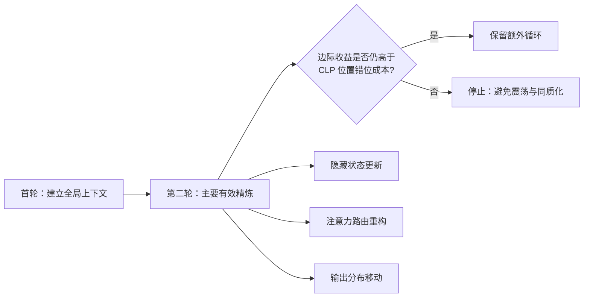
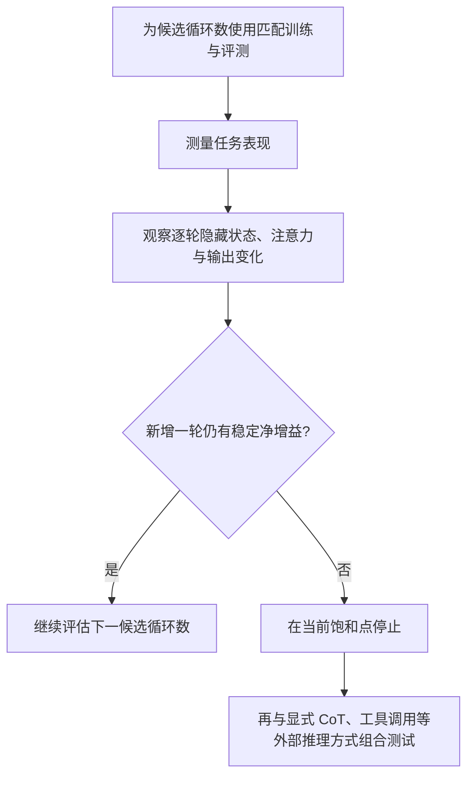

# 总结稿

[打开单页 HTML 总结](assets/bilibili-BV1hggh6AEZT-summary.html)

## 核心结论

LoopCoder-v2 的关键信息不是“让模型一直多想”，而是：**在这组按循环数分别训练并匹配评测的 7B 并行循环模型中，第二轮提供了主要的有效精炼；继续增加循环，收益递减且位置错位成本持续存在，性能反而下降。**

视频在 `[00:37]`、`[03:07]` 起介绍论文报告值：SWE-bench Verified 从单循环的 **43.0** 升至双循环的 **64.4**，三循环和四循环又分别降至 **27.6** 与 **22.4**。这证明的是一个特定模型族和实验协议中的非单调规律，而不是“所有 Agent 思考三次都会退化”。[论文](https://arxiv.org/abs/2606.18023) · [官方模型卡](https://huggingface.co/Multilingual-Multimodal-NLP/LoopCoder-V2)

## 为什么第二轮有效、后续轮次失效

- **第二轮仍在做实质更新**：隐藏状态、注意力路由和输出分布发生明显变化，表征多样性提高。
- **第三轮以后边际精炼快速变弱**：更新更趋震荡，注意力模式趋同，输出分布变化减少。
- **CLP 的位置错位成本不会同步消失**：每增加一轮都继续承担近似固定的结构成本；当边际收益低于这笔“位置摩擦税”，额外循环便从增益变成干扰。

## PLT 如何降低循环成本

视频从 `[01:44]` 起解释：传统串行循环必须等待上一轮完成，并为每轮保留新的 KV 状态。Parallel Loop Transformer（PLT）用 Cross-Loop Position Offset（CLP）打破严格的同位置跨轮依赖，再用共享首轮 KV 的 Gated Sliding-Window Attention（G-SWA）结合全局缓存与 64-token 局部窗口。论文因此把延迟与 KV-cache 成本描述为随循环数近似不再线性扩张，而非保证所有真实部署中的耗时和显存绝对不变。[论文](https://arxiv.org/abs/2606.18023)

## 关键实验边界

- `[07:02]`：7B 模型族在 18T 文本与代码混合 tokens 上训练；文本与代码 token 比为 1:1。
- 不同循环版本是按各自循环数训练并在相同循环数下评估，不能把结果解释为同一现成模型部署时随意把循环从 2 调到 3。
- `[08:50]`：论文还报告显式 token 级 CoT 与潜在循环可以互补；特定 thinking 设置下，LiveCodeBench 从 35.4 升至 62.3（+26.9），但不能外推为所有模型与任务的通则。[论文第 4.3 节](https://arxiv.org/abs/2606.18023)
- 本次事实核查确认的是作者论文与官方模型卡中的报告值，未独立复现实验；“革命性”“全面碾压”等属于视频评价，不作为已验证事实。

## 观众讨论与补充

本次只取得 **3 条顶层热门评论候选**（接口报告共 4 条），且未包含楼中楼；当前可访问弹幕为 0 条，不能据此判断总体口碑或情绪。唯一有信息量的问题是观众询问相关资源在哪里下载，说明视频若补充论文、模型卡与代码入口，会更方便读者复现。该问题是观众需求，不是论文证据。

## 一句话带走

对这项研究，更准确的工程启示是：**把循环数视为需要训练与诊断共同确定的设计变量，用每轮表征增益与结构成本寻找饱和点，而不是把“更多推理计算”当成单调有效的旋钮。**

# 辅助理解

## 从“多想一会儿”到“找到饱和点”

视频用“多想一会儿”解释循环 Transformer，但论文真正研究的是一个更窄的问题：在 Parallel Loop Transformer（PLT）中，循环已经被做得相对便宜以后，**哪一轮仍在产生有效精炼，哪一轮开始只增加干扰？**

这张图是对论文 gain–cost 视角的概念化整理，不是视频中直接展示的算法流程。

## 先看传统方案为什么昂贵

视频在此对比了两条朴素路径：堆参数会提高训练和部署成本；标准串行循环则让后一轮等待前一轮，并随循环数增加延迟与 KV-cache。这个画面适合建立问题背景，但其中“真实部署根本无法落地”是视频的强表达，不能视作论文证明的普遍结论。

PLT 的两项关键机制是：

1. **CLP（Cross-Loop Position Offset）**：用相邻位置的跨轮信息近似替代严格的同 token 递归依赖，以换取并行执行。
2. **G-SWA（shared-KV Gated Sliding-Window Attention）**：复用首轮全局 KV，并让后续循环只维护局部滑动窗口，再通过门控融合两类信息。

帧 9 把 CLP 的工程取舍画成“空间上的轻微错位换取跨轮并行”。它是视频制作者的概念图，不是原论文的可复算证据；是否真正加速仍取决于实现与硬件。

画面将 G-SWA 表示为“冻结的全局 KV + 64-token 局部窗口 + 门控融合”。论文支持窗口大小 64 与首轮 KV 共享；“零额外显存”宜理解为循环扩展的缓存成本近似不再随循环数增长，而非真实系统总显存严格为零增量。参见视频 `[09:08]` 与[论文](https://arxiv.org/abs/2606.18023)。

## 为什么不是循环越多越好

视频在 `[03:07]` 起给出结果；论文对 R=1、2、3、4 分别训练并匹配评测。SWE-bench Verified 的作者报告值为：

| 循环数 | 分数 | 相对前一状态 |
|---:|---:|---|
| 1 | 43.0 | 无循环基线 |
| 2 | 64.4 | 主增益出现 |
| 3 | 27.6 | 明显回退 |
| 4 | 22.4 | 继续回退 |

该帧直观展示 R=2 的 64.4，但“跨界降维打击”等措辞属于视频包装。可以验证的是论文表格中的模型、训练协议与基准结果；不能据此宣称该模型在真实软件工程任务中有 64.4% 的普遍成功率。[论文](https://arxiv.org/abs/2606.18023) · [官方模型卡](https://huggingface.co/Multilingual-Multimodal-NLP/LoopCoder-V2)

## 微观诊断：路由在第二轮后趋于固化

视频把 Loop 1→2 的注意力热图变化解释为信息路由重构，把 Loop 2→3 的高相似度解释为路由趋于固化。论文同时观察隐藏状态更新趋于震荡、表征有效秩下降、输出分布移动变弱。更稳妥的因果表述是：**这些诊断与三轮及以上模型的性能回退一致，并支持作者的 gain–cost 解释；它们不是单独证明所有性能下降都由注意力固化造成。**

## 如何把结论用于模型与 Agent 设计

这里最容易误用的地方，是把模型内部的“循环”直接等同于 Agent 多轮自我反思。后者还包含提示词、上下文累积、工具反馈与错误传播，机制不同。论文只能为“额外计算可能非单调”提供一个模型架构层面的案例，不能直接推出 Agent 固定循环三次就会崩溃。

## 观众意见的证据边界

评论候选只有 3 条，且是热门排序样本；唯一有信息量的内容是询问资源下载入口。它提示发布者应补充论文、模型与代码链接，但不能用于证明观众认可或质疑研究。当前可访问弹幕为 0 条，也不存在可解释的弹幕热点。

## 阅读检查

- 能否区分“分别训练的 R=1/2/3/4 模型”与“同一个模型部署时动态增加循环”？
- 能否解释第二轮的边际精炼收益与 CLP 位置错位成本为何会形成交点？
- 能否把 64.4 限定为 SWE-bench Verified 上的作者报告值，而非现实任务的通用成功率？

若这三点都能明确回答，就抓住了这项研究比“AI 不要想太多”更准确的含义。

## 外部事实核验

### 声明 1（00:37）

- 视频陈述：7B 模型在 SWE-bench Verified 达到 64.4%，基线为 43.0%，并使用 18 万亿混合 token 训练。
- 核验状态：已确认
- 核验结果：论文摘要与正文确认：模型族为 7B，在 18T 文本与代码混合 token 上从头训练；R=2 将 SWE-bench Verified 从 43.0 提升到 64.4。这里的数字是论文在匹配训练、微调和评测设置下报告的实验结果，不等同于任意代码任务上的通用成功率。
- 检索日期：2026-08-21
- 来源：
  - [LoopCoder-v2: Only Loop Once for Efficient Test-Time Computation Scaling](https://arxiv.org/abs/2606.18023)（primary）
  - [LoopCoder-V2 model card](https://huggingface.co/Multilingual-Multimodal-NLP/LoopCoder-V2)（primary）

### 声明 2（01:44）

- 视频陈述：并行循环架构使延迟和显存不再随循环次数叠加。
- 核验状态：部分确认
- 核验结果：论文确认 CLP 打破跨循环的严格顺序依赖，并用首轮 KV 共享和 G-SWA 将缓存占用保持近似恒定；论文表述是成本“nearly constant”或不随 R 缩放。视频的“不再叠加”可作为架构层面的近似描述，但不应理解为所有硬件、批量、实现和循环数下真实端到端耗时、显存绝对完全不变。
- 检索日期：2026-08-21
- 来源：
  - [LoopCoder-v2: Only Loop Once for Efficient Test-Time Computation Scaling](https://arxiv.org/abs/2606.18023)（primary）

### 声明 3（03:07）

- 视频陈述：两次循环升至 64.4%，第三次降至 27.6%，第四次降至 22.4%。
- 核验状态：已确认
- 核验结果：论文及官方模型卡的主结果表支持这组数值，并明确称三次及以上循环在多项任务上回退。该结论针对分别按相同循环数训练并评估的匹配模型，而不是对同一已训练模型在部署时任意调高循环数得到的实验。
- 检索日期：2026-08-21
- 来源：
  - [LoopCoder-v2: Only Loop Once for Efficient Test-Time Computation Scaling](https://arxiv.org/abs/2606.18023)（primary）
  - [LoopCoder-V2 model card](https://huggingface.co/Multilingual-Multimodal-NLP/LoopCoder-V2)（primary）

### 声明 4（07:02）

- 视频陈述：模型约 70 亿参数、窗口 64、文本与代码 1:1，训练总消耗超过 100 万 GPU 小时。
- 核验状态：部分确认
- 核验结果：论文正文确认 7B dense Transformer、窗口 w=64、18T tokens 且文本/代码 token 比为 1:1，并称本工作不同循环模型训练总计消耗 1M GPU hours。视频说“超过”100 万略强于论文的“a total of 1M”，更稳妥写法是“约 100 万”；该数字是整个模型族训练总量，不是单个 R=2 模型。
- 检索日期：2026-08-21
- 来源：
  - [LoopCoder-v2: Only Loop Once for Efficient Test-Time Computation Scaling](https://arxiv.org/abs/2606.18023)（primary）

### 声明 5（08:50）

- 视频陈述：显式思维链和循环结合后，LiveCodeBench 从 35.4 提升至 62.3。
- 核验状态：已确认
- 核验结果：论文第 4.3 节确认该数值，并把结果解释为显式 token 级推理与潜在循环精炼的互补证据。它是特定 thinking 微调和评测设置中的结果，不能直接推断所有模型或任务都会得到超加性收益。
- 检索日期：2026-08-21
- 来源：
  - [LoopCoder-v2: Only Loop Once for Efficient Test-Time Computation Scaling](https://arxiv.org/abs/2606.18023)（primary）

# Data

## 增强转写稿

[00:00] Agent 创世纪为您讲解并行循环架构
[00:03] 该技术由北航、Langboat与人民大学联合研发
[00:07] 它基于并行循环架构实现高效推理期算力扩展
[00:11] 核心思想是只进行一次额外循环
[00:14] 这让其70 亿参数的小模型能正面挑战
[00:17] 720亿参数大模型的性能
[00:20] 并行设计使延迟与显存不再随循环次数叠加
[00:24] 它为代码生成场景释放出强大的深层推理潜力
[00:29] 这证明聪明的循环比无限堆叠参数更为高效
[00:33] 该方法为高效推理期算力扩展提供了全新思路
[00:37] 在软件工程基准7B模型解决率64.4%
[00:42] 相比基线 43.0% 提升 21.4 个百分点
[00:46] 该成绩已可媲美千亿级闭源旗舰模型
[00:50] 模型使用18万亿高质量混合Token
[00:53] 数据涵盖100多种编程语言配比极高标准
[00:57] 最佳并行循环次数为loops等于2
[01:00] 仅需一次额外循环就能带来跨越式质变
[01:04] 这有效打破了推理期算力扩展的成本瓶颈
[01:07] 传统巨型模型依靠参数堆叠
[01:10] 但参数爆炸导致成本激增
[01:13] 训练与部署都变得极其高昂 难以普及
[01:16] 另一种思路是串行循环
[01:18] 让模型多次推理思考
[01:21] 然而每次循环必须等待前一次完成
[01:24] 延迟线性增长
[01:25] 同时显存也随次数线性增加
[01:28] 需存储全新键值
[01:30] 对这使得延迟和显存成为双重
[01:32] 线性瓶颈无法忽视
[01:34] 在实时或内存受限场景下
[01:37] 串行循环无法落地
[01:38] 因此必须设计新架构
[01:40] 打破这种持续依赖与空间占用
[01:43] 跨循环位置偏移
[01:44] 简称clp是并行循环架构的核心
[01:48] 它用位置偏移取代跨循环的当前token依赖
[01:52] 这一设计彻底解锁了多轮循环的完美并行计算
[01:57] 推理延迟不再随循环次数线性增加
[02:00] 共享 KV门控滑动窗口及gswa
[02:04] 则冻结首次全局记忆
[02:07] 后续循环仅聚焦极小窗口
[02:09] 显存消耗保持横定
[02:11] 两者共同打破时序依赖与空间占用瓶颈
[02:15] 并行循环架构plt
[02:17] 由此实现高效推理期算力扩展
[02:20] 传统串行循环需严格等待前一轮完成
[02:24] plt并行循环则支持单次前向传递
[02:27] 同时执行多次循环
[02:30] 推理延迟方面
[02:31] 串行方案随循环次数成倍增长
[02:34] 而plt方案的延迟计算时间显存占用上
[02:37] 串行循环需为每轮存储全新键值
[02:41] 对plt的kv显存消耗能够保持横定不变
[02:45] 跨循环信息依赖从当前token强依赖
[02:47] 变为临近token偏移输入
[02:50] 这四大维度的根本差异
[02:52] 构成了plt的性能基石
[02:54] 并行循环几乎没有额外成本
[02:57] 但循环并非越多越好
[02:59] 实际测试结果展示了截然相反的景象
[03:03] 在SWE基准上
[03:04] 单次循环解决率为43%
[03:07] 第二次循环飙升至64.4%的峰值
[03:10] 然而第三次循环却断崖式下跌至27.6%
[03:15] 第四次循环继续降至22.4%
[03:18] 这说明额外循环并非总是带来正向收益
[03:21] 模型内部存在限制无限循环的机制
[03:24] 并行循环需权衡收益与成本双方博弈
[03:28] 收益来自隐藏状态与注意力路由的有效转变
[03:31] 以及输出分布偏移
[03:33] 共同支撑认知深化
[03:35] 成本源于CLP机制的位置信息错位
[03:38] 这种错位在每次循环边界都固定出现
[03:41] 它构成一笔固定成本不随循环消失
[03:44] 当编辑收益超过固定成本
[03:46] 循环产生净增益
[03:48] 反之则性能衰退
[03:50] 循环2正是最优拐点
[03:52] 并行循环中位置偏移导致的错位成本恒定存在
[03:56] 当前词元借用前一词元的隐藏状态
[03:59] 作为输入计算隐藏状态
[04:01] 发现每次边界错位基本相同
[04:03] 每次叠加循环
[04:05] 系统收取固定不变的位置摩擦税
[04:08] 这种摩擦税不会随循环次数增加而消失或减少
[04:12] 折线图显示成本在循环边界保持恒定不可避免
[04:16] 这意味着后续循环即使收益遞减成本不变
[04:20] 因此超过一定循环次数后性能必然出现衰退
[04:24] 研究团队从隐藏状态入手
[04:26] 详细分析内部精炼的收益变化趋势
[04:29] 在第二次循环时
[04:31] 隐藏状态的更新步长适中且方向一致
[04:34] 余弦相似度大于0
[04:36] 证明了连续更新方向一致且正向
[04:39] 这种生产性精炼让内部表征实现了极其高效收敛
[04:43] 然而进入第三次循环后
[04:45] 模型更新方向发生反转
[04:47] 余弦相似度变为负值
[04:49] 更新开始明显左右摆动
[04:51] 多余的计算轮为原地打转
[04:53] 无法带来真正的认知提升
[04:56] 隐藏状态的震荡
[04:57] 揭示了模型loop3后的性能倒退
[05:00] 有效秩衡量表征特征的击合多样性
[05:04] 多样性越高信息越丰富
[05:06] 从第一次循环到第二次循环时
[05:09] 有效秩急剧上升
[05:10] 散点图显示
[05:12] 彩色点从中心向外剧烈发散
[05:14] 模型在第二次循环捕捉到丰富代码逻辑特征
[05:18] 但从第三次循环开始
[05:19] 有效秩进入衰退期
[05:21] 散点向中心塌缩聚拢
[05:23] 表征空间逐渐变窄
[05:25] 多余循环不增加新信息
[05:27] 反而导致信息同质化
[05:29] 这解释了性能在第三次循环出现断崖式倒退
[05:33] 注意力热力图进一步揭示了信息流的变化
[05:36] 从第一次循环到第二次循环
[05:39] 热力图模式发生强烈改变
[05:41] 这表明模型在积极调整路由策略
[05:44] 实现了信息流重构
[05:46] 然而从第二次到第三次循环
[05:48] KL 散度急剧下降
[05:50] 热力图变得高度相似
[05:52] 各注意力头趋于同质化
[05:54] 这意味着信息路由基本冻结
[05:57] 后续循环属于无效重构
[05:59] 模型不再寻找新路径
[06:01] 注意力模式已固化
[06:02] 这解释了为何第三次循环起性能出现断崖式倒退
[06:07] 预测偏移量指标衡量了输出分布的变化幅度
[06:11] 柱状图显示第二次循环的偏移量达到峰值
[06:14] 超过90%的精炼发生在这一次循环
[06:18] 第三次与第四次的偏移量则呈现断崖式下跌
[06:21] 这种断裂式下跌表明后续循环几乎无贡献
[06:25] 输出分布的改变在第二次循环后基本停滞
[06:28] 该结果与注意力热力图的固化现象完全吻合
[06:32] 超出两次循环不再带来有意义的推演精炼
[06:36] 每轮精炼的编辑收益随循环次数遞减
[06:39] 而CLP错位成本却是固定不变的税率
[06:42] 两者交汇形成了关键的剪刀差曲线
[06:45] 在第二次循环时收益仍然高于成本
[06:48] 这产生了极其有效的算力优化效果
[06:51] 一旦越过第二次循环编辑收益就低于成本
[06:55] 固定的位置摩擦税压垮了微弱的精炼收益
[06:58] 导致后续循环性能不升反降
[07:02] LoopCoder-v2这个模型的规模是 70 亿参数，网络共14层
[07:07] 隐藏维度设定为5120
[07:09] 上兼顾深度与效率
[07:11] 训练数据包含18 万亿高质量 Token
[07:14] 代码与文本1:1
[07:16] 模型覆盖超过100种编程语言
[07:18] Java、Python 和 JavaScript占比最高
[07:21] 并行引擎使用全局共享KV
[07:24] 滑动窗口尺寸64
[07:26] 训练总消耗超100万GPU小时
[07:29] 极致打磨算力潜力
[07:31] 官方推荐循环次数为2
[07:33] 一次额外循环即可
[07:35] 这些参数共同定义了
[07:36] 小模型高效推理的技术边界
[07:39] 7B模型在高难度实时评测中得35.4分
[07:43] 它超越Qwen3-32B等主流模型
[07:46] HumanEval+准确率达84.1%
[07:50] BigCodeBench得46.1%
[07:52] 单次并行循环激活深层代码理解
[07:56] 7B小模型逻辑推演实现越级飞跃
[07:59] 在主流基准上全面碾压32B级开源竞品
[08:03] 这证明了高效循环架构的革命性价值
[08:06] SWEBench上解决率为64.4%
[08:10] 基线仅为43.0%
[08:13] 净增21.4个百分点
[08:15] 以70亿参数之力
[08:17] 超越720亿参数旗舰模型
[08:19] 多语言Multi-SWE性能翻倍至31.0%
[08:23] 证明并行循环能有效应对复杂软件工程
[08:27] 一次额外循环即可引发内部表征深度重构
[08:31] 无需1000亿参数
[08:33] 70亿参数模型跨级压制
[08:35] 该技术为密集计算提供高效低成本扩展方案
[08:39] 隐性计算在内部表征空间打磨代码逻辑
[08:43] 显性显式思维链对外输出清晰推理步骤
[08:46] 二者形成超叠加协同而非相互替代的效应
[08:50] 纯指令版基准测评得分为35.4
[08:54] 加入显式思维链和循环后飙升至62.3分
[08:57] 竞提升高达26.9分效果非常显著
[09:01] 该结果表明内功外功形成完美互补效应
[09:05] 两者共同塑造最强代码生成智能大脑
[09:08] 门控滑动窗口包含冻结区与滑动区两个核心
[09:12] 冻结区锁定第一轮循环的完整全局上下文
[09:16] 由于完全复用
[09:17] 冻结区实现零额外显存占用
[09:20] 滑动区在后续循环仅处理64个词元的局部窗口
[09:24] 这个窗口精准摄取最新鲜的局部上下文信息
[09:28] 智能门控通过权重、动态调节
[09:31] 全局与局部依赖、模型自主决定
[09:34] 何时依赖宏观记忆或微观特征
[09:37] 这种融合实现了高效显存与高质量推理平衡
[09:41] 标准串行循环为了计算深度
[09:44] 牺牲执行时间
[09:46] 每一轮循环必须严格等待前一轮完成
[09:49] 延迟成倍翻升
[09:51] 这种层层等待造成严重算力闲置与资源浪费
[09:55] PLT并行架构彻底打破了时序依赖的枷锁
[09:59] 它容忍当前词元借用临近词元的空间位置妥协
[10:03] 这种微小错位换来了流水线的急速并发潜力
[10:07] 不完美的信息对其反而激发了更高效的内在重构
[10:11] 这一哲学转变释放了推理期算力扩展的新可能
[10:16] 落地指南具体确立了两项精准部署准则
[10:19] 第一项 黄金准则是直接设置循环次数为二
[10:23] 这一设置同时兼顾最高性能与最低成本
[10:26] 第二项是创新的免盲测的实时诊断法
[10:30] 该方法实时跟踪有效秩的变化轨迹
[10:33] 若有效秩持续上升
[10:35] 模型仍获取精炼收益
[10:37] 若有效秩开始衰退
[10:39] 应立即终止循环
[10:41] 该诊断免去对标准基准测试的冗长依赖
[10:45] 该模型具备超过一百种编程语言的强大泛化能力
[10:49] 这得益于18万亿高质量混合标记的极致锤炼
[10:53] 训练数据覆盖了多种主流的编程语言
[10:56] 拥有70亿参数的模型展现出智能体开发能力
[11:00] 它证明了一条全新的技术演进可行路径
[11:03] 面对复杂软件工程挑战
[11:05] 远不必堆砌一万亿参数
[11:07] 靠内部循环架构创新
[11:09] 小模型同样展现强大能力
[11:12] 这位代码智能生态重塑了发展的坚实基石
[11:15] 让计算更深邃让推理更极速
[11:19] 这是loop coder v2的核心目标
[11:22] 并行循环架构彻底打破推理期算力扩展成本魔咒
[11:27] 延迟与显存不再随循环叠加
[11:30] 实现了恒定资源消耗
[11:33] 二次循环精准击中收益与成本的黄金平衡点
[11:37] 在这一点上边际收益最大化而位置摩擦最小化
[11:42] 隐性计算与显性思维链协同带来显著的性能飞跃
[11:47] 三者结合正引领下一代大模型架构范式转变
[11:51] 研究者无需盲目堆砌参数
[11:54] 通过架构创新突破极限
[11:57] 小模型驱动复杂软件工程任务
[11:59] 代码智能生态重塑

## 原始转写稿

[00:00] Agent 创世纪为您讲解病情循环架构
[00:03] 该技术由北航朗博特与人民大学联合研发
[00:07] 它基于病情循环架构实现高效推理期算力扩展
[00:11] 核心思想是只进行一次额外循环
[00:14] 这让其十亿参数的小模型能正面挑战
[00:17] 720亿参数大模型的性能
[00:20] 病情设计使延迟与显存不再随循环次数叠加
[00:24] 它为代码生成场景释放出强大的深层推理潜力
[00:29] 这证明聪明的循环比无限堆叠参数更为高效
[00:33] 该方法为高效推理期算力扩展提供了全心思路
[00:37] 在软件工程基准7B模型解决率64.4%
[00:42] 相比极限43.0%提升21%
[00:46] 该成绩已可媲美千亿级必原旗舰模型
[00:50] 模型使用18万亿高质量混合Token
[00:53] 数据涵盖100多种编程语言配比极高标准
[00:57] 最佳并行循环次数为loops等于2
[01:00] 仅需一次额外循环就能带来跨越式质变
[01:04] 这有效打破了推理期算力扩展的成本瓶颈
[01:07] 传统巨型模型依靠参数堆叠
[01:10] 但参数爆炸导致成本激增
[01:13] 训练与部署都变得极其高昂 难以普及
[01:16] 另一种思路是串行循环
[01:18] 让模型多次推理思考
[01:21] 然而每次循环必须等待前一次完成
[01:24] 延迟线性增长
[01:25] 同时显存也随次数线性增加
[01:28] 需存储全新建值
[01:30] 对这使得延迟和显存成为双重
[01:32] 线性瓶颈无法忽视
[01:34] 在实时或内存受限场景下
[01:37] 串行循环无法落地
[01:38] 因此必须设计新架构
[01:40] 打破这种持续依赖与空间占用
[01:43] 跨循环位置偏移
[01:44] 简称clp是并行循环架构的核心
[01:48] 它用位置偏移取代跨循环的当前token依赖
[01:52] 这一设计彻底解锁了多伦循环的完美并行计算
[01:57] 推理延迟不再随循环次数线性增加
[02:00] 共享kv门控滑动窗口及gswa
[02:04] 则冻结首次全局记忆
[02:07] 后续循环仅聚焦极小窗口
[02:09] 显存消耗保持横定
[02:11] 两者共同打破实序依赖与空间占用瓶颈
[02:15] 并行循环架构plt
[02:17] 由此实现高效推理期算力扩展
[02:20] 传统串行循环需严格等待前一轮完成
[02:24] plt并行循环则支持单次前向传递
[02:27] 同时执行多次循环
[02:30] 推理延迟方面
[02:31] 串行方案随循环次数成倍增长
[02:34] 而plt方案的延迟计算时间显存占用上
[02:37] 串行循环需为每轮存储全新建值
[02:41] 对plt的kv显存消耗能够保持横定不变
[02:45] 跨循环信息依赖从当前token强依赖
[02:47] 变为临近token偏移输入
[02:50] 这四大维度的根本差异
[02:52] 构成了plt的性能基石
[02:54] 并行循环几乎没有额外成本
[02:57] 但循环并非越多越好
[02:59] 实际测试结果展示了截然相反的景象
[03:03] 在SWE基准上
[03:04] 单次循环解决率为43%
[03:07] 第二次循环飙升至64.4%的峰值
[03:10] 然而第三次循环却断崖式下跌至27.6%
[03:15] 第四次循环继续降至22.4%
[03:18] 这说明额外循环并非总是带来正向收益
[03:21] 模型内部存在限制无限循环的机制
[03:24] 并行循环需全衡收益与成本双方博弈
[03:28] 收益来自隐藏状态与注意利路由的有效转变
[03:31] 以及输出分布偏移
[03:33] 共同支撑认知深化
[03:35] 成本源于CLP机制的位置信息错位
[03:38] 这种错位在每次循环边界都固定出现
[03:41] 它构成一笔固定成本不随循环消失
[03:44] 当编辑收益超过固定成本
[03:46] 循环产生竞争意
[03:48] 反之则性能衰退
[03:50] 循环2正是最优拐点
[03:52] 并行循环中位置偏移导致的错位成本衡定存在
[03:56] 当前词员借用前一词员的隐藏状态
[03:59] 作为输入计算隐藏状态距离
[04:01] 发现每次边界错位基本相同
[04:03] 每次叠加循环
[04:05] 系统收取固定不变的位置摩擦税
[04:08] 这种摩擦税不会随循环次数增加而消失或减少
[04:12] 折现图显示成本在循环边界保持衡定不可磨灭
[04:16] 这意味着后续循环即使收益遞减成本不变
[04:20] 因此超过一定循环次数后性能必然出现衰退
[04:24] 研究团队从隐藏状态入手
[04:26] 详细分析内部经链的收益变化趋势
[04:29] 在第二次循环时
[04:31] 隐藏状态的更新部常试中且方向一致
[04:34] 余显相4度大于0
[04:36] 证明了连续更新方向一致且正向
[04:39] 这种生产性经链让内部表征实现了极其高效收敛
[04:43] 然而进入第三次循环后
[04:45] 模型更新方向发生反转
[04:47] 余显相4度变为复职
[04:49] 更新开始明显左右摆动
[04:51] 多余的计算轮为原地打转
[04:53] 无法带来真正的认知提升
[04:56] 隐藏状态的震荡
[04:57] 揭示了模型loop3后的性能倒退
[05:00] 有效制衡量表征特征的击合多样性
[05:04] 多样性越高信息越丰富
[05:06] 从第一次循环到第二次循环时
[05:09] 有效制急剧上升
[05:10] 散点图显示
[05:12] 彩色点从中心向外剧烈发散
[05:14] 模型在第二次循环捕捉到丰富代码逻辑特征
[05:18] 但从第三次循环开始
[05:19] 有效制进入衰退期
[05:21] 散点向中心塌缩巨龙
[05:23] 表征空间逐渐变窄
[05:25] 多余循环不增加新信息
[05:27] 反而导致信息同质化
[05:29] 这解释了性能在第三次循环出现断崖式倒退
[05:33] 注意力热力图进一步揭示了信息流的变化
[05:36] 从第一次循环到第二次循环
[05:39] 热力图模式发生强烈改变
[05:41] 这表明模型在积极调整路由策略
[05:44] 实现了信息流重构
[05:46] 然而从第二次到第三次循环
[05:48] K奥散渡急剧下降
[05:50] 热力图变得高度相似
[05:52] 各注意力头趋于同质化
[05:54] 这意味着信息路由基本冻结
[05:57] 后续循环属于无效重构
[05:59] 模型不再寻找新路径
[06:01] 注意力模式已固化
[06:02] 这解释了为何第三次循环起性能出现断崖式倒退
[06:07] 预测偏一辆指标衡量了输出分布的变化幅度
[06:11] 助状图显示第二次循环的偏一辆达到峰值
[06:14] 超过90%的精炼发生在这一次循环
[06:18] 第三次与第四次的偏一辆则呈现断崖式下跌
[06:21] 这种断裂式下跌表明后续循环几乎无贡献
[06:25] 输出分布的改变在第二次循环后基本停滞
[06:28] 该结果与注意力热力图的固化现象完全吻合
[06:32] 超出两次循环不再带来有意义的推演精炼
[06:36] 每轮精炼的编辑收益随循环次数遞减
[06:39] 而CRP错位成本却是固定不变的税率
[06:42] 两者交汇形成了关键的剪刀插曲线
[06:45] 在第二次循环时收益仍然高于成本
[06:48] 这产生了极其有效的算力优化效果
[06:51] 一旦越过第二次循环编辑收益就低于成本
[06:55] 固定的位置摩擦税压垮了微弱的精炼收益
[06:58] 导致后续循环性能不升反降
[07:02] Lupster VR这个模型的股价是70亿参数网络共14层
[07:07] 隐藏维度设定为5+100
[07:09] 上兼顾深度与效率
[07:11] 训练数据包含180亿高质量Token
[07:14] 代码与文本1:1
[07:16] 模型覆盖超过100种编程语言
[07:18] Java,Python和JS占比最高
[07:21] 并行引擎使用全局共享KV
[07:24] 滑动窗口尺寸64
[07:26] 训练总消耗超100万GPU小时
[07:29] 极致打磨算力潜力
[07:31] 官方推荐循环次数为2
[07:33] 一次额外循环即可
[07:35] 这些参数共同定义了
[07:36] 小模型高效推理的技术边界
[07:39] 7B模型在高难度实时评测中得35.4分
[07:43] 它超越Q132B等主流模型
[07:46] Human Vivalga准确率达84.1%
[07:50] BigCodeBench得46.1%
[07:52] 单次并行循环激活深层代码理解
[07:56] 7B小模型逻辑推演实现越接非越
[07:59] 在主流基准上全面碾压32B级开源净品
[08:03] 这证明了高效循环架构的革命性价值
[08:06] SWEBench上解决率为64.4%
[08:10] 基线仅为43.0%
[08:13] 竞增21.4个百分点
[08:15] 以70亿参数之力
[08:17] 超越720亿参数旗舰模型
[08:19] 多语言SWEM性能翻倍至31.0%
[08:23] 证明并行循环能有效应对复杂软件工程
[08:27] 一次额外循环即可引发内部表征深度重构
[08:31] 无需1000亿参数
[08:33] 70亿参数模型跨级压制
[08:35] 该技术为密集计算提供高效低成本扩展方案
[08:39] 隐性计算在内部表征空间打磨代码逻辑
[08:43] 显性SWELEN对外输出清晰推理步骤
[08:46] 二者形成超叠加协同而非相互替代的效应
[08:50] 纯旨令板基准测评得分为35.4
[08:54] 加入SWELEN和循环后飙升至62.3分
[08:57] 竞提升高达26.9分效果非常显著
[09:01] 该结果表明内功外功形成完美互补效应
[09:05] 两者共同塑造最强代码生成智能大脑
[09:08] 门控滑动窗口包含冻结区与滑动区两个核心
[09:12] 冻结区锁定第一轮循环的完整权局上下文
[09:16] 由于完全复用
[09:17] 冻结区实现零额外显存占用
[09:20] 滑动区在后续循环仅处理64个词源的局部窗口
[09:24] 这个窗口精准设取最新鲜的局部上下文信息
[09:28] 智能门控通过权重、动态调节
[09:31] 权局与局部依赖、模型自主决定
[09:34] 核实依赖宏观记忆或微观特征
[09:37] 这种融合实现了高效显存与高质量推理平衡
[09:41] 标准串行循环未求计算深度
[09:44] 牺牲执行时间
[09:46] 每一轮循环必须严格等待前一轮完成
[09:49] 延迟成倍翻
[09:51] 这种层层等待造成严重算力闲置与资源浪费
[09:55] PLT并行架构彻底打破了实序依赖的枷锁
[09:59] 它容忍当前词源借用临近词源的空间位置妥协
[10:03] 这种微小错位换来了流水线的急速并发潜力
[10:07] 不完美的信息对其反而激发了更高效的内在重构
[10:11] 这一哲学转变释放了推理期算力扩展的新可能
[10:16] 落地指南具体确立了两项精准部署准则
[10:19] 第一项 黄金准则是直接设置循环次数为二
[10:23] 这一预指同时兼顾最高性能与最低成本
[10:26] 第二项是创新的免盲测诊断实时监控法
[10:30] 该方法实时跟踪有效制的变化轨迹
[10:33] 若有效制持续上升
[10:35] 模型仍获取精炼收益
[10:37] 若有效制开始衰退
[10:39] 应立即终止循环
[10:41] 该诊断免去对标准基准测试的永长依赖
[10:45] 该模型具备超过一百种编程语言的强大泛化能力
[10:49] 这得益于18万亿高质量混合标记的极致锤链
[10:53] 训练数据覆盖了多种主流的编程语言
[10:56] 拥有70亿参数的模型展现出智能体开发能力
[11:00] 它证明了一条全新的技术眼镜可行路径
[11:03] 面对复杂软件工程挑战
[11:05] 远不必堆砌一万亿参数
[11:07] 靠内部循环架构创新
[11:09] 小模型同样展现强大能力
[11:12] 这位代码智能生态重塑了发展的坚实及实
[11:15] 让计算更深邃让推理更极速
[11:19] 这是loop coder v2的核心目标
[11:22] 并行循环架构彻底打破推理期算力扩展成本魔咒
[11:27] 延迟与显存不再随循环叠加
[11:30] 实现了横定资源消耗
[11:33] 二次循环精准击重收益与成本的黄金平衡点
[11:37] 在这一点上边际收益最大化而位置摩擦最小化
[11:42] 隐性计算与显性思维链协同带来显著的性能飞跃
[11:47] 三者结合正引领下一代大模型架构范氏转变
[11:51] 研究者无需盲目堆砌参数
[11:54] 通过架构创新突破极限
[11:57] 小模型驱动复杂软件工程任务
[11:59] 代码智能生态重塑

## 原始关键帧

### 关键帧 1

### 关键帧 2

### 关键帧 3

### 关键帧 4

### 关键帧 5

### 关键帧 6

### 关键帧 7

### 关键帧 8

### 关键帧 9

### 关键帧 10

## 补充原始数据

- [bilibili-BV1hggh6AEZT-comments.jsonl](assets/bilibili-BV1hggh6AEZT-comments.jsonl)
- [bilibili-BV1hggh6AEZT-comment-candidates.json](assets/bilibili-BV1hggh6AEZT-comment-candidates.json)
- [bilibili-BV1hggh6AEZT-danmaku.jsonl](assets/bilibili-BV1hggh6AEZT-danmaku.jsonl)
- [bilibili-BV1hggh6AEZT-danmaku-analysis.json](assets/bilibili-BV1hggh6AEZT-danmaku-analysis.json)
- [bilibili-BV1hggh6AEZT-visual-summary.png](assets/bilibili-BV1hggh6AEZT-visual-summary.png)
- [bilibili-BV1hggh6AEZT-summary.html](assets/bilibili-BV1hggh6AEZT-summary.html)
