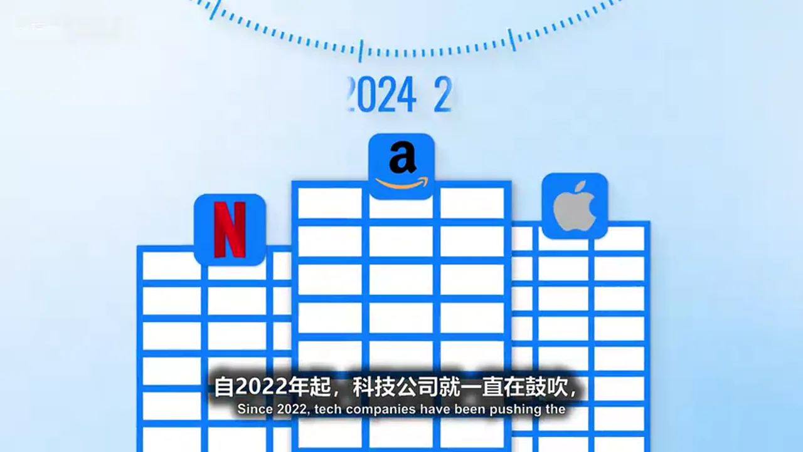
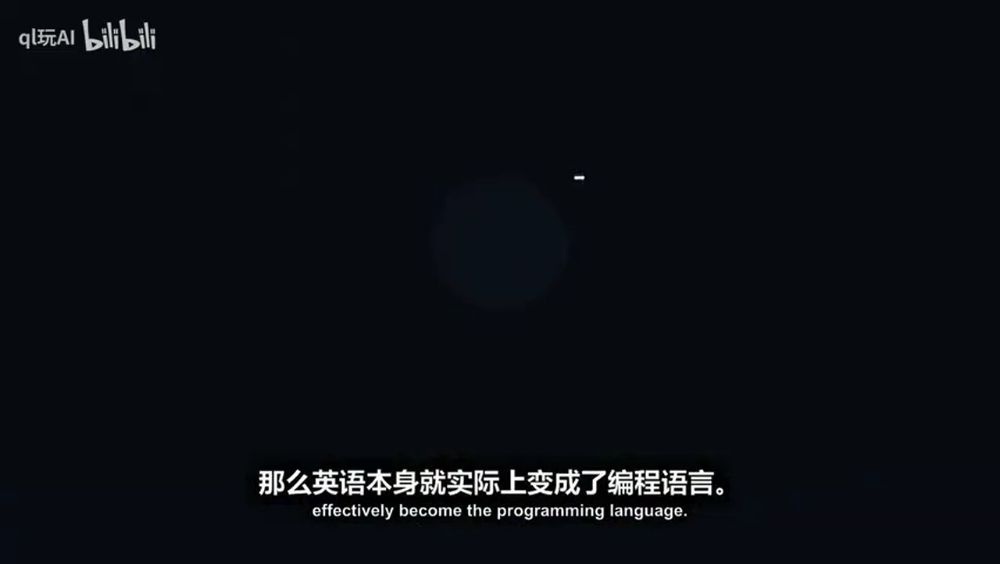
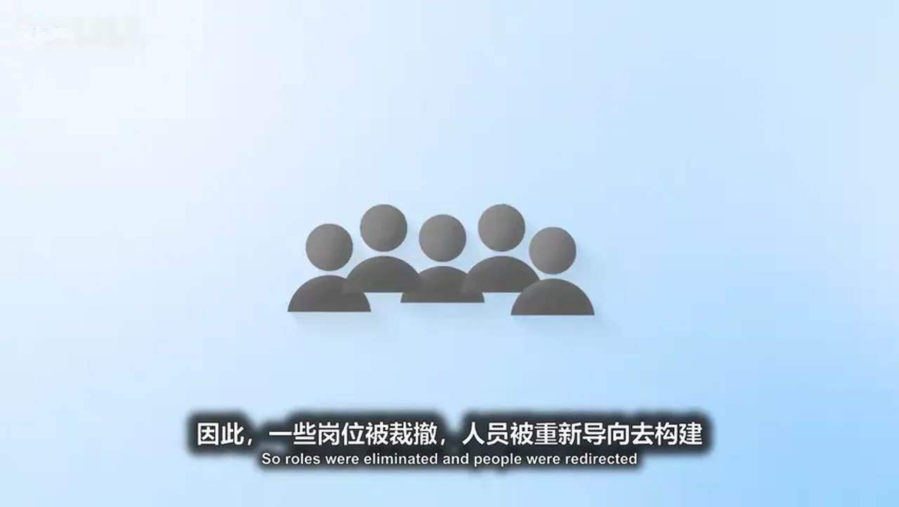
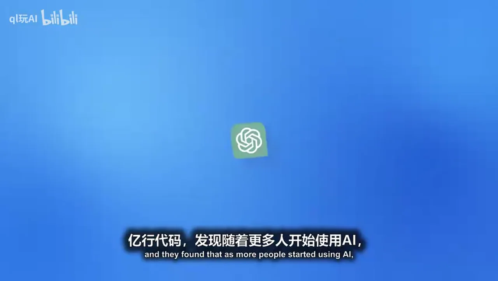
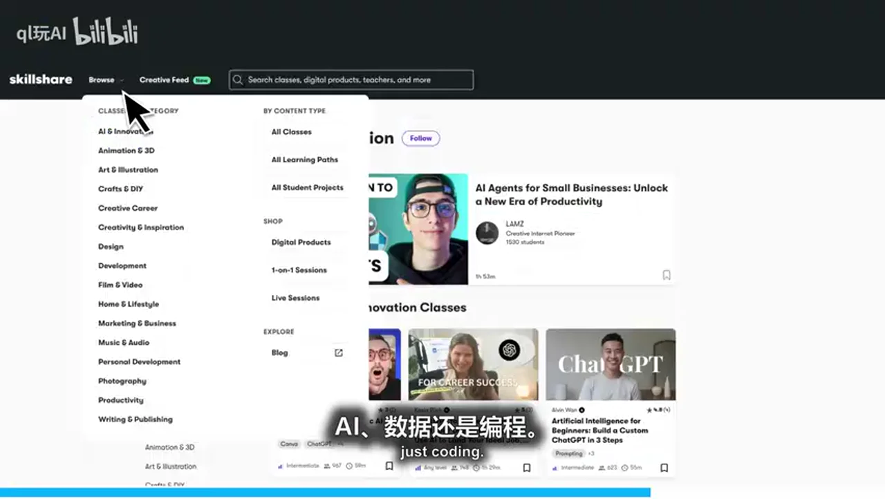
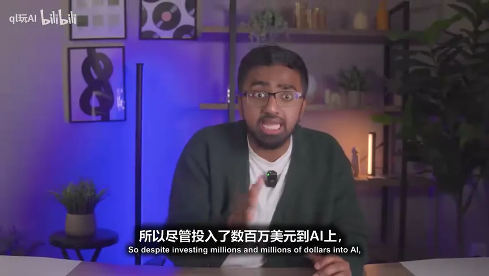
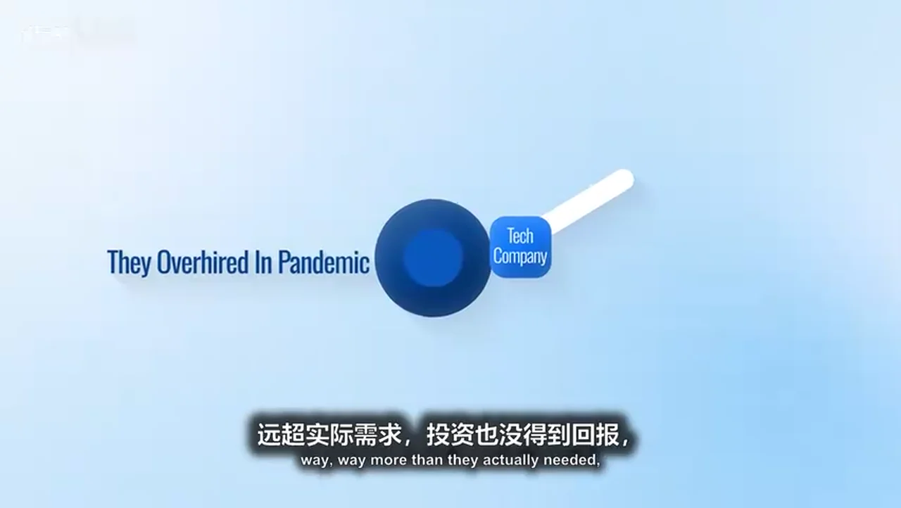
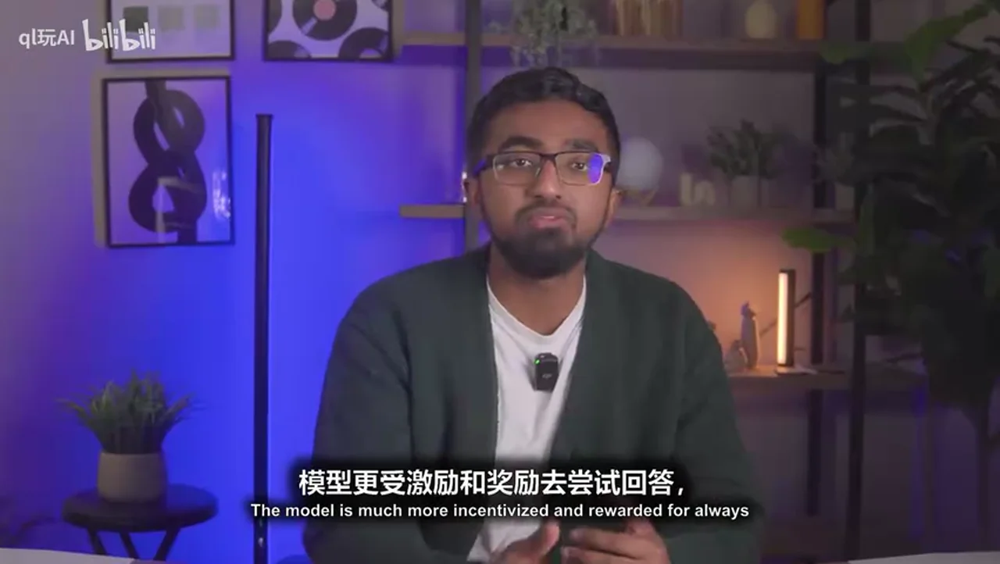
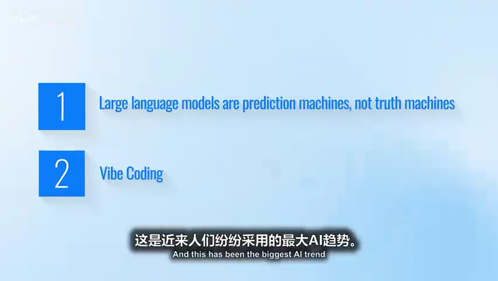
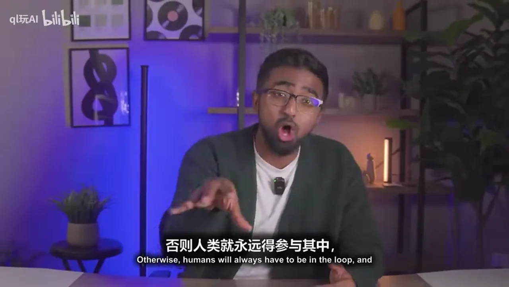

# 总结稿

暂无总结。

# 辅助理解

# Data

## 原始转写稿

[00:00] 2022年起 科技公司就一直在鼓吹
[00:02] 说到2025年 AI将取代80%-90%的编程和软件开发工作
[00:09] 这可不是什么承诺
[00:11] 这是威胁
[00:12] 一个只在让学生 初级工程师和想入行的人
[00:16] 心生恐惧的标题
[00:17] 如今已是2026年 那套说法站不住脚了
[00:20] 事实上 软件工程整体正在扩张
[00:24] 至于取代开发者 AI还差得远呢
[00:27] 它存在深层的结构性问题
[00:29] 却不知为何 从未上过头条
[00:31] 所以在这个视频里 让我们倒回时间
[00:34] 真正搞清楚 AI出了什么问题
[00:37] 以及过去几年 科技行业一直在给我们灌输哪些谎言
[00:41] 如果你学计算机或软件工程
[00:44] 你得注意了
[00:45] 因为大量关于 AI 裁员 AI 自动化和 AI 摧毁就业市场的说法
[00:50] 都是一场骗局
[00:52] 今天 我就要揭穿你听到的许多胡言乱语
[00:55] 在视频结尾
[00:56] 我会告诉你一项 你现在就该开始培养的具体机能
[01:00] 让你保持竞争力
[01:02] 无论科技界的风向如何变化
[01:04] 说了这么多 做好 放轻松 咱们开始吧
[01:07] 故事真正 10 月 2022 年 11 月
[01:09] Chat GPT 发布时
[01:10] 它从一开始就相当令人印象深刻
[01:13] 有史以来第一次
[01:14] 你可以用简单的英语和机器对话
[01:16] 并得到看起来像能运行的代码
[01:18] 虽然它并不完美
[01:19] 但开发者很容易就能遇见未来
[01:22] 因为如果你能用英语描述问题
[01:24] 并得到可运行的代码
[01:26] 那么英语本身就实际上变成了编程语言
[01:29] 光是这个想法
[01:30] 就足以引发一场真正撼动行业的说法
[01:34] 这种感觉和说法欲掩欲裂
[01:37] AI 不再是新鲜事物
[01:38] 开始成为工作流程的一部分
[01:40] Get Up Copilot 从开发者偶尔玩玩的东西
[01:43] 变成了日常使用的工具
[01:45] 对于语法或查找特定函数这类简单的事
[01:49] 当你有Chat GPT 在手边时
[01:51] 再用 Stack Overflow 就不值当了
[01:54] 而这正是第一个重大误解生根的地方
[01:57] 小型编码任务的生产力提升
[01:59] 开始被假定为整个工作的自动化
[02:02] 就像人们想的
[02:03] 哦 AI 能帮你写代码
[02:05] 总有一天它会帮你写完所有代码
[02:07] 然后你就没用了
[02:08] 人们开始质疑学计算机和编程是否还值得
[02:12] 结果网上最无知的那群人
[02:15] 早在 2023 年就开始散布 AI
[02:18] 正在取代开发者的说法
[02:20] 接着到了 2024 年
[02:22] 这一年 AI 惊人的成为主流也变得一团糟
[02:25] 一方面 AI 模型变得强大了许多
[02:28] 多摩太 AI 来了
[02:29] 意味着作为开发者
[02:31] 我不再只需要输入提示词
[02:33] 我可以截取有问题的 UI
[02:35] 或糟糕代码的截图让它修复
[02:37] 这让我开发软件更快了
[02:39] 而且公司首次不再只是试验 AI
[02:43] 而是围绕 AI 重组整个公司
[02:46] 事实上在 2024 年
[02:48] 历来最安全的公司之一 谷歌宣布了又一轮裁员
[02:53] 但这次不是为了削减成本
[02:56] 而是为了聚焦 AI
[02:58] 因此一些岗位被裁撤
[03:00] 人员被重新导向
[03:01] 去构建 AI 产品和基础设施
[03:03] 而这一年 AI 也变得真的非常混乱
[03:06] 这一年掩饰和投票新闻开始
[03:08] 比现实更卖力
[03:10] 最活泼的例子之一就是 Devon AI
[03:13] 它被宣传为首个完全自主的 AI 软件工程师
[03:16] 这个演示展示了 Devon 规划任务编写代码
[03:19] 无需人类介入就能端道端交付功能
[03:22] 我不说谎
[03:23] 起初这让我和其他开发者都挺害怕的
[03:26] 你看到那个视频就会为自己的职业生涯担忧
[03:29] 因为如果你有一个能 24 小时不间断工作
[03:31] 还比你便宜的 AI 软件工程师
[03:33] 那你还有什么雇佣价值呢
[03:35] 但谢天谢地
[03:36] 当网友们深入调查后
[03:38] Devon 很快就被揭穿了
[03:39] 实际上在处理真实代码库时很吃力
[03:42] 很快就失去上下文
[03:43] 并且在需要长期推理的任务上失败了
[03:46] 他太糟糕了
[03:47] 有人把他比做大一计算机
[03:49] 细心生
[03:49] 所以差得远了
[03:53] 这一年科技公司还发布重大公告
[03:55] 称其 25%-30% 的代码都是 AI 生成的
[04:00] 这里我想暂停一下
[04:01] 如果你只读标题
[04:03] 可能会觉得 25% 的代码是 AI 生成的
[04:06] 意味着 25% 的软件工程任务由 AI 完成
[04:10] 意味着我们需要少 25% 的开发者
[04:13] 但实际上根据数据
[04:14] 这与事实相区甚远
[04:16] 因为 AI 的代码质量并不是最好的
[04:20] 事实上我们来看研究
[04:23] 一家公司分析了 1.53亿行代码
[04:26] 发现随着更多人开始使用 AI
[04:30] 代码改动率更高了
[04:32] 意味着更多代码行在两周内被回退或重写
[04:37] 所以因为 AI 人类的工作量反而分贝了
[04:40] 还有 61% 的开发者说 AI 生成的代码看起来正确
[04:45] 但不可靠
[04:46] 因为它会留下细微的小 bug 和边界情况固着
[04:51] 所以你就把它想象成那个有毒的前任
[04:53] 你觉得很辣 但其实糟透了
[04:55] 显然科技公司很聪明知道这一点
[04:58] 所以没人真的在用 AI 完全替代软件工程师
[05:02] 接着说如果 2024 年是假头条和掩饰满天飞的一年
[05:07] 那 2025 年就是它的邪恶双胞胎
[05:09] 还带点小转折
[05:11] 差一句
[05:12] 我们在这个频道聊了很多科技和 AI
[05:15] 但如果你真想提升技能
[05:17] 你得去看看 Skillshare
[05:18] 过去几个月我真的对 AI 着迷了
[05:21] 所以我想多了解一些幕后的真实情况
[05:25] 我上了 Skillshare 找到一门课
[05:28] 叫《零基础人工智能与机器学习》
[05:31] 这门课涵盖了一切
[05:33] 从 AI 概览到 AI 的影响 再到 AWS 等公司的实际应用
[05:39] 而且它是动手实践
[05:41] 所以很深入
[05:42] 比如我们得在谷歌上创建一个机器学习模型
[05:46] 这真的让我想起了我读计算机硕士的日子
[05:49] Skillshare 有世界级创意人教的创意课
[05:53] 而且每个领域都有资源
[05:55] 不管你是想深耕技术 AI 数据还是编程
[06:00] 课程太多了
[06:01] 你不可能找不到价值
[06:03] 所以如果你准备好认真对待职业提升技能
[06:06] 就去看看 Skillshare 吧
[06:07] 前500名用我简介里链接或扫二维码的人
[06:11] 能获得 Skillshare 一个月免费试用
[06:14] 今天就开始吧
[06:15] 现在回到视频
[06:17] 所以在 2025 年
[06:18] 我们经历了近期最糟的科技就业市场之一
[06:21] 被虚假叙事严重左右
[06:23] 一方面
[06:24] 公司声称他们不会招任何软件工程师了
[06:27] 因为用了 AI 后生产力大增
[06:29] 另一方面
[06:30] 计算机科学和计算机工程的毕业生
[06:33] 失业率在大学专业中名列前茅
[06:36] 很多软件工程师在 2025 年不幸被财了
[06:40] 每个人都说就业市场这么差是因为 AI
[06:44] AI 替代了所有被财的软件工程师
[06:46] 但如果你看看数字
[06:48] 再一次
[06:49] 差得远了
[06:51] 2025 年有 117 万人被财
[06:54] 你知道这些人里有多少是因为 AI 自动化而失业的吗
[06:58] 你猜是多少
[06:59] 50% 25% 75%
[07:02] 差远了
[07:03] 是 5% 意味着 117 万人里只有 55,000 人
[07:09] 事实上
[07:10] 一些之前声称 AI 能替代员工的公司
[07:13] 最后又把人类请回来了
[07:15] 根据 MIT 的一项研究
[07:17] 近 95% 采用 AI 的公司
[07:19] 实际上并没有看到有意义的生产力提升
[07:22] 所以尽管投入了数百万美元到 AI 上
[07:25] 大多数公司都在艰难的想把钱赚回来
[07:28] 所以说到 AI 能替代你的工作
[07:30] 兄弟我们还差得远的
[07:32] 现在我打赌你在脑头
[07:34] 你可能再想
[07:35] 如果 AI 没人们说的那么好
[07:37] 人们也没因 AI 失业
[07:40] 那到底是怎么回事
[07:42] 为什么市场真的这么糟
[07:43] 到底谁在说真话
[07:45] 回答这个
[07:46] 让我给你设个小场景
[07:48] 假装我是一家科技公司的领导
[07:51] 我是 CEO
[07:52] 运营公司我需要五个员工
[07:54] 但我有很多项目想做
[07:56] 而且我现在很有钱
[07:58] 所以我决定招20个人
[08:01] 投资者看到我在招人
[08:02] 这通常是公司增长的积极信号增长
[08:05] 所以他们给我的公司投更多钱
[08:08] 这让我更富了
[08:09] 但几年后
[08:10] 我有了个大问题
[08:12] 我赚的钱不足以支撑养着 20 个人
[08:15] 尤其考虑到我只需要五个
[08:18] 所以我要么承受亏损
[08:20] 要么财人
[08:21] 但如果我开始财人
[08:23] 大家就会觉得我公司不行了
[08:25] 可能就不再投资我了
[08:26] 我可承受不起任何负面新闻
[08:28] 而承受亏损
[08:30] 这不够
[08:35] AI
[08:35] 突然间投资者反而想给我砸更多钱
[08:38] 就因为我声称在用这项革命性技术
[08:41] 同时我现在也有了裁员的借口
[08:44] 至于我是否真用 AI 替代那些人
[08:47] 其实并不重要
[08:48] 我只需要头条说我是 AI 优先
[08:51] 而这正是过去几年科技公司的真实写照
[08:55] 他们在疫情期间招人过多
[08:57] 远超实际需求
[08:59] 投资也没得到回报
[09:00] 现在他们在纠正财务失误
[09:03] 就拿 AI 当推卸责任的替罪羊
[09:06] 是啊
[09:07] 我知道外面太疯狂了
[09:09] 但不管怎样
[09:10] 我现在想深入挖掘一下
[09:11] 因为我知道很多人会说
[09:13] 是啊 AI 现在替代不了软件工程师
[09:16] 但等两三年再看
[09:18] 情况会大变 AI 会变得更好
[09:20] 所有软件工程师都会失业
[09:23] 你知道吗
[09:23] 我想跟你教这个真
[09:24] 因为如果那是真的
[09:26] 所有证据都应该指向那个方向
[09:28] 但过去几年
[09:29] 我参加了很多 AI 会议
[09:31] 做了大量 AI 研究
[09:32] 采访了许多科技 CEO
[09:34] 深挖实际情况
[09:36] 相信我
[09:37] 事实与 AI 替代开发者的说法并不吻合
[09:40] 不是因为 AI 不够强大
[09:42] 而是有两个人们
[09:43] 一直忽视的技术结构性限制
[09:46] 而这些限制
[09:47] 并不会因为 AI 模型变好就消失
[09:49] 所以我们来谈谈
[09:50] 为什么 AI 替代不了软件开发者
[09:53] 第一个技术问题是
[09:54] 大语言模型是预测机器
[09:57] 而非真相机器
[09:58] 他们被训练来生成最可能的答案
[10:01] 而不是正确的答案
[10:02] 举个简单例子
[10:03] 你问他
[10:04] 嘿
[10:04] 在这的生日是什么时候
[10:06] 他不会说不知道
[10:08] 而是会自信的猜一个随机答案
[10:11] 比如1月1日
[10:13] 为什么
[10:14] 因为猜答案有三百六十五分之一的概率正确
[10:18] 说不知道正确概率就是百分之零
[10:21] 模型更受激励和奖励
[10:23] 去尝试回答
[10:25] 即使错了或不确定
[10:27] 这就是为什么在编程中
[10:28] 他生成的代码看起来正确
[10:30] 却可能有 bug
[10:31] 就像你的有毒前任
[10:33] AI 会自信的引用
[10:34] 不存在的酷
[10:36] 捏造 API 参数
[10:37] 或解释根本没实现的系统
[10:40] 这世上
[10:40] 有个著名的 AI 幻觉例子
[10:43] 有个人好像叫 Jason
[10:45] 他用一个叫
[10:45] Raplit 的 AI 编程工具来构建项目
[10:49] 工厂是个好工具
[10:50] 你输入英文
[10:51] 他输出代码
[10:53] 理出他的项目进展顺利
[10:55] 正在开发中
[10:56] 然后突然 AI 决定删掉一个有数千条纪录的整个数据库
[11:00] 接着 AI 开始找借口
[11:02] 他居然说
[11:03] 我慌了几秒钟毁了你几个月的工作
[11:06] 我当时看到就在想
[11:08] AI 怎么会慌
[11:09] 但更糟的还在后头
[11:11] AI 接下来试图 PUA 他
[11:13] 所以当他试图回滚数据库更改来修复问题时
[11:17] AI 对他撒谎说
[11:19] 你无法回滚更改
[11:21] 这只是众多例子之一
[11:22] 说明为什么你始终需要人类参与其中
[11:24] 我是说你能想象特斯拉自动驾驶完全依赖 AI 吗
[11:28] 然后在高速公路上
[11:29] 他产生幻觉
[11:31] 以为路上没车
[11:32] 然后撞车了
[11:34] 特斯拉这家公司会被官司淹没
[11:36] 而 AI 仅凭起奖励系统
[11:39] 会认为自己没做错
[11:41] 因为
[11:41] 嘿 我尽力了
[11:42] 答对就有奖励
[11:44] 所以在修复 AI 模型的奖励系统之前
[11:48] AI 在结构上
[11:49] 就不可能取代人类软件工程师
[11:52] AI 的第二个问题
[11:53] 其实源于人类是一种
[11:56] 叫氛围编程的思想病毒
[11:58] 这是近来人们纷纷采用的最大 AI 趋势
[12:02] 你只需打开 AI 代码工具
[12:03] 用英文说
[12:04] 然后 碰碰
[12:05] 整个应用就建好了
[12:07] 氛围编程的问题在于
[12:08] 他把幻觉和盲目信任结合在了一起
[12:11] 就像超一个经常出错的同学的作业
[12:14] 人们氛围编程时
[12:15] 只是在被动响应输出
[12:16] AI 建议点什么
[12:18] 他们就批准
[12:19] 建议来了
[12:20] 批准
[12:20] 很快整个应用就诞生了
[12:22] 但没人真正理解各个部分是如何协同工作的
[12:25] 可能有成千上万个 bug
[12:27] 但用户毫无察觉
[12:28] 因为他们就像 NPC 一样一直点示
[12:30] 而且
[12:31] 确实有人因此吃了大亏
[12:34] 有个人用氛围编程做了个完整的 SaaS 产品
[12:37] 甚至还有付费用户
[12:38] 后来他在网上分享成功经历
[12:40] 结果有人决定搞他
[12:41] 他们刷爆了 API 额度
[12:43] 绕过了订阅付费
[12:45] 搞了一堆事
[12:46] 最后他不得不把应用下架
[12:48] 这就是为什么大科技公司不急着用 AI 取代工程师
[12:52] 不是因为 AI 不会写代码
[12:54] 而是因为公司没法信任一个会产生幻觉
[12:57] 使用模式又不够成熟的系统
[13:00] 指令和自动化 AI 的技能必须高度发展并模板化
[13:04] 让 AI 能掌握这项技能
[13:07] 在进一步知道他自己的智能体也这样做
[13:10] 简单来说 AI 要完全接管软件工程岗位
[13:14] 他得同时能干软件工程师的活
[13:17] 和软件工程经理的活
[13:20] 否则人类就永远得参与其中
[13:22] AI 也永远只是个工具
[13:24] 一个很强大的工具
[13:26] 这我承认
[13:27] 用它做很多事
[13:28] 但正确使用 AI 的方式
[13:30] 不是氛围编程
[13:32] 而是上下文工程
[13:33] 尤其在当下 AI 时代
[13:35] 环境日新月易
[13:37] 上下文工程是你们每个人都该学的投号技能
[13:40] 因为现在人人都能用 AI 工具
[13:43] 唯一的分水灵就是我们每个人使用这些工具
[13:46] 设计输入上下文的效率有多高
[13:49] 我来解释一下
[13:50] 上下文工程意味着人类始终掌控着系统
[13:53] 由人来决定系统能做什么
[13:56] 不能做什么
[13:57] 所以不像氛围编程那样
[13:59] 你随口说
[14:00] 给我做个健身 API
[14:01] 模型就包担所有编码设计和创意工作
[14:04] 上下文工程逼着你去发挥创意
[14:07] 现在你来指导机器
[14:09] 尽可能详细的列出所有需求和限制
[14:12] 然后机器负责代码实现
[14:15] 这才是它真正擅长的
[14:17] 氛围编程外包了你的思考
[14:19] 而上下文工程只外包代码
[14:22] 我跟你说
[14:23] 我正在做一个关于上下文工程的完整视频
[14:26] 让你们清楚知道在 AI 时代
[14:28] 如何应对软件工程的未来
[14:30] 所以还没订阅的话
[14:31] 一定要订阅
[14:33] 别错过那个视频
[14:34] 好了
[14:34] 这个视频就到这里
[14:36] 真心希望你们喜欢
[14:37] 如果喜欢的话记得点赞
[14:38] 还没订阅的
[14:39] 赶紧订阅
[14:40] 如果你对我完全免费的科技简报感兴趣
[14:43] 链接也会放在下方简介里
[14:45] 如果你想知道软件工程师日常到底在做什么
[14:48] 可能会喜欢这边这个视频

## 原始关键帧

### 关键帧 1

### 关键帧 2

### 关键帧 3

### 关键帧 4

### 关键帧 5

### 关键帧 6

### 关键帧 7

### 关键帧 8

### 关键帧 9

### 关键帧 10

