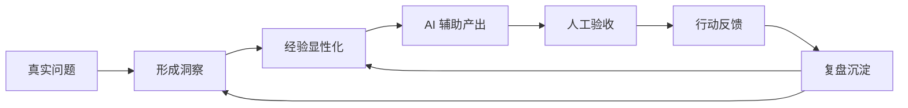
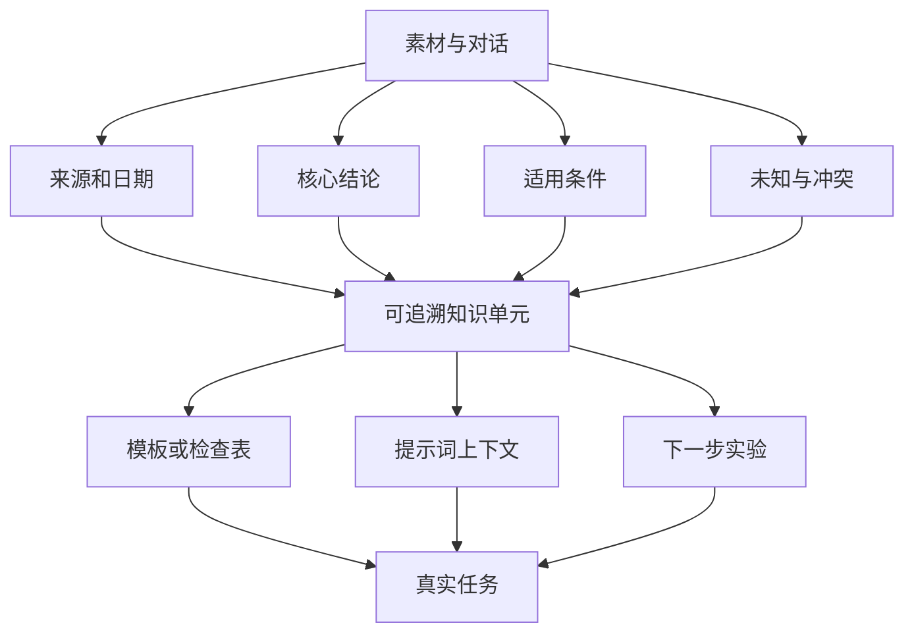
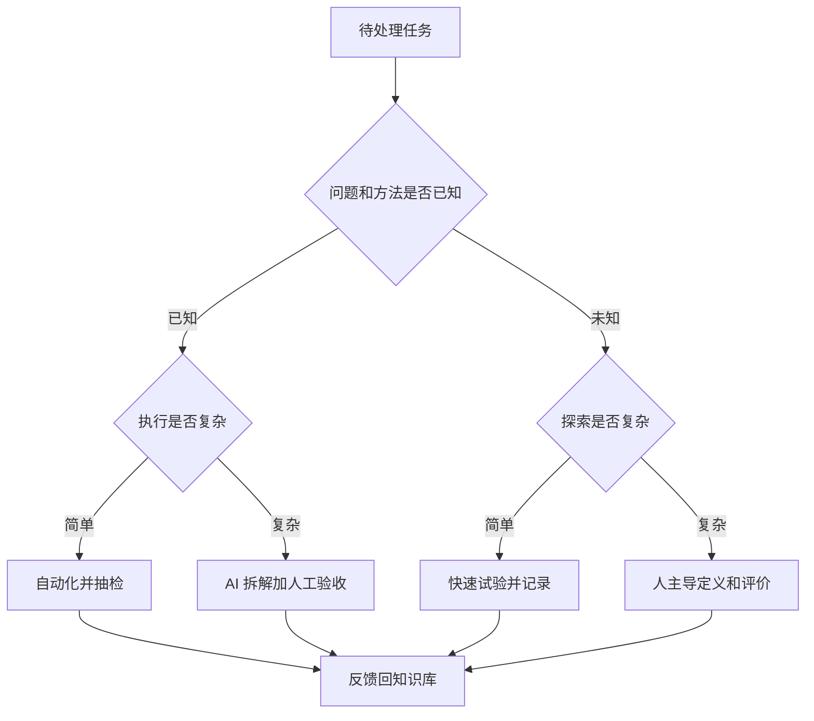
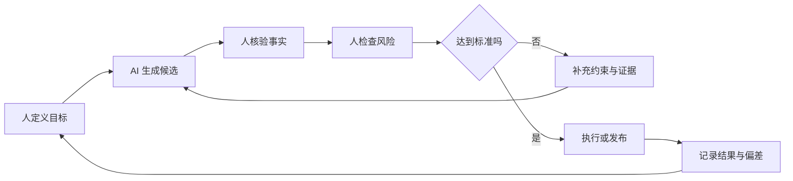
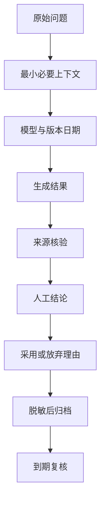
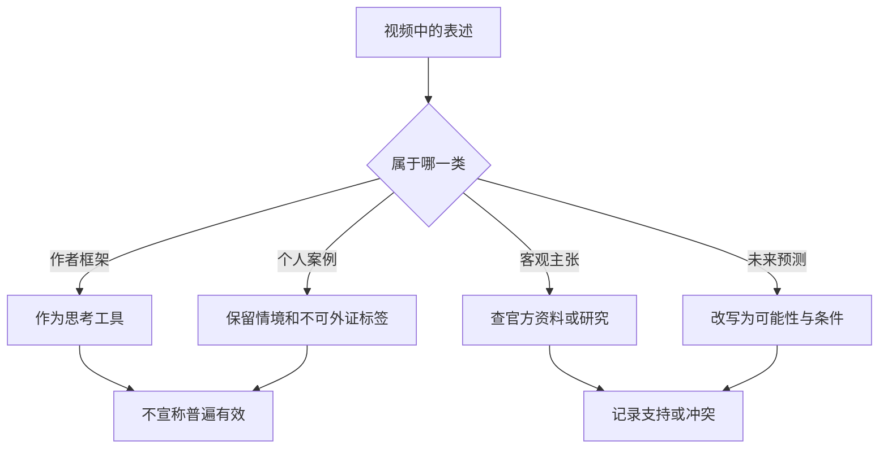

# 总结稿

[打开单页 HTML 总结](assets/bilibili-BV1u7bz6KELN-summary.html)

## 核心摘要

这段视频给出一套面向 AI 时代的**个人知识工程工作流**：先从真实问题中形成洞察，把隐性的经验写成可调用的知识，再借助 AI 做出可运行的成果，最后通过复盘把新经验回灌到知识库。重点不在“收藏更多资料”，而在让知识进入一个持续运转的闭环：**洞察 → 显性化 → 做出来 → 复盘 → 与 AI 再协作**。

需要注意三条证据边界：视频中的“四象限”“洞察—执行—反思闭环”和能力乘法式，都是作者用于解释方法的自定义框架；“同类项目从一周以上缩短到一天以内”是作者讲述的个人案例，缺少代码、日志与一致验收标准，无法外部复核；“已知领域一定会被 AI 替代”是未来预测，而非既成事实。ILO 2025 年的职业暴露研究更谨慎，认为多数受影响岗位更可能发生任务转型，而不是整份工作直接消失：[Generative AI and jobs: A 2025 update](https://www.ilo.org/publications/generative-ai-and-jobs-2025-update)。

## 作者的核心问题

作者关心的不是“该用哪一个模型”，而是：当通用知识与常规执行越来越容易被模型调用时，个人怎样积累仍然可复用、可迭代的价值？他的回答可以拆成三层：

1. **洞察层**：发现值得解决的问题，明确约束、判断标准与真正目的。
2. **知识层**：把经历、方法、失败条件和决策依据从脑内隐性经验变成外部可检索材料。
3. **行动层**：让 AI 辅助原型、写作或编码，在真实反馈中修正认识，再将结果沉淀回来。

{{frame:0004}}

这张画面适合说明作者所强调的循环结构。它是一个行动提示，不是经实验验证的通用因果模型。

## 从“记笔记”到“做知识工程”

普通收藏通常停在输入端；个人知识工程则要求知识能参与下一次决策和产出。一个可执行的最小单元，不只是结论，还应包含：

- **来源与时间**：这条信息来自哪里，何时仍然有效；
- **适用条件**：在哪类任务、对象和资源约束下成立；
- **行动接口**：它能触发什么检查表、模板、提示词或实验；
- **反馈记录**：实际使用后哪里有效、哪里失败、下一版如何调整。

视频把“个人经验显性化程度”放在很高的位置。更稳妥的理解是：显性化可能提高材料被本人或 AI 调用的机会，但“必然提升竞争力”并没有在视频中被量化验证，应将其视为方法假设，而不是确定收益。

{{frame:0006}}

画面中的乘法表达式是启发式比喻：任一因素不足都会限制最终产出。它不能被当作可测量、可计算的能力公式。

## 四象限：用于分配注意力，而非预测命运

作者以“已知/未知 × 简单/复杂”划分任务，意图是把人的注意力从重复执行转向探索、判断和经验沉淀。可把它改写成更谨慎的行动规则：

| 任务类型 | 更合适的做法 | 主要风险 |
|---|---|---|
| 已知且简单 | 优先自动化，但保留抽检 | 错误被批量放大 |
| 已知且复杂 | AI 辅助拆解，人负责验收 | 复杂不等于模型可靠 |
| 未知且简单 | 快速试验并记录反馈 | 把偶然结果当规律 |
| 未知且复杂 | 人主导问题定义，AI 辅助搜索和原型 | 目标、评价标准本身不清楚 |

这个四象限没有统一的测量尺度，也不能推出“已知领域必然被替代”。它更适合做任务分流和风险提醒。

## 与多个模型协作

作者建议保留与不同模型的对话上下文，以便复用思路。DeepSeek、通义千问和 GPT 的确分别存在官方模型或服务目录：[DeepSeek API 模型列表](https://api-docs.deepseek.com/api/list-models/)、[阿里云百炼文本生成模型列表](https://help.aliyun.com/zh/model-studio/model-list-text-generation/)、[OpenAI 模型目录](https://developers.openai.com/api/docs/models)。但“模型存在”并不能证明跨模型归档一定提高学习效果。

更可靠的归档方式是同时记录：原始问题、上下文版本、模型与日期、关键输出、人工核验、采用或放弃的理由。模型名称、功能、价格与隐私条款都会变化，旧对话中的工具说明需要重新核对。对话还可能包含个人信息、客户材料或未公开代码，进入知识库前应先脱敏，并遵守相应平台与组织的数据政策。

{{frame:0008}}

该画面展示的是作者设想的知识结构与协作方式，能帮助理解“将零散输入组织成可复用系统”，但不是效果评估或效率证明。

## 一套可立即执行的闭环

1. **选一个真实任务**：最好一周内能得到外部反馈。
2. **写清成功标准**：输出形式、质量门槛、截止时间和不可接受的错误。
3. **提取已有经验**：列出自己知道什么、不知道什么、以前在哪里失败。
4. **与 AI 协作产出**：要求模型给出假设、待验证项和不确定性，而不只给最终答案。
5. **人工验收**：检查事实、数据、代码、来源与边界；关键决策不交给单次模型输出。
6. **复盘并沉淀**：记录结果、偏差、可复用步骤和下一轮问题，使知识库参与后续行动。

## 观众反馈与样本限制

观众材料应从属于视频内容，而不能替代论证。本次抓取显示评论接口总量为 15 条、实际获得 14 条，候选评论 14 条；弹幕仅 1 条，样本太小，不能据此判断“观众普遍态度”或形成热点分析。有限反馈更适合作为阅读提示：有人可能认同知识沉淀的重要性，也可能关心工具选择与实际落地，但这些都不能被扩展为总体结论。

## 最值得带走的认识

AI 能降低执行门槛，但不会自动提供清晰的问题、可靠的标准和经过验证的经验。个人知识库真正有用的时刻，是它能够帮助你更快提出好问题、约束模型、验收结果，并把行动后的新认识继续沉淀。与其追求“把所有内容都存下来”，不如持续建设一条可追溯、可验证、能反复进入行动的知识链。

# 辅助理解

## 理解框架

这份理解稿把视频看作一套**个人知识工程的设计提案**，而不是关于 AI 替代、效率倍增或职业竞争力的实证研究。作者框架的价值在于帮助安排注意力；其局限在于没有统一测量、对照实验或长期结果。

## 图一：核心闭环

闭环的关键不是单次生成速度，而是反馈能否改变下一次行动。若没有人工验收与复盘，流程很容易退化为“输入提示词—接收答案”。

## 图二：知识从素材到行动

“显性化”不只是把对话复制到库里，而是补齐来源、时效、适用条件和行动接口。否则内容虽可搜索，却未必可安全复用。

## 图三：四象限的谨慎用法

这张图只表达任务分配策略。它不能预测岗位是否消失。ILO 的 2025 年更新认为，AI 暴露并不等于整岗自动化，多数工作更可能发生任务重组：[官方研究](https://www.ilo.org/publications/generative-ai-and-jobs-2025-update)。

## 图四：人机责任边界

模型适合扩展候选、转换表达和加速原型；目标、验收标准、隐私判断与最终责任仍需明确的人类所有者。

## 图五：跨模型对话归档

DeepSeek、通义千问和 GPT 的官方目录只能确认它们是可调用的模型或服务：[DeepSeek](https://api-docs.deepseek.com/api/list-models/)、[通义千问](https://help.aliyun.com/zh/model-studio/model-list-text-generation/)、[GPT](https://developers.openai.com/api/docs/models)。归档本身是否带来学习增益，仍取决于材料质量、复核机制和真实使用。

## 图六：证据强度分层

据此，“洞察—执行—反思”闭环、四象限和能力乘法式属于作者框架；“一周以上到一天以内”属于未能外部核验的个人轶事；“已知领域必然被替代”属于预测。三者都不应升级为确定事实。

## 实践模板

### 任务卡

- 问题：我要解决什么真实问题？
- 标准：什么结果才算完成？
- 已知：有哪些可复用经验与可靠资料？
- 未知：哪些假设最可能导致失败？
- 分工：AI 做什么，人必须做什么？
- 验证：怎样检查事实、代码和来源？
- 复盘：这次结果改变了什么认识？

### 知识卡

- 结论与一句话用途
- 来源、创建日期、最近复核日期
- 适用条件与反例
- 相关任务、模板或代码
- 模型参与情况与人工修改
- 敏感信息等级和共享范围

## 反例与失效模式

1. **只收集不调用**：知识库持续膨胀，却不参与任务和决策。
2. **只存答案不存问题**：后来无法理解输出为何产生，也无法复现。
3. **把流畅当正确**：模型表达完整，但来源、计算或代码未经验证。
4. **把个案当规律**：一次快速完成被外推为所有项目都能同倍数提效。
5. **忽略模型时效**：旧模型名称、能力、价格或政策被当作永久信息。
6. **忽略隐私**：跨平台复制对话时泄露个人、客户或组织数据。

## 观众材料如何使用

本次观众数据的评论接口总量为 15 条、实际获取 14 条，候选评论 14 条；弹幕只有 1 条。因此不能做稳定的情绪分布、共识判断或热点排序。观众反馈最多用于提示读者进一步追问“如何落地”“怎样选工具”，不可反过来为作者框架背书。

## 最终判断

这段视频最有价值的部分，是把知识管理从静态收藏推向“问题—行动—反馈—再组织”。更可靠的落地版本应再加上四个护栏：**可追溯来源、明确验收、时效复核、隐私分级**。这样，AI 才是闭环中的协作工具，而不是替代思考与验证的捷径。

## 外部事实核验

### 声明 1（01:04）

- 视频陈述：作者以概括性方式声称，过去需要数月的工作现在一两天即可由 AI 完成。
- 核验状态：未验证
- 核验结果：视频没有说明具体任务、输入规模、质量标准、人工投入或复现实验，因此无法把这一数量级的效率提升当作普遍事实；它最多是作者的经验性观察。
- 检索日期：2026-08-20
- 来源：未找到可链接来源

### 声明 2（01:34）

- 视频陈述：作者用两个学生项目的完成时长作对比。
- 核验状态：未验证
- 核验结果：这是无法从外部独立核验的个人案例。视频未提供代码、时间日志、任务版本、模型与工具配置，也没有证明两次交付在功能、正确率和完成标准上等价；因此不应把它写成 AI 带来固定倍数提效的证据。
- 检索日期：2026-08-20
- 来源：未找到可链接来源

### 声明 3（04:44）

- 视频陈述：作者提出四象限，并据此讨论哪些工作应交给 AI、哪些构成个人价值。
- 核验状态：未验证
- 核验结果：该四象限是作者在视频中采用的分析框架，而不是视频所证明或引用的、经过验证的能力测量模型。它可作为思考工具，但象限划分、测量方法和预测效度均未给出。
- 检索日期：2026-08-20
- 来源：未找到可链接来源

### 声明 4（04:54）

- 视频陈述：作者使用了“都会一定被 AI 替代掉”的确定性表述。
- 核验状态：未验证
- 核验结果：这是关于未来的强预测，不是已经发生且可确证的事实。ILO 2025 年基于近 3 万项任务更新的全球职业暴露指数认为，生成式 AI 暴露广泛存在，但由于多数任务仍需人类参与，工作转型通常比整份工作被替代更可能；因此现有证据不支持“已知领域必然全部被替代”的确定性结论。
- 检索日期：2026-08-20
- 来源：
  - [Generative AI and jobs: A 2025 update](https://www.ilo.org/publications/generative-ai-and-jobs-2025-update)（primary）

### 声明 5（06:42）

- 视频陈述：作者把知识显性化、复盘和个人知识库视为 AI 时代的重要能力建设路径。
- 核验状态：未验证
- 核验结果：这是一项合理但宽泛的实践建议。视频没有定义“核心竞争力”的可测指标，也没有提供对照组、时间范围或效果量；现有材料不足以得出统一的量化收益，更不能保证该做法对所有职业与任务都有效。
- 检索日期：2026-08-20
- 来源：未找到可链接来源

### 声明 6（07:16）

- 视频陈述：作者列举豆包、DeepSeek、通义千问和 GPT，并建议归档与不同模型的对话。
- 核验状态：已确认
- 核验结果：这一存在性主张可由各厂商官方模型文档确认：DeepSeek 提供可由 API 引用的模型标识；阿里云百炼列出多种 Qwen 文本生成模型；OpenAI 官方模型目录列出 GPT 系列模型。该事实只说明这些模型/服务存在，不能证明跨模型归档会自动提高学习效果、知识质量或竞争力。
- 检索日期：2026-08-20
- 来源：
  - [Lists Models | DeepSeek API Docs](https://api-docs.deepseek.com/api/list-models/)（primary）
  - [文本生成模型列表 | 阿里云百炼](https://help.aliyun.com/zh/model-studio/model-list-text-generation/)（primary）
  - [Models | OpenAI API](https://developers.openai.com/api/docs/models)（primary）

# Data

## 增强转写稿

# Corrected Transcript

- Video ID: `BV1u7bz6KELN`
- Domain: personal knowledge engineering; knowledge management; AI-assisted knowledge work
- Editorial rule: timestamp count, order, and meaning are preserved. Only high-confidence ASR, terminology, name, and spacing errors were corrected. Speaker claims and examples remain attributed to the speaker.
- Evidence boundary: productivity, replacement, and “core competitiveness” statements are not converted into established facts by transcription cleanup.

## Terminology

- **个人知识工程 / 个人知识体系**：把个人经验、学习、实践、复盘与资料组织成可检索、可更新、可复用的系统。
- **隐性经验显性化**：将脑中的经验、判断标准与方法论转写为文本、结构、例子或流程；不等于经验必然完整或正确。
- **洞察力—执行力—反思力**：讲者提出的三部分框架；不是公认测量模型。
- **AI 辅助编程**：使用大模型或相关工具协助编码；本视频的个人案例没有给出足以比较效率的完整实验条件。
- **四象限图**：讲者按已知/未知与简单/复杂划分问题的概念图。
- **复盘 / 提示词 / DeepSeek / 千问 / GPT**：按知识管理与大模型领域常用术语校正。

## Transcript
[00:00] Hello，大家好，我是人月聊 IT
[00:03] 今天准备跟大家聊一下在 AI 时代的个人知识管理
[00:07] 因为刚好在这个周末，我去参加了腾讯云在大湾区的一个架构师峰会
[00:14] 我在這個峰會的回南天分享裡面
[00:18] 作為七零後的代表分享了一下AI時代
[00:21] 架构师如何更好地去构建个人的知识体系
[00:25] 提升自己的核心競爭力
[00:28] 在當天的晚宴上面架構思同盟也給我頒了一個深圳同盟的一個小獎
[00:34] 個人感覺比較幸運
[00:37] 好了 言歸正傳
[00:38] 還是來講一講我當天演講內容裡面的一些核心觀點
[00:43] 第一個就是到了AI時代我個人本身
[00:47] 會有兩種情感交雜在一起
[00:50] 就一種叫焦慮 一種叫振奮
[00:53] 如何來理解這個話呢
[00:54] 第一個就是焦慮
[00:56] 焦慮的原因很有可能就是
[00:59] 你發現你原來
[01:01] 做了一二十年這個工作經歷裡面
[01:04] 你原來可能要好幾個月才能夠做完的事情
[01:08] 現在可能AI一天兩天就能夠全部做
[01:10] 我當時也舉了一個簡單的例子
[01:13] 比如說我在前年
[01:15] 当时我找了一个大四的毕业生进来
[01:18] 帮我做一个对我个人知乎网站内容的爬取，然后做一个简单的知识问答
[01:26] 当时也是借助于 AI 编程的方式
[01:28] 這個小朋友做了差不多一周多的時間
[01:31] 才全部做完
[01:32] 但是就在上個月
[01:34] 我又找了一个大一的新生，同样的需求，同样的要求
[01:39] 在AI大模型能力強大以後
[01:41] 他只用了不到一天的時間就全部做出來
[01:45] 所以这个时候你就会感觉，你原来学了这么多知识、做了这么长时间，是不是感觉一文不值
[01:52] 這是焦慮的一個原因
[01:54] 第二個就叫振奮
[01:56] 為什麼叫振奮呢
[01:58] 就是原來其實沒有AI輔助工具的時候
[02:02] 你自己有很多一些想法構思你可能自己很難落地去做
[02:08] 但是现在有了 AI 辅助编程工具以后
[02:11] 我將我這一二十年很多希望做的事情
[02:15] 逐一地都通过 AI 编程快速做出来了
[02:19] 為什麼做的這個過程相當重要很簡單
[02:23] 因為很多時候你必須要做了第一步
[02:25] 你才能夠真正的清楚後面三步怎麼走
[02:29] 你的想法、你的观点也是逐渐地、渐进明晰的
[02:34] 有了 AI 编程这个工具的辅助，你能够大大加速地去做这个事情
[02:38] 而且在做這個事情的過程中
[02:41] 我感覺我二十多年的工作經驗裡面
[02:44] 很多我自己抽取出來的
[02:48] 积累在我脑子里面的很多隐性的经验
[02:51] 思考的方法方法論
[02:54] 這些東西起到了關鍵的作用
[02:57] 所以基于我刚才两个例子，就出现了一个感觉有点相悖
[03:01] 悖論的觀點就是
[03:03] 究竟知識有沒有用
[03:05] 很簡單大家可以理解
[03:07] 就是這個知識它本身是有用的
[03:11] 這個知識的作用是形成你個人的經驗和方法論
[03:15] 但是一當你形成的這些知識的經驗和方法論以後
[03:19] 那些纯靠记忆的、固化的知识，其实已经没有任何价值
[03:24] 這是不是有點類似於道德經裡面我們經常談到的
[03:27] 为学日益，为道日损；损之又损，以至于无为
[03:30] 跟這個概念相當的類似
[03:32] 這是我想說的第一個點
[03:34] 第二个点就是，在 AI 时代，个人的核心竞争力究竟在哪里
[03:38] 我當時用了兩張圖來說明這個核心的內容
[03:41] 裡面就提到了
[03:42] 就是整个 AI 时代做事情无非就两步
[03:46] 一個是想清楚一個是做出來
[03:49] 那你个人的观点一定是想清楚，做好需求，做好问题的定义
[03:53] 做出來執行全部放給AI來做了
[03:56] 如果我们把这个框图再朝外面做一点外延
[03:59] 它又分為三個核心的部分
[04:01] 我把它叫做洞察力、反思力
[04:04] 洞察力、执行力和反思力
[04:07] 執行這一塊全部給AI做了
[04:09] 那你个人思考的重点就一定在前面的洞察和后面的反思
[04:15] 你要保持对外在新鲜事物的好奇，做好洞察
[04:20] 形成相關核心的構思和構想
[04:23] 這個構想可能在AI的公共知識庫裡面都沒有
[04:26] 那這個就是一個更好的構想
[04:28] 然後在AI把這個事情做出來以後你要去做深度的復盤和反思
[04:33] 去考慮怎麼樣進一步優化你個人的經驗
[04:36] 怎么样优化下一次在 AI 迭代过程中的提示词
[04:40] 這個叫反思和復盤
[04:41] 這個反而成為你最重要的東西了
[04:44] 包括我当时列了一个简单的四象限图
[04:46] 我把它分為簡單複雜已知未知
[04:51] 對於左邊這個已知領域不管它是簡單和複雜
[04:54] 隨著AI大模型能力的發展它一定被AI替代掉
[04:58] 你能夠把已知複雜的東西做出來不是你個人的能力有多強
[05:03] 而是AI大模型的能力強了
[05:05] 好了在右邊這個領域我把它叫做未知領域
[05:08] 未知領域最核心的又是在右上方叫未知複雜
[05:13] 未知複雜很多東西就是需要靠你個人的隱性的經驗顯性化
[05:19] 去把這個事情解決掉
[05:21] 你能夠把這個東西解決掉你的價值就越大
[05:25] 很多東西其實在AI的公眾知識庫裡面是沒有的
[05:28] 是在你個人私有隱性的經驗裡面的
[05:32] 你怎么样把你的隐性经验显性化，然后结合 AI 工具做放大
[05:37] 這個才是你需要去思考的最最重要的內容
[05:39] 這是我想說的第二個關鍵點
[05:42] 第三個關鍵點就是個人知識體系的構建
[05:44] 其實我在前面講過很多內容
[05:47] 包括最近也給出了一個完整的個人知識體系的構建的方式
[05:52] 从最早的基于卡片式的个人知识库
[05:55] 到我把知识体系变成了：它不仅仅是一个简单的静态思维导图
[06:00] 它應該是一個多維的知識矩陣
[06:03] 它應該是基於你的學習目標能夠靈活的幫你制定學習路線的這麼一個動態的學習的圖
[06:09] 这是我在知识体系构建时最近的一些研究实践
[06:13] 在裡面其實有個相當重要的東西
[06:17] 就是當我們在談個人知識體系構建的時候
[06:19] 你首先要有知識
[06:23] 不是說簡單的你到網上搜索下在一些文檔資料網頁
[06:27] 這些就是知識這些叫資料不叫知識
[06:30] 真正的知識一定是你學習消化或者是拿著這個知識做了相關的實踐
[06:34] 形成的積累這個叫知識
[06:36] 就沒有知識
[06:38] 何來談知識管理呢
[06:40] 在ai時代其實一樣的道理
[06:42] 在ai時代大家不要覺得ai這個公共的知識庫足夠龐大了我沒有必要去構建自己的知識體系知識庫
[06:49] 相反在ai時代這個對個人更加的重要
[06:53] 你所有学习的心得是知识，AI 帮你把这个问题解决以后的复盘和反思也是知识
[06:59] 這些都應該落入到你的知識體系裡面
[07:01] 包括我也強調
[07:03] 在當前ai時代
[07:05] 有一個很重要的知識你必須時刻把它歸檔把它記錄下來
[07:10] 同時按時間線把它歸檔下來
[07:13] 什麼知識呢
[07:14] 就是現在有相當多的大模型
[07:16] 类似于豆包，类似于 DeepSeek，类似于千问，类似于 GPT
[07:20] 你可能是在用不同的大模型做了不同的事情
[07:23] 那麼在做這些事情的過程中就形成了大量的對話的上下文
[07:29] 這些對話的上下文反而是你個人核心的思考的過程
[07:34] 是有價值的一些思考點
[07:37] 你只要去思考你怎麼樣把這些對話的上下文把它整合起來
[07:41] 把它歸整起來
[07:43] 作为你后面进行分析、进一步思考和复盘的一个核心输入
[07:51] 好了 今天關於ai時代個人知識體系構建
[07:54] 我挑的幾個關鍵的點就跟大家分享到這裡
[07:58] 再見

## 原始转写稿

[00:00] Hello 大家好 我是任月聊一天
[00:03] 今天準備跟大家聊一下在AI時代的個人知識管理
[00:07] 因為剛好在這個週末我去參加了騰訊雲在大灣區的一個架構思峰會
[00:14] 我在這個峰會的回南天分享裡面
[00:18] 作為七零後的代表分享了一下AI時代
[00:21] 架構思如何更好去構建個人的知識體系
[00:25] 提升自己的核心競爭力
[00:28] 在當天的晚宴上面架構思同盟也給我頒了一個深圳同盟的一個小獎
[00:34] 個人感覺比較幸運
[00:37] 好了 言歸正傳
[00:38] 還是來講一講我當天演講內容裡面的一些核心觀點
[00:43] 第一個就是到了AI時代我個人本身
[00:47] 會有兩種情感交雜在一起
[00:50] 就一種叫焦慮 一種叫振奮
[00:53] 如何來理解這個話呢
[00:54] 第一個就是焦慮
[00:56] 焦慮的原因很有可能就是
[00:59] 你發現你原來
[01:01] 做了一二十年這個工作經歷裡面
[01:04] 你原來可能要好幾個月才能夠做完的事情
[01:08] 現在可能AI一天兩天就能夠全部做
[01:10] 我當時也舉了一個簡單的例子
[01:13] 比如說我在前年
[01:15] 當時我照了一個大四的畢業生進來
[01:18] 幫我做一個對於我個人知乎網站內容的一個爬取然後做一個簡單的知識問答
[01:26] 當時也是借助於AI變成的方式
[01:28] 這個小朋友做了差不多一周多的時間
[01:31] 才全部做完
[01:32] 但是就在上個月
[01:34] 我又照了一個大一的新生同樣的需求同樣的要求
[01:39] 在AI大模型能力強大以後
[01:41] 他只用了不到一天的時間就全部做出來
[01:45] 所以這個時候你就會感覺你原來學了這麼多知識做了這麼多時間是不是感覺異聞不值
[01:52] 這是焦慮的一個原因
[01:54] 第二個就叫振奮
[01:56] 為什麼叫振奮呢
[01:58] 就是原來其實沒有AI輔助工具的時候
[02:02] 你自己有很多一些想法構思你可能自己很難落地去做
[02:08] 但是現在有了AI輔助變成工具以後
[02:11] 我將我這一二十年很多希望做的事情
[02:15] 逐一的都通過AI變成快速的去做出來了
[02:19] 為什麼做的這個過程相當重要很簡單
[02:23] 因為很多時候你必須要做了第一步
[02:25] 你才能夠真正的清楚後面三步怎麼走
[02:29] 你的想法你的觀點也是逐漸的漸進明昔的
[02:34] 有了AI變成這個工具的輔助你能夠大快速的去做這個事情
[02:38] 而且在做這個事情的過程中
[02:41] 我感覺我二十多年的工作經驗裡面
[02:44] 很多我自己抽取出來的
[02:48] 記憶在我腦子裡面的很多隱藏的經驗
[02:51] 思考的方法方法論
[02:54] 這些東西起到了關鍵的作用
[02:57] 所以基於我剛才兩個例子就出現了一個感覺有點相負
[03:01] 悖論的觀點就是
[03:03] 究竟知識有沒有用
[03:05] 很簡單大家可以理解
[03:07] 就是這個知識它本身是有用的
[03:11] 這個知識的作用是形成你個人的經驗和方法論
[03:15] 但是一當你形成的這些知識的經驗和方法論以後
[03:19] 那些存靠記憶的固化的知識它其實已經沒有任何的價值
[03:24] 這是不是有點類似於道德經裡面我們經常談到的
[03:27] 維學日益維道日損損之又損一之於無為
[03:30] 跟這個概念相當的類似
[03:32] 這是我想說的第一個點
[03:34] 第二個點就是在AIS代個人的核心競爭力究竟在哪裡
[03:38] 我當時用了兩張圖來說明這個核心的內容
[03:41] 裡面就提到了
[03:42] 就是整個AIS代做事情YF就兩步
[03:46] 一個是想清楚一個是做出來
[03:49] 那你個人的觀點一定是想清楚做好需求做好問題的定義
[03:53] 做出來執行全部放給AI來做了
[03:56] 如果我們把這個框圖再朝外面做一點外言
[03:59] 它又分為三個核心的部分
[04:01] 我把它叫做動察力反思力
[04:04] 動察力執行力和反思力
[04:07] 執行這一塊全部給AI做了
[04:09] 那你個人的思考的重點就一定在前面的動察和後面的反思
[04:15] 你要保持對外在新鮮事務的好奇做好動察
[04:20] 形成相關核心的構思和構想
[04:23] 這個構想可能在AI的公共知識庫裡面都沒有
[04:26] 那這個就是一個更好的構想
[04:28] 然後在AI把這個事情做出來以後你要去做深度的復盤和反思
[04:33] 去考慮怎麼樣進一步優化你個人的經驗
[04:36] 怎麼樣優化和下一次在AI過程疊在中的提示值
[04:40] 這個叫反思和復盤
[04:41] 這個反而成為你最重要的東西了
[04:44] 包括我當時列了一個簡單的四項線圖
[04:46] 我把它分為簡單複雜已知未知
[04:51] 對於左邊這個已知領域不管它是簡單和複雜
[04:54] 隨著AI大模型能力的發展它一定被AI替代掉
[04:58] 你能夠把已知複雜的東西做出來不是你個人的能力有多強
[05:03] 而是AI大模型的能力強了
[05:05] 好了在右邊這個領域我把它叫做未知領域
[05:08] 未知領域最核心的又是在右上方叫未知複雜
[05:13] 未知複雜很多東西就是需要靠你個人的隱性的經驗顯性化
[05:19] 去把這個事情解決掉
[05:21] 你能夠把這個東西解決掉你的價值就越大
[05:25] 很多東西其實在AI的公眾知識庫裡面是沒有的
[05:28] 是在你個人私有隱性的經驗裡面的
[05:32] 你怎麼樣把你的隱性的經驗顯性化然後結合AI工具做放大
[05:37] 這個才是你需要去思考的最最重要的內容
[05:39] 這是我想說的第二個關鍵點
[05:42] 第三個關鍵點就是個人知識體系的構建
[05:44] 其實我在前面講過很多內容
[05:47] 包括最近也給出了一個完整的個人知識體系的構建的方式
[05:52] 從最早的基於卡帕西的個人知識庫
[05:55] 到我把知識體系變成了它不僅僅僅是一個簡單的靜態的思維導圖
[06:00] 它應該是一個多維的知識矩陣
[06:03] 它應該是基於你的學習目標能夠靈活的幫你制定學習路線的這麼一個動態的學習的圖
[06:09] 這個我是我在知識體系構建的時候最近的一些研究實踐
[06:13] 在裡面其實有個相當重要的東西
[06:17] 就是當我們在談個人知識體系構建的時候
[06:19] 你首先要有知識
[06:23] 不是說簡單的你到網上搜索下在一些文檔資料網頁
[06:27] 這些就是知識這些叫資料不叫知識
[06:30] 真正的知識一定是你學習消化或者是拿著這個知識做了相關的實踐
[06:34] 形成的積累這個叫知識
[06:36] 就沒有知識
[06:38] 何來談知識管理呢
[06:40] 在ai時代其實一樣的道理
[06:42] 在ai時代大家不要覺得ai這個公共的知識庫足夠龐大了我沒有必要去構建自己的知識體系知識庫
[06:49] 相反在ai時代這個對個人更加的重要
[06:53] 你所有學習的心得是知識ai幫你把這個問題解決以後你的副盤和反思是知識
[06:59] 這些都應該落入到你的知識體系裡面
[07:01] 包括我也強調
[07:03] 在當前ai時代
[07:05] 有一個很重要的知識你必須時刻把它歸檔把它記錄下來
[07:10] 同時按時間線把它歸檔下來
[07:13] 什麼知識呢
[07:14] 就是現在有相當多的大模型
[07:16] 類似於豆包類似於dpsk類似於千萬類似於gbt
[07:20] 你可能是在用不同的大模型做了不同的事情
[07:23] 那麼在做這些事情的過程中就形成了大量的對話的上下文
[07:29] 這些對話的上下文反而是你個人核心的思考的過程
[07:34] 是有價值的一些思考點
[07:37] 你只要去思考你怎麼樣把這些對話的上下文把它整合起來
[07:41] 把它歸整起來
[07:43] 作為你後面去進行分析進行進一步思考副盤的一個核心輸入
[07:51] 好了 今天關於ai時代個人知識體系構建
[07:54] 我挑的幾個關鍵的點就跟大家分享到這裡
[07:58] 再見

## 原始关键帧

### 关键帧 1

### 关键帧 2

### 关键帧 3

### 关键帧 4

### 关键帧 5

### 关键帧 6

### 关键帧 7

### 关键帧 8

### 关键帧 9

### 关键帧 10

## 补充原始数据

- [bilibili-BV1u7bz6KELN-comments.jsonl](assets/bilibili-BV1u7bz6KELN-comments.jsonl)
- [bilibili-BV1u7bz6KELN-comment-candidates.json](assets/bilibili-BV1u7bz6KELN-comment-candidates.json)
- [bilibili-BV1u7bz6KELN-danmaku.jsonl](assets/bilibili-BV1u7bz6KELN-danmaku.jsonl)
- [bilibili-BV1u7bz6KELN-danmaku-analysis.json](assets/bilibili-BV1u7bz6KELN-danmaku-analysis.json)
- [bilibili-BV1u7bz6KELN-summary.html](assets/bilibili-BV1u7bz6KELN-summary.html)
