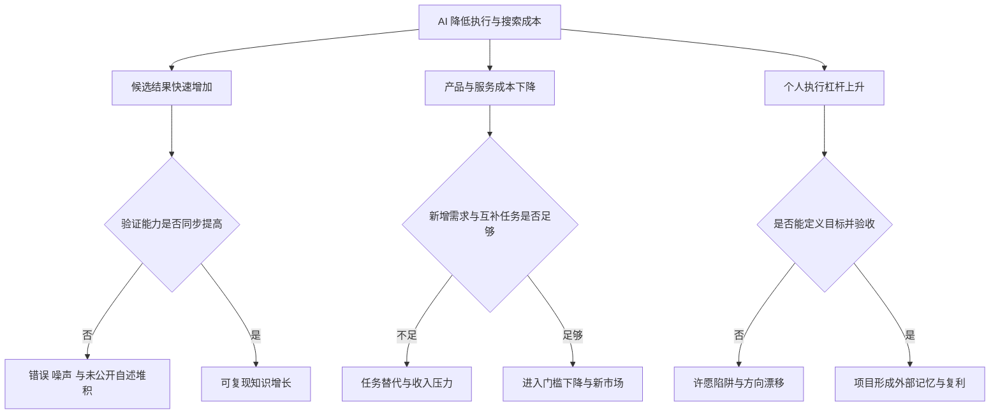
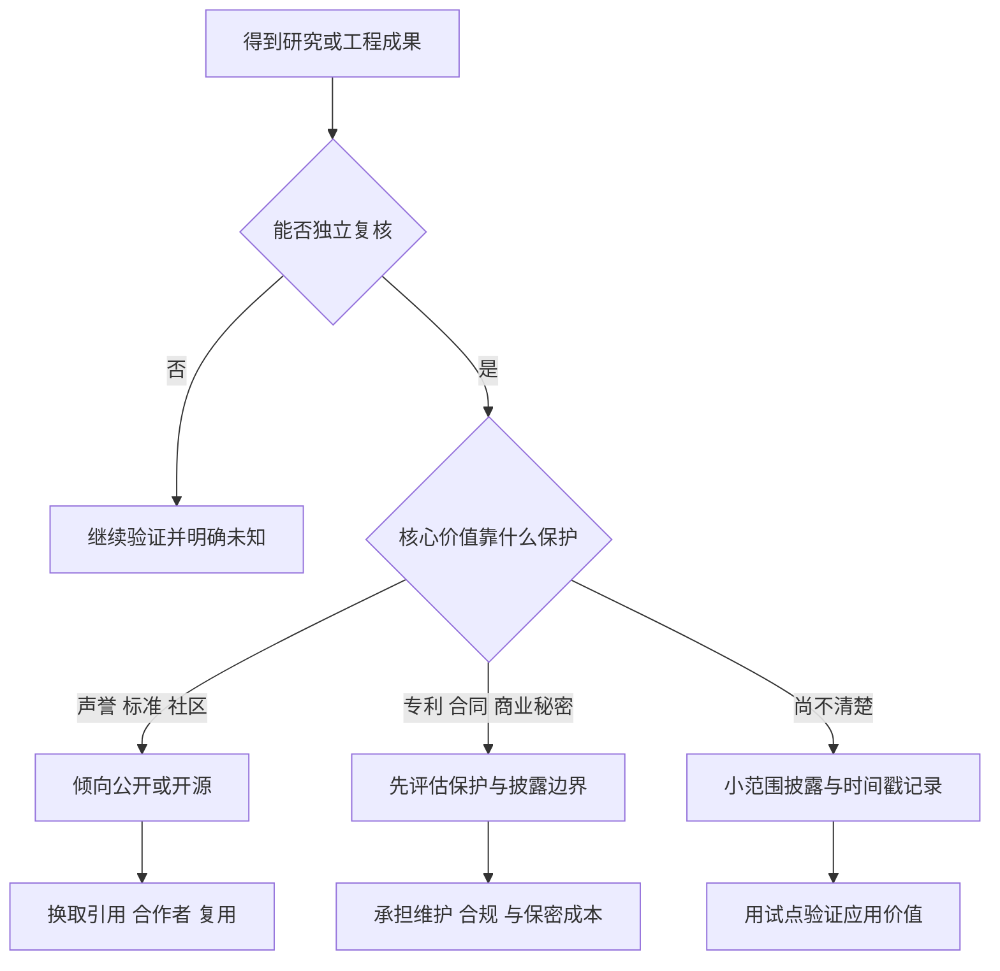
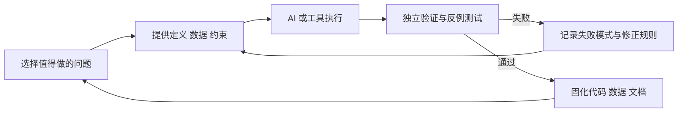
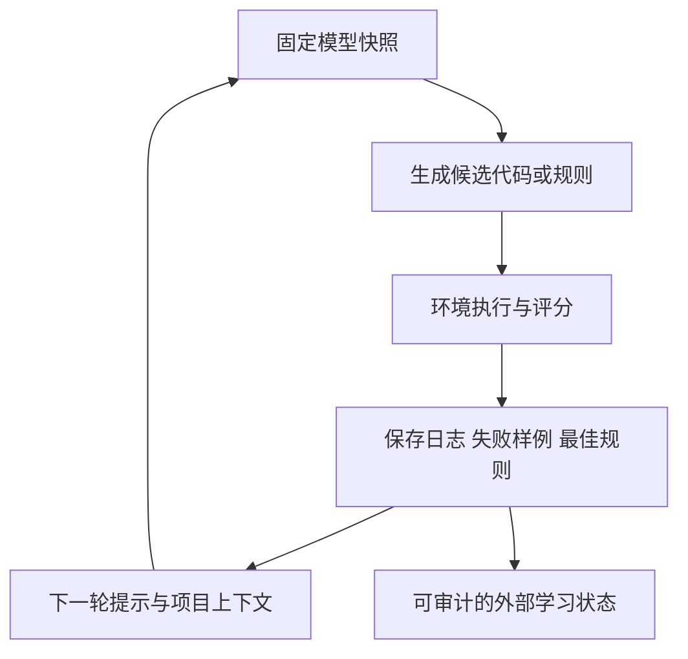

# 总结稿

[打开单页 HTML 总结](assets/bilibili-BV1UKbh66EMj-summary.html)

## 一句话结论

这场两小时直播的核心不是“AI 越强，人越该撤退”，而是：**当执行成本下降，人的稀缺性会从亲手完成每一步，转向选择问题、定义目标、验证结果、组织知识和承担风险。** 这是一套有启发性的行动框架，而不是已经被就业数据或数学成果完整证明的规律；职业前景取决于具体任务、地区、制度与时间尺度，数学进展也必须区分公开纪录、形式验证和讲者自述。

## 直播主线地图

| 章节 | 讨论重点 | 稳妥结论 |
|---|---|---|
| `[00:00–17:58]` 数学研究 | AI 如何帮助搜索构造、优化常数；中间过程和私有数据是否有价值 | AI 可以扩大搜索与试验规模，但“得到更好数字”仍需公开证明、复核与清晰归属 |
| `[18:01–34:59]` 验证、发表与开放 | 形式化验证、论文价值、先发优势、开源动机 | 当复制成本下降，发表和开源的激励会变化；这取决于声誉、应用、商业保护与社区规模 |
| `[35:02–77:59]` 就业与需求 | 创造性破坏、成本下降、需求扩张、电工、创业者角色 | AI 既可能替代任务，也可能降低入门成本并创造新需求；不能从单一案例推出净就业结论 |
| `[78:02–106:59]` 专业知识与工作流 | 为什么“会提目标”仍需要领域知识；本地资料、技能文件和验证循环 | 专业判断不是被提示词取代，而是被重新部署到问题拆解、上下文建设和验收上 |
| `[107:01–122:01]` 外部记忆与启发式学习 | 从旧笔记续写、规则脚本、工具选择、打砖块实验 | 模型权重不必在线更新；项目仍可通过外部代码、规则、日志和反馈积累能力 |

## 数学研究：搜索能力不等于已发表成果

讲者从微积分的“新语言”类比出发，主张 AI 让研究者能更快探索以前成本过高的路线。他又以 π 的无理性测度为例：公开论文确实在 2019 年给出 `μ(π) ≤ 7.103205334137`；作者是 Doron Zeilberger 与 Wadim Zudilin，不宜概括为“两位俄罗斯研究者”。[原始论文](https://arxiv.org/abs/1912.06345)（`[06:35]`）

讲者随后称自己用 AI 把上界推进到 `7.101`（`[06:48]`）。截至 2026-08-20，没有找到可审阅的论文、预印本、证明或代码；公开资料仍列出 `7.103205334137`。这只能写成**讲者尚未公开的自述**，不能写成新世界纪录，也不能因未检索到就断言其错误。

直播在 `[15:10]` 说“所有无理数都是 2”是错误的。稳妥版本是：所有无理数的无理性测度至少为 2；代数无理数由 Roth 定理得出恰为 2，Liouville 数则可为无穷，π 的精确值仍未知。[Roth 原论文](https://londmathsoc.onlinelibrary.wiley.com/doi/10.1112/S0025579300000644) 关于 Flint Hills 级数，公开结果支持单向命题“若该级数收敛，则 `μ(π) ≤ 2.5`”，不支持把反向命题或严格 `< 2.5` 直接当成定理。[Alekseyev 论文](https://arxiv.org/abs/1104.5100)（`[15:16]`）

因此，研究结果最好分四层管理：

1. **探索线索**：模型给出的猜想、参数与可能路线；
2. **机器检查结果**：在指定程序、输入和精度下通过；
3. **可审阅证明**：假设、推导和代码足以被第三方复现；
4. **公开纪录**：经过公开传播、同行检查并明确与既有工作比较。

讲者关于保密密码学的例子有历史依据：GCHQ 曾在 1970 年代早期独立发现公钥密码思想，直到 1997 年才公开。[NSA 历史资料](https://www.nsa.gov/History/Cryptologic-History/Historical-Figures/Historical-Figures-View/Article/3006218/clifford-cocks-james-ellis-and-malcolm-williamson/) 但这只说明重要成果可能不在公开文献中，不足以证明“密码学最高峰一定在安全机构”。

## 发表与开放：执行变便宜后，激励结构会重排

`[10:00–33:50]` 的论证是：理论成果单靠作者可能无法找到全部应用，公开能让其他人继续组合；但若一个昂贵项目刚公开就能被低成本复制，先发优势也可能变成先发劣势。于是，研究者会在几种回报之间重新权衡：

- 公开以换取声誉、引用、合作者和社区规模；
- 保留数据、流程或商业秘密以保护投资；
- 开源难以独占、容易被重复造出的通用工具；
- 把精力转向更难验证、更能形成体系的组合问题。

这是机制分析，不是“AI 必然终结论文”或“所有成果都该开源”的事实结论。真实选择还取决于专利、合同、复现成本、机构评价与公共利益。

## 就业经济：不要在“撤退”和“无事发生”之间二选一

直播从 `[40:01]` 起用汽车、制冰、内容生产等例子说明：成本下降不仅会抢走旧生产者，也可能扩大有效需求、催生过去负担不起的产品和角色。由此得出“AI 越擅长，进攻者越可能用低成本进入”的策略（`[75:01]`）。这是一种**条件性判断**：只有当新增需求、互补任务或新市场增长足以吸收被替代任务时，机会扩张才可能抵消损失。

以电工为例，讲者说行业有前景且“自动化无法替代”（`[65:19]`）。美国劳工统计局确实预计电工就业在 2024—2034 年增长约 9%，平均每年约 8.1 万个职位空缺；但这是美国口径，不能代表中国弱电市场，也不能证明任何电工任务永远无法自动化。[BLS 电工展望](https://www.bls.gov/ooh/construction-and-extraction/electricians.htm) ILO 的 2025 年研究也强调，生成式 AI 暴露更常意味着任务转型而非岗位整体立即消失，但这同样不是“就业总会增长”的保证。[ILO 2025 更新](https://www.ilo.org/publications/generative-ai-and-jobs-2025-update)

讲者在 `[72:14]` 用个人破产制度解释创业失败成本。截至核查日，中国没有覆盖全国的一般性个人破产法，但说“中国完全没有个人破产程序”不准确：深圳条例自 2021 年实施，2026 年仍有配套试点规则。[深圳个人破产条例](https://sf.sz.gov.cn/gkmlpt/content/8/8586/post_8586018.html) 是否有一部法律也不足以单独比较中美创业风险，还要看债务结构、执行、社会保障、融资和地区规则。

### 一个更可靠的职业判断表

| 问题 | 需要的证据 | 常见误区 |
|---|---|---|
| 哪些任务会被替代？ | 任务级基准、成本、可靠性、责任与部署约束 | 把模型演示等同于全岗位自动化 |
| 哪些需求会增加？ | 价格弹性、使用频次、新客户与互补服务 | 假设人的需求无限或完全固定 |
| 谁能捕获收益？ | 议价权、平台规则、资本、资质与分配制度 | 把产出增长直接等同于个人收入增长 |
| 应该学什么？ | 地区职位数据、技能邻接性、训练成本与个人优势 | 只追逐“AI 暂时不会”的静态清单 |

## 专业能力的新位置：目标、上下文、验收与记忆

`[78:02–106:59]` 反复强调：不了解前沿的人，很难提出真正有信息量的目标；宏观愿望还可能落入“字面满足、实际失败”的许愿陷阱。因而领域专家的工作不是只写一句提示词，而是：

1. 把长期目标拆成有停止条件的任务；
2. 给出定义、反例、工具与已知失败路线；
3. 保存过程中形成的脚本、数据和决策依据；
4. 用独立方法验收，而不是让生成者自己宣布成功；
5. 把失败和边界写回项目，使下一轮不从零开始。

这也解释了讲者为什么强调本地知识库、技能文件和旧笔记：它们为项目提供可持续的外部记忆。需要额外提醒的是，直播提到保存健康和财务数据交给 AI 分析属于个人做法，不应在缺少数据最小化、权限、加密与服务条款评估时照搬。

## “模型不学习”，项目仍然可以学习

在 `[114:57]`，讲者把基础模型与启发式项目区分开。更准确地说：一次推理交互不会即时改写所调用模型快照的权重；服务以后仍可能切换版本，记忆/RAG 也能改变可用上下文，合格内容还可能进入后续离线训练。[OpenAI 模型开发说明](https://help.openai.com/en/articles/7842364-how-chatgpt-and-our-language-models-are-developed)

`[115:27]` 提到的 Breakout 演示确有公开项目：Codex 的 `gpt-5.4` 反复修改外部 Python 规则策略，得分提升积累在代码、规则和日志里，而不是模型权重里。[项目与实验材料](https://github.com/Trinkle23897/learning-beyond-gradients/blob/main/learning-beyond-gradient.html) 这能证明一种工程式“外部学习”路径存在，但它是作者演示，不是独立复现的通用持续学习基准。

讲者关于“某些极低资源语言从 GPT-3.5 到后续版本几乎没改善”的说法（`[116:44]`）缺少语言、版本、数据集和评分，无法核验。跨版本能力比较必须锁定模型快照、提示、样本和指标。

## 观众讨论与补充

观众最有价值的作用是提出反例和待验证问题，而不是替视频背书：有人质疑需求是否会持续扩张，有人担心逻辑推理岗位像计算任务一样被接管，也有人主张由领域专家搭建循环式 AI-for-Science 工作流。另有观众要求核查一个“AI 推进黎曼猜想相关结果”的页面；在原始论文、证明与专家评议被审阅前，它只能是线索。

样本非常有限：仅 11 条顶层热门评论候选（平台报告 28 条评论）、无嵌套回复；当前可访问弹幕只有 2 条，且不是历史全集。点赞、回复和单点弹幕都不能证明事实或代表总体情绪。

## 最值得带走的行动框架

面对“AI 已经会做 X，我是否该撤退”，不要先问职业名称，而要依次问：

1. AI 替代的是哪些具体任务，可靠性和责任边界是什么？
2. 成本下降后，需求是萎缩、迁移还是扩张？谁能获得新增价值？
3. 我是否拥有定义目标、提供上下文和验收结果的领域能力？
4. 能否把每轮产出固化成数据、规则、工具和可复现记录？
5. 哪些结论是公开核验的事实，哪些只是讲者经验、观众意见或未来推演？

**真正需要撤退的，往往不是整个领域，而是“只靠重复执行、没有验证与积累”的工作方式。** 但这仍是策略建议：做决定前必须用本地职位数据、个人约束和小规模试验校准。

# 辅助理解

## 如何理解这场直播

直播把数学研究、开放科学、就业经济和个人知识工程串在一起。最有用的阅读方式不是逐个接受例子，而是抓住一个共同变量：**AI 降低了执行与搜索成本，随后改变验证成本、发表激励、市场需求和个人分工。** 这些后果不是同方向自动发生，必须逐层加条件。

这张图说明：直播的乐观结论依赖两个关口——**验证**和**需求**。任何一个关口失败，“AI 更擅长”都可能只带来更多噪声或更激烈竞争。

## 1. 数学部分：先分清四种“进展”

画面中出现“已核验里程碑与有限边界”的项目笔记，最适合把研究进展拆为四种状态：

| 状态 | 可以说什么 | 不能说什么 |
|---|---|---|
| 模型找到候选 | 值得继续检查 | 已证明、已创新 |
| 程序通过计算 | 在给定输入与实现下成立 | 对所有情形成立 |
| 证明可复现 | 第三方能核对假设与推导 | 已成为当前纪录 |
| 公开并比较既有工作 | 有明确来源、日期和边界 | 永久不会被更新 |

π 的无理性测度恰好展示了混淆的风险。公开论文支持 `μ(π)≤7.103205334137`，[Zeilberger 与 Zudilin 原论文](https://arxiv.org/abs/1912.06345)；讲者所称 `7.101` 尚无公开材料，只能归为个人自述。另一个口误“所有无理数都是 2”则应改为：无理数的测度至少为 2，代数无理数恰为 2，而超越数不必如此。[Roth 原论文](https://londmathsoc.onlinelibrary.wiley.com/doi/10.1112/S0025579300000644)

frame 10 只证明直播进入了具体数学公式页，不能独立证明公式、推导或项目里程碑正确。它提醒我们：**看见复杂符号不是验证，能沿依赖链复算才是验证。**

## 2. 发表与开放：复制成本下降改变博弈

讲者认为，成果公开能让别人找到应用，但廉价复制也可能削弱先发优势。可以把选择写成一个非绝对决策树：

AI 并不会让“开放”自动正确，也不会让“保密”自动有利。越容易复制，越需要想清楚自己要获得的是首发声誉、社区规模、服务收入、专利权还是知识公共品。

## 3. 就业部分：任务、需求、分配是三层问题

frame 5 直接呈现了“AI 会画画、写代码、做视频，人是否应该换赛道”的核心提问：

直播的反论点是成本下降也可能降低入门门槛、生成新需求。frame 6 展示了从内容生产成本下降转向“有效需求”的论证：

但就业不能只看技术能力，需要拆成三层：

- **任务层**：模型能演示，不等于能在责任、可靠性和成本约束下部署。
- **市场层**：降价可能扩大使用，也可能只是压缩原有收入；需求弹性必须有数据。
- **收入层**：总产出增加也可能集中到平台、资本或少数高杠杆人员。

视频以电工作为难替代岗位。美国 BLS 的确预计 2024—2034 年电工就业增长约 9%，但这不能证明中国弱电市场同样增长，也不能推出“永远无法自动化”。[BLS 官方展望](https://www.bls.gov/ooh/construction-and-extraction/electricians.htm) 因而更好的行动不是追逐一份“AI 不会做的职业清单”，而是寻找**任务互补性**：现场感知、责任承担、跨方沟通、复杂异常处理，以及用 AI 降低非核心工作成本。

## 4. 专业知识没有消失，而是移到控制回路

直播后半段最扎实的观点是：不了解领域的人很难提出高质量目标，也难发现“字面完成、实质失败”。领域能力会从亲手执行全部步骤，转移到控制回路：

这里的“独立验证”很关键：让同一个生成过程自己宣告成功，容易把一致的偏差循环放大。可以使用不同算法、形式验证、小样本人工复算、盲测或外部评审。

## 5. 外部记忆：模型权重不变，项目仍能积累

一次模型调用不会因当前对话即时修改基础权重，但项目可以把经验写入规则、脚本、测试、检索库和日志。Breakout 演示正是这种结构：Codex `gpt-5.4` 修改外部 Python 策略，得分变化保存在项目工件中，而不是神经网络权重里。[实验材料](https://github.com/Trinkle23897/learning-beyond-gradients/blob/main/learning-beyond-gradient.html)

这不等于模型获得了通用持续学习能力。它更像一个带版本控制的自动化工程循环：能力提升依赖环境反馈是否可靠、保存了什么、能否回滚，以及规则是否过拟合。

## 6. 观众意见应该如何使用

观众提出了三类有价值的“压力测试”：需求可能有限；逻辑推理岗位可能像计算任务一样被替代；AI for Science 可能需要领域专家维护循环工作流。它们分别攻击直播的需求假设、替代边界和协作设计，适合变成后续问题，但不是证据。

样本只有 11 条顶层热门评论候选和 2 条当前可访问弹幕。热门排序、有无回复、内容消费焦虑都会改变可见性；不能据此估算支持率或整体情绪。最稳妥的用法是把评论转成可检验问题：

1. 对哪个职业、哪些任务、哪个地区、哪一时间范围？
2. 需求扩张由价格、质量还是新场景驱动？
3. 新增产出如何分配给劳动者、平台和资本？
4. 数学成果是否有原始证明、版本记录与独立复核？

## 7. 把直播变成个人实验

选一个你熟悉的任务，做两周小实验：

1. 记录人工基线：耗时、错误率、返工和满意度。
2. 让 AI 只负责一个边界清楚的子任务。
3. 预先写验收条件和失败回滚方式。
4. 把提示、输入、输出、修正和测试保存到项目。
5. 比较节省的时间是否转化为更高价值工作，而不是更多噪声。
6. 若效果成立，再扩大范围；若失败，记录是能力、数据、流程还是责任边界的问题。

这样，“要不要撤退”会被改写为一个更可操作的问题：**哪些任务值得交给 AI，哪些判断必须由我保留，怎样让每轮工作变成下一轮可复用的资产？**

## 外部事实核验

### 声明 1（03:51）

- 视频陈述：讲者以“牛顿发明微积分”为例，说明新数学语言能让原本难以处理的问题变得可解。
- 核验状态：部分确认
- 核验结果：牛顿确实奠定了微积分的重要基础，但将其归为牛顿一人“发明”过度简化：莱布尼茨独立发展了微积分，相关面积、切线和求积方法也有更早的历史。微积分后来系统统一了这些问题的处理方法。
- 检索日期：2026-08-20
- 来源：
  - [MacTutor: Isaac Newton](https://mathshistory.st-andrews.ac.uk/Biographies/Newton/)（primary）
  - [MacTutor: The rise of calculus](https://mathshistory.st-andrews.ac.uk/HistTopics/The_rise_of_calculus/)（secondary）

### 声明 2（06:35）

- 视频陈述：讲者称两位俄罗斯研究者在 2019 年把这一世界纪录推进到 7.103 多。
- 核验状态：部分确认
- 核验结果：数值和时间基本准确：Zeilberger 与 Zudilin 于 2019 年提交论文，证明 μ(π)≤7.103205334137，改进了此前的 7.606308。不过作者是 Doron Zeilberger 与 Wadim Zudilin，称其为“两位俄罗斯研究者”并不准确或至少缺乏依据。
- 检索日期：2026-08-20
- 来源：
  - [Zeilberger and Zudilin: The irrationality measure of π is at most 7.103205334137](https://arxiv.org/abs/1912.06345)（primary）
  - [Computational Number Theory, 2020 journal paper PDF](https://msp.org/cnt/2020/9-4/moscow-v9-n4-p06-p.pdf)（primary）

### 声明 3（06:48）

- 视频陈述：讲者称自己最近沿用前述两位研究者的方法，用 AI 将结果优化到了 7.101。
- 核验状态：未验证
- 核验结果：截至核查日，检索到的公开论文和近期数学资料仍将 7.103205334137 列为公开上界；未找到可审阅的论文、预印本、证明或代码来支持 7.101。由于讲者明确描述的是尚未公开的个人进展，缺少公开记录不能反证该结果，只能暂列未核实。
- 检索日期：2026-08-20
- 来源：
  - [Zeilberger and Zudilin: published 7.103205334137 bound](https://arxiv.org/abs/1912.06345)（primary）
  - [Robert Dougherty-Bliss dissertation (2024), discussion of the current record](https://sites.math.rutgers.edu/~zeilberg/Theses/RobertDoughertyBlissThesis.pdf)（primary）

### 声明 4（08:43）

- 视频陈述：讲者以 NSA 等安全机构为例，认为涉及密码系统漏洞的最高水平成果可能不会公开发表。
- 核验状态：部分确认
- 核验结果：历史材料确认，国家密码机构确实开展过长期保密、后来才解密的研究；例如 GCHQ 在 1970 年代早期独立发现了公钥密码思想，直到 1997 年才公开。不过这只能证明重要成果可能长期不公开，不能验证“密码学最高峰一定在安全机构”这一价值判断。
- 检索日期：2026-08-20
- 来源：
  - [NSA: Clifford Cocks, James Ellis, and Malcolm Williamson](https://www.nsa.gov/History/Cryptologic-History/Historical-Figures/Historical-Figures-View/Article/3006218/clifford-cocks-james-ellis-and-malcolm-williamson/)（primary）
  - [NSA: NARA Releases](https://www.nsa.gov/History/Cryptologic-History/NARA-Releases/)（primary）

### 声明 5（15:10）

- 视频陈述：讲者说“所有无理数都是二，所以它最小是二”。
- 核验状态：存在矛盾
- 核验结果：该表述错误。所有无理数的无理性测度至少为 2；Roth 定理给出代数无理数的测度恰为 2，但超越数不必等于 2，Liouville 数的无理性测度为无穷。π 的精确无理性测度仍未知。
- 检索日期：2026-08-20
- 来源：
  - [K. F. Roth: Rational approximations to algebraic numbers](https://londmathsoc.onlinelibrary.wiley.com/doi/10.1112/S0025579300000644)（primary）
  - [MathWorld: Irrationality Measure](https://mathworld.wolfram.com/IrrationalityMeasure.html)（secondary）
  - [MathWorld: Liouville Number](https://mathworld.wolfram.com/LiouvilleNumber.html)（secondary）

### 声明 6（15:16）

- 视频陈述：讲者称 Flint Hills 级数若收敛，则 π 的无理性测度必须在 2.5 以下；并进一步把发散与不低于 2.5 联系起来。
- 核验状态：部分确认
- 核验结果：Alekseyev 证明了单向结论：若 Flint Hills 级数收敛，则 μ(π)≤2.5。该来源不能支持视频中更强的反向说法，也不能把严格“小于 2.5”替换为论文的“不超过 2.5”。
- 检索日期：2026-08-20
- 来源：
  - [Max Alekseyev: On convergence of the Flint Hills series](https://arxiv.org/abs/1104.5100)（primary）

### 声明 7（65:19）

- 视频陈述：讲者说现在学电工有前景，理由是自动化无法替代且行业需要人才，尤其是弱电方向。
- 核验状态：部分确认
- 核验结果：美国劳工统计局预计电工就业在 2024—2034 年增长约 9%，平均每年约有 8.1 万个职位空缺，支持“美国市场需求较强”。但该统计不能外推到中国所有地区或弱电细分行业，也不能证明电工任务“无法”被任何自动化替代；ILO 也强调 AI 暴露通常意味着任务转型而非简单等同于岗位消失。
- 检索日期：2026-08-20
- 来源：
  - [U.S. Bureau of Labor Statistics: Electricians](https://www.bls.gov/ooh/construction-and-extraction/electricians.htm)（primary）
  - [ILO: Generative AI and Jobs — A 2025 Update](https://www.ilo.org/publications/generative-ai-and-jobs-2025-update)（primary）

### 声明 8（72:14）

- 视频陈述：讲者称中国还没有个人破产法，个人不能像在美国那样宣布破产后重新开始。
- 核验状态：部分确认
- 核验结果：截至核查日，中国尚无覆盖全国的一般性个人破产法，但绝对说“没有个人破产法/程序”不准确：深圳个人破产条例自 2021 年实施，相关试点在 2026 年仍运行，厦门等地也有经济特区地方制度。仅凭是否有个人破产制度，无法验证中美创业失败成本的整体比较。
- 检索日期：2026-08-20
- 来源：
  - [深圳经济特区个人破产条例](https://sf.sz.gov.cn/gkmlpt/content/8/8586/post_8586018.html)（primary）
  - [深圳市政府公报：个人破产申请前辅导规程等文件续期（2026）](https://www.sz.gov.cn/zfgb/2026/gb1413/content/post_12808631.html)（primary）
  - [最高人民法院：全国首宗个人破产案件](https://www.court.gov.cn/zixun/xiangqing/314461.html)（primary）

# Data

## 增强转写稿

# 校正字幕

- Video ID: `BV1UKbh66EMj`
- 领域：AI-assisted mathematical research, open science, labor economics, personal knowledge, and heuristic tool learning
- 编辑边界：保留全部原始片段、时间戳及顺序；只修正高置信专名、技术术语和明显 ASR 损坏。无法可靠还原的口语残片保持原样，不以推断补写。
- 证据边界：字幕中的数字、历史叙述、产品能力、性能指标和未来判断仍是视频陈述；校正不等于事实核验。

## 术语表

- Math Research Solver / 研究地图：讲者用于长期数学探索并保存成功、失败与支线路径的 AI 工作流。
- π 的无理测度（irrationality measure）：直播前段讨论的数论指标；数值与纪录属于待核验事实，不因字幕校正而成立。
- Flint Hills 级数：与 π 的无理测度相关的级数问题。
- arXiv：预印本平台；不等同于同行评审期刊。
- SageMath / Mathematica：后段作为符号计算工具示例出现。
- 启发式学习：讲者对“固定基础模型 + 工具/脚本/反馈迭代”方法的称呼，不表示模型参数在线更新。

## 逐字稿
[00:00] 工作節奏越來越快
[00:01] 要處理的事情越來越多
[00:02] 直播時間就沒有辦法
[00:04] 在週內的以前的時間去直播了
[00:08] 那就只有週末
[00:09] 週末也有很多事情
[00:12] 行 那我就說週末挑一天
[00:14] 基本上我最近
[00:15] 我覺得我可以說我是24小時工作者
[00:18] 雖然以前在過去來做這是比較科幻的事情
[00:21] 但是在現在來說
[00:22] 科幻已經變成現實了
[00:24] 就14秋4的時候
[00:25] 我基本上現在是24小時工作者
[00:27] 但是我上線的時間還是比較健康的
[00:30] 沒有說一定要幹到12個小時那種
[00:32] 但是我基本上會在出門之前
[00:38] 比如設計要你去幹什麼事情
[00:40] 還有睡覺之前
[00:42] 我都會把一部分工作先交接好
[00:47] 交接完了之後交給AI去幹
[00:49] 然後我重新上線了之後
[00:50] 再去驗收做反饋
[00:52] 基本上我保證說我想要做的事情
[00:55] 基本上24小時都有在前進
[00:58] 你錯什麼了
[00:59] 馬可和波羅
[01:01] 我確實最近沒有直播通知
[01:04] 反正大家記著
[01:05] 不是週六 週日
[01:07] 現在基本上直播就是這樣一個狀態
[01:09] 你私信轟炸我
[01:11] 我都沒看到
[01:13] 因為我踩起來
[01:14] 我還沒有看B站
[01:16] 主要是沒有辦法放大
[01:17] 怎麼說Why的
[01:18] 我下次一定還是提前一天放一下預約好了
[01:22] 其實有的時候預約
[01:24] 我今天已經錄了
[01:26] 為什麼我現在基本上往24小時工作去做
[01:31] 不是因為要捲
[01:33] 是因為想法很多
[01:34] 想要達成的事情也很多
[01:36] 然後又不想輕易的去取捨
[01:38] 那要不然就增加工作時長和效率
[01:42] 因為我覺得睡覺的這些時間
[01:44] 還有你出去社交做
[01:46] 做其他事情的時間
[01:48] 完全是人類還沒有開發的時間段
[01:50] 以前大家不是說分身法術
[01:53] 現在覺得也可以分身
[01:54] 本週第一次成功把plus一週額度全部耗光
[01:59] 可以
[02:00] 孤接
[02:01] 而且也是在探索他的可能性
[02:03] 哪個天才數也加雲樓了
[02:05] 大家現在看了這個東西
[02:06] 叫是我做的一個東西
[02:08] 叫研究地圖
[02:09] 它主要想解決什麼問題
[02:10] 有的時候你讓AI去
[02:13] 長時間的去嘗試解決某個公開的問題
[02:18] 其實我發現
[02:19] 以前的人過於在乎結果了
[02:22] 沒有去評估支線任務的價值
[02:24] 因為很多發現它是无心插柳的結果
[02:28] 就像人類第一次發現青霉素
[02:30] 還有比如說原子能的發現和利用
[02:35] 很多都是意外的結果
[02:36] 並不是說我一定要去做這個事情
[02:40] 而是我做的的時候
[02:41] 突然發現這個東西還挺有意思的
[02:43] 歡迎小課本週
[02:44] 歡迎我們的見解
[02:46] 這種大綱不是你想像的那樣子
[02:48] 6月末說的和大綱有什麼區別
[02:52] 這個不是我寫的是AI寫的
[02:56] 它什麼意思
[02:56] 我們進行一個超長時間的研究的時候
[03:00] 我希望它把它嘗試過那些路線
[03:03] 試過那些方法遇到了障礙
[03:05] 都把它記錄下來
[03:07] 這個東西要做成是AI可以看的
[03:09] 人也可以看的
[03:11] 就是這樣
[03:12] 即便你最後沒有成功的達到你的追蹤目的
[03:15] 那麼你中間的這個過程也是非常重要的
[03:19] 此外這是數學方面的AI
[03:22] 想要再上一个台阶所需要的必要的數據
[03:27] 就是現在的AI
[03:28] 如果大家繼續還是去單純的攻克
[03:31] 給一個公開問題
[03:33] 你嘗試所有人類資料裡面有記載的手段的
[03:36] 各種組合
[03:37] 然後看能不能做下去
[03:39] 那麼它會經歷一段
[03:41] 就讓大家眼前一亮的時間
[03:44] 但是等數據用完了
[03:47] 就是你必須要發明新的東西
[03:49] 探索新的理論
[03:51] 就像牛顿发明微积分一样
[03:54] 就是我們現在很多問題用微积分去做的
[03:57] 但是你能想像一下你沒有用微积分的時候
[04:00] 你為了解決某一個需要用微积分的
[04:04] 東西的數學問題
[04:06] 然後你由於語言的不足
[04:08] 你想象一下为什么阿基米德没有办法解决
[04:09] 然後你卡在一個地方很久
[04:11] 你想像一下為什麼阿基米德沒有辦法解決
[04:14] 我們現在的很多那種
[04:15] 很看起來比較規則
[04:18] 但是只是形狀
[04:19] 它是彎曲的那種圖形的面積
[04:22] 體積的計算
[04:24] 阿基米德沒有解決
[04:25] 它只是解決了
[04:26] 像球體和圓錐體這樣的體積
[04:29] 它沒有解決所有的這種東西
[04:31] 為什麼
[04:32] 因為它沒有微积分
[04:33] 不是阿基米德不夠聰明
[04:35] 它沒有資源
[04:37] 所以如果AI想要在數學上
[04:39] 在上一個台中它所需要的數據
[04:41] 又不只是說前人的論文
[04:44] 或是書籍了
[04:45] 它還需要
[04:47] 是怎麼失敗的數據
[04:49] 對就你不能說只看成功的案例
[04:52] 你還要看失敗的案例
[04:53] 比如說這樣做為什麼不能成功
[04:56] 這樣做為什麼就不能對
[04:59] 還有很多其他的數據是目前來說
[05:01] 公開的書籍論文裡面是沒有的數據
[05:04] 你要這方面的數據才能夠再進一步
[05:07] 人也是一樣的
[05:10] 今天是突然直播
[05:11] 不好意思
[05:12] 至少這方面數據會比較重要
[05:15] 然後還有我剛才說的
[05:16] 不只是最終的目的地之前
[05:19] 它的中間過程也可以很值錢
[05:22] 只是說AI它
[05:24] 我一定要跟它講
[05:24] 你用AI的時候千萬要把當成一台機器
[05:28] 你不要賦予它人格
[05:30] 因為它本來也沒有
[05:31] 比如它的價值觀裡面
[05:32] 比如我讓它去做最終的目的
[05:35] 它就是朝著最終的目的地去做的
[05:37] 中間產生了什麼東西它是不會認為它有價值的
[05:42] 除非你賦予它價值
[05:44] 比如說你賦予它一個主要目標
[05:46] 和幾個次要目標
[05:48] 那麼它就會認為有些目標是有價值
[05:50] 就是說它是沒有價值觀的
[05:52] 那價值觀是需要你去賦予它的
[05:54] 它也是沒有數學品位的
[05:56] 什麼好什麼是不好
[05:57] 只要是跟最終結果無關的通通都是沒有用的
[06:01] 那這個你是需要賦予它的
[06:04] 歡迎向司令
[06:05] 因為這個你是需要賦予它的
[06:07] 所以我做的Math Research Solver
[06:10] 在上一期我發表會員的資料裡面之後
[06:15] 我又更新了很多很多
[06:17] 就可能已經是版本大改了
[06:18] 比之前改了還要多
[06:20] 其實其中一個比較重要的就是說研究地圖
[06:23] 這是我最近比較關心的一個問題
[06:26] 我今天會錄的
[06:28] 我关心的这个问题是 π 的无理测度
[06:33] 這数论丢番图逼近裡面的一個主題
[06:35] 这是数论丢番图逼近里的一个主题
[06:39] 把它推到了世界紀錄
[06:42] 2019年的時候
[06:44] 他們是7.103多少
[06:48] 然後我最近用AI把它做到了7.101
[06:51] 就優化了一點點
[06:54] 就在他們兩個人的方法上面
[06:56] 再優化了一點點
[06:58] 歡迎鷹海MAT
[06:59] 我優化了一點點
[07:00] 對看不出來
[07:02] 推進了一點點
[07:04] 那你說推進這麼一點有價值嗎
[07:06] 我覺得沒什麼價值
[07:07] 你給過去你倒是可以發一篇
[07:09] 我覺得中等篇下的數學論文
[07:13] 你可以水一篇文章
[07:14] 但是現在怎麼說價值就沒那麼大了
[07:16] 現在有AI之後
[07:17] 我希望大家可以思考一下
[07:20] 學術的本質
[07:21] 你有沒有想過一個數學家
[07:23] 一個科學家
[07:24] 一個研究人員
[07:25] 他為什麼要把自己的學術成果
[07:27] 發在期刊上
[07:29] 你說自古以來就如此
[07:31] 按照魯迅說的
[07:33] 自古以來就對嗎
[07:35] 就為什麼大家要把結果發出來
[07:36] 如果你想一想一個成果
[07:38] 如果一個成果
[07:40] 它發出來獲得的你的優先權
[07:44] 和你的名譽之類的加成
[07:46] 它甚至小於你的製作出來的成本
[07:49] 你覺得大家會有發的積極性嗎
[07:52] 就比如說如果你以後發一個數學結果
[07:54] 大家覺得不夠如此
[07:56] 我用AI一下子也能做出來
[07:59] 那你覺得這種東西有發的必要嗎
[08:02] 有必要嗎
[08:03] 還有一種情況也沒有發的必要
[08:05] 比如說你在材料科學方面
[08:08] 你不僅發現了室温超导
[08:12] 你不僅發現了
[08:14] 你還找到了量產的方法
[08:15] 對你不僅發現了室温超导的配方
[08:19] 你還找到了量產的方法
[08:21] 而且量產的成本也被你降下來了
[08:25] 你還有必要發論文嗎
[08:27] 你發出來幹什麼
[08:28] 讓別的國家的人都來學習一下
[08:31] 我跟你說你的成果馬上你要不成立一家公司
[08:33] 要麼要麼被變成國家的專門的技術
[08:38] 直接給你保密起來
[08:39] 還有有些像密碼學的研究也是一樣的
[08:43] 比如说有人发现美国的 NSA
[08:46] NSA
[08:49] 美國國家安全部門的密碼系統
[08:51] 有致命漏洞
[08:53] 他們沒有發現
[08:55] 然後這種學術成果
[08:57] 會發在paper 上嗎
[09:00] 不會的
[09:02] 人家講說密碼學的最高的山
[09:05] 並不在學術界
[09:07] 密碼學的最高的山
[09:08] 在各國的安全部門裡面
[09:11] 就他們的研究成果是不對披露的
[09:14] 發到大廠上了不能過意
[09:17] 所以你要維護人類的開源的學術體系
[09:21] 它得有一些制度上的基礎
[09:25] 如果連這個基礎不存在
[09:27] 其實這個體系是會衰落的
[09:29] 你如果發出來
[09:30] 大家覺得這也不是很大個事
[09:32] 我用AI也能做出來
[09:34] 那你發出來你得到了名譽
[09:35] 優先權的加成是很低的
[09:37] 大家沒有這個動力去發
[09:39] 第二如果一個人他用他自己很厲害
[09:43] 還有很好的資源
[09:44] 他借助最強的AI
[09:46] 他做出了成果之後
[09:49] 你想一想那些搞理論科學的
[09:51] 他為什麼會把很大的成果也發在期刊上
[09:55] 我們先不管什麼崇高的理想
[09:57] 我知道有的人是有的
[09:59] 但是不是人人都有的
[10:00] 但是為什麼人人都會發
[10:02] 因為發了對他有價值
[10:04] 比如說你是一個理論物理學家
[10:06] 你是一個數學家
[10:07] 你做了一個數學成果
[10:09] 那麼他能有應用價值嗎
[10:10] 你自己是做不到的
[10:12] 你只有把它發出來
[10:13] 成為人類公有的公共知識
[10:15] 總有人找到他的應用價值
[10:17] 總有人找到
[10:18] 比如你是一個做数论的
[10:20] 有人在密碼學上面找到你應用價值
[10:22] 你是一個做優化的
[10:23] 有人在AI上面找到你優化理論的價值
[10:26] 你是沒有辦法找到應用價值的
[10:29] 但是有人能夠幫你找到
[10:31] 所以你把它變成人類公有的公共知識之後
[10:33] 經過幾十年
[10:34] 可以對人類各科學的滲透
[10:36] 你就終於終於有價值了
[10:38] 但是如果有一天當AI技術強大到
[10:42] 我如果做出了某個理論的前進
[10:47] 而且也很重大
[10:48] 不是別人輕鬆能做出來的
[10:50] 同時 AI還能幫你找到他的應用價值
[10:53] 你不需要發出來讓別人去找
[10:56] 你自己就能找到他的應用價值
[10:57] 而且找到應用價值之後
[10:58] 你還能把他繼續往下推進
[11:00] 那麼就會有一種終極的一天
[11:03] 當一個物理學家一個數學家
[11:05] 當他發明出一個理論之後
[11:06] 他能在一點兩年之內把這個理論
[11:09] 變成現實應用
[11:10] 兩年三年之內把他變成一個
[11:12] 一個產品一種技術和專利
[11:14] 那麼到那一天的時候
[11:16] 你會看到一些頂級的理論研究者
[11:19] 他就不再是數學家物理學家了
[11:22] 他會成為某種類似於科學創業者
[11:25] 有點類似 爱迪生那種感覺
[11:27] 就有點類似 爱迪生那種感覺
[11:29] 他還想我為什麼發出來
[11:31] 所以這也是一種可能
[11:32] 沒說而已
[11:34] 有聲音的
[11:35] 所以我覺得很多東西
[11:36] 大家不要認為向來如此就是對的
[11:39] 很多東西他的形成
[11:41] 是多方面的結果
[11:43] 他就像我們這個社會一樣
[11:45] 我們講老一輩
[11:46] 我們這台上上一代的人
[11:48] 做很多事情都需要
[11:50] 喜歡找熟人
[11:52] 找認識的人
[11:54] 喜歡各方面去認老鄉攀交情
[11:58] 為什麼
[12:00] 他是有原因的
[12:01] 不是這些人天生就喜歡這樣
[12:03] 他是形成了一種潛在的運作的規則
[12:08] 這樣子做肯定是對相當一般人有好處的
[12:11] 是有他存在的意義的
[12:12] 所以這些人才會去遵守這個規則
[12:15] 但是等時代變化了之後
[12:17] 有些他所成立的基本的條件就不存在了
[12:21] 既然基礎條件都已經不存在了
[12:22] 他已經發揮不出他的用處了
[12:24] 那麼這個東西就會日漸的衰落下去
[12:26] 只不過他需要走一段時間
[12:28] 比如一代人
[12:30] 所以有的時候一些技術
[12:32] 發明出來之後
[12:33] 他對這個社會的改造
[12:35] 他從很底層開始
[12:36] 比如說
[12:37] 你想像一下在沒有電燈的時代
[12:41] 你會有晚上加班這一說嗎
[12:43] 沒有
[12:44] 看都看不見做什麼
[12:46] 直接睡大覺
[12:47] 但是你看現在如果有了電燈以後
[12:50] 對不對
[12:50] 還有為什麼現在的公司
[12:53] 現在有很多商業的寫字樓高樓
[12:57] 他其實就是為現在的公司的體系
[12:59] 來創造的一種建築
[13:02] 因為公司可能
[13:03] 他的體量很大
[13:05] 他需要一堆人在一起協調工作
[13:10] 很多公司又不是原來的工廠的形式
[13:12] 他的員工不是全是那種
[13:14] 是流水線的工人的形式
[13:16] 他很多是這種白領工作
[13:18] 那也是因為服務業的興起
[13:20] 有白領工作的大量的誕生
[13:22] 那白領工作為什麼會大量誕生呢
[13:24] 他也是有理由的
[13:26] 但如果當這個理由不存在的時候
[13:28] 還會有白領這樣的工作嗎
[13:30] 可能就很少了
[13:32] 那可能會有其他的工作
[13:33] 總之我們現在認為理所當然的東西
[13:37] 他背後都有
[13:38] 規律的
[13:39] 所以馬斯克很喜歡講第一性原則
[13:42] 就是你去倒退這個東西
[13:44] 他背後的根本是為什麼
[13:45] 而不是認為說
[13:47] 向來如此就一定是這樣子
[13:49] 那不一定
[13:49] 還真不一定
[13:51] 就很多事情你需要去追尋他
[13:53] 他是怎麼誕生的
[13:55] 為什麼是這樣子
[13:57] 他的根本是什麼
[13:59] 那如果有一天根本可以發生改變
[14:02] 那他未來還是這個樣子
[14:03] 他當然就不是這個樣子的
[14:05] 核檢公司
[14:06] 我還沒有公開
[14:06] 因為我覺得沒有太大的發表價值
[14:08] 所以我把它放在這裡
[14:11] 我是這樣想的
[14:12] 等我把那個π 的无理测度的
[14:14] 把它降到七以下的時候再公開
[14:16] 好吧
[14:17] 把它降到七以下
[14:18] 我再公開
[14:19] 不過我個人覺得
[14:20] 把它降到七以下
[14:21] 也不是什麼好大的事情
[14:23] 可能就公開就公開
[14:25] 反正可能我也不會太
[14:26] 如果說他背後的方法
[14:28] 還有很多新的應用價值
[14:29] 我覺得才會寫成一篇論文
[14:31] 如果只是一個結果
[14:32] 而且大部分是AI做的話
[14:34] 給70%是AI做的
[14:36] 那我覺得其實也沒有太大的發表價值
[14:38] 就可能給大家看一看
[14:40] 如果有人有感興趣
[14:42] 你就不要從7.103開始做了
[14:44] 有人已經做了6.9了或者怎麼樣
[14:47] 你也可以跟人去看
[14:48] 對社會的原子化
[14:49] 也是有它的形成的原因的
[14:51] 我希望大家想很多事情的時候
[14:54] 大家可以去想一想
[14:56] 它的根在哪裡
[14:57] 而不是覺得就向來如此
[14:59] 就這樣子就把理由給搞過去了
[15:02] 有沒有人猜想這個精確的上界
[15:04] 有人覺得π 的无理测度的上界
[15:07] 最多是多少
[15:08] 最多就是二
[15:09] 最小是多少
[15:10] 最小就是二
[15:10] 所有無理數都是二
[15:12] 所以它最小是二
[15:13] 但是有人覺得它是二不太可能之類的
[15:16] 還有Flint Hills的極速收斂
[15:18] π 的无理测度起碼是在2分之5以下
[15:23] 必須是在2分之5以下
[15:25] 但是如果Flint Hills的極速發散
[15:27] 那麼它就必須在2.5
[15:29] 就不是2.5以下了
[15:31] 精確是多少真的沒有人猜出來
[15:32] 就大家在想它的一個範圍主要是
[15:34] 對
[15:35] 是
[15:35] 那我覺得
[15:37] 以後數學
[15:38] 就可能會有新的模式
[15:40] 是當大家做數學的能力提升了以後
[15:43] 不要
[15:44] 一有什麼結果
[15:45] 就想著說我要發一篇論文
[15:47] 因為結果太小了
[15:48] 大家看不上你的論文
[15:50] 只說現在還有很多人用舊的標準來評判
[15:53] 所以覺得在我發一篇
[15:54] 能夠
[15:56] 搞個畢業
[15:57] 或者過一下考核之類的
[16:00] 覺得可能是這樣子
[16:02] 但是等標準上來了以後
[16:04] 就可能大家沒有發的動力了
[16:06] 發arXiv可以
[16:07] 投期刊知道大概是過不了的
[16:10] 所以大家可能會更加的注重說
[16:13] 我先做它十幾個結果出來
[16:15] 而且這十幾個結果互相之間是有關的
[16:17] 然後我再來找找這裡面的規律是什麼
[16:20] 我能不能從這些結果的新的進展裡面
[16:23] 發現一種新的方法
[16:24] 新的概念
[16:25] 新的理論
[16:26] 像這樣的東西
[16:28] 所以以後可能數學的研究它是一個大項目
[16:31] 它不是說我做出了一個公開問題
[16:33] 就暫時一篇文章了
[16:36] 可能你說我做出10個公開問題
[16:38] 而他們互相之間是有關係的
[16:39] 後我發現了一個
[16:41] 裡面的一個本質的規律
[16:43] 我給它命名為什麼
[16:44] 這個東西還有這樣的性質
[16:46] 然後我再通過這些性質
[16:48] 去優化那10個公開問題的證明
[16:52] 我發現這10個公開問題裡面
[16:53] 都蘊含著相似的內在結構
[16:56] 然後我一篇論文闡述這個內在結構
[16:58] 順便把這10個公開問題的解答全部公開出來
[17:02] 這就是我想像中的
[17:03] 未來10年裡面的那種數學的大研究
[17:07] 未來數學的研究會往大這個方向去走
[17:10] 一個是大一個是難
[17:12] 更難
[17:13] 因為未來的公開問題會越來越難
[17:15] 你想像一下比如說明年再過幾年
[17:18] 如果我發出一個公開問題
[17:20] 首先我發出公開問題之前
[17:22] 我肯定會讓我的專用的AI去跑
[17:24] 它個三天上夜甚至一週
[17:25] 我直接跑它一週
[17:27] 發現都沒有辦法
[17:29] 說明這個問題很難
[17:30] 嘗試了基本上
[17:32] 大家一拍腦袋能想到的方法
[17:35] 應該都是不可以的
[17:37] 所以它是一個公開問題
[17:38] 所以這是往難的方向去走
[17:39] 另外一個是大很綜合
[17:42] 就可能以前是一次走一米
[17:44] 就可以發一個結果了
[17:46] 現在是直接我走一公里
[17:49] 再向大家發一個結果出來
[17:51] 就有可能會這樣
[17:53] 就以後往得更大更難的方向去走
[17:55] 就發二開單純發一下
[17:56] 使得別人工作不重複就發二開
[17:58] 這個是很正常的一個渠道
[18:01] 但是我覺得可能會有新的渠道
[18:03] 未來可能會有新的渠道
[18:04] 未來新的渠道可能有那種更新結果用的
[18:09] 因為新的渠道還有一個好處
[18:10] 它可以做一個AI的接口
[18:12] 讓AI去搜索結果的時候
[18:15] 不至於說
[18:16] 你看現在AI在網上搜結果的時候
[18:18] 就整個網頁瘋狂的翻
[18:20] 什麼論壇期刊甚至博客瘋狂的翻
[18:23] 我見過最搞笑的就是
[18:25] 发 arXiv 可以
[18:27] 投期刊的话大概是过不了的
[18:30] 但他找東西的時候真的很無力投
[18:32] 但是我給他去找那個
[18:35] 就是這個派的無力測度的上界
[18:37] 他找了找的時候他連什麼Google Play都翻出來了
[18:39] YouTube都翻出來了
[18:41] YouTubeGoogle Play是幹什麼的嗎
[18:42] Google Play是下
[18:44] 下手機APP的地方
[18:46] 他這種地方去翻派的無力上界
[18:48] 你可以想像一下
[18:50] 他的搜索有多少優化的空間
[18:53] 你想一個正常人怎麼會在Google Play上面去找數學結果
[18:56] 他肯定是哪個關鍵詞撞到了
[18:58] 然後去裡面找發現不對退出來
[19:01] 但如果我們可以給他一個專用接口
[19:02] 讓他的比如說搜索效率是原來10倍
[19:06] 其實人與人之間的信息差會越來越小的
[19:09] 就不會因為你是一個本科生
[19:11] 所以你的對前沿的認知的信息
[19:14] 會比博士生落後多少
[19:17] 至少公開的信息你是應該都是差不多的
[19:20] 當然有些東西沒有公開
[19:21] 所以你就不知道
[19:22] 像懷爾斯那樣做秘密的研究是吧
[19:26] 這個你可能不知道最新的進展
[19:27] 就這樣效率會更高一點
[19:30] 所以那個時候很多有的新的結果
[19:31] 可能會屬你的名字或者怎麼樣
[19:34] 但是他不會是一個發來期看一下
[19:36] 大家就應該是一個比較綜合性的東西
[19:39] 但那個時候又會有一個問題
[19:40] 要壓縮論文的篇幅
[19:41] 不要把什麼證明都一股腦的
[19:44] 往論文裡面去糊
[19:46] 你可能寫一些證明思路
[19:48] 或者是證明當中核心的結構
[19:50] 那所有的細節就不要往上面堆了
[19:53] 所有的細節可能會以一種全新的方式去呈現
[19:57] 它是壓縮的
[19:58] 然後我默認你用AI去看細節
[20:00] 或用程序去檢驗細節
[20:02] 但可能大家就沒有那麼在乎細節
[20:04] 如果說對細節的證明是非常嚴謹的話
[20:08] 比如說形式化的證明
[20:09] 以及非常方便準確率非常之高了
[20:12] 遠超人類的準確度的時候
[20:14] 那麼其實大家就可以信任
[20:16] 就像大家現在比較信任程序一樣
[20:18] 比如說我用maximalica去算的
[20:20] 我大概率會認為這個算的是對的
[20:22] 因為maximalica算積分的準確率比我高
[20:25] 所以我覺得maximalica算出來是對的
[20:27] 那就是對的
[20:28] 就是我會非常信任它
[20:29] 工具給我的自信
[20:31] 所以在這種情況上
[20:33] 如果maximalica算出來是對的
[20:34] 我不會去核驗
[20:36] 我覺得是對的
[20:37] 就像現在如果你去算加減程序法
[20:40] 比如你算333 x 999
[20:42] 然後你用計算機按出來
[20:44] 是一個結果
[20:45] 你覺得
[20:46] 那大概就是這個結果
[20:48] 因為你會比較相信計算機算的結果
[20:50] 你就會想說我再去手算一遍複合
[20:53] 你覺得還好應該就是這樣子
[20:55] 所以那個時候大家是講數學的語言
[20:58] 它可能會更高級一點
[20:59] 就信息含量更多一點
[21:01] 就基本上就沒有去核驗
[21:04] 每一部證明細節的工作了
[21:06] 可能就不是交給人去做了
[21:07] 我看一下評論
[21:09] 龍龍是小孩說的
[21:10] 1的無理測度是2
[21:13] 這個是比較簡單的
[21:14] 前人早就已經知道了
[21:16] 甚至不知道
[21:17] 我們不僅知道1的無理測度是2
[21:19] 我們還知道1的k分之2
[21:21] 四方的無理測度
[21:23] 就是k如果是整數
[21:24] 比如說1的5分之2
[21:26] 1的k是正整數
[21:28] 比如你k取2的時候
[21:29] k分之2就是1
[21:30] 所以1的1四方的無理測度是2
[21:32] 那如果k是5
[21:33] 1的5分之2
[21:34] 7分之2
[21:35] 它的無理測度也是2
[21:37] 所以1的無理測度
[21:38] 它的
[21:38] 當然不是說1的所有的
[21:40] 有理四方都知道
[21:41] 我們只知道k分之2
[21:42] 總之1的k分之2
[21:43] 和1的無理測度都是2
[21:44] 上界下界都是2
[21:46] 這是比較早期
[21:48] 咱們就知道了
[21:49] 我們還知道的一些信息
[21:50] 比如說所有的代數無理數
[21:53] 無理測度都是2
[21:54] 這是一個拿了Fair自講的結果
[21:56] 相對幫我們排除了一大堆
[21:57] 代數無理數
[21:58] 只要你不是超越數
[21:59] 超越無理數
[22:00] 那麼你不是超越數
[22:02] 它的無理測度都是2
[22:04] 所以這個就會簡單一點
[22:05] 超越數裡面我們還不知道的
[22:08] 比如說1的k分之2
[22:09] 不
[22:09] 1的k分之2我們知道
[22:10] 1的任何有理四方的
[22:11] 我們還不知道
[22:13] 這個tendent
[22:14] tendent的k分之1的形狀
[22:16] 我們也知道它也是2
[22:17] 雙曲正切的結果
[22:19] 就是10h
[22:20] k分之1也是2
[22:22] 這個也是知道的
[22:23] 無理測度為2的東西
[22:25] 是比較普遍的
[22:27] 有一個結果是證明
[22:28] 在時數軸上面
[22:30] 無理測度大約2的無理數
[22:33] 是整個的集合
[22:34] 在勒貝克測度下是0測度
[22:37] 這算是十分西的一個習題
[22:40] 也就是說大部分無理數的
[22:42] 無理測度都是2
[22:43] 所以π 的无理测度是不是2
[22:44] 它其實是我們
[22:46] 它是一件會左右
[22:48] 我們的世界觀的一件事情
[22:50] 也就是說人類最開始發現的
[22:53] 第一個無理數是派
[22:55] 這個無理數
[22:57] 第一個不是派
[22:59] 第一個是耕耙2
[23:02] 人類發現的第一個
[23:04] 應該說人類認為最重要的一個無理數
[23:06] 最常見的一個無理數
[23:07] 或是研究著最多的一個無理數
[23:09] 應該是派
[23:10] 這樣說應該沒有問題
[23:11] 第一個發現的無理數是耕耙2
[23:12] 對咱們說錯了
[23:13] 然後人類第一個發現的超越數也不是
[23:18] 也不是派
[23:19] 只它猜測它是而已
[23:20] 我們現在的世界觀知道兩件事情
[23:23] 大多數無理數都是超越數
[23:25] 大多數無理數的無理測度都是2
[23:28] 這兩件事情
[23:29] 那麼派是不是大多數呢
[23:32] 也就是說我們人類認為非常特殊的
[23:35] 非常重要的無理數派
[23:37] 它究竟是一個頻頻無期的無理數
[23:40] 就它既超越無理測度就是2
[23:43] 這就是頻頻無期
[23:44] 它是頻頻無期的無理數
[23:46] 還是一個非常特別的無理數
[23:48] 究竟是哪一種
[23:49] 這個節目是會改變我們的世界觀的
[23:52] 派它夠特殊嗎
[23:54] 用AI學習有什麼建議嗎
[23:56] 我會在頻道裡面慢慢介紹的
[23:58] 反正大家都摸著石頭過河
[24:00] 我有一些覺得可以固化的
[24:02] 因為我不喜歡說發現一點點就跟大家公開
[24:06] 那過一段時間就不是這樣子了
[24:08] 那就很麻煩
[24:09] 我不希望大家做那種追新技術
[24:12] 心裡很慌
[24:12] 然後要追新技術
[24:13] 我學了很大一堆
[24:15] 發生又沒有用
[24:15] 就像之前有人去折騰那個龍蝦
[24:18] 折騰了半天
[24:19] 最後一發
[24:19] 好像各家公司又開始出自己的
[24:22] 專用的智能體
[24:23] 智能體又普及了
[24:24] 沒有人用龍蝦了是吧
[24:25] 所以有一部分人的焦慮心態
[24:27] 我可以理解
[24:28] 但是你不要瞎跑
[24:30] 我說了不是說你跟著前言走
[24:33] 你就不會吃虧
[24:35] 你的先發優勢必須要能夠轉化為
[24:38] 難以被市場大多數人取代的東西
[24:42] 或者形成某種有一定護身盒的東西
[24:45] 才能叫先發優勢
[24:47] 否則你先發不但沒有優勢
[24:49] 反而是劣勢
[24:50] 為什麼
[24:50] 因為先發你要付出更大更多的試措成本
[24:54] 更高的學習成本
[24:56] 還有一些資金的投入
[24:59] 說白了就是
[25:01] 如果你花10萬塊錢研究一個東西
[25:04] 它又沒有護身盒
[25:06] 別人說原來這樣做是對的
[25:07] 然後一個月就把你抄過來了
[25:09] 要做的跟你差不多
[25:10] 甚至比你更好
[25:11] 而且它的成本只花了100塊
[25:13] 或者1000塊
[25:15] 你哪來的先發優勢呢
[25:17] 你不是先發劣勢嗎
[25:18] 對不對
[25:19] 所以不要一有什麼新的東西出了
[25:21] 心裡就發慌
[25:22] 我覺得不行了
[25:24] 你先讓別人去探探路
[25:25] 等這個東西穩定了
[25:26] 你再去學
[25:27] 也不視為一種生存方式
[25:30] 這一點應該說咱們國家
[25:32] 還挺有心得的
[25:34] 所謂彎道超車
[25:35] 你可以花上萬億去研究新技術
[25:38] 然後我們發現原來這樣做是對的
[25:39] 學了
[25:42] 這個AI有搞的
[25:44] 你凡是要做第一個你的成本得多高
[25:46] 然後別人做出來
[25:47] 原來這樣做是對的
[25:48] 其他都是錯的
[25:50] 我把所有的錢都砸在對的方向上
[25:52] 要不了一年半載
[25:54] 3.5年我就跟你差不多了
[25:57] 也是一種方法
[25:58] 你資金不太寬裕
[25:59] 時間也不太充裕的情況下
[26:01] 當然做第一也是有好處的
[26:04] 他可以轉換為壟斷優勢
[26:05] 等你成為壟斷優勢
[26:06] 有很高的糊塵盒以後
[26:08] 別人發現去追你
[26:09] 跟你做個一樣的
[26:11] 沒有性價比
[26:12] 還不如就跟著你做
[26:14] 或者說直接買你的產品
[26:15] 或者就你去做
[26:17] 我們做其他的
[26:18] 把你認為是整個行業內的一個
[26:22] 基礎節點一樣的東西
[26:23] 你說什麼就是什麼
[26:25] 那這次先發的一個優勢
[26:27] 但是能不能把先發轉換為優勢
[26:30] 這裡面是有講究的
[26:33] 不是說你只要走得比別人快
[26:35] 你就是優勢
[26:36] 這是很多人的一個誤區
[26:37] 走得快不一定等於優勢
[26:39] 甚至有可能是你的劣勢
[26:41] 你私信發我吧
[26:42] 五零成千語你發呗
[26:44] 什麼還有人頂著我的ID給我發言
[26:47] 用DS定制內核
[26:49] 磨改然後變磚
[26:51] 等工具拆機
[26:54] 我以前幹過這個事了
[26:55] 當然最開始我用CHATGPT的時候
[26:57] 用Codex的時候第一個月
[26:59] 我就幹過這個事
[27:01] 我用Codex磨改一些東西
[27:03] 後來Codex打不開了
[27:05] 重裝也不行
[27:06] 然後我是把它的根木爐裡面的所有東西
[27:09] 全部刪乾淨
[27:10] 然後再重新登錄
[27:13] 才可以
[27:14] 所以現在有什麼新東西出來之後
[27:16] 大家不要心裡發慌知道嗎
[27:18] 不要心裡發慌
[27:20] 要不要已有個什麼東西
[27:21] 就心裡就跟有螞蟻在爬一樣
[27:25] 就我再不跟上時代我就完了
[27:27] 我就落後了
[27:28] 你會發現過去三年
[27:29] 從23年到26年
[27:31] 很多人去一會兒去學什麼提示詞
[27:34] 一會兒又去學這個
[27:35] 那個大多數人都沒搞出什麼名堂
[27:37] 我說實話假如你現在高三
[27:39] 暑假是吧
[27:41] 九月份開學了
[27:42] 你花兩個月
[27:44] 你頂大多數人三年的學習
[27:49] 就他折騰的那一堆
[27:51] 大多數現在用不上了
[27:52] 能用得上的
[27:53] 現在有成熟的教程
[27:55] 你可能花兩個月就學會了
[27:57] 你說你頂什麼用
[27:59] 你比我先學三年有什麼用
[28:00] 他說只要有人有先發優勢
[28:02] 就一如領先
[28:04] 怎麼可能
[28:04] 我說了牛頓
[28:05] 奈布里茲
[28:06] 威爾斯特拉斯科西
[28:07] 劉威爾這精神
[28:09] 搞了兩三百年的分析學
[28:12] 你不也就一年多就把它學會了嗎
[28:14] 人家花三百年搞出來
[28:15] 你只用花一年半就把它學會了
[28:18] 這只未來技術跟先進之後你只說不定花八個月就把它學會了
[28:22] 我說白了以後科技再發達
[28:25] 人們研究出了什麼
[28:27] 什麼空間跳躍的技術
[28:28] 還是幹什麼的技術
[28:29] 只要這玩意兒能寫進教科書
[28:31] 你不就一個學期就搞懂這個原理是什麼回事了嗎
[28:34] 就好像現在這樣你去配置什麼
[28:36] 化學物質
[28:37] 你照著配方配不就完了嗎
[28:39] 你別管這個配方是多少人花了多少時間探索出來的
[28:43] 只要它向你公開
[28:44] 你不就馬上就學會了嗎
[28:45] 除非它先發變成壟斷
[28:47] 比如說第一個造原子彈的國家叫美國
[28:50] 它造錯原子彈之後它開始說何不擴散
[28:53] 你們都不准學誰學我打誰
[28:55] 那確實你很難學的會
[28:57] 你說老師我想學怎麼造原子彈
[28:59] 那肯定老師說我也沒辦法
[29:02] 原理不難
[29:03] 高隆梭幼你能拿到嗎
[29:06] 隆梭幼你拿得到嗎
[29:08] 做隆梭幼的那些設備和技術你拿得到
[29:12] 對不對
[29:12] 所以我說為什麼造原子彈
[29:14] 這樣一個80年的技術
[29:17] 沒有人批量復刻
[29:19] 因為它有護城河
[29:21] 護城河在哪裡
[29:23] 還有原料的就隆梭幼的製造
[29:25] 你看那麼多國家侵權國之力
[29:27] 搞了那麼多年沒有輕易搞到
[29:29] 當然像巴基斯坦印度朝鮮這樣的國家
[29:33] 他們有自己的辦法
[29:35] 但是現在越來越難了
[29:36] 所以現在很多是這樣子的
[29:38] 有護城河的東西大家不願意公開
[29:41] 沒護城河的東西盡可能的公開
[29:43] 為什麼說白了就是撈點名聲
[29:45] 咱們把話說藍天一點說現實一點
[29:47] 哪有那麼多人說什麼偉大的開源
[29:50] 其實無非就是這玩意你不開源
[29:53] 你不公開很快也會有人搞出來
[29:56] 而且它的擴散速度會比你想得快
[29:58] 所以我直接把它開源之後
[30:00] 撈一個撈一個第一人的稱號
[30:03] 或者是我知道這個東西它沒有什麼應用價值
[30:07] 或者說我很難找到它的應用價值
[30:09] 但是如果有一天它會有應用價值
[30:11] 它可以把整個社區做大
[30:14] 比如說我有一個程序
[30:16] 有個代碼一個技術
[30:17] 它其實很難找到什麼應用價值
[30:19] 很難變現很難幹什麼不得了的東西
[30:22] 而且大概率過個幾個月幾週也會有人摸索出來
[30:26] 差不多的東西
[30:28] 所以我乾脆直接把它開源
[30:30] 開源了之後很多人會感興趣
[30:32] 因為有用但不賺錢也沒有太高的護城河
[30:37] 大家就去在這上面去做開發
[30:40] 我獲得了什麼我獲得了比如說第一個開源的人
[30:43] 振得一點名聲
[30:44] 第二我對這個技術的進一步發展的結果
[30:48] 是有需求的
[30:50] 首先我感興趣
[30:51] 第二它對我有用我才會去開發
[30:53] 但是我自己開發不了那麼好
[30:55] 所以我就集眾人之力
[30:57] 把它開發到比如說我發出來是0.5的版本
[31:00] 有人把它開了1.5、2.5、3.5、4.5、7.9
[31:04] 那這個東西越來越好用了
[31:05] 對我來說也是有用也是有價值的
[31:08] 我免費的讓這個東西得到了版本的不斷的蝶帶
[31:12] 集眾人的智慧
[31:13] 大家再把這個社區做得更大
[31:16] 比如說很多的商業的非商業的把這個東西當成
[31:19] 基礎的設施去做
[31:22] 就不需要自己親自開發
[31:23] 要去做出更有意思的東西
[31:25] 更好的東西
[31:27] 這個社區也變得更活躍了
[31:29] 蛋糕做的更大人
[31:30] 大概就是這個意思
[31:31] 還有的東西技術開源但是東西很難
[31:35] 有護城河
[31:37] 比如說你持續的去研發
[31:39] 研發成本很高
[31:41] 你可以免費用你可以開源但是
[31:44] 你大概沒錢去研發
[31:45] 還有你要用這個東西它跟物理世界有關
[31:49] 像我剛才說原子彈一樣
[31:51] 我給你技術你我給你理論你做得出來嗎
[31:54] 濃縮用你找得到嗎
[31:57] 還有政策原因是吧
[31:59] 你真想濃縮用
[32:00] 你真不要命
[32:01] 還有就是像Deep Sake這樣
[32:03] 我技術公開給你
[32:04] 開源的
[32:05] 那你研發你不得要錢嗎
[32:07] 比如說你隨便
[32:09] 一個小公司你能研發嗎你有錢嗎
[32:11] 這玩意就是燒錢的
[32:13] 第二
[32:14] 開源給你是吧
[32:15] 你可以自己部署服務器
[32:17] 但是你成本能用我低嗎
[32:21] 那玩意動不動一個服務器幾百萬呢
[32:23] 那我有規模效應
[32:24] 我賣的API是比你自己
[32:26] 搞一台服務器還便宜
[32:28] 所以它也是可以上一遍我開源我還可以上一遍
[32:31] 還有一個原因
[32:32] 如果我的
[32:33] 技術
[32:34] 我的模型的
[32:35] 性能還最難的問題上面
[32:37] 我捲不過OPEN-I
[32:40] 我在搞必源
[32:41] 我怎麼活
[32:42] 都是必源
[32:44] OPEN-I的效果還比我好
[32:46] 我怎麼活
[32:47] 我開源還可以把OPEN-I的價格打下來是吧
[32:50] 讓它有一點危機感
[32:51] 所以很多事情就是這樣子
[32:53] 所以你有一點有什麼優勢也不是
[32:56] 任何東西都值得必源的
[32:59] 有東西沒有意義你知道嗎
[33:00] 開源甚至
[33:02] 所以如果你有一個東西
[33:03] 你是先發
[33:04] 或者你是先驅
[33:06] 你認為它可能擴散速度會很快
[33:08] 很難商業變現
[33:10] 但是你對這條路還有追求
[33:12] 然後你發現你自己一個人的能力是比較有限的
[33:15] 其實把它開源出來
[33:17] 也是一個很
[33:18] 很正常的道路
[33:19] 當然如果你發現它
[33:20] 這個玩意兒
[33:21] 它是有一定的互稱和的
[33:24] 你可以通過
[33:25] 必源的方式
[33:27] 必源加商業的模式
[33:29] 能夠給你
[33:30] 帶來源源不斷的資金
[33:32] 然後你可以用這個資金去招募人員
[33:34] 或者是去繼續迭代
[33:37] 也是一種玩法
[33:39] 你看怎麼對你怎麼是合理的
[33:41] 該開源的時候開源
[33:42] 該必源的時候必源
[33:44] 就不要說我什麼都開源或者說我什麼都必源
[33:46] 搞得好像是
[33:48] 那種必走之真的感覺
[33:50] 也不要這樣搞
[33:55] 它輸出了一個結果
[33:57] 沒有錯現在我正在直播我的AI也還在幫我幹活
[34:02] 我不浪費任何的時間
[34:05] 我切換一下我看一下現在
[34:09] 搞到什麼狀態
[34:10] 切換一下
[34:11] 最近算力不是很健康的
[34:13] 所以不敢什麼都用那個
[34:15] 害去搞
[34:16] 現在算力比較緊張
[34:18] 對如果你用國內的AI
[34:19] 其實也可以參考這個模式
[34:21] 因為國內現在AI定價
[34:23] 它是按像電價一樣有播風播鼓的設置
[34:26] 是你白天你可以
[34:28] 選擇去做一些AI比較難以做到的事情
[34:31] AI比較不太擅長的事情
[34:32] 需要很多的人來主導的工作
[34:35] 那你白天少量的用愛
[34:37] 大部分你把你應該做的工作做好了以後
[34:41] 到晚上的時候
[34:43] 你就把你的工作交接給AI
[34:45] 讓AI去做它擅長的事情
[34:48] 這樣你
[34:49] 經濟上也比較
[34:51] 有優勢
[34:52] 因為相當晚上你
[34:54] 大量用愛用到的是
[34:56] 播股價
[34:57] 白天少量用愛
[34:59] 播風價的時候你少量用愛
[35:02] 更多的是人工去處理
[35:04] AI產生出來的東西還有就是
[35:06] 思考下一步的計劃
[35:07] 做一些小規模的實驗或者是
[35:10] 嘗試
[35:11] 晚上去大規模的去搞
[35:12] 這樣子你
[35:13] 就業交替的去做
[35:15] 第一個進度還可以
[35:17] 第二個是經濟成本也算力成本會被壓下來
[35:20] 我覺得這樣子
[35:21] 也不視為一種方法
[35:23] 對嘛你獲得更多的用戶
[35:26] 它其實效果是跟低價策略是一樣你低價先獲客有一整套生態了之後
[35:31] 你也是你的生存之道
[35:33] 我再給大家講一個我最近想到的一個主題
[35:38] 我看對很多人挺焦慮的
[35:41] 因為AI這個事情大家很焦慮覺得感覺好像
[35:46] 自己
[35:47] 身不逢時的感覺
[35:50] 我覺得大可不慮這樣
[35:52] 我覺得很多那個心態
[35:54] 很多人那個心態包括一些
[35:56] 包括我看到一些名校的學生他都有這種心態
[35:59] 那我認為就是這種心態合理
[36:02] 但不是對於每個人來說都是正確答案
[36:05] 所以大家要去思考要去
[36:08] 去思考這裡面就是大家要開放的心態
[36:10] 很多人的一個心態就是AI越擅長什麼
[36:14] 我們就必須要從這個領域退出
[36:16] 在直播間的有沒有人有這種心態的
[36:19] 我的頻道裡面有這種心態的人應該會比其他地方少一點
[36:24] 因為其實我經常反對這個觀點
[36:26] 但是我看到其他的頻道裡面還有網上很多地方的評審區裡面
[36:31] 持這種心態的人其實還挺多的
[36:34] 你去互聯往其他地方看一看很多地方持這種心態的人還挺多的
[36:38] 我對這個心態也做了一番思考
[36:40] 這個心態事實就是AI越擅長什麼
[36:42] 我們就必須要從什麼領域撤退
[36:45] 那這裡面的邏輯是這樣子的
[36:47] 我稱作為這個心態是一種K型分化
[36:50] 人們面對AI技術的時候
[36:53] 也是
[36:54] 兩方面去分化 K型分化
[36:56] 作為有些行業的
[36:58] 站有一定優勢的人
[37:00] 特別是有資源的人
[37:02] 這個資源包括資金物理上的資源
[37:05] 還有人際網絡的資源
[37:07] 像這些人他有權利有資源
[37:10] 有權限他往往就想說AI如果可以
[37:14] 以更低的成本
[37:15] 更高的效率去做到很多事情
[37:17] 那我就要多用
[37:18] 這樣他可以把我的事情做得更好
[37:20] 他的心態是
[37:21] 我有一些想要實現的事情
[37:24] AI如果能夠讓我這個事情更容易實現
[37:27] 我當然要擁抱他
[37:28] 那另外一部分人他想的是什麼
[37:30] 我沒有資源
[37:31] 我也沒有權利
[37:32] 那在這個社會的遊戲當中
[37:34] 我要怎麼
[37:36] 登上這個社會的舞台
[37:38] 我要靠我的才華
[37:40] 我的才能是吧
[37:41] 我的技術
[37:42] 可是你的才能
[37:44] 怎麼樣才能換到資源
[37:47] 換到權限
[37:48] 換到權利的工作
[37:50] 因為這個世界上有需求
[37:51] 然後這個需求我可以滿足
[37:53] 我可以通過我的能力去滿足
[37:55] 如果我能夠
[37:56] 做到的事情越來越多越來越好
[37:59] 是不是別人就需要把更多的
[38:02] 資源和權限交在我手上
[38:03] 讓這個事情做得更好
[38:05] 我才可以一步一步的接觸到
[38:07] 我以前
[38:08] 沒有辦法接觸到的資源
[38:10] 走在一些能夠接觸到的東西
[38:13] 的位置上面去
[38:14] 所以
[38:15] 這其實是很多大學生
[38:18] 登上這個舞台的一種方式
[38:19] 我先通過學習
[38:22] 換來某種
[38:23] 技能
[38:24] 才能的認證證書
[38:26] 然後我再通過這個認證的證書
[38:28] 去市場上去
[38:30] 售賣我的
[38:31] 人力資本
[38:33] 有人如果給我機會
[38:34] 我就進入到一個位置上面
[38:36] 這個位置能接觸到我以前接觸不到的資源
[38:39] 和權限
[38:40] 拿到了之後我開始認為他做事情
[38:42] 增加自己的名譽
[38:45] 事情做得更好了之後
[38:46] 就會有一套上升的渠道
[38:48] 讓我做到更好的位置上面去
[38:50] 接觸更多的資源
[38:52] 這是很多人的一個對自己的職業和人生的一種理解
[38:56] A.I.出現他有一個問題
[38:57] 這條路好像斷了
[38:59] 作為掌握資源和發出命令的人
[39:02] 指揮方向的人
[39:04] 做出決策的人
[39:05] 他把更多的執行的工作
[39:08] 交給AI去做
[39:10] 甚至未來如果交給機器人去做
[39:13] 而不是交給一個年輕人去做
[39:16] 那年輕人就沒有機會
[39:18] 進入到他
[39:19] 想像中的位置上面去了
[39:21] 他就摸不到這些資源
[39:22] 他就沒有辦法完成
[39:24] 一個晉升
[39:25] 那麼他在這個社會上的
[39:27] 權力話語權
[39:28] 他能決定的東西
[39:30] 就越來越少
[39:31] 就感覺自己被邊緣化了
[39:33] 這是很多人的一個
[39:34] 我覺得
[39:35] 也算是理性的思考
[39:36] 這種想法是正常的
[39:37] 用休閒小說的說法來說
[39:39] 用休閒小說的說法來說
[39:41] 如果先路斷絕
[39:43] 為什麼還要休閒
[39:43] 反正說到最後也什麼也沒有
[39:45] 現在
[39:45] 很多人現在對學習
[39:47] 產生了一種厭惡
[39:49] 他覺得沒有意義
[39:50] 反正學到最後我的才能不能變
[39:52] 又不能變現
[39:53] 又不能發揮用處
[39:55] 我上學不就是
[39:56] 養活教育產業嗎
[39:57] 略略說其實會害怕的
[39:59] 20年前不會電腦了
[40:01] 一直學不到的
[40:02] 現在基本上都很邊緣了
[40:04] 但是我給大家指出
[40:06] 另外一種可能性
[40:07] 如果
[40:08] 新的技術是對傳統
[40:09] 行業的一種
[40:10] 創造性破壞的話
[40:12] 那麼如果你認為這個東西
[40:13] 一定會這樣的話
[40:14] 那麼
[40:15] 什麼叫創造性破壞
[40:17] 就是一邊破壞舊的秩序
[40:19] 一邊創造新的秩序
[40:21] 那麼如果大家作為
[40:22] 新人或者是
[40:24] 行業的
[40:25] 底層
[40:26] 為什麼不加入新秩序的建立呢
[40:28] 既然說這傳統行業是
[40:30] 創造性破壞
[40:32] 那你也知道舊秩序
[40:33] 遲早是會崩塌的
[40:35] 那你還發瘋一樣的
[40:37] 往舊秩序裡面捲什麼呢
[40:38] 為什麼你不能是
[40:40] 創造新秩序的人呢
[40:41] 或者至少在新秩序的建立當中
[40:43] 變成一個
[40:44] 重要的人
[40:45] 你比如說我這裡舉個例子
[40:47] 就拿影視行業來說
[40:48] 過去那種模式
[40:50] 你沒法拍電視劇
[40:51] 你哪怕想拍一個短片
[40:54] 你得有錢去請演員嗎
[40:56] 你得有攝像機
[40:57] 你得有
[40:58] 各種設法
[40:59] 資金也是你耗不起的
[41:01] 所以你想進入這個行業的唯一辦法
[41:03] 就是加入一個
[41:04] 成熟的劇組
[41:05] 不管你做什麼職位
[41:07] 你先學如果有機會
[41:08] 你能夠
[41:09] 接替一些重要的工作
[41:10] 慢慢在這個行業裡面
[41:12] 你開始做起來
[41:13] AI做視頻
[41:15] 做電影
[41:16] 做短劇
[41:17] 越來越好了以後
[41:18] 就會看到很多
[41:19] 影視行業
[41:21] 可能不需要那麼是攝影師
[41:23] 燈光師化妝師
[41:25] 演員
[41:26] 就感覺這個
[41:27] 行業的上升路徑斷了
[41:29] 當然頂級的劇組
[41:31] 特別是院縣電影的
[41:33] 我們不說國內最近院縣電影不太好
[41:35] 至少海外來說
[41:37] 院縣電影的票房
[41:39] 已經超過疫情以前了
[41:40] 你很難說它
[41:42] 不繁榮
[41:42] 都是真人電影
[41:43] 主要視頻方面做的
[41:45] 取代的多的是
[41:47] 短視頻
[41:48] 就不是傳統的影視那種短視頻比較多
[41:50] 還有國內主要是短劇衝擊比較大
[41:53] 走那種
[41:54] 下沉市場的
[41:55] 衝擊比較大
[41:56] 有很多東西如果用AI可以替代了
[41:58] 低成本替代了
[41:59] 那好像就不需要這麼多人了
[42:01] 但是同一時間你會發現
[42:03] 像AI短劇AI慢劇AI視頻
[42:06] 迅速的興起
[42:07] 到這東西它其實不需要一個完整的劇組
[42:10] 我看有的寫小說的轉行去做AI短劇就是這樣子
[42:13] 你可以
[42:14] 靠你的分鏡啊靠你的
[42:16] 神魅啊
[42:16] 你一個人其實就可以做AI短劇
[42:19] 一個人就可以
[42:19] 你看一個寫小說的
[42:21] 他對影視行業來說是絕對的新人
[42:24] 但是他不必
[42:25] 加入一個劇組
[42:27] 去
[42:28] 去捲傳統的上身路徑
[42:31] 我直接開一條新路不行嗎
[42:34] 我就是一個寫小說的做AI短劇
[42:36] 可以牛奶
[42:38] 最近不是挺火嗎那東西
[42:39] 啥也不說
[42:41] 你忘了那個嗎直播裡面有一個叫做智希室那種模式的
[42:45] 他也沒有什麼話他有一個背景音樂
[42:48] 自製的一種背景音樂
[42:50] 然後
[42:50] 一個動態畫面但是他不是那種視頻那種動態畫面
[42:54] 他是類似有點
[42:55] 幾秒鐘可能5秒鐘10秒鐘那種動態畫面場景
[42:59] 很火YouTube上百萬關注
[43:01] 國內也有的頻道
[43:04] 很多人看的
[43:05] 從教數學領域跳到職業規劃
[43:08] 最近在想這些話題想一想我竟然想出來寫了文章
[43:11] 跟大家講一講
[43:13] 有機會的時候發生視頻也可以
[43:16] 我練錯了嗎
[43:18] 應該要Lofi嘛
[43:19] 我這裡想從經濟學的角度來講一講
[43:23] 經濟學裡面有一個東西叫有效需求
[43:25] 什麼叫有效需求有效需求就是在經濟學上面你要買得起才能叫
[43:30] 一個對商家來說
[43:32] 才是一個
[43:33] 有意義的需求
[43:34] 比如說我舉個例子人的慾望可以是無窮的
[43:38] 你比如說買車這種東西
[43:41] 如果一個車非常貴
[43:43] 他需要一個普通人10年20年的收入
[43:46] 你能說普通人對車沒有興趣嗎
[43:49] 還是有的
[43:50] 難道你不想開跑車嗎
[43:52] 你不想週末自駕遊嗎
[43:54] 你不想
[43:55] 想去哪裡就去哪裡嗎
[43:57] 不用說
[43:58] 擠公共交通嗎
[43:59] 你不想嗎
[44:01] 甚至如果
[44:02] 可以很多人想擁有很多輛車
[44:05] 比如我在城市裡
[44:07] 我可以開
[44:09] 跑車
[44:10] 去旅遊的時候
[44:11] 我可以開越野車
[44:14] 長途旅遊的時候
[44:15] 我可以開房車
[44:16] 多好呀但是
[44:18] 絕大多數人的這種願望
[44:19] 或者叫需求
[44:21] 他不是有效需求
[44:22] 因為他買不起
[44:24] 說白了就是買不起你說什麼
[44:26] 至少對於商家來說沒有意義呀你買不起
[44:29] 就不叫一個真實的需求是吧
[44:31] 所以如果一個東西他的價格突然奏降
[44:35] 比如說一輛奔馳賣了2萬
[44:38] 或者賣你1萬塊錢
[44:39] 我想
[44:40] 他能不能打開
[44:42] 中國的校園市場
[44:44] 就一輛奔馳
[44:45] S級的那種
[44:46] 賣你1萬
[44:47] 新車
[44:48] 能不能能不能打開校園市場
[44:50] 有沒有
[44:51] 大學生想買一輛來上學代步用
[44:55] 你別管他高不高級反正一萬塊如果很多人都買得起
[44:58] 可能不算什麼奢侈東西了
[45:00] 不管他奢不奢侈去掉奢侈性的這個方面來說炫耀性的來說
[45:04] 你想不想要想不想要吧甚至五千五千一輛
[45:08] 五千
[45:09] 會不會有
[45:10] 男女大學生
[45:12] 存一年的錢
[45:13] 去買一輛奔馳
[45:14] 上學用
[45:15] 有沒有有沒有市場
[45:16] 余山有沒有嗎
[45:17] 放心真有這麼多大學生開車學校建個停車場
[45:20] 猛猛的收停車費
[45:21] 不相嘛
[45:23] 只要你有只要真有這麼多人開車
[45:25] 停車場真能做起來
[45:27] 學校
[45:28] 用他的
[45:29] 地造個地下
[45:30] 大停車場也不是一個什麼不可能的事情
[45:33] 比如說以後所有大學校園下面都是三層的四層的停車場
[45:38] 也不是或者說各種立體停車場
[45:41] 機械立體停車場
[45:43] 對有可能四連停車費就可以買一輛車了但是肯定有人有這個需求的
[45:48] 以前看大學都是什麼富二代去開車上大學是吧
[45:51] 那現在如果真是五千一輛我估計
[45:53] 可能至少每十個人裡面有一輛吧我估計很多人的電腦都不止五千塊錢
[45:58] 比如說十個人甚至我覺得每三個人裡面有一輛
[46:00] 比如說
[46:02] 很多人說自己
[46:03] 還有說很多旅遊
[46:05] 可能覺得需求沒有那麼旺盛
[46:07] 那是現在人不想旅遊了嗎
[46:09] 那不是沒條件嗎我一年放他100天假
[46:12] 火車飛機票全部兩折
[46:15] 你看有沒有人理由你看有沒有人去
[46:18] 那不到處爆滿嗎
[46:19] 所以你的慾望
[46:21] 不等於
[46:22] 有效需求
[46:23] 你要給的錢有條件去買去體驗去消費
[46:28] 他才能夠稱之為有效需求
[46:30] 所以很多人說降低了
[46:32] 很多東西的門檻和費用
[46:34] 你不能只看到他說什麼
[46:36] 你說我消滅了就業了
[46:38] 朋友
[46:39] 你的這個觀點你待遇的是什麼
[46:41] 是蛋糕只有這麼大
[46:44] 但是
[46:45] 當一個行業的
[46:47] 費用降下大幅度下降以後
[46:50] 他的有效需求也會
[46:52] 相當大的釋放
[46:53] 你想像一個未來的世界
[46:55] 如果AI
[46:56] 自動化生產手機
[46:57] 電腦
[46:59] 汽車
[47:00] 然後全機器人
[47:01] 黑燈工廠
[47:03] 24小時生產沒有人
[47:05] 如果真有一天一輛汽車
[47:07] 我不說五圈吧
[47:08] 兩萬
[47:10] 兩萬一輛特斯拉
[47:12] 兩萬一輛
[47:13] 國產電動車
[47:15] 有沒有人
[47:17] 有效需求被釋放出來了
[47:19] 可能覺得
[47:20] 20萬的車太貴
[47:21] 19萬的車都還太貴
[47:23] 還要貸款
[47:24] 兩萬行不行
[47:25] 一萬五行不行
[47:27] 有效需求是不是釋放出來了
[47:28] 很多不開車的是不是現在想要開車了
[47:32] 比如說影視行業以前拍什麼電影
[47:35] 以前拍電影
[47:36] 像迪士尼
[47:39] 要拍什麼
[47:40] 要拋
[47:42] 各年齡段都能看的人
[47:44] 都能看的電影
[47:45] 你的主題一定要紅大
[47:47] 要普世價值
[47:49] 什麼家庭有愛
[47:51] 和平
[47:52] 對親人的思念是不是
[47:55] 成長的煩惱這種全世界
[47:57] 不管你信什麼宗教
[47:59] 你這個國家是什麼政體
[48:01] 大概都會遇到的不可能說
[48:03] 一個伊朗的
[48:04] 青少年
[48:05] 他就沒有成長的煩惱了他就沒有青春期了
[48:08] 他沒爹沒媽了不可能
[48:11] 是吧
[48:11] 所以他拍出來的電影
[48:13] 美國人能看
[48:14] 伊朗人也能看
[48:15] 中國人也能看
[48:17] 而且還可以有共鳴
[48:19] 為什麼因為他製作成本高啊一部電影上動不動一億兩億
[48:23] 美金
[48:24] 是吧
[48:26] 你要回本的你美國市場
[48:29] 光靠北美的市場你能回本嗎
[48:31] 所以他國際市場要讓大家都來看但是有AI之後
[48:35] 我能不能
[48:36] 把一部中國的
[48:38] 網絡小說來影視化
[48:40] 當然可以
[48:41] 我找真人拍電視劇
[48:42] 拍電影
[48:43] 製作成本五千萬
[48:44] 一個億
[48:45] 血本無歸吧
[48:46] 這玩意兒
[48:49] 沒有這麼大的消費市場
[48:51] 這個小說的人群
[48:52] 可能就是
[48:54] 特定的比如說
[48:55] 18歲
[48:56] 到25歲的
[48:57] 年輕
[48:58] 男性
[48:59] 而且這本男性還得是某一些群體男性某種口味的男性
[49:04] 這個群體就註定你拍成電影你必虧
[49:08] 不是什麼特效好不好
[49:10] 的原因
[49:11] 就題材來說你拍出來必虧
[49:13] 但是如果你把他AI影視化
[49:15] 我成本就就兩萬塊錢
[49:18] 我只要能夠賣到1000個人
[49:21] 或者怎麼樣我就可以賺錢
[49:23] 我就可以回本
[49:24] 2000個人就血賺
[49:25] 3000個人就發了
[49:28] 能不能做
[49:29] 可以做成本滴嗎
[49:30] 某種口味的男性
[49:32] 還有一個角度不知道大家想過沒有
[49:33] 除了把願望變成有效需求以外
[49:36] 他還能讓一個人的願望變得更大
[49:39] 因為如果一個東西已經被滿足了之後
[49:42] 人的心理是永遠
[49:44] 不滿足的
[49:45] 比如說你想想空調這個東西
[49:47] 在古代
[49:49] 那不都是王宮貴族才能享受的
[49:51] 你不要以為古代沒有空調有的
[49:54] 他的空調用冰塊
[49:56] 冰塊怎麼來的是要在冬天的時候
[49:58] 先製冰
[50:00] 製好了冰以後要有專門的地窖
[50:03] 去
[50:04] 保溫
[50:05] 把冰塊去
[50:07] 在那種地窖保溫的地窖裡面存著
[50:10] 那你冰塊的數量一定要夠多這樣子
[50:13] 才不容易化得那麼快
[50:14] 保溫保到夏天
[50:16] 然後再把冰塊取出來用
[50:18] 這個在
[50:20] 各國都有我們國家
[50:22] 甚至沙漠的國家都有
[50:23] 你不要以為中東那些地方就沒有冰塊可以用
[50:26] 中東的人在
[50:28] 王宮貴族
[50:29] 在夏天
[50:31] 有的地方也有冰塊的
[50:33] 你說他怎麼製出冰塊的
[50:35] 他的原理就是
[50:37] 晝夜溫差很大
[50:38] 在沙漠地區
[50:39] 晚上就可以到零下了
[50:42] 所以有的地方是可以疊雙的
[50:44] 所以那如果
[50:45] 我可以
[50:47] 造出一塊完全曬不到太陽
[50:50] 晚上零下的地方
[50:52] 然後再往裡面灌滿水
[50:55] 你就可以製冰
[50:56] 做了之後再把它藏到地下去
[50:58] 讓它保溫
[50:59] 這也是他們的一種手段
[51:00] 這個冰塊拿出來之後給那些有錢人有錢有權的人
[51:05] 去降溫解鎖用的
[51:06] 那我們現在有冰有空調了之後也可以起到相同的效果
[51:10] 但是人他的慾望是
[51:11] 不滿足的
[51:13] 你比如說有的人有空調吹了之後又覺得
[51:16] 空調房間太悶
[51:17] 比如說你的相對濕度二眼化它含量還有反
[51:21] 空調吹多了不舒服
[51:24] 那怎麼能一邊吹空調一邊又舒服這就是新的需求
[51:28] 還有其他更多的需求
[51:29] 空調不僅能智能還要製作
[51:31] 還要幹什麼反正人的慾望它是沒有辦法滿足的
[51:34] 你讓他達到一種條件的時候他覺得這是平常的
[51:37] 那我還要追求更多的願望
[51:41] 對呀你就說
[51:43] 在座的各位有沒有
[51:45] 想太空遊的
[51:47] 想啊那不是沒錢嗎
[51:49] 第二個不是沒條件嗎你看宇航員選的標準多困難
[51:53] 但是你相信我
[51:54] 有生之年我們會看到
[51:55] 那種
[51:56] 身體數字差的不行
[51:58] 比如說體重200多斤
[52:00] 三高的人也來上太空的
[52:03] 技術可以
[52:05] 可以有一天
[52:06] 到那種狀態
[52:07] 人家可以把三高的人送上太空而且保證你不會出問題
[52:11] 而且是商業項目
[52:13] 所以當一件事情變得容易了起來之後
[52:16] 人的慾望是會膨脹的
[52:18] 你想一想嘛是吧
[52:19] 有的事情是大家真的不想做那是因為不現實嗎有效需求是說我又沒有錢去消費
[52:25] 那另外一個東西是
[52:27] 這玩意你再有錢也辦不到這不是錢不錢的事
[52:31] 是我們現在人類科技的條件
[52:34] 不允許的問題
[52:35] 但如果有一天允許了那我的慾望
[52:38] 人的慾望它是一個固定的總量嗎
[52:41] 但要我是人類的慾望是沒有上限的它是無限的平均生命40歲的時候
[52:46] 有人說我要是能活60就好了
[52:50] 可現在有人說我要活60就好了
[52:53] 你會覺得你怎麼
[52:54] 你怎麼願望這麼小現在平均生命的70多好吧
[52:57] 有人想我要活
[52:59] 100歲我要長生不老你要真讓人長生不老了他又會想我要不死不滅了
[53:05] 殺了殺不死那種
[53:07] 欲望是沒有上限的
[53:08] 如果真的有長生不老的技術所有的都可以
[53:11] 無視年齡的生存
[53:13] 那就沒有死亡了嗎當然有死亡你被槍打你這樣死那肯定就會想了要是我不死不滅就好了
[53:19] 是吧
[53:20] 怎麼殺都殺不死欲望是會膨脹的這數學裡面是一樣的
[53:24] 以前
[53:25] 一個數學工作者覺得我這輩子要是能解開幾個公開問題
[53:28] 可能也就解開幾個比較難的公開問題
[53:31] 可能也就這樣了吧現在想的是
[53:33] 現在有野心的人想的是我
[53:36] 我為什麼不能成為牛頓的我為什麼不能成為某一種非常有前進有價值的
[53:41] 數學分支的創始人呢
[53:44] 為什麼不能是我
[53:46] 如果我一周每周都能取得所謂的數學突破
[53:50] 我為什麼不能是牛頓的
[53:52] 我有這麼多數學突破
[53:55] 他就不能組成一個新的理論嗎
[53:57] 以前那不是條件不允許嗎
[53:59] 我推個公式的退一下午呢現在一想
[54:01] 可能很能想的是
[54:03] 以前沒條件的時候覺得實際上太厲害了我這輩子要是能有他的
[54:08] 一個腳趾頭就行了
[54:10] 現在有條件的心理想的是
[54:12] 就像降雨看到秦始皇
[54:14] 出遊巡遊的時候一樣
[54:17] 心理想的是
[54:18] 比可取而代之
[54:20] 你有什麼厲害的總有一天我的成就
[54:22] 遠超越你
[54:23] 特別是像數學物理什麼宇宙發現這種科研發現的這種領域
[54:28] 他是沒有直徑的
[54:31] 以前你覺得我做出黎曼參想就可以了
[54:34] 你要真
[54:35] 有人做出黎曼參想而且做出來比較輕鬆的話
[54:39] 大家的慾望就瘋狂地膨脹了黎曼參想算什麼
[54:42] 我要做比他難10倍的問題
[54:44] 我們是假設假設這樣子至少
[54:47] 我是這樣子的
[54:48] 反正我的慾望是無窮的
[54:50] 如果你讓我做到一件事情
[54:53] 我就要想做下一件事情
[54:54] 他是沒有直徑的
[54:55] 不是我不想做是我做不到
[54:58] 如果你能讓我做到
[54:59] 那我就會把它推進到我做不到為止
[55:02] 我是這樣的一個心態
[55:04] 我基本上是沒有滿足的
[55:06] 很多時候我解決了一個問題之後我先開始問下一
[55:09] 這樣可不可以
[55:10] 又會有新的問題出現的
[55:11] 他是沒有直徑的
[55:12] 人類的探索來說他不像是
[55:15] 一個食堂去做飯
[55:17] 學生比如說100個人
[55:19] 100個學生
[55:20] 那我就做這麼多飯
[55:22] 我如果做兩倍的飯
[55:24] 把大家撐死也吃不完
[55:26] 那就沒有說兩倍三倍就沒有必要了
[55:30] 其實他的總量是有限的
[55:31] 但是人類的探索不是這樣子
[55:33] 你上了月球上了火星想去地外行星探索
[55:36] 想去地外探索
[55:37] 想去太陽系以外探索
[55:38] 到了太陽系以外你要是有了殖民地
[55:41] 你們想說宇宙究竟有多寬廣
[55:43] 我能不能
[55:44] 像以前的人說我要還球航行
[55:46] 以後有人想想
[55:48] 我能不能還銀河系航行
[55:51] 是吧
[55:52] 人類慾望是這樣的
[55:53] 人類探索慾望是無窮的
[55:54] 所以不管我們現在有在先進的技術
[55:56] 他一定會在我們的慾望面前撞牆
[55:59] 有一地方幾十年無法突破
[56:01] 還是會成為常態的
[56:02] 就可能
[56:03] 技術剛突破的時候大家就很樂觀
[56:05] 後面會撞到牆
[56:06] 十年二十年沒能進步
[56:08] 再移來下一次突破
[56:10] 我覺得這才是人類科研進步上面的一個常態
[56:14] 因為很多像
[56:15] 100多年前
[56:16] 每次有什麼科技大突破的時候
[56:19] 特別是你想
[56:20] 1900年那個時代的時候
[56:22] 一個是愛迪生
[56:24] 核特斯拉的搞電力
[56:25] 當時的巴黎世博會上面
[56:27] 大家看到了電燈
[56:29] 後來又有了
[56:30] 鐵路的大發展
[56:31] 貫穿美國
[56:32] 鐵路的
[56:34] 建設
[56:34] 是汽車
[56:36] 福特
[56:36] 量產汽車
[56:38] 汽車走進千家萬戶
[56:40] 還有飛機
[56:41] 萊特兄弟的那個飛機
[56:43] 也開始
[56:44] 發展
[56:44] 愛因斯坦的相對論
[56:46] 對宇宙的理解
[56:47] 對物理的徹底的改造
[56:49] 在那個時代下面的一代人
[56:51] 覺得我們太無敵了
[56:53] 上天入地
[56:54] 什麼科技沒有
[56:56] 人類進入電器時代
[56:57] 覺得
[56:58] 反正就覺得這已經是人類巔峰了
[57:01] 那個時候人就覺得是這樣子
[57:03] 那個時候科幻作品也非常的鮮離真實世界
[57:06] 那個時候科幻作品
[57:08] 想的是什麼呢
[57:09] 想的是
[57:10] 人類科技大發展之後
[57:11] 人類進入理性
[57:13] 未來
[57:14] 沒有戰爭沒有饑荒
[57:16] 人類高度發達進步
[57:19] 是這樣子嗎
[57:20] 那不兩次最大戰
[57:22] 誰搞出來的
[57:23] 大一點和戰爭又是誰搞出來的
[57:26] 所以每次技術發展的時候
[57:27] 大家都會很樂觀
[57:29] 覺得以後不得了了
[57:30] 其實在我們以後的人看來都是正常的
[57:33] 只是我們現在在歷史當中
[57:35] 覺得看
[57:36] 充滿迷霧
[57:37] 看不清楚未來
[57:38] 未來的人看來其實
[57:40] 很多東西發展是
[57:41] 有自然的一條脈絡的
[57:43] 你單純讓AI做一道題
[57:45] 做出來和做不出來
[57:46] 就這兩種
[57:47] 起碼你可以像我一樣
[57:49] 讓它有些中間產物
[57:51] 你可以有更多的想法
[57:53] 不知道你們看過
[57:54] 應該大家都看過那種超級英雄電影
[57:57] 鋼鐵俠那種
[57:58] 你可以想像你
[58:00] 你是Tony Stark
[58:02] 你可以做很多事情
[58:03] 現在的AI
[58:05] 完全比不上傢伶威斯
[58:07] 至少我覺得五年之內還是比不上他
[58:08] 你可以想像你有這個東西
[58:10] 你可以做很多事情
[58:11] 反正在我心態裡面
[58:12] 我覺得未來大有可為
[58:13] 他充滿無限的可能
[58:15] 我覺得很多人他的那種悲觀心態
[58:16] 他覺得只要某條路
[58:18] 不太好走了
[58:20] 那這條路就
[58:21] 實際上再也沒有其他路可以走了
[58:22] 但是其實
[58:23] 我覺得技術的發展會讓這個世界越來越
[58:26] 越多元
[58:27] 越來越多了可能
[58:30] 你比如說像以前的人
[58:31] 從來沒想過自己會遠程辦公吧
[58:33] 以前人覺得你一個人要是逐不出戶
[58:35] 你就廢了
[58:36] 你就是廢物
[58:37] 但你看現在有點做直播
[58:40] 遠程去搞開發
[58:42] 開發遠程
[58:44] 是做遊戲類的
[58:45] 這不也是一種
[58:47] 工作方式嗎
[58:48] 真的這種東西在30年前
[58:50] 特別40年前是非常難以想像的事情
[58:54] 你居然不出門你就廢了
[58:56] 你別說廢了
[58:57] 關鍵是你可能餓死
[58:58] 我就以前
[58:59] 我查資料的時候
[59:01] 看到說
[59:01] 零幾年的時候
[59:02] 005年的時候
[59:04] 還有媒體
[59:05] 做了一個實驗
[59:07] 說讓一個男的
[59:08] 一個月不出門
[59:10] 做生存挑戰
[59:11] 就是一個月不出門
[59:12] 但是有錢
[59:13] 看你怎麼生存
[59:14] 他可能打電話去叫外送
[59:16] 上網去幹什麼
[59:17] 就這樣當時還覺得是一種
[59:19] 好像很
[59:20] 很有挑戰性的事情
[59:22] 你現在人來說
[59:23] 一個月不出門算什麼
[59:24] 是不是
[59:25] 一個月不出門不是
[59:26] 很輕鬆的挑戰嗎
[59:28] 輕鬆拿下是吧
[59:29] 你說垃圾怎麼處理
[59:31] 你不可以往上預約讓人
[59:33] 上門做清潔嗎
[59:35] 這種服務是有的
[59:36] 所以其實你甚至可能一年不出門
[59:38] 但是你可以把家裡搞得乾乾淨淨的
[59:41] 只要你有錢
[59:42] 你說錢怎麼來你可以遠程工作
[59:43] 你可以完成形成一個閉環
[59:45] 完全不出門的閉環
[59:47] 就是你的社交娛樂一樣不落下
[59:50] 甚至離開可以再往上談個戀愛是吧
[59:52] 這很多在當下無法想像的事情在未來可能會成為現實
[59:56] 讓你回到職業的
[59:58] 想像上面說
[60:00] 你現在覺得沒有路可以走
[60:03] 但是只是因為
[60:05] 很多路
[60:06] 對你
[60:07] 你自認為他是不可能的
[60:09] 或他是不存在的
[60:10] 但是你其實可能已經有人在做了
[60:12] 只是還在一個初期的狀態
[60:14] 就像現在人都
[60:15] 很多大學生都想我
[60:16] 直播可以幹什麼
[60:18] 你如果把時間調回到2016年
[60:20] 很少有人直播的
[60:22] 2006年做B站視頻的也非常少
[60:25] 你看很多那種B站的元老級的UP軸
[60:27] 他都是1617年開始做的
[60:29] 做視頻的真的很少
[60:30] 我感覺做出來的東西
[60:31] 觀眾看的
[60:33] 視頻有點
[60:34] 公不應求的感覺
[60:36] 很多人想看但是沒人做
[60:38] 現在情況是
[60:40] 現在其實視頻已經超發了
[60:42] 也非常泛藍了
[60:44] 什麼賽道都有
[60:45] 要不是平台的政策不允許
[60:47] 你看什麼不給你搞出來
[60:48] 好的
[60:49] 我再去更新
[60:50] 沒有你為了接受這個挑戰
[60:52] 你可以把你的朋友叫到你家裡來
[60:53] 你不就不會抑鬱了嗎
[60:55] 你說的是一個也不社交會抑鬱
[60:57] 但是一個你只是不出門
[60:58] 又不代表不社交
[60:59] 你不代表人家不能進門
[61:00] 所以我覺得就是心態的問題
[61:02] 我家還蠻大的
[61:04] 你叫捷歌是嗎
[61:05] 所以我覺得
[61:06] 其實對大家對未來不要那麼悲觀
[61:08] 但是你要看到這個變化在發生
[61:10] 你不能當做變化不發生
[61:12] 但我覺得人最強大的能力是一種適應的你
[61:15] 很快
[61:16] 我覺得大家特別是一個東西在初期的時候
[61:18] 其實機會還挺多的
[61:20] 因為大家都不知道正確路在哪裡
[61:22] 甚至我可以這麼跟你講
[61:23] 作為AI的研發人員
[61:25] 他們看到的未來也不是真正的未來
[61:29] 就你研發不等於你看透了
[61:31] 這個東西它的未來
[61:34] 你研發你懂得是這個東西的技術
[61:36] 但是看了它的未來
[61:37] 是要這個技術如何落實落地到
[61:40] 整個社會去改變經濟
[61:43] 社會結構甚至權利商業
[61:45] 這個不是一個技術人員
[61:47] 能夠完全看得通透的
[61:49] 就像互聯網的發明者
[61:51] 地照著
[61:52] 他能看到今天的互聯網是
[61:55] 2026年這個樣子嗎
[61:56] 他看不到的
[61:58] 他也很難想像到的
[61:59] 所以其實你也不要覺得
[62:01] 我對技術是個外行
[62:03] 所以我不能懂它
[62:04] No no no
[62:05] 這個世界是很複雜的
[62:08] 很多新技術的應用
[62:10] 是技術的開發者根本就沒想到的
[62:12] 而你是可以想到的
[62:14] 因為每個人的生活的見聞是不一樣的
[62:17] 對世界的理解是不一樣的
[62:18] 還有一些偶然巧合的因素
[62:21] 所以我覺得我不建議大家非常悲觀
[62:24] 你也不會需要很保守
[62:26] 你多用就好了
[62:27] 開發它的用處
[62:28] 找到它的應用地方
[62:29] 和你自己的擅長的東西結合起來
[62:32] 多學習多思考都可以的
[62:34] 你也沒有必要跟技術去較勁
[62:36] 我一定要跟它分個高低
[62:38] 是吧
[62:39] 我要在某個領域跟它競爭
[62:41] 沒有必要
[62:42] 它只是一項技術
[62:44] 你用它就完了
[62:45] 用它去實現你的目的就好
[62:47] 當然新技術的出現它跟我們的傳統教育
[62:49] 是有衝突的
[62:51] 傳統教育它主要是幫我們培養成
[62:54] 某個工位上的職工
[62:56] 或者某種工種
[62:58] 某種技術人員
[63:00] 說白了就是
[63:01] 打工的命
[63:02] 它不需要你去想
[63:04] 風險的宏觀的規劃一些東西
[63:08] 你只要能夠根據指令
[63:10] 去漂亮的完成一個事情
[63:13] 就可以了
[63:13] 這是咱們社會
[63:15] 對大多數人的教育的一個期望
[63:18] 我給你下命令
[63:19] 你很好的幫它完成
[63:20] 說白了就是把人培養成工具人
[63:23] 就是你是一個具備某種功能的人
[63:25] 那現在其實AI和自動化它帶來的這個趨勢
[63:29] 就是你可能要回歸人的本質上面去
[63:34] 甚至說哪怕你是一個學生
[63:37] 你是一個技術人員
[63:37] 你的心態上
[63:40] 你得成為一個管理者
[63:43] 甚至創業者
[63:44] 甚至是領導人員
[63:45] 因為現在你是布置任務的人
[63:48] 你不是單純的執行任務的人
[63:51] 你是布置任務的人
[63:53] 你是來提出需求和想法的人
[63:54] 你要管控成本風險
[63:56] 而且這個成本風險大概就你要承擔
[63:59] 畢竟算力是你付的費
[64:00] 所以其實你的心態上會更接近一些老闆的角色
[64:03] 比如下半年咱們要幹什麼東西
[64:05] 開展個什麼業務
[64:06] 研發部門得研發個什麼技術出來
[64:09] 是吧
[64:09] 怎麼測試怎麼去幹各種事情
[64:12] 就你得進入到一種管理者的心態上面去
[64:16] 你粉絲都好自信
[64:17] 不要限制自己的想像力
[64:18] 真的不要限制自己的想像力
[64:21] 不要給自己下定義
[64:22] 我是什麼樣的人
[64:24] 不要把自己框住
[64:27] 要敢想
[64:28] 但不是說讓你無視風險
[64:30] 無腦的去做一些事情
[64:31] 你要想
[64:32] 你要在自己的承擔範圍之內
[64:34] 把風險控制在
[64:36] 比如說我失敗個一兩次
[64:38] 也沒有什麼太大的問題
[64:40] 不會影響我的生活
[64:41] 那這樣子你可以小成本的去試錯
[64:44] 去做點嘗試
[64:45] 因為現在新技術
[64:47] 它要對傳統行業進行創造性破壞
[64:49] 它肯定會破壞掉一些
[64:52] 破壞了之後又會有新的需求
[64:53] 機會釋放出來
[64:55] 你可以試一試
[64:56] 萬一就成了
[64:57] 萬一
[64:57] 對不對
[64:58] 所以我們不妨換一個思維方式
[65:00] 你比如說
[65:02] 現在AI在什麼地方做不到
[65:03] 比如說AI他不願意做的一個電工
[65:07] 電工
[65:07] 因為AI暫時還沒有人型的機器人去
[65:11] 跟他失配
[65:12] 當然已經有這個技術在研發了
[65:14] 但是還沒有成熟
[65:16] 所以你讓機器人去做電工
[65:18] 大概是做不到的
[65:19] 所以那你現在去學電工
[65:21] 確實是有前景的
[65:24] 第一
[65:25] 自動化無法替代
[65:26] 第二
[65:27] 這個行業是需要人才的
[65:28] 特別是弱電方面
[65:30] 因為以後會有很多可能
[65:33] 比如像算力中心這樣的基礎建設
[65:36] 這建設肯定要有人修理
[65:37] 要有人去做相關的工作
[65:42] 那麼這個確是一種職業的方向
[65:46] 有未來的需求
[65:48] 加上覺得AI幾年之內
[65:51] 都沒有辦法進入這個領域
[65:53] 這也是一種思考方式
[65:54] 我沒有說這個是錯的
[65:56] 這的確是一種思考方式
[65:57] 就是做AI非常不擅長的領域
[66:00] 但是還有一種思考方式
[66:02] 就是你把你的心態擺在一個
[66:04] 上位者的心態上面
[66:06] AI很能做
[66:08] 就代表我會有很多
[66:10] 我可以進入這個領域
[66:12] 你可以想一想
[66:13] 一個科技公司的老闆
[66:14] 他是不是懂他公司下面的每一項
[66:17] 發明專利
[66:18] 背後的核心技術
[66:20] 他真的懂
[66:21] 對吧
[66:22] 他真的懂
[66:23] 他可能懂一些宏觀的東西
[66:26] 但他真的懂每一項技術的
[66:27] 每一處細節
[66:28] 比如說像英偉達的老闆
[66:32] 他真的懂他的那些產品裡面
[66:33] 那些數學公式
[66:35] 和每一處的工程原理
[66:37] 當然大的東西他要懂
[66:38] 不然他怎麼開產品發布會
[66:39] 他怎麼去管理員工
[66:40] 他怎麼去給
[66:42] 去招募人員
[66:43] 因為他本身也是做
[66:45] 工程理由出身的人
[66:47] 黃仁勳的
[66:48] 但是他懂每一個細節
[66:51] 比如他的顯卡要怎麼去做測試
[66:53] 測試出來之後有數據了以後
[66:55] 數據怎麼分析
[66:56] 他真的懂嗎
[66:58] 他不懂
[66:59] 當然可以繼續帶領這些家公司
[67:00] 進行發展
[67:01] 是可以的
[67:02] 或者你回歸到做數學上面
[67:04] 我雖然學了兩個學期的
[67:05] 微分幾何
[67:06] 但我自容我並不是很懂微分幾何
[67:09] 但是如果我在解決某個問題的時候
[67:11] 需要用到微分幾何
[67:12] 而且做出來了
[67:13] 那部分
[67:14] 對雖然不是我做的
[67:15] 但是我去檢視這個成果的時候
[67:18] 那這部分
[67:18] 我其實可以花個幾個小時
[67:20] 一個下午
[67:21] 把它學會
[67:22] 原來是這麼回事
[67:24] 關注我在乎的那個方向
[67:25] 我看下一步怎麼發展
[67:27] 或者說我想做什麼
[67:28] 關鍵是我想做什麼
[67:29] 我想怎麼去嘗試
[67:31] 這種心態
[67:32] 你心態上可以稍微轉變一下
[67:35] 你不必是權財
[67:36] 但也可以做權財能做的事情
[67:39] 單純說
[67:40] 從競爭的角度上來說
[67:41] 可能要是你非常擅長
[67:44] 非常有品味的
[67:45] 非常懂行的那個行業
[67:47] 你可能做得會更好一點
[67:48] 但是它可以彌補你的短板
[67:50] 就是你不太擅長的領域
[67:51] 也可以給你補個七七八八
[67:53] 就可以這樣
[67:53] 我知道
[67:54] 諮詢深處
[67:56] 未來
[67:57] 像一些高威的工作
[67:59] 可能是會被機器人所替代的
[68:02] 因為高威的工作
[68:03] 本來就是
[68:05] 就傾向於用機器人去代
[68:07] 去替代
[68:08] 因為
[68:09] 高威相對行業的老闆
[68:12] 公司
[68:13] 他要承擔工商
[68:15] 甚至是商產的補助賠償
[68:18] 如果機器人是可以修的
[68:20] 機器人作為他的公司的資產
[68:21] 是可以回收
[68:22] 還要維修各種的
[68:25] 就看成本
[68:26] 成本如果比人人的更便宜
[68:28] 他其實是可以想要去替代的
[68:30] 這個也是一種趨勢
[68:31] 只是現在還沒有到地數
[68:33] 有這個技術之後是可以替代的
[68:36] 而且是有這個傾向
[68:38] 有動機去替代的
[68:40] 這兩種思考方式都有
[68:42] 大家看你怎麼想
[68:44] 你想現在AI他做一些
[68:47] 生物學的那種
[68:48] 失實驗
[68:49] 他做的不是很好
[68:51] 那我們如果你想搞學術
[68:52] 我應該都去做生物學嗎
[68:55] 那也不一定
[68:56] 就像我說的
[68:57] 在數學裡面AI如果非常擅長的話
[69:00] 那你為什麼不
[69:01] 想得更大一點呢
[69:02] 對吧
[69:03] 你沒有必要一定把自己放在
[69:05] 打工者的心態上面
[69:07] 你甚至可以把它當成一個
[69:09] 研究項目的負責人的心態裡面去代入
[69:11] 但這裡面最大的一個問題就是資金
[69:13] 很多很多網友說
[69:14] 你以為我不想代入管理者
[69:16] 和那個負責人的心態嗎
[69:19] 我缺的是什麼嗎
[69:20] 我缺的是想法嗎
[69:21] 我缺的是錢
[69:22] 我沒錢所以
[69:24] 才去打工嘛
[69:25] 我要是有錢我早想幹嘛去了是吧
[69:27] 所以這是一個很大的問題
[69:29] 你的錢從哪裡來
[69:32] 其實最好的辦法是
[69:33] 你能形成一種閉環
[69:35] 我有一部分啟動資金
[69:37] 然後去做研究搞開發
[69:39] 我研究出了成果的
[69:41] 不說百分之百變現
[69:42] 它的一些負產物是可以變現的
[69:45] 那麼這種負產物的變現渠道
[69:47] 被你打通了以後
[69:48] 負產物去變現
[69:50] 得到資金之後資助你的研究
[69:52] 然後你做更好的研究
[69:53] 產生更多的可以變現的可能
[69:55] 形成一種閉環
[69:57] 就它是一種自我加強式的循環
[70:00] 我做的研究越厲害
[70:02] 越有前景
[70:03] 越能產出一些負產物
[70:05] 是有用的
[70:07] 你包括一個數學的研究者
[70:10] 他的心態可能只是研究一些
[70:12] 純數學的東西
[70:13] 但他在研究的過程當中
[70:15] 他造出了一個
[70:17] 比如說很好的數學工具
[70:18] 跟AI結合的數學工具
[70:21] 又或者他打造了一個
[70:22] 方便人們去檢索數學結果的
[70:25] 服務器網站或者什麼東西
[70:27] 別人都覺得這個東西很好
[70:29] 有人去
[70:30] 商業上的資助或者是
[70:33] 加入進來把它做得更大
[70:34] 或者是
[70:35] 可以去有一定的付費
[70:36] 他可以把資金又放在他的
[70:38] 研究上面去
[70:39] 他可以做得更大
[70:40] 他一個人可以做原來
[70:42] 很綜合性的東西才能做的事情
[70:46] 主公方向有很多
[70:48] 他可能在好幾個數學領域都在前進
[70:52] 順便還可以做一些商業化的東西
[70:54] 他一個人等於
[70:56] 一整個研究機構那種感覺
[70:58] 這也不是不行
[71:00] 但這個很難
[71:00] 不是說人人都能實現的
[71:02] 我估計也只有很少人能實現
[71:05] 至少有人能夠跑出某種犯事之前
[71:07] 很少人能實現
[71:08] 只說越來越多人實現了之後
[71:10] 他可能會成為一種新的行業
[71:11] 會有什麼教程
[71:12] 會有人傳播經驗
[71:13] 會怎麼樣的
[71:14] 可能會有這種情況
[71:15] 但你要做第一個這樣的人
[71:17] 其實還是比較難的
[71:18] 如果你能加入一些
[71:19] 大公司
[71:20] 他可能會給你很多的經驗
[71:21] 你會有一部分的啟動資金
[71:24] 還有你可以在這個行業裡累積這個名望
[71:27] 你會發現很多搞AI的人
[71:28] 他都是先是大公司的
[71:31] 一些科學家負責人
[71:34] 然後他從大公司退出來了之後
[71:36] 很多去搞創業
[71:37] 因為他有證到了名譽
[71:39] 就投資人會相信你這個名字
[71:42] 他可以拉到很多投資
[71:44] 而且他在大公司證了很多錢
[71:45] 他也有一筆啟動資金
[71:47] 他知道自己哪怕投資失敗
[71:50] 也可以生活得很好
[71:52] 這樣子他會有更大的動力去做這個事情
[71:55] 還有是環境
[71:56] 在美國創業的環境會
[71:58] 泡業的容錯度會比國內要高一些
[72:02] 為什麼中國人不喜歡創業
[72:04] 一個是現在經濟形勢
[72:06] 第二個就是中國你創業失敗的懲罰是比較高的
[72:11] 在美國創業失敗的懲罰是比較沒有那麼高的
[72:14] 況且現在中國還沒有個人破產法
[72:15] 這種法規還沒有
[72:17] 你不能說我沒錢了
[72:18] 我就直接宣佈破產
[72:19] 就可以有從頭再來的機會
[72:23] 那現在你在國內你可能需要
[72:25] 對你可能你錢裡的意志還
[72:28] 你翻身可能會比較難一點
[72:30] 所以一般的大學生其實不會選擇創業的
[72:34] 因為第一個是目前的環境不確定性
[72:37] 第二個就是失敗的懲罰會有點太大了
[72:40] 所以覺得自己沒家底就不要幹這種事情
[72:44] 就很多人會這樣想
[72:45] 這也不是說是大家性格的原因
[72:48] 其實是環境綜合下來的結果
[72:51] 如果你知道你創業一定會有人給你兜底的
[72:54] 其實很多人會想的是試一試
[72:56] 但關鍵就是沒人兜底
[72:57] 所以就會比較難一點
[72:59] 所以國情不同思考也不能一模一樣
[73:02] 你得綜合你的環境
[73:03] 不只國家的環境商業的環境
[73:06] 還要有你資深的一些東西
[73:09] 你說斬殺線的可能講的是一部分人
[73:14] 我說的是創業者
[73:16] 就創業者這個角度上來說
[73:20] 你可以查一下美國的創業失敗的懲罰
[73:23] 和中國創業失敗懲罰做一個對比
[73:26] 比如說如果你欠債會怎麼樣
[73:28] 你借錢容不容易借
[73:30] 我想說是這個你容不容易借到錢
[73:32] 容不容易融到資
[73:33] 還有如果我做失敗了
[73:35] 我要欠公司欠錢了之後對我有什麼影響
[73:38] 你可以查一下兩邊的對比
[73:41] 我說的也不一定你可以看一下哪邊創業會失敗的風險
[73:45] 就懲罰會更低一點
[73:48] 說白了就是你一次創業失敗了之後
[73:51] 想要二次創業再次翻身的難度哪邊要大一點
[73:55] 你可以做一個對比
[73:56] 你可以做一個對比
[73:58] 你可以看一下哪邊翻身的可能就是二次機會要多一點
[74:02] 還有你可以看一看個人破產是什麼一個規矩
[74:05] 你可以多對比幾個國家
[74:06] 個人破產是什麼樣的一個規矩
[74:09] 總之你要結合政策的環境
[74:11] 環境政策還有就是個人你能承受怎樣的風險
[74:16] 去考慮這個東西
[74:17] 所以在這種變化的情況下可以私信
[74:20] 只是我回的沒那麼快
[74:22] 沒有私信都可以私信的
[74:24] 只是我回的沒有那麼快
[74:25] 我沒有粉絲群沒有
[74:27] 我覺得大家其實沒有必要
[74:28] 沒有必要那麼悲觀
[74:29] AI擅長的領域
[74:31] 我想一想能有什麼建長福利沒了
[74:34] 我想一想
[74:35] AI擅長的領域你可以想得更大一點
[74:38] 這也是一種可能的創新
[74:40] 想得更大一點
[74:41] 因為AI不擅長的領域你就沒有機會
[74:44] 說白了就是人的一個心態
[74:46] 你是在一個進攻的心態裡面
[74:48] 還是在一個防守的心態裡面
[74:50] 因為這幾年經濟環境沒有那麼好
[74:53] 所以大家防守的心態會多一點
[74:56] 我說實話如果AI的技術創新
[74:58] 它發生在2016年
[75:01] 2015年
[75:03] 大家的心態是完全不同的
[75:04] 因為如果你是進攻者的心態的話
[75:07] AI越擅長什麼你越是要做什麼
[75:09] 為什麼
[75:10] 因為它越擅長什麼
[75:11] 就表示你可以越低成本的入行這個東西
[75:16] 而且你有很多的打工者
[75:18] 可以去實現你在這個領域裡的新想法
[75:23] 新願望
[75:24] 新目標
[75:25] 否則在一個AI非常不擅長的領域裡面
[75:29] 你想要做成一個事情就很難
[75:31] 因為基本上都要靠你自己去學習
[75:34] 但我可以學習一個領域
[75:35] 兩個領域我不可能學習這個方向的所有分支
[75:38] 但是你要做成一個大項目的
[75:40] 你就需要這個很多擅長不同事情的人
[75:44] 那你要怎麼集結這部分人
[75:46] 那你首先可能要在這個領域混到一定的資歷
[75:48] 有一些成果別人才會你有掌握一定的資源
[75:52] 你才有可能做了這個樣子
[75:55] 所以如果你是進攻的心態
[75:56] 你就會發現AI越擅長的領域
[75:59] 它越能實現你個人的野心
[76:01] 而AI越不擅長的領域
[76:03] 你可能覺得會比較抗風險
[76:05] 可能會抗變化的發生
[76:09] 但是你的願望可能就不太重要了
[76:12] 因為條件不成熟
[76:15] 你更多的可能是別人布置任務給你做
[76:19] 你兼傳統行業
[76:20] 你兼入行
[76:21] 從基礎工作開始做企業
[76:23] 開始熬資歷慢慢上去
[76:25] 所以這是兩種不同的玩法
[76:27] 就看你是什麼心態了
[76:28] 你進攻心態了
[76:29] AI越擅長什麼
[76:30] 你就越要做它有關的東西
[76:32] 因為只有這個檔
[76:33] 它不擅長領域
[76:34] 你用AI沒有用
[76:35] 它只是騷你的算力而已
[76:36] 它沒有產出
[76:37] 所以你會發現在網上有兩類人
[76:39] 它是一個K型分化
[76:41] 一部分人它是抱著進攻心態的
[76:44] 它會用AI越用越多
[76:46] 另外一部分就是抱著防守心態的
[76:48] AI越不擅長什麼
[76:49] 我就越做什麼
[76:50] 那因為AI不擅長
[76:51] 所以我在我的工作裡面
[76:52] AI的含量非常低
[76:54] 所以這是兩類人的不同的心態
[76:57] 也不是K型分化
[76:58] 也不是說一個好另外一個就不好
[77:00] 可能都很好
[77:01] 我是說兩種完全不同的方向的
[77:03] 思考方式
[77:05] 只是說現在
[77:06] 大家防守心態會比較重一點
[77:08] 我可以說大多數大學生
[77:10] 他心裡防守的姿態都比較強
[77:12] 所以他會更加的想要去做
[77:15] 一些AI不太擅長的東西
[77:17] 那我自己表明我的觀點
[77:19] 我的立場我是進攻心態的
[77:21] 所以其實我發現AI很擅長做數學以後
[77:25] 不是說很擅長做數學
[77:26] 很擅長搞AI數學證明以後
[77:29] 那我就覺得這是我的機會
[77:31] 可能我以前覺得不能想
[77:34] 難以實現的東西
[77:36] 它可能有實現的可能
[77:37] 所以我現在很積極地去搞這個事情
[77:39] 當然我平時還有一個觀點就是
[77:41] 很多人高估了AI的在數學當中的作用
[77:45] 所以我也會讓大家回歸理性
[77:46] 不要對它抱有不切實際的期望
[77:49] 所以我經常就跟大家講說
[77:51] 很多東西正確地看待
[77:54] 我們要實實求是地講說
[77:55] 它能做到什麼不能做到什麼
[77:57] 不能要對它過高的期望
[77:58] 你會無視風險
[77:59] 因為你知道它什麼地方做不到
[78:02] 你才會認識到它哪裡會出現風險
[78:04] 你覺得它無所不能
[78:05] 你就會再跟頭
[78:07] 你會付出很多代價的
[78:09] 所以就是說你對它既要抱有樂觀的傾向
[78:12] 那同時也要察覺到風險所在
[78:15] 所以我基本就是AI越擅長什麼
[78:17] 我越喜歡我越想要做什麼
[78:19] 因為這樣我可以把我的位置往上擺
[78:21] 往上調
[78:22] 拜拜
[78:24] 對 12點了
[78:25] 感謝阿榮不賣豬肉
[78:26] 我說一個大家可能都用得上的東西
[78:29] 我現在為什麼教大家
[78:31] 在學數學的時候用AI去完善自己的數學筆記
[78:34] 這一點可能是很多人想不到的
[78:35] 很多人覺得有AI之後
[78:37] 我不用寫筆記了
[78:38] 大家都知道這是不對的
[78:39] 為什麼
[78:40] 因為帶入我剛才的那心態說
[78:42] AI越擅長什麼
[78:43] 我就要越做什麼
[78:44] 因為它能實現我的想法
[78:47] 那你的想法是什麼呢
[78:48] AI它有義務知道你在想什麼
[78:51] 它第一個是沒有義務
[78:52] 第二個是沒有可能
[78:54] 除非現在有腦筋接口
[78:56] 否則它怎麼知道你在想什麼呢
[78:58] 你也不想讓它對你的大腦筋全腦掃描吧
[79:02] 你不要隱私的嗎
[79:03] 所以我剛才講你用AI的一個基本的原則是什麼
[79:08] 它無法對
[79:09] 這是好像在搞信息還是什麼東西裡面的一個基本的原則
[79:14] 無論它有多強大
[79:16] 它有多厲害
[79:18] 它完成一個任務
[79:18] 它需要一個最低的資訊信息
[79:22] 如果信息不足的話
[79:23] 它是沒有辦法做好
[79:25] 它就猜
[79:26] 有時候你要讓AI實現你的某個期望
[79:30] 還要實現你的期望
[79:31] 甚至超出你的期望
[79:33] 它需要一個最低限度的信息作為輸入
[79:36] 沒有這個是不行的
[79:37] 可是當你做的事情越來越複雜
[79:40] 你管理的AI做的項目越來越大
[79:43] 越來越高級
[79:44] 越來越大
[79:44] 越來越前沿的時候
[79:46] 信息的量就越來越多
[79:49] 而且真的是十字好禮
[79:51] 沒有1000里
[79:51] 真的
[79:52] 所以你為什麼要寫出來畢竟
[79:54] 第一個是我像我上次說的理論
[79:57] 對頭腦進鞭碼
[79:58] 你得懂你在想什麼
[79:59] 你自己都不懂
[80:01] 或者你根本就不了解這個理由
[80:02] 你怎麼能想出來
[80:03] 你找一個高中生
[80:04] 你說你讓他做出論的前沿
[80:06] 你有什麼願望沒有
[80:07] 他沒有願望
[80:09] 或者他想不到前沿有什麼需求
[80:11] 因為他沒有看到前沿是什麼樣子
[80:13] 他沒有足夠的知識
[80:15] 他提出自己的想法
[80:17] 你要能看到
[80:18] 你才能想
[80:19] 人是無法想像出自己從來沒見過的東西的
[80:23] 所以你要提出一種想法
[80:26] 你起碼能看到一點
[80:27] 你看到他一些一靈伴找的東西
[80:31] 才能夠想像可能他有個什麼全貌
[80:34] 期望他有個什麼樣子
[80:35] 所以這是為什麼你有AI之後
[80:37] 你還是要在某個領域發力去學習
[80:41] 而且你的學習要求應該是指高不低的
[80:45] 當然這個高低不是說
[80:47] 原來可能會讓你非常注重細節
[80:49] 每一步的推導都要怎麼樣
[80:51] 現在可能這種要求會降低
[80:53] 你不需要很會算
[80:55] 你不需要每一步推導都做得非常快
[80:58] 或者說完全不出錯
[81:01] 那可能會把重點放在對整個理論
[81:04] 或者某些關鍵的概念對象上的理解上面去
[81:07] 這個要求會比過去更高
[81:09] 所以你要學習難度有沒有變大
[81:11] 可能我覺得是維持不變的
[81:14] 就一方面有的地方要求更高
[81:16] 有的地方要求更低
[81:18] 死消彼長之下其實也是差不多的
[81:21] 完了之後你對這個領域有了一些認識之後
[81:23] 你就會有一個想法
[81:25] 有求之欲有探索的可能
[81:27] 你去用你的工具
[81:29] 這個東西沒有人想過
[81:31] 那能不能做出來
[81:32] 你看AI也沒有辦法輕易做出來
[81:34] 那就圍繞這個東西咱們去迂迴吧
[81:38] 比如說發展一些其他理論
[81:39] 不如我們可以做個簡單的
[81:40] 先找一個符合某種條件的例子出來
[81:43] 如果這也找不到
[81:44] 如果能找我們看下一步
[81:45] 如果這也找不到
[81:46] 我們再想其他的
[81:47] 反正在裡面去做
[81:49] 不只是尋求一個東西的解答
[81:51] 而是一個很綜合的東西
[81:52] 就像探索一樣
[81:54] 你不是說做一個實驗
[81:55] 觀測一個樣本你就結束了
[81:57] 而是說你要做比較綜合的東西
[81:59] 完了之後就是一個
[82:00] 第二個就是你怎麼能讓你的AI去
[82:04] 根據你的想法去行動
[82:06] 那就是說他要知道你在想什麼
[82:09] 你在乎什麼
[82:10] 你關心什麼
[82:12] 你的品味是怎麼樣的
[82:15] 那麼這個時候
[82:16] 你就要讓他能讀到你的大腦裡想東西
[82:18] 腦筆接口3.5年你就不要想了
[82:21] 3.5年你就不要想了
[82:23] 那你我覺得你要想的
[82:25] 你可以做一個弱化版的腦筆接口
[82:27] 也就是我們的筆記
[82:28] 弱化版的
[82:30] 因為它雖然不能讀你大腦
[82:32] 但是它可以讀文字
[82:33] 如果能用文字去表達你的思想
[82:35] 比如說現在我們說的數學筆記
[82:36] 它寫的這個東西
[82:38] 它不是單純的寫給第三方去看的
[82:41] 你也不是某種教學用的東西
[82:43] 它首先的第一目標是什麼
[82:45] 是表達你的所思所想
[82:48] 最重要的是兩個字
[82:49] 你的
[82:50] 首先是你的
[82:51] 其次才是正確的
[82:53] 明白了嗎
[82:55] 你的
[82:56] 因為你要讓AI成為你的AI
[82:58] 成為你的員工
[83:00] 首先你老闆你想幹什麼
[83:03] AI肯定會老闆你究竟想幹什麼
[83:05] 是吧
[83:06] 你只讓他知道
[83:08] 否則他只會按照自己的想法去做
[83:10] 或者他認為他的網上大家平均都是怎麼做的
[83:14] 他做出來的東西會跟你的期望差很遠
[83:18] 所以就關鍵是你是怎麼想的
[83:20] 你是怎麼看的
[83:22] 你想要實現什麼東西
[83:24] 豆包發存的原因是提供信息不足
[83:27] 它的訓練不夠算力也不夠
[83:29] 豆包不是有一個付費板
[83:31] 那個付費板不是要厲害一點
[83:34] 因為算力更多一點
[83:35] 然後模型參數可能會更大一點
[83:38] 所以我強調說你的筆記一定要是你的
[83:40] 所以你在做這些寫的東西的時候
[83:43] 你必須得了解它是什麼樣
[83:45] 我要再看一段這個
[83:46] 大家會比較可能會
[83:48] 我會又興趣一點
[83:50] 我來看一下
[83:51] 我接下來講的東西可能對大家有用處
[83:53] 但是不知道大家有沒有做AI開發的習慣
[83:55] 我只是跟大家講一下
[83:57] 也就是說我教大家的寫數學筆記的方法
[83:59] 它不只是適用於數學筆記
[84:02] 你包括用它去開發軟件
[84:03] 做AI的各種開發都是有用的
[84:06] 大家肯定以為說
[84:08] 現在讓AI去做東西
[84:11] 就是說只要跟它提出想法
[84:14] ideal就行了
[84:15] 大家好像覺得這是一件很容易的事情
[84:17] 其實我跟大家講
[84:18] 這是一個工程量很大的事情
[84:20] 這是一個很複雜的東西
[84:22] 比如說我的NAS research solve這個技能
[84:25] 它的開發
[84:26] 我前期已經投入了十幾億的token了
[84:29] 但是現在我覺得它還是不夠
[84:30] 很多地方做得不好
[84:32] 然後我就要對它進行修改
[84:34] 我要對它進行修改
[84:35] 首先我讓AI給我出了一個評測報告
[84:38] 放在一個地方
[84:39] 然後有這個評測報告之後
[84:41] 我就要去寫一篇文章叫
[84:43] V13的第十三個版本
[84:45] V13升級計劃
[84:46] 第一個小節叫
[84:47] 目前一些問題及其優化方向
[84:50] 這裡面的每一個字都是我敲的
[84:52] 這裡面每一個字都是我敲的
[84:53] 不是AI給我講的
[84:55] 是我自己敲的
[84:56] 那我會跟AI去對齊
[84:58] 因為這個技能其實還挺多的
[85:01] 我看一下MAS research solve這個技能在我的筆記裏面
[85:05] 我給大家翻一下
[85:06] 在我的本地知識庫裏面
[85:08] 翻一下
[85:09] 在本地知識庫的gale裏面
[85:13] MAS research solve
[85:16] MAS research solve
[85:18] 屬性
[85:20] 它裏面有131個文件
[85:22] 大小是2.8兆
[85:24] 光是那個reference
[85:25] 也就是給AI參考的那個裏面
[85:29] 就有32個文件
[85:31] 還有
[85:33] 讓這個東西運作起來的95個代碼腳本
[85:39] 就是這個東西
[85:40] 這個東西V13版本
[85:42] 我還會大改
[85:43] 你看我在幹什麼
[85:45] 我是這樣子的
[85:47] 我是先要自己掌握這個項目
[85:51] 它的每一個環節是如何運作的
[85:54] 我需要保證這個環節的運作是符合我的期望的
[85:57] 這是第一點
[85:58] 第二點
[85:59] 我得自己知道這個東西應該是怎麼運作
[86:01] 我的期望和願望也是需要被塑造的
[86:05] 這也是很多人不知道的一件事情
[86:07] 我剛才說那個原理
[86:09] 人無法想像自己沒有見到的東西
[86:12] 就是人的願望想想法
[86:15] 它也是需要現實世界給反饋的
[86:18] 你是沒有辦法空想的
[86:20] 你需要一些反饋才能想到說我要幹這個我要幹那個的
[86:24] 是需要有一些反饋的
[86:25] 所以我在做這個事情的時候
[86:27] 我會幹什麼呢?我會旁邊開一個AI
[86:30] 然後我跟它對
[86:31] 想來就說白就開會嘛
[86:32] 它把AI叫旁邊來
[86:34] 我們來開會
[86:35] 然後我就會問它很多問題
[86:36] 比如說我會跟它講說
[86:40] 我是這樣講的
[86:40] 你看這個之前有一個問題
[86:42] 叫技能升級導致項目文件混亂
[86:46] 我就會問它為什麼會這樣
[86:48] 因為我經常會在一個研究項目還沒有終止的時候
[86:52] 我就會對這個技能進行修改
[86:53] 因為我覺得這個研究項目做得不好
[86:55] 或者說沒有朝到我想像的方向去發展
[86:58] 我就會問它說
[86:59] 我就讓它去改
[87:00] 它是改完了之後
[87:01] 我發現一些項目文件
[87:02] 它還殘留著老版本的一些東西
[87:04] 整個迭代更新的過程非常的混亂
[87:07] 然後我就跟它講說
[87:08] 版本更新的時候哪些可以變哪些不能變
[87:10] 我就跟它討論
[87:11] 它就給我解釋原因為什麼會混亂
[87:14] 然後我就想說
[87:16] 比如說我發現這個Project Objective這個文件裡面
[87:21] 它應該是保持不變的
[87:23] 無論你版本怎麼變它都不應該變
[87:26] 但是我想我發現發生一個問題
[87:28] 就是它原來V12的版本裡面
[87:30] 它的那個項目目標的文件裡面
[87:33] 它還包括了Skema
[87:35] 那這個Skema也可以發現它有一個很大的問題
[87:38] 我都更新到版本12了
[87:40] 它的Skema還是V1
[87:42] 因為它裡面有一個要求
[87:43] 就是Objective.json文件是不能變的
[87:46] 因為它是用那個哈希瑪去保持它的不變性的
[87:49] 只要變的這個東西就是不能通過了
[87:51] 所以這個是不能變的
[87:52] 所以之前AI在修訂的時候
[87:54] 它是完全不能碰這個文件的
[87:56] 但是我其實是想它碰的
[87:58] 任務目標是不能變的
[87:59] 但是你對整個任務中間過程的規短
[88:04] 那些規矩每一輪的執行方案
[88:06] 是可以隨著我項目升級而升級的
[88:09] 所以我就舉個例子
[88:10] 比如說我的目標是證明
[88:11] π 的无理测度是小於7
[88:13] 去把這個進度推到這個程度
[88:15] 把它推到這個程度
[88:17] 我中間可能做到一半的時候
[88:18] 我覺得它是效率不高
[88:20] 我想說你要怎麼那麼改或者說你呈現
[88:22] 這個中間產物的方式不對
[88:24] 你要怎麼那麼改
[88:25] 但是改了你可以改了技能
[88:27] 項目也要一起進行重構
[88:29] 但是重構的過程你不能把我的目標改了
[88:32] 我的目標還是證明π 的无理测度是小於7
[88:35] 你如果把這個改都不行
[88:36] 所以這個必須是不能改的
[88:38] 但是其他的東西你可以改
[88:40] 那也就是項目升級每次項目是可以重構的
[88:43] 那這個東西是一個問題
[88:45] 第二個問題是研究循環是有缺陷的
[88:48] 研究的循環流程是有缺陷的
[88:51] 比如說我覺得每一輪得讓AI在進行研究的時候
[88:56] 它像人意一樣
[88:58] 在人在做研究的時候它有一個短期記憶
[89:02] 它會從長期記憶裡面提取一些信息
[89:05] 進入放到工作記憶裡面
[89:08] 其實它這個工作記憶裡面的東西它實際上並不是全貌
[89:12] 它是一種類似於一種感覺非常壓縮的東西
[89:15] 包括我們在做一個數學問題的時候
[89:18] 我們會首先看到了題目之後
[89:20] 我們會提取對這個領域的一些感覺
[89:24] 一些認識把它放在工作記憶裡面
[89:27] 那工作記憶裡面人存的東西是非常少的
[89:29] 所以我們放的是非常壓縮後的信息
[89:31] 這個信息是我對這個主題它的一個全貌的理解
[89:35] 把這個東西提取出去之後
[89:37] 我會決策會幹什麼東西
[89:38] 這過程其實會跟AI上下文壓縮是有點類似的
[89:42] 特別是比如說我要做一個很複雜的計算的時候
[89:45] 我會把很多計算公式放在我的工作記憶裡面
[89:48] 但是工作記憶其實能記的東西其實就只有那麼多
[89:52] 所以很多東西可能會把它存在操高值上
[89:55] 但是這樣也還是不夠
[89:57] 新的計算公式進來了之後
[89:59] 新的要思考的東西進來了之後
[90:01] 你工作記憶就會進行什麼
[90:02] 就會進行壓縮
[90:03] 把一些之前的東西給忘掉
[90:06] 我只記得眼前的東西
[90:08] 但是你不管你怎麼算怎麼壓縮怎麼去遺忘
[90:12] 你對於這個領域的主題的一些感覺
[90:17] 直觀的認識
[90:18] 全局的瞭解
[90:20] 它是不會隨著你算瘋了就完全忘了
[90:23] 某些基本的東西
[90:24] 你是能夠一眼發現你算錯了
[90:26] 或者是這裡違反我直覺的
[90:29] 你是能一眼發現的
[90:30] 因為這個東西還在你的工作記憶裡面
[90:32] 我是這樣理解的
[90:33] 打個比喻
[90:34] AI也是我是要讓它有一樣的東西
[90:36] 它的上下文只有256K
[90:37] 那你不可能把所有的研究的永久的研究保留
[90:42] 它中間過程的東西全部把它依次性加載進來
[90:46] 沒有辦法的
[90:47] 絕對會爆掉的
[90:48] 那我們可以把論對這個研究全局全貌的瞭解
[90:53] 比如說我嘗試了幾條路線
[90:54] 那些預測了
[90:55] 那些是可以做走的
[90:56] 那些是比較有希望的
[90:57] 現在是個什麼狀況
[90:58] 已經知道了一些結果
[90:59] 而且結果也不要知道結果的每一處細節
[91:02] 只有結果的大概
[91:03] 這樣沒有一定改進
[91:05] 這些東西可能很小一段子
[91:07] 加上每一輪開始的研究項目裡面
[91:09] AI它在進行這一輪的時候
[91:11] 它中間進行大量推理搜索
[91:14] 它會忘掉很多東西
[91:15] 它上下文壓縮
[91:17] 上下文壓縮你是絕對不能壓這個東西的
[91:19] 但有人說這個技術其實已經像Cloud或者是OpenS有實現了
[91:25] 這個我是知道
[91:26] 比如它在Anthropic的Memory Tour裡面有對應的東西的
[91:31] 但它做的是通用的
[91:32] 它不是特殊的
[91:34] 你不能讓AI自行決定每一輪什麼能壓縮
[91:37] 什麼不能壓縮
[91:38] 但是這個像Anthropic和OpenS它是自行決定的
[91:42] 它沒有想過說我在做某個研究的時候
[91:45] 什麼是絕對不能忘的
[91:46] 什麼是絕對是可以忘掉的
[91:48] 這個就需要我們自己去把它定死
[91:50] 什麼是可以忘
[91:50] 什麼不能不讓我把它定死
[91:52] 然後這一機制要改
[91:54] 每一步我需要知道哪些是能改的
[91:57] 那些是怎麼樣的
[91:58] 怎樣才能按照我的心意
[92:01] 那這個東西我會寫很久
[92:04] 可能AI執行這個任務可能會花七八個小時
[92:09] 但是我制定計劃可能會遠超八個小時
[92:12] 我甚至可能制定十幾個小時的計劃
[92:15] 才會讓它去嘗試這八個小時
[92:17] 為什麼要這樣做
[92:18] 因為其實它並不知道我想做一個什麼東西
[92:21] 它並不知道
[92:22] 所以我甚至我都不知道我想做一個什麼東西
[92:25] 對就這樣子
[92:27] 我只是知道一個大概我想做個什麼的
[92:29] 但是每一處細節應該是什麼樣子
[92:31] 我是不知道的
[92:32] 我自己都沒有想清楚
[92:34] 如果我自己都沒有想清楚
[92:36] 更不可能幫我想清楚
[92:38] 不是它就更不可能知道是什麼樣子
[92:40] 但是它可以幫我想清楚
[92:42] 所以我要開會
[92:43] 要跟它開會
[92:43] 這些東西都是我跟它討論出來的結果
[92:46] 我一步一步都向它提問
[92:48] 我自己在思考
[92:50] 我再去查看
[92:51] 我會查看項目的規則和這些東西
[92:54] 我還要問它
[92:55] 它也會查看
[92:56] 然後我們兩個就不停對照
[92:57] 每一步這樣子商定一下
[92:58] 現在我才寫到1.2斤
[93:00] 可能還會有很多東西
[93:02] 所有東西寫完了之後會幹什麼呢
[93:03] 我會讓它把這篇文章當作項目計畫的一個核心的東西
[93:08] 我讓它按照我這篇文章的目標去更新現在的技能
[93:16] 讓它在中間可以制定很多的計畫
[93:18] 很多的階段性目標
[93:19] 我都不管
[93:20] 反正你要照著這個東西去做
[93:23] 這不是我第一回這麼幹的
[93:25] 我上一次這麼幹的時候
[93:26] 是MaskCoach的應用帶UI介面的
[93:29] 只不過現在還沒有做完
[93:31] 因為最關鍵的測試我還沒有開始測
[93:33] 沒時間
[93:34] 上一次就是把MaskCoach的技能
[93:36] 直接把它帶UI介面的應用
[93:38] 那個項目也是這樣子
[93:39] 我先跟它商量每一步
[93:41] 比如UI介面應該長什麼樣子
[93:43] 要實現什麼功能
[93:44] 要什麼東西
[93:45] 我要跟它商量好
[93:46] 商量好之後變成一篇文章
[93:48] 讓它照這個文章去做開發
[93:49] 它一開發就是七八個小時
[93:51] 裡面很技術性問題
[93:52] 這些我都不通通不過文
[93:54] 比如說它的Rust程序出了問題
[93:56] 這個我不管的
[93:57] 還有比如說它哪裡拍上有爆錯了
[94:00] 什麼Windows跟Windows系統
[94:02] 全線有衝突
[94:04] 這些我通通不管
[94:05] 它自己解決
[94:06] 我制定的是大的方針和藍圖
[94:09] 我跟它商量好
[94:10] 比如說這個UI長什麼樣子
[94:11] 每個按鈕有什麼作用
[94:13] 要能支持什麼
[94:13] 比如說它至少能支持DeepSync的API
[94:16] 或者是千吻KIMI的API的輸入
[94:19] 還有一些資料導出應該是什麼設計的
[94:23] 所以東西給它全部商量好然後讓它去開發
[94:27] 大概這個應用有多大
[94:28] 比如說你不能超過100兆
[94:30] 反正就是這樣子
[94:31] 一東西寫起來非常的麻煩
[94:33] 但是為什麼有必要
[94:35] 因為只有說這個項目在你頭腦裡面
[94:37] 你清楚它的很多的細節
[94:40] 很多東西的流程
[94:41] 你才能夠做下一步的設計
[94:43] 說白了就是
[94:45] 你能不能在數學裡面提出一個好的問題
[94:48] 或者說是制定一個好的研究方向
[94:50] 也取決於你對數學瞭解
[94:53] 如果你對數學一無所知
[94:54] 你是沒有辦法去有目標的
[94:57] 你是沒有辦法的
[94:57] 你只能提一些非常宏觀的目標
[94:59] 但是你提很宏觀的目標
[95:01] 你其實就約等於許願
[95:02] 但是AI現在遠遠達不到許願的程度
[95:06] 而且還有一個東西
[95:07] 不知道大家有沒有看過
[95:08] 精靈神燈的那種很坑的那種
[95:10] 應該叫許願陷阱
[95:13] 就什麼意思
[95:13] 有一些故事裡面會有精靈去誘導你去許願
[95:16] 但是每一個願望呢
[95:19] 它字面意義上是符合你的願望的
[95:21] 但是它會有很多的按鈴
[95:24] 就是陷阱
[95:25] 你比如說
[95:26] 你向精靈許願
[95:27] 我要有一個億
[95:31] 但是你沒說是什麼貨幣吧
[95:33] 我給你一個億的金八步為幣
[95:35] 是吧
[95:36] 你說不行
[95:37] 我要一個億人民幣
[95:39] 好確實是一個億人民幣
[95:41] 但是不是我們這個時代的一個億
[95:44] 可能是某個超級通脹的時代的一個億
[95:47] 而一個億可能連買一部手機都困難
[95:51] 又違背了你的意思了
[95:52] 你比如說
[95:53] 一個億人民幣且跟現在的購買力一模一樣
[95:57] 好
[95:58] 你有一個億了
[95:59] 而且跟現在的購買力一模一樣
[96:01] 但是全世界只有你一個人了
[96:03] 整個地球你是最後一個人類
[96:06] 你作用全球的財產
[96:09] 你當然有一個億
[96:10] 但是你什麼也買不到
[96:13] 又或者說
[96:14] 你說我地球上跟現在是一樣的
[96:17] 我有一個億
[96:17] 而且是人民幣
[96:18] 而且購買力是現在一模一樣
[96:20] OK
[96:21] 你有一個億
[96:22] 但是你是職務人
[96:23] 你沒有辦法去花這筆錢的
[96:25] 因為你已經
[96:26] 比如說你參加什麼實驗
[96:28] 或者出了什麼意外
[96:29] 你變成了職務人
[96:30] 所以對方賠了你一個億
[96:32] 但是你再也沒有可能去花這筆錢的
[96:35] 就歷史於這樣的東西
[96:36] 知道嗎
[96:37] 如果你對這個東西不是很了解
[96:39] 你直接向它提一個非常模糊的願望
[96:41] 這個願望越模糊
[96:43] 它的執行空間其實就越大
[96:45] 它的執行空間越大做出來的東西
[96:47] 可能跟你想像的
[96:48] 或者說你需要的差距會非常遠
[96:52] 就會出現我剛才說的那種提問陷阱
[96:55] 許願陷阱
[96:56] 就是你的許願裡面
[96:58] 有很多暗喊的上下文你沒有說
[97:01] 但是你也說不出來
[97:02] 因為你對這個東西全然沒有了解
[97:05] 所以它會按照它的想法去給你執行一個東西
[97:07] 但是這個東西裡面
[97:08] 有些東西是違反你的語境的
[97:11] 但是你卻不知道
[97:13] 最近我去年還是幾年
[97:14] 反正我不知道什麼時候看過一部電影
[97:16] 叫《痴迷》就是這樣子的
[97:18] 有一個許願說讓誰喜歡上你
[97:23] 但是你沒說是怎樣的喜歡你的
[97:25] 他是喜歡到你像那種恐怖情人一樣
[97:28] 你只要離開它實現兩分鐘
[97:31] 他就覺得你變心了
[97:33] 或者說還覺得你肯定
[97:36] 為著它做什麼見不得人的事情
[97:38] 他可能殺到你家裡來
[97:40] 讓你永遠無法離開它
[97:42] 或者說發現你實在是太想跑了
[97:45] 他直接把你讓你失去離開
[97:48] 他的能力直接讓你傷殘臥床
[97:51] 再也不能行動
[97:52] 這就很恐怖了
[97:54] 所以你要好好的許願
[97:56] 其實你要對這個領域有充分的了解
[97:59] 並不是說你可以什麼都不懂
[98:01] 還有它輸出的東西
[98:02] 你要有能力去評估
[98:05] 你沒有能力評估
[98:05] 你甚至都不知道它輸出的東西
[98:07] 是否符合你的期望
[98:10] 你只有等它出了大毛病之後
[98:11] 你才說原來它是這樣做的
[98:15] 那可能到時候就毀之完矣
[98:18] 所以你說AI發達了之後
[98:20] 人還有教育嗎
[98:21] 教育的需求是不會變的
[98:23] 只是它的目的可能會有一些變化
[98:25] 形勢可能會有一些變化
[98:27] 因為我們人類這個社會未來的接班人
[98:30] 他要能夠提出願望
[98:32] 不知道願望提出想法
[98:33] 提出規劃
[98:34] 還要能夠檢視AI的產出
[98:37] 或者別人和AI一起做的產出
[98:39] 是否符合我們的需求
[98:42] 符合我們的道德規範
[98:43] 符合我們對很多潛在的
[98:47] 潛台詞的要求
[98:49] 我沒有說你不能這樣做
[98:51] 但是其實你不能這樣做
[98:52] 因為你做了就違反了我們的
[98:54] 一些潛在的一些
[98:55] 沒有說出來的一些東西
[98:57] 這個東西你是要有能力去評估的
[99:00] 而要做到這一切
[99:01] 其實你需要
[99:02] 還是要相當深厚扎實地學識的
[99:05] 其實這個是沒有什麼太大的變化的
[99:07] 所以你在未來想成為一個學家
[99:09] 你還你不僅
[99:10] 你可能需要的知識的淵薄程度
[99:13] 會比現在的數學家還要淵薄
[99:15] 只說你可能沒有那麼擅長計算
[99:17] 其實我們現在的數學家
[99:18] 也沒有以前的數學家擅長計算了
[99:20] 以前20世紀初的數學家
[99:23] 他們對於一些特殊函數的運算
[99:26] 掌握的比我們好的多了多
[99:29] 因為他們那個時候沒有計算機
[99:30] 他們特殊函數都得自己算
[99:31] 一些特殊函數定積分
[99:33] 或者東西他們都玩出花來了
[99:35] 但是我們現在用計算機了
[99:36] 很多人都不會搞了
[99:38] 就是這樣子
[99:40] 所以其實我覺得沒有什麼太本質的變化
[99:42] 對Obsessed
[99:43] 對 就是這個電影
[99:45] 你們也看過是吧
[99:46] 看來我們是同理人了
[99:48] 不是 DeepSake VasePro 的數學能力
[99:51] 我根本就沒測以我這麼評價
[99:53] 我最近天天都在用GPC 用的比較多
[99:55] Obsessed 如果做幾何的筆記
[99:57] 你可以用一些畫圖軟件
[99:59] 你可以找一些畫圖軟件
[100:01] 像我把這個畫圖軟件讓AI去操作應該是可以的
[100:04] 比較普通的畫圖軟件
[100:06] 我是買 Smiley 還是畫的
[100:08] 但是你要說那些拓鋪裡面的圖
[100:10] 你可以參照學術論文
[100:13] 一些拓鋪學的原論文裡面不是有些圖嗎
[100:15] 那些圖應該是用Tag的插件去做的
[100:19] 你不知道插件應該叫一個包
[100:21] 那個好像Obsessed上面也有插件可以做
[100:24] 那你沒有必要自己寫
[100:26] 你可以讓AI去幫你操作Obsessed插件去做
[100:28] 還有更複雜的
[100:30] 可能你要用那種專業的繪圖軟件
[100:31] 像 Blender 一樣的東西
[100:33] 但那個東西怎麼說那玩意兒也是可以實現的
[100:36] AI的接口可能會有些問題
[100:38] 但是應該是可以解決的
[100:40] 在實在不行
[100:41] 你只有手繪加上層圖片嗎
[100:43] 而且我覺得這也是一個開發方向
[100:45] 如何
[100:47] 但是這有一個很大的問題
[100:48] AI的多摩泰能力還比較弱
[100:51] 你給它一個幾盒的圖片
[100:53] 它石圖會有點差
[100:54] 我說實話它石頭有點差
[100:57] 有的時候我給它幾盒的圖
[100:58] 它上面代表標誌的
[100:59] 我說你看一看這裡面怎麼理解
[101:01] 它的輸出是比較糟糕的
[101:03] 給它多摩泰做的還比較差
[101:05] 但是技術會進步的
[101:06] 可能明年就好了
[101:08] 這個架構我是會在B站出視頻給它講的
[101:11] 這些東西我是會給它講的這個架構
[101:14] 但是我不保證說這個架構下面AI就能解決
[101:17] 多少很複雜的數學問題
[101:19] 我做的是它能夠產生中間產物
[101:22] 它做研究的時候
[101:23] 它自動地會去寫一整個研究地圖
[101:25] 它嘗試過這個方案遇到什麼問題
[101:27] 那個方案遇到什麼問題
[101:29] 什麼感應
[101:29] 也就是說你完全可以讓AI去幫你做8個小時的研究
[101:33] 完了之後你可以去看這個研究地圖
[101:35] 如果你去專家
[101:36] 你知道它在這裡碰了B
[101:38] 你可以指揮說你下次可以朝這方面去想一想
[101:41] 或者說我最近看了三篇論文
[101:43] 有這個想法
[101:44] 你能不能幫我實現一下
[101:45] 或者說你看這個研究項目
[101:46] 看看能不能在這個項目上發揮用處
[101:48] 你可以做這種方面的指導
[101:50] 現在的很多的AI for mass
[101:53] 它這個項目它說我要解決這個問題
[101:55] 那要是沒有解決
[101:56] 那中間產物都報廢了
[101:58] 這是很大的算力浪費的
[102:01] 因為數學不只是最後結果有用
[102:03] 中間產物也非常有用的
[102:06] 很多東西都是无心插柳的結果
[102:07] 很多都是這樣子
[102:08] 數學裡面的發現有的是
[102:09] 我本來想做A
[102:11] 結果產出了B
[102:12] 覺得挺有趣
[102:13] 發現新大陸
[102:15] 這種情況其實挺多的
[102:16] 所以我的項目主要是讓AI在做研究的時候
[102:19] 人也有能力去參與進來
[102:21] 知道它中間幹了些什麼
[102:23] 一步一步是怎麼想到的
[102:24] 就是說讓這個東西對大家是透明的
[102:27] 還可以把別人研究加進來
[102:29] 什麼意思
[102:30] 比如說我們三個人都在做黎曼猜想的進展
[102:33] 我們都用了
[102:34] 或者說有人用了
[102:35] 有人不用了
[102:37] 完了之後我們可以交換中間產物
[102:40] 我們把中間產物全部展示出來
[102:42] 這樣子
[102:43] 比如說你試了100條路線
[102:45] 我試了20條路線
[102:46] 我們來加起來是不是就是120條路線
[102:48] 當然有可能又重合又交集
[102:50] 可能我們去重以後
[102:51] 比如說有110條路線
[102:53] 那如果是100個人做
[102:54] 也就是說我們其實最終可以做一個網站
[103:00] 加上服務器
[103:01] 比如說某個公開問題
[103:02] 即便用AI
[103:03] 大家幾年都沒有辦法攻克
[103:06] 總有人嘗試過
[103:08] 其實大家都可以
[103:09] 我們做一個相同的範式
[103:12] 用同樣的文件結構去保存中間結果
[103:15] 完了之後每一個人在上面做嘗試
[103:18] 都可以把它的資料
[103:20] 嘗試過東西的試錯的反饋
[103:22] 把它吸收到這個項目裡面來
[103:24] 再往上給大家呈現出來
[103:26] 也就是說每個人
[103:28] 一旦進入這個問題的解決裡面
[103:30] 它都可以直接吸納前人的
[103:33] 所有的嘗試 試錯 失敗案例 分析
[103:37] 這些數據它都是有的
[103:39] 那麼它就相當於是一個超級的中數
[103:43] 以前大家寫一篇中
[103:44] 十幾二十頁 二三十頁的
[103:46] 一個對於某個研究的中數
[103:48] 綜合前人的結果之類的
[103:50] 我們可以做一個超級的中數
[103:51] 而且不斷增長的中數
[103:53] 每個人都會嘗試
[103:54] 我想能這樣那麼那樣
[103:55] 會給一些反饋
[103:56] 我把它加進來
[103:58] 可以做這樣的工作
[103:59] 這個東西本來就是奔著做大項目去的
[104:02] 不是說AI跑完上兩三天
[104:04] 我就出了一個結果
[104:05] 讓沒有把證明發進去
[104:06] 這個本來就是奔著那種長時間
[104:09] 哪怕你用AI三五個月
[104:12] 也是很難出結果的一些東西
[104:14] 是奔著這個項目去的
[104:15] 那你要看中間結果的價值
[104:19] 我到時候會跟大家講我的設計想法
[104:22] 最好能夠把它放到github上開源
[104:24] 如果有更多人去用
[104:25] 就提出新的想法
[104:26] 咱們卻可以把它做得更大一點
[104:28] QB
[104:31] 我知道你在說什麼
[104:33] 有點像那個QB的那種感覺
[104:36] QB是什麼
[104:36] 是那魔法少女小圓裡面
[104:38] 那個怎麼恐怖戀人的感覺
[104:42] 怎麼甩都甩不掉
[104:43] 我覺得把筆記當作第二大腦
[104:46] 或者說是腦筋接口的想法
[104:50] 其實不只是我有
[104:51] 之前就有人有這個想法
[104:53] 我去實踐了之後把它完善了
[104:56] 可能大家看到了我的教程之後
[104:58] 可能會啟發到更多的人
[104:59] 這也是傳播一個想法的一個好處
[105:02] 大家都會去想有更多的
[105:04] 不過我覺得我在筆記上傳播了挺久的
[105:07] 但是並不是所有人都能夠做會
[105:11] 所以我可能在這個月過幾天
[105:14] 我出了下一期的具體的教程以後
[105:17] 我可能會去做半一個活動
[105:20] 半一個帶一點點獎金的活動
[105:22] 可能幾百塊錢
[105:24] 我們就去讓大家跟我投稿
[105:26] 然後就說如果按照我的教程去寫這個筆記
[105:29] 我們看看誰寫的筆記最有創意
[105:31] 它的目的不是說你要把某個東西研究出來
[105:34] 或者解出來
[105:35] 而是說筆記寫的有創意
[105:37] 能夠說白的就是有點像繪畫比賽的感覺
[105:41] 沒有最好的也沒有最正確的
[105:43] 關鍵是誰的想法會比較有創意
[105:47] 有個性
[105:48] 你說你寫的東西一定要是對的
[105:50] 不對
[105:50] 這個就是奧特
[105:52] 首先得是對的
[105:53] 但是對的東西也有好有壞
[105:55] 我是想給大家傳遞這樣一個價值
[105:57] 每個人都有自己的idea
[105:59] 對這個東西的了解
[106:01] 比如像我之前寫心情不等式的筆記
[106:03] 大多數地方都用的是其他的證明方法
[106:06] 你看我就喜歡用差值加配對的方法
[106:09] 這個就很有我的個性
[106:12] 我把這個東西它的一些認識
[106:15] 還有我會把它聯想到概率法
[106:19] 去把一個三角不等式
[106:21] 三角都算是給它隨機化
[106:23] 賦予它一些好的性質
[106:25] 這也是我對它的一個認知
[106:27] 這些東西它沒有一個標準答案的
[106:29] 因為它不是說我給你一個命題
[106:30] 你去把證明出來
[106:31] 這裡還看了一個問題
[106:33] 而是說你的認識
[106:35] 你對這個東西的見解
[106:36] 為什麼
[106:36] 因為以後大家的執行能力越來越強了以後
[106:40] 大家有AI之後
[106:40] 大家執行能力很強
[106:42] 其實大家每個人不同的想法
[106:43] 就會到達不同的地方
[106:45] 就像你是一個船長一樣
[106:46] 我們要探索的是宇宙
[106:49] 宇宙很寬廣
[106:49] 每個人的目的地不一樣
[106:50] 每個人的航線也不一樣
[106:52] 有的人成功
[106:52] 有的人就可能就長眠於宇宙升空裡面了
[106:56] 同樣的經費
[106:57] 大家做到的事情也不一樣
[106:59] 這關乎大家的想法
[107:01] 就沒有說一定要到達哪個地方
[107:03] 你才是最成功的
[107:05] 它不是這種競爭
[107:07] 就可能會更開放一點
[107:08] 本來都是探索
[107:09] 有的人探索到好東西
[107:10] 有的人探索不到
[107:12] 有的人即便是遇到他也看不出來什麼
[107:15] 所以我覺得會更開放一點
[107:16] 首先你寫東西是對的
[107:18] 其次要有你的理解
[107:21] 所以我覺得未來大家交流這個想法
[107:23] 不是說交流一些
[107:24] 我知道你不知道的東西
[107:25] 而是交流另外一種層次的
[107:28] 就是大家不同的理解
[107:29] 因為我們見識的東西是不一樣的
[107:31] 說白了
[107:32] 我們現在探索的眼光能力是更強的
[107:34] 每個人能看到的東西就更遠的
[107:36] 其實它AI的出現
[107:37] 它會加速這種差異化
[107:40] 說白了以前我們搞清楚一個東西
[107:42] 假設需要一年
[107:44] 是不是
[107:45] 可能我現在只需要一周
[107:48] 那你想一想如果兩個
[107:49] 對數學理解不一樣的人
[107:51] 各自用自己手上的AI
[107:53] 研究一年
[107:55] 它們兩條路線會差得有多遠
[107:58] 你現在我們兩個人
[108:00] 比如說朝著不同的角度去飛
[108:03] 如果我們以前飛很慢
[108:04] 雖然是不同的角度
[108:05] 但是我飛得很慢
[108:06] 一年之後我們之間的差異其實沒有那麼大
[108:10] 因為我們是不公開的
[108:11] 我們中間是不交流的
[108:12] 我們互相之間是沒有交流的
[108:15] 那如果我們現在的飛行速度
[108:16] 是原來的10倍的話
[108:18] 我們同樣飛一年
[108:19] 而且是不同的方向
[108:21] 我們之間的差距會越來越大
[108:23] 但這個差距不是前後的差距
[108:26] 是空間上的差距
[108:27] 就是你在你的那個角度上飛得很遠
[108:29] 我在我們的角度上飛得很遠
[108:30] 我們兩邊之間發行格的方向非常遠
[108:34] 所以我們需要交流一下信息
[108:35] 你在你的那個方向上看到了什麼
[108:37] 我在我的方向上看到了什麼
[108:38] 其實這樣子其實也會加速人類的探索的效率的
[108:43] 這是我的理解
[108:44] 對Canvas上那種戴圖形的它的理解就不太好
[108:48] 那多麼太現在不行
[108:50] 希望以後會有進步
[108:51] 我看一下評論
[108:52] 看完評論我差不多要下坡了
[108:54] 今天不講播太久
[108:55] 現在我們說的筆記其實和傳統已經區分開來了
[108:59] 因為你的筆記
[109:00] 傳統筆記我們記錄一些結果
[109:02] 然後讓別人去看
[109:03] 別人不知道所以我寫下來讓別人去看
[109:06] 現在更重要的是傳播自己的思想
[109:09] 第一個你本來就是記載自己的思想
[109:11] 是傳播自己的思想
[109:12] 會把首先它也是對的
[109:14] 如果它不對
[109:14] 那一切都沒得說
[109:16] 所以它是對的
[109:17] 對的情況下傳播自己的思想就見解
[109:19] 因為本來就是這個東西
[109:20] 它除了傳播的用途以外
[109:22] 還有用途讓AI去執行
[109:24] 也讓AI知道你的想什麼
[109:25] 對AI的理解也會出現一些偏差的
[109:28] 所以也不是說完全沒有偏差
[109:30] 只是說相較於你直接給它下命令
[109:33] 給它說一段話會更好一點
[109:35] 還有就是你的思想是可以不斷地進行優化和迭代的
[109:39] 你只是說優化迭代速度遠慢一點
[109:42] 說白了
[109:43] 我想現在應該來看我節目的人
[109:46] 應該不會說不用AI去對自己的筆記發出考問吧
[109:51] 應該會的
[109:52] 所以其實它還有一個好處
[109:55] 就是當AI越來越厲害以後
[109:57] 你寫的東西也有可能更進一步
[110:02] 真的
[110:03] 我以前寫很多東西就是這樣的
[110:05] 我當時我寫了很多東西
[110:08] 我記得是有的內容
[110:10] 我是當初GPT-5 还没有发布的時候
[110:13] 還是O3的時候寫的一些內容
[110:16] 它有的內容不知道什麼
[110:18] 捐獎巧合的時候做某些視頻的時候
[110:20] 就寫了之後寫了某一段話就停下來了
[110:22] 我覺得推起來比較麻煩
[110:24] 不是不能推
[110:25] 是推了可能會花費我幾個小時
[110:28] 或者是其中有一個步驟可能會卡我一兩個小時
[110:32] 我當時寫麻煩我就不做了
[110:34] 我說下次有機會再做我經常這樣
[110:36] 如果有一個很麻煩
[110:37] 我相信做其他那些事情
[110:39] 等有一天實際成熟了
[110:42] 看能不能迅速地把它拿下
[110:44] 我就喜歡做這種事情
[110:46] 最近我就用GbD Pro 5.6 Pro
[110:51] 去把我之前寫的一些東西發給它
[110:54] 我說讓它幫我補齊其他的東西
[110:58] 它真的能幫我補齊
[111:00] 還寫出來證明是對的
[111:02] 我就按照我的理解有寫進去
[111:04] 然後我有提出新的問題
[111:05] 然後我又交給那個Pro去跑
[111:07] Pro跑了一個小時了沒出結果
[111:10] 就沒寫它沒想出來
[111:12] 我就問它困難在哪裡之類的
[111:14] 然後它給我講
[111:15] 我就想一下這個困難
[111:17] 我把那個困難寄在筆記裡
[111:18] 我後來沒有太多的動力
[111:20] 去繼續推進這個事情
[111:22] 我就把它放在那兒
[111:24] 我想有沒有可能有一天
[111:26] 更強的AI出來之後
[111:28] 把這兩個困難也給我解決了
[111:30] 但有可能是我自己去解決
[111:33] 有可能是幹什麼其他事情
[111:35] 總之你想一想
[111:37] 它能推進你的想法本身
[111:38] 就是一件值得期待的事情
[111:41] 而且你的筆記是一個發展的筆記
[111:42] 它並不是一成不變的
[111:45] 也就是說你就是這個東西的認知
[111:47] 你如果能夠把它表達出來
[111:48] 你是可以接觸最新的工具去幫它迭代的
[111:51] 但是如果你沒有辦法把它表達出來
[111:53] 它只是裝在你頭腦裡面的
[111:54] 它也會自動迭代
[111:55] 但是它這個迭代的動力
[111:57] 只能來自於你自己
[111:58] 不能來自於外界
[111:59] 你懂這個意思嗎
[111:59] 就說白了
[112:00] 就像你去做一個開源項目
[112:02] 你去做一個軟件的項目
[112:04] 你把這個項目放在網上
[112:06] 那自然會有人來
[112:09] 如果有很多人看到
[112:10] 自然會有人來想辦法去優化它
[112:13] 去修復裡面的一些bug
[112:15] 但是如果它只是裝在你的電腦上
[112:17] 只有你一個人用你自己開發
[112:18] 那麼它這個軟件是不會有一天
[112:21] 它本可以變得更好
[112:23] 但是它沒有機會接觸到
[112:25] 除你以外的資源
[112:27] 所以你的上限
[112:28] 就限死了這個軟件的上限
[112:30] 但是如果你把你的一些東西
[112:32] 想法表達出來
[112:33] 那麼整個人類社會的資源
[112:35] 都是有可能做在它上面的
[112:37] 讓它變得更厲害的
[112:38] 所以你的一些想法理解
[112:40] 一定要把它保留下來
[112:44] 不一定要分享
[112:45] 你可以讓它是私密的
[112:48] 但是你把它表達出來
[112:49] 我最新的這些AI技術可以幫助你的
[112:52] 很多東西都是可以
[112:54] 只要你把它表示出來
[112:55] 你就有辦法用人類的技術來幫你優化了
[112:58] 比如說我甚至會把我的健康數據
[113:02] 財務數據把它存在一個地方
[113:05] 有的時候我讓AI去幫我分析
[113:07] 給我提一些建議
[113:09] 也就是說我也可以在這方面做優化
[113:11] 做一些新的規劃
[113:12] 新的想法就可以利用它
[113:14] 但是如果它只是存在於我的頭腦裡面的
[113:16] 或者說我有什麼數據看一眼
[113:19] 對還有數據也非常重要
[113:21] 沒有數據這一切都是空談
[113:23] 沒有數據都是空談
[113:25] 所以你要注意收集數據
[113:27] 比如像財務數據這種東西
[113:28] 很多人是沒有的
[113:29] 只看一眼
[113:30] 銀行有這個可以花多少錢
[113:32] 就這種很粗糙的數據
[113:34] 如果你能進入每一筆錢的流向來源
[113:38] 可以做更深層次的分析
[113:40] 數據非常重要
[113:41] 現在是一個信息和智能化的時代
[113:45] 那數據也是一樣的
[113:46] AI它在怎麼進步
[113:48] 沒有數據也是白說
[113:51] 那麼如果你在你的研究領域裡面
[113:52] 你有很多數據
[113:53] 你說數學哪來的數據
[113:55] 怎麼沒有數據
[113:56] 我是錯的數據
[113:57] 比如說我把這個東西
[113:59] 用某种变换去處理
[114:01] 結果出來的結果是這個樣子的
[114:03] 我就很難走下去了
[114:05] 這也是一種數據
[114:06] 這個東西加上這個變換
[114:08] 會變什麼東西
[114:09] 這也是一種數據
[114:11] 你不是說這不是數據
[114:12] 或者說還有很多
[114:13] 比如說就像我說那個π 的无理测度
[114:16] 19年的兩個俄羅斯人做的那個東西
[114:20] 我去改了他幾十上百個參數
[114:23] 我就想看一看能不能再優化一下
[114:25] 其中有一條路給他優化了一點點
[114:28] 從7.103變成7.101是吧
[114:31] 優化了一點點
[114:32] 我覺得想還能不能再優化下去
[114:36] 這些東西如果優化不下去了
[114:37] 那原因又是什麼
[114:38] 這也是一種數據
[114:40] 所以你收集很多這樣的數據
[114:42] 也是對未來也是有用的
[114:44] 所以這些東西陶比特說這樣子
[114:47] 把這些東西揮給AI就AI會不會有大的加強
[114:50] 難吧
[114:51] 因為現在AI它並不具備實實的更新自己參數的能力
[114:56] 它是靜態的
[114:57] 就是它只要被OpenAI發佈出來以後
[114:59] 比如说我把这个东西用某种变换去处理
[115:01] 它就停止了學習了
[115:03] 它已經停止了學習了
[115:05] 它基礎的能力是不會提高的
[115:07] 但是現在有一種東西叫啟發式學習
[115:09] 大家可以去關注一下
[115:11] 啟發式學習
[115:13] 就是在大模型的技術上面去優化
[115:17] 就是根據數據和反饋
[115:19] 去優化你本地的一些腳本規則之類的
[115:23] 但是它本身的大模型的參數
[115:24] 還是不會有任何變化的
[115:25] 只是說你之前有一個案例
[115:27] 是5月份的時候有人做出來的
[115:30] 就是讓這個OpenAI的那個模型
[115:32] 當時是5.4
[115:33] 讓它去打磚塊
[115:35] 可能打磚塊的小遊戲
[115:37] 打磚塊的這個東西以前都是用的
[115:39] 以前的做法是這樣子的
[115:41] 讓我們去設計實驗
[115:43] 讓我們從頭到尾去設計一個新的
[115:47] 深度學習的模型
[115:48] 讓深度學習的東西
[115:50] 去根據打磚塊的那種獎勵的反饋
[115:54] 去自己去優化自己的神經網絡
[115:56] 變成就跟AlphaGo是差不多的
[115:59] 它就變得非常會打磚塊
[116:01] 這是原來以前的一種訓練方法
[116:04] 現在有新的思路可以這樣子
[116:07] 我有一個基礎的AI模型
[116:10] 它什麼都能幹
[116:12] 但是它不是很擅長打磚塊
[116:14] 你想好了
[116:15] 之前很多人有一個錯誤的認識
[116:17] AI的能力的迭代
[116:19] 它會不見得具備這個世界上所有的能力
[116:22] 其實是一件違反AI基本的原理的一件事情
[116:26] 你可以不想象一下
[116:27] 它的模型優化是一種加權求和的一種感覺
[116:31] 加權求和去優化的感覺
[116:32] 因為每個目標它有一定的權重
[116:35] 有的目標或者有的能力
[116:37] 在AI的優化裡面它的權重幾乎可以忽略不計
[116:40] 也就是說有可能AI它優化迭代
[116:44] 有可能有一種能力
[116:46] 它從GPT3.5到GPT5.6甚至到GPT6.5
[116:51] 幾乎沒有變化
[116:52] 這種事情是有的
[116:54] 你比如說有些小魚種
[116:56] 小的不能再小的魚種
[116:58] GPT3.5的時候它不能翻譯
[117:00] GPT5.5它還不能翻譯
[117:01] 我預計GPT7它還是不能翻譯
[117:04] 這個東西它在整個訓練的權重裡面
[117:06] 基本上都忽略不計了
[117:07] 還有一些能力它甚至會退化
[117:09] 因為不是所有的能力
[117:10] 它們之間的
[117:11] 你方想像的向量
[117:12] 一個能力就是一種向量
[117:14] 那有的向量它們之間是相關的
[117:17] 它們之間的夹角是一個銳角的樣子
[117:19] 那其實有一方能力提升
[117:21] 另外一方能力會自然的也會提升
[117:25] 但是有的向量它們之間的角度超过 90 度的
[117:30] 就它有可能是相反的角度
[117:32] 那麼在這種情況下就會形成
[117:34] 不是消耗一寶的時候它們相關其實很小的
[117:37] 甚至有可能是相背的
[117:39] 那就會造成一方面能力提升
[117:41] 另外方面能力反而下降了
[117:44] 但你有一些技術可以讓它補下降
[117:45] 或者下降沒有那麼快
[117:47] 但是從本質上來說你都是工程
[117:50] 說白了你都是一些工程技術
[117:52] 你並沒有從原理的本質上來說解決這個問題
[117:56] 所以就一定會有那種東西
[117:58] 我自己寫文章我就發現了
[118:00] AI 理解文章的能力
[118:02] 它從GPT-4開始就沒有太大的進步
[118:05] 哪怕現在5.6在數學上
[118:07] 因為它可能會非常在乎數學上的能力
[118:10] 所以它把數學的權重加得很高
[118:12] 所以在數學的解決寫證明的方面做得比較好
[118:18] 但是還是有很多數學想用的方面
[118:20] 它其實好幾個版本都沒有什麼太顯著的提高了
[118:24] 還有寫文章的能力反而會下降
[118:26] 有的時候新版本的寫文章的能力
[118:30] 反而理解人的語言的能力
[118:33] 理解一篇文章的能力
[118:35] 或者寫出一篇在我的標準意義下
[118:38] 比較自然的文章的能力反而還退步了
[118:42] 所以不是說模型的優化會吞噬一切
[118:46] 這個是做不到的
[118:48] 只是說在我們非常在乎
[118:51] OpenAI也非常在乎的領域
[118:53] 在隨著模型訓練它會越來越好
[118:55] 但是關鍵是這個世界上有80億人
[118:58] 得有多少種需求
[119:00] 現在模型訓練是不可能滿足所有需求的
[119:02] 那如果說有一項需求模型不能滿足
[119:05] 我們就真的束手無策了嗎
[119:07] 是也不是的
[119:08] 你可以讓它進行啟發式的學習
[119:11] 你先讓AI去造一些工具
[119:14] 或者讓它去下載一些工具
[119:16] 有了工具之後它就可以做得更好了
[119:18] 比如說大模型非常不擅長計算
[119:21] 然後你給它加上專業計算軟件
[119:23] 它就會變得比較擅長計算了
[119:24] 但是這樣還不夠
[119:26] 它的效率還不夠極致
[119:28] 於是你會開發一個benchmark
[119:30] 讓它不斷的去測試
[119:32] 然後獲得反饋
[119:34] 你加上一些獎勵的方式
[119:36] 比如說你的運算速度越高
[119:40] 得分越高
[119:41] 準確度越高
[119:42] 得分越高
[119:44] 怎麼樣
[119:44] 你可以把這個東西當成獎勵的方式
[119:46] 然後在這個技術上讓大模型不斷的去優化
[119:49] 自己的代碼
[119:50] 比如說它經過大量的測試它發現
[119:53] 如果我們要算出
[119:55] 比如說一個代數方程的解
[119:58] 符號解
[119:58] 用SageMath
[120:00] 往往比Mathematica更高效
[120:02] 又有可能會發現
[120:04] 具有某種特徵的積分
[120:06] 從github上面下載的某一個專用的CPEI上的代碼
[120:11] 會比Mathematica算得還要快
[120:13] 它就會把這個記下來
[120:15] 學習下來
[120:16] 固化到這個項目裡面
[120:18] 經過這種千錘百練之後
[120:19] 你就會發現
[120:21] 這個大模型加上它的這個技能
[120:23] 或者它身為這個項目
[120:24] 它能拉開最先進的模型的基礎能力
[120:27] 好多個版本
[120:28] 真的拉開很多的版本
[120:30] 因為它經過了特化
[120:31] 就像我剛才說的
[120:33] 它知道算某種積分的時候
[120:36] 解某種方程的時候
[120:37] 用什麼命令是最好的
[120:40] 是最快的
[120:41] 你可以讓它記下來
[120:42] 所以你要讓模型在你手上工作能力提升
[120:46] 你可以嘗試一下這種啟發式的學習
[120:48] 所以你不斷的給它反饋
[120:49] 讓它優化你的技能
[120:52] 你不期待它模型會提升
[120:55] 你可以期待模型
[120:56] 下一個模型會在你的需求方面有所加強
[121:00] 但是你不能把全部的希望放在上面
[121:03] 因为你的需求不一定能被 OpenAI 看到
[121:06] 即便能看到
[121:08] 它也未必有足夠好的數據去優化它
[121:11] 所以其實有一種好處就是
[121:13] 你可以自己去訓練
[121:15] 去優化它的這方面的能力
[121:17] 就像那個打磚塊的遊戲
[121:19] 我五月份看到的時候
[121:20] 研究打磚塊的遊戲很簡單
[121:22] 根據分數
[121:23] 分數它的優化目標
[121:25] 大模型它是不能自己打磚塊的
[121:27] 所以它要寫代碼
[121:29] 去操控打磚塊的遊戲做操控
[121:32] 所以它相當於你一邊去
[121:35] 還一邊打一邊就會去優化它的代碼
[121:37] 根據遊戲程序的反饋
[121:40] 怎麼樣用代碼去控制磚塊移動
[121:43] 怎麼去接住那個球
[121:44] 所以它其實相當於
[121:47] 通過這種方式去讓大模型學會
[121:51] 怎麼去打磚塊
[121:52] 就這樣今天直播就這樣
[121:54] 下週反正不是星期六
[121:56] 就是今天
[121:57] 我盡量還是提前的去把預約
[122:01] 拜拜
[122:01] 再見

## 原始转写稿

[00:00] 工作節奏越來越快
[00:01] 要處理的事情越來越多
[00:02] 直播時間就沒有辦法
[00:04] 在週內的以前的時間去直播了
[00:08] 那就只有週末
[00:09] 週末也有很多事情
[00:12] 行 那我就說週末挑一天
[00:14] 基本上我最近
[00:15] 我覺得我可以說我是24小時工作者
[00:18] 雖然以前在過去來做這是比較科幻的事情
[00:21] 但是在現在來說
[00:22] 科幻已經變成現實了
[00:24] 就14秋4的時候
[00:25] 我基本上現在是24小時工作者
[00:27] 但是我上線的時間還是比較健康的
[00:30] 沒有說一定要幹到12個小時那種
[00:32] 但是我基本上會在出門之前
[00:38] 比如設計要你去幹什麼事情
[00:40] 還有睡覺之前
[00:42] 我都會把一部分工作先交接好
[00:47] 交接完了之後交給AI去幹
[00:49] 然後我重新上線了之後
[00:50] 再去驗收做反饋
[00:52] 基本上我保證說我想要做的事情
[00:55] 基本上24小時都有在前進
[00:58] 你錯什麼了
[00:59] 馬可和波羅
[01:01] 我確實最近沒有直播通知
[01:04] 反正大家記著
[01:05] 不是週六 週日
[01:07] 現在基本上直播就是這樣一個狀態
[01:09] 你私信轟炸我
[01:11] 我都沒看到
[01:13] 因為我踩起來
[01:14] 我還沒有看B站
[01:16] 主要是沒有辦法放大
[01:17] 怎麼說Why的
[01:18] 我下次一定還是提前一天放一下預約好了
[01:22] 其實有的時候預約
[01:24] 我今天已經錄了
[01:26] 為什麼我現在基本上往24小時工作去做
[01:31] 不是因為要捲
[01:33] 是因為想法很多
[01:34] 想要達成的事情也很多
[01:36] 然後又不想輕易的去取捨
[01:38] 那要不然就增加工作時長和效率
[01:42] 因為我覺得睡覺的這些時間
[01:44] 還有你出去社交做
[01:46] 做其他事情的時間
[01:48] 完全是人類還沒有開發的時間段
[01:50] 以前大家不是說分身法術
[01:53] 現在覺得也可以分身
[01:54] 本週第一次成功把plus一週額度全部耗光
[01:59] 可以
[02:00] 孤接
[02:01] 而且也是在探索他的可能性
[02:03] 哪個天才數也加雲樓了
[02:05] 大家現在看了這個東西
[02:06] 叫是我做的一個東西
[02:08] 叫研究地圖
[02:09] 它主要想解決什麼問題
[02:10] 有的時候你讓AI去
[02:13] 長時間的去嘗試解決某個公開的問題
[02:18] 其實我發現
[02:19] 以前的人過於在乎結果了
[02:22] 沒有去評估支線任務的價值
[02:24] 因為很多發現它是無心插流的結果
[02:28] 就像人類第一次發現輕微素
[02:30] 還有比如說原子能的發現和利用
[02:35] 很多都是意外的結果
[02:36] 並不是說我一定要去做這個事情
[02:40] 而是我做的的時候
[02:41] 突然發現這個東西還挺有意思的
[02:43] 歡迎小課本週
[02:44] 歡迎我們的見解
[02:46] 這種大綱不是你想像的那樣子
[02:48] 6月末說的和大綱有什麼區別
[02:52] 這個不是我寫的是AI寫的
[02:56] 它什麼意思
[02:56] 我們進行一個超長時間的研究的時候
[03:00] 我希望它把它嘗試過那些路線
[03:03] 試過那些方法遇到了障礙
[03:05] 都把它記錄下來
[03:07] 這個東西要做成是AI可以看的
[03:09] 人也可以看的
[03:11] 就是這樣
[03:12] 即便你最後沒有成功的達到你的追蹤目的
[03:15] 那麼你中間的這個過程也是非常重要的
[03:19] 此外這是數學方面的AI
[03:22] 想要載上一個台階所需要的必要的數據
[03:27] 就是現在的AI
[03:28] 如果大家繼續還是去單純的功課
[03:31] 給一個公開問題
[03:33] 你嘗試所有人類資料裡面有記載的手段的
[03:36] 各種組合
[03:37] 然後看能不能做下去
[03:39] 那麼它會經歷一段
[03:41] 就讓大家眼前一亮的時間
[03:44] 但是等數據用完了
[03:47] 就是你必須要發明新的東西
[03:49] 探索新的理論
[03:51] 其實就像劉頓發明危機分一樣
[03:54] 就是我們現在很多問題用危機分去做的
[03:57] 但是你能想像一下你沒有用危機分的時候
[04:00] 你為了解決某一個需要用危機分的
[04:04] 東西的數學問題
[04:06] 然後你由於語言的不足
[04:08] 對問題的表示方式的不足
[04:09] 然後你卡在一個地方很久
[04:11] 你想像一下為什麼阿基米德沒有辦法解決
[04:14] 我們現在的很多那種
[04:15] 很看起來比較規則
[04:18] 但是只是形狀
[04:19] 它是彎曲的那種圖形的面積
[04:22] 體積的計算
[04:24] 阿基米德沒有解決
[04:25] 它只是解決了
[04:26] 像球體和圓錐體這樣的體積
[04:29] 它沒有解決所有的這種東西
[04:31] 為什麼
[04:32] 因為它沒有危機分
[04:33] 不是阿基米德不夠聰明
[04:35] 它沒有資源
[04:37] 所以如果AI想要在數學上
[04:39] 在上一個台中它所需要的數據
[04:41] 又不只是說前人的論文
[04:44] 或是書籍了
[04:45] 它還需要
[04:47] 是怎麼失敗的數據
[04:49] 對就你不能說只看成功的案例
[04:52] 你還要看失敗的案例
[04:53] 比如說這樣做為什麼不能成功
[04:56] 這樣做為什麼就不能對
[04:59] 還有很多其他的數據是目前來說
[05:01] 公開的書籍論文裡面是沒有的數據
[05:04] 你要這方面的數據才能夠再進一步
[05:07] 人也是一樣的
[05:10] 今天是突然直播
[05:11] 不好意思
[05:12] 至少這方面數據會比較重要
[05:15] 然後還有我剛才說的
[05:16] 不只是最終的目的地之前
[05:19] 它的中間過程也可以很值錢
[05:22] 只是說AI它
[05:24] 我一定要跟它講
[05:24] 你用AI的時候千萬要把當成一台機器
[05:28] 你不要賦予它人格
[05:30] 因為它本來也沒有
[05:31] 比如它的價值觀裡面
[05:32] 比如我讓它去做最終的目的
[05:35] 它就是朝著最終的目的地去做的
[05:37] 中間產生了什麼東西它是不會認為它有價值的
[05:42] 除非你賦予它價值
[05:44] 比如說你賦予它一個主要目標
[05:46] 和幾個次要目標
[05:48] 那麼它就會認為有些目標是有價值
[05:50] 就是說它是沒有價值觀的
[05:52] 那價值觀是需要你去賦予它的
[05:54] 它也是沒有數學品位的
[05:56] 什麼好什麼是不好
[05:57] 只要是跟最終結果無關的通通都是沒有用的
[06:01] 那這個你是需要賦予它的
[06:04] 歡迎向司令
[06:05] 因為這個你是需要賦予它的
[06:07] 所以我做的Mass Research Solve
[06:10] 在上一期我發表會員的資料裡面之後
[06:15] 我又更新了很多很多
[06:17] 就可能已經是版本大改了
[06:18] 比之前改了還要多
[06:20] 其實其中一個比較重要的就是說研究地圖
[06:23] 這是我最近比較關心的一個問題
[06:26] 我今天會錄的
[06:28] 我關心的這個問題是派的無理測度
[06:33] 這數論丟半圖畢竟裡面的一個主題
[06:35] 關於派的無理測度之前有兩個俄羅斯人
[06:39] 把它推到了世界紀錄
[06:42] 2019年的時候
[06:44] 他們是7.103多少
[06:48] 然後我最近用AI把它做到了7.101
[06:51] 就優化了一點點
[06:54] 就在他們兩個人的方法上面
[06:56] 再優化了一點點
[06:58] 歡迎鷹海MAT
[06:59] 我優化了一點點
[07:00] 對看不出來
[07:02] 推進了一點點
[07:04] 那你說推進這麼一點有價值嗎
[07:06] 我覺得沒什麼價值
[07:07] 你給過去你倒是可以發一篇
[07:09] 我覺得中等篇下的數學論文
[07:13] 你可以水一篇文章
[07:14] 但是現在怎麼說價值就沒那麼大了
[07:16] 現在有AI之後
[07:17] 我希望大家可以思考一下
[07:20] 學術的本質
[07:21] 你有沒有想過一個數學家
[07:23] 一個科學家
[07:24] 一個研究人員
[07:25] 他為什麼要把自己的學術成果
[07:27] 發在期刊上面
[07:29] 你說自古以來就如此
[07:31] 按照魯迅說的
[07:33] 自古以來就對嗎
[07:35] 就為什麼大家要把結果發出來
[07:36] 如果你想一想一個成果
[07:38] 如果一個成果
[07:40] 它發出來獲得的你的優先權
[07:44] 和你的名譽之類的加成
[07:46] 它甚至小於你的製作出來的成本
[07:49] 你覺得大家會有發的積極性嗎
[07:52] 就比如說如果你以後發一個數學結果
[07:54] 大家覺得不夠如此
[07:56] 我用AI一下子也能做出來
[07:59] 那你覺得這種東西有發的必要嗎
[08:02] 有必要嗎
[08:03] 還有一種情況也沒有發的必要
[08:05] 比如說你在材料科學方面
[08:08] 你不僅發現了適溫操導
[08:12] 你不僅發現了
[08:14] 你還找到了量產的方法
[08:15] 對你不僅發現了適溫操導的配方
[08:19] 你還找到了量產的方法
[08:21] 而且量產的成本也被你降下來了
[08:25] 你還有必要發論文嗎
[08:27] 你發出來幹什麼
[08:28] 讓別的國家的人都來學習一下
[08:31] 我跟你說你的成果馬上你要不成立一家公司
[08:33] 要麼要麼被變成國家的專門的技術
[08:38] 直接給你保密起來
[08:39] 還有有些像密碼學的研究也是一樣的
[08:43] 比如說有人發現美國的NASA
[08:46] NAS
[08:49] 美國國家安全部門的密碼系統
[08:51] 有致命漏洞
[08:53] 他們沒有發現
[08:55] 然後這種學術成果
[08:57] 會發在paper上面嗎
[09:00] 不會的
[09:02] 人家講說密碼學的最高的山
[09:05] 並不在學術界
[09:07] 密碼學的最高的山
[09:08] 在各國的安全部門裡面
[09:11] 就他們的研究成果是不對披露的
[09:14] 發到大廠上了不能過意
[09:17] 所以你要維護人類的開源的學術體系
[09:21] 它得有一些制度上的基礎
[09:25] 如果連這個基礎不存在
[09:27] 其實這個體系是會衰落的
[09:29] 你如果發出來
[09:30] 大家覺得這也不是很大個事
[09:32] 我用AI也能做出來
[09:34] 那你發出來你得到了名譽
[09:35] 優先權的加成是很低的
[09:37] 大家沒有這個動力去發
[09:39] 第二如果一個人他用他自己很厲害
[09:43] 還有很好的資源
[09:44] 他借助最強的AI
[09:46] 他做出了成果之後
[09:49] 你想一想那些搞理論科學的
[09:51] 他為什麼會把很大的成果也發在漆刊上面
[09:55] 我們先不管什麼崇高的理想
[09:57] 我知道有的人是有的
[09:59] 但是不是人人都有的
[10:00] 但是為什麼人人都會發
[10:02] 因為發了對他有價值
[10:04] 比如說你是一個理論物理學家
[10:06] 你是一個數學家
[10:07] 你做了一個數學成果
[10:09] 那麼他能有應用價值嗎
[10:10] 你自己是做不到的
[10:12] 你只有把它發出來
[10:13] 成為人類公有的公共知識
[10:15] 總有人找到他的應用價值
[10:17] 總有人找到
[10:18] 比如你是一個做書論的
[10:20] 有人在密碼學上面找到你應用價值
[10:22] 你是一個做優化的
[10:23] 有人在AI上面找到你優化理論的價值
[10:26] 你是沒有辦法找到應用價值的
[10:29] 但是有人能夠幫你找到
[10:31] 所以你把它變成人類公有的公共知識之後
[10:33] 經過幾十年
[10:34] 可以對人類各科學的滲透
[10:36] 你就終於終於有價值了
[10:38] 但是如果有一天當AI技術強大到
[10:42] 我如果做出了某個理論的前進
[10:47] 而且也很重大
[10:48] 不是別人輕鬆能做出來的
[10:50] 同時 AI還能幫你找到他的應用價值
[10:53] 你不需要發出來讓別人去找
[10:56] 你自己就能找到他的應用價值
[10:57] 而且找到應用價值之後
[10:58] 你還能把他繼續往下推進
[11:00] 那麼就會有一種終極的一天
[11:03] 當一個物理學家一個數學家
[11:05] 當他發明出一個理論之後
[11:06] 他能在一點兩年之內把這個理論
[11:09] 變成現實應用
[11:10] 兩年三年之內把他變成一個
[11:12] 一個產品一種技術和專利
[11:14] 那麼到那一天的時候
[11:16] 你會看到一些頂級的理論研究者
[11:19] 他就不再是數學家物理學家了
[11:22] 他會成為某種類似於科學創業者
[11:25] 有點類似 ID 生那種感覺
[11:27] 就有點類似 ID 生那種感覺
[11:29] 他還想我為什麼發出來
[11:31] 所以這也是一種可能
[11:32] 沒說而已
[11:34] 有聲音的
[11:35] 所以我覺得很多東西
[11:36] 大家不要認為向來如此就是對的
[11:39] 很多東西他的形成
[11:41] 是多方面的結果
[11:43] 他就像我們這個社會一樣
[11:45] 我們講老一輩
[11:46] 我們這台上上一代的人
[11:48] 做很多事情都需要
[11:50] 喜歡找熟人
[11:52] 找認識的人
[11:54] 喜歡各方面去認老鄉攀交情
[11:58] 為什麼
[12:00] 他是有原因的
[12:01] 不是這些人天生就喜歡這樣
[12:03] 他是形成了一種潛在的運作的規則
[12:08] 這樣子做肯定是對相當一般人有好處的
[12:11] 是有他存在的意義的
[12:12] 所以這些人才會去遵守這個規則
[12:15] 但是等時代變化了之後
[12:17] 有些他所成立的基本的條件就不存在了
[12:21] 既然基礎條件都已經不存在了
[12:22] 他已經發揮不出他的用處了
[12:24] 那麼這個東西就會日漸的衰落下去
[12:26] 只不過他需要走一段時間
[12:28] 比如一代人
[12:30] 所以有的時候一些技術
[12:32] 發明出來之後
[12:33] 他對這個社會的改造
[12:35] 他從很底層開始
[12:36] 比如說
[12:37] 你想像一下在沒有電燈的時代
[12:41] 你會有晚上加班這一說嗎
[12:43] 沒有
[12:44] 看都看不見做什麼
[12:46] 直接睡大覺
[12:47] 但是你看現在如果有了電燈以後
[12:50] 對不對
[12:50] 還有為什麼現在的公司
[12:53] 現在有很多商業的寫字樓高樓
[12:57] 他其實就是為現在的公司的體系
[12:59] 來創造的一種建築
[13:02] 因為公司可能
[13:03] 他的體量很大
[13:05] 他需要一堆人在一起協調工作
[13:10] 很多公司又不是原來的工廠的形式
[13:12] 他的員工不是全是那種
[13:14] 是流水線的工人的形式
[13:16] 他很多是這種白領工作
[13:18] 那也是因為服務業的興起
[13:20] 有白領工作的大量的誕生
[13:22] 那白領工作為什麼會大量誕生呢
[13:24] 他也是有理由的
[13:26] 但如果當這個理由不存在的時候
[13:28] 還會有白領這樣的工作嗎
[13:30] 可能就很少了
[13:32] 那可能會有其他的工作
[13:33] 總之我們現在認為理所當然的東西
[13:37] 他背後都有
[13:38] 規律的
[13:39] 所以馬斯克很喜歡講第一性原則
[13:42] 就是你去倒退這個東西
[13:44] 他背後的根本是為什麼
[13:45] 而不是認為說
[13:47] 向來如此就一定是這樣子
[13:49] 那不一定
[13:49] 還真不一定
[13:51] 就很多事情你需要去追尋他
[13:53] 他是怎麼誕生的
[13:55] 為什麼是這樣子
[13:57] 他的根本是什麼
[13:59] 那如果有一天根本可以發生改變
[14:02] 那他未來還是這個樣子
[14:03] 他當然就不是這個樣子的
[14:05] 核檢公司
[14:06] 我還沒有公開
[14:06] 因為我覺得沒有太大的發表價值
[14:08] 所以我把它放在這裡
[14:11] 我是這樣想的
[14:12] 等我把那個派的無理測度的
[14:14] 把它降到七以下的時候再公開
[14:16] 好吧
[14:17] 把它降到七以下
[14:18] 我再公開
[14:19] 不過我個人覺得
[14:20] 把它降到七以下
[14:21] 也不是什麼好大的事情
[14:23] 可能就公開就公開
[14:25] 反正可能我也不會太
[14:26] 如果說他背後的方法
[14:28] 還有很多新的應用價值
[14:29] 我覺得才會寫成一篇論文
[14:31] 如果只是一個結果
[14:32] 而且大部分是AI做的話
[14:34] 給70%是AI做的
[14:36] 那我覺得其實也沒有太大的發表價值
[14:38] 就可能給大家看一看
[14:40] 如果有人有感興趣
[14:42] 你就不要從7.103開始做了
[14:44] 有人已經做了6.9了或者怎麼樣
[14:47] 你也可以跟人去看
[14:48] 對社會的原子化
[14:49] 也是有它的形成的原因的
[14:51] 我希望大家想很多事情的時候
[14:54] 大家可以去想一想
[14:56] 它的根在哪裡
[14:57] 而不是覺得就向來如此
[14:59] 就這樣子就把理由給搞過去了
[15:02] 有沒有人猜想這個精確的上階
[15:04] 有人覺得派的無理數的上階
[15:07] 最多是多少
[15:08] 最多就是二
[15:09] 最小是多少
[15:10] 最小就是二
[15:10] 所有無理數都是二
[15:12] 所以它最小是二
[15:13] 但是有人覺得它是二不太可能之類的
[15:16] 還有Flinthouse的極速收斂
[15:18] 派的無理測度起碼是在2分之5以下
[15:23] 必須是在2分之5以下
[15:25] 但是如果Flinthouse的極速發散
[15:27] 那麼它就必須在2.5
[15:29] 就不是2.5以下了
[15:31] 精確是多少真的沒有人猜出來
[15:32] 就大家在想它的一個範圍主要是
[15:34] 對
[15:35] 是
[15:35] 那我覺得
[15:37] 以後數學
[15:38] 就可能會有新的模式
[15:40] 是當大家做數學的能力提升了以後
[15:43] 不要
[15:44] 一有什麼結果
[15:45] 就想著說我要發一篇論文
[15:47] 因為結果太小了
[15:48] 大家看不上你的論文
[15:50] 只說現在還有很多人用舊的標準來評判
[15:53] 所以覺得在我發一篇
[15:54] 能夠
[15:56] 搞個畢業
[15:57] 或者過一下考核之類的
[16:00] 覺得可能是這樣子
[16:02] 但是等標準上來了以後
[16:04] 就可能大家沒有發的動力了
[16:06] 發archive可以
[16:07] 投契看知道大概是過不了的
[16:10] 所以大家可能會更加的注重說
[16:13] 我先做它十幾個結果出來
[16:15] 而且這十幾個結果互相之間是有關的
[16:17] 然後我再來找找這裡面的規律是什麼
[16:20] 我能不能從這些結果的新的進展裡面
[16:23] 發現一種新的方法
[16:24] 新的概念
[16:25] 新的理論
[16:26] 像這樣的東西
[16:28] 所以以後可能數學的研究它是一個大項目
[16:31] 它不是說我做出了一個公開問題
[16:33] 就暫時一篇文章了
[16:36] 可能你說我做出10個公開問題
[16:38] 而他們互相之間是有關係的
[16:39] 後我發現了一個
[16:41] 裡面的一個本質的規律
[16:43] 我給它命名為什麼
[16:44] 這個東西還有這樣的性質
[16:46] 然後我再通過這些性質
[16:48] 去優化那10個公開問題的證明
[16:52] 我發現這10個公開問題裡面
[16:53] 都蘊含著相似的內在結構
[16:56] 然後我一篇論文闡述這個內在結構
[16:58] 順便把這10個公開問題的解答全部公開出來
[17:02] 這就是我想像中的
[17:03] 未來10年裡面的那種數學的大研究
[17:07] 未來數學的研究會往大這個方向去走
[17:10] 一個是大一個是難
[17:12] 更難
[17:13] 因為未來的公開問題會越來越難
[17:15] 你想像一下比如說明年再過幾年
[17:18] 如果我發出一個公開問題
[17:20] 首先我發出公開問題之前
[17:22] 我肯定會讓我的專用的AI去跑
[17:24] 它個三天上夜甚至一週
[17:25] 我直接跑它一週
[17:27] 發現都沒有辦法
[17:29] 說明這個問題很難
[17:30] 嘗試了基本上
[17:32] 大家一拍腦袋能想到的方法
[17:35] 應該都是不可以的
[17:37] 所以它是一個公開問題
[17:38] 所以這是往難的方向去走
[17:39] 另外一個是大很綜合
[17:42] 就可能以前是一次走一米
[17:44] 就可以發一個結果了
[17:46] 現在是直接我走一公里
[17:49] 再向大家發一個結果出來
[17:51] 就有可能會這樣
[17:53] 就以後往得更大更難的方向去走
[17:55] 就發二開單純發一下
[17:56] 使得別人工作不重複就發二開
[17:58] 這個是很正常的一個渠道
[18:01] 但是我覺得可能會有新的渠道
[18:03] 未來可能會有新的渠道
[18:04] 未來新的渠道可能有那種更新結果用的
[18:09] 因為新的渠道還有一個好處
[18:10] 它可以做一個AI的接口
[18:12] 讓AI去搜索結果的時候
[18:15] 不至於說
[18:16] 你看現在AI在網上搜結果的時候
[18:18] 就整個網頁瘋狂的翻
[18:20] 什麼論壇期刊甚至博客瘋狂的翻
[18:23] 我見過最搞笑的就是
[18:25] 你別看的那個GPD Pro那個網頁版
[18:27] 看起來好像是一個很高級的模型
[18:30] 但他找東西的時候真的很無力投
[18:32] 但是我給他去找那個
[18:35] 就是這個派的無力測度的上界
[18:37] 他找了找的時候他連什麼Google Play都翻出來了
[18:39] YouTube都翻出來了
[18:41] YouTubeGoogle Play是幹什麼的嗎
[18:42] Google Play是下
[18:44] 下手機APP的地方
[18:46] 他這種地方去翻派的無力上界
[18:48] 你可以想像一下
[18:50] 他的搜索有多少優化的空間
[18:53] 你想一個正常人怎麼會在Google Play上面去找數學結果
[18:56] 他肯定是哪個關鍵詞撞到了
[18:58] 然後去裡面找發現不對退出來
[19:01] 但如果我們可以給他一個專用接口
[19:02] 讓他的比如說搜索效率是原來10倍
[19:06] 其實人與人之間的信息差會越來越小的
[19:09] 就不會因為你是一個本科生
[19:11] 所以你的對前沿的認知的信息
[19:14] 會比博士生落後多少
[19:17] 至少公開的信息你是應該都是差不多的
[19:20] 當然有些東西沒有公開
[19:21] 所以你就不知道
[19:22] 像懷爾斯那樣做秘密的研究是吧
[19:26] 這個你可能不知道最新的進展
[19:27] 就這樣效率會更高一點
[19:30] 所以那個時候很多有的新的結果
[19:31] 可能會屬你的名字或者怎麼樣
[19:34] 但是他不會是一個發來期看一下
[19:36] 大家就應該是一個比較綜合性的東西
[19:39] 但那個時候又會有一個問題
[19:40] 要壓縮論文的篇幅
[19:41] 不要把什麼證明都一股腦的
[19:44] 往論文裡面去糊
[19:46] 你可能寫一些證明思路
[19:48] 或者是證明當中核心的結構
[19:50] 那所有的細節就不要往上面堆了
[19:53] 所有的細節可能會以一種全新的方式去呈現
[19:57] 它是壓縮的
[19:58] 然後我默認你用AI去看細節
[20:00] 或用程序去檢驗細節
[20:02] 但可能大家就沒有那麼在乎細節
[20:04] 如果說對細節的證明是非常嚴謹的話
[20:08] 比如說形式化的證明
[20:09] 以及非常方便準確率非常之高了
[20:12] 遠超人類的準確度的時候
[20:14] 那麼其實大家就可以信任
[20:16] 就像大家現在比較信任程序一樣
[20:18] 比如說我用maximalica去算的
[20:20] 我大概率會認為這個算的是對的
[20:22] 因為maximalica算積分的準確率比我高
[20:25] 所以我覺得maximalica算出來是對的
[20:27] 那就是對的
[20:28] 就是我會非常信任它
[20:29] 工具給我的自信
[20:31] 所以在這種情況上
[20:33] 如果maximalica算出來是對的
[20:34] 我不會去核驗
[20:36] 我覺得是對的
[20:37] 就像現在如果你去算加減程序法
[20:40] 比如你算333 x 999
[20:42] 然後你用計算機按出來
[20:44] 是一個結果
[20:45] 你覺得
[20:46] 那大概就是這個結果
[20:48] 因為你會比較相信計算機算的結果
[20:50] 你就會想說我再去手算一遍複合
[20:53] 你覺得還好應該就是這樣子
[20:55] 所以那個時候大家是講數學的語言
[20:58] 它可能會更高級一點
[20:59] 就信息含量更多一點
[21:01] 就基本上就沒有去核驗
[21:04] 每一部證明細節的工作了
[21:06] 可能就不是交給人去做了
[21:07] 我看一下評論
[21:09] 龍龍是小孩說的
[21:10] 1的無理測度是2
[21:13] 這個是比較簡單的
[21:14] 前人早就已經知道了
[21:16] 甚至不知道
[21:17] 我們不僅知道1的無理測度是2
[21:19] 我們還知道1的k分之2
[21:21] 四方的無理測度
[21:23] 就是k如果是整數
[21:24] 比如說1的5分之2
[21:26] 1的k是正整數
[21:28] 比如你k取2的時候
[21:29] k分之2就是1
[21:30] 所以1的1四方的無理測度是2
[21:32] 那如果k是5
[21:33] 1的5分之2
[21:34] 7分之2
[21:35] 它的無理測度也是2
[21:37] 所以1的無理測度
[21:38] 它的
[21:38] 當然不是說1的所有的
[21:40] 有理四方都知道
[21:41] 我們只知道k分之2
[21:42] 總之1的k分之2
[21:43] 和1的無理測度都是2
[21:44] 上界下界都是2
[21:46] 這是比較早期
[21:48] 咱們就知道了
[21:49] 我們還知道的一些信息
[21:50] 比如說所有的代數無理數
[21:53] 無理測度都是2
[21:54] 這是一個拿了Fair自講的結果
[21:56] 相對幫我們排除了一大堆
[21:57] 代數無理數
[21:58] 只要你不是超越數
[21:59] 超越無理數
[22:00] 那麼你不是超越數
[22:02] 它的無理測度都是2
[22:04] 所以這個就會簡單一點
[22:05] 超越數裡面我們還不知道的
[22:08] 比如說1的k分之2
[22:09] 不
[22:09] 1的k分之2我們知道
[22:10] 1的任何有理四方的
[22:11] 我們還不知道
[22:13] 這個tendent
[22:14] tendent的k分之1的形狀
[22:16] 我們也知道它也是2
[22:17] 雙曲正切的結果
[22:19] 就是10h
[22:20] k分之1也是2
[22:22] 這個也是知道的
[22:23] 無理測度為2的東西
[22:25] 是比較普遍的
[22:27] 有一個結果是證明
[22:28] 在時數軸上面
[22:30] 無理測度大約2的無理數
[22:33] 是整個的集合
[22:34] 在勒貝克測度下是0測度
[22:37] 這算是十分西的一個習題
[22:40] 也就是說大部分無理數的
[22:42] 無理測度都是2
[22:43] 所以派的無理測度是不是2
[22:44] 它其實是我們
[22:46] 它是一件會左右
[22:48] 我們的世界觀的一件事情
[22:50] 也就是說人類最開始發現的
[22:53] 第一個無理數是派
[22:55] 這個無理數
[22:57] 第一個不是派
[22:59] 第一個是耕耙2
[23:02] 人類發現的第一個
[23:04] 應該說人類認為最重要的一個無理數
[23:06] 最常見的一個無理數
[23:07] 或是研究著最多的一個無理數
[23:09] 應該是派
[23:10] 這樣說應該沒有問題
[23:11] 第一個發現的無理數是耕耙2
[23:12] 對咱們說錯了
[23:13] 然後人類第一個發現的超越數也不是
[23:18] 也不是派
[23:19] 只它猜測它是而已
[23:20] 我們現在的世界觀知道兩件事情
[23:23] 大多數無理數都是超越數
[23:25] 大多數無理數的無理測度都是2
[23:28] 這兩件事情
[23:29] 那麼派是不是大多數呢
[23:32] 也就是說我們人類認為非常特殊的
[23:35] 非常重要的無理數派
[23:37] 它究竟是一個頻頻無期的無理數
[23:40] 就它既超越無理測度就是2
[23:43] 這就是頻頻無期
[23:44] 它是頻頻無期的無理數
[23:46] 還是一個非常特別的無理數
[23:48] 究竟是哪一種
[23:49] 這個節目是會改變我們的世界觀的
[23:52] 派它夠特殊嗎
[23:54] 用AI學習有什麼建議嗎
[23:56] 我會在頻道裡面慢慢介紹的
[23:58] 反正大家都摸著石頭過河
[24:00] 我有一些覺得可以固化的
[24:02] 因為我不喜歡說發現一點點就跟大家公開
[24:06] 那過一段時間就不是這樣子了
[24:08] 那就很麻煩
[24:09] 我不希望大家做那種追新技術
[24:12] 心裡很慌
[24:12] 然後要追新技術
[24:13] 我學了很大一堆
[24:15] 發生又沒有用
[24:15] 就像之前有人去折騰那個龍蝦
[24:18] 折騰了半天
[24:19] 最後一發
[24:19] 好像各家公司又開始出自己的
[24:22] 專用的智能體
[24:23] 智能體又普及了
[24:24] 沒有人用龍蝦了是吧
[24:25] 所以有一部分人的焦慮心態
[24:27] 我可以理解
[24:28] 但是你不要瞎跑
[24:30] 我說了不是說你跟著前言走
[24:33] 你就不會吃虧
[24:35] 你的先發優勢必須要能夠轉化為
[24:38] 難以被市場大多數人取代的東西
[24:42] 或者形成某種有一定護身盒的東西
[24:45] 才能叫先發優勢
[24:47] 否則你先發不但沒有優勢
[24:49] 反而是劣勢
[24:50] 為什麼
[24:50] 因為先發你要付出更大更多的試措成本
[24:54] 更高的學習成本
[24:56] 還有一些資金的投入
[24:59] 說白了就是
[25:01] 如果你花10萬塊錢研究一個東西
[25:04] 它又沒有護身盒
[25:06] 別人說原來這樣做是對的
[25:07] 然後一個月就把你抄過來了
[25:09] 要做的跟你差不多
[25:10] 甚至比你更好
[25:11] 而且它的成本只花了100塊
[25:13] 或者1000塊
[25:15] 你哪來的先發優勢呢
[25:17] 你不是先發劣勢嗎
[25:18] 對不對
[25:19] 所以不要一有什麼新的東西出了
[25:21] 心裡就發慌
[25:22] 我覺得不行了
[25:24] 你先讓別人去探探路
[25:25] 等這個東西穩定了
[25:26] 你再去學
[25:27] 也不視為一種生存方式
[25:30] 這一點應該說咱們國家
[25:32] 還挺有心得的
[25:34] 所謂彎道超車
[25:35] 你可以花上萬億去研究新技術
[25:38] 然後我們發現原來這樣做是對的
[25:39] 學了
[25:42] 這個AI有搞的
[25:44] 你凡是要做第一個你的成本得多高
[25:46] 然後別人做出來
[25:47] 原來這樣做是對的
[25:48] 其他都是錯的
[25:50] 我把所有的錢都砸在對的方向上
[25:52] 要不了一年半載
[25:54] 3.5年我就跟你差不多了
[25:57] 也是一種方法
[25:58] 你資金不太寬裕
[25:59] 時間也不太充裕的情況下
[26:01] 當然做第一也是有好處的
[26:04] 他可以轉換為壟斷優勢
[26:05] 等你成為壟斷優勢
[26:06] 有很高的糊塵盒以後
[26:08] 別人發現去追你
[26:09] 跟你做個一樣的
[26:11] 沒有性價比
[26:12] 還不如就跟著你做
[26:14] 或者說直接買你的產品
[26:15] 或者就你去做
[26:17] 我們做其他的
[26:18] 把你認為是整個行業內的一個
[26:22] 基礎節點一樣的東西
[26:23] 你說什麼就是什麼
[26:25] 那這次先發的一個優勢
[26:27] 但是能不能把先發轉換為優勢
[26:30] 這裡面是有講究的
[26:33] 不是說你只要走得比別人快
[26:35] 你就是優勢
[26:36] 這是很多人的一個誤區
[26:37] 走得快不一定等於優勢
[26:39] 甚至有可能是你的劣勢
[26:41] 你私信發我吧
[26:42] 五零成千語你發呗
[26:44] 什麼還有人頂著我的ID給我發言
[26:47] 用DS定制內核
[26:49] 磨改然後變磚
[26:51] 等工具拆機
[26:54] 我以前幹過這個事了
[26:55] 當然最開始我用CHATGPT的時候
[26:57] 用Codex的時候第一個月
[26:59] 我就幹過這個事
[27:01] 我用Codex磨改一些東西
[27:03] 後來Codex打不開了
[27:05] 重裝也不行
[27:06] 然後我是把它的根木爐裡面的所有東西
[27:09] 全部刪乾淨
[27:10] 然後再重新登錄
[27:13] 才可以
[27:14] 所以現在有什麼新東西出來之後
[27:16] 大家不要心裡發慌知道嗎
[27:18] 不要心裡發慌
[27:20] 要不要已有個什麼東西
[27:21] 就心裡就跟有螞蟻在爬一樣
[27:25] 就我再不跟上時代我就完了
[27:27] 我就落後了
[27:28] 你會發現過去三年
[27:29] 從23年到26年
[27:31] 很多人去一會兒去學什麼提示詞
[27:34] 一會兒又去學這個
[27:35] 那個大多數人都沒搞出什麼名堂
[27:37] 我說實話假如你現在高三
[27:39] 暑假是吧
[27:41] 九月份開學了
[27:42] 你花兩個月
[27:44] 你頂大多數人三年的學習
[27:49] 就他折騰的那一堆
[27:51] 大多數現在用不上了
[27:52] 能用得上的
[27:53] 現在有成熟的教程
[27:55] 你可能花兩個月就學會了
[27:57] 你說你頂什麼用
[27:59] 你比我先學三年有什麼用
[28:00] 他說只要有人有先發優勢
[28:02] 就一如領先
[28:04] 怎麼可能
[28:04] 我說了牛頓
[28:05] 奈布里茲
[28:06] 威爾斯特拉斯科西
[28:07] 劉威爾這精神
[28:09] 搞了兩三百年的分析學
[28:12] 你不也就一年多就把它學會了嗎
[28:14] 人家花三百年搞出來
[28:15] 你只用花一年半就把它學會了
[28:18] 這只未來技術跟先進之後你只說不定花八個月就把它學會了
[28:22] 我說白了以後科技再發達
[28:25] 人們研究出了什麼
[28:27] 什麼空間跳躍的技術
[28:28] 還是幹什麼的技術
[28:29] 只要這玩意兒能寫進教科書
[28:31] 你不就一個學期就搞懂這個原理是什麼回事了嗎
[28:34] 就好像現在這樣你去配置什麼
[28:36] 化學物質
[28:37] 你照著配方配不就完了嗎
[28:39] 你別管這個配方是多少人花了多少時間探索出來的
[28:43] 只要它向你公開
[28:44] 你不就馬上就學會了嗎
[28:45] 除非它先發變成壟斷
[28:47] 比如說第一個造原子彈的國家叫美國
[28:50] 它造錯原子彈之後它開始說何不擴散
[28:53] 你們都不准學誰學我打誰
[28:55] 那確實你很難學的會
[28:57] 你說老師我想學怎麼造原子彈
[28:59] 那肯定老師說我也沒辦法
[29:02] 原理不難
[29:03] 高隆梭幼你能拿到嗎
[29:06] 隆梭幼你拿得到嗎
[29:08] 做隆梭幼的那些設備和技術你拿得到
[29:12] 對不對
[29:12] 所以我說為什麼造原子彈
[29:14] 這樣一個80年的技術
[29:17] 沒有人批量復刻
[29:19] 因為它有護城河
[29:21] 護城河在哪裡
[29:23] 還有原料的就隆梭幼的製造
[29:25] 你看那麼多國家侵權國之力
[29:27] 搞了那麼多年沒有輕易搞到
[29:29] 當然像巴基斯坦印度朝鮮這樣的國家
[29:33] 他們有自己的辦法
[29:35] 但是現在越來越難了
[29:36] 所以現在很多是這樣子的
[29:38] 有護城河的東西大家不願意公開
[29:41] 沒護城河的東西盡可能的公開
[29:43] 為什麼說白了就是撈點名聲
[29:45] 咱們把話說藍天一點說現實一點
[29:47] 哪有那麼多人說什麼偉大的開源
[29:50] 其實無非就是這玩意你不開源
[29:53] 你不公開很快也會有人搞出來
[29:56] 而且它的擴散速度會比你想得快
[29:58] 所以我直接把它開源之後
[30:00] 撈一個撈一個第一人的稱號
[30:03] 或者是我知道這個東西它沒有什麼應用價值
[30:07] 或者說我很難找到它的應用價值
[30:09] 但是如果有一天它會有應用價值
[30:11] 它可以把整個社區做大
[30:14] 比如說我有一個程序
[30:16] 有個代碼一個技術
[30:17] 它其實很難找到什麼應用價值
[30:19] 很難變現很難幹什麼不得了的東西
[30:22] 而且大概率過個幾個月幾週也會有人摸索出來
[30:26] 差不多的東西
[30:28] 所以我乾脆直接把它開源
[30:30] 開源了之後很多人會感興趣
[30:32] 因為有用但不賺錢也沒有太高的護城河
[30:37] 大家就去在這上面去做開發
[30:40] 我獲得了什麼我獲得了比如說第一個開源的人
[30:43] 振得一點名聲
[30:44] 第二我對這個技術的進一步發展的結果
[30:48] 是有需求的
[30:50] 首先我感興趣
[30:51] 第二它對我有用我才會去開發
[30:53] 但是我自己開發不了那麼好
[30:55] 所以我就集眾人之力
[30:57] 把它開發到比如說我發出來是0.5的版本
[31:00] 有人把它開了1.5、2.5、3.5、4.5、7.9
[31:04] 那這個東西越來越好用了
[31:05] 對我來說也是有用也是有價值的
[31:08] 我免費的讓這個東西得到了版本的不斷的蝶帶
[31:12] 集眾人的智慧
[31:13] 大家再把這個社區做得更大
[31:16] 比如說很多的商業的非商業的把這個東西當成
[31:19] 基礎的設施去做
[31:22] 就不需要自己親自開發
[31:23] 要去做出更有意思的東西
[31:25] 更好的東西
[31:27] 這個社區也變得更活躍了
[31:29] 蛋糕做的更大人
[31:30] 大概就是這個意思
[31:31] 還有的東西技術開源但是東西很難
[31:35] 有護城河
[31:37] 比如說你持續的去研發
[31:39] 研發成本很高
[31:41] 你可以免費用你可以開源但是
[31:44] 你大概沒錢去研發
[31:45] 還有你要用這個東西它跟物理世界有關
[31:49] 像我剛才說原子彈一樣
[31:51] 我給你技術你我給你理論你做得出來嗎
[31:54] 濃縮用你找得到嗎
[31:57] 還有政策原因是吧
[31:59] 你真想濃縮用
[32:00] 你真不要命
[32:01] 還有就是像Deep Sake這樣
[32:03] 我技術公開給你
[32:04] 開源的
[32:05] 那你研發你不得要錢嗎
[32:07] 比如說你隨便
[32:09] 一個小公司你能研發嗎你有錢嗎
[32:11] 這玩意就是燒錢的
[32:13] 第二
[32:14] 開源給你是吧
[32:15] 你可以自己部署服務器
[32:17] 但是你成本能用我低嗎
[32:21] 那玩意動不動一個服務器幾百萬呢
[32:23] 那我有規模效應
[32:24] 我賣的API是比你自己
[32:26] 搞一台服務器還便宜
[32:28] 所以它也是可以上一遍我開源我還可以上一遍
[32:31] 還有一個原因
[32:32] 如果我的
[32:33] 技術
[32:34] 我的模型的
[32:35] 性能還最難的問題上面
[32:37] 我捲不過OPEN-I
[32:40] 我在搞必源
[32:41] 我怎麼活
[32:42] 都是必源
[32:44] OPEN-I的效果還比我好
[32:46] 我怎麼活
[32:47] 我開源還可以把OPEN-I的價格打下來是吧
[32:50] 讓它有一點危機感
[32:51] 所以很多事情就是這樣子
[32:53] 所以你有一點有什麼優勢也不是
[32:56] 任何東西都值得必源的
[32:59] 有東西沒有意義你知道嗎
[33:00] 開源甚至
[33:02] 所以如果你有一個東西
[33:03] 你是先發
[33:04] 或者你是先驅
[33:06] 你認為它可能擴散速度會很快
[33:08] 很難商業變現
[33:10] 但是你對這條路還有追求
[33:12] 然後你發現你自己一個人的能力是比較有限的
[33:15] 其實把它開源出來
[33:17] 也是一個很
[33:18] 很正常的道路
[33:19] 當然如果你發現它
[33:20] 這個玩意兒
[33:21] 它是有一定的互稱和的
[33:24] 你可以通過
[33:25] 必源的方式
[33:27] 必源加商業的模式
[33:29] 能夠給你
[33:30] 帶來源源不斷的資金
[33:32] 然後你可以用這個資金去招募人員
[33:34] 或者是去繼續迭代
[33:37] 也是一種玩法
[33:39] 你看怎麼對你怎麼是合理的
[33:41] 該開源的時候開源
[33:42] 該必源的時候必源
[33:44] 就不要說我什麼都開源或者說我什麼都必源
[33:46] 搞得好像是
[33:48] 那種必走之真的感覺
[33:50] 也不要這樣搞
[33:55] 它輸出了一個結果
[33:57] 沒有錯現在我正在直播我的AI也還在幫我幹活
[34:02] 我不浪費任何的時間
[34:05] 我切換一下我看一下現在
[34:09] 搞到什麼狀態
[34:10] 切換一下
[34:11] 最近算力不是很健康的
[34:13] 所以不敢什麼都用那個
[34:15] 害去搞
[34:16] 現在算力比較緊張
[34:18] 對如果你用國內的AI
[34:19] 其實也可以參考這個模式
[34:21] 因為國內現在AI定價
[34:23] 它是按像電價一樣有播風播鼓的設置
[34:26] 是你白天你可以
[34:28] 選擇去做一些AI比較難以做到的事情
[34:31] AI比較不太擅長的事情
[34:32] 需要很多的人來主導的工作
[34:35] 那你白天少量的用愛
[34:37] 大部分你把你應該做的工作做好了以後
[34:41] 到晚上的時候
[34:43] 你就把你的工作交接給AI
[34:45] 讓AI去做它擅長的事情
[34:48] 這樣你
[34:49] 經濟上也比較
[34:51] 有優勢
[34:52] 因為相當晚上你
[34:54] 大量用愛用到的是
[34:56] 播股價
[34:57] 白天少量用愛
[34:59] 播風價的時候你少量用愛
[35:02] 更多的是人工去處理
[35:04] AI產生出來的東西還有就是
[35:06] 思考下一步的計劃
[35:07] 做一些小規模的實驗或者是
[35:10] 嘗試
[35:11] 晚上去大規模的去搞
[35:12] 這樣子你
[35:13] 就業交替的去做
[35:15] 第一個進度還可以
[35:17] 第二個是經濟成本也算力成本會被壓下來
[35:20] 我覺得這樣子
[35:21] 也不視為一種方法
[35:23] 對嘛你獲得更多的用戶
[35:26] 它其實效果是跟低價策略是一樣你低價先獲客有一整套生態了之後
[35:31] 你也是你的生存之道
[35:33] 我再給大家講一個我最近想到的一個主題
[35:38] 我看對很多人挺焦慮的
[35:41] 因為AI這個事情大家很焦慮覺得感覺好像
[35:46] 自己
[35:47] 身不逢時的感覺
[35:50] 我覺得大可不慮這樣
[35:52] 我覺得很多那個心態
[35:54] 很多人那個心態包括一些
[35:56] 包括我看到一些名校的學生他都有這種心態
[35:59] 那我認為就是這種心態合理
[36:02] 但不是對於每個人來說都是正確答案
[36:05] 所以大家要去思考要去
[36:08] 去思考這裡面就是大家要開放的心態
[36:10] 很多人的一個心態就是AI越擅長什麼
[36:14] 我們就必須要從這個領域退出
[36:16] 在直播間的有沒有人有這種心態的
[36:19] 我的頻道裡面有這種心態的人應該會比其他地方少一點
[36:24] 因為其實我經常反對這個觀點
[36:26] 但是我看到其他的頻道裡面還有網上很多地方的評審區裡面
[36:31] 持這種心態的人其實還挺多的
[36:34] 你去互聯往其他地方看一看很多地方持這種心態的人還挺多的
[36:38] 我對這個心態也做了一番思考
[36:40] 這個心態事實就是AI越擅長什麼
[36:42] 我們就必須要從什麼領域撤退
[36:45] 那這裡面的邏輯是這樣子的
[36:47] 我稱作為這個心態是一種K型分化
[36:50] 人們面對AI技術的時候
[36:53] 也是
[36:54] 兩方面去分化 K型分化
[36:56] 作為有些行業的
[36:58] 站有一定優勢的人
[37:00] 特別是有資源的人
[37:02] 這個資源包括資金物理上的資源
[37:05] 還有人際網絡的資源
[37:07] 像這些人他有權利有資源
[37:10] 有權限他往往就想說AI如果可以
[37:14] 以更低的成本
[37:15] 更高的效率去做到很多事情
[37:17] 那我就要多用
[37:18] 這樣他可以把我的事情做得更好
[37:20] 他的心態是
[37:21] 我有一些想要實現的事情
[37:24] AI如果能夠讓我這個事情更容易實現
[37:27] 我當然要擁抱他
[37:28] 那另外一部分人他想的是什麼
[37:30] 我沒有資源
[37:31] 我也沒有權利
[37:32] 那在這個社會的遊戲當中
[37:34] 我要怎麼
[37:36] 登上這個社會的舞台
[37:38] 我要靠我的才華
[37:40] 我的才能是吧
[37:41] 我的技術
[37:42] 可是你的才能
[37:44] 怎麼樣才能換到資源
[37:47] 換到權限
[37:48] 換到權利的工作
[37:50] 因為這個世界上有需求
[37:51] 然後這個需求我可以滿足
[37:53] 我可以通過我的能力去滿足
[37:55] 如果我能夠
[37:56] 做到的事情越來越多越來越好
[37:59] 是不是別人就需要把更多的
[38:02] 資源和權限交在我手上
[38:03] 讓這個事情做得更好
[38:05] 我才可以一步一步的接觸到
[38:07] 我以前
[38:08] 沒有辦法接觸到的資源
[38:10] 走在一些能夠接觸到的東西
[38:13] 的位置上面去
[38:14] 所以
[38:15] 這其實是很多大學生
[38:18] 登上這個舞台的一種方式
[38:19] 我先通過學習
[38:22] 換來某種
[38:23] 技能
[38:24] 才能的認證證書
[38:26] 然後我再通過這個認證的證書
[38:28] 去市場上去
[38:30] 售賣我的
[38:31] 人力資本
[38:33] 有人如果給我機會
[38:34] 我就進入到一個位置上面
[38:36] 這個位置能接觸到我以前接觸不到的資源
[38:39] 和權限
[38:40] 拿到了之後我開始認為他做事情
[38:42] 增加自己的名譽
[38:45] 事情做得更好了之後
[38:46] 就會有一套上升的渠道
[38:48] 讓我做到更好的位置上面去
[38:50] 接觸更多的資源
[38:52] 這是很多人的一個對自己的職業和人生的一種理解
[38:56] A.I.出現他有一個問題
[38:57] 這條路好像斷了
[38:59] 作為掌握資源和發出命令的人
[39:02] 指揮方向的人
[39:04] 做出決策的人
[39:05] 他把更多的執行的工作
[39:08] 交給AI去做
[39:10] 甚至未來如果交給機器人去做
[39:13] 而不是交給一個年輕人去做
[39:16] 那年輕人就沒有機會
[39:18] 進入到他
[39:19] 想像中的位置上面去了
[39:21] 他就摸不到這些資源
[39:22] 他就沒有辦法完成
[39:24] 一個晉升
[39:25] 那麼他在這個社會上的
[39:27] 權力話語權
[39:28] 他能決定的東西
[39:30] 就越來越少
[39:31] 就感覺自己被邊緣化了
[39:33] 這是很多人的一個
[39:34] 我覺得
[39:35] 也算是理性的思考
[39:36] 這種想法是正常的
[39:37] 用休閒小說的說法來說
[39:39] 用休閒小說的說法來說
[39:41] 如果先路斷絕
[39:43] 為什麼還要休閒
[39:43] 反正說到最後也什麼也沒有
[39:45] 現在
[39:45] 很多人現在對學習
[39:47] 產生了一種厭惡
[39:49] 他覺得沒有意義
[39:50] 反正學到最後我的才能不能變
[39:52] 又不能變現
[39:53] 又不能發揮用處
[39:55] 我上學不就是
[39:56] 養活教育產業嗎
[39:57] 略略說其實會害怕的
[39:59] 20年前不會電腦了
[40:01] 一直學不到的
[40:02] 現在基本上都很邊緣了
[40:04] 但是我給大家指出
[40:06] 另外一種可能性
[40:07] 如果
[40:08] 新的技術是對傳統
[40:09] 行業的一種
[40:10] 創造性破壞的話
[40:12] 那麼如果你認為這個東西
[40:13] 一定會這樣的話
[40:14] 那麼
[40:15] 什麼叫創造性破壞
[40:17] 就是一邊破壞舊的秩序
[40:19] 一邊創造新的秩序
[40:21] 那麼如果大家作為
[40:22] 新人或者是
[40:24] 行業的
[40:25] 底層
[40:26] 為什麼不加入新秩序的建立呢
[40:28] 既然說這傳統行業是
[40:30] 創造性破壞
[40:32] 那你也知道舊秩序
[40:33] 遲早是會崩塌的
[40:35] 那你還發瘋一樣的
[40:37] 往舊秩序裡面捲什麼呢
[40:38] 為什麼你不能是
[40:40] 創造新秩序的人呢
[40:41] 或者至少在新秩序的建立當中
[40:43] 變成一個
[40:44] 重要的人
[40:45] 你比如說我這裡舉個例子
[40:47] 就拿影視行業來說
[40:48] 過去那種模式
[40:50] 你沒法拍電視劇
[40:51] 你哪怕想拍一個短片
[40:54] 你得有錢去請演員嗎
[40:56] 你得有攝像機
[40:57] 你得有
[40:58] 各種設法
[40:59] 資金也是你耗不起的
[41:01] 所以你想進入這個行業的唯一辦法
[41:03] 就是加入一個
[41:04] 成熟的劇組
[41:05] 不管你做什麼職位
[41:07] 你先學如果有機會
[41:08] 你能夠
[41:09] 接替一些重要的工作
[41:10] 慢慢在這個行業裡面
[41:12] 你開始做起來
[41:13] AI做視頻
[41:15] 做電影
[41:16] 做短劇
[41:17] 越來越好了以後
[41:18] 就會看到很多
[41:19] 影視行業
[41:21] 可能不需要那麼是攝影師
[41:23] 燈光師化妝師
[41:25] 演員
[41:26] 就感覺這個
[41:27] 行業的上升路徑斷了
[41:29] 當然頂級的劇組
[41:31] 特別是院縣電影的
[41:33] 我們不說國內最近院縣電影不太好
[41:35] 至少海外來說
[41:37] 院縣電影的票房
[41:39] 已經超過疫情以前了
[41:40] 你很難說它
[41:42] 不繁榮
[41:42] 都是真人電影
[41:43] 主要視頻方面做的
[41:45] 取代的多的是
[41:47] 短視頻
[41:48] 就不是傳統的影視那種短視頻比較多
[41:50] 還有國內主要是短劇衝擊比較大
[41:53] 走那種
[41:54] 下沉市場的
[41:55] 衝擊比較大
[41:56] 有很多東西如果用AI可以替代了
[41:58] 低成本替代了
[41:59] 那好像就不需要這麼多人了
[42:01] 但是同一時間你會發現
[42:03] 像AI短劇AI慢劇AI視頻
[42:06] 迅速的興起
[42:07] 到這東西它其實不需要一個完整的劇組
[42:10] 我看有的寫小說的轉行去做AI短劇就是這樣子
[42:13] 你可以
[42:14] 靠你的分鏡啊靠你的
[42:16] 神魅啊
[42:16] 你一個人其實就可以做AI短劇
[42:19] 一個人就可以
[42:19] 你看一個寫小說的
[42:21] 他對影視行業來說是絕對的新人
[42:24] 但是他不必
[42:25] 加入一個劇組
[42:27] 去
[42:28] 去捲傳統的上身路徑
[42:31] 我直接開一條新路不行嗎
[42:34] 我就是一個寫小說的做AI短劇
[42:36] 可以牛奶
[42:38] 最近不是挺火嗎那東西
[42:39] 啥也不說
[42:41] 你忘了那個嗎直播裡面有一個叫做智希室那種模式的
[42:45] 他也沒有什麼話他有一個背景音樂
[42:48] 自製的一種背景音樂
[42:50] 然後
[42:50] 一個動態畫面但是他不是那種視頻那種動態畫面
[42:54] 他是類似有點
[42:55] 幾秒鐘可能5秒鐘10秒鐘那種動態畫面場景
[42:59] 很火YouTube上百萬關注
[43:01] 國內也有的頻道
[43:04] 很多人看的
[43:05] 從教數學領域跳到職業規劃
[43:08] 最近在想這些話題想一想我竟然想出來寫了文章
[43:11] 跟大家講一講
[43:13] 有機會的時候發生視頻也可以
[43:16] 我練錯了嗎
[43:18] 應該要Lofi嘛
[43:19] 我這裡想從經濟學的角度來講一講
[43:23] 經濟學裡面有一個東西叫有效需求
[43:25] 什麼叫有效需求有效需求就是在經濟學上面你要買得起才能叫
[43:30] 一個對商家來說
[43:32] 才是一個
[43:33] 有意義的需求
[43:34] 比如說我舉個例子人的慾望可以是無窮的
[43:38] 你比如說買車這種東西
[43:41] 如果一個車非常貴
[43:43] 他需要一個普通人10年20年的收入
[43:46] 你能說普通人對車沒有興趣嗎
[43:49] 還是有的
[43:50] 難道你不想開跑車嗎
[43:52] 你不想週末自駕遊嗎
[43:54] 你不想
[43:55] 想去哪裡就去哪裡嗎
[43:57] 不用說
[43:58] 擠公共交通嗎
[43:59] 你不想嗎
[44:01] 甚至如果
[44:02] 可以很多人想擁有很多輛車
[44:05] 比如我在城市裡
[44:07] 我可以開
[44:09] 跑車
[44:10] 去旅遊的時候
[44:11] 我可以開越野車
[44:14] 長途旅遊的時候
[44:15] 我可以開房車
[44:16] 多好呀但是
[44:18] 絕大多數人的這種願望
[44:19] 或者叫需求
[44:21] 他不是有效需求
[44:22] 因為他買不起
[44:24] 說白了就是買不起你說什麼
[44:26] 至少對於商家來說沒有意義呀你買不起
[44:29] 就不叫一個真實的需求是吧
[44:31] 所以如果一個東西他的價格突然奏降
[44:35] 比如說一輛奔馳賣了2萬
[44:38] 或者賣你1萬塊錢
[44:39] 我想
[44:40] 他能不能打開
[44:42] 中國的校園市場
[44:44] 就一輛奔馳
[44:45] S級的那種
[44:46] 賣你1萬
[44:47] 新車
[44:48] 能不能能不能打開校園市場
[44:50] 有沒有
[44:51] 大學生想買一輛來上學代步用
[44:55] 你別管他高不高級反正一萬塊如果很多人都買得起
[44:58] 可能不算什麼奢侈東西了
[45:00] 不管他奢不奢侈去掉奢侈性的這個方面來說炫耀性的來說
[45:04] 你想不想要想不想要吧甚至五千五千一輛
[45:08] 五千
[45:09] 會不會有
[45:10] 男女大學生
[45:12] 存一年的錢
[45:13] 去買一輛奔馳
[45:14] 上學用
[45:15] 有沒有有沒有市場
[45:16] 余山有沒有嗎
[45:17] 放心真有這麼多大學生開車學校建個停車場
[45:20] 猛猛的收停車費
[45:21] 不相嘛
[45:23] 只要你有只要真有這麼多人開車
[45:25] 停車場真能做起來
[45:27] 學校
[45:28] 用他的
[45:29] 地造個地下
[45:30] 大停車場也不是一個什麼不可能的事情
[45:33] 比如說以後所有大學校園下面都是三層的四層的停車場
[45:38] 也不是或者說各種立體停車場
[45:41] 機械立體停車場
[45:43] 對有可能四連停車費就可以買一輛車了但是肯定有人有這個需求的
[45:48] 以前看大學都是什麼富二代去開車上大學是吧
[45:51] 那現在如果真是五千一輛我估計
[45:53] 可能至少每十個人裡面有一輛吧我估計很多人的電腦都不止五千塊錢
[45:58] 比如說十個人甚至我覺得每三個人裡面有一輛
[46:00] 比如說
[46:02] 很多人說自己
[46:03] 還有說很多旅遊
[46:05] 可能覺得需求沒有那麼旺盛
[46:07] 那是現在人不想旅遊了嗎
[46:09] 那不是沒條件嗎我一年放他100天假
[46:12] 火車飛機票全部兩折
[46:15] 你看有沒有人理由你看有沒有人去
[46:18] 那不到處爆滿嗎
[46:19] 所以你的慾望
[46:21] 不等於
[46:22] 有效需求
[46:23] 你要給的錢有條件去買去體驗去消費
[46:28] 他才能夠稱之為有效需求
[46:30] 所以很多人說降低了
[46:32] 很多東西的門檻和費用
[46:34] 你不能只看到他說什麼
[46:36] 你說我消滅了就業了
[46:38] 朋友
[46:39] 你的這個觀點你待遇的是什麼
[46:41] 是蛋糕只有這麼大
[46:44] 但是
[46:45] 當一個行業的
[46:47] 費用降下大幅度下降以後
[46:50] 他的有效需求也會
[46:52] 相當大的釋放
[46:53] 你想像一個未來的世界
[46:55] 如果AI
[46:56] 自動化生產手機
[46:57] 電腦
[46:59] 汽車
[47:00] 然後全機器人
[47:01] 黑燈工廠
[47:03] 24小時生產沒有人
[47:05] 如果真有一天一輛汽車
[47:07] 我不說五圈吧
[47:08] 兩萬
[47:10] 兩萬一輛特斯拉
[47:12] 兩萬一輛
[47:13] 國產電動車
[47:15] 有沒有人
[47:17] 有效需求被釋放出來了
[47:19] 可能覺得
[47:20] 20萬的車太貴
[47:21] 19萬的車都還太貴
[47:23] 還要貸款
[47:24] 兩萬行不行
[47:25] 一萬五行不行
[47:27] 有效需求是不是釋放出來了
[47:28] 很多不開車的是不是現在想要開車了
[47:32] 比如說影視行業以前拍什麼電影
[47:35] 以前拍電影
[47:36] 像迪士尼
[47:39] 要拍什麼
[47:40] 要拋
[47:42] 各年齡段都能看的人
[47:44] 都能看的電影
[47:45] 你的主題一定要紅大
[47:47] 要普世價值
[47:49] 什麼家庭有愛
[47:51] 和平
[47:52] 對親人的思念是不是
[47:55] 成長的煩惱這種全世界
[47:57] 不管你信什麼宗教
[47:59] 你這個國家是什麼政體
[48:01] 大概都會遇到的不可能說
[48:03] 一個伊朗的
[48:04] 青少年
[48:05] 他就沒有成長的煩惱了他就沒有青春期了
[48:08] 他沒爹沒媽了不可能
[48:11] 是吧
[48:11] 所以他拍出來的電影
[48:13] 美國人能看
[48:14] 伊朗人也能看
[48:15] 中國人也能看
[48:17] 而且還可以有共鳴
[48:19] 為什麼因為他製作成本高啊一部電影上動不動一億兩億
[48:23] 美金
[48:24] 是吧
[48:26] 你要回本的你美國市場
[48:29] 光靠北美的市場你能回本嗎
[48:31] 所以他國際市場要讓大家都來看但是有AI之後
[48:35] 我能不能
[48:36] 把一部中國的
[48:38] 網絡小說來影視化
[48:40] 當然可以
[48:41] 我找真人拍電視劇
[48:42] 拍電影
[48:43] 製作成本五千萬
[48:44] 一個億
[48:45] 血本無歸吧
[48:46] 這玩意兒
[48:49] 沒有這麼大的消費市場
[48:51] 這個小說的人群
[48:52] 可能就是
[48:54] 特定的比如說
[48:55] 18歲
[48:56] 到25歲的
[48:57] 年輕
[48:58] 男性
[48:59] 而且這本男性還得是某一些群體男性某種口味的男性
[49:04] 這個群體就註定你拍成電影你必虧
[49:08] 不是什麼特效好不好
[49:10] 的原因
[49:11] 就題材來說你拍出來必虧
[49:13] 但是如果你把他AI影視化
[49:15] 我成本就就兩萬塊錢
[49:18] 我只要能夠賣到1000個人
[49:21] 或者怎麼樣我就可以賺錢
[49:23] 我就可以回本
[49:24] 2000個人就血賺
[49:25] 3000個人就發了
[49:28] 能不能做
[49:29] 可以做成本滴嗎
[49:30] 某種口味的男性
[49:32] 還有一個角度不知道大家想過沒有
[49:33] 除了把願望變成有效需求以外
[49:36] 他還能讓一個人的願望變得更大
[49:39] 因為如果一個東西已經被滿足了之後
[49:42] 人的心理是永遠
[49:44] 不滿足的
[49:45] 比如說你想想空調這個東西
[49:47] 在古代
[49:49] 那不都是王宮貴族才能享受的
[49:51] 你不要以為古代沒有空調有的
[49:54] 他的空調用冰塊
[49:56] 冰塊怎麼來的是要在冬天的時候
[49:58] 先製冰
[50:00] 製好了冰以後要有專門的地窖
[50:03] 去
[50:04] 保溫
[50:05] 把冰塊去
[50:07] 在那種地窖保溫的地窖裡面存著
[50:10] 那你冰塊的數量一定要夠多這樣子
[50:13] 才不容易化得那麼快
[50:14] 保溫保到夏天
[50:16] 然後再把冰塊取出來用
[50:18] 這個在
[50:20] 各國都有我們國家
[50:22] 甚至沙漠的國家都有
[50:23] 你不要以為中東那些地方就沒有冰塊可以用
[50:26] 中東的人在
[50:28] 王宮貴族
[50:29] 在夏天
[50:31] 有的地方也有冰塊的
[50:33] 你說他怎麼製出冰塊的
[50:35] 他的原理就是
[50:37] 晝夜溫差很大
[50:38] 在沙漠地區
[50:39] 晚上就可以到零下了
[50:42] 所以有的地方是可以疊雙的
[50:44] 所以那如果
[50:45] 我可以
[50:47] 造出一塊完全曬不到太陽
[50:50] 晚上零下的地方
[50:52] 然後再往裡面灌滿水
[50:55] 你就可以製冰
[50:56] 做了之後再把它藏到地下去
[50:58] 讓它保溫
[50:59] 這也是他們的一種手段
[51:00] 這個冰塊拿出來之後給那些有錢人有錢有權的人
[51:05] 去降溫解鎖用的
[51:06] 那我們現在有冰有空調了之後也可以起到相同的效果
[51:10] 但是人他的慾望是
[51:11] 不滿足的
[51:13] 你比如說有的人有空調吹了之後又覺得
[51:16] 空調房間太悶
[51:17] 比如說你的相對濕度二眼化它含量還有反
[51:21] 空調吹多了不舒服
[51:24] 那怎麼能一邊吹空調一邊又舒服這就是新的需求
[51:28] 還有其他更多的需求
[51:29] 空調不僅能智能還要製作
[51:31] 還要幹什麼反正人的慾望它是沒有辦法滿足的
[51:34] 你讓他達到一種條件的時候他覺得這是平常的
[51:37] 那我還要追求更多的願望
[51:41] 對呀你就說
[51:43] 在座的各位有沒有
[51:45] 想太空遊的
[51:47] 想啊那不是沒錢嗎
[51:49] 第二個不是沒條件嗎你看宇航員選的標準多困難
[51:53] 但是你相信我
[51:54] 有生之年我們會看到
[51:55] 那種
[51:56] 身體數字差的不行
[51:58] 比如說體重200多斤
[52:00] 三高的人也來上太空的
[52:03] 技術可以
[52:05] 可以有一天
[52:06] 到那種狀態
[52:07] 人家可以把三高的人送上太空而且保證你不會出問題
[52:11] 而且是商業項目
[52:13] 所以當一件事情變得容易了起來之後
[52:16] 人的慾望是會膨脹的
[52:18] 你想一想嘛是吧
[52:19] 有的事情是大家真的不想做那是因為不現實嗎有效需求是說我又沒有錢去消費
[52:25] 那另外一個東西是
[52:27] 這玩意你再有錢也辦不到這不是錢不錢的事
[52:31] 是我們現在人類科技的條件
[52:34] 不允許的問題
[52:35] 但如果有一天允許了那我的慾望
[52:38] 人的慾望它是一個固定的總量嗎
[52:41] 但要我是人類的慾望是沒有上限的它是無限的平均生命40歲的時候
[52:46] 有人說我要是能活60就好了
[52:50] 可現在有人說我要活60就好了
[52:53] 你會覺得你怎麼
[52:54] 你怎麼願望這麼小現在平均生命的70多好吧
[52:57] 有人想我要活
[52:59] 100歲我要長生不老你要真讓人長生不老了他又會想我要不死不滅了
[53:05] 殺了殺不死那種
[53:07] 欲望是沒有上限的
[53:08] 如果真的有長生不老的技術所有的都可以
[53:11] 無視年齡的生存
[53:13] 那就沒有死亡了嗎當然有死亡你被槍打你這樣死那肯定就會想了要是我不死不滅就好了
[53:19] 是吧
[53:20] 怎麼殺都殺不死欲望是會膨脹的這數學裡面是一樣的
[53:24] 以前
[53:25] 一個數學工作者覺得我這輩子要是能解開幾個公開問題
[53:28] 可能也就解開幾個比較難的公開問題
[53:31] 可能也就這樣了吧現在想的是
[53:33] 現在有野心的人想的是我
[53:36] 我為什麼不能成為牛頓的我為什麼不能成為某一種非常有前進有價值的
[53:41] 數學分支的創始人呢
[53:44] 為什麼不能是我
[53:46] 如果我一周每周都能取得所謂的數學突破
[53:50] 我為什麼不能是牛頓的
[53:52] 我有這麼多數學突破
[53:55] 他就不能組成一個新的理論嗎
[53:57] 以前那不是條件不允許嗎
[53:59] 我推個公式的退一下午呢現在一想
[54:01] 可能很能想的是
[54:03] 以前沒條件的時候覺得實際上太厲害了我這輩子要是能有他的
[54:08] 一個腳趾頭就行了
[54:10] 現在有條件的心理想的是
[54:12] 就像降雨看到秦始皇
[54:14] 出遊巡遊的時候一樣
[54:17] 心理想的是
[54:18] 比可取而代之
[54:20] 你有什麼厲害的總有一天我的成就
[54:22] 遠超越你
[54:23] 特別是像數學物理什麼宇宙發現這種科研發現的這種領域
[54:28] 他是沒有直徑的
[54:31] 以前你覺得我做出黎曼參想就可以了
[54:34] 你要真
[54:35] 有人做出黎曼參想而且做出來比較輕鬆的話
[54:39] 大家的慾望就瘋狂地膨脹了黎曼參想算什麼
[54:42] 我要做比他難10倍的問題
[54:44] 我們是假設假設這樣子至少
[54:47] 我是這樣子的
[54:48] 反正我的慾望是無窮的
[54:50] 如果你讓我做到一件事情
[54:53] 我就要想做下一件事情
[54:54] 他是沒有直徑的
[54:55] 不是我不想做是我做不到
[54:58] 如果你能讓我做到
[54:59] 那我就會把它推進到我做不到為止
[55:02] 我是這樣的一個心態
[55:04] 我基本上是沒有滿足的
[55:06] 很多時候我解決了一個問題之後我先開始問下一
[55:09] 這樣可不可以
[55:10] 又會有新的問題出現的
[55:11] 他是沒有直徑的
[55:12] 人類的探索來說他不像是
[55:15] 一個食堂去做飯
[55:17] 學生比如說100個人
[55:19] 100個學生
[55:20] 那我就做這麼多飯
[55:22] 我如果做兩倍的飯
[55:24] 把大家撐死也吃不完
[55:26] 那就沒有說兩倍三倍就沒有必要了
[55:30] 其實他的總量是有限的
[55:31] 但是人類的探索不是這樣子
[55:33] 你上了月球上了火星想去地外行星探索
[55:36] 想去地外探索
[55:37] 想去太陽系以外探索
[55:38] 到了太陽系以外你要是有了殖民地
[55:41] 你們想說宇宙究竟有多寬廣
[55:43] 我能不能
[55:44] 像以前的人說我要還球航行
[55:46] 以後有人想想
[55:48] 我能不能還銀河系航行
[55:51] 是吧
[55:52] 人類慾望是這樣的
[55:53] 人類探索慾望是無窮的
[55:54] 所以不管我們現在有在先進的技術
[55:56] 他一定會在我們的慾望面前撞牆
[55:59] 有一地方幾十年無法突破
[56:01] 還是會成為常態的
[56:02] 就可能
[56:03] 技術剛突破的時候大家就很樂觀
[56:05] 後面會撞到牆
[56:06] 十年二十年沒能進步
[56:08] 再移來下一次突破
[56:10] 我覺得這才是人類科研進步上面的一個常態
[56:14] 因為很多像
[56:15] 100多年前
[56:16] 每次有什麼科技大突破的時候
[56:19] 特別是你想
[56:20] 1900年那個時代的時候
[56:22] 一個是愛迪生
[56:24] 核特斯拉的搞電力
[56:25] 當時的巴黎世博會上面
[56:27] 大家看到了電燈
[56:29] 後來又有了
[56:30] 鐵路的大發展
[56:31] 貫穿美國
[56:32] 鐵路的
[56:34] 建設
[56:34] 是汽車
[56:36] 福特
[56:36] 量產汽車
[56:38] 汽車走進千家萬戶
[56:40] 還有飛機
[56:41] 萊特兄弟的那個飛機
[56:43] 也開始
[56:44] 發展
[56:44] 愛因斯坦的相對論
[56:46] 對宇宙的理解
[56:47] 對物理的徹底的改造
[56:49] 在那個時代下面的一代人
[56:51] 覺得我們太無敵了
[56:53] 上天入地
[56:54] 什麼科技沒有
[56:56] 人類進入電器時代
[56:57] 覺得
[56:58] 反正就覺得這已經是人類巔峰了
[57:01] 那個時候人就覺得是這樣子
[57:03] 那個時候科幻作品也非常的鮮離真實世界
[57:06] 那個時候科幻作品
[57:08] 想的是什麼呢
[57:09] 想的是
[57:10] 人類科技大發展之後
[57:11] 人類進入理性
[57:13] 未來
[57:14] 沒有戰爭沒有饑荒
[57:16] 人類高度發達進步
[57:19] 是這樣子嗎
[57:20] 那不兩次最大戰
[57:22] 誰搞出來的
[57:23] 大一點和戰爭又是誰搞出來的
[57:26] 所以每次技術發展的時候
[57:27] 大家都會很樂觀
[57:29] 覺得以後不得了了
[57:30] 其實在我們以後的人看來都是正常的
[57:33] 只是我們現在在歷史當中
[57:35] 覺得看
[57:36] 充滿迷霧
[57:37] 看不清楚未來
[57:38] 未來的人看來其實
[57:40] 很多東西發展是
[57:41] 有自然的一條脈絡的
[57:43] 你單純讓AI做一道題
[57:45] 做出來和做不出來
[57:46] 就這兩種
[57:47] 起碼你可以像我一樣
[57:49] 讓它有些中間產物
[57:51] 你可以有更多的想法
[57:53] 不知道你們看過
[57:54] 應該大家都看過那種超級英雄電影
[57:57] 鋼鐵俠那種
[57:58] 你可以想像你
[58:00] 你是Tony Stark
[58:02] 你可以做很多事情
[58:03] 現在的AI
[58:05] 完全比不上傢伶威斯
[58:07] 至少我覺得五年之內還是比不上他
[58:08] 你可以想像你有這個東西
[58:10] 你可以做很多事情
[58:11] 反正在我心態裡面
[58:12] 我覺得未來大有可為
[58:13] 他充滿無限的可能
[58:15] 我覺得很多人他的那種悲觀心態
[58:16] 他覺得只要某條路
[58:18] 不太好走了
[58:20] 那這條路就
[58:21] 實際上再也沒有其他路可以走了
[58:22] 但是其實
[58:23] 我覺得技術的發展會讓這個世界越來越
[58:26] 越多元
[58:27] 越來越多了可能
[58:30] 你比如說像以前的人
[58:31] 從來沒想過自己會遠程辦公吧
[58:33] 以前人覺得你一個人要是逐不出戶
[58:35] 你就廢了
[58:36] 你就是廢物
[58:37] 但你看現在有點做直播
[58:40] 遠程去搞開發
[58:42] 開發遠程
[58:44] 是做遊戲類的
[58:45] 這不也是一種
[58:47] 工作方式嗎
[58:48] 真的這種東西在30年前
[58:50] 特別40年前是非常難以想像的事情
[58:54] 你居然不出門你就廢了
[58:56] 你別說廢了
[58:57] 關鍵是你可能餓死
[58:58] 我就以前
[58:59] 我查資料的時候
[59:01] 看到說
[59:01] 零幾年的時候
[59:02] 005年的時候
[59:04] 還有媒體
[59:05] 做了一個實驗
[59:07] 說讓一個男的
[59:08] 一個月不出門
[59:10] 做生存挑戰
[59:11] 就是一個月不出門
[59:12] 但是有錢
[59:13] 看你怎麼生存
[59:14] 他可能打電話去叫外送
[59:16] 上網去幹什麼
[59:17] 就這樣當時還覺得是一種
[59:19] 好像很
[59:20] 很有挑戰性的事情
[59:22] 你現在人來說
[59:23] 一個月不出門算什麼
[59:24] 是不是
[59:25] 一個月不出門不是
[59:26] 很輕鬆的挑戰嗎
[59:28] 輕鬆拿下是吧
[59:29] 你說垃圾怎麼處理
[59:31] 你不可以往上預約讓人
[59:33] 上門做清潔嗎
[59:35] 這種服務是有的
[59:36] 所以其實你甚至可能一年不出門
[59:38] 但是你可以把家裡搞得乾乾淨淨的
[59:41] 只要你有錢
[59:42] 你說錢怎麼來你可以遠程工作
[59:43] 你可以完成形成一個閉環
[59:45] 完全不出門的閉環
[59:47] 就是你的社交娛樂一樣不落下
[59:50] 甚至離開可以再往上談個戀愛是吧
[59:52] 這很多在當下無法想像的事情在未來可能會成為現實
[59:56] 讓你回到職業的
[59:58] 想像上面說
[60:00] 你現在覺得沒有路可以走
[60:03] 但是只是因為
[60:05] 很多路
[60:06] 對你
[60:07] 你自認為他是不可能的
[60:09] 或他是不存在的
[60:10] 但是你其實可能已經有人在做了
[60:12] 只是還在一個初期的狀態
[60:14] 就像現在人都
[60:15] 很多大學生都想我
[60:16] 直播可以幹什麼
[60:18] 你如果把時間調回到2016年
[60:20] 很少有人直播的
[60:22] 2006年做B站視頻的也非常少
[60:25] 你看很多那種B站的元老級的UP軸
[60:27] 他都是1617年開始做的
[60:29] 做視頻的真的很少
[60:30] 我感覺做出來的東西
[60:31] 觀眾看的
[60:33] 視頻有點
[60:34] 公不應求的感覺
[60:36] 很多人想看但是沒人做
[60:38] 現在情況是
[60:40] 現在其實視頻已經超發了
[60:42] 也非常泛藍了
[60:44] 什麼賽道都有
[60:45] 要不是平台的政策不允許
[60:47] 你看什麼不給你搞出來
[60:48] 好的
[60:49] 我再去更新
[60:50] 沒有你為了接受這個挑戰
[60:52] 你可以把你的朋友叫到你家裡來
[60:53] 你不就不會抑鬱了嗎
[60:55] 你說的是一個也不社交會抑鬱
[60:57] 但是一個你只是不出門
[60:58] 又不代表不社交
[60:59] 你不代表人家不能進門
[61:00] 所以我覺得就是心態的問題
[61:02] 我家還蠻大的
[61:04] 你叫捷歌是嗎
[61:05] 所以我覺得
[61:06] 其實對大家對未來不要那麼悲觀
[61:08] 但是你要看到這個變化在發生
[61:10] 你不能當做變化不發生
[61:12] 但我覺得人最強大的能力是一種適應的你
[61:15] 很快
[61:16] 我覺得大家特別是一個東西在初期的時候
[61:18] 其實機會還挺多的
[61:20] 因為大家都不知道正確路在哪裡
[61:22] 甚至我可以這麼跟你講
[61:23] 作為AI的研發人員
[61:25] 他們看到的未來也不是真正的未來
[61:29] 就你研發不等於你看透了
[61:31] 這個東西它的未來
[61:34] 你研發你懂得是這個東西的技術
[61:36] 但是看了它的未來
[61:37] 是要這個技術如何落實落地到
[61:40] 整個社會去改變經濟
[61:43] 社會結構甚至權利商業
[61:45] 這個不是一個技術人員
[61:47] 能夠完全看得通透的
[61:49] 就像互聯網的發明者
[61:51] 地照著
[61:52] 他能看到今天的互聯網是
[61:55] 2026年這個樣子嗎
[61:56] 他看不到的
[61:58] 他也很難想像到的
[61:59] 所以其實你也不要覺得
[62:01] 我對技術是個外行
[62:03] 所以我不能懂它
[62:04] No no no
[62:05] 這個世界是很複雜的
[62:08] 很多新技術的應用
[62:10] 是技術的開發者根本就沒想到的
[62:12] 而你是可以想到的
[62:14] 因為每個人的生活的見聞是不一樣的
[62:17] 對世界的理解是不一樣的
[62:18] 還有一些偶然巧合的因素
[62:21] 所以我覺得我不建議大家非常悲觀
[62:24] 你也不會需要很保守
[62:26] 你多用就好了
[62:27] 開發它的用處
[62:28] 找到它的應用地方
[62:29] 和你自己的擅長的東西結合起來
[62:32] 多學習多思考都可以的
[62:34] 你也沒有必要跟技術去較勁
[62:36] 我一定要跟它分個高低
[62:38] 是吧
[62:39] 我要在某個領域跟它競爭
[62:41] 沒有必要
[62:42] 它只是一項技術
[62:44] 你用它就完了
[62:45] 用它去實現你的目的就好
[62:47] 當然新技術的出現它跟我們的傳統教育
[62:49] 是有衝突的
[62:51] 傳統教育它主要是幫我們培養成
[62:54] 某個工位上的職工
[62:56] 或者某種工種
[62:58] 某種技術人員
[63:00] 說白了就是
[63:01] 打工的命
[63:02] 它不需要你去想
[63:04] 風險的宏觀的規劃一些東西
[63:08] 你只要能夠根據指令
[63:10] 去漂亮的完成一個事情
[63:13] 就可以了
[63:13] 這是咱們社會
[63:15] 對大多數人的教育的一個期望
[63:18] 我給你下命令
[63:19] 你很好的幫它完成
[63:20] 說白了就是把人培養成工具人
[63:23] 就是你是一個具備某種功能的人
[63:25] 那現在其實AI和自動化它帶來的這個趨勢
[63:29] 就是你可能要回歸人的本質上面去
[63:34] 甚至說哪怕你是一個學生
[63:37] 你是一個技術人員
[63:37] 你的心態上
[63:40] 你得成為一個管理者
[63:43] 甚至創業者
[63:44] 甚至是領導人員
[63:45] 因為現在你是布置任務的人
[63:48] 你不是單純的執行任務的人
[63:51] 你是布置任務的人
[63:53] 你是來提出需求和想法的人
[63:54] 你要管控成本風險
[63:56] 而且這個成本風險大概就你要承擔
[63:59] 畢竟算力是你付的費
[64:00] 所以其實你的心態上會更接近一些老闆的角色
[64:03] 比如下半年咱們要幹什麼東西
[64:05] 開展個什麼業務
[64:06] 研發部門得研發個什麼技術出來
[64:09] 是吧
[64:09] 怎麼測試怎麼去幹各種事情
[64:12] 就你得進入到一種管理者的心態上面去
[64:16] 你粉絲都好自信
[64:17] 不要限制自己的想像力
[64:18] 真的不要限制自己的想像力
[64:21] 不要給自己下定義
[64:22] 我是什麼樣的人
[64:24] 不要把自己框住
[64:27] 要敢想
[64:28] 但不是說讓你無視風險
[64:30] 無腦的去做一些事情
[64:31] 你要想
[64:32] 你要在自己的承擔範圍之內
[64:34] 把風險控制在
[64:36] 比如說我失敗個一兩次
[64:38] 也沒有什麼太大的問題
[64:40] 不會影響我的生活
[64:41] 那這樣子你可以小成本的去試錯
[64:44] 去做點嘗試
[64:45] 因為現在新技術
[64:47] 它要對傳統行業進行創造性破壞
[64:49] 它肯定會破壞掉一些
[64:52] 破壞了之後又會有新的需求
[64:53] 機會釋放出來
[64:55] 你可以試一試
[64:56] 萬一就成了
[64:57] 萬一
[64:57] 對不對
[64:58] 所以我們不妨換一個思維方式
[65:00] 你比如說
[65:02] 現在AI在什麼地方做不到
[65:03] 比如說AI他不願意做的一個電工
[65:07] 電工
[65:07] 因為AI暫時還沒有人型的機器人去
[65:11] 跟他失配
[65:12] 當然已經有這個技術在研發了
[65:14] 但是還沒有成熟
[65:16] 所以你讓機器人去做電工
[65:18] 大概是做不到的
[65:19] 所以那你現在去學電工
[65:21] 確實是有前景的
[65:24] 第一
[65:25] 自動化無法替代
[65:26] 第二
[65:27] 這個行業是需要人才的
[65:28] 特別是弱電方面
[65:30] 因為以後會有很多可能
[65:33] 比如像算力中心這樣的基礎建設
[65:36] 這建設肯定要有人修理
[65:37] 要有人去做相關的工作
[65:42] 那麼這個確是一種職業的方向
[65:46] 有未來的需求
[65:48] 加上覺得AI幾年之內
[65:51] 都沒有辦法進入這個領域
[65:53] 這也是一種思考方式
[65:54] 我沒有說這個是錯的
[65:56] 這的確是一種思考方式
[65:57] 就是做AI非常不擅長的領域
[66:00] 但是還有一種思考方式
[66:02] 就是你把你的心態擺在一個
[66:04] 上位者的心態上面
[66:06] AI很能做
[66:08] 就代表我會有很多
[66:10] 我可以進入這個領域
[66:12] 你可以想一想
[66:13] 一個科技公司的老闆
[66:14] 他是不是懂他公司下面的每一項
[66:17] 發明專利
[66:18] 背後的核心技術
[66:20] 他真的懂
[66:21] 對吧
[66:22] 他真的懂
[66:23] 他可能懂一些宏觀的東西
[66:26] 但他真的懂每一項技術的
[66:27] 每一處細節
[66:28] 比如說像英偉達的老闆
[66:32] 他真的懂他的那些產品裡面
[66:33] 那些數學公式
[66:35] 和每一處的工程原理
[66:37] 當然大的東西他要懂
[66:38] 不然他怎麼開產品發布會
[66:39] 他怎麼去管理員工
[66:40] 他怎麼去給
[66:42] 去招募人員
[66:43] 因為他本身也是做
[66:45] 工程理由出身的人
[66:47] 黃仁勳的
[66:48] 但是他懂每一個細節
[66:51] 比如他的顯卡要怎麼去做測試
[66:53] 測試出來之後有數據了以後
[66:55] 數據怎麼分析
[66:56] 他真的懂嗎
[66:58] 他不懂
[66:59] 當然可以繼續帶領這些家公司
[67:00] 進行發展
[67:01] 是可以的
[67:02] 或者你回歸到做數學上面
[67:04] 我雖然學了兩個學期的
[67:05] 微分幾何
[67:06] 但我自容我並不是很懂微分幾何
[67:09] 但是如果我在解決某個問題的時候
[67:11] 需要用到微分幾何
[67:12] 而且做出來了
[67:13] 那部分
[67:14] 對雖然不是我做的
[67:15] 但是我去檢視這個成果的時候
[67:18] 那這部分
[67:18] 我其實可以花個幾個小時
[67:20] 一個下午
[67:21] 把它學會
[67:22] 原來是這麼回事
[67:24] 關注我在乎的那個方向
[67:25] 我看下一步怎麼發展
[67:27] 或者說我想做什麼
[67:28] 關鍵是我想做什麼
[67:29] 我想怎麼去嘗試
[67:31] 這種心態
[67:32] 你心態上可以稍微轉變一下
[67:35] 你不必是權財
[67:36] 但也可以做權財能做的事情
[67:39] 單純說
[67:40] 從競爭的角度上來說
[67:41] 可能要是你非常擅長
[67:44] 非常有品味的
[67:45] 非常懂行的那個行業
[67:47] 你可能做得會更好一點
[67:48] 但是它可以彌補你的短板
[67:50] 就是你不太擅長的領域
[67:51] 也可以給你補個七七八八
[67:53] 就可以這樣
[67:53] 我知道
[67:54] 諮詢深處
[67:56] 未來
[67:57] 像一些高威的工作
[67:59] 可能是會被機器人所替代的
[68:02] 因為高威的工作
[68:03] 本來就是
[68:05] 就傾向於用機器人去代
[68:07] 去替代
[68:08] 因為
[68:09] 高威相對行業的老闆
[68:12] 公司
[68:13] 他要承擔工商
[68:15] 甚至是商產的補助賠償
[68:18] 如果機器人是可以修的
[68:20] 機器人作為他的公司的資產
[68:21] 是可以回收
[68:22] 還要維修各種的
[68:25] 就看成本
[68:26] 成本如果比人人的更便宜
[68:28] 他其實是可以想要去替代的
[68:30] 這個也是一種趨勢
[68:31] 只是現在還沒有到地數
[68:33] 有這個技術之後是可以替代的
[68:36] 而且是有這個傾向
[68:38] 有動機去替代的
[68:40] 這兩種思考方式都有
[68:42] 大家看你怎麼想
[68:44] 你想現在AI他做一些
[68:47] 生物學的那種
[68:48] 失實驗
[68:49] 他做的不是很好
[68:51] 那我們如果你想搞學術
[68:52] 我應該都去做生物學嗎
[68:55] 那也不一定
[68:56] 就像我說的
[68:57] 在數學裡面AI如果非常擅長的話
[69:00] 那你為什麼不
[69:01] 想得更大一點呢
[69:02] 對吧
[69:03] 你沒有必要一定把自己放在
[69:05] 打工者的心態上面
[69:07] 你甚至可以把它當成一個
[69:09] 研究項目的負責人的心態裡面去代入
[69:11] 但這裡面最大的一個問題就是資金
[69:13] 很多很多網友說
[69:14] 你以為我不想代入管理者
[69:16] 和那個負責人的心態嗎
[69:19] 我缺的是什麼嗎
[69:20] 我缺的是想法嗎
[69:21] 我缺的是錢
[69:22] 我沒錢所以
[69:24] 才去打工嘛
[69:25] 我要是有錢我早想幹嘛去了是吧
[69:27] 所以這是一個很大的問題
[69:29] 你的錢從哪裡來
[69:32] 其實最好的辦法是
[69:33] 你能形成一種閉環
[69:35] 我有一部分啟動資金
[69:37] 然後去做研究搞開發
[69:39] 我研究出了成果的
[69:41] 不說百分之百變現
[69:42] 它的一些負產物是可以變現的
[69:45] 那麼這種負產物的變現渠道
[69:47] 被你打通了以後
[69:48] 負產物去變現
[69:50] 得到資金之後資助你的研究
[69:52] 然後你做更好的研究
[69:53] 產生更多的可以變現的可能
[69:55] 形成一種閉環
[69:57] 就它是一種自我加強式的循環
[70:00] 我做的研究越厲害
[70:02] 越有前景
[70:03] 越能產出一些負產物
[70:05] 是有用的
[70:07] 你包括一個數學的研究者
[70:10] 他的心態可能只是研究一些
[70:12] 純數學的東西
[70:13] 但他在研究的過程當中
[70:15] 他造出了一個
[70:17] 比如說很好的數學工具
[70:18] 跟AI結合的數學工具
[70:21] 又或者他打造了一個
[70:22] 方便人們去檢索數學結果的
[70:25] 服務器網站或者什麼東西
[70:27] 別人都覺得這個東西很好
[70:29] 有人去
[70:30] 商業上的資助或者是
[70:33] 加入進來把它做得更大
[70:34] 或者是
[70:35] 可以去有一定的付費
[70:36] 他可以把資金又放在他的
[70:38] 研究上面去
[70:39] 他可以做得更大
[70:40] 他一個人可以做原來
[70:42] 很綜合性的東西才能做的事情
[70:46] 主公方向有很多
[70:48] 他可能在好幾個數學領域都在前進
[70:52] 順便還可以做一些商業化的東西
[70:54] 他一個人等於
[70:56] 一整個研究機構那種感覺
[70:58] 這也不是不行
[71:00] 但這個很難
[71:00] 不是說人人都能實現的
[71:02] 我估計也只有很少人能實現
[71:05] 至少有人能夠跑出某種犯事之前
[71:07] 很少人能實現
[71:08] 只說越來越多人實現了之後
[71:10] 他可能會成為一種新的行業
[71:11] 會有什麼教程
[71:12] 會有人傳播經驗
[71:13] 會怎麼樣的
[71:14] 可能會有這種情況
[71:15] 但你要做第一個這樣的人
[71:17] 其實還是比較難的
[71:18] 如果你能加入一些
[71:19] 大公司
[71:20] 他可能會給你很多的經驗
[71:21] 你會有一部分的啟動資金
[71:24] 還有你可以在這個行業裡累積這個名望
[71:27] 你會發現很多搞AI的人
[71:28] 他都是先是大公司的
[71:31] 一些科學家負責人
[71:34] 然後他從大公司退出來了之後
[71:36] 很多去搞創業
[71:37] 因為他有證到了名譽
[71:39] 就投資人會相信你這個名字
[71:42] 他可以拉到很多投資
[71:44] 而且他在大公司證了很多錢
[71:45] 他也有一筆啟動資金
[71:47] 他知道自己哪怕投資失敗
[71:50] 也可以生活得很好
[71:52] 這樣子他會有更大的動力去做這個事情
[71:55] 還有是環境
[71:56] 在美國創業的環境會
[71:58] 泡業的容錯度會比國內要高一些
[72:02] 為什麼中國人不喜歡創業
[72:04] 一個是現在經濟形勢
[72:06] 第二個就是中國你創業失敗的懲罰是比較高的
[72:11] 在美國創業失敗的懲罰是比較沒有那麼高的
[72:14] 況且現在中國還沒有個人破產法
[72:15] 這種法規還沒有
[72:17] 你不能說我沒錢了
[72:18] 我就直接宣佈破產
[72:19] 就可以有從頭再來的機會
[72:23] 那現在你在國內你可能需要
[72:25] 對你可能你錢裡的意志還
[72:28] 你翻身可能會比較難一點
[72:30] 所以一般的大學生其實不會選擇創業的
[72:34] 因為第一個是目前的環境不確定性
[72:37] 第二個就是失敗的懲罰會有點太大了
[72:40] 所以覺得自己沒家底就不要幹這種事情
[72:44] 就很多人會這樣想
[72:45] 這也不是說是大家性格的原因
[72:48] 其實是環境綜合下來的結果
[72:51] 如果你知道你創業一定會有人給你兜底的
[72:54] 其實很多人會想的是試一試
[72:56] 但關鍵就是沒人兜底
[72:57] 所以就會比較難一點
[72:59] 所以國情不同思考也不能一模一樣
[73:02] 你得綜合你的環境
[73:03] 不只國家的環境商業的環境
[73:06] 還要有你資深的一些東西
[73:09] 你說斬殺線的可能講的是一部分人
[73:14] 我說的是創業者
[73:16] 就創業者這個角度上來說
[73:20] 你可以查一下美國的創業失敗的懲罰
[73:23] 和中國創業失敗懲罰做一個對比
[73:26] 比如說如果你欠債會怎麼樣
[73:28] 你借錢容不容易借
[73:30] 我想說是這個你容不容易借到錢
[73:32] 容不容易融到資
[73:33] 還有如果我做失敗了
[73:35] 我要欠公司欠錢了之後對我有什麼影響
[73:38] 你可以查一下兩邊的對比
[73:41] 我說的也不一定你可以看一下哪邊創業會失敗的風險
[73:45] 就懲罰會更低一點
[73:48] 說白了就是你一次創業失敗了之後
[73:51] 想要二次創業再次翻身的難度哪邊要大一點
[73:55] 你可以做一個對比
[73:56] 你可以做一個對比
[73:58] 你可以看一下哪邊翻身的可能就是二次機會要多一點
[74:02] 還有你可以看一看個人破產是什麼一個規矩
[74:05] 你可以多對比幾個國家
[74:06] 個人破產是什麼樣的一個規矩
[74:09] 總之你要結合政策的環境
[74:11] 環境政策還有就是個人你能承受怎樣的風險
[74:16] 去考慮這個東西
[74:17] 所以在這種變化的情況下可以私信
[74:20] 只是我回的沒那麼快
[74:22] 沒有私信都可以私信的
[74:24] 只是我回的沒有那麼快
[74:25] 我沒有粉絲群沒有
[74:27] 我覺得大家其實沒有必要
[74:28] 沒有必要那麼悲觀
[74:29] AI擅長的領域
[74:31] 我想一想能有什麼建長福利沒了
[74:34] 我想一想
[74:35] AI擅長的領域你可以想得更大一點
[74:38] 這也是一種可能的創新
[74:40] 想得更大一點
[74:41] 因為AI不擅長的領域你就沒有機會
[74:44] 說白了就是人的一個心態
[74:46] 你是在一個進攻的心態裡面
[74:48] 還是在一個防守的心態裡面
[74:50] 因為這幾年經濟環境沒有那麼好
[74:53] 所以大家防守的心態會多一點
[74:56] 我說實話如果AI的技術創新
[74:58] 它發生在2016年
[75:01] 2015年
[75:03] 大家的心態是完全不同的
[75:04] 因為如果你是進攻者的心態的話
[75:07] AI越擅長什麼你越是要做什麼
[75:09] 為什麼
[75:10] 因為它越擅長什麼
[75:11] 就表示你可以越低成本的入行這個東西
[75:16] 而且你有很多的打工者
[75:18] 可以去實現你在這個領域裡的新想法
[75:23] 新願望
[75:24] 新目標
[75:25] 否則在一個AI非常不擅長的領域裡面
[75:29] 你想要做成一個事情就很難
[75:31] 因為基本上都要靠你自己去學習
[75:34] 但我可以學習一個領域
[75:35] 兩個領域我不可能學習這個方向的所有分支
[75:38] 但是你要做成一個大項目的
[75:40] 你就需要這個很多擅長不同事情的人
[75:44] 那你要怎麼集結這部分人
[75:46] 那你首先可能要在這個領域混到一定的資歷
[75:48] 有一些成果別人才會你有掌握一定的資源
[75:52] 你才有可能做了這個樣子
[75:55] 所以如果你是進攻的心態
[75:56] 你就會發現AI越擅長的領域
[75:59] 它越能實現你個人的野心
[76:01] 而AI越不擅長的領域
[76:03] 你可能覺得會比較抗風險
[76:05] 可能會抗變化的發生
[76:09] 但是你的願望可能就不太重要了
[76:12] 因為條件不成熟
[76:15] 你更多的可能是別人布置任務給你做
[76:19] 你兼傳統行業
[76:20] 你兼入行
[76:21] 從基礎工作開始做企業
[76:23] 開始熬資歷慢慢上去
[76:25] 所以這是兩種不同的玩法
[76:27] 就看你是什麼心態了
[76:28] 你進攻心態了
[76:29] AI越擅長什麼
[76:30] 你就越要做它有關的東西
[76:32] 因為只有這個檔
[76:33] 它不擅長領域
[76:34] 你用AI沒有用
[76:35] 它只是騷你的算力而已
[76:36] 它沒有產出
[76:37] 所以你會發現在網上有兩類人
[76:39] 它是一個K型分化
[76:41] 一部分人它是抱著進攻心態的
[76:44] 它會用AI越用越多
[76:46] 另外一部分就是抱著防守心態的
[76:48] AI越不擅長什麼
[76:49] 我就越做什麼
[76:50] 那因為AI不擅長
[76:51] 所以我在我的工作裡面
[76:52] AI的含量非常低
[76:54] 所以這是兩類人的不同的心態
[76:57] 也不是K型分化
[76:58] 也不是說一個好另外一個就不好
[77:00] 可能都很好
[77:01] 我是說兩種完全不同的方向的
[77:03] 思考方式
[77:05] 只是說現在
[77:06] 大家防守心態會比較重一點
[77:08] 我可以說大多數大學生
[77:10] 他心裡防守的姿態都比較強
[77:12] 所以他會更加的想要去做
[77:15] 一些AI不太擅長的東西
[77:17] 那我自己表明我的觀點
[77:19] 我的立場我是進攻心態的
[77:21] 所以其實我發現AI很擅長做數學以後
[77:25] 不是說很擅長做數學
[77:26] 很擅長搞AI數學證明以後
[77:29] 那我就覺得這是我的機會
[77:31] 可能我以前覺得不能想
[77:34] 難以實現的東西
[77:36] 它可能有實現的可能
[77:37] 所以我現在很積極地去搞這個事情
[77:39] 當然我平時還有一個觀點就是
[77:41] 很多人高估了AI的在數學當中的作用
[77:45] 所以我也會讓大家回歸理性
[77:46] 不要對它抱有不切實際的期望
[77:49] 所以我經常就跟大家講說
[77:51] 很多東西正確地看待
[77:54] 我們要實實求是地講說
[77:55] 它能做到什麼不能做到什麼
[77:57] 不能要對它過高的期望
[77:58] 你會無視風險
[77:59] 因為你知道它什麼地方做不到
[78:02] 你才會認識到它哪裡會出現風險
[78:04] 你覺得它無所不能
[78:05] 你就會再跟頭
[78:07] 你會付出很多代價的
[78:09] 所以就是說你對它既要抱有樂觀的傾向
[78:12] 那同時也要察覺到風險所在
[78:15] 所以我基本就是AI越擅長什麼
[78:17] 我越喜歡我越想要做什麼
[78:19] 因為這樣我可以把我的位置往上擺
[78:21] 往上調
[78:22] 拜拜
[78:24] 對 12點了
[78:25] 感謝阿榮不賣豬肉
[78:26] 我說一個大家可能都用得上的東西
[78:29] 我現在為什麼教大家
[78:31] 在學數學的時候用AI去完善自己的數學筆記
[78:34] 這一點可能是很多人想不到的
[78:35] 很多人覺得有AI之後
[78:37] 我不用寫筆記了
[78:38] 大家都知道這是不對的
[78:39] 為什麼
[78:40] 因為帶入我剛才的那心態說
[78:42] AI越擅長什麼
[78:43] 我就要越做什麼
[78:44] 因為它能實現我的想法
[78:47] 那你的想法是什麼呢
[78:48] AI它有義務知道你在想什麼
[78:51] 它第一個是沒有義務
[78:52] 第二個是沒有可能
[78:54] 除非現在有腦筋接口
[78:56] 否則它怎麼知道你在想什麼呢
[78:58] 你也不想讓它對你的大腦筋全腦掃描吧
[79:02] 你不要隱私的嗎
[79:03] 所以我剛才講你用AI的一個基本的原則是什麼
[79:08] 它無法對
[79:09] 這是好像在搞信息還是什麼東西裡面的一個基本的原則
[79:14] 無論它有多強大
[79:16] 它有多厲害
[79:18] 它完成一個任務
[79:18] 它需要一個最低的資訊信息
[79:22] 如果信息不足的話
[79:23] 它是沒有辦法做好
[79:25] 它就猜
[79:26] 有時候你要讓AI實現你的某個期望
[79:30] 還要實現你的期望
[79:31] 甚至超出你的期望
[79:33] 它需要一個最低限度的信息作為輸入
[79:36] 沒有這個是不行的
[79:37] 可是當你做的事情越來越複雜
[79:40] 你管理的AI做的項目越來越大
[79:43] 越來越高級
[79:44] 越來越大
[79:44] 越來越前沿的時候
[79:46] 信息的量就越來越多
[79:49] 而且真的是十字好禮
[79:51] 沒有1000里
[79:51] 真的
[79:52] 所以你為什麼要寫出來畢竟
[79:54] 第一個是我像我上次說的理論
[79:57] 對頭腦進鞭碼
[79:58] 你得懂你在想什麼
[79:59] 你自己都不懂
[80:01] 或者你根本就不了解這個理由
[80:02] 你怎麼能想出來
[80:03] 你找一個高中生
[80:04] 你說你讓他做出論的前沿
[80:06] 你有什麼願望沒有
[80:07] 他沒有願望
[80:09] 或者他想不到前沿有什麼需求
[80:11] 因為他沒有看到前沿是什麼樣子
[80:13] 他沒有足夠的知識
[80:15] 他提出自己的想法
[80:17] 你要能看到
[80:18] 你才能想
[80:19] 人是無法想像出自己從來沒見過的東西的
[80:23] 所以你要提出一種想法
[80:26] 你起碼能看到一點
[80:27] 你看到他一些一靈伴找的東西
[80:31] 才能夠想像可能他有個什麼全貌
[80:34] 期望他有個什麼樣子
[80:35] 所以這是為什麼你有AI之後
[80:37] 你還是要在某個領域發力去學習
[80:41] 而且你的學習要求應該是指高不低的
[80:45] 當然這個高低不是說
[80:47] 原來可能會讓你非常注重細節
[80:49] 每一步的推導都要怎麼樣
[80:51] 現在可能這種要求會降低
[80:53] 你不需要很會算
[80:55] 你不需要每一步推導都做得非常快
[80:58] 或者說完全不出錯
[81:01] 那可能會把重點放在對整個理論
[81:04] 或者某些關鍵的概念對象上的理解上面去
[81:07] 這個要求會比過去更高
[81:09] 所以你要學習難度有沒有變大
[81:11] 可能我覺得是維持不變的
[81:14] 就一方面有的地方要求更高
[81:16] 有的地方要求更低
[81:18] 死消彼長之下其實也是差不多的
[81:21] 完了之後你對這個領域有了一些認識之後
[81:23] 你就會有一個想法
[81:25] 有求之欲有探索的可能
[81:27] 你去用你的工具
[81:29] 這個東西沒有人想過
[81:31] 那能不能做出來
[81:32] 你看AI也沒有辦法輕易做出來
[81:34] 那就圍繞這個東西咱們去迂迴吧
[81:38] 比如說發展一些其他理論
[81:39] 不如我們可以做個簡單的
[81:40] 先找一個符合某種條件的例子出來
[81:43] 如果這也找不到
[81:44] 如果能找我們看下一步
[81:45] 如果這也找不到
[81:46] 我們再想其他的
[81:47] 反正在裡面去做
[81:49] 不只是尋求一個東西的解答
[81:51] 而是一個很綜合的東西
[81:52] 就像探索一樣
[81:54] 你不是說做一個實驗
[81:55] 觀測一個樣本你就結束了
[81:57] 而是說你要做比較綜合的東西
[81:59] 完了之後就是一個
[82:00] 第二個就是你怎麼能讓你的AI去
[82:04] 根據你的想法去行動
[82:06] 那就是說他要知道你在想什麼
[82:09] 你在乎什麼
[82:10] 你關心什麼
[82:12] 你的品味是怎麼樣的
[82:15] 那麼這個時候
[82:16] 你就要讓他能讀到你的大腦裡想東西
[82:18] 腦筆接口3.5年你就不要想了
[82:21] 3.5年你就不要想了
[82:23] 那你我覺得你要想的
[82:25] 你可以做一個弱化版的腦筆接口
[82:27] 也就是我們的筆記
[82:28] 弱化版的
[82:30] 因為它雖然不能讀你大腦
[82:32] 但是它可以讀文字
[82:33] 如果能用文字去表達你的思想
[82:35] 比如說現在我們說的數學筆記
[82:36] 它寫的這個東西
[82:38] 它不是單純的寫給第三方去看的
[82:41] 你也不是某種教學用的東西
[82:43] 它首先的第一目標是什麼
[82:45] 是表達你的所思所想
[82:48] 最重要的是兩個字
[82:49] 你的
[82:50] 首先是你的
[82:51] 其次才是正確的
[82:53] 明白了嗎
[82:55] 你的
[82:56] 因為你要讓AI成為你的AI
[82:58] 成為你的員工
[83:00] 首先你老闆你想幹什麼
[83:03] AI肯定會老闆你究竟想幹什麼
[83:05] 是吧
[83:06] 你只讓他知道
[83:08] 否則他只會按照自己的想法去做
[83:10] 或者他認為他的網上大家平均都是怎麼做的
[83:14] 他做出來的東西會跟你的期望差很遠
[83:18] 所以就關鍵是你是怎麼想的
[83:20] 你是怎麼看的
[83:22] 你想要實現什麼東西
[83:24] 豆包發存的原因是提供信息不足
[83:27] 它的訓練不夠算力也不夠
[83:29] 豆包不是有一個付費板
[83:31] 那個付費板不是要厲害一點
[83:34] 因為算力更多一點
[83:35] 然後模型參數可能會更大一點
[83:38] 所以我強調說你的筆記一定要是你的
[83:40] 所以你在做這些寫的東西的時候
[83:43] 你必須得了解它是什麼樣
[83:45] 我要再看一段這個
[83:46] 大家會比較可能會
[83:48] 我會又興趣一點
[83:50] 我來看一下
[83:51] 我接下來講的東西可能對大家有用處
[83:53] 但是不知道大家有沒有做AI開發的習慣
[83:55] 我只是跟大家講一下
[83:57] 也就是說我教大家的寫數學筆記的方法
[83:59] 它不只是適用於數學筆記
[84:02] 你包括用它去開發軟件
[84:03] 做AI的各種開發都是有用的
[84:06] 大家肯定以為說
[84:08] 現在讓AI去做東西
[84:11] 就是說只要跟它提出想法
[84:14] ideal就行了
[84:15] 大家好像覺得這是一件很容易的事情
[84:17] 其實我跟大家講
[84:18] 這是一個工程量很大的事情
[84:20] 這是一個很複雜的東西
[84:22] 比如說我的NAS research solve這個技能
[84:25] 它的開發
[84:26] 我前期已經投入了十幾億的token了
[84:29] 但是現在我覺得它還是不夠
[84:30] 很多地方做得不好
[84:32] 然後我就要對它進行修改
[84:34] 我要對它進行修改
[84:35] 首先我讓AI給我出了一個評測報告
[84:38] 放在一個地方
[84:39] 然後有這個評測報告之後
[84:41] 我就要去寫一篇文章叫
[84:43] V13的第十三個版本
[84:45] V13升級計劃
[84:46] 第一個小節叫
[84:47] 目前一些問題及其優化方向
[84:50] 這裡面的每一個字都是我敲的
[84:52] 這裡面每一個字都是我敲的
[84:53] 不是AI給我講的
[84:55] 是我自己敲的
[84:56] 那我會跟AI去對齊
[84:58] 因為這個技能其實還挺多的
[85:01] 我看一下MAS research solve這個技能在我的筆記裏面
[85:05] 我給大家翻一下
[85:06] 在我的本地知識庫裏面
[85:08] 翻一下
[85:09] 在本地知識庫的gale裏面
[85:13] MAS research solve
[85:16] MAS research solve
[85:18] 屬性
[85:20] 它裏面有131個文件
[85:22] 大小是2.8兆
[85:24] 光是那個reference
[85:25] 也就是給AI參考的那個裏面
[85:29] 就有32個文件
[85:31] 還有
[85:33] 讓這個東西運作起來的95個代碼腳本
[85:39] 就是這個東西
[85:40] 這個東西V13版本
[85:42] 我還會大改
[85:43] 你看我在幹什麼
[85:45] 我是這樣子的
[85:47] 我是先要自己掌握這個項目
[85:51] 它的每一個環節是如何運作的
[85:54] 我需要保證這個環節的運作是符合我的期望的
[85:57] 這是第一點
[85:58] 第二點
[85:59] 我得自己知道這個東西應該是怎麼運作
[86:01] 我的期望和願望也是需要被塑造的
[86:05] 這也是很多人不知道的一件事情
[86:07] 我剛才說那個原理
[86:09] 人無法想像自己沒有見到的東西
[86:12] 就是人的願望想想法
[86:15] 它也是需要現實世界給反饋的
[86:18] 你是沒有辦法空想的
[86:20] 你需要一些反饋才能想到說我要幹這個我要幹那個的
[86:24] 是需要有一些反饋的
[86:25] 所以我在做這個事情的時候
[86:27] 我會幹什麼呢?我會旁邊開一個AI
[86:30] 然後我跟它對
[86:31] 想來就說白就開會嘛
[86:32] 它把AI叫旁邊來
[86:34] 我們來開會
[86:35] 然後我就會問它很多問題
[86:36] 比如說我會跟它講說
[86:40] 我是這樣講的
[86:40] 你看這個之前有一個問題
[86:42] 叫技能升級導致項目文件混亂
[86:46] 我就會問它為什麼會這樣
[86:48] 因為我經常會在一個研究項目還沒有終止的時候
[86:52] 我就會對這個技能進行修改
[86:53] 因為我覺得這個研究項目做得不好
[86:55] 或者說沒有朝到我想像的方向去發展
[86:58] 我就會問它說
[86:59] 我就讓它去改
[87:00] 它是改完了之後
[87:01] 我發現一些項目文件
[87:02] 它還殘留著老版本的一些東西
[87:04] 整個迭代更新的過程非常的混亂
[87:07] 然後我就跟它講說
[87:08] 版本更新的時候哪些可以變哪些不能變
[87:10] 我就跟它討論
[87:11] 它就給我解釋原因為什麼會混亂
[87:14] 然後我就想說
[87:16] 比如說我發現這個Project Objective這個文件裡面
[87:21] 它應該是保持不變的
[87:23] 無論你版本怎麼變它都不應該變
[87:26] 但是我想我發現發生一個問題
[87:28] 就是它原來V12的版本裡面
[87:30] 它的那個項目目標的文件裡面
[87:33] 它還包括了Skema
[87:35] 那這個Skema也可以發現它有一個很大的問題
[87:38] 我都更新到版本12了
[87:40] 它的Skema還是V1
[87:42] 因為它裡面有一個要求
[87:43] 就是Objective.json文件是不能變的
[87:46] 因為它是用那個哈希瑪去保持它的不變性的
[87:49] 只要變的這個東西就是不能通過了
[87:51] 所以這個是不能變的
[87:52] 所以之前AI在修訂的時候
[87:54] 它是完全不能碰這個文件的
[87:56] 但是我其實是想它碰的
[87:58] 任務目標是不能變的
[87:59] 但是你對整個任務中間過程的規短
[88:04] 那些規矩每一輪的執行方案
[88:06] 是可以隨著我項目升級而升級的
[88:09] 所以我就舉個例子
[88:10] 比如說我的目標是證明
[88:11] 派的無理測度是小於7
[88:13] 去把這個進度推到這個程度
[88:15] 把它推到這個程度
[88:17] 我中間可能做到一半的時候
[88:18] 我覺得它是效率不高
[88:20] 我想說你要怎麼那麼改或者說你呈現
[88:22] 這個中間產物的方式不對
[88:24] 你要怎麼那麼改
[88:25] 但是改了你可以改了技能
[88:27] 項目也要一起進行重構
[88:29] 但是重構的過程你不能把我的目標改了
[88:32] 我的目標還是證明派的無理測度是小於7
[88:35] 你如果把這個改都不行
[88:36] 所以這個必須是不能改的
[88:38] 但是其他的東西你可以改
[88:40] 那也就是項目升級每次項目是可以重構的
[88:43] 那這個東西是一個問題
[88:45] 第二個問題是研究循環是有缺陷的
[88:48] 研究的循環流程是有缺陷的
[88:51] 比如說我覺得每一輪得讓AI在進行研究的時候
[88:56] 它像人意一樣
[88:58] 在人在做研究的時候它有一個短期記憶
[89:02] 它會從長期記憶裡面提取一些信息
[89:05] 進入放到工作記憶裡面
[89:08] 其實它這個工作記憶裡面的東西它實際上並不是全貌
[89:12] 它是一種類似於一種感覺非常壓縮的東西
[89:15] 包括我們在做一個數學問題的時候
[89:18] 我們會首先看到了題目之後
[89:20] 我們會提取對這個領域的一些感覺
[89:24] 一些認識把它放在工作記憶裡面
[89:27] 那工作記憶裡面人存的東西是非常少的
[89:29] 所以我們放的是非常壓縮後的信息
[89:31] 這個信息是我對這個主題它的一個全貌的理解
[89:35] 把這個東西提取出去之後
[89:37] 我會決策會幹什麼東西
[89:38] 這過程其實會跟AI上下文壓縮是有點類似的
[89:42] 特別是比如說我要做一個很複雜的計算的時候
[89:45] 我會把很多計算公式放在我的工作記憶裡面
[89:48] 但是工作記憶其實能記的東西其實就只有那麼多
[89:52] 所以很多東西可能會把它存在操高值上
[89:55] 但是這樣也還是不夠
[89:57] 新的計算公式進來了之後
[89:59] 新的要思考的東西進來了之後
[90:01] 你工作記憶就會進行什麼
[90:02] 就會進行壓縮
[90:03] 把一些之前的東西給忘掉
[90:06] 我只記得眼前的東西
[90:08] 但是你不管你怎麼算怎麼壓縮怎麼去遺忘
[90:12] 你對於這個領域的主題的一些感覺
[90:17] 直觀的認識
[90:18] 全局的瞭解
[90:20] 它是不會隨著你算瘋了就完全忘了
[90:23] 某些基本的東西
[90:24] 你是能夠一眼發現你算錯了
[90:26] 或者是這裡違反我直覺的
[90:29] 你是能一眼發現的
[90:30] 因為這個東西還在你的工作記憶裡面
[90:32] 我是這樣理解的
[90:33] 打個比喻
[90:34] AI也是我是要讓它有一樣的東西
[90:36] 它的上下文只有256K
[90:37] 那你不可能把所有的研究的永久的研究保留
[90:42] 它中間過程的東西全部把它依次性加載進來
[90:46] 沒有辦法的
[90:47] 絕對會爆掉的
[90:48] 那我們可以把論對這個研究全局全貌的瞭解
[90:53] 比如說我嘗試了幾條路線
[90:54] 那些預測了
[90:55] 那些是可以做走的
[90:56] 那些是比較有希望的
[90:57] 現在是個什麼狀況
[90:58] 已經知道了一些結果
[90:59] 而且結果也不要知道結果的每一處細節
[91:02] 只有結果的大概
[91:03] 這樣沒有一定改進
[91:05] 這些東西可能很小一段子
[91:07] 加上每一輪開始的研究項目裡面
[91:09] AI它在進行這一輪的時候
[91:11] 它中間進行大量推理搜索
[91:14] 它會忘掉很多東西
[91:15] 它上下文壓縮
[91:17] 上下文壓縮你是絕對不能壓這個東西的
[91:19] 但有人說這個技術其實已經像Cloud或者是OpenS有實現了
[91:25] 這個我是知道
[91:26] 比如它在Anthropic的Memory Tour裡面有對應的東西的
[91:31] 但它做的是通用的
[91:32] 它不是特殊的
[91:34] 你不能讓AI自行決定每一輪什麼能壓縮
[91:37] 什麼不能壓縮
[91:38] 但是這個像Anthropic和OpenS它是自行決定的
[91:42] 它沒有想過說我在做某個研究的時候
[91:45] 什麼是絕對不能忘的
[91:46] 什麼是絕對是可以忘掉的
[91:48] 這個就需要我們自己去把它定死
[91:50] 什麼是可以忘
[91:50] 什麼不能不讓我把它定死
[91:52] 然後這一機制要改
[91:54] 每一步我需要知道哪些是能改的
[91:57] 那些是怎麼樣的
[91:58] 怎樣才能按照我的心意
[92:01] 那這個東西我會寫很久
[92:04] 可能AI執行這個任務可能會花七八個小時
[92:09] 但是我制定計劃可能會遠超八個小時
[92:12] 我甚至可能制定十幾個小時的計劃
[92:15] 才會讓它去嘗試這八個小時
[92:17] 為什麼要這樣做
[92:18] 因為其實它並不知道我想做一個什麼東西
[92:21] 它並不知道
[92:22] 所以我甚至我都不知道我想做一個什麼東西
[92:25] 對就這樣子
[92:27] 我只是知道一個大概我想做個什麼的
[92:29] 但是每一處細節應該是什麼樣子
[92:31] 我是不知道的
[92:32] 我自己都沒有想清楚
[92:34] 如果我自己都沒有想清楚
[92:36] 更不可能幫我想清楚
[92:38] 不是它就更不可能知道是什麼樣子
[92:40] 但是它可以幫我想清楚
[92:42] 所以我要開會
[92:43] 要跟它開會
[92:43] 這些東西都是我跟它討論出來的結果
[92:46] 我一步一步都向它提問
[92:48] 我自己在思考
[92:50] 我再去查看
[92:51] 我會查看項目的規則和這些東西
[92:54] 我還要問它
[92:55] 它也會查看
[92:56] 然後我們兩個就不停對照
[92:57] 每一步這樣子商定一下
[92:58] 現在我才寫到1.2斤
[93:00] 可能還會有很多東西
[93:02] 所有東西寫完了之後會幹什麼呢
[93:03] 我會讓它把這篇文章當作項目計畫的一個核心的東西
[93:08] 我讓它按照我這篇文章的目標去更新現在的技能
[93:16] 讓它在中間可以制定很多的計畫
[93:18] 很多的階段性目標
[93:19] 我都不管
[93:20] 反正你要照著這個東西去做
[93:23] 這不是我第一回這麼幹的
[93:25] 我上一次這麼幹的時候
[93:26] 是MaskCoach的應用帶UI介面的
[93:29] 只不過現在還沒有做完
[93:31] 因為最關鍵的測試我還沒有開始測
[93:33] 沒時間
[93:34] 上一次就是把MaskCoach的技能
[93:36] 直接把它帶UI介面的應用
[93:38] 那個項目也是這樣子
[93:39] 我先跟它商量每一步
[93:41] 比如UI介面應該長什麼樣子
[93:43] 要實現什麼功能
[93:44] 要什麼東西
[93:45] 我要跟它商量好
[93:46] 商量好之後變成一篇文章
[93:48] 讓它照這個文章去做開發
[93:49] 它一開發就是七八個小時
[93:51] 裡面很技術性問題
[93:52] 這些我都不通通不過文
[93:54] 比如說它的Rust程序出了問題
[93:56] 這個我不管的
[93:57] 還有比如說它哪裡拍上有爆錯了
[94:00] 什麼Windows跟Windows系統
[94:02] 全線有衝突
[94:04] 這些我通通不管
[94:05] 它自己解決
[94:06] 我制定的是大的方針和藍圖
[94:09] 我跟它商量好
[94:10] 比如說這個UI長什麼樣子
[94:11] 每個按鈕有什麼作用
[94:13] 要能支持什麼
[94:13] 比如說它至少能支持DeepSync的API
[94:16] 或者是千吻KIMI的API的輸入
[94:19] 還有一些資料導出應該是什麼設計的
[94:23] 所以東西給它全部商量好然後讓它去開發
[94:27] 大概這個應用有多大
[94:28] 比如說你不能超過100兆
[94:30] 反正就是這樣子
[94:31] 一東西寫起來非常的麻煩
[94:33] 但是為什麼有必要
[94:35] 因為只有說這個項目在你頭腦裡面
[94:37] 你清楚它的很多的細節
[94:40] 很多東西的流程
[94:41] 你才能夠做下一步的設計
[94:43] 說白了就是
[94:45] 你能不能在數學裡面提出一個好的問題
[94:48] 或者說是制定一個好的研究方向
[94:50] 也取決於你對數學瞭解
[94:53] 如果你對數學一無所知
[94:54] 你是沒有辦法去有目標的
[94:57] 你是沒有辦法的
[94:57] 你只能提一些非常宏觀的目標
[94:59] 但是你提很宏觀的目標
[95:01] 你其實就約等於許願
[95:02] 但是AI現在遠遠達不到許願的程度
[95:06] 而且還有一個東西
[95:07] 不知道大家有沒有看過
[95:08] 精靈神燈的那種很坑的那種
[95:10] 應該叫許願陷阱
[95:13] 就什麼意思
[95:13] 有一些故事裡面會有精靈去誘導你去許願
[95:16] 但是每一個願望呢
[95:19] 它字面意義上是符合你的願望的
[95:21] 但是它會有很多的按鈴
[95:24] 就是陷阱
[95:25] 你比如說
[95:26] 你向精靈許願
[95:27] 我要有一個億
[95:31] 但是你沒說是什麼貨幣吧
[95:33] 我給你一個億的金八步為幣
[95:35] 是吧
[95:36] 你說不行
[95:37] 我要一個億人民幣
[95:39] 好確實是一個億人民幣
[95:41] 但是不是我們這個時代的一個億
[95:44] 可能是某個超級通脹的時代的一個億
[95:47] 而一個億可能連買一部手機都困難
[95:51] 又違背了你的意思了
[95:52] 你比如說
[95:53] 一個億人民幣且跟現在的購買力一模一樣
[95:57] 好
[95:58] 你有一個億了
[95:59] 而且跟現在的購買力一模一樣
[96:01] 但是全世界只有你一個人了
[96:03] 整個地球你是最後一個人類
[96:06] 你作用全球的財產
[96:09] 你當然有一個億
[96:10] 但是你什麼也買不到
[96:13] 又或者說
[96:14] 你說我地球上跟現在是一樣的
[96:17] 我有一個億
[96:17] 而且是人民幣
[96:18] 而且購買力是現在一模一樣
[96:20] OK
[96:21] 你有一個億
[96:22] 但是你是職務人
[96:23] 你沒有辦法去花這筆錢的
[96:25] 因為你已經
[96:26] 比如說你參加什麼實驗
[96:28] 或者出了什麼意外
[96:29] 你變成了職務人
[96:30] 所以對方賠了你一個億
[96:32] 但是你再也沒有可能去花這筆錢的
[96:35] 就歷史於這樣的東西
[96:36] 知道嗎
[96:37] 如果你對這個東西不是很了解
[96:39] 你直接向它提一個非常模糊的願望
[96:41] 這個願望越模糊
[96:43] 它的執行空間其實就越大
[96:45] 它的執行空間越大做出來的東西
[96:47] 可能跟你想像的
[96:48] 或者說你需要的差距會非常遠
[96:52] 就會出現我剛才說的那種提問陷阱
[96:55] 許願陷阱
[96:56] 就是你的許願裡面
[96:58] 有很多暗喊的上下文你沒有說
[97:01] 但是你也說不出來
[97:02] 因為你對這個東西全然沒有了解
[97:05] 所以它會按照它的想法去給你執行一個東西
[97:07] 但是這個東西裡面
[97:08] 有些東西是違反你的語境的
[97:11] 但是你卻不知道
[97:13] 最近我去年還是幾年
[97:14] 反正我不知道什麼時候看過一部電影
[97:16] 叫《痴迷》就是這樣子的
[97:18] 有一個許願說讓誰喜歡上你
[97:23] 但是你沒說是怎樣的喜歡你的
[97:25] 他是喜歡到你像那種恐怖情人一樣
[97:28] 你只要離開它實現兩分鐘
[97:31] 他就覺得你變心了
[97:33] 或者說還覺得你肯定
[97:36] 為著它做什麼見不得人的事情
[97:38] 他可能殺到你家裡來
[97:40] 讓你永遠無法離開它
[97:42] 或者說發現你實在是太想跑了
[97:45] 他直接把你讓你失去離開
[97:48] 他的能力直接讓你傷殘臥床
[97:51] 再也不能行動
[97:52] 這就很恐怖了
[97:54] 所以你要好好的許願
[97:56] 其實你要對這個領域有充分的了解
[97:59] 並不是說你可以什麼都不懂
[98:01] 還有它輸出的東西
[98:02] 你要有能力去評估
[98:05] 你沒有能力評估
[98:05] 你甚至都不知道它輸出的東西
[98:07] 是否符合你的期望
[98:10] 你只有等它出了大毛病之後
[98:11] 你才說原來它是這樣做的
[98:15] 那可能到時候就毀之完矣
[98:18] 所以你說AI發達了之後
[98:20] 人還有教育嗎
[98:21] 教育的需求是不會變的
[98:23] 只是它的目的可能會有一些變化
[98:25] 形勢可能會有一些變化
[98:27] 因為我們人類這個社會未來的接班人
[98:30] 他要能夠提出願望
[98:32] 不知道願望提出想法
[98:33] 提出規劃
[98:34] 還要能夠檢視AI的產出
[98:37] 或者別人和AI一起做的產出
[98:39] 是否符合我們的需求
[98:42] 符合我們的道德規範
[98:43] 符合我們對很多潛在的
[98:47] 潛台詞的要求
[98:49] 我沒有說你不能這樣做
[98:51] 但是其實你不能這樣做
[98:52] 因為你做了就違反了我們的
[98:54] 一些潛在的一些
[98:55] 沒有說出來的一些東西
[98:57] 這個東西你是要有能力去評估的
[99:00] 而要做到這一切
[99:01] 其實你需要
[99:02] 還是要相當深厚扎實地學識的
[99:05] 其實這個是沒有什麼太大的變化的
[99:07] 所以你在未來想成為一個學家
[99:09] 你還你不僅
[99:10] 你可能需要的知識的淵薄程度
[99:13] 會比現在的數學家還要淵薄
[99:15] 只說你可能沒有那麼擅長計算
[99:17] 其實我們現在的數學家
[99:18] 也沒有以前的數學家擅長計算了
[99:20] 以前20世紀初的數學家
[99:23] 他們對於一些特殊函數的運算
[99:26] 掌握的比我們好的多了多
[99:29] 因為他們那個時候沒有計算機
[99:30] 他們特殊函數都得自己算
[99:31] 一些特殊函數定積分
[99:33] 或者東西他們都玩出花來了
[99:35] 但是我們現在用計算機了
[99:36] 很多人都不會搞了
[99:38] 就是這樣子
[99:40] 所以其實我覺得沒有什麼太本質的變化
[99:42] 對Obsessed
[99:43] 對 就是這個電影
[99:45] 你們也看過是吧
[99:46] 看來我們是同理人了
[99:48] 不是 DeepSake VasePro 的數學能力
[99:51] 我根本就沒測以我這麼評價
[99:53] 我最近天天都在用GPC 用的比較多
[99:55] Obsessed 如果做幾何的筆記
[99:57] 你可以用一些畫圖軟件
[99:59] 你可以找一些畫圖軟件
[100:01] 像我把這個畫圖軟件讓AI去操作應該是可以的
[100:04] 比較普通的畫圖軟件
[100:06] 我是買 Smiley 還是畫的
[100:08] 但是你要說那些拓鋪裡面的圖
[100:10] 你可以參照學術論文
[100:13] 一些拓鋪學的原論文裡面不是有些圖嗎
[100:15] 那些圖應該是用Tag的插件去做的
[100:19] 你不知道插件應該叫一個包
[100:21] 那個好像Obsessed上面也有插件可以做
[100:24] 那你沒有必要自己寫
[100:26] 你可以讓AI去幫你操作Obsessed插件去做
[100:28] 還有更複雜的
[100:30] 可能你要用那種專業的繪圖軟件
[100:31] 像 Blender 一樣的東西
[100:33] 但那個東西怎麼說那玩意兒也是可以實現的
[100:36] AI的接口可能會有些問題
[100:38] 但是應該是可以解決的
[100:40] 在實在不行
[100:41] 你只有手繪加上層圖片嗎
[100:43] 而且我覺得這也是一個開發方向
[100:45] 如何
[100:47] 但是這有一個很大的問題
[100:48] AI的多摩泰能力還比較弱
[100:51] 你給它一個幾盒的圖片
[100:53] 它石圖會有點差
[100:54] 我說實話它石頭有點差
[100:57] 有的時候我給它幾盒的圖
[100:58] 它上面代表標誌的
[100:59] 我說你看一看這裡面怎麼理解
[101:01] 它的輸出是比較糟糕的
[101:03] 給它多摩泰做的還比較差
[101:05] 但是技術會進步的
[101:06] 可能明年就好了
[101:08] 這個架構我是會在B站出視頻給它講的
[101:11] 這些東西我是會給它講的這個架構
[101:14] 但是我不保證說這個架構下面AI就能解決
[101:17] 多少很複雜的數學問題
[101:19] 我做的是它能夠產生中間產物
[101:22] 它做研究的時候
[101:23] 它自動地會去寫一整個研究地圖
[101:25] 它嘗試過這個方案遇到什麼問題
[101:27] 那個方案遇到什麼問題
[101:29] 什麼感應
[101:29] 也就是說你完全可以讓AI去幫你做8個小時的研究
[101:33] 完了之後你可以去看這個研究地圖
[101:35] 如果你去專家
[101:36] 你知道它在這裡碰了B
[101:38] 你可以指揮說你下次可以朝這方面去想一想
[101:41] 或者說我最近看了三篇論文
[101:43] 有這個想法
[101:44] 你能不能幫我實現一下
[101:45] 或者說你看這個研究項目
[101:46] 看看能不能在這個項目上發揮用處
[101:48] 你可以做這種方面的指導
[101:50] 現在的很多的AI for mass
[101:53] 它這個項目它說我要解決這個問題
[101:55] 那要是沒有解決
[101:56] 那中間產物都報廢了
[101:58] 這是很大的算力浪費的
[102:01] 因為數學不只是最後結果有用
[102:03] 中間產物也非常有用的
[102:06] 很多東西都是無心插流的結果
[102:07] 很多都是這樣子
[102:08] 數學裡面的發現有的是
[102:09] 我本來想做A
[102:11] 結果產出了B
[102:12] 覺得挺有趣
[102:13] 發現新大陸
[102:15] 這種情況其實挺多的
[102:16] 所以我的項目主要是讓AI在做研究的時候
[102:19] 人也有能力去參與進來
[102:21] 知道它中間幹了些什麼
[102:23] 一步一步是怎麼想到的
[102:24] 就是說讓這個東西對大家是透明的
[102:27] 還可以把別人研究加進來
[102:29] 什麼意思
[102:30] 比如說我們三個人都在做黎曼猜想的進展
[102:33] 我們都用了
[102:34] 或者說有人用了
[102:35] 有人不用了
[102:37] 完了之後我們可以交換中間產物
[102:40] 我們把中間產物全部展示出來
[102:42] 這樣子
[102:43] 比如說你試了100條路線
[102:45] 我試了20條路線
[102:46] 我們來加起來是不是就是120條路線
[102:48] 當然有可能又重合又交集
[102:50] 可能我們去重以後
[102:51] 比如說有110條路線
[102:53] 那如果是100個人做
[102:54] 也就是說我們其實最終可以做一個網站
[103:00] 加上服務器
[103:01] 比如說某個公開問題
[103:02] 即便用AI
[103:03] 大家幾年都沒有辦法功課
[103:06] 總有人嘗試過
[103:08] 其實大家都可以
[103:09] 我們做一個相同的範式
[103:12] 用同樣的文件結構去保存中間結果
[103:15] 完了之後每一個人在上面做嘗試
[103:18] 都可以把它的資料
[103:20] 嘗試過東西的試錯的反饋
[103:22] 把它吸收到這個項目裡面來
[103:24] 再往上給大家呈現出來
[103:26] 也就是說每個人
[103:28] 一旦進入這個問題的解決裡面
[103:30] 它都可以直接吸納前人的
[103:33] 所有的嘗試 試錯 失敗案例 分析
[103:37] 這些數據它都是有的
[103:39] 那麼它就相當於是一個超級的中數
[103:43] 以前大家寫一篇中
[103:44] 十幾二十頁 二三十頁的
[103:46] 一個對於某個研究的中數
[103:48] 綜合前人的結果之類的
[103:50] 我們可以做一個超級的中數
[103:51] 而且不斷增長的中數
[103:53] 每個人都會嘗試
[103:54] 我想能這樣那麼那樣
[103:55] 會給一些反饋
[103:56] 我把它加進來
[103:58] 可以做這樣的工作
[103:59] 這個東西本來就是奔著做大項目去的
[104:02] 不是說AI跑完上兩三天
[104:04] 我就出了一個結果
[104:05] 讓沒有把證明發進去
[104:06] 這個本來就是奔著那種長時間
[104:09] 哪怕你用AI三五個月
[104:12] 也是很難出結果的一些東西
[104:14] 是奔著這個項目去的
[104:15] 那你要看中間結果的價值
[104:19] 我到時候會跟大家講我的設計想法
[104:22] 最好能夠把它放到github上開源
[104:24] 如果有更多人去用
[104:25] 就提出新的想法
[104:26] 咱們卻可以把它做得更大一點
[104:28] QB
[104:31] 我知道你在說什麼
[104:33] 有點像那個QB的那種感覺
[104:36] QB是什麼
[104:36] 是那魔法少女小圓裡面
[104:38] 那個怎麼恐怖戀人的感覺
[104:42] 怎麼甩都甩不掉
[104:43] 我覺得把筆記當作第二大腦
[104:46] 或者說是腦筋接口的想法
[104:50] 其實不只是我有
[104:51] 之前就有人有這個想法
[104:53] 我去實踐了之後把它完善了
[104:56] 可能大家看到了我的教程之後
[104:58] 可能會啟發到更多的人
[104:59] 這也是傳播一個想法的一個好處
[105:02] 大家都會去想有更多的
[105:04] 不過我覺得我在筆記上傳播了挺久的
[105:07] 但是並不是所有人都能夠做會
[105:11] 所以我可能在這個月過幾天
[105:14] 我出了下一期的具體的教程以後
[105:17] 我可能會去做半一個活動
[105:20] 半一個帶一點點獎金的活動
[105:22] 可能幾百塊錢
[105:24] 我們就去讓大家跟我投稿
[105:26] 然後就說如果按照我的教程去寫這個筆記
[105:29] 我們看看誰寫的筆記最有創意
[105:31] 它的目的不是說你要把某個東西研究出來
[105:34] 或者解出來
[105:35] 而是說筆記寫的有創意
[105:37] 能夠說白的就是有點像繪畫比賽的感覺
[105:41] 沒有最好的也沒有最正確的
[105:43] 關鍵是誰的想法會比較有創意
[105:47] 有個性
[105:48] 你說你寫的東西一定要是對的
[105:50] 不對
[105:50] 這個就是奧特
[105:52] 首先得是對的
[105:53] 但是對的東西也有好有壞
[105:55] 我是想給大家傳遞這樣一個價值
[105:57] 每個人都有自己的idea
[105:59] 對這個東西的了解
[106:01] 比如像我之前寫心情不等式的筆記
[106:03] 大多數地方都用的是其他的證明方法
[106:06] 你看我就喜歡用差值加配對的方法
[106:09] 這個就很有我的個性
[106:12] 我把這個東西它的一些認識
[106:15] 還有我會把它聯想到概率法
[106:19] 去把一個三角不等式
[106:21] 三角都算是給它隨機化
[106:23] 賦予它一些好的性質
[106:25] 這也是我對它的一個認知
[106:27] 這些東西它沒有一個標準答案的
[106:29] 因為它不是說我給你一個命題
[106:30] 你去把證明出來
[106:31] 這裡還看了一個問題
[106:33] 而是說你的認識
[106:35] 你對這個東西的見解
[106:36] 為什麼
[106:36] 因為以後大家的執行能力越來越強了以後
[106:40] 大家有AI之後
[106:40] 大家執行能力很強
[106:42] 其實大家每個人不同的想法
[106:43] 就會到達不同的地方
[106:45] 就像你是一個船長一樣
[106:46] 我們要探索的是宇宙
[106:49] 宇宙很寬廣
[106:49] 每個人的目的地不一樣
[106:50] 每個人的航線也不一樣
[106:52] 有的人成功
[106:52] 有的人就可能就長眠於宇宙升空裡面了
[106:56] 同樣的經費
[106:57] 大家做到的事情也不一樣
[106:59] 這關乎大家的想法
[107:01] 就沒有說一定要到達哪個地方
[107:03] 你才是最成功的
[107:05] 它不是這種競爭
[107:07] 就可能會更開放一點
[107:08] 本來都是探索
[107:09] 有的人探索到好東西
[107:10] 有的人探索不到
[107:12] 有的人即便是遇到他也看不出來什麼
[107:15] 所以我覺得會更開放一點
[107:16] 首先你寫東西是對的
[107:18] 其次要有你的理解
[107:21] 所以我覺得未來大家交流這個想法
[107:23] 不是說交流一些
[107:24] 我知道你不知道的東西
[107:25] 而是交流另外一種層次的
[107:28] 就是大家不同的理解
[107:29] 因為我們見識的東西是不一樣的
[107:31] 說白了
[107:32] 我們現在探索的眼光能力是更強的
[107:34] 每個人能看到的東西就更遠的
[107:36] 其實它AI的出現
[107:37] 它會加速這種差異化
[107:40] 說白了以前我們搞清楚一個東西
[107:42] 假設需要一年
[107:44] 是不是
[107:45] 可能我現在只需要一周
[107:48] 那你想一想如果兩個
[107:49] 對數學理解不一樣的人
[107:51] 各自用自己手上的AI
[107:53] 研究一年
[107:55] 它們兩條路線會差得有多遠
[107:58] 你現在我們兩個人
[108:00] 比如說朝著不同的角度去飛
[108:03] 如果我們以前飛很慢
[108:04] 雖然是不同的角度
[108:05] 但是我飛得很慢
[108:06] 一年之後我們之間的差異其實沒有那麼大
[108:10] 因為我們是不公開的
[108:11] 我們中間是不交流的
[108:12] 我們互相之間是沒有交流的
[108:15] 那如果我們現在的飛行速度
[108:16] 是原來的10倍的話
[108:18] 我們同樣飛一年
[108:19] 而且是不同的方向
[108:21] 我們之間的差距會越來越大
[108:23] 但這個差距不是前後的差距
[108:26] 是空間上的差距
[108:27] 就是你在你的那個角度上飛得很遠
[108:29] 我在我們的角度上飛得很遠
[108:30] 我們兩邊之間發行格的方向非常遠
[108:34] 所以我們需要交流一下信息
[108:35] 你在你的那個方向上看到了什麼
[108:37] 我在我的方向上看到了什麼
[108:38] 其實這樣子其實也會加速人類的探索的效率的
[108:43] 這是我的理解
[108:44] 對Canvas上那種戴圖形的它的理解就不太好
[108:48] 那多麼太現在不行
[108:50] 希望以後會有進步
[108:51] 我看一下評論
[108:52] 看完評論我差不多要下坡了
[108:54] 今天不講播太久
[108:55] 現在我們說的筆記其實和傳統已經區分開來了
[108:59] 因為你的筆記
[109:00] 傳統筆記我們記錄一些結果
[109:02] 然後讓別人去看
[109:03] 別人不知道所以我寫下來讓別人去看
[109:06] 現在更重要的是傳播自己的思想
[109:09] 第一個你本來就是記載自己的思想
[109:11] 是傳播自己的思想
[109:12] 會把首先它也是對的
[109:14] 如果它不對
[109:14] 那一切都沒得說
[109:16] 所以它是對的
[109:17] 對的情況下傳播自己的思想就見解
[109:19] 因為本來就是這個東西
[109:20] 它除了傳播的用途以外
[109:22] 還有用途讓AI去執行
[109:24] 也讓AI知道你的想什麼
[109:25] 對AI的理解也會出現一些偏差的
[109:28] 所以也不是說完全沒有偏差
[109:30] 只是說相較於你直接給它下命令
[109:33] 給它說一段話會更好一點
[109:35] 還有就是你的思想是可以不斷地進行優化和疊帶的
[109:39] 你只是說優化疊帶速度遠慢一點
[109:42] 說白了
[109:43] 我想現在應該來看我節目的人
[109:46] 應該不會說不用AI去對自己的筆記發出考問吧
[109:51] 應該會的
[109:52] 所以其實它還有一個好處
[109:55] 就是當AI越來越厲害以後
[109:57] 你寫的東西也有可能更進一步
[110:02] 真的
[110:03] 我以前寫很多東西就是這樣的
[110:05] 我當時我寫了很多東西
[110:08] 我記得是有的內容
[110:10] 我是當初GbD還沒有出舞的時候
[110:13] 還是O3的時候寫的一些內容
[110:16] 它有的內容不知道什麼
[110:18] 捐獎巧合的時候做某些視頻的時候
[110:20] 就寫了之後寫了某一段話就停下來了
[110:22] 我覺得推起來比較麻煩
[110:24] 不是不能推
[110:25] 是推了可能會花費我幾個小時
[110:28] 或者是其中有一個步驟可能會卡我一兩個小時
[110:32] 我當時寫麻煩我就不做了
[110:34] 我說下次有機會再做我經常這樣
[110:36] 如果有一個很麻煩
[110:37] 我相信做其他那些事情
[110:39] 等有一天實際成熟了
[110:42] 看能不能迅速地把它拿下
[110:44] 我就喜歡做這種事情
[110:46] 最近我就用GbD Pro 5.6 Pro
[110:51] 去把我之前寫的一些東西發給它
[110:54] 我說讓它幫我補齊其他的東西
[110:58] 它真的能幫我補齊
[111:00] 還寫出來證明是對的
[111:02] 我就按照我的理解有寫進去
[111:04] 然後我有提出新的問題
[111:05] 然後我又交給那個Pro去跑
[111:07] Pro跑了一個小時了沒出結果
[111:10] 就沒寫它沒想出來
[111:12] 我就問它困難在哪裡之類的
[111:14] 然後它給我講
[111:15] 我就想一下這個困難
[111:17] 我把那個困難寄在筆記裡
[111:18] 我後來沒有太多的動力
[111:20] 去繼續推進這個事情
[111:22] 我就把它放在那兒
[111:24] 我想有沒有可能有一天
[111:26] 更強的AI出來之後
[111:28] 把這兩個困難也給我解決了
[111:30] 但有可能是我自己去解決
[111:33] 有可能是幹什麼其他事情
[111:35] 總之你想一想
[111:37] 它能推進你的想法本身
[111:38] 就是一件值得期待的事情
[111:41] 而且你的筆記是一個發展的筆記
[111:42] 它並不是一成不變的
[111:45] 也就是說你就是這個東西的認知
[111:47] 你如果能夠把它表達出來
[111:48] 你是可以接觸最新的工具去幫它疊帶的
[111:51] 但是如果你沒有辦法把它表達出來
[111:53] 它只是裝在你頭腦裡面的
[111:54] 它也會自動疊帶
[111:55] 但是它這個疊帶的動力
[111:57] 只能來自於你自己
[111:58] 不能來自於外界
[111:59] 你懂這個意思嗎
[111:59] 就說白了
[112:00] 就像你去做一個開源項目
[112:02] 你去做一個軟件的項目
[112:04] 你把這個項目放在網上
[112:06] 那自然會有人來
[112:09] 如果有很多人看到
[112:10] 自然會有人來想辦法去優化它
[112:13] 去修復裡面的一些bug
[112:15] 但是如果它只是裝在你的電腦上
[112:17] 只有你一個人用你自己開發
[112:18] 那麼它這個軟件是不會有一天
[112:21] 它本可以變得更好
[112:23] 但是它沒有機會接觸到
[112:25] 除你以外的資源
[112:27] 所以你的上限
[112:28] 就限死了這個軟件的上限
[112:30] 但是如果你把你的一些東西
[112:32] 想法表達出來
[112:33] 那麼整個人類社會的資源
[112:35] 都是有可能做在它上面的
[112:37] 讓它變得更厲害的
[112:38] 所以你的一些想法理解
[112:40] 一定要把它保留下來
[112:44] 不一定要分享
[112:45] 你可以讓它是私密的
[112:48] 但是你把它表達出來
[112:49] 我最新的這些AI技術可以幫助你的
[112:52] 很多東西都是可以
[112:54] 只要你把它表示出來
[112:55] 你就有辦法用人類的技術來幫你優化了
[112:58] 比如說我甚至會把我的健康數據
[113:02] 財務數據把它存在一個地方
[113:05] 有的時候我讓AI去幫我分析
[113:07] 給我提一些建議
[113:09] 也就是說我也可以在這方面做優化
[113:11] 做一些新的規劃
[113:12] 新的想法就可以利用它
[113:14] 但是如果它只是存在於我的頭腦裡面的
[113:16] 或者說我有什麼數據看一眼
[113:19] 對還有數據也非常重要
[113:21] 沒有數據這一切都是空談
[113:23] 沒有數據都是空談
[113:25] 所以你要注意收集數據
[113:27] 比如像財務數據這種東西
[113:28] 很多人是沒有的
[113:29] 只看一眼
[113:30] 銀行有這個可以花多少錢
[113:32] 就這種很粗糙的數據
[113:34] 如果你能進入每一筆錢的流向來源
[113:38] 可以做更深層次的分析
[113:40] 數據非常重要
[113:41] 現在是一個信息和智能化的時代
[113:45] 那數據也是一樣的
[113:46] AI它在怎麼進步
[113:48] 沒有數據也是白說
[113:51] 那麼如果你在你的研究領域裡面
[113:52] 你有很多數據
[113:53] 你說數學哪來的數據
[113:55] 怎麼沒有數據
[113:56] 我是錯的數據
[113:57] 比如說我把這個東西
[113:59] 用公母變換去處理
[114:01] 結果出來的結果是這個樣子的
[114:03] 我就很難走下去了
[114:05] 這也是一種數據
[114:06] 這個東西加上這個變換
[114:08] 會變什麼東西
[114:09] 這也是一種數據
[114:11] 你不是說這不是數據
[114:12] 或者說還有很多
[114:13] 比如說就像我說那個派的無理測度
[114:16] 19年的兩個俄羅斯人做的那個東西
[114:20] 我去改了他幾十上百個參數
[114:23] 我就想看一看能不能再優化一下
[114:25] 其中有一條路給他優化了一點點
[114:28] 從7.103變成7.101是吧
[114:31] 優化了一點點
[114:32] 我覺得想還能不能再優化下去
[114:36] 這些東西如果優化不下去了
[114:37] 那原因又是什麼
[114:38] 這也是一種數據
[114:40] 所以你收集很多這樣的數據
[114:42] 也是對未來也是有用的
[114:44] 所以這些東西陶比特說這樣子
[114:47] 把這些東西揮給AI就AI會不會有大的加強
[114:50] 難吧
[114:51] 因為現在AI它並不具備實實的更新自己參數的能力
[114:56] 它是靜態的
[114:57] 就是它只要被OpenAI發佈出來以後
[114:59] 在服務室要運行
[115:01] 它就停止了學習了
[115:03] 它已經停止了學習了
[115:05] 它基礎的能力是不會提高的
[115:07] 但是現在有一種東西叫啟發式學習
[115:09] 大家可以去關注一下
[115:11] 啟發式學習
[115:13] 就是在大模型的技術上面去優化
[115:17] 就是根據數據和反饋
[115:19] 去優化你本地的一些腳本規則之類的
[115:23] 但是它本身的大模型的參數
[115:24] 還是不會有任何變化的
[115:25] 只是說你之前有一個案例
[115:27] 是5月份的時候有人做出來的
[115:30] 就是讓這個OpenAI的那個模型
[115:32] 當時是5.4
[115:33] 讓它去打磚塊
[115:35] 可能打磚塊的小遊戲
[115:37] 打磚塊的這個東西以前都是用的
[115:39] 以前的做法是這樣子的
[115:41] 讓我們去設計實驗
[115:43] 讓我們從頭到尾去設計一個新的
[115:47] 深度學習的模型
[115:48] 讓深度學習的東西
[115:50] 去根據打磚塊的那種獎勵的反饋
[115:54] 去自己去優化自己的神經網絡
[115:56] 變成就跟Alpha GO是差不多的
[115:59] 它就變得非常會打磚塊
[116:01] 這是原來以前的一種訓練方法
[116:04] 現在有新的思路可以這樣子
[116:07] 我有一個基礎的AI模型
[116:10] 它什麼都能幹
[116:12] 但是它不是很擅長打磚塊
[116:14] 你想好了
[116:15] 之前很多人有一個錯誤的認識
[116:17] AI的能力的疊帶
[116:19] 它會不見得具備這個世界上所有的能力
[116:22] 其實是一件違反AI基本的原理的一件事情
[116:26] 你可以不想象一下
[116:27] 它的模型優化是一種加權求和的一種感覺
[116:31] 加權求和去優化的感覺
[116:32] 因為每個目標它有一定的權重
[116:35] 有的目標或者有的能力
[116:37] 在AI的優化裡面它的權重幾乎可以忽略不計
[116:40] 也就是說有可能AI它優化疊帶
[116:44] 有可能有一種能力
[116:46] 它從GPT3.5到GPT5.6甚至到GPT6.5
[116:51] 幾乎沒有變化
[116:52] 這種事情是有的
[116:54] 你比如說有些小魚種
[116:56] 小的不能再小的魚種
[116:58] GPT3.5的時候它不能翻譯
[117:00] GPT5.5它還不能翻譯
[117:01] 我預計GPT7它還是不能翻譯
[117:04] 這個東西它在整個訓練的權重裡面
[117:06] 基本上都忽略不計了
[117:07] 還有一些能力它甚至會退化
[117:09] 因為不是所有的能力
[117:10] 它們之間的
[117:11] 你方想像的相量
[117:12] 一個能力就是一種相量
[117:14] 那有的相量它們之間是相關的
[117:17] 它們之間的假角是一個銳角的樣子
[117:19] 那其實有一方能力提升
[117:21] 另外一方能力會自然的也會提升
[117:25] 但是有的相量它們之間的角度超過180度的
[117:30] 就它有可能是相反的角度
[117:32] 那麼在這種情況下就會形成
[117:34] 不是消耗一寶的時候它們相關其實很小的
[117:37] 甚至有可能是相背的
[117:39] 那就會造成一方面能力提升
[117:41] 另外方面能力反而下降了
[117:44] 但你有一些技術可以讓它補下降
[117:45] 或者下降沒有那麼快
[117:47] 但是從本質上來說你都是工程
[117:50] 說白了你都是一些工程技術
[117:52] 你並沒有從原理的本質上來說解決這個問題
[117:56] 所以就一定會有那種東西
[117:58] 我自己寫文章我就發現了
[118:00] AIS理解文章的能力
[118:02] 它從GPD4開始就沒有太大的進步
[118:05] 哪怕現在5.6在數學上
[118:07] 因為它可能會非常在乎數學上的能力
[118:10] 所以它把數學的權重加得很高
[118:12] 所以在數學的解決寫證明的方面做得比較好
[118:18] 但是還是有很多數學想用的方面
[118:20] 它其實好幾個版本都沒有什麼太顯著的提高了
[118:24] 還有寫文章的能力反而會下降
[118:26] 有的時候新版本的寫文章的能力
[118:30] 反而理解人的語言的能力
[118:33] 理解一篇文章的能力
[118:35] 或者寫出一篇在我的標準意義下
[118:38] 比較自然的文章的能力反而還退步了
[118:42] 所以不是說模型的優化會吞噬一切
[118:46] 這個是做不到的
[118:48] 只是說在我們非常在乎
[118:51] Open AI也非常在乎的領域
[118:53] 在隨著模型訓練它會越來越好
[118:55] 但是關鍵是這個世界上有80億人
[118:58] 得有多少種需求
[119:00] 現在模型訓練是不可能滿足所有需求的
[119:02] 那如果說有一項需求模型不能滿足
[119:05] 我們就真的束手無策了嗎
[119:07] 是也不是的
[119:08] 你可以讓它進行啟發式的學習
[119:11] 你先讓AI去造一些工具
[119:14] 或者讓它去下載一些工具
[119:16] 有了工具之後它就可以做得更好了
[119:18] 比如說大模型非常不擅長計算
[119:21] 然後你給它加上專業計算軟件
[119:23] 它就會變得比較擅長計算了
[119:24] 但是這樣還不夠
[119:26] 它的效率還不夠極致
[119:28] 於是你會開發一個benchmark
[119:30] 讓它不斷的去測試
[119:32] 然後獲得反饋
[119:34] 你加上一些獎勵的方式
[119:36] 比如說你的運算速度越高
[119:40] 得分越高
[119:41] 準確度越高
[119:42] 得分越高
[119:44] 怎麼樣
[119:44] 你可以把這個東西當成獎勵的方式
[119:46] 然後在這個技術上讓大模型不斷的去優化
[119:49] 自己的代碼
[119:50] 比如說它經過大量的測試它發現
[119:53] 如果我們要算出
[119:55] 比如說一個代數方程的解
[119:58] 符號解
[119:58] 用CGMass
[120:00] 往往比MassMatica更高效
[120:02] 又有可能會發現
[120:04] 具有某種特徵的積分
[120:06] 從github上面下載的某一個專用的CPEI上的代碼
[120:11] 會比MassMatica算得還要快
[120:13] 它就會把這個記下來
[120:15] 學習下來
[120:16] 固化到這個項目裡面
[120:18] 經過這種千錘百練之後
[120:19] 你就會發現
[120:21] 這個大模型加上它的這個技能
[120:23] 或者它身為這個項目
[120:24] 它能拉開最先進的模型的基礎能力
[120:27] 好多個版本
[120:28] 真的拉開很多的版本
[120:30] 因為它經過了特化
[120:31] 就像我剛才說的
[120:33] 它知道算某種積分的時候
[120:36] 解某種方程的時候
[120:37] 用什麼命令是最好的
[120:40] 是最快的
[120:41] 你可以讓它記下來
[120:42] 所以你要讓模型在你手上工作能力提升
[120:46] 你可以嘗試一下這種啟發式的學習
[120:48] 所以你不斷的給它反饋
[120:49] 讓它優化你的技能
[120:52] 你不期待它模型會提升
[120:55] 你可以期待模型
[120:56] 下一個模型會在你的需求方面有所加強
[121:00] 但是你不能把全部的希望放在上面
[121:03] 因為你的需求不一定能被opening還看到
[121:06] 即便能看到
[121:08] 它也未必有足夠好的數據去優化它
[121:11] 所以其實有一種好處就是
[121:13] 你可以自己去訓練
[121:15] 去優化它的這方面的能力
[121:17] 就像那個打磚塊的遊戲
[121:19] 我五月份看到的時候
[121:20] 研究打磚塊的遊戲很簡單
[121:22] 根據分數
[121:23] 分數它的優化目標
[121:25] 大模型它是不能自己打磚塊的
[121:27] 所以它要寫代碼
[121:29] 去操控打磚塊的遊戲做操控
[121:32] 所以它相當於你一邊去
[121:35] 還一邊打一邊就會去優化它的代碼
[121:37] 根據遊戲程序的反饋
[121:40] 怎麼樣用代碼去控制磚塊移動
[121:43] 怎麼去接住那個球
[121:44] 所以它其實相當於
[121:47] 通過這種方式去讓大模型學會
[121:51] 怎麼去打磚塊
[121:52] 就這樣今天直播就這樣
[121:54] 下週反正不是星期六
[121:56] 就是今天
[121:57] 我盡量還是提前的去把預約
[122:01] 拜拜
[122:01] 再見

## 原始关键帧

### 关键帧 1

### 关键帧 2

### 关键帧 3

### 关键帧 4

### 关键帧 5

### 关键帧 6

### 关键帧 7

### 关键帧 8

### 关键帧 9

### 关键帧 10

## 补充原始数据

- [bilibili-BV1UKbh66EMj-comments.jsonl](assets/bilibili-BV1UKbh66EMj-comments.jsonl)
- [bilibili-BV1UKbh66EMj-comment-candidates.json](assets/bilibili-BV1UKbh66EMj-comment-candidates.json)
- [bilibili-BV1UKbh66EMj-danmaku.jsonl](assets/bilibili-BV1UKbh66EMj-danmaku.jsonl)
- [bilibili-BV1UKbh66EMj-danmaku-analysis.json](assets/bilibili-BV1UKbh66EMj-danmaku-analysis.json)
- [bilibili-BV1UKbh66EMj-visual-summary.png](assets/bilibili-BV1UKbh66EMj-visual-summary.png)
- [bilibili-BV1UKbh66EMj-summary.html](assets/bilibili-BV1UKbh66EMj-summary.html)
