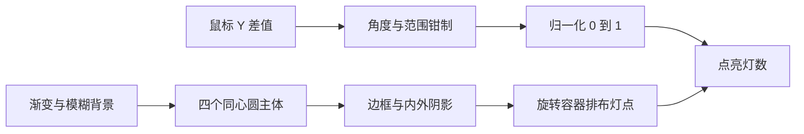

# 总结稿

[打开单页 HTML 总结](assets/bilibili-BV1YN8R6pEND-summary.html)

## 核心结论

这支 58 秒短片把拟物音量旋钮拆成两部分：CSS 用渐变、模糊、边框、多层内外阴影与旋转布局塑造外观；JS 把鼠标纵向拖动差值映射为旋钮角度和亮灯数量。[00:04–00:51] 它展示的是一条紧凑的视觉复刻流程，而不是完整源码审计或可访问控件规范。

## 技术流程

1. 用渐变和模糊圆铺底，四个同心圆叠成主体。[00:04–00:09]
2. 用背景渐变确定明暗，边框与阴影表现部件缝隙。[00:09–00:14]
3. 顶层旋钮用两层外阴影塑造体积、两层内阴影表现厚度。[00:16–00:19] CSS 标准确实允许逗号分隔的多层 `box-shadow` 与 `inset` 内阴影：[CSS Backgrounds and Borders](https://www.w3.org/TR/css-backgrounds-3/#box-shadow)。
4. 把每个灯点放入长方形容器，用 CSS 变量给容器设置规律递增的旋转角度，形成环形布局。[00:22–00:25] `rotate()` 机制由 [CSS Transforms](https://www.w3.org/TR/css-transforms-1/#funcdef-transform-rotate)支持；均匀性仍取决于角度步长、定位和变换原点。
5. JS 记录按下拖动时的 Y 坐标差值，换算为当前角度；再把角度归一化到 0–1，乘灯点总数得到点亮数量。[00:31–00:51]

## 边界与改进

- “不到 200 行”是作者对其实现的描述；没有逐行源码审计，不能当成最低代码量或已核验统计。[00:00]
- `Y` 差值到角度的灵敏度、最小/最大角度与钳制属于该实现参数，并非浏览器一步式 API。
- 成品要补充 Pointer Events、触摸输入、键盘增减、ARIA slider 语义、焦点样式、减少动画偏好和边界测试。
- 原设计图来自网络。[00:53] 画面说明了参考来源，但没有在本批证据中核验授权状态。

## 观众讨论与补充

本次只有 4 条热门顶层候选、0 条当前可访问弹幕。两条评论赞赏旋钮的外观/质感，其中匿名精选称 UI 很有吸引力（3 赞）；这是小样本审美意见，不是实现、可用性或兼容性证据。热门排序和访问时点有偏差，嵌套回复未采集，空弹幕也不是历史全集。

# 辅助理解

## 辅助理解

### 外观层：从大形到细节

先定背景和同心圆层级，再加缝隙、明暗、厚度；这样每种 CSS 手段承担单一视觉职责。[00:04–00:19]

### 灯环层：重复元素 + 角度变量

设灯数为 `N`，第 `i` 个容器可使用形如 `start + i × step` 的角度，其中 `step` 通常由总扫角与元素数量决定。视频只展示核心旋转思路，完整布局仍需要中心点、位移和尺寸配合。[00:22–00:25]

### 交互层：把拖动映射到状态

`dy → angle → normalized → litCount` 是关键数据流。[00:39–00:51] 工程实现还要钳制角度，处理浮点取整，并统一鼠标、触摸和键盘输入。

### 从视觉 demo 到真实控件

| 维度 | 短片已展示 | 仍需补齐 |
|---|---|---|
| 视觉 | 渐变、阴影、环形灯 | 主题、缩放、高对比模式 |
| 指针 | 鼠标 Y 差值映射 | pointer capture、触摸、取消事件 |
| 键盘 | 未展示 | 方向键、Home/End、步长 |
| 语义 | 未展示 | `role=slider`、值范围与当前值 |

> 截图证明视频展示了这些视觉与交互步骤；观众称赞只说明少量热门样本的审美反应。

## 外部事实核验

### 声明 1（00:16）

- 视频陈述：旋钮顶层可以用多层外阴影与多层内阴影塑造体积和厚度。
- 核验状态：已确认
- 核验结果：CSS `box-shadow` 的标准语法允许用逗号分隔多个阴影，并可用 `inset` 指定内阴影；因此这种实现机制成立。具体层数和视觉效果属于本视频的设计选择。
- 检索日期：2026-08-27
- 来源：
  - [CSS Backgrounds and Borders Module Level 3 — Drop Shadows](https://www.w3.org/TR/css-backgrounds-3/#box-shadow)（primary）

### 声明 2（00:25）

- 视频陈述：给每个指示灯容器设置规律递增的旋转角度，可以形成均匀分布的环形布局。
- 核验状态：已确认
- 核验结果：CSS Transforms 标准定义了 `rotate()` 角度变换；配合固定变换原点/位移和按序变化的角度，确实可构造环形分布。是否“均匀”还取决于角度步长及元素定位，属于该演示的具体实现。
- 检索日期：2026-08-27
- 来源：
  - [CSS Transforms Module Level 1 — rotate()](https://www.w3.org/TR/css-transforms-1/#funcdef-transform-rotate)（primary）

# Data

## 增强转写稿

[00:00] 这样的拟态旋钮居然只要不到200行代码
[00:02] 一个视频教会你方法
[00:04] 效果部分
[00:04] 用一个带有渐变和模糊效果的圆作为背景
[00:07] 主体部分由四个圆叠加而成
[00:09] 整体主要通过背景渐变来塑造明暗
[00:12] 再配合边框和阴影
[00:14] 体现出不同部件之间的缝隙
[00:16] 而最顶层的旋钮用两层外阴影构建体积感
[00:19] 用两层内阴影突出按钮的厚度
[00:22] 周围的指示灯
[00:23] 把每个光点写在一个长方形容器内
[00:25] 用变量给每个容器设置规律的旋转角度就能实现均匀分布的环形布局
[00:31] 动效部分用 JS 实现
[00:32] 话说回来
[00:33] 这是个免费的图像和提示词分享站
[00:35] 新的提示词都能随手发
[00:37] 操作没门槛
[00:38] 欢迎来逛
[00:39] 记录鼠标按下拖动时Y 坐标的差值
[00:41] 换算成角度
[00:43] 加上起始角度得到当前角度
[00:45] 再减去最小角度除以总度数
[00:47] 得到一个0-1的小数
[00:49] 乘以灯的总数
[00:51] 就是当前需要亮起的灯数
[00:53] 这个旋钮的原设计图来自网络
[00:55] 如果大家还有想还原的设计
[00:56] 可以发在评论区
[00:58] 我是原子软糖
[00:58] 咱们下期见

## 原始转写稿

[00:00] 这样的拟泰选扭居然只要不到200行代码
[00:02] 一个视频交过你方法
[00:04] 效果部分
[00:04] 用一个带有渐变和模固效果的圆作为背景
[00:07] 主体部分由四个圆叠加二成
[00:09] 整体主要通过背景渐变来塑造名案
[00:12] 再配合边框和阴影
[00:14] 体现出不同部件之间的缝隙
[00:16] 而最顶层的选扭用两层Y阴影构建体积感
[00:19] 用两层内阴影突出按钮的厚度
[00:22] 周围的指示灯
[00:23] 把每个光点写在一个长方形容器内
[00:25] 用变量给每个容器设置规律的旋转角度就能实现均匀分布的环形布局
[00:31] 动效部分用GS实现
[00:32] 话说回来
[00:33] 这是个免费的图像和提示词分享战
[00:35] 心得提示词都能随手发
[00:37] 操作没门槛
[00:38] 欢迎来逛
[00:39] 记录鼠标按下拖动时Y座标的差值
[00:41] 换算成角度
[00:43] 加上骑士角度得到当前角度
[00:45] 再减去最小角度除以总度数
[00:47] 得到一个0-1的小数
[00:49] 乘以灯的总数
[00:51] 就是当前需要亮起的灯数
[00:53] 这个旋钮的圆设计图来自网络
[00:55] 如果大家还有想还原的设计
[00:56] 可以发在评论区
[00:58] 我是圆子软堂
[00:58] 咱们下期见

## 原始关键帧

### 关键帧 1

### 关键帧 2

### 关键帧 3

### 关键帧 4

### 关键帧 5

### 关键帧 6

### 关键帧 7

### 关键帧 8

### 关键帧 9

### 关键帧 10

## 补充原始数据

- [bilibili-BV1YN8R6pEND-comments.jsonl](assets/bilibili-BV1YN8R6pEND-comments.jsonl)
- [bilibili-BV1YN8R6pEND-comment-candidates.json](assets/bilibili-BV1YN8R6pEND-comment-candidates.json)
- [bilibili-BV1YN8R6pEND-danmaku.jsonl](assets/bilibili-BV1YN8R6pEND-danmaku.jsonl)
- [bilibili-BV1YN8R6pEND-danmaku-analysis.json](assets/bilibili-BV1YN8R6pEND-danmaku-analysis.json)
- [bilibili-BV1YN8R6pEND-summary.html](assets/bilibili-BV1YN8R6pEND-summary.html)
