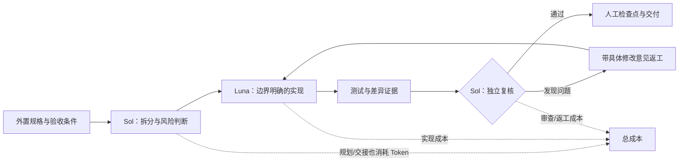
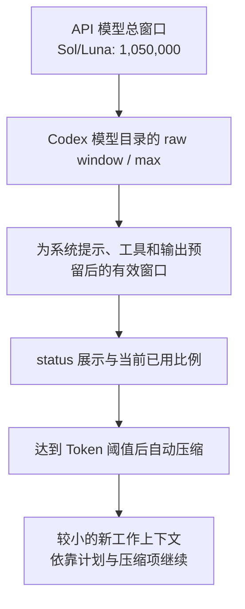
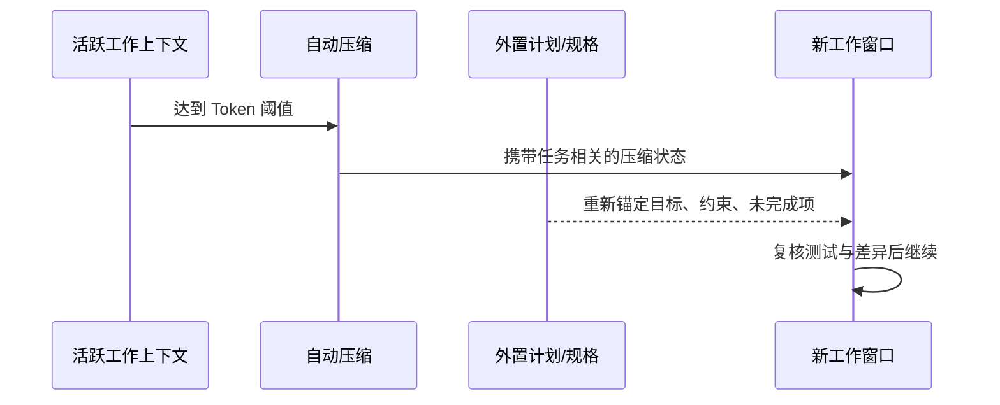

# 总结稿

[打开单页 HTML 总结](assets/bilibili-BV12c8c6xEy4-summary.html)

> [!warning] 覆盖范围异常
> Bilibili metadata 标注时长为 **1,378 秒（22:58）**，但当前字幕只覆盖 **00:00–10:13（613 秒）**，抽帧媒体约到 **10:15（615 秒）**，覆盖约 **44.5%**。现有字幕虽有完整开场、两项演示和结尾，仍不能证明 metadata 错误，也不能证明标称后半段没有额外内容。以下只总结当前可验证范围。

## 核心结论

这段视频的真正价值，不是证明“换成 Luna 就一定更快、更便宜”，而是展示一种**分层代理工作流**：由能力更强的主代理负责拆分、约束和复核，把边界清晰的实现交给更低成本的子代理；同时用计划、测试、差异审查和状态检查控制长任务。视频中的单次实验也暴露出代价：规划、交接、上下文切换和返工可能抵消模型价差，最终是否划算取决于任务是否可拆、规格是否明确，以及审查成本。

## 两条主线

### 1. Sol 规划与审查，Luna 执行

- 讲者让 Sol 主代理读取规则、形成计划，再把一个测试优先的实现任务委派给 Luna；完成后由主代理检查差异并把问题发回修复（[01:31](https://www.bilibili.com/video/BV12c8c6xEy4?t=91)–[04:15](https://www.bilibili.com/video/BV12c8c6xEy4?t=255)）。
- 这种“高能力模型做判断、低成本模型做边界明确的实现”是**讲者的工作流设计**，不是 OpenAI 规定的固定职责。官方只把 Sol 定位为复杂专业工作的旗舰型号，把 Luna 定位为成本敏感、高吞吐工作负载；GPT-5.6 的多代理能力可以协调子代理，但不强制谁规划、谁编码。[OpenAI GPT-5.6 指南](https://developers.openai.com/api/docs/guides/latest-model)
- 主代理与子代理有各自的会话上下文和 Token 计数，但并非完全隔离：子代理可继承父会话 turns，代理之间也会交换消息并共享工作区文件（[03:19](https://www.bilibili.com/video/BV12c8c6xEy4?t=199)）。[Codex multi-agent 规范](https://github.com/openai/codex/blob/main/codex-rs/core/src/tools/handlers/multi_agents_spec.rs)
- “Sol 现在可以稳定地派生 Luna”需要版本限定。视频展示了成功会话，但截至 2026-08-21，官方仓库仍有 Sol v2 与 Luna v1 子模型过滤不兼容的公开报告，因此不能泛化到所有客户端、账号与后端。[兼容性报告 #36294](https://github.com/openai/codex/issues/36294)

### 2. 更大上下文与自动压缩

- 官方 API 模型页为 Sol 与 Luna 标注 **1,050,000 Token 总上下文窗口**、最大输出 128,000；Codex 配置也支持 `model_context_window` 和 `model_auto_compact_token_limit`。[Sol 规格](https://developers.openai.com/api/docs/models/gpt-5.6-sol) · [Luna 规格](https://developers.openai.com/api/docs/models/gpt-5.6-luna) · [Codex 配置源码](https://github.com/openai/codex/blob/main/codex-rs/config/src/config_toml.rs)
- 但“配置 1M”不等于 `status` 会显示整整 1M。讲者看到约 828K（[07:49](https://www.bilibili.com/video/BV12c8c6xEy4?t=469)）；核查机器同日的模型目录为 `max_context_window=872000`、有效比例 95%，计算后正是 **828,400**。未覆盖设置时的 272,000 × 95% 则是 **258,400**，对应视频的 258K（[09:53](https://www.bilibili.com/video/BV12c8c6xEy4?t=593)）。这些是特定时点的 Codex 产品口径，不等同于 API 模型总窗口，也可能随后端目录、账号与版本变化。
- Codex 公开实现支持按 Token 阈值自动压缩；默认阈值通常从上下文窗口推导，而不是固定“运行 20 分钟”后触发。[自动压缩阈值源码](https://github.com/openai/codex/blob/main/codex-rs/protocol/src/openai_models.rs) · [触发逻辑](https://github.com/openai/codex/blob/main/codex-rs/core/src/session/context_window.rs)
- 视频中约 20 分钟后发生压缩、计划继续推进（[08:51](https://www.bilibili.com/video/BV12c8c6xEy4?t=531)），只能作为一次演示。官方把 Responses 压缩描述为 *loss-aware*，不等于“绝对无损”；讲者自己也承认“可能丢了些内容”。[OpenAI compaction 指南](https://developers.openai.com/api/docs/guides/latest-model?model=gpt-5.2)

## 单次实验说明了什么

| 视频观察 | 能说明 | 不能说明 |
|---|---|---|
| 实现约 28 分钟、主上下文 53%（[05:17](https://www.bilibili.com/video/BV12c8c6xEy4?t=317)） | 这次任务存在显著规划、核验和交接成本 | 多代理普遍更慢或更快 |
| 首轮独立检查发现两个问题（[04:08](https://www.bilibili.com/video/BV12c8c6xEy4?t=248)） | 审查与返工在本次流程中真实发生 | Sol 审查普遍能发现多少问题，或 Luna 的一般质量 |
| 三个 Luna 代理估算约 $0.38、$0.02、$0.03（[05:58](https://www.bilibili.com/video/BV12c8c6xEy4?t=358)） | 讲者尝试按会话 JSONL 估算成本 | 真实账单、所有服务层的价格，或“必然省钱” |
| 约 20 分钟后自动压缩 | 长任务可以在压缩后继续 | 固定时间触发、信息零损失或无人值守安全 |

由于没有完整 JSONL、Token 类型、缓存命中、服务层和账单，**28 分钟、53% 与美元金额都不能独立复算，也不能作为性能/成本基准**。官方定价还规定超过 272K 输入时会应用长上下文倍率，API 费用与 Codex 订阅内体验也不能混为一谈。[Luna 定价](https://developers.openai.com/api/docs/models/gpt-5.6-luna)

## 可复用实践

1. **先写可观察契约**：明确输入、输出、禁止事项、测试和验收条件，再委派。
2. **只委派边界清楚的工作包**：可独立执行、可在有限时间内验证，才适合子代理。
3. **把审查预算算进去**：模型单价只是成本的一部分；规划、信息交接、重复评估和返工都会消耗时间与 Token。
4. **把计划外置**：维护 Markdown 规格、任务清单和决策记录，使压缩后仍能重新锚定目标。
5. **监控有效窗口而非迷信标称值**：关注 `status`、压缩阈值和实际约束；更大的窗口不是质量保证。
6. **长任务保留人工检查点**：讲者也不建议无限无人值守。压缩后先复核目标、未完成项和测试状态，再继续执行。

## 观众讨论与补充

本次热门顶层评论抓取数为 **0**，尽管平台报告可见 **1 条评论**；当前可访问弹幕也为 **0**。热门排序不含嵌套回复，弹幕不是历史全集，因此这组空候选**不能解释为“无人讨论”“观众赞同”或任何情绪分布**。当前没有可安全引用、聚类或核验的观众文本。

若后续重新抓取到样本，值得区分三个问题：标称窗口与有效窗口是否混用；长任务评价是否把正确性、恢复能力和审查负担纳入；Sol/Luna 分工是产品保证还是特定版本下的实践模式。

# 辅助理解

## 一张图理解这套工作流

这帧显示演示中的 Updated Plan：先检查项目规则，再把测试优先实现委派给 Luna，最后由主代理审查。它是**工作流证据**，不是 Sol/Luna 永久职责或效率优势的证明。

## 为什么“更便宜的子代理”不等于“更便宜的任务”

可以把总成本拆成：

> 主代理规划 + 子代理实现 + 父子交接 + 独立审查 + 返工 + 为统计成本本身付出的查询

视频中只启动一个主要实现代理，随后又出现技术/规格审查，并在首轮复核后返工。讲者最终判断“不一定省很多钱”（[06:14](https://www.bilibili.com/video/BV12c8c6xEy4?t=374)）。这不是失败，而是说明**模型单价优化必须服从任务结构**：如果边界不清、共享状态多、验收昂贵，协调开销会吞掉价差。

这帧只说明 Luna 子代理正在浏览项目、差异和测试文件；界面的 Working 状态不能证明真正并行、测试充分或性能领先。

## 三种“上下文数字”不要混用

- **1,050,000** 是官方 API 模型页的总上下文规格，不自动等于 Codex 产品界面的有效输入空间。[Sol](https://developers.openai.com/api/docs/models/gpt-5.6-sol) · [Luna](https://developers.openai.com/api/docs/models/gpt-5.6-luna)
- **828K** 可由核查时本机目录的 872,000 × 95% 得到；**258K** 可由默认 272,000 × 95% 得到。这解释了视频界面，但属于 2026-08-21 的特定产品目录口径，不宜永久化。
- 视频提到另一次“1.1M”显示，没有版本或日志，且高于当前官方总窗口，不能当作规格。

## 压缩不是“重置就忘了”，也不是“绝对无损”

Frame 9 显示压缩叙述附近，代理重新收紧评分合同并继续修改。单帧无法证明压缩机制或记忆完整率；更稳妥的理解是：**压缩提供继续工作的机制，外置规格提供可核对的真值来源**。触发由 Token 阈值决定，不是固定 20 分钟；*loss-aware* 也不是零损失保证。[Codex 阈值逻辑](https://github.com/openai/codex/blob/main/codex-rs/protocol/src/openai_models.rs)

## 证据分层

| 层级 | 本片可用证据 | 使用方式 |
|---|---|---|
| 官方规格/源码 | 模型定位、1.05M 总窗口、配置键、压缩阈值 | 可描述能力，但注明产品表面与日期 |
| 视频单次演示 | 28 分钟、53%、两次问题、约 20 分钟后压缩 | 只描述本次观察，不做普遍比较 |
| 讲者评价 | “不一定省很多钱”“近期压缩效果很好” | 保留为经验判断 |
| 缺失证据 | 完整 JSONL、账单、对照实验、10:13 后内容 | 不复算、不外推、不填补 |

## 自己应用时的最小检查表

- [ ] 工作包能否在不持续询问父代理的情况下完成？
- [ ] 验收条件是否可运行、可观察，而非“看起来不错”？
- [ ] 是否记录了模型、reasoning effort、客户端版本、服务层和开始/结束时间？
- [ ] 是否把规划、审查、返工和统计本身算进总成本？
- [ ] 压缩后是否先核对规格、计划、测试与未完成项？
- [ ] 是否保留人工停机条件，避免长时间偏航？

> [!warning] 材料边界
> metadata 为 1,378 秒，而字幕到 613 秒、抽帧媒体约 615 秒。上述理解只覆盖可验证的约 44.5%，不能代表标称 22:58 的全部内容。

## 外部事实核验

### 声明 1（00:09）

- 视频陈述：Sol 可以替你管理一支高效的 Luna 代理队伍。
- 核验状态：部分确认
- 核验结果：部分成立，但不能当作所有 Codex 版本和后端都无条件支持的产品规格。OpenAI 官方资料确认 GPT-5.6 具备多代理能力，Codex 的公开实现也有可指定子代理模型的 spawn_agent 接口；然而截至核查日，openai/codex 仍有公开、未关闭的兼容性报告：Sol 使用的 multi-agent v2 会把目录中标为 v1 的 Luna 排除。本机 2026-08-21 的模型缓存同样显示 Sol=v2、Luna=v1。因此视频演示可以是一条特定版本/配置下成功的实测，却不足以证明普遍可用。
- 检索日期：2026-08-21
- 来源：
  - [OpenAI model guidance: GPT-5.6 multi-agent beta](https://developers.openai.com/api/docs/guides/latest-model)（primary）
  - [openai/codex issue #36294: Luna v1/v2 spawn compatibility report](https://github.com/openai/codex/issues/36294)（secondary）

### 声明 2（00:30）

- 视频陈述：这是因为 Luna 不兼容 multi-agent 功能，现在已经兼容了。
- 核验状态：存在争议
- 核验结果：结论存在争议。官方 GPT-5.6 文档确认模型家族支持多代理，但没有给出“Luna 已全面兼容 Codex 子代理”的无条件承诺；公开 Codex issue 在 2026-07 至 2026-08 仍报告 Luna 可作为顶层 v2 会话运行、却可能被 Sol v2 父代理的子模型过滤器拒绝。更准确的说法是：Luna 已进入多代理产品路径，但跨版本、运行时与父子模型组合的兼容性并不稳定。
- 检索日期：2026-08-21
- 来源：
  - [OpenAI model guidance: GPT-5.6 multi-agent beta](https://developers.openai.com/api/docs/guides/latest-model)（primary）
  - [openai/codex issue #34301: Sol/Terra spawning Luna report](https://github.com/openai/codex/issues/34301)（secondary）
  - [openai/codex issue #36294: Luna runtime/catalog mismatch](https://github.com/openai/codex/issues/36294)（secondary）

### 声明 3（00:58）

- 视频陈述：我可以委派给 Luna，它速度最快，成本也最低。
- 核验状态：部分确认
- 核验结果：“低成本”有官方依据，“最快”没有足够依据。OpenAI 将 Luna 定位为面向成本敏感、高吞吐工作负载的 GPT-5.6 型号，并公布了低于 Sol 的 API Token 单价；但官方页面未给出跨任务、推理强度与服务层级都成立的“最快”排名。延迟还会受任务、reasoning effort、缓存和服务层影响。
- 检索日期：2026-08-21
- 来源：
  - [GPT-5.6 Luna model specification and pricing](https://developers.openai.com/api/docs/models/gpt-5.6-luna)（primary）
  - [GPT-5.6 Sol model specification and pricing](https://developers.openai.com/api/docs/models/gpt-5.6-sol)（primary）

### 声明 4（01:45）

- 视频陈述：主代理先决定如何分工，再委派范围明确的实现任务，最后由主代理检查。
- 核验状态：部分确认
- 核验结果：这是作者在本次演示中设计的工作流，不是官方强制的模型职责。官方只把 Sol 定位为复杂专业工作的旗舰模型、Luna 定位为高吞吐低成本型号，并说明 GPT-5.6 可以协调并汇总多个子代理；没有规定“Sol 必须规划/审查、Luna 必须编码”。这一分工可作为实践模式，不能写成产品保证。
- 检索日期：2026-08-21
- 来源：
  - [OpenAI model guidance for the GPT-5.6 family](https://developers.openai.com/api/docs/guides/latest-model)（primary）
  - [GPT-5.6 Sol model specification](https://developers.openai.com/api/docs/models/gpt-5.6-sol)（primary）
  - [GPT-5.6 Luna model specification](https://developers.openai.com/api/docs/models/gpt-5.6-luna)（primary）

### 声明 5（03:19）

- 视频陈述：每个代理和子代理都有独立的上下文。
- 核验状态：已确认
- 核验结果：基本成立，但“独立”不等于完全隔离。Codex 的 spawn_agent 规范说明子代理是单独的 agent/task，并可选择继承有限或全部父会话 turns；父代理通过 send/follow-up/wait 等消息边界交换结果。各代理因此有各自会话上下文和 Token 计数，但会共享工作区文件，而且父会话内容可能按 fork_turns 复制给子代理。
- 检索日期：2026-08-21
- 来源：
  - [openai/codex multi-agent tool specification](https://github.com/openai/codex/blob/main/codex-rs/core/src/tools/handlers/multi_agents_spec.rs)（primary）

### 声明 6（05:17）

- 视频陈述：用了 28 分钟并占用了 53% 的上下文；Luna 的成本分别约为 0.38、0.02 和 0.03 美元。
- 核验状态：未验证
- 核验结果：这是视频中一次任务的观测值，而不是官方规格或可泛化基准。没有随工件提供完整 JSONL、原始 Token 分类、服务层、缓存命中和账单记录，因此无法独立复算 28 分钟、53% 或三笔美元金额。即便使用官方 API 单价，超过 272K 输入的请求还有长上下文倍率，缓存写入/读取和输出 Token 也分别计价；Codex 订阅内的显示成本也不等同于 API 账单。
- 检索日期：2026-08-21
- 来源：
  - [GPT-5.6 Luna model pricing and long-context multiplier](https://developers.openai.com/api/docs/models/gpt-5.6-luna)（primary）

### 声明 7（07:00）

- 视频陈述：你可以在 Codex 中使用 100 万 Token 的上下文窗口，也可以在全局配置或特定会话中启用。
- 核验状态：部分确认
- 核验结果：模型规格与配置能力成立，但“Codex 实际可用 100 万”需要限定。官方模型页给 Sol 和 Luna 的总上下文窗口都是 1,050,000，最大输出 128,000；Codex 开源配置确实支持 model_context_window 和 model_auto_compact_token_limit。可是 Codex 会把用户覆盖值限制在其模型目录的 max_context_window 内，并为系统提示、工具开销和输出保留空间。本机 2026-08-21 缓存的 Sol/Luna 默认 raw window 为 272,000、max 为 872,000、effective percent 为 95%，所以“配置 1M”并不等于 status 一定显示或可输入整整 1M。
- 检索日期：2026-08-21
- 来源：
  - [GPT-5.6 Sol model context specification](https://developers.openai.com/api/docs/models/gpt-5.6-sol)（primary）
  - [GPT-5.6 Luna model context specification](https://developers.openai.com/api/docs/models/gpt-5.6-luna)（primary）
  - [openai/codex ConfigToml context-window fields](https://github.com/openai/codex/blob/main/codex-rs/config/src/config_toml.rs)（primary）
  - [openai/codex model context and auto-compaction calculations](https://github.com/openai/codex/blob/main/codex-rs/protocol/src/openai_models.rs)（primary）

### 声明 8（07:49）

- 视频陈述：status 后上下文窗口约为 828K；我的其他实验中这里显示的是 1.1M。
- 核验状态：部分确认
- 核验结果：828K 与当前本机 Codex 模型元数据可以精确对上：max_context_window 872,000 × effective_context_window_percent 95% = 828,400，说明 status 展示的是保留系统/工具/输出余量后的有效窗口，而不是 API 模型页的 1,050,000 总窗口。视频所说的“1.1M”没有版本、模型目录、status 截图或原始日志，且高于当前官方 1,050,000 总窗口，只能视为讲者未解释的单次界面观察，不能作为规格。
- 检索日期：2026-08-21
- 来源：
  - [openai/codex model effective-context calculation](https://github.com/openai/codex/blob/main/codex-rs/protocol/src/openai_models.rs)（primary）
  - [GPT-5.6 Sol model context specification](https://developers.openai.com/api/docs/models/gpt-5.6-sol)（primary）

### 声明 9（08:16）

- 视频陈述：它强调他们已经对上下文上限做过调优；如果手动设为 1M，要注意性能和成本。
- 核验状态：部分确认
- 核验结果：成本提醒可由官方定价规则支持，但现有工件没有给出被转述的 OpenAI 员工原帖 URL，无法核对“默认上限已调优”的原话和适用版本。官方模型页明确说明：输入超过 272K 的请求会对整次请求按 2 倍输入、1.5 倍输出计价；Codex 源码也显示默认有效窗口和自动压缩阈值由模型元数据计算。因此手动放大窗口确会改变压缩时机并可能增加 Token 成本，但性能/质量影响应通过具体任务评测，而不是从该转述直接推定。
- 检索日期：2026-08-21
- 来源：
  - [GPT-5.6 Sol pricing and long-context multiplier](https://developers.openai.com/api/docs/models/gpt-5.6-sol)（primary）
  - [openai/codex automatic compaction threshold logic](https://github.com/openai/codex/blob/main/codex-rs/protocol/src/openai_models.rs)（primary）

### 声明 10（08:51）

- 视频陈述：工作约 20 分钟后上下文被压缩了，随后计划也更新了，不需要干预。
- 核验状态：部分确认
- 核验结果：自动压缩能力成立，但“约 20 分钟、无损恢复”只是本次演示。Codex 公开源码定义了自动压缩 Token 阈值：没有显式阈值时通常从上下文窗口推导 90%，达到缓冲阈值或完整上下文硬上限时触发压缩；OpenAI Responses API 也提供压缩端点，并将其描述为面向继续执行的 loss-aware 压缩。触发条件按 Token/窗口而不是固定分钟数，且 loss-aware 不等于数学意义上的零信息损失。
- 检索日期：2026-08-21
- 来源：
  - [openai/codex model automatic-compaction threshold](https://github.com/openai/codex/blob/main/codex-rs/protocol/src/openai_models.rs)（primary）
  - [openai/codex context-window trigger logic](https://github.com/openai/codex/blob/main/codex-rs/core/src/session/context_window.rs)（primary）
  - [OpenAI Responses compaction guidance](https://developers.openai.com/api/docs/guides/latest-model?model=gpt-5.2)（primary）

### 声明 11（09:53）

- 视频陈述：当前为 258K；我没有为这个项目和会话增加上限。
- 核验状态：已确认
- 核验结果：与核查机器当前 Sol/Luna 模型目录一致，但不能泛化为所有账号和版本的永恒默认值。本机缓存给出的默认 context_window 为 272,000、effective_context_window_percent 为 95%，计算得到 258,400，正好对应界面约 258K。Codex 的模型元数据可由后端更新，产品表面、账号、模型、客户端版本与本地覆盖也可能改变有效值；官方 API 的 1,050,000 总窗口并不等同于 Codex status 的默认有效窗口。
- 检索日期：2026-08-21
- 来源：
  - [openai/codex model effective-context calculation](https://github.com/openai/codex/blob/main/codex-rs/protocol/src/openai_models.rs)（primary）
  - [GPT-5.6 Sol model context specification](https://developers.openai.com/api/docs/models/gpt-5.6-sol)（primary）

# Data

## 增强转写稿

[00:00] 大家好 今天想给大家介绍 Codex 本周发布的两个新功能
[00:04] 它们可能会改变我们处理较长任务的方式
[00:07] 第一个功能 你就能在屏幕上看到
[00:09] Sol 可以替你管理一支高效的 Luna 代理队伍
[00:12] 这是长期存在的问题 大家一直抱怨
[00:15] 如果让 Sol 运行 Luna 子代理
[00:17] 它过去无法做到，只会运行 Sol 子代理
[00:23] 这是两周前的一条示例推文
[00:25] 有人能解释一下 为什么做不到吗
[00:27] 随后 OpenAI 的 Eric 解释说
[00:30] 这是因为 Luna 不兼容 multi-agent 功能
[00:33] 现在已经兼容了
[00:35] 上面的这条推文其实是转发了 OpenAI 的 Eric 发布的内容
[00:40] 花了一点时间确认它能正常运行
[00:42] 现在启动 Codex CLI 我已经升级过 Codex CLI
[00:46] 别忘了也升级 然后就可以提问
[00:49] 使用子代理时可以委派给哪些模型
[00:52] 这和 Eric 在推文中展示的问题相同
[00:55] 现在答案出来了 在这个会话中
[00:58] 我可以委派给 Luna 它速度最快 成本也最低
[01:01] 我会试试并计算具体能省下多少成本
[01:06] 这个项目已经有一份规格说明
[01:08] 我也在单独的演示项目中实现过
[01:10] 现在我会用 Sol 加 Luna 子代理再做一次
[01:14] 这是实现计划 内容相当详细
[01:17] 它可以拆分给多个子代理
[01:19] 用 Laravel 和 Filament 创建来自 API 的数据仪表版
[01:23] 但技术栈并不重要 关键是 Sol 如何分配工作
[01:26] 如何验证结果 以及实际需要多少成本和时间
[01:30] 现在开始尝试
[01:31] 这是我给 Sol 主代理的提示词 按照计划实现
[01:34] 但代码实现 请使用
[01:36] 一个或多个子代理 具体会启动多少个
[01:39] 我们稍后就能看到 主代理将负责验证
[01:44] 开始吧
[01:45] 这是主代理的说法 先加在项目规则和计划
[01:49] 再委派范围明确的实现任务
[01:51] 也就是说 主代理先决定如何分工
[01:54] 然后亲自审查
[01:57] 不过 前期计划和范围界定
[02:00] 本身就会耗费不少时间和 tokens
[02:03] 因此 即使用定价更低的 Luna 子代理
[02:05] 调用他们前的整体评估和规划 仍然会相当昂贵
[02:10] 但我个人可以接受这一点
[02:12] 我不会把规划和验证阶段委派给更便宜、能力更弱的模型
[02:19] 我最近发了一条推文 简要讲的如何进行 AI 编程
[02:22] 算是一段 TED 演讲式分享
[02:24] 我让 ChatGPT 用图示呈现：用高价模型规划
[02:28] 用低价模型构建 再用高价模型审查
[02:32] 这就是我的理念 我也在这里实践
[02:34] 我们已经有了计划先检查规则
[02:37] 再委派测试优先的实现任务
[02:41] 目前有子代理吗 切到 agent 看看
[02:45] 有一个名为 Implement JSON Dashboard 的子代理
[02:49] 看来这次他决定只启动一个
[02:52] 切过去看看他在做什么
[02:55] 我们随时可以用 /agent 在主代理和子代理之间切换
[02:59] 切到 main 后 它基本只会显示正在等待代理
[03:04] 切回去看看子代理离最终结果还有多远
[03:09] 测试已经在运行了
[03:11] 这里可以看到 它实际使用的是 Luna High
[03:13] 该子代理的上下文显示为 29%
[03:15] 切到 /agent 再看 main
[03:17] 主代理的上下文显示为 26%
[03:19] 每个代理和子代理都有独立的上下文
[03:21] 主代理使用的模型是 Sol High
[03:24] 主代理会不时询问子代理进展
[03:27] 并告诉我们子代理当前正在运行什么
[03:31] 使用子代理时 我感觉耗时经常会丢失
[03:36] 子代理汇报工作后 计时基本会从零开始
[03:39] 我就不知道实际用了多长时间
[03:43] 我可以在汇总中计算时间或加个计时器
[03:46] 但据我在 Codex CLI 中使用子代理的经验
[03:49] 无法实施准确查看用时
[03:52] 实现交接完成
[03:54] 代理开发循环中的测试已通过
[03:57] 现在由我审查完整差异
[04:01] 除非主代理发现问题需要修复
[04:04] 否则子代理的工作就结束了
[04:07] 这很有意思
[04:08] 第一次独立检查发现了两个问题
[04:11] 我把具体修改意见发回同一个 Luna 实现代理
[04:15] 再次强调
[04:16] Sol 负责规划和审查，不负责实现
[04:20] 现在继续等 Luna 子代理修复
[04:25] 还有一次我们要求的核验
[04:27] 似乎有一个临时验证用户
[04:29] 接下来还需要进入差异审查
[04:32] 还有两个子代理
[04:35] 我们看看实现质量审查和规格审查
[04:38] 这些是 Luna 还是 Sol？有意思
[04:41] 这是 Luna 审查，可能由 Luna 负责进行技术审查和自动化测试
[04:47] 我现在也不确定
[04:49] 有意思
[04:50] 从技术上说你可以像这样让 Sol 委派 Luna 代理
[04:54] 但提示词需要比我的更严格明确
[04:56] 哪些部分要委派
[04:58] 具体如何委派，以及审查如何整合
[05:01] 没想到 Sol 会派生子代理
[05:05] 这可能比只用 Sol、完全不用 Luna 实现同样的完整项目耗时更久
[05:10] 但也许成本更低
[05:11] 我会等这一切完成 计算Token 最后把这些全部实现出来
[05:17] 用了28分钟 实际上比预期涨得多
[05:19] 并占用了 53% 的上下文
[05:21] 主代理与子代理之间的核验 信息变更
[05:24] 上下文切换和重新评估
[05:26] 反而可能耗时更多，甚至使用更多 Token
[05:29] 随后我让 Codex 查出每个子代理和主代理使用的 Token 数量
[05:34] 它花了相当长时间才找到所有文档并检查那些
[05:38] JSONL 格式的会话文件
[05:41] 大约4分钟后 我拿到了这张表
[05:43] 这里列出了Token数量
[05:45] 但这个数字不太有用 也不容易直观理解
[05:49] 但 GPT-5.6 Sol 很好地把它换算成了美元
[05:53] 这是一个实际结论
[05:55] 看看所有子代理的总成本
[05:58] LUNA的成本分别约为0.38美元 0.02美元和0.03美元
[06:03] 最后一项用于规格审查
[06:04] 大部分费用仍花在 Sol 上
[06:06] 他负责规划 审查 并担任总协调主代理
[06:11] 所以技术上可以把 Sol 的工作委派给 Luna 子代理
[06:14] 但这样能省下很多钱吗
[06:17] 不一定 此外 在这项新功能出现之前
[06:20] 我还为AI Coding Daily网站的高级会员
[06:23] 制作过另一部视频 手动完成了同样的操作
[06:27] 用 Sol 规划，用 Luna 手动实现
[06:30] 最后再让 Sol 审查 Luna 的实现
[06:35] 但它们不在同一会话中，也没有共享上下文
[06:38] 我借助一些markdown产物分别记录
[06:41] 初始规格、Sol 的审查结果以及 Luna 的修复
[06:45] 到底是否更便宜 可以在这部视频中了解
[06:48] 我还比较了只使用 Sol、不使用 Luna 的情况
[06:53] 高级会员视频链接会放在简介中
[06:55] 下面介绍CodeX的第二项新功能
[06:58] 这是 Thibault 的另一条推文
[07:00] 你可以在 Codex 中使用 100 万 Token 的上下文窗口
[07:03] 也可以像这样在全局配置或特定会话中启用
[07:06] 现在我现在任意文件夹启动CodeX运行一个简单提示词
[07:11] 查看状态和上下文
[07:14] 这里确实有些过度思考
[07:16] 因为我选择了 Sol High
[07:18] 我只是忘了切换到更便宜的模型
[07:21] 我们可以运行status
[07:23] 你会看到上下文是258K
[07:26] 这是默认设置，仅运行提示词已使用 11% 的上下文
[07:31] 现在用这里复制的命令重复同样的操作
[07:36] 你会看到上下文不同
[07:37] 我们在运行同一个提示词
[07:40] 看看上下文是否会低一些
[07:42] 希望不会达到11%
[07:45] 到这里就完成了
[07:46] 仅运行提示词，上下文占用 3%
[07:49] 运行 status 后你会看到上下文窗口约为 828K
[07:53] 它不是 100 万，因为老实说我也不确定
[07:56] 为什么要这样解释
[07:59] 这个数字它可能对应828
[08:01] 但我不确定
[08:02] 我的其他实验中这里显示的是 1.1M
[08:06] 这里反而更低
[08:08] 你明白了可以使用更大的上下文
[08:10] 但有必要吗
[08:12] 这一点有争议
[08:13] 你可以阅读 Thibault 的原推文
[08:16] 它强调他们已经对上下文上限做过调优
[08:20] 如果手动设为 1M，要注意性能和成本
[08:24] 另外问题在于上下文何时会变得过大
[08:28] 并开始导致质量下降
[08:30] 我一直用默认上下文窗口
[08:32] 处理更长的提示词
[08:34] 效果也很好
[08:36] 下面展示一个自动压缩上下文的例子
[08:41] 使用较小的常规上下文时
[08:43] 情况可能是这样
[08:44] 我正在做评测和基准测试
[08:46] 测试新功能并在新系统上开展新实验
[08:49] 这是交给 Sol 的大型任务
[08:51] 工作约 20 分钟后上下文被压缩了
[08:55] 随后计划也更新了
[08:57] 说明了当前进展
[08:58] 但据我经验上下文压缩过去
[09:01] 常常意味着负面结果
[09:02] 因为会丢失大量内容和信息
[09:06] 据我最近的体验压缩效果很好
[09:09] Codex会继续工作
[09:12] 可能丢了些内容
[09:14] 但它似乎自行恢复了更新后的计划
[09:16] 我甚至都没查看上下文压缩
[09:19] 无需我介入就完成了
[09:21] 随后上下文又显示为11%
[09:24] 但实际上是从零开始
[09:26] 如果再次达到100%
[09:27] 就会再次压缩
[09:29] 这样我就能让 Sol 或其他模型运行更久
[09:35] 当然不建议这样做
[09:36] 因为无人看管的时间越长
[09:38] 它越可能构建出你不想要的东西
[09:40] 不过在这次实现前
[09:41] 我花了不少时间和它讨论要构建什么
[09:44] 也准备了详细的Markdown文档和产物
[09:47] 所以我比较放心
[09:48] 至于这次评测能否用于我的基准测试
[09:50] 还要看后续结果
[09:53] 你可以随时查看上下文状态运行Status
[09:56] 可见当前为258K
[09:59] 我没有为这个项目和会话增加上限
[10:03] CodeX有两条消息
[10:06] 由 Sol 管理的 Luna 代理群
[10:07] 以及100万Token的上下文窗口
[10:10] 你会有哪个欢迎在下方评论区讨论
[10:13] 下期视频见

## 原始转写稿

[00:00] 大家好 今天想给大家介绍 Codex 本周发布的两个新功能
[00:04] 他们可能会改变我们处理校长任务的方式
[00:07] 第一个功能 你就能在屏幕上看到
[00:09] SLL 可以替你管理一支高效的 Luna 代理队伍
[00:12] 这是长期存在的问题 大家一直抱怨
[00:15] 如果让 Sol 运行 Luna 的代理
[00:17] 它就无法做到只会运行 Solsa 的代理
[00:23] 这是两周前的一条势力推文
[00:25] 有人能解释一下 为什么做不到吗
[00:27] 随后 OpenAI 的 Eric 解释说
[00:30] 这是因为 Luna 不兼容 Mount Agents VR
[00:33] 现在已经兼容了
[00:35] 台本的这条推文其实是转发了 OpenAI 的Eric 发布的内容
[00:40] 花了一点时间确认它能正常运行
[00:42] 现在启动 Codex CLI 我已经升级过 Codex CLI
[00:46] 别忘了也升级 然后就可以提问
[00:49] 使用子代理时可以伪拍给哪些模型
[00:52] 这和 Eric 在推文中展示的问题相同
[00:55] 现在答案出来了 在这个绘画中
[00:58] 我可以伪拍给 Luna 它速度最快 成本也最低
[01:01] 我会试试并计算具体能省下多少成本
[01:06] 这个项目已经有一份规格说明
[01:08] 我也在单独的演示项目中实现过
[01:10] 现在我会用Saha Luna 子代理再做一次
[01:14] 这是实现计划 内容相当详细
[01:17] 它可以裁分给多个子代理
[01:19] 用 Laravel 和 Filament 创建来自 API 的数据仪表版
[01:23] 但技术站并不重要 关键是 SOL 如何分配工作
[01:26] 如何验证结果 以及实际需要多少成本和时间
[01:30] 现在开始尝试
[01:31] 这是我给 CL 主代理的提示词 按照计划实现
[01:34] 但代码实现 请使用
[01:36] 一个或多个子代理 具体会启动多少个
[01:39] 我们稍后就能看到 主代理将负责验证
[01:44] 开始吧
[01:45] 这是主代理的说法 先加在项目规则和计划
[01:49] 再伪拍范围明确的实现任务
[01:51] 也就是说 主代理先决定如何分工
[01:54] 然后亲自审查
[01:57] 不过 前期计划和范围界定
[02:00] 本身就会耗费不少时间和 tokens
[02:03] 因此 即使用定价更低的 Luna 字代理
[02:05] 调用他们前的整体评估和规划 仍然会相当昂贵
[02:10] 但我个人可以接受这一点
[02:12] 我不会把规划和验证阶段为派给更便宜 能力更弱的模型
[02:19] 我最近发了一条推文 简要讲的如何进行 AI 编程
[02:22] 算是一段 TED 演讲式分享
[02:24] 我让Chart GPT 用图示呈现 用高价模型规划
[02:28] 用低价模型构建 再用高价模型审查
[02:32] 这就是我的理念 我也在这里实践
[02:34] 我们已经有了计划先检查规则
[02:37] 在尾派测试优先的实现任务
[02:41] 目前有子代理吗 切到 agent 看看
[02:45] 有一个名为 Implement JSON Dashboard 的自代理
[02:49] 看来这次他决定只启动一个
[02:52] 切过去看看他在做什么
[02:55] 我们随时可以用 Slash Agent 在主代理和自代理之间切换
[02:59] 切到妹后 他基本只会显示正在等待代理
[03:04] 切回去看看自代理离最终结果还有多远
[03:09] 测试已经在运行了
[03:11] 这里可以看到 他实际使用的是 Luna High
[03:13] 该自代理的上下文显示为 29
[03:15] 切到 Agent 在看Main
[03:17] 主代理的上下文显示为 26
[03:19] 每个代理和自代理都有独立的上下文
[03:21] 主代理使用的模型是 So High
[03:24] 主代理会不时询问自代理进展
[03:27] 并告诉我们自代理当前正在运行什么
[03:31] 使用自代理时 我感觉 House 经常会丢失
[03:36] 自代理汇报工作后 计时基本会从零开始
[03:39] 我就不知道实际用了多长时间
[03:43] 我可以在汇总中计算时间或加个计时器
[03:46] 但据我在 Codex CLI 中使用自代理的经验
[03:49] 无法实施准确查看用时
[03:52] 实现交接完成
[03:54] 代理开发循环中的测试已通过
[03:57] 现在由我审查完整差异
[04:01] 除非主代理发现问题需要修复
[04:04] 否则自代理的工作就结束了
[04:07] 这很有意思
[04:08] 第一次独立检查发现了两个问题
[04:11] 我把具体修改意见发挥同一个 Luna 实现代理
[04:15] 再次强调
[04:16] 搜负责规划和审查不负责实现
[04:20] 现在继续等 Luna 子代理修复
[04:25] 还有一次我们要求的核验
[04:27] 似乎有一个临时验证用户
[04:29] 接下来还需要进入差异审查
[04:32] 还有两个子代理
[04:35] 我们看看实现标准审查和规格审查
[04:38] 这些是LUNA还是SOAC 有意思
[04:41] 这是LUNA审查可能有LUNA负责进行技术审查和自动化测试
[04:47] 我现在也不确定
[04:49] 有意思
[04:50] 从技术上说你可以像这样把SLATLDNAD代理
[04:54] 但提示词需要比我的更严格明确
[04:56] 哪些部分要违派
[04:58] 具体如何违派以及审查是如何整合
[05:01] 没想到稍会排生子代理
[05:05] 这可能比只用SOS 我完全不用LUNA实现同样的完整项目耗时更久
[05:10] 但也许成本更低
[05:11] 我会等这一切完成 计算Token 最后把这些全部实现出来
[05:17] 用了28分钟 实际上比预期涨得多
[05:19] 并占用了53%的上下文
[05:21] 主代理与子代理之间的核验 信息变更
[05:24] 上下文切换和重新评估
[05:26] 反而可能耗时更多 甚至使用更多头疼
[05:29] 随后我让CodeX查出每个子代理和主代理使用的Token数量
[05:34] 它花了相当长时间才找到所有文档并检查那些
[05:38] JSO NL格式的绘画文件
[05:41] 大约4分钟后 我拿到了这张表
[05:43] 这里列出了Token数量
[05:45] 但这个数字不太有用 也不容易直观理解
[05:49] 但GPTSO很好的把它换算成了美元
[05:53] 这是一个实际结论
[05:55] 看看所有子代理的总成本
[05:58] LUNA的成本分别约为0.38美元 0.02美元和0.03美元
[06:03] 最后一项用于规格审查
[06:04] 大部分费用人花在SAO上
[06:06] 他负责规划 审查 并担任总协调主代理
[06:11] 所以技术上可以把SLA的工作委派给LUNA自代理
[06:14] 但这样能省下很多钱吗
[06:17] 不一定 此外 在这项新功能出现之前
[06:20] 我还为AI Coding Daily网站的高级会员
[06:23] 制作过另一部视频 手动完成了同样的操作
[06:27] 用SOLLSA用LUNA手动实现
[06:30] 最后再让SOLLSA用LUNA手动审查
[06:35] 但他们不在同一回话中也没有共享上下文
[06:38] 我借助一些markdown产物分别记录
[06:41] 初始规格CL的审查结果 以及LUNA的修复
[06:45] 到底是否更便宜 可以在这部视频中了解
[06:48] 我还比较了知识用SAO不使用LUNA的情况
[06:53] 高级会员视频链接会放在简介中
[06:55] 下面介绍CodeX的第二项新功能
[06:58] 这是Tibler的另一条推文
[07:00] 你可以在CodeX中使用100万头腾的上下文窗口
[07:03] 也可以像这样在全局配置或特定绘画中启用
[07:06] 现在我现在任意文件夹启动CodeX运行一个简单提示词
[07:11] 查看状态和上下文
[07:14] 这里确实有些过度思考
[07:16] 因为我选择了SLAFAFAIA
[07:18] 我只是忘了切换到更便宜的模型
[07:21] 我们可以运行status
[07:23] 你会看到上下文是258K
[07:26] 这是默认设置Runi所见以使用11%的上下文
[07:31] 现在用这里复制的命令重复同样的操作
[07:36] 你会看到上下文不同
[07:37] 我们在运行同一个提示词
[07:40] 看看上下文是否会低一些
[07:42] 希望不会达到11%
[07:45] 到这里就完成了
[07:46] Runi所见上下文占用3%
[07:49] 运行status后你会看到上下文窗口是几位828K
[07:53] 它不是100万 因为老师说我也不确定
[07:56] 为什么要这样解释
[07:59] 这个数字它可能对应828
[08:01] 但我不确定
[08:02] 我的其他实验中这里显示的是11米
[08:06] 这里反而更低
[08:08] 你明白了可以使用更大的上下文
[08:10] 但有必要吗
[08:12] 这一点有争议
[08:13] 你可以阅读T-Bot的原推文
[08:16] 它强调他们已经对上下文上线做过调忧
[08:20] 如果手动设为一满要注意性能和成本
[08:24] 另外问题在于上下文何时会变得过大
[08:28] 并开始导致质量下降
[08:30] 我一直用默认上下文窗口
[08:32] 处理更长的提示词
[08:34] 效果也很好
[08:36] 下面展示一个自动压缩上下文的例子
[08:41] 使用较小的常规上下文时
[08:43] 情况可能是这样
[08:44] 我正在做评测和计准测试
[08:46] 测试新功能并在新系统上开展新实验
[08:49] 这是交给缩害的大型任务
[08:51] 工作于20分钟后上下文被压缩了
[08:55] 随后计划也更新了
[08:57] 说明了当前进展
[08:58] 但据我经验上下文压缩过去
[09:01] 常常意味着负面结果
[09:02] 因为会丢失大量内容和信息
[09:06] 据我最近的体验压缩效果很好
[09:09] Codex会继续工作
[09:12] 可能丢了些内容
[09:14] 但它似乎自行恢复了更新后的计划
[09:16] 我甚至都没查看上下文压缩
[09:19] 无需我介入就完成了
[09:21] 随后上下文又显示为11%
[09:24] 但实际上是从零开始
[09:26] 如果再次达到100%
[09:27] 就会再次压缩
[09:29] 这样我就能让SAOSA或其他模型运行更久
[09:35] 当然不建议这样做
[09:36] 因为无人看管的时间越长
[09:38] 它越可能构建出你不想要的东西
[09:40] 不过在这次实现前
[09:41] 我花了不少时间和它讨论要构建什么
[09:44] 也准备了详细的Markdown文档和产物
[09:47] 所以我比较放心
[09:48] 至于这次评测能否用于我的计准测试
[09:50] 还要看后续结果
[09:53] 你可以随时查看上下文状态运行Status
[09:56] 可见当前为258K
[09:59] 我没有为这个项目和绘画增加上线
[10:03] CodeX有两条消息
[10:06] 由SAOSA管理的Nuna代理群
[10:07] 以及100万Token的上下文窗口
[10:10] 你会有哪个欢迎在下方评论区讨论
[10:13] 下期视频见

## 原始关键帧

### 关键帧 1

### 关键帧 2

### 关键帧 3

### 关键帧 4

### 关键帧 5

### 关键帧 6

### 关键帧 7

### 关键帧 8

### 关键帧 9

### 关键帧 10

## 补充原始数据

- [bilibili-BV12c8c6xEy4-comments.jsonl](assets/bilibili-BV12c8c6xEy4-comments.jsonl)
- [bilibili-BV12c8c6xEy4-comment-candidates.json](assets/bilibili-BV12c8c6xEy4-comment-candidates.json)
- [bilibili-BV12c8c6xEy4-danmaku.jsonl](assets/bilibili-BV12c8c6xEy4-danmaku.jsonl)
- [bilibili-BV12c8c6xEy4-danmaku-analysis.json](assets/bilibili-BV12c8c6xEy4-danmaku-analysis.json)
- [bilibili-BV12c8c6xEy4-visual-summary.png](assets/bilibili-BV12c8c6xEy4-visual-summary.png)
- [bilibili-BV12c8c6xEy4-summary.html](assets/bilibili-BV12c8c6xEy4-summary.html)
