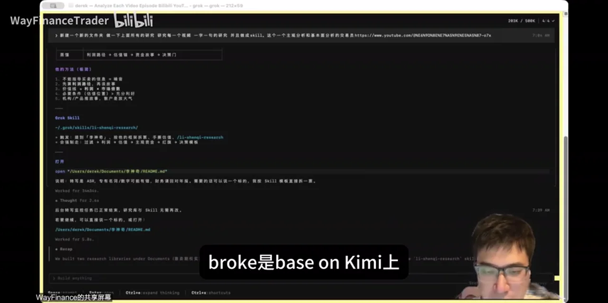
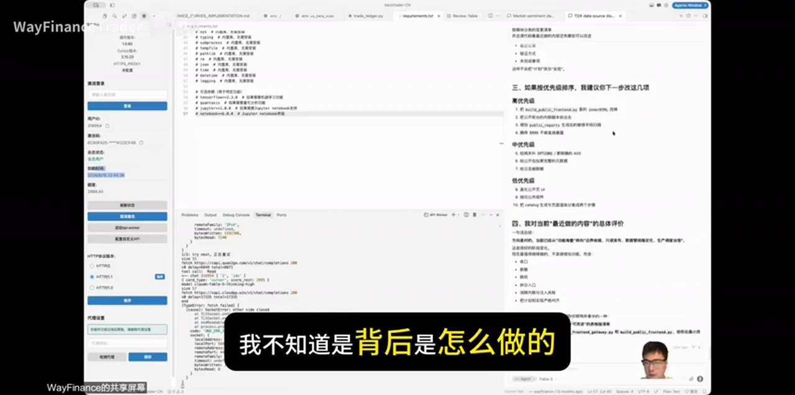
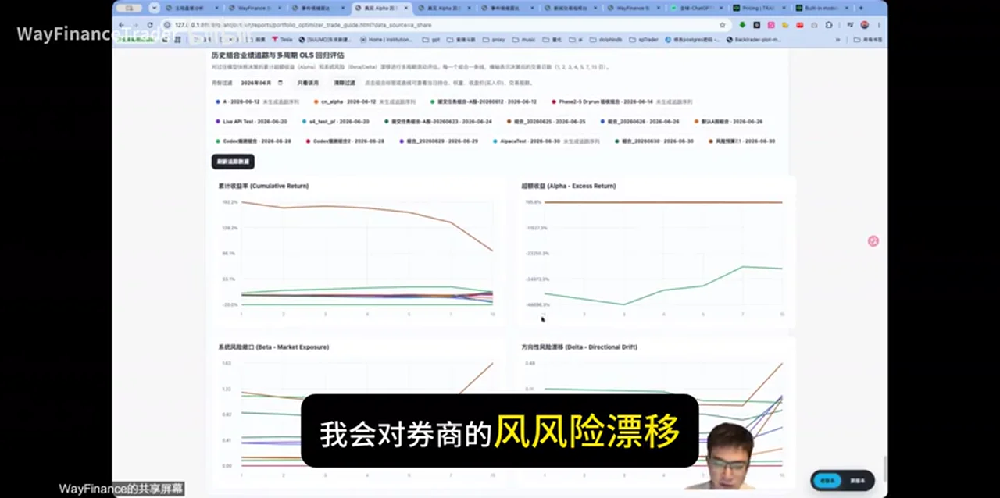
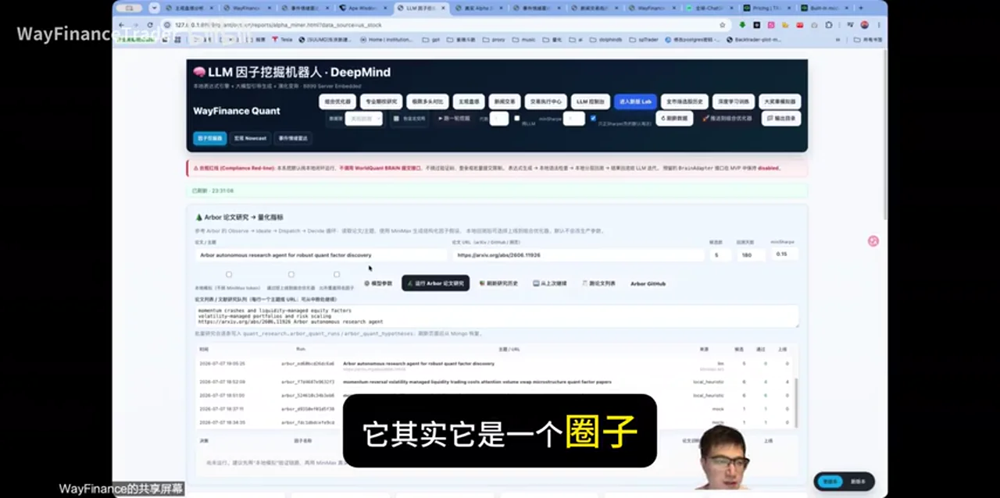
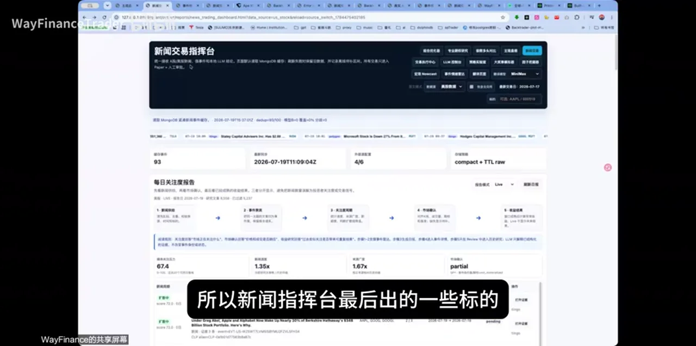
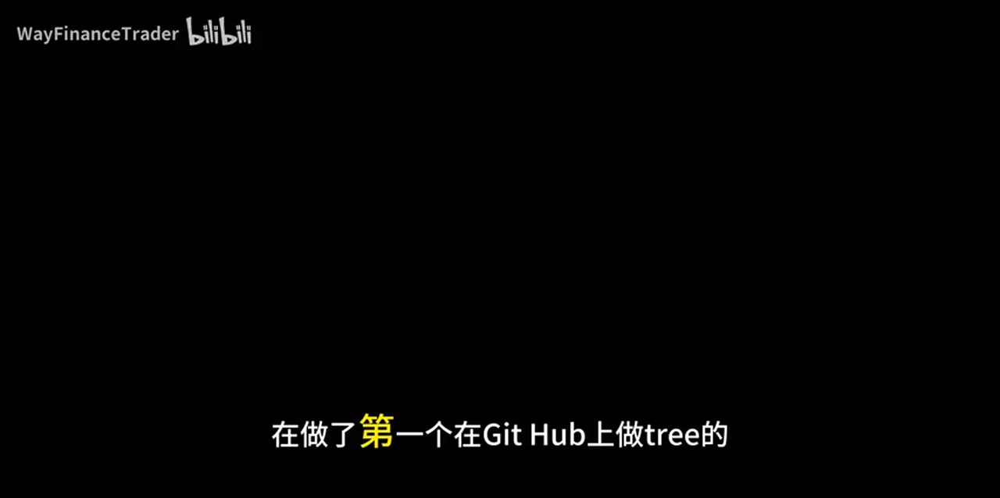
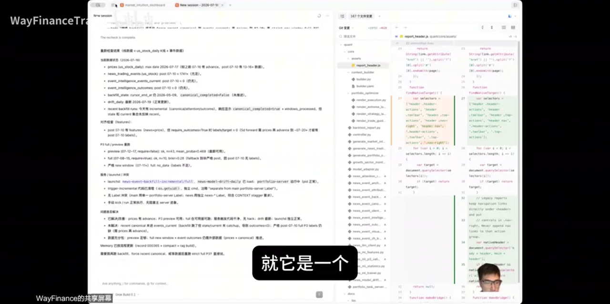
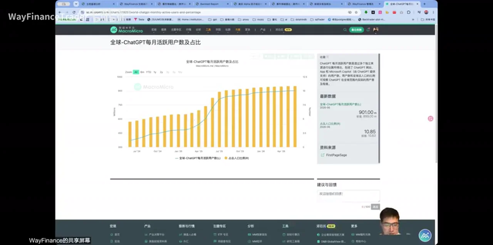
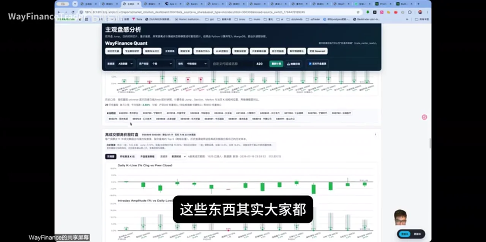

# 总结

<!-- synthesis_status: post-repair | transcript_basis: repaired same-timestamp raw ASR | fact_check_basis: post-repair -->

> **Post-repair synthesis。** 本稿只依据修复后的 387 段转写、当前事实核验与已审查关键帧重写；无法可靠辨认的产品、模型、版本、套餐和价格不会被补猜。

## 核心摘要

这支视频的可迁移价值，不在于选哪一个模型、买哪一个套餐或追哪一只标的，而在于把“用 AI 做事”组织成一条可复核的系统链路：**把模糊任务变成可检查的研究产物，再把研究产物交给受约束的实现、验证与报告流程，最后保留人类审核和控制权。**

讲者以市场观察、组合构建、因子研究和新闻事件为案例，反复强调两个方向：一是 AI 可以把资料搜集、文档整理、代码规划、指标展示和日报生成串起来；二是系统不应因为“页面能跑”就自动获得交易或决策权。数据是否标准化、时间是否对齐、指标是否定义清楚、谁能动哪些数据，才是能否持续迭代的基础。

## 视频中的工作流：把模型输出变成可以审查的资产

### 1. 调研的交付物应是资料包，而不是一次聊天答案

视频先展示了用终端/对话式工具调研创作者与视频资料的做法：输入研究问题，收集链接和文本，再把过程与结论沉淀为文档。这里值得复用的是“产物导向”：每次调研至少留下来源、输入问题、生成步骤、输出位置和待核对项，后续模型或人才能接着审查，而不是从一段不可追溯的聊天重新开始。



视频中若干模型和工具名称的 ASR 识别不稳定，因此它不支持“某两个模型同源”“输出等价”或“某价格一定更划算”等结论。应保留的方法是：用工具做资料收集与整理，但把模型名称、版本、价格、额度和能力比较视为需要单独核验的配置事实。

### 2. 规划、实现与复核应分层

讲者描述了一种实用交接：先让一个成本较低或中转式工具提出规划，再把可检查的建议交给主要执行工具实现。合理的工程解释不是“规划模型一定更聪明”，而是把它放在低风险的方案生成位置；执行前由人或主控制器检查目标、文件范围、数据权限、验收条件和回滚方式。



这也适用于任何带代码的研究系统：

- 规划产物写成任务清单、假设、输入/输出契约和验收标准；
- 执行者只接收经审查的最小任务，而不是无边界的“帮我把系统做完”；
- 每次运行记录使用的数据、版本、参数、时间和失败原因；
- 报告与代码都应允许下一位审阅者追问“这个结论从哪里来”。

### 3. 从“能展示”转向“可验证”

视频里的组合/回测界面把累计收益、超额收益、市场暴露和方向漂移等放在同一视野中。无论这些指标最终如何计算，画面传达的正确要求是：交付物要暴露自己的定义与风险，而不是只展示一个漂亮的结果曲线。



这里的实践推断是：每个策略、模型或仪表盘都应先回答四个问题——输入数据何时取得、目标变量是什么、使用了哪些约束、在什么条件下会被判为无效。仅有图表、单次回测或聊天解释，都不足以构成收益证据。

### 4. 把论文和因子当成候选来源，而不是结论机器

视频提出从论文出发、沿引用关系寻找较新研究、再生成和筛选候选因子的循环。这个循环适合用 Agent 加速“找资料—提取假设—建立待测候选集”，但不应被误写成自动发现有效因子的证明。



尤其是视频中的某个风险调整后指标阈值、数值和筛选工具名都无法可靠确认。即便这里意在讨论 Sharpe Ratio，Sharpe 的原始工作定义的是风险调整后表现度量，并没有给出“超过某固定数值即可使用”的通用准入线；样本外表现、交易成本、容量、数据泄漏与多重试验仍需单独审查。参考：[Sharpe 的原始论文](https://www-leland.stanford.edu/~wfsharpe/art/mfp.pdf) 与 [The Sharpe Ratio](https://web.stanford.edu/~wfsharpe/art/sr/SR.htm)。

### 5. 让事件流留下可审计的中间队列

“新闻交易指挥台”画面显示了事件、关注标的、状态、完成度、候选与数值指标组成的日报式队列。它比直接给出“买/卖结论”更有价值：新闻或事件首先成为带时间戳的对象，再被关联到标的、研究状态、证据和报告，便于追踪遗漏、延迟与后续验证。



视频把事件驱动研究与组合研究作收益比较，但该说法没有提供事件定义、数据时点、延迟、成本、基准、样本外检验或容量信息；本次核验将其标为**未验证的研究假设**，不是一般性的收益结论，更不是投资建议。

## 事实核验与使用边界

本次 post-repair 事实核验包含 **6 条候选事实：2 条部分确认、4 条未验证**。应将它们带着边界使用：

- **部分确认：提供商与模型配置。** OpenCode 的第一方文档支持“按提供商连接、配置并选择当前可用模型”的一般能力；但这不等于任意认证方式、所有模型均可接入，也不等于它是 VS Code 的同义替代品。参考：[OpenCode Providers](https://opencode.ai/v2/docs/providers)、[OpenCode Models](https://opencode.ai/v2/docs/models)。
- **部分确认：期权 gamma 是条件性机制。** 做市商净 gamma 与其 delta 对冲可能放大或缓和波动，但结果依赖净头寸、流动性、到期结构和实际对冲行为；不能把“正 gamma 必然横盘、负 gamma 必然趋势”或某个边界突破写成确定信号。参考：[Cboe 的相关研究](https://cdn.cboe.com/resources/education/research_publications/gammasqueezes.pdf)。
- **未验证：产品谱系、模型能力、价格、套餐、配额、历史模型目录和下线日期。** 修复后 ASR 仍无法稳定识别这些名字与版本，故不应根据常识自动补成具体品牌再反向证明。
- **未验证：固定绩效阈值与事件策略更赚钱。** 没有可复现的指标定义、回测与样本外证据时，这些最多是待检验假设。

## 一句带走

把 AI 放进研究或金融工作流的关键，不是让它替你宣布结论，而是让每一次调研、规划、计算、事件筛选与报告都留下可审查的输入、约束、证据和责任边界；自动化越多，控制器与人工复核越不能缺席。

# 辅助理解

<!-- synthesis_status: post-repair | evidence_policy: video viewpoint, verified fact, and practical inference are separated -->

> **Post-repair synthesis。** 本辅助理解只使用已恢复为同时间戳 raw ASR 的转写；模糊的模型、版本与价格名称不作为系统设计前提。

## 辅助理解：把“AI 工具堆叠”改成可审查的研究系统

视频看似横跨编程工具、组合、期权、因子、新闻和跨市场价格，真正可以统一的不是某个模型名称，而是一个闭环：先定义要回答的问题，收集可追溯的数据，生成可审查的研究或规划产物，受权限控制地执行，再把结果送回指标、报告与人工复核。


这张图的核心不是“每一步都交给 AI”，而是每一步都留下下一步可检查的对象。若某个环节只剩口头判断或无法复现的聊天记录，后续系统就无法判断结果究竟来自数据、提示词、模型偶然性还是人为修改。

## 三类产物，三种责任

| 产物 | 最小内容 | 谁应负责 | 不能据此推出什么 |
| --- | --- | --- | --- |
| 调研资料包 | 来源链接、获取时间、问题、摘录、未解项 | 调研 Agent 与审阅者 | 资料被收集不等于结论成立 |
| 规划交接物 | 假设、输入、输出、文件范围、验收与失败条件 | 规划者与执行前审阅者 | 一个计划不等于已经实现或回测有效 |
| 决策队列/报告 | 事件、标的、时间、状态、证据、指标、负责人 | controller 与人类审批者 | 队列中有候选不等于应交易或应发布 |

视频末尾关于“人可读文档”和“模型间机器文档”的讨论，可以收敛为这条规则：**给人审查的内容必须解释来源、假设与结论；给系统传递的内容必须有稳定的字段、权限与版本。** 当前转写中机器文档格式名不稳定，因此不应擅自把它固定为某一具体协议。

## controller 应解决什么

视频提到 controller 用来规定“谁能做什么、能动哪些数据”。把它落成工程约束，可优先写成四张清单：

1. **身份与任务。** 哪个 Agent 只能调研、哪个可以写草稿、哪个可以执行代码，谁最终批准。
2. **数据范围。** 哪些数据可读、可写、可导出；哪些只是脱敏视图；哪些绝不交给外部模型。
3. **动作范围。** 下载、整理、计算、生成报告、发出提醒、提交订单等动作分级；高影响动作必须有人类确认。
4. **证据与审计。** 每个动作关联输入版本、时间、参数、产物位置、失败信息与审批记录。

这样，即使更换模型或编辑器，系统仍能回答“这项结论由谁、基于什么数据、按什么约束得出”。这是比比较模型排名更长期的资产。

## 市场与量化部分：把观点转成待证假设

视频展示的组合图、暴露指标、因子候选、事件队列和跨市场比较，适合被看作研究接口，不应直接读成收益承诺。一个最低限度的可验证记录可以是：

```text
事件 / 信号 → 来源与发生时间 → 可交易标的与可用时间
→ 特征或规则版本 → 风险约束与成本假设 → 样本内 / 样本外结果
→ 人类复核结论 → 后续跟踪
```

对于期权 gamma，外部资料只支持一个条件性机制：做市商的净 gamma 和 delta 对冲**可能**放大或缓和波动，效果受头寸、流动性、到期结构与实际对冲影响。[Cboe 研究](https://cdn.cboe.com/resources/education/research_publications/gammasqueezes.pdf) 因此，视频中的横盘/趋势、边界突破等说法应保留为讲者的建模假设，不能直接变为下单规则。

同理，视频所述的固定 Sharpe 阈值、事件策略“更赚钱”、跨市场价差和特定价格路径都没有在材料中给出可复现检验。即使把其中“sharp”最小理解为 Sharpe Ratio，[Sharpe 的定义性工作](https://web.stanford.edu/~wfsharpe/art/sr/SR.htm) 也不提供一个通用的“达到某值即可使用”门槛。应把这些陈述放进假设登记表，要求补齐数据、成本、基准、样本期、容量与样本外结果。

## 如何使用多模型，而不把名称当能力证据

本次核验中，OpenCode 的“按提供商连接和选择当前可用模型”的一般能力得到部分支持，见 [Providers](https://opencode.ai/v2/docs/providers) 与 [Models](https://opencode.ai/v2/docs/models)。这足以支持一个保守设计：模型选择应是可配置、可记录、可替换的一层。

但视频转写里的模型血缘、输出等价、套餐价格、使用额度、历史目录和下线日期都处于未验证状态。正确的操作不是把它们补成看似准确的品牌名，而是把配置表写清：使用了哪个确切模型标识、在哪个账户/地区/日期、通过何种提供商、消耗了哪些可测成本、产生了什么可复核产物。

## 一份可立即采用的验收清单

1. 每个研究问题先写明“要支持或反驳什么”，而不是只要求模型给答案。
2. 每个外部来源保存链接、抓取时间、原始内容位置与许可/访问边界。
3. 把模型生成的计划拆成可验收的小任务，并限制其可读写的数据和文件范围。
4. 把图表指标的定义、单位、频率、时点、缺失值处理和成本假设写在图表旁。
5. 将候选因子、事件信号和跨市场比较先登记为假设；没有样本外证据时，不升级为策略结论。
6. 让 controller 强制记录人类审批、自动动作和失败路径；高影响动作默认需要人工闸门。

## 一句带走

AI 可以显著加快“搜集—规划—实现—汇报”，但不能替代数据来源、实验设计、权限控制和责任归属；越接近市场或高影响决策，越要让系统留下能被人追问和复现的证据链。

# Data

## 增强转写稿

[00:00] Hello大家好,这一期是跟股票没有什么关系的一期
[00:03] 先跟大家说一下,我们怎么通过IWAP coding开发
[00:07] 我们怎么通过IWAP coding开发,得到一个我们想要的结果
[00:11] 就比如说,生成一个我们可以观察市场的一个短线、长线、中线的变化的东西
[00:18] 我出现我的背景是2015年在中科院,18年之后在苹果
[00:24] 20年之后我就没有在做后代码
[00:28] 但是20年到20年,我是在用一些AI的东西去改函数
[00:33] 在做了第一个在github上做税的回测的东西
[00:40] 然后生成了一个22年正在用的官员A股的一个每天则股的一个电话的
[00:45] 常识的电话的一个东西,是周线幅度
[00:48] 等到24年的时候,我们用现在的证哥的编程的方式重新把它改了一下
[00:53] 把效率提升了一下,等到25年、25年年末
[00:57] 大家发现这个固定爆发的时候,我们才开始做电话平台
[01:01] 电话平台主要目的是把中国、美国还有大宗产品能够维化
[01:06] 那我目前能做到的事情就是A股的一个呈现
[01:09] 也就是说,它还是在做辅助台的一个交易和一个封面的一个报警
[01:14] 还没有做到真正的纯的机器交易
[01:17] 而且我不太相信机器交易,因为我觉得人工可能是最后一道防线
[01:21] 就包括,为什么韩国能这么直上、曲手直下来
[01:26] 其实和2020年的那个时候的那个自动化交易差不多
[01:30] 电话交易和自动化交易的区别在于什么,就是在于机器真的会思考吗
[01:34] 或者说,在一个大波动的时候,我们再尝试如果机器会思考
[01:39] 能不能躲过2020,2000年的那样的股灾,会不得不装着下来吗
[01:46] 其实对于美股来说好像无大会,因为有Gamma Option这些理论的存在
[01:52] 但是正因为有我们计算机的快速交易,所以我们对Option有很多的居限的定价,可以定价好
[01:59] 所以我们如果连期权都可以定价好,我们反过来说,我们在对线性市场会不会有更好的反过来看的东西
[02:07] 这是我们今天要跟大家讨论
[02:10] 在这之前,我先跟大家说两个我现在正在看,但是没看懂的东西
[02:15] 我可以share给你们,一个是Grooke,一个是Kimi的3.0
[02:20] Grooke,我们把我的terminal给你看一下
[02:25] Grooke,我去调研的两个博主,因为Grooke的本身是来源于x,就是我们的推特
[02:33] 我觉得它最好的技能是用来调研,比如说调研,这是他们的GRI,不是CRI
[02:39] 大家可以理解成你在微软的中端里或者说是我们的mac的terminal里,你可以去输入一些命令
[02:47] 它可以帮你做一些事情,比如说你也可以把它的off或者是认状,保定在open code
[02:54] open code是一个bit hub上可以做的一个类似于vs code的一个东西,可以太主要用于我们的编程
[03:01] 技术上的东西,我觉得如何做怎么做,大家可以去问AI,但是我现在给你们几个提示词
[03:08] 我现在比如说我在调研李神奇这个人,我想看他在B站上的视频,我要看他在YouTube上的视频
[03:17] 这个人是一个本身,也跟我一样,他是自己架构出身的一个人,也是疫情期间就跑出来了
[03:25] 拿着自己的钱去做一些东西,他支付费大概一年是60万的收入左右
[03:32] 他用他的钱慢慢累积去做仓位,不管你,包括他在做估值的同时要做科技爆发,我觉得跟我的思想差不多
[03:41] 我都想去调研他,其实我是他的半年前的会员,但是我没有太多时间去看
[03:48] 所以我就想一个方法,怎么能把他这个东西,把他skill争留出来
[03:52] 我就把他的所有的视频能不能发下来,可以跟大家说一下,YT上发的更快一点
[03:58] 我同时做了这件事,所以可以给大家展示一下,如果你觉得在terminal非常难理解的话,我可以展示一下同时期的
[04:11] 大家可以看现在的groke,大概生成什么,正常的文档,生成的步骤,一字一句视频下载,什么多少万字形成
[04:19] 只不过groke更便宜一点,我再给大家分享一下同样keming的东西
[04:24] 所以我再说,groke是悲丧keming上,都是在keming2.7的技术上做的,keming3是悲丧keming2.7
[04:34] 而groke也是在keming2.7的技术上去做的,所以我认为groke4.5和keming3,我觉得输出同归
[04:43] 而且两方应该是联盟关系,不管是keming还是switch at groke,目标都是要上市,拿上市做事上有钱
[04:52] 所以其实我觉得大家应该把它们看成一个东西,ok
[04:58] ok,这个就是我们terminal去用做keming的东西,比如说我去扒一个叫做cow,卖,期权实现,早日自由的一个博主
[05:08] 它有10万家庭,为什么我没有,我就相当于我在这边我输出一些问题,跟它调演的问题
[05:16] 比如说我输入中文,比如说我把他的视频的链接整理它,说我要一字一句的分析它每个视频是什么样子的
[05:25] keming也可以这么做,也会给我一个报告,也会给我一个文档,我让它放在document下
[05:31] 这就是我用keming和用groke的这个用法,大家可以看一下我是一个我们现在的用量
[05:40] 我应该是在keming上投资最多的,因为我在他的仲介的会员是199的年度的一个会员
[05:52] 那在这种情况下,我们的用量是什么样子的呢
[05:56] ok,你看到我们的用量是我只调研了两个人,然后我的用量就用了一个粥量的50%
[06:03] 而我的定业信息是20倍的扣的,就是到处第二档,大家可以看到我们的用量,它现在出了一个Ultra是吧
[06:12] 我们用量是pro的这一半,Ultra已经是open eye的200刀,200刀现在都没有1400,因为美元的原因
[06:22] 所以其实我觉得这样的价格已经比coDEX和我们的GPT要贵了,所以它最后走掉合方
[06:31] 我觉得至少它不会比minimax抢minimax的风头,所以我觉得港股下跌的是质普,不应该是minimax,minimax应该是被挫杀的
[06:40] 另外我们有质普的东西,大家可以看到我们用质普做了很多东西,包括我在我的这个地缘项目里面对它的一些维护
[06:52] 我最开始我是用质普加签问,然后再加coDEX,现在签问被我提出了之前的一个我的需费的标准
[07:01] 我现在把gmail带和签问全都提出去了,就是这种上手公司,现在不够经验,因为它没有抄来抄去
[07:08] 不是说它错了什么,是它错对的,而且非常有道德,但是只是现在我用不起,对于它们来说一个时间我使用质普,我用的是中间商给我的token或者说我用的是火山的jrm,为什么用火山这样m
[07:24] 因为火山就是抖音自己的那个云服务,火山的最近它200人民币的套餐的首约是49元
[07:34] 那大概大的货客价钱应该是在30块钱左右,这套餐大概是79元,就是10刀的套餐
[07:41] 我能获得的是jrm,质普的这个调用的,就是它的倍数是1/4的价钱
[07:48] 如果我调用它的上下门,我是用比质普自己的还便宜1/4大钱,为什么不用
[07:54] 所以,反过来说是质普这个公司不会倒,还是火山小视频,我们的抖音不会倒,大家心里有数
[08:01] 所以其实更好的算力,更公开的模型是什么,就是这样
[08:06] 我觉得是这种情况下,我用的,但是机构的是质普自己的东西
[08:11] 但是我们有装cloud的一些开源东西,比如说对于agent rich
[08:17] 我可以在我的对话框里去调用网络的一些东西,包括我让它调研的那个bit hub东西
[08:24] 但是质普我是这样的,我里面还有minimax的token,就是minimax的目标是我让它帮我藏commit
[08:32] 我个body在前段时间几分比较便宜的时候,我还是用它去调用质普和用它去调用会员
[08:40] 最近会员也是免费,但是会员免费之后,我发现我调用的时候慢了不少
[08:45] 很难的一个状态,如果我的IP在美国我调用会员会快一些,IP如果在中国我调用会员会慢一些
[08:54] 所以它究竟在中国software还是在外国software这件事情我们再调研,最后我再出一个conclusion结论
[09:01] 我为什么这么做做,我的目标是什么,当然我既要出一个跟我们的平台有关的东西
[09:08] 我还要去调研各种东西,就包括我们跟投资有关的事情
[09:14] 因为在之前我们是签问和质普加codex,但是签问有点3.7和3.6的时代,3.8还不知道
[09:23] 我现在也想用3.8只,如果我现在没有导弹便宜的途径,我的想法不是说我花不起这个钱
[09:30] 是如果不够便宜,它就不够商用,就不够实用
[09:33] 如果我做金融的人觉得花不起这个钱,这个没有人能花得起这个钱
[09:39] 我不排除有一些老板,我一定要做出什么东西,一定要给谁做出什么东西
[09:44] 但是这不是一个商业环境人员,要用跟便宜成本去做事情,这是我觉得我们的初衷是这样
[09:50] 我再去调研另外一个事情是opencode,opencode是什么,它是一个,我怎么说
[09:58] 它是一个可以把所有模型都放在里面的一个东西,它自己有opencode
[10:03] 所以有两个免费的东西,一个叫dupec,一个叫混源,所以dupec和混源我们觉得在下一期就是Q2到Q3的时候
[10:13] 这两个的响应在美国调用会很高,为什么,因为免费,免费的不用不是王八蛋
[10:19] 就是这个意思,混源这个东西,那毕竟腾讯人毕竟在7月转8月的时候会很贵
[10:25] 所以现在我觉得腾讯突400再突600,可能是一个对我来说是,如果我是做事情,我可能会这样
[10:33] 我在400到500的时候我再去回购,所以我现在盯腾讯的时候就是两个事情
[10:40] 一个是它会不会价格停留在一段时间,比如说它停留在上下10块钱的时候
[10:46] 如果在5日之后我买一套去防止它上涨,如果它在一段时间开始回购的第3次之后我可能买一套,对它是这样
[10:57] 后面大家可以合理有谷歌的东西,我现在已经不定谷歌的东西了,因为谷歌是第一个把我放好的人
[11:02] 只是如果我调用了它的模型,它就会把我放好,我觉得太没有水准了这个公司
[11:08] 不是把我Gemini调用了,是把Gemini调用的NT,Gravity,反中立,反开可能不知道,我就会问它为什么我等你上去
[11:19] 我换了一个号,我就掉上去了,所以不是IP的问题,就是它把我的符合证号给封掉了
[11:24] 所以其实我觉得我用Gemini的普通版去给它规划一下,再用Bible把它的规划再做一下就可以了
[11:34] 那在这种情况下,我会选Memax,因为MemaxOpen Code在之前Memax是免费,现在Memax不免费了
[11:43] 所以Memax在下一段时间的可能它的想法就会少,会员就会多,所以我们买股票会买Memax在一个底部
[11:53] 我们做基确会做会员,这是这个原因
[11:56] 另外一件事情就是,我们在整个调用的时候,我会发现Google 4.5它的消耗额度在官网上说是Google Build 0.1的两倍
[12:06] 其实Google Build 0.1,Build 0.1就行,它该做不出来的就是做不出来的,它就能做出来,大概是这个样子
[12:13] 它每次修改的点数非常多,它不会说是,它觉得我该改,它就改了
[12:19] 它也不会说有一个评估再把这个不该改再把它去伸下去
[12:23] 就是我给我带感觉,它是一个非常理性的一个员工,但是这个联工有点听不懂我们老板的话,有点这个样子
[12:31] 所以它是最好的模型,也许不是,但是它应该是一个最能干活的模型
[12:35] 而其实我们在第一姓员里的时候,就是当一件事情还没做好的时候,我们还是要把活干好
[12:41] 而不是说让大家听懂我的话,那又让谁听懂我的话,这里面我们就用的是一个东西叫Cursor
[12:48] Cursor 我们第一次我给大家说一下叫什么叫中转,这个是我第一次在使用外部的东西的一个中转
[12:56] 但是我知道Cloud你们可以用Casey Switch,背后你可以放置譜,你可以背后放很多东西,你这放什么都行
[13:03] 但我想跟大家说的是,我现在就在咸鱼上,比如说做了一个东西,这个东西是我买了,别人一个机会买,这个机会买
[13:11] 据说它这个3000基分一个月,我刚用,大家可以看,3000基分一个月据说能当100,多少,是1000多到还是100多到,我不知道
[13:22] 大概成本是30块钱,我不知道背后是怎么做的,所以这里边有很多可能是穿水
[13:30] 但是我想用的也就是它,我想它给我规划一下,因为我现在程序代码行数比较多
[13:39] 重新的规划的时候,往前的推进速度和整体的响应可能有一点慢
[13:45] 在大家刚上这Five 5的时候,有可能会很难受的,所以我们需要Cursor去帮我做一下
[13:55] 它的建议不是我的第一大建议,它的建议我是会把它的建议部分拷贝出来之后
[14:02] 把它放到我们的Codex,这就是我们要说的一个东西,Codex去做,而Codex是我完全付费的一个东西
[14:11] 当然你可以通过Google Pay,你可以通过Apple Card,用各种清理外观的方法把它的成本降下来
[14:20] 比如说Apple Card有可能你会拿8折的价格去买到,要100到的东西
[14:26] 你可能在Google上拿到6到7折的买到Google Play的Card,这是另外的问题
[14:35] 就是即使我们用原汁原味的Code,你也可以有中转的价格
[14:39] 这是为什么在Apple和谷歌上它的中间商则差价
[14:45] 比如说我要收100块钱后,可能就收了一个蘋果税在30%
[14:52] 最后可能到时候就只有一半的原因,其实中间它因为某些原因或者是因为促销的原因
[14:58] 它有很多的汇套吸套卡,这些产业在帮他们做一些类似处置的功能
[15:04] 我不认为它是一个简单的一个汇产
[15:08] 我可能更认为它是一个鼓励大家使用的囤积的一个金融方式
[15:15] 这就是我们Codex,Codex我怎么使用,这里面是有学问的
[15:19] 以前我只是把它作为前端数据和中端
[15:22] 最近我把我的所有的类似网页的东西都分类了,可能是对话
[15:28] 也就是说我每如果能做,看得到吗,该现在看得到是吧
[15:35] OK,我想跟大家说我现在能够想说的事情
[15:39] 不管我这个数据是怎么样子,我看这个稍等
[15:43] 首先我们知道这个,因为Cloud和OpenAI中在打价
[15:49] 所以它每天会上新模型的时候,它会renew一下它的用量
[15:54] 当然6日的时候可能不会renew,所以你可能必须得用一次成织
[15:59] 我现在用的是它的Pro的最简单的那个版本,就是100刀的那个版本
[16:04] 也就是600多,我每月的这个AI费用其实不是只这么多钱
[16:10] 但是我想说的是,我们如何把这个成本降低的情况下
[16:15] 再使用它们AI去帮我们做事情
[16:19] 当然你可以说我们用marys,我们用其他的东西
[16:22] 去让它在这个市场上去搜索消息,通过市场上的消息去分析
[16:28] 但是我用我们的做大数据11、12年的几个老师的话
[16:33] 就是在垃圾里跑垃圾,但最后生成的还是垃圾
[16:37] 就是我们必须有规律化、标准化的数据,而在把垃圾变成数据其实是有价值的
[16:44] 那这一部分价值我可能国人不太注重
[16:47] 比如说都是五分钟线,把他们的成交量弄成前后一致的,那就是有价值的
[16:54] 这个,我觉得大家应该去更想这些东西
[16:58] 我现在能做到的东西,ok,这就是我们最终出来的一个东西
[17:04] 我把这摆在这,如果你看AI看什么,就是看中端,看用户,看软件看什么
[17:10] Tragility,每月的月活数量,这个7月的月活数量应该更多一些
[17:15] 我们现在就看一下它是在哪里有快点
[17:18] 快点是在25年1月、25年4月,这不是清明节吗
[17:23] 它这个垃圾是谁在省的,是所有的光玻块的英伟达在省
[17:27] 那后边是什么,后边这段时间是存土在这
[17:30] 也就是说当这个曲线越平稳
[17:32] 你愿意要注意的是配件,存土内存铁是配件
[17:37] 你越斗窍,你越要注意的是算力,算力是什么东西,是GPU
[17:42] 也就是说你现在如果我们知道这个Tragility有可能
[17:47] 因为上了一个5.6,用的人多了,keyme用的人多了
[17:50] 那我们又斗窍,我们应该回到哪里
[17:53] 我们应该回到25年4月的这个位置,25年4月谁长
[17:57] 25年4月谁长,美国和中国不一样
[18:00] 中国是光玻块,就是英伟达省营店,美国是英伟达
[18:05] 而横盘的这段时间,比如说Marlin,二级的这种芯片才会长
[18:09] 所以你们想做交易的事怎么办
[18:12] 我们在用的时候,就是先用的人,先了解时间
[18:15] 先长先的人才知道这个变动是什么样子
[18:18] 那最近我们看到了不管是Cloud上来给5.5居然都renew了一个他们的额度
[18:25] 还要给我们的Dex的用户,包括CPT5.6的5.5的用户去做这些东西
[18:33] 还能代表一个什么问题
[18:34] 代表的问题,这个东西已经用于了太多的人在做
[18:39] 而其实我还有一个套餐,这个是我们去年就买的年费的套餐
[18:45] 这个套餐是什么,这个是,Tree是谁
[18:48] Tree是TikTok做的,Tree是我第一个用的外部扣电,是LionTikTok
[18:53] 不是说我对TikTok有多好的评价,因为Tree是第一个
[18:58] 当初Cursor把这个500次访问,就是三千次访问改成了按量算
[19:04] 而Tree还不是按量算,当时我们还是可以用10刀去调用Cloud
[19:10] 大概Cloud那时候是3.5,3.几的状态
[19:14] 那我们看一下它的高 documents,到达现在这种程度
[19:18] 包括像抖音像TikTok,他们公开的订阅的是什么模型models
[19:22] 我们看到TreeTikTok给我们的模型是什么,GDP 5.4
[19:26] 5.4,7月3号,CR3号,我们的Open Eye就要下线的一个model
[19:31] 可能那时候他们才会更新到5.5,还有5.2,这个模型你都看不见
[19:35] 他们自己的模型,Meme Max 3上得早,K2.5,JM9倒是3.1
[19:40] 现在JM9其实是3.5,也就是说他们去外销的是一个落后的模型
[19:45] 这有点像什么,就是我们在手机的时候用去年的东西
[19:49] 但这个东西能不能,我跟大家说就是GDP 5.4,别说5.4
[19:53] 就是5.2,它也比JM9好用,就是一次成码率,不用反锋
[19:57] 我现在的问题就是我编了这些东西,做完之后
[20:01] 比如说我也有一个前端的一个东西,一个数据的一个东西
[20:04] 还有User一个东西,JM9每一次都会改换
[20:08] 而且最后会告诉我我全局输出不来这个东西
[20:11] 我现在能做到的事情基本上是JM9设计没问题
[20:16] JM9设计一点的问题都没有,包括它出图都没有问题
[20:19] 但是它实现有问题,但是实现可能它们不太在意
[20:24] 因为它们本地可能也不是调用JM9自己的东西去做的
[20:27] 对,我想做的事情是什么,就是组合
[20:31] 首先我们第一进来的是组合,不管怎么样
[20:34] 我现在生成一个组合,我可以买,比如说我们对A对A是什么样子
[20:39] 有一个组合,而这些组合最好之间关系不都是很近
[20:44] 就比如说,同样是一要之间,它们是什么样的关系
[20:47] 是复数,什么是不太一样的东西
[20:50] 最好不要在一要里逮捕,比如说,这个是7月17号的东西
[20:54] 我们能不能擬合,能不能做威尼恩斯的优化
[20:58] 我们可不可以显示一下,现在我们,比如说,我也买了一个网当
[21:02] 我们现在一样,是所同时,其他的大盘指数,这个α是多少
[21:08] 我们现在已经极限到10倍α了
[21:11] 在这个大盘,不度没那么快的时候,大概,比如说,每个网线半导体
[21:15] 只是2到5倍的α,所以现在,其实一样,是一个非常α,非常强的一个方向
[21:21] 所以,也就是说,如果以前我拿20%,我现在可能只用10%的方向就可以
[21:28] 仓,所以你们的营亏之间的关系,我觉得它的α预期效果越大,又仓和越低
[21:34] 所以,其实对于一个正确的交易者来说
[21:38] 比如说3万亿到2万亿,可能3万亿的时候,交易员可能有5千万的资金
[21:43] 但到2万亿的时候,肯定交易员,肯定1千万都没有,那剩下的资金是散户资金
[21:48] 其实散户资金没走,就是3万亿降到2万亿,没有一个散户跑掉
[21:52] 他们只可能是因为自己的事实越来越少,就是交易样在减少
[21:57] 但是,他们依然是O in,O out,是吧,对,这就是我们做的东西
[22:03] 我想做东西有个极准,有个组合,每天有个挑仓的可能,交易清单会一键去到交易中心
[22:10] 交易中心也可以下单,在这边面,也可以去看一下方向票仪是什么
[22:16] 如果我是劝商,我有很多的这个组合,我究竟怎么配这个资金
[22:20] 如果我不是劝商,我要服送劝商,我会对劝商的方向票仪能不能人工的再干预一遍
[22:26] 就这个地方我出了曲线之后能怎么做,这是我最开始的一个想法
[22:29] 这是开始我优越钱的想法,我们会对极限多头,因为一个月前的多头是非常极限的
[22:35] 我就说,OK,我作为一个不是很会打板的交易人
[22:41] 但是,我有想用这个代码的方式去给我做一些东西,这个完全没有数据是吧,又没有改善了
[22:47] 稍等,我们就说,今天提现多头,我们怎么配置,我们天天打,能打到什么程度
[22:54] 这是当时的想法,比如说,我再怎么比较中心,我们再看一下这个户人300是什么样子
[23:01] 我在之前,提到中心之前,看完之前,告诉我户人300是什么样子,然后我们再切了1000500是什么样子
[23:08] 是偏多的,还是偏空的,这个数据都没算过
[23:13] OK,是现在的数据是偏空的,是吧,这是17号计算,它都没有一件触发吗,这个好等
[23:21] OK,我的想法是在这里边就可以下单,但是最近我们在做什么,包括我们给户人做的是齐全的事情
[23:29] 所以我在这里面又加了一个齐全的计算与GAMA的东西,我现在只以每股的课股的齐全为主
[23:35] 所以我们会对买一些数据,新买的一些数据,去对实施的正GAMA负GAMA做计算
[23:41] 有一些数据可能还不够齐,是因为我刚把它加入我的关注点里
[23:47] 关注谁不是我说的算,是谁说的算是,关注谁是,这个网站说的算,这个网站又是什么,把那个
[23:54] righted的,任何的点量,点字,把他们的帖子按照他们的training的按响应速度去排名
[24:02] 因为有很多人说,你为什么不喜欢做那些,你为什么不喜欢做那些流行的股票
[24:08] 但是做齐全的时候又不可以这样,所以我们就,谁去进入关注,不是我说的算,而是事件说的算
[24:16] 那么我们就在这种情况去做了一个齐全的一个东西,这样我们会告诉我什么是负GAMA,什么是正GAMA
[24:27] 正GAMA和负GAMA的区别是什么,正GAMA就是横盘震荡,负GAMA就是趋势,如果趋势破就是趋势
[24:34] 比如说开盘前半小时,如果涨过最高点,就会大涨
[24:39] 开盘前半小时,如果跌破最低点就是大跌,我们就大概是这个样子
[24:44] 比如说我对SPY进行研究,告诉我实施暴露在哪里
[24:49] 当然这个数据开盘的时候就是实施数据,现在是不实施
[24:53] 会告诉我,他在COWO,什么叫COWO就是上边界在哪,COWO就是下边界在哪
[24:58] COWO和COWO在生成的东西,就是突破上边界,就是趋势,突破下边界的就是趋势
[25:05] 但是能没有趋势,就负GA就趋势,大概就是这个意思
[25:09] 那在这种情况下,比如说我今天如果做指数了,就做他,你会发现我周四为什么不说话
[25:15] 因为没有,因为我熟悉的指数,它虽然是负GA,但是那几个点我倒怀疑
[25:21] 但是我不熟悉的那些股票,它没什么可关注的东西
[25:24] 这就是我们,OK,这是第二版的内容,第二版内容我们再说,因为第二版我还没开发好
[25:31] 最后我们就说,我这个音子,比如说我们这个音子,这个音子是jamlet提供给我的,说最好是什么样的音子
[25:39] 我们怎么看节链,这件事情是比较,什么叫主观,就是比较和现在相关
[25:44] 那我们有没有可能用电脑的,用自动化的方式去查最新的论文,去生成音子
[25:51] 而现在形容的音子是比较流行的音子,而这些音子我把它叫做不同的,就是规划的
[25:58] 就是说科研类的音子,它们有可能是为了论文,就是与不惊人死不休,可能是用的不是很多的音子
[26:05] 但是在这里边有些音子,比如说它的sharp率在5点多,你了解如何评价就好
[26:13] sharp在2以上就可用,这种音子我们就可以通过LRM的形式选出来
[26:18] 我只用提供给它一篇论文,它就可以沿着论文后面的引用,一篇一篇的去看
[26:25] 但是这个问题就是论文,我给它一篇论文,比如说顶会的一篇论文
[26:30] 它往一年开始开始,就破坏到1997几年,就看到越来越前,怎么办
[26:35] 那我下一步就可能会,因为它这篇论文的名字,我再去Google的学术里面去搜去找
[26:42] 它被它引用的最新的论文又是谁,把它的最新的一代论文又再找去
[26:48] 不过其实我觉得所谓的作者关系,人际关系,它其实它是一个圈子
[26:54] 这个圈子如果对了,正好和我们现在的有钱的这些人,就是说高尚的人,也是说摩根的人
[27:01] 如果又是一套班底,其实我觉得他们发的东西和比如说一年之前用的
[27:07] 或者说四年之前用的东西可以Match住,我们抓月抓七几年的,八几年的,他们曾经用的东西反而是更有效的
[27:15] 这件事我们让大家认不认同,反正我在证明这件事情
[27:20] OK,这只是一个我们最近的组合的一个有效没效的一个东西,但是我发现从电话的角度
[27:27] 或者说从音录音的角度来说,可能有些东西,我们要抓的是离散点,比如说戴尔这个MRV,Snow,Ready
[27:36] 这都是样本外的点,而我们如果找君子点,其实是没有什么意义的
[27:41] 这就是我现在想做的事情,所以尽信书不如无书,所以我们一边尽信书
[27:49] 我们找到君子,无书我们就找离散点,所以我左君子又离散,不像你那样说什么左达右边这些东西
[27:58] 我听不懂那些东西,但是我能明白的事情就是,如果我记忆掌握了他的君子,我又拿到他离散点
[28:04] 我中规规,我偏一度不大,在这种情况下我还能有想念一些东西,如果我在会告泡地气
[28:11] 基本上我是可以至少跑得比别人大,但是我们在用测试的方法,在进出这个场地,我们在说,除了我的新闻也没了
[28:22] 我知道怎么回事,现在可以,现在为什么不可以,刚才好像是我是从A股过去的,还是我从A股过去
[28:33] OK,那一会再说,比如说我刚才说的是,我说的一个东西是,比如说我们在研究的算法,我们用现在的论文去研究算法,会比现在这个时代可能更慢一点
[28:45] 那我们再找一个方法比这个时代更快一些,或者说跟上这个时代,或者说做一个后知后觉的人,是根据我们的新闻进行事件选择分析
[28:54] 比如说某一个新闻,它会怎么去扩散的,它一点点的,有没有扩散的一个过程,我们是想抓住这个东西的
[29:04] 我们怎么能可实化的和我们现在的某些的公司之间的关系,比如说新闻点的时间点和K线的时间点和mark上
[29:14] 比如说我们这儿有一个事件,这儿有几个事件,它有高低点,能不能够找出来它一点关系
[29:21] 比如说在A股上,我们在有机身的时间,有农生病的时间,我们在这个行业上有没有什么关系
[29:28] 这个我现在在A股上抓的数据还不够,一会我给你看一下美股的东西
[29:33] 基本上我想做铜关和微关的一个关系
[29:37] 最后我就说使用这个东西是难的,所以就不用使用
[29:42] 我的意思是说既然使用它是难的,我就不要使用,那怎么办,我再用大圆模型,最后生成报告就好
[29:49] 比如说我们以美股为例,我们用最差的模型,就目前大家认为最差的模型
[29:55] Memax这个东西,OK,我们以美股为例子,我们有这么多,三万多个事件
[30:02] 我们有这个事件之后可以针对某些标的,我们以这个英伟达为例子
[30:08] 他们有关注的热力图,因为达和其他的热力图,我们看到我们有的微关的事件
[30:15] 新闻还有这些东西,剩下的这些评分和他们之间有关系
[30:21] 最后导致成一个我们可以想做的一个事情
[30:25] 在这里边,我们还有一个中文解释和英文的解释
[30:30] 因为最后我们想形成一个没随于报告的一个东西
[30:35] 我们想,比如说我们历史上有一些模型,比如说我们在历史上这支股票要上涨之前有多少新闻
[30:44] 还有历史上拉伸股票上涨之前有什么样的新闻
[30:48] 在这种情况下,我们能得到什么样的东西,这个是我们在这里边想要做到的事情
[30:54] 还有下面是一个旅行的建模和真正的没有建模的办法之间,是不是能够赚到钱
[31:02] 办起来,基于事件的交易,现在是比基于组合的交易好像赚的要多一些
[31:10] 所以我们也许会基于这个东西,我们再给它扩展一些倍数旅程就是期权
[31:17] 对新闻指挥台最后出的一些标的,特别是大标的,我们会再讲一个方法
[31:25] 怎么和期权相关,这是我下面要做的事情
[31:29] 我们再说一个事情,毕竟雷达是什么东西
[31:31] 在韩国股市大跌的时候,小红书推了一个文章,我们看到的是,比如说某些东西在联上的价格和在交易价格有什么不同
[31:46] 比如说晚上两点之后,韩国日经的提供就停了
[31:51] 但是那时候美国还在交易,在美国大跌的时候,八点之前我们看到的韩国的指数到底跌了多少
[31:59] 吴恒明,其实在Hyper Liquid上面都有数据
[32:04] 我每一次接那个数据的时候,是通讯都给我挂掉,所以这个东西会有一点难
[32:11] 比如说我们现在常新这个东西,他们在我们的Hyper Liquid24小时也是在交易的
[32:19] 虽然没有上市的东西,我们已经有大概几天的交易了
[32:23] 最早是七块五,最高是八块,现在已经下单了
[32:26] 我这个过程会不会在我们的常新真的上市的时候再走一遍,这种路线,还是我们想的东西,就是海利市的这几天的交易数据
[32:36] 这不是什么问题,比如说对于海利市来说,它有自己的海利市,它有美国的海利市
[32:42] 它还有同时交易的Hyper Liquid的海利市
[32:46] 所以在这时候,我们就有三方比对,一个是kr,就是韩国的价格,一个是美国的,一个是Hyper Liquid
[32:53] 有没有套利的可能性,如果套利会说明,比如说如果链上价格更贵一点,说明链上的资金会充足一点
[33:00] 那今天的all-in Coinbase,什么circle会贵一点,如果有的时候它贵,并不是因为这个东西在别的地方也会贵
[33:10] 就比如说港股某些股票涨的并不是说A股这个东西也会涨,只是说在这个市场的流动性
[33:16] 第一,这个市场流动性好,第二,这个标定可能没有在某一处那么难
[33:23] 比如说,如果明天我们看到港股有一支股票,收正6,A股每支股票同样一支股票收副5
[33:32] 那它其实也就是几亚那项AH,比如说照益差差,我们A是以前计价在40%,现在已经到13%了
[33:41] 那这种情况下,如果我们把这个一家再打开,我肯定是选择做港股,而不是做A股,因为它港股比A股大,所以讲个贵
[33:49] 所以这个也是我们关注的,两方市场的套利和三方市场的套利
[33:53] 那套利在于什么,是在于人民币增值的预期,如果人民币明天不是大跌
[33:58] 比如说我们央行因为什么,比如说照益差差,开盘是25%,在A股可能正版了18%,那是不是我们就应该买这18%,也不一定
[34:08] 因为它天生存在一个差价,这个扩大,这个扩大我们再看,再前一天的扩大,我们再去以这种方式去进行,我觉得是比较好的事情
[34:19] 另外一个就是针对美股的一个宏观的东西,就比如说我们的PI,我们用大宗推算的PI是什么,我们公布的PI数据是什么
[34:30] 这个观点立场,比如说市场观点是什么样子,我们对它的观点是什么样子,会不会有,比如说我们在数据出来之前,我们,比如说黄金大掌,白金大掌突然出现之后,急速把之前的差价匿评,我们的数据和发布数据之间有一个急速的匿评之后再扩大
[34:49] 所以我们现在其实对于ZPI数据出来之后,这个到底是,比如说同样是黄金大掌,到底是因为我们直接就接下去,我们这个市场没有预料到,直接改变方向
[35:03] 还是说我们只是把之前的议价给抹平再谈起来,这都是不大一样的,如果对于我们交易者来说,我们等就行了
[35:11] 其实对于量化宏观的交易员来说,这个是一个非常好的,一个把差价秘评再打开的过程,就包括你们做海底市的1.2和海底市本身,我做套利益,我是卖那跟卖那边
[35:24] 我假设我两边都有,我是要同时减,还是同时加,这都是问题,这个问题悲伤什么,悲伤,一个是流动性好不好,就是差价会不会存在,汇率会不会稳定,这些东西都是要看完的事情
[35:37] 最后我们会出一个IPI,是不是打鱼三倍delta,如果是打鱼三倍delta是处理历史机会怎样,当然我们,比如说我们是基于过去12次的公众的
[35:48] 还是说我们基于过去24次公众,还是基于60次公众,也就是说64公布大概就是快10年的那样子,一年是84,8864,8年大概10个周期
[36:00] 比如说我们的PC是高预共识,第一共识,比如说我们现在新换主席了之后,我们可能就要把这个时间压缩一点,我们就看整个电动的一个过程
[36:11] 那最近的这快思产的这个矩阵里面,我们是觉得这个方向是怎么样的,这个流动性和鹰派之间的观点是什么样子
[36:22] 这个对于宏观来说,其实我们在收盘之后我觉得有意识的去想一想,或者说把这个东西给AI去争成一个文本,我觉得是比较重要的事件
[36:34] 那现在AI很多,大家不能假装也不在,就是截图发给AI,我觉得比我们自己在胡说八道胡想
[36:42] 其实我觉得会好很多,所以我觉得这个东西是我正在用,我也不知道是不是要给公开出来的一个东西
[36:54] 不过我们的会员我会慢慢的把它公开给你们用,只不过我现在还没有做完,所以对于给给接口访问的这件事情我再想想怎么做
[37:06] 这就是我们平时反感的时候给大家开会的时候经常调用的东西,比如说我们在一些质量因子下的某些股票可以选出来
[37:16] 这些股票有可能只是我们关注这几只股票,包括ADM这段时间会被选出来
[37:22] 那我们是想在做突破的时候,它的回彻稍微小一点,所以这也是我们做期权最重要的事情,不是说它走得多不多,而它回彻的时候要少一点
[37:36] 那下面是比较长得多的一些股票的行为性的东西,比如说我们用15日刚好
[37:44] 我这个不可选,是我们的阅读强度的东西,强度美国的行业,这个我在给大家开会的时候也在用,就是A股
[37:56] 美股应该是没做好,我们先说一下A股,这是A股的一个数据,这个数据是我们最近哪一些行业是有更多的关注,更多的变动
[38:07] 比如说加的多,就是食品失忆,药没碳,在这种情况下我觉得大家有可能是应该去想一个问题,到底是指数掉下来的,他们被露出来的还是他们主动加了一加的
[38:24] 有的可能只是自己什么都没干,同行的衬头就衬头出来了
[38:29] 剩下的就是那股,例如说我们这个某些股票对某个指数的一个贡献率,说互衬300,贡献率是什么,上升50,那贡献率是什么
[38:41] 有多少钱上两多少钱下跌,这些我觉得大家都,在什么平台都可以看到,A股的集成度都看一眼
[38:49] ok,下百分之五的个数,下百分之五的个数在百分之四十八点就五,其实不管涨跌的,这个A股的每天的集成度都是这样
[39:00] 七月十七号,集成度跌破百分之五十,这就是大家喜欢乐见的天梯,因为不说天梯好像可能是跟大家有区别
[39:09] 刚才说的时候我在想,我能不能找到这种图形,我在问GBT能不能找到这种图形,ok,那其实这地方还没写好,我感觉我也想用一些东西给他拥住
[39:22] 这些事情,我在想想这个地方我觉得还可以做得更好,一个是前一天的悲观的是谁,前一天的乐观的是谁
[39:30] 比如说,我们在周五的数据,这是周五的数据,乐观的比如说是卢质品,这些卢质品为什么乐观它是更强跌一些,一直浩盘没跌
[39:41] 还是说它是有什么其他的乐观主导的东西,我们每天出盘的时候可能会更多看一下这个乐观的板块是什么
[39:52] 他们的现在的交易价格在哪里,前期的比较重要的交易价格在哪里,我都是朋友,最近的成交量就倒下来,这种图形是比成交量在上面这种图形来得好一点,看起来是好一点
[40:07] 从交易层面上只是怎么讲到这个问题,然后是大全中高巧成交量这些,我们就不多讲了,取决东西其实大家都还好,不管判断实施的确是7号和7月16号的数据比较相似
[40:27] 这就是我们做过事情,我给大家讲一下为什么做,包括这是相似机,包括我第一次一个的算法,我们套路径一点点预测,下一次路径
[40:38] 我们可以把能做的都做到,最后是不是用人脑去看,或者还是说我用代码去监控,还是用代码形式监控
[40:47] 只要附具生产的足够多,利益数据足够多,我觉得在算力充足的情况下,我觉得可以不依靠人去做决断,人去要么管大资金的方向,要么就是管其他东西
[41:00] 比如说算法的东西评价,东西的一个算法的一个开关,可能人会到控制台,我不知道我怎么说,大家觉得ok还是不ok,这是个回测平台
[41:13] 回测平台就没什么意思,我们等会把他做得更好一点,我们再跟大家说,我们现在刚刚讲的是我是怎么做的
[41:26] 最开始我们讲的是我们用什么做的,其实我觉得一个字我现在做的东西是什么样子,我作为一个使用者怎么看待AI
[41:39] 我觉得AI现在够用的,而且我觉得如果再有些模型,它再更贵,比如说Fibon越来越贵的情况下
[41:47] 我是不可以选择不用,我用我的自己的调度会不会能替代
[41:52] 就是Fibon它其实是一个更多的有企图性的老板使用的东西,它可能是更接近于像老板这种
[42:00] 我就要最好的人家帮我们工作,但是其实就是像最好的员工,它不是一直给东于一个老板,那最好的模型它可能也会再倒用你的数据,再生成一个更好的东西出来
[42:14] 反而用这个前一代的模型我觉得会更安全一点,因为它也没有这个企图性,也会相信很多人
[42:23] 因为这个就有模型能够去换一些数据,第一,它想要速度也不够,它也想过来,它也保留了这么多点,我觉得这件事情是正常的
[42:34] 而且就像我不知道如果用CC switch用别人会不会去向呼吸发现说这是中国怎么样
[42:45] 但是如果我们不用这个东西,我们把所有的模型比如说Basson Z code就是支普的那个编辑或者是Q或者是Train这种国产的编辑,会不会有更好的用处,也就是说模型和我们的编辑之间能够处理
[43:03] 另外就是我们能不能够去把在多个模型协作的情况下能不能够把我们的编码工作做得好,我们最后在share大家一个路径给大家看一眼
[43:19] 如果说我们之前这个工作礼物是基于什么基于我们的会计要,现在其实我们的程序是基于可以看懂的,跟人来对话的就是markdown文档,自己对话的就是Jason
[43:35] 其实我自己的markdown程序记得markdown是以Jason为主,这是阿要极度的,而它给我的生成是文档,而文档其实是更占空间和更大量算力的
[43:49] 如果我们传这个东西可能会更难一点,所以其实这些文档如果大家不看的话,也没有必要,所以得让你的模型去生成文档
[43:58] 可能你现在不知道怎么去通信,各个模型之间的通信,比如说没有到这个模型入场,去那个模型,它可能会要读一些资料,这些资料最好不是人类可以看得懂的,而是人类看不懂我们的一些文档
[44:12] 那在这种情况下,比如说我跟弹幕写明说,你要刷上一个memory,你刷上一个基于利益的大脑,在这种情况下你只要能保证,比如说codex和什么semin的coder和train和cloud和refo的其他的模型能够通话就行了
[44:31] 在这种情况下,我让它生成一个东西,就是基于controller,比如说你是谁,你能做什么,你能动什么东西,动什么数据,但基于这种情况下,其实跟模型去对话,我觉得会更好一点

## 原始转写稿

[00:00] Hello大家好,这一期是跟股票没有什么关系的一期
[00:03] 先跟大家说一下,我们怎么通过IWAP coding开发
[00:07] 我们怎么通过IWAP coding开发,得到一个我们想要的结果
[00:11] 就比如说,生成一个我们可以观察市场的一个短线、长线、中线的变化的东西
[00:18] 我出现我的背景是2015年在中科院,18年之后在苹果
[00:24] 20年之后我就没有在做后代码
[00:28] 但是20年到20年,我是在用一些AI的东西去改函数
[00:33] 在做了第一个在github上做税的回测的东西
[00:40] 然后生成了一个22年正在用的官员A股的一个每天则股的一个电话的
[00:45] 常识的电话的一个东西,是周线幅度
[00:48] 等到24年的时候,我们用现在的证哥的编程的方式重新把它改了一下
[00:53] 把效率提升了一下,等到25年、25年年末
[00:57] 大家发现这个固定爆发的时候,我们才开始做电话平台
[01:01] 电话平台主要目的是把中国、美国还有大宗产品能够维化
[01:06] 那我目前能做到的事情就是A股的一个呈现
[01:09] 也就是说,它还是在做辅助台的一个交易和一个封面的一个报警
[01:14] 还没有做到真正的纯的机器交易
[01:17] 而且我不太相信机器交易,因为我觉得人工可能是最后一道防线
[01:21] 就包括,为什么韩国能这么直上、曲手直下来
[01:26] 其实和2020年的那个时候的那个自动化交易差不多
[01:30] 电话交易和自动化交易的区别在于什么,就是在于机器真的会思考吗
[01:34] 或者说,在一个大波动的时候,我们再尝试如果机器会思考
[01:39] 能不能躲过2020,2000年的那样的股灾,会不得不装着下来吗
[01:46] 其实对于美股来说好像无大会,因为有Gamma Option这些理论的存在
[01:52] 但是正因为有我们计算机的快速交易,所以我们对Option有很多的居限的定价,可以定价好
[01:59] 所以我们如果连期权都可以定价好,我们反过来说,我们在对线性市场会不会有更好的反过来看的东西
[02:07] 这是我们今天要跟大家讨论
[02:10] 在这之前,我先跟大家说两个我现在正在看,但是没看懂的东西
[02:15] 我可以share给你们,一个是Grooke,一个是Kimi的3.0
[02:20] Grooke,我们把我的terminal给你看一下
[02:25] Grooke,我去调研的两个博主,因为Grooke的本身是来源于x,就是我们的推特
[02:33] 我觉得它最好的技能是用来调研,比如说调研,这是他们的GRI,不是CRI
[02:39] 大家可以理解成你在微软的中端里或者说是我们的mac的terminal里,你可以去输入一些命令
[02:47] 它可以帮你做一些事情,比如说你也可以把它的off或者是认状,保定在open code
[02:54] open code是一个bit hub上可以做的一个类似于vs code的一个东西,可以太主要用于我们的编程
[03:01] 技术上的东西,我觉得如何做怎么做,大家可以去问AI,但是我现在给你们几个提示词
[03:08] 我现在比如说我在调研李神奇这个人,我想看他在B站上的视频,我要看他在YouTube上的视频
[03:17] 这个人是一个本身,也跟我一样,他是自己架构出身的一个人,也是疫情期间就跑出来了
[03:25] 拿着自己的钱去做一些东西,他支付费大概一年是60万的收入左右
[03:32] 他用他的钱慢慢累积去做仓位,不管你,包括他在做估值的同时要做科技爆发,我觉得跟我的思想差不多
[03:41] 我都想去调研他,其实我是他的半年前的会员,但是我没有太多时间去看
[03:48] 所以我就想一个方法,怎么能把他这个东西,把他skill争留出来
[03:52] 我就把他的所有的视频能不能发下来,可以跟大家说一下,YT上发的更快一点
[03:58] 我同时做了这件事,所以可以给大家展示一下,如果你觉得在terminal非常难理解的话,我可以展示一下同时期的
[04:11] 大家可以看现在的groke,大概生成什么,正常的文档,生成的步骤,一字一句视频下载,什么多少万字形成
[04:19] 只不过groke更便宜一点,我再给大家分享一下同样keming的东西
[04:24] 所以我再说,groke是悲丧keming上,都是在keming2.7的技术上做的,keming3是悲丧keming2.7
[04:34] 而groke也是在keming2.7的技术上去做的,所以我认为groke4.5和keming3,我觉得输出同归
[04:43] 而且两方应该是联盟关系,不管是keming还是switch at groke,目标都是要上市,拿上市做事上有钱
[04:52] 所以其实我觉得大家应该把它们看成一个东西,ok
[04:58] ok,这个就是我们terminal去用做keming的东西,比如说我去扒一个叫做cow,卖,期权实现,早日自由的一个博主
[05:08] 它有10万家庭,为什么我没有,我就相当于我在这边我输出一些问题,跟它调演的问题
[05:16] 比如说我输入中文,比如说我把他的视频的链接整理它,说我要一字一句的分析它每个视频是什么样子的
[05:25] keming也可以这么做,也会给我一个报告,也会给我一个文档,我让它放在document下
[05:31] 这就是我用keming和用groke的这个用法,大家可以看一下我是一个我们现在的用量
[05:40] 我应该是在keming上投资最多的,因为我在他的仲介的会员是199的年度的一个会员
[05:52] 那在这种情况下,我们的用量是什么样子的呢
[05:56] ok,你看到我们的用量是我只调研了两个人,然后我的用量就用了一个粥量的50%
[06:03] 而我的定业信息是20倍的扣的,就是到处第二档,大家可以看到我们的用量,它现在出了一个Ultra是吧
[06:12] 我们用量是pro的这一半,Ultra已经是open eye的200刀,200刀现在都没有1400,因为美元的原因
[06:22] 所以其实我觉得这样的价格已经比coDEX和我们的GPT要贵了,所以它最后走掉合方
[06:31] 我觉得至少它不会比minimax抢minimax的风头,所以我觉得港股下跌的是质普,不应该是minimax,minimax应该是被挫杀的
[06:40] 另外我们有质普的东西,大家可以看到我们用质普做了很多东西,包括我在我的这个地缘项目里面对它的一些维护
[06:52] 我最开始我是用质普加签问,然后再加coDEX,现在签问被我提出了之前的一个我的需费的标准
[07:01] 我现在把gmail带和签问全都提出去了,就是这种上手公司,现在不够经验,因为它没有抄来抄去
[07:08] 不是说它错了什么,是它错对的,而且非常有道德,但是只是现在我用不起,对于它们来说一个时间我使用质普,我用的是中间商给我的token或者说我用的是火山的jrm,为什么用火山这样m
[07:24] 因为火山就是抖音自己的那个云服务,火山的最近它200人民币的套餐的首约是49元
[07:34] 那大概大的货客价钱应该是在30块钱左右,这套餐大概是79元,就是10刀的套餐
[07:41] 我能获得的是jrm,质普的这个调用的,就是它的倍数是1/4的价钱
[07:48] 如果我调用它的上下门,我是用比质普自己的还便宜1/4大钱,为什么不用
[07:54] 所以,反过来说是质普这个公司不会倒,还是火山小视频,我们的抖音不会倒,大家心里有数
[08:01] 所以其实更好的算力,更公开的模型是什么,就是这样
[08:06] 我觉得是这种情况下,我用的,但是机构的是质普自己的东西
[08:11] 但是我们有装cloud的一些开源东西,比如说对于agent rich
[08:17] 我可以在我的对话框里去调用网络的一些东西,包括我让它调研的那个bit hub东西
[08:24] 但是质普我是这样的,我里面还有minimax的token,就是minimax的目标是我让它帮我藏commit
[08:32] 我个body在前段时间几分比较便宜的时候,我还是用它去调用质普和用它去调用会员
[08:40] 最近会员也是免费,但是会员免费之后,我发现我调用的时候慢了不少
[08:45] 很难的一个状态,如果我的IP在美国我调用会员会快一些,IP如果在中国我调用会员会慢一些
[08:54] 所以它究竟在中国software还是在外国software这件事情我们再调研,最后我再出一个conclusion结论
[09:01] 我为什么这么做做,我的目标是什么,当然我既要出一个跟我们的平台有关的东西
[09:08] 我还要去调研各种东西,就包括我们跟投资有关的事情
[09:14] 因为在之前我们是签问和质普加codex,但是签问有点3.7和3.6的时代,3.8还不知道
[09:23] 我现在也想用3.8只,如果我现在没有导弹便宜的途径,我的想法不是说我花不起这个钱
[09:30] 是如果不够便宜,它就不够商用,就不够实用
[09:33] 如果我做金融的人觉得花不起这个钱,这个没有人能花得起这个钱
[09:39] 我不排除有一些老板,我一定要做出什么东西,一定要给谁做出什么东西
[09:44] 但是这不是一个商业环境人员,要用跟便宜成本去做事情,这是我觉得我们的初衷是这样
[09:50] 我再去调研另外一个事情是opencode,opencode是什么,它是一个,我怎么说
[09:58] 它是一个可以把所有模型都放在里面的一个东西,它自己有opencode
[10:03] 所以有两个免费的东西,一个叫dupec,一个叫混源,所以dupec和混源我们觉得在下一期就是Q2到Q3的时候
[10:13] 这两个的响应在美国调用会很高,为什么,因为免费,免费的不用不是王八蛋
[10:19] 就是这个意思,混源这个东西,那毕竟腾讯人毕竟在7月转8月的时候会很贵
[10:25] 所以现在我觉得腾讯突400再突600,可能是一个对我来说是,如果我是做事情,我可能会这样
[10:33] 我在400到500的时候我再去回购,所以我现在盯腾讯的时候就是两个事情
[10:40] 一个是它会不会价格停留在一段时间,比如说它停留在上下10块钱的时候
[10:46] 如果在5日之后我买一套去防止它上涨,如果它在一段时间开始回购的第3次之后我可能买一套,对它是这样
[10:57] 后面大家可以合理有谷歌的东西,我现在已经不定谷歌的东西了,因为谷歌是第一个把我放好的人
[11:02] 只是如果我调用了它的模型,它就会把我放好,我觉得太没有水准了这个公司
[11:08] 不是把我Gemini调用了,是把Gemini调用的NT,Gravity,反中立,反开可能不知道,我就会问它为什么我等你上去
[11:19] 我换了一个号,我就掉上去了,所以不是IP的问题,就是它把我的符合证号给封掉了
[11:24] 所以其实我觉得我用Gemini的普通版去给它规划一下,再用Bible把它的规划再做一下就可以了
[11:34] 那在这种情况下,我会选Memax,因为MemaxOpen Code在之前Memax是免费,现在Memax不免费了
[11:43] 所以Memax在下一段时间的可能它的想法就会少,会员就会多,所以我们买股票会买Memax在一个底部
[11:53] 我们做基确会做会员,这是这个原因
[11:56] 另外一件事情就是,我们在整个调用的时候,我会发现Google 4.5它的消耗额度在官网上说是Google Build 0.1的两倍
[12:06] 其实Google Build 0.1,Build 0.1就行,它该做不出来的就是做不出来的,它就能做出来,大概是这个样子
[12:13] 它每次修改的点数非常多,它不会说是,它觉得我该改,它就改了
[12:19] 它也不会说有一个评估再把这个不该改再把它去伸下去
[12:23] 就是我给我带感觉,它是一个非常理性的一个员工,但是这个联工有点听不懂我们老板的话,有点这个样子
[12:31] 所以它是最好的模型,也许不是,但是它应该是一个最能干活的模型
[12:35] 而其实我们在第一姓员里的时候,就是当一件事情还没做好的时候,我们还是要把活干好
[12:41] 而不是说让大家听懂我的话,那又让谁听懂我的话,这里面我们就用的是一个东西叫Cursor
[12:48] Cursor 我们第一次我给大家说一下叫什么叫中转,这个是我第一次在使用外部的东西的一个中转
[12:56] 但是我知道Cloud你们可以用Casey Switch,背后你可以放置譜,你可以背后放很多东西,你这放什么都行
[13:03] 但我想跟大家说的是,我现在就在咸鱼上,比如说做了一个东西,这个东西是我买了,别人一个机会买,这个机会买
[13:11] 据说它这个3000基分一个月,我刚用,大家可以看,3000基分一个月据说能当100,多少,是1000多到还是100多到,我不知道
[13:22] 大概成本是30块钱,我不知道背后是怎么做的,所以这里边有很多可能是穿水
[13:30] 但是我想用的也就是它,我想它给我规划一下,因为我现在程序代码行数比较多
[13:39] 重新的规划的时候,往前的推进速度和整体的响应可能有一点慢
[13:45] 在大家刚上这Five 5的时候,有可能会很难受的,所以我们需要Cursor去帮我做一下
[13:55] 它的建议不是我的第一大建议,它的建议我是会把它的建议部分拷贝出来之后
[14:02] 把它放到我们的Codex,这就是我们要说的一个东西,Codex去做,而Codex是我完全付费的一个东西
[14:11] 当然你可以通过Google Pay,你可以通过Apple Card,用各种清理外观的方法把它的成本降下来
[14:20] 比如说Apple Card有可能你会拿8折的价格去买到,要100到的东西
[14:26] 你可能在Google上拿到6到7折的买到Google Play的Card,这是另外的问题
[14:35] 就是即使我们用原汁原味的Code,你也可以有中转的价格
[14:39] 这是为什么在Apple和谷歌上它的中间商则差价
[14:45] 比如说我要收100块钱后,可能就收了一个蘋果税在30%
[14:52] 最后可能到时候就只有一半的原因,其实中间它因为某些原因或者是因为促销的原因
[14:58] 它有很多的汇套吸套卡,这些产业在帮他们做一些类似处置的功能
[15:04] 我不认为它是一个简单的一个汇产
[15:08] 我可能更认为它是一个鼓励大家使用的囤积的一个金融方式
[15:15] 这就是我们Codex,Codex我怎么使用,这里面是有学问的
[15:19] 以前我只是把它作为前端数据和中端
[15:22] 最近我把我的所有的类似网页的东西都分类了,可能是对话
[15:28] 也就是说我每如果能做,看得到吗,该现在看得到是吧
[15:35] OK,我想跟大家说我现在能够想说的事情
[15:39] 不管我这个数据是怎么样子,我看这个稍等
[15:43] 首先我们知道这个,因为Cloud和OpenAI中在打价
[15:49] 所以它每天会上新模型的时候,它会renew一下它的用量
[15:54] 当然6日的时候可能不会renew,所以你可能必须得用一次成织
[15:59] 我现在用的是它的Pro的最简单的那个版本,就是100刀的那个版本
[16:04] 也就是600多,我每月的这个AI费用其实不是只这么多钱
[16:10] 但是我想说的是,我们如何把这个成本降低的情况下
[16:15] 再使用它们AI去帮我们做事情
[16:19] 当然你可以说我们用marys,我们用其他的东西
[16:22] 去让它在这个市场上去搜索消息,通过市场上的消息去分析
[16:28] 但是我用我们的做大数据11、12年的几个老师的话
[16:33] 就是在垃圾里跑垃圾,但最后生成的还是垃圾
[16:37] 就是我们必须有规律化、标准化的数据,而在把垃圾变成数据其实是有价值的
[16:44] 那这一部分价值我可能国人不太注重
[16:47] 比如说都是五分钟线,把他们的成交量弄成前后一致的,那就是有价值的
[16:54] 这个,我觉得大家应该去更想这些东西
[16:58] 我现在能做到的东西,ok,这就是我们最终出来的一个东西
[17:04] 我把这摆在这,如果你看AI看什么,就是看中端,看用户,看软件看什么
[17:10] Tragility,每月的月活数量,这个7月的月活数量应该更多一些
[17:15] 我们现在就看一下它是在哪里有快点
[17:18] 快点是在25年1月、25年4月,这不是清明节吗
[17:23] 它这个垃圾是谁在省的,是所有的光玻块的英伟达在省
[17:27] 那后边是什么,后边这段时间是存土在这
[17:30] 也就是说当这个曲线越平稳
[17:32] 你愿意要注意的是配件,存土内存铁是配件
[17:37] 你越斗窍,你越要注意的是算力,算力是什么东西,是GPU
[17:42] 也就是说你现在如果我们知道这个Tragility有可能
[17:47] 因为上了一个5.6,用的人多了,keyme用的人多了
[17:50] 那我们又斗窍,我们应该回到哪里
[17:53] 我们应该回到25年4月的这个位置,25年4月谁长
[17:57] 25年4月谁长,美国和中国不一样
[18:00] 中国是光玻块,就是英伟达省营店,美国是英伟达
[18:05] 而横盘的这段时间,比如说Marlin,二级的这种芯片才会长
[18:09] 所以你们想做交易的事怎么办
[18:12] 我们在用的时候,就是先用的人,先了解时间
[18:15] 先长先的人才知道这个变动是什么样子
[18:18] 那最近我们看到了不管是Cloud上来给5.5居然都renew了一个他们的额度
[18:25] 还要给我们的Dex的用户,包括CPT5.6的5.5的用户去做这些东西
[18:33] 还能代表一个什么问题
[18:34] 代表的问题,这个东西已经用于了太多的人在做
[18:39] 而其实我还有一个套餐,这个是我们去年就买的年费的套餐
[18:45] 这个套餐是什么,这个是,Tree是谁
[18:48] Tree是TikTok做的,Tree是我第一个用的外部扣电,是LionTikTok
[18:53] 不是说我对TikTok有多好的评价,因为Tree是第一个
[18:58] 当初Cursor把这个500次访问,就是三千次访问改成了按量算
[19:04] 而Tree还不是按量算,当时我们还是可以用10刀去调用Cloud
[19:10] 大概Cloud那时候是3.5,3.几的状态
[19:14] 那我们看一下它的高 documents,到达现在这种程度
[19:18] 包括像抖音像TikTok,他们公开的订阅的是什么模型models
[19:22] 我们看到TreeTikTok给我们的模型是什么,GDP 5.4
[19:26] 5.4,7月3号,CR3号,我们的Open Eye就要下线的一个model
[19:31] 可能那时候他们才会更新到5.5,还有5.2,这个模型你都看不见
[19:35] 他们自己的模型,Meme Max 3上得早,K2.5,JM9倒是3.1
[19:40] 现在JM9其实是3.5,也就是说他们去外销的是一个落后的模型
[19:45] 这有点像什么,就是我们在手机的时候用去年的东西
[19:49] 但这个东西能不能,我跟大家说就是GDP 5.4,别说5.4
[19:53] 就是5.2,它也比JM9好用,就是一次成码率,不用反锋
[19:57] 我现在的问题就是我编了这些东西,做完之后
[20:01] 比如说我也有一个前端的一个东西,一个数据的一个东西
[20:04] 还有User一个东西,JM9每一次都会改换
[20:08] 而且最后会告诉我我全局输出不来这个东西
[20:11] 我现在能做到的事情基本上是JM9设计没问题
[20:16] JM9设计一点的问题都没有,包括它出图都没有问题
[20:19] 但是它实现有问题,但是实现可能它们不太在意
[20:24] 因为它们本地可能也不是调用JM9自己的东西去做的
[20:27] 对,我想做的事情是什么,就是组合
[20:31] 首先我们第一进来的是组合,不管怎么样
[20:34] 我现在生成一个组合,我可以买,比如说我们对A对A是什么样子
[20:39] 有一个组合,而这些组合最好之间关系不都是很近
[20:44] 就比如说,同样是一要之间,它们是什么样的关系
[20:47] 是复数,什么是不太一样的东西
[20:50] 最好不要在一要里逮捕,比如说,这个是7月17号的东西
[20:54] 我们能不能擬合,能不能做威尼恩斯的优化
[20:58] 我们可不可以显示一下,现在我们,比如说,我也买了一个网当
[21:02] 我们现在一样,是所同时,其他的大盘指数,这个α是多少
[21:08] 我们现在已经极限到10倍α了
[21:11] 在这个大盘,不度没那么快的时候,大概,比如说,每个网线半导体
[21:15] 只是2到5倍的α,所以现在,其实一样,是一个非常α,非常强的一个方向
[21:21] 所以,也就是说,如果以前我拿20%,我现在可能只用10%的方向就可以
[21:28] 仓,所以你们的营亏之间的关系,我觉得它的α预期效果越大,又仓和越低
[21:34] 所以,其实对于一个正确的交易者来说
[21:38] 比如说3万亿到2万亿,可能3万亿的时候,交易员可能有5千万的资金
[21:43] 但到2万亿的时候,肯定交易员,肯定1千万都没有,那剩下的资金是散户资金
[21:48] 其实散户资金没走,就是3万亿降到2万亿,没有一个散户跑掉
[21:52] 他们只可能是因为自己的事实越来越少,就是交易样在减少
[21:57] 但是,他们依然是O in,O out,是吧,对,这就是我们做的东西
[22:03] 我想做东西有个极准,有个组合,每天有个挑仓的可能,交易清单会一键去到交易中心
[22:10] 交易中心也可以下单,在这边面,也可以去看一下方向票仪是什么
[22:16] 如果我是劝商,我有很多的这个组合,我究竟怎么配这个资金
[22:20] 如果我不是劝商,我要服送劝商,我会对劝商的方向票仪能不能人工的再干预一遍
[22:26] 就这个地方我出了曲线之后能怎么做,这是我最开始的一个想法
[22:29] 这是开始我优越钱的想法,我们会对极限多头,因为一个月前的多头是非常极限的
[22:35] 我就说,OK,我作为一个不是很会打板的交易人
[22:41] 但是,我有想用这个代码的方式去给我做一些东西,这个完全没有数据是吧,又没有改善了
[22:47] 稍等,我们就说,今天提现多头,我们怎么配置,我们天天打,能打到什么程度
[22:54] 这是当时的想法,比如说,我再怎么比较中心,我们再看一下这个户人300是什么样子
[23:01] 我在之前,提到中心之前,看完之前,告诉我户人300是什么样子,然后我们再切了1000500是什么样子
[23:08] 是偏多的,还是偏空的,这个数据都没算过
[23:13] OK,是现在的数据是偏空的,是吧,这是17号计算,它都没有一件触发吗,这个好等
[23:21] OK,我的想法是在这里边就可以下单,但是最近我们在做什么,包括我们给户人做的是齐全的事情
[23:29] 所以我在这里面又加了一个齐全的计算与GAMA的东西,我现在只以每股的课股的齐全为主
[23:35] 所以我们会对买一些数据,新买的一些数据,去对实施的正GAMA负GAMA做计算
[23:41] 有一些数据可能还不够齐,是因为我刚把它加入我的关注点里
[23:47] 关注谁不是我说的算,是谁说的算是,关注谁是,这个网站说的算,这个网站又是什么,把那个
[23:54] righted的,任何的点量,点字,把他们的帖子按照他们的training的按响应速度去排名
[24:02] 因为有很多人说,你为什么不喜欢做那些,你为什么不喜欢做那些流行的股票
[24:08] 但是做齐全的时候又不可以这样,所以我们就,谁去进入关注,不是我说的算,而是事件说的算
[24:16] 那么我们就在这种情况去做了一个齐全的一个东西,这样我们会告诉我什么是负GAMA,什么是正GAMA
[24:27] 正GAMA和负GAMA的区别是什么,正GAMA就是横盘震荡,负GAMA就是趋势,如果趋势破就是趋势
[24:34] 比如说开盘前半小时,如果涨过最高点,就会大涨
[24:39] 开盘前半小时,如果跌破最低点就是大跌,我们就大概是这个样子
[24:44] 比如说我对SPY进行研究,告诉我实施暴露在哪里
[24:49] 当然这个数据开盘的时候就是实施数据,现在是不实施
[24:53] 会告诉我,他在COWO,什么叫COWO就是上边界在哪,COWO就是下边界在哪
[24:58] COWO和COWO在生成的东西,就是突破上边界,就是趋势,突破下边界的就是趋势
[25:05] 但是能没有趋势,就负GA就趋势,大概就是这个意思
[25:09] 那在这种情况下,比如说我今天如果做指数了,就做他,你会发现我周四为什么不说话
[25:15] 因为没有,因为我熟悉的指数,它虽然是负GA,但是那几个点我倒怀疑
[25:21] 但是我不熟悉的那些股票,它没什么可关注的东西
[25:24] 这就是我们,OK,这是第二版的内容,第二版内容我们再说,因为第二版我还没开发好
[25:31] 最后我们就说,我这个音子,比如说我们这个音子,这个音子是jamlet提供给我的,说最好是什么样的音子
[25:39] 我们怎么看节链,这件事情是比较,什么叫主观,就是比较和现在相关
[25:44] 那我们有没有可能用电脑的,用自动化的方式去查最新的论文,去生成音子
[25:51] 而现在形容的音子是比较流行的音子,而这些音子我把它叫做不同的,就是规划的
[25:58] 就是说科研类的音子,它们有可能是为了论文,就是与不惊人死不休,可能是用的不是很多的音子
[26:05] 但是在这里边有些音子,比如说它的sharp率在5点多,你了解如何评价就好
[26:13] sharp在2以上就可用,这种音子我们就可以通过LRM的形式选出来
[26:18] 我只用提供给它一篇论文,它就可以沿着论文后面的引用,一篇一篇的去看
[26:25] 但是这个问题就是论文,我给它一篇论文,比如说顶会的一篇论文
[26:30] 它往一年开始开始,就破坏到1997几年,就看到越来越前,怎么办
[26:35] 那我下一步就可能会,因为它这篇论文的名字,我再去Google的学术里面去搜去找
[26:42] 它被它引用的最新的论文又是谁,把它的最新的一代论文又再找去
[26:48] 不过其实我觉得所谓的作者关系,人际关系,它其实它是一个圈子
[26:54] 这个圈子如果对了,正好和我们现在的有钱的这些人,就是说高尚的人,也是说摩根的人
[27:01] 如果又是一套班底,其实我觉得他们发的东西和比如说一年之前用的
[27:07] 或者说四年之前用的东西可以Match住,我们抓月抓七几年的,八几年的,他们曾经用的东西反而是更有效的
[27:15] 这件事我们让大家认不认同,反正我在证明这件事情
[27:20] OK,这只是一个我们最近的组合的一个有效没效的一个东西,但是我发现从电话的角度
[27:27] 或者说从音录音的角度来说,可能有些东西,我们要抓的是离散点,比如说戴尔这个MRV,Snow,Ready
[27:36] 这都是样本外的点,而我们如果找君子点,其实是没有什么意义的
[27:41] 这就是我现在想做的事情,所以尽信书不如无书,所以我们一边尽信书
[27:49] 我们找到君子,无书我们就找离散点,所以我左君子又离散,不像你那样说什么左达右边这些东西
[27:58] 我听不懂那些东西,但是我能明白的事情就是,如果我记忆掌握了他的君子,我又拿到他离散点
[28:04] 我中规规,我偏一度不大,在这种情况下我还能有想念一些东西,如果我在会告泡地气
[28:11] 基本上我是可以至少跑得比别人大,但是我们在用测试的方法,在进出这个场地,我们在说,除了我的新闻也没了
[28:22] 我知道怎么回事,现在可以,现在为什么不可以,刚才好像是我是从A股过去的,还是我从A股过去
[28:33] OK,那一会再说,比如说我刚才说的是,我说的一个东西是,比如说我们在研究的算法,我们用现在的论文去研究算法,会比现在这个时代可能更慢一点
[28:45] 那我们再找一个方法比这个时代更快一些,或者说跟上这个时代,或者说做一个后知后觉的人,是根据我们的新闻进行事件选择分析
[28:54] 比如说某一个新闻,它会怎么去扩散的,它一点点的,有没有扩散的一个过程,我们是想抓住这个东西的
[29:04] 我们怎么能可实化的和我们现在的某些的公司之间的关系,比如说新闻点的时间点和K线的时间点和mark上
[29:14] 比如说我们这儿有一个事件,这儿有几个事件,它有高低点,能不能够找出来它一点关系
[29:21] 比如说在A股上,我们在有机身的时间,有农生病的时间,我们在这个行业上有没有什么关系
[29:28] 这个我现在在A股上抓的数据还不够,一会我给你看一下美股的东西
[29:33] 基本上我想做铜关和微关的一个关系
[29:37] 最后我就说使用这个东西是难的,所以就不用使用
[29:42] 我的意思是说既然使用它是难的,我就不要使用,那怎么办,我再用大圆模型,最后生成报告就好
[29:49] 比如说我们以美股为例,我们用最差的模型,就目前大家认为最差的模型
[29:55] Memax这个东西,OK,我们以美股为例子,我们有这么多,三万多个事件
[30:02] 我们有这个事件之后可以针对某些标的,我们以这个英伟达为例子
[30:08] 他们有关注的热力图,因为达和其他的热力图,我们看到我们有的微关的事件
[30:15] 新闻还有这些东西,剩下的这些评分和他们之间有关系
[30:21] 最后导致成一个我们可以想做的一个事情
[30:25] 在这里边,我们还有一个中文解释和英文的解释
[30:30] 因为最后我们想形成一个没随于报告的一个东西
[30:35] 我们想,比如说我们历史上有一些模型,比如说我们在历史上这支股票要上涨之前有多少新闻
[30:44] 还有历史上拉伸股票上涨之前有什么样的新闻
[30:48] 在这种情况下,我们能得到什么样的东西,这个是我们在这里边想要做到的事情
[30:54] 还有下面是一个旅行的建模和真正的没有建模的办法之间,是不是能够赚到钱
[31:02] 办起来,基于事件的交易,现在是比基于组合的交易好像赚的要多一些
[31:10] 所以我们也许会基于这个东西,我们再给它扩展一些倍数旅程就是期权
[31:17] 对新闻指挥台最后出的一些标的,特别是大标的,我们会再讲一个方法
[31:25] 怎么和期权相关,这是我下面要做的事情
[31:29] 我们再说一个事情,毕竟雷达是什么东西
[31:31] 在韩国股市大跌的时候,小红书推了一个文章,我们看到的是,比如说某些东西在联上的价格和在交易价格有什么不同
[31:46] 比如说晚上两点之后,韩国日经的提供就停了
[31:51] 但是那时候美国还在交易,在美国大跌的时候,八点之前我们看到的韩国的指数到底跌了多少
[31:59] 吴恒明,其实在Hyper Liquid上面都有数据
[32:04] 我每一次接那个数据的时候,是通讯都给我挂掉,所以这个东西会有一点难
[32:11] 比如说我们现在常新这个东西,他们在我们的Hyper Liquid24小时也是在交易的
[32:19] 虽然没有上市的东西,我们已经有大概几天的交易了
[32:23] 最早是七块五,最高是八块,现在已经下单了
[32:26] 我这个过程会不会在我们的常新真的上市的时候再走一遍,这种路线,还是我们想的东西,就是海利市的这几天的交易数据
[32:36] 这不是什么问题,比如说对于海利市来说,它有自己的海利市,它有美国的海利市
[32:42] 它还有同时交易的Hyper Liquid的海利市
[32:46] 所以在这时候,我们就有三方比对,一个是kr,就是韩国的价格,一个是美国的,一个是Hyper Liquid
[32:53] 有没有套利的可能性,如果套利会说明,比如说如果链上价格更贵一点,说明链上的资金会充足一点
[33:00] 那今天的all-in Coinbase,什么circle会贵一点,如果有的时候它贵,并不是因为这个东西在别的地方也会贵
[33:10] 就比如说港股某些股票涨的并不是说A股这个东西也会涨,只是说在这个市场的流动性
[33:16] 第一,这个市场流动性好,第二,这个标定可能没有在某一处那么难
[33:23] 比如说,如果明天我们看到港股有一支股票,收正6,A股每支股票同样一支股票收副5
[33:32] 那它其实也就是几亚那项AH,比如说照益差差,我们A是以前计价在40%,现在已经到13%了
[33:41] 那这种情况下,如果我们把这个一家再打开,我肯定是选择做港股,而不是做A股,因为它港股比A股大,所以讲个贵
[33:49] 所以这个也是我们关注的,两方市场的套利和三方市场的套利
[33:53] 那套利在于什么,是在于人民币增值的预期,如果人民币明天不是大跌
[33:58] 比如说我们央行因为什么,比如说照益差差,开盘是25%,在A股可能正版了18%,那是不是我们就应该买这18%,也不一定
[34:08] 因为它天生存在一个差价,这个扩大,这个扩大我们再看,再前一天的扩大,我们再去以这种方式去进行,我觉得是比较好的事情
[34:19] 另外一个就是针对美股的一个宏观的东西,就比如说我们的PI,我们用大宗推算的PI是什么,我们公布的PI数据是什么
[34:30] 这个观点立场,比如说市场观点是什么样子,我们对它的观点是什么样子,会不会有,比如说我们在数据出来之前,我们,比如说黄金大掌,白金大掌突然出现之后,急速把之前的差价匿评,我们的数据和发布数据之间有一个急速的匿评之后再扩大
[34:49] 所以我们现在其实对于ZPI数据出来之后,这个到底是,比如说同样是黄金大掌,到底是因为我们直接就接下去,我们这个市场没有预料到,直接改变方向
[35:03] 还是说我们只是把之前的议价给抹平再谈起来,这都是不大一样的,如果对于我们交易者来说,我们等就行了
[35:11] 其实对于量化宏观的交易员来说,这个是一个非常好的,一个把差价秘评再打开的过程,就包括你们做海底市的1.2和海底市本身,我做套利益,我是卖那跟卖那边
[35:24] 我假设我两边都有,我是要同时减,还是同时加,这都是问题,这个问题悲伤什么,悲伤,一个是流动性好不好,就是差价会不会存在,汇率会不会稳定,这些东西都是要看完的事情
[35:37] 最后我们会出一个IPI,是不是打鱼三倍delta,如果是打鱼三倍delta是处理历史机会怎样,当然我们,比如说我们是基于过去12次的公众的
[35:48] 还是说我们基于过去24次公众,还是基于60次公众,也就是说64公布大概就是快10年的那样子,一年是84,8864,8年大概10个周期
[36:00] 比如说我们的PC是高预共识,第一共识,比如说我们现在新换主席了之后,我们可能就要把这个时间压缩一点,我们就看整个电动的一个过程
[36:11] 那最近的这快思产的这个矩阵里面,我们是觉得这个方向是怎么样的,这个流动性和鹰派之间的观点是什么样子
[36:22] 这个对于宏观来说,其实我们在收盘之后我觉得有意识的去想一想,或者说把这个东西给AI去争成一个文本,我觉得是比较重要的事件
[36:34] 那现在AI很多,大家不能假装也不在,就是截图发给AI,我觉得比我们自己在胡说八道胡想
[36:42] 其实我觉得会好很多,所以我觉得这个东西是我正在用,我也不知道是不是要给公开出来的一个东西
[36:54] 不过我们的会员我会慢慢的把它公开给你们用,只不过我现在还没有做完,所以对于给给接口访问的这件事情我再想想怎么做
[37:06] 这就是我们平时反感的时候给大家开会的时候经常调用的东西,比如说我们在一些质量因子下的某些股票可以选出来
[37:16] 这些股票有可能只是我们关注这几只股票,包括ADM这段时间会被选出来
[37:22] 那我们是想在做突破的时候,它的回彻稍微小一点,所以这也是我们做期权最重要的事情,不是说它走得多不多,而它回彻的时候要少一点
[37:36] 那下面是比较长得多的一些股票的行为性的东西,比如说我们用15日刚好
[37:44] 我这个不可选,是我们的阅读强度的东西,强度美国的行业,这个我在给大家开会的时候也在用,就是A股
[37:56] 美股应该是没做好,我们先说一下A股,这是A股的一个数据,这个数据是我们最近哪一些行业是有更多的关注,更多的变动
[38:07] 比如说加的多,就是食品失忆,药没碳,在这种情况下我觉得大家有可能是应该去想一个问题,到底是指数掉下来的,他们被露出来的还是他们主动加了一加的
[38:24] 有的可能只是自己什么都没干,同行的衬头就衬头出来了
[38:29] 剩下的就是那股,例如说我们这个某些股票对某个指数的一个贡献率,说互衬300,贡献率是什么,上升50,那贡献率是什么
[38:41] 有多少钱上两多少钱下跌,这些我觉得大家都,在什么平台都可以看到,A股的集成度都看一眼
[38:49] ok,下百分之五的个数,下百分之五的个数在百分之四十八点就五,其实不管涨跌的,这个A股的每天的集成度都是这样
[39:00] 七月十七号,集成度跌破百分之五十,这就是大家喜欢乐见的天梯,因为不说天梯好像可能是跟大家有区别
[39:09] 刚才说的时候我在想,我能不能找到这种图形,我在问GBT能不能找到这种图形,ok,那其实这地方还没写好,我感觉我也想用一些东西给他拥住
[39:22] 这些事情,我在想想这个地方我觉得还可以做得更好,一个是前一天的悲观的是谁,前一天的乐观的是谁
[39:30] 比如说,我们在周五的数据,这是周五的数据,乐观的比如说是卢质品,这些卢质品为什么乐观它是更强跌一些,一直浩盘没跌
[39:41] 还是说它是有什么其他的乐观主导的东西,我们每天出盘的时候可能会更多看一下这个乐观的板块是什么
[39:52] 他们的现在的交易价格在哪里,前期的比较重要的交易价格在哪里,我都是朋友,最近的成交量就倒下来,这种图形是比成交量在上面这种图形来得好一点,看起来是好一点
[40:07] 从交易层面上只是怎么讲到这个问题,然后是大全中高巧成交量这些,我们就不多讲了,取决东西其实大家都还好,不管判断实施的确是7号和7月16号的数据比较相似
[40:27] 这就是我们做过事情,我给大家讲一下为什么做,包括这是相似机,包括我第一次一个的算法,我们套路径一点点预测,下一次路径
[40:38] 我们可以把能做的都做到,最后是不是用人脑去看,或者还是说我用代码去监控,还是用代码形式监控
[40:47] 只要附具生产的足够多,利益数据足够多,我觉得在算力充足的情况下,我觉得可以不依靠人去做决断,人去要么管大资金的方向,要么就是管其他东西
[41:00] 比如说算法的东西评价,东西的一个算法的一个开关,可能人会到控制台,我不知道我怎么说,大家觉得ok还是不ok,这是个回测平台
[41:13] 回测平台就没什么意思,我们等会把他做得更好一点,我们再跟大家说,我们现在刚刚讲的是我是怎么做的
[41:26] 最开始我们讲的是我们用什么做的,其实我觉得一个字我现在做的东西是什么样子,我作为一个使用者怎么看待AI
[41:39] 我觉得AI现在够用的,而且我觉得如果再有些模型,它再更贵,比如说Fibon越来越贵的情况下
[41:47] 我是不可以选择不用,我用我的自己的调度会不会能替代
[41:52] 就是Fibon它其实是一个更多的有企图性的老板使用的东西,它可能是更接近于像老板这种
[42:00] 我就要最好的人家帮我们工作,但是其实就是像最好的员工,它不是一直给东于一个老板,那最好的模型它可能也会再倒用你的数据,再生成一个更好的东西出来
[42:14] 反而用这个前一代的模型我觉得会更安全一点,因为它也没有这个企图性,也会相信很多人
[42:23] 因为这个就有模型能够去换一些数据,第一,它想要速度也不够,它也想过来,它也保留了这么多点,我觉得这件事情是正常的
[42:34] 而且就像我不知道如果用CC switch用别人会不会去向呼吸发现说这是中国怎么样
[42:45] 但是如果我们不用这个东西,我们把所有的模型比如说Basson Z code就是支普的那个编辑或者是Q或者是Train这种国产的编辑,会不会有更好的用处,也就是说模型和我们的编辑之间能够处理
[43:03] 另外就是我们能不能够去把在多个模型协作的情况下能不能够把我们的编码工作做得好,我们最后在share大家一个路径给大家看一眼
[43:19] 如果说我们之前这个工作礼物是基于什么基于我们的会计要,现在其实我们的程序是基于可以看懂的,跟人来对话的就是markdown文档,自己对话的就是Jason
[43:35] 其实我自己的markdown程序记得markdown是以Jason为主,这是阿要极度的,而它给我的生成是文档,而文档其实是更占空间和更大量算力的
[43:49] 如果我们传这个东西可能会更难一点,所以其实这些文档如果大家不看的话,也没有必要,所以得让你的模型去生成文档
[43:58] 可能你现在不知道怎么去通信,各个模型之间的通信,比如说没有到这个模型入场,去那个模型,它可能会要读一些资料,这些资料最好不是人类可以看得懂的,而是人类看不懂我们的一些文档
[44:12] 那在这种情况下,比如说我跟弹幕写明说,你要刷上一个memory,你刷上一个基于利益的大脑,在这种情况下你只要能保证,比如说codex和什么semin的coder和train和cloud和refo的其他的模型能够通话就行了
[44:31] 在这种情况下,我让它生成一个东西,就是基于controller,比如说你是谁,你能做什么,你能动什么东西,动什么数据,但基于这种情况下,其实跟模型去对话,我觉得会更好一点

## 原始关键帧

### 关键帧 1



### 关键帧 2


### 关键帧 3



### 关键帧 4


### 关键帧 5



### 关键帧 6


### 关键帧 7


### 关键帧 8


### 关键帧 9


### 关键帧 10


