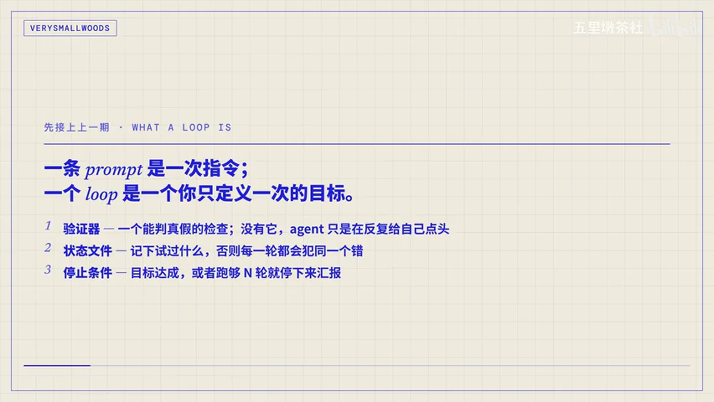
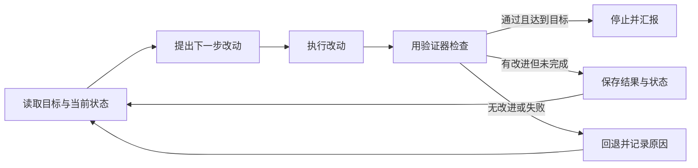
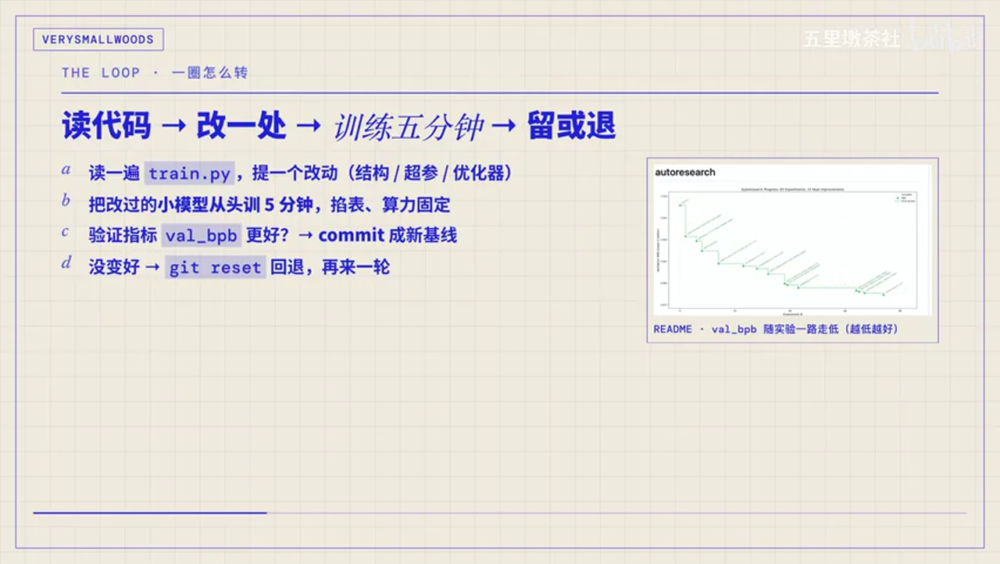
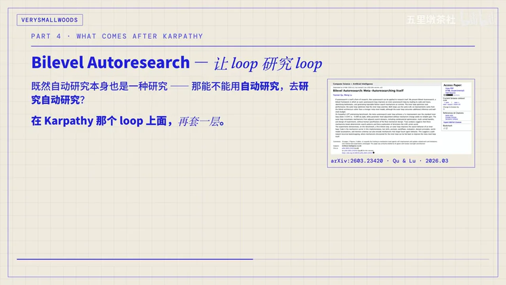
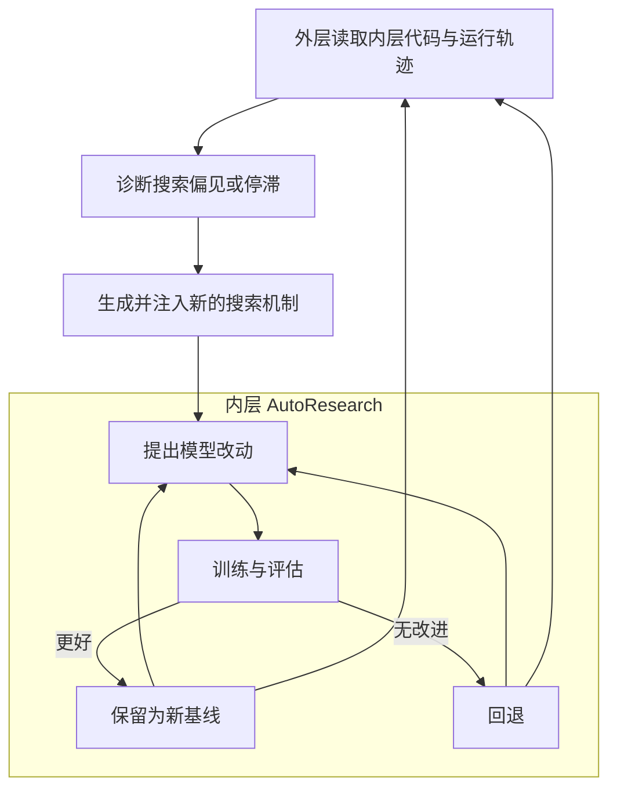
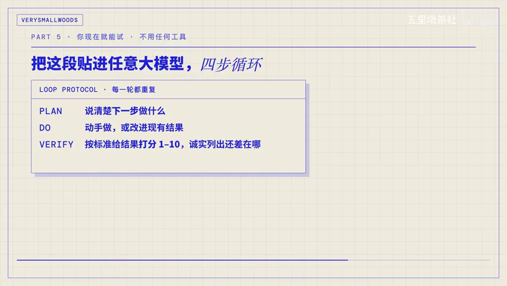
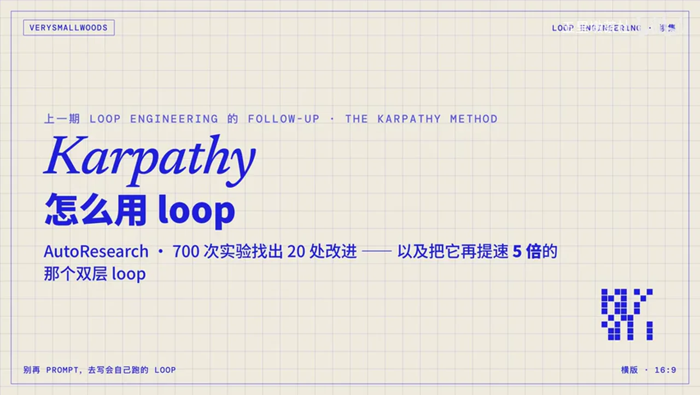
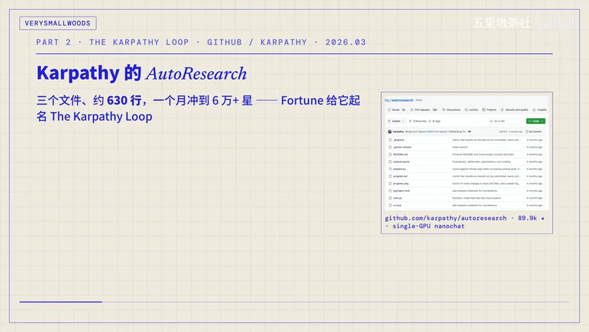
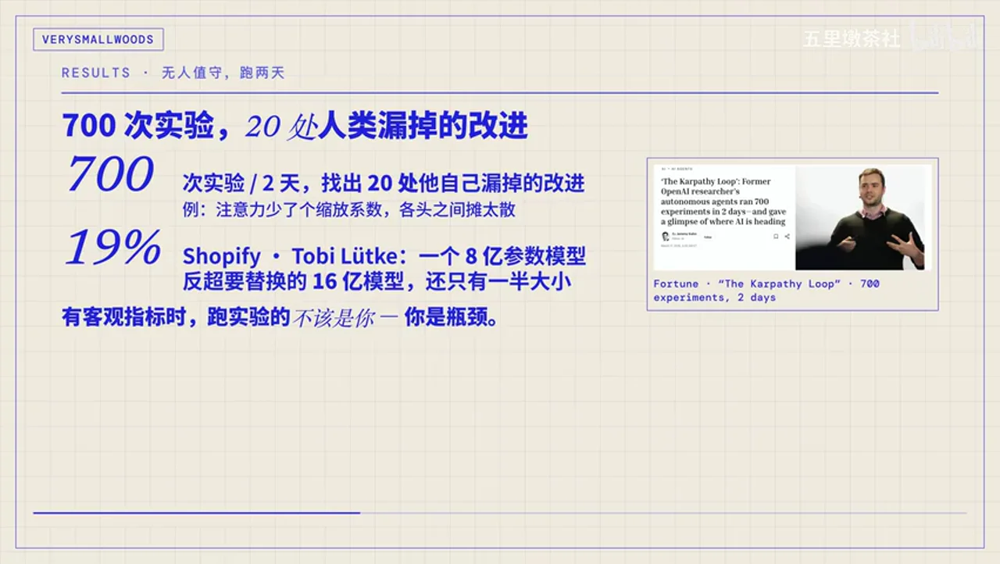

# 总结稿

## 核心结论

这期视频把“用 AI”进一步推向“设计让 AI 持续工作的循环”：prompt 是一次指令，loop 则是一次定义目标，之后由 agent 反复提出方案、执行、验证、记录状态，直到达到目标或触发停止条件。

- 一个可信的 loop 至少需要三样东西：能客观判定结果的验证器、避免重复踩坑的持久状态，以及明确的停止条件。缺少验证器，agent 很容易只是在循环里自我认同。
- 视频用 Karpathy 的 AutoResearch 说明如何把研究任务变成闭环：agent 只改 `train.py`，不可修改的 `prepare.py` 负责评估，`program.md` 规定探索方向与约束；每轮固定训练预算，指标变好就保留，否则回退。
- 人的角色从“亲自跑每个实验”转向“设计目标、约束和验证器”。视频强调：当目标可度量时，让 agent 承担大量重复试验，人的精力应放在瓶颈设计和结果审查上。
- 一个工程化 loop 可拆为自动触发、Skill、子 agent、连接器和验证器五部分。其中前四项负责让流程跑起来，验证器负责阻止错误结果进入下一轮。
- Bilevel Autoresearch 在单层 AutoResearch 外再套一层：内层优化目标模型，外层观察内层的代码和轨迹，并改写其搜索机制。视频将“五倍改进”解释为架构带来的收益，而不是换用了更强的 LLM。
- 最小实践方式是让模型循环执行“计划—行动—验证—继续或停止”：先定义评分标准，每轮优先修复最弱项，全部过线才结束。但这只是简化版，尚不具备自动调度和持久状态。
- 是否适合自动化，关键不在任务是不是“写代码”，而在结果能否自动验证。测试、性能基准、类型错误和包体积等目标较适合；需求模糊、设计判断依赖人的任务，现阶段更适合人在环中持续审查。
- loop 越强，越要防范“理解债”和“认知投降”：代码产出速度可能超过人的理解速度，而持续自动运行也容易诱使人放弃独立判断。

视频中的项目规模、Star 数、实验结果与“五倍改进”等外部事实并非全部得到同等程度的确认，具体状态见“外部事实核验”。

# 辅助理解

## 从 prompt 到 loop

视频给出的分界很实用：prompt 只定义“这一次做什么”，loop 则定义“什么算完成”。后者把下一步选择交给 agent，但同时必须给它边界。

一个最小 loop 可以抽象为：

这里真正限制循环质量的，不是 agent 能写多少内容，而是验证器能否把“看起来不错”变成可重复的真假判断。状态文件负责让下一轮继承经验，停止条件则防止它无限消耗资源。

## AutoResearch：把模型研究压缩成可验证实验

视频描述的 AutoResearch 将权限刻意拆开：

- `train.py` 是 agent 唯一可以修改的训练代码；
- `prepare.py` 是不可修改的评估器，避免 agent 通过降低考试难度来“优化”成绩；
- `program.md` 由人编写，用来约束探索方向、预算和操作规则。

每一轮都在固定训练时间和算力预算下进行。验证指标变好便提交为新基线，没有变好就回退，再基于日志选择下一个实验。这样，提交记录与实验日志共同构成了可追踪状态。

这套设计背后的工程原则是“把优化对象与裁判分离”。如果 agent 可以同时修改实现和评分标准，它就可能优化指标定义而不是目标本身；如果评估器独立且稳定，循环才有可靠的选择压力。

## 一个能长期运行的 loop 由什么组成

视频把工程化 loop 拆成五块：

1. **自动触发**：提供定时、事件或持续调度，让循环不依赖人手工启动每一轮。
2. **Skill**：把项目知识、约束和操作规范固定下来，供每一轮重复读取。
3. **子 agent**：把生成与审查分离，减少同一个 agent 给自己宽松打分的问题。
4. **连接器**：让循环能够读取外部状态，并执行开 PR、提 ticket 等工作流动作。
5. **验证器**：把不合格结果挡回循环，决定结果能否进入基线。

视频的判断是：前四项主要解决“怎么流动”，验证器才决定“往正确方向流动”。因此搭建自动化之前，应先投入精力设计可靠、快速、难以被投机取巧的验证方式。

## 双层 loop：连“怎么搜索”也纳入优化

单层 AutoResearch 在给定搜索机制下寻找更好的模型改动；Bilevel Autoresearch 再增加一个外层循环，观察内层的代码、轨迹和失败模式，然后生成新的搜索机制并注入内层。

视频对这一机制的解释是：内层 LLM 往往反复回到自己偏好的优化套路，外层则专门寻找搜索过程的盲点，把内层推向原本会回避的方向。这里“提升来自架构而非更强模型”是对论文结果的解释；论文确实报告内外层使用同一 LLM，并在相应基准上得到五倍的指标改进，详见后文核验。

## 立即可试的最小协议

不搭完整调度系统，也可以先体验闭环思维：

1. 先把完成标准写成可评分的检查项。
2. 每轮说明下一步计划，再实际修改产物。
3. 按同一标准验证结果，诚实列出未达标项。
4. 若未达到停止阈值，优先修复最弱项并进入下一轮；全部过线后结束。

画面清楚展示了 `PLAN`、`DO`、`VERIFY`，视频口述还补充了根据评分继续迭代或停止。这个简化协议没有自动触发和持久状态，关闭会话后也无法自行恢复；要升级为自主 loop，仍需增加调度、状态文件和独立验证闸门。

## 什么时候适用，什么时候应让人在环中

视频给出的首要筛选题是：**验证能否自动化？**

- 适合 loop：让失败测试变绿、提高 benchmark、降低延迟、消除类型错误、压缩包体积。这些任务有机器可以重复执行的裁判。
- 不宜贸然放手：需求本身模糊的新接口、新页面或开放式设计。此时“正确”仍依赖人的语境和审美判断，agent 容易发散或自我高分。

视频进一步提醒两种长期风险：

- **理解债**：loop 交付代码的速度超过人的理解速度，仓库状态与人的心智模型逐渐脱节。
- **认知投降**：因为循环一直运行且持续产出，人开始停止审查，把结果照单全收。

因此更稳妥的路径是：先建立验证器，再扩大自动化范围；在自己真正理解的领域用 loop 加速，而不是用 loop 回避理解。

## 外部事实核验

核验日期：**2026-07-27**。以下仅核验视频中的客观或时效性陈述；视频观点与工作流建议不视为已被外部来源证明。

- **部分确认｜AutoResearch 的发布时间、核心文件与代码规模（01:11–01:16）**  
  官方仓库标注项目为 2026 年 3 月，并明确介绍 `prepare.py`、`train.py`、`program.md` 三个核心文件；但仓库持续更新，当前代码无法可靠证明发布时恰好约 630 行。来源：[karpathy/autoresearch 官方仓库](https://github.com/karpathy/autoresearch)。

- **未验证｜一个月内获得六万多颗 GitHub Star（01:16）**  
  当前 GitHub 页面不能还原视频所指时间窗口的历史 Star 数，因此不能用当前数字倒推出发布首月数据。本项保持未验证，不作为确定事实引用。

- **确认｜两天约 700 次实验、留下约 20 项改进（02:20–02:26）**  
  Fortune 的报道给出两天、700 次实验和 20 项优化；官方仓库也说明了固定约五分钟训练、指标改善则保留、否则回退的实验机制。来源：[Fortune：The Karpathy Loop](https://fortune.com/2026/03/17/andrej-karpathy-loop-autonomous-ai-agents-future/)、[karpathy/autoresearch 官方仓库](https://github.com/karpathy/autoresearch)。

- **部分确认｜Tobi Lütke 一夜实验与 19% 提升（02:44–02:52）**  
  Fortune 报道其一夜运行 37 次实验并报告 19% 性能提升；现有可访问来源不足以确认视频所说的“0.8B 模型对 1.6B 模型”参数对照细节。来源：[Fortune：The Karpathy Loop](https://fortune.com/2026/03/17/andrej-karpathy-loop-autonomous-ai-agents-future/)。

- **确认｜Bilevel Autoresearch 的双层机制与五倍指标改进（03:57–04:54）**  
  Yaonan Qu 与 Meng Lu 的论文报告：外层生成并注入搜索机制，内外层使用同一 LLM；`val_bpb` 改进为 -0.045，对照单层的 -0.009，即指标改进幅度为五倍。来源：[原论文：Bilevel Autoresearch: Meta-Autoresearching Itself](https://arxiv.org/abs/2603.23420)、[官方实现仓库](https://github.com/EdwardOptimization/Bilevel-Autoresearch)。

# Data

## 增强转写稿

## 校正转写稿

### 术语表

- Andrej Karpathy：AI 研究者，`autoresearch` 项目作者。
- AutoResearch / `autoresearch`：让编码 agent 自动修改训练代码、训练、评估并保留有效改动的研究循环。
- Loop Engineering：围绕目标、状态、验证器与停止条件设计可持续迭代的 agent 循环。
- `train.py`：agent 唯一可修改的训练脚本。
- `prepare.py`：不可由 agent 修改的评估器。
- `program.md`：规定探索方向与约束的 agent 指令文件。
- Claude Code：Anthropic 的编码 agent；文中提到 `/loop` 与 `/goal`。
- Codex：OpenAI 的编码 agent；文中提到 Automations。
- Bilevel Autoresearch：在内层 AutoResearch 循环之上再加入元优化外层循环的双层自动研究框架。
- inner loop / outer loop：分别指优化具体任务的内层循环，以及优化内层搜索机制的外层循环。
- meta-autoresearch：让 AutoResearch 研究并改进其自身搜索机制。
- val_bpb：GPT 预训练基准中的验证指标。
- verifier：对结果进行自动、客观判定的验证器。
- comprehension debt：理解债，即仓库实际代码与人的真实理解之间不断扩大的差距。
- cognitive surrender：认知投降，即放弃独立判断、照单全收循环输出。
- Tobi Lütke：Shopify CEO。
- Boris Cherny：文末提到的“停止 prompt”的人物。

### 完整转写

[00:00] 大家好，今天是 7 月 5 日。上个月我做过一期 Loop Engineering。
[00:05] 聊的是一个视角的切换：从给 AI 打字的人，变成写那个替你打字的 loop 的人。
[00:12] 那一期讲的是概念。这几天我读到 Codila 写的一篇长文，
[00:17] 正好把这套东西落到了一个具体的人身上：Andrej Karpathy。
[00:21] 而且文章里还有人把他这套方法又提速了五倍。
[00:25] 今天这期就来分享这篇文章：Karpathy 到底怎么用 loop，
[00:28] 那个五倍是从哪来的，以及你自己现在就能怎么上手试。
[00:32] 先用一句话接上上一期：一条 prompt 是一次指令。
[00:36] 你问，它答；接下来干什么，由你决定。
[00:40] 一个 loop 是一个目标。你只定义一次什么算完成，
[00:44] 它自己去发现要做什么，动手做，检查结果；
[00:48] 没到就把结果喂回去，再来一轮。文章强调，
[00:51] 让 loop 真正成立的是三样东西：
[00:54] 一个验证器，一个能判真假的检查。
[00:57] 没有它，agent 只是在反复给自己点头。
[01:01] 一个状态文件，记下试过什么，不然它每一轮都会犯同一个错。
[01:06] 还有一个停止条件：要么目标达成，要么跑够 N 轮就停下来汇报。
[01:11] 好，主角登场。今年三月，Karpathy 放出一个叫 AutoResearch 的仓库。
[01:16] 三个文件，大概 630 行代码，一个月冲到六万多颗星。
[01:21] 《Fortune》杂志专门给它起了个名字，叫 The Karpathy Loop。
[01:25] 它的结构简单到有点离谱。
[01:27] 第一个文件 `train.py`，训练脚本，是唯一允许 agent 改的文件。
[01:32] 第二个 `prepare.py`，负责给模型打分的评估器。
[01:36] agent 不许碰，因为要是它能碰，它会去把考试改简单，
[01:40] 而不是把模型改好。
[01:42] 第三个 `program.md`，是你写给 agent 的说明，
[01:46] 告诉它探索什么，守住哪些约束。
[01:49] 循环是这样转的：agent 读一遍代码，提一个改动，
[01:53] 把这个改过的小模型从头训练五分钟，
[01:56] 掐表，算力固定，然后看验证指标有没有变好。
[02:00] 变好就 commit 成新的基线，
[02:02] 没变好就 `git reset` 回退，然后再来一轮。
[02:06] 你去睡觉，醒来看到的是一整份实验日志，
[02:10] 和一个性能更好的模型。
[02:12] 整个过程，你不碰 `train.py`，
[02:14] 你只写 `program.md`。跑实验这件事交给 agent。
[02:18] 结果很能说明问题。
[02:20] Karpathy 拿了一个他自己手工打磨了二十年的模型，
[02:23] 让 agent 跑了两天、700 次实验，
[02:26] 找出 20 处他自己漏掉的改进。
[02:28] 其中一处，是注意力机制里少了一个缩放系数，
[02:32] 让注意力在各个头之间摊得太散。
[02:35] 这不是模糊测试能抓到的 bug，
[02:37] 而是一个细心的人本可以发现、但没发现的优化。
[02:41] 因为人做到第十二个实验就累了，agent 不会累。
[02:44] Shopify 的 CEO Tobi Lütke 也拿它在内部模型上跑了一晚上。
[02:49] 醒来时，一个八亿参数的模型，
[02:52] 比它要替换掉的那个十六亿参数的模型还高出 19%。
[02:56] 一半的大小，反而更好，
[02:58] 因为 agent 是冲着硬件去优化的，
[03:01] 而不是默认越大越好。
[03:03] Karpathy 那句核心洞见是：
[03:05] 只要你有一个客观指标，那个跑实验的人就不该是你。
[03:09] 你是瓶颈，把自己从循环里拿掉。
[03:12] 文章接着把一个真正能跑起来的 loop 拆成五块。
[03:16] 上一期我细说过，这里就快过一遍。自动触发，是心跳。
[03:20] Claude Code 里是 `/loop` 和 `/goal`，
[03:23] Codex 里是 Automations 那一栏。
[03:26] Skill 把项目知识写一次，每一轮都读。
[03:29] 子 agent 把写的和审的拆成两个，
[03:32] 因为写代码的那个给自己打分太宽松。
[03:35] 连接器让 loop 能去开 PR、提 ticket。
[03:39] 最后是验证器，那道自动把坏结果挡回去的闸门。
[03:43] 文章有句话我很认同：其他四样都是管道，
[03:46] 验证器才是让 loop 成立的那一块。没有它，
[03:49] 你只是在花钱买一个整晚都在自我认同的 agent。
[03:53] 好，重头戏来了，那个五倍是从哪来的。
[03:57] 同样是今年三月，两位研究者发了一篇论文，
[04:00] 题目叫《Bilevel Autoresearch: Meta-Autoresearching Itself》，
[04:04] 双层自动研究，副标题更直白：
[04:07] 让 AutoResearch 来研究 AutoResearch 它自己。
[04:11] 他们问了一个很简单的问题：
[04:13] 既然自动研究本身也是一种研究，
[04:15] 那能不能用自动研究去研究自动研究？
[04:18] 他们的做法是在 Karpathy 那个 loop 上面再套一层。
[04:22] 内层 loop 做的就是 Karpathy 原来那套：
[04:25] 提个改动，训练，评估，留下或者丢弃。
[04:29] 外层 loop 不碰模型，它盯着内层跑，
[04:32] 读内层的代码和运行轨迹，
[04:34] 找出这个搜索过程本身卡在了哪里，
[04:37] 然后生成一段新的 Python 代码，去改变内层怎么搜。
[04:41] 把这段代码注入进去，再让内层跑一遍。
[04:44] 结果，在 Karpathy 那个 GPT 预训练基准上，
[04:48] 验证损失的改进是单层 loop 的五倍。
[04:51] 不是好 5%，是整整五倍。
[04:54] 而且注意两件事：两层用的是同一个 LLM。
[04:58] 你不需要一个更聪明的模型来当那个外层。
[05:02] 提升来自架构，不是来自更强的智能。
[05:06] 外层到底发现了什么？它发现内层老是掉进同样的搜索套路。
[05:10] 模型对该试什么优化有一套先验，
[05:14] 哪怕这套先验已经不管用了，它还是一次次绕回去。
[05:18] 外层做的，就是强行把它推向那些它本能会回避的方向，
[05:22] 打破这个套路。论文结尾有一句话值得琢磨：
[05:26] 如果自动研究能对它自己做元研究，那原则上，
[05:30] 它能对任何一个有可度量目标的东西做元研究。
[05:34] 听到这你可能觉得，这离自己有点远。
[05:37] 其实不用 Claude Code，不用 Codex，你现在就能感受一下这个机制。
[05:41] 文章给了一段提示词，你把它贴进任意一个大模型就行。
[05:46] 核心是四步，每一轮都重复：先说下一步做什么，然后动手做。
[05:51] 接着按一定的标准给结果打分，诚实地列出还差在哪里。
[05:55] 最后判断：每一项都到 8 分以上就收工，没到就再来一轮。
[06:00] 先修最弱的那一项。模型会自己起草，自己对着标准打分，
[06:04] 找到弱点，重写，直到过线。这就是一个 loop。
[06:08] 你用一段话就搭出来了。当然，它是简化版。
[06:11] 你还是那个触发器，没有调度，没有持久状态，关掉标签页就没了。
[06:16] 但核心机制就在这里。往上再补自动触发、
[06:20] 状态文件、验证闸门，就是一个真正自主的 loop。
[06:24] 我这个频道主要聊 coding，
[06:26] 所以得专门说一句，Karpathy 这套到底适不适合你平时写代码。
[06:30] 关键就看文章那个四条件测试里最要命的一条：
[06:34] 验证能不能自动化。能，就适合搭成 loop。
[06:37] 比如让一批失败的测试全变绿，对着一个 benchmark，
[06:41] 把某段代码跑得更快，把类型错误清零，把打包体积压下去。
[06:45] 这些都有一个能自动判真假的裁判，loop 是在真的搜索方案。
[06:50] 不能就别硬套。像设计一个新接口，搭一个新页面，
[06:55] 需求本身还模糊的活，对不对只能靠人判断。
[06:59] loop 要么发散过头，把本来能编译的代码改坏，
[07:03] 要么就给自己的作业打高分。
[07:05] 所以对多数人的日常 coding，现在更稳的，
[07:08] 还是你开着 Claude Code 或者 Codex，人在环里边跑边审。
[07:12] 先把那个验证器立起来，再谈让它自己跑。
[07:15] 最后是文章里最清醒的一段：loop 改变工作，
[07:19] 但它不会把你从工作里删掉。
[07:22] 而且有两个问题，会随着 loop 越来越好，
[07:25] 而变得更尖锐，不是更轻松。
[07:28] 一个是理解债。loop 越快地交付你没亲手写的代码，
[07:32] 你仓库里有的，和你脑子里真懂的，差距就越大。
[07:36] 另一个是认知投降。当 loop 自己在跑，
[07:39] 你会很想停止判断，照单全收它给你的一切。
[07:43] 同一个 loop，两个人能用出完全相反的结果：
[07:46] 一个人用它在自己深懂的领域跑得更快，
[07:49] 另一个人用它来回避搞懂这件事。
[07:52] loop 分不清这两者，但你分得清。
[07:54] 文章最后那句话，正好接得上我上一期的结尾：
[07:57] Karpathy 不写代码了，Cherny 不 prompt 了，
[08:00] 但他们两个都没有停止思考。
[08:03] 如果这期你只带走一件事，那就带走这一句。
[08:06] 今天的分享就到这。感兴趣的可以去看 Karpathy 的
[08:09] AutoResearch 仓库和这篇 Bilevel 论文。
[08:12] 链接我放在描述里了。
[08:14] 喜欢的话点个赞、关注，我们下次见。

## 原始转写稿

[00:00] 大家好 今天是7月5日 上個月我做過一期loop engineering
[00:05] 聊的是一個視角的切換 從給AI打字的人變成寫那個替你打字的loop的人
[00:12] 那一期講的是概念 這幾天我讀到Cordela寫的一篇長文
[00:17] 正好把這套東西落到了一個具體的人身上 Andrey J. Carpese
[00:21] 而且文章里還有人把他這套方法又提速了五倍
[00:25] 今天這期就來分享這篇文章 Carpese到底怎麼用loop
[00:28] 那個五倍是從哪來的 以及你自己現在就能怎麼上手勢
[00:32] 先用一句話接上上一期 一條prompt是一次指令
[00:36] 你問他答 接下來幹什麼 有你決定
[00:40] 一個loop是一個目標 你只定義一次 什麼算完成
[00:44] 他自己去發現要做什麼 動手做 檢查結果
[00:48] 沒到就把結果餵回去 再來一輪 文章強調
[00:51] 讓loop真正成立的是三樣東西
[00:54] 一個驗證器 一個能判真假的檢查
[00:57] 沒有它 agent只是在反覆給自己點頭
[01:01] 一個狀態文件 記下試過什麼 不然它每一輪都會犯同一個錯
[01:06] 還有一個停止條件 要麼目標達成 要麼跑夠 恩倫就停下來匯報
[01:11] 好 主角登場 今年三月 Carpese放出一個叫Auto Research的倉庫
[01:16] 三個文件 大概630行代碼 一個月充到6萬多顆星
[01:21] Fortune雜誌專門給他起了個名字 叫The Carpese Loop
[01:25] 他的結構簡單到有點離譜
[01:27] 第一個文件 勸到py 訓練腳本是唯一允許agent改的文件
[01:32] 第二個prepared doppy 負責給模型打分的評分器
[01:36] agent不許碰 因為要是他能碰 他會去把考試改簡單
[01:40] 而不是把模型改好
[01:42] 第三個programmd 是你寫給agent的說明
[01:46] 告訴他探索什麼 守住那些約束
[01:49] 循環是這樣轉的 agent 讀一遍代碼 提一個改動
[01:53] 把這個改過的小模型從頭訓練五分鐘
[01:56] 掐表 算力 固定 然後看驗證指標有沒有變好
[02:00] 變好就 commit 成新的機械
[02:02] 沒變好 就get reset 回退 然後再來一輪
[02:06] 你去睡覺 醒來看到的是一整份實驗日誌
[02:10] 和一個單元更好的模型
[02:12] 整個過程 你不碰 train down py
[02:14] 你只寫programmd跑實驗這件事 交給agent
[02:18] 結果很能說明問題
[02:20] carpacy 拿了一個他自己手工打磨了20年的模型
[02:23] 讓agent 跑了兩天700次實驗
[02:26] 找出20處他自己漏掉的改進
[02:28] 其中一處 是注意力機制里少了一個縮放系數
[02:32] 讓注意力在各個頭之間貪得太散
[02:35] 這不是模糊測試能抓到的bug
[02:37] 而是一個細心的人本可以發現 但沒發現的優化
[02:41] 因為人做到第12個實驗就累了 agent 不會累
[02:44] shopify 的CEO Toby Lutki 也拿他在內部模型上跑了一晚上
[02:49] 醒來時 一個8億參數的模型
[02:52] 比他要替換掉的那個16億參數的模型 還高出19%
[02:56] 一半的大小 反而更好
[02:58] 因為agent 是衝著硬件去優化的
[03:01] 而不是默認越大越好
[03:03] carpacy 那句核心動詞是
[03:05] 只要你有一個客觀指標 那個跑實驗的人就不該是你
[03:09] 你是瓶頸 把自己從循環里拿掉
[03:12] 文章接著把一個真正能跑起來的loop 拆成5塊
[03:16] 在上一期我細說過 這裡就快過一遍 自動觸發 是心跳
[03:20] cloud code 里是loop和go
[03:23] codex 里是automations那一欄
[03:26] skill 把項目知識寫一次 每一輪都讀
[03:29] 紙agent 把寫的和審的拆成兩個
[03:32] 因為寫代碼 那個給自己打分太寬鬆
[03:35] 連接器 讓loop 能去開pr 貼貼kit
[03:39] 最後是驗證器 內導自動把壞結果擋回去的閘門
[03:43] 文章有句話我很認同 其他四樣都是管道
[03:46] 驗證器才是讓loop 成立的那一塊 沒有它
[03:49] 你只是在花錢買一個整碗都在自我認同的agent
[03:53] 好 重頭戲來了 那個五倍是從哪來的
[03:57] 同樣是今年3月 兩位研究者發了一篇論文
[04:00] 題目叫Biowell Auto Research 質疑過來是
[04:04] 雙層自動研究 副標題更直白
[04:07] 讓auto research 來研究auto research 它自己
[04:11] 他們問了一個很簡單的問題
[04:13] 既然自動研究本身也是一種研究
[04:15] 那能不能用自動研究去研究自動研究
[04:18] 它們的做法是在copacy那個loop上面再套一層
[04:22] 內層loop 做的就是copacy原來那套
[04:25] 提個改動 訓練 評估 留下 或者丟棄
[04:29] 外層loop 不碰模型 它盯著內層跑
[04:32] 讀內層的代碼和運行軌跡
[04:34] 找出這個搜索過程本身卡在了哪
[04:37] 然後生成一段新的拍層代碼 去改變內層怎麼搜
[04:41] 把這段代碼注入進去 再讓內層跑一遍
[04:44] 結果 在copacy那個GPT預訓練基準上
[04:48] 驗證損失的改進 是單層loop 的誤倍
[04:51] 不是好百分之五 是整整誤倍
[04:54] 而且注意兩件事 兩層用的是同一個LLM
[04:58] 你不需要一個更聰明的模型 來當那個原層
[05:02] 提升來自架構 不是來自更強的智能
[05:06] 內層到底發現了什麼 它發現內層老是調進同樣的搜索套路
[05:10] 模型對該是什麼優化 有一套鮮豔
[05:14] 哪怕這套鮮豔已經不管用了 它還是一次次繞回去
[05:18] 外層做的 就是強行把它推向那些它本能會迴避的方向
[05:22] 打破這個套路 論文結尾有一句話值得琢磨
[05:26] 如果自動研究能對它自己做原研究 那原則上
[05:30] 它能對任何一個有可度量目標的東西做原研究
[05:34] 聽到這你可能覺得 這裡自己有點遠
[05:37] 其實不用Code Code 不用Code X 你現在就能感受一下這個機制
[05:41] 文章給了一段提示詞 你把它貼近任意一個大模型就行
[05:46] 核心是四步 每一輪都重複 先說下一步做什麼 然後動手做
[05:51] 接著按一定的標準給結果打分 誠實的列出還差在哪
[05:55] 最後判斷 每一項都到8分以上就收工 每到就再來一輪
[06:00] 先修最弱的那一項 模型會自己起草 自己對著標準打分
[06:04] 找到弱點 重寫 直到過線 這就是一個loop
[06:08] 你用一段話就搭出來了 當然它是簡化版
[06:11] 你還是那個觸發器 沒有調度 沒有持久狀態 關掉標籤頁就沒了
[06:16] 但核心機制就在這裡 網上再補自動觸發
[06:20] 狀態文件 驗證閘門 就是一個真正自主的loop
[06:24] 我這個頻道主要聊coding
[06:26] 所以得專門說一句coppercy這套到底適不適合你平時寫代碼
[06:30] 關鍵就看文章那個4條件測試裡最要命的一條
[06:34] 驗證能不能自動化 能就適合搭乘loop
[06:37] 比如讓一批失敗的測試全變率 對著一個benchmark
[06:41] 把某段代碼跑得更快 把類型錯誤清零 把打包體積壓下去
[06:45] 這些都有一個能自動判真假的裁判loop 是在真的搜索方案
[06:50] 不能就別硬套 像設計一個新接口 搭一個新頁面
[06:55] 需求本身還模糊的活 對不對 只能靠人判斷
[06:59] loop 要麽發酵過頭 把本來能編譯的代碼改壞
[07:03] 要麽就給自己的作業達高分
[07:05] 所以對多數人的日常coding現在更穩的
[07:08] 還是你開著cloud code或者codex 人在環裡邊跑邊審
[07:12] 先把那個驗證機立起來 再談讓它自己跑
[07:15] 最後是文章裡最清醒的一段 loop 改變工作
[07:19] 但它不會把你從工作裡生掉
[07:22] 而且有兩個問題 會隨著loop越來越好
[07:25] 而變得更尖銳 不是更輕鬆
[07:28] 一個是理解在loop 越快地交付你沒親手寫的代碼
[07:32] 你倉庫裡有的 和你腦子裡真懂的 差距就越大
[07:36] 另一個是認知投降 當loop自己在跑
[07:39] 你會很想停止判斷照單全收它給你的一切
[07:43] 同一個loop 兩個人能用出完全相反的結果
[07:46] 一個人用它在自己生懂的領域跑得更快
[07:49] 另一個人用它來迴避 搞懂這件事
[07:52] loop 分不清這兩者 但你分得清
[07:54] 文章最後那句話 正好接得上我上一期的結尾
[07:57] Carpacy不寫代碼了 Trinity不prompt了
[08:00] 但他們兩個都沒有停止思考
[08:03] 如果這期你只帶走一件事 那就帶走這一句
[08:06] 今天的分享就到這 感興趣的可以去看Carpacy的
[08:09] Auto Research倉庫和這篇by-level論文
[08:12] 鏈接我放在描述裡了
[08:14] 喜歡的話點個贊 關注 我們下次見

## 原始关键帧

### 关键帧 1

### 关键帧 2

### 关键帧 3

### 关键帧 4

### 关键帧 5

### 关键帧 6

### 关键帧 7

### 关键帧 8

### 关键帧 9

### 关键帧 10

