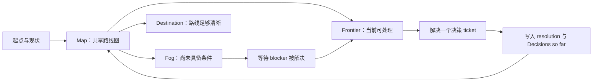
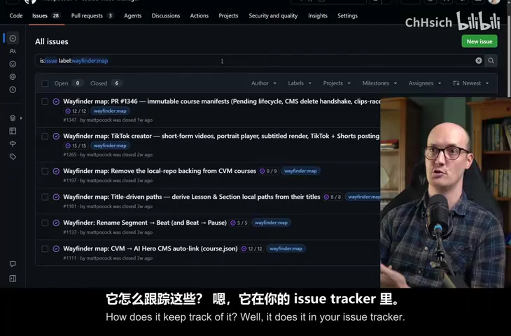
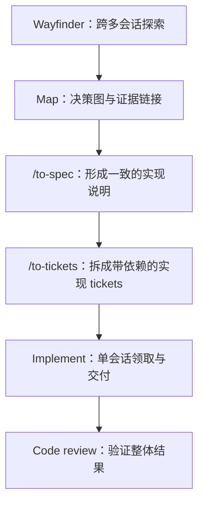
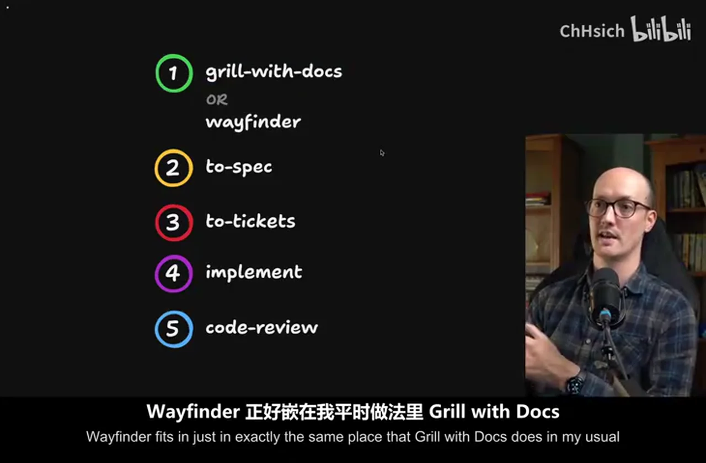
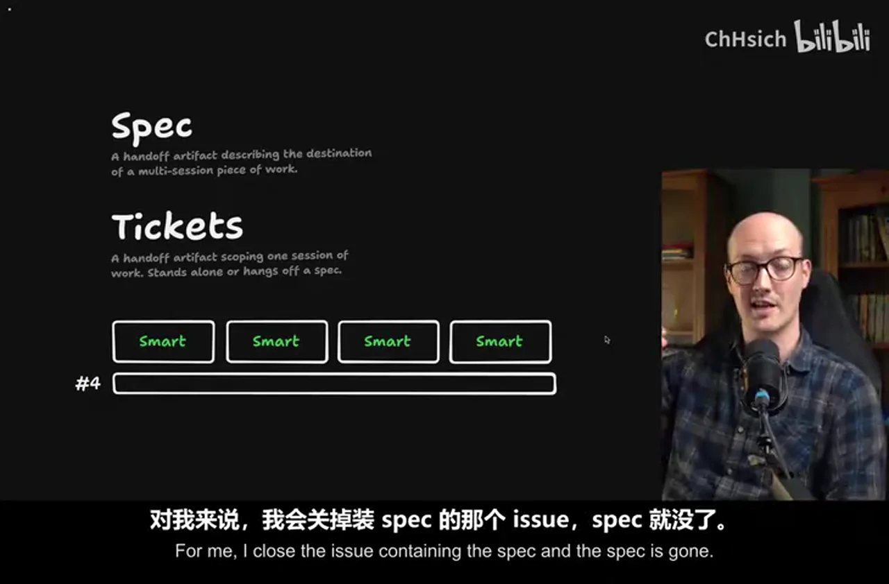
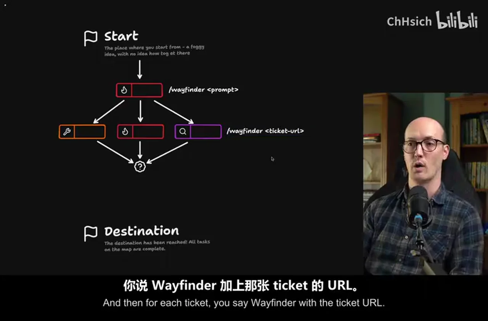
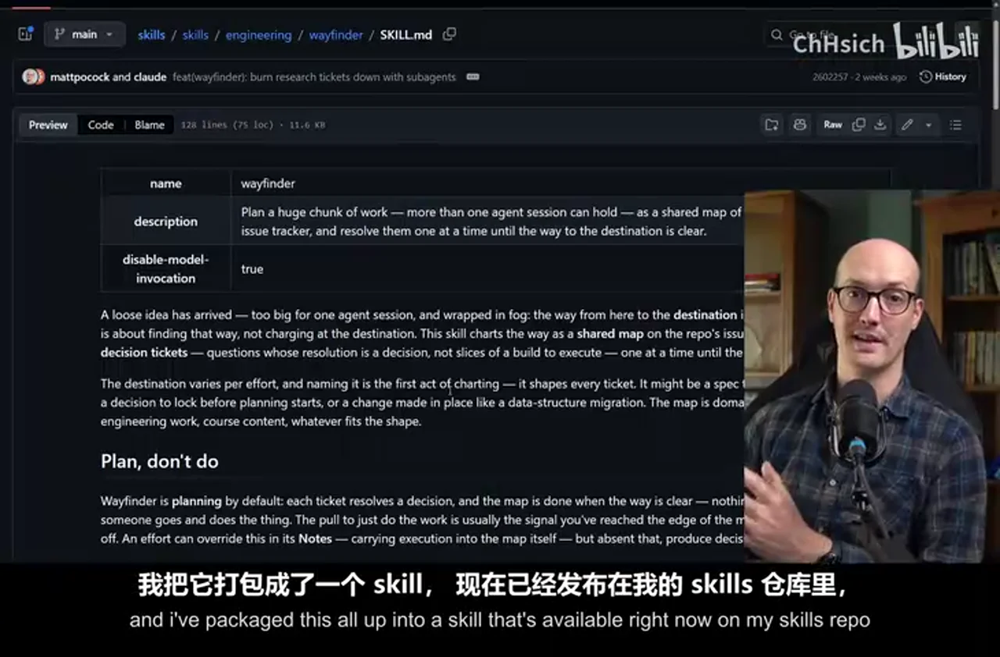
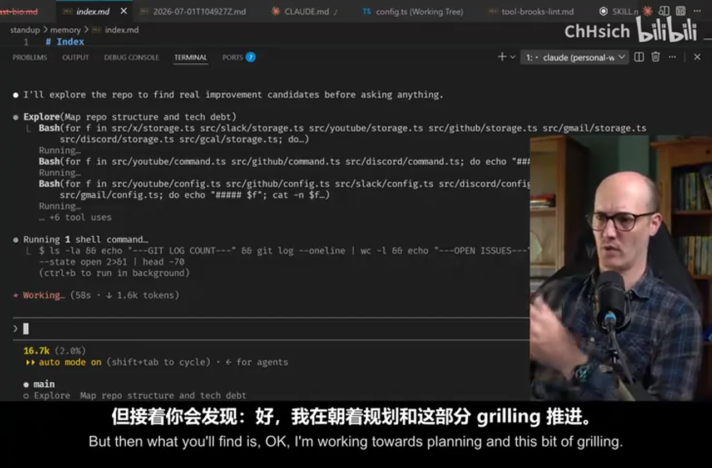
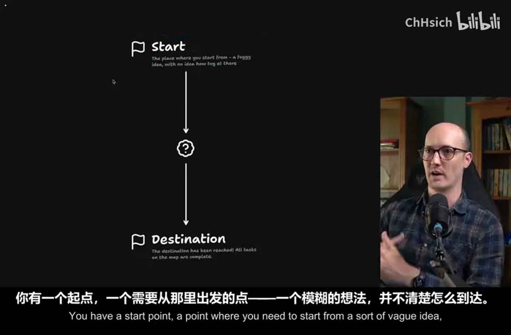
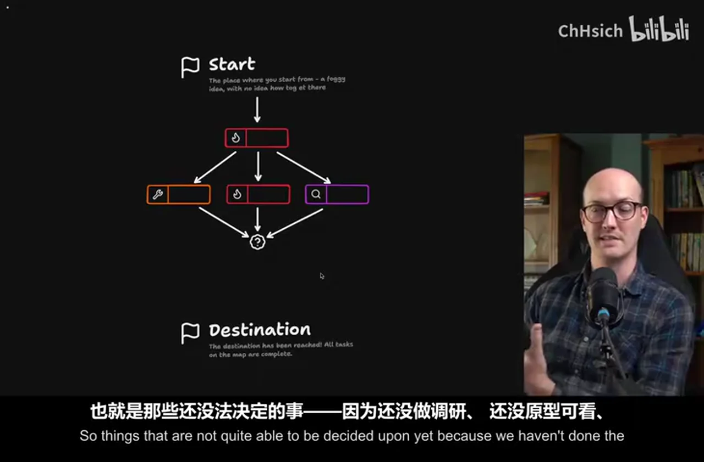

# 总结稿

## 一句话结论

Wayfinder 不是“让 AI 一次写出一个更大的计划”，而是把超出单次 agent 会话容量的工作变成一张可持续更新的决策地图：先暴露未知，再用独立 ticket 逐个消除未知，最后才把稳定结论压缩成 spec 和可在单次会话内执行的实现 tickets。

{{frame:2}}

## 视频主线

普通 AI 规划容易把起点到终点之间的未知压扁成一份线性清单。一旦执行时遇到没研究过的约束、需要原型验证的交互，或必须由人决定的取舍，计划就会失真。Wayfinder 的做法是承认“现在还不知道”：用一个父级 map 描述目的地和当前共识，把未知拆成相互依赖的决策 tickets，并把 issue tracker 当作跨会话共享状态。

官方仓库目前仍将 Wayfinder 定位为规划“超过一次 agent session 容量”的大型工作，并明确要求“Plan, don't do”：这个阶段的产物是更清晰的路线，不是直接实施。[Wayfinder 官方 SKILL.md](https://github.com/mattpocock/skills/blob/main/skills/engineering/wayfinder/SKILL.md)

## 可操作工作流

1. **建立 map**：首次从目标描述启动 `/wayfinder <prompt>`，定义起点、destination、已知约束与尚未澄清的区域。视频演示的后续会话则从 `/wayfinder <ticket-url>` 恢复地图上下文。
2. **拆决策 tickets**：按问题性质选择 `research`、`prototype`、`grilling` 或 `task`，并用 blocking 关系表达先后依赖。
3. **推进 frontier**：只处理 blocker 已关闭、现在可以回答的问题；将答案写进 ticket 的 resolution，再回填父 map 的 `Decisions so far`。
4. **持续穿越 fog**：每个答案可能暴露新的未知；新增或重连 tickets，直到通往 destination 的路线足够清楚。
5. **压缩为交付物**：当前官方命令是 `/to-spec`，随后用 `/to-tickets` 拆成实现 tickets；视频画面中的 `toSpec`、`toTickets` 可视为演示版本的命名。[to-spec](https://github.com/mattpocock/skills/blob/main/skills/engineering/to-spec/SKILL.md) · [to-tickets](https://github.com/mattpocock/skills/blob/main/skills/engineering/to-tickets/SKILL.md)
6. **进入实现与审查**：实现 ticket 应足够小，使一个 agent session 能独立领取、完成和交接；最后进入 code review。

{{frame:6}}

{{frame:7}}

## 什么时候值得用

适合：目标明确但路线不清、存在多个相互依赖的未知、需要调研或原型获取高保真反馈、工作明显跨越多次会话，或需要多人/多 agent 共享决策历史。

不适合：单次会话就能完成的小改动、已有成熟方案的机械实施、无需保存决策轨迹的短任务。对这些任务，Wayfinder 的 issue 管理成本可能高于收益。

## 关键注意事项

- **map 不是待办清单**：它维护的是决策空间、依赖和已知结论；实现工作应在路线稳定后再拆。
- **frontier 不是优先级榜**：它是“当前已具备前置条件”的 ticket 集合，仍需根据价值和风险选择下一项。
- **prototype 的价值是买信息**：它用于验证关键假设，不应悄悄演化成未经设计的生产实现。
- **issue tracker 是外部记忆**：ticket 必须记录问题、证据、结论和上下文链接，否则换会话后只剩状态，没有推理链。
- **spec 的生命周期不要教条化**：官方材料能确认它在这条链中是中间规划产物，并警告路径与代码片段会过时；但没有确认“实现后必须删除”是一条强制规则。

## 证据与可靠性说明

以上概念主线来自视频章节锚点、已检查的关键帧与官方 GitHub 文档的交叉核验。原始中文 ASR 从约 04:30 起出现大面积重复幻觉，因此后半段不应被视为可靠逐句口播；本文没有据此重建未被画面、章节或官方资料支持的细节。

# 辅助理解

## 把“大计划”改写成“逐步消除未知”

Wayfinder 的关键转换，是不再假设规划者已经知道从起点到终点的完整路径。大型工作通常只有三类信息：已经知道的事实、现在能回答的决策，以及还无法精确描述的问题。传统线性计划会把第三类伪装成普通步骤；Wayfinder 则把它显式保留在 fog 中，并用 ticket 作为最小的认知推进单元。

这个循环比一次性生成计划更重要：每完成一个 ticket，地图都可能缩小 fog、移动 frontier，也可能暴露新的分支。规划因此成为一个有持久状态的探索过程，而不是一段只能在当前上下文窗口里成立的文本。

## Map：共享的父级地图

官方 Wayfinder 文档把 map 定义为带 `wayfinder:map` 标签的单一 issue，其 child issues 是决策 tickets。map 至少承担四种职责：保存 destination、呈现地图结构、汇总 `Decisions so far`、指向仍待解决的 ticket。它不是把所有细节复制到一个超长正文，而是给每次新会话一个稳定入口。[Wayfinder 官方 SKILL.md](https://github.com/mattpocock/skills/blob/main/skills/engineering/wayfinder/SKILL.md)

跨会话持久化依赖一个简单约定：结论不能只留在聊天记录里。完成 ticket 时，应在 resolution comment 中写明答案，关闭 issue，再把简短结论和上下文链接追加到 map。这样下一次 agent 不需要“记得”上一次对话，只需要重新读取 map、开放 tickets、阻塞关系和 resolution。

## Frontier 与 Fog：不是完成度，而是可知性

**Frontier** 是所有 blocker 已关闭、眼下可以推进的开放 tickets。它回答的是“现在有条件研究什么”，并不自动回答“商业上最值得先做什么”。如果 frontier 有多个节点，仍要按风险、信息价值和关键路径选择。

**Fog** 是 `Not yet specified` 的区域：问题存在，但暂时还不能准确提出或解决。fog 不是遗漏，也不是失败；它是对知识边界的诚实记录。随着 research、prototype 或 grilling 返回证据，原本模糊的问题会变成可操作 ticket，进入 frontier。

一个实用判断是：如果某个问题可以写出清晰的完成条件，并且前置证据已经具备，它属于 frontier；如果连正确的问题都还说不清，就先留在 fog，并创建能获得信息的上游 ticket。

## 四类决策 Ticket

| 类型 | 要消除的未知 | 典型产物 | 常见误用 |
| --- | --- | --- | --- |
| `research` | 事实、现状、外部约束是什么 | 来源、代码调查、选项比较 | 只收集资料，不形成结论 |
| `prototype` | 某方案实际是否可行、体验如何 | 可丢弃原型、测量与反馈 | 把试验品直接当生产实现 |
| `grilling` | 利益相关者真正要什么、接受何种取舍 | 追问后的明确决策 | 把模糊偏好当作已确认需求 |
| `task` | 必须在线下或外部系统中完成什么 | 人工操作或现实世界结果 | 混入本可由 agent 完成的实现工作 |

官方文档确认这四类 ticket 及 blocking 关系：只有 blockers 都关闭，ticket 才进入 frontier。[Wayfinder 官方 SKILL.md](https://github.com/mattpocock/skills/blob/main/skills/engineering/wayfinder/SKILL.md)

这里的 ticket 首先是**决策 ticket**，目标是获得信息或确定方向；它与后续的**实现 ticket**不同。前者减少路线的不确定性，后者在路线已经稳定后交付代码或其他成果。混淆两者会让 agent 在尚未决定“做什么”时过早进入“怎么写”。

## 从 Map 到 Spec，再到实现 Tickets

Wayfinder 的输出并不是直接塞给实现 agent 的全部上下文。它先把分散在 map、resolution 和决策 tickets 中的结论压缩成 spec，再把 spec 拆为可执行的实现 tickets。这形成三个不同粒度的交接层：

- **Map 是 multi-session planning handoff**：它允许探索过程跨会话继续，保留未决问题和决策来源。
- **Spec 是信息压缩层**：把已经解决的决策整理为连贯目标、约束和验收标准，避免实现者重新遍历全部探索历史。
- **Tickets 是 single-session execution handoff**：每张票应边界清楚、依赖明确，并尽量能在一次 agent session 内完成。

当前官方仓库中的命令名是 [`/to-spec`](https://github.com/mattpocock/skills/blob/main/skills/engineering/to-spec/SKILL.md) 与 [`/to-tickets`](https://github.com/mattpocock/skills/blob/main/skills/engineering/to-tickets/SKILL.md)。视频画面使用 `toSpec`、`toTickets`，这更适合解释为演示版本命名，而不是今天应照抄的命令。

## 首次启动与后续恢复

视频关键帧把调用方式区分得很清楚：第一次用 `/wayfinder <prompt>` 建立目标与地图；后续用 `/wayfinder <ticket-url>` 让新会话从持久化 ticket 恢复上下文。

恢复后不要立刻实施。先检查 map 是否仍准确、哪些 ticket 位于 frontier、是否有失效链接或过时假设，再选择一个信息价值高的 ticket 继续。官方 skill 的“Plan, don't do”边界意味着 Wayfinder 阶段应专注于厘清路线；代码实施属于后续 tickets。

## 与普通计划、Spec 驱动流程的边界

Wayfinder 最有价值的场景不是“任务很长”，而是“路线包含尚未解决的未知”。一个步骤很多但方案稳定的迁移工作，可以直接拆实现 tickets；一个代码量很小但牵涉关键产品取舍的功能，反而可能需要 Wayfinder。

视频把 spec 描述成完成跨会话探索后的终点文档，并强调它最终服务于实现。外部核验只能部分支持更强的生命周期结论：官方 `to-spec`、`to-tickets` 文档确实把 spec 当作中间输入，并提醒文件路径与代码片段会很快过时；但没有规定“实现后必须删除 spec”。因此更稳妥的实践是按团队治理需求决定归档、更新或删除，而不是把删除当成 Wayfinder 的硬规则。

## 实践检查表

- destination 是否具体到能判断“路线已经足够清楚”？
- 每个 ticket 是否只回答一个关键问题，并写明完成条件？
- blocking edge 是否表达真实的知识依赖，而非随意排序？
- frontier 中的下一张票是否能最大幅度降低风险或扩大可选路径？
- resolution 是否包含结论、证据和被否决选项，而不只是“完成”？
- map 的 `Decisions so far` 是否有简短结论及原 ticket 链接？
- 转入 `/to-spec` 前，关键 fog 是否已经清除，剩余未知是否明确可接受？
- `/to-tickets` 产物是否足够小，能作为单次会话的实现交接？

## 材料可信度边界

视频原始 ASR 在约 04:30 后发生大面积重复，校正稿仅修复高置信术语，没有臆造逐句口播。因此，本节后半内容是对视频章节锚点、已实际检查画面与官方仓库文档的综合解释；它不应被引用为逐字字幕。外部补充均链接到 Matt Pocock 的官方 GitHub 仓库，命令版本差异和 spec 生命周期也已按核验状态明确标注。

# Data

## 增强转写稿

<!-- domain: AI coding / Wayfinder skill / cross-session planning -->
<!-- note: Original ASR contains extensive repetition after ~00:04:30; only high-confidence terminology corrections were applied. -->

[00:00.000 --> 00:03.760] 我认为我会认为认为任何工作的计划
[00:03.760 --> 00:04.920] 和一个总理的计划
[00:04.920 --> 00:09.680] 我用的计划和计划的计划的计划都被我制作过了
[00:09.680 --> 00:13.560] 太远了 太违背了一个计划
[00:13.560 --> 00:16.640] 我感觉我没有能够成为严重的计划
[00:16.640 --> 00:19.640] 因为我做了这些计划的计划
[00:19.640 --> 00:22.840] 我建议了AI 计划 这些计划不正确
[00:22.840 --> 00:24.920] 这新计划没有那种限制
[00:24.920 --> 00:27.640] 你可以计划一切工作的计划
[00:27.640 --> 00:31.600] 它会建议计划过很多计划的计划
[00:31.600 --> 00:35.200] 它知道你不能把计划的方式清理到市场
[00:35.200 --> 00:37.360] 你必须清理兵的方式
[00:37.360 --> 00:39.680] 它明白和计划的选择
[00:39.680 --> 00:42.080] 而且它也会让你计划互动
[00:42.080 --> 00:45.600] 最棒的是 这些计划的计划是 based on software fundamentals
[00:45.600 --> 00:47.800] 这些计划的计划的计划是 based on the fundamentals of planning work
[00:47.800 --> 00:50.880] 我认识的计划是在AI前的计划
[00:50.880 --> 00:53.000] 我用了这些计划的计划
[00:53.000 --> 00:56.280] 在我计划的计划里面叫 Wayfinder
[00:56.280 --> 00:58.480] 所以我之前计划的计划
[00:58.480 --> 01:00.040] 是在一个计划里面的计划
[01:00.040 --> 01:03.040] 是在计划里面的计划里面的计划
[01:03.040 --> 01:04.600] 在我计划里面的计划里面的计划
[01:04.600 --> 01:07.200] 仍然是一个非常重要的计划
[01:07.200 --> 01:09.880] 但是它只是在一个计划里面的计划里面的计划
[01:09.880 --> 01:14.280] 计划的计划比那种计划的计划更大
[01:14.280 --> 01:18.240] 尤其是计划项目的计划的计划
[01:18.240 --> 01:19.760] 而且你会知道那些计划的计划
[01:19.760 --> 01:24.000] 所以你会经常在这些计划里面的计划里面的计划
[01:24.000 --> 01:27.840] 去小小的部分说:我会把这些计划吐掉
[01:27.840 --> 01:29.200] 我会把这些计划吐掉
[01:29.200 --> 01:33.640] 但是你会发现:我正在计划里面的计划里面的计划
[01:33.640 --> 01:36.560] 然后你会发现一个问题你不能回答
[01:36.560 --> 01:39.240] 或者你只会发现自己失去计划
[01:39.240 --> 01:41.680] 然后你经常在计划里面的计划里面的计划里面的计划
[01:41.680 --> 01:43.360] 你会不想花太多的时间
[01:43.360 --> 01:44.400] 这已经在我之前的视频里面了
[01:44.400 --> 01:46.080] 大家很喜欢这种计划的计划
[01:46.080 --> 01:48.360] 一张相片的计划就开始了
[01:48.360 --> 01:49.760] 再次的计划
[01:49.760 --> 01:51.440] 我真的爱这张相片的计划
[01:51.440 --> 01:53.960] 但是我认为它是真的帮助他吐掉的
[01:53.960 --> 01:57.200] John在这里 even built his own freaking harness
[01:57.200 --> 01:59.440] 因为他喜欢计划里面的计划
[01:59.440 --> 02:01.640] 他有这种很漂亮的计划牌
[02:01.640 --> 02:04.000] 它 kind of lets you take tasks as you go
[02:04.000 --> 02:05.400] 所以我已经在这里等了一段时间
[02:05.400 --> 02:06.920] 然后我终于在视频里面的计划里面的计划里面的计划
[02:06.920 --> 02:08.080] 人们想我做
[02:08.080 --> 02:09.080] 计划里面的计划里面的计划
[02:09.080 --> 02:10.320] 你怎么最好使用它
[02:10.320 --> 02:14.280] 我们开始 by looking at how big work typically gets planned
[02:14.280 --> 02:16.000] 你会有一个开始 point
[02:16.000 --> 02:18.160] 一个 point where you need to start from
[02:18.160 --> 02:21.680] 一个很丰富的计划 并不是真的有什么办法
[02:21.680 --> 02:24.520] 然后你会想到一些的阴调
[02:24.520 --> 02:26.600] 你会知道你选择的很丰富的方式
[02:26.600 --> 02:29.960] 但是步骤之间是很丰富的
[02:29.960 --> 02:31.120] 你没有想到有什么办法
[02:31.120 --> 02:32.880] 这也是对于研究的方式
[02:32.880 --> 02:35.120] 但是也有很多的选择
[02:35.120 --> 02:36.720] 你会有点优秀的计划
[02:36.720 --> 02:38.400] 所以你应该做的第一个是
[02:38.400 --> 02:40.840] 有一个计划会的计划会
[02:40.840 --> 02:42.560] 用这个计划来介绍你
[02:42.560 --> 02:45.760] 然后发现一个基本的评论
[02:45.760 --> 02:49.200] 有些计划会是足够的 然后你会有点优秀
[02:49.200 --> 02:52.040] 但是有很多计划会仍然会优秀
[02:52.040 --> 02:54.640] 你会找到的根据计划会
[02:54.640 --> 02:56.520] 你会需要更多的计划
[02:56.520 --> 02:58.960] 所以你会有一个计划会
[02:58.960 --> 03:01.000] 或者你会有一个计划会
[03:01.000 --> 03:03.680] 或者你会需要做一些计划计划
[03:03.680 --> 03:06.200] 计划里面的计划会是一个码
[03:06.200 --> 03:07.640] 我们在计划里面的计划会
[03:07.640 --> 03:09.600] 我们的计划会是我们的计划
[03:09.600 --> 03:11.120] 这就是为什么叫做 Wayfinder
[03:11.120 --> 03:13.680] 我们在计划里面的计划会是我们的计划
[03:13.680 --> 03:16.720] 而每个计划里面的计划会是计划
[03:16.720 --> 03:20.840] 每个计划需要自己的计划会
[03:20.840 --> 03:23.040] 所以你会有一个计划会
[03:23.040 --> 03:24.240] 一个计划会
[03:24.240 --> 03:25.920] 以及一个计划会
[03:25.920 --> 03:29.440] 所有的计划会是计划里面的计划会
[03:29.440 --> 03:31.840] 这就是一个计划会
[03:31.840 --> 03:32.400] 做这些计划会
[03:32.400 --> 03:34.360] 然后它会在计划里面的计划里面的计划会
[03:34.360 --> 03:35.760] 在计划里面的计划会
[03:35.760 --> 03:38.520] 会给你一个计划项目
[03:38.520 --> 03:39.760] 就是计划里面的计划会
[03:39.760 --> 03:42.120] 就是计划里面的计划会
[03:42.120 --> 03:45.200] 然后它会在计划里面的计划里面的计划里面的计划里面的计划会
[03:45.200 --> 03:47.120] 所以计划里面的计划会
[03:47.120 --> 03:48.520] 不太能做到的
[03:48.520 --> 03:50.360] 因为我们没有做过计划
[03:50.360 --> 03:52.240] 我们没有一个计划里面的计划
[03:52.240 --> 03:54.680] 或者我们没有做过计划里面的计划
[03:54.680 --> 03:57.680] 有时所有计划会在计划里面的计划会被解决
[03:57.680 --> 04:00.200] 然后你会终于得到足够的计划
[04:00.200 --> 04:02.080] 进入计划里面的计划
[04:02.080 --> 04:04.120] Wayfinder不仅可以担任计划
[04:04.120 --> 04:06.480] 但是它可以在这里做计划
[04:06.480 --> 04:08.880] 所以如果你要去计划里面的计划
[04:08.880 --> 04:12.720] 或者你需要出去跟人家说话 然后去计划里面的计划
[04:12.720 --> 04:14.880] 那么Wayfinder可以在这里做计划
[04:14.880 --> 04:16.800] 另外 所有的计划里面的计划
[04:16.800 --> 04:19.560] 你需要做的 并且你计划里面的计划
[04:19.560 --> 04:21.720] Wayfinder在计划里面的计划会被解决
[04:21.720 --> 04:24.920] 它会在计划里面的计划里面的计划里面的计划里面的计划
[04:24.920 --> 04:28.720] 而且它会在计划里面的计划里面的计划里面的计划里面的计划里面的计划里面的计划
[04:28.720 --> 04:30.080] 这些事情你现在可以决定
[04:30.080 --> 04:31.240] 如何保持ticket?
[04:31.240 --> 04:39.000] 在我的《公司》影片中的主題ticket中,我會在這裏看見所有的網絡ticket,
[04:39.000 --> 04:45.000] 你會發現,如果我們來看這張ticket,這張ticket是大大的ticket,
[04:45.000 --> 04:51.240] 在下面有12個ticket,這些是決定ticket,
[04:51.240 --> 04:55.640] 我們可以在這裏看見所有的決定ticket,
[04:55.640 --> 05:01.240] 當決定ticket成功後,他們會在ticket中解決ticket,
[05:01.240 --> 05:05.440] 這張ticket是在公司中解決ticket時,
[05:05.440 --> 05:09.040] 我們會在這裏解決ticket時,
[05:09.040 --> 05:12.840] 這張ticket是在ticket中解決ticket時,
[05:12.840 --> 05:18.400] 我們可以看到,這張ticket是在ticket中解決ticket時,
[05:18.400 --> 05:22.200] 這張ticket是在ticket中解決ticket時,
[05:22.200 --> 05:26.160] 這張ticket是在公司中解決ticket時,
[05:26.160 --> 05:30.240] 我們可以看到,這張ticket是在公司中解決ticket時,
[05:30.240 --> 05:33.520] 我們可以看到,這張ticket是在公司中解決ticket時,
[05:33.520 --> 05:37.520] 我們可以看到,這張ticket是在公司中解決ticket時,
[05:37.520 --> 05:41.160] 我們可以看到,這張ticket是在公司中解決ticket時,
[05:41.160 --> 05:44.200] 我們可以看到,這張ticket是在公司中解決ticket時,
[05:44.200 --> 05:47.760] 我們可以看到,這張ticket是在公司中解決ticket時,
[05:47.760 --> 05:51.240] 我們可以看到,這張ticket是在公司中解決ticket時,
[05:51.240 --> 05:54.640] 我們可以看到,這張ticket是在公司中解決ticket時,
[05:54.640 --> 06:00.760] 我們可以看到,這張ticket是在公司中解決ticket時,
[06:00.760 --> 06:04.040] 我們可以看到,這張ticket是在公司中解決ticket時,
[06:04.040 --> 06:06.320] 我們可以看到,這張ticket是在公司中解決ticket時,
[06:06.320 --> 06:09.040] 我們可以看到,這張ticket是在公司中解決ticket時,
[06:09.040 --> 06:11.720] 我們可以看到,這張ticket是在公司中解決ticket時,
[06:11.720 --> 06:15.680] 我們可以看到,這張ticket是在公司中解決ticket時,
[06:15.680 --> 06:19.280] 我們可以看到,這張ticket是在公司中解決ticket時,
[06:19.280 --> 06:21.440] 我們可以看到,這張ticket是在公司中解決ticket時,
[06:21.440 --> 06:24.000] 我們可以看到,這張ticket是在公司中解決ticket時,
[06:24.000 --> 06:26.360] 我們可以看到,這張ticket是在公司中解決ticket時,
[06:26.360 --> 06:28.600] 我們可以看到,這張ticket是在公司中解決ticket時,
[06:28.600 --> 06:31.880] 我們可以看到,這張ticket是在公司中解決ticket時,
[06:31.880 --> 06:34.040] 我們可以看到,這張ticket是在公司中解決ticket時,
[06:34.040 --> 06:37.360] 我們可以看到,這張ticket是在公司中解決ticket時,
[06:37.360 --> 06:40.720] 我們可以看到,這張ticket是在公司中解決ticket時,
[06:40.720 --> 06:57.080] 我們可以看到,這張ticket是在公司中解決ticket時,
[06:57.080 --> 07:01.120] 我們可以看到,這張ticket是在公司中解決ticket時,
[07:01.120 --> 07:02.760] 我們可以看到,這張ticket是在公司中解決ticket時,
[07:02.760 --> 07:05.120] 我們可以看到,這張ticket是在公司中解決ticket時,
[07:05.120 --> 07:06.760] 我們可以看到,這張ticket是在公司中解決ticket時,
[07:06.760 --> 07:08.400] 我們可以看到,這張ticket是在公司中解決ticket時,
[07:08.400 --> 07:09.600] 我們可以看到,這張ticket是在公司中解決ticket時,
[07:09.600 --> 07:11.600] 我們可以看到,這張ticket是在公司中解決ticket時,
[07:11.600 --> 07:13.600] 我們可以看到,這張ticket是在公司中解決ticket時,
[07:13.600 --> 07:15.600] 我們可以看到,這張ticket是在公司中解決ticket時,
[07:15.600 --> 07:17.600] 我們可以看到,這張ticket是在公司中解決ticket時,
[07:17.600 --> 07:19.600] 我們可以看到,這張ticket是在公司中解決ticket時,
[07:19.600 --> 07:21.600] 我們可以看到,這張ticket是在公司中解決ticket時,
[07:21.600 --> 07:23.600] 我們可以看到,這張ticket是在公司中解決ticket時,
[07:23.600 --> 07:25.600] 我們可以看到,這張ticket是在公司中解決ticket時,
[07:25.600 --> 07:40.600] 我們可以看到,這張ticket是在公司中解決ticket時,
[07:40.600 --> 07:42.600] 我們可以看到,這張ticket是在公司中解決ticket時,
[07:42.600 --> 07:44.600] 我們可以看到,這張ticket是在公司中解決ticket時,
[07:44.600 --> 07:46.600] 我們可以看到,這張ticket是在公司中解決ticket時,
[07:46.600 --> 07:48.600] 我們可以看到,這張ticket是在公司中解決ticket時,
[07:48.600 --> 07:50.600] 我們可以看到,這張ticket是在公司中解決ticket時,
[07:50.600 --> 07:52.600] 我們可以看到,這張ticket是在公司中解決ticket時,
[07:52.600 --> 07:54.600] 我們可以看到,這張ticket是在公司中解決ticket時,
[07:54.600 --> 07:56.600] 我們可以看到,這張ticket是在公司中解決ticket時,
[07:56.600 --> 07:58.600] 我們可以看到,這張ticket是在公司中解決ticket時,
[07:58.600 --> 08:00.600] 我們可以看到,這張ticket是在公司中解決ticket時,
[08:00.600 --> 08:02.600] 我們可以看到,這張ticket是在公司中解決ticket時,
[08:02.600 --> 08:04.600] 我們可以看到,這張ticket是在公司中解決ticket時,
[08:04.600 --> 08:06.600] 我們可以看到,這張ticket是在公司中解決ticket時,
[08:06.600 --> 08:08.600] 我們可以看到,這張ticket是在公司中解決ticket時,
[08:08.600 --> 08:10.600] 我們可以看到,這張ticket是在公司中解決ticket時,
[08:10.600 --> 08:25.600] 我們可以看到,這張ticket是在公司中解決ticket時,
[08:25.600 --> 08:27.600] 我們可以看到,這張ticket是在公司中解決ticket時,
[08:27.600 --> 08:29.600] 我們可以看到,這張ticket是在公司中解決ticket時,
[08:29.600 --> 08:31.600] 我們可以看到,這張ticket是在公司中解決ticket時,
[08:31.600 --> 08:33.600] 我們可以看到,這張ticket是在公司中解決ticket時,
[08:33.600 --> 08:35.600] 我們可以看到,這張ticket是在公司中解決ticket時,
[08:35.600 --> 08:37.600] 我們可以看到,這張ticket是在公司中解決ticket時,
[08:37.600 --> 08:39.600] 我們可以看到,這張ticket是在公司中解決ticket時,
[08:39.600 --> 08:40.600] 我們可以看到,這張ticket是在公司中解決ticket時,
[08:40.600 --> 08:42.600] 我們可以看到,這張ticket是在公司中解決ticket時,
[08:42.600 --> 08:44.600] 我們可以看到,這張ticket是在公司中解決ticket時,
[08:44.600 --> 08:46.600] 我們可以看到,這張ticket是在公司中解決ticket時,
[08:46.600 --> 08:48.600] 我們可以看到,這張ticket是在公司中解決ticket時,
[08:48.600 --> 08:50.600] 我們可以看到,這張ticket是在公司中解決ticket時,
[08:50.600 --> 08:52.600] 我們可以看到,這張ticket是在公司中解決ticket時,
[08:52.600 --> 08:54.600] 我們可以看到,這張ticket是在公司中解決ticket時,
[08:54.600 --> 09:10.600] 我們可以看到,這張ticket是在公司中解決ticket時,
[09:10.600 --> 09:13.600] 我們可以看到,這張ticket是在公司中解決ticket時,
[09:13.600 --> 09:15.600] 我們可以看到,這張ticket是在公司中解決ticket時,
[09:15.600 --> 09:17.600] 我們可以看到,這張ticket是在公司中解決ticket時,
[09:17.600 --> 09:19.600] 我們可以看到,這張ticket是在公司中解決ticket時,
[09:19.600 --> 09:21.600] 我們可以看到,這張ticket是在公司中解決ticket時,
[09:21.600 --> 09:23.600] 我們可以看到,這張ticket是在公司中解決ticket時,
[09:23.600 --> 09:25.600] 這張ticket是在公司中解決ticket時,
[09:25.600 --> 09:27.600] 我們可以看到,這張ticket是在公司中解決ticket時,
[09:27.600 --> 09:29.600] 我們可以看到,這張ticket是在公司中解決ticket時,
[09:29.600 --> 09:31.600] 我們可以看到,這張ticket是在公司中解決ticket時,
[09:31.600 --> 09:33.600] 我們可以看到,這張ticket是在公司中解決ticket時,
[09:33.600 --> 09:35.600] 我們可以看到,這張ticket是在公司中解決ticket時,
[09:35.600 --> 09:37.600] 我們可以看到,這張ticket是在公司中解決ticket時,
[09:37.600 --> 09:39.600] 我們可以看到,這張ticket是在公司中解決ticket時,
[09:39.600 --> 09:54.600] 我們可以看到,這張ticket是在公司中解決ticket時,
[09:54.600 --> 09:56.600] 我們可以看到,這張ticket是在公司中解決ticket時,
[09:56.600 --> 09:58.600] 我們可以看到,這張ticket是在公司中解決ticket時,
[09:58.600 --> 10:00.600] 我們可以看到,這張ticket是在公司中解決ticket時,
[10:00.600 --> 10:02.600] 我們可以看到,這張ticket是在公司中解決ticket時,
[10:02.600 --> 10:04.600] 我們可以看到,這張ticket是在公司中解決ticket時,
[10:04.600 --> 10:06.600] 我們可以看到,這張ticket是在公司中解決ticket時,
[10:06.600 --> 10:08.600] 我們可以看到,這張ticket是在公司中解決ticket時,
[10:08.600 --> 10:10.600] 我們可以看到,這張ticket是在公司中解決ticket時,
[10:10.600 --> 10:12.600] 我們可以看到,這張ticket是在公司中解決ticket時,
[10:12.600 --> 10:14.600] 我們可以看到,這張ticket是在公司中解決ticket時,
[10:14.600 --> 10:16.600] 我們可以看到,這張ticket是在公司中解決ticket時,
[10:16.600 --> 10:18.600] 我們可以看到,這張ticket是在公司中解決ticket時,
[10:18.600 --> 10:20.600] 我們可以看到,這張ticket是在公司中解決ticket時,
[10:20.600 --> 10:22.600] 我們可以看到,這張ticket是在公司中解決ticket時,
[10:22.600 --> 10:24.600] 我們可以看到,這張ticket是在公司中解決ticket時,
[10:24.600 --> 10:39.600] 我們可以看到,這張ticket是在公司中解決ticket時,
[10:39.600 --> 10:41.600] 我們可以看到,這張ticket是在公司中解決ticket時,
[10:41.600 --> 10:43.600] 我們可以看到,這張ticket是在公司中解決ticket時,
[10:43.600 --> 10:45.600] 我們可以看到,這張ticket是在公司中解決ticket時,
[10:45.600 --> 10:47.600] 我們可以看到,這張ticket是在公司中解決ticket時,
[10:47.600 --> 10:49.600] 我們可以看到,這張ticket是在公司中解決ticket時,
[10:49.600 --> 10:51.600] 我們可以看到,這張ticket是在公司中解決ticket時,
[10:51.600 --> 10:53.600] 我們可以看到,這張ticket是在公司中解決ticket時,
[10:53.600 --> 10:55.600] 我們可以看到,這張ticket是在公司中解決ticket時,
[10:55.600 --> 10:57.600] 我們可以看到,這張ticket是在公司中解決ticket時,
[10:57.600 --> 10:59.600] 我們可以看到,這張ticket是在公司中解決ticket時,
[10:59.600 --> 11:01.600] 我們可以看到,這張ticket是在公司中解決ticket時,
[11:01.600 --> 11:03.600] 我們可以看到,這張ticket是在公司中解決ticket時,
[11:03.600 --> 11:05.600] 我們可以看到,這張ticket是在公司中解決ticket時,
[11:05.600 --> 11:07.600] 我們可以看到,這張ticket是在公司中解決ticket時,
[11:07.600 --> 11:09.600] 我們可以看到,這張ticket是在公司中解決ticket時,
[11:09.600 --> 11:24.600] 我們可以看到,這張ticket是在公司中解決ticket時,
[11:24.600 --> 11:26.600] 我們可以看到,這張ticket是在公司中解決ticket時,
[11:26.600 --> 11:28.600] 我們可以看到,這張ticket是在公司中解決ticket時,
[11:28.600 --> 11:30.600] 我們可以看到,這張ticket是在公司中解決ticket時,
[11:30.600 --> 11:32.600] 我們可以看到,這張ticket是在公司中解決ticket時,
[11:32.600 --> 11:34.600] 我們可以看到,這張ticket是在公司中解決ticket時,
[11:34.600 --> 11:36.600] 我們可以看到,這張ticket是在公司中解決ticket時,
[11:36.600 --> 11:38.600] 我們可以看到,這張ticket是在公司中解決ticket時,
[11:38.600 --> 11:40.600] 我們可以看到,這張ticket是在公司中解決ticket時,
[11:40.600 --> 11:42.600] 我們可以看到,這張ticket是在公司中解決ticket時,
[11:42.600 --> 11:44.600] 我們可以看到,這張ticket是在公司中解決ticket時,
[11:44.600 --> 11:46.600] 我們可以看到,這張ticket是在公司中解決ticket時,
[11:46.600 --> 11:48.600] 我們可以看到,這張ticket是在公司中解決ticket時,
[11:48.600 --> 11:50.600] 我們可以看到,這張ticket是在公司中解決ticket時,
[11:50.600 --> 11:52.600] 我們可以看到,這張ticket是在公司中解決ticket時,
[11:52.600 --> 11:54.600] 我們可以看到,這張ticket是在公司中解決ticket時,
[11:54.600 --> 12:09.600] 我們可以看到,這張ticket是在公司中解決ticket時,
[12:09.600 --> 12:11.600] 我們可以看到,這張ticket是在公司中解決ticket時,
[12:11.600 --> 12:13.600] 我們可以看到,這張ticket是在公司中解決ticket時,
[12:13.600 --> 12:15.600] 我們可以看到,這張ticket是在公司中解決ticket時,
[12:15.600 --> 12:17.600] 我們可以看到,這張ticket是在公司中解決ticket時,
[12:17.600 --> 12:19.600] 我們可以看到,這張ticket是在公司中解決ticket時,
[12:19.600 --> 12:21.600] 我們可以看到,這張ticket是在公司中解決ticket時,
[12:21.600 --> 12:23.600] 我們可以看到,這張ticket是在公司中解決ticket時,
[12:23.600 --> 12:25.600] 我們可以看到,這張ticket是在公司中解決ticket時,
[12:25.600 --> 12:27.600] 我們可以看到,這張ticket是在公司中解決ticket時,
[12:27.600 --> 12:29.600] 我們可以看到,這張ticket是在公司中解決ticket時,
[12:29.600 --> 12:31.600] 我們可以看到,這張ticket是在公司中解決ticket時,
[12:31.600 --> 12:33.600] 我們可以看到,這張ticket是在公司中解決ticket時,
[12:33.600 --> 12:35.600] 我們可以看到,這張ticket是在公司中解決ticket時,
[12:35.600 --> 12:37.600] 我們可以看到,這張ticket是在公司中解決ticket時,
[12:37.600 --> 12:39.600] 我們可以看到,這張ticket是在公司中解決ticket時,
[12:39.600 --> 12:54.600] 我們可以看到,這張ticket是在公司中解決ticket時,
[12:54.600 --> 12:56.600] 我們可以看到,這張ticket是在公司中解決ticket時,
[12:56.600 --> 12:58.600] 我們可以看到,這張ticket是在公司中解決ticket時,
[12:58.600 --> 13:00.600] 我們可以看到,這張ticket是在公司中解決ticket時,
[13:00.600 --> 13:02.600] 我們可以看到,這張ticket是在公司中解決ticket時,
[13:02.600 --> 13:04.600] 我們可以看到,這張ticket是在公司中解決ticket時,
[13:04.600 --> 13:06.600] 我們可以看到,這張ticket是在公司中解決ticket時,
[13:06.600 --> 13:08.600] 我們可以看到,這張ticket是在公司中解決ticket時,
[13:08.600 --> 13:10.600] 我們可以看到,這張ticket是在公司中解決ticket時,
[13:10.600 --> 13:12.600] 我們可以看到,這張ticket是在公司中解決ticket時,
[13:12.600 --> 13:14.600] 我們可以看到,這張ticket是在公司中解決ticket時,
[13:14.600 --> 13:16.600] 我們可以看到,這張ticket是在公司中解決ticket時,
[13:16.600 --> 13:18.600] 我們可以看到,這張ticket是在公司中解決ticket時,
[13:18.600 --> 13:20.600] 我們可以看到,這張ticket是在公司中解決ticket時,
[13:20.600 --> 13:22.600] 我們可以看到,這張ticket是在公司中解決ticket時,
[13:22.600 --> 13:24.600] 我們可以看到,這張ticket是在公司中解決ticket時,
[13:24.600 --> 13:38.600] 我們可以看到,這張ticket是在公司中解決ticket時,
[13:38.600 --> 13:40.600] 我們可以看到,這張ticket是在公司中解決ticket時,
[13:40.600 --> 13:42.600] 我們可以看到,這張ticket是在公司中解決ticket時,
[13:42.600 --> 13:44.600] 我們可以看到,這張ticket是在公司中解決ticket時,
[13:44.600 --> 13:46.600] 我們可以看到,這張ticket是在公司中解決ticket時,
[13:46.600 --> 13:48.600] 我們可以看到,這張ticket是在公司中解決ticket時,
[13:48.600 --> 13:50.600] 我們可以看到,這張ticket是在公司中解決ticket時,
[13:50.600 --> 13:52.600] 我們可以看到,這張ticket是在公司中解決ticket時,
[13:52.600 --> 13:54.600] 我們可以看到,這張ticket是在公司中解決ticket時,
[13:54.600 --> 13:56.600] 我們可以看到,這張ticket是在公司中解決ticket時,
[13:56.600 --> 13:58.600] 我們可以看到,這張ticket是在公司中解決ticket時,
[13:58.600 --> 14:00.600] 我們可以看到,這張ticket是在公司中解決ticket時,
[14:00.600 --> 14:02.600] 我們可以看到,這張ticket是在公司中解決ticket時,
[14:02.600 --> 14:04.600] 我們可以看到,這張ticket是在公司中解決ticket時,
[14:04.600 --> 14:06.600] 我們可以看到,這張ticket是在公司中解決ticket時,
[14:06.600 --> 14:08.600] 我們可以看到,這張ticket是在公司中解決ticket時,
[14:08.600 --> 14:23.600] 我們可以看到,這張ticket是在公司中解決ticket時,
[14:23.600 --> 14:25.600] 我們可以看到,這張ticket是在公司中解決ticket時,
[14:25.600 --> 14:27.600] 我們可以看到,這張ticket是在公司中解決ticket時,
[14:27.600 --> 14:29.600] 我們可以看到,這張ticket是在公司中解決ticket時,
[14:29.600 --> 14:31.600] 我們可以看到,這張ticket是在公司中解決ticket時,
[14:31.600 --> 14:33.600] 我們可以看到,這張ticket是在公司中解決ticket時,
[14:33.600 --> 14:35.600] 我們可以看到,這張ticket是在公司中解決ticket時,
[14:35.600 --> 14:37.600] 我們可以看到,這張ticket是在公司中解決ticket時,
[14:37.600 --> 14:39.600] 我們可以看到,這張ticket是在公司中解決ticket時,
[14:39.600 --> 14:41.600] 我們可以看到,這張ticket是在公司中解決ticket時,
[14:41.600 --> 14:43.600] 我們可以看到,這張ticket是在公司中解決ticket時,
[14:43.600 --> 14:45.600] 我們可以看到,這張ticket是在公司中解決ticket時,
[14:45.600 --> 14:47.600] 我們可以看到,這張ticket是在公司中解決ticket時,
[14:47.600 --> 14:49.600] 我們可以看到,這張ticket是在公司中解決ticket時,
[14:49.600 --> 14:51.600] 我們可以看到,這張ticket是在公司中解決ticket時,
[14:51.600 --> 14:53.600] 我們可以看到,這張ticket是在公司中解決ticket時,
[14:53.600 --> 15:08.600] 我們可以看到,這張ticket是在公司中解決ticket時,

## 原始转写稿

[00:00] 我认为我会认为认为任何工作的计划
[00:03] 和一个总理的计划
[00:04] 我用的计划和计划的计划的计划都被我制作过了
[00:09] 太远了 太违背了一个计划
[00:13] 我感觉我没有能够成为严重的计划
[00:16] 因为我做了这些计划的计划
[00:19] 我建议了Ai 计划 这些计划不正确
[00:22] 这新计划没有那种限制
[00:24] 你可以计划一切工作的计划
[00:27] 它会建议计划过很多计划的计划
[00:31] 它知道你不能把计划的方式清理到市场
[00:35] 你必须清理兵的方式
[00:37] 它明白和计划的选择
[00:39] 而且它也会让你计划互动
[00:42] 最棒的是 这些计划的计划是 based on software fundamentals
[00:45] 这些计划的计划的计划是 based on the fundamentals of planning work
[00:47] 我认识的计划是在Ai前的计划
[00:50] 我用了这些计划的计划
[00:53] 在我计划的计划里面叫 Wayfinder
[00:56] 所以我之前计划的计划
[00:58] 是在一个计划里面的计划
[01:00] 是在计划里面的计划里面的计划
[01:03] 在我计划里面的计划里面的计划
[01:04] 仍然是一个非常重要的计划
[01:07] 但是它只是在一个计划里面的计划里面的计划
[01:09] 计划的计划比那种计划的计划更大
[01:14] 尤其是计划项目的计划的计划
[01:18] 而且你会知道那些计划的计划
[01:19] 所以你会经常在这些计划里面的计划里面的计划
[01:24] 去小小的部分说:我会把这些计划吐掉
[01:27] 我会把这些计划吐掉
[01:29] 但是你会发现:我正在计划里面的计划里面的计划
[01:33] 然后你会发现一个问题你不能回答
[01:36] 或者你只会发现自己失去计划
[01:39] 然后你经常在计划里面的计划里面的计划里面的计划
[01:41] 你会不想花太多的时间
[01:43] 这已经在我之前的视频里面了
[01:44] 大家很喜欢这种计划的计划
[01:46] 一张相片的计划就开始了
[01:48] 再次的计划
[01:49] 我真的爱这张相片的计划
[01:51] 但是我认为它是真的帮助他吐掉的
[01:53] John在这里 even built his own freaking harness
[01:57] 因为他喜欢计划里面的计划
[01:59] 他有这种很漂亮的计划牌
[02:01] 它 kind of lets you take tasks as you go
[02:04] 所以我已经在这里等了一段时间
[02:05] 然后我终于在视频里面的计划里面的计划里面的计划
[02:06] 人们想我做
[02:08] 计划里面的计划里面的计划
[02:09] 你怎么最好使用它
[02:10] 我们开始 by looking at how big work typically gets planned
[02:14] 你会有一个开始 point
[02:16] 一个 point where you need to start from
[02:18] 一个很丰富的计划 并不是真的有什么办法
[02:21] 然后你会想到一些的阴调
[02:24] 你会知道你选择的很丰富的方式
[02:26] 但是步骤之间是很丰富的
[02:29] 你没有想到有什么办法
[02:31] 这也是对于研究的方式
[02:32] 但是也有很多的选择
[02:35] 你会有点优秀的计划
[02:36] 所以你应该做的第一个是
[02:38] 有一个计划会的计划会
[02:40] 用这个计划来介绍你
[02:42] 然后发现一个基本的评论
[02:45] 有些计划会是足够的 然后你会有点优秀
[02:49] 但是有很多计划会仍然会优秀
[02:52] 你会找到的根据计划会
[02:54] 你会需要更多的计划
[02:56] 所以你会有一个计划会
[02:58] 或者你会有一个计划会
[03:01] 或者你会需要做一些计划计划
[03:03] 计划里面的计划会是一个码
[03:06] 我们在计划里面的计划会
[03:07] 我们的计划会是我们的计划
[03:09] 这就是为什么叫做 wayfinder
[03:11] 我们在计划里面的计划会是我们的计划
[03:13] 而每个计划里面的计划会是计划
[03:16] 每个计划需要自己的计划会
[03:20] 所以你会有一个计划会
[03:23] 一个计划会
[03:24] 以及一个计划会
[03:25] 所有的计划会是计划里面的计划会
[03:29] 这就是一个计划会
[03:31] 做这些计划会
[03:32] 然后它会在计划里面的计划里面的计划会
[03:34] 在计划里面的计划会
[03:35] 会给你一个计划项目
[03:38] 就是计划里面的计划会
[03:39] 就是计划里面的计划会
[03:42] 然后它会在计划里面的计划里面的计划里面的计划里面的计划会
[03:45] 所以计划里面的计划会
[03:47] 不太能做到的
[03:48] 因为我们没有做过计划
[03:50] 我们没有一个计划里面的计划
[03:52] 或者我们没有做过计划里面的计划
[03:54] 有时所有计划会在计划里面的计划会被解决
[03:57] 然后你会终于得到足够的计划
[04:00] 进入计划里面的计划
[04:02] Wayfinder不仅可以担任计划
[04:04] 但是它可以在这里做计划
[04:06] 所以如果你要去计划里面的计划
[04:08] 或者你需要出去跟人家说话 然后去计划里面的计划
[04:12] 那么Wayfinder可以在这里做计划
[04:14] 另外 所有的计划里面的计划
[04:16] 你需要做的 并且你计划里面的计划
[04:19] Wayfinder在计划里面的计划会被解决
[04:21] 它会在计划里面的计划里面的计划里面的计划里面的计划
[04:24] 而且它会在计划里面的计划里面的计划里面的计划里面的计划里面的计划里面的计划
[04:28] 这些事情你现在可以决定
[04:30] 如何保持帳户?
[04:31] 在我的《公司》影片中的主題帳户中,我會在這裏看見所有的網絡帳户,
[04:39] 你會發現,如果我們來看這張帳户,這張帳户是大大的帳户,
[04:45] 在下面有12個帳户,這些是決定帳户,
[04:51] 我們可以在這裏看見所有的決定帳户,
[04:55] 當決定帳户成功後,他們會在帳户中解決帳户,
[05:01] 這張帳户是在公司中解決帳户時,
[05:05] 我們會在這裏解決帳户時,
[05:09] 這張帳户是在帳户中解決帳户時,
[05:12] 我們可以看到,這張帳户是在帳户中解決帳户時,
[05:18] 這張帳户是在帳户中解決帳户時,
[05:22] 這張帳户是在公司中解決帳户時,
[05:26] 我們可以看到,這張帳户是在公司中解決帳户時,
[05:30] 我們可以看到,這張帳户是在公司中解決帳户時,
[05:33] 我們可以看到,這張帳户是在公司中解決帳户時,
[05:37] 我們可以看到,這張帳户是在公司中解決帳户時,
[05:41] 我們可以看到,這張帳户是在公司中解決帳户時,
[05:44] 我們可以看到,這張帳户是在公司中解決帳户時,
[05:47] 我們可以看到,這張帳户是在公司中解決帳户時,
[05:51] 我們可以看到,這張帳户是在公司中解決帳户時,
[05:54] 我們可以看到,這張帳户是在公司中解決帳户時,
[06:00] 我們可以看到,這張帳户是在公司中解決帳户時,
[06:04] 我們可以看到,這張帳户是在公司中解決帳户時,
[06:06] 我們可以看到,這張帳户是在公司中解決帳户時,
[06:09] 我們可以看到,這張帳户是在公司中解決帳户時,
[06:11] 我們可以看到,這張帳户是在公司中解決帳户時,
[06:15] 我們可以看到,這張帳户是在公司中解決帳户時,
[06:19] 我們可以看到,這張帳户是在公司中解決帳户時,
[06:21] 我們可以看到,這張帳户是在公司中解決帳户時,
[06:24] 我們可以看到,這張帳户是在公司中解決帳户時,
[06:26] 我們可以看到,這張帳户是在公司中解決帳户時,
[06:28] 我們可以看到,這張帳户是在公司中解決帳户時,
[06:31] 我們可以看到,這張帳户是在公司中解決帳户時,
[06:34] 我們可以看到,這張帳户是在公司中解決帳户時,
[06:37] 我們可以看到,這張帳户是在公司中解決帳户時,
[06:40] 我們可以看到,這張帳户是在公司中解決帳户時,
[06:57] 我們可以看到,這張帳户是在公司中解決帳户時,
[07:01] 我們可以看到,這張帳户是在公司中解決帳户時,
[07:02] 我們可以看到,這張帳户是在公司中解決帳户時,
[07:05] 我們可以看到,這張帳户是在公司中解決帳户時,
[07:06] 我們可以看到,這張帳户是在公司中解決帳户時,
[07:08] 我們可以看到,這張帳户是在公司中解決帳户時,
[07:09] 我們可以看到,這張帳户是在公司中解決帳户時,
[07:11] 我們可以看到,這張帳户是在公司中解決帳户時,
[07:13] 我們可以看到,這張帳户是在公司中解決帳户時,
[07:15] 我們可以看到,這張帳户是在公司中解決帳户時,
[07:17] 我們可以看到,這張帳户是在公司中解決帳户時,
[07:19] 我們可以看到,這張帳户是在公司中解決帳户時,
[07:21] 我們可以看到,這張帳户是在公司中解決帳户時,
[07:23] 我們可以看到,這張帳户是在公司中解決帳户時,
[07:25] 我們可以看到,這張帳户是在公司中解決帳户時,
[07:40] 我們可以看到,這張帳户是在公司中解決帳户時,
[07:42] 我們可以看到,這張帳户是在公司中解決帳户時,
[07:44] 我們可以看到,這張帳户是在公司中解決帳户時,
[07:46] 我們可以看到,這張帳户是在公司中解決帳户時,
[07:48] 我們可以看到,這張帳户是在公司中解決帳户時,
[07:50] 我們可以看到,這張帳户是在公司中解決帳户時,
[07:52] 我們可以看到,這張帳户是在公司中解決帳户時,
[07:54] 我們可以看到,這張帳户是在公司中解決帳户時,
[07:56] 我們可以看到,這張帳户是在公司中解決帳户時,
[07:58] 我們可以看到,這張帳户是在公司中解決帳户時,
[08:00] 我們可以看到,這張帳户是在公司中解決帳户時,
[08:02] 我們可以看到,這張帳户是在公司中解決帳户時,
[08:04] 我們可以看到,這張帳户是在公司中解決帳户時,
[08:06] 我們可以看到,這張帳户是在公司中解決帳户時,
[08:08] 我們可以看到,這張帳户是在公司中解決帳户時,
[08:10] 我們可以看到,這張帳户是在公司中解決帳户時,
[08:25] 我們可以看到,這張帳户是在公司中解決帳户時,
[08:27] 我們可以看到,這張帳户是在公司中解決帳户時,
[08:29] 我們可以看到,這張帳户是在公司中解決帳户時,
[08:31] 我們可以看到,這張帳户是在公司中解決帳户時,
[08:33] 我們可以看到,這張帳户是在公司中解決帳户時,
[08:35] 我們可以看到,這張帳户是在公司中解決帳户時,
[08:37] 我們可以看到,這張帳户是在公司中解決帳户時,
[08:39] 我們可以看到,這張帳户是在公司中解決帳户時,
[08:40] 我們可以看到,這張帳户是在公司中解決帳户時,
[08:42] 我們可以看到,這張帳户是在公司中解決帳户時,
[08:44] 我們可以看到,這張帳户是在公司中解決帳户時,
[08:46] 我們可以看到,這張帳户是在公司中解決帳户時,
[08:48] 我們可以看到,這張帳户是在公司中解決帳户時,
[08:50] 我們可以看到,這張帳户是在公司中解決帳户時,
[08:52] 我們可以看到,這張帳户是在公司中解決帳户時,
[08:54] 我們可以看到,這張帳户是在公司中解決帳户時,
[09:10] 我們可以看到,這張帳户是在公司中解決帳户時,
[09:13] 我們可以看到,這張帳户是在公司中解決帳户時,
[09:15] 我們可以看到,這張帳户是在公司中解決帳户時,
[09:17] 我們可以看到,這張帳户是在公司中解決帳户時,
[09:19] 我們可以看到,這張帳户是在公司中解決帳户時,
[09:21] 我們可以看到,這張帳户是在公司中解決帳户時,
[09:23] 這張帳户是在公司中解決帳户時,
[09:25] 我們可以看到,這張帳户是在公司中解決帳户時,
[09:27] 我們可以看到,這張帳户是在公司中解決帳户時,
[09:29] 我們可以看到,這張帳户是在公司中解決帳户時,
[09:31] 我們可以看到,這張帳户是在公司中解決帳户時,
[09:33] 我們可以看到,這張帳户是在公司中解決帳户時,
[09:35] 我們可以看到,這張帳户是在公司中解決帳户時,
[09:37] 我們可以看到,這張帳户是在公司中解決帳户時,
[09:39] 我們可以看到,這張帳户是在公司中解決帳户時,
[09:54] 我們可以看到,這張帳户是在公司中解決帳户時,
[09:56] 我們可以看到,這張帳户是在公司中解決帳户時,
[09:58] 我們可以看到,這張帳户是在公司中解決帳户時,
[10:00] 我們可以看到,這張帳户是在公司中解決帳户時,
[10:02] 我們可以看到,這張帳户是在公司中解決帳户時,
[10:04] 我們可以看到,這張帳户是在公司中解決帳户時,
[10:06] 我們可以看到,這張帳户是在公司中解決帳户時,
[10:08] 我們可以看到,這張帳户是在公司中解決帳户時,
[10:10] 我們可以看到,這張帳户是在公司中解決帳户時,
[10:12] 我們可以看到,這張帳户是在公司中解決帳户時,
[10:14] 我們可以看到,這張帳户是在公司中解決帳户時,
[10:16] 我們可以看到,這張帳户是在公司中解決帳户時,
[10:18] 我們可以看到,這張帳户是在公司中解決帳户時,
[10:20] 我們可以看到,這張帳户是在公司中解決帳户時,
[10:22] 我們可以看到,這張帳户是在公司中解決帳户時,
[10:24] 我們可以看到,這張帳户是在公司中解決帳户時,
[10:39] 我們可以看到,這張帳户是在公司中解決帳户時,
[10:41] 我們可以看到,這張帳户是在公司中解決帳户時,
[10:43] 我們可以看到,這張帳户是在公司中解決帳户時,
[10:45] 我們可以看到,這張帳户是在公司中解決帳户時,
[10:47] 我們可以看到,這張帳户是在公司中解決帳户時,
[10:49] 我們可以看到,這張帳户是在公司中解決帳户時,
[10:51] 我們可以看到,這張帳户是在公司中解決帳户時,
[10:53] 我們可以看到,這張帳户是在公司中解決帳户時,
[10:55] 我們可以看到,這張帳户是在公司中解決帳户時,
[10:57] 我們可以看到,這張帳户是在公司中解決帳户時,
[10:59] 我們可以看到,這張帳户是在公司中解決帳户時,
[11:01] 我們可以看到,這張帳户是在公司中解決帳户時,
[11:03] 我們可以看到,這張帳户是在公司中解決帳户時,
[11:05] 我們可以看到,這張帳户是在公司中解決帳户時,
[11:07] 我們可以看到,這張帳户是在公司中解決帳户時,
[11:09] 我們可以看到,這張帳户是在公司中解決帳户時,
[11:24] 我們可以看到,這張帳户是在公司中解決帳户時,
[11:26] 我們可以看到,這張帳户是在公司中解決帳户時,
[11:28] 我們可以看到,這張帳户是在公司中解決帳户時,
[11:30] 我們可以看到,這張帳户是在公司中解決帳户時,
[11:32] 我們可以看到,這張帳户是在公司中解決帳户時,
[11:34] 我們可以看到,這張帳户是在公司中解決帳户時,
[11:36] 我們可以看到,這張帳户是在公司中解決帳户時,
[11:38] 我們可以看到,這張帳户是在公司中解決帳户時,
[11:40] 我們可以看到,這張帳户是在公司中解決帳户時,
[11:42] 我們可以看到,這張帳户是在公司中解決帳户時,
[11:44] 我們可以看到,這張帳户是在公司中解決帳户時,
[11:46] 我們可以看到,這張帳户是在公司中解決帳户時,
[11:48] 我們可以看到,這張帳户是在公司中解決帳户時,
[11:50] 我們可以看到,這張帳户是在公司中解決帳户時,
[11:52] 我們可以看到,這張帳户是在公司中解決帳户時,
[11:54] 我們可以看到,這張帳户是在公司中解決帳户時,
[12:09] 我們可以看到,這張帳户是在公司中解決帳户時,
[12:11] 我們可以看到,這張帳户是在公司中解決帳户時,
[12:13] 我們可以看到,這張帳户是在公司中解決帳户時,
[12:15] 我們可以看到,這張帳户是在公司中解決帳户時,
[12:17] 我們可以看到,這張帳户是在公司中解決帳户時,
[12:19] 我們可以看到,這張帳户是在公司中解決帳户時,
[12:21] 我們可以看到,這張帳户是在公司中解決帳户時,
[12:23] 我們可以看到,這張帳户是在公司中解決帳户時,
[12:25] 我們可以看到,這張帳户是在公司中解決帳户時,
[12:27] 我們可以看到,這張帳户是在公司中解決帳户時,
[12:29] 我們可以看到,這張帳户是在公司中解決帳户時,
[12:31] 我們可以看到,這張帳户是在公司中解決帳户時,
[12:33] 我們可以看到,這張帳户是在公司中解決帳户時,
[12:35] 我們可以看到,這張帳户是在公司中解決帳户時,
[12:37] 我們可以看到,這張帳户是在公司中解決帳户時,
[12:39] 我們可以看到,這張帳户是在公司中解決帳户時,
[12:54] 我們可以看到,這張帳户是在公司中解決帳户時,
[12:56] 我們可以看到,這張帳户是在公司中解決帳户時,
[12:58] 我們可以看到,這張帳户是在公司中解決帳户時,
[13:00] 我們可以看到,這張帳户是在公司中解決帳户時,
[13:02] 我們可以看到,這張帳户是在公司中解決帳户時,
[13:04] 我們可以看到,這張帳户是在公司中解決帳户時,
[13:06] 我們可以看到,這張帳户是在公司中解決帳户時,
[13:08] 我們可以看到,這張帳户是在公司中解決帳户時,
[13:10] 我們可以看到,這張帳户是在公司中解決帳户時,
[13:12] 我們可以看到,這張帳户是在公司中解決帳户時,
[13:14] 我們可以看到,這張帳户是在公司中解決帳户時,
[13:16] 我們可以看到,這張帳户是在公司中解決帳户時,
[13:18] 我們可以看到,這張帳户是在公司中解決帳户時,
[13:20] 我們可以看到,這張帳户是在公司中解決帳户時,
[13:22] 我們可以看到,這張帳户是在公司中解決帳户時,
[13:24] 我們可以看到,這張帳户是在公司中解決帳户時,
[13:38] 我們可以看到,這張帳户是在公司中解決帳户時,
[13:40] 我們可以看到,這張帳户是在公司中解決帳户時,
[13:42] 我們可以看到,這張帳户是在公司中解決帳户時,
[13:44] 我們可以看到,這張帳户是在公司中解決帳户時,
[13:46] 我們可以看到,這張帳户是在公司中解決帳户時,
[13:48] 我們可以看到,這張帳户是在公司中解決帳户時,
[13:50] 我們可以看到,這張帳户是在公司中解決帳户時,
[13:52] 我們可以看到,這張帳户是在公司中解決帳户時,
[13:54] 我們可以看到,這張帳户是在公司中解決帳户時,
[13:56] 我們可以看到,這張帳户是在公司中解決帳户時,
[13:58] 我們可以看到,這張帳户是在公司中解決帳户時,
[14:00] 我們可以看到,這張帳户是在公司中解決帳户時,
[14:02] 我們可以看到,這張帳户是在公司中解決帳户時,
[14:04] 我們可以看到,這張帳户是在公司中解決帳户時,
[14:06] 我們可以看到,這張帳户是在公司中解決帳户時,
[14:08] 我們可以看到,這張帳户是在公司中解決帳户時,
[14:23] 我們可以看到,這張帳户是在公司中解決帳户時,
[14:25] 我們可以看到,這張帳户是在公司中解決帳户時,
[14:27] 我們可以看到,這張帳户是在公司中解決帳户時,
[14:29] 我們可以看到,這張帳户是在公司中解決帳户時,
[14:31] 我們可以看到,這張帳户是在公司中解決帳户時,
[14:33] 我們可以看到,這張帳户是在公司中解決帳户時,
[14:35] 我們可以看到,這張帳户是在公司中解決帳户時,
[14:37] 我們可以看到,這張帳户是在公司中解決帳户時,
[14:39] 我們可以看到,這張帳户是在公司中解決帳户時,
[14:41] 我們可以看到,這張帳户是在公司中解決帳户時,
[14:43] 我們可以看到,這張帳户是在公司中解決帳户時,
[14:45] 我們可以看到,這張帳户是在公司中解決帳户時,
[14:47] 我們可以看到,這張帳户是在公司中解決帳户時,
[14:49] 我們可以看到,這張帳户是在公司中解決帳户時,
[14:51] 我們可以看到,這張帳户是在公司中解決帳户時,
[14:53] 我們可以看到,這張帳户是在公司中解決帳户時,

## 原始关键帧

### 关键帧 1

### 关键帧 2

### 关键帧 3

### 关键帧 4

### 关键帧 5

### 关键帧 6

### 关键帧 7

### 关键帧 8

### 关键帧 9

### 关键帧 10

