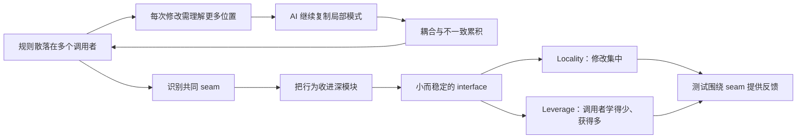
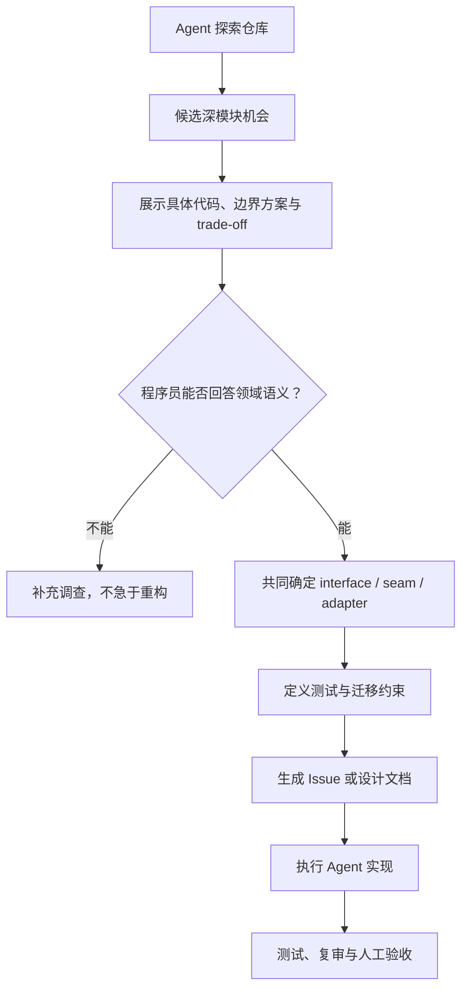

# 总结稿

## 核心摘要

**视频内容：** Matt Pocock 认为 AI 提高了代码生成速度，也可能加速“软件熵”：一次次只关注局部的修改，会增加跨模块耦合、重复规则和难以定位的变更点，最终形成难以继续演化的代码库。他用 `improve-codebase-architecture` skill 展示一种补救流程：先让 Agent 探索仓库并寻找“加深模块”的候选点，再由程序员通过追问、权衡和领域判断选择方案，最终把设计整理为 Issue，交给后续执行 Agent。

这不是一个“自动重构整个代码库”的 AFK skill。视频反复强调，Agent 更像战术执行者，能快速搜索代码、提出候选边界和实现形状；人类程序员则是战略决策者，负责判断长期架构、接口语义和风险。示例中的 skill 找到六个候选机会，但“六个”只是这次运行的输出，不是工具稳定性或建议正确性的证明。

## 一套与 Agent 共享的架构词汇

- **Module：** 一组相关行为，例如页面组件、认证能力或日志模块。
- **Interface：** 调用者为正确使用模块必须知道的一切，不只包含函数签名，也包含调用约定和文档。
- **Implementation：** 模块内部实际完成工作的细节。
- **Depth：** 调用者每学习一单位接口所能获得的行为量；深模块以较小接口隐藏较多实现，浅模块则暴露接近其实现复杂度的接口。
- **Seam：** 视频采用的工作词汇，指模块接口所在的连接位置；它常成为替换依赖与测试隔离的边界。
- **Adapter：** 在某个 seam 上满足接口的具体实现，例如真实时钟与测试用假时钟。
- **Locality：** 经常一起变化的知识、规则与修复是否集中在一处。
- **Leverage：** 调用者付出较少的接口学习成本，是否能获得较多能力。

视频实战选择了一个前后端各自实现同一 insertion-point 规则的候选问题：两份平行实现可能失去同步。重构目标不是简单“减少文件”，而是形成单一 seam，让相关规则集中，从而提高 locality；同时为调用者提供更稳定、能力更集中的接口，提高 leverage。

## 外部核验与术语限定

**外部核验补充：** 视频将深模块/浅模块思想归因于 John Ousterhout 的《A Philosophy of Software Design》。[John Ousterhout 官方书籍页](https://web.stanford.edu/~ouster/cgi-bin/aposd.php)确认书名与作者，[Matt Pocock 的 codebase-design glossary](https://github.com/mattpocock/skills/blob/main/skills/engineering/codebase-design/SKILL.md)也采用了“用小接口隐藏大量行为”的词汇；但本次核验来源未直接定位到书中相应段落，因此这一来源归因仅获部分确认。

“Seam”需要保留术语边界：Matt 的 glossary 将其用作模块接口所在位置；Michael Feathers 的原始定义更宽，是“无需编辑该处即可改变行为的位置”。因此它是本视频采用的设计词汇，不是唯一、普遍的定义。[Michael Feathers：Seams](https://www.informit.com/articles/article.aspx?p=359417&seqNum=2)

视频所说 Adapter 与六边形架构的 ports-and-adapters 思路一致：技术相关的 adapter 在 port 上转换外部与应用之间的协议；但 Adapter 一词和通用设计模式早于六边形架构，不能说该词本身起源于此。[Alistair Cockburn：Hexagonal Architecture](https://alistair.cockburn.us/hexagonal-architecture)

视频录制时声称 GitHub skills 仓库约有 41.5k stars，这是变化中的历史数值，本次没有与录制日期对应的权威快照，故不能独立确认；仓库当前状态可从[官方仓库](https://github.com/mattpocock/skills)查看，但不应拿当前数字反证或确认录制时数字。

## 与相关笔记的连接

[[clips/Matt Skills _ 你的代码库还没准备好迎接AI？这样改才能让AI真正高效工作.md|你的代码库还没准备好迎接 AI？]]主要讲如何通过目录、接口、类型和快速反馈预防 AI 把代码库写乱；本视频则把同一套深模块、locality 与 leverage 词汇用于已有代码库的诊断和修复。组合阅读可形成“先设计 AI 可操作的环境，再定期诊断熵增”的完整路径。

[[clips/来点干货,关于代码架构与AI复审我的浅显理解.md|关于代码架构与 AI 复审]]强调先建立依赖骨架、接口和测试，再让 AI 在边界内扩写与复审；本视频进一步给出了识别边界质量的尺度：接口是否足够小、规则是否集中、seam 是否可测试。两者合起来，架构不再只是目录分层，而是变更和验证能否局部化。

[[clips/Matt Pocock 科普：为什么永远不能盲信 LLM【中英字幕】.md|为什么永远不能盲信 LLM]]说明即使上下文和表达都很完整，模型仍可能误读证据或自信猜测；这正好解释了本 skill 为何采用 Human-in-the-loop 的“grilling session”，而不是让 Agent 自行选择并实施长期架构决策。

# 辅助理解

## 辅助理解：重构目标不是“更整齐”，而是让变化局部化

**视频内容：** AI 产生的局部改动若不断复制规则、穿越边界或新增浅封装，代码虽然仍能运行，却会越来越难预测下一次修改影响哪里。视频用散乱依赖图表达这种熵增：问题不一定是某一行错误，而是知识和责任逐渐分散。

**AI 辅助推断：** 图右侧是对视频原则的工程化重组，不意味着所有重复都应立即抽象。是否形成深模块，仍要看这些行为是否共享同一变化原因、接口能否保持稳定，以及新增抽象是否真的降低总认知成本。

### 1. 深度是“接口成本与行为收益”的比值

视频把 deep module 与 shallow module 并列：深模块隐藏大量实现，只暴露较薄接口；浅模块的接口几乎与内部实现同样复杂。

**外部核验补充：** 视频将这一思想归因于 John Ousterhout 的《A Philosophy of Software Design》。[书籍官方页面](https://web.stanford.edu/~ouster/cgi-bin/aposd.php)确认书名与作者，[官方 glossary](https://github.com/mattpocock/skills/blob/main/skills/engineering/codebase-design/SKILL.md)采用相同词汇；但本次核验来源未直接定位到书中相应段落，因此该归因仅获部分确认。

但“深”不是代码行数多，也不是把所有逻辑塞进一个巨型类。判断一个抽象是否真正变深，可以问：

1. 调用者是否少学了一组规则或状态转换？
2. 经常一起变化的知识是否被集中？
3. 接口是否隐藏了容易出错的顺序、默认值或兼容细节？
4. 模块能否通过少量稳定 seam 被替换和测试？
5. 抽象是否只是把复杂度换了名字，却仍要求调用者理解全部内部细节？

### 2. Seam 与 Adapter 让测试成为架构的一部分

**视频内容：** Seam 是模块相接的位置，Adapter 是在这个位置满足接口的具体实现。时钟示例中，生产环境可使用真实时钟，测试则注入假时钟，从而不必真的等待两周。这里的重点不是“为了测试增加 mock”，而是让外部变化和不确定性通过明确接口进入系统。

**术语限定：** Michael Feathers 对 seam 的原始定义比视频更宽；视频采用的是 Matt glossary 中“模块接口所在位置”的具体用法。[Michael Feathers：Seams](https://www.informit.com/articles/article.aspx?p=359417&seqNum=2) Adapter 与六边形架构的 ports-and-adapters 一致，但这个通用术语并非由六边形架构首创。[Alistair Cockburn：Hexagonal Architecture](https://alistair.cockburn.us/hexagonal-architecture)

### 3. Skill 的价值在“先生成候选，再逼出权衡”

实战画面展示的不是一次自动改码，而是 Agent 为同一 insertion point 提出 narrow、medium、wide 三种边界方案，列出 trade-off，并暴露尚待澄清的语义问题。

**视频内容：** skill 先探索架构，找出可能缺少单一 seam、locality 较低或 leverage 较差的位置；人选择候选后，Agent 用两侧实际代码发起一轮 grilling session，提出模块形状与设计问题。确认后才把方案转成 Issue，交给后续执行流程。

**AI 辅助推断：** 这套流程的关键控制点是候选与执行之间的人类判断。如果让同一个模型自行发现问题、选择方案、实现并宣布成功，所谓架构审查容易退化为自我确认。

### 4. Locality 给维护者，Leverage 给调用者

视频用一张图把深模块的两类收益分开：维护者获得 locality，调用者获得 leverage。

- **Locality** 关注变化：同一规则、bug 和修复是否集中在可预测位置。
- **Leverage** 关注使用：调用者掌握少量接口后，是否能调用较丰富且一致的能力。

二者也构成适合 Agent 的环境：locality 缩小每次修改所需上下文，leverage 减少 Agent 必须正确协调的低层细节；明确 seam 和测试则提供快速反馈。但“深模块一定提高 AI 产出”在本次资料中没有通用对照实验，应视为基于软件设计原则的合理工程判断，而非已普遍证实的定律。

### 5. 遗留代码库先补验证护栏

**视频内容：** 对难以修改的旧代码库，作者建议在大规模 AI 变更前建立 test harness，并通过清晰 seam 围住行为。这里的测试只能证明被编码的断言通过，不能自动证明架构方向、未覆盖业务规则或迁移风险都正确。

因此，更稳妥的顺序是：先用 characterization tests 固定关键现状，再识别变化集中度低的模块，提出小步可回滚的边界调整，最后让 Agent 在可重复验证的范围内实施。架构判断仍由理解业务后果的人负责。

## 外部事实核验

### 声明 1（01:07）

- 视频陈述：The speaker says his GitHub skills repository had about 41.5 thousand stars at recording time.
- 核验状态：未验证
- 核验结果：Unverified as a historical point-in-time count. The official repository exists and its live GitHub page exposes the current star count, but that changing value does not establish the count on the unknown recording date. No authoritative archived snapshot tied to the recording was available in this check.
- 检索日期：2026-08-14
- 来源：
  - [mattpocock/skills — official GitHub repository](https://github.com/mattpocock/skills)（primary）

### 声明 2（02:56）

- 视频陈述：The deep-module and shallow-module concepts are attributed to John Ousterhout’s book A Philosophy of Software Design.
- 核验状态：部分确认
- 核验结果：Partially confirmed. John Ousterhout's official Stanford page confirms that *A Philosophy of Software Design* is his book, and Matt Pocock's official codebase-design material uses the deep-versus-shallow module vocabulary. However, the sources reviewed here do not directly locate a passage in Ousterhout's book establishing that provenance, so the video's attribution remains plausible but was not independently confirmed from the book text.
- 检索日期：2026-08-14
- 来源：
  - [John Ousterhout — A Philosophy of Software Design](https://web.stanford.edu/~ouster/cgi-bin/aposd.php)（primary）
  - [Matt Pocock skills — codebase-design glossary](https://github.com/mattpocock/skills/blob/main/skills/engineering/codebase-design/SKILL.md)（primary）

### 声明 3（03:43）

- 视频陈述：The video calls the locations where modules interface with one another seams.
- 核验状态：部分确认
- 核验结果：Partially confirmed as the video's adopted design vocabulary, not as a universal definition. Matt Pocock's official glossary defines a seam as the location at which a module's interface lives and attributes the underlying term to Michael Feathers. Feathers' own published definition is broader: a place where behavior can be altered without editing that place.
- 检索日期：2026-08-14
- 来源：
  - [Matt Pocock skills — codebase-design glossary](https://github.com/mattpocock/skills/blob/main/skills/engineering/codebase-design/SKILL.md)（primary）
  - [Michael Feathers — Seams (Working Effectively with Legacy Code excerpt)](https://www.informit.com/articles/article.aspx?p=359417&seqNum=2)（primary）

### 声明 4（04:14）

- 视频陈述：The video uses adapter for a concrete module satisfying the interface at a seam, drawing the term from hexagonal architecture.
- 核验状态：已确认
- 核验结果：Confirmed with a terminology caveat. Matt Pocock's official glossary defines an adapter as a concrete thing satisfying an interface at a seam. Alistair Cockburn's original Hexagonal Architecture article is explicitly titled Ports and Adapters and describes technology-specific adapters converting between a port's protocol and external devices. Cockburn also notes that the generic Adapter pattern predates his ports-and-adapters pattern, so the word itself did not originate with hexagonal architecture.
- 检索日期：2026-08-14
- 来源：
  - [Matt Pocock skills — codebase-design glossary](https://github.com/mattpocock/skills/blob/main/skills/engineering/codebase-design/SKILL.md)（primary）
  - [Alistair Cockburn — Hexagonal Architecture: the original 2005 article](https://alistair.cockburn.us/hexagonal-architecture)（primary）

# Data

## 增强转写稿

[00:00] 你可能看了 thousands of LinkedIn CEO posts
[00:02] 說 Code is cheap
[00:04] and they can move faster than ever before
[00:07] but what's happening is that AI
[00:09] has simply accelerated software entropy
[00:11] in other words, code bases are falling apart
[00:14] faster than they ever have before
[00:16] because every time that you make a change
[00:17] that doesn't take into account the entire code base
[00:20] you are likely to introduce little things
[00:22] weird things that make the code base harder to change
[00:25] and over time that just snowballs and snowballs
[00:27] until you end up with a huge ball of mud
[00:30] sloppy sloppy mud
[00:31] that is incredibly hard to reverse
[00:34] if you don't know how to do it
[00:35] I've made a video about this before
[00:37] introducing folks to the idea of deep modules
[00:40] and that video focuses more on prevention
[00:42] how you can prevent your setup from getting to that point
[00:45] let's now focus on the cure
[00:47] how you can take a code base
[00:49] that feels like it's beyond repair and rescue it
[00:51] and you can do that with some good old
[00:53] software fundamentals
[00:54] as well as my improve code base architecture skill
[00:57] we're going to be walking through what this skill does
[01:00] revisiting some of the terms we looked at
[01:01] in the other video
[01:02] and then we're going to take that
[01:03] and apply it to a real code base
[01:05] and this, by the way, is part of my
[01:07] github skills repo
[01:08] which is currently sitting at 41.5k stars
[01:11] bonkers
[01:11] now one of the things that I added to this
[01:13] improve code base architecture skill recently
[01:15] was a glossary of terminology
[01:18] having a shared vocabulary with the AI
[01:19] is super important
[01:21] because it means that you can talk
[01:22] using the same language
[01:24] you can understand what each other's language is
[01:27] and you can be a lot more precise with
[01:29] what you're asking for
[01:30] this terminology here is super
[01:32] duper useful
[01:33] and I'm going to spend a portion of this video
[01:35] going through what each of these terms actually mean
[01:37] honestly just understanding this stuff at a deep level
[01:39] will make you a better software developer
[01:42] so let's get started by talking about modules
[01:44] a module is a unit of something in your application
[01:48] it could be a bunch of react components
[01:50] that all fit together to form a page
[01:52] it could be a bunch of functions inside your application
[01:54] that are entirely responsible for authentication
[01:57] or it could simply be the logger that you've chosen
[01:59] like logging to the console
[02:01] logging to a file
[02:01] or logging to a third party service
[02:03] in a good code base these modules talk to each other
[02:05] and they talk to each other via their interfaces
[02:08] an interface is everything a caller must know
[02:10] to use the module correctly
[02:12] for instance if it's an authentication module
[02:13] then it might have a sign in method
[02:16] it might have a sign out method
[02:17] and these methods are the interface to that module
[02:20] the methods are not the only thing that's important
[02:22] the interface also includes
[02:23] kind of nebulous information about how to call the module
[02:27] so perhaps it's documentation too
[02:28] the implementation is then what's inside the module
[02:31] what it actually does when you call sign in or sign out
[02:34] and so this is the core primitive that we're talking about
[02:36] the modules that have interfaces and implementations
[02:39] scattered throughout your application
[02:40] these modules can either be deep modules
[02:43] or they can be shallow modules
[02:45] a deep module hides lots of implementation
[02:48] behind a relatively simple interface
[02:50] a shallow module has a complex interface
[02:53] and kind of not much implementation
[02:55] actually behind it
[02:56] these ideas are from
[02:57] John Ousterhout's book
[02:58] a philosophy of software design
[02:59] which I recommend you pick up a copy of
[03:01] deep modules are considered better than shallow modules
[03:03] because it hides more information
[03:05] away from the caller
[03:06] in other words the person who's calling this
[03:08] or the function that's calling this
[03:09] only needs to know about this tiny little interface
[03:11] and they'll get access to all of this implementation
[03:14] lovely
[03:14] and so that's what we describe as depth
[03:16] the amount of behavior a caller can exercise
[03:18] per unit of interface that they have to learn
[03:21] really good open source libraries
[03:22] like TanStack Query
[03:23] or something
[03:24] have really good deep modules
[03:26] in other words they're hiding
[03:27] a lot of complexity behind a super simple interface
[03:30] these modules then interact with each other
[03:32] and they have dependencies on each other
[03:34] for instance this module might interact
[03:36] with this module here
[03:38] which then interacts with this module up here
[03:40] and this module up here
[03:41] and they have these dependency graphs between them
[03:43] these gaps between these modules
[03:45] are called the seams
[03:46] it's the location at which the modules interface
[03:49] lives inside the application
[03:51] these seams are usually where you're going to do
[03:53] your unit testing
[03:54] or your integration testing
[03:55] for instance if we wanted to test this module
[03:57] in isolation down here
[03:59] then we would add a mock or something
[04:01] just at this seam
[04:02] so figuring out where your seams are going to live
[04:04] in your application is crucial
[04:06] to getting a good architecture
[04:07] when you find out where a seam is in your application
[04:09] you need some concrete thing
[04:11] a module
[04:12] that satisfies that interface
[04:14] this is what I'm going to call an adapter
[04:16] which I'm taking from hexagonal architecture
[04:18] for instance if you have some kind of application
[04:20] that depends on a clock running
[04:22] then you may want to have a clock
[04:24] a normal clock inside here
[04:25] using the actual living clock
[04:27] and then inside some tests
[04:29] you may want to have an adapter
[04:30] that is a fake clock
[04:31] these both satisfy the interface at that seam
[04:34] and it means that you can use the fake clock
[04:36] in tests
[04:36] so you don't have to literally wait two weeks
[04:39] for your test to finish
[04:40] so that's how seams and adapters play together
[04:43] the benefit of all this is that
[04:44] these deep modules have two main properties
[04:47] or two main benefits that you get from them
[04:49] but the maintainers, the people maintaining this module
[04:51] they get locality
[04:52] changes to that module
[04:54] and bugs and all the fixes to do with them
[04:56] they concentrate in one place
[04:58] in that deep module
[04:59] if it's scattered around
[05:00] over multiple different modules
[05:02] then you have low locality
[05:04] you want high locality
[05:05] grouping and co-locating the things
[05:07] that matter and often change together
[05:09] the people using this module
[05:11] will get more leverage
[05:12] the deeper the module is
[05:13] in other words more capability
[05:15] per unit of interface they have to learn
[05:17] and so when we're talking about
[05:18] improving our code bases
[05:20] these are the two attributes
[05:21] that we're aiming at
[05:22] right that's enough knowledge
[05:23] we know the basic terms of engagement
[05:25] now let's go and improve a code base
[05:27] the code base we're going to look at
[05:28] is my course video manager code base
[05:30] which is the repo of software
[05:33] that I'm actually using to record this video
[05:34] this code base has had
[05:36] around 1500 commits here
[05:39] and I wouldn't say it's a ball of mud
[05:40] but I also wouldn't say it's perfect either
[05:42] it's a router application
[05:44] it uses effect.ts under the hood
[05:46] let's get into it
[05:47] I'm going to open up a new Claude session inside here
[05:49] and I'm going to run
[05:50] my improved code base architecture skill
[05:53] and I'm going to turn off auto mode
[05:54] auto mode does some funny things
[05:55] with these human-in-the-loop style flows
[05:57] and so I don't want it on here
[05:59] we can see it's going and exploring
[06:01] and looking through the code
[06:02] that's what it's instructed to do first
[06:04] here we go
[06:05] explore architecture
[06:06] for deepening opportunities
[06:07] usually a bad code base
[06:09] is one that has a ton
[06:10] of shallow modules in it
[06:11] or one that has very poor leverage
[06:13] for those modules or poor locality
[06:15] where lots of stuff is spread in lots of different places
[06:18] ok it's come back with some candidates here
[06:20] let's bump up the screen size
[06:21] and hopefully Claude Code won't just destroy itself
[06:25] ok I guess maybe we're not bumping up the screen size
[06:27] thank you for that Claude Code
[06:28] we can see it's identified six
[06:30] deepening opportunities here
[06:31] these candidates here are pretty hard to explain
[06:33] because they sort of required
[06:35] domain knowledge about my repo
[06:36] but we can see here that it's saying that
[06:38] there's a concept that doesn't have a single seam
[06:41] in other words there are two implementations
[06:43] of this insertion point
[06:44] and they live in parallel
[06:45] and the seam where they must agree is untested
[06:48] this essentially means that the front end
[06:49] could make some changes
[06:51] but the back end because it has a separate
[06:54] parallel implementation
[06:55] could be out of sync with it
[06:56] so this I think is actually a really good candidate
[06:58] for refactoring into a single module
[07:00] we gain locality
[07:02] and it says that here we would gain locality
[07:03] interleave clip clip section ordering rule
[07:05] lives in one place
[07:07] so let's go and take a look at that
[07:09] let's actually say
[07:10] yeah I'd like to pick one here
[07:12] that seems like a good candidate
[07:13] so let's fire that off
[07:14] and see what it says
[07:15] ok Claude is trolling me here
[07:17] it says I'd like to pick one
[07:18] I meant
[07:19] I meant one
[07:21] great
[07:21] ok so it now has come back with
[07:23] it's got concrete code on both sides
[07:25] to ground this
[07:26] and it enters a grilling session
[07:28] and in this grilling session
[07:29] we can take the ideas inside here
[07:32] and we can start kind of talking about
[07:33] what a better solution would be
[07:35] this is a nice instance here
[07:36] the back end has no end
[07:38] let's not think about that too literally
[07:40] what you end up doing with this skill
[07:41] is you end up talking about
[07:43] the potential proposed solution
[07:45] and it will then propose a shape
[07:47] and once that's all done
[07:48] you can take that
[07:49] and you can put that in
[07:50] as a GitHub issue
[07:51] into your issue tracker
[07:52] which can then be picked up by an AFK agent
[07:54] you should check out my video on
[07:55] Sandcastle
[07:56] if you're interested in that
[07:57] now in the course of normal development
[07:58] what I would do is go through
[07:59] and thoughtfully answer
[08:01] each of these questions in turn
[08:03] but since I'm doing a video
[08:04] and this is slightly artificial
[08:05] I'm going to say
[08:06] could you just choose your recommended answers
[08:09] for each of these questions
[08:10] and that should speed us through
[08:11] actually making the change
[08:13] or potentially creating an issue out of this
[08:15] so it's now coming back
[08:15] with a proposed module shape
[08:17] and it's also asking to verify
[08:19] a particular part of the implementation
[08:21] where end is collapsed
[08:23] and to sketch the actual
[08:24] type script interface
[08:25] yeah go ahead and do both
[08:26] that sounds great
[08:26] let's ping that off
[08:28] and see what it says
[08:29] ok it has figured out
[08:30] the implementation detail it needed
[08:32] and it's come back
[08:33] and proposed a design here
[08:34] so which of these functions
[08:36] are going to be essentially
[08:37] the interface for this module
[08:39] and so we can talk about this
[08:41] with the AI and figure it out
[08:42] it's again come back
[08:43] with two design decisions
[08:45] that it wants my feedback on
[08:46] and here I think
[08:47] you've got the flavour
[08:48] of how this skill works
[08:50] and the kind of conversations
[08:51] that you end up having
[08:52] with the AI based on this
[08:53] if I want to turn this into an issue
[08:54] that my afk agent picks up
[08:56] I can use to PRD
[08:58] or to issues here
[09:00] and by the way
[09:00] if you're interested
[09:01] in these skills
[09:02] that I'm talking about
[09:02] then you should check out
[09:03] this site here
[09:05] which is linked below
[09:06] I'm going to be creating
[09:06] a real documentation site
[09:08] for these skills
[09:09] and for now I have a newsletter
[09:10] that you can sign up to
[09:11] for the latest updates
[09:12] as well as tips
[09:13] and tricks and resources
[09:14] for getting the most
[09:15] out of agents
[09:16] the thing that's important
[09:17] to notice here
[09:18] is just how much
[09:19] this skill demands
[09:20] of you,the user
[09:21] this is not an afk skill
[09:22] that you can just sort of run
[09:24] and kind of like
[09:25] just rely on
[09:26] to continually
[09:27] improve your code base
[09:28] this requires a judgement call
[09:29] from you,the programmer
[09:31] sitting above the LLM
[09:32] I think of agents
[09:33] as really really good
[09:35] tactical programmers
[09:37] they're able to get on the ground
[09:38] and make changes quickly
[09:40] but they need someone
[09:41] on the level above them
[09:42] who is the strategic programmer
[09:44] and that's what this skill does
[09:45] it allows the sergeant
[09:47] to go and run around
[09:47] the code base
[09:48] and look for potential
[09:49] improvement opportunities
[09:52] but then you,the general
[09:53] have to go and actually
[09:54] make the change
[09:55] and decide what's good
[09:56] for the long-term
[09:56] health of the code base
[09:57] I recommend that you run
[09:58] this skill
[09:59] you know,every couple
[10:00] of days really
[10:01] especially in a code base
[10:02] that's fast-moving
[10:03] you're going to come up
[10:04] with tons of opportunities
[10:05] for deepening the code base
[10:06] and the deeper you get
[10:07] those modules
[10:08] the higher leverage
[10:09] you're going to get out of them
[10:11] and leverage as well
[10:12] means testing
[10:13] if you have a set
[10:13] of really nice
[10:14] clear seams in your code base
[10:16] then you're going to be able
[10:17] to write really nice tests
[10:19] around those nice deep modules
[10:21] and the better your tests are
[10:22] the better the output
[10:23] from the agent is going to be
[10:24] one final thought here
[10:25] is that lots of folks
[10:26] asked me how
[10:27] you would get started
[10:28] by using AI
[10:30] in a legacy code base
[10:31] and a legacy code base
[10:31] is probably going to have
[10:32] a lot of shallow modules
[10:34] I mean,we talk about
[10:35] legacy code bases
[10:36] what we really mean
[10:37] are bad code bases
[10:38] code bases that are
[10:39] hard to make changes in
[10:41] and what you really need
[10:42] before you start
[10:43] making changes
[10:44] in a legacy code base
[10:45] is a harness
[10:46] around the code base
[10:47] to make sure
[10:48] that your changes
[10:48] don't mess anything up
[10:49] so for that
[10:50] you need tests
[10:51] test testing
[10:52] really nice
[10:53] deep modules
[10:54] that have a lot
[10:54] of leverage
[10:55] and locality
[10:56] so running improved
[10:57] code base architecture
[10:57] is a great place
[10:59] to start
[10:59] thanks for watching folks
[11:00] and I hope that answers
[11:01] some of your questions
[11:02] about how to solve
[11:03] this never-ending problem
[11:05] of AI just running away
[11:07] and creating
[11:07] terrible code bases
[11:08] I hope you enjoy the skills
[11:09] do follow the link below
[11:10] if you want to
[11:11] find more of them
[11:12] so thanks for watching
[11:12] and I'll see you
[11:13] in the next one
[11:14] and what you really need
[11:15] before you start
[11:16] making changes
[11:17] in a legacy code base

## 原始转写稿

[00:00] 你可能看了 thousands of LinkedIn CEO posts
[00:02] 說 Code is cheap
[00:04] and they can move faster than ever before
[00:07] but what's happening is that AI
[00:09] has simply accelerated software entropy
[00:11] in other words, code bases are falling apart
[00:14] faster than they ever have before
[00:16] because every time that you make a change
[00:17] that doesn't take into account the entire code base
[00:20] you are likely to introduce little things
[00:22] weird things that make the code base harder to change
[00:25] and over time that just snowballs and snowballs
[00:27] until you end up with a huge ball of mud
[00:30] sloppy sloppy mud
[00:31] that is incredibly hard to reverse
[00:34] if you don't know how to do it
[00:35] I've made a video about this before
[00:37] introducing folks to the idea of deep modules
[00:40] and that video focuses more on prevention
[00:42] how you can prevent your setup from getting to that point
[00:45] let's now focus on the cure
[00:47] how you can take a code base
[00:49] that feels like it's beyond repair and rescue it
[00:51] and you can do that with some good old
[00:53] software fundamentals
[00:54] as well as myimprove code base architecture skill
[00:57] we're going to be walking through what this skill does
[01:00] revisiting some of the terms we looked at
[01:01] in the other video
[01:02] and then we're going to take that
[01:03] and apply it to a real code base
[01:05] and this, by the way, is part of my
[01:07] github skills repo
[01:08] which is currently sitting at 41.5k stars
[01:11] bonkers
[01:11] now one of the things that I added to this
[01:13] improve code base architecture skill recently
[01:15] was a glossary of terminology
[01:18] having a shared vocabulary with the AI
[01:19] is super important
[01:21] because it means that you can talk
[01:22] using the same language
[01:24] you can understand what each other's language is
[01:27] and you can be a lot more precise with
[01:29] what you're asking for
[01:30] this terminology here is super
[01:32] duper useful
[01:33] and I'm going to spend a portion of this video
[01:35] going through what each of these terms actually mean
[01:37] honestly just understanding this stuff at a deep level
[01:39] will make you a better software developer
[01:42] so let's get started by talking about modules
[01:44] a module is a unit of something in your application
[01:48] it could be a bunch of react components
[01:50] that all fit together to form a page
[01:52] it could be a bunch of functions inside your application
[01:54] that are entirely responsible forauthentication
[01:57] or it could simply be the logger that you've chosen
[01:59] like alogging to the console
[02:01] logging to a file
[02:01] orlogging to a third party service
[02:03] in a good code base these modules talk to each other
[02:05] and they talk to each other via their interfaces
[02:08] an interface is everything a caller must know
[02:10] to use the module correctly
[02:12] for instance if it's an authentication module
[02:13] then it might have a sign in method
[02:16] it might have a sign out method
[02:17] and these methods are the interface to that module
[02:20] the methods are not the only thing that's important
[02:22] the interface also includes
[02:23] can a nebulous information about how to call the module
[02:27] so perhaps it's documentation too
[02:28] the implementation is then what's inside the module
[02:31] what it actually does when you call sign in or sign out
[02:34] and so this is the core primitive that we're talking about
[02:36] the modules that have interfaces and implementations
[02:39] scattered throughout your application
[02:40] these modules can either be deep modules
[02:43] or they can be shallow modules
[02:45] a deep module hides lots of implementation
[02:48] behind a relatively simple interface
[02:50] a shallow module has a complex interface
[02:53] and kind of not much implementation
[02:55] actually behind it
[02:56] these ideas are from
[02:57] John Austerhout's book
[02:58] a philosophy of software design
[02:59] which I recommend you pick up a copy of
[03:01] deep modules are considered better than shallow modules
[03:03] because it hides more information
[03:05] away from the caller
[03:06] in other words the person who's calling this
[03:08] or the function that's calling this
[03:09] only needs to know about this tiny little interface
[03:11] and they'll get access to all of this implementation
[03:14] lovely
[03:14] and so that's what we describe as depth
[03:16] the amount of behavior a caller can exercise
[03:18] per unit of interface that they have to learn
[03:21] really good open source libraries
[03:22] liketanstackquery
[03:23] or something
[03:24] have really good deep modules
[03:26] in other words they're hiding
[03:27] a lot of complexity behind a super simple interface
[03:30] these modules then interact with each other
[03:32] and they have dependencies on each other
[03:34] for instance this module might interact
[03:36] with this module here
[03:38] which then interacts with this module up here
[03:40] and this module up here
[03:41] and they have these dependency graphs between them
[03:43] these gaps between these modules
[03:45] are called the seams
[03:46] it's the location at which the modules interface
[03:49] lives inside the application
[03:51] these seamsare usually where you're going to do
[03:53] your unit testing
[03:54] or your integration testing
[03:55] for instance if we wanted to test this module
[03:57] in isolation down here
[03:59] then we would add a mock or something
[04:01] just at this seam
[04:02] so figuring out where your seams are going to live
[04:04] in your application is crucial
[04:06] to getting a good architecture
[04:07] when you find out where a seam is in your application
[04:09] you need some concrete thing
[04:11] a module
[04:12] that satisfies that interface
[04:14] this is what I'm going to call an adapter
[04:16] which I'm taking from hexagonal architecture
[04:18] for instance if you have some kind of application
[04:20] that depends on a clock running
[04:22] then you may want to have a clock
[04:24] a normal clock inside here
[04:25] using the actual living clock
[04:27] and then inside some tests
[04:29] you may want to have an adapter
[04:30] that is a fake clock
[04:31] these both satisfy the interface at that seam
[04:34] and it means that you can use the fake clock
[04:36] in tests
[04:36] so you don't have to literally wait two weeks
[04:39] for your test to finish
[04:40] so that's how seams and adapters play together
[04:43] the benefit of all this is that
[04:44] these deep modules have two main properties
[04:47] or two main benefits that you get from them
[04:49] but the maintainers, the people maintaining this module
[04:51] they get locality
[04:52] changes to that module
[04:54] and bugs and all the fixes to do with them
[04:56] they concentratein one place
[04:58] in that deep module
[04:59] if it's scattered around
[05:00] over multiple different modules
[05:02] then you have low locality
[05:04] you want high locality
[05:05] grouping and co-locating the things
[05:07] that matter and often change together
[05:09] the people using this module
[05:11] will get more leverage
[05:12] the deeper the module is
[05:13] in other words more capability
[05:15] per unit of interface they have to learn
[05:17] and so when we're talking about
[05:18] improving our code bases
[05:20] these are the two attributes
[05:21] that we're aiming at
[05:22] right that's enough knowledge
[05:23] we know the basic terms of engagement
[05:25] now let's go and improve a code base
[05:27] the code base we're going to look at
[05:28] is my course video manager code base
[05:30] which is the repo of software
[05:33] that I'm actually using to record this video
[05:34] this code base has had
[05:36] around 1500 commits here
[05:39] and I wouldn't say it's a ball of mud
[05:40] but I also wouldn't say it's perfect either
[05:42] it's a rooter application
[05:44] it uses effect.ts under the hood
[05:46] let's get into it
[05:47] I'm going to open up a new clored session inside here
[05:49] and I'm going to run
[05:50] my improved code base architecture skill
[05:53] and I'm going to turn off auto mode
[05:54] automode does some funny things
[05:55] with these human and the loop style flows
[05:57] and so I don't want it on here
[05:59] we can see it's going and exploring
[06:01] and looking through the code
[06:02] that's what it's instructed to do first
[06:04] here we go
[06:05] explore architecture
[06:06] for deepening opportunities
[06:07] usually a bad code base
[06:09] is one that has a ton
[06:10] of shallow modules in it
[06:11] or one that has very poor leverage
[06:13] for those modules or poor locality
[06:15] where lots of stuff is spread in lots of different places
[06:18] ok it's come back with some candidates here
[06:20] let's bump up the screen size
[06:21] and hopefully clored code won't just destroy itself
[06:25] ok I guess maybe we're not bumping up the screen size
[06:27] thank you for that clored code
[06:28] we can see it's identified six
[06:30] deepening opportunities here
[06:31] these candidates here are pretty hard to explain
[06:33] because they sort of required
[06:35] demain knowledge about my repo
[06:36] but we can see here that it's saying that
[06:38] there's a concept that doesn't have a single scene
[06:41] in other words there are two implementations
[06:43] of this insertion point
[06:44] and they live in parallel
[06:45] and the scene where they must agree is untested
[06:48] this essentially means that the front end
[06:49] could make some changes
[06:51] but the back end because it has a separate
[06:54] parallel implementation
[06:55] could be out of sync with it
[06:56] so this I think is actually a really good candidate
[06:58] for refactoring into a single module
[07:00] we gain locality
[07:02] and it says that here we would gain locality
[07:03] interleave clip clip section ordering rule
[07:05] lives in one place
[07:07] so let's go and take a look at that
[07:09] let's actually say
[07:10] yeah I'd like to pick one here
[07:12] that seems like a good candidate
[07:13] so let's fire that off
[07:14] and see what it says
[07:15] ok Claude is trolling me here
[07:17] it says I'd like to pick one
[07:18] I meant
[07:19] I meant one
[07:21] great
[07:21] ok so it now has come back with
[07:23] it's got concrete code on both sides
[07:25] to ground this
[07:26] and it enters a grilling session
[07:28] and in this grilling session
[07:29] we can take the ideas inside here
[07:32] and we can start kind of talking about
[07:33] what a better solution would be
[07:35] this is a nice instance here
[07:36] the back end has no end
[07:38] let's not think about that too literally
[07:40] what you end up doing with this skill
[07:41] is you end up talking about
[07:43] the potential proposed solution
[07:45] and it will then propose a shape
[07:47] and once that's all done
[07:48] you can take that
[07:49] and you can put that in
[07:50] as a github issue
[07:51] into your issue tracker
[07:52] which can then be picked up by an afk agent
[07:54] you should check out my video on
[07:55] sangcastle
[07:56] if you're interested in that
[07:57] now in the course of normal development
[07:58] what I would do is go through
[07:59] and thoughtfully answer
[08:01] each of these questions in turn
[08:03] but since I'm doing a video
[08:04] and this is slightly artificial
[08:05] I'm going to say
[08:06] could you just choose your recommended answers
[08:09] for each of these questions
[08:10] and that should speed us through
[08:11] actually making the change
[08:13] or potentially creating an issue out of this
[08:15] so it's now coming back
[08:15] with a proposed module shape
[08:17] and it's also asking to verify
[08:19] a particular part of the implementation
[08:21] where end is collapsed
[08:23] and to sketch the actual
[08:24] type script interface
[08:25] yeah go ahead and do both
[08:26] that sounds great
[08:26] let's ping that off
[08:28] and see what it says
[08:29] ok it has figured out
[08:30] the implementation detail it needed
[08:32] and it's come back
[08:33] and proposed a design here
[08:34] so which of these functions
[08:36] are going to be essentially
[08:37] the interface for this module
[08:39] and so we can talk about this
[08:41] with the AI and figure it out
[08:42] it's again come back
[08:43] with two design decisions
[08:45] that it wants my feedback on
[08:46] and here I think
[08:47] you've got the flavour
[08:48] of how this skill works
[08:50] and the kind of conversations
[08:51] that you end up having
[08:52] with the AI based on this
[08:53] if I want to turn this into an issue
[08:54] that my afk agent picks up
[08:56] I can use two prd
[08:58] or two issues here
[09:00] and by the way
[09:00] if you're interested
[09:01] in these skills
[09:02] that I'm talking about
[09:02] then you should check out
[09:03] this site here
[09:05] which is linked below
[09:06] I'm going to be creating
[09:06] a real documentation site
[09:08] for these skills
[09:09] and for now I have a newsletter
[09:10] that you can sign up to
[09:11] for the latest updates
[09:12] as well as tips
[09:13] and tricksand resources
[09:14] for getting the most
[09:15] out of agents
[09:16] the thing that's important
[09:17] to notice here
[09:18] is just how much
[09:19] this skill demands
[09:20] of you,the user
[09:21] this is not an afk skill
[09:22] that you can just sort of run
[09:24] and kind of like
[09:25] just rely on
[09:26] to continually
[09:27] improve your code base
[09:28] this requires a judgement call
[09:29] from you,the programmer
[09:31] sitting above the LLM
[09:32] I think of agents
[09:33] as really really good
[09:35] tactical programmers
[09:37] they're able to get on the ground
[09:38] and make changes quickly
[09:40] but they need someone
[09:41] on the level above them
[09:42] who is the strategic programmer
[09:44] and that's what this skill does
[09:45] it allows the sergeant
[09:47] to go and run around
[09:47] the code base
[09:48] and look for potential
[09:49] improvement opportunities
[09:52] but then you,the general
[09:53] have to go and actually
[09:54] make the change
[09:55] and decide what's good
[09:56] for the long-term
[09:56] health of the code base
[09:57] I recommend that you run
[09:58] this skill
[09:59] you know,every couple
[10:00] of days really
[10:01] especially in a code base
[10:02] that's fast-moving
[10:03] you're going to come up
[10:04] with tons of opportunities
[10:05] for deepening the code base
[10:06] and the deeper you get
[10:07] those modules
[10:08] the higher leverage
[10:09] you're going to get out of them
[10:11] and leverage as well
[10:12] means testing
[10:13] if you have a set
[10:13] of really nice
[10:14] clear seams in your code base
[10:16] then you're going to be able
[10:17] to write really nice tests
[10:19] around those nice deep modules
[10:21] and the better your tests are
[10:22] the better the output
[10:23] from the agent is going to be
[10:24] one final thought here
[10:25] is that lots of folks
[10:26] asked me how
[10:27] you would get started
[10:28] by using AI
[10:30] in a legacy code base
[10:31] and a legacy code base
[10:31] is probably going to have
[10:32] a lot of shallow modules
[10:34] I mean,we talk about
[10:35] legacy code bases
[10:36] what we really mean
[10:37] are bad code bases
[10:38] code bases that are
[10:39] hard to make changes in
[10:41] and what you really need
[10:42] before you start
[10:43] making changes
[10:44] in a legacy code base
[10:45] is a harness
[10:46] around the code base
[10:47] to make sure
[10:48] that your changes
[10:48] don't mess anything up
[10:49] so for that
[10:50] you need tests
[10:51] test testing
[10:52] really nice
[10:53] deep modules
[10:54] that have a lot
[10:54] of leverage
[10:55] and locality
[10:56] so running improved
[10:57] code base architecture
[10:57] is a great place
[10:59] to start
[10:59] thanks for watching folks
[11:00] and I hope that answers
[11:01] some of your questions
[11:02] about how to solve
[11:03] this never-ending problem
[11:05] of AI just running away
[11:07] and creating
[11:07] terrible code bases
[11:08] I hope you enjoy the skills
[11:09] do follow the link below
[11:10] if you want to
[11:11] find more of them
[11:12] so thanks for watching
[11:12] and I'll see you
[11:13] in the next one
[11:14] and what you really need
[11:15] before you start
[11:16] making changes
[11:17] in a legacy code base

## 原始关键帧

### 关键帧 1

### 关键帧 2

### 关键帧 3

### 关键帧 4

### 关键帧 5

### 关键帧 6

### 关键帧 7

### 关键帧 8

### 关键帧 9

### 关键帧 10

## 补充原始数据

- [bilibili-BV1zzgW6FE9m-comments.jsonl](assets/bilibili-BV1zzgW6FE9m-comments.jsonl)
- [bilibili-BV1zzgW6FE9m-comment-candidates.json](assets/bilibili-BV1zzgW6FE9m-comment-candidates.json)
- [bilibili-BV1zzgW6FE9m-danmaku.jsonl](assets/bilibili-BV1zzgW6FE9m-danmaku.jsonl)
- [bilibili-BV1zzgW6FE9m-danmaku-analysis.json](assets/bilibili-BV1zzgW6FE9m-danmaku-analysis.json)
