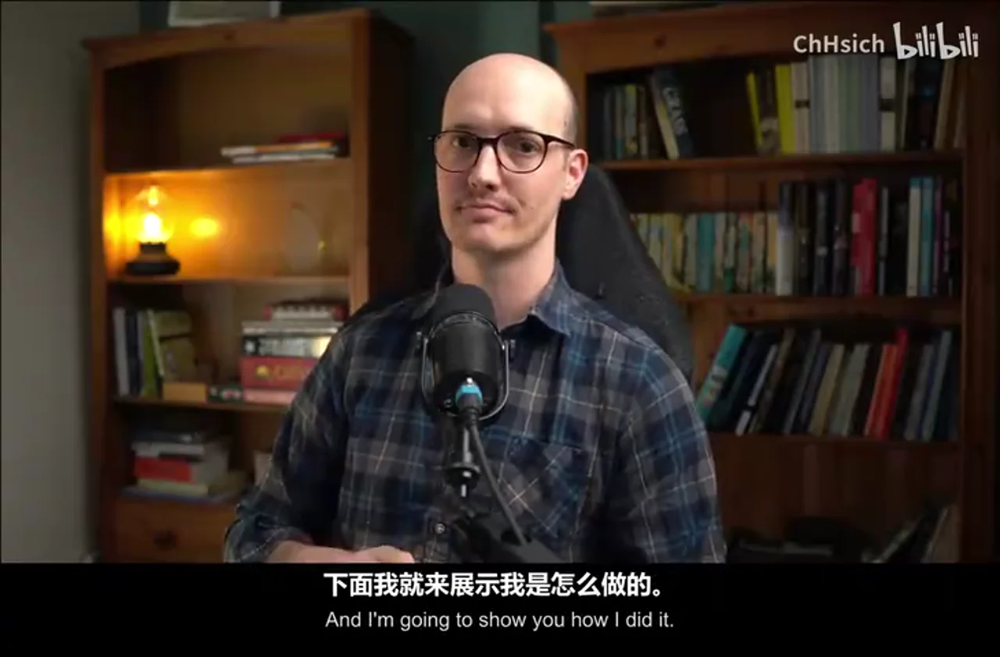
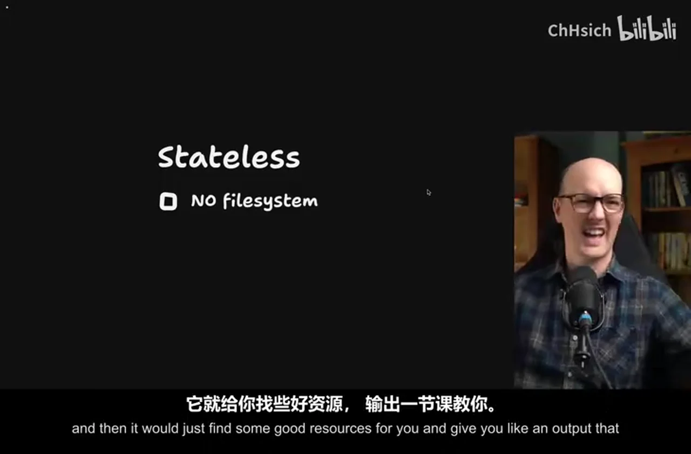
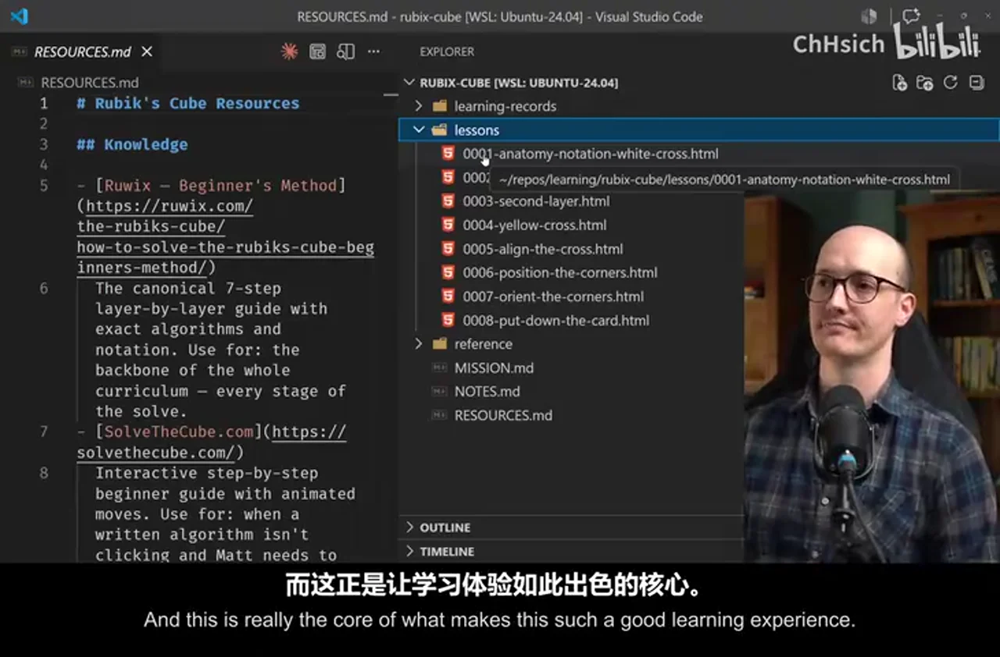
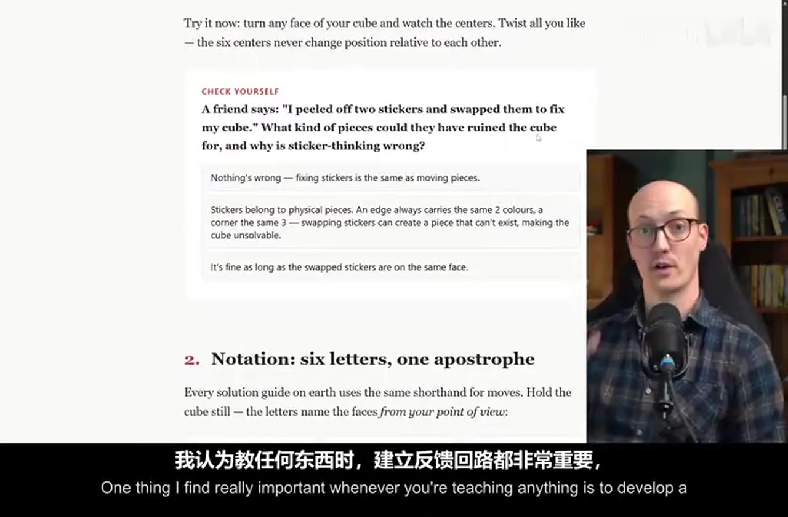
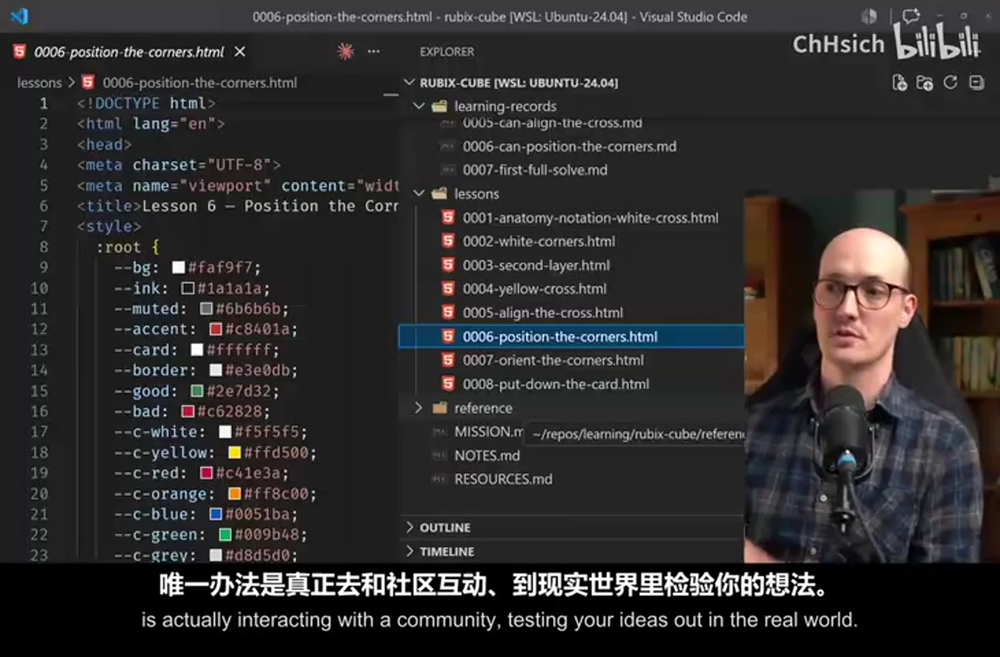
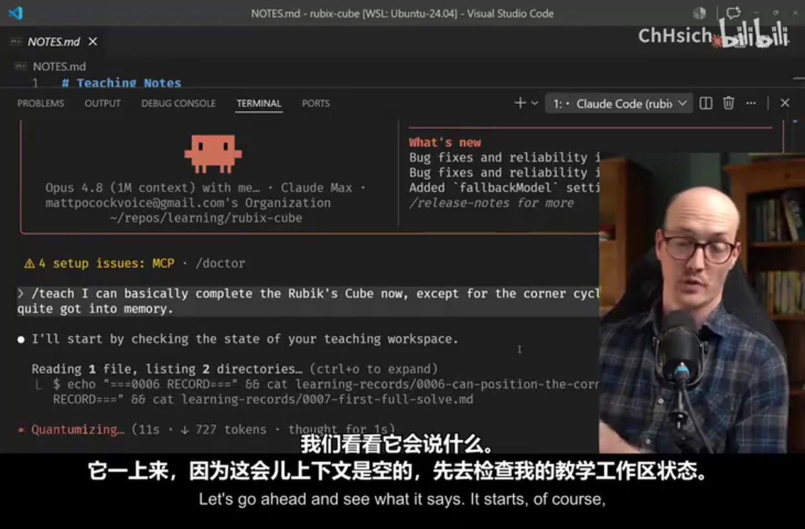
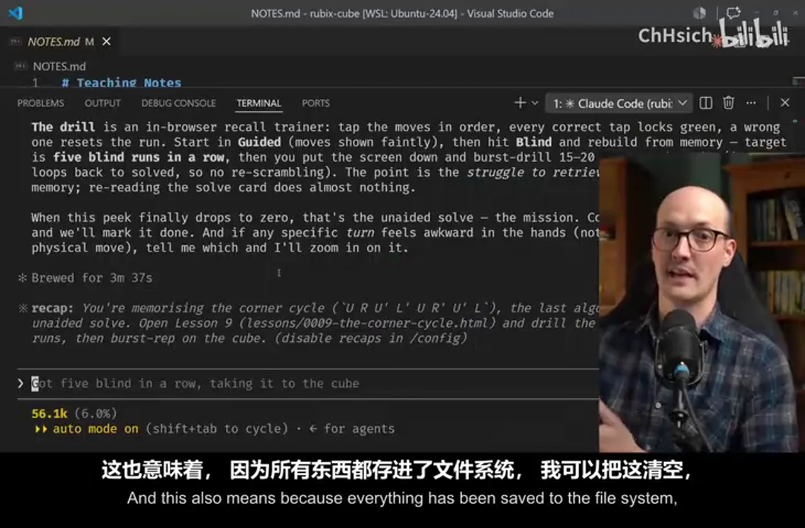
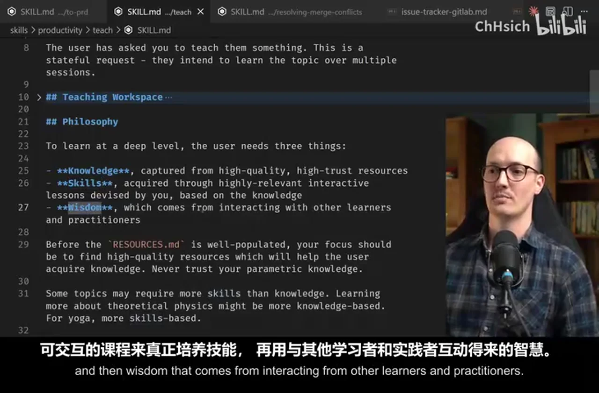
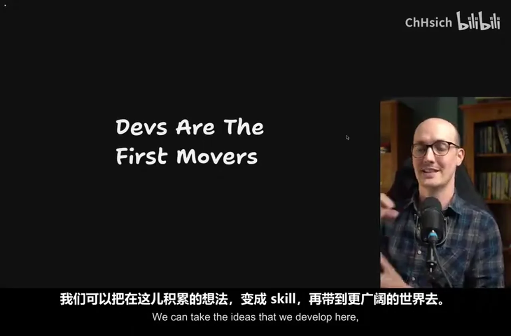
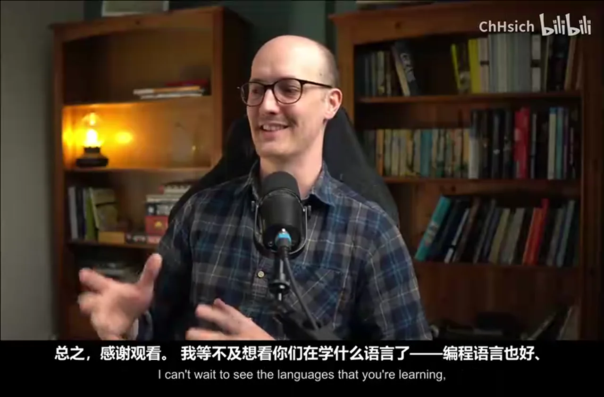

# 总结稿

暂无总结。

# 辅助理解

# Data

## 原始转写稿

[00:00] I realized the other day I've been teaching stuff for ten years.
[00:03] I was a voice coach for six years and I've been doing this job teaching devs for four years.
[00:07] And for a while I've been thinking wouldn't it be great if I could take everything I know about teaching and put it inside a skill so that anyone could learn anything.
[00:16] I had a long bus ride to London the other day and I wrote a teach skill and it turns out that it's pretty good.
[00:22] It taught me how to solve a Rubik's Cube, which is something I've always wanted to learn how to do.
[00:28] But I never really had the time or inclination to do it.
[00:31] But with this teach skill it felt like I had a real teacher who was teaching how I liked to be taught and was totally aligned with my mission.
[00:38] And I'm gonna show you how I did it.
[00:39] The key concept when we're looking at a teach skill is some skills can be stateful and some skills can be stateless.
[00:46] If a skill is stateless it means that it doesn't retain any state from previous runs.
[00:51] It doesn't have any memory of the things that you've done before.
[00:53] In other words, a stateless skill doesn't save anything on the file system to help it pick up where it left off later.
[00:59] Whereas stateful skills do do that.
[01:01] They save things either to the local file system or they save things to MCP servers.
[01:06] They keep notes that they later track.
[01:08] Initially I was thinking about teach as a kind of stateless skill where you would just say teach me this thing
[01:14] and then it would just find some good resources for you and give you like an output that would teach you a lesson about that thing.
[01:21] But I realized that all the good teaching that I do is stateful.
[01:24] Where I teach you,I being the teacher,I remember where you've got to.
[01:28] I know what you've learned.I know what you can go to next.
[01:32] And I've got a bunch of great resources that I remember from previous times that I've taught this thing to teach you about it.
[01:38] So I decided that teach had to be a stateful skill.
[01:41] As an example,if you've used my skills repo before,you know that grill me is totally stateless.
[01:46] It just grills you about a topic until you're ready to implement.
[01:50] But then grill with docs is actually stateful.
[01:53] In other words,it saves some local ADRs,architectural decision records.
[01:58] It saves some other staff,some glossaries to the repo as well.
[02:02] And so grill with docs is stateful and it gets better over time.
[02:05] Whereas grill me is totally stateless.
[02:08] Now one of these is not better than the other.
[02:10] They're just useful in different situations.
[02:12] And so when you're designing skills,you need to be careful to think about whether they need to be stateless or stateful.
[02:18] And teach needed to be stateful.
[02:20] The way you install this skill is you go to my skills repo map,you go down to this quick start here
[02:26] and you just run the skills.sh installer and you choose the teach skill.
[02:30] Once you do that,you go to an empty directory and you run teach inside your coding agent.
[02:35] So for instance,in this directory,which is my Rubik's cube directory,I said teach me how to solve a Rubik's cube.
[02:41] And you'll notice during my journey how many files it has created here.
[02:45] But the first one it created was the mission.
[02:47] I believe that for a teacher to be effective,you need to understand why a student wants to learn the thing.
[02:53] And so I got this skill to create a mission for you.
[02:57] Here it says map wants to be able to take a scramble 3x3 Rubik's cube and solve it unaided at least once.
[03:02] The goal is the achievement itself,not speed,not theory.
[03:05] The next thing it does is it creates a set of resources.
[03:08] So it goes and searches the web for actual primary source,high trust resources that it's going to use to create the lessons out of.
[03:16] It does this on the first pass when you ask it to teach you something,and then it will continue to update these as you go.
[03:22] And then it will create your first lesson for you,and lessons are stored in the lessons folder,and they're numbered like this,and they're all individual HTML files.
[03:30] HTML is just so much richer than Markdown,it allows it to be so much more expressive,so much more interactive,and this is really the core of what makes this such a good learning experience.
[03:40] And here is my first lesson,anatomy notation and the white cross.
[03:44] And it basically teaches you just what you need to know at that moment.
[03:49] It gives you diagrams,it gives you very simple explainers,it gives you call-outs,and it gives you quizzes too.
[03:55] One thing I find really important whenever you're teaching anything is to develop a feedback loop,and quizzes are okay at this.
[04:02] They're basically good if you can't find any richer feedback loop.
[04:05] Again,if we zoom down this,we've got notations,we've got traps,we've got your first skill here.
[04:11] And so it's giving me the knowledge that I need,but also encouraging me to develop the skills I need,which is slightly different,and the skill itself knows that.
[04:20] Once I completed the lesson and I said yes,I can make the white cross,then it recommended that,or rather recorded that,inside a learning record here.
[04:29] And these learning records are very simple records that the agent creates when I report how I'm doing.
[04:36] So this allows it to keep track of how I'm doing,just like a real teacher,then tailor the next lesson to what I need.
[04:42] Here's another explainer from slightly further down this course.I suppose it's kind of creating a course as we go based on what I need.
[04:50] So this one here,it was,okay,it started to add like little citations now.
[04:55] Again,more quizzes.I mean,I just find this layout really nice to look at and really useful.
[05:00] I was sort of working on the skill as I was building this too,and so I added this little bottom,or thing at the bottom.
[05:06] It says,it tries to find communities where you can ask questions here.
[05:11] Because sure,you can develop knowledge and skills here,but the only way you're going to be develop wisdom about the thing is actually interacting with a community,testing your ideas out in the real world.
[05:22] It also develops reference material for you too.This was something I noticed that I needed.
[05:26] So there's a glossary.This glossary has the anatomy,it has the notation here,it has the solving grip,the daisy,sort of anything like weird jargon that we've learned is going to go into the glossary.
[05:38] This is really useful,especially if you're learning like a coding language using this.
[05:41] It also means that future lessons can be more concise,because they're able to reference the term in the glossary,and you can look back if you're confused.
[05:49] It also creates cheat sheets for you.So this is a solve card here,where it's basically just giving me the entire solve.
[05:55] If I want just a single place to look at how to create or solve a Rubik's Cube,this is the place I can go.
[06:01] And finally,just to explain this notes.md file,this is where the agent can note down any of my preferences,note down any watch outs,and it's just kind of internal note taking for the agent itself.
[06:12] So let's imagine that I sit down to a session,and I basically want to fill in the teacher on what I've been doing since I last had a session.
[06:19] So I just say "Teach",and I can basically complete the Rubik's Cube now,except for the corner cycle,which I've still not quite got into memory.
[06:29] Let's go ahead and see what it says.It starts,of course,because this is an empty context by checking the state of my teaching workspace.
[06:36] It's checking all of the solve cards,seeing how far I've got to.It's now giving me a decent diagnosis for what I'm feeling.
[06:43] It's saying the concept is solid for the corner cycle,which is a particular algorithm,but it's the one that hasn't reached muscle memory.
[06:50] Let me look at the existing memorization lesson,one earlier lesson to match the house style.
[06:54] So we've turned the agent basically into a teacher,and you've got to work with it in the same way that you would any one-to-one teacher.
[07:01] You tell it what problems you're having,and it will design lessons to find solutions.
[07:06] Using here is opus 4.8 with medium effort,by the way.It's also using a key teaching term here,the zone of proximal development,one algorithm,pure muscle memory work.
[07:16] The zone of proximal development is this key teaching idea,which I am obsessed with,and it's the idea that you should always teach someone in the area where they are perfectly challenged,but not intimidated.
[07:27] This means that every lesson has to be concise,compact,and exactly framed at that zone of proximal development,so the students not bored,but also not freaked out.
[07:36] So we can see it's now created this lesson,the corner cycle lesson.And it's created this exact lesson for us.So it's basically just breaking it down,paying more attention to it.
[07:46] Giving me new mental models.One,four,move,phrase played twice.Okay,that is handy.And the idea is I would walk through this lesson.Oh,look at this.Oh my gosh,look at this.
[07:56] So it's actually given me an interactive tap thing,I can do it.Okay,so it's U,R,U',L',U,R',U',L.Oh my god,look at this.So it's got guided mode,so I can turn off that.Oh,that's unreasonably cool.
[08:13] You see what being in HTML gives us here,right?We've got the full power of the browser to mess about with here.So you get the idea of what these lessons look like.They are short,they are really focused,and it gives me exactly what to practice now.
[08:25] And this also means because everything has been saved to the file system,I can clear this,and every time I run teach again,it will have all the context it needs to keep me in the zone of proximal development.
[08:36] Let's briefly look at the skill itself here.It's really quite simple,although it is one of the longer skills that I've put together.The user has asked you to teach them something.This is a stateful request.
[08:46] They intend to learn the topic over multiple sessions.It goes into the shape of the teaching workspace,which we've looked at already,and it has a sectional philosophy here.So I really define the terms that the AI should think in.
[08:58] It should think in terms of giving them knowledge from high quality,high trust resources,skills,highly relevant interactive lessons,and actually developing the skills,and then wisdom that comes from interacting from other learners and practitioners.
[09:11] We go further down here,and we touch on the shape of the lessons themselves.We've talked about the mission as well,mission.md,the zone of proximal development,acquiring knowledge and skills,how to do that,acquiring wisdom,which basically when the learner is ready to go out into the world once they've got the knowledge and skills,how do you delegate them to the community.
[09:30] When the user asks a question that appears to require wisdom,your default posture should be to attempt to answer,but to ultimately delegate to a community.
[09:37] My idea with this teach skill is not to have you hooked onto the agent for learning everything,it's to actually give you the skills you need to feel confident to go out and work with a community and send you out into the world.That's the dream of this stuff.
[09:51] We've also got more material here on reference documents than finally on notes.md,but that really is the skill.There's a few little bits of supporting documents for like learning record format,the mission format,the resources format,etc.
[10:03] In terms of engineering,I can imagine this skill being really useful in onboarding people to a codebase.
[10:09] Grading documentation is a real pain in the ass,because not only do you need to keep it up to date,but that documentation is probably outside the person's zone of proximal development.
[10:18] They might have worked with your stack before,they might just need to know the specific problem domain,or they might have worked with the problem domain before,but they have no idea what type script is or things like that.
[10:30] So you can think of teach here as,you know,you start them off in their own workspace,you point them at the codebase,you teach them how to,you know,they learn independently how to work with the code,what the concepts are,and guess what,you've got a productive employee in record time.
[10:43] For me,I'm excited to use this just on my side projects,on having fun,on just learning stuff that I wouldn't have learned how to do before,you know,solving this frigging Rubik's Cube.
[10:52] I might even dig out a bit of old chess material and see if it can teach me some openings.
[10:56] And I wanted to end here by talking about an idea that I've had for a while,but I think this teach skill really proves or rather makes very plain to me,which is that we,the developer community,engineers out there,are the first people to really experience what AI can do on something that it's really good at.
[11:16] AI is currently better at writing code than it is at almost anything else.
[11:20] There are a few exceptions,but really AI is very good at writing code,and developers have an advantage that we're the first people to really get to test AI out on a problem where it's very good at it.
[11:32] This means that we are the first people really in the world,you know,with a couple of exceptions,that get to know AI,that get to build these cool things,and it means that we're the first movers in this new space.We can take the ideas that we develop here,turn them into skills,and start bringing them out to the world.
[11:51] I think that's incredibly exciting,and it's something that I'm going to be exploring more,and this teach skill is kind of the first phase of that.
[11:58] So when you're working with claw code or codex,and you're struggling with it,and you're losing motivation,you think God,this sucks,just think that you'll be able to take the skills that you are learning now,the instincts that you're building,working with AI,and take them outside of coding domains.
[12:13] That I think is going to be an incredibly valuable skill,no matter what the future of work looks like.We're all going to be working with AI,and we are the first people to really get to do it.
[12:24] Now,if you're digging my skills,then you should go to AI hero/skills,and sign up for my newsletter,that lets you know whenever I release a new skill,whenever I have any changes,because I do change the skills all the time.
[12:36] If you want up-to-date information on how to use my skills for engineering,and for other stuff too,then check it out.
[12:42] But overall,thanks for watching.I can't wait to see the languages that you're learning,coding languages,or human languages,the new skills that you're developing.
[12:49] I'm going to get this thing to teach me vocal harmonies,as well as always,a skill that I've wanted to know,but never been very good at,and I just can't wait to get using this thing myself,and seeing how you're using it too.
[13:00] But overall,thanks so much for watching,and I'll see you very soon.

## 原始关键帧

### 关键帧 1

### 关键帧 2

### 关键帧 3

### 关键帧 4

### 关键帧 5

### 关键帧 6

### 关键帧 7

### 关键帧 8

### 关键帧 9

### 关键帧 10

