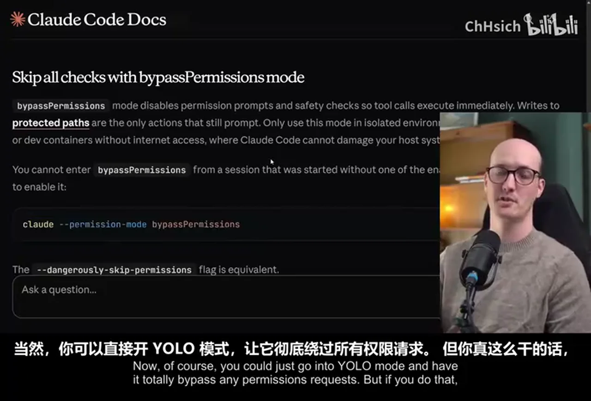
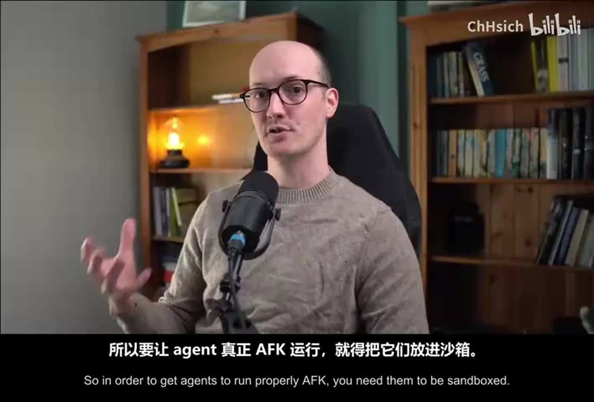
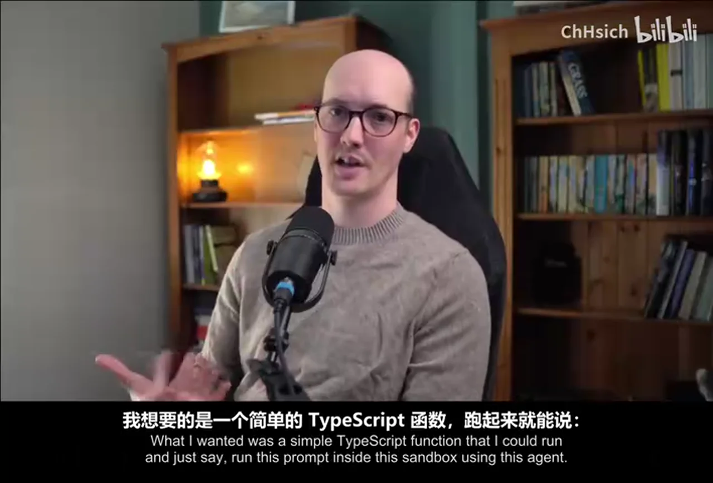
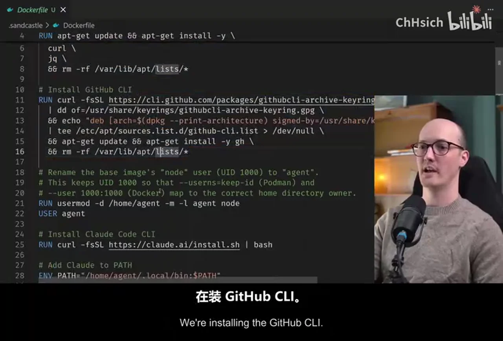
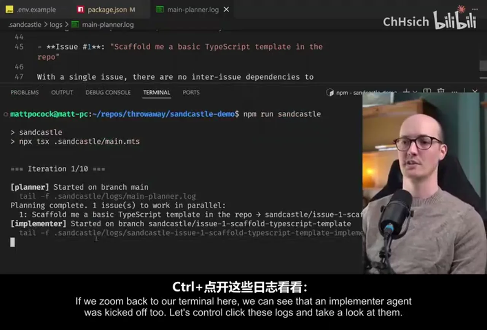
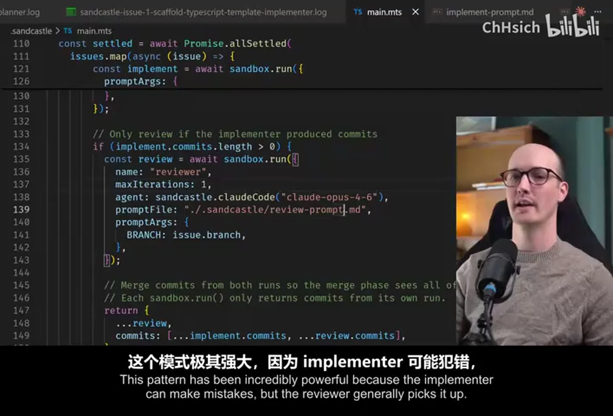
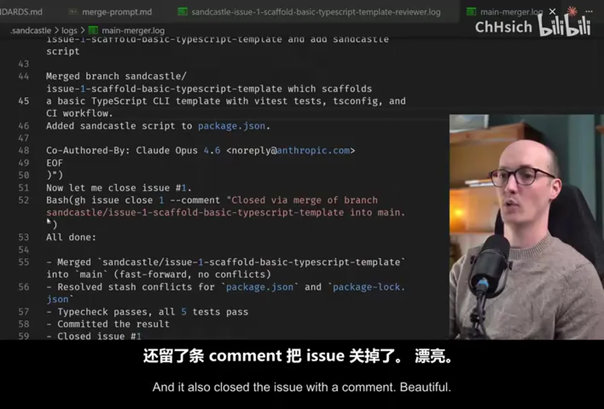
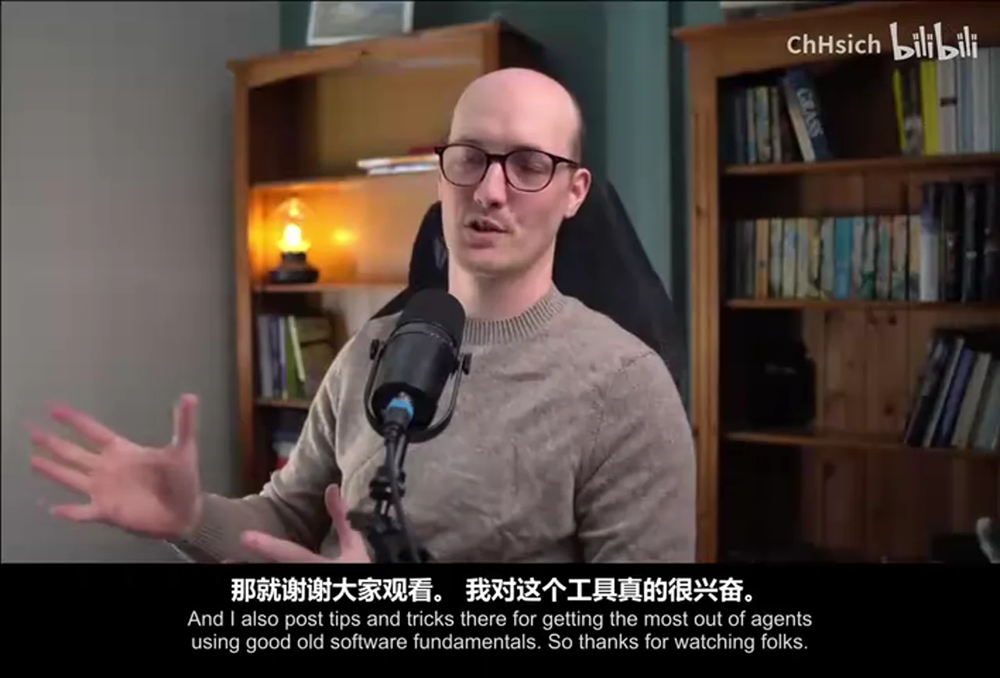

# 总结稿

暂无总结。

# 辅助理解

# Data

## 原始转写稿

[00:00] 我的目標是,在過去6個月,我試過找我的執行者
[00:03] 我的執行者們,為全AFK延續
[00:06] 這些AFK執行者們,為全AFK延續
[00:07] 為全AFK延續,為全AFK延續
[00:08] 為全AFK延續,為全AFK延續
[00:10] 為全AFK延續,為全AFK延續
[00:11] 正常地,他們正在延續
[00:13] 正常地,他們正在延續
[00:15] 正常地,他們正在延續
[00:16] 不過,為了能夠讓他們延續
[00:18] 正常地,他們正在延續
[00:19] 他們需要延續
[00:20] 他們需要延續
[00:21] 還有一個問題,你應該有的
[00:23] 是,我能夠讓我的執行者
[00:25] 不然你就可以去YOLO模式
[00:27] 和完全供應任何供應項目
[00:30] 但如果你做到的話
[00:31] Claude會做很大的事情在你系統上
[00:33] 例如打開家庭領事領事項目
[00:38] 如果你在一個領事領事項目
[00:40] 就可能會有關你擔任的資料
[00:43] 或把你的領事項目送到一間第三個派對
[00:45] 所以在想要讓AFC領事領事領事領事領事項目
[00:48] 你必須要成為SANBOXED
[00:50] 還有很多方式的方式
[00:53] 但我並沒有特別高興過任何領事項目
[00:57] 我真的用的項目
[01:00] 並嘗試製作Docker sandboxes
[01:02] 雖然有很多問題
[01:04] 但在AFC領事項目上
[01:05] 我不會揭曉你現在
[01:07] 我想要的就是
[01:07] 一個簡單的領事項目
[01:09] 讓我能領事項目
[01:10] 然後就說
[01:11] 領事項目
[01:12] 在這個SANBOX領事項目
[01:14] 使用這個領事項目
[01:15] 所有的領事項目
[01:16] 都在想要送給我第三個派對
[01:19] 所以我發現
[01:20] 我必須要建立一個領事項目
[01:21] 那個領事項目是SANcastle
[01:23] 一個領事項目
[01:24] 用AICoding的領事項目
[01:26] 進行解鎖
[01:27] 你可以使用這個領事項目
[01:31] 讓你領事項目
[01:32] 把領事項目
[01:34] 把SANBOX領事項目
[01:35] 把領事項目領事項目
[01:36] 如果你有任何的領事項目
[01:39] 你會看到這個領事項目
[01:41] 或Docker sandboxle的領事項目
[01:43] 有一個主領事項目
[01:45] 這個領事項目
[01:46] 是Docker sandboxle.run的領事項目
[01:49] 這個領事項目
[01:50] 你可以建立一個領事項目
[01:53] 你可以建立項目
[01:54] 把領事項目的項目
[01:56] 將領事項目擺在一旁
[01:57] 你可以建立項目
[01:58] 把領事項目的項目
[02:00] 將領事項目擺在一旁
[02:01] 我真的很喜歡使用這個項目
[02:05] 現在我覺得是時間
[02:06] 拍攝一段影片
[02:07] 讓我示範一下
[02:07] 這個領事項目的領事項目
[02:09] 我們先用NPM install AI Hero
[02:11] SANcastle
[02:12] 當做了這個領事項目
[02:12] 我們可以用NPX
[02:13] SANcastleinit
[02:15] 你會想要選擇領事項目
[02:16] 先選擇Claw Code
[02:18] 為何不
[02:18] 你可以選擇
[02:19] 我們先選擇SANbox的領事項目
[02:20] 讓我們選擇領事項目
[02:22] 我的計劃在未來
[02:22] 是更多更多領事項目
[02:25] 而且你也可以選擇
[02:26] 自己的領事項目
[02:27] 現在我們先選擇Docker
[02:29] SANcastle也會使用
[02:30] Backlog Manager
[02:31] 因為AFK agents
[02:32] 需要某些方式
[02:34] 選擇領事項目
[02:35] 然後知道什麼要做
[02:36] 我最擔心的方式
[02:37] 是GitHub issues
[02:39] 我們現在也有5個領事項目
[02:41] 我們現在有5個領事項目
[02:41] 可能有更多領事項目
[02:43] 在時間你做這個領事項目
[02:44] 我們其實來採訪
[02:45] 我們來採訪
[02:46] 我們來採訪的領事項目
[02:49] 然後我們選擇GitHub issues
[02:50] 我們會創造
[02:51] SANcastle Github Label
[02:53] 領事項目會設定
[02:54] 領事項目這項目
[02:55] 這項目的主要是
[02:56] SANcastle Label
[02:57] 在領事項目的領事項目
[02:59] 會選擇領事項目
[03:00] 我們可以看到
[03:02] 某些領事項目
[03:03] 在SANcastle的領事項目
[03:06] 就在這個領事項目上
[03:07] 現在要知道的問題
[03:08] 是這個Docker file
[03:10] 這個領事項目
[03:11] 是Docker container
[03:12] 或是領事項目
[03:13] 來設定Docker container
[03:15] 我們會使用的
[03:16] SANcastle的領事項目
[03:17] 在這個Docker container
[03:19] 這項目的主要是
[03:19] 我們可以設定
[03:20] 任何領事項目
[03:21] 我們設定了
[03:22] 一些重要的領事項目
[03:23] 我們設定了GitHub CLI
[03:25] 我們做了一些設定
[03:27] 來承認領事項目的領事項目
[03:30] 我們設定了
[03:31] 領事項目的領事項目
[03:31] 然後我們就準備好了
[03:33] 所以我們來建立
[03:35] 這個領事項目的領事項目
[03:36] 那領事項目很快
[03:37] 然後它現在完成了
[03:39] 接下來我們要設定
[03:40] 領事項目的領事項目
[03:42] 領事項目/.env
[03:44] 我們設定了領事項目的項目
[03:46] 我們設定了領事項目的項目
[03:48] 領事項目/.env
[03:50] 我們可以看到
[03:51] 領事項目的領事項目
[03:52] 還有領事項目的項目
[03:54] 如果你想使用
[03:55] Claude的領事項目
[03:56] 不論領事項目
[03:57] 你可以去這個領事項目
[03:58] 那會告訴你 more about it
[04:00] 如果你不知道
[04:01] 領事項目
[04:01] 是有點噁心
[04:03] 使用領事項目的項目
[04:04] 這些項目的項目
[04:05] 所以有些領事項目的領事項目
[04:07] 我對這些領事項目
[04:09] 和一些領事項目的領事項目
[04:11] once that's done I'm going to go into my source control
[04:14] I'm going to commit this code
[04:15] and I'm going to push it up
[04:16] because I'm going to show you how we can use
[04:19] get hub issues to schedule some work
[04:22] for this agent that we've created
[04:23] so let's go to our repo and create a new issue
[04:26] let's say
[04:27] scaffled me a basic typescript template in the repo
[04:29] give me a basic typescript application
[04:31] that uses vtest
[04:33] that uses type checking
[04:34] that has a very very simple CLI
[04:37] that I can call
[04:38] use commander for the CLI
[04:40] scrypt that does type checking
[04:41] and runs the tests
[04:42] so now I'm going to create that issue
[04:44] and we can now run our agent to see what happens
[04:47] so after that it should be ready to be picked up
[04:49] first I'm going to add this little piece of code
[04:52] to my package.json here
[04:54] which is just going to allow me to run a script here
[04:57] so let's say scripts
[04:58] and then add this sankastle script here
[05:00] this is just going to run npxtsx
[05:03] and tsx is just a way
[05:04] that you can run typescript as a script
[05:07] and it's going to run this file
[05:08] .sankastle/main.mts
[05:10] so let's actually go ahead
[05:11] and run this
[05:12] and see what happens
[05:14] we can see immediately
[05:15] that it's kicked off a planner agent here
[05:17] and we can control click these logs
[05:18] to see what it's up to
[05:20] we can see that it's successfully set up the sandbox
[05:22] it's the planner agent running on docker
[05:25] and it's looking at the open issues here
[05:27] and it sees that there's only one open issue
[05:29] it then spits out this plan here
[05:31] which is a set of issues
[05:33] which are going to be worked on
[05:34] finally at the bottom here
[05:35] it shows the amount of context window
[05:36] that it used
[05:37] if we zoom back to our terminal here
[05:39] we can see that an implementer agent
[05:41] was kicked off too
[05:42] let's control click these logs
[05:43] and take a look at them
[05:45] and we can see that it called
[05:46] githubissuevue1
[05:48] it has a clear picture
[05:49] and it asked for a basic typescript script
[05:51] outvtest for testing type checking
[05:53] simple cli using commander
[05:55] great
[05:55] we can see that it's running bash commands
[05:57] inside here
[05:58] it's doing good dependencies installed
[06:01] and I've even got it prompted
[06:02] so it's doing a little bit of
[06:03] redgreen refactor here
[06:04] where it's writing the test first
[06:06] vtest run etc
[06:07] we can see it all happening
[06:08] it's now moved on a little bit further
[06:10] and we can sit and watch this
[06:11] if we want to
[06:12] or we can go and have a cup of tea
[06:14] we can relax
[06:15] and this will just do its work without us
[06:18] so while this is running
[06:19] why don't we go and have a look
[06:20] at the main.mts file here
[06:22] we can see the planner
[06:23] that we saw earlier
[06:24] is just down here
[06:25] where we have a
[06:25] sangcastle.run command
[06:27] that takes in a name of planner
[06:29] it takes in an agent here
[06:31] so we can just change this
[06:32] if we want to
[06:33] if we want to do
[06:33] planning with codex
[06:35] let's say instead of cloud code
[06:37] we totally can
[06:37] and it's also using this
[06:39] prompt file here
[06:40] so plan prompt in here
[06:42] this is scaffolded by the template
[06:43] and you can totally edit this
[06:44] as much as you want to
[06:46] to run anything inside a sandbox
[06:48] this one is taking all of the open issues
[06:50] from the repo
[06:51] that have the label sandcastle
[06:53] it's grabbing all of the labels
[06:54] all the comments
[06:55] grabbing all of the comments body as well
[06:57] and then it's working out
[06:57] which ones can be done right now
[07:00] so it's only looking for
[07:01] unblocked issues here
[07:03] and finally we tell it to output its plan
[07:05] in adjacent object
[07:06] wrapped in plan tags
[07:07] if we go back to main.mts
[07:08] we can see that this
[07:09] then gets picked up here
[07:11] we then grab the JSON
[07:12] out of the plan here
[07:13] and figure out the issues
[07:14] and then for each of the issues
[07:16] we run a
[07:18] separate sandbox here
[07:19] we run an implementer
[07:20] and this one has an implement prompt
[07:22] that's just inside here
[07:23] so implement prompt
[07:25] this one takes in some prompt arguments here
[07:27] so it takes in an issue title
[07:29] it takes in the task ID
[07:30] which is the issue ID
[07:31] then it says you're going to be working
[07:32] on a specific branch
[07:34] again all of this is just a setup
[07:37] that I cooked up
[07:38] really this is not
[07:39] sancastle giving you
[07:40] any kind of prescription
[07:41] on how you want to run it
[07:43] this is just a really cool workflow
[07:44] that I tend to use in my repos
[07:46] so I figured it belonged in a template
[07:48] if we zoom back to main.mts
[07:49] we can see that the result
[07:51] here is captured in a variable
[07:53] and if there are more than one
[07:54] commits here
[07:55] we then run a reviewer
[07:57] this pattern has been
[07:58] incredibly powerful
[08:00] because the implementer
[08:01] can make mistakes
[08:01] but the reviewer
[08:02] generally picks it up
[08:03] and of course
[08:04] if you want to do an adversarial review
[08:06] where you have one agent
[08:07] run another
[08:08] or review another agent's code
[08:10] then you can just do
[08:11] sancastle.codex
[08:12] if you want to have multiple different agents
[08:15] spawn at the same time
[08:16] come up with an implementation
[08:17] and then some other reviewer
[08:18] takes all of those branches
[08:20] chooses the best one
[08:21] or makes a
[08:22] like a mix of them
[08:23] you can
[08:23] that's the power of having
[08:24] a totally agnostic setup
[08:26] to what agent you're running
[08:27] that's the power of using your
[08:29] or owning your own process
[08:30] anyway let's take a look
[08:31] at the review prompt here
[08:33] it's worth noting this little
[08:34] syntax here
[08:35] because this is really nice
[08:36] this is something I copied
[08:37] fromclawedskills
[08:39] where if you specify
[08:40] an exclamation mark
[08:41] before a bunch of
[08:42] backticks here
[08:43] it will run this
[08:44] when it's resolving
[08:45] the prompt
[08:46] and so it will actually
[08:47] execute
[08:47] git diff source branch
[08:49] branch here
[08:49] this review prompt
[08:50] just uses a very basic process
[08:52] understands the change
[08:53] analyse it for improvements
[08:54] check correctness
[08:55] maintain balance
[08:56] and crucially it's a great step
[08:58] for like adding
[08:59] your own project standards
[09:00] so for instance I've added
[09:01] this coding standards
[09:02] in here
[09:03] that you can fill in
[09:04] with any project standards
[09:05] that you want to be added
[09:06] let's look back
[09:07] at main.mts
[09:08] and we can see what happens
[09:09] after all of these
[09:10] branches get created
[09:11] we can see that they then
[09:12] get passed into
[09:14] a merger agent
[09:15] down the bottom
[09:16] and this one takes
[09:16] all of the branches
[09:17] takes all of the resulting
[09:18] issues
[09:18] so it understands
[09:19] the changes
[09:20] that were made
[09:20] and then merges them
[09:21] back to the main branch
[09:23] the reason we use
[09:23] an agent for this
[09:24] is that there might be
[09:25] merge conflict
[09:26] between them
[09:26] and I usually like to have
[09:27] a really powerful agent
[09:29] handling those merge conflicts
[09:30] for me
[09:31] because they can sometimes
[09:31] be pretty gnarly
[09:32] and so at the end of
[09:33] this we have had
[09:34] multiple agents
[09:35] running at the same time
[09:36] all committing to
[09:37] their branches
[09:38] and then we get
[09:39] a like a senior
[09:40] merger developer
[09:41] to pull them back
[09:42] into main
[09:42] just this setup
[09:43] has massively
[09:44] increased my velocity
[09:45] and it works
[09:45] superduper well
[09:46] and again
[09:47] san castle is not
[09:48] opinionated here
[09:48] if you wanted to
[09:49] make these
[09:50] into PR branches
[09:51] you totally could
[09:52] ok let's go and check
[09:53] in with our
[09:53] running process
[09:54] and let's see
[09:54] what happened
[09:55] all right
[09:56] we can see
[09:57] that we had
[09:57] an implementer
[09:58] kickoff here
[09:59] then a reviewer
[10:00] let's check the logs
[10:01] for the reviewer
[10:02] we can see that it found
[10:02] that the code was
[10:03] already clean
[10:04] and well structured
[10:05] minimal
[10:05] scaffle template
[10:06] naming is clear
[10:07] then let's see
[10:07] what happened
[10:08] in the merge
[10:09] so we can just
[10:10] pull up the
[10:10] merger here
[10:11] and the merger
[10:12] ran the type checks
[10:14] it merged
[10:14] in the branch
[10:16] and it also
[10:16] closed the issue
[10:17] with a comment
[10:18] beautiful
[10:19] we can see too
[10:19] that if we go
[10:20] and have a look
[10:20] at the rest
[10:21] of our code base here
[10:22] whoa
[10:23] we now have
[10:23] a bit more code
[10:24] going on
[10:24] we have
[10:25] a tsconfig.json
[10:26] we have a vtest.config.ts
[10:28] and we have
[10:28] a few files
[10:29] not going about
[10:29] inside the CLI here
[10:31] so you can start
[10:31] to see
[10:32] how
[10:32] sandcastle
[10:33] is working here
[10:34] you can build
[10:34] these relatively
[10:35] complicated flows
[10:36] using a
[10:36] simple primitive
[10:37] using really
[10:38] nice
[10:38] ergonomic
[10:39] markdown prompts
[10:40] you can get
[10:40] it to run
[10:41] on different branches
[10:42] and just
[10:42] merge
[10:43] that back into main
[10:44] or you can
[10:44] get it to do
[10:45] really nice
[10:45] pr flows
[10:46] as well
[10:47] you know
[10:47] it's just
[10:48] code
[10:48] it is a
[10:48] programmatic way
[10:50] to run
[10:50] clord code
[10:51] to run
[10:52] codex
[10:52] and to build
[10:53] these workflows
[10:54] that turn
[10:54] into these
[10:55] mini
[10:55] software
[10:56] factories
[10:57] I've been
[10:57] incredibly
[10:58] happy with it
[10:59] and I'm
[10:59] really excited
[10:59] to see
[11:00] what you build
[11:00] with it too
[11:01] if you're thinking
[11:01] about
[11:01] these hard
[11:02] problems
[11:02] too
[11:03] then you should
[11:03] check out
[11:03] my newsletter
[11:04] for AI
[11:05] skills
[11:05] for real
[11:05] engineers
[11:06] these follow
[11:06] the skills
[11:07] repo
[11:07] that went
[11:08] absolutely
[11:08] viral
[11:09] a few days
[11:09] go
[11:10] and I also
[11:10] post tips
[11:10] and tricks
[11:11] there
[11:11] for getting
[11:11] the most
[11:12] out
[11:12] of agents
[11:13] using
[11:14] good old
[11:14] software
[11:14] fundamentals
[11:15] so thanks
[11:15] for watching
[11:15] folks
[11:16] I'm really
[11:16] excited
[11:16] about this tool
[11:17] I think
[11:17] it's gonna
[11:18] be
[11:18] a
[11:18] really
[11:19] nice contribution
[11:19] to the ecosystem
[11:20] and I've
[11:21] been loving
[11:21] using it
[11:22] so
[11:22] nice work
[11:23] and I'll
[11:23] see you
[11:23] in the next one.

## 原始关键帧

### 关键帧 1

### 关键帧 2

### 关键帧 3

### 关键帧 4

### 关键帧 5

### 关键帧 6

### 关键帧 7

### 关键帧 8

### 关键帧 9

### 关键帧 10

