# 总结

## 核心摘要

这场直播不是“两个小时把产品做完”，而是一次从模糊想法到可实施问题边界的现场演示。Matt Pocock 最终暂称项目为 **SlopWatch**：一个面向 coding agent 的可观测性工具。它希望让个人或团队看见会话质量、token 与上下文消耗、所用模型、工具调用和子代理活动，并能把这些线索带回到“怎样让团队更好地使用 Agent”的工程决策上。

最值得学习的不是 SlopWatch 这个具体产品，而是推进方式：先用 **Grill Me** 把“谁在用、要做什么决策、哪些风险不能回避”问出来，再对异构 Agent 做并行研究，把有效信息沉淀成研究文档，随后用领域语言约束数据模型与界面语义，最后只把足够成熟的假设带进实现验证。Grill Me 在这里的价值不是替人回答，而是暴露尚未被说清的分叉。{{frame:1}}

## 从问题到研究：先缩小不确定性

直播一开始的项目约束相当务实：项目要能服务日常工作、同时有前端和后端、具备足够复杂度，并且对观众有迁移价值。由此收敛到“coding-agent observability”——它不是评估某一次模型回答，而是观察真实开发会话：花了多少 token、上下文是否膨胀、模型和工具是否带来产出、失败发生在哪里。

接着，直播把几个会直接改变产品体验的分叉摆到台面上：

- 主要用户是个人开发者、经理，还是平台/DevEx 团队？三者对应不同的时间线、聚合指标与隐私风险。
- 团队审阅是否意味着可见单个会话？若是，如何处理 PII、秘密、半成品想法、知情与组织治理？
- 数据是在中央 SaaS、组织自托管环境，还是可替换的存储后端中保存？

这里的一个重要态度是：不要在蓝天阶段把多选题机械地回答成 A/B/C。问题的意义在于暴露约束；答案应随证据、产品边界和真实使用反馈逐步收敛。

## 异构 Agent 的接入：统一的是内部模型，不是外部事实

为了避免从单一工具经验推导整个生态，直播让子 Agent 并行调研 Claude Code、Codex、Pi、OpenCode、GitHub Copilot CLI 的接入面。研究带来的可靠方向是：**每个 Agent 都需要各自的 adapter；adapter 选择该 Agent 最合适的事件、扩展或持久化表面，再归一化为内部事件模型。**{{frame:2}}

这比“找一个万能 hook”更稳健。Agent 的事件名称、字段、会话存储和版本演进并不一致；产品的长期边界应放在 adapter 与内部归一化层，而不是把某一家工具的文件格式当作平台事实。这个边界也让“支持新 Agent”成为新增 adapter 的工作，而非污染核心领域模型。{{frame:5}}

可复用的工程原则是：

1. 先定义自己需要回答的观测问题，例如“某会话成本为何异常”“某个分支为何被放弃”。
2. 为每个 Agent 建立版本化 adapter，明确能获得什么、缺少什么、失败时如何降级。
3. 把外部事件转换为稳定的内部概念，再决定存储、分析和界面。
4. 对 hook、文件尾随、插件和代理层保持可替换，不让采集机制反向定义产品。

## 候选架构，而非已经落地的设计

直播中出现了不少有价值的方案，但它们属于探索或待实现验证的候选，不应写成既定架构。

- **采集方式候选**：hooks 能触发及时动作，却未必含完整会话；本地会话资料又可能适合补足历史。因此讨论逐渐从“hooks 或 JSONL 二选一”转成“按 Agent 组合最佳表面”的方向。每台开发机上的本地采集、可替换存储、是否常驻 daemon，均仍是候选取舍。{{frame:6}}
- **身份与登录候选**：完整 OIDC / 组织 IdP 集成提供规范的企业身份路径；为了尽早验证 V1，也讨论了由管理员签发、可撤销的每用户 token。后者在直播中受到偏好，但仍应视为 V1 假设，而不是已实施的安全方案。{{frame:7}}
- **部署与数据候选**：单二进制、Bun、Rust、PostgreSQL、PGLite、轮询与更实时的事件扇出都被提出。直播在结束前没有完成技术选型；它明确把“先看真实数据和可运行原型”放在抽象讨论之前。

直播末尾较为清晰的工作假设是：项目倾向自托管、组织拥有数据、本地组件负责采集、服务端负责接收/存储/仪表盘/管理能力；但实现形式、存储后端、认证方式和实时性仍应由验证来决定。

## 领域语言：让数据模型和协作开始对齐

直播后半段从功能清单转向 DDD 式的 ubiquitous language。它的目标不是“给表取漂亮名字”，而是让人、Agent、文档、代码和未来 UI 用同一组词讨论同一件事。

- **Session**：一个 coding agent 的逻辑运行，关联开发者、工作目录和 Agent 版本。
- **Turn**：一次用户消息及其完整助手响应。
- **Model Request**：Agent 在一个 Turn 中对模型提供方发出的单次请求；它不等同于 Turn。
- **子代理**：更适合建模为带 parent session 的 child session。
- **分支**：一个 Session 内的 Turn 可形成 DAG，而不是只有线性历史；被回退的路线也可能消耗了真实成本并产生过真实工件。

用“Session 内含 Turn 的 DAG、Turn 内可能有多个 Model Request”的关系，才有可能解释分支、重试、子代理成本和审阅视图。{{frame:9}} 这组 Session / Turn / Model Request 的统一语言是直播里最接近可落入实现的成果。{{frame:10}}

不过，“resume / compaction 是否仍属于同一 Session”被有意保留为未决问题。直播的正确动作不是强行指定 schema，而是先做出能展示真实数据的版本，再回到具体案例校验语言是否好用。

## 可迁移的方法：研究、压缩、再进入下一轮

直播多次主动结束或回退上下文，把有效研究写入 repo 中的 Markdown，而不是把无关命名讨论和所有聊天细节继续塞在当前窗口。这形成了一条实用节奏：

1. 研究一个关键分叉；
2. 把结论、证据、未决问题压缩为可持久化资料；
3. 用新上下文继续下一个分叉；
4. 当抽象讨论开始消耗注意力时，转向最小可见资产来验证。

它避免了两种常见失败：一是过早写 PRD，把未经验证的实现细节伪装成需求；二是在“还没有资产可检查”的阶段无休止地制定决策。研究文档记录的是当前理解和悬而未决的问题；PRD 则更接近描述目的地，两者不应混用。

## 事实核验与修正

本次事实核验共 **10 项：4 项 confirmed、5 项 partially_confirmed、1 项 outdated**。应将下列修正带入学习笔记：

- “所有 coding agent 都有事件 hook 和原生追加式 JSONL”过度概括。各工具有不同的扩展/钩子表面，但 Claude Code 与 Pi 的 JSONL 不能代表 OpenCode 或 Copilot CLI；OpenCode 的会话持久化可为 SQLite，Copilot 教程中的 `audit.jsonl` 是用户 hook 自行写入。参考：[Claude Code hooks](https://code.claude.com/docs/en/hooks)、[Pi session format](https://pi.dev/docs/latest/session-format)、[OpenCode session schema](https://github.com/anomalyco/opencode/blob/dev/packages/opencode/src/session/session.sql.ts)、[Copilot CLI hooks tutorial](https://docs.github.com/en/copilot/tutorials/copilot-cli-hooks)。
- “Claude Code hook payload 完全没有消息内容”也太绝对：某些事件含用户 prompt；若要重建完整会话，仍应读取文档化 transcript。参考：[Claude Code sessions](https://code.claude.com/docs/en/sessions)。
- “Codex hooks 在 Windows 完全不可用”已过时。当前配置参考保留 hooks 开关，并提供 Windows 相关配置；集成应检测实际版本、feature flag 和 payload，而非以 Windows 排除为前提。参考：[Codex configuration reference](https://developers.openai.com/codex/config-reference)、[Codex hooks](https://developers.openai.com/codex/hooks)。
- OIDC 建立在 OAuth 2.0 之上、CLI Device Authorization Grant 通过浏览器授权与客户端轮询的基本描述得到支持；但这是一种可选授权授予类型，并非所有 CLI 的必经方案。参考：[OpenID Connect Core](https://openid.net/specs/openid-connect-core-1_0.html)、[RFC 8628](https://datatracker.ietf.org/doc/html/rfc8628)。
- Bun 可编译 TypeScript 为 standalone binary；“单二进制”仍需针对目标平台、外部资产和原生依赖验证。参考：[Bun executables](https://bun.sh/docs/bundler/executables)。
- Claude Code 的 `xhigh` 不是所有环境的统一新默认值；Pi 的回退改写形成分支则有文档支持。参考：[Claude model configuration](https://code.claude.com/docs/en/model-config)、[Pi sessions](https://pi.dev/docs/latest/sessions)。

## 结论

这场直播真正完成的工作，是把一个“想做 Agent 仪表盘”的念头转化为一组可检验的边界：要观察什么、哪些数据不可假定、哪些术语必须统一、哪些候选必须在原型中验证。先让问题、证据和语言收敛，再让架构和代码收敛；这比一次性生成大而全的计划更能降低后续返工。

# 辅助理解

## 辅助理解：把“想法”变成可验证的工程对象

这场直播可以读成一条“降低不确定性”的链路，而不是一场架构选型会。前半段的问题是“要不要做、为谁做、为何值得做”；中段的问题是“外部系统到底提供什么数据”；后半段的问题才是“我们自己的系统应如何命名、存储和展示这些数据”。每推进一步，都应留下能被下一步检验的资产。

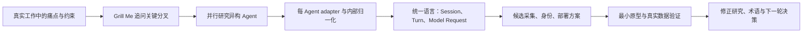

这张图的关键是箭头方向：**研究不是为了制造更多方案，而是为了减少下一步必须猜测的内容。** 因此，任何方案在未经过真实数据、安装流程、权限模型和维护成本验证前，都应保留为候选。

## 三层模型：产品目标、接入边界、领域模型

### 1. 产品目标层：要帮助谁作出什么决策

SlopWatch 的目标并非收集日志本身，而是帮助人理解 coding-agent 会话：成本为何上升、上下文为何失控、某个 Agent 或工作流是否有效、子代理和失败分支把资源花在何处。这个目标会反过来决定界面、指标、权限与隐私要求。

团队可见性不是纯技术开关：会话可能含 PII、密钥、未成熟想法和敏感业务信息。自托管、数据归属、同意/告知、脱敏、谁能审阅什么，都应作为产品约束，而不是在日志上传之后再补救。

### 2. 接入边界层：adapter 吸收外部差异

不要把任何一个 Agent 的工作方式当成平台的公共事实。比较稳健的结构是：

```text
Agent-specific source → versioned adapter → internal event model → storage / analysis / UI
```

adapter 的职责是处理 hooks、插件、文件、数据库或其他可用表面，并声明能力边界：能否实时触发、是否能得到完整消息、是否能重放历史、版本升级会破坏什么。内部模型则只保留产品真正需要的稳定语义。

这能带来两个好处：

- 新增 Agent 是新增或升级 adapter，不必让核心领域模型继承每种外部 schema 的偶然复杂度。
- 当某一采集表面不完整或变化时，产品可降级而不会伪造完整性。

### 3. 领域模型层：先把会话关系说清楚

直播里最实用的建模结果是把三个经常混淆的概念拆开：

| 概念 | 用途 | 不能混同为 |
| --- | --- | --- |
| Session | 一次逻辑性的 Agent 运行及其上下文 | 单个模型 API 请求 |
| Turn | 一个用户意图及完整助手回应 | 所有后端调用的总称 |
| Model Request | Agent 在一个 Turn 内向模型提供方发出的单次请求 | 整个 Turn |

当一个 Session 有分支时，Turn 更适合被看成 DAG 的节点。这样“被放弃的路线”仍能保留成本和工件；子代理可作为带 `parent session` 关系的 child session，而不是悄悄消失在父会话的统计中。

仍然没有收敛的问题是 resume 与 compaction。与其现在硬编码为“同一个”或“新的”，不如先保存足够的关系与标记，等真实工作流出现后再检验哪个语义最能解释 UI、统计和用户心智模型。

## 如何区分探索、候选与暂定结论

| 状态 | 直播中的例子 | 写进后续文档的方式 |
| --- | --- | --- |
| 探索 | 用不用常驻 daemon、怎样做 live spectate、后端用 Rust 还是 TypeScript | 记录问题、约束和待验证假设，不写成架构决定 |
| 候选 | hooks 加补偿式采集、管理员签发 token、OIDC/device flow、单二进制加可外置数据库 | 写明适用条件、收益、风险、验证方法和退出路径 |
| 暂定工作假设 | 自托管/组织拥有数据、按 Agent 使用 adapter、以 Session/Turn/Model Request 作为共同语言 | 写明当前理由和未决例外，允许原型推翻 |

这个区分使“敢于推进”与“不过早承诺”可以同时成立。直播中受到欢迎的 local capture、可替换存储和认证方案都仍属于候选；它们的价值在于帮助设计下一步实验，而不是替代实验。

## 可复用的实践清单

1. 写下要帮助用户作出的三到五个具体决策，再讨论数据与 dashboard。
2. 对每个外部 Agent 写一张能力卡：事件源、完整性、实时性、版本风险、隐私边界、失败降级。
3. 先把研究结果压缩为可检索文档，再开新上下文；不要让无关聊天永久占据推理空间。
4. 在实现前维护一个小型术语表，并用具体场景压力测试词义。
5. 对 resume、fork、subagent 等时间关系预留表达能力，避免只建线性日志模型。
6. 用最小原型验证安装、采集、权限与用户理解，再决定实时性、部署和企业级身份集成。
7. 把“未决”显式写出来。未决不是失败，它是阻止假设被误写成事实的护栏。

## 核验后的技术边界

事实核验结果为 **4 confirmed、5 partially_confirmed、1 outdated**。它直接改变三条设计准则：

- **不要假定统一 JSONL。** Claude Code、Pi、OpenCode 与 Copilot CLI 的扩展和持久化方式并不相同；adapter 必须按产品和版本实现。
- **不要把单一 hook 当作完整会话。** 某些 hook 含 prompt 等有效信息，但完整消息、工具调用及其结果可能需要不同持久化来源；采集前还要考虑脱敏。
- **不要让平台传闻成为兼容性策略。** 当前 Codex hooks 并非“Windows 完全不可用”；feature flag、平台路径和 payload 都应在目标版本上检测。OIDC、device flow 和 Bun 打包的基本原理成立，但各自都有部署和产品边界，不能由一句术语替代验证。

## 一句带走

当 Agent 辅助开发使写代码更快时，稀缺能力会转向：提出能改变架构的问题、保存可验证的研究、让术语与数据模型精确对齐，以及在抽象讨论失去收益时及时落到真实资产上。

# Data

## 增强转写稿

[00:00] How are we doing?
[00:02] How are we doing?
[00:04] This is a very, very rare livestream for me,
[00:07] but I
[00:09] have a bit of a gap today before I sort out my next course on Monday, and
[00:15] I've been reading a lot about DDD—
[00:18] domain-driven design. I've been thinking about retooling my skills, and I've also been thinking about this. I
[00:27] want to do more kind of
[00:30] watch-me-work long-form content, and I want a project idea that I can
[00:36] basically use as my playground for this kind of content.
[00:43] Going back to the voyeur of the Matt—you, the voyeur of the Matt, Colin.
[00:48] Hello. Hello, Mark.
[00:51] So, what I want from you guys is project ideas,
[00:55] because
[00:57] another to-do app
[00:59] could do.
[01:01] I love a to-do app. Who doesn't love a to-do app customized for your needs, you know?
[01:06] Could make it work.
[01:08] That's some cool ones here.
[01:09] These are my constraints: I want it to be useful in my everyday work.
[01:13] I want to have some kind of front-end and back-end pieces, and
[01:17] I want it to have a decent amount of complexity. I also want it ideally to be useful to the viewers as well.
[01:23] So, something AI-coding-related, I think, would be cool.
[01:26] Maybe, like, a coding-agent observability platform? Interesting.
[01:32] The horde is here.
[01:35] Yeah, we're vibe coding. Absolutely. That's what we're doing—we're vibe coding.
[01:39] I feel like we need, like, a definition of vibe coding, you know what I mean?
[01:43] See me craft my skills? Absolutely.
[01:48] Use Nuxt? Yeah, I mean, I'm not averse to using Nuxt.
[01:53] Give my opinion about Claude?
[01:56] Hmm, quite a complicated opinion about Claude, given I just taught a course on it. An e-commerce... yeah, maybe.
[02:03] Maybe, I don't know. It's not very useful for my people, though—for my squad, for you guys.
[02:10] A complete AI-coding company? A livestream chat manager? I mean, I stream so rarely.
[02:17] An app that defines vibe coding? My own simplified OpenClaw?
[02:23] See, I've never—this is going to kind of, I don't know,
[02:27] denigrate me in your eyes, maybe—but I've never used OpenClaw. I've never tried OpenClaw; never really felt the need to, actually.
[02:35] Hmm, but some kind of platform of my own, something that's useful for you guys, would be super cool.
[02:40] Also, I don't want to get in trouble with Anthropic, right? You know,
[02:44] that's a cheap joke. A codebase-skills/rules-adherence observability...
[02:49] Maybe. I think we'd sort of reach that by actually building the thing itself.
[02:54] Everlight V2. I want it to be from scratch. I want it to be greenfield.
[03:00] Coding-agent skills prompt-eval system... tasks Kanban? Yeah.
[03:05] AI-coding Kanban board kind of thing. Interesting.
[03:10] See what you people said here.
[03:12] What do people actually say?
[03:16] What's this? Using relatively newer third-party libraries...
[03:21] Agents not using library-specific skills during implementation. Yeah, maybe.
[03:28] Editing system? Hmm, I don't know. I mean, this is terrible, but I just think my own idea is the best.
[03:35] It's the best idea. I use VS Code as my code editor.
[03:39] Git alternative?
[03:42] Maybe it's kind of like—you get in the weeds of Git stuff really quickly,
[03:47] and I feel like...
[03:50] Form wizard? I don't know. I mean, these are good, like,
[03:55] interview-level tasks. You can imagine people doing these interviews and then being impressive demos.
[04:01] Bookmarks manager. Yeah, Obsidian vault integration. I want it to be pretty complex, pretty complicated.
[04:13] I don't know. This is the one, though. I mean, this is the one I'm feeling,
[04:16] because I think this is something that I notice teams need all the time: if you're
[04:22] running coding agents in your organization,
[04:25] first of all, you want to see how many tokens people are spending; you want to see whether they're having successful sessions or not.
[04:31] You want to see whether those sessions are,
[04:35] you know, productive or not, and how many tokens they're using, how much context window they're using up, what models people are using—all that stuff.
[04:43] Monorepo? Yeah, probably could be a monorepo if it gets big enough.
[04:52] An OSS SDK that can be used independently from the platform.
[04:55] Absolutely. That's what I'm thinking: you would have a version of it that was deployed and then a version of it that was local.
[05:02] What tokens am I expecting to burn here?
[05:05] I don't know. I'm on
[05:08] Anthropic 20× Max.
[05:10] Yeah, I mean, that's what I'm thinking. Ralph needs a dashboard.
[05:14] How do I recommend using my skills along with relatively newer third-party libraries?
[05:21] If you're having trouble with those third-party libraries, I would create a skill for that third-party library and then pull it in—like,
[05:29] basically create documentation for that skill
[05:33] that tells the coding agent how to use it, and then you can pull it in during the review phase.
[05:39] This is the kind of stuff that will just be really, like...
[05:43] This is, I think, why you guys want to watch me: so that you can pick up—because I feel like, actually, I'm sort of, I don't know,
[05:50] I feel like I'm,
[05:52] just based on the conversations and the questions people ask, sort of quite—I don't know—far ahead.
[05:57] It's not the right way of framing it, I think, but I have very clear,
[06:02] very clear opinions about all this stuff. I don't know if they're good opinions, but I have very clear and definite opinions.
[06:08] The cell workflows? Isn't it a coding-agent observability platform? I don't think so.
[06:13] Yeah, that's what I'm thinking. You need somewhere to gather the data for your organization.
[06:17] For a coding-agent observability platform—I'm sort of talking myself into this now—
[06:21] you need a central place for all this data, and I feel like you might want that to be a kind of pluggable storage mechanism as well.
[06:30] You know, you might want to store it on your own servers.
[06:35] There's a lot of complexity there, which I like. I've gone deeper.
[06:42] I use Opus most of the time, yeah.
[06:45] Yeah, most of the time. I'm really testing 4.7 now.
[06:51] Yeah, I think maybe I should just do it: coding-agent observability platform.
[06:57] Because, yeah, I feel like it's the missing link in the way I'm teaching as well, because I'm not observing my own sessions in the same way.
[07:05] But I should. I think a BIOS? I'm not building a BIOS. Hell no.
[07:13] Mm.
[07:15] For a new project, why not build, like, a Cody/Kent agent? I'm going to leave it to Kent, you know.
[07:19] I can't just copy Kent all the time. My whole career is basically copying Kent.
[07:23] It's just doing the Kent playbook, but worse than Kent.
[07:29] Haven't moved past agents in the IDE? Can barely control that, let alone a swarm of agents. Yeah, I mean, I
[07:34] just want to dive in, you know what I mean? I
[07:38] What do you think? I mean, is there a way I can add votes here?
[07:41] Can I add votes? I think I can.
[07:45] I feel like I can. I feel like there's a way of doing it.
[07:49] Yes, hang on. Start a poll.
[07:55] Should I build a coding-agent observability platform?
[07:58] Just did a bit of dictation. I'm just going to say yes or no.
[08:02] Start poll. I've never done this before. I've no idea if it's going to be any good.
[08:08] Thanks for Everlight. Oh, sweet. Thank you. I haven't been working on it as much as I should.
[08:14] Yeah, we need to do a Slido. I
[08:17] don't know. Can you see that poll? I'm just going to check whether I can actually see that poll.
[08:24] Go over here for a sec.
[08:28] Is there one there?
[08:32] Can you guys see a poll? Oh, yes. Okay. Yes, okay—78% for yes. That's pretty good.
[08:38] Hide my Discord DMs.
[08:40] T3 Code.
[08:44] Do I have any help? I suppose, well, I've given you really just a
[08:49] one idea I haven't sort of
[08:54] developed. Yeah, you can see it. Good.
[08:57] Claude as moderator? Woof. I don't know; when we get big enough to need mods, then we'll gather them.
[09:05] Am I into piano? Yes, I am into piano. I used to be a singing teacher. Weird question.
[09:12] You saw the poll before I saw the video of it? Really interesting.
[09:17] Interesting.
[09:21] Yeah, I mean, because there's AI observability for AI in applications, right?
[09:26] But then I feel like there's a layer missing, which is observability for
[09:31] your own coding agents. I don't know. Maybe we should probably validate this, right? Let's actually open up a terminal
[09:40] and let's just ask Claude about this.
[09:43] So, I'm just going to run Claude in my home directory.
[09:47] Yes, I trust this folder.
[09:51] Claude, I've got an idea for an application I want to build. It's an observability platform, and it's an observability platform that
[09:59] essentially is personal. So it's something that you run yourself,
[10:04] targeting
[10:06] Claude Code or whatever coding agent you're using. I imagine what we're really trying to do is just upload the session to
[10:12] somewhere shared, and then we can do
[10:17] let's have a think. I'm using Wispr Flow, by the way, as my transcription tool.
[10:28] Metrics and
[10:30] analysis, and
[10:31] maybe human feedback rating different sessions to see how they're doing, and have
[10:36] this done per user so we can see across our organization what's going on.
[10:43] And I'm going to use—let's use just a standard Grill Me for this. This is one of my skills.
[10:48] I want you to harden this into a decent idea that I can potentially build.
[10:55] The stack will be TypeScript.
[10:59] You can't talk to it. I mean, this is just me using Wispr Flow, basically.
[11:05] Yes, it's not me replacing Claude; it's just adding a layer of observability on top of it.
[11:12] Grill Me is great. Grill Me is so good. So it's loading the skill. It's okay. Here we go. Whoa.
[11:19] Jeez, boy, that's a lot of text.
[11:21] Okay, this is a good question, though. Who's the primary user? What decisions does this tool help them make?
[11:25] There's a big fork here: individual developer, engineering manager or team lead, or platform DevEx at a company.
[11:32] That's good. What's our agent ROI? What prompts, tools, and MCPs are worth the spend? Where are we bleeding tokens, costs, and adoption?
[11:38] Analytics—ha. These sound compatible, but they're not; they dictate completely different UX.
[11:44] So, good: A is a personal timeline with a deep dive into one session. Correct.
[11:49] B is cohort dashboards and comparisons, which creates surveillance anxiety.
[11:53] C is aggregate metrics and doesn't care about individuals.
[12:00] Yeah, so I suppose, what's our ideal user here? I
[12:04] have tried Caveman. Yeah, I mean, I haven't tried it properly.
[12:08] And maybe I should try Caveman. I do have a Caveman skill available. That's sort of my version of Caveman.
[12:15] Wispr Flow is fine for me. You think one individual developer, I mean...
[12:22] Let's see A first, with C* aggregates as a natural roll-up.
[12:27] See B, though—I think you do want groupings of individual developers, right?
[12:32] We think one or A? Are we choosing A?
[12:40] Yes, I think you do want a manager to be able to open and review a specific engineer's session.
[12:45] I imagine that the way these are going to work in teams is you're going to
[12:51] need to think about—
[12:54] or someone on the team is going to be responsible for making the AI better on that team and is going to be the DRI for that.
[13:01] So you need the ability to dive into someone's session, as well as to debug that session with them.
[13:07] There's also the potential for
[13:09] actually doing this live: someone's having a problem in their session right now; the engineering manager can view that and see what's going on with it. I
[13:18] really like this idea. I'm really talking myself into it. So I'm going to end the poll.
[13:24] You know, by the way, I'm not really answering the question.
[13:26] It's prompting me to think of things that I'm saying. That's something really important with Grill Me.
[13:33] No, I can't do a poll for each one of these. It's going to take forever.
[13:36] Okay, consent and visibility model: session
[13:40] sharing—opt-in per session, always-on by org policy, or developer control with redaction. Oh.
[13:45] How good are these questions, man? How good are these questions? Coding sessions often contain secrets, half-formed thoughts...
[13:52] Yeah, so PII—personally identifiable information—is going to be really important here.
[13:57] A manager watching live without a clear consent model will either get the tool banned by legal/security—absolutely, right?—
[14:03] or make developers self-censor and route real work elsewhere, killing the data quality you need. Brilliant.
[14:09] So, always-on, org-mandated, like corporate endpoint monitoring:
[14:14] simple but hostile.
[14:17] Per-session opt-in. Yeah, so you share this session. I mean,
[14:20] this is bad. You don't want per-session opt-in, because you want stats on what the devs are doing.
[14:30] When the DRI opens someone's past session, does the developer get notified? I
[14:36] don't think so. I think that's gross. I don't think so. I think what you've got to realize is that your sessions are public to the organization.
[14:44] I think the developer,
[14:47] when they're plugged into the system,
[14:50] it should be kind of
[14:52] tacitly understood that their coding sessions are public within the organization.
[14:59] Having that data is incredibly valuable to companies, and so it's important that it's
[15:04] visible to all stakeholders.
[15:08] We're grilling on the idea of an observability platform
[15:11] for agents.
[15:14] That's what we're up to. I have sort of tried Pi. I mean, I haven't really tried Pi. I need to try more.
[15:25] Hmm, where am I going here?
[15:31] I think...
[15:35] Oh, my brain's gone.
[15:37] Um.
[15:39] So I think we need to be less concerned about the privacy of the individual developer, more about the
[15:46] importance of the data that we're getting. I also think that
[15:51] we need to support on-premises data, so that the data never leaves the organization—never leaves their servers.
[15:59] Because I'm not interested in building this into a massive company. I want this to be an open-source tool that is useful everywhere.
[16:09] Something I notice people do with these grilling sessions is they just answer, like, A, B, or C, right?
[16:14] And when we're in the kind of blue-sky phase here, when we're really not sure
[16:18] what
[16:20] we're
[16:21] supposed to be working on—or what we're even building—
[16:27] it's not good to be railroaded that much. Okay, here we go.
[16:32] Q3: How do sessions get into the system? What's the ingestion mechanism?
[16:35] This decides the entire shape of the client, and it's the technical spine. Oh, I love the way it chooses really nice words like this—technical spine.
[16:44] Okay, yeah, so this is
[16:48] important, but it's sort of like an
[16:52] implementation detail.
[16:56] Tail the JSONL. Yeah, so you've got—
[16:59] my initial thought here was hooks.
[17:01] You've got Claude Code hooks: PostToolUse, Stop, SessionEnd hooks.
[17:06] So all you've got is something like this where it creates a bunch of transcripts on disk.
[17:12] You've got a little daemon that watches the directory and uploads deltas;
[17:16] it sort of works with Cursor, Codex,
[17:20] Aider—that's a random one.
[17:22] No hook config required; survives across agent restarts.
[17:27] Yes, so...
[17:33] Now this is tricky, because I don't want to commit to something super early before we understand the trade-offs.
[17:39] So I think I need to get it to do some research here.
[17:43] I'm getting high on Claude's poetry. Absolutely. I mean, wherever good ideas come from, you've got to give them credit.
[17:51] I think I'm going to do some research here. I want something that's coding-agent-agnostic
[17:55] that at least works with the top coding agents. I'm going to define the top coding agents as Claude Code,
[18:00] Codex, Pi, OpenCode, and
[18:04] GitHub Copilot CLI.
[18:08] So if we have hooks there, I want you to investigate each of those with different subagents
[18:15] to ping me back information on what they support and
[18:22] whether they support OpenTelemetry, or whether we would need some kind of proxy over them to grab all of the right information.
[18:28] I think it's inevitable that they will emit
[18:34] different schemas and different shapes, and we might just need to handle that inside the application. For instance,
[18:40] the shapes that
[18:42] Pi emitted changed very, very recently in a patch version, so
[18:49] whatever we do, we're going to be kind of on the hook for these systems.
[18:55] There we go. That was a big one.
[18:59] Wispr Flow does a really good job of turning this into transcription,
[19:03] or, like—
[19:04] whoops—of making the transcription nicer. And notice that I specifically called out subagents because I noticed...
[19:14] Oh, not sure which agent you mean.
[19:18] Pi is the agent. I mean, you Luddite.
[19:23] So it's kicking off four in parallel. It's kicking off a Claude Code guide agent, which is nice.
[19:28] That's its kind of built-in agent that understands how to teach Claude Code.
[19:32] Then it's doing one for OpenAI Codex CLI observability, OpenCode observability, GitHub Copilot CLI observability.
[19:39] So, yeah, there's probably going to be a ton of permission requests here.
[19:44] We're on Claude Code. We're on 4.7.
[19:49] Yeah, exactly, Colin. You can just add your own JSONL files.
[19:54] Yeah, I grill it. I mean, grilling sessions are amazing.
[19:57] So if you've got any questions, ask me them now, because I'm probably just going to be answering permission requests for a few minutes.
[20:14] Can't wait for the day when Claude starts to learn how to code from a Claude Code course. Well, I mean, skills are basically that, you know.
[20:23] Oh.
[20:26] I mean, the Luddites are often right. That's what makes them historically notable.
[20:34] Will you ever return to talk about pure software principles that are not around AI topics?
[20:38] I'm really loving this new area because I get to talk about
[20:42] software principles
[20:44] while dressing them up as AI gossip.
[20:48] I'm not on bypass-permissions mode because I'm not running inside a sandbox.
[20:52] I could run this inside a sandbox,
[20:54] but
[20:56] I'm just not at the moment.
[21:05] Have I tried auto mode? I don't think I have access to auto mode yet.
[21:13] Do I think it would be beneficial to have Codex go over my Claude plan? No, I think people
[21:20] over-review their plans, and I think this is a classic mistake in web development.
[21:28] We got Brist—what's up?
[21:30] Some people go over and over the specs that they're going to create when what they need to be doing is getting to code.
[21:40] Claude Flower is releasing some amazing features. Am I planning to cover them? I don't know, maybe.
[21:49] Can I touch on my AFK implementation method? Yeah, I've really made some big updates to that recently, which is: I have—
[21:56] oh my—
[21:58] while there's a repo here called Sandcastle, and Sandcastle
[22:05] is a coding-agent orchestrator, and this is incredible because it allows you to run
[22:11] some agent inside some sandbox,
[22:15] so it allows you to
[22:17] really do amazing things with your setup. It is really, really cool.
[22:36] Yeah, and when we actually get to build this, then I will be using Sandcastle for it, because it's incredible.
[22:42] Yeah, don't worry about raw.githubusercontent.com.
[22:48] Ooh, we got a lot of folks in this stream. Hey, 250 of you.
[22:53] I'm your inspiration? Oh, thank you.
[22:58] Oh.
[22:59] So it's done all of its fetching, it seems, about Copilot CLI observability.
[23:08] Just added an issue requesting Docker Sandbox as a provider. Ha ha, interesting. Let's just quickly check that out.
[23:17] Uh-huh.
[23:19] MicroVMs.
[23:26] Interesting.
[23:29] What were some challenges when creating Sandcastle? I don't know.
[23:36] The usual software-development challenges, really: sort of figuring out the language, figuring out the API, figuring out what we're supposed to do.
[23:44] Yeah, this is it. This is what we're building: Claude Code observability,
[23:50] or coding-agent observability. Let's see what it says. It's been going for about four minutes now.
[24:03] Use Sandcastle to automate the app? Kind of works, but it's not structured at all; it's becoming tough to change things.
[24:08] If you end up with an application that's really difficult to change, or you—
[24:12] 
[24:13] there's a really nice definition of complexity in an application, which is: complex apps are hard to change;
[24:21] simple apps are easy to change.
[24:23] The
[24:24] way you turn a complex app into a simple app is you run this Improve Codebase Architecture skill,
[24:30] or at least this will give you opportunities for doing it.
[24:33] This explores a codebase like an AI would, surfaces architectural friction, discovers opportunities for improving testability, and proposes module-deepening refactors as GitHub issues.
[24:44] So, yeah, it's difficult to turn a crap codebase into a good codebase, but this will set you on the right road.
[24:53] Could you please recommend a technology stack for projects so I can create bots, back ends, and my SaaS projects?
[24:58] TypeScript. Just use TypeScript.
[25:00] TypeScript, Node. It's brilliant.
[25:02] It's what I built my entire career on.
[25:05] So, okay, here we go. Here we go.
[25:08] All five agents have a similar shape, thankfully.
[25:12] So...
[25:17] So they have a hook surface here, okay. So Claude Code has some sort of hook surface.
[25:24] 
[25:24] Pi has a hook surface too.
[25:27] OpenCode has a plugin system.
[25:30] Copilot CLI has some hooks.
[25:34] And every agent gives you an event hook and an append-only JSONL on disk. Interesting.
[25:39] Schemas all differ and all evolve. There's no single “just use OTel” answer.
[25:44] Copilot and Pi have no useful OTel at the CLI level. The proxy path is blocked for Copilot. Okay, interesting.
[25:50] So,
[25:52] a per-agent adapter is unavoidable. Yeah, that's what I thought.
[25:55] Each adapter uses that agent's best surface—hooks for live events, tailers as a backstop—and normalizes into your internal event schema.
[26:02] Yeah, one local daemon loads the right adapter.
[26:05] Does it resolve Q3? Chill out, mate. Chill out. AIs are so aggressive in, like,
[26:11] trying to
[26:12] create consensus, you know.
[26:16] Yeah, so I'm not going to answer Q4 yet, because we haven't resolved Q3.
[26:22] Go back to Q3 for me.
[26:28] I still haven't decided yet about whether we do a hooks-based system or whether we track the JSONL locally.
[26:35] I...
[26:40] Happy to catch me live; happy to be live.
[26:43] 279 of you in the chat. It's huge. This is big for my streams.
[26:50] I mean, I almost never stream, so...
[26:55] Yeah, haven't decided about a hooks-based system or whether we track the JSONL locally.
[26:58] I guess, I mean, this is just something that we could experiment with in implementation.
[27:03] It's kind of an implementation detail, it sounds like.
[27:10] Either option is viable.
[27:14] Need your opinion about models missing the edge cases in the product you're making. We always have to write it manually.
[27:19] These can be solved by making a skill or something that gives you edge—
[27:22] edge cases. I mean, catching edge cases is hard. Like, it's a hard thing.
[27:26] You have to accept that you're not going to catch all edge cases when you're planning.
[27:30] So you have to build in the idea that you're going to QA your application. You're going to make sure that nothing got missed.
[27:37] You know, it's just hard thinking about all the edge cases ahead of time, and it's largely impossible.
[27:43] Okay, here we go.
[27:45] Let me lay this out properly now. The research has shifted my thinking. It's not really a binary choice.
[27:50] Hooks alone are insufficient for most agents.
[27:53] Claude Code hook payloads don't include message content, so you still read the JSONL. Interesting.
[27:58] Copilot hook payloads are thin; Codex hooks are flag-gated and Windows is excluded. Ha, I'm on Windows.
[28:05] I want Windows.
[28:06] JSONL alone is insufficient for some,
[28:10] right.
[28:15] Right, right, right, right. So what we need to do is change the approach per agent. That makes sense.
[28:24] That makes sense.
[28:29] Yep.
[28:31] No, I dig it. So,
[28:34] we are trying to investigate
[28:37] 
[28:38] building a coding-agent observability platform.
[28:43] That's the plan.
[28:48] I switched to Windows so that I could expense my graphics card to the business.
[28:58] What's my opinion of people saying that UI/front end is the differentiator in the AI era? I don't know. I'm not a pundit.
[29:07] I'm just a teacher.
[29:11] Okay, so at this point, I'm thinking, right, this context window is now really good, right? We've got a really cool context window.
[29:19] It's full of interesting information.
[29:23] How do we preserve this going forward? Because I'm not in a directory here.
[29:29] We've invested 42-point—or 45.2K—tokens here
[29:34] into researching different coding agents, into figuring out some early decisions,
[29:39] and
[29:40] I want to save this somewhere. And the best place for that is to actually kick off a repo, I think.
[29:49] Should have gone with macOS and remote Linux Windows system for the GPU.
[29:54] Yeah, that's a good idea.
[29:57] That's a good idea.
[29:59] So I know I want to save this somewhere. I want to save it in a Markdown file.
[30:06] But I feel like, at this point, you know, we've sort of figured out the first few bits of the project.
[30:19] Have you used speech-to-text in Windows 11? Yeah, it's not great. The native one is not great. I don't love it.
[30:25] I use Wispr Flow. Yeah, we've got to create a research document.
[30:31] Yeah, let's do it.
[30:34] Okay, I love the things that we found here. I want you to create a new repo for this.
[30:44] This new repo is going to live inside
[30:50] Repos/AI. What should we call this?
[30:54] Oh yeah, let's figure out a name with Opus. What name should I give to this project?
[31:03] I want a quick placeholder name I can put down to differentiate it from my other projects.
[31:10] Opus is really good at choosing names for stuff. It chose the name Sandcastle, which I really like. I think that's a clever one.
[31:16] AgentScope.
[31:20] Okay, guys, I need your help. This is not good—AgentScope. No, I don't like that.
[31:27] Loopa? Jeweler's magnifier to inspect sessions? Or Peak? I don't like Peak. Peak is sort of, you know, like you're peeking in the—
[31:35] peeking in the park. Dirty little peeker.
[31:38] Agents Watchtower.
[31:42] I barely use Pi, by the way. I suppose it is a good “by the way,”
[31:46] but it just feels so underpowered that I just never use it.
[31:50] We're building an agent's—
[31:52] in fact, we can recap, can't we?
[31:56] That's actually really good for streams.
[31:59] There you go. I don't need to talk now. I could just—
[32:04] Agent Master.
[32:06] Telescope. Telescope.
[32:10] Agent Guard. Beeping to me.
[32:17] Seeker.
[32:19] Harry-Potter-inflected. Hmm. Peak, peak.
[32:25] I kind of want it metrics-based, you know?
[32:29] Pin up the con.
[32:33] Sauron.
[32:34] Barad-dûr.
[32:37] Hmm. Palantír.
[32:41] Palantír is taken.
[32:43] Mother Agent.
[32:47] Vantage. Isn't Vantage a—
[32:53] yeah, Vantage. No, what am I thinking of? This is tough.
[32:58] Give me more ideas. I want them to be kind of metrics-based.
[33:05] Token Scoop.
[33:07] This is an accidental beard. It's not an intentional beard. I see HQ.
[33:14] Tally.
[33:17] Yardstick.
[33:18] Ledger.
[33:20] Rubric.
[33:21] Quanta.
[33:22] Readout. Argos Agents.
[33:25] Agent Reef.
[33:28] I mean, all of these ideas are taken, right? Surely.
[33:34] I don't think I can do full beard. Full beard for me is like a sort of
[33:37] row of dead hamsters all just sort of gathered along, if they didn't join up, you know.
[33:43] Rubric, Readout, Quanta.
[33:46] Carton. It's all just rubbish, isn't it?
[33:50] Caliper. Agent Index.
[33:52] Quanta.
[33:56] Yardstick.
[33:58] Sort of feels British, you know.
[34:01] I don't know.
[34:04] Burning a lot of tokens on it. I know. Yardstick.
[34:09] Yeah, we're looking for a temporary name. All right, let's just call it Yardstick.
[34:13] TokenSight.
[34:17] Agency.
[34:19] It's Beur? If Beur?
[34:29] Something in Latin.
[34:31] We need a motto. That's what we need. We need a—
[34:35] what do you call it? A coat of arms.
[34:39] Baseline.
[34:42] Where'd my token go?
[34:44] Where do tokens go?
[34:47] Where do tokens come from?
[34:51] Um.
[34:53] I mean, Yardstick seems like it's got a bit of a metrics feel.
[34:58] Let's just go with Yardstick.
[35:00] Okay, I want to save all of the research that we've done, apart from the name stuff,
[35:06] in—
[35:09] in fact, you know what? Let's take Claude out of this. Let's actually go back and resume
[35:16] to just here so that we kill all of that context.
[35:22] Basically, we just sort of clip off that bit of context.
[35:25] So now we're just right at the end of the research phase, because that little diversion is not something
[35:30] I sort of want to go back to. So it's almost like we've gone back in time now.
[35:34] We don't have to keep that in our context. So we figured out Yardstick.
[35:38] Dilly Tally.
[35:40] That's good. Dilly Tally. Crow's Nest.
[35:45] That's nice. I mean, how many observability companies—let's just look for the
[35:50] Crow's Nest
[35:53] observability company.
[35:56] Crow's Nest Software. There we go: monitor key business metrics.
[36:00] Yardstick
[36:02] observability company. Yardstick: Trust Reimagined, a technology platform that makes human credibility into something you can
[36:08] continuously see. Yes: build your dream team with Yardstick's AI-powered interview tools.
[36:14] I mean, every one of these people just asked Opus, right?
[36:19] I cut the context by just doing resume, basically. So I went back to a previous conversation.
[36:28] My next school, Code for Real Engineers, is happening. I don't know; I'm going to work it out on Monday,
[36:34] but probably mid-May, I think.
[36:37] Token Autopsy.
[36:39] Let's just go with Yardstick.
[36:41] So we've produced some really good stuff inside this context window, and I want to
[36:46] take it all and put it inside a research document. I want you to create a new repo for me here.
[36:53] SlopWatch.
[36:55] SlopWatch is really good.
[37:01] SlopWatch is really good.
[37:04] Hmm.
[37:07] That's really good.
[37:09] SlopWatch.
[37:12] SlopWatch is a winner. Sorry, that has just pipped Yardstick to the post. That is incredible.
[37:19] So it's going to be inside Repos/AI/SlopWatch. That's genius.
[37:26] Wow, Eddie. So everyone, just go and follow Eddie for that one.
[37:36] Where's Eddie? Eddie Vink.
[37:39] There you are, pal.
[37:41] That's my guy Eddie. Go and follow Eddie. A funny, funny man.
[37:49] Did—was it you? Yes.
[37:52] SlopWatch is great. Perfect.
[37:55] Oh, that's really funny. That just makes it feel more real, doesn't it? I want you to create a new repo for me here.
[38:04] Put it inside the research directory as a Markdown file.
[38:10] I want you to specifically focus on the valuable stuff that we learned here:
[38:14] on the differences between the coding agents and the fact that we'll need to take different approaches in
[38:21] recording their data and uploading it somewhere.
[38:26] Cool, there we go. SlopWatch— incredible. So we've kind of—
[38:31] let's walk through what we did there, which is: over the past—how long have we gone? Like,
[38:38] 40 minutes, hey?
[38:42] We've gone from idea to, essentially,
[38:47] a research document. That's sort of where we're at. And this, I think, is like an early—
[38:54] is the way that I treat greenfield projects:
[38:56] essentially, until you get to code, until you start sort of putting PRDs down, until you start
[39:05] working through your ideas properly, seeing your ideas reified into code,
[39:08] you're really just working with research. That's what you're doing. It's a research task.
[39:15] Registering the SlopWatch domain name.
[39:19] It's the danger of doing this stuff, actually. I remember I was
[39:25] streaming something about ts-reset, I remember, and someone nabbed the
[39:29] package name from me.
[39:32] I use Wispr Flow.
[39:37] That is not a Garmin; that is a Pixel Watch. It's got loads of scratches. Very annoying.
[39:45] How do I get Claude to focus on system design and scalability to a million users? Well, scalability to a million users is a hard problem, so
[39:54] once you realize how difficult the problems are that you're asking Claude to do,
[39:58] um...
[39:59] Oh, Slop Cop. Slop Cop. That's good. You'll realize that
[40:06] maybe you should just—AI is going to do better when you help it, so
[40:16] yeah, I think human plus AI is always going to outperform AI, no matter how good AI gets.
[40:25] Pebble 2? Get a Pebble 2.
[40:28] So we got— you initialized Repos/AI/SlopWatch as a Git repo, and we wrote research/coding-agent-ingestion. Okay.
[40:35] So let's cancel out of this.
[40:38] It's going to cancel out of this. We're going to cd to Repos/AI/SlopWatch.
[40:43] I'll push it to GitHub as well, so we get it.
[40:47] Did I get any update from Anthropic around the terms-of-use question you've been waiting over a month for? I did not.
[40:52] No, Anthropic is still ghosting me on that one.
[40:55] Okay-dokey.
[40:57] So we've got a README.
[40:59] SlopWatch. I like that—extremely low effort.
[41:03] It's really—you see coding agents put that little effort into a README,
[41:08] that really makes it funny.
[41:10] Okay, headline finding.
[41:13] I generally don't read these research documents. The important thing for me is the
[41:20] conclusions that we came to. I'm going to
[41:25] commit this. I think I'm just going to use GitHub Copilot setup
[41:31] and let's publish. So, SlopWatch heading to GitHub—public.
[41:38] Exactly: help the AI help you.
[41:40] Okay, so I don't want to do too much on this stream, because this is a great idea. I'm really glad I came on stream.
[41:47] SlopWatch is a really, really funny name, first of all, and it just
[41:51] crystallizes the idea,
[41:55] and that's awesome.
[41:59] What I want to do is, I think, set up the repo.
[42:04] I want to set up the repo
[42:06] and
[42:07] for that, we're going to enter a new grilling session.
[42:12] For long-term agent memory, I'm thinking that I—
[42:17] I think long-term agent memory is sort of a bad idea. You want something that's super
[42:22] observable, that's super concrete, that you can edit immediately,
[42:26] and that you can fit into a context window, I think.
[42:31] So,
[42:32] my current idea for this, which is really only germinating this week and that I will be testing on this project,
[42:38] is using ADRs—architectural decision records—and a sort of minimal version of DDD:
[42:47] domain-driven design.
[42:51] So,
[42:52] yeah, let's set up the repo, because that's going to be boring to watch on a video, and
[42:57] we've got nearly 300 of you guys here. We're going to use a fresh context window here,
[43:01] and we're going to do another grilling session. I think I'm going to go for a—
[43:05] this is my new version of Grill Me. It's not got a very good name; it's just called Domain Model. But it's essentially grilling an Orbit name.
[43:14] I want to set up this repo to
[43:18] be a TypeScript repo.
[43:26] Actually, no, we're not there yet. We can't figure out the stack yet, because we haven't figured out the shape of the thing that we're building.
[43:35] So what I need to do is I'm going to do some domain modeling here
[43:40] with—
[43:42] I'm just going to pass in research/coding-agent-ingestion. So what I've done is I've taken all of the stuff
[43:49] that was in our previous context window and moved it—essentially summarized it, compacted it—into a research document
[43:55] that's going to persist in my system, and then we're going to move on from there.
[44:00] It's obviously going to be TypeScript, but
[44:03] the shape of it is up for question.
[44:09] I'd like to talk about the potential architecture of this thing that I'm trying to build.
[44:14] I don't have a strong idea in terms of
[44:20] 
[44:23] what the different deployable units are.
[44:26] And I know that I'll need some kind of front end. I know that I want it to be
[44:30] pluggable, so that people can host their own version of this.
[44:34] I'm not really that interested in producing a kind of centralized service,
[44:38] unless it produces a really good DX for people.
[44:41] I'm not interested in handling people's data.
[44:45] I want people to own their own data and own their own storage mechanisms for this.
[44:49] I'm imagining there will be some kind of CLI component to this that you run locally,
[44:55] or perhaps a desktop application. I'm really totally open to the idea.
[45:03] I mean, this is wide open. We can choose many potential different things here.
[45:08] Maybe a desktop app is the most sensible idea,
[45:11] because we obviously need some kind of persistent
[45:14] API, some sort of port running locally that's going to capture all of the data.
[45:20] Then we need something to sort of—
[45:23] okay, well, let's see what it says.
[45:26] Who is the primary user of SlopWatch: a solo developer watching their own agents, or a team/org watching many developers' agents?
[45:31] How have we sort of had this, didn't we?
[45:38] Hmm.
[45:49] Yeah, we sort of had this.
[45:51] Business-wise, Matt, have you found more people follow your funnels and become customers today as compared to the types-of-courses days?
[45:57] Are they more inclined to learn on their own using a lens?
[46:00] My Claude Code course was the most successful course I've ever run. So I'm
[46:05] happy in terms of where I am, where I'm positioned in this market,
[46:10] and I feel like there's a lot of good stuff for teachers to do here,
[46:16] because people are using these tools wrong.
[46:19] Right, we already—
[46:23] answered this, right?
[46:26] I'm actually going to—you know what I'm going to do? Ha ha. I've done this before, but I think this is funny:
[46:31] I'm going to run Claude back in my previous setup here. I'm going to re-resume the conversation
[46:38] that we had here, and then I'm going to say to it,
[46:41] “I just got asked this by another Claude Code session. How would you answer this based on my
[46:46] answers before in this conversation?”
[46:51] So I'm basically going to get one Claude Code to answer another.
[46:57] That's funny.
[47:00] This is the reason I have to do this: because
[47:04] this conversation was outside of the repo where I'm now working.
[47:11] A peanut gallery—that's a great one. I don't have access to auto mode. Here we go.
[47:20] So that's good. I'm not going to read it. I'm just going to assume it got it right.
[47:24] I already answered this in another chat. I asked that agent, and this is what that agent said.
[47:30] There we go. Bye, Colin. Have a good night.
[47:40] Okay, it's figured it out.
[47:49] Oh, yes, okay.
[48:01] No, I don't think this is right. No, don't be so eager to create a context.md file.
[48:08] Yeah, I'm experimenting with effort.
[48:11] Claude released X-High mode, and
[48:17] the new default in Claude Code is X-High.
[48:24] I can reference another session so the agent can get its context,
[48:28] but that only works if they're in the same directory.
[48:32] We are building a coding-agent observability tool.
[48:38] Really dreading AI coding until recently? Your content helped me get there? Cool. I'm really happy to hear that.
[48:46] Okay.
[48:50] Given teamwork, self-hosted with mandatory on-prem back end, live spectate—
[48:56] the next fork is about the capture side: what runs on each developer's machine? Whoopsie. Whoa. Hello, Claude. Come on, update your bloomin'—
[49:07] Ugh, Claude Code's UI is terrible.
[49:12] It is terrible.
[49:14] Okay, okay.
[49:16] Is the on-machine capture component a long-running background daemon or a per-process
[49:20] process that starts next to each agent session?
[49:24] 
[49:26] That's a good question.
[49:30] A long-running daemon that watches all configured agents, continuously maintains filesystem watches on JSONL. Yeah.
[49:37] Yeah, right, because in our research we found that just using hooks was not enough.
[49:50] Um.
[49:51] Because, okay, I'm going to explain this deal: in the research, we found that hooks were not enough.
[49:58] The cool thing about the hooks model is that you get to totally delegate the process running down to the downstream agent.
[50:05] And the downstream agent just gets to ping network requests off, and we don't need to run a separate process.
[50:12] This potentially means that
[50:15] you could have a process running on a remote server that captures or ingests the information and stores it.
[50:21] What I'm worried about is that people will forget to run this daemon somehow, and then they—
[50:31] Hmm.
[50:33] Although maybe we could start the daemon via hooks.
[50:40] How much am I spending? For a while I was on Max 5×, which is £90 a month, £100 a month. Now I'm on 20×,
[50:48] which is £200 a month.
[50:51] 4.7 X-High should burn tokens, or perhaps 4.6 High. That's interesting.
[50:58] 4.7 seems like a junior with a dangerous amount of technical knowledge,
[51:02] guessing at a fix until the build succeeds and assuming that that means the program is correct. I think people over-characterize LLMs
[51:08] and anthropomorphize LLMs too much. You know, people say—
[51:12] I think people over-characterize LLMs and anthropomorphize LLMs too much.
[51:18] You know, people say,
[51:21] “Oh yeah, 4.6 feels different to 4.7,” that kind of thing. I always think that we can't really get a representative sample.
[51:27] You know, everything that we do is sort of tainted by our own process and tainted by our own experience with these LLMs.
[51:33] So I think people put too much stock in that.
[51:37] Okay, here we go.
[51:43] So you're right. I think my recommendation was wrong.
[51:45] Let me refactor the insight you're pointing out. The hook is the trigger that starts a process; we don't need a pre-existing, always-on daemon.
[51:52] Yes, that dissolves the “people forget to run it” problem,
[51:55] because the hook configuration is the installer.
[51:58] But the pure “hook fires, curls back end, exits” model isn't enough. The research already established that hooks don't carry full message content,
[52:05] and live spectate
[52:07] is a per-session capture process spawned by a hook, not a machine-wide daemon. Yes, that sounds right.
[52:13] SessionStart hook fires SlopWatch Capture.
[52:16] Uh-huh.
[52:19] Only for the lifetime of one session. Yes.
[52:25] Cool.
[52:27] From the user's perspective, this is daemon-less: they configure hooks/extensions once. Yes, that's good. Yes, that's good.
[52:35] Yes, that's good.
[52:37] Yes, that's good.
[52:39] The one thing that gets slightly awkward: if you have two Claude Code sessions running concurrently, you have two different subprocesses.
[52:46] They're cheap and independent. Yes, this is good. This is good.
[52:53] Yeah, I like this. Does this per-session subprocess spawned by a hook match your instinct?
[52:57] Yes, it does. And I guess for Claude Code, there is a short-lived SlopWatch process. Yes, that's fine.
[53:05] I really like this. You've done a good job here.
[53:08] Having, essentially, a sidecar process
[53:12] is a really nice model.
[53:17] I like that phrase too: sidecar process.
[53:22] I'm using—I'm testing out Medium.
[53:29] Yeah, X-High is only for Opus. That's right.
[53:36] Demonic plugins? What are you talking about?
[53:41] Hmm. Slob, slob, slob. Anyway, all right.
[53:48] How does a session get attached to a developer's identity, and how does the sidecar authenticate to the back end?
[53:55] So, okay, one thing to notice when you start doing grilling sessions is when language starts to calcify,
[54:02] when you start seeing different terms being used here. So the sidecar is now
[54:08] our terminology for this process that's running inside the Claude—not running inside, but running next to the Claude Code process.
[54:16] So it's just something to bear in mind, and something I like to capture as part of my development process.
[54:23] Have I got the little context window always displayed? If you search for
[54:28] “Where's an AI Hero Claude Code status line,” then you will find it.
[54:34] So this is an article you can pass into an LLM to get this beautiful status line down at the bottom,
[54:40] which is really nice. Look at me in my nice shirt with no beard.
[54:48] Okie-dokie.
[54:54] Ha ha, this is smart. So it's asking me
[54:57] how we should attach a session to a developer's identity, and it's given me some smart ideas here.
[55:05] So it's going for, first of all, Git config. So it's zero setup: it just reads the user email at spawn,
[55:10] and
[55:13] it's trivially spoofable; doesn't match the org's identity system. Yeah, that's interesting.
[55:18] Explicit login during `npx slopwatch install`. Yes.
[55:23] And again, we have a kind of install thing calcifying here.
[55:28] Mm.
[55:33] Let's see.
[55:37] Yeah, so the sidecar reads a token from here. The token is minted by the back end when the dev authenticates once.
[55:45] Yeah, yeah. So I guess
[55:49] we're starting to get somewhere.
[55:50] We're starting to see something kind of come out of the mist here, because all they need to run locally—
[55:55] they just need to run `npx slopwatch install`.
[56:00] And then somewhere in some other process,
[56:03] Um.
[56:05] There's probably something deployed somewhere that they can do.
[56:10] What do you call it? OAuth device flow against the org's configured IdP,
[56:14] with a long-lived refresh token stored in the OS keychain.
[56:18] With a long-lived refresh token stored in the OS keychain.
[56:22] Yeah, cool.
[56:23] Cool.
[56:25] The back end becomes an OIDC—
[56:28] Okay, now I'm starting to be a little bit freaked out by the language it's using, so I don't know what an OIDC is.
[56:36] You may do; I don't.
[56:38] So
[56:39] I'm just going to do a little Zoom Out, which is one of my skills.
[56:44] Tell me a bit more about what OIDC is and what an IdP is. I'm a little bit out of my depth here.
[56:54] Zoom Out. It's just a teeny-tiny skill, kind of like Grill Me, that gets it to kind of explain it like I'm five.
[57:08] So what's it going to say?
[57:14] It's taken—it's done.
[57:21] All right, so,
[57:25] org's IdP: I suppose, identity provider.
[57:31] It speaks the OIDC protocol, links to the SlopWatch CLI and the sidecar on the dev's machine,
[57:39] and the SlopWatch—
[57:47] Oh, I see. Here we go.
[57:49] So it's giving us all this. Ah, I see, nice. I only saw the thing at the bottom.
[57:53] So yeah, IdP is the identity provider:
[57:56] the service that actually stores who works at your company and who authenticates them. In a typical org, one IdP is the source of truth
[58:01] for “does this person exist?” Yes, cool.
[58:04] 
[58:05] GitHub.
[58:07] Auth0.
[58:10] Yeah, cool.
[58:12] Yeah, I don't know if we want to—I mean, this is big. This is a big feature.
[58:17] Don't know if we want to do something simpler than this.
[58:22] Authentication.
[58:24] And this is OpenID Connect. I see. I've heard of that.
[58:29] So the flow, stripped of jargon: user opens SlopWatch; SlopWatch redirects them to this login; user logs in there;
[58:35] Okta redirects them back to SlopWatch carrying a signed token. Yes, that makes sense.
[58:40] SlopWatch verifies the signature against Okta's public key and trusts the claim. Cool.
[58:45] Very cool.
[58:48] Yep. OIDC is built on top of OAuth 2.0. Cool.
[58:53] More standardized way. Okay. I've used Auth0 a bunch of times; I just didn't know what OIDC did.
[59:03] Got you.
[59:06] Normal OIDC assumes there's a browser; CLIs don't have one reliably. Yeah, cool. Here we go.
[59:10] This is what you've got to do to log in, like GitHub, Auth0, and stuff:
[59:13] SlopWatch login calls the IdP, gets back a short code.
[59:16] CLI prints, “Go to this thing, enter this code.” User does that in their laptop browser.
[59:21] CLI polls the IdP every few seconds: done yet?
[59:24] Until the user completes the browser step. Beautiful, beautiful, beautiful. Yeah, there you go. Get on board: login.
[59:31] Nice. See you again.
[59:34] Relying party.
[59:36] Got you.
[59:40] Okay, so I suppose the question I have is:
[59:43] get out of here.
[59:48] Do I need Auth0 just to get something up and running locally? Yeah.
[59:55] My question here is that this seems pretty heavy, and I wonder if there's a kind of
[60:02] crappier version that I can ship for version one, just so we validate the idea early.
[60:07] I don't want to have to go through the whole rigmarole of
[60:12] doing this OAuth protocol if we can get something working for V1 a little bit simpler.
[60:19] The important part of this is that we validate the idea early, right? This is a classic software-engineering principle.
[60:26] We could spec all of this stuff out, but we actually need to validate whether this is a decent idea.
[60:31] We're in the abstract bit right now.
[60:42] Hmm.
[60:44] WorkOS? I don't know what WorkOS—
[60:46] I've got some friends who work at WorkOS, but I don't know what it is.
[60:50] Oh, here we go.
[60:53] Okie-dokie. I forgot to say “Claude, code.”
[60:59] Okay, I can push OIDC to version two. Two genuinely light options:
[61:05] A: per-user, admin-minted token. The admin runs the self-hosted back end, opens up a little admin page, clicks Add User, types a name and email, gets back a one-time
[61:15] token string, hands that token to the dev over Slack or whatever.
[61:19] Yes. Dev runs `slopwatch login` and pastes it.
[61:22] Sidecar stores it, sends it as a bearer token with every request. The identity is trustworthy; each token is bound to a user record. Cool.
[61:29] Yeah, so the admin creates the user that has a user record that owns the user, and then that just pings down to SlopWatch.
[61:37] No IdP integration.
[61:39] Yep. Deprovisioning works because the admin just revokes the token. Yep. Upgrade path is clean. Yeah. Yep, yep, yep.
[61:49] One admin CRUD screen. Perfect. Yeah, that's nice.
[61:53] A day or two. I like that. It gives me a—that's like five minutes of work with AI.
[61:59] I love that AI doesn't really understand how long AI takes to code something.
[62:04] Fascinating.
[62:06] Yeah, this is the one. This is the one.
[62:09] Option A is great.
[62:14] Is it one of the other sponsors?
[62:20] Yeah, yeah, yeah. This will—[unclear] video for sure.
[62:35] Now it's tricky because I don't want to go too far here, because I want to—this whole idea of this stream,
[62:40] and the reason I came on stream, is I want to turn this into a
[62:44] proper video where I actually go through and walk through this stuff.
[62:50] Ha, here we go.
[62:52] What does deploying a SlopWatch back end look like for the org admin: one binary with everything embedded, a Docker Compose bundle,
[62:58] or a Kubernetes-shaped set of services?
[63:03] Hmm, this is the question that shapes what back end actually is: one process or several; what storage; how the front end is served.
[63:10] A single binary, batteries included.
[63:16] Hmm.
[63:19] So one Go or Rust executable. Woof, we might be heading into a Rust build. How about that?
[63:28] Did a major migration last night. It estimates it'll take four weeks. That's funny.
[63:36] Um.
[63:39] Upgrades swap the binary; storage a DB file on disk.
[63:46] Plausible self-hosted Grafana Loki single binary.
[63:51] Ha.
[63:54] Could be.
[63:57] Yeah, I think I prefer a PostgreSQL back end than a SQLite back end.
[64:06] I don't want to do Kubernetes.
[64:14] Hmm, I think probably—
[64:20] this is tricky, right?
[64:22] You can make single-binary TypeScript executables with Bun too. This could be a Bun build.
[64:27] This could be a Bun build.
[64:30] When PGLite is finished, then we can use PGLite instead.
[64:37] PGLite is crazy. Have you seen PGLite? And it's a terrible name. I don't know why they chose that name.
[64:44] Yeah, so hybrid single binary by default.
[64:50] Mm-hmm.
[64:53] Yes, hybrid single binary makes sense.
[64:57] I
[65:00] think pointing to a
[65:04] PostgreSQL database also makes sense. I think that the database needs to outlive the
[65:21] changes to the application, and I want it to be in a different deployable unit
[65:25] to wherever the binary is running.
[65:31] This, I mean, this is hard work, you know. This is watch me work, right? That's the theory behind this stream,
[65:36] and this is what I'm doing. This is how I work.
[65:40] I'm using 4.7. Yeah, it's doing good so far. I mean, I'm not really noticing a difference.
[65:49] It could be Bun. Could be Bun.
[65:56] Could be Bun.
[65:59] Because, I mean, it would need to be some kind of executable
[66:03] plus an application, right?
[66:07] But then the application—yeah, this is a question I have:
[66:11] how does live spectate work? Server-side, an event from a sidecar reaches a manager's browser tab in 100 milliseconds.
[66:25] The sidecar on Alice's machine posts events to the back end; a manager watching Alice's session has a browser tab open.
[66:34] Something has to fan those events out from the ingest part to the watching tab.
[66:38] Now I think it's going overkill here.
[66:42] Let's take a simpler approach here. I want to focus on—
[66:51] I think we can do this with polling, right?
[66:56] It being as live as possible isn't really needed.
[67:00] Polling every five seconds or so, or whenever the user focuses back on the tab, is probably good enough.
[67:13] This is interesting. Like, we are really in blue-sky territory here, so it's sort of going into funny implementation details.
[67:19] I'm on Medium because I'm just testing it out.
[67:23] Yeah, exactly, tRPC or something. I mean, or—
[67:29] yeah.
[67:32] So it's interesting. We could build, like, a Rust back end. Can we?
[67:35] A proper binary. I've never done a Rust project before. It might be fun.
[67:38] It might be really fun,
[67:40] because we definitely need, like, an element of TypeScript in a front end here.
[67:44] But having an actual, you know, Rust project will be really fun.
[67:49] I don't know. Maybe I should stick to what I know.
[67:53] What does the DRI review inbox actually contain, and what's the session's lifecycle? Okay, so at this point I feel like—
[68:03] I'm sort of sick of talking about the app now, because I'm starting to get a bit of brain burn.
[68:09] What I need to do is actually—
[68:12] I think I want to exit out of this and create a new research document based on what we found. So I want to compact this session,
[68:19] because we're sort of going all over the place.
[68:23] And then I want to start talking about the language, because the language—how we talk about the application—
[68:29] is really important, because the AI and I need to be
[68:34] synchronized in terms of the way we talk about it. And there has been some really key terminology that's come out of this,
[68:39] like the sidecar process, like the admin, like the user—you know, all that stuff.
[68:46] So,
[68:49] I think I want to exit the grilling session here and create another research document in this repo
[68:54] that captures all of the main decisions that we've made.
[68:58] This obviously will be a partial one. It will have unresolved questions that I want to be able to pick up later.
[69:06] Let's do that first.
[69:10] Opus is good at Rust.
[69:13] Yeah, I'm pressing a key on my keyboard
[69:16] to trigger Wispr Flow.
[69:18] The Grill Me skill? The Grill Me skill is crazy. We're doing a grilling right now. We're inside a Grill Me skill.
[69:23] I saw someone—
[69:26] they said the Grill Me skill had asked them like 200 questions the other day.
[69:32] It's such a game. It's crazy good. It's crazy good.
[69:37] I'm just going to have a little brain break, and I'm just going to check WhatsApp for a second.
[69:42] My son's with his grandparents, and so—
[69:45] 
[69:47] Oh, he's having a good time.
[69:49] Oh, sweetie.
[69:53] Done.
[69:56] Yeah, I mean, like, there's only so much deciding you can do, right?
[70:02] Yeah.
[70:03] What I notice here is that we don't have, like,
[70:07] natural
[70:09] breaks. Coding was kind of like a break
[70:12] from making decisions, it feels like.
[70:15] Because when I do this solo, when I'm not streaming,
[70:19] I will tend to have two grilling sessions happening at the same time, you know, one in either terminal.
[70:22] And it's just, you know, you're constantly making decisions, making calls,
[70:27] and it's exhausting, really.
[70:33] I'm bored of talking. How—get on with it. Yeah, I mean, you sort of need to, at some point, just call it on the deciding,
[70:41] because really you can only make meaningful decisions when you're working with an actual asset.
[70:47] Just working in this kind of abstract space
[70:53] is not good.
[70:56] is not good.
[70:59] So, eight resolved decisions: team/org, self-hosted, org-wide visibility, DRI first-class. Yeah. Cool, cool, cool, cool, cool.
[71:05] Again, I'm not going to review this research document. I'm just going to trust it,
[71:10] because I'm going to—like,
[71:14] I think of
[71:15] the PRD as, like, a decision document—oh, sorry, a destination document.
[71:22] The product requirements document kind of describes where we're going. This is not a PRD.
[71:26] This is just research that I'm doing into the idea that I have.
[71:32] But what I want to do now is sharpen up the language.
[71:36] Two-week break to refactor all the slop? I mean, you'll see. I mean, there's not a ton of slop that comes out of here.
[71:45] Would it make sense to do different grilling sessions for back end and another for front end, and take each side one at a time? No,
[71:51] absolutely not.
[71:54] Back end and front end is an artificial decision. The domain, the problem space, is the entire thing.
[72:01] Back end and front end are just two
[72:04] deployable units, and if they are—
[72:08] like, we separate them because traditionally
[72:11] we've
[72:12] organized companies around hiring front-end teams and hiring back-end teams.
[72:17] That has always been a bad decision, because it means that you get too focused on your domain and you don't think about the entire problem space.
[72:26] It's not so much a roadmap document. I'll show you what I mean. I just want to firm up the language.
[72:31] So I want to firm up the language a little bit and take some of the terms that we've got so far and put them inside a
[72:37] context.md file.
[72:40] Let's do that now, but grill me about each decision. I want to have a lot of control over this.
[72:48] So you'll see what I mean in a second.
[72:56] You have to answer all the nuanced details about every single thing that might not be of value in initial ideation.
[73:02] It depends. It depends, basically, because you want a lot of questions from the LLM so that you can tell if you're aligned or not.
[73:12] I mean, I can feel from this grilling session that I have a much clearer idea of what SlopWatch is going to be.
[73:21] Eddie, what a great name. What a great name, SlopWatch.
[73:24] Absolutely killer.
[73:27] Okay.
[73:32] So,
[73:34] session. Ha ha, there we go.
[73:38] Starting with the lowest... okay.
[73:39] So the point of this exercise that we're about to go on
[73:43] is that when we firm up the language now, or start thinking about language ideas,
[73:49] we can be so much more precise going forward.
[73:55] So,
[73:56] the first term it's proposing to me is “session”: a single continuous run of one coding agent from launch to exit,
[74:02] attached to one
[74:03] developer, one current working directory, one agent version. I love it. Yes.
[74:09] Yes, it captures—
[74:11] you're capturing data from a session. Yes. I love it, love it, love it. And it directly maps to a sessions table.
[74:18] Notice how the language—the way we talk about the application—is so important here.
[74:22] If “session” is fuzzy, the whole data model is fuzzy. Fuzzy.
[74:26] Yes.
[74:28] Okay, right, right. So there's some edge cases here.
[74:32] Oh, so good.
[74:34] So,
[74:36] resumes:
[74:38] is a resumed session the same session as the original, or a new one that points back to the parent?
[74:45] So good.
[74:47] Such a good edge case, because you're right: a session,
[74:51] is like—it can have, you know, you can branch, right? So, yeah, again, we have forks here.
[75:00] Oh, how do you track that in a UI, right? Dilly Tally.
[75:09] Are you actually going to build something, or is this pure vibe coding? Yeah, I'm going to build something. This is how I build stuff.
[75:17] No, no, this is ubiquitous language. This is ubiquitous language, 100%.
[75:22] I think DDD is a fantastic match for
[75:26] AI coding, 100%.
[75:29] So, oh, Claude Code's tasks spawn subagents that write their own JSONL files.
[75:35] Is each subagent run a child session, or part of the parent? Wow.
[75:43] Here's a little TypeScript wizard. What you're saying—
[75:48] agent version.
[75:52] Wow, brilliant. So all of these are questions that are really hard to answer.
[75:58] Yeah, forks—the issue is forks, right, and branching inside the session.
[76:05] Because,
[76:07] yeah, we're really going to track that in the UI.
[76:12] Because when we think of a session, we're thinking of, like, a big list of sessions that attach to the user.
[76:17] I feel like I might need to do a diagram here.
[76:22] Mm.
[76:28] Gosh, this is a hard call.
[76:33] New session with parents? I do, yeah.
[76:38] Yeah, because the language we use here is so important.
[76:44] The forks one is really tricky, and
[76:49] it's really hard for me to
[76:52] work that out. Can you throw some scenarios at me so that we can road-test that language more?
[77:03] Hmm.
[77:05] So this is what DDD does:
[77:08] domain-driven design. The theory behind it is, if you have a sort of disagreement about language,
[77:12] then you take a bunch of
[77:15] concrete scenarios, and you sort of see which ones are easy to describe
[77:21] with the language that you're using, and that usually maps onto
[77:27] whether it's easy to code or not.
[77:31] Yeah, and I love patterns. Go so well with DDD. Dependency injection, yeah, totally. Okay, so:
[77:38] scenario A, the explorer.
[77:42] Here we go. Alice is refactoring an auth module in Pi. After 10 turns,
[77:46] she's at a decision point: rewrite with middleware or refactor in place.
[77:50] She branches, tries middleware for eight turns, doesn't like it, branches back to the decision point, tries in place for 12 turns, ships.
[77:56] The middleware branch is abandoned. So is that three sessions,
[78:02] or one session with a directed acyclic graph?
[78:05] Because, yeah, there's a concept of sessions here, and then turns within that session, and maybe the turns
[78:12] are sort of branching points, right?
[78:16] Yeah, we are saving livestreams on the channel.
[78:22] The middleware branch costs real tokens and produced real artifacts; files were written, then rewound.
[78:27] Does the DRI inbox show all three? Does Alice's session count this week show plus three or plus one? Brilliant.
[78:35] Okay, scenario B: Bob is using Pi. Forty turns in, he rewinds two turns to rephrase a prompt.
[78:40] Pi treats this as a branch. Your two turns still exist. On that, by the way, if you don't know what DAG is: a directed acyclic graph.
[78:50] How did Claude get detailed info? We did a research phase earlier where we looked at coding-agent ingestion,
[78:56] and we
[78:57] basically did a bunch of research, put it into some documents, and then
[79:02] it has all this stuff in its context. You're right, I am a little bit suspicious about
[79:06] its understanding that it does this, but I'm willing to sort of take it on faith here.
[79:12] Yeah, so I think we need a concept of a turn inside a session.
[79:18] Carol is DRI.
[79:19] Dave is in Pi.
[79:21] Carol opens Dave's live-spectate view. Dave branches; now Dave is on branch B, branch A still exists in the tree.
[79:28] Carol's tab is polling.
[79:30] Yeah, which session ID? Yes, yes, yes, yes, yes, yes.
[79:34] Okay.
[79:36] So,
[79:39] let's think about there being
[79:44] sessions, and then within sessions there are turns, since turns map onto
[79:51] API calls that agents make to
[79:56] the back end—or maybe, I mean, we can argue about terms. There might be some other term that we use.
[80:04] But a session can contain the directed acyclic graph
[80:10] of all of the
[80:11] branches that were created in the tree.
[80:15] Does that make sense?
[80:21] I mean, this is 4.7, so I assume its knowledge cutoff is fairly up to date.
[80:27] But yeah, I don't know.
[80:29] I mean, Pi's existed for a little while.
[80:34] I was actually at a conference recently.
[80:36] I was sat across from Mario, the guy who created Pi. I didn't realize who he was, actually.
[80:42] Didn't talk to him for the entire time. The only time we chatted was—this was at the speakers' dinner for AI Engineer London—and
[80:52] he said,
[80:55] “What is that?” and pointed to a plate of food.
[80:57] “And is that for everybody or just you?”
[81:01] Obviously, I was being very covetous over the butter chicken.
[81:04] Okay.
[81:10] Here we go.
[81:12] Good move. Let me lock in the DAG-inside-session model and probe two residual fuzziness points.
[81:17] The new shape: session is a logical run; one row contains a DAG of turns.
[81:22] Turn is a node in that DAG.
[81:24] Yeah, yeah, yeah.
[81:27] Has a parent turn ID.
[81:30] Most agents produce a degenerate DAG—a straight line.
[81:34] Only Pi produces real branches.
[81:36] Don't know about that.
[81:39] Two things are still fuzzy: turn terminology. You said turn maps onto API calls;
[81:42] that's not right in standard agent parlance, and the gap matters. In most agents' own docs,
[81:48] a turn means one user message plus the full assistant response. Yes, that makes sense.
[81:55] What if we call the API call
[81:59] a model request? I see, I see. Here we go: a turn versus a model request.
[82:10] Yes, yes.
[82:15] That makes sense.
[82:17] What about resumes and subagents? Now that we have the DAG model, the DAG resolves forks, but not these.
[82:24] Okay, context: Codex resume. Context was compacted and reconstructed. Is it the same session, just a resume-marked turn in the DAG,
[82:32] or a new session with a parent session ID?
[82:41] This is really hard, man. What are your picks?
[82:49] Subagents should be child sessions with a parent session ID,
[82:54] that's for sure.
[83:01] Yeah, I don't know about compaction, because
[83:05] we are building
[83:08] a coding-agent observability tool,
[83:10] and the thing we're working on here
[83:13] is,
[83:15] when you
[83:16] finish a session,
[83:18] and you—or rather, you're in a coding-agent session and you compact—
[83:23] how should that show in the imaginary UI?
[83:27] I imagine...
[83:31] it's memories, not the same artifacts.
[83:41] I mean, this is something that's so hard to answer because we're in such an abstract space.
[83:45] I think we're going to need to figure that out in implementation. So I'll just say that. I'll see what it says.
[83:50] The resume one is really hard for me to figure out while we're still in this abstract mode.
[83:54] I feel like I'm going to need to see a basic version of this working first before I can make any reasonable calls here.
[84:06] This—we're building SlopWatch. We're building an agent-observability platform for either individuals or teams.
[84:14] Genius name. Genius name.
[84:19] Hmm. Resume stays open until you've seen real data. Yep.
[84:25] Okay, so it's now writing a file to disk which is going to basically be—here we go.
[84:32] Let's make this edit to context and let's just review it then.
[84:37] So,
[84:40] this is a file that I'm now using in most of my projects, and
[84:48] I don't—oh, I don't like this. This is really, like—
[84:54] okay, let's slightly update the—
[85:00] okay, essentially what it's got here is a glossary, which in DDD terms will be a ubiquitous language.
[85:05] So we have a session, which is the logical run of one coding agent attached to one developer on one current working directory.
[85:11] A session contains a directed acyclic graph of turns. It's not done a good job in
[85:16] formatting this, actually. You're not using the formatting that's specified in the skill. Can you go back to it?
[85:23] Not skill.md, just skill.
[85:28] All the coding agents model things differently; you get to rediscover all their opinions. Yeah.
[85:34] How do you manage AI not doing crap code,
[85:37] like a 500-line file, bad separation of concerns, junior code sometimes?
[85:40] 
[85:42] Well, I mean,
[85:43] that's a pretty big question.
[85:46] The answer is that you bake in—
[85:48] what I'd say is, number one,
[85:50] you first have got to align yourself with the AI, right? You've got to make sure that you and the AI are aligned in what you're building.
[85:57] Second is you
[85:59] build architectural awareness from day one. You get it to specifically tell you all the modules it's going to build,
[86:06] and you have some control over the modules.
[86:11] And then you
[86:13] add automated review,
[86:16] and then periodically you review the codebase with an AI next to you using my Improve Your Codebase skill,
[86:22] which not only improves the architecture of your codebase, makes it easier to change,
[86:27] but makes the feedback loops better for the AI so that it's not producing crap code or code that doesn't work.
[86:35] Yeah, a DAG is for branching sessions.
[86:38] Here we go. This is better. So it's actually using the right format now.
[86:42] So, okay, we've got a language, which is a coding agent. We've then got a
[86:47] session, which is one logical run of any coding agent.
[86:51] We've then got a turn: one user message plus the full assistant response.
[86:54] We've then got a model request:
[86:57] one HTTP call the agent makes to the model provider during a turn. Okay, cool.
[87:01] So these are starting to be sort of entities within our database.
[87:07] I still sort of use RoundFlops. I'm using Sandcastle now.
[87:12] Yep, this model will be available afterwards.
[87:15] Cool, this is good.
[87:18] I'd like to
[87:20] discuss some of the architectural stuff here, such as the sidecar,
[87:29] the binary, if we want to call it that.
[87:35] Yeah, when we get to building stuff, I'll show you my automated-review step.
[87:41] You would need an agent-observability platform so that you
[87:45] can get insights as to what your agents are doing.
[87:48] So, if you're—you know—how many tokens you're spending, how much context window your AFK agents especially are using.
[87:54] This is most—and also, if you're a team leader, you want to know how your team is using agents, and you might
[88:02] want to compare the sessions using one model or compare the sessions using another model.
[88:10] Yeah, we're grilling about SlopWatch.
[88:14] You got vendor-locked inside Lovable Cloud.
[88:17] For some reason, that's just a strange image in my head.
[88:21] How to migrate from Lovable Cloud to Supabase without losing data? No,
[88:26] I would ask Claude using Grill Me.
[88:29] If they're both Postgres, you might be fine.
[88:34] Okay, so,
[88:39] grilling the on-machine capture thing: the naming is harder than it looks because there are two physical forms. Brilliant.
[88:45] The naming trap.
[88:47] The thing has two forms based on the project: it's either a subprocess
[88:53] or in-process code, a TypeScript extension or a JS plugin. Cool.
[88:57] We need one umbrella term for the thing that captures the events on the dev's machine. Yeah.
[89:02] So,
[89:04] yeah, this is cool. So we've either got a sidecar,
[89:09] or an adapter, a collector.
[89:14] Yep, it's a bit too OTel-flavored.
[89:21] The capture—“capture,” is that all right? The capture runs on the developer's machine.
[89:32] Okay, interesting. So the AI doesn't like “sidecar” as the process. If you're tuning in late,
[89:37] this is the process that
[89:41] essentially runs next to the coding agent, captures the data that the coding agent is putting out, and sends it to the
[89:50] deployed back end, which we also need to name.
[89:53] Capture.
[89:56] Capture.
[89:59] Capture, surely.
[90:07] Can you use “capture” like that? Is it not “captura”?
[90:14] Listener. Yeah, I suppose Listener is good. Listener is probably good. I like Listener.
[90:23] Hmm, I like Listener.
[90:26] Using Sandcastle—sweet.
[90:30] We like Matt Pocock. That's nice.
[90:37] I don't like “capture” on its own. “Ingestion pipeline” sort of refers to the entire thing. This is, like, one small part of the
[90:44] ingestion.
[90:45] Ingestor, I suppose, is good.
[90:49] Captura, adapter, tap.
[90:53] Claude Code tap sits on the pipe and siphons off a copy. That's quite nice.
[91:00] “Capture” as a count noun is grammatically iffy. I don't like that.
[91:04] Agent—that's not going to work for us.
[91:08] Capturer.
[91:11] What about Listener?
[91:17] Watcher.
[91:19] Makes sense.
[91:22] Watcher makes sense. Watcher, Listener, Seer, Oracle.
[91:33] Listener, Collector maybe. Collector. I feel like it said “collected,” isn't it? If we might call—I'd order them.
[91:42] And that's a look.
[91:46] Listener is already a term of art inside the engines themselves. Pi's
[91:50] extension API is already this.
[91:52] Okay, so it's worried about collision between our terminology and the
[91:58] other terminology. Who watches the watcher?
[92:02] Who watches the watcher?
[92:07] Hmm.
[92:11] Blandness. Yeah, it is too bland, isn't it? Voyeur, snitch, peeper.
[92:19] The in-process peeper. The dirty little in-process peeper. I feel like because we—
[92:28] I think maybe people should name, like—
[92:32] they should have funny language to talk about there.
[92:38] Yeah, I like it too. AI Sister Dev is actually really fun for streams. Spy, spy.
[92:48] What about peeper? A dirty little one.
[92:57] Taylor. Hmm. Taylor, dirty little peeper. Yeah, I'm still thinking that 100K tokens are still the smart zone.
[93:09] Producer? It's not quite right. Stalker. Stalker—two stalkers immediately.
[93:17] Gradually it works. It's vivid, no collision. But here's the honest problem.
[93:21] Asking dev—oh God, it's giving me such a serious answer. I'm going to have to go back.
[93:28] Oh.
[93:34] I think probably Tap.
[93:40] Actually, I'm—no, no. I'm just going to say Listener. Listener is fine for now. We can fix this later.
[93:48] Like, we just need to get to good enough here, right? We don't want to just, like, bike-shed about this bloody language all day.
[93:58] Yeah.
[94:05] Yeah, I undid it by pressing Escape twice and went back to an earlier turn.
[94:28] I mean, I enjoy my usual coding sessions too.
[94:33] What's different is that I usually run two of these at the same time,
[94:37] so I just try to burn myself out properly. Yeah, here we go.
[94:41] Number four is the server-side binary. We called it the binary in your last message.
[94:46] Proposed candidates: the server, the back end, the hub, the collector.
[94:50] The collector is pretty good. I like that.
[94:52] 
[94:54] I mean, the server, you know, that's it.
[94:57] It's the SlopWatch server.
[95:00] The what?
[95:03] Let's get on with the implementation. We are so far away from implementation. Believe me, we are so far away.
[95:14] We need to figure out where we're going first.
[95:18] So, SlopWatch. Yeah, I think “server” is great.
[95:26] Observer, the sensor, the wiretapper.
[95:31] Server's great.
[95:33] I'm using Opus, Opus 4.7.
[95:36] Mm-hmm. Mm-hmm. Mm-hmm. Mm-hmm. Great.
[95:43] 
[95:46] I think that is good for now. So we've got the coding agent. So let's try this out.
[95:53] We're now talking about this imaginary system that we've not created yet.
[95:57] Let me try to explain it to you using this language.
[96:00] So,
[96:01] SlopWatch is
[96:04] a self-hosted,
[96:06] on-premises observability platform for coding agents. That's good.
[96:10] You take your coding agent, and
[96:13] the user runs a Listener next to the coding agent.
[96:17] That Listener reports
[96:19] information about sessions
[96:22] to the server.
[96:25] And the server is a self-hosted process that receives events from the Listeners, stores them in Postgres,
[96:31] serves a dashboard, and hosts the admin panel—one per organization.
[96:36] That's what we're building. So those are the relationships.
[96:39] I like these example dialogues as well: “This session cost $14. Where did it go?”
[96:44] “Most of it is on one turn where the agent did 22 tool calls.
[96:47] Each was a model request charged separately. The rest is a subagent I spawned with a task tool.”
[96:52] “It's a child session with its own cost.” Cool. I love that.
[96:55] So,
[96:57] that's feeling pretty good. We've now got a shape here. We've got a local binary and we've got a—
[97:04] Hey, Kiran.
[97:05] 
[97:06] We've got a back-end server.
[97:12] Did we—
[97:14] yeah, we did some V1 architectural decisions. Okay.
[97:17] Okay, I want to wind up this session because we're nearly heading to the dumb zone.
[97:21] I want you to take a look at the research in V1 Architectural Decisions and check if there's anything that
[97:27] we need to add
[97:29] from
[97:31] this conversation.
[97:36] I mean, we're getting close to building. We're getting close to something that we can build here.
[97:40] The language is starting to shape up.
[97:43] We're understanding all of the different deployable units.
[97:49] The theory there is that you would
[97:52] install a plugin. I suppose we need to add that to the docs as well,
[97:57] that would run the Listener for you in a hook.
[98:09] Yeah, that's the theory.
[98:16] So there's a couple of absolutely beastly grilling sessions here, and this is very like—
[98:23] that's very reminiscent of the way I code.
[98:28] Any advice for graduating computer-science students? I don't think so. I never graduated computer science,
[98:34] so you're doing better than I did.
[98:38] I graduated with a drama degree and a master's in voice and singing.
[98:44] Okay, cool. That's looking good. So let's commit this.
[98:48] Again, I don't read the research files. It's just a waste of time.
[98:54] But I do like to read the context.md file. Now we're getting somewhere. We're getting towards something real.
[99:00] 
[99:02] And we're also getting towards the end of my time,
[99:06] so
[99:09] thank you for helping me choose a project. This is a really cool idea, I think.
[99:15] It's got—I mean, it's got a great name. We've got a basic architecture,
[99:20] and
[99:22] we've
[99:24] grilled our way towards
[99:26] something that feels pretty good.
[99:28] All we've done here is we've basically created
[99:32] two research documents: one looking at how different coding agents work in terms of ingestion, and the second looking at
[99:40] creating some architectural decisions, understanding the basic architecture.
[99:43] The main one is that we've hammered out some language here, and now this is kind of like a
[99:49] domain-modeling session, really, that we've done.
[99:53] 
[99:54] I think what I'll do is I'll probably post a recap on this,
[99:58] 
[100:00] recapping what we've created and then going from there. I don't want, you know—
[100:05] Hey, Rafael, nice to see you.
[100:08] I don't want to—
[100:10] we really are just wrapping up, Rafael. Sorry.
[100:13] 
[100:18] Yeah, I want to mostly do this on videos.
[100:25] I don't know how long this project will take. All I want is a project that I can work on that
[100:33] 
[100:36] is something I can make content out of,
[100:39] essentially.
[100:41] So, I mean, I've got a few minutes left. Has anyone got any questions about my general process, in terms of what I've been doing recently,
[100:47] and anything like that? I'll probably finish on the hour, so we've got about seven minutes left.
[100:54] It's only just hit your feed? Watching Silicon Valley for the twelfth time? I've never seen Silicon Valley.
[100:59] Never seen it. I need to watch it. I know I do.
[101:02] Everyone tells me to watch it.
[101:06] 85K tokens is 9% of the daily limit? No, that's
[101:11] the amount I have left in the context—or, sorry, the amount of context I've used up. I'm on one million
[101:17] Opus.
[101:20] Did I just use Claude to create these empty files? Yeah, if you go back in the stream, we've just been basically grilling
[101:25] only grilling for the last two hours, really—or however long I've been on.
[101:29] One hour 43,
[101:31] which is very—you know, that's what I do when I code.
[101:35] So these research files are basically just compacted versions of the conversations that I've had.
[101:41] Anyone know how to turn on auto or bypass in Claude Code Desktop? I don't know.
[101:48] Since you're using speech-to-text, I'm surprised you don't clean up the prompts much to reduce token usage. Is it not really worth it?
[101:53] Absolutely not worth it. No.
[101:56] People are way too anal about
[101:59] token usage, in my opinion—especially input-token usage. Input tokens are incredibly cheaper,
[102:05] extraordinarily cheap.
[102:07] Output tokens are more expensive.
[102:10] I'm using Wispr Flow
[102:12] to
[102:13] dictate.
[102:17] How do 250 people know about the stream? I post it on Twitter, I think.
[102:24] When will you show that Sandcastle run? When we've got something to build. We've got nothing to build yet.
[102:32] Thank you. Thank you, Rafael. I'm glad you're enjoying using my workflow. I appreciate it.
[102:36] What tools am I using to avoid the agents not listening,
[102:39] committing with `--no-verify` despite me telling it 10 times not to?
[102:44] I don't tend to get those issues.
[102:48] You might need to be more specific.
[102:53] Your focus on terminology is a step I often skip, but you've made me reconsider that it's important to streamline communication.
[102:59] It's not only that. Sort of bringing the language is how you bring a program to life.
[103:04] I now feel like most of this is on rails, because we figured out exactly what we're building and we've given each term a name.
[103:12] Obviously, you can bike-shed names to death, and we've done a fair bit of that on this stream.
[103:16] I probably should have cut some of it short and got a bit more efficient with it,
[103:23] but yeah, we've landed on something that works, right?
[103:29] Use Copilot so you don't have to worry about tokens? Not yet.
[103:34] Can you elaborate on token usage and how to maximize it? How do you mean—what, like use more tokens?
[103:41] Just run loads of stuff in parallel.
[103:44] Is OpenCode Go Models able to produce decent code? I'm not sure; not checked.
[103:50] How do I make Claude more submissive?
[103:53] 
[103:56] I don't know, man. It seems a bit of fetish going on there, maybe.
[104:03] When's the next stream? I think probably I will probably not stream the next one.
[104:07] I think I'll probably make it into a proper video, because that's what people like. Videos tend to do better than streams.
[104:12] It's nice to chat to you guys and nice to sort of—
[104:15] you know, I wouldn't have got the name SlopWatch if I wasn't on stream. So thank you for that.
[104:22] How much should you be willing to spend on AI? I mean, it's totally up to you. Oh, sorry—let me go out here.
[104:36] Gamify an element to it with a leaderboard of the devs? Totally.
[104:39] Totally. We've got to figure out the architecture first. But yeah, having some kind of metrics, or maybe the ability to calculate your own metrics,
[104:46] that would be fun.
[104:48] We've got to decide between Rust and TypeScript for the binary too, because it could be a genuine Rust binary.
[104:54] Obviously need some kind of front end, which would need to be built in
[104:57] JavaScript, but I've got experience there.
[105:03] Go on, hit me. We've got a few minutes left.
[105:08] Let me check Twitter.
[105:11] Eddie—Eddie came up with the idea SlopWatch. Genius idea.
[105:17] So,
[105:21] Grill Me skill is legit. That's right. All right, friends,
[105:26] let's call it there.
[105:29] I don't know Rust, no, so I would need to—I'm interested in building something that
[105:34] I don't really know how it works.
[105:36] That seems fun to me, because that is a problem that people will have: they'll need to contribute to
[105:43] repos where they don't know the language.
[105:46] 
[105:48] I've never written Rust before. I'm really intrigued by it.
[105:51] And I like the idea. I've wanted to try a Rust project for a while.
[105:56] It would be fun, I think.
[106:00] Svelte versus React? I use React. You can use Svelte. It doesn't matter too much.
[106:06] Both are extremely mature projects.
[106:13] One more question, then I'll go.
[106:16] Hmm, SlopWatch. What a good idea.
[106:24] Oh, I'm going out for Turkish dinner tonight.
[106:32] Swift to WASM?
[106:34] I've heard Swift is nice, but Rustlings.
[106:38] Thanks, Rafael.
[106:43] Yeah, it should be fun, going out with some friends and their kids.
[106:46] I—
[106:50] Will I demo the new Domain Model skill? Yeah, I can do.
[106:54] I'll do another video. Have I used Pi Agent? Not yet, but I desperately want to. I keep meaning, like, every morning
[107:01] I'll wake up and I think maybe today is the last day I'm going to use Claude Code, and
[107:08] it never is. I just haven't—you know, I've just got a bit of inertia. I need to move off it.
[107:13] Is this engineering now? Yeah, I think so.
[107:16] I think so. Just a ton of grilling, a ton of figuring out what you're trying to build,
[107:22] a ton of alignment, getting all the pieces in a row, and once you've got it in a row, you just let it rip.

## 原始转写稿

[00:00] How are we doing?
[00:02] How are we doing?
[00:04] This is a very very rare live stream for me
[00:07] but I
[00:09] have a kind of gap today before sort of figuring out my next course on Monday and
[00:15] I've been reading a lot about DDD
[00:18] the main driven design. I've been thinking about kind of retooling my skills and also I've been thinking about this I
[00:27] Want to do more kind of
[00:30] Watch me work long-form content and I want a project idea that I can
[00:36] Basically use as my playground for this kind of content
[00:43] Going back to the voyeur of the mat you the voyeur of the mat Colin
[00:48] Hello. Hello mark
[00:51] So what I want from you guys is project ideas
[00:55] because
[00:57] another to-do app
[00:59] could do
[01:01] I love her to do app who doesn't love her to do app customized for your needs, you know
[01:06] Could make it work
[01:08] That's some cool ones here
[01:09] These are my constraints. I want it to be useful in my everyday work
[01:13] I want to have some kind of front-end and back-end pieces and
[01:17] I want it to have a decent amount of complexity. I also want it to be ideally something that's useful to the viewers as well
[01:23] So something AI coding related I think would be cool
[01:26] Maybe like a coding agent observability platform in interesting
[01:32] The horde is here
[01:35] Yeah, we're vibe coding. Absolutely. That's what we're doing with vibe coding
[01:39] I feel like we need to like a definition of vibe coding. You know, I mean
[01:43] See my see me craft my skills absolutely
[01:48] Use Nuxed. Yeah, I mean, I'm not averse to using Nuxed
[01:53] Give my opinion about Claude
[01:56] Hmm a quite complicated opinion about Claude given I just taught a course on it a new commerce. Yeah, maybe
[02:03] Maybe I don't know. It's not very useful for my people though for like my squad for you guys a
[02:10] Complete AI coding company a live stream chat manager. I mean, I do so I stream so rarely
[02:17] An app that defines vibe coding my own simplified open claw
[02:23] See, I've never this is this is gonna kind of I don't know
[02:27] Denigrate me in your eyes, maybe but I've never used open claw. I've never tried open claw never really felt the need to actually
[02:35] Hmm, but some kind of my own platform something that's useful for you guys would be super cool
[02:40] Also, I don't want to get in trouble with anthropic, right, you know
[02:44] That's a cheap joke a code-based skills rules adherence observability
[02:49] Maybe I think we'd sort of reach that by actually building the thing itself
[02:54] Everlight v2. I wanted to be from scratch. I wanted to be from nothing Greenfield
[03:00] Coding agent skills prompt eval system leave it all for his tasks Kanban. Yeah
[03:05] AI coding Kanban board kind of thing interesting
[03:10] See what she people said here
[03:12] What do people actually say
[03:16] What's this using relatively newer third-party libraries
[03:21] Agents not using library specific skills during implementation. Yeah, maybe
[03:28] Editing system, hmm, I don't know. I mean, this is terrible, but I just think my own and my own idea is the best
[03:35] It's the best idea. I use VS code as my code editor
[03:39] Get alternative
[03:42] Maybe it's kind of like you get you in the weeds of git stuff really quickly
[03:47] And I feel like
[03:50] Form wizard, I don't know. I mean, these are these are good like
[03:55] Interview level tasks, you know, you can imagine people like doing these interview and then being impressive demos
[04:01] Bookmarks manager. Yeah obsidian vault integration. I want to be pretty complex pretty complicated
[04:13] I don't know. This is the one though. I mean, this is the one I'm feeling
[04:16] Because I think this is something that I noticed that teams need all the time is that if you're
[04:22] I'm thinking about like if you're running coding agents in your organization
[04:25] You want to see how many tokens people are spending first of all, you want to see if they're having successful sessions or not
[04:31] You want to see if those sessions are
[04:35] You know productive or not and how many tokens they're using how much context window using up how what models people are using all that stuff
[04:43] Monoripo, yeah, probably could be a monoripo if it gets big enough
[04:52] When OSS SDK that can be used independently from the platform
[04:55] Absolutely, that's what I'm thinking is that you would have a version of it that was deployed and then a version of it that was local
[05:02] What my tokens am I expecting to burn here?
[05:05] I don't know. I'm on
[05:08] Anthropic 20x max
[05:10] Yeah, I mean, that's what I'm thinking Ralph needs a dashboard
[05:14] How do I recommend using my skills along with relatively newer third-party libraries?
[05:21] If you're having trouble with those third-party libraries, I would create a skill for that third-party library and then pull it into like
[05:29] Basically create documentation for that skill
[05:33] That sort of tells the coding agent how to use it and then you can pull it in during the review phase
[05:39] This is the kind of stuff that will just be really like
[05:43] This is I think why you guys want to watch me is so that you can pick up because I feel like actually I'm sort of I don't know
[05:50] I feel like I'm
[05:52] Just based on the conversations and the questions people ask I'm sort of quite I don't have far ahead
[05:57] It's not the right way of framing it. I think but I have very clearly
[06:02] Very clear opinions about all this stuff. I don't know if they're good opinions, but I have very clear and definite opinions
[06:08] The cell workflows, isn't it a coding agent observability platform? I don't think so
[06:13] Yeah, that's what I'm thinking like you need somewhere to gather the data for your organization
[06:17] For a coding agent observability platform. I'm sort of talking myself into this now
[06:21] You needed like a central place for all this data and I feel like you might want that to be a kind of pluggable storage mechanism as well
[06:30] You know, you might want to store it in your own servers
[06:35] There's sort of there's a lot of complexity there which I like I've gone deeper
[06:42] I use Opus most of the time. Yeah
[06:45] Yeah, most of the time. I'm really testing 4.7 now
[06:51] Yeah, I think maybe maybe I should just do it coding agent observability platform
[06:57] Because yeah, I feel like it's the missing link in the way I'm teaching as well because I'm I'm not observing my own sessions in the same way
[07:05] But I should I think a BIOS I'm not building a BIOS. Hell no
[07:13] Mmm
[07:15] For a new project why not build like Cody Kent agent? I'm gonna leave it Kent's you know
[07:19] I can't just copy Kent all the time. My whole career is basically copying Kent
[07:23] It's just doing the Kent playbook, but worse than Kent
[07:29] Haven't moved past agent in the ID can barely control that let alone a swarm of agents. Yeah, I mean I
[07:34] Just want to dive in you know, I mean I
[07:38] What do you think I mean is there a way I can add votes here
[07:41] Can I add votes? I think I can
[07:45] Feel like I can I feel like there's a way of doing it
[07:49] Yes, hang on start a poll
[07:55] Should I build a coding agent observability platform
[07:58] Just did a bit of dictation. I'm just gonna say yes or no
[08:02] Start poll. I've never done this before. I've no idea if it's gonna be any good
[08:08] Thanks for ever lights. Oh, sweet. Thank you. I haven't been working on it as much as I should
[08:14] Yeah, we need to do a slide-o I
[08:17] Don't know. Can you see that pole? I'm just gonna check if actually I can see that pole
[08:24] Go over here for a sec
[08:28] Is there one there?
[08:32] Can you guys see a pole? Oh, yes. Okay. Yes, okay 78% for yes, that's pretty good
[08:38] hide my discord DMs
[08:40] T3 code
[08:44] Do I have any help I suppose well, I've given you really is a
[08:49] one idea I haven't sort of
[08:54] Developed it. Yeah, you can see it good
[08:57] Claude is moderator. Wolf. I don't know when we when we get big enough to need mods then we'll gather
[09:05] Am I into piano? Yes, I am into piano. I used to be a singing teacher weird question
[09:12] You saw the pole before I saw the video of them really interesting
[09:17] Interesting
[09:21] Yeah, I mean because there's AI observability like for AI in applications, right?
[09:26] But then I feel like there's a layer missing which is observability for
[09:31] Your own coding agents. I don't know maybe we should probably validate this, right? Let's actually open up a terminal
[09:40] And let's just ask Claude about this
[09:43] So I'm just gonna run Claude in my home directory
[09:47] Yes, I trust this folder
[09:51] Claude I've got an idea for an application. I want to build it's an observability platform and it's an observability platform that
[09:59] Essentially is personal. So it's something that you run yourself
[10:04] targeting
[10:06] Claude code or whatever coding agent you're using I imagine what we're really trying to do is just upload the session to
[10:12] Somewhere shared and then we can do
[10:17] Let's have a think I'm using whisper flow by the way is my transcription tool
[10:28] metrics and
[10:30] analysis and
[10:31] Maybe human feedback rating different sessions to see how they're doing and have
[10:36] This done per user so we can see across our organization. What's going on?
[10:43] And I'm gonna use let's use just a standard grill me for this. This is one of my skills
[10:48] I want you to harden this into a decent idea that I can potentially build
[10:55] The stack will be TypeScript
[10:59] You can't talk to it. I mean, this is just me using whisper flow basically
[11:05] Yes, it's not me replacing Claude, it's just adding a layer of observable observability on top of it
[11:12] Groom is great. Groom is so good. So it's loading the skill. It's okay. Here we go. Whoa
[11:19] Geez boy, that's a lot of text
[11:21] Okay, this is a good question though. Who's the primary user? What decisions does this tool help them make?
[11:25] There's a big fork here individual developer engineering manager or team lead or platform dev ex at a company
[11:32] That's good. What's our agent ROI? What prompts tools? MCPs are worth to spend where are we bleeding tokens costs and adoption?
[11:38] Analytics ha these sound compatible, but they're not they dictate completely different UX
[11:44] So good a is a personal timeline with a deep dive in one session. Correct
[11:49] B is cohort dashboards and comparisons which creates surveillance anxiety
[11:53] C is aggregate metrics and doesn't care about individuals
[12:00] Yeah, so I suppose our what's our ideal user here I
[12:04] Have tried caveman. Yeah, I mean, I haven't tried it properly
[12:08] And maybe I should try caveman. I do have a caveman skill available. That's sort of my version of caveman
[12:15] Whisper flows fine for me. You think one individual developer, I mean
[12:22] Let's see a first with C star aggregates as a natural roll up
[12:27] See B though, I think you do want groupings of individual developers, right?
[12:32] We think one or a are we choosing a?
[12:40] Yes, I think you do want a manager to be able to open and review a specific engineers session
[12:45] I imagine that the way these are going to work in teams is you're going to
[12:51] Need to think about
[12:54] Or someone on the team is going to be responsible for making the AI better on that team and is going to be the DRI for that
[13:01] So you need the ability to dive into someone's session as well as to debug that session with them
[13:07] There's also the potential for
[13:09] Actually doing this live so someone's having a problem in their session right now the engineering manager can view that and see what's going on with it. I
[13:18] Really like this idea. I'm really talking myself into it. So I'm gonna end the poll
[13:24] You know, by the way, I'm not really answering the question
[13:26] I'm sort of it's prompting me to think of things that I'm saying that's something really important with grill me
[13:33] No, I can't do a poll for each one of these it's going to take forever
[13:36] Okay, consent and visibility model is session
[13:40] Sharing opt-in per session always on by all policy or developer control with redaction. Oh
[13:45] How good are these questions, man? How good are these questions coding sessions often contain secrets half form thoughts?
[13:52] Yeah, so PII personal identifiable information is going to be really important here
[13:57] Manager can watch live without a clear consent model will either I get the tool banned by legal security. Absolutely, right?
[14:03] We'll make developers self-censor and root real work elsewhere killing the data quality you need brilliant
[14:09] So always on aug mandated like corporate endpoint monitoring
[14:14] Simple but hostile
[14:17] Per session opt-in. Yeah, so you share this session. I mean
[14:20] This is bad. You don't want per session opt-in because you want stats on what the devs are doing
[14:30] When the DRI opens someone past session does the developer get notified I
[14:36] Don't think so. I think that's gross. I don't think so. I think what you've got to realize is that your sessions are public to the organization
[14:44] I think the developer
[14:47] When they're plugged into the system
[14:50] It should be kind of
[14:52] tacitly understood that their coding sessions are public within the organization
[14:59] Having that data is incredibly valuable to companies and so it's important that it's
[15:04] Visible to all stakeholders
[15:08] We're grilling on the idea of an observability platform
[15:11] um for agents
[15:14] That's what we're up to. Um, I have sort of tried pie. I mean, I haven't really tried pie. I need to try more
[15:25] Hmm where am I going here?
[15:31] I think
[15:35] Oh my brain's gone
[15:37] um
[15:39] So I think we need to be less concerned about the privacy of the individual developer more about the
[15:46] Importance of the data that we're getting I also think that there's
[15:51] We need to support on-premises data so that the data never leaves the organization never leaves their servers
[15:59] Because i'm not interested in building this into a massive company. I want this to be an open source tool that is uh useful everywhere
[16:09] Something I notice people do with these grilling sessions is they just answer like a b or c, right?
[16:14] And when we're in the kind of blue sky phase here when we're really not sure
[16:18] um, what's
[16:20] uh
[16:21] How we're supposed to be working then it's or what we're even building
[16:27] It's not good to be railroaded that much. Okay, here we go
[16:32] Q3 how do sessions get into the system? What's the ingestion mechanism?
[16:35] This decides the entire shape of the client and it's the technical spine. Oh, I love the way it chooses really nice words like this technical spine here
[16:44] um, okay. Yeah, so this is
[16:48] This is important, but it's sort of like a
[16:52] um implementation detail
[16:56] Tail the json. Yeah, so you got
[16:59] My initial thought here was hooks
[17:01] You've got claw code hooks post tool use stop session end hooks
[17:06] So all you've got something like this where it creates a bunch of transcripts on disk
[17:12] Um, you've got a little demon that watches the directory uploads deltas
[17:16] um sort of works with cursor codex
[17:20] Ada that's a random one
[17:22] No hook config required survives across agent restarts
[17:27] Yes, um, so
[17:33] Now this is tricky because I don't want to commit to something super early before we understand the trade-offs
[17:39] Um, so I think I need to get it to do some research here
[17:43] I'm getting high on claud's poetry. Absolutely. I mean, wherever good ideas come from you've got to give them credit
[17:51] I think I'm going to do some research here. I want something that's coding agent agnostic
[17:55] That at least works with the top coding agents. I'm going to define the top coding agents as claw code
[18:00] codex pie open code and
[18:04] github copilot cli
[18:08] So if we have hooks there, I want to I want you to go and investigate each of those with different sub agents
[18:15] to ping me backs and information on what they support and
[18:22] Whether they support open telemetry or whether we would need some kind of proxy over them to grab all of the right information
[18:28] I think it's inevitable that they will emit
[18:34] Uh different schemas and different shapes and we might just need to handle that inside the application for instance
[18:40] the shapes that
[18:42] pie emitted changed very very recently in a patch version so
[18:49] Whatever we do we're going to be kind of on the hook for these systems
[18:55] There we go, that was a big one
[18:59] Whisper flow does a really good job of like turning this into transcription
[19:03] or like
[19:04] Whoops of making the transcription nicer and notice that I'm using a specifically call out sub agents because I noticed a
[19:14] Oh, not sure which agent you mean
[19:18] Pie is the agent. I mean you luddite
[19:23] So it's kicking off for in parallel. It's kicking off a claud code guide agents, which is nice
[19:28] That's it's kind of built-in agents that understands how to teach claud code
[19:32] Then it's doing one for open ai codex cli observability open code observability github copilot cli observability
[19:39] So, yeah, there's probably going to be a ton of permission requests here
[19:44] We're on claud code. We're on 4.7
[19:49] Yeah, exactly Colin you can just add your own jsnl files
[19:54] Yeah, I grill it. I mean grilling sessions are amazing
[19:57] So if you've got any questions ask me them now because I'm probably just going to be answering permissions requests for a few minutes
[20:14] Can't wait for the day when claud starts to learn how to code from a claud code course. Well, I mean skills are basically that, you know
[20:23] Oh
[20:26] I mean the luddites are often right. That's what makes them historically notable
[20:34] Will you ever return to talk about pure software principles that is not on the rounds of ai topics?
[20:38] I I'm really loving this new area because I get to talk about
[20:42] software principles
[20:44] While dressing them up as ai gossip
[20:48] I'm not on bypass permissions mode because I'm not running inside a sandbox
[20:52] I could run this inside a sandbox
[20:54] um
[20:56] But I'm just not at the moment
[21:05] Have I tried auto mode? I don't think I have access to auto mode yet
[21:13] Do I think it would be beneficial to have codex go over my claud plan now I think people um
[21:20] Over review their plans and I think this is a classic mistake in web development
[21:28] We got brist or what's up
[21:30] Some like people go over and over the specs that they're going to create when what they need to be doing is getting to code
[21:40] Um, claud flower is releasing some amazing features. Am I planning interested to cover them? I don't know maybe
[21:49] Can I touch on my afk implementation method? Yeah, I've really made some big updates to that recently which is I have
[21:56] oh my uh
[21:58] Uh wind is blowing outside is a uh repo here called sandcastle and sandcastle
[22:05] Is a coding agent orchestrator and this is incredible because it allows you to run
[22:11] Some agent inside some sandbox
[22:15] so it allows you to
[22:17] Really do amazing things with your setup. It is really really cool
[22:36] Yeah, and um when we actually get to build this then I will be using sandcastle for it because it's incredible
[22:42] Uh, yeah, don't worry about raw github user content
[22:48] Ooh, we got a lot of folks in this stream. Hey 250 of you
[22:53] I'm your inspiration. Oh, thank you
[22:58] Oh
[22:59] So it's done all of its fetching. It seems about copilot cli observability
[23:08] Just added an issue requesting docker sbx as a provider. Haha interesting. Let's just quickly check that out
[23:17] Uh-huh
[23:19] micro vms
[23:26] Interesting
[23:29] What were some challenges when creating sandcastle? I don't know. Um
[23:36] That usual software development challenges really sort of figuring out the language figuring out the api figuring out what we're supposed to do
[23:44] Yeah, this is it. This is um, this is what we're building clod code observability. Um, trying to
[23:50] Or coding agent observability. Let's see what it says. It's been going for about four minutes now
[24:03] Use sandcastle to automate the app kind of works, but it's not structured at all becoming tough to change things
[24:08] um, if you end up with an application that's really difficult to change or you
[24:12] um
[24:13] There's a really nice definition of complexity in application, which is complex apps are hard to change
[24:21] Simple apps are easy to change
[24:23] the
[24:24] Way you turn a complex app into a simple app is you run this improve code base architecture skill
[24:30] Or at least this will give you opportunities for doing it
[24:33] This explores a code base like an ai would surface architectural friction discover opportunities for improving testability and propose module deepening refactors as github issues
[24:44] So, yeah, it's it's difficult to turn a crap code base into a good code base, but this will set you on the right road
[24:53] Could you please recommend a technology stack for projects so I can create bots backends and my sas projects
[24:58] A tap script just use tap script
[25:00] Tap script node. It's brilliant
[25:02] It's what I built my entire career on
[25:05] So, okay, here we go. Here we go
[25:08] All five agents have a similar shape thankfully
[25:12] so
[25:17] So they have a hook surface here, okay, so claw code has some sort of hook service
[25:24] um
[25:24] pie has a hook surface to
[25:27] Open code has a plugin system
[25:30] co-pilot cli has some hooks
[25:34] And every agent gives you an event hook and an append only jsnl on disk interesting
[25:39] Schemers all differ and all evolve. There's no single just use hotel answer
[25:44] Copilot and pie have no useful hotel at the cli level. The proxy path is blocked for copilot. Okay, interesting
[25:50] so
[25:52] A per agent adapter is unavoidable. Yeah, that's what I thought
[25:55] Each adapter uses that agent's best surface hooks for live events just tailors backstop and normalizes into your internal event schema
[26:02] Yeah, one local demon loads the right adapter
[26:05] Uh, does it resolve q3 chill out mate chill out ai's are we so aggressive in like
[26:11] Trying to
[26:12] Create consensus, you know
[26:16] Yeah, so i'm not going to answer q4 yet because we haven't resolved q3
[26:22] Go back to q3 for me
[26:28] I still haven't decided yet about whether we do a hooks based system or whether we track the jsnl locally
[26:35] I
[26:40] Happy to catch me live happy to be live
[26:43] 279 of you in the chat it's huge this is big for my streams
[26:50] I mean I almost never streamed so
[26:55] Yeah, haven't decided about a hooks based system or whether we track the jsnl locally
[26:58] I guess I mean this is just something that we could experiment with an implementation
[27:03] It's kind of an implementation detail. It sounds like
[27:10] Either option is viable
[27:14] Need your opinion about models miss the edge cases in the product you're making we always have to write it manually
[27:19] These can be solved by making a skill or something. It gives you edge
[27:22] Edge cases. I mean catching edge cases is hard like it's a hard thing
[27:26] You have to um, accept that you're not going to catch all edge cases when you're planning
[27:30] So you have to build in the idea that you're going to qa your application. You're going to make sure that nothing got missed
[27:37] You know, it's just hard thinking about all the edge cases ahead of time and it's largely impossible
[27:43] Okay, here we go
[27:45] Let me lay this out properly now the research is in the research shifted my thinking. It's not really a binary choice
[27:50] Hook's a learner insufficient for most agents
[27:53] Claude code hook payloads don't include message content. So you still read the jsnl interesting
[27:58] Copilot hook payloads are thin codex hooks are flag gated and windows excluded. Ha I'm on windows
[28:05] I want windows
[28:06] jsnl alone is sufficient insufficient for some
[28:10] right
[28:15] Right, right, right, right. So what we need to do is change the approach per agent that makes sense
[28:24] That makes sense
[28:29] Yep
[28:31] No, I dig it so
[28:34] We are trying to investigate
[28:37] um
[28:38] Building a coding agent observability platform
[28:43] That's the plan
[28:48] Uh, I switched to windows so that I could expense my graphics card to the business
[28:58] What's my opinion of people saying that UI front-end is the differentiator in the AI era, I don't know. I'm not a pundit
[29:07] I'm just a teacher
[29:11] Um, okay. So at this point, I'm thinking right this this context window is now really good, right? We've got a really cool context window
[29:19] It's full of um interesting information
[29:23] How do we preserve this going forward because I'm I'm not in a directory here
[29:29] Um, we've like invested uh 42 point or 45 point 2k tokens here
[29:34] into researching different coding agents into figuring out some early decisions
[29:39] and
[29:40] I want to save this somewhere and the best place for that is to actually kick off a repo I think
[29:49] Should have gone with mac os and remote linux windows system for the gpu
[29:54] Yeah, that's a good idea
[29:57] That's a good idea
[29:59] Uh, so I knew I want to save this somewhere. I want to save it in a markdown file
[30:06] But I feel like at this point, you know, we've um sort of figured out the first few bits of the project
[30:19] Have you speak to text in windows 11? Yeah, uh, it's not great. The native one is not great. I don't love it
[30:25] Uh, I use whisper flow. Yeah, we've got to create a research document. Um
[30:31] Yeah, let's do it
[30:34] Okay, I love the things that we found here. Um, I want you to create a new repo for this
[30:44] This new repo is going to live inside
[30:50] Repos AI what can what should we call this?
[30:54] Oh, yeah, let's figure out a name with opus. What name should I give to this project?
[31:03] I want a just quick placeholder name I can put down to differentiate it from my other projects
[31:10] Opus is really good at choosing names for stuff. Um, it shows the name sandcastle, which I really like. I think that's a clever one
[31:16] agent scope
[31:20] Okay, guys, I need your help. Uh, this is not good agent scope. No, I don't like that
[31:27] Loop a jewelers magnifier to inspect sessions or peak. I don't like peak peak is sort of, you know, like you're peeking in the
[31:35] Peek it in the park dirty little peeker
[31:38] agents watch tower
[31:42] I barely use by the way, I suppose it is a good by the way
[31:46] But it just feels by the way just feels so underpowered that I just never use it
[31:50] We're building an agents
[31:52] In fact, we can recap, can't we?
[31:56] That's actually really good for streams
[31:59] There you go. I don't need to talk now. I could just we
[32:04] agent master
[32:06] telescope telescope
[32:10] Agent guard beeping to me
[32:17] Seeker
[32:19] Harry Potter inflected. Hmm peak peak
[32:25] I kind of want it like metrics based, you know
[32:29] pen up the con
[32:33] Sauron
[32:34] Baradour
[32:37] Hmm Pilante
[32:41] Pilante is taken
[32:43] Mother agent
[32:47] Vantage isn't Vantage a
[32:53] Yeah, Vantage. No, what am I thinking of? This is tough
[32:58] Give me more ideas. I want them to be kind of metrics based
[33:05] Token scoop
[33:07] As this is an accidental beard. It's not an intentional beard. I see each cue. Oh, here we go
[33:14] tally
[33:17] yardstick
[33:18] ledger
[33:20] rubric
[33:21] quanta
[33:22] Readout Argos agents
[33:25] agent reef
[33:28] I mean all of these ideas are taken right surely
[33:34] I don't think I can do full beard full beard for me is like a sort of
[33:37] A row of dead hamsters all just sort of gathered along if they didn't join up, you know
[33:43] Rubric readout quanta
[33:46] Carton it's all just rubbish, isn't it?
[33:50] caliper agent index
[33:52] quanta
[33:56] yardstick
[33:58] Sort of feels British, you know
[34:01] I don't know
[34:04] Burning a lot of tokens on it. I know yardstick
[34:09] Yeah, we're looking for a temporary name. All right, let's just call it yardstick
[34:13] token site
[34:17] Agency
[34:19] It's be your if be your
[34:29] Something in Latin
[34:31] We need a motto. That's what we need. We need a
[34:35] Would call it a coat of arms
[34:39] Baseline
[34:42] Where my token go
[34:44] Where do token go?
[34:47] Where do token come from?
[34:51] Um
[34:53] I mean yardstick seems like it's got a bit of uh metric ass
[34:58] Let's just go with yardstick
[35:00] Okay, I want to save all of the research that we've done apart from the name stuff
[35:06] In
[35:09] In fact, you know what let's um, let's take Claude out of this. Let's actually go back and resume
[35:16] to um, just here so that we kill all of that context
[35:22] Basically, we just sort of clip off that bit of context
[35:25] So now we're just right at the end of the research phase because that little sort of diversion is not something
[35:30] I sort of want to go back to so it's almost like we've gone back in time now
[35:34] We don't have to keep that in our context. So we figured out yardstick
[35:38] Dilly tally
[35:40] That's good dilly tally crow's nest
[35:45] That's nice. I mean, how many observability companies that let's just look for the
[35:50] uh crow's nest
[35:53] Observability company
[35:56] Crow's nest software there we go monitor key business metrics
[36:00] uh yardstick
[36:02] Observability company yardstick trust reimagined a technology platform that makes human credibility into something you can
[36:08] Continuously see yes build your dream team with yardsticks our powered interview tools
[36:14] I mean every one of these people just asked those opus, right?
[36:19] I cut the context by uh, just doing resume basically so I went back to a previous conversation
[36:28] Um, my next school code for real engineers is happening. Um, I don't know. I'm going to work it out on monday
[36:34] but probably mid-may I think
[36:37] Token autopsy
[36:39] Let's just go with yardstick
[36:41] So we've produced some really good stuff inside this context window and I want to
[36:46] Take it all and put it inside a research document. I want you to create a new repo for me here
[36:53] Slop watch
[36:55] Slop watch is really good
[37:01] Slop watch is really good
[37:04] Hmm
[37:07] That's really good
[37:09] Slop watch
[37:12] Slop watch is is a winner. Sorry. That has just pipped yardstick to the post. That is incredible
[37:19] So it's going to be inside repose AI slop watch. That's genius
[37:26] Wow eddy, so every everyone just go and follow eddy for that one
[37:36] Where's eddy eddy vink
[37:39] There you are pal
[37:41] Is my guy eddy go and follow eddy a funny funny man
[37:49] Did was it was it you yes
[37:52] Slop watch is great perfect
[37:55] Oh, that's really funny. That just makes it feel more real doesn't it? I want you to create a new repo for me here
[38:04] Put it inside the research directory as a markdown file
[38:10] I want you to specifically focus on the valuable stuff that we learned here
[38:14] On the differences between the coding agents and the fact that we'll need to take different approaches in
[38:21] Recording their data and uploading them somewhere
[38:26] Cool there we go slot watch incredible. So we've kind of
[38:31] Let's let's just walk through what we did there, which is over the past. How long will we go in like
[38:38] 40 minutes, hey
[38:42] We've gone from idea to essentially
[38:47] A research document that's sort of where we're at and this I think is like an early
[38:54] Is the way that I treat greenfield projects
[38:56] Is there essentially until you get to code until you start sort of putting prds down until you start um
[39:05] Working through your ideas properly seeing your ideas reified into code
[39:08] You're really just um working with research. That's what you're doing. It's a research task
[39:15] Registering gift the slot watch domain name
[39:19] It's the danger of doing this stuff actually I remember I was doing a um
[39:25] I was streaming something about ts reset. I remember and someone nabbed the
[39:29] Nabbed the package name from me
[39:32] I use whisper flow
[39:37] That is not a Garmin that is a pixel watch it's uh got loads of scratches on it very annoying
[39:45] How do I get claud to focus on system dines scalability to a million users, uh, well scalability to a million users is a hard problem so
[39:54] Once you realize how difficult the problems are that you're asking claude to do
[39:58] um
[39:59] Oh slop cop slop cop. That's good. You'll realize that
[40:06] Maybe you should just um AI is going to do better when you help it so
[40:16] Yeah, I think human plus AI is always going to perform AI no matter how good AI gets
[40:25] Pebble to a get a pebble to okay
[40:28] So we got you initialized repose AI slop watches a git repo and we wrote research coding agent ingestion. Okay, um
[40:35] So let's cancel out of this
[40:38] Um, it's going to cancel out of this. We're going to code up repose AI slop watch
[40:43] I'll push it to git hub as well. So we get it
[40:47] Did I get any update from anthropic around the terms of use question you've been waiting over a month for I did not
[40:52] No, anthropic is still ghosting me on that one
[40:55] Um, okay doki
[40:57] So we've got to read me
[40:59] Slot watch. I like that extremely low effort
[41:03] It's really you see coding agents put that little effort into a read me
[41:08] That really makes it funny
[41:10] Uh, okay headline finding
[41:13] I I generally don't read these research documents. The important thing for me is that the um
[41:20] Uh conclusions that we came to I'm going to
[41:25] Commit this I think I'm just going to use um get a co-pilot set up
[41:31] And let's publish so slop watch heading to github public
[41:38] Exactly help the AI help you
[41:40] Okay, so I don't want to do too much on this stream because this is a great idea. I'm really glad I came on stream
[41:47] Slot watch is a really really funny name first of all and it just
[41:51] crystallizes the the idea
[41:55] And that's awesome
[41:59] What I want to do is I think set up the repo
[42:04] I want to set up the repo
[42:06] and
[42:07] For that we're going to enter a new grilling session
[42:12] For long-term agent memory, I'm thinking that I
[42:17] I think long-term agent memory is a is sort of a bad idea. You want something that's super
[42:22] Observable that's super concrete that you can edit immediately
[42:26] And that you can fit into context window. I think
[42:31] So
[42:32] My current idea for this which is really only germinating this week and that I will be testing on this project
[42:38] Is using adr's architectural decision records and using um a sort of minimal version of ddd
[42:47] domain-driven design
[42:51] So
[42:52] Yeah, let's set up the repo because that's going to be boring to watch on a video and
[42:57] We've got nearly 300 of you guys here. We're going to use a fresh context window here
[43:01] And we're going to do another grilling session. I think I'm going to go for a um
[43:05] This is my new version of grill me. It's not got a very good name. It's just called domain model. Um, but it's essentially grilling an orbit name
[43:14] I want to set up this repo to
[43:18] Be a typescript repo
[43:26] Actually, no, we're not there yet we can we can't figure out the stack yet because we haven't figured out the shape of the thing that we're building
[43:35] So what I need to do is I'm going to do some domain modeling here
[43:40] uh with
[43:42] I'm just going to pass in research uh conic agent ingestion. So I'm just going to what I've done is I've taken all of the stuff
[43:49] That was in our previous context window and I've moved it essentially summarized it compacted it into a research document
[43:55] That's going to persist in my system and then we're going to move on from there
[44:00] It's obviously going to be typescript, but
[44:03] The shape of it is up for question
[44:09] I'd like to talk about the potential architecture of this thing that I'm trying to build
[44:14] I don't have a strong idea in terms of
[44:20] Um
[44:23] What the different deployable units are
[44:26] And I know that I'll need some kind of front end. I know that I want it to be
[44:30] Pluggable so that people can host their own version of this
[44:34] I'm not really that interested in producing kind of centralized service
[44:38] Unless it produces a really good dx for people
[44:41] I'm not interested in being in handling people's data
[44:45] I want people to own their own data and own their own storage mechanisms for this
[44:49] I'm imagining there will be some kind of cli component to this that you run locally
[44:55] Or perhaps a desktop application. I'm really uh totally open to the idea
[45:03] I mean this is wide open we can choose many potential different things here
[45:08] Maybe a desktop app is like the most sensible idea
[45:11] Because we obviously need some kind of persistent
[45:14] API some some sort of port running locally that's going to capture all of the data
[45:20] Then we need something to sort of
[45:23] Okay, well, let's see what it says
[45:26] Who is the primary user of slop watch a solo developer watching their own agents or a team org watching many developers agents?
[45:31] How we sort of have this, didn't we?
[45:38] Hmm
[45:49] Yeah, we sort of had this
[45:51] Business wise Matt, have you found more people follow your funnels and become customers today as compared to the types of courses days
[45:57] Are they more inclined to learn on their own using a lens?
[46:00] um, my claw code course was the most successful course of overrun. So, um, I'm
[46:05] Happy in terms of where I am where I'm positioned in this market
[46:10] Um, and I feel like there's a lot of good stuff for teachers to do here
[46:16] Because people are using these tools wrong
[46:19] Um, right we already we already, um
[46:23] Answered this right
[46:26] I'm actually gonna you know what I'm gonna do. Haha. I've done this before but I think this is funny
[46:31] I'm going to run clawed back in my previous setup here. I'm going to re resume the conversation
[46:38] That we had here and then I'm going to say to it
[46:41] I just got asked this by another clawed code session. How would you answer this based on my
[46:46] Answers before in this conversation?
[46:51] So I'm basically going to get one clawed code to answer another
[46:57] That's funny
[47:00] This is the reason I have to do this is because I um
[47:04] This conversation was outside of the repo where I'm now working
[47:11] A peanut gallery, that's a great one. I don't have access to auto mode. Here we go
[47:20] So that's good. I'm not going to read it. I'm just going to assume it got it right
[47:24] I already answered this in another chat. I asked that agent and this is what that agent said
[47:30] There we go. Bye Colin. Have a good night
[47:40] Okay, it's uh, it's figured it out
[47:49] Uh, oh yes, okay
[48:01] No, I don't think this is right. No, don't be so eager to create a context dot md file
[48:08] Yeah, I'm experimenting with effort
[48:11] um clawed released x high mode and
[48:17] And it defaulted it created the new default claw code is x high
[48:24] I can reference another session so the agent can get its context
[48:28] But that only works if they're in the same directory
[48:32] We are building a uh coding agent observability tool
[48:38] Really dreading AI coding until recently in your content helped me get that cool. I'm really happy to hear that
[48:46] Okay
[48:50] Given teamwork self-hosted with mandatory on-prem backend live spectate
[48:56] The next fork is about the capture side what runs on each developer's machine. Whoopsy. Whoa. Hello, Claude. Come on update your blumen
[49:07] Ugh, uh claw codes ui is terrible
[49:12] It is terrible
[49:14] Okay, okay
[49:16] Is the on-machine capture component a long running background demon or a per process
[49:20] Purification process that starts next is with each agent session
[49:24] um
[49:26] That's a good question
[49:30] A long running demon that watches all configured agents continuously maintains fs watches on jason. Yeah
[49:37] Yeah, right because in our research we found that just using hooks was not enough
[49:50] um
[49:51] Because okay, I'm going to explain this deal in the research. We found that hooks was not enough
[49:58] The cool thing about the hooks model is that you get to totally delegate the process running down to the agent that's downstream
[50:05] And the agent that's downstream just gets to ping network requests off and we don't need to run a separate process
[50:12] This potentially means that
[50:15] You could have a process running on a remote server that captures the or ingests the information and stores it
[50:21] What I'm worried about is that people will forget to run this demon somehow and then they
[50:31] Hmm
[50:33] Although maybe we could start the demon via hooks
[50:40] How much am I spending for a while I was on um max 5x which is 90 pounds a month 100 a month uh now i'm on um 20x
[50:48] Which is 200 a month
[50:51] 4.7 x high should burn tokens or prox as 4.6 high. That's interesting
[50:58] 4.7 seems like a junior with a dangerous amount of technical knowledge
[51:02] Guessing it a fix until the build succeeds and assuming that that means the program is correct. I think people over characterize llms
[51:08] Um, and anthropomorphize llms too much. You know people say
[51:12] I think people over characterize llms. Um, and anthropomorphize llms too much
[51:18] You know people say, uh, that's
[51:21] Oh, yeah, 4.6 feels different to 4.7 that kind of thing. I always think that we can't really get a representative sample
[51:27] You know, um, everything that we do is sort of tainted by our own process and tainted by our own experience with these llms
[51:33] So I think people put too much stock in that
[51:37] Okay, here we go
[51:43] So you're right, I think my recommendation was wrong
[51:45] Let me refactor the insight you're pointing out. The hook is the trigger that starts a processor. We don't need a pre-existing always-on demon
[51:52] Yes, that dissolves so people forget to run it problem
[51:55] Because the hook configuration is the in store
[51:58] But the pure hook fires curls back end exits isn't enough. The research already established that hooks don't carry full message content
[52:05] and live spectate
[52:07] Is a per session capture process spawned by a hook not a machine-wide demon. Yes, that sounds right
[52:13] Session start hook fires slot watch capture
[52:16] Uh-huh
[52:19] Only for the lifetime of one session. Yes
[52:25] Cool
[52:27] From the user's perspective, this is demon ls. They configure hooks extensions once. Yes, that's good. Yes, that's good
[52:35] Yes, that's good
[52:37] Yes, that's good
[52:39] The one thing that gets slightly awkward, if you have two claw code sessions running concurrently you have two different sub processes
[52:46] They're cheap and independent. Yes, this is good. This is good
[52:53] Yeah, I like this does this per session sub process spawned by homo and match your instinct
[52:57] Yes, it does and iK for claw codex. There is a short live stopwatch process. Yes, that's fine
[53:05] I really like this you've done a good job here
[53:08] Having essentially a sidecar process
[53:12] Is a really nice model
[53:17] I like that phrase too sidecar process
[53:22] I'm using i'm testing out medium
[53:29] Yeah extra highs only for opus, that's right
[53:36] Demonic plugins, what you talking about?
[53:41] Hmm slob slob slob in a way. All right
[53:48] How does a session get attached to a developer's identity and how does the sidecar authenticate to the back end?
[53:55] I so okay one thing to notice when you start doing grilling sessions is when language starts to calcify
[54:02] When you start seeing different terms, um be used here. So the sidecar is now
[54:08] Our terminology for this process that's running inside the claw not running inside but running next to the claw code process
[54:16] So it's just something to bear in mind and something I like to capture as part of my development process
[54:23] Have I got the little context window always displayed if you search for
[54:28] Whereas an ai hero clawed code status line, then you will find it
[54:34] So this is uh some this is an article you can pass into lm to get this beautiful status line down the bottom
[54:40] Which is really nice. Look at me in my nice shirt with no beard
[54:48] Okie dokie
[54:54] Ha ha this is smart. So it's asking me
[54:57] Um, how should we attach a session to a developer's identity and it's given me some smart ideas here
[55:05] So it's going for first of all git config. So it's zero setup. It just reads the user email at spawn
[55:10] and
[55:13] It's trivially spoofable doesn't match the org's identity system. Yeah, that's interesting
[55:18] Explicit login during npx slot watch install. Yes
[55:23] And again, we have a kind of install thing calcifying here
[55:28] Mmm
[55:33] Let's see
[55:37] Yeah, so cycle reads a token from here token is minted by the back end when the dev authenticates once
[55:45] Yeah, yeah, so I guess
[55:49] We're starting to get somewhere
[55:50] We're starting to see something kind of come out of the mist here because all they need to run locally
[55:55] They just need to run npx slot watch install
[56:00] And then somewhere in some other process
[56:03] um
[56:05] There's probably something deployed somewhere that they can do
[56:10] What do you call it um aworth with
[56:14] Yeah aworth device flow against the org's configured idp
[56:18] With a long live refresh token stored in the os keychain
[56:22] Yeah, cool
[56:23] cool
[56:25] The back end becomes an oidc
[56:28] Okay, now I'm starting to be a little bit freaked out by the language it's using so I don't know what an oidc is
[56:36] You may do I don't
[56:38] so
[56:39] I'm just going to do a little zoom out, which is one of my skills
[56:44] Tell me a bit more about what oidc is and what an idp is. I'm a little bit out of my depth here
[56:54] Zoom out. It's just a teeny tiny skill kind of like grill me that just gets it to kind of like an explain luck. I'm five
[57:08] So what's it gonna say
[57:14] It's taking it's done
[57:21] All right, so
[57:25] Org's idp I suppose identity provider
[57:31] It speaks oidc the oidc protocol links to the slop watch cli and the side car on dev's machine
[57:39] And the slop watch
[57:47] Oh, I see here we go
[57:49] So it's giving us all this. Ah, I see nice. I only saw the thing at the bottom
[57:53] So yeah idp is the identity provider
[57:56] The service that actually stores who works at your company who authenticates them in a typical org one idp is the source of truth
[58:01] For does this person exist? Yes, cool
[58:04] um
[58:05] github
[58:07] Auth0
[58:10] Yeah, cool
[58:12] Yeah, I don't know if we want to like I mean this is big this is a big feature
[58:17] Don't know if we want to do something simpler than this
[58:22] Authentication
[58:24] And this is open id connect. I see I've heard of that
[58:29] So the flow stripped jargon user open slop watch slop watch redirects them to this login user logs in there
[58:35] Octa redirects them back to slop watch carrying a sign token. Yes, that makes sense
[58:40] Slop watch verifies the signature against octa's public key and trust the claim cool
[58:45] very cool
[58:48] Yep, oh idc is built on top of walls 2.0 cool
[58:53] More standardized way, okay. I've used a ortho a bunch of times. I just didn't know what oh idc did
[59:03] Got you
[59:06] Normal oh idc assumes there's a browser clis don't have one reliably. Yeah, cool. Here we go
[59:10] This is what you got to do to log in like github ortho and stuff
[59:13] Slop watch login calls the idp gets it back a short code
[59:16] CLI prints go to this thing enter this code user does that in their laptop browser
[59:21] CLI pulls the idp over a few seconds done yet
[59:24] Until the user completes the browser step beautiful beautiful beautiful. Yeah, there you go get our board login
[59:31] Nice see you again
[59:34] Relying party
[59:36] Got you
[59:40] Okay, so I suppose the question I have is
[59:43] Get out of here
[59:48] Do I need ortho just to get something up and running locally? Yeah
[59:55] My question here is that this seems pretty heavy and I wonder if there's a kind of
[60:02] Crappier version of or that I can ship for version one just so we validate the idea early
[60:07] I don't want to have to go through the whole rigmarole of
[60:12] Doing this orth protocol if we can get something working for v1 a little bit simpler
[60:19] The important part of this is that we validate the idea early right this is a classic software engineering principle
[60:26] We could spec all of this stuff out, but we actually need to validate whether this is a decent idea
[60:31] We just see it working with we're in the abstract bit right now
[60:42] Hmm
[60:44] Work OS, I don't know what work
[60:46] I've got some friends who work at work OS, but I don't know what it is
[60:50] Oh, here we go
[60:53] Okey-dokey, I forgot say Claude called
[60:59] Okay, I can push oidc to version two two genuinely light options
[61:05] A per user admin minted token the admin runs the self-hosted backend opens up a little admin page clicks add user types a name and email gets back a one time
[61:15] Token string hands that token to the dev over slack or whatever
[61:19] Yes, dev run slot watch login and paste it
[61:22] Psycar stores it sends it as a bearer token every request the identity is trustworthy each token is bound to a user record cool
[61:29] Yeah, so the admin creates the user that has a user record that owns the user and then that just pings down to slot watch
[61:37] No idp integration
[61:39] Yep deprovisioning works because the admin just revoked the token. Yep upgrade bath is clean. Yeah. Yep. Yep. Yep
[61:49] One admin crud screen perfect. Yeah, that's nice
[61:53] A day or two. I like that. It gives me a that's like five minutes of work with AI
[61:59] I love that AI doesn't really understand how long AI takes to code something
[62:04] fascinating
[62:06] Uh, yeah, this is the one this is the one
[62:09] Option A is great
[62:14] Is it one of the other sponsors?
[62:20] Yeah, yeah, yeah, this this will um stairs video for sure
[62:35] Now it's tricky because I don't want to go too far here because I want to this whole idea of this stream
[62:40] And the reason I came on stream is I want to turn this into a
[62:44] Proper video where I actually go through and walk through this stuff
[62:50] Ha here we go
[62:52] What does deploy a slot watch back end look like for the org admin one binary with everything embedded a docker compose bundle
[62:58] Or a kubernetes kubernetes shaped set of services
[63:03] Hmm, this is the question that shapes what back end actually is one process or several what storage how the front end is stored
[63:10] A single binary batteries included
[63:16] Hmm
[63:19] So one go or rust executable whoof we might be heading into a rust build. How about that?
[63:28] Did a major migration last night it estimates we take four weeks. That's funny
[63:36] Um
[63:39] Upgrades swap the binary storage a db file on disk
[63:46] Plausible self-hosted grafana lowkey single binary
[63:51] Ha
[63:54] Could be
[63:57] Yeah, I think I prefer a postgres back end than an sqlite back end
[64:06] I don't want to do kubernetes
[64:14] Hmm, I think probably
[64:20] This is tricky, right
[64:22] You can make single binary typescripts executables with bun too. This could be a bun build
[64:27] This could be a bun build
[64:30] When um, what is it when paw for is finished then we can use paw for instead
[64:37] Paw for is crazy. Have you seen paw for and it's a terrible name. I don't know why they chose that name
[64:44] Yeah, so hybrid single binary by default
[64:50] Mm-hmm
[64:53] Yes hybrid single binary makes sense
[64:57] I
[65:00] Think pointing to a
[65:04] Postgres database also makes sense. I think that the database needs to outlive the
[65:21] Changes to the application and I want it to be in a different deployable unit
[65:25] To wherever the binary is running
[65:31] This I mean, this is hard course, you know, this is this is watch me work, right? That's the theory behind this stream
[65:36] And this is what I'm doing. This is how I work
[65:40] I'm using 4.7. Yeah, it's doing good so far. I mean, I'm not really noticing a difference
[65:49] It could be bun could be bun
[65:56] Could be bun
[65:59] Because I mean it would need to be some kind of executable
[66:03] Plus an application, right?
[66:07] But then the application. Yeah, this is a question I have
[66:11] Um, how does live spectate work server side has an event from a side car reach a manager's browser tab in 100 milliseconds
[66:25] The side car analysis machine posts events at the back end a manager watching Alice's session has a browser tab open
[66:34] Something has to found those events out from the ingest part of the watching tab
[66:38] Now I think it's going overkill here
[66:42] Let's take a simpler approach here. I want to focus on
[66:51] I think we can do this with polling, right?
[66:56] It being as live as possible is really needed
[67:00] Polling every five seconds or so or whenever the user focuses back on the tab is probably good enough
[67:13] This is interesting like we are really in blue sky territory here, so it's sort of going into funny implementation details
[67:19] I'm on medium because I'm just testing it out
[67:23] Yeah, exactly trpc or something. I mean or
[67:29] Yeah
[67:32] So it's interesting. We could build like a rust back end. Can we
[67:35] I'm proper binary. I've never done a rust project before. It might be fun
[67:38] It might be really fun
[67:40] Because we definitely need like an element of typescript in a front end here
[67:44] But having an actual, you know rust project will be really fun
[67:49] I don't know. Maybe I should stick to what I know
[67:53] What does the dri review inbox actually contain and what's the sessions lifecycle, okay, so at this point I feel like
[68:03] I'm sort of sick of like talking about the app now because we're in like I'm starting to get a bit of brain burn
[68:09] what I need to do is actually
[68:12] I think I want to exit out of this and create a new research document based on what we found so I want to compact this session
[68:19] Um, because we're sort of going all over the place
[68:23] And then I want to start talking about the language because the language how we talk about the application
[68:29] is really important because the AI and I need to be
[68:34] Synchronized in terms of the way we talk about it and there has been some really key terminology that's come out of this
[68:39] Like the sidecar process like the um admin like the user, you know that all that stuff
[68:46] so
[68:49] I think I want to exit the grilling session here and create another research document in this repo
[68:54] That captures all of the main decisions that we've made
[68:58] This obviously will be um a partial one. It will it will have unresolved questions that I want to be able to pick up later
[69:06] Let's do that first
[69:10] Opus is good at rust
[69:13] Yeah, I'm pressing a key on my keyboard
[69:16] to trigger whisper flow
[69:18] The grill me show the grill me skill is crazy. We're doing a grilling right now. We're inside a grill me skill
[69:23] I saw someone, uh
[69:26] The said the grill me skill had asked them like 200 questions the other day
[69:32] It's such a game. It's crazy good. It's crazy good
[69:37] I'm just gonna have a little sort of brain break and I'm just gonna check what's out for a second
[69:42] My son's with his parents and so uh
[69:45] um
[69:47] Oh, he's having a good time
[69:49] Oh, sweetie
[69:53] Done
[69:56] Yeah, I mean like there's there's only so much so much deciding you can do right
[70:02] Yeah
[70:03] What what what I notice here is that we don't have like
[70:07] um
[70:09] natural
[70:12] Breaks coding was kind of like a break
[70:15] From making decisions. It feels like
[70:19] What because when I do this solo when I'm not streaming
[70:22] I will tend to have two grilling sessions happening at the same time, you know one in either terminal
[70:27] And it's just, you know, you're constantly making decisions making calls. Um
[70:33] And it's you know, it's exhausting really
[70:41] I'm bored of talking how get on with it. Yeah, I mean you sort of need to uh, at some point just call it on the deciding
[70:47] Because really you can only make meaningful decisions when you're working with an actual asset
[70:53] Um, just working in this kind of abstract space
[70:56] is not good
[70:59] So eight resolved decisions team org self-hosted org wide visibility. DRI first class. Yeah. Cool. Cool. Cool. Cool. Cool
[71:05] Again, I'm not going to review this research document. I'm just going to trust it
[71:10] Because I'm gonna like
[71:14] I think of um
[71:15] The prd as like a decision documents basically. Um, oh, sorry a destination document
[71:22] The product requirements document kind of describes where we're going. This is not a prd
[71:26] This is just like research that I'm doing into the idea that I have
[71:32] But what I want to do now is sharpen up the language
[71:36] Two week break to refactor all the slop. I mean, you'll see. I mean, there's there's not a ton of slop that comes out of here
[71:45] Would it make sense to do different grilling sessions for back end of another front end and take each side one at a time? No
[71:51] absolutely not
[71:54] Uh back end and front end is an artificial decision. The domain the problem space is the entire thing
[72:01] back end and front end are just two, um
[72:04] deployable units. Um, and if they are
[72:08] Like we separate them because traditionally
[72:11] we've
[72:12] organized companies around hiring front end teams and hiring back end teams
[72:17] That has always been a bad decision because it means that you get too focused on your domain and you don't think about the entire problem space
[72:26] Um, it's not so much a roadmap document. I'll show you what I mean. Um, I just want to firm up the language
[72:31] So I want to firm up the language a little bit and take some of the terms that we've got so far and put them inside a
[72:37] context.md file
[72:40] Let's do that now, but grill me about each decision. I want to have a lot of control over this
[72:48] So you'll see what I mean in a second
[72:56] You have to answer all the nuanced details about every single thing that might not be a value on initial ideation
[73:02] It depends it depends basically because you want a lot of questions from the lm so that you can tell if you're aligned or not
[73:12] I mean I can feel from this grilling session that I have a much clearer idea of what slop watch is going to be
[73:21] Eddie what great name what great name slop watch
[73:24] Absolutely killer
[73:27] Okay, um
[73:32] So
[73:34] session ha ha there we go
[73:38] Starting with the low most okay
[73:39] So the point of this the point of this exercise that we're about to go on
[73:43] Is that when we firm up the language now or start thinking about language ideas
[73:49] We can be so much more precise going forward
[73:55] So
[73:56] The first term it's it's proposing to me is session a single continuous run of one coding agent from launch to exit
[74:02] attached to one
[74:03] Uh developer one current working directory one agent version. I love it. Yes
[74:09] Yes, it captures, uh
[74:11] You're capturing data from a session. Yes. I love it. Love it. Love it and it directly maps to a sessions table
[74:18] Notice how the language the way we talk about the application is so important here
[74:22] If session is fuzzy the whole data model is fuzzy fuzzy
[74:26] Um, yes
[74:28] Okay, right right. So there's some edge cases here
[74:32] Oh, so good
[74:34] so
[74:36] resumes
[74:38] Is a resumed session the same session is the original or a new one that points back to the parent
[74:45] So good
[74:47] Such a good edge case because you're right a session
[74:51] Is like it's it can have, you know, you can branch, right? So yeah, again, we have forks here
[75:00] Oh, how do you track that in a ui, right? Dilly tally
[75:09] Are you actually gonna build something or is this pure vibe coding? Yeah, I'm gonna build something. This is how I build stuff
[75:17] No, no, this is ubiquitous language. This is ubiquitous language 100%
[75:22] I think ddd is a fantastic match for
[75:26] uh, ai coding 100%
[75:29] So, oh claw codes tasks spawn sub agents that write their own jsnl files
[75:35] Is each sub agents run a child session or part of the parent? Wow
[75:43] Here's a little typescript wizard what you're saying
[75:48] Agent version
[75:52] Wow, brilliant. So all of these are questions that are really hard to answer
[75:58] Yeah fork the the issue is forks right and branching inside the session
[76:05] Because
[76:07] Yeah, we're really going to track that in the ui
[76:12] Because when we think of a session we're thinking of like a big list of sessions that attach to the user
[76:17] I feel like I might need to do a diagram here
[76:22] Mmm
[76:28] Gosh, it's this is a hard call
[76:33] New session with parents I do yeah
[76:38] Yeah, because the language we took use here is so important
[76:44] The forks one is really tricky and
[76:49] It's really hard for me to
[76:52] Work that out. Can you throw some scenarios at me so that we can road test that language more?
[77:03] Hmm
[77:05] So this is what ddd does they um
[77:08] Domain driven design the theory behind it is you take a bunch of
[77:12] If you have a sort of disagreement about language
[77:15] Um, then you take some concrete scenarios and you sort of see which ones are easy to describe
[77:21] With the language that you're using and that we usually map on to
[77:27] Whether it's easy to code or not
[77:31] Yeah, and I love patterns go so well with ddd dependency injection. Yeah totally. Okay, so
[77:38] Scenario a the explorer
[77:42] Here we go Alice is refactoring auth module in pi after 10 turns
[77:46] She's at a decision point rewrite with middleware or refactor in place
[77:50] She branches tries middleware for eight turns doesn't like it branches back to the decision point tries in place for 12 turns ships
[77:56] It the middleware branch is abandoned. So is that three sessions?
[78:02] Or one session with a directed acyclic graph
[78:05] Because yeah, there's a concept of sessions here and then turns within that session and maybe the turns
[78:12] Are sort of branching points, right?
[78:16] Yeah, we are um saving live streams on the channel
[78:22] The middleware branch costs real tokens and produce real artifacts files were written then rewound
[78:27] Does the dri inbox show all three does Alice's session count this week show plus three or plus one brilliant
[78:35] Okay scenario b bob is using pi 40 turns in he rewinds two turns to rephrase a prompt
[78:40] Pi treats this as a branch your two turns still exist on that. By the way, if you don't know what dag is a directed acyclic graph
[78:50] How to claw get detailed info we did a research phase earlier where we looked at coding agent ingestion
[78:56] and we looked at
[78:57] basically did a bunch of research went into some documents and then
[79:02] It has all this stuff in its context. You're right. I am a little bit suspicious about
[79:06] Understanding it's understanding that it does this, but I'm willing to just sort of take it on faith here
[79:12] Yeah, so I think we need a concept of a turn inside a session
[79:18] Carol is dri
[79:19] Dave is in pi
[79:21] Carol opens Dave's live spectator view Dave branches now Dave is on branch b branch a still exists in the tree
[79:28] Carol's tab is polling
[79:30] Yeah, which session is I d? Yes. Yes. Yes. Yes. Yes. Yes
[79:34] Okay
[79:36] so
[79:39] Let's think about there being
[79:44] Sessions and then within sessions there are turns since turns maps on to
[79:51] API calls that agents make to
[79:56] The back end or maybe I mean we can argue about terms there might be I don't know there might be some other term there that we use
[80:04] But so a session can contain the directed acyclic graph
[80:10] of all of the
[80:11] branches that were created in the tree
[80:15] Does that make sense
[80:21] I mean this is 4.7 so I assume its knowledge cutoff is fairly up to date
[80:27] But yeah, I don't know
[80:29] I mean pies existed for a little while
[80:34] I was actually um at a conference recently
[80:36] I was sat across from mario the guy who created pie. I didn't realize who he was actually um
[80:42] Didn't talk to him for the entire time. The only time we uh chatted was um, this was at the speaker's dinner for ai engineer london and
[80:52] he said um
[80:55] What is that and pointed to a plate of food
[80:57] And is that for everybody or just you?
[81:01] Obviously, I was being very covetous over the butter chicken
[81:04] Okay
[81:10] Here we go
[81:12] Good move. Let me lock in the dag inside session model and probe to residual fuzziness points
[81:17] The new shape session is logical turn one row contains a dag of turns
[81:22] Turn is a node in that dag
[81:24] Yeah, yeah, yeah
[81:27] Has a parent turn id
[81:30] Most agents producer to generate dag a straight line
[81:34] Only pie produces real branches
[81:36] Don't know about that
[81:39] Two things are still fuzzy turn terminology. You said turn to map onto api calls
[81:42] That's not right in standard agent parlance and the gap matters in most agents own docks
[81:48] A turn means one user message plus the full assistant response. Yes, that makes sense
[81:55] What if called api call
[81:59] A model request I see I see here we go a turn versus a model request
[82:10] Yes, yes
[82:15] That makes sense
[82:17] What about resumes and sub agents now that we have the dag model the dag resolves forks, but not these
[82:24] Okay context codex resume context was compacted and reconstructed. Is it the same session just to resume market turn in the dag
[82:32] Or a new session with a parent session id?
[82:41] This is really hard man. What are your picks?
[82:49] Sub agents should be child sessions with a parent session id
[82:54] That's for sure
[83:01] Yeah, I don't know about compaction because
[83:05] We are building a um
[83:08] A coding agent observability tool
[83:10] And the thing we're working on here
[83:13] is
[83:15] when you
[83:16] finish a session
[83:18] And you or rather you're in a coding agent session and you compact
[83:23] How should that show in the imaginary ui?
[83:27] Uh, I imagine
[83:31] It's memories not the same artifacts
[83:41] I mean, this is this is something that's so hard to answer because we're in such an abstract space
[83:45] I think we're going to need to figure that out in implementation. So I'll just say that I'll see what it says
[83:50] The resume one is really hard for me to figure out while we're still in this abstract mode
[83:54] I feel like i'm going to need to see a basic version of this working first before I can make any reasonable calls here
[84:06] This is we're building slop watch we're building an agent observability platform for either individuals or teams
[84:14] Genius name genius name
[84:19] Hmm resumes stays open until you've seen real data. Yep
[84:25] Okay, so it's now writing a file to disk which is going to basically be um, here we go
[84:32] Uh, let's make this edit to context and let's just review it then
[84:37] So
[84:40] This is a file that i'm now using in most of my projects and
[84:48] I don't oh I don't like this this it's really like
[84:54] Okay, let's slightly update the
[85:00] Okay, essentially what it's got here is a glossary which in ddd terms will be a ubiquitous language
[85:05] So we have a session which is the logical run of one coding agent attached to one developer on one current working directory
[85:11] A session contains a directed acyclic graph of turns. It's not done a good job in
[85:16] Formatting this actually you're not using the formatting that's specified in the skill. Can you go back to it?
[85:23] Uh not skill.md just skill
[85:28] All the coding agents model things differently get to rediscover all their opinions. Yeah
[85:34] How do you manage ai not doing crap code
[85:37] Like 500 lines file bad separation of concerns junior code sometimes
[85:40] um
[85:42] Well, I mean
[85:43] That's a pretty big question
[85:46] The answer is that you bake in
[85:48] What I'd say is number one
[85:50] You first um, you've got to align yourself with the ai, right? You've got to make sure that you and the ai are aligned in what you're building
[85:57] second is you
[85:59] Um building architectural awareness from day one you get it to specifically tell you all the modules it's going to build
[86:06] Uh, and you have some control over the modules
[86:11] And then you
[86:13] Uh, you add automated review
[86:16] And then periodically you review the code base with an ai next to you using my improve your code base skill
[86:22] Which not only improves the architecture of your code base makes it easier to change
[86:27] But makes the feedback loops better for the ai so that it's not producing crap code or code that doesn't work
[86:35] Yeah, a dag is for branching sessions
[86:38] Here we go. This is better. So it's actually using the the right format now
[86:42] So, okay, we've got a language which is a coding agent. We've then got a
[86:47] Session which is one logical run of any coding agent
[86:51] We've then got a turn one user message plus the full assistant response
[86:54] We've then got a model request
[86:57] One htb called the agent makes the model provided during a turn. Okay, cool
[87:01] So these are starting to be sort of entities within our database
[87:07] I still sort of use roundflops. Um, I'm using sandcastle now
[87:12] Yep, this model will be available afterwards
[87:15] Cool, this is good
[87:18] I'd like to
[87:20] discuss some of the architectural stuff here such as the sidecar the
[87:29] The binary if we want to call it that
[87:35] Yeah, when we get to building stuff, I'll show you um my automated review step
[87:41] You would need an agent observability platform so that you
[87:45] Can get insights as to what your agents are doing
[87:48] So if you're, you know, how many tokens you're spending how much context window your afk agents, especially are using
[87:54] This is most and also if you're a team leader, you want to know how your team is using agents and you want to maybe um
[88:02] You might want to compare the sessions using one model or compare the sessions using another model
[88:10] Yeah, we're grilling about slop watch
[88:14] You got vendor locked inside lovable cloud
[88:17] Some reason that's just a strange image in my head
[88:21] Uh, how to migrate from lovable cloud to super bass without losing data. Um, no
[88:26] I would ask claude uh using grill me
[88:29] If they're both post postgres you might be fine
[88:34] Okay, so
[88:39] Grilling the on machine capture thing the naming is harder than it looks because there are two physical forms brilliant
[88:45] The naming trap
[88:47] The thing has two forms based on the project. It's either a sub process
[88:53] Or in process code a typescript extension or a js plugin cool
[88:57] We need one umbrella term for the thing that captures the events on the devs machine. Yeah
[89:02] So
[89:04] Yeah, this is cool. So we've either got a sidecar
[89:09] Or an adapter a collector
[89:14] Yep, it's a bit too hotel flavored
[89:21] The capture capture is that all right the capture runs on the developers machine
[89:32] Okay, interesting. So it doesn't the ai doesn't like sidecar as the process this um, if you're tuning in late
[89:37] This is the process that um
[89:41] Essentially runs next to the coding agent captures the data that the coding agent is putting out and sends it to the
[89:50] um
[89:53] The deployed back end which we also need to name
[89:56] Capture
[89:59] Capture uh surely
[90:07] Can you use capture like that? Is it not captura?
[90:14] Listener, yeah, I suppose listener is good listener is probably good. I like listener
[90:23] Hmm, I like listener
[90:26] Using sandcastle sweet
[90:30] We like Matt Pocock. That's nice
[90:37] I don't like capture on its own ingestion pipeline that sort of refers to the entire thing. This is like a one small part of the
[90:44] um
[90:45] Ingestor, I suppose is good
[90:49] Captura adapter tap
[90:53] Claude code tap sits on the pipe and siphons off a copy. That's quite nice. Um
[91:00] Capture is a count noun is grammatically iffy. I don't like that
[91:04] Agent that's not doesn't not going to work for us
[91:08] capturer
[91:11] What about listener?
[91:17] Watcher
[91:19] Make sense
[91:22] Watcher makes sense watcher listener seer oracle
[91:33] Listener collector maybe collector. I feel like it said collected isn't it if it might call I'd order them
[91:42] And that's a look
[91:46] Listener is already a term of art inside the engines themselves pies
[91:50] extension api is already this
[91:52] Okay, so it's it's worried about collision between our terminology and the
[91:58] Other terminology who watches the watcher
[92:02] Who watches the watcher?
[92:07] Hmm
[92:11] Blandness yeah, it is too bland isn't it voyeur snitch peeper
[92:19] The in-process peeper the dirty little in-process peeper I feel like because we uh, that would be funny actually just to have
[92:28] I think maybe people should name like
[92:32] They should have funny language to talk about there
[92:38] Uh, yeah, I like it too. AI sister dev is actually really fun for streams spy spy
[92:48] What about peeper a dirty little one
[92:57] Taylor. Hmm Taylor Dury little peeper. Yeah, I'm still thinking that 100k tokens are still the smart zone
[93:09] Producer it's not quite right stalker stalker two stalkers immediately
[93:17] Gradually it works. It's vivid no collision. But here's the honest problem
[93:21] Uh asking dev. Oh god. It's giving me such a serious answer. I'm gonna have to go back
[93:28] Oh
[93:34] Um, I think probably tap
[93:40] Actually, I'm jit. No, no, I'm just gonna say listener listener is fine for now. We can fix this later
[93:48] Like it's we just need to get to good enough here, right? We don't want to just like bike shed about this bloody language all day
[93:58] Yeah
[94:05] Yeah, I undid it by um pressing escape twice and went um went back to an earlier turn
[94:28] I mean, I enjoy my usual coding sessions too
[94:33] Um, what's different is that I usually run two of these at the same time
[94:37] So I just try to burn myself out properly. Yeah, here we go
[94:41] Number four is the server side binary. We call it the binary in your last message. Um
[94:46] Proposed candidates the server the back end the hub the collector
[94:50] The collector is pretty good. I like that
[94:52] um
[94:54] I mean the server, you know, that's it
[94:57] It's the slot watch server
[95:00] The white
[95:03] Let's get on with the implementation. We are so far away from implementation. Believe me. We are so far away
[95:14] Uh, we need to figure out where we're going first
[95:18] So slot watch. Yeah, I think the server I think server's great
[95:26] Observer the sensor the wiretapper
[95:31] Server's great
[95:33] I'm using opus opus 4.7
[95:36] Mm-hmm. Mm-hmm. Mm-hmm. Mm-hmm. Great
[95:43] Um
[95:46] I think that is good for now. So we've got the coding agent. So let's let's try this out
[95:53] We're now talking about this imaginary system that we've not created yet
[95:57] Let me try to explain it to you using this language
[96:00] so
[96:01] slot watch is
[96:04] A self-hosted
[96:06] On-premises observability platform for coding agents. That's good
[96:10] You take your coding agent and
[96:13] The user runs a listener next to the coding agent
[96:17] That listener reports
[96:19] information about sessions
[96:22] To the server
[96:25] And the server is a self-hosted process that receives events from the listeners stores them in postgres
[96:31] And serves a dashboard and hosts the admin plan one per organization
[96:36] That's what we're building. So those are the relationships
[96:39] I like these example dialogues as well. This session cost $14. Where did it go?
[96:44] Most of it is on one turn where the agent did 22 tool calls
[96:47] Each was a model request charged separately. The rest is a sub agent. I spawned with a task tool
[96:52] It's a child session with its own cost. Cool. I love that
[96:55] So
[96:57] That's feeling pretty good. We've now got a shape here. We've got a local binary and we've got a
[97:04] Hey kiran
[97:05] um
[97:06] We've got a back end server
[97:12] Um, did we
[97:14] Yeah, we did some v1 architectural decisions. Okay
[97:17] Okay, I want to wind up this session because we're nearly heading to the dumb zone
[97:21] I want you to take a look at the research in v1 architectural decisions and check if there's anything that
[97:27] we need to add
[97:29] from
[97:31] This conversation
[97:36] I mean we are we're getting close to building we're getting close to something that we can build here
[97:40] We've got the language is starting to shape up
[97:43] We're understanding all of the different deployable units
[97:49] Um, the theory valera is that you would
[97:52] Um, install a plugin. I suppose we need to add that to the docs as well
[97:57] That would run the listener for you on in a hook
[98:09] Yeah, that's the theory
[98:16] So there's a couple of absolutely beastie grilling sessions here and this is very like
[98:23] That's very reminiscent of the way I code
[98:28] Any advice for graduating computer science students, um, I don't think so. I never graduated computer science
[98:34] So you're doing better than I did
[98:38] I graduated drama degree and a master's in voice and singing
[98:44] Okay, cool. That's looking good. So let's commit this
[98:48] Again, I don't read the research files. It's just waste of time
[98:54] But I do like to read the context omd file now we're getting somewhere we're getting towards something real
[99:00] um
[99:02] And we're also getting towards um the end of my time
[99:06] so
[99:09] Thank you for helping me choose a project. This is a really cool idea. I think
[99:15] It's gotta. I mean, it's got a great name. We've gotten a basic architecture
[99:20] and
[99:22] We've
[99:24] grilled our way towards
[99:26] Something that feels pretty good
[99:28] All we've done here is we've basically created a
[99:32] two research documents sort of one looking at how different coding agents work in terms of ingestion and the second looking at
[99:40] Sort of creating some architectural decisions understand the basic architecture
[99:43] The main one is that we've hammered out some language here and we're now this is kind of like a
[99:49] Domain modeling session really that we've done
[99:53] uh
[99:54] I think what I'll do is I'll probably post a recap on this
[99:58] um
[100:00] Recapping what we've created and then going from there. I don't want you know
[100:05] Hey rafael nice to see you
[100:08] I don't want to
[100:10] We really are just wrapping up rafael. Sorry
[100:13] um
[100:18] Yeah, I uh, I want to mostly do this on videos
[100:25] I don't know how long this project will take um all I want is a project that I can work on that
[100:33] um
[100:36] Is something I can make content out of
[100:39] essentially
[100:41] So, I mean, I've got a few minutes left. Has anyone got any questions about my general process in terms of what I've been doing recently
[100:47] And anything like that. I'll probably finish on the hour. So we've got about seven minutes left
[100:54] It's only just hit you feed watching silicon valley for the twelfth time. I've never seen silicon valley
[100:59] Never seen it. I need to watch it. I know I do
[101:02] Everyone tells me to watch it
[101:06] 85 k tokens is nine percent the daily limit. No, that's um the amounts
[101:11] Uh, I have left in the context or sorry the amount um the amount of context I've used up. I'm on one million
[101:17] opus
[101:20] Did I just use claw to create these empty files? Yeah, we've you go back in the stream. We've just been basically grilling
[101:25] Um, only grilling for the last two hours really or however long I've been on
[101:29] hour 43
[101:31] Which is very you know, that's what I do and when I code
[101:35] So, um these research files are basically just compacted versions of the conversations that I've had
[101:41] Anyone know how to turn on auto or bypass in claw code desktop. I don't know
[101:48] Since you're using speech to text, I'm surprised you don't clean up the prompts much to reduce token usage. Is it not really worth it?
[101:53] Absolutely not worth it. Now
[101:56] people are way too anal about um
[101:59] About token usage in my opinion, especially input token usage input tokens are incredibly cheaper
[102:05] extraordinarily cheap
[102:07] Output tokens are more expensive
[102:10] I'm using whisper flow
[102:12] to
[102:13] dictate
[102:17] How do 250 people know about the stream? Um, I post it on twitter, I think
[102:24] When you show that sandcastle run when we got something to build we got nothing to build yet
[102:32] Thank you. Thank you Raphael. I'm glad you're enjoying using my workflow. I appreciate it
[102:36] What tools am I using to avoid the agents from not listening?
[102:39] Committing with no verify despite me telling it 10 times not to um
[102:44] I didn't tend to get those issues
[102:48] Um, you might need to be more specific
[102:53] Uh, you'll focus on terminology is a step I often skip but you've made me reconsider that it's important to streamline communication
[102:59] It's not only that it's sort of bringing the language is how you bring a program into life
[103:04] I now feel like most of this is on rails because we figured out exactly what we're building and we've given them each term names
[103:12] Obviously you can bike shed names to death and we've done a fair bit of that on this stream
[103:16] um, I probably should have cut some of it short and got a bit more efficient with it and
[103:23] But yeah, but we've landed on something that works, right?
[103:29] Use co-pilot so you don't have to worry about tokens not yet
[103:34] Can you elaborate on token usage and how to maximize it? How do you mean what like use more tokens?
[103:41] Just run load of stuff in parallel
[103:44] Is open code go models able to produce decent code? I'm not sure not checked
[103:50] How do I make Claude more submissive?
[103:53] um
[103:56] I don't know man. It seems a bit of fetish going on there, maybe
[104:03] When's the next stream um, I think probably I will probably not stream the next one
[104:07] I think I'll probably make it into a proper video because that's what people like videos tend to do better than streams
[104:12] It's nice to chat to you guys and nice to sort of
[104:15] You know, I wouldn't wouldn't have got the name slot watch if I wasn't on stream. So thank you for that
[104:22] How much should you be willing to spend on AI? I mean, it's totally up to you. Oh, sorry. Um, let me go out here
[104:36] Gamify element to it with leaderboard of the devs totally
[104:39] Totally we've got to figure out the architecture first. But yeah, like having some kind of metrics or maybe the ability to calculate your own metrics
[104:46] That would be fun
[104:48] We've got to decide between rust and typescript for the binary too because it could be a genuine rust binary
[104:54] Obviously need some kind of front end which would need to be built in
[104:57] You know javascript, but I've got experience there
[105:03] Gone hit me we've got a few minutes left
[105:08] Let me check twitter
[105:11] Eddie Eddie came up with the idea slot watch genius idea
[105:17] So
[105:21] Girl me skill is legit. That's right. All right friends
[105:26] Let's call it there
[105:29] I don't know rust no, so I would need to um, I'm interested in building something that
[105:34] Like I don't really know how it works
[105:36] Like that's that seems fun to me because it's that is a problem that people will have they'll need to contribute to
[105:43] repose where they don't know the language
[105:46] um
[105:48] I've never written rust before. I'm really intrigued by it
[105:51] Uh, and I like the idea. I've wanted to try a rust project for a while
[105:56] It would be fun. I think
[106:00] Um svelte versus react I use react you can use svelte. It doesn't matter too much
[106:06] Both are extremely mature projects
[106:13] One more question then I'll go
[106:16] Hmm slot watch what a good idea
[106:24] Oh, I'm going out for um for a turkish dinner tonight
[106:32] Swift to wasm
[106:34] I've heard swift is nice, but rustlings
[106:38] Thanks raffle
[106:43] Yeah, it should be fun going out with some friends and their kids
[106:46] I
[106:50] Well, I demo the new domain model skill, um, yeah, I can do
[106:54] I'll do another video. Have I used pie agent? Um, not yet, but I desperately want to I keep mean like every morning
[107:01] I'll wake up and I think maybe today is the last day. I'm going to use claw code and um
[107:08] It never is I just haven't you know, I've just got a bit of inertia. I need to move off it
[107:13] Is this engineering now? Yeah, I think so
[107:16] I think so. Um, just a ton of grilling a ton of um figuring out what you're trying to build
[107:22] A ton of alignments getting all the pieces in a row and once you've got it in a row, um, you just let it rip

## 原始关键帧

### 关键帧 1

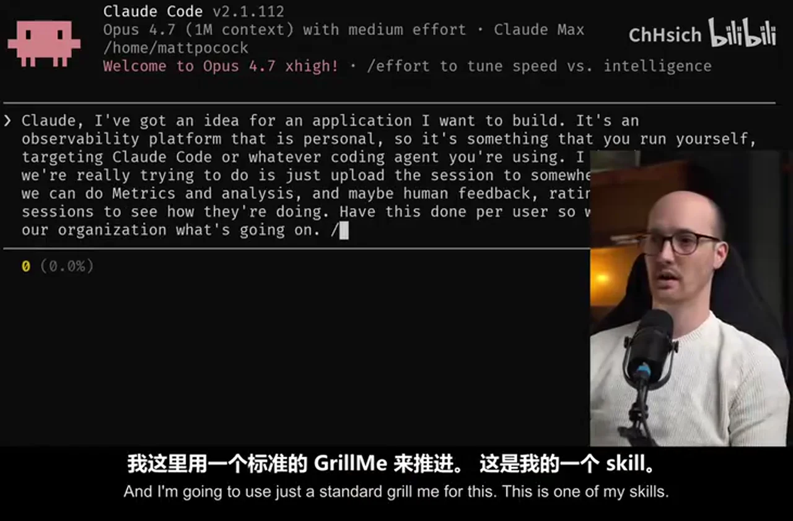

### 关键帧 2

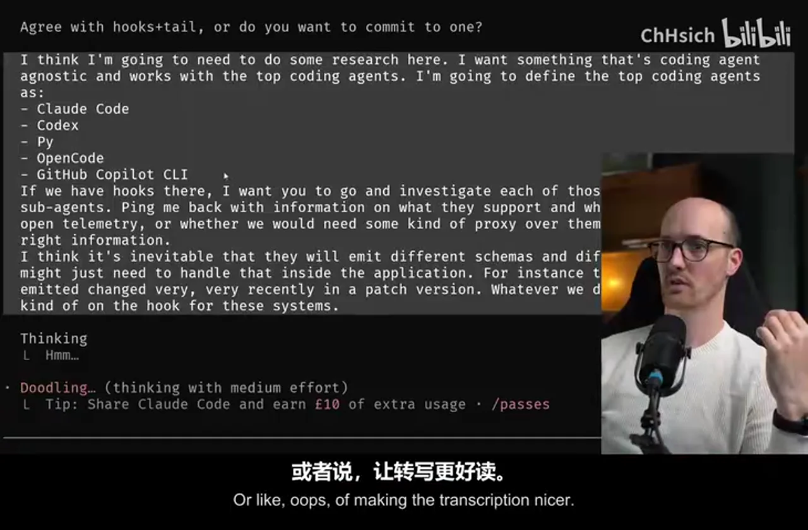

### 关键帧 3

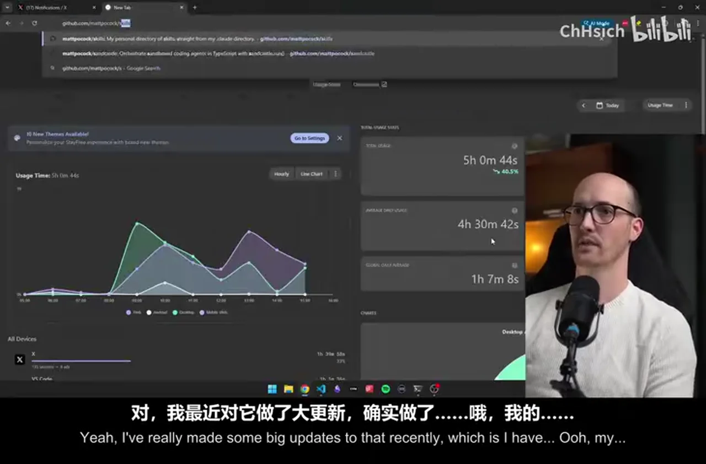

### 关键帧 4

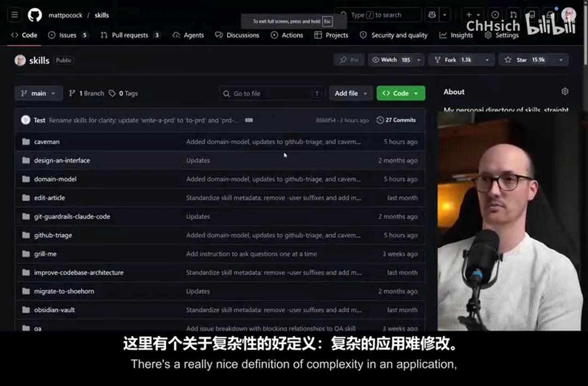

### 关键帧 5

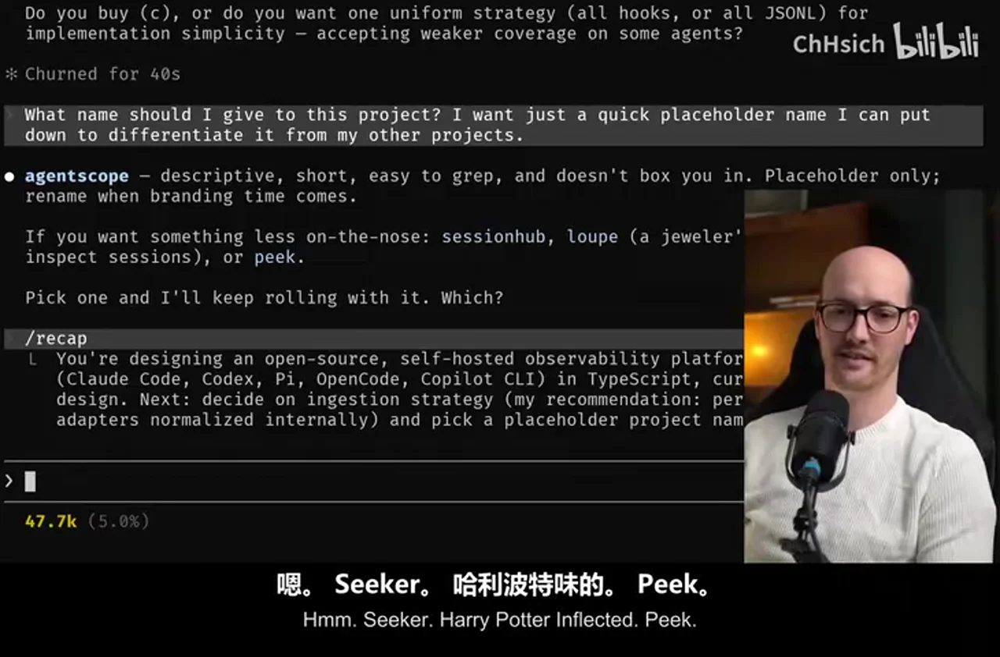

### 关键帧 6

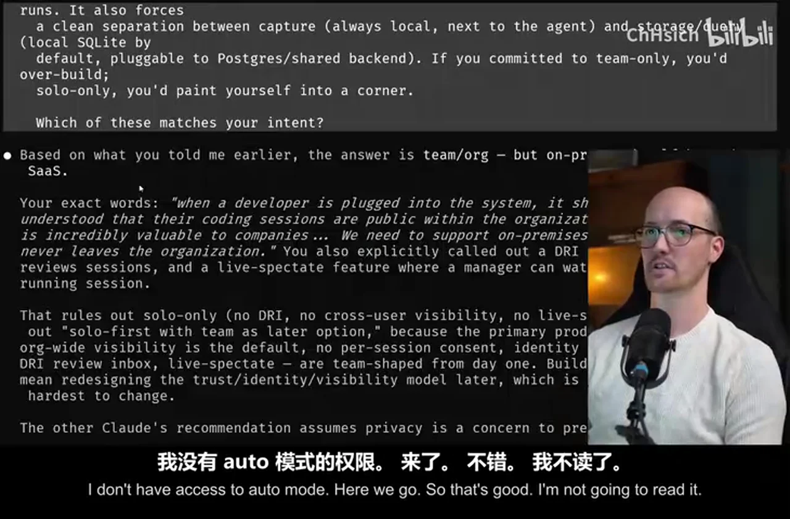

### 关键帧 7

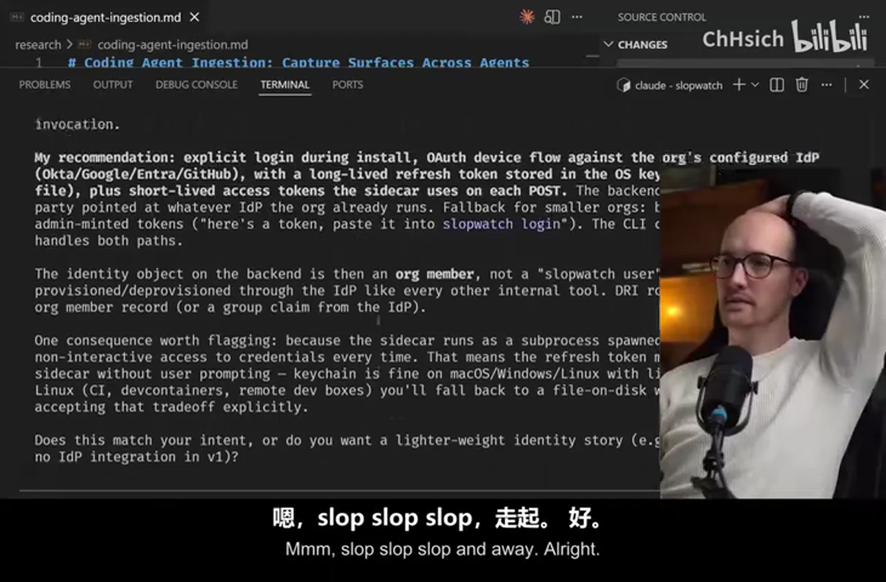

### 关键帧 8

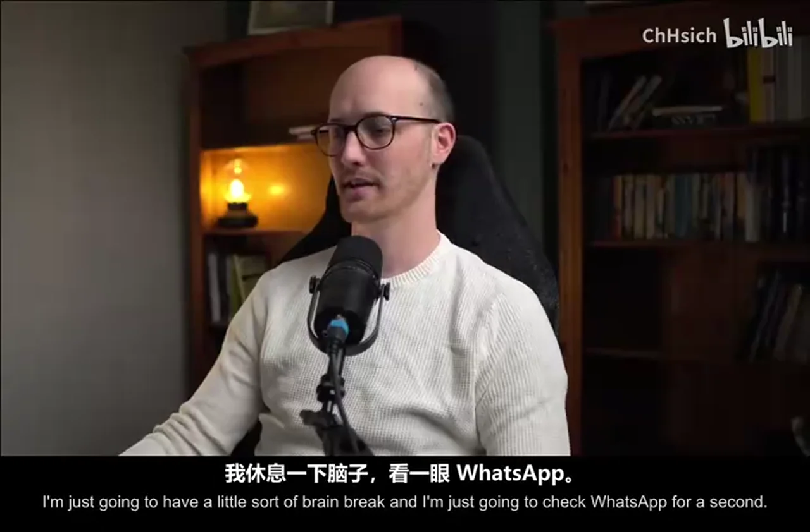

### 关键帧 9

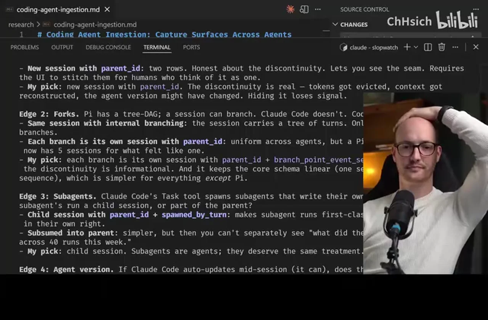

### 关键帧 10

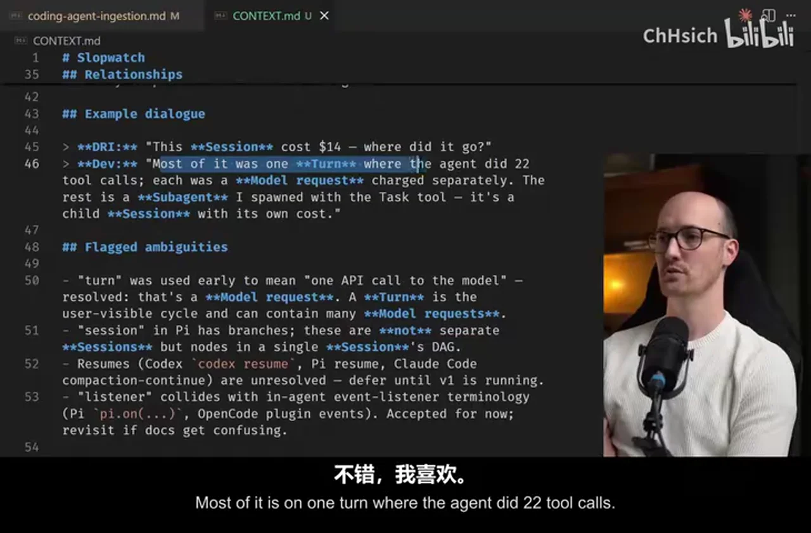
