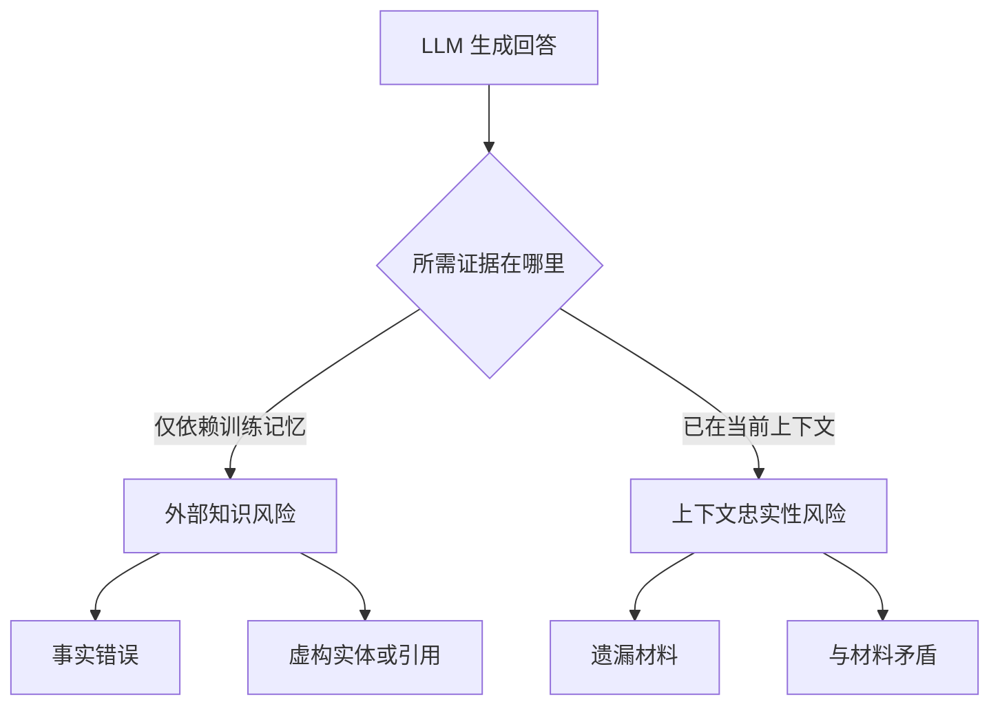
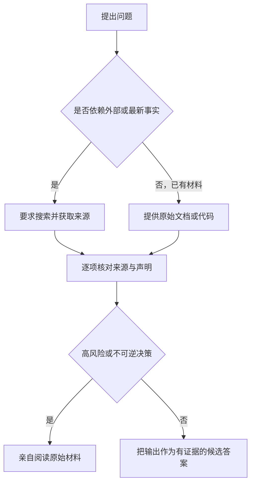

# 总结稿

## 核心结论

Matt Pocock 的立场不是拒绝 LLM，而是拒绝**未经验证地信任**它。视频依次解释三类问题：模型可能给出事实错误、虚构并不存在的实体（例如软件包），也可能忽略用户已经提供的上下文；即使回答语言流畅、信心很强，也不构成事实证据。

讲者用“有损压缩”帮助非专业观众理解训练知识的不完整性，并引用研究说明另一层激励问题：若训练和评测主要奖励答对，而没有充分奖励承认未知，模型就会倾向于猜测。日常使用中的核心张力，是既希望模型主动推理，又希望它在证据不足时克制。

视频给出的实践策略是：

- 尽量把代码、文档和明确事实放进上下文，让模型基于材料工作；
- 对外部事实显式要求使用搜索工具，并检查引用是否真正支持结论；
- 搜索与上下文只能降低风险，不能消除“上下文不一致”；
- 医疗、法律及其他高风险问题必须亲自阅读原始材料。

## 外部核验补充

- 视频引用的幻觉分类论文确实存在，但“comprehensive”是作者对其分类体系的定位，不代表该分类已经终结争议：[A comprehensive taxonomy of hallucinations in Large Language Models](https://arxiv.org/abs/2508.01781)。
- Bard 演示中的系外行星说法确有错误：首张直接成像的系外行星图像早于 JWST；但 Alphabet 当日近 8% 的跌幅还与发布会表现和竞争担忧有关，不能全部归因于这一处错误。[NASA](https://science.nasa.gov/resource/2m1207-b-first-image-of-an-exoplanet/) · [AP](https://apnews.com/article/e3e4fb8647315dc5a8e400fa5a71cf67)
- 虚构软件包确实会形成依赖混淆/供应链攻击面；这说明风险真实存在，不表示每个虚构包名都已被攻击者利用。[USENIX Security 2025](https://www.usenix.org/conference/usenixsecurity25/presentation/spracklen)
- Air Canada 聊天机器人案件中，裁决机构认定网站聊天机器人提供了误导性的丧亲票价信息，并判令赔偿。[Moffatt v. Air Canada, 2024 BCCRT 149](https://www.canlii.org/en/bc/bccrt/doc/2024/2024bccrt149/2024bccrt149.html)
- OpenAI 的研究确实认为，偏重准确率的训练与评测会奖励猜测而非承认不确定性；这是幻觉的一项机制，不是所有幻觉的唯一原因。[OpenAI：Why language models hallucinate](https://openai.com/index/why-language-models-hallucinate/)

# 辅助理解

## 辅助理解：把 LLM 输出当成待验证的候选答案

### 1. “幻觉”不只是不知道事实

**视频内容：** 讲者从三种常见失效切入：事实错误、虚构实体，以及忽略或反驳已经提供的上下文。画面将 “Contextual Inconsistency” 定义为忽略或违背显式上下文，这提醒我们：给模型材料并不等于它一定会忠实使用材料。

**AI 辅助推断：** 因此，“检索到了资料”和“回答被资料支持”是两个检查点。前者检查来源是否进入上下文，后者检查每项结论能否回指到具体证据。

### 2. 流畅表达会掩盖真实世界的风险

**视频内容：** 开发者若直接采用模型虚构的软件包名，攻击者可能注册同名恶意包，把一次幻觉转化为供应链入口。视频用相关文章页面呈现这个风险，而不是把它停留在“答案可能有小错误”。

**外部核验补充：** 一项经 USENIX Security 2025 收录的研究在大规模生成代码样本中发现，软件包幻觉具有持续性，并可能为 package-confusion 攻击提供机会；这证明攻击面可信，但不能推导出每个虚构包都已经被利用。[USENIX Security 2025：We Have a Package for You!](https://www.usenix.org/conference/usenixsecurity25/presentation/spracklen)

视频举出的另外两个现实案例也应精确理解：

- Google 的 Bard 宣传回答把第一张系外行星图像错误归因于 JWST；NASA 资料确认首张直接成像早在 2004 年完成。[NASA：2M1207 b](https://science.nasa.gov/resource/2m1207-b-first-image-of-an-exoplanet/)
- Alphabet 股价随后跌近 8% 是事实，但同期报道同时提到错误答案、发布会表现以及微软竞争压力，不能把整段跌幅单因归结为一句错误回答。[Associated Press](https://apnews.com/article/e3e4fb8647315dc5a8e400fa5a71cf67)
- Air Canada 案中，裁决机构认定公司通过网站聊天机器人作出疏忽性错误陈述并判令赔偿；该判决支持“上下文或政策在系统中并不保证回答正确”这一风险提醒。[CanLII：Moffatt v. Air Canada](https://www.canlii.org/en/bc/bccrt/doc/2024/2024bccrt149/2024bccrt149.html)

### 3. “有损压缩”是直觉类比，不是完整机制解释

**视频内容：** 讲者把训练后的模型比作高度压缩的图像：轮廓仍在，细节可能丢失；当问题要求缺失细节时，模型可能根据模式补出一个貌似合理的答案。他明确说明自己不是机器学习专家，这一段旨在提供直觉，而非严谨描述模型的全部训练与推理机制。

**AI 辅助推断：** 使用这个类比时，应保留两点边界：模型不是逐条存放并解压训练文本的数据库；幻觉也不只来自“压缩损失”，还涉及数据质量、提示、解码、检索、训练目标和评测激励等因素。

### 4. 能力与克制之间存在评测张力

**视频内容：** 讲者引用 OpenAI 研究，说明只奖励答对可能让“猜一个答案”比“承认不知道”更有利。他把模型设计画成一条轴：一端足够主动、聪明地解决问题，另一端足够谦逊地表达未知；过度自信会幻觉，过度保守又会降低任务完成能力。

**外部核验补充：** OpenAI 的论文与配套文章确实主张，准确率导向的训练和评测会奖励猜测而非弃答；论文将其描述为重要机制，而不是每一种幻觉的唯一原因。[OpenAI：Why language models hallucinate](https://openai.com/index/why-language-models-hallucinate/) · [论文预印本](https://arxiv.org/abs/2509.04664)

### 5. 搜索是取证步骤，不是可信开关

**视频内容：** 讲者建议在询问外部事实时明确要求模型“use your search tool”，让网页材料进入上下文，并利用引用检查来源；但他随后再次强调，即使材料已在上下文中，模型仍可能忽略或误读它。对于健康、法律等关键问题，用户必须亲自阅读底层文件。

**AI 辅助推断：** 更可靠的工作流不是让模型口头承诺“不幻觉”，而是要求它区分“材料直接支持”“推断”“未知”，为外部事实附可点击来源，并用测试、规则或人工复核验证关键结果。

## 与相关笔记的连接

[[clips/当 AI 开始编排工程：一个可观测的软件工厂如何运转.md|当 AI 开始编排工程：一个可观测的软件工厂如何运转]]解决的是如何用追踪、结构化交接、确定性门禁和人的最终判断组织 Agent 工程；本视频解释了为什么这些控制不可省略——模型可能虚构外部事实，也可能误读已经提供的上下文。组合阅读后，可把“不要盲信”从个人警觉转化为可观测、可取证、可复核的工程流程。

# Data

## 增强转写稿

[00:00] LLMs lie, they lie all the time
[00:02] they lie in different ways
[00:04] they lie so often it's been given a term, hallucination
[00:07] these hallucinations are so unbelievably common
[00:09] that I am now paranoid about everything an LLM says to me
[00:13] and I will never ever trust an LLM
[00:16] I'm a software developer
[00:17] and every single other software developer I speak to
[00:19] has this same intuition
[00:21] having worked with LLMs for the past six months
[00:23] maybe you also have this intuition
[00:25] but maybe someone you know doesn't
[00:27] while I'm making this video so that you can share this video with that person
[00:31] so that they never again trust an LLM implicitly
[00:33] I'm finding that even the very very smart people in my life
[00:36] for some reason don't have this intuition
[00:38] that LLMs hallucinate all the time
[00:41] now don't get me wrong I'm really pro LLM
[00:43] I really like LLMs
[00:45] I think LLMs have massively improved my quality of life
[00:49] in terms of my job, in terms of what they can produce
[00:51] I think LLMs are great
[00:54] but they have massive downside
[00:56] and because they're presented so beautifully
[00:58] then people just don't realise that
[01:00] so we're going to work through three things
[01:01] we're going to look at all the different types of hallucinations
[01:04] we're going to look at why hallucinations
[01:05] even happen in the first place
[01:07] and why it's such a hard problem to solve
[01:09] and then we're going to look at how to work around them
[01:11] when you're working with LLMs day to day
[01:13] I'm going to explain these to you in simple terms
[01:15] because the simple terms are the only ones I really know
[01:17] I've been working with LLMs for
[01:19] you know, I don't know, year and a half or something
[01:21] but I'm not a machine learning expert
[01:23] I don't work at OpenAI or anything
[01:25] I'm just coming at this from someone who likes to talk about LLMs
[01:29] and who likes to use them day to day
[01:30] I'm going to reference a couple of academic papers
[01:32] which I will put below
[01:33] in fact, the first one is this comprehensive taxonomy
[01:36] of hallucinations in large language models
[01:38] in other words, these guys went and looked
[01:40] at all of the different ways
[01:42] that language models can hallucinate
[01:43] and figured out the exact taxonomy
[01:45] of what types of hallucinations can happen
[01:47] perfect for us
[01:48] the first one is pretty easy to think about
[01:50] it's factual errors
[01:51] this has been present since the very beginning of LLMs
[01:54] for instance, when Google announced BARD
[01:57] they said in its experimental conversational AI service
[02:00] powered by LaMDA
[02:01] it said
[02:02] what new discoveries from the James Webb Space Telescope
[02:05] can I tell my nine-year-old about
[02:06] and it said, JWST took the very first pictures of a planet
[02:10] outside of our own solar system
[02:12] this was in the frickin advert
[02:13] they didn't even try to fact-check this
[02:16] this is just wrong
[02:17] it's a hallucination
[02:18] after posting this, Alphabet's share price
[02:19] dropped like 8%
[02:21] now, it's crucial to say here
[02:22] in this case, they didn't pass
[02:24] the LLM a document
[02:25] explaining all about
[02:27] the James Webb Space Telescope
[02:28] and the new discoveries
[02:29] it seems like they just asked it
[02:30] based on its training data
[02:32] this is a super important distinction
[02:34] that the paper actually makes
[02:36] there are two types of hallucinations
[02:39] there are hallucinations
[02:39] based on intrinsic information
[02:42] and extrinsic information
[02:43] intrinsic information is stuff
[02:45] that you've sent to the LLM
[02:46] during this conversation with the LLM
[02:48] for instance, I'll go on Anthropic here
[02:50] and I'll tell it
[02:51] my cat is called Bandit
[02:52] it gives some reply here
[02:53] saying that's a great name for a cat
[02:55] wonderful, thank you
[02:56] and now, I'll ask it
[02:57] what is my cat's name
[02:59] then of course, it says
[03:00] your cat's name is Bandit
[03:01] you just told me in your previous message
[03:03] so if the LLM for some reason got that wrong
[03:05] then it would be an
[03:05] intrinsic hallucination
[03:07] whereas, if I start a new conversation
[03:08] with the LLM
[03:09] and I say
[03:09] what is my cat's name
[03:11] then, very good
[03:12] in this case, it has not
[03:13] attempted to guess my cat's name
[03:15] it's just saying
[03:15] I don't have any information
[03:16] about your cat in my context
[03:18] and so, if it attempted to guess here
[03:20] then it would be an
[03:20] extrinsic hallucination
[03:22] the next type of hallucination
[03:23] is fabricated entities
[03:25] inventing stuff
[03:25] that just doesn't exist
[03:26] this is actually really important
[03:28] for developers
[03:28] because developers rely
[03:29] on these things called packages
[03:31] that package up
[03:32] useful tools
[03:33] to help them do their work
[03:34] so if you ask an LLM
[03:35] does a package exist
[03:37] for this purpose
[03:38] then it's very likely
[03:39] to just say
[03:40] yep, it does
[03:41] this has personally happened
[03:42] to me dozens of times
[03:44] and it's now opening up developers
[03:45] to supply chain malware attacks
[03:47] attackers can exploit
[03:48] a common AI experience
[03:50] false recommendations
[03:51] to spread malicious code
[03:52] via developers
[03:53] that use ChatGPT
[03:54] to create software
[03:55] this is an old article
[03:56] but this literally just happened
[03:57] to me the other day
[03:58] and it's not just packages
[03:59] LLMs will make up
[04:00] government departments
[04:01] they will make up laws
[04:02] that don't exist
[04:02] they will make up all sorts of things
[04:04] the next one is
[04:05] contextual inconsistency
[04:07] in other words
[04:07] ignoring or contradicting
[04:09] contexts
[04:09] that you explicitly provide
[04:11] this would be an
[04:11] intrinsic hallucination
[04:12] like what we saw before
[04:13] this article is from 2024
[04:15] Air Canada found liable
[04:16] for chatbot
[04:17] bad advice on plane tickets
[04:18] this guy called Jake Moffat
[04:20] asked the Air Canada chatbot
[04:22] about their bereavement policy
[04:23] and even though the bereavement policy
[04:25] was probably in the LLMs context
[04:27] it had been explicitly told about
[04:28] it explicitly passed into its context
[04:30] it just made something up
[04:32] it said
[04:32] if you need to travel immediately
[04:34] or you've already traveled
[04:35] and would like to submit your ticket
[04:36] for a reduced bereavement rate
[04:38] kindly do so within 90 days of the date
[04:40] your ticket was issued
[04:41] but when they tried to get their money back
[04:42] they basically responded
[04:44] and admitted the chatbot
[04:45] had provided
[04:46] misleading words
[04:47] in other words
[04:48] a contextual inconsistency
[04:50] an inconsistency
[04:51] with something that the LLM
[04:53] just had in its own context window
[04:54] this would be kind of like
[04:55] the LLM not knowing my cat's name
[04:57] just after I gave it to it
[04:59] it's baffling that these things occur
[05:00] but they do
[05:01] now I could go through all ten
[05:02] of these terms from this paper
[05:04] and try to explain to you about
[05:05] each and every one of them
[05:06] but I think you're starting to get the picture
[05:08] LLMs are unreliable
[05:10] and especially if you're relying on
[05:12] their extrinsic knowledge
[05:13] my experience with LLMs
[05:14] is that they're much much more reliable
[05:17] when you send them the information first
[05:19] of course why wouldn't they be
[05:20] but if you're relying on their
[05:21] extrinsic knowledge
[05:22] from their training sets
[05:23] then you're going to be disappointed
[05:25] we should talk in a kind of basic sense
[05:26] about why this is. First of all,
[05:28] the process of training LLM
[05:30] of taking a bunch of training data
[05:33] and turning it into something smaller
[05:35] is essentially a compression
[05:37] you take let's say a massive file
[05:39] with all of the stuff
[05:41] that you've gathered over the course
[05:42] of all of your data scraping
[05:44] huge amounts of data sets
[05:46] about all the different you know
[05:48] text or everything on the internet
[05:50] let's say
[05:50] you then through some very clever
[05:52] mechanisms that I won't go into
[05:53] you compress it down
[05:54] into a much smaller size
[05:56] that can fit on a GPU
[05:58] and this compressed version
[06:00] of that training set
[06:01] is what we can think of
[06:01] as the LLMs brain
[06:03] or its memory
[06:03] or its data store
[06:04] and the output here
[06:05] is much much much smaller
[06:08] than the input
[06:09] now when you're taking
[06:10] some massive training set
[06:11] and you're squishing it down
[06:13] into a smaller size
[06:14] you're going to lose stuff
[06:15] for instance let's take this photo
[06:16] of this beautiful man
[06:17] and let's compress it a little bit
[06:19] ok it's not bad
[06:20] you can still see it's me
[06:21] but I've lost a bit of definition
[06:24] here you can't quite tell
[06:25] how many wrinkles there are
[06:26] on my forehead for instance
[06:27] we can press it a bit more
[06:28] and the skin has been kind of
[06:29] smoothed out
[06:30] I've lost a lot of definition
[06:32] and you go all the way
[06:33] and I just end up like this
[06:34] blobby looking person
[06:35] that you can barely recognise
[06:36] it's me
[06:37] when you ask an LLM
[06:38] a question
[06:38] and it's not in their training set
[06:40] I want you to imagine
[06:41] that this is the picture
[06:42] that they're seeing
[06:43] of the information they have
[06:44] just a blobby crappy
[06:46] hyper compressed version
[06:47] of the information
[06:48] that was once there
[06:49] and look you can see
[06:49] you still get good answers
[06:51] out of this image
[06:51] it can still say
[06:52] ok what colour is the little cap
[06:54] on the end of my microphone here
[06:55] it is blue right
[06:56] that is visible from the image
[06:58] you could probably
[06:59] just about say
[07:00] that this man doesn't have any hair
[07:01] on his head too
[07:02] but if you ask about
[07:03] who it is
[07:04] or how old this person is
[07:05] or you know
[07:06] any of that
[07:07] it's not going to have a clue
[07:08] so the question then becomes
[07:09] if LLMs only have this crappy
[07:12] low res version
[07:13] of all of the information in the world
[07:15] why are they so insistent
[07:16] on guessing
[07:17] because an LLM presented
[07:18] with this information
[07:19] you asked who they are
[07:21] they will often just
[07:22] have a go and guess
[07:23] now the answer for this
[07:24] comes from the second paper
[07:25] that I want to link to
[07:26] which is below
[07:27] it's from OpenAI
[07:28] and the title is
[07:28] why language models hallucinate
[07:30] like students facing
[07:31] hard exam questions
[07:32] large language models
[07:34] sometimes guess
[07:35] when uncertain
[07:35] producing plausible
[07:37] yet incorrect statements
[07:38] instead of admitting uncertainty
[07:39] we argue that language models
[07:41] hallucinate because the training
[07:42] and evaluation procedures
[07:43] reward guessing
[07:45] over acknowledging uncertainty
[07:47] now what do they mean
[07:47] by evaluation procedures
[07:49] what are they talking about
[07:50] well LLMs prove
[07:51] that they're getting better
[07:52] over time
[07:52] by showing their numbers
[07:54] in benchmarks
[07:55] for instance here
[07:55] this one is live bench
[07:57] I mean I think this is a
[07:58] leaderboard of multiple benchmarks
[07:59] and you can see that all
[08:00] of the top models here
[08:01] are rated
[08:02] a number out of 100
[08:05] on how good they are
[08:06] at different things
[08:07] for instance reasoning
[08:08] coding
[08:08] agentic coding
[08:09] mathematics
[08:10] data analysis
[08:11] language etc.
[08:12] being at the top of these
[08:12] leaderboards is incredibly
[08:14] valuable for these companies
[08:16] if you can say you have
[08:17] the best model in the world
[08:18] at something
[08:19] then everyone who's doing
[08:20] that thing is going to
[08:21] want to use your model
[08:22] because it's actually
[08:23] really easy to swap
[08:24] models
[08:25] you just like stop
[08:26] using one thing
[08:27] and go and use
[08:27] another thing
[08:28] and there's attention
[08:29] that these benchmarks
[08:30] introduce
[08:31] because if your model
[08:33] is really well tuned
[08:34] to say I don't know
[08:36] something when it comes
[08:37] to let's say maths
[08:38] then it's probably
[08:38] not gonna score very well
[08:40] on the maths benchmark
[08:41] because it might just be
[08:42] better on average
[08:43] for it to have a guess
[08:45] in other words you miss
[08:46] all of the shots
[08:47] that you don't take
[08:48] and so LLMs
[08:49] try to take
[08:50] as many shots
[08:50] as possible
[08:51] in fact, there's
[08:51] kind of a tension
[08:52] inherent in
[08:53] designing LLMs
[08:54] and you can think of this
[08:55] kind of by thinking
[08:56] of it in human terms
[08:58] it's quite rare to
[08:59] meet a person
[08:59] who's really really smart
[09:01] but also really humble
[09:03] about their smartness
[09:04] people who are really smart
[09:05] especially in an exam context
[09:07] will probably be smart
[09:08] enough to get close
[09:09] to the right answer
[09:10] and will trust themselves
[09:11] and be confident enough
[09:12] to actually work it out
[09:13] but people who are humble
[09:14] enough to say I don't know
[09:16] will probably go
[09:17] in the opposite direction
[09:18] where they might not
[09:19] be confident enough
[09:20] to actually get it done
[09:21] however if you're
[09:22] really smart
[09:23] you're often
[09:24] gonna be way too
[09:25] confident about
[09:26] your own answers
[09:27] and this will lead
[09:28] to hallucinations
[09:29] in other words
[09:30] all the stuff
[09:30] that we've been talking
[09:31] about so far
[09:32] but if you're
[09:32] on the other side
[09:33] and you're
[09:33] not confident enough
[09:34] then you're probably
[09:35] not gonna do
[09:36] really well
[09:37] in the domains
[09:37] where you need
[09:38] really really deep
[09:39] thinking
[09:40] and the people who grade
[09:41] LLMs and who train
[09:42] LLMs need to figure out
[09:43] somewhere on this line
[09:45] and I'm not sure
[09:47] it's a solvable
[09:48] problem
[09:48] or rather
[09:49] it might be solvable
[09:50] but it's gonna be
[09:50] someone
[09:50] way above my
[09:51] pay grade
[09:52] so to sum it up
[09:52] LLMs hallucinate
[09:53] because guessing
[09:55] is more
[09:55] highly rewarded
[09:57] than refusal
[09:58] which to be honest
[09:59] is kind of
[10:00] true in most walks of life
[10:01] anyway
[10:02] so then
[10:02] we now know
[10:02] how
[10:03] LLMs hallucinate
[10:04] and we kind of
[10:05] understand
[10:05] why LLMs hallucinate
[10:07] but why
[10:07] after all of that
[10:08] am I still so
[10:09] pro AI
[10:09] why do I still
[10:10] like AI
[10:11] well it's because
[10:12] when you actually
[10:13] pass them
[10:14] intrinsic information here
[10:16] if you actually
[10:16] send them stuff
[10:17] if you get them to
[10:19] peruse
[10:19] a big document
[10:20] or something
[10:21] then it tends to
[10:22] be really
[10:23] really accurate
[10:23] at way
[10:25] more accurate
[10:26] than extrinsic information
[10:27] so when I'm coding
[10:28] for instance
[10:28] I can pass
[10:29] my code base
[10:30] or you know
[10:30] big files
[10:31] to the LLM
[10:32] and get it to answer
[10:33] questions about it
[10:34] get it to explore
[10:34] the code
[10:35] and it will give
[10:36] me really
[10:36] really
[10:37] good insights
[10:37] as to what it's doing
[10:38] in other words
[10:39] when you're
[10:39] using AI
[10:40] you need to
[10:41] always make sure
[10:42] that you're providing
[10:43] it the information
[10:44] it needs to succeed
[10:45] but so you might ask
[10:46] I
[10:46] that doesn't
[10:47] make any sense
[10:48] because I often
[10:49] use LLMs
[10:49] for searching
[10:50] for information
[10:51] if I have a question
[10:52] that I don't
[10:52] have the answer to
[10:53] I can't use
[10:54] this intrinsic stuff
[10:55] all I have to rely
[10:56] on is extrinsic stuff
[10:57] so I'm gonna tell you
[10:58] about a four word
[10:59] prompt
[10:59] that will
[11:00] allow you
[11:00] to get the LLM
[11:01] to fetch
[11:03] intrinsic information
[11:04] that it doesn't
[11:04] yet have
[11:05] use your search tool
[11:07] most chatbots
[11:08] and most
[11:08] let's call them
[11:09] agent harnesses
[11:10] have some kind
[11:11] of tool
[11:12] that the LLM
[11:12] can use
[11:13] in order to search
[11:14] the web
[11:15] for instance
[11:15] in Claude here
[11:16] if we
[11:16] go to files
[11:17] connectors
[11:18] and blah blah blah blah
[11:19] then we have
[11:19] this little
[11:20] web search thing
[11:21] just inside there
[11:22] and I
[11:23] always
[11:24] have this turned
[11:25] on
[11:25] and for instance
[11:26] I can ask it
[11:26] which arsenal
[11:27] players are
[11:28] injured right now
[11:29] and it will go
[11:29] and search
[11:30] the web
[11:31] and try to find
[11:32] the information
[11:32] so here we go
[11:33] it's saying
[11:34] here's the current
[11:34] Arsenal injury picture
[11:35] blah blah blah blah blah
[11:36] and as you can see
[11:37] there are citations
[11:39] based on
[11:39] where it's
[11:40] got the information from
[11:41] now it's done
[11:41] a good job this time
[11:42] because you know
[11:43] sonnet is a good model
[11:44] and I like this tool
[11:45] in general
[11:46] but many tools
[11:47] will not
[11:48] by default
[11:49] go and do this
[11:50] especially
[11:50] if the model
[11:51] is confident
[11:52] that it knows it
[11:53] and its training set
[11:54] if it doesn't
[11:54] need to use its
[11:55] search tool
[11:56] in other words
[11:56] in order to use
[11:57] itssearch tool
[11:58] it needs to be
[11:58] humble enough
[11:59] to be able to say
[11:59] I don't know
[12:00] I need to go
[12:01] and fetch this
[12:02] and so
[12:02] if it's like
[12:03] tuned to be
[12:04] really smart
[12:04] it might just go
[12:05] oh I know the answer
[12:06] let me just
[12:06] repeat it to you
[12:07] and so
[12:08] whenever you're
[12:09] prompting the LLM
[12:10] to ask it for information
[12:11] say
[12:12] use your search tool
[12:13] because then
[12:14] it will pull
[12:15] the articles
[12:15] into its context
[12:17] and it will
[12:17] answer
[12:18] based on those articles
[12:19] and you'll be
[12:20] less likely
[12:20] to get
[12:21] hallucinations
[12:22] because you're
[12:22] relying
[12:22] on intrinsic information
[12:24] information
[12:25] in the context window
[12:26] however
[12:26] remember
[12:27] there's a category
[12:28] of hallucinations
[12:28] called
[12:29] contextual inconsistency
[12:31] in other words
[12:31] even stuff
[12:32] that you provide
[12:33] explicitly
[12:34] to the LLM
[12:35] might just be ignored
[12:36] even if you're
[12:37] an airline
[12:37] and you have
[12:38] a chatbot
[12:38] with a bereavement policy
[12:40] explicitly
[12:40] passed to it
[12:41] it might still
[12:42] get it wrong
[12:42] and so
[12:43] for really
[12:43] critical stuff
[12:44] for stuff
[12:45] that's life or death
[12:46] for
[12:46] health-related stuff
[12:48] especially
[12:48] for legal stuff
[12:50] you basically
[12:50] need to ask it
[12:51] use your search tool
[12:52] but you then
[12:53] need to go
[12:54] and actually
[12:54] read the documents
[12:55] yourselves
[12:56] this happens
[12:56] all the time
[12:57] for me
[12:57] when I'm
[12:58] coding too
[12:59] the LLM will
[13:00] read some code
[13:00] and it might
[13:01] just misinterpret it
[13:02] or not know
[13:03] the full context
[13:04] and so
[13:04] it's spews
[13:04] something out
[13:05] very confidently
[13:06] and I then
[13:06] have to say
[13:07] no
[13:07] that's actually
[13:08] not quite right
[13:09] so hopefully
[13:10] this video
[13:10] is giving you
[13:10] a bit more
[13:11] understanding about
[13:12] what the limits
[13:13] of LLMs are
[13:14] and how
[13:14] you can work around them
[13:15] and if you have someone in your life
[13:17] who you
[13:17] want to be better
[13:18] with LLMs
[13:19] or you notice them
[13:20] just slightly using them wrong
[13:22] then maybe send them this video
[13:23] and hopefully we can build a world
[13:25] where people don't
[13:25] trust LLMs
[13:27] and instead
[13:28] use them for what they're good at
[13:29] for instance
[13:30] they are very
[13:31] very good
[13:31] at writing code
[13:33] and I am running a
[13:34] Claude Code
[13:34] for real engineers
[13:36] course
[13:36] over the next two weeks
[13:37] if you dig that
[13:38] or you dig the idea
[13:39] that real engineering principles
[13:41] can still be used in the AI age
[13:42] in fact they're better than ever
[13:44] then sign up to my newsletter below
[13:45] or sign up to
[13:46] learn about when the next cohort
[13:48] is happening
[13:48] thanks for watching folks
[13:49] this was a bit of a change of pace for me
[13:51] I don't usually make these kind of
[13:52] wider videos
[13:53] or videos for a wider audience
[13:55] but I kind of just wanted to
[13:57] get this out there
[13:57] thanks for watching
[13:58] and I'll see you in the next one

## 原始转写稿

[00:00] LLMs lie, they lie all the time
[00:02] they lie in different ways
[00:04] they lie so often it's been given a term, hallucination
[00:07] these hallucinations are so unbelievably common
[00:09] that I am now paranoid about everything an LLM says to me
[00:13] and I will never ever trust an LLM
[00:16] I'm a software developer
[00:17] and every single other software developer I speak to
[00:19] has this same intuition
[00:21] having worked with LLMs for the past six months
[00:23] maybe you also have this intuition
[00:25] but maybe someone you know doesn't
[00:27] while I'm making this video so that you can share this video with that person
[00:31] so that they never again trust an LLM implicitly
[00:33] I'm finding that even the very very smart people in my life
[00:36] for some reason don't have this intuition
[00:38] that LLMs hallucinate all the time
[00:41] now don't get me wrong I'm really pro LLM
[00:43] I really like LLMs
[00:45] I think LLMs have massively improved my quality of life
[00:49] in terms of my job, in terms of what they can produce
[00:51] I think LLMs are great
[00:54] but they have massive downside
[00:56] and because they're presented so beautifully
[00:58] then people just don't realise that
[01:00] so we're going to work through three things
[01:01] we're going to look at all the different types of hallucinations
[01:04] we're going to look at why hallucinations
[01:05] even happen in the first place
[01:07] and why it's such a hard problem to solve
[01:09] and then we're going to look at how to work around them
[01:11] when you're working with LLMs day to day
[01:13] I'm going to explain these to you in simple terms
[01:15] because the simple terms are the only ones I really know
[01:17] I've been working with LLMs for
[01:19] you know, I don't know, year and a half or something
[01:21] but I'm not a machine learning expert
[01:23] I don't work at OpenAI or anything
[01:25] I'm just coming at this from someone who likes to talk about LLMs
[01:29] and who likes to use them day to day
[01:30] I'm going to reference a couple of academic papers
[01:32] which I will put below
[01:33] in fact, the first one is this comprehensive taxonomy
[01:36] of hallucinations in large language models
[01:38] in other words, these guys went and looked
[01:40] at all of the different ways
[01:42] that language models can hallucinate
[01:43] and figured out the exact taxonomy
[01:45] of what types of hallucinations can happen
[01:47] perfect for us
[01:48] the first one is pretty easy to think about
[01:50] it's factual errors
[01:51] this has been present since the very beginning of LLMs
[01:54] for instance, when Google announced BARD
[01:57] they said in its experimental conversational AI service
[02:00] powered by Lambda
[02:01] it said
[02:02] what new discoveries from the James Webb Space Telescope
[02:05] can I tell my nine-year-old about
[02:06] and it said, JWST took the very first pictures of a planet
[02:10] outside of our own solar system
[02:12] this was in the frickin advert
[02:13] they didn't even try torotest this
[02:16] this is just wrong
[02:17] it's a hallucination
[02:18] after posting this, Alphabet's share price
[02:19] dropped like 8%
[02:21] now, it's crucial to say here
[02:22] in this case, they didn't pass
[02:24] the LLM a document
[02:25] explaining all about
[02:27] the James Webb Space Telescope
[02:28] and the new discoveries
[02:29] it seems like they just asked it
[02:30] based on its training data
[02:32] this is a super important distinction
[02:34] that the paper actually makes
[02:36] there are two types of hallucinations
[02:39] there are hallucinations
[02:39] based on intrinsic information
[02:42] and extrinsic information
[02:43] intrinsic information is stuff
[02:45] that you've sent to the LLM
[02:46] during this conversation with the LLM
[02:48] for instance, I'll go on Anthropic here
[02:50] and I'll tell it
[02:51] my cat is called Bandit
[02:52] it gives some reply here
[02:53] saying that's a great name for a cat
[02:55] wonderful, thank you
[02:56] and now, I'll ask it
[02:57] what is my cat's name
[02:59] then of course, it says
[03:00] your cat's name is Bandit
[03:01] you just told me in your previous message
[03:03] so if the LLM for some reason got that wrong
[03:05] then it would be an
[03:05] intrinsic hallucination
[03:07] whereas, if I start a new conversation
[03:08] with the LLM
[03:09] and I say
[03:09] what is my cat's name
[03:11] then, very good
[03:12] in this case, it has not
[03:13] attempted to guess my cat's name
[03:15] it's just saying
[03:15] I don't have any information
[03:16] about your cat in my context
[03:18] and so, if it attempted to guess here
[03:20] then it would be an
[03:20] extrinsic hallucination
[03:22] the next type of hallucination
[03:23] is fabricated entities
[03:25] inventing stuff
[03:25] that just doesn't exist
[03:26] this is actually really important
[03:28] for developers
[03:28] because developers rely
[03:29] on these things called packages
[03:31] that package up
[03:32] useful tools
[03:33] to help them do their work
[03:34] so if you ask an LLM
[03:35] does a package exist
[03:37] for this purpose
[03:38] then it's very likely
[03:39] to just say
[03:40] yep, it does
[03:41] this has personally happened
[03:42] to me dozens of times
[03:44] and it's now opening up developers
[03:45] to supply chain malware attacks
[03:47] attackers can exploit
[03:48] a common AI experience
[03:50] false recommendations
[03:51] to spread malicious code
[03:52] via developers
[03:53] that use chattypity
[03:54] to create software
[03:55] this is an old article
[03:56] but this literally just happened
[03:57] to me the other day
[03:58] and it's not just packages
[03:59] LLMs will make up
[04:00] government departments
[04:01] they will make up laws
[04:02] that don't exist
[04:02] they will make up all sorts of things
[04:04] the next one is
[04:05] contextual inconsistency
[04:07] in other words
[04:07] ignoring or contradicting
[04:09] contexts
[04:09] that you explicitly provide
[04:11] this would be an
[04:11] intrinsic hallucination
[04:12] like what we saw before
[04:13] this article is from 2024
[04:15] Air Canada found liable
[04:16] for chatbot
[04:17] bad advice on plane tickets
[04:18] this guy called Jake Moffat
[04:20] asked the Air Canada chatbot
[04:22] about their bereavement policy
[04:23] and even though the bereavement policy
[04:25] was probably in the LLMs context
[04:27] it had been explicitly told about
[04:28] it explicitly passed into its context
[04:30] it just made something up
[04:32] it said
[04:32] if you need to travel immediately
[04:34] or you've already traveled
[04:35] and would like to submit your ticket
[04:36] for a reduced bereavement rate
[04:38] kindly do so within 90 days of the ticket
[04:40] you're was issued
[04:41] but when they tried to get their money back
[04:42] they basically responded
[04:44] and admitted the chatbot
[04:45] had provided
[04:46] misleading words
[04:47] in other words
[04:48] a contextual inconsistency
[04:50] an inconsistency
[04:51] with something that the LLM
[04:53] just had in its own context window
[04:54] this would be kind of like
[04:55] the LLM not knowing my cat's name
[04:57] just after I gave it to it
[04:59] it's baffling that these things occur
[05:00] but they do
[05:01] now I could go through all ten
[05:02] of these terms from this paper
[05:04] and try to explain to you about
[05:05] each and every one of them
[05:06] but I think you're starting to get the picture
[05:08] LLMs are unreliable
[05:10] and especially if you're relying on
[05:12] their extrinsic knowledge
[05:13] my experience with LLMs
[05:14] is that they're much much more reliable
[05:17] when you send them the information first
[05:19] of course why wouldn't they be
[05:20] but if you're relying on their
[05:21] extrinsic knowledge
[05:22] from their training sets
[05:23] then you're going to be disappointed
[05:25] we should talk in a kind of basic sense
[05:26] about why this is firstofall
[05:28] the process of training LLM
[05:30] of taking a bunch of training data
[05:33] and turning it into something smaller
[05:35] is essentially a compression
[05:37] you take let's say a massive file
[05:39] with all of the stuff
[05:41] that you've gathered over the course
[05:42] of all of your data scraping
[05:44] huge amounts of data sets
[05:46] about all the different you know
[05:48] text or everything on the internet
[05:50] let's say
[05:50] you then through some very clever
[05:52] mechanisms that I won't go into
[05:53] you compress it down
[05:54] into a much smaller size
[05:56] that can fit on a GPU
[05:58] and this compressed version
[06:00] of that training set
[06:01] is what we can think of
[06:01] as the LLMs brain
[06:03] or its memory
[06:03] or its data store
[06:04] and the output here
[06:05] is much much much smaller
[06:08] than the input
[06:09] now when you're taking
[06:10] some massive training set
[06:11] and you're squishing it down
[06:13] into a smaller size
[06:14] you're going to lose stuff
[06:15] for instance let's take this photo
[06:16] of this beautiful man
[06:17] and let's compress it a little bit
[06:19] ok it's not bad
[06:20] you can still see it's me
[06:21] but I've lost a bit of definition
[06:24] here you can't quite tell
[06:25] how many wrinkles there are
[06:26] on my forehead for instance
[06:27] we can press it a bit more
[06:28] and the skin has been kind of
[06:29] smoothed out
[06:30] I've lost a lot of definition
[06:32] and you go all the way
[06:33] and I just end up like this
[06:34] blobby looking person
[06:35] that you can barely recognise
[06:36] it's me
[06:37] when you ask an LLM
[06:38] a question
[06:38] and it's not in their training set
[06:40] I want you to imagine
[06:41] that this is the picture
[06:42] that they're seeing
[06:43] of the information they have
[06:44] just a blobby crappy
[06:46] hyper compressed version
[06:47] of the information
[06:48] that was once there
[06:49] and look you can see
[06:49] you still get good answers
[06:51] out of this image
[06:51] it can still say
[06:52] ok what colour is the little cap
[06:54] on the end of my microphone here
[06:55] it is blue right
[06:56] that is visible from the image
[06:58] you could probably
[06:59] just about say
[07:00] that this man doesn't have any hair
[07:01] on his head too
[07:02] but if you ask about
[07:03] who it is
[07:04] or how old this person is
[07:05] or you know
[07:06] any of that
[07:07] it's not going to have a clue
[07:08] so the question then becomes
[07:09] if LLMs only have this crappy
[07:12] low res version
[07:13] of all of the information in the world
[07:15] why are they so insistent
[07:16] on guessing
[07:17] because an LLM presented
[07:18] with this information
[07:19] you asked who they are
[07:21] they will often just
[07:22] have a go and guess
[07:23] now the answer for this
[07:24] comes from the second paper
[07:25] that I want to link to
[07:26] which is below
[07:27] it's from OpenAI
[07:28] and the title is
[07:28] why language models hallucinate
[07:30] like students facing
[07:31] hard exam questions
[07:32] large language models
[07:34] sometimes guess
[07:35] when uncertain
[07:35] producing plausible
[07:37] yet incorrect statements
[07:38] instead of admitting uncertainty
[07:39] we arguethat the language models
[07:41] hallucinate because the training
[07:42] and evaluation procedures
[07:43] reward guessing
[07:45] over acknowledging uncertainty
[07:47] now what do they mean
[07:47] by evaluation procedures
[07:49] what are they talking about
[07:50] well LLMs prove
[07:51] that they're getting better
[07:52] over time
[07:52] by showing their numbers
[07:54] in benchmarks
[07:55] for instance here
[07:55] this one is live bench
[07:57] I mean I think this is a
[07:58] leaderboard of multiple benchmarks
[07:59] and you can see that all
[08:00] of the top models here
[08:01] are rated
[08:02] a number out of 100
[08:05] on how good they are
[08:06] at different things
[08:07] for instance reasoning
[08:08] coding
[08:08] agentic coding
[08:09] mathematics
[08:10] data analysis
[08:11] language etc.
[08:12] being at the top of these
[08:12] leaderboards is incredibly
[08:14] valuable for these companies
[08:16] if you can say you have
[08:17] the best model in the world
[08:18] at something
[08:19] then everyone who's doing
[08:20] that thing is going to
[08:21] want to use your model
[08:22] because it's actually
[08:23] really easy to swap
[08:24] models
[08:25] you just like stop
[08:26] using one thing
[08:27] and go and use
[08:27] another thing
[08:28] and there's attention
[08:29] that these benchmarks
[08:30] introduce
[08:31] because if your model
[08:33] is really well tuned
[08:34] to say I don't know
[08:36] something when it comes
[08:37] to let's say maths
[08:38] then it's probably
[08:38] not gonna score very well
[08:40] on the maths benchmark
[08:41] because it might just be
[08:42] better on average
[08:43] for it to have a guess
[08:45] in other words you miss
[08:46] all of the shots
[08:47] that you don't take
[08:48] and so LLMs
[08:49] try to take
[08:50] as many shots
[08:50] as possible
[08:51] in fact there's
[08:51] kind of attention
[08:52] inherent in
[08:53] designing LLMs
[08:54] and you can think of this
[08:55] kind of by thinking
[08:56] of it in human terms
[08:58] it's quite rare to
[08:59] meet a person
[08:59] who's really really smart
[09:01] but also really humble
[09:03] about their smartness
[09:04] people who are really smart
[09:05] especially in an exam context
[09:07] will probably be smart
[09:08] enough to get close
[09:09] to the right answer
[09:10] and will trust themselves
[09:11] and be confident enough
[09:12] to actually work it out
[09:13] but people who are humble
[09:14] enough to say I don't know
[09:16] will probably go
[09:17] in the opposite direction
[09:18] where they might not
[09:19] be confident enough
[09:20] to actually get it done
[09:21] however if you're
[09:22] really smart
[09:23] you're often
[09:24] gonna be way too
[09:25] confident about
[09:26] your own answers
[09:27] and this will lead
[09:28] to hallucinations
[09:29] in other words
[09:30] all the stuff
[09:30] that we've been talking
[09:31] about so far
[09:32] but if you're
[09:32] on the other side
[09:33] and you're
[09:33] not confident enough
[09:34] then you're probably
[09:35] not gonna do
[09:36] really well
[09:37] in the domains
[09:37] where you need
[09:38] really really deep
[09:39] thinking
[09:40] and the people who grade
[09:41] LLMs and who train
[09:42] LLMs need to figure out
[09:43] somewhere on this line
[09:45] and I'm not sure
[09:47] it's a solvable
[09:48] problem
[09:48] or rather
[09:49] it might be solvable
[09:50] but it's gonna be
[09:50] someone
[09:50] way above my
[09:51] peg grade
[09:52] so to sum it up
[09:52] LLMs hallucinate
[09:53] because guessing
[09:55] is more
[09:55] highly rewarded
[09:57] than refusal
[09:58] which to be honest
[09:59] is kind of
[10:00] true in most walks of life
[10:01] anyway
[10:02] so then
[10:02] we now know
[10:02] how
[10:03] LLMs hallucinate
[10:04] and we kind of
[10:05] understand
[10:05] why LLMs hallucinate
[10:07] but why
[10:07] after all of that
[10:08] am I still so
[10:09] pro AI
[10:09] why do I still
[10:10] like AI
[10:11] well it's because
[10:12] when you actually
[10:13] pass them
[10:14] intrinsic information here
[10:16] if you actually
[10:16] send them stuff
[10:17] if you get them to
[10:19] peruse
[10:19] a big document
[10:20] or something
[10:21] then it tends to
[10:22] be really
[10:23] really accurate
[10:23] at way
[10:25] more accurate
[10:26] than extrinsic information
[10:27] so when I'm coding
[10:28] for instance
[10:28] I can pass
[10:29] my code base
[10:30] or you know
[10:30] big files
[10:31] to the LLM
[10:32] and get it to answer
[10:33] questions about it
[10:34] get it to explore
[10:34] the code
[10:35] and it will give
[10:36] me really
[10:36] really
[10:37] good insights
[10:37] as to what it's doing
[10:38] in other words
[10:39] when you're
[10:39] using AI
[10:40] you need to
[10:41] always make sure
[10:42] that you're providing
[10:43] it the information
[10:44] it needs to succeed
[10:45] but so you might ask
[10:46] I
[10:46] that doesn't
[10:47] make any sense
[10:48] because I often
[10:49] use LLMs
[10:49] for searching
[10:50] for information
[10:51] if I have a question
[10:52] that I don't
[10:52] have the answer to
[10:53] I can't use
[10:54] this intrinsic stuff
[10:55] all I have to rely
[10:56] on is extrinsic stuff
[10:57] so I'm gonna tell you
[10:58] about a four word
[10:59] prompt
[10:59] that will
[11:00] allow you
[11:00] to get the LLM
[11:01] to fetch
[11:03] intrinsic information
[11:04] that it doesn't
[11:04] yet have
[11:05] use your search tool
[11:07] most chatbots
[11:08] and most
[11:08] let's call them
[11:09] agent harnesses
[11:10] have some kind
[11:11] of tool
[11:12] that the LLM
[11:12] can use
[11:13] in order to search
[11:14] the web
[11:15] for instance
[11:15] inclawed here
[11:16] if we
[11:16] go to files
[11:17] connectors
[11:18] and blah blah blah blah
[11:19] then we have
[11:19] this little
[11:20] websurge thing
[11:21] just inside there
[11:22] and I
[11:23] always
[11:24] have this turned
[11:25] on
[11:25] and for instance
[11:26] I can ask it
[11:26] which arsenal
[11:27] players are
[11:28] injured right now
[11:29] and it will go
[11:29] and search
[11:30] the web
[11:31] and try to find
[11:32] the information
[11:32] so here we go
[11:33] it's saying
[11:34] here's the current
[11:34] astral injury picture
[11:35] blah blah blah blah blah
[11:36] and as you can see
[11:37] there are citations
[11:39] based on
[11:39] where it's
[11:40] got the information from
[11:41] now it's done
[11:41] a good job this time
[11:42] because you know
[11:43] sonnet is a good model
[11:44] and I like this tool
[11:45] in general
[11:46] but many tools
[11:47] will not
[11:48] by default
[11:49] go and do this
[11:50] especially
[11:50] if the model
[11:51] is confident
[11:52] that it knows it
[11:53] and its training set
[11:54] if it doesn't
[11:54] need to use its
[11:55] search tool
[11:56] in other words
[11:56] in order to use
[11:57] itssearch tool
[11:58] it needs to be
[11:58] humber enough
[11:59] to be able to say
[11:59] I don't know
[12:00] I need to go
[12:01] and fetch this
[12:02] and so
[12:02] if it's like
[12:03] tuned to be
[12:04] really smart
[12:04] it might just go
[12:05] oh I know the answer
[12:06] let me just
[12:06] repeat it to you
[12:07] and so
[12:08] whenever you're
[12:09] prompting the LLM
[12:10] to ask it for information
[12:11] say
[12:12] use your search tool
[12:13] because then
[12:14] it will pull
[12:15] the articles
[12:15] into its context
[12:17] and it will
[12:17] answer
[12:18] based on those articles
[12:19] and you'll be
[12:20] less likely
[12:20] to get
[12:21] halucinations
[12:22] because you're
[12:22] relying
[12:22] on intrinsic information
[12:24] information
[12:25] in the context window
[12:26] however
[12:26] remember
[12:27] there's a category
[12:28] of hallucinations
[12:28] called
[12:29] contextual inconsistency
[12:31] in other words
[12:31] even stuff
[12:32] that you provide
[12:33] explicitly
[12:34] to the LLM
[12:35] might just be ignored
[12:36] even if you're
[12:37] an airline
[12:37] and you have
[12:38] a chatbot
[12:38] with a bereavement policy
[12:40] explicitly
[12:40] passed to it
[12:41] it might still
[12:42] get it wrong
[12:42] and so
[12:43] for really
[12:43] critical stuff
[12:44] for stuff
[12:45] that's life or death
[12:46] for
[12:46] health-related stuff
[12:48] especially
[12:48] for legal stuff
[12:50] you basically
[12:50] need to ask it
[12:51] use your search tool
[12:52] but you then
[12:53] need to go
[12:54] and actually
[12:54] read the documents
[12:55] yourselves
[12:56] this happens
[12:56] all the time
[12:57] for me
[12:57] when I'm
[12:58] coding too
[12:59] the LLM will
[13:00] read some code
[13:00] and it might
[13:01] just misinterpret it
[13:02] or not know
[13:03] the full context
[13:04] and so
[13:04] it's spews
[13:04] something out
[13:05] very confidently
[13:06] and I then
[13:06] have to say
[13:07] no
[13:07] that's actually
[13:08] not quite right
[13:09] so hopefully
[13:10] this video
[13:10] is giving you
[13:10] a bit more
[13:11] understanding about
[13:12] what the limits
[13:13] of LLLMs are
[13:14] and how
[13:14] you can work around them
[13:15] and if you have someone in your life
[13:17] who you
[13:17] want to be better
[13:18] with LLMs
[13:19] or you notice them
[13:20] just slightly using them wrong
[13:22] then maybe send them this video
[13:23] and hopefully we can build a world
[13:25] where people don't
[13:25] trust LLMs
[13:27] and instead
[13:28] use them for what they're good at
[13:29] for instance
[13:30] they are very
[13:31] very good
[13:31] at writing code
[13:33] and I am running a
[13:34] clawed code
[13:34] for real engineers
[13:36] course
[13:36] over the next two weeks
[13:37] if you dig that
[13:38] or you dig the idea
[13:39] that real engineering principles
[13:41] can still be used in the AI age
[13:42] in fact they're better than ever
[13:44] then sign up to my newsletter below
[13:45] or sign up to
[13:46] learn about when the next cohort
[13:48] is happening
[13:48] thanks for watching folks
[13:49] this was a bit of a change of pace for me
[13:51] I don't usually make these kind of
[13:52] wider videos
[13:53] or videos for a wider audience
[13:55] but I kind of just wanted to
[13:57] get this out there
[13:57] thanks for watching
[13:58] and I'll see you in the next one

## 原始关键帧

### 关键帧 1

### 关键帧 2

### 关键帧 3

### 关键帧 4

### 关键帧 5

### 关键帧 6

### 关键帧 7

### 关键帧 8

### 关键帧 9

### 关键帧 10

