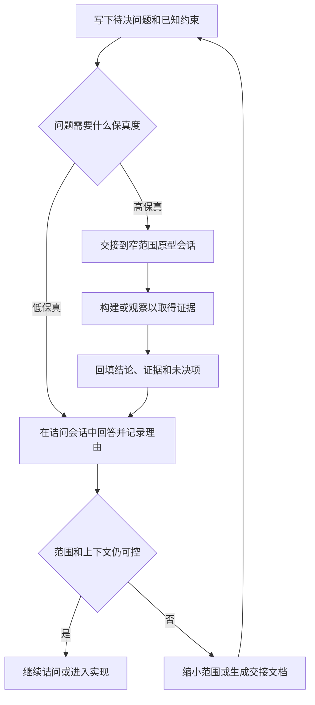

# 总结

## 核心结论

这支视频讨论的不是“怎样让 Agent 少问几句”，而是如何由人来控制规划会话。讲者把 “grill me” 与 “grill with docs” 定位为工程师的辅助工具：它们可以持续追问以达成共享理解，却不能替代人判断范围、证据需求、实现时机和停止条件。

“被问了 200 个问题”因此更像一个控制失灵的症状，而不是简单的提问数量问题。视频声称列举九类常见误区；从可执行角度，可将其收敛为六个控制点：问题保真度、范围、会话主导权、决策资产保存、模型选型和并行度。

## 六个控制点

1. **先分辨问题，而不是立刻回答。** 能用讨论、代码阅读或已有约束回答的低保真问题，适合在 grilling 中解决；需要体验、交互感受或端到端行为证据的高保真问题，不应靠继续追问硬答。

2. **把高保真问题转交原型。** 遇到“必须看见、试用或构建后才知道”的问题时，交接给一个窄范围的原型会话；把观察结果和已做决定回填到原规划会话，再继续处理其余问题。

3. **缩小范围，保护上下文。** 不要让 Agent 为遥远、庞大的未来计划数天任务。把范围拆成能独立讨论、实现和验证的切片；在清理、压缩或切换会话前，将决定、依据、未决问题和下一步写成可复用的交接产物。

4. **在人机对话中保持适度主动。** 过度被动会让 Agent 漫游、扩大范围、提出不该在文本中解决的问题；过度主动则可能无止境地辩论体验问题，迟迟不开始构建。人的职责是维护目标、范围和“现在该问还是该做”的节奏。

5. **按不确定性选择模型，而不是套固定分工。** 讲者的经验是：规划阶段常需借助模型的参数知识提出陌生的可能性，实施阶段则常拥有更多代码与计划上下文。这个经验可以作为测试起点，但不能推出“规划必用大模型、实现必用小模型”的通则；应根据任务、仓库证据、风险和质量门槛做小样本比较。

6. **并行是成熟后的吞吐策略。** 两个会话可以在等待、研究或思考间隙交替推进，但前提是每个会话都足够清晰，且自己能准确说明其状态。并行不是解决范围失控或上下文混乱的方法。

## 一套可复用的执行方式

- 先写出当前待决问题、已知约束和“答案会改变什么”。
- 判断它能否通过问答、查代码或现有文档解决；若不能，就开一个小原型而不是继续加问题。
- 每次完成一轮讨论，保存决定、理由、证据、未决项和下一步；在压缩或换会话前尤其如此。
- 为每个会话设置范围边界和停止条件。出现重复追问、范围扩张或仅凭感觉讨论时，暂停并改用原型、检索或代码阅读。
- 只在会话状态可见、决策能被回收时增加并行度；优先提高交接质量，而非同时打开更多线程。

## 应保留的边界

视频中的 “120K dumb zone”、规划依赖参数知识、实施主要依赖上下文、两会话可显著提高吞吐等，都是讲者的经验框架或工作流假设，不是跨模型、跨任务的固定事实。它们的正确用法是形成可测的假设：记录模型、任务、上下文长度、成功标准和返工量，再决定是否继续沿用。

# 辅助理解

## 把“200 个问题”改造成一个受控的规划循环

视频的关键提醒是：grilling 的产物不是聊天记录，而是逐步形成的共享理解、决策依据与下一步行动。提问数量本身不是质量指标；当问题不匹配、范围失控或人放弃主导权时，问题会不断累积而不转化为可实现的计划。

“Codex 问了 200 个问题”适合作为诊断信号：先检查问题是否需要更高保真度、范围是否过大、以及人是否还在引导会话。不要用强行限制次数来替代判断。

### 低保真可讨论，高保真应获取证据

低保真问题可以通过问答、已有约束、代码阅读或命名决策来收敛；高保真问题则依赖原型、实际构建、试用或可观察的行为。后者在纯文本会话里继续追问，常只会得到看似合理但缺乏证据的答案。

skill 文档中“一次问一个问题”与“可由 codebase 回答时先探索 codebase”的原则，正是为了避免把查证工作伪装成访谈。它让问题在进入人的注意力前，先经过已有代码和文档的过滤。

### 高低保真到实现的交接回路

补帧确认了“grilling → handoff 文档 → prototyping → 回填”的流程。由于这些补帧不在资源 manifest 中，本文只将其写为解释文字，不配置额外帧引用。实践时，交接产物至少应保留：决定、理由、支持证据、尚未解决的问题、当前范围和下一步动作。

### 控制范围与上下文，而不是崇拜固定阈值

讲者把过大的 scope 与上下文变长后的质量下降联系起来，并将约 120K token 的 “dumb zone”称为经验估计。可采取的工程原则是：用更小的纵向切片推进，在上下文仍可用时保存决策；但不要把 120K 当作通用的失效边界。真实阈值会随模型、任务、输入内容、信息位置和工具链而变化。

### 人必须既不放手，也不死扛

被动的一端是让 Agent 自行扩张访谈，最后用大量问题替代计划；过度主动的一端是持续争论本该通过构建验证的高保真问题。好的控制动作是明确指出目标、范围与下一次必须获得的证据，并在必要时切换到原型或实现。

### 参数知识与上下文知识：用于分析，不是简化分工

视频把文件、提示和工具返回称为 contextual knowledge，把训练中获得的通用理解称为 parametric knowledge。这个区分有助于问两个问题：当前决定缺的是仓库/工具证据，还是需要一个能提出陌生假设的模型？但二者会相互作用；上下文可能不完整或冲突，参数知识也可能不稳定。

讲者进一步主张规划阶段可用更强模型、实施阶段可用较弱模型。这应被当作待测试的工作流假设：为特定仓库设定样例，比较计划可执行性、遗漏、返工、测试通过率和成本，而不是只按“规划/实现”或参数规模二分。

### 并行与交接：在清晰之后增加吞吐

补帧显示讲者建议同时处理两场 grilling session，并强调先掌握基础、理解每个 session 正在做什么。这里的可迁移原则是：并行前先让每个会话有清晰目的、可恢复的交接物和明确的下一步；否则并行只会把未决问题、上下文消耗和认知负担同时放大。补帧不在 manifest 中，因此本段不引用帧。

## 事实核验

本次自动核验覆盖 6 个外部可核查陈述：**已确认 1 项、部分证实 1 项、未证实 3 项、已过时 1 项。** 下面保留视频中的实用洞见，同时标明其证据边界。

- **已确认 1 项：参数知识与上下文知识的区分。** 研究确实使用 parametric knowledge 与 contextual knowledge 来讨论预训练参数中的知识和推理时提供的外部上下文；文件、用户提示和工具结果在被带回模型输入后可成为该 turn 的上下文。[研究论文](https://arxiv.org/abs/2410.08414) 支持这种基础分析框架，但不保证任何一类知识始终可靠。

- **部分证实 1 项：保真度语言与《Shape Up》。** Ryan Singer 的《Shape Up》确实讨论高保真 mockup、低保真 sketch 和不同细节层级的取舍；视频将其延伸为“高/低保真问题”的教学分类。宜表述为“借用《Shape Up》关于保真度与抽象层级的思路”，而不是把这套问题分类说成书中的正式术语。[导言](https://basecamp.com/shapeup/0.3-chapter-01) 与 [shaping 原则](https://basecamp.com/shapeup/1.1-chapter-02) 支持这一较谨慎的归属。

- **未证实 1 项：120K dumb zone。** 长上下文任务可能出现质量下降，尤其在需要使用中间位置信息时；但没有证据支持“多数前沿模型在 120K token 进入 dumb zone”这一统一阈值。应按目标模型和任务评测，并及时拆分或交接上下文。[长上下文研究](https://aclanthology.org/2024.tacl-1.9.pdf)、[GPT-5 文档](https://developers.openai.com/api/docs/models/gpt-5) 和 [Gemini 长上下文文档](https://ai.google.dev/gemini-api/docs/long-context) 说明了容量与实际质量并不等同。

- **未证实 1 项：规划强模型、实现弱模型。** 这是讲者的工作流经验，并非通行规则。规划可能高度依赖仓库事实和检索，实施也可能需要算法、框架与安全方面的内部知识；模型对两类知识的利用会随任务、冲突和输入变化。[参数与上下文知识研究](https://arxiv.org/abs/2410.08414) 与 [长上下文研究](https://aclanthology.org/2024.tacl-1.9.pdf) 都不足以推出固定分工。

- **未证实 1 项：stars 超过 G Stack。** 视频中的 GitHub star 比较属于历史瞬时数据，缺少与视频时刻绑定的 API 快照或归档，不能用当前页面倒推。它不应进入长期学习结论；若要记录，应同时保存核验时间和快照。[skills 仓库](https://github.com/mattpocock/skills)、[G Stack 仓库](https://github.com/garrytan/gstack) 与 [GitHub starring 文档](https://docs.github.com/en/rest/activity/starring) 仅能说明可获取的数据类型。

- **已过时 1 项：课程折扣与开课状态。** 视频中的倒计时、价格和具体 cohort 状态已经过时；即使课程页仍说明 lessons、office hours 和 Discord 等内容，招生、日期和权益也应以当前官方页面为准。[AI Coding for Real Engineers 页面](https://www.aihero.dev/cohorts/ai-coding-for-real-engineers-m0k0w)。

# Data

## 增强转写稿

[00:00] My “grill me” and “grill with docs” skills have been out for a while now, and people
[00:04] all around the world are using them as a replacement for Plan Mode in agents.
[00:08] However, I sometimes hear from people using them, like, “Codex just asked me 200 questions
[00:13] on this issue here,” and I kind of wince a little bit.
[00:17] The idea of these skills is that they relentlessly question you; they continually ask
[00:22] you questions until you reach a shared understanding of something.
[00:25] That means it relies on the skill of the person answering the questions.
[00:30] The person answering the questions—in other words, you, using the “grill me” skill—needs
[00:34] to be good at planning.
[00:35] You need to understand things like scope.
[00:37] You need to have a sense of what level of fidelity different questions require.
[00:43] And this is why I want to make this video.
[00:45] I want to make you really good at using these skills, because the skills themselves are
[00:49] really not super long, and they are designed to aid you as an engineer, not replace you
[00:54] as an engineer.
[00:55] So I have a list of nine things that people get wrong with these skills, but before we
[01:00] do that, we are going to look at a few lenses for understanding those failure modes,
[01:05] because if we do not understand them correctly, we will not be able
[01:07] to change them.
[01:08] Now, if you like the way I teach and the thing I am teaching about, then you are
[01:12] going to really enjoy my AI Coding for Real Engineers cohort, which the next one starts
[01:16] on June 1st.
[01:18] There is only one day and 11 hours left to get 30% off, so you definitely want to get on
[01:24] that.
[01:25] Hopefully I can post this video today, so you have time to purchase it.
[01:28] So let us get started.
[01:29] The first thing to consider is that, when we go into a grilling session, what we are
[01:32] really trying to do is answer questions.
[01:35] There are probably some things we do not know about the thing we are going to
[01:38] build.
[01:39] These questions require different levels of fidelity to answer.
[01:43] I am taking this language from Ryan Singer’s amazing book, Shape Up.
[01:47] High-fidelity questions are questions where you need a really zoomed-in, detailed
[01:53] high-fidelity image in order to understand them.
[01:57] That might mean, for instance, how will this piece of UI feel when we use it?
[02:02] Should we split all of these form fields into multiple different pages, or should we have
[02:06] one enormous form where we fill them in?
[02:09] The only real way to get that kind of understanding is with a high-fidelity
[02:14] prototype, or by actually building the whole thing.
[02:17] Low-fidelity questions are questions you do not need a high-fidelity prototype
[02:22] or image to answer—things like, “What URL should this route live on?” or things
[02:27] like that.
[02:28] You really just need to answer the question.
[02:30] And the first failure mode I see with the “grill me” skills is trying to answer high-fidelity
[02:35] questions during a grilling session.
[02:37] In other words, there are questions that are grillable—answerable in a
[02:41] grilling session—and questions that are ungrillable: questions that are not answerable in a grilling
[02:46] session.
[02:47] So what do you do when you encounter an ungrillable question—when the question is
[02:51] about feel, and you need to see something at a higher fidelity in order to answer
[02:56] it?
[02:57] Well, what I tend to do is have a prototyping handoff.
[03:02] So let us imagine that in my first session here, in the blue, I have done some grilling
[03:06] and reached an ungrillable question—a question I need to see at a higher fidelity.
[03:11] What I do is use the “handoff” skill, which I will link below, to hand off to a prototyping
[03:17] session, where I then spend another session just prototyping that question,
[03:22] seeing it at a higher fidelity.
[03:24] And then whatever I learn from that, I hand off back to the original grilling session
[03:29] so I can continue with the grillable questions.
[03:32] So that is what a lot of my sessions look like: you have a “grill with docs” session, then
[03:35] hand off to a prototype session, and hand off back to the original “grill with docs” session.
[03:41] That is how I answer those higher-fidelity questions.
[03:44] The next concept we need to understand is scope: how large a thing you are grilling.
[03:50] If the thing you are grilling is too big, then you are going to end up hitting two problems.
[03:55] First of all, if the scope is too large, then you are probably going to have high-fidelity
[03:58] questions hidden in there that are quite hard to answer without actually
[04:04] seeing the full thing.
[04:05] It is always easier to build off something that you know works and that you have done
[04:10] a good job on, rather than trying to endlessly plan scope out into the future.
[04:15] This is what a lot of people run into when they try to schedule, you know, days and days of
[04:19] tasks for their AI to work on: they end up with crap because they are not building
[04:25] on a foundation that they are aligned with.
[04:28] In other words, they have tried to push too far into the future without building
[04:33] on something solid.
[04:34] There is also a practical constraint here.
[04:36] If you end up grilling something too large, you are going to hit the dumb zone
[04:41] of the model.
[04:42] Sure, you might start your grilling session with a nearly empty context window,
[04:46] but as you keep going and going and going, you have hardly got into the thing that
[04:50] you are planning, have not even answered half the questions yet, and are already hitting the
[04:54] dumb zone, at which point you might need to hand off, compact, or do something
[04:59] a little awkward. All of that could have been avoided if you had picked a smaller
[05:03] scope to start with; then you would be able to comfortably grill within the smart zone.
[05:07] For those who do not know, I estimate that the dumb zone begins for most state-of-the-art models at about 120K tokens;
[05:13] so you have to keep a keen eye on your context
[05:17] window to make sure you do not push past that, because the model starts getting
[05:20] too strained in its attention relationships and starts making stupider decisions.
[05:25] What this basically means is: if you start out with a large scope like this, which is
[05:29] probably too big for the agent to handle, it might be better to ask the agent ahead of time
[05:33] to break down the scope into smaller scopes, which you can then grill individually
[05:38] and answer all of those questions.
[05:41] The next lens I want you to consider is whether you are being passive or
[05:45] active with the agent, specifically in your grilling sessions.
[05:50] Many of these huge grilling sessions that I see people having make me worry that they are being
[05:54] too passive with the agent. When I am grilling, I am always quite active, always trying
[06:00] to lead the conversation. And remember: it is a conversation, not an interview. The agent
[06:04] is asking you these questions, but it is your job to figure out where you are going, figure
[06:10] out the scope, and keep things on track. If you are being too passive, then it is
[06:14] very easy for the agent to do stupid things with the interview, like ask you 540
[06:19] questions, explode the scope, or ask questions about things that are way too high-fidelity.
[06:25] You have to take an active hand. But it is also possible to be too active—to keep
[06:30] grilling on something that is too high-fidelity when you actually need to build something
[06:35] to see it in action.
[06:37] So there are two failure modes hidden here: being too passive—in other words, sitting
[06:40] back too much—and being too pigheaded, not getting to code fast enough.
[06:47] So it is important to consider where you fall on this
[06:50] axis when using these skills: whether you are too passive, or just too pushy and active.
[06:54] Another failure mode is that people do not value what they are creating during
[06:59] the grilling session. When you are answering questions and growing
[07:03] the context window with valuable answers and design decisions
[07:09] you have made, this little blue section of the context window is incredibly valuable.
[07:14] Usually, if you have enough budget left, your goal is to immediately
[07:17] start implementing. In other words, you plan for a while, then
[07:21] you say, “Okay, let us implement this.” You do not need to hand off; you have enough
[07:24] space left in the context window to implement it based on the design decisions I have already
[07:28] made. However, if you are at the point where you need to quit out
[07:32] of this—where you basically need to hand off—then it is probably time to make a PRD. My “to PRD”
[07:38] skill is a nice way to create a handoff document that is more tailored to engineering,
[07:43] which can be useful across multiple sessions or just a single session. But one crazy thing
[07:47] I have seen people do wrong is clear the context first, then create a
[07:52] new context window and just run “to PRD” in there. This is totally crazy to me. What are
[07:57] you doing? You have created this incredible session where you have, you know,
[08:02] 100,000 tokens of really good design decisions, and you are just going to throw it away. Every
[08:07] grilling session—every decision you make in that session—is so valuable.
[08:11] That should be recorded somewhere and either turned into code or put in a handoff
[08:16] document that you can refer to later. It is really important that you do not
[08:20] throw away the stuff inside the grilling session. I think this is probably just a skill issue.
[08:25] People need to be much more aware of context management and the decisions they are
[08:29] making around clearing, compacting, and handing off. So, yeah, that was a crazy one for me.
[08:34] Make sure you preserve the decisions you have made in your grilling session and create
[08:39] some kind of handoff artifact from them. Another thing people get wrong is that they
[08:42] use too dumb a model for grilling. Understanding which questions are low-fidelity, understanding
[08:48] which questions are high-fidelity, and figuring out the right questions to ask to prompt
[08:53] you to make a stronger design: that is something you need a good model for. If we think about
[08:57] where models draw their knowledge from, there are two sources. The first is
[09:02] their contextual knowledge: the material you pass to them in their context.
[09:07] This might come from reading files, user prompts, or research they conduct by calling
[09:11] tools and bringing their tool results back. But there is also their parametric knowledge:
[09:15] the things they were trained to see and understand. This is much less reliable, but
[09:20] it is what we are relying on here. We are relying on the model’s innate understanding
[09:27] of systems and applications to prompt us with good ideas—things we might not have considered
[09:33] yet. If we had considered them, we would have passed them in as contextual knowledge.
[09:37] But we are relying on its innate understanding to provide off-the-wall suggestions,
[09:44] strange ideas. When you are relying on parametric knowledge like this, you need a
[09:48] model with lots of parameters. That is usually what the big frontier models have.
[09:54] Not only that, but they are trained to a high standard. They are also simply
[09:57] more capable than smaller models. So using too dumb a model is a common failure
[10:03] mode I see during grilling, because we are so reliant on parametric knowledge. What most
[10:07] people do not know is that you can use a somewhat dumber model for implementation, because
[10:11] most of the information you pass there is contextual. By the time you get
[10:15] to implementation, you usually have a detailed implementation plan. You are passing in the
[10:19] relevant files in the codebase, so it has things to copy. Not much
[10:23] of that is parametric; it is mostly contextual. Finally—and this is a dead simple one, but
[10:27] so many people do not do it—you should grill multiple sessions in parallel. Usually,
[10:30] the way it works is I am grilling one session, then I type something to it—or, usually,
[10:35] I am dictating to it. I answer its question, then I go over to the other session,
[10:39] which is usually finished by that point. I answer its question, then I go back to the original
[10:44] session, and I bounce around like this. People say this is, you know, context switching,
[10:48] but really it is just managing two separate Slack threads at the same time.
[10:52] It is really not that hard. Sure, you are making a lot of high-level decisions here.
[10:58] But this is the only way I have found to increase throughput and get more
[11:01] planning done in less time. I usually max out at two sessions, unless one of them
[11:05] is doing a particularly long-running task, like research; in that case, I might try three
[11:10] if I am feeling spicy and high-energy, but mostly two is my limit. Either way,
[11:14] I am doubling my throughput, and it feels pretty nice. You should definitely do
[11:18] this if you have the mental capacity for it. I also think grilling is something
[11:21] you get better at. As you get better at it, you can add more throughput and
[11:25] parallelism. So let us summarize everything we learned. We learned that grilling is primarily
[11:29] about questions. We have low-fidelity questions and high-fidelity questions. Low-fidelity
[11:35] questions can be answered just by a question and answer. In other words, they are grillable,
[11:39] but high-fidelity ones are ungrillable. You may need to go into prototype mode, using
[11:44] “handoff” to hand off to a prototyping session, to figure out that question—or maybe
[11:49] that question and a bunch of others—and then go back to the original grilling session to continue.
[11:54] Figuring out the correct scope of the work is essential. If you try to grill too much,
[11:58] then you will end up blowing through your context window, burning your own stamina,
[12:03] and you will not have anything to show for it. If you are too passive in your grilling sessions,
[12:07] then you will sit there while the computer, you know, just bombards
[12:11] you with more and more questions. But if you are too active, you might end up grilling
[12:15] endlessly on high-fidelity questions when what you really need is to get to code. You
[12:20] need a smart model so you can rely on its parametric knowledge to give you better
[12:25] suggestions and better questions to answer. Finally, I would recommend grilling
[12:29] two sessions at once. Once you have mastered these basics and understand what each session
[12:34] is doing, you should be able to flip between them really nicely. You could probably
[12:37] even go up to four if you have a more plastic brain than I do. Overall, thanks for watching,
[12:41] pals. And if you enjoyed this, you will really enjoy my AI Coding for Real
[12:46] Engineers cohort; there is one day and 10 hours left to get it at a discount. You get a bunch of
[12:51] video content and interactive exercises organized for maximum speed and maximum efficiency
[12:57] of learning. You get me to answer your questions in office hours and in the Discord chat. It is
[13:02] great. By the way, if you dug this video, my YouTube is exploding recently.
[13:06] So thank you all for that. I massively appreciate it. I really enjoy making these videos and
[13:10] love making the skills. I think we have just beaten Garry Tan’s G Stack in terms
[13:15] of number of stars, which is wild to me. If you have an idea for a video you would like me
[13:19] to make next, let me know, because I thrive on your suggestions and ideas.
[13:25] So thanks for watching, and I will see you very soon.

## 原始转写稿

[00:00] My grill me skills and grill with docs have been out there for a while now, and people
[00:04] all around the world are using them as a replacement for plan mode in Agents.
[00:08] However, I sometimes hear from people using them, like Codex just asked me 200 questions
[00:13] this issue here, and I kind of wince a little bit.
[00:17] The idea of these skills is that they relentlessly question you, is that they continually ask
[00:22] you questions until you reach a shared understanding about something.
[00:25] And what that does is it relies on the skill of the person answering the questions.
[00:30] The person answering the questions, in other words, you, using the grill me skill, need
[00:34] to be good at planning.
[00:35] You need to understand things like scope.
[00:37] You need to have a sense of what questions require what level of fidelity to answer.
[00:43] And this is why I want to make this video.
[00:45] I want to make you really good at using these skills, because these skills themselves are
[00:49] really not super long, and they're designed to aid you as an engineer, not replace you
[00:54] as an engineer.
[00:55] So I've got a list of nine things that people get wrong with these skills, but before we
[01:00] do that, we're going to look at a few lenses for how to understand those failure modes,
[01:05] because if we don't understand them in the correct way, we're not going to be able
[01:07] to change them.
[01:08] Now, if you like the way I teach and you like the thing I'm teaching about, then you are
[01:12] going to really enjoy my AI coding for real engineers cohort, which the next one starts
[01:16] on June 1st.
[01:18] It has only one day and 11 hours left for 30% off, so definitely you want to get on
[01:24] that.
[01:25] Hopefully I can post this video today, so you have time to actually purchase it.
[01:28] So let's get started.
[01:29] The first thing to consider here is that when we go into a grilling session, what we're
[01:32] really trying to do is answer questions.
[01:35] There are probably some things that we don't know about the thing that we're going to
[01:38] build.
[01:39] Now, these questions come at different levels of fidelity that are required to answer.
[01:43] I'm taking this language from Ryan Singer's amazing book, Shape Up.
[01:47] High fidelity questions are questions where you need a really zoomed in, really detailed
[01:53] high fidelity image in order to understand it.
[01:57] And that might mean, for instance, how will this piece of UI feel when we're using it?
[02:02] Should we split all of these form fields into multiple different pages, or should we have
[02:06] one enormous form where we fill them in?
[02:09] The only real way you're going to get kind of understanding of that is a high fidelity
[02:14] prototype or actually building the whole thing.
[02:17] As low fidelity questions are questions that you don't need a high fidelity kind of prototype
[02:22] or image to answer, things like what should what URL should this root live on or things
[02:27] like that?
[02:28] You really just need to answer the question.
[02:30] And the first failure mode I see with the grill me skills is trying to answer high fidelity
[02:35] questions during a grilling session.
[02:37] In other words, there are questions that are grillable, in other words, answerable in a
[02:41] grilling session, and questions that are ungrillable, questions that are not answerable in a grilling
[02:46] session.
[02:47] So then what do you do when you encounter an ungrillable question when the question is
[02:51] about feel when you need to actually see something higher fidelity in order to answer
[02:56] it?
[02:57] Well, the thing I tend to do is I tend to have a prototyping handoff.
[03:02] So let's imagine that in my first session here in the blue, I've done some grilling
[03:06] and I reach an ungrillable question, a question that I need to see in a higher fidelity.
[03:11] What I do is I use the handoff skill, which I will link to below to handoff to a prototyping
[03:17] session where I will then spend another session, kind of just prototyping on that question,
[03:22] seeing it in a higher fidelity.
[03:24] And then whatever I learn from that, I will handoff back to the original grilling session
[03:29] so that I can continue with the grillable questions.
[03:32] So that's what a lot of my sessions look like where you have a grill with docs, you then
[03:35] handoff to a prototype session and you handoff back to the original grill with doc session.
[03:41] That's how I answer those more higher fidelity questions.
[03:44] The next concept we need to understand here is scope, how large a thing you are grilling.
[03:50] If the thing you're grilling is too big, then you're going to end up hitting two problems.
[03:55] First of all, if the scope is too large, then you're probably going to have high fidelity
[03:58] questions that are kind of hidden in there that is quite hard to answer without actually
[04:04] seeing the full thing.
[04:05] It's always easier to build off of something that you know works and that you've done
[04:10] a good job on rather than trying to endlessly plan scope out into the future.
[04:15] This is what a lot of people hit when they try to schedule, you know, days and days of
[04:19] tasks for their AI to work on, is that they end up with crap because they aren't building
[04:25] on a foundation that they are aligned with.
[04:28] In other words, they've tried to sort of push out too far into the future without building
[04:33] on something solid.
[04:34] There's also a practical constraint here.
[04:36] If you end up grilling on too large a thing, you're going to end up hitting the dumb zone
[04:41] of the model.
[04:42] Sure, you might start your grilling session with a, you know, nearly empty context window,
[04:46] but as you keep going and going and going, okay, you've hardly got to the thing that
[04:50] you're, you know, not even answered half the questions yet, and we're still hitting the
[04:54] dumb zone up here, at which point you might need to hand off or compact or do something
[04:59] a little bit awkward, all of which could have been avoided if you've just picked a smaller
[05:03] scope to start with, and then you'd be able to comfortably grill within the smart zone.
[05:07] For those who don't know, about 120K is where I estimate most state-of-the-art models, that's
[05:13] where their dumb zone begins, and so you've got to keep a really keen eye on your context
[05:17] window in order to make sure you don't push past that because the model will start getting
[05:20] too strained, kind of in its attention relationships, and start making stupider decisions.
[05:25] What this basically means is if you start out with a large scope like this, which is
[05:29] probably too big for the agent to handle, instead it might be better to ahead of time
[05:33] ask the agent to break down this scope into smaller scopes, which you can then grill on
[05:38] individually and answer all of those questions.
[05:41] The next lens I want you to look at here is whether you're being passive or whether you're
[05:45] being active with the agent, and specifically in your grilling sessions.
[05:50] Many of these huge grilling sessions that I see people having, I worry that they're being
[05:54] too passive with the agent. When I'm doing grilling I'm always quite active, always trying
[06:00] to lead the conversation. And remember, it's a conversation, not an interview. The agent
[06:04] is asking you these questions, but it is your job to figure out where you're going and figure
[06:10] out the scope and keep things on track. And so if you're being too passive, then it's
[06:14] very easy for the agent to just do stupid things with the interview, like ask you 540
[06:19] questions, explode the scope, ask questions about stuff that are way too low fidelity,
[06:25] you have to take an active hand. But it's also possible to be too active, to just keep
[06:30] grilling on something that is just too low fidelity when you need to actually build something
[06:35] to see the thing in action.
[06:37] And so there are two failure modes hidden here, being too passive, in other words, sitting
[06:40] back too much, and actually being a bit too pigheaded and not getting to code fast enough.
[06:47] So it's important to consider when you're using these skills where you fall on this
[06:50] axis, whether you're too passive, or whether you're actually just a bit too pushy and active.
[06:54] Another failure mode here is that people don't value the thing that they're creating during
[06:59] the grilling session, which is that when you're answering these questions, when you're growing
[07:03] this context window, with really valuable answers that you've given, design decisions
[07:09] that you've taken, this little blue bit of context window here is incredibly valuable.
[07:14] Now usually your goal here is that if you've got enough budget left, then you can immediately
[07:17] start going ahead and implementing. In other words, you plan for a little while and then
[07:21] you go, okay, let's just implement this, we don't need to hand off, we've got enough
[07:24] space left in the context window to just implement it based on the design decisions I've already
[07:28] taken. However, if you're already at the point where you need to, you know, quit out
[07:32] of this, you need to basically hand off, then it's probably time to make a PRD. My two PRD
[07:38] skill is a nice way of creating a handoff document that's kind of more tailored to engineering,
[07:43] which can be useful on a multi-session or just a single session. But one crazy thing
[07:47] I've seen people getting wrong is they actually clear the context first and they create a
[07:52] new context window and just run two PRD in there. This is totally crazy to me. What are
[07:57] you doing? You've created this incredible session here where you've got this, you know,
[08:02] 100,000 tokens of really good design decisions and you're just going to chuck it away. Every
[08:07] grilling session, every decision that you make in that session is so valuable, you know,
[08:11] that should be recorded somewhere and either turned into code or put into like a handoff
[08:16] document that you can kind of refer to later. It is really important that you don't just
[08:20] chuck away the stuff inside the grilling session. I think probably this is just a skill issue.
[08:25] People need to be a lot more aware of context management about kind of the decisions they're
[08:29] making in terms of clearing, compacting, handing off. So yeah, that was a crazy one for me.
[08:34] Make sure you preserve the decisions that you've made in your grilling session and create
[08:39] some kind of handoff artifact about them. Another thing people get wrong is that they
[08:42] use too dumb a model for grilling. Understanding which questions are low fidelity, understanding
[08:48] which questions are high fidelity, figuring out what the right questions to ask to prompt
[08:53] you to make a stronger design. That is something you need a good model for. If we think about
[08:57] where models draw their knowledge from, there are kind of two sources. The first one is
[09:02] their contextual knowledge, the stuff that you have past them specifically in their context.
[09:07] These might be from reading files or from user prompts or from research they do by calling
[09:11] tools and bringing their tool results back. But there's also their parametric knowledge,
[09:15] the things that they were trained to see and understand. This is much less reliable, but
[09:20] it is kind of what we're relying on here. We're relying on the model's innate understanding
[09:27] of systems and applications to prompt us with good ideas of things we might not have considered
[09:33] yet. Because if we had considered them, then we'd have passed them in as contextual knowledge.
[09:37] But we're relying on its kind of innate understanding in order to provide us with off-the-wall suggestions,
[09:44] strange ideas. Now, when you're relying on parametric knowledge like this, you need a
[09:48] model with lots of parameters. And that is usually what the big frontier models have.
[09:54] Not only that, but they're also, you know, top-of-the-line trained. They are also just
[09:57] more capable than smaller models. And so using two-dumber model is a really common failure
[10:03] mode I see during grilling because we're so reliant on parametric knowledge. What most
[10:07] people don't know is you can actually use a kind of dumber model for implementation because
[10:11] most of the information you're passing there is contextual. You know, by the time you get
[10:15] to implementation, you've usually got a detailed implementation plan. You're passing in the
[10:19] relevant files in the code base. So it's got some things to copy. You know, not a lot
[10:23] of that is parametric. It's mostly contextual. Finally, and this is a dead simple one, but
[10:27] so many people don't do this. You should grill multiple sessions in parallel. Usually
[10:30] the way it works is I'm grilling one session and then I type something to it or usually
[10:35] I'm dictating to it. I answer its question and then I go over into the other session
[10:39] that's usually finished by that point. I answer its question and then I go back to the original
[10:44] session and I just bounce around like this. People say this is, you know, context switching,
[10:48] but really it's just managing two separate slack threads at the same time. You know,
[10:52] it's really not that hard. And sure, you're making a lot of high level decisions here.
[10:58] But this is really the only way I've found of increasing throughput and getting more
[11:01] planning done in less time. Usually I max out at two sessions here, unless one of them
[11:05] is doing a particularly long running task like some research, in which case I will try three
[11:10] if I'm feeling spicy and feeling high energy, but mostly two is my limit. But either way,
[11:14] I'm doubling my throughput and it feels pretty nice to do and you should definitely be doing
[11:18] this if you have the mental capacity for it. I also think that grilling is something that
[11:21] you do get better at. And as you get better at it, you can add more throughput and more
[11:25] parallelism. So let's summarize all the things we learned. We learned that grilling is primarily
[11:29] about questions. We have low fidelity questions and high fidelity questions. Low fidelity
[11:35] can be answered just by a question and answer. In other words, it's a grillable question,
[11:39] but high fidelity ones are ungrillable. You may need to go into a prototype mode by using
[11:44] handoff to handoff to a prototyping session to just figure out that question or maybe
[11:49] that question and a bunch of others and then go back to the original grilling to continue.
[11:54] Figuring out the correct scope of the work is essential. If you try to grill too much,
[11:58] then you will end up just kind of blowing through your context window, burning your own stamina
[12:03] and you won't have anything to show for it. If you're too passive in your grilling sessions,
[12:07] then you're just going to sit there while the computer just says, you know, bombards
[12:11] you with more and more questions. But if you're too active, then you might end up just grilling
[12:15] endlessly on low fidelity questions when what you really need is just to get to code. You
[12:20] need a smart model so that you can rely on its parametric information to give you better
[12:25] suggestions and give you better questions to answer. And finally, I would recommend grilling
[12:29] two sessions at once. Once you've mastered these basics and you understand what each session
[12:34] is doing, you should be able to flip between them really nicely. And probably you could
[12:37] even go up to four if you have a more plastic brain than I do. Overall, thanks for watching
[12:41] pals. And if you enjoyed this, then you'll really enjoy my air coding cohort for real
[12:46] engineers, which is one day 10 hours left to get it at a discount. You get a bunch of
[12:51] video content and interactive exercises organized in a way for maximum speed and maximum efficiency
[12:57] of learning. You get me to answer your questions in office hours and in the discord chat. You
[13:02] know, it's great. By the way, if you dug this video, my YouTube is exploding recently.
[13:06] So thank you all for that. I massively appreciate it. I really enjoy making these videos and
[13:10] loving making the skills. I think we're up to we just beat Gary Tan's G stack in terms
[13:15] of number of stars, which is wild to me. And if you have an idea for a video you want me
[13:19] to make next, then let me know about it because I thrive off your suggestions and your ideas.
[13:25] So thanks for watching. And I will see you very soon.

## 原始关键帧

### 关键帧 1

### 关键帧 2

### 关键帧 3

### 关键帧 4

### 关键帧 5

### 关键帧 6

### 关键帧 7

### 关键帧 8

### 关键帧 9

### 关键帧 10

