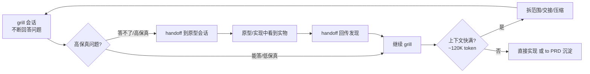
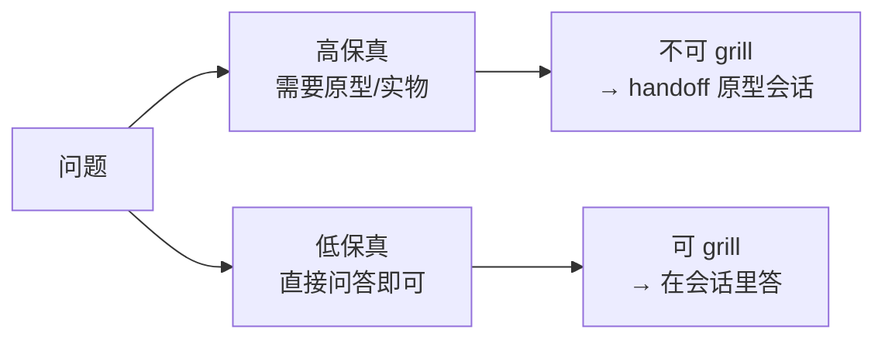
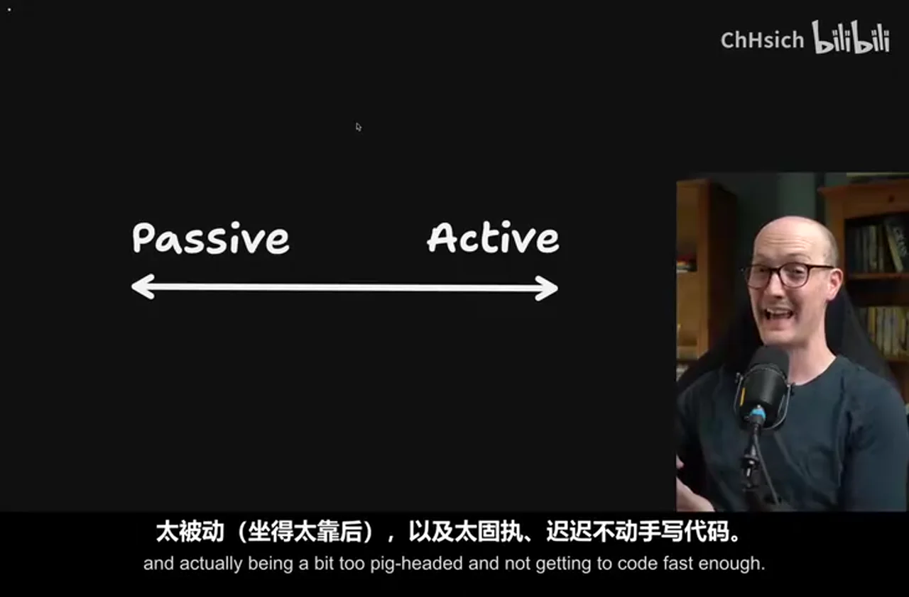
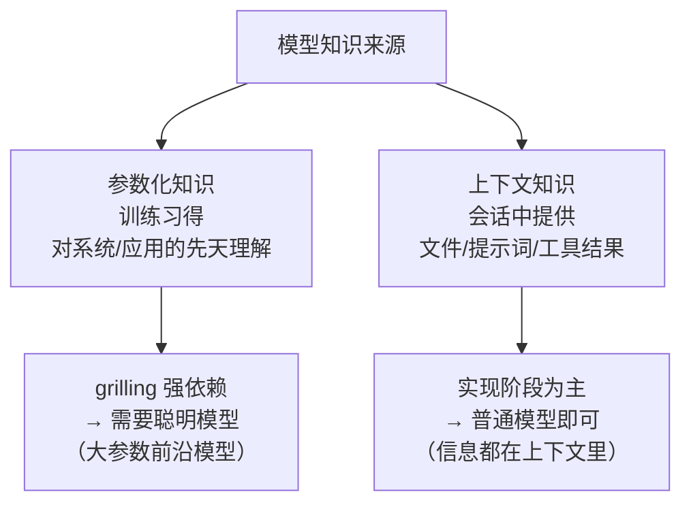
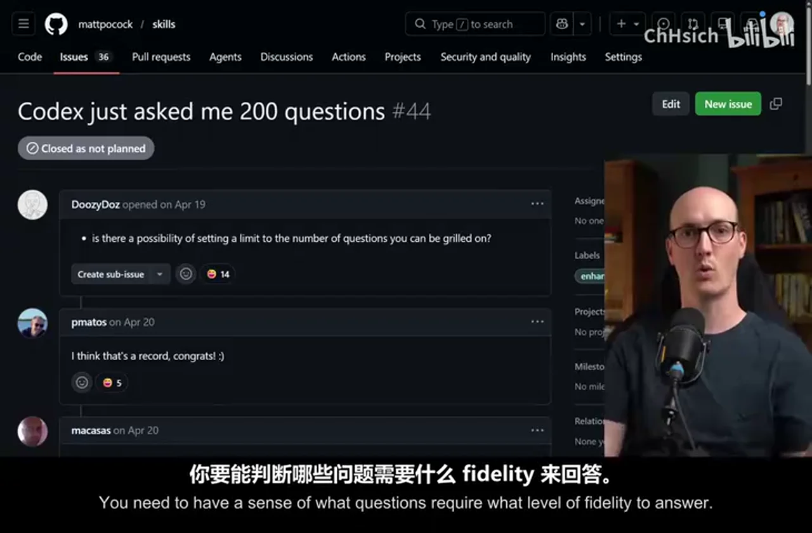
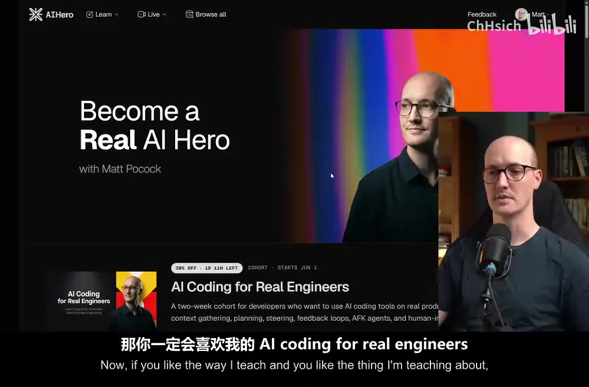
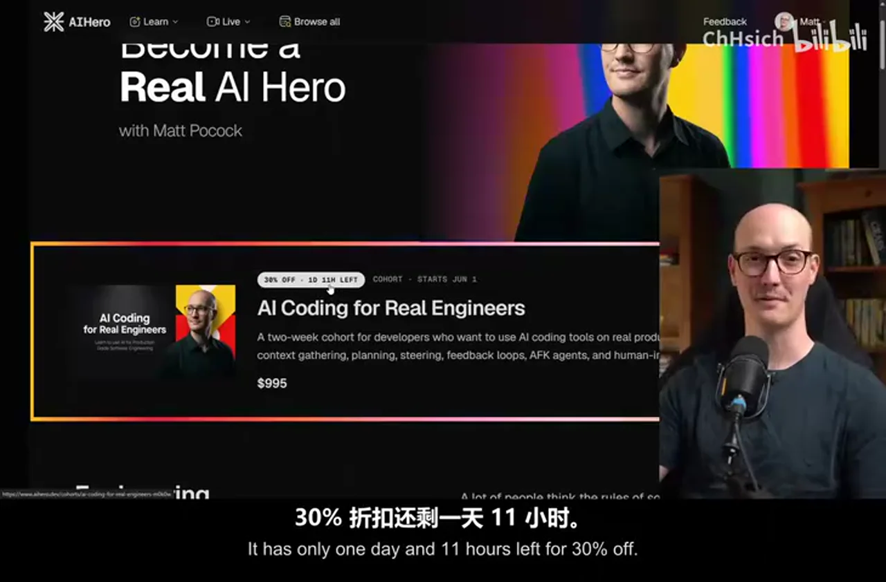
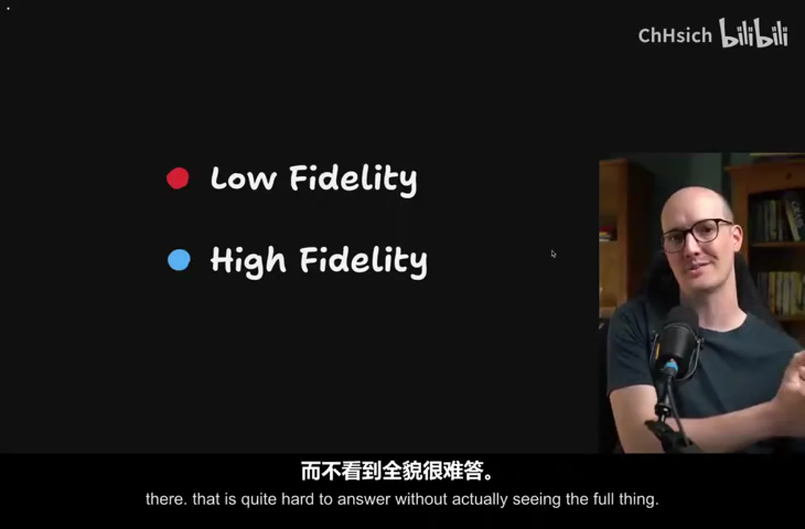

# 总结稿

## 视频速览

Matt Pocock 在这期 25 分钟的视频里，拆解他的 `grill me` / `grill with docs` 两个 skill 发布以来使用者最常踩的坑。这两个 skill 用"不断追问"的方式替代 Agent 的 Plan Mode，但能否发挥作用，取决于回答问题的人是否擅长规划：懂不懂判断问题的保真度、会不会把握范围、能不能在追问中主动把控节奏。

## 一句话总结

追问式规划的价值上限由"你"决定：把问题按保真度分流（能答的直接答、答不了的交由原型会话）、把范围拆小以留在模型的"聪明区"、主动主导对话节奏、珍视会话里积累的设计决策，并用聪明模型追问、普通模型实现。

## 理解失败模式的四个视角

- **问题保真度**：高保真问题（如某个 UI 用起来什么感觉）需要原型或实物才能回答，属于"不可 grill"的问题；低保真问题（如 URL 放哪）直接问答即可。概念来自 Ryan Singer 的《Shape Up》。
- **范围（scope）**：一次 grill 的范围太大，会埋着难答的高保真问题，并很快撞上模型的"变笨区"（作者估计约 12 万 token 起）。正确做法：先让 agent 把大范围拆成小范围，逐个 grill。
- **主动 vs 被动**：太被动 → agent 轰炸你 540 个问题、无限扩范围；太主动 → 在低保真问题上死磕、迟迟不写代码。两者都是失败模式。
- **模型选择**：追问依赖模型的参数化知识（对系统和应用的先天理解），要用聪明的前沿模型；实现阶段主要靠上下文知识（文件、计划），可以用普通模型。

## 九个误区（按视频叙述归纳）

1. 在 grill 会话里硬答高保真问题——应该用 `handoff` 交接给一个原型会话，看完再回来。
2. 一次 grill 的范围太大——先拆小范围，别撞进"变笨区"。
3. 太被动，任由 agent 问几百个问题、扩张范围。
4. 太主动/太固执，在低保真问题上没完没了，迟迟不进入代码。
5. 不珍视追问会话的价值——清空上下文再跑 `to prd`，等于扔掉近十万 token 的设计决策。
6. 用太笨的模型追问——追问强依赖参数化知识，需要大参数模型。
7. 不并行追问多个会话——并行两个会话，规划吞吐量基本翻倍（多数人上限是两个）。
8. 不理解"高保真问题不可 grill"与"低保真问题不值得反复 grill"的区分。
9. 不做交接产物——会话结束时应保留设计决策，直接实现或沉淀成 PRD 类交接文档。

## 可操作建议

- 会话里遇到"看不到实物就答不了"的问题，停下来做一次原型 handoff。
- 盯紧上下文占用，接近 ~120K token 前主动拆范围/交接/压缩。
- 把追问当成对话而不是采访：你来定方向、范围和节奏。
- 设计决策随手记录，别清空上下文重来。
- 模型分工：追问用聪明模型，实现可以用便宜/较快的模型。
- 有精力就开两个追问会话轮流推进。

## 事实核查说明

本视频没有可外部验证的客观事实主张：约 12 万 token 的"变笨区"是作者本人估计（视频中明确说 "I estimate"），课程促销信息属市场内容，均未纳入核查。

# 辅助理解

## 一句话理解

"追问式规划（grilling）本质是把'我该怎么设计'拆成一个个问题，由你决定哪些直接答、哪些做原型、哪些跳过——而模型的聪明程度决定问题质量，你的规划能力决定最终架构。"

## 核心工作流：grill → handoff → 原型 → 回传

## 保真度：哪些问题该在会话里答

- 高保真的典型例子："这个 UI 用起来什么感觉？""表单拆成多页还是一页？"——看不到东西就答不准。
- 低保真的典型例子："路由放哪个 URL？"——回答即可。
- 误区：拿高保真问题在纯问答里硬答，或反过来在低保真问题上反复纠结不写代码。

## 主动 vs 被动：对话，不是采访

 

- 太被动：agent 会问 540 个问题、无限扩范围、问一堆低保真问题——因为它在"采访"你，而不是等你的方向。
- 太主动：死磕低保真问题，迟迟不进入代码，规划成了拖延。
- 平衡点：由你定方向、范围、节奏；保真度不够就去做原型，保真度够了就尽快实现。

## 参数化知识 vs 上下文知识：为什么追问要用聪明模型

追问的价值在于模型用"训练里见过的无数系统和模式"给你出主意、指出你没考虑过的方向；这种能力来自参数化知识，规模越大通常越可靠。实现阶段模型主要是"照上下文抄"，所以可以用更便宜的模型。

## 变笨区（作者估计，非精确事实）

视频估计当前主流模型大约在上下文 12 万 token 之后进入"变笨区"——注意力关系变得吃力，决策质量下降。所以：范围拆小、盯紧上下文、及时交接/压缩。这是 Matt Pocock 的经验估计，并非精确指标。

## 阅读提醒

- 标题说 9 个误区，视频正文以"四个视角 + 若干坑"的方式展开，笔记已按内容归纳，未逐条对上数字。
- "约 12 万 token 变笨"是作者估计；不同模型实际表现差异很大。
- 促销信息（6 月 1 日开营、30% 折扣倒计时）已过期，仅作为视频背景，不做行动依据。

# Data

## 增强转写稿


[00:00] My grill me skills and grill with docs have been out there for a while now, and people
[00:04] all around the world are using them as a replacement for plan mode in Agents.
[00:08] However, I sometimes hear from people using them, like Codex just asked me 200 questions
[00:13] this issue here, and I kind of wince a little bit.
[00:17] The idea of these skills is that they relentlessly question you, is that they continually ask
[00:22] you questions until you reach a shared understanding about something.
[00:25] And what that does is it relies on the skill of the person answering the questions.
[00:30] The person answering the questions, in other words, you, using the grill me skill, need
[00:34] to be good at planning.
[00:35] You need to understand things like scope.
[00:37] You need to have a sense of what questions require what level of fidelity to answer.
[00:43] And this is why I want to make this video.
[00:45] I want to make you really good at using these skills, because these skills themselves are
[00:49] really not super long, and they're designed to aid you as an engineer, not replace you
[00:54] as an engineer.
[00:55] So I've got a list of nine things that people get wrong with these skills, but before we
[01:00] do that, we're going to look at a few lenses for how to understand those failure modes,
[01:05] because if we don't understand them in the correct way, we're not going to be able
[01:07] to change them.
[01:08] Now, if you like the way I teach and you like the thing I'm teaching about, then you are
[01:12] going to really enjoy my AI coding for real engineers cohort, which the next one starts
[01:16] on June 1st.
[01:18] It has only one day and 11 hours left for 30% off, so definitely you want to get on
[01:24] that.
[01:25] Hopefully I can post this video today, so you have time to actually purchase it.
[01:28] So let's get started.
[01:29] The first thing to consider here is that when we go into a grilling session, what we're
[01:32] really trying to do is answer questions.
[01:35] There are probably some things that we don't know about the thing that we're going to
[01:38] build.
[01:39] Now, these questions come at different levels of fidelity that are required to answer.
[01:43] I'm taking this language from Ryan Singer's amazing book, Shape Up.
[01:47] High fidelity questions are questions where you need a really zoomed in, really detailed
[01:53] high fidelity image in order to understand it.
[01:57] And that might mean, for instance, how will this piece of UI feel when we're using it?
[02:02] Should we split all of these form fields into multiple different pages, or should we have
[02:06] one enormous form where we fill them in?
[02:09] The only real way you're going to get kind of understanding of that is a high fidelity
[02:14] prototype or actually building the whole thing.
[02:17] As low fidelity questions are questions that you don't need a high fidelity kind of prototype
[02:22] or image to answer, things like what URL should this root live on or things
[02:27] like that?
[02:28] You really just need to answer the question.
[02:30] And the first failure mode I see with the grill me skills is trying to answer high fidelity
[02:35] questions during a grilling session.
[02:37] In other words, there are questions that are grillable, in other words, answerable in a
[02:41] grilling session, and questions that are ungrillable, questions that are not answerable in a grilling
[02:46] session.
[02:47] So then what do you do when you encounter an ungrillable question when the question is
[02:51] about feel when you need to actually see something higher fidelity in order to answer
[02:56] it?
[02:57] Well, the thing I tend to do is I tend to have a prototyping handoff.
[03:02] So let's imagine that in my first session here in the blue, I've done some grilling
[03:06] and I reach an ungrillable question, a question that I need to see in a higher fidelity.
[03:11] What I do is I use the handoff skill, which I will link to below to handoff to a prototyping
[03:17] session where I will then spend another session, kind of just prototyping on that question,
[03:22] seeing it in a higher fidelity.
[03:24] And then whatever I learn from that, I will handoff back to the original grilling session
[03:29] so that I can continue with the grillable questions.
[03:32] So that's what a lot of my sessions look like where you have a grill with docs, you then
[03:35] handoff to a prototype session and you handoff back to the original grill with doc session.
[03:41] That's how I answer those more higher fidelity questions.
[03:44] The next concept we need to understand here is scope, how large a thing you are grilling.
[03:50] If the thing you're grilling is too big, then you're going to end up hitting two problems.
[03:55] First of all, if the scope is too large, then you're probably going to have high fidelity
[03:58] questions that are kind of hidden in there that is quite hard to answer without actually
[04:04] seeing the full thing.
[04:05] It's always easier to build off of something that you know works and that you've done
[04:10] a good job on rather than trying to endlessly plan scope out into the future.
[04:15] This is what a lot of people hit when they try to schedule, you know, days and days of
[04:19] tasks for their AI to work on, is that they end up with crap because they aren't building
[04:25] on a foundation that they are aligned with.
[04:28] In other words, they've tried to sort of push out too far into the future without building
[04:33] on something solid.
[04:34] There's also a practical constraint here.
[04:36] If you end up grilling on too large a thing, you're going to end up hitting the dumb zone
[04:41] of the model.
[04:42] Sure, you might start your grilling session with a, you know, nearly empty context window,
[04:46] but as you keep going and going and going, okay, you've hardly got to the thing that
[04:50] you're, you know, not even answered half the questions yet, and we're still hitting the
[04:54] dumb zone up here, at which point you might need to hand off or compact or do something
[04:59] a little bit awkward, all of which could have been avoided if you've just picked a smaller
[05:03] scope to start with, and then you'd be able to comfortably grill within the smart zone.
[05:07] For those who don't know, about 120K is where I estimate most state-of-the-art models, that's
[05:13] where their dumb zone begins, and so you've got to keep a really keen eye on your context
[05:17] window in order to make sure you don't push past that because the model will start getting
[05:20] too strained, kind of in its attention relationships, and start making stupider decisions.
[05:25] What this basically means is if you start out with a large scope like this, which is
[05:29] probably too big for the agent to handle, instead it might be better to ahead of time
[05:33] ask the agent to break down this scope into smaller scopes, which you can then grill on
[05:38] individually and answer all of those questions.
[05:41] The next lens I want you to look at here is whether you're being passive or whether you're
[05:45] being active with the agent, and specifically in your grilling sessions.
[05:50] Many of these huge grilling sessions that I see people having, I worry that they're being
[05:54] too passive with the agent. When I'm doing grilling I'm always quite active, always trying
[06:00] to lead the conversation. And remember, it's a conversation, not an interview. The agent
[06:04] is asking you these questions, but it is your job to figure out where you're going and figure
[06:10] out the scope and keep things on track. And so if you're being too passive, then it's
[06:14] very easy for the agent to just do stupid things with the interview, like ask you 540
[06:19] questions, explode the scope, ask questions about stuff that are way too low fidelity,
[06:25] you have to take an active hand. But it's also possible to be too active, to just keep
[06:30] grilling on something that is just too low fidelity when you need to actually build something
[06:35] to see the thing in action.
[06:37] And so there are two failure modes hidden here, being too passive, in other words, sitting
[06:40] back too much, and actually being a bit too pigheaded and not getting to code fast enough.
[06:47] So it's important to consider when you're using these skills where you fall on this
[06:50] axis, whether you're too passive, or whether you're actually just a bit too pushy and active.
[06:54] Another failure mode here is that people don't value the thing that they're creating during
[06:59] the grilling session, which is that when you're answering these questions, when you're growing
[07:03] this context window, with really valuable answers that you've given, design decisions
[07:09] that you've taken, this little blue bit of context window here is incredibly valuable.
[07:14] Now usually your goal here is that if you've got enough budget left, then you can immediately
[07:17] start going ahead and implementing. In other words, you plan for a little while and then
[07:21] you go, okay, let's just implement this, we don't need to hand off, we've got enough
[07:24] space left in the context window to just implement it based on the design decisions I've already
[07:28] taken. However, if you're already at the point where you need to, you know, quit out
[07:32] of this, you need to basically hand off, then it's probably time to make a PRD. My to PRD
[07:38] skill is a nice way of creating a handoff document that's kind of more tailored to engineering,
[07:43] which can be useful on a multi-session or just a single session. But one crazy thing
[07:47] I've seen people getting wrong is they actually clear the context first and they create a
[07:52] new context window and just run to PRD in there. This is totally crazy to me. What are
[07:57] you doing? You've created this incredible session here where you've got this, you know,
[08:02] 100,000 tokens of really good design decisions and you're just going to chuck it away. Every
[08:07] grilling session, every decision that you make in that session is so valuable, you know,
[08:11] that should be recorded somewhere and either turned into code or put into like a handoff
[08:16] document that you can kind of refer to later. It is really important that you don't just
[08:20] chuck away the stuff inside the grilling session. I think probably this is just a skill issue.
[08:25] People need to be a lot more aware of context management about kind of the decisions they're
[08:29] making in terms of clearing, compacting, handing off. So yeah, that was a crazy one for me.
[08:34] Make sure you preserve the decisions that you've made in your grilling session and create
[08:39] some kind of handoff artifact about them. Another thing people get wrong is that they
[08:42] use too dumb a model for grilling. Understanding which questions are low fidelity, understanding
[08:48] which questions are high fidelity, figuring out what the right questions to ask to prompt
[08:53] you to make a stronger design. That is something you need a good model for. If we think about
[08:57] where models draw their knowledge from, there are kind of two sources. The first one is
[09:02] their contextual knowledge, the stuff that you have past them specifically in their context.
[09:07] These might be from reading files or from user prompts or from research they do by calling
[09:11] tools and bringing their tool results back. But there's also their parametric knowledge,
[09:15] the things that they were trained to see and understand. This is much less reliable, but
[09:20] it is kind of what we're relying on here. We're relying on the model's innate understanding
[09:27] of systems and applications to prompt us with good ideas of things we might not have considered
[09:33] yet. Because if we had considered them, then we'd have passed them in as contextual knowledge.
[09:37] But we're relying on its kind of innate understanding in order to provide us with off-the-wall suggestions,
[09:44] strange ideas. Now, when you're relying on parametric knowledge like this, you need a
[09:48] model with lots of parameters. And that is usually what the big frontier models have.
[09:54] Not only that, but they're also, you know, top-of-the-line trained. They are also just
[09:57] more capable than smaller models. And so using a dumber model is a really common failure
[10:03] mode I see during grilling because we're so reliant on parametric knowledge. What most
[10:07] people don't know is you can actually use a kind of dumber model for implementation because
[10:11] most of the information you're passing there is contextual. You know, by the time you get
[10:15] to implementation, you've usually got a detailed implementation plan. You're passing in the
[10:19] relevant files in the code base. So it's got some things to copy. You know, not a lot
[10:23] of that is parametric. It's mostly contextual. Finally, and this is a dead simple one, but
[10:27] so many people don't do this. You should grill multiple sessions in parallel. Usually
[10:30] the way it works is I'm grilling one session and then I type something to it or usually
[10:35] I'm dictating to it. I answer its question and then I go over into the other session
[10:39] that's usually finished by that point. I answer its question and then I go back to the original
[10:44] session and I just bounce around like this. People say this is, you know, context switching,
[10:48] but really it's just managing two separate slack threads at the same time. You know,
[10:52] it's really not that hard. And sure, you're making a lot of high level decisions here.
[10:58] But this is really the only way I've found of increasing throughput and getting more
[11:01] planning done in less time. Usually I max out at two sessions here, unless one of them
[11:05] is doing a particularly long running task like some research, in which case I will try three
[11:10] if I'm feeling spicy and feeling high energy, but mostly two is my limit. But either way,
[11:14] I'm doubling my throughput and it feels pretty nice to do and you should definitely be doing
[11:18] this if you have the mental capacity for it. I also think that grilling is something that
[11:21] you do get better at. And as you get better at it, you can add more throughput and more
[11:25] parallelism. So let's summarize all the things we learned. We learned that grilling is primarily
[11:29] about questions. We have low fidelity questions and high fidelity questions. Low fidelity
[11:35] can be answered just by a question and answer. In other words, it's a grillable question,
[11:39] but high fidelity ones are ungrillable. You may need to go into a prototype mode by using
[11:44] handoff to handoff to a prototyping session to just figure out that question or maybe
[11:49] that question and a bunch of others and then go back to the original grilling to continue.
[11:54] Figuring out the correct scope of the work is essential. If you try to grill too much,
[11:58] then you will end up just kind of blowing through your context window, burning your own stamina
[12:03] and you won't have anything to show for it. If you're too passive in your grilling sessions,
[12:07] then you're just going to sit there while the computer just says, you know, bombards
[12:11] you with more and more questions. But if you're too active, then you might end up just grilling
[12:15] endlessly on low fidelity questions when what you really need is just to get to code. You
[12:20] need a smart model so that you can rely on its parametric information to give you better
[12:25] suggestions and give you better questions to answer. And finally, I would recommend grilling
[12:29] two sessions at once. Once you've mastered these basics and you understand what each session
[12:34] is doing, you should be able to flip between them really nicely. And probably you could
[12:37] even go up to four if you have a more plastic brain than I do. Overall, thanks for watching
[12:41] pals. And if you enjoyed this, then you'll really enjoy my air coding cohort for real
[12:46] engineers, which is one day 10 hours left to get it at a discount. You get a bunch of
[12:51] video content and interactive exercises organized in a way for maximum speed and maximum efficiency
[12:57] of learning. You get me to answer your questions in office hours and in the discord chat. You
[13:02] know, it's great. By the way, if you dug this video, my YouTube is exploding recently.
[13:06] So thank you all for that. I massively appreciate it. I really enjoy making these videos and
[13:10] loving making the skills. I think we're up to we just beat Gary Tan's G stack in terms
[13:15] of number of stars, which is wild to me. And if you have an idea for a video you want me
[13:19] to make next, then let me know about it because I thrive off your suggestions and your ideas.
[13:25] So thanks for watching. And I will see you very soon.

## 原始转写稿

[00:00] My grill me skills and grill with docs have been out there for a while now, and people
[00:04] all around the world are using them as a replacement for plan mode in Agents.
[00:08] However, I sometimes hear from people using them, like Codex just asked me 200 questions
[00:13] this issue here, and I kind of wince a little bit.
[00:17] The idea of these skills is that they relentlessly question you, is that they continually ask
[00:22] you questions until you reach a shared understanding about something.
[00:25] And what that does is it relies on the skill of the person answering the questions.
[00:30] The person answering the questions, in other words, you, using the grill me skill, need
[00:34] to be good at planning.
[00:35] You need to understand things like scope.
[00:37] You need to have a sense of what questions require what level of fidelity to answer.
[00:43] And this is why I want to make this video.
[00:45] I want to make you really good at using these skills, because these skills themselves are
[00:49] really not super long, and they're designed to aid you as an engineer, not replace you
[00:54] as an engineer.
[00:55] So I've got a list of nine things that people get wrong with these skills, but before we
[01:00] do that, we're going to look at a few lenses for how to understand those failure modes,
[01:05] because if we don't understand them in the correct way, we're not going to be able
[01:07] to change them.
[01:08] Now, if you like the way I teach and you like the thing I'm teaching about, then you are
[01:12] going to really enjoy my AI coding for real engineers cohort, which the next one starts
[01:16] on June 1st.
[01:18] It has only one day and 11 hours left for 30% off, so definitely you want to get on
[01:24] that.
[01:25] Hopefully I can post this video today, so you have time to actually purchase it.
[01:28] So let's get started.
[01:29] The first thing to consider here is that when we go into a grilling session, what we're
[01:32] really trying to do is answer questions.
[01:35] There are probably some things that we don't know about the thing that we're going to
[01:38] build.
[01:39] Now, these questions come at different levels of fidelity that are required to answer.
[01:43] I'm taking this language from Ryan Singer's amazing book, Shape Up.
[01:47] High fidelity questions are questions where you need a really zoomed in, really detailed
[01:53] high fidelity image in order to understand it.
[01:57] And that might mean, for instance, how will this piece of UI feel when we're using it?
[02:02] Should we split all of these form fields into multiple different pages, or should we have
[02:06] one enormous form where we fill them in?
[02:09] The only real way you're going to get kind of understanding of that is a high fidelity
[02:14] prototype or actually building the whole thing.
[02:17] As low fidelity questions are questions that you don't need a high fidelity kind of prototype
[02:22] or image to answer, things like what should what URL should this root live on or things
[02:27] like that?
[02:28] You really just need to answer the question.
[02:30] And the first failure mode I see with the grill me skills is trying to answer high fidelity
[02:35] questions during a grilling session.
[02:37] In other words, there are questions that are grillable, in other words, answerable in a
[02:41] grilling session, and questions that are ungrillable, questions that are not answerable in a grilling
[02:46] session.
[02:47] So then what do you do when you encounter an ungrillable question when the question is
[02:51] about feel when you need to actually see something higher fidelity in order to answer
[02:56] it?
[02:57] Well, the thing I tend to do is I tend to have a prototyping handoff.
[03:02] So let's imagine that in my first session here in the blue, I've done some grilling
[03:06] and I reach an ungrillable question, a question that I need to see in a higher fidelity.
[03:11] What I do is I use the handoff skill, which I will link to below to handoff to a prototyping
[03:17] session where I will then spend another session, kind of just prototyping on that question,
[03:22] seeing it in a higher fidelity.
[03:24] And then whatever I learn from that, I will handoff back to the original grilling session
[03:29] so that I can continue with the grillable questions.
[03:32] So that's what a lot of my sessions look like where you have a grill with docs, you then
[03:35] handoff to a prototype session and you handoff back to the original grill with doc session.
[03:41] That's how I answer those more higher fidelity questions.
[03:44] The next concept we need to understand here is scope, how large a thing you are grilling.
[03:50] If the thing you're grilling is too big, then you're going to end up hitting two problems.
[03:55] First of all, if the scope is too large, then you're probably going to have high fidelity
[03:58] questions that are kind of hidden in there that is quite hard to answer without actually
[04:04] seeing the full thing.
[04:05] It's always easier to build off of something that you know works and that you've done
[04:10] a good job on rather than trying to endlessly plan scope out into the future.
[04:15] This is what a lot of people hit when they try to schedule, you know, days and days of
[04:19] tasks for their AI to work on, is that they end up with crap because they aren't building
[04:25] on a foundation that they are aligned with.
[04:28] In other words, they've tried to sort of push out too far into the future without building
[04:33] on something solid.
[04:34] There's also a practical constraint here.
[04:36] If you end up grilling on too large a thing, you're going to end up hitting the dumb zone
[04:41] of the model.
[04:42] Sure, you might start your grilling session with a, you know, nearly empty context window,
[04:46] but as you keep going and going and going, okay, you've hardly got to the thing that
[04:50] you're, you know, not even answered half the questions yet, and we're still hitting the
[04:54] dumb zone up here, at which point you might need to hand off or compact or do something
[04:59] a little bit awkward, all of which could have been avoided if you've just picked a smaller
[05:03] scope to start with, and then you'd be able to comfortably grill within the smart zone.
[05:07] For those who don't know, about 120K is where I estimate most state-of-the-art models, that's
[05:13] where their dumb zone begins, and so you've got to keep a really keen eye on your context
[05:17] window in order to make sure you don't push past that because the model will start getting
[05:20] too strained, kind of in its attention relationships, and start making stupider decisions.
[05:25] What this basically means is if you start out with a large scope like this, which is
[05:29] probably too big for the agent to handle, instead it might be better to ahead of time
[05:33] ask the agent to break down this scope into smaller scopes, which you can then grill on
[05:38] individually and answer all of those questions.
[05:41] The next lens I want you to look at here is whether you're being passive or whether you're
[05:45] being active with the agent, and specifically in your grilling sessions.
[05:50] Many of these huge grilling sessions that I see people having, I worry that they're being
[05:54] too passive with the agent. When I'm doing grilling I'm always quite active, always trying
[06:00] to lead the conversation. And remember, it's a conversation, not an interview. The agent
[06:04] is asking you these questions, but it is your job to figure out where you're going and figure
[06:10] out the scope and keep things on track. And so if you're being too passive, then it's
[06:14] very easy for the agent to just do stupid things with the interview, like ask you 540
[06:19] questions, explode the scope, ask questions about stuff that are way too low fidelity,
[06:25] you have to take an active hand. But it's also possible to be too active, to just keep
[06:30] grilling on something that is just too low fidelity when you need to actually build something
[06:35] to see the thing in action.
[06:37] And so there are two failure modes hidden here, being too passive, in other words, sitting
[06:40] back too much, and actually being a bit too pigheaded and not getting to code fast enough.
[06:47] So it's important to consider when you're using these skills where you fall on this
[06:50] axis, whether you're too passive, or whether you're actually just a bit too pushy and active.
[06:54] Another failure mode here is that people don't value the thing that they're creating during
[06:59] the grilling session, which is that when you're answering these questions, when you're growing
[07:03] this context window, with really valuable answers that you've given, design decisions
[07:09] that you've taken, this little blue bit of context window here is incredibly valuable.
[07:14] Now usually your goal here is that if you've got enough budget left, then you can immediately
[07:17] start going ahead and implementing. In other words, you plan for a little while and then
[07:21] you go, okay, let's just implement this, we don't need to hand off, we've got enough
[07:24] space left in the context window to just implement it based on the design decisions I've already
[07:28] taken. However, if you're already at the point where you need to, you know, quit out
[07:32] of this, you need to basically hand off, then it's probably time to make a PRD. My two PRD
[07:38] skill is a nice way of creating a handoff document that's kind of more tailored to engineering,
[07:43] which can be useful on a multi-session or just a single session. But one crazy thing
[07:47] I've seen people getting wrong is they actually clear the context first and they create a
[07:52] new context window and just run two PRD in there. This is totally crazy to me. What are
[07:57] you doing? You've created this incredible session here where you've got this, you know,
[08:02] 100,000 tokens of really good design decisions and you're just going to chuck it away. Every
[08:07] grilling session, every decision that you make in that session is so valuable, you know,
[08:11] that should be recorded somewhere and either turned into code or put into like a handoff
[08:16] document that you can kind of refer to later. It is really important that you don't just
[08:20] chuck away the stuff inside the grilling session. I think probably this is just a skill issue.
[08:25] People need to be a lot more aware of context management about kind of the decisions they're
[08:29] making in terms of clearing, compacting, handing off. So yeah, that was a crazy one for me.
[08:34] Make sure you preserve the decisions that you've made in your grilling session and create
[08:39] some kind of handoff artifact about them. Another thing people get wrong is that they
[08:42] use too dumb a model for grilling. Understanding which questions are low fidelity, understanding
[08:48] which questions are high fidelity, figuring out what the right questions to ask to prompt
[08:53] you to make a stronger design. That is something you need a good model for. If we think about
[08:57] where models draw their knowledge from, there are kind of two sources. The first one is
[09:02] their contextual knowledge, the stuff that you have past them specifically in their context.
[09:07] These might be from reading files or from user prompts or from research they do by calling
[09:11] tools and bringing their tool results back. But there's also their parametric knowledge,
[09:15] the things that they were trained to see and understand. This is much less reliable, but
[09:20] it is kind of what we're relying on here. We're relying on the model's innate understanding
[09:27] of systems and applications to prompt us with good ideas of things we might not have considered
[09:33] yet. Because if we had considered them, then we'd have passed them in as contextual knowledge.
[09:37] But we're relying on its kind of innate understanding in order to provide us with off-the-wall suggestions,
[09:44] strange ideas. Now, when you're relying on parametric knowledge like this, you need a
[09:48] model with lots of parameters. And that is usually what the big frontier models have.
[09:54] Not only that, but they're also, you know, top-of-the-line trained. They are also just
[09:57] more capable than smaller models. And so using two-dumber model is a really common failure
[10:03] mode I see during grilling because we're so reliant on parametric knowledge. What most
[10:07] people don't know is you can actually use a kind of dumber model for implementation because
[10:11] most of the information you're passing there is contextual. You know, by the time you get
[10:15] to implementation, you've usually got a detailed implementation plan. You're passing in the
[10:19] relevant files in the code base. So it's got some things to copy. You know, not a lot
[10:23] of that is parametric. It's mostly contextual. Finally, and this is a dead simple one, but
[10:27] so many people don't do this. You should grill multiple sessions in parallel. Usually
[10:30] the way it works is I'm grilling one session and then I type something to it or usually
[10:35] I'm dictating to it. I answer its question and then I go over into the other session
[10:39] that's usually finished by that point. I answer its question and then I go back to the original
[10:44] session and I just bounce around like this. People say this is, you know, context switching,
[10:48] but really it's just managing two separate slack threads at the same time. You know,
[10:52] it's really not that hard. And sure, you're making a lot of high level decisions here.
[10:58] But this is really the only way I've found of increasing throughput and getting more
[11:01] planning done in less time. Usually I max out at two sessions here, unless one of them
[11:05] is doing a particularly long running task like some research, in which case I will try three
[11:10] if I'm feeling spicy and feeling high energy, but mostly two is my limit. But either way,
[11:14] I'm doubling my throughput and it feels pretty nice to do and you should definitely be doing
[11:18] this if you have the mental capacity for it. I also think that grilling is something that
[11:21] you do get better at. And as you get better at it, you can add more throughput and more
[11:25] parallelism. So let's summarize all the things we learned. We learned that grilling is primarily
[11:29] about questions. We have low fidelity questions and high fidelity questions. Low fidelity
[11:35] can be answered just by a question and answer. In other words, it's a grillable question,
[11:39] but high fidelity ones are ungrillable. You may need to go into a prototype mode by using
[11:44] handoff to handoff to a prototyping session to just figure out that question or maybe
[11:49] that question and a bunch of others and then go back to the original grilling to continue.
[11:54] Figuring out the correct scope of the work is essential. If you try to grill too much,
[11:58] then you will end up just kind of blowing through your context window, burning your own stamina
[12:03] and you won't have anything to show for it. If you're too passive in your grilling sessions,
[12:07] then you're just going to sit there while the computer just says, you know, bombards
[12:11] you with more and more questions. But if you're too active, then you might end up just grilling
[12:15] endlessly on low fidelity questions when what you really need is just to get to code. You
[12:20] need a smart model so that you can rely on its parametric information to give you better
[12:25] suggestions and give you better questions to answer. And finally, I would recommend grilling
[12:29] two sessions at once. Once you've mastered these basics and you understand what each session
[12:34] is doing, you should be able to flip between them really nicely. And probably you could
[12:37] even go up to four if you have a more plastic brain than I do. Overall, thanks for watching
[12:41] pals. And if you enjoyed this, then you'll really enjoy my air coding cohort for real
[12:46] engineers, which is one day 10 hours left to get it at a discount. You get a bunch of
[12:51] video content and interactive exercises organized in a way for maximum speed and maximum efficiency
[12:57] of learning. You get me to answer your questions in office hours and in the discord chat. You
[13:02] know, it's great. By the way, if you dug this video, my YouTube is exploding recently.
[13:06] So thank you all for that. I massively appreciate it. I really enjoy making these videos and
[13:10] loving making the skills. I think we're up to we just beat Gary Tan's G stack in terms
[13:15] of number of stars, which is wild to me. And if you have an idea for a video you want me
[13:19] to make next, then let me know about it because I thrive off your suggestions and your ideas.
[13:25] So thanks for watching. And I will see you very soon.

## 原始关键帧

### 关键帧 1

### 关键帧 2

### 关键帧 3

### 关键帧 4

### 关键帧 5

### 关键帧 6

### 关键帧 7

### 关键帧 8

### 关键帧 9

### 关键帧 10

