# 总结稿

> [!warning] 转写可靠性说明
> 00:00–01:09 的捕获转写不可可靠恢复，以下内容不推测或补写该时段；摘要依据 01:11 之后的可用转写、关键画面与外部核验结果。

## 视频内容

视频介绍 Matt Pocock 的 Wayfinder：当任务大到无法在单次 Agent 会话的有效上下文中完成时，不再预先硬拆一条固定 TODO，而是创建一张可持续更新的“寻路地图”。地图从模糊起点与目标出发，将尚未解决的问题记作决策工单；研究、原型、讨论和现实任务逐步消除未知，完成一项后再重新计算当前可推进的 frontier。

Wayfinder 的核心工作方式包括：

- 首先探索代码库，并通过提问明确“完成是什么样子”及最终交付物。
- 在 Issue Tracker 中建立父级地图和子级决策工单，记录结论、原型、阻塞关系与后续路径。
- 对每个可执行工单开启独立 Agent 会话；既可以用描述创建初始地图，也可以把具体 ticket URL 交回 Wayfinder 继续寻路。
- 工单分为 **research、prototype、grilling、task** 四类。原型提供高保真反馈，避免大量前置规划退化为僵硬的瀑布流程。
- 地图达到目标后，可依次转换为 spec、implementation tickets，再实现和代码审查。spec 在作者的方法中只是跨会话工作的“目的地文件”，代码承载结果后不必永久维护。

视频强调适用边界：能在一次会话内规划并完成、路径已经清楚的任务不需要 Wayfinder；它主要服务于存在大量“战争迷雾”、必须边调查边决策的跨会话大任务。

## 外部核验补充

官方文档确认：Wayfinder 可在 Issue Tracker 中用带 `wayfinder:map` 标签的父 issue 和子工单保存地图、决策及阻塞关系；未配置 tracker 时可回退到本地 Markdown。文档列出的路径包括 GitHub、GitLab、Linear、Jira 和本地 Markdown，但各 tracker 的原生阻塞能力不同。[Matt Pocock Skills：Wayfinder](https://github.com/mattpocock/skills/blob/main/docs/engineering/wayfinder.md)

官方 `SKILL.md` 也确认四种 ticket type 为 research、prototype、grilling、task，并对 HITL 与 AFK 模式作区分。[Wayfinder SKILL.md](https://github.com/mattpocock/skills/blob/main/skills/engineering/wayfinder/SKILL.md)

## AI 辅助提炼

Wayfinder 管理的不是一份静态计划，而是“当前有哪些未知、哪些决策已具备前提、哪些证据支持既有结论”。它用持久化工单把任务状态移出聊天上下文，让多个短会话围绕同一决策图协作。其代价是额外流程，因此只有任务的不确定性与跨会话成本足够高时才划算。

# 辅助理解

> [!warning] 转写可靠性说明
> 00:00–01:09 的 ASR 内容不可靠，无法从捕获转写中恢复准确措辞。以下理解不会为该时段虚构内容，仅使用 01:11 之后的可用转写、实际关键画面和已链接的核验资料。

## 视频内容：Wayfinder 解决什么问题

普通拆任务方式往往默认“路径已经知道”，只需把大任务切成小块；视频指出，真正困难的大任务常常连正确路径都未知。此时过早固定 TODO，会把猜测伪装成计划。Wayfinder 改为维护一张共享地图：已解决的决策形成路径，未满足前提的事项留在 fog，可立即推进的事项构成 frontier。

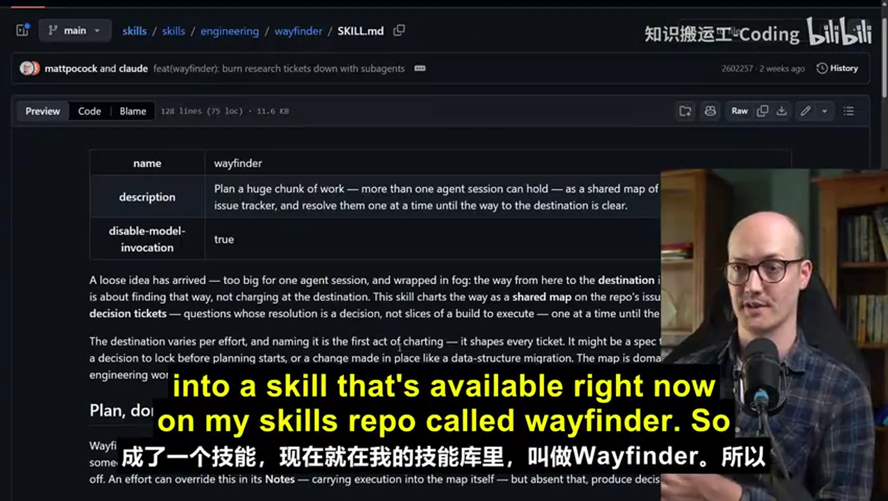

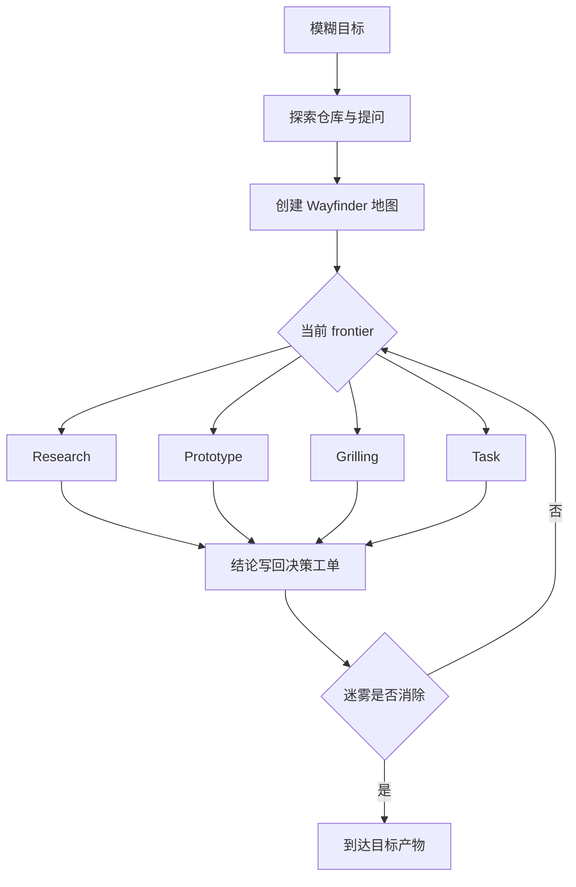

这不是一次性生成完整路线，而是一个反馈循环：每个结果都可能解除阻塞、暴露新问题或改变后续优先级。关键画面中的分支与汇合比线性清单更能表达这种机制。

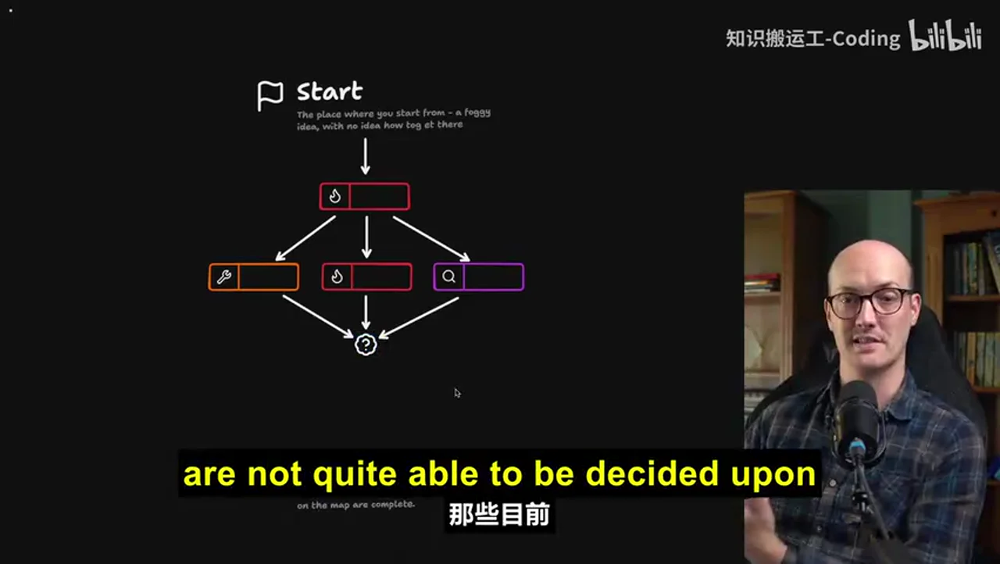

## 视频内容：地图、Spec 与 Tickets 各自承担什么

- **Wayfinder map**：跨会话保存当前目标、决策、证据、阻塞与 frontier。
- **决策工单**：承载研究、原型、讨论或现实任务的结果，是地图的可追溯依据。
- **Spec**：在作者的方法中是多会话工作的目的地与交接产物，不被视为永久文档。
- **Implementation tickets**：把已明确的 spec 切成适合单次实现会话的工作单元。

视频给出的总体链条是 `wayfinder → to-spec → to-tickets → implement → code review`。Wayfinder 位于规格形成之前，负责把未知问题逐步变成有依据的决定。

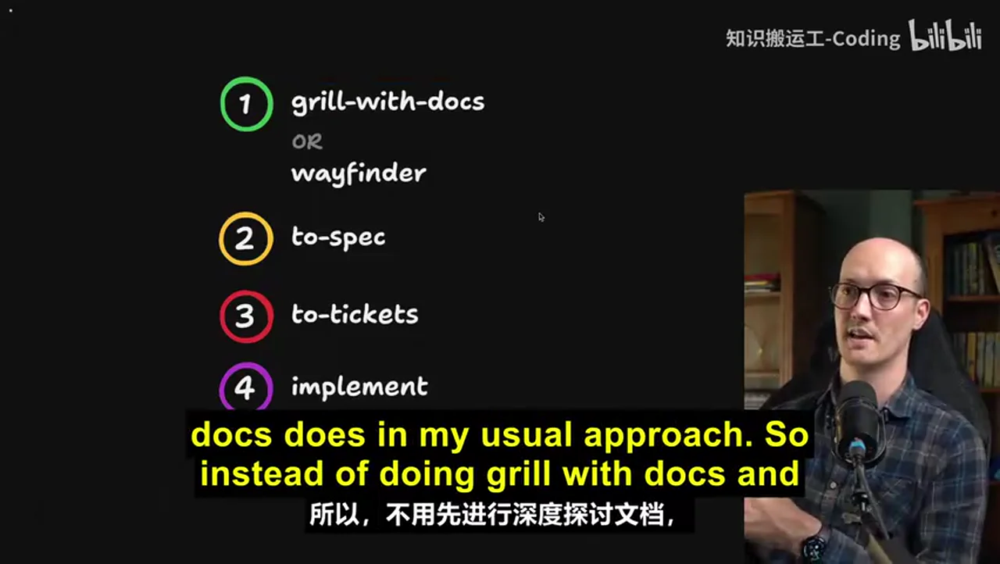

Spec 与 ticket 的区别不只是篇幅：前者维持跨会话目标一致性，后者限制单次会话范围。两者结合，减少每次新会话重新解释全部背景的负担。

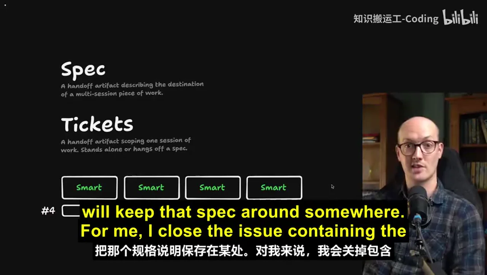

## 外部核验补充

- 官方文档确认，典型地图是 Issue Tracker 中带 `wayfinder:map` 标签的父 issue，子工单保存具体决策和阻塞；未配置 tracker 时可使用本地 Markdown。[Matt Pocock Skills：Wayfinder](https://github.com/mattpocock/skills/blob/main/docs/engineering/wayfinder.md)
- 官方文档明确列出 GitHub、GitLab、Linear、Jira 和本地 Markdown 等路径，但不同 tracker 的阻塞关系能力并不相同，因此视频中“任意 tracker”应理解为需要适配配置，而不是所有平台能力完全等价。[Matt Pocock Skills：Wayfinder](https://github.com/mattpocock/skills/blob/main/docs/engineering/wayfinder.md)
- 四种工单类型 research、prototype、grilling、task 得到官方 Skill 文件确认。[Wayfinder SKILL.md](https://github.com/mattpocock/skills/blob/main/skills/engineering/wayfinder/SKILL.md)

## AI 辅助理解：它本质上是外部化的决策状态机

Wayfinder 可以被理解为把 Agent 的工作记忆外部化到一个可审计系统中：聊天只负责当前一步，Issue Tracker 负责长期状态。每个 ticket 不只是待办事项，更是一次“为了减少某个未知而采取的行动”；关闭 ticket 的价值在于产生了可写回地图的证据或决定。

由此可得到三个实践判断：

1. **以不确定性而非规模决定是否使用**：任务很大但路径明确，可以直接拆实现票；任务规模中等但依赖多项未知，反而适合建图。
2. **原型是规划工具，不只是实现预演**：原型的反馈会改变地图，因此能纠正低保真的文字规划。
3. **保留来源链比保留长摘要更重要**：spec 会压缩信息，决策工单保留原始讨论与证据；Agent 困惑时应沿链接回看来源。

以上三点是基于视频机制的 AI 辅助推断，不是讲者逐字结论。

# Data

## 增强转写稿

[00:00] [ASR unreliable; wording not recoverable from the captured transcript]
[00:05] [ASR unreliable; wording not recoverable from the captured transcript]
[00:08] [ASR unreliable; wording not recoverable from the captured transcript]
[00:11] [ASR unreliable; wording not recoverable from the captured transcript]
[00:13] [ASR unreliable; wording not recoverable from the captured transcript]
[00:16] [ASR unreliable; wording not recoverable from the captured transcript]
[00:17] [ASR unreliable; wording not recoverable from the captured transcript]
[00:21] [ASR unreliable; wording not recoverable from the captured transcript]
[00:22] [ASR unreliable; wording not recoverable from the captured transcript]
[00:24] [ASR unreliable; wording not recoverable from the captured transcript]
[00:27] [ASR unreliable; wording not recoverable from the captured transcript]
[00:31] [ASR unreliable; wording not recoverable from the captured transcript]
[00:33] [ASR unreliable; wording not recoverable from the captured transcript]
[00:35] [ASR unreliable; wording not recoverable from the captured transcript]
[00:37] [ASR unreliable; wording not recoverable from the captured transcript]
[00:39] [ASR unreliable; wording not recoverable from the captured transcript]
[00:42] [ASR unreliable; wording not recoverable from the captured transcript]
[00:43] [ASR unreliable; wording not recoverable from the captured transcript]
[00:45] [ASR unreliable; wording not recoverable from the captured transcript]
[00:47] [ASR unreliable; wording not recoverable from the captured transcript]
[00:50] [ASR unreliable; wording not recoverable from the captured transcript]
[00:53] [ASR unreliable; wording not recoverable from the captured transcript]
[00:55] [ASR unreliable; wording not recoverable from the captured transcript]
[00:56] [ASR unreliable; wording not recoverable from the captured transcript]
[00:58] [ASR unreliable; wording not recoverable from the captured transcript]
[01:00] [ASR unreliable; wording not recoverable from the captured transcript]
[01:03] [ASR unreliable; wording not recoverable from the captured transcript]
[01:04] [ASR unreliable; wording not recoverable from the captured transcript]
[01:07] [ASR unreliable; wording not recoverable from the captured transcript]
[01:09] [ASR unreliable; wording not recoverable from the captured transcript]
[01:11] than what you can fit into the context window
[01:14] and especially the smart zone of the context window
[01:17] of the agent
[01:18] and you know that going in
[01:19] so you'll often take time ahead of these AI agent sessions
[01:24] to break it down into smaller chunks
[01:25] say well I'll just bite off this little bit
[01:27] I'll just bite off this little bit
[01:29] but then what you'll find is okay
[01:30] I'm working towards planning
[01:32] and this bit of grilling
[01:33] and then you reach a question
[01:35] that you can't answer
[01:36] or you just find yourself lost in fog
[01:39] and all the time you're managing the smart zone
[01:41] you're trying not to spend too many tokens
[01:43] this has been out there for a while
[01:44] and people are freaking loving this thing
[01:46] one shot at a prototype
[01:47] it gets starting again and again for months
[01:49] I really hate the phrase one shotting
[01:51] but I think what he means
[01:52] is it really helped him out
[01:53] John here even built his own freaking harness
[01:57] because he liked the Wayfinder approach so much
[01:59] it's got this gorgeous little star map on it
[02:01] that kind of lets you take tasks as you go
[02:04] so it's been out there for a little while
[02:05] and I'm finally making the video
[02:07] that people want me to make
[02:08] what is Wayfinder
[02:09] how do you best use it
[02:10] well let's start by looking at how
[02:11] big work typically gets planned
[02:14] you have a start point
[02:16] a point where you need to start from
[02:18] sort of vague idea
[02:19] not really how to get there
[02:21] and you're trying to get to some
[02:23] kind of destination
[02:24] you know vaguely where you want to end up
[02:26] but the steps between are super
[02:29] foggy
[02:30] you have no idea how to get
[02:31] this is true by the way in engineering
[02:32] but it's also true in many walks of life
[02:35] where you're planning something ambitious
[02:36] and so the first thing you should probably do
[02:38] is have a grilling session about it
[02:40] get the AI to interview you
[02:42] and figure out the sort of basic premise
[02:45] of where you're going
[02:45] now for some work that's sufficient
[02:47] and you'll be able to get straight to your destination
[02:49] but for a lot of work
[02:50] that will still leave you in a lot of fog
[02:52] what you might find is based on that initial
[02:54] grilling session
[02:54] you need to do more sessions
[02:56] so you might have a prototyping session
[02:59] or you might have another grilling session
[03:01] or it might need to go off and do some research as well
[03:03] conceptually what we're looking at here is a map
[03:06] we are creating a map
[03:07] of how we're getting to our destination
[03:09] this is why it's called Wayfinder
[03:11] we are finding our way to the destination
[03:13] and each of these things on the map
[03:15] they are tickets
[03:16] each ticket requires its own
[03:18] individual session with the agent
[03:20] so you might have a prototyping session
[03:23] a grilling session
[03:24] and a research session
[03:25] and all of those things are created
[03:28] and managed by Wayfinder
[03:29] and just a note here
[03:30] yeah this is just a single skill
[03:31] doing all this
[03:32] and it works with any coding agent
[03:34] on its map
[03:35] Wayfinder gives you a frontier of tickets here
[03:38] in other words
[03:39] the decisions that it knows about so far
[03:42] and it also keeps track
[03:43] of everything that's in fog
[03:45] so things that are not quite able
[03:47] to be decided upon yet
[03:48] because we haven't done the research
[03:50] or we don't have a prototype to look at
[03:52] or we haven't done enough conversation
[03:54] enough grilling
[03:54] at some point
[03:55] all of the fog will be resolved
[03:57] and then you'll have finally made enough decisions
[04:00] to finally get to your destination
[04:02] Wayfinder can not only manage the research
[04:04] but it could also do tasks here too
[04:06] so if you need to set up some configuration
[04:08] or you need to go out and talk to someone
[04:10] and actually go and run an errand
[04:12] then Wayfinder can figure that out for you as well
[04:14] in other words
[04:15] all of the complicated stuff
[04:16] that you might need to do
[04:17] while you're planning something big
[04:19] Wayfinder orchestrates it all for you
[04:21] it keeps track
[04:23] of everything that's been done
[04:24] and it measures the fog of war for you
[04:27] keeps track of all the frontier
[04:28] of things you can decide right now
[04:30] how does it keep track of it
[04:31] well it does it in your issue tracker
[04:33] in my public course video manager repo
[04:36] here are all of the Wayfinder maps
[04:37] that I've done recently
[04:39] and you notice that if we look at this one
[04:42] there are
[04:42] this is the big old map here
[04:45] and underneath it are twelve subtasks
[04:48] or sub-issues
[04:49] and these are the decision tickets
[04:51] so we can zoom down here
[04:52] and we can understand
[04:53] all of the decisions that have been made
[04:55] as decisions get made
[04:57] then obviously
[04:58] they get resolved inside the ticket
[05:01] so in this one
[05:02] this is a sub-issue
[05:03] close the clips during publish race
[05:05] and we resolved it
[05:07] with a discussion a couple of weeks ago
[05:09] that resolution also gets written back
[05:11] up to the parent map
[05:12] so if we look back up here
[05:14] we can see that a small version of that
[05:16] also gets written in the map
[05:18] and so Wayfinder is keeping track
[05:20] of all the decisions
[05:21] that have been made
[05:22] all the prototypes
[05:23] that have been created
[05:24] all the tasks
[05:24] that have been done
[05:25] and by the way
[05:25] even though I'm using GitHub for this
[05:27] my skills are issue tracker agnostic
[05:30] so you can use it with
[05:31] any issue tracker you like
[05:32] you just need to do a little bit
[05:33] of configuration
[05:34] via setup-matt-pocock-skills
[05:36] use it with linear
[05:37] use it with Jira
[05:38] use it with literally
[05:39] whatever you like
[05:40] the very first thing
[05:40] you'll need to decide
[05:41] when you kick off a new Wayfinder session
[05:43] is the destination
[05:45] for instance in this one
[05:46] I was adding a
[05:47] command palette with a bunch of new actions
[05:50] into my application
[05:51] and what I ended up wanting
[05:52] was a buildable spec
[05:54] so I wanted a specification
[05:57] for this command K
[05:58] command palette in the CVM diagram window
[06:00] so I started it off like this
[06:02] I invoked the Wayfinder skill
[06:04] and then I gave it a description
[06:05] of what I wanted
[06:06] I would like the ability in the CVM
[06:07] to add an icon picker
[06:09] not only that
[06:09] I want the ability to search other diagrams
[06:11] I want the ability to copy things
[06:13] from the diagram
[06:13] and save them as you know
[06:14] big old chunk of work
[06:15] it went through and explored the repo
[06:19] and it invoked the grilling skill
[06:21] and it grilled me about what I wanted
[06:24] it first asked me what done looks like
[06:26] whether I wanted a spec
[06:27] and it recommended a spec
[06:28] that's good
[06:29] and then it asked me a few initial questions
[06:31] before then going
[06:32] and creating some tickets
[06:34] and the first map
[06:35] and it created the other tickets as sub-issues
[06:37] so we kicked off
[06:38] with seven tickets immediately
[06:40] however only three of those tickets
[06:42] were takeable right now
[06:44] so figure out
[06:45] where icon names come from
[06:46] component storage schema
[06:48] and palette information architecture
[06:50] and grid keyboard
[06:51] and I don't remember that one
[06:52] and so what I did
[06:52] was I then worked through
[06:54] each of those tickets
[06:55] in a new session
[06:57] the way I did that
[06:57] was I just called Wayfinder
[06:59] on that ticket name
[07:01] I did it in a slightly fancier way
[07:02] where I actually have a handoff skill
[07:05] that automatically wrote me a prompt
[07:06] and spawned a Claude subagent
[07:08] but what it was essentially doing
[07:09] is just calling the Wayfinder skill
[07:12] on this map
[07:13] and on the specific ticket
[07:15] wherever it was
[07:16] yeah here it is
[07:16] here's your ticket
[07:18] transpile Lucide SVG
[07:19] geometry to path builder
[07:20] and it just mentions
[07:22] the full ticket name
[07:23] so this is how you work
[07:24] through a Wayfinder map
[07:26] you do an initial Wayfinder prompt
[07:27] just to chart the map
[07:29] and figure out the next tickets
[07:30] and then for each ticket
[07:32] you say Wayfinder
[07:33] with the ticket URL
[07:34] so you use Wayfinder for both
[07:36] both for charting the map initially
[07:38] and then walking through each ticket
[07:40] as you can probably see
[07:41] from this diagram
[07:42] tickets can have different types
[07:44] and there are four types
[07:45] and these ticket types
[07:46] are actually brought into
[07:47] the issue tracker themselves
[07:49] so we actually have Wayfinder
[07:50] research
[07:51] which is a ticket type
[07:52] research tickets are where
[07:53] the agent needs to go off
[07:55] and find some information
[07:56] and bring it back
[07:57] and it usually kicks it off
[07:58] immediately
[07:59] so you don't actually need to watch it
[08:01] it does it in a sub agent
[08:02] and then reports back
[08:03] prototype tickets
[08:04] which are the next type here
[08:05] create a prototype
[08:07] which is so unbelievably invaluable
[08:10] for really seeing things come to life
[08:13] as you're planning
[08:13] I've done a whole extra video on this
[08:15] on how important prototypes are
[08:17] and it reuses the prototype skill
[08:19] from that video
[08:20] some folks look at Wayfinder
[08:22] and they think
[08:22] god that's a lot of planning
[08:23] doesn't that look like waterfall
[08:25] and the prototypes
[08:26] are the way that you prevent it
[08:28] from becoming waterfall
[08:29] huge amounts of low fidelity up front planning
[08:32] a prototype is a high fidelity way
[08:34] to get feedback on what you're actually building
[08:36] and the fact that Wayfinder
[08:38] encourages you to build so many prototypes
[08:40] means that the output is unbelievably good
[08:43] so far we've got research prototype
[08:44] obviously there are grilling
[08:46] ones as well
[08:47] so grilling sessions
[08:48] and this is just where you need a discussion
[08:50] over maybe an implementation detail
[08:52] over a particular aspect of the plan
[08:55] and the final type of ticket
[08:56] are tasks
[08:57] these are things that need to be done
[08:58] in the real world
[09:00] stuff that the agent can't quite do itself
[09:02] or possibly sometimes the stuff agent
[09:04] can do itself
[09:06] but is scheduled behind other work
[09:08] one really cool thing about Wayfinder
[09:09] is the way that it establishes
[09:10] blocking relationships between tickets
[09:13] because some decisions can only be made
[09:14] once other decisions are made
[09:16] and so what you end up with
[09:18] is here we've got 14 out of 17
[09:20] done on this map
[09:21] so a lot of work done
[09:23] but we've still not built the skill
[09:25] that this whole map is built around
[09:27] and once we built the skill
[09:28] then we actually need to revisit
[09:30] some other stuff
[09:31] based on how the skill works
[09:33] and how it actually improves things
[09:35] and so what you're doing a lot of the time
[09:36] when you're working through a Wayfinder map
[09:38] is going ok I've resolved that ticket
[09:40] let's see how this opens up new tickets
[09:42] what has the frontier moved to
[09:44] so then once the map is complete
[09:46] what do you then go and do with it
[09:48] well this one
[09:49] because its destination was a spec
[09:52] the Wayfinder map is probably a little bit too dense
[09:54] to create a spec
[09:56] so what I like to do
[09:57] is create a spec from the map
[09:59] this was the spec that I created from it
[10:02] and you can see
[10:03] it's basically the same setup
[10:04] as I've had before
[10:06] I literally just called to spec
[10:08] on the Wayfinder map
[10:09] and it pulled in this
[10:10] enormous document
[10:13] with basically all of the decisions
[10:15] that have been pulled from the Wayfinder map
[10:17] into this
[10:18] GitHub issue
[10:19] the initial draft was actually too large
[10:21] for GitHub's character limit
[10:23] so
[10:24] that kind of tells you how big it was
[10:25] and from there I turned it into tickets
[10:28] using my usual approach
[10:29] which is to spec and then to tickets
[10:31] in other words Wayfinder fits in
[10:33] just in exactly the same place
[10:34] that Grill with Docs does
[10:36] in my usual approach
[10:38] so instead of doing Grill with Docs
[10:39] and then doing to spec into tickets
[10:41] you're spending a lot more time in Wayfinder
[10:44] creating this enormous map
[10:46] and then taking that map
[10:47] turning it to spec
[10:48] turning it to tickets
[10:49] and then implementing each ticket
[10:51] and then running code review at the end
[10:53] the really cool thing about the Wayfinder setup
[10:55] is that the specs that it creates
[10:57] are so dense
[10:59] and they all
[11:00] link back to the original decision tickets
[11:03] so you can actually go and
[11:04] the agent can go and view the primary source
[11:07] if it's confused about anything
[11:08] that was always a kind of
[11:10] weakness with Grill with Docs
[11:11] which is that you were really relying
[11:13] on the spec to be the source of truth
[11:16] but the spec is always just a summary
[11:18] of what was actually said in the meeting
[11:20] whereas now with Wayfinder
[11:21] you've actually got access to that primary source
[11:24] which is amazing
[11:24] so that is Wayfinder
[11:26] it's a way of mapping huge chunks of work
[11:29] by planning things out
[11:31] really in detail ahead of time
[11:33] it can handle prototyping
[11:34] can handle research
[11:35] can handle arbitrary tasks
[11:37] can handle discussions too
[11:38] let's jump into an FAQ now
[11:40] of frequently asked questions
[11:42] that I get when people ask me about Wayfinder
[11:44] the first one is
[11:45] this is way too much process
[11:48] this way too heavy
[11:49] for the kind of work that I do
[11:51] when should I actually use it
[11:52] well the answer to this
[11:53] is if you think the work that you're doing
[11:55] can be completable
[11:56] and planable in a single session
[11:58] then plan it in a single session
[11:59] if you kind of already know
[12:00] the way to your destination
[12:02] then there's no need to use Wayfinder
[12:04] because you can just path your way there
[12:05] in a single session
[12:07] and just figure it out
[12:08] Wayfinder is for the cases
[12:09] where you have the fog of war
[12:11] you're no idea quite where to go
[12:14] and you just need to start
[12:15] and then see where you get to
[12:16] by the way
[12:17] I've actually been using Wayfinder
[12:18] for non-coding tasks
[12:19] so I've been meaning to put up a garden office
[12:21] in my garden
[12:22] and I've been using Wayfinder for that
[12:25] so it's commissioning a site survey
[12:27] figuring out all that stuff
[12:28] figuring out who to contact
[12:30] doing all the research
[12:30] figuring out the different firms that could build it
[12:32] it's awesome
[12:33] another response people have to Wayfinder
[12:34] is this is S.D.D.
[12:36] this is spec driven development
[12:37] and I don't want to do
[12:38] spec driven development
[12:39] I don't want to spend
[12:39] all this time
[12:41] putting together a spec
[12:42] this seems bananas
[12:43] well the way I think of specs
[12:45] is really just a destination
[12:47] for a multi-session piece of work
[12:49] in other words
[12:50] we have a huge task down here
[12:52] let's say task number four
[12:53] that we're trying to schedule
[12:55] over multiple agent sessions
[12:57] because it's just too big
[12:58] and what we want to do
[12:59] is we need a spec
[13:01] so that we can
[13:02] when we get to the end
[13:03] figure out where we were going
[13:04] that's all a spec is
[13:06] in this context
[13:06] it's just a destination document
[13:08] to handle this multi-session work
[13:10] and then each session
[13:11] is done in an implementation ticket
[13:13] also this is
[13:14] people get confused
[13:15] when they first use Wayfinder
[13:16] because they go
[13:17] right it's creating some tickets
[13:18] aren't we supposed
[13:19] to do the tickets later
[13:20] these are kind of
[13:21] implementation tickets
[13:23] versus decision tickets
[13:24] so in Wayfinder
[13:25] you have decision tickets
[13:26] these are implementation tickets
[13:28] so the difference between
[13:28] my approach and most other approaches
[13:30] is that people
[13:31] when they get to the end of this
[13:33] they will keep that spec around
[13:35] somewhere
[13:36] for me
[13:37] I close the issue
[13:38] containing the spec
[13:39] and the spec is gone
[13:40] it's gone from my repository
[13:42] I rarely if ever
[13:43] refer to it again
[13:44] once the spec is present
[13:46] in the code
[13:47] then you can just delete the spec
[13:48] whereas people who do
[13:49] spec-driven development
[13:50] go back to the spec
[13:52] and edit it and modify it
[13:54] there are lots of approaches
[13:54] to spec-driven development
[13:55] so I'm probably
[13:56] annoying someone with that
[13:57] but
[13:58] what I'm essentially trying to say
[13:59] is that these specs
[14:01] are non-persistent
[14:02] with that folks
[14:03] I recommend you go off
[14:04] and you chart your own
[14:05] awesome
[14:06] foggy idea
[14:07] I have found Wayfinder
[14:09] just so liberating
[14:11] in that it just lets me
[14:12] get started
[14:13] and it handles all of that
[14:14] difficult decision for me
[14:16] I've been using it to plan courses
[14:18] been using it to do engineering work
[14:19] been using it to build a garden office
[14:21] it is just awesome
[14:22] the cool thing about it
[14:22] is that the destination
[14:23] is totally up to you
[14:25] whether you want it to
[14:26] create a spec
[14:27] that you then run through an AFK agent
[14:29] which is what I do
[14:30] or if you just want to
[14:31] it to implement the work
[14:32] for you in tasks
[14:34] then it totally can
[14:35] there is no more fun feeling
[14:37] than starting a new
[14:38] Wayfinder session
[14:39] and knowing
[14:40] that you're going to see something awesome
[14:41] but not quite knowing
[14:42] how you're going to get there
[14:43] if you're into this stuff
[14:44] and if you want to keep up
[14:45] with my skills
[14:46] then you should check out
[14:46] this seven lesson free course
[14:48] that I've put out
[14:49] on AI skills for real engineers
[14:51] which is on my AI hero site
[14:53] I'll add the link below
[14:54] this lets you build up
[14:55] a repeatable workflow
[14:56] that you can ship great work
[14:58] and it's all built
[14:58] on solid software fundamentals
[15:00] thanks so much for hanging out
[15:01] it is always fun
[15:02] filming these sessions
[15:03] and I'm so glad
[15:04] that people are enjoying
[15:05] Wayfinder so much
[15:06] cheers pals
[15:06] I will see you in the next one

## 原始转写稿

[00:00] 我认为能够处理任何工作的方式
[00:05] 我使用的设备和设计的设计
[00:08] 也设计了两个设计
[00:11] 两个设计与一个设计
[00:13] 我还没有能够作为免费
[00:16] 因为这些设计
[00:17] 我建议了一个适合的设计
[00:21] 这些设计不正确
[00:22] 这一个设计不正确
[00:24] 你能够设计更多的设计
[00:27] 和设计过设计的设计
[00:31] 它知道你不能把设计的方式
[00:33] 清理到目标
[00:35] 你必须把户子清理
[00:37] 它明白的设计
[00:39] 甚至让你设计的设计
[00:42] 最棒的是
[00:43] 这些设计基础的设计
[00:45] 这些设计基础的设计
[00:47] 我设计过设计的设计
[00:50] 这些设计的设计
[00:53] 在我设计的设计中
[00:55] 叫做"维吾尔"
[00:56] 所以我设计过设计的设计
[00:58] 和设计的设计
[01:00] 是跟"维吾尔"和"狼"设计的设计
[01:03] 我设计的设计
[01:04] 是非常重要的设计
[01:07] 但是它真的只有设计的设计
[01:09] 设计的设计比较大
[01:11] than what you can fit into the context window
[01:14] and especially the smart zone of the context window
[01:17] of the agent
[01:18] and you know that going in
[01:19] so you'll often take time ahead of these AI agent sessions
[01:24] to break it down into smaller chunks
[01:25] say well I'll just bite off this little bit
[01:27] I'll just bite off this little bit
[01:29] but then what you'll find is okay
[01:30] I'm working towards planning
[01:32] and this bit of grilling
[01:33] and then you reach a question
[01:35] that you can't answer
[01:36] or you just find yourself lost in fog
[01:39] and all the time you're managing the smart zone
[01:41] you're trying not to spend too many tokens
[01:43] this has been out there for a while
[01:44] and people are freaking loving this thing
[01:46] one shot at a prototype
[01:47] it gets starting again and again for months
[01:49] I really hate the phrase one shotting
[01:51] but I think what he means
[01:52] is it really helped him out
[01:53] John here even built his own freaking harness
[01:57] because he liked the Wayfinder approach so much
[01:59] it's got this gorgeous little star map on it
[02:01] that kind of lets you take tasks as you go
[02:04] so it's been out there for a little while
[02:05] and I'm finally making the video
[02:07] that people want me to make
[02:08] what is Wayfinder
[02:09] how do you best use it
[02:10] well let's start by looking at how
[02:11] big work typically gets planned
[02:14] you have a start point
[02:16] a point where you need to start from
[02:18] sort of vague idea
[02:19] not really how to get there
[02:21] and you're trying to get to some
[02:23] kind of destination
[02:24] you know vaguely where you want to end up
[02:26] but the steps between are super
[02:29] foggy
[02:30] you have no idea how to get
[02:31] this is true by the way in engineering
[02:32] but it's also true in many walks of life
[02:35] where you're planning something ambitious
[02:36] and so the first thing you should probably do
[02:38] is have a grilling session about it
[02:40] get the AI to interview you
[02:42] and figure out the sort of basic premise
[02:45] of where you're going
[02:45] now for some work that's sufficient
[02:47] and you'll be able to get straight to your destination
[02:49] but for a lot of work
[02:50] that will still leave you in a lot of fog
[02:52] what you might find is based on that initial
[02:54] grilling session
[02:54] you need to do more sessions
[02:56] so you might have a prototyping session
[02:59] or you might have another grilling session
[03:01] or it might need to go off and do some research as well
[03:03] conceptually what we're looking at here is a map
[03:06] we are creating a map
[03:07] of how we're getting to our destination
[03:09] this is why it's called Wayfinder
[03:11] we are finding our way to the destination
[03:13] and each of these things on the map
[03:15] they are tickets
[03:16] each ticket requires its own
[03:18] individual session with the agent
[03:20] so you might have a prototyping session
[03:23] a grilling session
[03:24] and a research session
[03:25] and all of those things are created
[03:28] and managed by Wayfinder
[03:29] and just a note here
[03:30] yeah this is just a single skill
[03:31] doing all this
[03:32] and it works with any coding agent
[03:34] on its map
[03:35] Wayfinder gives you a frontierof tickets here
[03:38] in other words
[03:39] the decisions that it knows about so far
[03:42] and it also keeps track
[03:43] of everything that's in fog
[03:45] so things that are not quite able
[03:47] to be decided upon yet
[03:48] because we haven't done the research
[03:50] or we don't have a prototype to look at
[03:52] or we haven't done enough conversation
[03:54] enough grilling
[03:54] at some point
[03:55] all of the fog will be resolved
[03:57] and then you'll have finally made enough decisions
[04:00] to finally get to your destination
[04:02] Wayfinder can not only manage the research
[04:04] but it could also do tasks here too
[04:06] so if you need to set up some configuration
[04:08] or you need to go out and talk to someone
[04:10] and actually go and run an errand
[04:12] then Wayfinder can figure that out for you as well
[04:14] in other words
[04:15] all of the complicated stuff
[04:16] that you might need to do
[04:17] while you're planning something big
[04:19] Wayfinder orchestrates it all for you
[04:21] it keeps track
[04:23] of everything that's been done
[04:24] and it measures the fog of war for you
[04:27] keeps track of all the frontier
[04:28] of things you can decide right now
[04:30] how does it keep track of it
[04:31] well it does it in your issue tracker
[04:33] in my public course video manager repo
[04:36] here are all of the Wayfinder maps
[04:37] that I've done recently
[04:39] and you notice that if we look at this one
[04:42] there are
[04:42] this is the big old map here
[04:45] and underneath it are twelve subtasks
[04:48] or sub-issues
[04:49] and these are the decision tickets
[04:51] so we can zoom down here
[04:52] and we can understand
[04:53] all of the decisions that have been made
[04:55] as decisions get made
[04:57] then obviously
[04:58] they get resolved inside the ticket
[05:01] so in this one
[05:02] this is a sub-issue
[05:03] close the clips during publish race
[05:05] and we resolved it
[05:07] with a discussion a couple of weeks ago
[05:09] that resolution also gets written back
[05:11] up to the parent map
[05:12] so if we look back up here
[05:14] we can see that a small version of that
[05:16] also gets written in the map
[05:18] and so Wayfinder is keeping track
[05:20] of all the decisions
[05:21] that have been made
[05:22] all the prototypes
[05:23] that have been created
[05:24] all the tasks
[05:24] that have been done
[05:25] and by the way
[05:25] even though I'm using GitHub for this
[05:27] my skills are issue tracker agnostic
[05:30] so you can use it with
[05:31] any issue tracker you like
[05:32] you just need to do a little bit
[05:33] of configuration
[05:34] via set up mappokal skills
[05:36] use it with linear
[05:37] use it with Jira
[05:38] use it with literally
[05:39] whatever you like
[05:40] the very first thing
[05:40] you'll need to decide
[05:41] when you kick off a new Wayfinder session
[05:43] is the destination
[05:45] for instance in this one
[05:46] I was adding a
[05:47] command pallet with a bunch of new actions
[05:50] into my application
[05:51] and what I ended up wanting
[05:52] was a buildable spec
[05:54] so I wanted a specification
[05:57] for this command K
[05:58] command pallet in the CVM diagram window
[06:00] so I started it off like this
[06:02] I invoked the Wayfinder skill
[06:04] and then I gave it a description
[06:05] of what I wanted
[06:06] I would like the ability in the CVM
[06:07] to add an icon picker
[06:09] not only that
[06:09] I want the ability to search other diagrams
[06:11] I want the ability to copy things
[06:13] from the diagram
[06:13] and save them as you know
[06:14] big old chunk of work
[06:15] it went through and explored the repo
[06:19] and it invoked the grilling skill
[06:21] and it grilled me about what I wanted
[06:24] it first asked me what done looks like
[06:26] whether I wanted a spec
[06:27] and it recommended a spec
[06:28] that's good
[06:29] and then it asked me a few initial questions
[06:31] before then going
[06:32] and creating some tickets
[06:34] and the first map
[06:35] and it created the other tickets as sub-issues
[06:37] so we kicked off
[06:38] with seven tickets immediately
[06:40] however only three of those tickets
[06:42] were takeable right now
[06:44] so figure out
[06:45] where icon names come from
[06:46] component storage schema
[06:48] and pallet information architecture
[06:50] and grid keyboard
[06:51] and I don't remember that one
[06:52] and so what I did
[06:52] was I then worked through
[06:54] each of those tickets
[06:55] in a new session
[06:57] the way I did that
[06:57] was I just called Wayfinder
[06:59] on that ticket name
[07:01] I did it in a slightly fancier way
[07:02] where I actually have a handoff skill
[07:05] that automatically wrote me a prompt
[07:06] and spawned a clawed sub agent
[07:08] but what it was essentially doing
[07:09] is just calling the Wayfinder skill
[07:12] on this map
[07:13] and on the specific ticket
[07:15] wherever it was
[07:16] yeah here it is
[07:16] here's your ticket
[07:18] transpile lucid SVG
[07:19] geometry to path builder
[07:20] and it just mentions
[07:22] the full ticket name
[07:23] so this is how you work
[07:24] through a Wayfinder map
[07:26] you do an initial Wayfinder prompt
[07:27] just to chart the map
[07:29] and figure out the next tickets
[07:30] and then for each ticket
[07:32] you say Wayfinder
[07:33] with the ticket URL
[07:34] so you use Wayfinder for both
[07:36] both for charting the map initially
[07:38] and then walking through each ticket
[07:40] as you can probably see
[07:41] from this diagram
[07:42] tickets can have different types
[07:44] and there are four types
[07:45] and these ticket types
[07:46] are actually brought into
[07:47] the issue tracker themselves
[07:49] so we actually have Wayfinder
[07:50] research
[07:51] which is a ticket type
[07:52] research tickets are where
[07:53] the agent needs to go off
[07:55] and find some information
[07:56] and bring it back
[07:57] and it usually kicks it off
[07:58] immediately
[07:59] so you don't actually need to watch it
[08:01] it does it in a sub agent
[08:02] and then reports back
[08:03] prototype tickets
[08:04] which are the next type here
[08:05] create a prototype
[08:07] which is so unbelievably invaluable
[08:10] for really seeing things come to life
[08:13] as you're planning
[08:13] I've done a whole extra video on this
[08:15] on how important prototypes are
[08:17] and it reuses the prototype skill
[08:19] from that video
[08:20] some folks look at Wayfinder
[08:22] and they think
[08:22] god that's a lot of planning
[08:23] doesn't that look like waterfall
[08:25] and the prototypes
[08:26] are the way that you prevent it
[08:28] from becoming waterfall
[08:29] huge amounts of low fidelity up front planning
[08:32] a prototype is a high fidelity way
[08:34] to get feedback on what you're actually building
[08:36] and the fact that Wayfinder
[08:38] encourages you to build so many prototypes
[08:40] means that the output is unbelievably good
[08:43] so far we've got research prototype
[08:44] obviously there are grilling
[08:46] ones as well
[08:47] so grilling sessions
[08:48] and this is just where you need a discussion
[08:50] over maybe an implementation detail
[08:52] over a particular aspect of the plan
[08:55] and the final type of ticket
[08:56] are tasks
[08:57] these are things that need to be done
[08:58] in the real world
[09:00] stuff that the agent can't quite do itself
[09:02] or possibly sometimes the stuff agent
[09:04] can do itself
[09:06] but is scheduled behind other work
[09:08] one really cool thing about Wayfinder
[09:09] is the way that it establishes
[09:10] blocking relationships between tickets
[09:13] because some decisions can only be made
[09:14] once other decisions are made
[09:16] and so what you end up with
[09:18] is here we've got 14 out of 17
[09:20] done on this map
[09:21] so a lot of work done
[09:23] but we've still not built the skill
[09:25] that this whole map is built around
[09:27] and once we built the skill
[09:28] then we actually need to revisit
[09:30] some other stuff
[09:31] based on how the skill works
[09:33] and how it actually improves things
[09:35] and so what you're doing a lot of the time
[09:36] when you're working through a Wayfinder map
[09:38] is going ok I've resolved that ticket
[09:40] let's see how this opens up new tickets
[09:42] what has the frontier moved to
[09:44] so then once the map is complete
[09:46] what do you then go and do with it
[09:48] well this one
[09:49] because its detonation was a spec
[09:52] the Wayfinder map is probably a little bit too dense
[09:54] to create a spec
[09:56] so what I like to do
[09:57] is create a spec from the map
[09:59] this was the spec that I created from it
[10:02] and you can see
[10:03] it's basically the same setup
[10:04] as I've had before
[10:06] I literally just called to spec
[10:08] on the Wayfinder map
[10:09] and it pulled in this
[10:10] enormous document
[10:13] with basically all of the decisions
[10:15] that have been pulled from the Wayfinder map
[10:17] into this
[10:18] github issue
[10:19] the initial draft was actually too large
[10:21] for github's character limit
[10:23] so
[10:24] that kind of tells you how big it was
[10:25] and from there I turned it into tickets
[10:28] using my usual approach
[10:29] which is to spec and then to tickets
[10:31] in other words Wayfinder fits in
[10:33] just in exactly the same place
[10:34] that Gryll with Docs does
[10:36] in my usual approach
[10:38] so instead of doing Gryll with Docs
[10:39] and then doing to spec into tickets
[10:41] you're spendinga lot more timein Wayfinder
[10:44] creating this enormous map
[10:46] and then taking that map
[10:47] turning it to spec
[10:48] turning it to tickets
[10:49] and then implementing each ticket
[10:51] and then running code review at the end
[10:53] the really cool thing about the Wayfinder setup
[10:55] is that the specs that it creates
[10:57] are so dense
[10:59] and they all
[11:00] link back to the original decision tickets
[11:03] so you can actually go and
[11:04] the agent can go and view the primary source
[11:07] if it's confused about anything
[11:08] that was always a kind of
[11:10] weakness with Gryll with Docs
[11:11] which is that you were really relying
[11:13] on the spec to be the source of truth
[11:16] but the spec is always just a summary
[11:18] of what was actually said in the meeting
[11:20] whereas now with Wayfinder
[11:21] you've actually got access to that primary source
[11:24] which is amazing
[11:24] so that is Wayfinder
[11:26] it's a way of mapping huge chunks of work
[11:29] by planning things out
[11:31] really in detail ahead of time
[11:33] it can handle prototyping
[11:34] can handle research
[11:35] can handle arbitrary tasks
[11:37] can handle discussions too
[11:38] let's jump into an FAQ now
[11:40] offrequently asked questions
[11:42] that I get when people ask me about Wayfinder
[11:44] the first one is
[11:45] this is way too much process
[11:48] this way too heavy
[11:49] for the kind of work that I do
[11:51] when should I actually use it
[11:52] well the answer to this
[11:53] is if you think the work that you're doing
[11:55] can be completable
[11:56] and planable in a single session
[11:58] then plan it in a single session
[11:59] if you kind of already know
[12:00] the way to your destination
[12:02] then there's no need to use Wayfinder
[12:04] because you can just path your way there
[12:05] in a single session
[12:07] and just figure it out
[12:08] Wayfinder is for the cases
[12:09] where you have the fog of war
[12:11] you're no idea quite where to go
[12:14] and you just need to start
[12:15] and then see where you get to
[12:16] by the way
[12:17] I've actually been using Wayfinder
[12:18] for non-coding tasks
[12:19] so I've been meaning to put up a garden office
[12:21] in my garden
[12:22] and I've been using Wayfinder for that
[12:25] so it'scommissioning a site survey
[12:27] figuring out all that stuff
[12:28] figuring out who to contact
[12:30] doing all the research
[12:30] figuring out the different firms that could build it
[12:32] it's awesome
[12:33] another response people have to Wayfinder
[12:34] is this is S.D.D.
[12:36] this is spec driven development
[12:37] and I don't want to do
[12:38] spec driven development
[12:39] I don't want to spend
[12:39] all this time
[12:41] putting together a spec
[12:42] this seems bananas
[12:43] well the way I think of specs
[12:45] is really just a destination
[12:47] for a multi-session piece of work
[12:49] in other words
[12:50] we have a huge task down here
[12:52] let's say task number four
[12:53] that we're trying to schedule
[12:55] over multiple agent sessions
[12:57] because it's just too big
[12:58] and what we want to do
[12:59] is we need a spec
[13:01] so that we can
[13:02] when we get to the end
[13:03] figure out where we were going
[13:04] that's all a spec is
[13:06] in this context
[13:06] it's just a destination document
[13:08] to handle this multi-session work
[13:10] and then each session
[13:11] is done in an implementation ticket
[13:13] also this is
[13:14] people get confused
[13:15] when they first use Wayfinder
[13:16] because they go
[13:17] right it's creating some tickets
[13:18] aren't we supposed
[13:19] to do the tickets later
[13:20] these are kind of
[13:21] implementation tickets
[13:23] versus decision tickets
[13:24] so in Wayfinder
[13:25] you have decision tickets
[13:26] these are implementation tickets
[13:28] so the difference between
[13:28] my approach and most other approaches
[13:30] is that people
[13:31] when they get to the end of this
[13:33] they will keep that spec around
[13:35] somewhere
[13:36] for me
[13:37] I close the issue
[13:38] containing the spec
[13:39] and the spec is gone
[13:40] it's gone from my repository
[13:42] I rarely if ever
[13:43] refer to it again
[13:44] once the spec is present
[13:46] in the code
[13:47] then you can just delete the spec
[13:48] whereas people who do
[13:49] spec-driven development
[13:50] go back to the spec
[13:52] and edit it and modify it
[13:54] there are lots of approaches
[13:54] to spec-driven development
[13:55] so I'm probably
[13:56] annoying someone with that
[13:57] but
[13:58] what I'm essentially trying to say
[13:59] is that these specs
[14:01] are non-persistent
[14:02] with that folks
[14:03] I recommend you go off
[14:04] and you chart your own
[14:05] awesome
[14:06] foggy idea
[14:07] I have foundWayfinder
[14:09] just so liberating
[14:11] in that it just lets me
[14:12] get started
[14:13] and it handles all of that
[14:14] difficult decision for me
[14:16] I've been using it to plan courses
[14:18] been using it to do engineering work
[14:19] been using it to build a garden office
[14:21] it is just awesome
[14:22] the cool thing about it
[14:22] is that the destination
[14:23] is totally up to you
[14:25] whether you want it to
[14:26] create a spec
[14:27] that you then run through an AFK agent
[14:29] which is what I do
[14:30] or if you just want to
[14:31] it to implement the work
[14:32] for you in tasks
[14:34] then it totally can
[14:35] there is no more fun feeling
[14:37] than starting a new
[14:38] Wayfinder session
[14:39] and knowing
[14:40] that you're going to see something awesome
[14:41] but not quite knowing
[14:42] how you're going to get there
[14:43] if you're into this stuff
[14:44] and if you want to keep up
[14:45] with my skills
[14:46] then you should check out
[14:46] this seven lesson free course
[14:48] that I've put out
[14:49] on AI skills for real engineers
[14:51] which is on my AI hero site
[14:53] I'll add the link below
[14:54] this lets you build up
[14:55] a repeatable workflow
[14:56] that you can ship great work
[14:58] and it's all built
[14:58] on solid software fundamentals
[15:00] thanks so much for hanging out
[15:01] it is always fun
[15:02] filming these sessions
[15:03] and I'm so glad
[15:04] that people are enjoying
[15:05] Wayfinder so much
[15:06] cheers pals
[15:06] I will see you in the next one

## 原始关键帧

### 关键帧 1

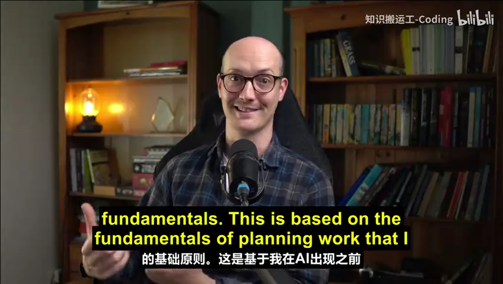

### 关键帧 2

### 关键帧 3

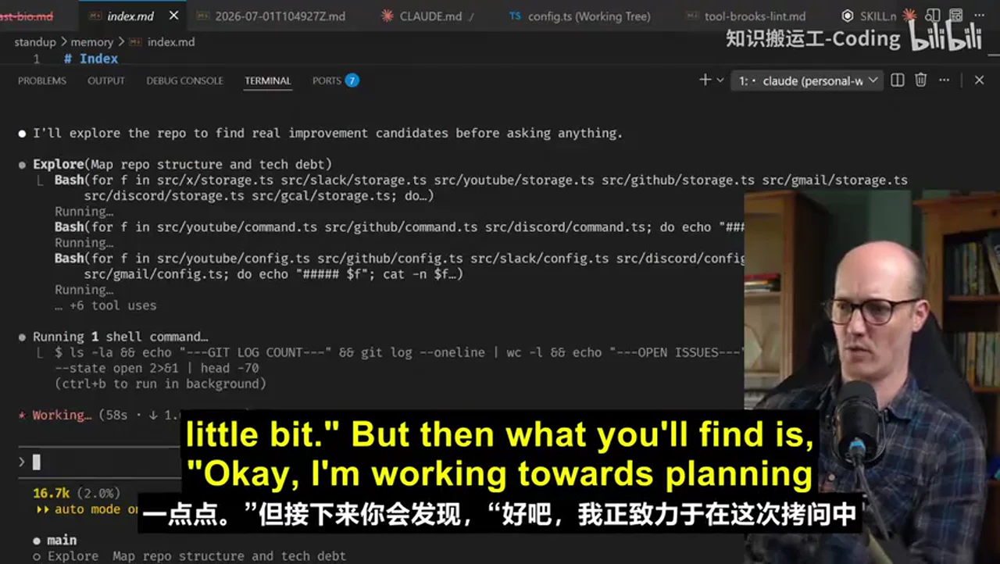

### 关键帧 4

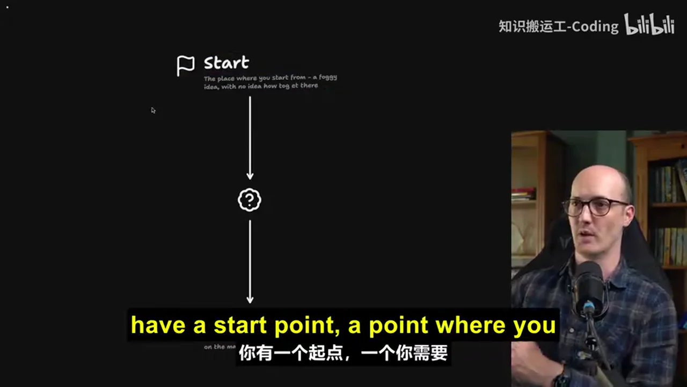

### 关键帧 5

### 关键帧 6

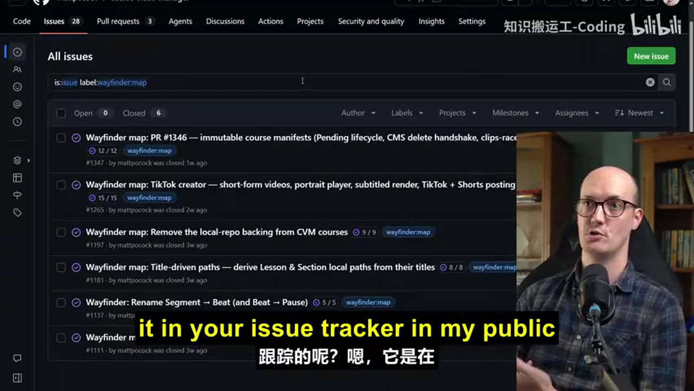

### 关键帧 7

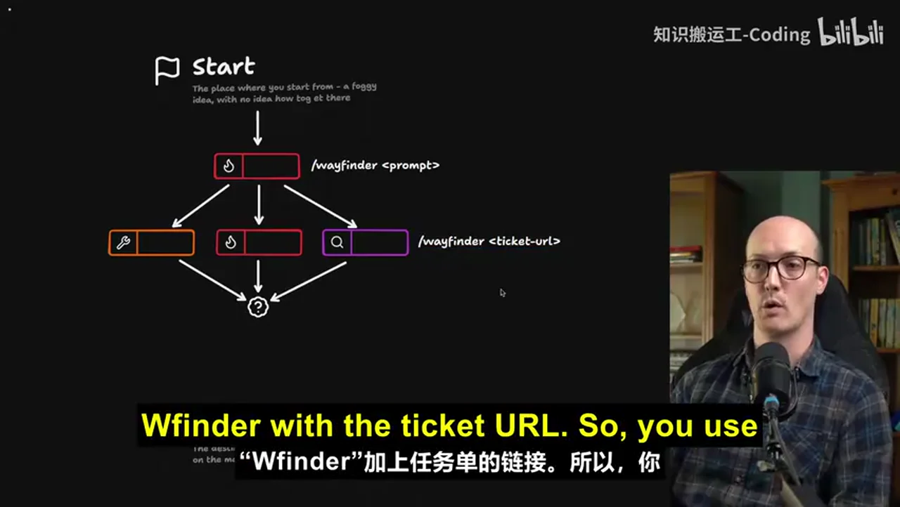

### 关键帧 8

### 关键帧 9

### 关键帧 10

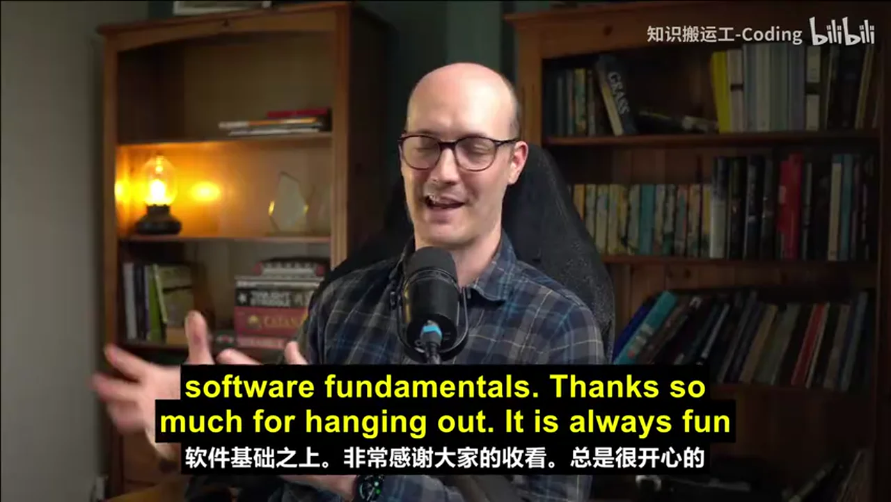
