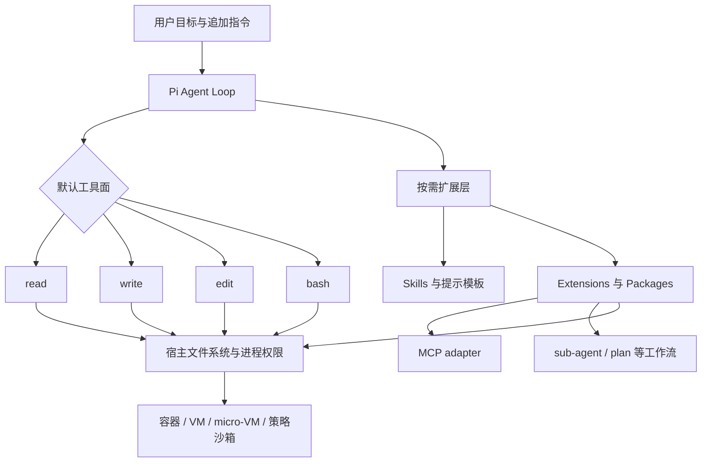
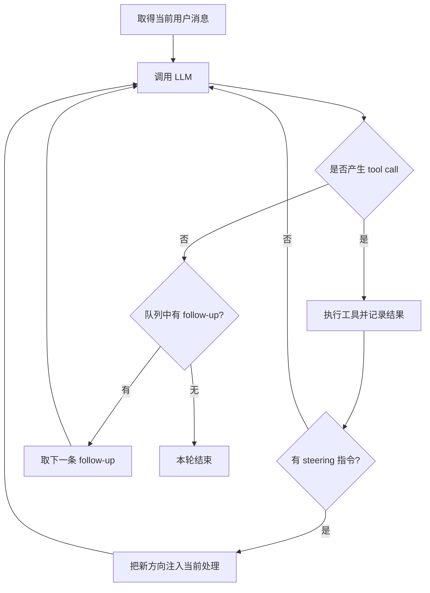
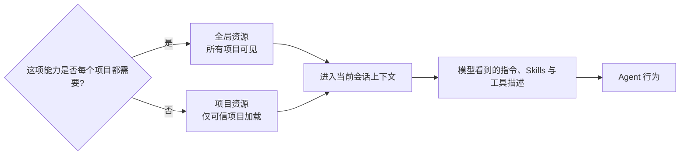
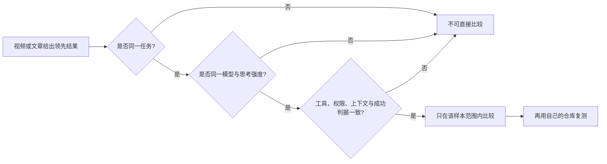
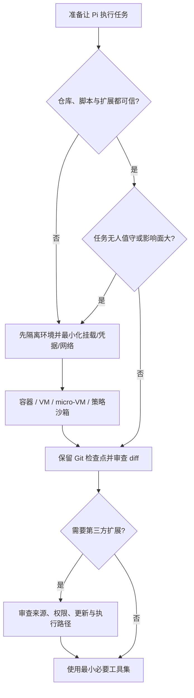

# 总结稿

[打开单页 HTML 总结](assets/bilibili-BV139bD6gEa8-summary.html)

## 一句话结论

Pi 的核心价值不是“功能比 Codex 或 Claude Code 更多”，而是把默认 Agent 保持得很小，再让用户用 Skills、Extensions、Packages 和外部隔离环境按需组装工作流。视频较完整地演示了这套思路，但标题中的“超越”、固定 Token 数与普遍性能领先都不能由一次演示或单一 benchmark 推出。

## 视频讲了什么

视频从安装、模型登录和终端操作开始，随后依次演示多行提示词、follow-up/steering、Session 分支与压缩、Packages、Skills、MCP adapter、sub-agent、计划模式、项目说明文件以及安全扩展。最值得保留的不是某个快捷键，而是三层结构：

1. **小核心**：默认向模型提供 `read`、`write`、`edit`、`bash` 四个工具。`grep`、`find`、`ls` 是可选的额外内置只读工具，并非默认开启。该点已由 [Pi Quickstart](https://pi.dev/docs/latest/quickstart) 和 [官方仓库 README](https://github.com/earendil-works/pi/blob/main/packages/coding-agent/README.md) 确认。[00:05]
2. **可组合扩展**：Pi 当前刻意不把 MCP、sub-agents、plan mode、permission popups、todos 与 background bash 做成核心默认功能，而是允许通过 Extensions、Packages 或外部工具补上。这里的“没有”应理解为“核心不内置”，不是“生态里无法实现”。参见 [Using Pi：Design Principles](https://pi.dev/docs/latest/usage)。[17:58]
3. **宿主级安全边界**：Pi 没有内置运行时沙箱；工具与扩展继承启动进程的权限。项目 trust 只决定是否加载项目级设置和扩展，不会限制运行后工具能访问什么。官方建议对不可信或无人值守任务使用容器、VM、micro-VM 或策略沙箱。参见 [Pi Security](https://pi.dev/docs/latest/security) 与 [Containerization](https://pi.dev/docs/latest/containerization)。[37:51]

## 两层 Agent Loop：为什么排队指令不会都挤进同一步

视频用双层循环解释 Pi 如何处理追加输入：[10:04]

- 内层循环把当前消息发给模型，解析 tool calls，执行工具并回填结果，直到模型停止调用工具。
- 外层循环在一次内层处理结束后检查 follow-up；steering 则可在工具调用之间注入，让正在运行的任务调整方向。
- 这是视频作者对机制的概念化讲解，适合帮助理解交互顺序，但画面不是源码执行轨迹，也不证明并发、吞吐或异常处理细节。

## Session 与上下文：是对话管理，不是代码版本管理

视频展示新建、分支、fork/clone、手动 compact 与自动压缩等会话操作。[13:21–17:19] 这里最容易误解的边界是：

- Session 树管理的是**对话历史**；切换或回退节点不等于自动回滚磁盘文件，也不等于 Git checkout。
- compact 是把历史总结得更短；它可能减少后续上下文，但也可能损失细节。“清空一定好于压缩”是讲者经验，不是普遍定律。
- 视频里显示的上下文百分比和 Token 数只属于当时的模型、版本、配置与已加载资源。

## 需要纠正的四组主张

### “系统提示词只有 1000 Token”

**未验证为固定规格。** 官方确认 Pi 的默认面较小，也允许自定义系统提示词；但实际输入还会受 tokenizer、版本、`AGENTS.md`、Skills、Extensions、工具描述与会话内容影响。视频的 `1000 Token`、`1100 输入`、`4000 上下文` 和 Codex 对比只能记为特定环境截图。[00:06–00:22]

### “Pi 快 1.5–2 倍、全面超过主流 Agent”

**只能部分确认，而且不能泛化。** Composio 的同模型 harness 测试确实出现 Pi 在部分任务集上延迟或成本领先，但结果随模型、任务与对手变化，另一次公开测试中 Claude Code 的中位时间反而略快。参见 [Composio 的 Pi/Claude Code 对比](https://composio.dev/content/pi-agent-vs-claude-code) 与 [harness 汇总](https://composio.dev/content/best-ai-agent-harnesses)。[00:25]

Databricks 的内部 benchmark 来自其多百万行、多语言代码库；官方报告称简单 harness（包括 Pi）在不少内部工作负载上表现很好，同模型同思考强度时，Pi 每轮输入上下文约少 3 倍，某些比较成本差超过 2 倍而质量相同。但文章也明确说该 benchmark **并不全面**，不能推出 Pi 对所有代码任务都优于 Codex 或 Claude Code。参见 [Databricks 官方 benchmark](https://www.databricks.com/blog/benchmarking-coding-agents-databricks-multi-million-line-codebase)。[00:37]

### “原生没有 MCP、sub-agent、plan，所以 Pi 做不到”

不对。更准确的表达是：**这些能力不在默认核心里，但可由扩展或包实现。** 视频随后正是用 adapter、sub-agent 和 plan-mode 包进行演示。[18:23–24:06] 扩展可注册工具、命令与 UI，也能拦截或修改工具调用；与此同时，扩展以完整系统权限执行，安装前必须审查来源与权限。参见 [Pi Extensions](https://pi.dev/docs/latest/extensions)。

### “项目 trust 就提供了安全限制”

不对。trust 防止陌生项目在未同意时加载项目级资源，但它不是 sandbox。提示词里写“不要删除”也只是行为约束，不是 OS 权限边界。真正需要隔离时，应限制挂载路径、凭据与网络，并把 Pi 或工具执行放进容器/VM/策略沙箱。

## 模型与配置的时效边界

视频称 Pi 支持“40 多家模型供应商”。当前 [Providers 文档](https://pi.dev/docs/latest/providers) 的确展示多种订阅、API Key、云端与自定义 provider，并支持目录刷新；但官方没有把“40+”作为稳定规格，数量、模型名称、登录方式和订阅条款都会变化。[02:41] 教程里的 DeepSeek、ChatGPT/Codex 登录与第三方 Web UI 应在实际使用前重新查当前文档。

## 怎么判断 Pi 是否适合自己

- **适合**：你愿意自己选择模型、审查包、配置作用域，并希望把 Agent 变成可编程工作台。
- **谨慎**：你需要开箱即用的审批、计划、多代理、MCP 或企业治理，却不想维护对应扩展。
- **必须加隔离**：处理不可信仓库、运行未知脚本、无人值守长任务，或工作区含敏感凭据。
- **验证性能**：用自己的仓库、同一模型、同一任务、同一权限和明确的成功判据做成对测试；不要拿标题或单张图代替评估。

## 观众讨论与补充

以下仅是热门顶层评论样本中的观众意见，不是产品证据。样本为当前可访问的 50 条热门顶层评论（平台报告 747 条，不含嵌套回复）以及 124 条当前可访问弹幕（平台报告 371 条），均非随机或完整样本。

- 一类意见认可项目级扩展按需加载，认为这有助于避免把无关内容放进提示词；是否实际节省多少 Token 仍取决于加载内容。
- 另一类意见担忧插件质量参差、筛选成本高。这与官方“扩展拥有完整系统权限”的警告形成互补：可塑性越强，供应链审查越重要。
- 也有观众对“超越 Codex/Claude Code”的标题保持怀疑，主张先明确自己的需求再迁移工具。
- 弹幕最密候选桶为 23:00–23:30（7 条），恰逢旁路对话与计划模式演示附近；密度只能用作回看导航，不能解释为“最受欢迎”或“争议最大”。

## 最终认识

Pi 的“极简”是一种架构选择：缩小默认接口，把复杂度移到用户选择、扩展生态和运行环境。它可能减少固定开销并提高可塑性，也把配置、供应链、安全隔离和效果评估的责任更多交给使用者。真正合理的比较不是“谁全面超越谁”，而是：在你的任务、模型、风险与维护预算下，哪种 harness 提供了最合适的约束与自由度。

# 辅助理解

## 辅助理解：把 Pi 看成“可组装的 Agent 内核”

视频最重要的结构不是某个插件，而是“核心—扩展—隔离”三层。核心负责最小 Agent loop；扩展把特定工作流接入；操作系统级环境承担真正的安全边界。

帧 5 是视频作者对“四个基础工具 + Skills”的概括图。官方当前资料确认默认四工具，但还提供可选的 `grep`、`find`、`ls`；所以它表达的是默认工具面，而不是 Pi 永远只有四种能力。[Pi Quickstart](https://pi.dev/docs/latest/quickstart)

## 双层循环：follow-up 与 steering 的位置不同

帧 3 把工具循环、steering 与 follow-up 放在同一张结构图中，适合解释“调整当前任务”和“排队下一轮”为什么不是一回事。它是视频的概念示意，不是可用于推导性能或并发语义的源码证据。[10:04]

## 能力边界：核心不内置，不等于生态做不到

| 能力 | 当前核心默认 | 如何获得 | 需要承担的成本 |
|---|---|---|---|
| 文件读写、编辑、命令 | `read/write/edit/bash` | 开箱即用 | 直接继承宿主进程权限 |
| MCP | 不内置 | adapter/extension | 配置、上下文与外部服务风险 |
| sub-agent | 不内置 | package/extension | 并发协调、成本与写入冲突 |
| plan mode | 不内置 | package/extension | 计划与执行状态的维护 |
| permission popup | 不内置 | 权限扩展 | 扩展是否覆盖所有执行路径 |
| 真正隔离 | 不由项目 trust 提供 | 容器、VM、micro-VM、策略沙箱 | 挂载、凭据、网络与开发体验配置 |

帧 6 只证明视频当时展示了 Package Catalog 与安装入口。目录数量、包质量和可用性都具有时效性；官方也警告 Extensions 以完整系统权限运行，只安装来自可信来源并经过审查的代码。[Pi Extensions](https://pi.dev/docs/latest/extensions)

## 配置作用域：减少噪声，也减少误伤半径

帧 9 直观展示项目根目录中的 `AGENTS.md`。项目级说明适合记录构建命令、约束与代码约定；全局说明只放真正跨项目稳定的偏好。注意：说明文件能影响模型行为，却不能替代文件权限、Git 检查点或沙箱。

## 对 benchmark 的正确读法

- Composio 的不同公开测试给出了不同速度排序，说明“Pi 恒定快 1.5–2 倍”不是稳健结论。
- Databricks 的内部数据支持“harness 会显著影响成本与质量”，也支持 Pi 在其部分工作负载上效率较好；但官方明确说测试不全面。[Databricks benchmark](https://www.databricks.com/blog/benchmarking-coding-agents-databricks-multi-million-line-codebase)
- 视频的 Token 状态栏和作者个人体感只能作为演示记录，不能替代成对、可复现评估。

## 安全决策树

项目 trust 只是“是否加载项目资源”的门；它不是运行时沙箱。提示词规则、权限弹窗扩展和 OS 隔离分别属于不同强度的防线，不能互相冒充。[Pi Security](https://pi.dev/docs/latest/security)

## 自检：不要被“极简”这个词骗过

1. 默认工具少，是否就代表整个请求的 Token 固定很少？**不是。** 上下文文件、工具描述、扩展、会话历史和 tokenizer 都会改变输入。
2. 核心不内置 MCP/sub-agent/plan，是否代表 Pi 无法实现？**不是。** 它们被移到扩展层。
3. 项目 trust 是否能阻止模型运行危险命令？**不能。** 它只控制项目资源加载。
4. 某个 benchmark 中领先，是否等于全面优于其他 Agent？**不能。** 结论只在该任务集、模型与配置范围内成立。

## 观众材料应该怎样读

热门评论样本同时出现“项目级扩展减少无关负担”的认可与“插件质量参差”的担忧。两者共同指向同一个权衡：Pi 把功能选择权交给用户，也把生态筛选和供应链风险交给用户。50 条热门顶层评论和 124 条当前可访问弹幕都不是总体民意样本；点赞和密度只适合帮助导航，不能当作事实证明。

## 外部事实核验

### 声明 1（00:05）

- 视频陈述：Pi只有四个基础工具。
- 核验状态：已确认
- 核验结果：截至核查日，Pi 官方 Quickstart 和编码代理 README 均把 read、write、edit、bash 列为四个默认工具；grep、find、ls 是可选的额外内置只读工具，不默认启用。
- 检索日期：2026-08-24
- 来源：
  - [Pi Quickstart](https://pi.dev/docs/latest/quickstart)（primary）
  - [Pi coding-agent README](https://github.com/earendil-works/pi/blob/main/packages/coding-agent/README.md)（primary）

### 声明 2（00:06）

- 视频陈述：系统提示词也仅仅只有1000token。
- 核验状态：未验证
- 核验结果：官方资料确认 Pi 采用极简默认工具与可定制系统提示词，但没有承诺跨版本、模型 tokenizer、上下文文件、Skills 与扩展都固定为 1000 Token。视频数字只能视为特定环境实测。
- 检索日期：2026-08-24
- 来源：未找到可链接来源

### 声明 3（00:25）

- 视频陈述：根据Composio上个月的一组基准测试，Pi Agent完成编程任务的速度比起其他的Coding Agent快了1.5到2倍。
- 核验状态：部分确认
- 核验结果：Composio 的公开同模型 harness 测试确实出现 Pi 延迟和成本领先的结果，但优势随任务集、底层模型和对手而变；其后续 DeepSeek V4 Flash 测试中 Claude Code 的中位时间反而略快于 Pi。故不能概括成对所有 Coding Agent 恒定快 1.5–2 倍。
- 检索日期：2026-08-24
- 来源：
  - [Composio: Pi Agent vs Claude Code](https://composio.dev/content/pi-agent-vs-claude-code)（primary）
  - [Composio: Best AI Agent Harnesses](https://composio.dev/content/best-ai-agent-harnesses)（primary）

### 声明 4（00:37）

- 视频陈述：Databricks在自家一个百万行代码的仓库上面运行了一个基准测试……Pi在大部分场景下面的表现都要好于Claude Code和Codex。
- 核验状态：部分确认
- 核验结果：Databricks 官方文章确认其基准来自多百万行代码库，并确认在许多工作负载上 Pi 等简单 harness 表现最好；同模型/思考强度对比中，成本差有时超过 2 倍、质量相同、Pi 每轮上下文约少 3 倍。但官方明确说该基准不全面，结论不是 Pi 在所有场景或整张图上普遍优于 Claude Code/Codex。
- 检索日期：2026-08-24
- 来源：
  - [Databricks coding-agent benchmark](https://www.databricks.com/blog/benchmarking-coding-agents-databricks-multi-million-line-codebase)（primary）

### 声明 5（02:41）

- 视频陈述：Pi支持40多家模型供应商。
- 核验状态：部分确认
- 核验结果：当前官方 Providers 文档列出多种订阅、API Key、云端和自定义 provider，并支持 catalog 刷新；但官方页面没有给出稳定的“40 多家”总数，且 provider 数会变化。可确认多供应商能力，不能把 40+ 当作永久规格。
- 检索日期：2026-08-24
- 来源：
  - [Pi Providers documentation](https://pi.dev/docs/latest/providers)（primary）

### 声明 6（17:58）

- 视频陈述：Pi没有MCP，没有Subagent，没有Plan mode。
- 核验状态：已确认
- 核验结果：Pi 官方 Using Pi 文档明确列出这些功能不属于内置核心，并说明可以通过 extensions、packages 或外部工具补充。
- 检索日期：2026-08-24
- 来源：
  - [Pi usage and design principles](https://pi.dev/docs/latest/usage)（primary）

### 声明 7（37:51）

- 视频陈述：一旦Pi开始了运行，它就没有任何的安全限制了……编辑文件、执行命令都是自动执行。
- 核验状态：部分确认
- 核验结果：核心警告成立：官方 Security 文档明确说 Pi 无内置沙箱，内置工具和扩展继承进程权限，项目 trust 只控制项目资源加载而非运行时隔离。不过“没有任何安全限制”过于绝对：用户可禁用工具、使用第三方权限扩展，或在容器/VM/策略沙箱中运行。
- 检索日期：2026-08-24
- 来源：
  - [Pi Security](https://pi.dev/docs/latest/security)（primary）
  - [Pi Containerization](https://pi.dev/docs/latest/containerization)（primary）

### 声明 8（40:08）

- 视频陈述：Pi开放了大量接口……你可以自己动手DIY插件。
- 核验状态：已确认
- 核验结果：官方 Extensions 文档列出自定义工具、事件拦截、UI、命令与会话持久化，并直接建议可让 Pi 为用例创建扩展；同时警告扩展以完整系统权限执行。
- 检索日期：2026-08-24
- 来源：
  - [Pi Extensions](https://pi.dev/docs/latest/extensions)（primary）

# Data

## 增强转写稿

[00:00] Pi是最近热度超高的AI Agent
[00:02] 用四个字形容就是大道至简
[00:05] Pi只有四个基础工具
[00:06] 系统提示词也仅仅只有1000token
[00:09] 在Pi里面说句你好
[00:10] 只有1100的上传token
[00:12] 只占用4000的上下文
[00:14] 然而在Codex里面
[00:15] 仅仅打个招呼就占用18000的token
[00:18] 什么事情都没做
[00:19] 白白消耗了7%的上下文窗口
[00:22] Pi极致的精简带来了极致的效率提升
[00:25] 根据Composio上个月的一组基准测试
[00:28] PiAgent完成编程任务的速度
[00:30] 比起其他的CodingAgent快了1.5到2倍
[00:33] 任务成本比起主流框架也低了不少
[00:36] 在编程质量方面
[00:37] 数据服务大厂DataBricks
[00:39] 在自家一个百万行代码的仓库上面
[00:42] 运行了一个基准测试
[00:44] 这个图的横轴是任务成本
[00:46] 纵轴则是任务通过率
[00:47] 也就是代码质量
[00:48] 红色这条线则展示了同等成本下
[00:51] 任务成功率最高的Agent加模型的组合
[00:54] 我们看到Pi在大部分场景下面的表现
[00:57] 都要好于Claude Code和Codex
[01:00] 而整张图代码质量的最高点
[01:02] 就是Pi加Claude Opus 4.8的组合
[01:05] 本期视频带来一个PiAgent的完整教程
[01:08] 主要分为以下11个章节
[01:10] 每个章节都会穿插一些重要的知识
[01:12] 对Pi的全部功能进行细致讲解
[01:15] 好废话不多说我们直接开始
[01:18] 我们先来把Pi安装一下
[01:20] 我先介绍Windows测试系统
[01:21] 然后是Mac
[01:22] 这里我用了一台全新的Windows电脑来进行测试
[01:26] 安装Pi并不需要任何的准备工作
[01:28] 在桌面点击右键
[01:30] 在终端打开
[01:31] 打开Windows PowerShell的控制台
[01:33] 然后我们来到Pi的官网
[01:35] 找到这个PowerShell的一键安装命令
[01:37] 把它复制一下
[01:38] 粘贴到控制台里面回车
[01:40] Pi检测到这台电脑没有Node.js
[01:43] 这里我输入外回车
[01:45] 先安装Node.js
[01:46] 到这一步还是输入外回车安装Pi的本体
[01:50] Pi使用Git Bash作为命令行运行环境
[01:53] 如果你的电脑上没有安装过Git
[01:55] 它会先询问
[01:56] 这里建议选择输入W
[01:58] 让Pi先帮你把Git在Windows上面安装好
[02:02] 好到这一步Pi的安装就结束了
[02:04] 我们需要先关闭掉当前的命令行窗口
[02:07] 然后右键重新打开一个终端
[02:09] 输入Pi把Pi启动起来
[02:11] 如果能成功显示这里的对话窗口
[02:13] 我们的Pi就安装完毕了
[02:15] 接下来我们看Mac OS的安装
[02:17] 这里还是先打开终端
[02:19] 然后去Pi的官网
[02:21] 注意这里要复制这条curl的命令
[02:23] 粘贴进终端执行
[02:25] 这样在Mac上面Pi也安装好了
[02:28] 接下来我们给Pi配置模型
[02:30] 先把Pi启动起来来到这个界面
[02:32] 然后输入命令
[02:33] 斜线Login
[02:35] 这里有两种配置模型的方法
[02:36] 一个是API Key
[02:38] 还有一个是用模型订阅
[02:39] 这里我先选择API Key
[02:41] Pi支持40多家模型供应商
[02:43] 基本上覆盖了市面上常见的
[02:46] 所有模型选择
[02:47] 这里我以DeepSeek为例
[02:48] 我们可以先输入关键词
[02:50] 筛选出DeepSeek然后回车
[02:52] 接下来我们来到DeepSeek的官网
[02:54] 点击API开放平台
[02:56] 首先确保你有些额度
[02:58] 然后点击API Key
[02:59] 点击创建API Key
[03:01] 随便填个名字
[03:02] 然后把新生成的API Key复制一下
[03:05] 填写到Pi里面
[03:06] 回车
[03:07] 打个招呼
[03:08] 这样给到了回复
[03:09] 我们的DeepSeek模型就配置完成了
[03:11] 现在我们使用的默认模型是DeepSeek V4 Pro
[03:15] 我们可以输入命令
[03:16] 斜线Model来切换模型
[03:18] 比如这里可以切换成DeepSeek V4 Flash
[03:21] 使用快捷键Shift+Tab
[03:22] 来切换模型的思考强度
[03:24] 可以根据任务的复杂程度
[03:26] 来选择模型的思考强度
[03:28] 敲快捷键
[03:29] Ctrl+L也可以快速打开这个模型选择器
[03:33] 接下来我们看
[03:34] 使用模型订阅来给PiAgent接入模型
[03:37] 还是先输入命令
[03:38] 斜线Login
[03:39] 我们选择上面这个
[03:40] 三硬WazeAccount
[03:41] 然后这里我以我的OpenAI订阅为例
[03:44] 我选择OpenAI Codex
[03:46] 然后选择第一个用浏览器登录
[03:48] 接着浏览器里会打开一个登录窗口
[03:51] 这里登录一下我的OpenAI账户
[03:53] 登录完成以后我们回到Pi
[03:54] 敲快捷键Ctrl+L
[03:56] 模型列表里面就出现了
[03:58] ChatGPT的模型
[04:00] 这里我新建了一个文件夹
[04:02] 作为项目文件夹
[04:03] 进来以后右键在终端打开
[04:05] 输入Pi启动起来
[04:06] 在Pi的窗口里面就显示了当前的文件夹
[04:10] 也就是项目文件夹
[04:11] 我们后续下指令
[04:12] 它就会把代码写到这个项目文件夹里面
[04:15] 使用React框架
[04:16] 做一个宠物洗户店的网页
[04:18] 如果我们的指令是多行的
[04:20] 想进行换行
[04:21] 这里不要按回车
[04:22] 按回车就直接发送出去了
[04:24] 我们可以敲Shift的家回车
[04:26] 这样新起一行
[04:27] 再输入第二行
[04:28] 还有一种方式是按快捷键Ctrl+G
[04:31] 打开一个计视本
[04:32] 我们可以在计视本里面
[04:34] 更加方便的编辑提示词
[04:36] 编辑完成以后保存一下
[04:38] 插掉计视本
[04:38] 提示词就会同步出现在窗口里面
[04:41] 这样我输入了三行提示词
[04:43] 回车执行
[04:44] Pi编写代码的速度非常的快
[04:46] 同样使用GPT模型
[04:48] 我感觉它比Codex要快了一倍
[04:50] 过了一会
[04:51] Pi就完成了代码编写
[04:52] 我们先来看最下面这一行信息
[04:55] 这里上键头表示
[04:56] 整个Session的输入Token
[04:58] Session就是一个连续的对话记录
[05:01] 记录了AI多轮对话的整个工作过程
[05:03] 我们可以在Pi里面敲斜线New
[05:06] 新开一个Session
[05:07] 在新的Session里面
[05:08] AI就没有过去的对话历史
[05:10] 上下文窗口也就清空了
[05:12] 下键头输出Token
[05:13] 总共输出了11000的Token
[05:15] 大写的R是Cache Read
[05:17] 也就是整个Session里面
[05:19] 有多少Token命中的缓存
[05:21] CH是Cache Hate Read
[05:23] 是最近一次的请求缓存命中率
[05:26] 注意这里的缓存命中率
[05:28] 不是统计的整个Session的
[05:30] 而是统计的
[05:31] 最近一次AI调用请求的缓存命中率
[05:33] 后面还有一个这次对话的预估成本
[05:36] QHDSUB是Subscription
[05:38] 也就是订阅的意思
[05:40] 也就是我现在使用的是
[05:41] ChatGPT的订阅
[05:42] 所以前面的成本仅供参考
[05:45] 最后4.6%表示现在占用了模型
[05:48] 4.6%的上下文窗口
[05:50] 然后斜杠后面是模型总的上下文窗口
[05:53] GPT 5.6总的上下文窗口是272K
[05:56] Auto是上下文压缩机制
[05:58] Auto表示自动压缩
[06:00] 也就是说当上下文使用量达到预值的时候
[06:03] Pi会自动触发一次上下文压缩
[06:06] 最后面是模型的提供商
[06:07] 还有现在使用的模型的名字
[06:09] 点儿后面是当前模型的思考强度
[06:12] 代码编写好了以后
[06:13] 它提示我们可以用MPM RUN DV来启动起来
[06:17] 这里最方便的方式是
[06:18] 我们可以直接在当前窗口运行命令
[06:21] 我们敲一个英文的碳号
[06:23] 然后输入这个命令
[06:24] MPM RUN DV回车
[06:26] 让我们的开发服务器就启动起来了
[06:28] 所以碳号的功能就是在当前的对话窗口
[06:31] 临时运行一个命令
[06:32] 我们使用碳号运行命令
[06:34] 命令运行的结果还有过程
[06:36] AI是可以看到的
[06:38] 如果不想让AI看到我们运行的命令
[06:40] 这里可以敲两个碳号
[06:42] 然后再输入命令
[06:43] 在这个方式下面输入的命令
[06:45] AI是看不到的
[06:46] 我们可以打开这个链接
[06:47] 查看AI给我们开发的网页
[06:50] 如果对哪一部分不满意
[06:51] 可以直接截图跟AI进行沟通
[06:54] 比如我不喜欢这边的布局
[06:55] 我直接截一个图
[06:57] 来到Pi
[06:57] Windows电脑直接敲快捷键
[06:59] Alt+V
[07:00] Mac电脑快捷键
[07:01] Control+V
[07:02] 把刚才截的图片粘贴过来
[07:04] 然后我告诉AI
[07:05] 浮动卡片的数量太少了
[07:07] Pi读取了这张图片
[07:09] 过了一会完成了修改
[07:10] 这样卡片加多了两个
[07:12] 除了粘贴截图
[07:13] 我们还可以用另外一种方式
[07:15] 跟AI进行交流
[07:16] 就是输入@
[07:17] 然后就可以选择某个代码文件
[07:20] 这里我选择SRC目录
[07:22] 然后输入斜线
[07:23] 选择闷文件
[07:24] 我告诉AI不要把代码都放到一个文件里面
[07:27] 把它拆分成模块开始
[07:29] 这样我们通过@文件的方式
[07:31] 完成了这一轮的沟通
[07:32] AI帮我们把代码拆分成了模块
[07:35] 接下来我让Pi把项目做成前后端的应用
[07:38] 我需要预约信息能存入数据库
[07:40] 我们看到这里AI想用Express框架来做后端
[07:43] 但是我更想使用Nex.js框架来做后端
[07:47] 遇到这种情况
[07:48] 在Pi里面我们不需要打断AI的执行
[07:51] 可以直接在对话里面给AI补充提示词
[07:54] 我在对话框里面输入说
[07:56] 我需要Nex.js框架
[07:58] 然后数据库用Colite
[08:00] 这里直接敲回车
[08:01] 我们看到我们新输入的这条指令
[08:03] 前面写着Staring
[08:04] Staring翻译过来就是
[08:06] 控制引导的意思
[08:07] 它英文原本意思是打方向盘
[08:10] 当我们发现AI在执行过程中
[08:12] 理解错了我们的意思
[08:14] 这时候应该果断的通过Staring
[08:16] 也就是打方向盘
[08:17] 对AI的行为进行一定的引导干预
[08:20] 在Pi里面
[08:21] 当用户追加指令的时候
[08:23] 默认就是引导
[08:24] 我们看到当这个Staring指令发出去以后
[08:26] AI立即改变了它的执行方向
[08:29] 开始为我们安装Nex.js相关的依赖
[08:32] 除了默认的Staring引导
[08:34] PiAgent还提供了另外一种指令追加的方式
[08:37] 叫做FollowUp
[08:38] FollowUp的意思是排队
[08:40] FollowUp跟Staring最大的区别是
[08:42] FollowUp不会影响AI当前这一轮的工作
[08:45] 而是等待AI完成这一轮的全部工作
[08:48] AI才会看到并且执行用户接下来一轮的指令
[08:52] 在Windows系统里面
[08:53] 使用FollowUp需要修改一个配置
[08:56] 我们先右键打开PowerShell的设置
[08:58] 在操作里面找到这组快捷键
[09:01] Alt+回车
[09:02] 也就是让PowerShell全平化的快捷键
[09:04] 先把这个快捷键删除
[09:06] 因为它跟Pi默认FollowUp的快捷键冲突了
[09:09] 然后点击右下角的保存
[09:11] 把它删除以后我们回到Pi
[09:13] 接下来再输入一条指令
[09:15] 输入完成以后我们不要使用回车
[09:17] 我们使用Alt+回车
[09:18] 麦克电脑上面的快捷键是Alt+回车
[09:21] 我们看到这条指令前面写的是FollowUp
[09:24] 也就进入了排队
[09:25] FollowUp指令需要等待AI
[09:27] 把这一轮的工作全部做完才可以继续处理
[09:30] 当指令在排队的过程中
[09:32] 我们也可以输入快捷键Alt+上键头
[09:35] 把这条指令拿回来重新编辑
[09:37] 比如这里我进行了一点修改
[09:39] 修改完成以后再点击Alt+回车
[09:41] 把它送入对列进行排队
[09:43] 过了一会AI把这一轮的工作全部做完了
[09:46] 然后AI才能看到并且执行我最新一条的指令
[09:49] 也就是增加一个后台面板
[09:51] 可以查看用户的预约
[09:53] 在这个例子里面我们就看到了
[09:55] PiAgent最经典的两种指令追加的方式
[09:58] 一个是Staring在执行的中途进行引导
[10:01] 还有一个是FollowUp让指令在后面排队
[10:04] 这里简单补充下Pi的FollowUp跟Staring
[10:08] 两种指令追加的实现原理
[10:10] Pi的核心Agent的loop是一个双层循环机制
[10:13] 我们先看内层循环
[10:15] Pi在内层循环里面调用大模型
[10:18] 然后根据模型的指令来调用工具
[10:20] 再把工具处理结果返回给模型
[10:23] 由模型判断是否完成了工作
[10:26] 如果没有完成工作再进入下一轮的循环
[10:29] 这里有一个巧妙的设计
[10:31] 也就是当进入下一轮循环的时候
[10:33] Pi会把Staring的消息注入上下文
[10:36] 这样Pi就能对用户的指令进行实施的反应
[10:39] 而FollowUp的消息则处于外层循环
[10:42] 需要等待内层循环处理完毕
[10:45] 也就是Pi完成手头的工作以后
[10:47] 才会读取到FollowUp的消息
[10:50] 这时候Pi如果发现有FollowUp的消息
[10:52] 它会开启外层循环 继续工作
[10:55] 除了我们输入Pi在常规模式下面运行
[10:58] Pi还提供了一次性的非交互模式
[11:01] 这里我们可以在后面输入GunPi
[11:03] 然后在引号里面填上我要它处理的指令
[11:06] 我让Pi查找一下今天的天气
[11:08] 然后在桌面写一个天气点TXT文件回车
[11:12] 这样Pi就会在后台静默执行这个需求
[11:15] 中间过程我们是看不到的
[11:17] 等它执行完毕以后
[11:18] 它就会把结果输出出来
[11:20] 天气文件也在桌面上写好了
[11:22] 这种非交互模式
[11:23] 特别适合把Pi当做一次性的CRI命令来使用
[11:28] PiAgent绘画管理的单元是Session
[11:31] 比如我跟AI进行了三次对话
[11:33] 让AI在水果列表里面新增苹果
[11:36] 新增香蕉 新增橘子
[11:38] 这三次对话的全部历史就是一个Session
[11:41] 然后我可以输入斜线New
[11:43] 创建一个新的Session
[11:44] 在新的Session里面
[11:46] 再让AI在蔬菜列表里面
[11:48] 添加茄子 添加芹菜 添加白菜
[11:51] 这样我们就拥有了两份对话历史
[11:53] 两个Session
[11:54] 当我们把窗口关闭以后
[11:55] 下次想继续工作
[11:57] 可以输入Pi-C从最近的一次Session进行对话
[12:01] 也就是蔬菜列表这个
[12:03] 也可以输入Pi-R挑选一个Session进行对话
[12:07] 比如这次我挑选水果的Session
[12:09] 我们就回到了水果这次的对话历史
[12:12] 在Pi里面
[12:13] 每个Session并非是纯线性的结构
[12:15] 而可以是一个树状结构
[12:17] 这就是Pi的特色功能对话树
[12:20] 比如我可以来到蔬菜的这个Session里面
[12:23] 输入命令 斜线 锤进入对话树
[12:26] 这里我可以选择新增芹菜这个节点
[12:29] 敲回车
[12:30] 然后再敲一次回车
[12:31] 这样就把对话回退到了之前的一个历史状态上面
[12:35] 我们可以基于这个历史状态
[12:37] 给对话创建分支 进行不同的尝试
[12:40] 比如这一次我不想再增加树菜了
[12:43] 我想让它新增一个海鲜
[12:44] 这里AI帮我们新增好了文件
[12:46] 并且写入了皮皮虾
[12:48] 我们可以再输入锤以来看一下
[12:50] 我们可以在对话树里面看到
[12:52] 在这一次对话历史上面产生了时间线的分支
[12:56] 在有一个时间线上面继续添加蔬菜
[12:59] 另外一个时间线上面则是新增了海鲜
[13:02] 如果把这个Session划成一棵树的话
[13:04] 大约是这个样子
[13:05] 这里要注意
[13:06] 当我们使用树来回退对话历史
[13:09] 已经写完的代码并不能做相应的回退
[13:12] 比如我想通过这棵树
[13:14] 把对话历史回退到茄子的这个状态
[13:16] 然后把后面的皮皮虾还有芹菜 白菜
[13:19] 全部在代码里面移除
[13:21] 我们使用树来进行回退的时候
[13:23] 只能回退对话历史
[13:25] 不能回退代码
[13:26] 如果想回退代码
[13:27] 我们需要配合Git来使用
[13:29] 这里我还是输入斜线 吹命令
[13:32] 找到新增茄子这个对话记录回车
[13:34] 让我们通过树先把对话历史进行了回退
[13:37] 接下来我们来通过Git把代码也进行回退
[13:40] 我这套代码已经用Git管理起来了
[13:43] 如果对Git还有AI配合不熟悉的观众朋友们
[13:46] 可以参考这期视频
[13:48] 我们找到新增茄子这一次提交
[13:50] 然后复制它的commit ID
[13:52] 回到Pi这边输入碳号
[13:54] 然后接这个命令Git reset两个横杆
[13:57] hard了
[13:58] 也就是强制把代码回退到新增茄子
[14:01] 那次提交的状态回车
[14:03] 让我们再打开代码看一下
[14:05] 现在代码里面只有一个茄子
[14:07] 没有其他的蔬菜了
[14:08] 这样我们就使用Git命令搭配对话树
[14:11] 把一段历史从对话记录
[14:13] 还有代码两个层面全部进行了回滚
[14:16] 这里要补充一点
[14:17] 我们回退对话历史的时候
[14:18] Pi给了三个选项
[14:20] 第一个是不总结
[14:21] 也就是一个彻底的回退
[14:23] 第二个是进行总结
[14:24] 也就是把你丢弃的这部分对话历史
[14:27] 让AI做一个总结
[14:28] 第三个是告诉AI应该怎么总结
[14:31] 这里我们来看一下这张图
[14:32] 比如现在我想从白菜这次对话历史
[14:35] 回推到茄子这个
[14:36] 如果我们选择不总结
[14:38] AI就把后面的对话历史完全抛弃掉了
[14:41] 如果我们选择总结
[14:43] AI会对当前分支上
[14:44] 这段对话历史进行一个总结
[14:47] 当我们完成回退以后
[14:48] AI会对这段分支过去处理过的工作
[14:51] 有一个大概的印象
[14:52] 这里有一点要注意
[14:54] AI总结的时候
[14:55] 只是总结这段分支上面的工作
[14:57] 它不会去总结别的分支
[14:59] 也就是说PPCA这次对话记录
[15:01] 它是不会进行总结的
[15:03] 这里我们来试一下
[15:04] 现在在白菜的这次对话上面
[15:06] 然后我输入斜线
[15:07] 锤 展开对话数
[15:09] 现在我要回推到茄子这次对话
[15:11] 找到茄子这次对话
[15:13] 点击回车
[15:14] 然后这里我们选择Summerize
[15:16] 也就是把我回退掉的这段分支上面的对话
[15:19] 总结一下
[15:19] 回车 这样完成了总结
[15:21] 我们可以点Ctrl+O 展开
[15:23] 我们看到只有我回退掉的
[15:25] 这段分支上面的总结
[15:26] 另外一个分支
[15:27] 也就是PPCA那个分支
[15:29] 它是不会进行总结的
[15:30] AI的绘画管理还有三个重要命令
[15:33] 首先是克龙
[15:34] 克龙就是把当前的Session
[15:36] 完整复制一份
[15:37] 成为一个新的Session
[15:39] 比如我现在在蔬菜的Session里面
[15:42] 输入斜线 克龙
[15:43] 就把当前的Session
[15:44] 完整复制进了一个新的Session
[15:46] 然后我可以按两下Ctrl+C 退出Pi
[15:49] 接下来输入Pi缸R
[15:51] 看一下现在的Session
[15:52] 我们看到输菜的Session
[15:54] 就被复制成了两份
[15:55] 跟克龙类似的命令是斜纲Folk
[15:58] Folk不是克龙整棵树
[16:00] 而是可以选择一个对话节点
[16:02] 基于这个节点复制出一个新的Session
[16:05] 比如我现在水果的Session里面
[16:07] 我可以选择香蕉这个节点
[16:09] 然后进行Folk
[16:10] 这样可以创造出一个新的Session
[16:12] Folk出来的新Session
[16:13] 只会携带之前的对话历史
[16:15] 这里我来到这个水果的Session里面
[16:18] 输入命令斜线Folk
[16:19] 然后选择香蕉这一次对话记录回车
[16:22] 我们看到一个新的Session
[16:24] 被创建出来了
[16:25] 而且它只有之前的对话历史
[16:27] 下一个命令斜线Compact
[16:29] 这个命令用来手动触发上下文压缩
[16:32] 比如这是视频开头
[16:33] 创建宠物喜护网站的Session
[16:35] 我们看到这里的百分比显示18.1%
[16:38] 表示历史对话内容
[16:40] 占用了模型多少上下文空间
[16:42] 当上下文用量超过预值的时候
[16:45] Pi就会自动对对话历史进行压缩
[16:47] 从而释放出更多的上下文空间
[16:50] 这里我们也可以使用Compact的命令来手动压缩
[16:53] Pi会把之前的对话历史进行总结和精简
[16:56] 我们看到上下文用量从18%降到了10%
[17:00] 这样可以有效提高AI的专注力
[17:02] 并且降低后续的Token消耗
[17:04] 不过在Agent领域
[17:05] 有一个通用经验是清空好于压缩
[17:08] 因为过多的历史绘画会干扰AI的注意力
[17:11] 所以当我们执行完一轮任务以后
[17:13] 最好的方式是直接输入协告New
[17:16] 新开一个Session也就是新开一个对话
[17:19] 来 清空模型的上下文
[17:20] 这样有助于AI把注意力全部集中到新的任务上面来
[17:24] 从而提高任务的执行效果
[17:27] Pi是一个极简的Agent
[17:29] 默认只有四个基础工具
[17:31] 读文件 写文件 改文件 还有运行命令
[17:33] Pi的设计理念是用最小的一组工具
[17:36] 来覆盖绝大多数的编程任务
[17:39] 其实这四个工具已经足够强大
[17:41] 特别是运行命令行的bash工具
[17:44] 本身就是一个强大的万能工具
[17:46] 比如可以使用bash调用 find来搜索文件
[17:49] 调用grep来检索代码
[17:51] 调用ls来调查目录等等
[17:53] 除了这四个核心工具
[17:54] Pi还支持Agent的skill
[17:56] 然后就没有其他了
[17:58] Pi没有MCP 没有Subagent 没有Plan mode
[18:01] 没有todo 也没有BTW
[18:03] Pi的设计哲学是核心越小越干净
[18:06] 模型反而能更好的发挥
[18:08] 同时让用户有最大的自由度
[18:10] 去组装其他的能力
[18:12] 正如Pi的官网首页上这句话
[18:14] 让工具来适应你的工作流
[18:16] 而不是让你去适用工具
[18:17] Pi提供了非常丰富的扩展能力
[18:20] 主要体现在两个方面
[18:21] 一个是插件
[18:22] 另外一个是skill
[18:23] 在本章节我们来看怎么通过配置插件
[18:26] 来给Pi扩展出各种能力
[18:29] 给Pi安装插件非常简单
[18:31] 我们先来到Pi的官网
[18:32] 然后找到这个package
[18:34] 这里就是它的插件列表
[18:35] 我们先看几个比较重要的
[18:37] 首先是这个Piwebassize
[18:39] 让Pi具有联网搜索的能力
[18:41] 而且可以更方便的提取网页信息
[18:44] 这里有它的一键安装命令
[18:45] 我们把它复制一下
[18:46] 还是打开windows的控制台
[18:48] 把命令粘贴过来回车
[18:50] 这样联网插件就安装好了
[18:52] 然后我们把Pi启动起来
[18:54] 这里有一个crawl extensions
[18:56] 显示现在有了联网插件
[18:58] 我们可以来测试一下
[18:59] 问他一下请到天气怎么样
[19:01] 我们看到Pi调用联网搜索的能力
[19:04] 然后做了个总结显示出来了
[19:06] 这个插件非常好的一点
[19:07] 它是零配置模式
[19:09] 它介入了远程 MCP服务
[19:11] 而且不需要任何的API key
[19:13] 装上就能用 非常的方便
[19:15] 如果想在Pi里面卸载一个插件
[19:17] 也非常容易
[19:18] 我们就把这个安装命令的install
[19:20] 改成uninstall就可以了
[19:22] 让就把联网搜索的插件卸载掉了
[19:25] 我们再来看一个插件
[19:26] pysubagents
[19:27] 这个插件可以让Pi拥有
[19:29] 并行运行多个子代理的能力
[19:32] 我们还是复制一下安装命令
[19:34] 我们使用默认安装命令
[19:35] 它是把插件安装到Pi的全局目录下面
[19:39] 也就是说这个插件会对所有的项目生效
[19:41] 我们每安装一个插件
[19:43] 其实都是增加了一部分系统提示词
[19:46] 如果有的项目里用不到这个插件
[19:48] 其实是给模型增加负担
[19:50] 所以我们还有另外一种安装方式
[19:52] 就是把这个插件仅仅安装到我这个项目里面
[19:55] 也就是PyTest这个工程里面
[19:57] 而不是进行全局的安装
[19:59] 如果想进行项目级别的安装
[20:01] 我们可以在后面挑一个空格
[20:03] 接参数 -l
[20:04] L就是local的意思
[20:06] 然后回车
[20:06] 这里来到项目目录看一下
[20:08] 我们看到这个插件就被安装到了项目目录
[20:11] 点Pi这个文件夹下面
[20:13] 也就是这个插件现在是一个项目级别的插件
[20:16] 只对当前这个文件夹生效
[20:18] 让我们还是把Pi启动起来
[20:20] 因为这个目录下面有一个插件
[20:22] 所以第一次启动的时候
[20:23] 它询问我是否信任当前目录
[20:26] 这里我选择信任
[20:27] 这里看到我们的插件就安装好了
[20:29] 这里我们输入斜线Pi sub-agents
[20:32] 调用这个插件自带的技能
[20:35] 我让它给我设计五个不同风格的个人网页
[20:38] 回车
[20:38] 我们看到Pi启动了五个worker
[20:40] 也就是五个sub-agents
[20:42] 并行开发这个页面
[20:43] 五个页面总共是五种不同的风格
[20:46] 这样Pi使用五个子代里并行完成了工作
[20:49] 并且完成了并行的审查与修复
[20:52] 交付了五个个人网页
[20:53] 可以来到目录看一下实际的效果
[20:56] 还是不错的
[20:57] Pi默认是没有MCP功能的
[20:59] 我们可以通过装Pi mcp adapter插件
[21:03] 来让它具备MCP功能
[21:05] 这里我还是把安装命令复制一下
[21:07] 粘贴进Windows控制台执行
[21:09] 我们可以进插件看一下
[21:11] MCP server怎么配置
[21:13] 这里写了它自动读取.MCP.json这个文件
[21:16] 那这样我来到项目目录
[21:18] 新建一个.MCP.json这个配置文件
[21:21] 这里我准备配置一个高德地图MCP
[21:24] 我把这一段复制一下
[21:26] 后面这里的key需要替换上从高德地图官网申请的key
[21:30] 这里我在地图应用的开放平台申请了一个key
[21:34] 把它复制一下
[21:35] 粘贴过来
[21:35] 好 这样就配置完成了
[21:37] 接下来我们把Pi启动起来
[21:39] 这里显示MCP server有一个准备就绪了
[21:42] 我们来测试一下
[21:43] 我让它查一下从太平角公园到劳山洋口
[21:46] 公共交通怎么走
[21:47] 我们看到Pi可以调用高德地图MCP
[21:51] 查找这些坐标信息
[21:52] 还有规划的路线等等
[21:54] Pi给我们输出了一份完整的线路攻略
[21:57] 效果很不错
[21:58] 我以前使用Claude Code的时候经常依赖一个功能叫做btw
[22:03] 也就是by the way的缩写
[22:05] btw可以在AI工作的同时开启一个旁路对话
[22:09] 我们可以在这个旁路对话里面询问AI一些问题
[22:12] 这种旁路对话不会打断AI的工作
[22:15] Pi原声是没有btw功能的
[22:18] 我们可以通过配置插件来把这个功能给它添加上
[22:21] 这里我还是来到Pi的Package
[22:24] 然后在filter这里搜索btw
[22:26] 如果有多个同名插件
[22:28] 建议安装这个更新时间更靠前
[22:31] 然后下载量更大的
[22:32] 这里我选择最前面这个
[22:34] 还是复制一下安装命令
[22:35] 打开windows控制台粘贴过来回车
[22:38] 这样就安装完成
[22:39] 然后我们把Pi启动起来
[22:41] 这里我先让AI调查一下这个项目的功能
[22:43] 在AI紧张工作的同时
[22:45] 我可以开启一个旁路对话输入鞋线btw
[22:49] 后面可以提问一个技术问题
[22:51] 比如我问他next.js是什么回车
[22:54] py打开了一个紫窗口来为我们回答问题
[22:57] 我们看到现在处于一个旁路对话里面
[23:00] 它不会影响AI工作
[23:01] 我们可以在这个窗口里面继续提问
[23:04] 也可以敲块键ctrc退出这个紫对话
[23:07] 回到主对话
[23:08] 我们看到刚才我们的旁路提问没有干扰主对话
[23:12] 主对话还在继续工作
[23:13] 再介绍一个我每天都会用的功能
[23:16] 也就是plamo的计划模式
[23:18] 我们在插件这里搜索plan
[23:20] 找到第一个plamo的相关的
[23:22] 把它复制一下
[23:23] 来到控制台执行
[23:24] 这样Pi就有了计划模式
[23:26] 我们把Pi启动起来
[23:27] 这里我们输入鞋线plamo的回车
[23:30] 我们看到下面有一个plan的小标记
[23:32] 表示现在计划模式里面
[23:34] 在计划模式里面AI不会动手干活
[23:37] 而是会先输出一份计划
[23:39] 然后我们可以调整并且更改这份计划
[23:42] 当AI跟我的需求对齐以后
[23:44] 我就会关闭掉计划模式
[23:46] 让AI着手执行
[23:47] 我们来试一下
[23:48] 我说把数据库改造成superbase的数据库
[23:51] 我们看到Pi先是生成了一份计划
[23:54] 写到了plan.md文件里面
[23:56] 我们可以修改这份计划
[23:58] 如果对这些计划确认无误
[24:00] 就可以再次输入plamo的命令
[24:02] 关闭掉plan模式
[24:03] 然后输入指令说确认实施计划
[24:06] 接下来Pi就开始正式开发了
[24:08] 再介绍一个插件
[24:10] Pigo
[24:10] go模式也是前段时间
[24:12] codex跟cloud code都支持的一个功能
[24:15] 可以输入鞋杠go命令
[24:17] 然后后面给AI一个目标
[24:19] 可以让Pi在多个轮次中
[24:21] 朝着一个固定的目标执行工作
[24:23] 直至完成最后的目标
[24:25] 这里我们还是把安装命令复制一下
[24:27] 来到我Windows控制台
[24:29] 安装一下插件
[24:30] 然后我们把Pi启动起来
[24:32] 输入命令鞋械go
[24:33] 这里我给它一个比较大的目标
[24:35] 做一个html的坦克大战
[24:37] 编写完成以后启动起来试玩一下
[24:39] 然后输出测试结论
[24:41] 再重做一个版本
[24:42] 我需要多次迭代
[24:43] 最终效果跟红白机的坦克大战
[24:45] 越向越好
[24:46] 开始
[24:47] 我们看到现在Pi启动了这个购模式
[24:50] 它开始编写游戏
[24:51] Pi总共迭代了三次
[24:53] 然后完成了游戏的开发
[24:54] 我们可以在Eterations里面
[24:56] 看到它的历史迭代过程
[24:58] 然后我们可以试玩一下
[25:00] 我这个是GPT 5.6寿模型做的
[25:03] 相当不错
[25:06] Dynamic Walk Flows
[25:08] 是Claude Code上面的一个特色功能
[25:10] 翻译过来就是动态工作流
[25:12] 它可以根据任务的复杂程度
[25:14] 编写一段JavaScript的编排脚本
[25:17] 然后在后台自动调度
[25:19] 运行几时或者上百个子代里
[25:22] 同时协同工作
[25:23] 让Claude Code可以在单次对话里面
[25:26] 实现大规模长时间的执行任务
[25:28] 现在我们也可以通过配置插件
[25:30] 给Pi也添加上Dynamic Walk Flows的功能
[25:34] 这里我在插件里面搜索Walk Flows
[25:36] 找到这个PiDynamic Walk Flows插件
[25:39] 在Windows的控制台里面安装一下
[25:41] 把Pi启动起来
[25:42] 这里我们先敲Walk Flows通过关键字
[25:45] 来触发动态工作流
[25:47] 我让Pi调研22年到26年
[25:49] AI领域就重大影响力的论文
[25:52] 回车开始
[25:53] 我们看到Pi启动了Dynamic Walk Flows功能
[25:56] 它启动了10个agents正在工作
[25:59] 我们可以输入协限Walk Flows命令
[26:01] 来查看它的后台工作
[26:03] 我们可以看到这10个子代里的工作情况
[26:06] 比如选择第一个子代里
[26:08] 我们看到它主要检索2022年的论文
[26:10] 状态是Running
[26:11] 我们通过这个插件在Pi里面使用动态工作流
[26:15] 它的体验跟Claude Code是几乎一模一样的
[26:18] 非常的方便
[26:19] 现在很多桌面agents
[26:20] 都有连接手机的及时通信功能
[26:23] 我们也可以通过插件的方式
[26:25] 给Pi配置上这个能力
[26:26] 这里我还是来到它的插件列表
[26:29] 搜索这个VChat
[26:30] 我们安装这个插件
[26:31] PiVChat Assistant
[26:33] 把它复制一下
[26:34] 打开Windows控制台安装
[26:36] 安装完成以后把Pi启动起来
[26:39] 然后输入这个命令 写线VChat
[26:42] Login表示登录
[26:43] 接下来用手机扫码完成配对
[26:46] 然后再输入命令 写杠VChat
[26:49] Start
[26:49] 启动Pi跟手机上的连接
[26:52] 我们来测试一下
[26:53] 我们在手机通讯录里面找到微信Bot
[26:56] 先打个招呼
[26:57] 这里给到了回复
[26:58] 我再让它查一下济南的天气怎么样
[27:01] 我们在电脑端可以看到
[27:02] 消息过来了
[27:03] 然后Pi这边同步也开启了任务
[27:05] 过了一会查询到了天气
[27:07] 并且推送到了手机上
[27:09] 效果很好
[27:10] 给Pi扩展能力的另外一个重要渠道是Skills
[27:14] AgentSkills是这一年以来的热点
[27:16] 相信大家也非常熟悉了
[27:18] PiAgent遵循标准的Skills协议
[27:21] 我们只需要按照这个路径
[27:23] 把Skills放到相应的地方就可以了
[27:25] 这里要放到项目目录
[27:27] 点AgentSkills文件夹下面
[27:30] 如果有多个Skills
[27:31] 都放到这个文件夹下面就可以了
[27:33] 我们先看第一个
[27:34] 也是我之前视频里面
[27:36] 反复介绍过的Skills
[27:37] PlayWrite CLI
[27:38] 这是一个让AI获得
[27:40] 浏览器自动化能力的Skills
[27:42] 这里第一步我们先执行这个命令
[27:44] 把PlayWrite CLI工具本体安装一下
[27:48] PlayWrite CLI工具本体安装完成以后
[27:51] 我们开始安装配套的Skills
[27:53] 可以直接敲这个命令
[27:54] 我准备用另外一种方法
[27:55] 我们看到原代码的目录Skills
[27:58] PlayWrite CLI
[27:59] skill.md文件在这里
[28:01] 所以我们要的就是把这个文件夹而复制出来
[28:03] 这里在code里面点击
[28:06] download的ZIP
[28:07] 先拿到PlayWrite CLI的原代码
[28:09] 然后我们找到Skills文件夹
[28:12] 这里我来到项目目录
[28:13] 新建一个.agents文件夹
[28:16] 然后把我们刚才下载的
[28:18] PlayWrite CLI原码里面的Skills目录
[28:21] 直接复制进来
[28:22] 我们来看这个目录结构
[28:23] skill.md放到项目目录.agents.skills
[28:27] PlayWrite CLI这个目录下面了
[28:29] 也就是说符合这个AgentSkills标准
[28:32] 那这样Pi就可以直接识别出来
[28:34] 我们还是来到项目目录
[28:36] 先把Pi启动起来
[28:37] 看到Skills里面有了PlayWrite CLI skills
[28:40] 这是一个浏览器自动化的skills
[28:42] 它可以自动操作Chrome浏览器完成各种工作
[28:45] 我们来试一下
[28:46] 这里输入指令
[28:47] 打开谷歌搜索并且进入PiAgent的官网
[28:51] 让我能看到执行过程开始
[28:53] 这里Pi读取了PlayWrite CLI技能
[28:56] 操作Chrome浏览器打开了谷歌
[28:58] 填入了搜索词
[29:00] 搜索到了PiAgent的官网
[29:02] 成功在浏览器里面打开了官网
[29:04] 这样任务完成
[29:05] 表现不错
[29:06] 刚才这个例子里面
[29:07] 我们把PlayWrite CLI技能放到了项目目录下面
[29:11] 如果想让这个技能在所有的项目里面都能生效
[29:14] 我们要把它放到全局的配置目录里面
[29:17] 也就是放到用户的后目目录
[29:19] 然后点AgentS这个文件夹下面
[29:22] 我们来试一下
[29:23] 这里来到C盘用户
[29:25] 你的用户名
[29:26] 找到这个点AgentS文件夹
[29:28] 如果没有这个文件夹可以新建一个
[29:30] 这是我刚才在项目里面用到skills
[29:33] 我直接把这个包含了skills的文件夹
[29:35] 从项目目录拖拽到全局目录里面
[29:38] 我们再看一下目录结构
[29:40] 用户你的用户名
[29:42] 点AgentS
[29:42] skills
[29:43] 然后是PlayWrite CLI技能
[29:45] 技能里面有一个skill.md文件
[29:47] 这样就可以了
[29:48] 接下来我们在任意一个项目里面启动拍
[29:51] 启动完成以后
[29:52] 我们在夹载的skills里面
[29:54] 就可以看到PlayWrite CLI技能
[29:56] 这样我们就把它从一个项目级别的技能
[29:59] 变成了一个全局的技能
[30:01] 除了我们在github上面寻找技能
[30:03] skill hub也是一个不错的检索技能的渠道
[30:06] 接下来我们来skill hub上面
[30:08] 找几个有意思的技能安装一下
[30:10] 比如我要安装这个markdown convert技能
[30:13] 可以把任意格式的文档
[30:14] 转换成markdown格式
[30:16] 我们进入这个技能
[30:17] 我们可以通过下载ZAP压缩包
[30:20] 然后放到指定目录的方式来安装
[30:22] 也可以试试把提示词发给AI
[30:25] 让AI来安装
[30:26] 这里我把这段提示词复制一下
[30:28] 然后来到Pi把提示词粘贴给它
[30:31] 过了一会Pi就完成了安装
[30:33] 不过它提示我电脑上缺少UVX
[30:36] 来运行转换markdown的工具
[30:37] 接下来我跟Pi说
[30:39] 你帮我把UV安装一下
[30:40] 过了一会Pi就完成了UVX安装
[30:43] 然后我找一个PDF文件来测试一下
[30:45] 这是一个PDF格式的胶案
[30:47] 我把它复制一下
[30:48] 然后来到Pi的对话窗口
[30:50] Ctrl+V粘贴过来
[30:52] 我告诉Pi把它转换成markdown格式
[30:54] 过了一会Pi就完成了转换
[30:56] 把PDF格式转换成了markdown格式
[31:00] 可能有些观众朋友们
[31:01] 用不惯命令行风格的Pi
[31:03] 希望有一个简单易用的UI界面
[31:05] 在社区里面也有不少作者
[31:07] 配套开发出了一些Pi外部UI
[31:10] 也就是把Pi接入到网页里面去使用
[31:13] 这里面Star数量最高的应该是这个项目
[31:15] 有4200个Star
[31:17] 这是前几个月
[31:18] 一位国内作者第四种黑星性发布的
[31:21] 我们来把它安装一下
[31:22] 找到GitHub的首页
[31:24] 这里quick start
[31:25] 我们找到这个npx的安装命令
[31:27] 在终端里面执行一下
[31:29] 输入Y
[31:29] 安装完成以后
[31:30] 它就会自动打开一个网页版的UI界面
[31:33] 我们可以在这个页面里面操作Pi
[31:35] 我们可以在左上角切换项目
[31:37] 这里展示了本期视频我用过的几个项目
[31:40] 然后还可以点击自定义路径
[31:42] 打开本地电脑上的一个路径
[31:44] 当做项目文件夹
[31:45] 接下来Pi的工作
[31:46] 就是在这个项目里面进行处理
[31:48] 左下角是文件浏览器
[31:50] 这里面展示了项目文件夹里面的文件
[31:53] 左下角还有一个模型按钮
[31:54] 我们可以在这里面配置模型订阅
[31:57] 比如添加Provider
[31:58] 比如这里我配一个Kimi的模型
[32:00] 选Moonshot的AI4n
[32:02] 在Kimi的后台创建一个API key
[32:04] 把这个key复制下来
[32:05] 填写到这里保存
[32:07] 这样我们就有了Kimi的模型
[32:09] 有了模型以后
[32:10] 我们可以在屏幕中间的模型选择器里面
[32:12] 选择到这些Kimi的模型
[32:14] 左下角可以管理技能和插件
[32:16] 比如我选择技能
[32:17] 我们看到这里列出的技能分成两部分
[32:20] 一个是project的技能
[32:21] 也就是存放在当前项目目录下面的技能
[32:24] 还有global技能就是全局的技能
[32:27] 我们可以选择这里的技能
[32:28] 然后选择把它开启或者关闭
[32:31] 关闭以后就在提示词里面隐藏了
[32:33] 模型就看不到这个技能了
[32:35] 即使关闭用不到的技能
[32:37] 可以帮助模型更加节省token
[32:39] 技能的右边是插件
[32:41] 同样插件也区分project的还有global
[32:43] project的插件就是只在本项目里面生效
[32:46] global就是全局都生效的插件
[32:48] 我们在这个UI里面也可以控制插件的关闭
[32:51] 或者开启
[32:52] 在技能管理面板下面还有一个添加技能
[32:55] 我们可以在这里面搜索技能并且添加
[32:58] 比如我来一个TTS技能
[33:00] 这里就用Edge TTS
[33:02] 也就是文本转语音的技能
[33:04] 它不需要配置API Key是完全免费的
[33:07] 然后我们还可以选择它的安装方式
[33:09] 是安装到项目下面
[33:11] 还是安装到全局
[33:12] 比如这里我选择项目点击安装
[33:15] 这样技能安装好了我们来测试一下
[33:17] 我让Pi帮我把这段话转成音频发送
[33:20] 我们并不需要特别指定哪个技能
[33:23] Pi可以根据自己的工作场景
[33:24] 来选择使用哪个技能
[33:26] 我们看到他读取到了Edge TTS skill
[33:29] 然后使用工具帮我把音频生成出来了
[33:32] 我们点进去试一下
[33:33] 播放
[33:34] Pi是一个几件的agent
[33:36] 在中央的对画面板
[33:37] 我们同样可以使用鞋线命令
[33:39] 来使用Pi的内置命令
[33:41] 使用@符号来选择某个文件
[33:44] 同样我们也可以直接截图
[33:46] 然后按Ctrl+V沾贴到外部UI里面
[33:49] 在这里可以调整模型的思考强度
[33:51] 当Pi执行完一个任务以后
[33:53] 在下面还会显示输入跟输出的Token
[33:56] 还有预估的花费等等
[33:58] 只要掌握了我视频前半部分介绍的那些TOI功能
[34:02] 这个外部UI应该也可以很快的上手
[34:04] 没有什么使用门槛
[34:06] 当我们关闭掉浏览器
[34:08] 但是还想使用外部UI的时候
[34:10] 可以运行这个命令
[34:11] 重新启动
[34:12] 这样外部UI又重新打开了
[34:15] 每当我们开启一个新的对话
[34:17] 就进入了一个全新的上下文
[34:19] AI完全不记得之前发生了什么
[34:21] 进行过什么样的对话
[34:23] 甚至对整个项目的记忆都是空白的
[34:25] 当项目变得复杂以后
[34:27] 每次对话都要给AI重新交代一遍项目背景
[34:30] 或者让它自己独带码自己摸索
[34:32] 这是一种非常低效的方式
[34:34] 本章节我们就来看
[34:36] 怎么给Pi增加跨塞膳的记忆
[34:38] 通用方法就是在项目的根目录
[34:40] 创建一个agents.md文件
[34:43] 这个文件在codex,opencode等等
[34:45] 其他的AI agent的工具里面也是通用的
[34:48] 这里我来到水果蔬菜列表的那个项目的目录
[34:51] 右键
[34:52] 新键一个agents.md文件
[34:55] 这个文件就是AI每次对话时候必读的一个指南
[34:59] 有了这个文件以后
[35:00] 后续我们跟Pi的所有对话
[35:02] 都会带上这个文件的内容作为上下文
[35:04] 这个文件有助于帮助AI更快的理解项目
[35:07] 然后我们打开它
[35:08] 比如这里我给AI补充了一些上下文
[35:11] 我叫技术啪啪瞎然后擅长的语言
[35:14] 对前端一窍不同
[35:15] 如果遇到网页问题
[35:17] 需要用大白话给我解释
[35:18] agents.md文件编写好以后我们保存一下
[35:22] 这里我们还是在终端里面运行Pi
[35:24] 我们问 Pi 我叫什么擅长什么技术
[35:26] 我们看到Pi自动把agents.md文件里面的内容
[35:30] 作为上下文带入了对话
[35:32] 如果我们自己编写这个agents.md文件也有点麻烦
[35:36] 我们可以让Pi帮我们来编写
[35:38] 比如这里我来到宠物喜欢那个项目
[35:40] 我让Pi通读当前文件夹
[35:42] 然后把它学到的关于项目的知识
[35:45] 保存到agents.md文件里面
[35:47] 我们看到Pi已经通读了整个项目的原码
[35:50] 配置文档
[35:51] 并且创建了agents.md文件
[35:54] 可以打开看一下
[35:55] 他把关于项目的重要知识都写入了这个文件
[35:58] 后续当我们开启新的对话的时候
[36:01] Pi就会自动的获取直接知识
[36:03] 可以帮助他更快的上手项目
[36:05] 所以对于复达项目来说
[36:07] 这个agents.md文件是必须要写的
[36:10] 我们把agents.md文件放到项目目录
[36:13] 他只对当前这个项目生效
[36:15] 如果我们想给Pi补充一些全局的提示词
[36:19] Pi为我们提供了另外一种方式
[36:21] 可以编写全局的agents.md
[36:23] 可以对这台电脑上面的所有项目都生效
[36:26] 这里我来到这个目录
[36:28] c盘
[36:28] 用户
[36:29] 你的用户名
[36:30] .pi
[36:31] 如果麦克电脑的话
[36:32] 就是 Home 目录的 .pi 文件夹
[36:34] 然后来到这个agent文件夹
[36:36] 在这里面就可以新建一个agents.md文件
[36:40] 这个文件就是一个全局的agents.md文件
[36:43] 他对所有的项目都会生效
[36:45] 因为之前我看过一些新闻
[36:47] AI有时候会编写命令失误
[36:49] 把用户的整个地盘都删除了
[36:52] 所以我一般会加一个全局的提示词
[36:54] 我们打开这个agents.md文件
[36:57] 添加这一段
[36:58] 我这个提示词要求禁止Pi
[37:00] 批量删除文件或者目录
[37:02] 只能通过明确的文件路径单个删除
[37:05] 如果需要批量删除文件
[37:07] 应该停止操作
[37:09] 并且向用户请求
[37:10] 让用户来手动删除
[37:12] 这里我随便开一个项目来测试一下
[37:14] 我问Pi删除文件有什么规矩
[37:16] 我们看到他遵循了我给他的全局提示词
[37:19] 除了这个agents.md文件
[37:22] Pi还支持另外一种补充全局提示词的方法
[37:25] 还是在Pi的全局配置目录
[37:27] 新增一个append system.md文件
[37:30] 这里append就是追加的意思
[37:32] system是系统
[37:33] 这个文件的意思就是追加系统提示词
[37:36] Pi会把这个文件里面的内容
[37:38] 直接追加到系统提示词里面
[37:41] 所以写到这个文件里面的提示词
[37:43] 优先级更高
[37:44] 效果也更强
[37:45] 不过一般场景下
[37:47] 我还是建议用这个通用的agents.md文件就足够了
[37:51] Pi只有一个非常非常基础的安全机制
[37:54] 就是当我们在一个包含了插件
[37:56] 或者skill的陌生目录下面
[37:58] 启动Pi的时候
[38:00] 他会询问用户是否信任并且加载这些插件
[38:03] 或者skill
[38:04] 在我们之前装skills的时候见过这个提示
[38:07] 一旦Pi开始了运行
[38:09] 他就没有任何的安全限制了
[38:10] 永远处于最高的权限下面
[38:13] 他编辑文件
[38:14] 执行命令等等都是自动执行
[38:16] 不会停下来询问用户
[38:18] Pi也没有任何的沙箱机制
[38:20] 这是开发者有意为之
[38:21] 因为Pi的设计哲学是打造一个极简的agent
[38:25] 开发者希望Pi本体永远保持简洁高效
[38:28] 让Pi有足够的能力
[38:30] 并且用最快的速度来完成任务
[38:32] 而不是在Pi内部制造一个看似安全
[38:35] 但实际不完整的沙箱
[38:37] 如果用户刚需agent具备极高的安全性
[38:40] 我们才可以用其他的方案来保障Pi的安全性
[38:44] 这里有两种方案
[38:45] 第一个是官方文档里面推荐使用容器
[38:48] 虚拟机等沙箱来运行Pi
[38:50] 比如之前视频里面我介绍过wsl
[38:53] 也就是运行在windows上的linux虚拟机
[38:56] 我们使用wsl来运行Pi
[38:58] 即使AI把环境搞坏了
[39:00] 通常也只需要删掉虚拟机
[39:02] 然后重建一个虚拟机即可
[39:04] 它不会影响速主机
[39:05] 还有类似的方案
[39:06] 比如可以用windows上的虚拟机HyperV
[39:09] 还有用Docker容器等来运行Pi
[39:11] 都是非常好的选择
[39:13] 因为Pi的极减轻量
[39:15] 使得Pi成为了最适合在容器
[39:17] 或者虚拟机里面运行的agent
[39:19] 它启动速度非常快
[39:21] 占用内存非常低
[39:22] 很适合使用Docker容器
[39:24] 或者k8s进行批量部署
[39:26] 我们也可以通过安装插件的形式
[39:29] 来给Pi提升安全性
[39:30] 比如我们可以安装这个Pipermission system
[39:33] 安装完成以后
[39:34] Pi如果需要执行敏感操作
[39:37] 它都会先弹出审批窗口
[39:39] 等待用户审批以后再执行
[39:41] 就有点像Claude Code的那个权限系统了
[39:44] 这种插件会拖满我的开发效率
[39:46] 所以我是不装的
[39:47] 这里我就不掩饰了
[39:49] Pi开放了大量接口
[39:51] 几乎允许用户对任意的功能进行自由定制
[39:54] 包括模型 工具系统 绘画管理
[39:57] 甚至UI界面都能修改
[39:59] 自由度非常的高
[40:00] 本期视频前面介绍的那些插件
[40:02] 都是社区开发者
[40:04] 基于Pi提供的开放接口实现的
[40:06] Pi最有意思的地方在于
[40:08] 就是你可以自己动手DIY插件
[40:11] 把它改造成真正适合自己的agent
[40:13] 本章节我们就来编写属于自己的插件
[40:16] 编写插件我们也不需要自己写代码
[40:19] Pi本身就内置了插件相关的开发知识
[40:22] 也就是说Pi不仅仅是能装插件
[40:24] 甚至还能自己给自己写插件
[40:26] 我们先来看第一个例子
[40:28] 我们来看一个例子来定制Pi的UI
[40:30] 我让Pi编写一个插件
[40:32] 我需要他根据IP查询我的地理坐标
[40:35] 然后在根据地理坐标
[40:37] 查询我当地的天气
[40:39] 最后把天气展示到对话窗口的上面
[40:41] 回车
[40:42] 我们看到Pi自己读取了
[40:44] 关于开发插件的文道
[40:46] 然后开始为我们编写插件
[40:48] AI帮我们编写好了插件
[40:49] 放到了项目目录的
[40:50] .pi/extensions 这个文件夹下面
[40:53] 这个插件本身就是一个TS文件
[40:56] 非常的简单
[40:57] 现在我们只需要敲命令
[40:58] 斜杠
[40:59] /reload的重新加载一下
[41:00] 我们看到我的地理位置坐标
[41:02] 天气所有的数据
[41:04] 都显示到了对话框上面
[41:06] 这样我们就让AI编写了插件
[41:08] 完全定制了Pi的UI
[41:09] 我们看到刚才编写好的插件
[41:11] 是放到了项目目录的
[41:13] .pi/extensions 文件夹下面
[41:15] 所以它是一个项目级别的插件
[41:18] 只对这个项目生效
[41:19] 我们也可以把这个插件
[41:20] 变成一个全局的插件
[41:22] 对所有项目都生效
[41:24] 这里我们还是来到Pi的配置目录
[41:26] C盘用户
[41:27] 你的用户名.pi
[41:28] 如果麦克系统的话
[41:29] 就是Home目录.pi
[41:31] 然后来到Agent文件夹
[41:33] 这个文件夹就是
[41:34] Pi的全局配置目录
[41:36] 接下来我们只需要把项目目录里面
[41:38] 存放了插件的extensions文件夹
[41:41] 复制一下
[41:42] 然后粘贴到Pi的配置目录里面
[41:44] 接下来我们在任意一个项目
[41:46] 比如这个宠物喜欢的项目来启动Pi
[41:48] 我们看到天气插件都生效了
[41:51] 也就是说我们把自己编写的插件
[41:53] 安装到Pi的全局目录下面
[41:55] 对所有的项目都可以生效了
[41:57] 我们再来看一个例子
[41:58] 跟全线相关的
[42:00] 我让Pi给自己开发一个插件
[42:02] 这个插件禁止AI后续编辑
[42:04] 读取这个受保护的.env文件
[42:07] 如果AI尝试操作
[42:09] 直接阻止并且提示
[42:10] 这是受保护的文件
[42:12] 开始
[42:12] 好Pi完成了插件的编写
[42:14] 这里我们瑞露的加载一下插件
[42:17] 我让AI看看.env文件里面有什么
[42:19] 这里插件生效了
[42:21] AI无法读取里面的内容
[42:23] 我们再来编写一个插件
[42:24] 我让Pi当准备执行RM
[42:26] 也就是删除命令的时候
[42:28] 先弹窗询问我是否允许执行
[42:31] 开始
[42:31] 好Pi完成了插件的编写
[42:33] 我们还是瑞露的激活一下插件
[42:35] 我在项目目录放了一个测试文件
[42:37] 我试一试Pi能不能删除
[42:39] 我们看到Pi在删除的时候
[42:41] 弹窗询问我是否要删除
[42:43] 这里我选择No
[42:44] 没有删除成功
[42:45] 文件还在
[42:46] 我们再试一下
[42:47] 这次选择Yes文件就被删除了
[42:50] 刚才我开发的三个插件
[42:52] 都是我使用GPT5.6送
[42:53] 一把就跑通的
[42:55] 所以我们使用Pi
[42:56] 自己给自己开发插件
[42:57] 一点也不难
[42:58] 只需要跟AI讲清楚需求
[43:00] 很快就能完成开发
[43:02] 我们来到最后一个章节
[43:04] 简单介绍一下Pi的原代码架构
[43:06] 这里我们打开Pi在Gatehub上面的仓库
[43:09] 找到这个Package死文件夹
[43:11] 我们重点来看这几个包
[43:13] Agent AI Coding Agent还有TOI
[43:16] AI这个包负责模型调用
[43:18] 它主要负责把市面上
[43:19] 几十个模型厂商
[43:21] 做成统一的调用规范
[43:23] 让Pi能使用一套相同的接口
[43:25] 来调用模型
[43:26] Agent的这个包主要实现的是Agent Loop
[43:29] 也就是我们之前介绍的
[43:30] Pi的核心双层循环机制
[43:33] Coding Agent则是对编程功能的具体实现
[43:36] 里面定义了Pi的四个基础工具
[43:38] 定义了Pi的系统提示词
[43:40] 它的skills机制
[43:42] 还有插件的实现机制等等
[43:44] TOI则负责实现我们看到的
[43:46] 这个命令行界面的全部功能
[43:48] Pi的原码就是一个Agent的
[43:50] 设计规范的教科书
[43:51] 如果你是从事Agent的开发等
[43:54] 相关职业的话
[43:55] 这套原代码非常值得深入学习一下
[43:58] Pi的开发者已经把这几个核心包
[44:00] 封装成了SDK
[44:01] 比如你的项目里面需要一个
[44:03] 接入市面上所有大模型的功能
[44:05] 我们就可以直接引用PiAI的SDK
[44:08] 先npm install在你的项目里面安装一下
[44:11] 然后我们直接引用CreateModel方法
[44:14] 就可以直接在你的项目里面
[44:16] 接入任何一种模型
[44:17] 并且跟模型进行对话
[44:19] 还有PiCodingAgent现在也是一个SDK
[44:22] 同样也是使用npm命令
[44:24] 在你的项目里面安装一下
[44:25] 然后你的项目里面就有一个开箱
[44:27] 集用的PiCodingAgent
[44:29] 我们可以先创建Session
[44:31] 然后就可以直接给Agent一个任务
[44:33] 好 这就是本期视频全部内容了
[44:35] 感谢大家 我们下期再见

## 原始转写稿

[00:00] Pie是最近热度超高的AA Agent
[00:02] 用四个字形容就是大道致减
[00:05] Pie只有四个基础工具
[00:06] 系统提示词也仅仅只有1000token
[00:09] 在Pie里面说句你好
[00:10] 只有1100的上传token
[00:12] 只占用4000的上下文
[00:14] 然而在Codex里面
[00:15] 仅仅打个招呼就占用18000的token
[00:18] 什么事情都没做
[00:19] 白白消耗了7%的上下文窗口
[00:22] Pie极致的精简带来了极致的效率提升
[00:25] 根据Composio上个月的一组急准测试
[00:28] PieAgent完成编程任务的速度
[00:30] 比起其他的CodingAgent快了1.5到2倍
[00:33] 任务成本比起主流框架也低了不少
[00:36] 在编程质量方面
[00:37] 数据服务大厂DataBricks
[00:39] 在自家一个百万行代码的仓库上面
[00:42] 运行了一个基准测试
[00:44] 这个图的横轴是任务成本
[00:46] 纵轴则是任务通过率
[00:47] 也就是代码质量
[00:48] 红色这条线则展示了同等成本下
[00:51] 任务成功率最高的Agent加模型的组合
[00:54] 我们看到Pie在大部分场景下面的表现
[00:57] 都要好于Cloud Code和Codex
[01:00] 而整张图代码质量的最高点
[01:02] 就是Pie加Cloud Opus 4.8的组合
[01:05] 本期视频带来一个PieAgent的完整教程
[01:08] 主要分为以下11个章节
[01:10] 每个章节都会穿插一些重要的知识
[01:12] 对Pie的全部功能进行细致讲解
[01:15] 好废话不多说我们直接开始
[01:18] 我们先来把Pie安装一下
[01:20] 我先介绍Windows测试系统
[01:21] 然后是Mac
[01:22] 这里我用了一台全新的Windows电脑来进行测试
[01:26] 安装Pie并不需要任何的准备工作
[01:28] 在桌面点击右键
[01:30] 在中端打开
[01:31] 打开Windows PowerShell的空日台
[01:33] 然后我们来到Pie的官网
[01:35] 找到这个PowerShell的一键安装命令
[01:37] 把它复制一下
[01:38] 粘贴到空日台里面回车
[01:40] Pie检测到这台电脑没有弄的JS
[01:43] 这里我输入外回车
[01:45] 先安装弄的JS
[01:46] 到这一步还是输入外回车安装Pie的本体
[01:50] Pie使用GitBest作为命令行运行环境
[01:53] 如果你的电脑上没有安装过Git
[01:55] 它会先询问
[01:56] 这里建议选择输入W
[01:58] 让Pie先帮你把Git在Windows上面安装好
[02:02] 好到这一步Pie的安装就结束了
[02:04] 我们需要先关闭掉当前的命令行窗口
[02:07] 然后右键重新打开一个中端
[02:09] 输入Pie把Pie启动起来
[02:11] 如果能成功显示这里的对话窗口
[02:13] 我们的Pie就安装完毕了
[02:15] 接下来我们看Mac OS的安装
[02:17] 这里还是先打开中端
[02:19] 然后去Pie的官网
[02:21] 注意这里要复制这条CUL的命令
[02:23] 粘贴进中端执行
[02:25] 这样在Mac上面Pie也安装好了
[02:28] 接下来我们给Pie配置模型
[02:30] 先把Pie启动起来来到这个界面
[02:32] 然后输入命令
[02:33] 斜线Login
[02:35] 这里有两种配置模型的方法
[02:36] 一个是API-K
[02:38] 还有一个是用模型订阅
[02:39] 这里我先选择API-K
[02:41] Pie支持40多家模型供应商
[02:43] 基本上覆盖了市面上常见的
[02:46] 所有模型选择
[02:47] 这里我以DeepSync为例
[02:48] 我们可以先输入关键词
[02:50] 筛选出DeepSync然后回车
[02:52] 接下来我们来到DeepSync的官网
[02:54] 点击API开放平台
[02:56] 首先确保你有些额度
[02:58] 然后点击API-K
[02:59] 点击创建API-K
[03:01] 随便填个名字
[03:02] 然后把新生成的API-K复制一下
[03:05] 填写到Pie里面
[03:06] 回车
[03:07] 打个招呼
[03:08] 这样给到了回复
[03:09] 我们的DeepSync模型就配置完成了
[03:11] 现在我们使用的默认模型是DeepSync V4 Pro
[03:15] 我们可以输入命令
[03:16] 斜线Model来切换模型
[03:18] 比如这里可以切换成DeepSync V4 Flash
[03:21] 使用快捷键Shift+Tab
[03:22] 来切换模型的思考强度
[03:24] 可以根据任务的复杂程度
[03:26] 来选择模型的思考强度
[03:28] 敲快捷键
[03:29] Ctrl+L也可以快速打开这个模型选择器
[03:33] 接下来我们看
[03:34] 使用模型订阅来给PieAgent接入模型
[03:37] 还是先输入命令
[03:38] 斜线Login
[03:39] 我们选择上面这个
[03:40] 三硬WazeAccount
[03:41] 然后这里我以我的OpenAI订阅为例
[03:44] 我选择OpenAI Codex
[03:46] 然后选择第一个用浏览器登录
[03:48] 接着浏览器里会打开一个登录窗口
[03:51] 这里登录一下我的OpenAI账户
[03:53] 登录完成以后我们回到Pie
[03:54] 敲快捷键Ctrl+L
[03:56] 模型列表里面就出现了
[03:58] ChatGPT的模型
[04:00] 这里我新建了一个文件夹
[04:02] 作为项目文件夹
[04:03] 进来以后右键在中端打开
[04:05] 输入Pie启动起来
[04:06] 在Pie的窗口里面就显示了当前的文件夹
[04:10] 也就是项目文件夹
[04:11] 我们后续下指令
[04:12] 它就会把代码写到这个项目文件夹里面
[04:15] 使用React框架
[04:16] 做一个宠物洗户店的网页
[04:18] 如果我们的指令是多行的
[04:20] 想进行换行
[04:21] 这里不要按回车
[04:22] 按回车就直接发送出去了
[04:24] 我们可以敲Shift的家回车
[04:26] 这样新起一行
[04:27] 再输入第二行
[04:28] 还有一种方式是按快捷键Ctrl+G
[04:31] 打开一个计视本
[04:32] 我们可以在计视本里面
[04:34] 更加方便的编辑提示词
[04:36] 编辑完成以后保存一下
[04:38] 插掉计视本
[04:38] 提示词就会同步出现在窗口里面
[04:41] 这样我输入了三行提示词
[04:43] 回车执行
[04:44] Pie编写代码的速度非常的快
[04:46] 同样使用GBT模型
[04:48] 我感觉它比Codex要快了一倍
[04:50] 过了一会
[04:51] Pie就完成了代码编写
[04:52] 我们先来看最下面这一行信息
[04:55] 这里上键头表示
[04:56] 整个Session的输入投肯
[04:58] Session就是一个连续的对话记录
[05:01] 记录了AE多轮对话的整个工作过程
[05:03] 我们可以在Pie里面敲斜线New
[05:06] 新开一个Session
[05:07] 在新的Session里面
[05:08] AE就没有过去的对话历史
[05:10] 上下闻窗口也就清空了
[05:12] 下键头输出投肯
[05:13] 总共输出了11000的投肯
[05:15] 大写的R是Cache Read
[05:17] 也就是整个Session里面
[05:19] 有多少Token命中的缓存
[05:21] CH是Cache Hate Read
[05:23] 是最近一次的请求缓存命中率
[05:26] 注意这里的缓存命中率
[05:28] 不是统计的整个Session的
[05:30] 而是统计的
[05:31] 最近一次AE调用请求的缓存命中率
[05:33] 后面还有一个这次对话的预估成本
[05:36] QHDSUB是Subscription
[05:38] 也就是订阅的意思
[05:40] 也就是我现在使用的是
[05:41] ChatGBT的订阅
[05:42] 所以前面的成本仅供参考
[05:45] 最后4.6%表示现在占用了模型
[05:48] 4.6%的上下闻窗口
[05:50] 然后斜杠后面是模型总的上下闻窗口
[05:53] GBT 5.6总的上下闻窗口是272K
[05:56] Auto是上下闻压缩机制
[05:58] Auto表示自动压缩
[06:00] 也就是说当上下闻使用量达到预值的时候
[06:03] Pie会自动触发一次上下闻压缩
[06:06] 最后面是模型的提供商
[06:07] 还有现在使用的模型的名字
[06:09] 点儿后面是当前模型的思考强度
[06:12] 代码编写好了以后
[06:13] 它提示我们可以用MPM RUN DV来启动起来
[06:17] 这里最方便的方式是
[06:18] 我们可以直接在当前窗口运行命令
[06:21] 我们敲一个英文的碳号
[06:23] 然后输入这个命令
[06:24] MPM RUN DV回车
[06:26] 让我们的开发服务器就启动起来了
[06:28] 所以碳号的功能就是在当前的对话窗口
[06:31] 临时运行一个命令
[06:32] 我们使用碳号运行命令
[06:34] 命令运行的结果还有过程
[06:36] AI是可以看到的
[06:38] 如果不想让AI看到我们运行的命令
[06:40] 这里可以敲两个碳号
[06:42] 然后再输入命令
[06:43] 在这个方式下面输入的命令
[06:45] AI是看不到的
[06:46] 我们可以打开这个链接
[06:47] 查看AI给我们开发的网页
[06:50] 如果对哪一部分不满意
[06:51] 可以直接截图跟AI进行沟通
[06:54] 比如我不喜欢这边的布局
[06:55] 我直接截一个图
[06:57] 来到Pie
[06:57] Windows电脑直接敲快捷键
[06:59] Alt+V
[07:00] Mac电脑快捷键
[07:01] Control+V
[07:02] 把刚才截的图片粘贴过来
[07:04] 然后我告诉AI
[07:05] 浮动卡片的数量太少了
[07:07] Pie读取了这张图片
[07:09] 过了一会完成了修改
[07:10] 这样卡片加多了两个
[07:12] 除了粘贴截图
[07:13] 我们还可以用另外一种方式
[07:15] 跟AI进行交流
[07:16] 就是输入@
[07:17] 然后就可以选择某个代码文件
[07:20] 这里我选择SRC目录
[07:22] 然后输入斜线
[07:23] 选择闷文件
[07:24] 我告诉AI不要把代码都放到一个文件里面
[07:27] 把它拆分成模块开始
[07:29] 这样我们通过@文件的方式
[07:31] 完成了这一轮的沟通
[07:32] AI帮我们把代码拆分成了模块
[07:35] 接下来我让Pie把项目做成前后端的应用
[07:38] 我需要预约信息能存入数据库
[07:40] 我们看到这里AI想用Express框架来做后端
[07:43] 但是我更想使用Nex.js框架来做后端
[07:47] 遇到这种情况
[07:48] 在Pie里面我们不需要打断AI的执行
[07:51] 可以直接在对话里面给AI补充提示词
[07:54] 我在对话框里面输入说
[07:56] 我需要Nex.js框架
[07:58] 然后数据库用Colite
[08:00] 这里直接敲回车
[08:01] 我们看到我们新输入的这条指令
[08:03] 前面写着Staring
[08:04] Staring翻译过来就是
[08:06] 控制引导的意思
[08:07] 它英文原本意思是打方向盘
[08:10] 当我们发现AI在执行过程中
[08:12] 理解错了我们的意思
[08:14] 这时候应该果断的通过Staring
[08:16] 也就是打方向盘
[08:17] 对AI的行为进行一定的引导干预
[08:20] 在Pie里面
[08:21] 当用户追加指令的时候
[08:23] 默认就是引导
[08:24] 我们看到当这个Staring指令发出去以后
[08:26] AI立即改变了它的执行方向
[08:29] 开始为我们安装Nex.js相关的依赖
[08:32] 除了默认的Staring引导
[08:34] PieAgent还提供了另外一种指令追加的方式
[08:37] 叫做FollowUp
[08:38] FollowUp的意思是排队
[08:40] FollowUp跟Staring最大的区别是
[08:42] FollowUp不会影响AI当前这一轮的工作
[08:45] 而是等待AI完成这一轮的全部工作
[08:48] AI才会看到并且执行用户接下来一轮的指令
[08:52] 在Windows系统里面
[08:53] 使用FollowUp需要修改一个配置
[08:56] 我们先右键打开PowerShell的设置
[08:58] 在操作里面找到这组快捷键
[09:01] Alt+回车
[09:02] 也就是让PowerShell全平化的快捷键
[09:04] 先把这个快捷键删除
[09:06] 因为它跟Pie默认FollowUp的快捷键冲突了
[09:09] 然后点击右下角的保存
[09:11] 把它删除以后我们回到Pie
[09:13] 接下来再输入一条指令
[09:15] 输入完成以后我们不要使用回车
[09:17] 我们使用Alt+回车
[09:18] 麦克电脑上面的快捷键是Alt+回车
[09:21] 我们看到这条指令前面写的是FollowUp
[09:24] 也就进入了排队
[09:25] FollowUp指令需要等待AI
[09:27] 把这一轮的工作全部做完才可以继续处理
[09:30] 当指令在排队的过程中
[09:32] 我们也可以输入快捷键Alt+上键头
[09:35] 把这条指令拿回来重新编辑
[09:37] 比如这里我进行了一点修改
[09:39] 修改完成以后再点击Alt+回车
[09:41] 把它送入对列进行排队
[09:43] 过了一会AI把这一轮的工作全部做完了
[09:46] 然后AI才能看到并且执行我最新一条的指令
[09:49] 也就是增加一个后台面板
[09:51] 可以查看用户的预约
[09:53] 在这个例子里面我们就看到了
[09:55] PieAgent最经典的两种指令追加的方式
[09:58] 一个是Staring在执行的中途进行引导
[10:01] 还有一个是FollowUp让指令在后面排队
[10:04] 这里简单补充下Pie的FollowUp跟Staring
[10:08] 两种指令追加的实现原理
[10:10] Pie的核心Agent的loop是一个双层循环机制
[10:13] 我们先看内层循环
[10:15] Pie在内层循环里面调用大模型
[10:18] 然后根据模型的指令来调用工具
[10:20] 再把工具处理结果返回给模型
[10:23] 由模型判断是否完成了工作
[10:26] 如果没有完成工作再进入下一轮的循环
[10:29] 这里有一个巧妙的设计
[10:31] 也就是当进入下一轮循环的时候
[10:33] Pie会把Staring的消息注入上下文
[10:36] 这样Pie就能对用户的指令进行实施的反应
[10:39] 而FollowUp的消息则处于外层循环
[10:42] 需要等待内层循环处理完毕
[10:45] 也就是Pie完成手头的工作以后
[10:47] 才会读取到FollowUp的消息
[10:50] 这时候Pie如果发现有FollowUp的消息
[10:52] 它会开启外层循环 继续工作
[10:55] 除了我们输入Pie在常规模式下面运行
[10:58] Pie还提供了一次性的非交互模式
[11:01] 这里我们可以在后面输入GunPie
[11:03] 然后在引号里面填上我要它处理的指令
[11:06] 我让Pie查找一下今天的天气
[11:08] 然后在桌面写一个天气点TXT文件回车
[11:12] 这样Pie就会在后台静默执行这个需求
[11:15] 中间过程我们是看不到的
[11:17] 等它执行完毕以后
[11:18] 它就会把结果输出出来
[11:20] 天气文件也在桌面上写好了
[11:22] 这种非交互模式
[11:23] 特别适合把Pie当做一次性的CRI命令来使用
[11:28] PieAgent绘画管理的单元是Session
[11:31] 比如我跟AI进行了三次对话
[11:33] 让AI在水果列表里面新增苹果
[11:36] 新增香蕉 新增橘子
[11:38] 这三次对话的全部历史就是一个Session
[11:41] 然后我可以输入斜线New
[11:43] 创建一个新的Session
[11:44] 在新的Session里面
[11:46] 再让AI在蔬菜列表里面
[11:48] 添加茄子 添加芹菜 添加白菜
[11:51] 这样我们就拥有了两份对话历史
[11:53] 两个Session
[11:54] 当我们把窗口关闭以后
[11:55] 下次想继续工作
[11:57] 可以输入Pie-C从最近的一次Session进行对话
[12:01] 也就是蔬菜列表这个
[12:03] 也可以输入Pie-R挑选一个Session进行对话
[12:07] 比如这次我挑选水果的Session
[12:09] 我们就回到了水果这次的对话历史
[12:12] 在Pie里面
[12:13] 每个Session并非是纯线性的结构
[12:15] 而可以是一个树状结构
[12:17] 这就是Pie的特色功能对话树
[12:20] 比如我可以来到蔬菜的这个Session里面
[12:23] 输入命令 斜线 锤进入对话树
[12:26] 这里我可以选择新增芹菜这个节点
[12:29] 敲回车
[12:30] 然后再敲一次回车
[12:31] 这样就把对话回退到了之前的一个历史状态上面
[12:35] 我们可以基于这个历史状态
[12:37] 给对话创建分支 进行不同的尝试
[12:40] 比如这一次我不想再增加树菜了
[12:43] 我想让它新增一个海鲜
[12:44] 这里AI帮我们新增好了文件
[12:46] 并且写入了皮皮虾
[12:48] 我们可以再输入锤以来看一下
[12:50] 我们可以在对话树里面看到
[12:52] 在这一次对话历史上面产生了时间线的分支
[12:56] 在有一个时间线上面继续添加蔬菜
[12:59] 另外一个时间线上面则是新增了海鲜
[13:02] 如果把这个Session划成一棵树的话
[13:04] 大约是这个样子
[13:05] 这里要注意
[13:06] 当我们使用树来回退对话历史
[13:09] 已经写完的代码并不能做相应的回退
[13:12] 比如我想通过这棵树
[13:14] 把对话历史回退到茄子的这个状态
[13:16] 然后把后面的皮皮虾还有芹菜 白菜
[13:19] 全部在代码里面移除
[13:21] 我们使用树来进行回退的时候
[13:23] 只能回退对话历史
[13:25] 不能回退代码
[13:26] 如果想回退代码
[13:27] 我们需要配合Git来使用
[13:29] 这里我还是输入斜线 吹命令
[13:32] 找到新增茄子这个对话记录回车
[13:34] 让我们通过树先把对话历史进行了回退
[13:37] 接下来我们来通过Git把代码也进行回退
[13:40] 我这套代码已经用Git管理起来了
[13:43] 如果对Git还有AI配合不熟悉的观众朋友们
[13:46] 可以参考这期视频
[13:48] 我们找到新增茄子这一次提交
[13:50] 然后复制它的commit ID
[13:52] 回到派这边输入碳号
[13:54] 然后接这个命令Git reset两个横杆
[13:57] hard了
[13:58] 也就是强制把代码回退到新增茄子
[14:01] 那次提交的状态回车
[14:03] 让我们再打开代码看一下
[14:05] 现在代码里面只有一个茄子
[14:07] 没有其他的蔬菜了
[14:08] 这样我们就使用Git命令搭配对话树
[14:11] 把一段历史从对话记录
[14:13] 还有代码两个层面全部进行了回滚
[14:16] 这里要补充一点
[14:17] 我们回退对话历史的时候
[14:18] 派给了三个选项
[14:20] 第一个是不总结
[14:21] 也就是一个彻底的回退
[14:23] 第二个是进行总结
[14:24] 也就是把你丢弃的这部分对话历史
[14:27] 让AI做一个总结
[14:28] 第三个是告诉AI应该怎么总结
[14:31] 这里我们来看一下这张图
[14:32] 比如现在我想从白菜这次对话历史
[14:35] 回推到茄子这个
[14:36] 如果我们选择不总结
[14:38] AI就把后面的对话历史完全抛弃掉了
[14:41] 如果我们选择总结
[14:43] AI会对当前分支上
[14:44] 这段对话历史进行一个总结
[14:47] 当我们完成回退以后
[14:48] AI会对这段分支过去处理过的工作
[14:51] 有一个大概的印象
[14:52] 这里有一点要注意
[14:54] AI总结的时候
[14:55] 只是总结这段分支上面的工作
[14:57] 它不会去总结别的分支
[14:59] 也就是说PPCA这次对话记录
[15:01] 它是不会进行总结的
[15:03] 这里我们来试一下
[15:04] 现在在白菜的这次对话上面
[15:06] 然后我输入斜线
[15:07] 锤 展开对话数
[15:09] 现在我要回推到茄子这次对话
[15:11] 找到茄子这次对话
[15:13] 点击回车
[15:14] 然后这里我们选择Summerize
[15:16] 也就是把我回退掉的这段分支上面的对话
[15:19] 总结一下
[15:19] 回车 这样完成了总结
[15:21] 我们可以点Ctrl+O 展开
[15:23] 我们看到只有我回退掉的
[15:25] 这段分支上面的总结
[15:26] 另外一个分支
[15:27] 也就是PPCA那个分支
[15:29] 它是不会进行总结的
[15:30] AI的绘画管理还有三个重要命令
[15:33] 首先是克龙
[15:34] 克龙就是把当前的Session
[15:36] 完整复制一份
[15:37] 成为一个新的Session
[15:39] 比如我现在在蔬菜的Session里面
[15:42] 输入斜线 克龙
[15:43] 就把当前的Session
[15:44] 完整复制进了一个新的Session
[15:46] 然后我可以按两下Ctrl+C 退出派
[15:49] 接下来输入派缸R
[15:51] 看一下现在的Session
[15:52] 我们看到输菜的Session
[15:54] 就被复制成了两份
[15:55] 跟克龙类似的命令是斜纲Folk
[15:58] Folk不是克龙整棵树
[16:00] 而是可以选择一个对话节点
[16:02] 基于这个节点复制出一个新的Session
[16:05] 比如我现在水果的Session里面
[16:07] 我可以选择香蕉这个节点
[16:09] 然后进行Folk
[16:10] 这样可以创造出一个新的Session
[16:12] Folk出来的新Session
[16:13] 只会携带之前的对话历史
[16:15] 这里我来到这个水果的Session里面
[16:18] 输入命令斜线Folk
[16:19] 然后选择香蕉这一次对话记录回车
[16:22] 我们看到一个新的Session
[16:24] 被创建出来了
[16:25] 而且它只有之前的对话历史
[16:27] 下一个命令斜线Compact
[16:29] 这个命令用来手动触发上下文压缩
[16:32] 比如这是视频开头
[16:33] 创建宠物喜护网站的Session
[16:35] 我们看到这里的百分比显示18.1%
[16:38] 表示历史对话内容
[16:40] 占用了模型多少上下文空间
[16:42] 当上下文用量超过预值的时候
[16:45] 派就会自动对对话历史进行压缩
[16:47] 从而释放出更多的上下文空间
[16:50] 这里我们也可以使用Compact的命令来手动压缩
[16:53] 派会把之前的对话历史进行总结和精简
[16:56] 我们看到上下文用量从18%降到了10%
[17:00] 这样可以有效提高AA的专注力
[17:02] 并且降低后续的Token消耗
[17:04] 不过在Agent领域
[17:05] 有一个通用经验是清空好于压缩
[17:08] 因为过多的历史绘画会干扰AA的注意力
[17:11] 所以当我们执行完一轮任务以后
[17:13] 最好的方式是直接输入协告New
[17:16] 新开一个Session也就是新开一个对话
[17:19] 来 清空模型的上下文
[17:20] 这样有助于AA把注意力全部集中到新的任务上面来
[17:24] 从而提高任务的执行效果
[17:27] 派是一个极简的Agent
[17:29] 默认只有四个基础工具
[17:31] 读文件 写文件 改文件 还有运行命令
[17:33] 派的设计理念是用最小的一组工具
[17:36] 来覆盖绝大多数的编程任务
[17:39] 其实这四个工具已经足够强大
[17:41] 特别是运行命令行的败视工具
[17:44] 本身就是一个强大的万能工具
[17:46] 比如可以使用败使调用范的来搜索文件
[17:49] 调用Grip来检索代码
[17:51] 调用LS4来调查目录等等
[17:53] 除了这四个核心工具
[17:54] 派还支持Agent的skill
[17:56] 然后就没有其他了
[17:58] 派没有MCP 没有Subagent 没有Plan mode
[18:01] 没有Tutu 也没有BTW
[18:03] 派的设计哲学是核心越小越干净
[18:06] 模型反而能更好的发挥
[18:08] 同时让用户有最大的自由度
[18:10] 去组装其他的能力
[18:12] 正如派的官网首页上这句话
[18:14] 让工具来适应你的工作流
[18:16] 而不是让你去适用工具
[18:17] 派提供了非常丰富的扩展能力
[18:20] 主要体现在两个方面
[18:21] 一个是插件
[18:22] 另外一个是skill
[18:23] 在本章节我们来看怎么通过配置插件
[18:26] 来给派扩展出各种能力
[18:29] 给派安装插件非常简单
[18:31] 我们先来到派的官网
[18:32] 然后找到这个package
[18:34] 这里就是它的插件列表
[18:35] 我们先看几个比较重要的
[18:37] 首先是这个派webassize
[18:39] 让派具有联网搜索的能力
[18:41] 而且可以更方便的提取网页信息
[18:44] 这里有它的一键安装命令
[18:45] 我们把它复制一下
[18:46] 还是打开windows的控制台
[18:48] 把命令粘贴过来回车
[18:50] 这样联网插件就安装好了
[18:52] 然后我们把派启动起来
[18:54] 这里有一个crawl extensions
[18:56] 显示现在有了联网插件
[18:58] 我们可以来测试一下
[18:59] 问他一下请到天气怎么样
[19:01] 我们看到派调用联网搜索的能力
[19:04] 然后做了个总结显示出来了
[19:06] 这个插件非常好的一点
[19:07] 它是零配置模式
[19:09] 它介入了XRMCP服务
[19:11] 而且不需要任何的API key
[19:13] 装上就能用 非常的方便
[19:15] 如果想在派里面卸载一个插件
[19:17] 也非常容易
[19:18] 我们就把这个安装命令的install
[19:20] 改成uninstall就可以了
[19:22] 让就把联网搜索的插件卸载掉了
[19:25] 我们再来看一个插件
[19:26] pysubagents
[19:27] 这个插件可以让派拥有
[19:29] 并行运行多个子代理的能力
[19:32] 我们还是复制一下安装命令
[19:34] 我们使用默认安装命令
[19:35] 它是把插件安装到Py的全局目录下面
[19:39] 也就是说这个插件会对所有的项目生效
[19:41] 我们每安装一个插件
[19:43] 其实都是增加了一部分系统提示词
[19:46] 如果有的项目里用不到这个插件
[19:48] 其实是给模型增加负担
[19:50] 所以我们还有另外一种安装方式
[19:52] 就是把这个插件仅仅安装到我这个项目里面
[19:55] 也就是PyTest这个工程里面
[19:57] 而不是进行全局的安装
[19:59] 如果想进行项目级别的安装
[20:01] 我们可以在后面挑一个空格
[20:03] 接HungerL
[20:04] L就是local的意思
[20:06] 然后回车
[20:06] 这里来到项目目录看一下
[20:08] 我们看到这个插件就被安装到了项目目录
[20:11] 点Py这个文件夹下面
[20:13] 也就是这个插件现在是一个项目级别的插件
[20:16] 只对当前这个文件夹生效
[20:18] 让我们还是把Py启动起来
[20:20] 因为这个目录下面有一个插件
[20:22] 所以第一次启动的时候
[20:23] 它询问我是否信任当前目录
[20:26] 这里我选择信任
[20:27] 这里看到我们的插件就安装好了
[20:29] 这里我们输入斜线Py sub-agents
[20:32] 调用这个插件自带的技能
[20:35] 我让它给我设计五个不同风格的个人网页
[20:38] 回车
[20:38] 我们看到Py启动了五个worker
[20:40] 也就是五个sub-agents
[20:42] 并行开发这个页面
[20:43] 五个页面总共是五种不同的风格
[20:46] 这样Py使用五个子代里并行完成了工作
[20:49] 并且完成了并行的审查与修复
[20:52] 交付了五个个人网页
[20:53] 可以来到目录看一下实际的效果
[20:56] 还是不错的
[20:57] Py默认是没有MCP功能的
[20:59] 我们可以通过装Py mcp adapter插件
[21:03] 来让它具备MCP功能
[21:05] 这里我还是把安装命令复制一下
[21:07] 粘贴进Windows控制台执行
[21:09] 我们可以进插件看一下
[21:11] MCP server怎么配置
[21:13] 这里写了它自动读取.MCP.json这个文件
[21:16] 那这样我来到项目目录
[21:18] 新建一个.MCP.json这个配置文件
[21:21] 这里我准备配置一个高德地图MCP
[21:24] 我把这一段复制一下
[21:26] 后面这里的key需要替换上从高德地图官网申请的key
[21:30] 这里我在地图应用的开放平台申请了一个key
[21:34] 把它复制一下
[21:35] 粘贴过来
[21:35] 好 这样就配置完成了
[21:37] 接下来我们把Py启动起来
[21:39] 这里显示MCP server有一个准备就绪了
[21:42] 我们来测试一下
[21:43] 我让它查一下从太平角公园到劳山洋口
[21:46] 公共交通怎么走
[21:47] 我们看到Py可以调用高德地图MCP
[21:51] 查找这些坐标信息
[21:52] 还有规划的路线等等
[21:54] Py给我们输出了一份完整的线路攻略
[21:57] 效果很不错
[21:58] 我以前使用Cloud Code的时候经常依赖一个功能叫做btw
[22:03] 也就是by the way的缩写
[22:05] btw可以在AA工作的同时开启一个旁路对话
[22:09] 我们可以在这个旁路对话里面询问AA一些问题
[22:12] 这种旁路对话不会打断AA的工作
[22:15] Py原声是没有btw功能的
[22:18] 我们可以通过配置插件来把这个功能给它添加上
[22:21] 这里我还是来到Py的Package
[22:24] 然后在filter这里搜索btw
[22:26] 如果有多个同名插件
[22:28] 建议安装这个更新时间更靠前
[22:31] 然后下载量更大的
[22:32] 这里我选择最前面这个
[22:34] 还是复制一下安装命令
[22:35] 打开windows控制台粘贴过来回车
[22:38] 这样就安装完成
[22:39] 然后我们把Py启动起来
[22:41] 这里我先让AA调查一下这个项目的功能
[22:43] 在AA紧张工作的同时
[22:45] 我可以开启一个旁路对话输入鞋线btw
[22:49] 后面可以提问一个技术问题
[22:51] 比如我问他next.js是什么回车
[22:54] py打开了一个紫窗口来为我们回答问题
[22:57] 我们看到现在处于一个旁路对话里面
[23:00] 它不会影响AA工作
[23:01] 我们可以在这个窗口里面继续提问
[23:04] 也可以敲块键ctrc退出这个紫对话
[23:07] 回到主对话
[23:08] 我们看到刚才我们的旁路提问没有干扰主对话
[23:12] 主对话还在继续工作
[23:13] 再介绍一个我每天都会用的功能
[23:16] 也就是plamo的计划模式
[23:18] 我们在插件这里搜索plan
[23:20] 找到第一个plamo的相关的
[23:22] 把它复制一下
[23:23] 来到控制台执行
[23:24] 这样派就有了计划模式
[23:26] 我们把派启动起来
[23:27] 这里我们输入鞋线plamo的回车
[23:30] 我们看到下面有一个plan的小标记
[23:32] 表示现在计划模式里面
[23:34] 在计划模式里面AA不会动手干活
[23:37] 而是会先输出一份计划
[23:39] 然后我们可以调整并且更改这份计划
[23:42] 当AA跟我的需求对齐以后
[23:44] 我就会关闭掉计划模式
[23:46] 让AA着手执行
[23:47] 我们来试一下
[23:48] 我说把数据库改造成superbase的数据库
[23:51] 我们看到派先是生成了一份计划
[23:54] 写到了plan.md文件里面
[23:56] 我们可以修改这份计划
[23:58] 如果对这些计划确认无误
[24:00] 就可以再次输入plamo的命令
[24:02] 关闭掉plan模式
[24:03] 然后输入指令说确认实施计划
[24:06] 接下来派就开始正式开发了
[24:08] 再介绍一个插件
[24:10] 派go
[24:10] go模式也是前段时间
[24:12] codex跟cloud code都支持的一个功能
[24:15] 可以输入鞋杠go命令
[24:17] 然后后面给AA一个目标
[24:19] 可以让派在多个轮次中
[24:21] 朝着一个固定的目标执行工作
[24:23] 直至完成最后的目标
[24:25] 这里我们还是把安装命令复制一下
[24:27] 来到我Windows控制台
[24:29] 安装一下插件
[24:30] 然后我们把派启动起来
[24:32] 输入命令鞋械go
[24:33] 这里我给它一个比较大的目标
[24:35] 做一个html的坦克大战
[24:37] 编写完成以后启动起来试玩一下
[24:39] 然后输出测试结论
[24:41] 再重做一个版本
[24:42] 我需要多次迭代
[24:43] 最终效果跟红白机的坦克大战
[24:45] 越向越好
[24:46] 开始
[24:47] 我们看到现在派启动了这个购模式
[24:50] 它开始编写游戏
[24:51] 派总共迭代了三次
[24:53] 然后完成了游戏的开发
[24:54] 我们可以在Eterations里面
[24:56] 看到它的历史迭代过程
[24:58] 然后我们可以试玩一下
[25:00] 我这个是GBT 5.6寿模型做的
[25:03] 相当不错
[25:06] Dynamic Walk Flows
[25:08] 是Cloud Code上面的一个特色功能
[25:10] 翻译过来就是动态工作流
[25:12] 它可以根据任务的复杂程度
[25:14] 编写一段JavaScript的编排脚本
[25:17] 然后在后台自动调度
[25:19] 运行几时或者上百个子代里
[25:22] 同时协同工作
[25:23] 让Cloud Code可以在单次对话里面
[25:26] 实现大规模长时间的执行任务
[25:28] 现在我们也可以通过配置插件
[25:30] 给派也添加上Dynamic Walk Flows的功能
[25:34] 这里我在插件里面搜索Walk Flows
[25:36] 找到这个派Dynamic Walk Flows插件
[25:39] 在Windows的控制台里面安装一下
[25:41] 把派启动起来
[25:42] 这里我们先敲Walk Flows通过关键字
[25:45] 来触发动态工作流
[25:47] 我让派调研22年到26年
[25:49] AA领域就重大影响力的论文
[25:52] 回车开始
[25:53] 我们看到派启动了Dynamic Walk Flows功能
[25:56] 它启动了10个agents正在工作
[25:59] 我们可以输入协限Walk Flows命令
[26:01] 来查看它的后台工作
[26:03] 我们可以看到这10个子代里的工作情况
[26:06] 比如选择第一个子代里
[26:08] 我们看到它主要检索2022年的论文
[26:10] 状态是Running
[26:11] 我们通过这个插件在派里面使用动态工作流
[26:15] 它的体验跟Cloud Code是几乎一模一样的
[26:18] 非常的方便
[26:19] 现在很多桌面agents
[26:20] 都有连接手机的及时通信功能
[26:23] 我们也可以通过插件的方式
[26:25] 给派配置上这个能力
[26:26] 这里我还是来到它的插件列表
[26:29] 搜索这个VChat
[26:30] 我们安装这个插件
[26:31] 派VChat Assistant
[26:33] 把它复制一下
[26:34] 打开Windows控制台安装
[26:36] 安装完成以后把派启动起来
[26:39] 然后输入这个命令 写线VChat
[26:42] Login表示登录
[26:43] 接下来用手机扫码完成配对
[26:46] 然后再输入命令 写杠VChat
[26:49] Start
[26:49] 启动派跟手机上的连接
[26:52] 我们来测试一下
[26:53] 我们在手机通讯录里面找到微信Bot
[26:56] 先打个招呼
[26:57] 这里给到了回复
[26:58] 我再让它查一下济南的天气怎么样
[27:01] 我们在电脑端可以看到
[27:02] 消息过来了
[27:03] 然后派这边同步也开启了任务
[27:05] 过了一会查询到了天气
[27:07] 并且推送到了手机上
[27:09] 效果很好
[27:10] 给派扩展能力的另外一个重要渠道是Skills
[27:14] AgentSkills是这一年以来的热点
[27:16] 相信大家也非常熟悉了
[27:18] 派Agent遵循标准的Skills协议
[27:21] 我们只需要按照这个路径
[27:23] 把Skills放到相应的地方就可以了
[27:25] 这里要放到项目目录
[27:27] 点AgentSkills文件夹下面
[27:30] 如果有多个Skills
[27:31] 都放到这个文件夹下面就可以了
[27:33] 我们先看第一个
[27:34] 也是我之前视频里面
[27:36] 反复介绍过的Skills
[27:37] PlayWrite CLI
[27:38] 这是一个让AA获得
[27:40] 浏览器自动化能力的Skills
[27:42] 这里第一步我们先执行这个命令
[27:44] 把PlayWrite CLI工具本体安装一下
[27:48] PlayWrite CLI工具本体安装完成以后
[27:51] 我们开始安装配套的Skills
[27:53] 可以直接敲这个命令
[27:54] 我准备用另外一种方法
[27:55] 我们看到原代码的目录Skills
[27:58] PlayWrite CLI
[27:59] skill.md文件在这里
[28:01] 所以我们要的就是把这个文件夹而复制出来
[28:03] 这里在code里面点击
[28:06] download的ZIP
[28:07] 先拿到PlayWrite CLI的原代码
[28:09] 然后我们找到Skills文件夹
[28:12] 这里我来到项目目录
[28:13] 新建一个.agents文件夹
[28:16] 然后把我们刚才下载的
[28:18] PlayWrite CLI原码里面的Skills目录
[28:21] 直接复制进来
[28:22] 我们来看这个目录结构
[28:23] skill.md放到项目目录.agents.skills
[28:27] PlayWrite CLI这个目录下面了
[28:29] 也就是说符合这个AgentSkills标准
[28:32] 那这样Pie就可以直接识别出来
[28:34] 我们还是来到项目目录
[28:36] 先把Pie启动起来
[28:37] 看到Skills里面有了PlayWrite CLI skills
[28:40] 这是一个浏览器自动化的skills
[28:42] 它可以自动操作Chrome浏览器完成各种工作
[28:45] 我们来试一下
[28:46] 这里输入指令
[28:47] 打开谷歌搜索并且进入PieAgent的官网
[28:51] 让我能看到执行过程开始
[28:53] 这里Pie读取了PlayWrite CLI技能
[28:56] 操作Chrome浏览器打开了谷歌
[28:58] 填入了搜索词
[29:00] 搜索到了PieAgent的官网
[29:02] 成功在浏览器里面打开了官网
[29:04] 这样任务完成
[29:05] 表现不错
[29:06] 刚才这个例子里面
[29:07] 我们把PlayWrite CLI技能放到了项目目录下面
[29:11] 如果想让这个技能在所有的项目里面都能生效
[29:14] 我们要把它放到全局的配置目录里面
[29:17] 也就是放到用户的后目目录
[29:19] 然后点AgentS这个文件夹下面
[29:22] 我们来试一下
[29:23] 这里来到C盘用户
[29:25] 你的用户名
[29:26] 找到这个点AgentS文件夹
[29:28] 如果没有这个文件夹可以新建一个
[29:30] 这是我刚才在项目里面用到skills
[29:33] 我直接把这个包含了skills的文件夹
[29:35] 从项目目录拖拽到全局目录里面
[29:38] 我们再看一下目录结构
[29:40] 用户你的用户名
[29:42] 点AgentS
[29:42] skills
[29:43] 然后是PlayWrite CLI技能
[29:45] 技能里面有一个skill.md文件
[29:47] 这样就可以了
[29:48] 接下来我们在任意一个项目里面启动拍
[29:51] 启动完成以后
[29:52] 我们在夹载的skills里面
[29:54] 就可以看到PlayWrite CLI技能
[29:56] 这样我们就把它从一个项目级别的技能
[29:59] 变成了一个全局的技能
[30:01] 除了我们在github上面寻找技能
[30:03] skill hub也是一个不错的检索技能的渠道
[30:06] 接下来我们来skill hub上面
[30:08] 找几个有意思的技能安装一下
[30:10] 比如我要安装这个markdown convert技能
[30:13] 可以把任意格式的文档
[30:14] 转换成markdown格式
[30:16] 我们进入这个技能
[30:17] 我们可以通过下载ZAP压缩包
[30:20] 然后放到指定目录的方式来安装
[30:22] 也可以试试把提示词发给AA
[30:25] 让AA来安装
[30:26] 这里我把这段提示词复制一下
[30:28] 然后来到派把提示词粘贴给它
[30:31] 过了一会派就完成了安装
[30:33] 不过它提示我电脑上缺少UVX
[30:36] 来运行转换markdown的工具
[30:37] 接下来我跟派说
[30:39] 你帮我把UV安装一下
[30:40] 过了一会派就完成了UVX安装
[30:43] 然后我找一个PDF文件来测试一下
[30:45] 这是一个PDF格式的胶案
[30:47] 我把它复制一下
[30:48] 然后来到派的对话窗口
[30:50] Ctrl+V粘贴过来
[30:52] 我告诉派把它转换成markdown格式
[30:54] 过了一会派就完成了转换
[30:56] 把PDF格式转换成了markdown格式
[31:00] 可能有些观众朋友们
[31:01] 用不惯命令行风格的派
[31:03] 希望有一个简单易用的UI界面
[31:05] 在社区里面也有不少作者
[31:07] 配套开发出了一些派外部UI
[31:10] 也就是把派接入到网页里面去使用
[31:13] 这里面Star数量最高的应该是这个项目
[31:15] 有4200个Star
[31:17] 这是前几个月
[31:18] 一位国内作者第四种黑星性发布的
[31:21] 我们来把它安装一下
[31:22] 找到getup的首页
[31:24] 这里quick start
[31:25] 我们找到这个npx的安装命令
[31:27] 在中端里面执行一下
[31:29] 输入Y
[31:29] 安装完成以后
[31:30] 它就会自动打开一个网页版的UI界面
[31:33] 我们可以在这个页面里面操作派
[31:35] 我们可以在左上角切换项目
[31:37] 这里展示了本期视频我用过的几个项目
[31:40] 然后还可以点击自定义路径
[31:42] 打开本地电脑上的一个路径
[31:44] 当做项目文件夹
[31:45] 接下来派的工作
[31:46] 就是在这个项目里面进行处理
[31:48] 左下角是文件浏览器
[31:50] 这里面展示了项目文件夹里面的文件
[31:53] 左下角还有一个模型按钮
[31:54] 我们可以在这里面配置模型订阅
[31:57] 比如添加Provider
[31:58] 比如这里我配一个keyme的模型
[32:00] 选摩温哨的AI4n
[32:02] 在keyme的后台创建一个API key
[32:04] 把这个key复制下来
[32:05] 填写到这里保存
[32:07] 这样我们就有了keyme的模型
[32:09] 有了模型以后
[32:10] 我们可以在屏幕中间的模型选择器里面
[32:12] 选择到这些keyme的模型
[32:14] 左下角可以管理技能和插件
[32:16] 比如我选择技能
[32:17] 我们看到这里列出的技能分成两部分
[32:20] 一个是project的技能
[32:21] 也就是存放在当前项目目录下面的技能
[32:24] 还有global技能就是全局的技能
[32:27] 我们可以选择这里的技能
[32:28] 然后选择把它开启或者关闭
[32:31] 关闭以后就在提示词里面隐藏了
[32:33] 模型就看不到这个技能了
[32:35] 即使关闭用不到的技能
[32:37] 可以帮助模型更加节省token
[32:39] 技能的右边是插件
[32:41] 同样插件也区分project的还有global
[32:43] project的插件就是只在本项目里面生效
[32:46] global就是全局都生效的插件
[32:48] 我们在这个UI里面也可以控制插件的关闭
[32:51] 或者开启
[32:52] 在技能管理面板下面还有一个添加技能
[32:55] 我们可以在这里面搜索技能并且添加
[32:58] 比如我来一个TTS技能
[33:00] 这里就用I置TTS
[33:02] 也就是文本转语音的技能
[33:04] 它不需要配置API-K是完全免费的
[33:07] 然后我们还可以选择它的安装方式
[33:09] 是安装到项目下面
[33:11] 还是安装到全局
[33:12] 比如这里我选择项目点击安装
[33:15] 这样技能安装好了我们来测试一下
[33:17] 我让派帮我把这段话转成音频发送
[33:20] 我们并不需要特别指定哪个技能
[33:23] 派可以根据自己的工作场景
[33:24] 来选择使用哪个技能
[33:26] 我们看到他读取到了I置TTS skill
[33:29] 然后使用工具帮我把音频生成出来了
[33:32] 我们点进去试一下
[33:33] 播放
[33:34] 派是一个几件的agent
[33:36] 在中央的对画面板
[33:37] 我们同样可以使用鞋线命令
[33:39] 来使用派的内置命令
[33:41] 使用@符号来选择某个文件
[33:44] 同样我们也可以直接截图
[33:46] 然后按Ctrl+V沾贴到外部UI里面
[33:49] 在这里可以调整模型的思考强度
[33:51] 当派执行完一个任务以后
[33:53] 在下面还会显示输入跟输出的Token
[33:56] 还有预估的花费等等
[33:58] 只要掌握了我视频前半部分介绍的那些TOI功能
[34:02] 这个外部UI应该也可以很快的上手
[34:04] 没有什么使用门槛
[34:06] 当我们关闭掉浏览器
[34:08] 但是还想使用外部UI的时候
[34:10] 可以运行这个命令
[34:11] 重新启动
[34:12] 这样外部UI又重新打开了
[34:15] 每当我们开启一个新的对话
[34:17] 就进入了一个全新的上下文
[34:19] AA完全不记得之前发生了什么
[34:21] 进行过什么样的对话
[34:23] 甚至对整个项目的记忆都是空白的
[34:25] 当项目变得复杂以后
[34:27] 每次对话都要给AA重新交代一遍项目背景
[34:30] 或者让它自己独带码自己摸索
[34:32] 这是一种非常低效的方式
[34:34] 本章节我们就来看
[34:36] 怎么给派增加跨塞膳的记忆
[34:38] 通用方法就是在项目的根目录
[34:40] 创建一个agents.md文件
[34:43] 这个文件在codex,opencode等等
[34:45] 其他的AA agent的工具里面也是通用的
[34:48] 这里我来到水果蔬菜列表的那个项目的目录
[34:51] 右键
[34:52] 新键一个agents.md文件
[34:55] 这个文件就是AA每次对话时候必读的一个指南
[34:59] 有了这个文件以后
[35:00] 后续我们跟派的所有对话
[35:02] 都会带上这个文件的内容作为上下文
[35:04] 这个文件有助于帮助AA更快的理解项目
[35:07] 然后我们打开它
[35:08] 比如这里我给AA补充了一些上下文
[35:11] 我叫技术啪啪瞎然后擅长的语言
[35:14] 对前端一窍不同
[35:15] 如果遇到网页问题
[35:17] 需要用大白话给我解释
[35:18] agents.md文件编写好以后我们保存一下
[35:22] 这里我们还是在中端里面运行派
[35:24] 我们派我叫什么擅长什么技术
[35:26] 我们看到派自动把agents.md文件里面的内容
[35:30] 作为上下文带入了对话
[35:32] 如果我们自己编写这个agents.md文件也有点麻烦
[35:36] 我们可以让派帮我们来编写
[35:38] 比如这里我来到宠物喜欢那个项目
[35:40] 我让派通读当前文件夹
[35:42] 然后把它学到的关于项目的知识
[35:45] 保存到agents.md文件里面
[35:47] 我们看到派已经通读了整个项目的原码
[35:50] 配置文档
[35:51] 并且创建了agents.md文件
[35:54] 可以打开看一下
[35:55] 他把关于项目的重要知识都写入了这个文件
[35:58] 后续当我们开启新的对话的时候
[36:01] 派就会自动的获取直接知识
[36:03] 可以帮助他更快的上手项目
[36:05] 所以对于复达项目来说
[36:07] 这个agents.md文件是必须要写的
[36:10] 我们把agents.md文件放到项目目录
[36:13] 他只对当前这个项目生效
[36:15] 如果我们想给派补充一些全局的提示词
[36:19] 派为我们提供了另外一种方式
[36:21] 可以编写全局的agents.md
[36:23] 可以对这台电脑上面的所有项目都生效
[36:26] 这里我来到这个目录
[36:28] c盘
[36:28] 用户
[36:29] 你的用户名
[36:30] 点派
[36:31] 如果麦克电脑的话
[36:32] 就是后目目录点派文件夹
[36:34] 然后来到这个agent文件夹
[36:36] 在这里面就可以新建一个agents.md文件
[36:40] 这个文件就是一个全局的agents.md文件
[36:43] 他对所有的项目都会生效
[36:45] 因为之前我看过一些新闻
[36:47] AI有时候会编写命令失误
[36:49] 把用户的整个地盘都删除了
[36:52] 所以我一般会加一个全局的提示词
[36:54] 我们打开这个agents.md文件
[36:57] 添加这一段
[36:58] 我这个提示词要求禁止派
[37:00] 批量删除文件或者目录
[37:02] 只能通过明确的文件路径单个删除
[37:05] 如果需要批量删除文件
[37:07] 应该停止操作
[37:09] 并且向用户请求
[37:10] 让用户来手动删除
[37:12] 这里我随便开一个项目来测试一下
[37:14] 我问派删除文件有什么规矩
[37:16] 我们看到他遵循了我给他的全局提示词
[37:19] 除了这个agents.md文件
[37:22] 派还支持另外一种补充全局提示词的方法
[37:25] 还是在派的全局配置目录
[37:27] 新增一个append system.md文件
[37:30] 这里append就是追加的意思
[37:32] system是系统
[37:33] 这个文件的意思就是追加系统提示词
[37:36] 派会把这个文件里面的内容
[37:38] 直接追加到系统提示词里面
[37:41] 所以写到这个文件里面的提示词
[37:43] 优先级更高
[37:44] 效果也更强
[37:45] 不过一般场景下
[37:47] 我还是建议用这个通用的agents.md文件就足够了
[37:51] 派只有一个非常非常基础的安全机制
[37:54] 就是当我们在一个包含了插件
[37:56] 或者skill的陌生目录下面
[37:58] 启动派的时候
[38:00] 他会询问用户是否信任并且加载这些插件
[38:03] 或者skill
[38:04] 在我们之前装skills的时候见过这个提示
[38:07] 一旦派开始了运行
[38:09] 他就没有任何的安全限制了
[38:10] 永远处于最高的权限下面
[38:13] 他编辑文件
[38:14] 执行命令等等都是自动执行
[38:16] 不会停下来询问用户
[38:18] 派也没有任何的杀乡机制
[38:20] 这是开发者有意为之
[38:21] 因为派的设计哲学是打造一个极简的agent
[38:25] 开发者希望派本体永远保持简洁高效
[38:28] 让派有足够的能力
[38:30] 并且用最快的速度来完成任务
[38:32] 而不是在派内部制造一个看似安全
[38:35] 但实际不完整的杀乡
[38:37] 如果用户刚需agent具备极高的安全性
[38:40] 我们才可以用其他的方案来保障派的安全性
[38:44] 这里有两种方案
[38:45] 第一个是官方文档里面推荐使用容器
[38:48] 虚拟机等杀乡来运行派
[38:50] 比如之前视频里面我介绍过wsl
[38:53] 也就是运行在windows上的linux虚拟机
[38:56] 我们使用wsl来运行派
[38:58] 即使AA把环境搞坏了
[39:00] 通常也只需要删掉虚拟机
[39:02] 然后重建一个虚拟机即可
[39:04] 它不会影响速主机
[39:05] 还有类似的方案
[39:06] 比如可以用windows上的虚拟机HyperV
[39:09] 还有用dalker容器等来运行派
[39:11] 都是非常好的选择
[39:13] 因为派的极减轻量
[39:15] 使得派成为了最适合在容器
[39:17] 或者虚拟机里面运行的agent
[39:19] 它启动速度非常快
[39:21] 占用内存非常低
[39:22] 很适合使用dalker容器
[39:24] 或者k8s进行批量部署
[39:26] 我们也可以通过安装插件的形式
[39:29] 来给派提升安全性
[39:30] 比如我们可以安装这个派permission system
[39:33] 安装完成以后
[39:34] 派如果需要执行敏感操作
[39:37] 它都会先弹出审批窗口
[39:39] 等待用户审批以后再执行
[39:41] 就有点像cladcode的那个全线系统了
[39:44] 这种插件会拖满我的开发效率
[39:46] 所以我是不装的
[39:47] 这里我就不掩饰了
[39:49] 派开放了大量接口
[39:51] 几乎允许用户对任意的功能进行自由定制
[39:54] 包括模型 工具系统 绘画管理
[39:57] 甚至UI界面都能修改
[39:59] 自由度非常的高
[40:00] 本期视频前面介绍的那些插件
[40:02] 都是社区开发者
[40:04] 基于派提供的开放接口实现的
[40:06] 派最有意思的地方在于
[40:08] 就是你可以自己动手DIY插件
[40:11] 把它改造成真正适合自己的agent
[40:13] 本章节我们就来编写属于自己的插件
[40:16] 编写插件我们也不需要自己写代码
[40:19] 派本身就内置了插件相关的开发知识
[40:22] 也就是说派不仅仅是能装插件
[40:24] 甚至还能自己给自己写插件
[40:26] 我们先来看第一个例子
[40:28] 我们来看一个例子来定制派的UI
[40:30] 我让派编写一个插件
[40:32] 我需要他根据IP查询我的地理坐标
[40:35] 然后在根据地理坐标
[40:37] 查询我当地的天气
[40:39] 最后把天气展示到对话窗口的上面
[40:41] 回车
[40:42] 我们看到派自己读取了
[40:44] 关于开发插件的文道
[40:46] 然后开始为我们编写插件
[40:48] AI帮我们编写好了插件
[40:49] 放到了项目目录的
[40:50] 点派extensions这个文件夹插下面
[40:53] 这个插件本身就是一个TS文件
[40:56] 非常的简单
[40:57] 现在我们只需要敲命令
[40:58] 邪告
[40:59] 水漏的重新加载一下
[41:00] 我们看到我的地理位置坐标
[41:02] 天气所有的数据
[41:04] 都显示到了对话框上面
[41:06] 这样我们就让AI编写了插件
[41:08] 完全定制了派的UI
[41:09] 我们看到刚才编写好的插件
[41:11] 是放到了项目目录的
[41:13] 点派extensions文件夹插下面
[41:15] 所以它是一个项目级别的插件
[41:18] 只对这个项目生效
[41:19] 我们也可以把这个插件
[41:20] 变成一个全局的插件
[41:22] 对所有项目都生效
[41:24] 这里我们还是来到派的配置目录
[41:26] C盘用户
[41:27] 你的用户名点派
[41:28] 如果麦克系统的话
[41:29] 就是Home目录点派
[41:31] 然后来到Agent文件夹
[41:33] 这个文件夹就是
[41:34] 派的全局配置目录
[41:36] 接下来我们只需要把项目目录里面
[41:38] 存放了插件的extensions文件夹
[41:41] 复制一下
[41:42] 然后粘贴到派的配置目录里面
[41:44] 接下来我们在任意一个项目
[41:46] 比如这个宠物喜欢的项目来启动派
[41:48] 我们看到天气插件都生效了
[41:51] 也就是说我们把自己编写的插件
[41:53] 安装到派的全局目录下面
[41:55] 对所有的项目都可以生效了
[41:57] 我们再来看一个例子
[41:58] 跟全线相关的
[42:00] 我让派给自己开发一个插件
[42:02] 这个插件禁止AA后续编辑
[42:04] 读取这个受保护的点音V文件
[42:07] 如果AA尝试操作
[42:09] 直接阻止并且提示
[42:10] 这是受保护的文件
[42:12] 开始
[42:12] 好派完成了插件的编写
[42:14] 这里我们瑞露的加载一下插件
[42:17] 我让AA看看点音V文件里面有什么
[42:19] 这里插件生效了
[42:21] AA无法读取里面的内容
[42:23] 我们再来编写一个插件
[42:24] 我让派当准备执行RM
[42:26] 也就是删除命令的时候
[42:28] 先弹窗询问我是否允许执行
[42:31] 开始
[42:31] 好派完成了插件的编写
[42:33] 我们还是瑞露的激活一下插件
[42:35] 我在项目目录放了一个测试文件
[42:37] 我试一试派能不能删除
[42:39] 我们看到派在删除的时候
[42:41] 弹窗询问我是否要删除
[42:43] 这里我选择No
[42:44] 没有删除成功
[42:45] 文件还在
[42:46] 我们再试一下
[42:47] 这次选择Yes文件就被删除了
[42:50] 刚才我开发的三个插件
[42:52] 都是我使用GBT5.6送
[42:53] 一把就跑通的
[42:55] 所以我们使用派
[42:56] 自己给自己开发插件
[42:57] 一点也不难
[42:58] 只需要跟AI讲清楚需求
[43:00] 很快就能完成开发
[43:02] 我们来到最后一个章节
[43:04] 简单介绍一下派的原代码架构
[43:06] 这里我们打开派在Gatehub上面的仓库
[43:09] 找到这个Package死文件夹
[43:11] 我们重点来看这几个包
[43:13] Agent AI Coding Agent还有TOI
[43:16] AI这个包负责模型调用
[43:18] 它主要负责把市面上
[43:19] 几十个模型厂商
[43:21] 做成统一的调用规范
[43:23] 让派能使用一套相同的接口
[43:25] 来调用模型
[43:26] Agent的这个包主要实现的是Agent Loop
[43:29] 也就是我们之前介绍的
[43:30] 派的核心双层循环机制
[43:33] Coding Agent则是对编程功能的具体实现
[43:36] 里面定义了派的四个基础工具
[43:38] 定义了派的系统提示词
[43:40] 它的skills机制
[43:42] 还有插件的实现机制等等
[43:44] TOI则负责实现我们看到的
[43:46] 这个命令行界面的全部功能
[43:48] 派的原码就是一个Agent的
[43:50] 设计规范的教科书
[43:51] 如果你是从事Agent的开发等
[43:54] 相关职业的话
[43:55] 这套原代码非常值得深入学习一下
[43:58] 派的开发者已经把这几个核心包
[44:00] 封装成了SDK
[44:01] 比如你的项目里面需要一个
[44:03] 接入市面上所有大模型的功能
[44:05] 我们就可以直接引用派AI的SDK
[44:08] 先npm install在你的项目里面安装一下
[44:11] 然后我们直接引用CreateModel方法
[44:14] 就可以直接在你的项目里面
[44:16] 接入任何一种模型
[44:17] 并且跟模型进行对话
[44:19] 还有派CodingAgent现在也是一个SDK
[44:22] 同样也是使用npm命令
[44:24] 在你的项目里面安装一下
[44:25] 然后你的项目里面就有一个开箱
[44:27] 集用的派CodingAgent
[44:29] 我们可以先创建Session
[44:31] 然后就可以直接给Agent一个任务
[44:33] 好 这就是本期视频全部内容了
[44:35] 感谢大家 我们下期再见

## 原始关键帧

### 关键帧 1

### 关键帧 2

### 关键帧 3

### 关键帧 4

### 关键帧 5

### 关键帧 6

### 关键帧 7

### 关键帧 8

### 关键帧 9

### 关键帧 10

## 补充原始数据

- [bilibili-BV139bD6gEa8-comments.jsonl](assets/bilibili-BV139bD6gEa8-comments.jsonl)
- [bilibili-BV139bD6gEa8-comment-candidates.json](assets/bilibili-BV139bD6gEa8-comment-candidates.json)
- [bilibili-BV139bD6gEa8-danmaku.jsonl](assets/bilibili-BV139bD6gEa8-danmaku.jsonl)
- [bilibili-BV139bD6gEa8-danmaku-analysis.json](assets/bilibili-BV139bD6gEa8-danmaku-analysis.json)
- [bilibili-BV139bD6gEa8-visual-summary.png](assets/bilibili-BV139bD6gEa8-visual-summary.png)
- [bilibili-BV139bD6gEa8-summary.html](assets/bilibili-BV139bD6gEa8-summary.html)
