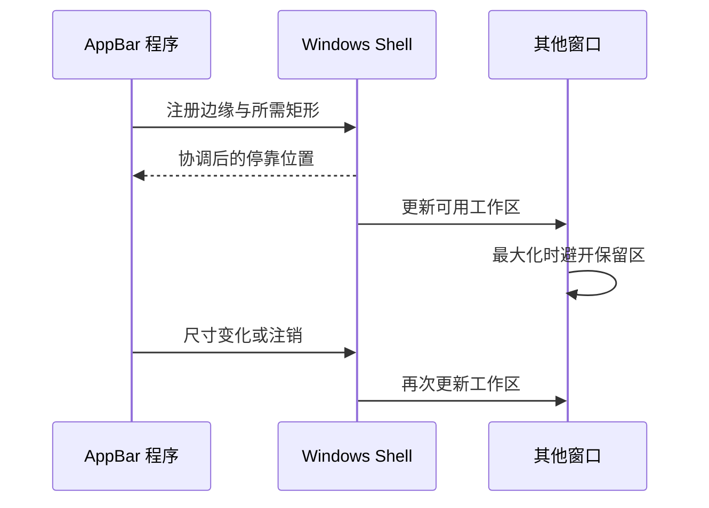

# 总结稿

[打开单页 HTML 总结](assets/bilibili-BV1vhgs6sERi-summary.html)

## 中心论点

Windows Shell AppBar 不是普通“置顶窗口”：应用向 Shell 注册停靠边缘和所需矩形，系统相应调整桌面工作区，让遵守工作区的最大化窗口主动避开这块区域。[00:49–04:38] 视频用 PySide Demo、浏览器、资源管理器和若干桌面工程软件演示底部信息 Panel，并鼓励放入倒计时、性能监视、提词、快捷输入或 AI 入口。[04:53–13:49]

## 机制与实现

1. **注册边缘工具栏**：AppBar 类似任务栏，锚定屏幕边缘，Shell 为它保留桌面区域，也允许多个 AppBar。该定义获 [Microsoft AppBar 官方文档](https://learn.microsoft.com/en-us/windows/win32/shell/application-desktop-toolbars)确认。[00:49–01:29]
2. **区别于 Overlay**：普通置顶窗口覆盖其他窗口；AppBar 修改工作区，最大化浏览器等会避开。[03:24–05:26]
3. **平台互操作**：核心服务来自 Windows Shell/Win32 的 `SHAppBarMessage` 与 `APPBARDATA`，并非 Qt 或 WPF 独占。Qt/WPF 原则上可互操作，但句柄、DPI、消息和生命周期适配取决于框架与实现。[06:32–07:26]
4. **动态协调（实现补充）**：停靠、尺寸或退出变化需要通知 Shell，并处理其他 AppBar/任务栏导致的位置变化。这一机制依据 [Microsoft AppBar 官方文档](https://learn.microsoft.com/en-us/windows/win32/shell/application-desktop-toolbars)；视频约 04:39 的画面显示相关多边/位置说明，但 [07:37–08:58] 字幕不足以支撑把它写成口播结论。

## 演示能证明什么

画面证明本次脚本显示了底部 Panel，并在演示中的浏览器、资源管理器及部分工程软件最大化时保留区域。[03:53–13:49] 它不能保证所有 Windows 版本、DPI、多显示器、全屏独占、游戏、特殊窗口或辅助功能都遵守同样行为。

## 重要纠正：录屏不一定捕获 AppBar

视频在 [14:16–15:13] 说考试录屏或投屏“肯定”会包含 AppBar，这不是无条件规则。Windows Graphics Capture 可以选择整个显示器或单个应用窗口：捕获显示器通常包含 AppBar；只捕获特定窗口则未必。考试软件还可能采用不同采集机制。参见 [Microsoft Screen capture](https://learn.microsoft.com/en-us/windows/uwp/audio-video-camera/screen-capture)。安全提醒仍然有价值：不要在考试或分享屏幕时把敏感信息放进常驻 Panel，但必须按实际捕获模式测试。

## 工程检查表

- 注册/退出时恢复工作区，处理崩溃后的残留状态。
- 支持 DPI、多显示器、任务栏自动隐藏、边缘竞争和位置通知。
- 控制焦点、键盘导航、无障碍名称和输入拦截。
- 评估常驻进程资源、安全边界、敏感信息泄露及企业策略。
- 明确哪些窗口只是不遵守工作区，而不是 AppBar “失效”。

## 观众讨论与补充

12 条热门候选（平台报告 17）与 0 条 current-accessible 弹幕不能代表总体。评论提出 PowerToys Command Palette、YASB、Command Palette dock、实时字幕等替代/相邻工具，以及 CLI agent、一键入口、频谱和 CPU 监视等扩展。这些都是**待核实的观众线索**：功能是否等价、接口是否开放、产品当前状态均需查官方文档。多条 UP 主回复正文不可见；hot-ranking 与无嵌套回复限制仍适用。

# 辅助理解

## 辅助理解

> [!note] 图中“尺寸/位置变化与注销协调”依据 [Microsoft AppBar 官方机制](https://learn.microsoft.com/en-us/windows/win32/shell/application-desktop-toolbars)作 AI 辅助实现补充，不是 [07:37–08:58] 的口播结论；视频约 04:39 的画面只提供位置说明线索。

概念海报把任务栏、主工作区与 AppBar 分开，是理解“预留空间”的最佳入口；它是讲者示意，不是 Windows 官方架构图。

PySide Demo 的底部 Panel 证明本次脚本显示成功，但不能推出跨版本、DPI 或多显示器兼容。[02:20 附近]

浏览器最大化后不覆盖底部区域，直观区分 AppBar 与普通 Overlay。[03:53–04:38]

资源管理器与桌面图标避让是另一个演示样本，说明 Shell 工作区变化影响多个桌面元素；仍不是“所有程序必然遵守”的证明。

Abaqus/CAE 在本次运行中保留底部空间，增加了跨应用观察，但没有形成兼容性测试矩阵。

### 证据层级

| 层级 | 示例 | 应有措辞 |
|---|---|---|
| 官方机制 | Shell AppBar 定义与预留区 | 可确认 |
| 视频演示 | 若干程序本次避让 | 仅限演示环境 |
| 观众补充 | PowerToys/YASB/dock 替代品 | 待核实线索 |
| AI 辅助推断 | 兼容性测试矩阵 | 综合工程建议 |

### AI 辅助推断：最小兼容性矩阵

至少交叉测试 Windows 版本、缩放比例、单/多显示器、四个边缘、任务栏自动隐藏、窗口最大化/全屏、应用崩溃恢复和不同录屏模式。特别不要把“全屏捕获通常看得到”写成“任何录屏一定捕获”。

## 外部事实核验

### 声明 1（00:49）

- 视频陈述：Windows AppBar 是一种可停靠在屏幕边缘、由系统为其保留桌面区域的应用桌面工具栏。
- 核验状态：已确认
- 核验结果：确认。Microsoft Win32 文档将 appbar 定义为类似 Windows taskbar、锚定到屏幕边缘的窗口；系统会阻止其他应用使用 appbar 占用的桌面区域。文档同时说明桌面可以存在多个 appbar。
- 检索日期：2026-08-28
- 来源：
  - [Microsoft Learn — Using Application Desktop Toolbars](https://learn.microsoft.com/en-us/windows/win32/shell/application-desktop-toolbars)（primary）

### 声明 2（06:32）

- 视频陈述：AppBar 不是 Qt 或 WPF 独占能力，而是 Windows Shell/Win32 API；Qt 或 WPF 应用可通过平台互操作调用。
- 核验状态：部分确认
- 核验结果：部分确认。官方资料确认 AppBar 服务由 Windows Shell 提供，应用通过 SHAppBarMessage 和 APPBARDATA 使用，因此它不是 Qt 或 WPF 自身的专属组件。Qt/WPF 程序原则上可经 Win32 互操作接入，但具体封装、窗口句柄取得与行为适配仍取决于所用框架和实现，视频没有展示这些兼容细节。
- 检索日期：2026-08-28
- 来源：
  - [Microsoft Learn — Using Application Desktop Toolbars](https://learn.microsoft.com/en-us/windows/win32/shell/application-desktop-toolbars)（primary）

### 声明 3（14:16）

- 视频陈述：只要考试录屏或投屏，AppBar 区域就一定会被录制或投出。
- 核验状态：存在矛盾
- 核验结果：不成立为无条件规则。Windows Graphics Capture 允许用户选择捕获整个显示器或单个应用窗口：若捕获整个显示器，AppBar 通常在画面范围内；若只捕获特定窗口，则不一定包含 AppBar。考试软件还可能采用其他采集或监控机制。因此视频的安全提醒有价值，但“肯定会录到/投过去”不能泛化。
- 检索日期：2026-08-28
- 来源：
  - [Microsoft Learn — Screen capture](https://learn.microsoft.com/en-us/windows/uwp/audio-video-camera/screen-capture)（primary）

# Data

## 增强转写稿

[00:00] 對,阿德OK,這期視頻給大家介紹的是Windows AppBar,它是怎麼一回事,就說你可以怎麼利用它來做一些有想象力的事情
[00:16] 首先,我們一直都知道,在Windows系統裡面,它一般的工作模式就是一個主屏幕,加上一個任務欄,對吧?
[00:27] 你看,就像我這張圖裡面這樣,它就是這樣一個Windows taskbar,一個主工作區
[00:38] 這個時候呢,你就會發現,它這個任務欄,它其實這個功能有限,它只能做一些很有限的事情
[00:49] 等於被系统给定死了,你无法自由地发挥,你想做的東西,這個時候呢,這個AppBar,它就有了這麼一個API 或者一种机制
[01:07] 你可以拿來利用它做一些有想象力的事情,就要先來申請你一片屏幕空間一樣,你看這,這就是你用上的一張配圖,可以倒计时或者是你制定你的任何你想用的東西,對吧?
[01:29] 而且它還可以多多個,對不對?我們這兒,我們這兒先回憶一下,你在之前肯定,之前的視頻裡面肯定刷到过這個,用這個通知栏,通知窗口倒计时的一個軟件,對吧?
[01:53] 但是呢,這兒,這兒我們這個AI 总结了一下,還有一個停留的時間太短了怎麼辦?
[02:05] 他當時去修改這個Windows通知的顯示時間,這說明了什麼,這說明了他的UI的生命週期還放在了這個Windows 的 UI 黑箱裡面,而不是他產品自己的手裡,對吧?
[02:24] 這個時候呢,這個時候呢,你恰好就很用這個了,對吧?這兒開頭的話,第一句話是您,零散的知识可以引发工业革命,那個是一個Mobile經濟學家的一個結論,就,然後呢,这里引用一下,
[02:52] 後面的話,我就說,那麼這個零散的空间呢,屏幕空間呢,我可以利用一下,對不對?
[03:00] 你看,這兒用這個,對,用這個,叫什么字符？ASCII 字符,就位,你看,它就是這樣的,是你的正常的工作區,
[03:24] 就是你想制定一個Panel,這是Windows taskbar,對吧?它跟這個A,對,對,對,它跟這個普通的窗口置顶這兩回事情,普通的窗口置顶,它就是我蓋在你上面,這個是我申請的這一塊空間呢,對不對?
[03:53] 你看,這兒,呃,我這只介紹一下這個API,那我們來看一下吧,就是說我这里简单做了一个 demo,你看,好,現在我把這個,呃,黑框就是 Windows Terminal,
[04:14] 給隱藏掉,最小化,然後我們看著你,它這兒已經,已經停靠成功了,對不對,我這兒做得比较随意,到時候你可以美化一下,對不對,這些,你給程序問題,取消就行了,你看這樣,這樣我們浏览器,最小化和最大化一下,
[04:38] 它都不會去把這個下面的這個,或者這個AppBar 的空间,給覆蓋掉,就是說它們一定是平等的關係吧,
[04:53] 就,就說你看,可以倒计时,你也可以制定,比如CPU占用,GPU占用,這些RAM占用,或者說你,如果說你是那種,呃,工程,那什麼,叫生产力人员,你可以做一下金屬牙之類的,
[05:14] 或者說,你可以做一些那麼,看想說,呃,提词器,呃,都行,對吧,反正說,你可以塞,你任意你想塞的東西,
[05:26] 是這個完全是你的想像力了,你當然,你是屬於要旋律,然後駐車世界,其實都行,對不對,或者說你甚至可以在這裡,加一個,嗯,輸入方,呃,快速加一個計算系統之類的,
[05:44] 或者是說,還可以快速調,調用AI,呃,對吧,那麼這,這,這讓你有這種空間,哎呀,這是怎麼說呢,你把這個屏幕,想像成一個地皮,有了土地,
[06:03] 那你可以用來種地,用來蓋房子,用來蓋醫院,接接醫院,啊,一二人操場,停车场,你想到什麼,都是你對不對,
[06:19] 呃,這期視頻也是一個,呃,相當於是know-where,啊,這個體質,是一個,是一個know-how,對不對,呃,視頻,
[06:32] 視頻只是,視頻就,就是說,嗯,嗯,简单演示一下,怎么注册,他,他這個,因為他既不是Qt獨佔,也不是WPF獨佔的,
[06:49] 他就是,他就是調這個Windows的API,對不對,所以說Qt和WPF都可以用,
[07:03] 你看,他這個信息,都,都很理解,這,這個地方那個,能,能給我嗎,那我給你,對不對,他他不用自己算坐标,
[07:16] 這,這就是代码示例的,你可以把它複製下來,拿去用AI就行了,這個怎麼實現,你用用AI就多方便對不對,
[07:26] 這我只是給你提供這個信息,也有這麼一個功能對不對,
[07:37] 可以注册多个吗,你還可以注册多个吗,
[07:53] 嗯,好,我們先上面一個字,就我,我有沒有想到第一個字,就是被當事嘛,
[08:03] 空间本身就是资源,這個很土地,你也可以加長一點,或者說,對不對,你還侧边栏嗎,我喜歡,侧边栏,你說下面還可以侧边栏,哎呀,對不對,
[08:24] 哎,好,就是說,我把這個,這個空這個給你了,剩下的,就是你的想像力了,對不對,
[08:41] 好,那您好,我這個四伯爺就推幅,我這個一陣影視一下,你看,我如果說我這呼吸了之後,你看我這個,這個這個,他都,
[08:58] 他都不會,就是啊,這個文件,文件瀏覽器,他都會自動往上抬,嗯,然後的話,嗯,然後的話,你看我這個屏幕,我這個屏幕,桌面图标,他也會自動往上抬一點,
[09:18] 但是說明他是很,很實用的一功能,就等在著我們去發發覺,就說微軟這邊,已經把這個接口给打磨好了,就等在著我們去用了,
[09:34] 我再去兩個,再打開這個,比如我打開這個,Edge 浏览器,你看,他很识相地往上抬的,對不對,我再打開這個,再打開一個吧,比如我打開這個,
[09:57] 這個啥,這個VS Code,你看,對不對,而且你看,確定是最大化,全屏的,還有這個Windows Terminal,最大化,你看是不是,
[10:15] 嗯,我們再打開一些軟件吧,比如,比如如果說我是一個設計人員,我就打開這個SketchUp,
[10:35] 你看,他也是很识相地,把他給抬起來的,然後打開CAD呢,AutoCAD,
[11:06] 你看,他也是抬起來的,然後我們打開這個SR,SR軟件可以打開的,作為這個工業軟件開發了,
[11:22] 建筑软件 Rhino,當然,我這些軟件,作為在读学生,那就是教育版,對不對,或者是體驗版,你看,抬起來了,還有這個Revit,這是一個比較大型的軟件,
[11:52] 哎,這還是我寫的一個插件,好,剛剛彈出來的弹窗,是和是否允許交在我寫的一個插件,看一下,看一下,看一下,看一下,是不是,
[12:23] 他怎麼一直轉圈呢,可能沒加到好,哦,這是一些插件,好的,我們買出什麼,哦對,這兒給大家說一下,
[12:42] 這個軟件,怎麼說呢,他可能在打開的時候會加載很多,會加載很多的那個內容,但是呢,為了不要用很长时间等待,他可能就會做一些延遲加載的一些措施,
[13:02] 然後我先把這個界面給你打開,先把這個界面彈出來了,對吧,然後我再在後台加了那些內容,不然的話,那用戶一直等在那個界面的話,
[13:19] 他启动速度太慢了,我就回報了,這其實是一種,是一種智慧的,還有一個什麼呢,看一下,那我們再來一個這個,可不可以是誰的意吧,
[13:49] 你看你看,還是很實際上的就彈起來了,好,這些視頻呢,怎麼說呢,
[14:16] 哎,那換句話說,不行不行不行,我說,你千萬不要在考試的時候去耐用這個功能,那考試的時候呢,人家可是全部录屏的,他肯定又露露到你這個,對吧,
[14:42] 你這個要做的,你可以用個訊息,就不要乱试了,他這個軟件監視,他不是指監視你,你在一個局部的空間,他全录屏了,如果是考試了,考試了個录屏的話就對了,
[15:13] 如果你投屏的話,你肯定這個也會給你投過去的,好,我退出來,你看,退出這,他要自動的下來了,他這些視頻就在這裏,

## 原始转写稿

[00:00] 對,阿德OK,這期視頻給大家介紹的是Windows ABB本,它是怎麼一回事,就說你可以怎麼利用它來做一些影響住者的事情
[00:16] 首先,我們一直都知道,在Windows系統裡面,它一般的工作模式就是一個主屏幕,加上一個任務欄,對吧?
[00:27] 你看,就像我這張圖裡面這樣,它就是這樣一個Windows Task Bar,一個主工作區
[00:38] 這個時候呢,你就會發現,它這個任務欄,它其實這個功能有限,它只能做一些很有限的事情
[00:49] 等於被系統給定時了,你無法制定你的發揮,你想做的東西,這個時候呢,這個APP Bar,它就有了這麼一個API或者是一個階段
[01:07] 你可以拿來利用它做一些影響住者的事情,就要先來申請你一片屏幕空間一樣,你看這,這就是你用上的一張配圖,可以被當時或者是你制定你的任何你想用的東西,對吧?
[01:29] 而且它還可以多多個,對不對?我們這兒,我們這兒先回憶一下,你在之前肯定,之前的視頻裡面肯定爽到過這個,用這個通知藍,通知窗口被當時的一個軟件,對吧?
[01:53] 但是呢,這兒,這兒我們這個AI終結了一下,還有一個停留的時間太短了怎麼辦?
[02:05] 他當時去消擺這個Windows通知的顯示時間,這說明了什麼,這說明了他的UI的生命週期還放在了這個Windows的這個Wi-Fi黑線裡面,而不是他產品自己的手裡,對吧?
[02:24] 這個時候呢,這個時候呢,你恰好就很用這個了,對吧?這兒開頭的話,第一句話是您,您想的知識可以把這個公民革命,那個是一個Mobile經濟學家的一個結論,就,然後呢,這裡移用一下,
[02:52] 後面的話,我就說,那麼這個臨場的空間呢,屏幕空間呢,我可以利用一下,對不對?
[03:00] 你看,這兒用這個,對,用這個,叫什麼制服?Ask制服,是不是?就是說用這個Ask制服,ASCII制服,就位,你看,它就是這樣的,是你的正常的工作區,
[03:24] 就是你想制定一個Panel,這是Windows Task bar,對吧?它跟這個A,對,對,對,它跟這個普通的方可制定這兩回事情,普通的方可制定,它就是我蓋在你上面,這個是我申請的這一塊空間呢,對不對?
[03:53] 你看,這兒,呃,我這只介紹一下這個API,那我們來看一下吧,就是說我這雙機做了一個demo,你看,好,現在我把這個,呃,黑空花就是Windows Terminal,
[04:14] 給隱藏掉,最小化,然後我們看著你,它這兒已經,已經電腦,電腦成功了,對不對,我這兒做的比較協議,到時候你可以美化一下,對不對,這些,你給程序問題,取消就行了,你看這樣,這樣我們扭染器,是小化和大化一下,
[04:38] 它都不會去把這個下面的這個,或者這個APP一半的color,給覆蓋掉,就是說它們一定是平等的關係吧,
[04:53] 就,就說你看,可以被當時,你也可以制定,比如CPU占用,GPU占用,這些RAM占用,或者說你,如果說你是那種,呃,工程,那什麼,叫生產力能源,你可以做一下金屬牙之類的,
[05:14] 或者說,你可以做一些那麼,看想說,呃,提示器,呃,都行,對吧,反正說,你可以塞,你任意你想塞的東西,
[05:26] 是這個完全是你的想像力了,你當然,你是屬於要旋律,然後駐車世界,其實都行,對不對,或者說你甚至可以在這裡,加一個,嗯,輸入方,呃,快速加一個計算系統之類的,
[05:44] 或者是說,還可以快速調,調用AI,呃,對吧,那麼這,這,這讓你有這種空間,哎呀,這是怎麼說呢,你把這個屏幕,想像成一個地皮,有了土地,
[06:03] 那你可以用來種地,用來蓋房子,用來蓋醫院,接接醫院,啊,一二人操場,駐車場,你想到什麼,都是你對不對,
[06:19] 呃,這期視頻也是一個,呃,相當於是no wear,啊,這個體質,是一個,是一個no how,對不對,呃,視頻,
[06:32] 視頻只是,視頻就,就是說,嗯,嗯,進行連鎖一下,怎麼駐車,他,他這個,因為他既不是QT獨佔,也不是WPF獨佔的,
[06:49] 他就是,他就是調這個Windows的API,對不對,所以說QT和WPF都可以用,
[07:03] 你看,他這個新字,都,都很理解,這,這個地方那個,能,能給我嗎,那我給你,對不對,他他不用自己上桌表,
[07:16] 這,這就是代碼勢力的,你可以把它複製下來,拿去用AI就行了,這個怎麼實現,你用用AI就多方便對不對,
[07:26] 這我只是給你提供這個新字,也有這麼一個功能對不對,
[07:37] 可以駐車多了嗎,你還可以駐車多了嗎,
[07:53] 嗯,好,我們先上面一個字,就我,我有沒有想到第一個字,就是被當事嘛,
[08:03] 空間本身就是支援的,這個很土地,你也可以加長一點,或者說,對不對,你還測變難嗎,我喜歡,測變難,你說下面還可以測變難,哎呀,對不對,
[08:24] 哎,好,就是說,我把這個,這個空這個給你了,剩下的,就是你的想像力了,對不對,
[08:41] 好,那您好,我這個四伯爺就推幅,我這個一陣影視一下,你看,我如果說我這呼吸了之後,你看我這個,這個這個,他都,
[08:58] 他都不會,就是啊,這個文件,文件瀏覽器,他都會自動往上看,嗯,然後的話,嗯,然後的話,你看我這個屏幕,我這個屏幕,屏幕圖標,他也會自動往上看一點,
[09:18] 但是說明他是很,很實用的一功能,就等在著我們去發發覺,就說微軟這邊,已經把這個結合給打磨好了,就等在著我們去用了,
[09:34] 我再去兩個,再打開這個,比如我打開這個,一滴滴一滴軟器,你看,他很實相的往上看的,對不對,我再打開這個,再打開一個吧,比如我打開這個,
[09:57] 這個啥,這個威士康的,你看,對不對,而且你看,確定是最大畫,全平的,還有這個Windows Terminal,最大畫,你看是不是,
[10:15] 嗯,我們再打開一些軟件吧,比如,比如如果說我是一個設計人員,我就打開這個Sketchup,
[10:35] 你看,他也是很實相的,把他給抬起來的,然後打開CAD呢,AutoCAD,
[11:06] 你看,他也是抬起來的,然後我們打開這個SR,SR軟件可以打開的,作為這個工業軟件開發了,
[11:22] CNU軟件呢,Reno,當然,我這些軟件,作為一代讀學生,那就是教育版,對不對,或者是體驗版,你看,抬起來了,還有這個Ravite,這是一個比較大型的軟件,
[11:52] 哎,這還是我寫的一個插件,好,剛剛彈出來的彈瘡,是和是否允許交在我寫的一個插件,看一下,看一下,看一下,看一下,是不是,
[12:23] 他怎麼一直轉圈呢,可能沒加到好,哦,這是一些插件,好的,我們買出什麼,哦對,這兒給大家說一下,
[12:42] 這個軟件,怎麼說呢,他可能在打開的時候會加載很多,會加載很多的那個內容,但是呢,為了不要用虎腸時間等待,他可能就會做一些延遲加載的一些措施,
[13:02] 然後我先把這個界面給你打開,先把這個界面彈出來了,對吧,然後我再在後台加了那些內容,不然的話,那用戶一直等在那個界面的話,
[13:19] 他啟動幅度太慢了,我就回報了,這其實是一種,是一種智慧的,還有一個什麼呢,看一下,那我們再來一個這個,可不可以是誰的意吧,
[13:49] 你看你看,還是很實際上的就彈起來了,好,這些視頻呢,怎麼說呢,
[14:16] 哎,那換句話說,不行不行不行,我說,你千萬不要在考試的時候去耐用這個功能,那考試的時候呢,人家可是全部露平的,他肯定又露露到你這個,對吧,
[14:42] 你這個要做的,你可以用個訊息,就不要亂形式了,他這個軟件監視,他不是指監視你,你在一個局部的空間,他全露平了,如果是考試了,考試了個露平的話就對了,
[15:13] 如果你投平的話,你肯定這個也會給你投過去的,好,我退出來,你看,退出這,他要自動的下來了,他這些視頻就在這裏,

## 原始关键帧

### 关键帧 1

### 关键帧 2

### 关键帧 3

### 关键帧 4

### 关键帧 5

### 关键帧 6

### 关键帧 7

### 关键帧 8

### 关键帧 9

### 关键帧 10

## 补充原始数据

- [bilibili-BV1vhgs6sERi-comments.jsonl](assets/bilibili-BV1vhgs6sERi-comments.jsonl)
- [bilibili-BV1vhgs6sERi-comment-candidates.json](assets/bilibili-BV1vhgs6sERi-comment-candidates.json)
- [bilibili-BV1vhgs6sERi-danmaku.jsonl](assets/bilibili-BV1vhgs6sERi-danmaku.jsonl)
- [bilibili-BV1vhgs6sERi-danmaku-analysis.json](assets/bilibili-BV1vhgs6sERi-danmaku-analysis.json)
- [bilibili-BV1vhgs6sERi-summary.html](assets/bilibili-BV1vhgs6sERi-summary.html)
