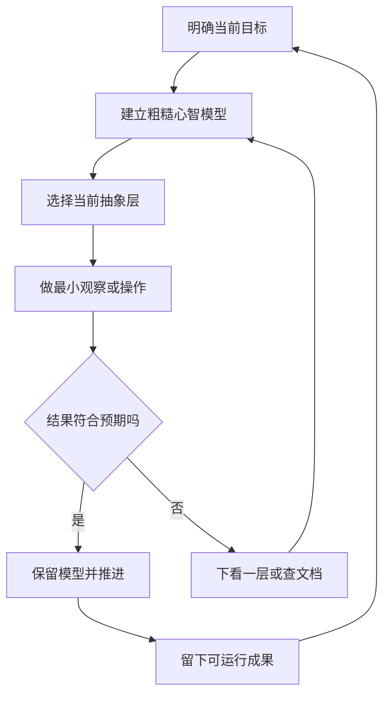

# 总结稿

[打开单页 HTML 总结](assets/bilibili-BV1SU8T6mEgD-summary.html)

## 中心论点

计算机工作的核心不是记住所有底层细节，而是**在合适层级使用与创造抽象，并用目标—模型—试探—验证—修正的循环理解陌生系统**。视频把这一思路从六行 Python 重构、文件与程序的语义一路扩展到 ISA、操作系统和应用层，最后补上学习者的心理反馈机制。[01:15–34:17]

## 内容结构

### 1. 抽象：只暴露当前任务所需概念

- 通过把重复的文件写入逻辑封装为 `save_student(name, score)`，演示隐藏实现、复用接口和资源管理。[04:08–06:18]
- 编程一边使用语言、库和系统提供的抽象，一边创造新的函数、类与接口。[06:03–06:18]
- 文件、扩展名、程序和网络库都是分层解释的例子；现代软件通常建立在已有软件之上，而非从零开始。[10:01–16:10]
- 处理文件时，Python `with` 能通过上下文管理协议保证退出语句时正确关闭文件，包括异常路径；该机制获 [Python 官方教程](https://docs.python.org/3/tutorial/inputoutput.html#reading-and-writing-files)确认。[04:58]

### 2. 分层：需要时向下看一层，而不是挖到底

视频用晶体管、数字逻辑、数据通路、处理器/内存/I/O、ISA、编译器、操作系统和应用构成“计算机大厦”。[17:52–19:17] 当某层解释不了问题时，可下看一层；一旦足以解释当前问题，就停止下钻。[28:56–29:27]

### 3. 陌生系统：目标—模型—实践—调整

面对陌生概念、工具、代码库或故障，先缩小目标，再建立哪怕粗糙的心智模型；随后做有目的的观察/操作，以结果是否符合预期来修正模型。[23:01–27:12] AI、搜索和文档是线索来源，不能替代验证。

### 4. 持续学习：管理正反馈

同一次环境配置失败，可以被解释为“我太差”，也可视为获得了新知识；解释会影响下一步行动。[32:27–34:17] 视频建议把可运行的小结果、可复制修改的示例和成就感纳入学习设计。[37:17–39:12]

## 事实核查与实践边界

- [14:12] 视频称 `requests` 是 Python 自带模块不正确。它是需单独安装的第三方库，参见 [Requests 安装文档](https://requests.readthedocs.io/en/latest/user/install/)。
- [16:52] `uv venv` 可创建隔离的项目虚拟环境，获 [Astral uv 官方文档](https://docs.astral.sh/uv/pip/environments/)确认；但 uv 不只是一种“训练环境工具”。
- [20:57] Windows 中打开文件常导致删除失败，但若句柄允许 `FILE_SHARE_DELETE`，系统可标记删除并待最后句柄关闭后完成；不是无条件规则。参见 [Microsoft DeleteFile](https://learn.microsoft.com/en-us/windows/win32/api/fileapi/nf-fileapi-deletefilew)。
- 抽象会泄漏。接口、库或 AI 输出不可靠时，仍需下钻、阅读错误、检查文档或最小化复现。

## 实践清单

1. 写下当前唯一目标和“知道什么就够了”。
2. 画一个最粗糙的系统模型，标出未知点。
3. 设计一次能区分两种解释的最小实验。
4. 记录预期、观察与差异，而不是只收藏答案。
5. 只向下钻到足够解释问题的层级。
6. 留下一个可运行的小成果，形成下一轮学习的正反馈。

## 观众讨论与补充

20 条热门顶层候选（平台报告 123）与 15/18 条 current-accessible 弹幕不能代表总体。较有价值的观众补充包括：移动端习惯可能造成 PC/命令行能力缺口；抽象可靠依赖底层，AI 错误率不可接受时仍需掌握语言和调试；人工章节导航便于回看。33:00–33:30 有 3 条、29:00–29:30 有 2 条，只是本次小样本候选集中段。热门排序有偏差、嵌套回复未采集，观众意见不是视频事实证明。

# 辅助理解

## 辅助理解

### 抽象与学习循环

这张教学示意解释“为什么写几行 Python 就能调用庞大硬件”：我们操纵的是层层接口，不是逐个晶体管。它不是性能证据。

`save_student` 的例子展示**自己创造抽象**：把重复步骤和文件资源细节放进函数，只暴露姓名与分数。[04:08–06:18] 事实核查确认 `with` 的资源管理方向；完整工程仍要考虑路径、编码、异常与并发。

宏观分层图的价值是定位“下一层在哪里”。它是课程式结构模型，不表示所有现代系统都严格按图分层。

陌生 GitHub 项目案例把方法落地：README、文档、搜索和 AI 用于补全模型；真正的验证来自运行、观察和预期差异。[27:12 附近]

### 三种陈述要分开

| 类型 | 示例 | 如何使用 |
|---|---|---|
| 视频观点 | 抽象只暴露任务所需概念 | 作为方法理解，结合项目验证 |
| 事实核查 | `requests` 不是标准库 | 以官方来源纠正视频口误 |
| AI 辅助推断 | 抽象层级选择是一种“调查成本预算” | 明确为综合推断，不冒充原话 |

### AI 辅助推断：层级选择原则

可以把每次下钻看成付出调查成本。若当前层的实验已经能区分候选原因，就先实验；只有接口行为无法解释结果时才向下钻。这样避免“什么都想懂”的无边界学习，也减少把 AI 摘要误当理解。

## 外部事实核验

### 声明 1（04:58）

- 视频陈述：Python 的 `with ... as ...` 上下文管理器可以自动管理文件资源。
- 核验状态：已确认
- 核验结果：确认。Python 官方教程说明，使用 `with` 处理文件对象时，即使处理中发生异常，文件也会在语句结束后正确关闭。具体行为来自对象的上下文管理协议。
- 检索日期：2026-08-28
- 来源：
  - [Python Tutorial — Reading and Writing Files](https://docs.python.org/3/tutorial/inputoutput.html#reading-and-writing-files)（primary）

### 声明 2（14:12）

- 视频陈述：`requests` 是 Python 自带模块。
- 核验状态：存在矛盾
- 核验结果：不正确。Requests 是独立的第三方 HTTP 库，官方安装文档要求通过 `python -m pip install requests` 安装；它不属于 Python 标准库。
- 检索日期：2026-08-28
- 来源：
  - [Requests Documentation — Installation](https://requests.readthedocs.io/en/latest/user/install/)（primary）

### 声明 3（16:52）

- 视频陈述：uv 可以为不同 Python 项目创建彼此独立的虚拟环境。
- 核验状态：已确认
- 核验结果：确认。Astral 官方文档说明 `uv venv` 创建虚拟环境，项目环境默认位于 `.venv`；虚拟环境用于隔离项目依赖。uv 还具有包与 Python 版本管理能力，不能只概括成“训练环境工具”。
- 检索日期：2026-08-28
- 来源：
  - [uv — Using environments](https://docs.astral.sh/uv/pip/environments/)（primary）

### 声明 4（20:57）

- 视频陈述：Windows 中只要文件已打开，操作系统就一定拒绝删除，因为存在文件句柄。
- 核验状态：部分确认
- 核验结果：部分确认。Windows `DeleteFile` 文档说明：若其他句柄以普通方式打开该文件，删除会失败；但如果打开句柄允许 `FILE_SHARE_DELETE`，删除可被标记并在最后一个句柄关闭后完成。因此视频描述是常见现象，不是无条件规则。
- 检索日期：2026-08-28
- 来源：
  - [Microsoft Learn — DeleteFile function](https://learn.microsoft.com/en-us/windows/win32/api/fileapi/nf-fileapi-deletefilew)（primary）

# Data

## 增强转写稿

[00:00] OK,你们应该现在能看到屏幕,那我先开始了。
[00:09] 另外说个题外话,这两天嗓子不太舒服,所以可能讲的时候有点咳嗽,
[00:19] 就有点打断,大家不得希望大家包容一下。那接下来我要讲的部分是相当于针对SI 100+ 课程,我最后做一点我自己的总结的分享吧。
[00:36] 所以我给它的定的主题就是一些重要的计算机素养。所以我们先看下来,接下来要讲什么。
[00:46] 我在备这个课的时候,主要是感觉好像比如说计算机专业的学生,好像他们的这些方差都比较大,就有的可能可能高中打过那些计算机竞赛什么的,
[01:02] 然后有的可能就对计算机接触的不是这么多,所以我就尽量想出一个思想能串联起来,就尽量能让所有起点的同学都比较受益的。
[01:15] 所以我就介绍一些比较GENERAL比较普遍的概念,所以来讲这些课。首先我会讲抽象的概念到底是什么,然后我会讲如何理解一个陌生的数字系统。
[01:33] 就说白了,其实就是教你遇到一些陌生的东西怎么学它,然后最后再讲一下我觉得真正的计算机素养是什么。先来讲抽象吧,大家这两天学了Python之后,
[01:49] 然后应该就已经会学一些简单的代码,但是你们编程的时候都是直接在那个比如说VSCode上面像这张图左边那样简单的写一些函数就简单的调用那些Python函数来实现一些简单的功能,而不是像右边这样,就这种就是很上古的,
[02:13] 就比如说,比如说上个世纪有的电脑里编程的话是要用那种打孔纸带来这样编程的,就即便这样子就很抽象,就给它微操向左移动5厘米,就我们为什么会能够这样编程,就使得这样很简单的实现一些功能,是因为我们在通过抽象和分层接口来使用计算机,
[02:39] 而不是直接操纵每一个晶体管,因为我们就知道计算机是由晶体管组成的,但是我们在实际编程的时候就不是直接操纵这些晶体管,我们是操作的上层的这种字符串,
[02:52] 所以我们从一个比较小的例子来切入,比如说这是一个非常简单的例子,就应该你自己都会只有六行代码,
[03:03] 就是我们要保存两个同学的分数,然后把它写入文本文件,然后这个代码的话,大家可以看到是先创建一个打开一个文件的对象,
[03:18] 然后再写入一些字符串,然后再关掉这个文件,然后这样的类似的操作重复了两次,
[03:28] 然后我们就会发现,这样它会比较麻烦,带来许多重复结构,不容易阅读,所以更好的写法其实是这样的,
[03:38] 就自己首先定义一个函数,函数输入,就是你要固定要保存的姓名和分数什么的,
[03:45] 然后再在外部再调用这个函数,这样你想添加一些新的功能,或者改动一些代码的话,都会非常简洁,
[03:55] 然后我解释一下具体这是怎么回事,就首先的话,我们可以理解为我们创造了自己的抽象名字叫做save student,
[04:08] 其实就是说白了,就是这一个函数,然后我这里用一个更高大上的名字把它叫做抽象,
[04:15] 然后我们的目的是隐藏了写入姓名和分数的实现细节,然后所以我们就把这个代码结构抽象成了一个函数,
[04:26] 同时我们不仅自己创造了这几个抽象,我们还使用了Python 语言给我们的抽象接口,
[04:35] 可以PPT 上这里就写得很清楚这个save student是我们刚刚提到自己创造的接口,而其实是这种open函数也是Python提供给你的抽象接口,
[04:49] 还有这个f.write,就是这个文件类它自己自带的一种方法,现在其实都是Python这个语言提供给你的,
[04:58] 然后呢,其实还有一个就是这种with什么什么asf,这个其实也是使用with上下文管理器自动管理文件资源的一个抽象接口,
[05:12] 所以我们在这个别写写完这单代码的时候,然后我们运行,其实发生了这些事,从上往下看的话就比较直观,
[05:25] 就是我们先调用了一个自己创造的抽象,然后自己创造的函数它里面又调用了Python提供给你的函数,
[05:33] 比如说这个open 和 write,然后Python它自己又是怎么往下调用来实现你需要的功能呢,
[05:41] 它就是提供了操作系统提供的抽象,操作系统其实这一块是计算机基础比较重要的一个东西吧,
[05:48] 我记得你们26级好像25级26级都是操作系统好像是和人工智能二选一必修的,
[05:56] 然后操作系统再往下就是就是调用这些文件系统,存储设备这种SSD 控制器,
[06:03] 然后一路到晶体管,这样的一个层级,
[06:06] 然后所以我就可以简单的下个结论就是编程的过程一边是在使用别人提供的抽象一边是在自己创造新的抽象,
[06:18] 然后我所以我这里在接就给抽象差不多下个定义吧,
[06:22] 就是抽象就是隐藏当前不需要关心的实现细节,
[06:27] 只暴露完成任务所需要的概念和接口,
[06:30] 隐藏细节就指的是save student的时候我们暂时不需要知道它里面到底是怎么实现的,
[06:38] 它究竟是用open这个Python函数还是使用了别的什么数据库什么的东西,
[06:43] 也不用考虑文件什么时候关闭,就如果懂一点 C 的同学可能就知道就关闭这些文件要手动,
[06:53] 比如说释放内存这些都是比较麻烦的,
[06:56] 然后但别的语言比如说Python的话你可能就不需要这么麻烦的管理内存,
[07:02] 然后另一个特点就是暴露接口,
[07:05] 就比如说我们还是必须要知道save student他需要什么输入完成什么事情有什么使用规则,
[07:12] 而那些细节并没有消失比如说open后面的操作系统文件系统硬件都还在那里,
[07:19] 只是当前我们这一程不需要处理它们,
[07:21] 所以通过抽象复杂性被关在了一个边界后面,
[07:26] 我看到评论人说什么黑箱,
[07:28] 其实差不多可以这么理解吧,
[07:31] 我觉得这些概念大差不差,
[07:35] 然后刚刚是讲的微观的层面来看,
[07:37] 然后现在来看一些你们现在接下来可能会用的比较多的一些东西,
[07:43] 比如说GUI 和命令行呃是能够其实可以理解为两种抽象方式,
[07:49] GUI就是你们用电脑比如说Windows 系统上最熟悉的那些就是软件那些图形界面,
[07:56] 比如说一个文件夹就是这样一个图标,
[07:59] 然后一个文件就是这样一个图标,
[08:01] 然后我们双击这个图这个图标就可以打开它,
[08:04] 然后拖拽它就可以让它在那些文件夹里面移动这个,
[08:09] 而命令行也可以实现类似的功能,
[08:12] 比如说呃比如说也比如说拍拍摄就其实就是使用拍摄这个命命,
[08:19] 然后然后输入命点拍这个函数这个文件,
[08:23] 然后来让它运行这个拍摄代码,
[08:27] 然后输入一些命令也是差不多类似的使用方法。
[08:33] 然后为什么我然后可能有人想问为什么已经能用GUI操作电脑我们还要学习命令行,
[08:40] 呃是因为上层对下层的抽象不只有一种方式,
[08:44] 呃GUI和命令行他们其实都是对计算机的一种抽象他们,
[08:49] 但他们都各自有各自的特点,
[08:51] 他决定了什么事情容易表达GUI 擅长的就是就很用户友好,
[08:56] 你能看见选择点击、拖动、浏览、填写操作而命令行的话,呃你可能就呃比如说后面开发一些呃,
[09:07] 比如说我我我我我自己我个人是研究机器人这块多一点吧,
[09:11] 就他就可能就要写一些脚本、Shell 脚本,
[09:15] 他其实就是直接很类似于命令行他就是呃其实他跟命令行不完全一样,
[09:22] 但他语法都一样的他的原理都是精确描述批量处理组合重复自动化一些操作呃,
[09:29] 所以其实他们都各有各自的优点而命令行他其实并不比天然比GUI更高级,
[09:36] 也不天然更底层,
[09:37] 他只是选择了另一套交互的抽象呃,
[09:41] 然后另一个再介绍另一个概念就是程序是什么在在这个比如说在这个lecture01之中我们提到了程序和快捷方式的区别,
[09:51] 就比如说电脑上我们下载一个软件之后桌面上会出现一个快捷方式,
[09:57] 然后我们就知道程序其实就不是这个桌面上的一个图标,
[10:01] 图标只是这个GUI给程序提供的一种表示,
[10:06] 那程序到底是什么呢,
[10:08] 他其实不是一个固定形态的东西,
[10:11] 是可以从不同层次理解的计算机对象围绕程序我们不同层次会关注不同的对象,
[10:18] 比如说我们平时写到那些Python 源代码就是人可以编写的表示,
[10:23] 而代码他会经过解释器来解释成Python代码是通过解释器,
[10:30] 然后但别的C 语言、C++什么的他会编译成那些机器码、字节码什么的,
[10:35] 就成为一种系统可以加载的表示,
[10:38] 然后当这个程序加载到内存,
[10:41] 然后相当于让他活起来之后,让他活起来之后,然后他就就开始运行之后,
[10:50] 他的名字就叫做进程了,
[10:52] 而机器指令就是CPU实际执行的操作,
[10:57] 所以我们问的问题不同,
[10:58] 最后模型可能也不同,
[11:00] 然后接下来第三个概念就是文件是什么的,
[11:04] 其实这个东西的话,看起来文件是跟我们比如说生活生活当中那些纸,
[11:13] 那些纸张上面写的一些信息也差不多,
[11:17] 在计算机里面文件其实它底层就是一串字节,这样一串机器码,
[11:23] 但是往上一层他们可能编码的格式就不太一样了,
[11:29] 这些机器字节他可能要按照某种规则的解释,
[11:32] 比如说如果它是按照UTF8的话,它就是文本文件,
[11:37] 它可以用文本编辑器打开,
[11:40] 比如说你们写的Python代码,还有这种markdown文件,
[11:46] 还有这种什么YAML、HTML这种就是一种配置文件,还有标记语言,
[11:56] 然后其他格式的话就可能你没法用文本文件打开,
[11:59] 你打开之后是乱码,它就是有特定的格式,
[12:03] 比如说PNG、ZIP,PNG是那种图片,
[12:07] ZIP 是压缩文件,然后EXE就是可执行文件,
[12:11] 然后DLL就是那种动态链接文件,
[12:14] 然后DOCX和PPTX就是微软的那些东西,
[12:20] 然后再往上一层,就是程序帮你完成解释,
[12:24] 比如说你用图片查看器,可以打开图片,
[12:29] 比如说PNG这种格式,而Word这个软件就可以用来打开文档这种格式,
[12:37] 而你们点击一个EXE运行一个程序的时候,
[12:41] 它其实也是有一个软件在帮你解释这些东西,
[12:47] 其实就是操作系统,刚刚我提过操作系统比较重要,
[12:50] 现在其实又出现了,它其实你知道程序运行很大程度上都是在依靠操作系统在运行,
[12:59] 然后顺便一提一下,就是扩展名它只是文件名的一部分,
[13:03] 它只是用来提示用户应该按什么格式解释这种文件,
[13:07] 就比如说你修改扩展名不会直接改变这个文件本身的数据,
[13:13] 比如说把EXE文件后缀改成`.py` 文件,它就不会直接变成Python代码,
[13:19] 你打开之后,你估计还是会看到一段乱码,
[13:24] 然后还有个概念就是环境与依赖是什么,
[13:29] 你们应该现在已经配过那种Python环境了,
[13:35] 所以我觉得这里有必要再介绍一遍,
[13:38] 就是因为一个程序文件放在那里,它在有一台电脑上运行,
[13:45] 比如说你安装了Python解释器,那所以你能运行Python代码,
[13:50] 但是在另一个电脑,随便另一个电脑可能就不行了,
[13:54] 这因为程序它无法独自运行,它总是需要接触周围的一些东西,
[14:01] 比如说别的程序暴露出的一些接口,
[14:04] 而程序需要它们的函数或者类,
[14:06] 比如说这个例子短短三行代码,
[14:09] 它运行的时候就其实就需要很多东西了,
[14:12] 比如说这个import requests就其实就引入了这种Python 自带的 requests 模块,
[14:19] 然后还有这个`.get()` 函数其实也是它的模块里面的一些接口,
[14:25] 然后比如还有一些比如说操作系统网络和一些配置,
[14:31] 都是这个这几行代码运行所需要的东西,
[14:35] 所以这个所以我就再次引入依赖的概念,
[14:39] 它是一个程序为了正常工作,需要借助的其他程序库,
[14:44] 组件或者资源这些东西,比如说它可能是电脑上的其他程序,
[14:49] 例如你的Python程序就依赖你们添加那个环境变量的时候,
[14:53] 应该就看到一个Python.exe的程序,
[14:58] 所以你要把这个加入到环境变量里面,
[15:01] 它才能找操作系统才能帮你找到它,
[15:04] 说需要用这个来解释你的代码,
[15:08] 或者是别的运行时库,
[15:09] 比如说你有的时候可能会看到,比如说你好奇点开一些Windows的安装路径,
[15:16] 然后你会看到一些这种`.dll` 文件,它就是运行时库,
[15:20] 或者是或者别的依赖还有就是更底层的抽象接口,
[15:26] 比如说你的操作系统,
[15:28] 还有操作系统的内核一些扩展,
[15:30] 比如说它叫做驱动,不过一般人员我们常说的依赖是指那种软件包依赖,
[15:36] 比如说你可以简单理解为这种Import上是什么东西对应的包,
[15:41] 比如说你搞深度学习可能就import torch这种东西,
[15:45] 然后其实就是引入PyTorch这个依赖,
[15:48] 而这些包又可能依赖其他包形成一条长长的依赖链,
[15:52] 所以这里PPT我没说,
[15:54] 所以这里我就要指出,
[15:57] 其实包管理器它差不多就有一个很重要的功能就是处理这种依赖链的这种东西,
[16:05] 所以但是这里的重点是一个结论,
[16:08] 就是现代软件其实很少从零开始,
[16:10] 而是在大量已有软件之上搭建的,
[16:14] 然后刚刚介绍完来依赖,
[16:16] 现在来介绍另一个概念就是环境,
[16:18] 环境就是系统为程序运行所提供的一种外部条件,
[16:22] 比如说比如说你的电脑,
[16:24] 现在可能处于一种有Python 3.13、某个版本的 NumPy,
[16:30] 还有requests、PyTorch、CUDA, Windows系统的一整套环境之中,
[16:34] 但是但是不同的程序它可能需要不同的依赖,
[16:39] 所以它需要的环境也不同,
[16:41] 比如说有个程序需要Python3.11然后这个,
[16:44] 但另一个程序需要Python3.13,
[16:46] 如果我们一个电脑只有一个共同的环境的话,
[16:49] 这些包会互相影响干扰运行,
[16:52] 所以我们就使用UV来创造不同的虚拟环境,
[16:57] 给不同的项目使用相对独立的环境,
[16:59] 所以所以其实你们安装Python的时候,
[17:05] 其实好像我记得你们不是直接去Python官网下载Python,
[17:09] 而是好像是下了一个UV的这个东西,
[17:12] 所以其实UV它就是主要就是管理这个Python虚拟环境的作用,
[17:19] 然后看完了微观我们来看宏观就这个,
[17:23] 这个整个图就差不多给你展示了计算机的全貌是怎么样的,
[17:29] 这个图是我上那个计算机体系结构的时候看到的,
[17:35] 然后我觉得它比较重要吧,
[17:37] 因为它差不多是计算机体系结构最重要的一个概念之一了,
[17:44] 可以看到这个体系结构的话,
[17:47] 最底层就是transistor就是晶体管,
[17:50] 然后网上就是一些数字电路,
[17:52] 然后再到最高层的话就是这种Processor、Memory、I/O System就这些微系统好像是这个东西吧,
[18:02] 然后中间有一道这个叫Instruction Set Architecture,
[18:06] ISA这个这个架构分割开,
[18:11] 然后就这个它其实就分开了硬件和软件的区别,
[18:15] 比如说ISA就是你其实下载那些软件的时候,它可能会问你有一些后缀,
[18:24] 比如说X86还有ARM架构这什么的,
[18:27] 其实它就是指的这种指令集架构这种规,
[18:32] 它的作用主要是提供了一系列的规范,
[18:35] 它规范上层的这种最底层的机器码应该按什么格式来调用这些下层的这些,
[18:44] 这些硬件资源,
[18:46] 所以这样它就分割开了硬件和软件,
[18:49] 而软件上面它又是很多不同层级的抽象,
[18:54] 比如说最底层它是一些机器码,
[18:57] 然后机器码往上就是汇编,
[18:59] 汇编再往上就是就是更高级的元,
[19:03] 比如说C 语言和你们的 Python,
[19:05] 然后再往上就是一些比较用户友好的那种界面,
[19:10] 比如说浏览器是什么的,
[19:14] 所以我需要介绍的一个东西就是,
[19:17] 计算机世界它是充满了假象,
[19:20] 比如说一个report.pdf 文件,
[19:24] 它可能在底层是被分散在SSD的很多个存储单元里,
[19:29] 而一个程序能够认为自己有一大片的连续的地址空间,
[19:33] 但操作系统可能把它映射到完全不同的物理内存位置,
[19:38] 而Python你们可能写下的一个A等于1+2看起来很简单,
[19:43] 那其实它里面底层调用那些机器指令的时候,
[19:46] 其实是可能是有点复杂的人,
[19:49] 所以抽象的力量它就是制造一个足够好用的假象,
[19:53] 让上一层可以忘掉下面发生了什么,
[19:56] 只要这个抽象遵守约定,上层就不需要知道它是怎么实现了,
[20:01] 这个我觉得你在用电脑的,
[20:04] 我认为只要是你在用电脑你最好都要知道这个概念,
[20:08] 所以我觉得比较重要,所以我放到这里。
[20:13] 刚刚我们提到的假象,
[20:14] 但是问题在于这个假象它是无法永远维持的,
[20:18] 它抽象背后的底层可能会泄露出来,
[20:23] 你平时看不到下面那种更底层的东西,
[20:26] 但是出问题的时候可能看到,
[20:28] 比如说你当前Python环境里可能找不到所需的模块,
[20:32] 可能是包没有安装或者使用了错误的环境它就会报错,
[20:36] 所以你就需要看懂这种报错是什么意思,
[20:40] 还有比如说你安装一些软件的时候,
[20:43] 它可能Windows会提示你就是可能缺失那种外部动态链接库,
[20:48] 需要的DLL 不存在的时候,
[20:50] 它在程序在加载阶段就可能失败,
[20:54] 还有一个就比如说你打开了一个文件,
[20:57] 然后但是你打开的时候,
[20:58] 你有时候试图删除它,
[21:00] 它可能操作系统就会拒绝删除它,
[21:03] 因为它已经操作系统已经占用了这个文件的句柄,
[21:07] 所以需要你先关闭这个文件才能再删除它,
[21:12] 这些都是你要知道一些稍微更底层的概念,
[21:17] 你才能理解为什么它需要操作系统,
[21:20] 需要对你有这么多规范要求,
[21:25] 所以我的一个总结就是当你遇到一个陌生的系统或者陌生的问题的时候,
[21:31] 你的第一步确实可以是上网查教程、问 AI按步骤做,
[21:37] 但是你最好也应该对你的电脑属于什么状态有一个大致的掌控,
[21:43] 比如说我现在在哪一个抽象层级,
[21:46] 这一个层级的状态是什么,
[21:48] 它能给我一些什么样的接口,
[21:50] 然后这个层级这个软线它又依赖哪些东西运行,
[21:54] 而这个层其实它比较主观,比较个人吧,
[21:58] 它可以适应你个人对计算机的认识,
[22:02] 所以在你用AI的时候,
[22:04] 当AI 指导你在命令行输入命令的时候,
[22:07] 你最好能够预测它会对你的电脑造成什么影响,
[22:11] 而不是无脑复制粘贴运行,
[22:13] 所以但是你不需要对计算机的所有细节十分了解,
[22:18] 你只需要知道什么时候需要往下一层看,
[22:21] 往同一层的其他视角来看,
[22:23] 我觉得这个就是一个比较重要的计算机技能一个素养吧,
[22:28] 所以我就在这里推荐一下,
[22:31] 如果你对这些体系结构现在比较感兴趣的话,
[22:35] 一个推荐的游戏是《图灵完备》,
[22:38] 这个好像之前有的有学长给你们推荐过好像这个,
[22:43] 然后另一个是深入理解计算机系统,
[22:48] 这个我觉得就如果你早点读的早点学完,
[22:52] 其实好像我觉得对你后面的用处应该也挺大的,
[22:57] 我觉得然后接下来进入第二部分,
[23:01] 就是如何理解一个陌生的数字系统,
[23:06] 我现在就一些你几乎一定会遇到场景,
[23:10] 比如说一个学习一个陌生的概念,
[23:12] 学习C语言的时候你可能会遇到指针,
[23:15] 然后学习一个陌生的工具或者框架的时候,
[23:18] 你又会需要学习它,
[23:21] 比如说比如说我做机器人的话,
[23:23] 他就需要学习ROS2可能就绕不开ROS2这个工具,
[23:27] 然后还有比如说接受一个陌生的代码项目,
[23:32] 比如说这种场景可能就是客人项目给你一个现成的仓库,
[23:36] 然后要求你在他的基础上完成这个任务,
[23:40] 然后还有一些情况就是电脑没有按照你的预期工作,
[23:44] 比如说程序启动失败电脑突然变卡,
[23:47] 一些设备驱动无法使用的情况,
[23:50] 所以这种但他们的共性都是你们面对的是一个还目前还无法理解预测和控制的东西,
[23:58] 所以我就我我个人的做法就是其实是这样了,
[24:03] 就是先定一个目标我究竟想知道什么做到什么,
[24:07] 然后根据一个目标,
[24:10] 然后还要建立一下我自己对于这个东西的理解是什么,
[24:14] 就这里我给他的名字叫模型,
[24:16] 就是我目前认为它是什么工作的,
[24:19] 然后再根据这个模型对这个东西做出一些试探有目的的做一些观察或者操作,
[24:26] 然后再验证一下我的结果是不是符合预期,
[24:30] 如果符合的话那就不需要修改,不符合就需要修改这个模型,
[24:34] 然后这样重复运行然后来加深自己对这个东西的认知,
[24:40] 比如说先来第一个环节就是目标,
[24:45] 就目标很重要的一点,就是你不需要一开始就把这整个东西搞懂,
[24:50] 比如说一些目标是可能就比较广,
[24:55] 一些目标就可能就比较比较精细,
[24:58] 这种精细的就是我们比较比较偏好的这种目标,
[25:03] 比如说先让机器人动起来就肯定比学习ROS2这个比较简单,
[25:10] 然后先搞懂这个项目这个其实这个概念就比较大可能不好执行,
[25:15] 所以我们可以选择先找到程序的入口,
[25:19] 然后成功的跑通 demo,
[25:20] 然后一步一步来看怎么是到这个项目到底是怎么回事,
[25:25] 然后目标其实就决定了你现在需要理解到什么程度,
[25:30] 然后目标之后就是我们需要的怎么模型,
[25:33] 也就是一个这是一个比较重要的环节,
[25:36] 就是陌生的东西是怎么从开始被理解的,
[25:41] 模型从哪里来一个来源是已有的计算机知识,
[25:48] 比如说刚刚我给你给你们看了这个计算机体系结构究竟是怎么样的,
[25:54] 比如说你以前学过的东西就决定了你第一次看到这个陌生的系统能看见什么,
[25:59] 然后还有一个还有一个模型是通过阅读文档,
[26:05] 这个其实就是天天听听系统的设计者是怎么描述他的,
[26:09] 而这个文档其实概念就比较广,
[26:11] 比如说你一个仓库里面的一些有个叫readme的文件,
[26:16] 这个就是这个开发者他自己写的一个文档来让你阅读,
[26:22] 然后还有一些官方的教程、API 文档、架构图之类的,
[26:26] 这些都是有的你比较有名的这种这种框架,
[26:31] 可能你上网就能搜到它,比如说,比如说你接触机器人,
[26:36] 你需要搜一个文档,就可以这样直接谷歌搜他叫ROS 2,
[26:41] 然后你给他加个documentation,
[26:43] 然后他应该第一个蹦出来的就是相关的这个文档,
[26:47] 然后还有第三个方法就是搜索引擎、询问 AI,
[26:53] 这个就是别人碰到过什么异常,
[26:57] 但是自己是怎么解决的,这个就可能让你能少走一些弯路,
[27:02] 然后一提的是一开始的模型完全可以非常粗糙,
[27:09] 然后我举一个,举两个例子吧,
[27:12] 第一个例子是某个课程给你给你一个陌生的github项目,
[27:17] 然后我们读这个东西的话,
[27:19] 我们可以先一般是先读这个readme这个文件,
[27:22] 就readme.markdown这个文件,
[27:25] 然后他可能你就会知道这是什么工具,
[27:29] 他需要怎么配置环境,
[27:31] 然后他有哪些接口可以让你调用,
[27:34] 比如说他也会提供一些示例代码可以教你怎么用它,
[27:39] 然后这个时候你其实就已经面对的不是一个完全黑盒了,
[27:44] 然后你这个情况之后你还可以用搜索引擎和 AI来精进一下你的理解,
[27:53] 比如说readme里面有句话就是run inference with the pre-trained checkpoint,
[27:59] 如果你没搞过深度学习的话你可能就还不知道什么是inference、checkpoint是什么,
[28:05] 所以这个时候你去询问AI,
[28:09] 询问搜索文档的话你对这个东西的模型就多了一块理解就精细了一点,
[28:17] 然后第二个例子就是学习C 语言的指针,有的我发现好像有的人一开始可能不太好理解,
[28:26] 我觉得一个突破点就是他们可能对计算机更下层的内存是怎么样的他们就可能不够理解,
[28:35] 所以这个时候就可以往下挖一层,
[28:38] 比如说刚刚提到抽象层是这里又派上又用上了,
[28:42] 它其实就涉及到更底层层的内存,内存就是就其实差不多就这个样子,
[28:50] 然后一个普通的变量它可以粗略地理解成内存中的一块地方,
[28:56] 而指针变量保存的又是这个内存的这个地址,
[29:01] 然后比如说这个星号再加一个 p,就是顺着p保存的地址找到那块内存,
[29:09] 比如说所以这里其实我不是真的要讲指针,
[29:13] 我主要要讲的一个概念就是如果某一层的东西理解不了,
[29:17] 有时候可以适当往下看一层,
[29:19] 但是不需要一路挖到晶体管,
[29:22] 足以它足以解释当前的问题就可以就停了,
[29:27] 然后接下来是第三步就是你怎么知道自己的理解是对的呢,
[29:32] 并且当前的模型改变一个东西执行一个操作,
[29:35] 观察一个现象,这个就是我对试探这一步的理解,
[29:40] 就你试探的时候也最好带着一个问题,
[29:43] 如果我的理解是对的,你接下来会发生什么,
[29:47] 你应该有一个自己的预测,
[29:49] 而试探,哪些试探算是好的试探呢,
[29:53] 哪些又是不好的,
[29:54] 我认为它是微小的和可逆的,就是比较好的试探,
[29:59] 但是前提是它能给你带来一些新的消息,
[30:04] 比如说你把一个操作你多执行了好几遍,
[30:09] 结果都是一样的,
[30:12] 这个时候你就可能就没必要再继续重复同样的操作了,
[30:17] 然后比如说一些别的例子,
[30:19] 就比如说报错,报错其实是一件好事,
[30:23] 就是系统给你,给你一些新的观测,
[30:25] 所以你不要害怕报错,你可以多尝试,
[30:30] 然后重启的,重启其实有时候也是修一些故障的很好的办法,
[30:35] 但是它其实也无法带来新的信息,
[30:38] 可能下一次你遇到的话你还是只能重启,
[30:41] 你可能就没法换种更好的更轻便的解决方法,
[30:48] 然后验证之后你就可以就重复这个循环再试探,
[30:54] 如果符合预期的话说明当今的模型得到一次支持不符合预期的话,
[30:59] 可能就是有些地方需要修改,
[31:01] 然后将这样的反馈就会不断纠正你的理解,
[31:05] 它都能尽量让不确定的东西变少一点,
[31:08] 这个配图就是我单纯为了好玩,
[31:12] 就那个叫什么卡尔曼滤波器这个东西的我单纯为了好玩,
[31:18] 所以我放在这,
[31:21] 然后所以我最后到了最后一块就我认为真正的计算机素养是什么,
[31:28] 一个很一些长一些你之后又一定会遇到场景我列举如下,
[31:35] 比如打开一个项目你看到十几个目录你就不想看了,
[31:40] 然后比如还有就是配环境你可能配了两个小时还在报错,
[31:45] 还有就是一个很一个更常见的就是你看别的别的同学他可能那种基础比较好,
[31:53] 他已经会用一些 Linux、Git、Docker什么东西了,但自己还没搞清楚这种环境变量是怎么回事,
[32:00] 然后AI 的方法你试了好几种一个都不行,
[32:04] 这种时候你就可能会有一些泄气方法明明都知道为什么还是学不下气呢,
[32:09] 因为执行这套方法的是你自己是人,
[32:14] 所以人这一层我这些分析其实就有点nerd了,
[32:19] 就比如说我我的理解就是他其实也存在一个反馈系统,比如说遇到问题之后你会对他进行一个解释,
[32:27] 然后你这个解释会对你的感受产生一些影响,
[32:30] 然后进而影响你的下一步行动和你的新的经验,
[32:34] 比如说比如说你们配 Python 环境的时候你们配了两个小时,
[32:41] 一个判断是你会觉得他进入简单的东西居然只存了两个小时,你觉得你技术太差了,
[32:50] 这种情况其实就会导致一种挫败感,
[32:52] 以后你真的配环境的时候就很焦虑很不敢碰,
[32:56] 但另一个角度就是一种类似于真正学到知识这种有一种成就感和满足感就觉得很有收获,
[33:05] 所以你下次就容易愿意再碰一个更复杂的东西,
[33:10] 所以至于外部发生的其实是同一件事,
[33:13] 但是真正改变后续学习轨迹的是你怎么解释他,
[33:20] 所以你学习的时候你学这些电脑这些知识的时候你不要只管理时间,
[33:26] 你还要管理好正反馈,
[33:28] 比如说我根据一个身边统计学我就我发现我根据我身边的观察我发现那些学习学的比较好的同学,
[33:36] 它其实最大的因子其实就是投入时间这个可能不严谨,
[33:41] 但我至少从我的视角看来看我觉得是对的,
[33:45] 然后所以问题就是怎么才能让自己投入更多的时间,
[33:48] 你高中的做法可能就是让自己更有毅力每天逼自己学那种刷题什么的坚持坚持再坚持,
[33:56] 但是我觉得上大学之后我觉得一个很重要的经验就尽量让是应该让学习本身变得越来越值得继续,
[34:05] 所以比如说你装好一个软件运行好一个项目的之后,
[34:11] 然后自己写的哪怕实际上的代码也终于工作这个时候你可以就感受到一种成就感,
[34:17] 然后接下来就更愿意投继续投入,
[34:19] 然后投入之后你就花了更多时间你就会有更多的经验,
[34:23] 然后就然后到后面你就更容易有进展有进展,
[34:27] 所以高手和新手之间的巨大的知识差距往往就是这种无数次微小积累留下来的结果,
[34:34] 而不是那种某种顿悟悟出来的东西,
[34:39] 所以所以我就觉得乐观其实是一种不明言自明的功力,
[34:43] 面对一个陌生bug的时候你应该默认这里应该存在一个暂时我不知道原因,
[34:50] 我可以继续观察搜索询问试探,
[34:53] 哪怕今天解决不了我也会会比最开始多知道一些东西,
[34:57] 所以你的技术自信其实不需要被外部所证明,
[35:02] 他你乐观看来自己的学习本身就是对自己有利的,
[35:06] 因为他可以让探索值得持续而折腾很久的东西都没解决问题的时候,
[35:12] 你可以回过头看看自己已经排除了什么新知道了什么,
[35:16] 然后还有一个很重要的点就是当发现你们别别人的基础比你好的时候,
[35:22] 你可以看看自己如果继续再积累一点会多学会多少,
[35:27] 然后你就会得到一种成就感,
[35:30] 所以我觉得真正会用电脑真正的计算机素养的话,
[35:34] 应该是面对没见过的东西愿意去搞明白他,
[35:37] 遇到问题也知道怎么一点一点缩小范围建立理解,
[35:41] 哪怕暂时不会也不急着给自己下结论觉得自己不行,
[35:45] 所以我最终的最终的忠告就是建议你保持好奇保持乐观,
[35:52] 所以我的差不多就是到这里了,
[35:55] 接下来就是问答环节,
[36:00] 我先结束一下共享屏幕如果有问题可以直接直接放问评论区吧。
[36:25] 感觉自己对很多知识都卡在试一试那一步,
[36:42] 比如说ROS 2让机器人动了两下就没摸过了,
[36:46] 具体下一步建模应该怎么做,
[36:49] 我觉得重点可能是你可以思考一下你为什么摸索着让ROS 2动了两下之后就没摸过了,
[37:02] 我觉得这个点可能是你知道思考的问题,
[37:05] 可能就是你可能单纯对自己的这块好奇可能你还不够对后面的需要做什么比较好奇,
[37:17] 其实ROS 2它的一个很好的学习方法它官方的那些文档其实就已经很多了可以让你学很多东西,
[37:26] 你其实照着弄下来你已经可以有很多收获,
[37:30] 所以我觉得可能就是解决方法一个就是最后的那种我刚刚讲的最后那一块的乐观的管理,
[37:37] 你可能就我不知道你具体是怎么想的,我觉得下一步建模是我觉得问题就是可能是你应该可以再思考一下,
[37:56] 为什么就从心理上思考一下,为什么摸了两下就没再摸过,这个我觉得可能是一个比较关键的地方。
[38:25] 还有问题吗,我看好像还有挺多同学。
[38:35] 其实机器人是老师的,下次可以照着文档上面的项目再做一做。
[38:45] 我记得好像这个东西好像它其实文档上面就已经有很多,
[38:51] 其实也不是什么很严肃的项目,它其实就是一个有一块教程对初阶中阶高阶的都可以直接自己跑的东西,
[39:02] 它好像就很多有很多代码你可以直接复制粘贴下来进行然后自己稍微做点改动这些都其实都是很有意义的学习方法,
[39:12] 我觉得这些都很容易给你带来成就感,然后就可以持续下来接下来继续做。
[39:18] 你现在可能就对ros2可能的这个认识可能不够多,
[39:23] 所以我的建议可能就是你再多过一下那个ros2 documentation一个tutorial那一部分就是教程吧,
[39:30] 因为我自己学的时候就一开始过教程其实就花了挺多时间,我记得。
[39:38] 好的,还有别的问题,我看。

## 原始转写稿

[00:00] OK,你们应该现在能看到屏幕,那我先开始了。
[00:09] 另外说个题外话,这两天嗓子不太舒服,所以可能讲的时候有点咳嗽,
[00:19] 就有点打断,大家不得希望大家包容一下。那接下来我要讲的部分是相当于针对SIE100加课程,我最后做一点我自己的总结的分享吧。
[00:36] 所以我给它的定的主题就是一些重要的计算机素养。所以我们先看下来,接下来要讲什么。
[00:46] 我在备这个课的时候,主要是感觉好像比如说计算机专业的学生,好像他们的这些方差都比较大,就有的可能可能高中打过那些计算机竞赛什么的,
[01:02] 然后有的可能就对计算机接触的不是这么多,所以我就尽量想出一个思想能串联起来,就尽量能让所有企点的同学都比较受益的。
[01:15] 所以我就介绍一些比较GENERAL比较普遍的概念,所以来讲这些课。首先我会讲抽象的概念到底是什么,然后我会讲如何理解一个陌生的数字系统。
[01:33] 就说白了,其实就是教你遇到一些陌生的东西怎么学它,然后最后再讲一下我觉得真正的计算机素养是什么。先来讲抽象吧,大家这两天学了Python之后,
[01:49] 然后应该就已经会学一些简单的代码,但是你们变成的时候都是直接在那个比如说VSCode上面像这张图左边那样简单的写一些函数就简单的调用那些Python函数来实现一些简单的功能,而不是像右边这样,就这种就是很上古的,
[02:13] 就比如说,比如说上个世纪有的电脑里编程的话是要用那种打孔子带来这样编程的,就即便这样子就很抽象,就给它微操向左移动5厘米,就我们为什么会能够这样编程,就使得这样很简单的实现一些功能,是因为我们在通过抽象和分层接口来使用截断机,
[02:39] 而不是直接操纵每一个晶体管,因为我们就知道截断机是由晶体管组成的,但是我们在实际编程的时候就不是直接操纵这些拼命管,我们是操作的上层的这种制服串,
[02:52] 所以我们从一个比较小的例子来切入,比如说这是一个非常简单的例子,就应该你自己都会只有六行呆嘛,
[03:03] 就是我们要保存两个同学的分数,然后把它写入文本文件,然后这个代码的话,大家可以看到是先创建一个打开一个文件的对象,
[03:18] 然后再写入一些制服串,然后再关掉这个文件,然后这样的类似的操作重复了两次,
[03:28] 然后我们就会发现,这样它会比较麻烦,带来许多重复结构,不容易阅读,所以更好的写法其实是这样的,
[03:38] 就自己首先订一个函数,函数输了,就是你要固定要保存的姓名和分数什么的,
[03:45] 然后再在外部再调用这个函数,这样你想添加一些新的功能,或者改动一些代码的话,都会非常简洁,
[03:55] 然后我解释一下具体这是怎么回事,就首先的话,我们可以理解为我们创造了自己的抽象名字叫做save student,
[04:08] 其实就是说白了,就是这一个函数,然后我这里用一个更高大上的名字把它叫做抽象,
[04:15] 然后我们的目的是隐藏了写入姓名和分数的实现细节,然后所以我们就把这个代码结构抽象成了一个函数,
[04:26] 同时我们不仅自己创造了这几个抽象,我们还使用了太平语言给我们的抽象介绍,
[04:35] 可以PPE上这里就写得很清楚这个save student是我们刚刚提到自己创造的接口,而其实是这种open函数也是pyson提供给你的抽象介绍,
[04:49] 还有这个f点right,就是这个文献类它自己自带的一种方法,现在其实都是pyson这个语言提供给你的,
[04:58] 然后呢,其实还有一个就是这种with什么什么asf,这个其实也是使用with上下文管理器自动管理文件资源的一个抽象借口,
[05:12] 所以我们在这个别写写完这单代码的时候,然后我们运行,其实发生了这些事,从上往下看的话就比较直观,
[05:25] 就是我们先调用了一个自己创造的抽象,然后自己创造的函数它里面又调用了pyson提供给你的函数,
[05:33] 比如说这个open和right,然后pyson它自己又是怎么往下调用来实现你需要的功能呢,
[05:41] 它就是提供了操作系统提供的抽象,操作系统其实这一块是计算基地比较重要的一个东西吧,
[05:48] 我记得你们26级好像25级26级都是操作系统好像是和人工智能二选一必修的,
[05:56] 然后操作系统再往下就是就是调用这些文件系统,纯属设备这种ssd控制器,
[06:03] 然后一路到经体馆,这样的一个层级,
[06:06] 然后所以我就可以简单的下个结论就是编程的过程一边是在使用别人提供的抽象一边是在自己创造新的抽象,
[06:18] 然后我所以我这里在接就给抽象差不多下个定计吧,
[06:22] 就是抽象就是隐藏当前不需要关心的实现细节,
[06:27] 只暴露完成任务所需要的概念和接口,
[06:30] 隐藏细节就指的是save student的时候我们暂时不需要知道它里面到底是怎么实现的,
[06:38] 它究竟是用open这个pyson函数还是使用了别的什么数据库什么的东西,
[06:43] 也不用考虑文件什么的合适关闭,就如果懂一点c的同学可能就知道就关闭这些文件要手动,
[06:53] 比如说释放内存这些都是比较麻烦的,
[06:56] 然后但别的语言比如说pyson的话你可能就不需要这么麻烦的管理内存,
[07:02] 然后另一个特点就是暴露接口,
[07:05] 就比如说我们还是必须要知道save student他需要什么输入完成什么事情有什么使用规则,
[07:12] 而那些细节并没有消失比如说open后面的操作系统文件系统硬件都还在那里,
[07:19] 只是当前我们这一程不需要处理它们,
[07:21] 所以通过抽象复杂性被关在了一个边界后面,
[07:26] 我看到评论人说什么黑箱,
[07:28] 其实差不多可以这么理解吧,
[07:31] 我觉得这些概念大差不差,
[07:35] 然后刚刚是讲的微观的层面来看,
[07:37] 然后现在来看一些你们现在接下来可能会用的比较多的一些东西,
[07:43] 比如说GUI和迷零行呃是能够其实可以理解为两种抽象方式,
[07:49] GUI就是你们用电脑比如说windows系统上最熟悉的那些就是软件那些图形界面,
[07:56] 比如说一个文件夹就是这样一个图标,
[07:59] 然后一个文件就是这样一个图标,
[08:01] 然后我们双击这个图这个图标就可以打开它,
[08:04] 然后拖拽它就可以让它在那些文件夹里面移动这个,
[08:09] 而迷零行也可以实现类似的功能,
[08:12] 比如说呃比如说也比如说拍拍摄就其实就是使用拍摄这个命命,
[08:19] 然后然后输入命点拍这个函数这个文件,
[08:23] 然后来让它运行这个拍摄代码,
[08:27] 然后输入一些命令也是差不多类似的使用方法。
[08:33] 然后为什么我然后可能有人想问为什么已经能用GUI操作电脑我们还要学习命令行,
[08:40] 呃是因为上层对下层的抽象不只有一种方式,
[08:44] 呃GUI和命令行他们其实都是对集团机的一种抽象他们,
[08:49] 但他们都各自有各自的特点,
[08:51] 他决定了什么事情容易表达GUI上场的就是就很用户友好,
[08:56] 你能看见选择点击拓动浏览体写操作而命令行的话,呃你可能就呃比如说后面开发一些呃,
[09:07] 比如说我我我我我自己我个人是研究机器人这块多一点吧,
[09:11] 就他就可能就要写一些脚本卸油脚本卸油脚本,
[09:15] 他其实就是直接很类似于命令行他就是呃其实他跟命令行不完全一样,
[09:22] 但他语法都一样的他的原理都是精确描述批量处理组合重复自动化一些操作呃,
[09:29] 所以其实他们都各有各自的优点而命令行他其实并不比天然比GUI更高级,
[09:36] 也不天然更底层,
[09:37] 他只是选择了另一套交互的抽象呃,
[09:41] 然后另一个再介绍另一个概念就是程序是什么在在这个比如说在这个lecture01之中我们提到了程序和快捷方式的区别,
[09:51] 就比如说电脑上我们下载一个软件之后桌面上会出现一个快捷方式,
[09:57] 然后我们就知道程序其实就不是这个桌面上的一个图标,
[10:01] 图标只是这个GUI给程序提供的一种表示,
[10:06] 那程序到底是什么呢,
[10:08] 他其实不是一个固定形态的东西,
[10:11] 是可以从不同层次理解的计算机对象围绕程序我们不同层次会关注不同的对象,
[10:18] 比如说我们平时写到那些Python原代码就是人可以编写的表示,
[10:23] 而代码他会经过解解释器来解释成Python代码是通过解释器,
[10:30] 然后但别的C预言C++什么的他会编译成那些机器码字节码什么的,
[10:35] 就成为一种系统可以加载的表示,
[10:38] 然后当这个程序加载到内存,
[10:41] 然后相当于让他活起来之后,让他活起来之后,然后他就就开始运行之后,
[10:50] 他的名字就叫做进程了,
[10:52] 而机器损命就是CPU实际执行的操作,
[10:57] 所以我们问的问题不懂,
[10:58] 最有一个模型可能也不同,
[11:00] 然后接下来第三个概念就是文件是什么的,
[11:04] 其实这个东西的话,看起来文件是跟我们比如说生活生活当中那些纸,
[11:13] 那些纸张上面写的一些信息也差不多,
[11:17] 在计算机里面文献,文件其实它底层就是一串字节,这样一串机器码,
[11:23] 但是往上一层他们可能编码的格式就不太一样了,
[11:29] 这些机器自己他可能要按照某种规则的解释,
[11:32] 比如说如果它是按照UTF8的话,它就是文本文件,
[11:37] 它可以用文本编辑器打开,
[11:40] 比如说你们写的Python代码,还有这种markdown文件,
[11:46] 还有这种什么TUML、STML这种就是一种配置文件,还有标记语言,
[11:56] 然后其他格式的话就可能你没法用文本文件打开,
[11:59] 你打开之后是乱嘛,它就是有特定的格式,
[12:03] 比如说PNG、ZIP,PNG是那种图片,
[12:07] ZIP是加速文件,然后EXE就是可直器文件,
[12:11] 然后DLL就是那种动态链接文件,
[12:14] 然后DockX和PPTX就是微软的那些东西,
[12:20] 然后再往上一层,就是程序完,替你完成解释,
[12:24] 比如说你用图片查看器,可以打开图片,
[12:29] 比如说PNG这种格式,而Word这个软件就可以用来打开文档这种格式,
[12:37] 而你们点击一个EXE运行一个程序的时候,
[12:41] 它其实也是有一个软件在帮你解释这些东西,
[12:47] 其实就是操作系统,刚刚我提过操作系统比较重要,
[12:50] 现在其实又出现了,它其实你知道程序运行很大程度上都是在依靠操作系统在运行,
[12:59] 然后顺便一提一下,就是扩展明它只是文件明的一部分,
[13:03] 它只是用来体识用户应该按什么格式解释这种文件,
[13:07] 就比如说你修改扩展明不会直接改变这个文件本身的数据,
[13:13] 比如说把EXE文件后维改成点拍文件,它就不会直接变成Python代码,
[13:19] 你打开之后,你估计还是会看到一段乱码,
[13:24] 然后还有个概念就是环境与依赖是什么,
[13:29] 你们应该现在已经配过那种Python环境了,
[13:35] 所以我觉得这里有必要再介绍一遍,
[13:38] 就是因为一个程序文件放在那里,它在有一台电脑上运行,
[13:45] 比如说你安装了Python解释器,那所以你能运行Python代码,
[13:50] 但是在另一个电脑,随便另一个电脑可能就不行了,
[13:54] 这因为程序它无法独自运行,它总是需要接触周围的一些东西,
[14:01] 比如说别的程序暴露出的一些接口,
[14:04] 而程序需要它们的函数或者类,
[14:06] 比如说这个例子短短三行代码,
[14:09] 它运行的时候就其实就需要很多东西了,
[14:12] 比如说这个Import Request就其实就引入了这种Python自带的Request模块,
[14:19] 然后还有这个点给的函数其实也是它的模块里面的一些接口,
[14:25] 然后比如还有一些比如说操作系统网络和一些配置,
[14:31] 都是这个这几行代码运行所需要的东西,
[14:35] 所以这个所以我就再次引入依赖的概念,
[14:39] 它是一个程序为了正常工作,需要借助的其他程序库,
[14:44] 属键或者资源这些东西,比如说它可能是电脑上的其他程序,
[14:49] 例如你的Python程序就依赖你们添加那个环境变量的时候,
[14:53] 应该就看到一个Python.exe的程序,
[14:58] 所以你要把这个加入到环境变量里面,
[15:01] 它才能找操作系统才能帮你找到它,
[15:04] 说需要用这个来解释你的代码,
[15:08] 或者是别的运行时库,
[15:09] 比如说你有的时候可能会看到,比如说你好奇点开一些Windows的安装路径,
[15:16] 然后你会看到一些这种点DL文件,它就是运行时库,
[15:20] 或者是或者别的依赖还有就是更底层的出向接口,
[15:26] 比如说你的操作系统,
[15:28] 还有操作系统的内核一些扩展,
[15:30] 比如说它叫做驱动,不过一般人员我们常说的依赖是指那种软件包依赖,
[15:36] 比如说你可以简单理解为这种Import上是什么东西对应的包,
[15:41] 比如说你搞生路学系可能就ImportTorch这种东西,
[15:45] 然后其实就是引入Pytorch这个依赖,
[15:48] 而这些包又可能依赖其他包形成一条长长的依赖链,
[15:52] 所以这里PPT我没说,
[15:54] 所以这里我就要指出,
[15:57] 其实包管理器它差不多就有一个很重要的功能就是处理这种依赖链的这种东西,
[16:05] 所以但是这里的重点是一个结论,
[16:08] 就是现代软件其实很早从明开始,
[16:10] 而是在大量已有软件之上搭建的,
[16:14] 然后刚刚介绍完来依赖,
[16:16] 现在来介绍另一个概念就是环境,
[16:18] 环境就是系统为程序运行所提供的一种外部条件,
[16:22] 比如说比如说你的电脑,
[16:24] 现在可能处于一种有Python3.13 NumPy也是五个版本,
[16:30] 还有Request, Path, Cuda, Windows系统的一整套环境之中,
[16:34] 但是但是不同的程序它可能需要不同的依赖,
[16:39] 所以它需要的环境也不同,
[16:41] 比如说有个程序需要Python3.11然后这个,
[16:44] 但另一个程序需要Python3.13,
[16:46] 如果我们一个电脑只有一个共同的环境的话,
[16:49] 这些包会互相影响干扰运行,
[16:52] 所以我们就使用UV来创造不同的训练环境,
[16:57] 给不同的项目使用相对独立的环境,
[16:59] 所以所以其实你们安装Python的时候,
[17:05] 其实好像我记得你们不是直接去Python官网下载Python,
[17:09] 而是好像是下了一个UV的这个东西,
[17:12] 所以其实UV它就是主要就是管理这个Python训练环境的作用,
[17:19] 然后看完了中关我们来看宏观就这个,
[17:23] 这个整个图就差不多给你展示了计算机的全貌是怎么样的,
[17:29] 这个图是我上那个计算机体系结构的时候看到的,
[17:35] 然后我觉得它比较重要吧,
[17:37] 因为它差不多是计算机体系结构最重要的一个概念之一了,
[17:44] 可以看到这个体系结构的话,
[17:47] 最底层就是transistor就是晶体管,
[17:50] 然后网上就是一些数字电路,
[17:52] 然后再到最高层的话就是这种Processor Memory, I/O System就这些微系统好像是这个东西吧,
[18:02] 然后中间有一道这个叫Instruction Set Architecture,
[18:06] ISA这个这个架构分割开,
[18:11] 然后就这个它其实就分开了硬件和软件的区别,
[18:15] 比如说ISA就是你其实下载那些软件的时候,它可能会问你有一些后维,
[18:24] 比如说X86还有ARM架构这什么的,
[18:27] 其实它就是指的这种指令级架构这种规,
[18:32] 它的作用主要是提供了一系列的规范,
[18:35] 它规范上层的这种最底层的机械码应该按什么格式来调用这些下层的这些,
[18:44] 这些硬件资源,
[18:46] 所以这样它就分割开了硬件和软件,
[18:49] 而软件上面它又是很多不同层级的抽象,
[18:54] 比如说最底层它是一些机器码,
[18:57] 然后机器码往上就是一绘边,
[18:59] 绘边在往上就是就是更高级的元,
[19:03] 比如说C元和你们的Python,
[19:05] 然后再往上就是一些比较用户有好的那种界面,
[19:10] 比如说浏览器是什么的,
[19:14] 所以我需要介绍的一个东西就是,
[19:17] 计算机世界它是充满了假象,
[19:20] 比如说一个reported TVF文件,
[19:24] 它可能在底层是被分散在SSD的很多个存储单元里,
[19:29] 而一个程序能够认为自己有一大片的连续的地址空间,
[19:33] 但操作系统可能把它映示到完全不同的物理内存位置,
[19:38] 而Python你们可能写下的一个A等于1+2看起来很简单,
[19:43] 那其实它里面底层调用那些继层系的时候,
[19:46] 其实是可能是有点复杂的人,
[19:49] 所以抽象的力量它就是制造好一个足够不好用的假象,
[19:53] 让上一层可以忘掉下面发生了什么,
[19:56] 只要这个抽象遵守约定,上层就不需要知道它是怎么实现了,
[20:01] 这个我觉得你在用电脑的,
[20:04] 我认为只要是你在用电脑你最好都要知道这个概念,
[20:08] 所以我觉得比较重要,所以我放到这里。
[20:13] 刚刚我们提到的假象,
[20:14] 但是问题在于这个假象它是无法永远维持的,
[20:18] 它抽象背后的底层可能会泄露出来,
[20:23] 你平时看不到下面那种更体层的东西,
[20:26] 但是出问题的时候可能看到,
[20:28] 比如说你当前Python环境里可能找不到所需的模块,
[20:32] 可能是包没有安装或者使用了错误的环境它就会爆错,
[20:36] 所以你就需要看懂这种爆错是什么意思,
[20:40] 还有比如说你安装一些软件的时候,
[20:43] 它可能Windows会提示你就是可能缺失那种外部动态链接库,
[20:48] 需要的DL不存在的时候,
[20:50] 它在程序在加载阶段就可能失败,
[20:54] 还有一个就比如说你打开了一个文件,
[20:57] 然后但是你打开的时候,
[20:58] 你有时候试图删除它,
[21:00] 它可能操作系统就会拒绝删除它,
[21:03] 因为它已经操作系统已经交出了这个目录的剧柄,
[21:07] 所以需要你先关闭这个文件才能再删除它,
[21:12] 这些都是你要知道一些稍微更底层的概念,
[21:17] 你才能理解为什么它需要操作系统,
[21:20] 需要对你有这么多规范要求,
[21:25] 所以我的一个总结就是当你遇到一个陌生的系统或者陌生的问题的时候,
[21:31] 你的第一步确实可以是上网查教授,问AI按步骤做,
[21:37] 但是你最好也应该对你的电脑属于什么状态有一个大致的掌控,
[21:43] 比如说我现在在哪一个抽象层级,
[21:46] 这一个层级的状态是什么,
[21:48] 它能给我一些什么样的接口,
[21:50] 然后这个层级这个软线它又依赖哪些东西运行,
[21:54] 而这个层其实它比较主观,比较个人吧,
[21:58] 它可以适应你个人对计算机的认识,
[22:02] 所以在你用AI的时候,
[22:04] 当AI直到你在命令行输入命令的时候,
[22:07] 你最好能够预测它会对你的电脑造成什么影响,
[22:11] 而不是无脑腹肆沾贴运行,
[22:13] 所以但是你不需要对计算机的所有成绩十分了解,
[22:18] 你只需要知道什么时候需要往下一层看,
[22:21] 往同一层的其他一来看,
[22:23] 我觉得这个就是一个比较重要的计算机技能一个素养吧,
[22:28] 所以我就在这里推荐一下,
[22:31] 如果你对这些体系结构现在比较感兴趣的话,
[22:35] 一个推荐的游戏是图拼完毕,
[22:38] 这个好像之前有的有学长给你们推荐过好像这个,
[22:43] 然后另一个是深入理解计算机系统,
[22:48] 这个我觉得就如果你早点读的早点学完,
[22:52] 其实好像我觉得对你后面的用处应该也挺大的,
[22:57] 我觉得然后接下来进入第二部分,
[23:01] 就是如何理解一个陌生的数字系统,
[23:06] 我现在就一些你几乎一定会遇到场景,
[23:10] 比如说一个学习一个陌生的概念,
[23:12] 学习C语言的时候你可能会遇到指针,
[23:15] 然后学习一个陌生的工具或者框架的时候,
[23:18] 你又会需要学习它,
[23:21] 比如说比如说我做机器人的话,
[23:23] 他就需要学习ROS2可能就绕不开ROS2这个工具,
[23:27] 然后还有比如说接受一个陌生的代码项目,
[23:32] 比如说这种场景可能就是客人项目给你一个现成的仓库,
[23:36] 然后要求你在他的基础上完成这个任务,
[23:40] 然后还有一些情况就是电脑没有按照你的预期工作,
[23:44] 比如说程序取冻失败电脑突然变卡,
[23:47] 一些设备取冻无法使用的情况,
[23:50] 所以这种但他们的共兴都是你们面对的是一个还目前还无法理解预测和控制的东西,
[23:58] 所以我就我我个人的做法就是其实是这样了,
[24:03] 就是先定一个目标我究竟想知道什么做到什么,
[24:07] 然后根据一个目标,
[24:10] 然后还要建立一下我自己对于这个东西的理解是什么,
[24:14] 就这里我给他的名字叫模型,
[24:16] 就是我目前认为它是什么工作的,
[24:19] 然后再根据这个模型对这个东西做出一些试探有目的的做一些观察或者操作,
[24:26] 然后再验证一下我的结果是不是符合预期,
[24:30] 如果符合的话那就不需要修改,不符合就需要修改这个模型,
[24:34] 然后这样重复运行然后来加深自己对这个东西的认知,
[24:40] 比如说先来第一个测环节就是目标,
[24:45] 就目标很重要的一点,就是你不需要一开始就把这整个东西搞懂,
[24:50] 比如说一些目标是可能就比较广,
[24:55] 一些目标就可能就比较比较精细,
[24:58] 这种精细的就是我们比较比较偏好的这种目标,
[25:03] 比如说先让机器人动起来就肯定比学习ROS2这个比较简单,
[25:10] 然后先搞懂这个项目这个其实这个概念就比较大可能不好执行,
[25:15] 所以我们可以选择先找到程序的入口,
[25:19] 然后成功的跑通点我,
[25:20] 然后一步一步来看怎么是到这个项目到底是怎么回事,
[25:25] 然后目标其实就决定了你现在需要理解到什么程度,
[25:30] 然后目标之后就是我们需要的怎么模型,
[25:33] 也就是一个这是一个比较重要的环节,
[25:36] 就是陌生的东西是怎么从开始被理解的,
[25:41] 模型从哪里来一个来源是以后的计算机知识,
[25:48] 比如说刚刚我给你给你们看了这个计算机体系结构究竟是怎么样的,
[25:54] 比如说你以前学过的东西就决定了你第一次看到这个陌生的系统能看见的是模,
[25:59] 然后还有一个还有一个模型是通过阅读文档,
[26:05] 这个其实就是天天听听系统的设计者是怎么描述他的,
[26:09] 而这个文档其实概念就比较广,
[26:11] 比如说你一个仓库里面的一些有个叫readme的文件,
[26:16] 这个就是这个开发者他自己写的一个文档来让你阅读,
[26:22] 然后还有一些官方的叫声API文档价格图之类的,
[26:26] 这些都是有的你比较有名的这种这种框架,
[26:31] 可能你上网就能收到他,比如说,比如说你接触机器人,
[26:36] 你需要搜一个文档,就可以这样直接谷歌搜他叫roser,
[26:41] 然后你给他加个documentation,
[26:43] 然后他应该第一个部门出来的就是相关的这个文档,
[26:47] 然后还有第三个方法就是搜索隐形询问AI,
[26:53] 这个就是别人碰到过什么异常,
[26:57] 但是自己是怎么解决的,这个就可能让你能少走一些弯路,
[27:02] 然后一提的是一开始的模型完全可以非常粗糙,
[27:09] 然后我举一个,举两个例子吧,
[27:12] 第一个例子是某个课程给你给你一个陌生的github项目,
[27:17] 然后我们读这个东西的话,
[27:19] 我们可以先一般是先读这个readme这个文件,
[27:22] 就readme.markdown这个文件,
[27:25] 然后他可能你就会知道这是什么工具,
[27:29] 他需要怎么配置环境,
[27:31] 然后他有哪些接口可以让你调用,
[27:34] 比如说他也会提供一些势力代码可以教你怎么用它,
[27:39] 然后这个时候你其实就已经面对的不是一个完全黑盒了,
[27:44] 然后你这个情况之后你还可以用搜索隐形询和AI来精进一下你的理解,
[27:53] 比如说readme里面有句话就是run inference with the pre-trained checkpoint,
[27:59] 如果你没搞过深入学习的话你可能就还不知道什么是influence checkpoint是什么,
[28:05] 所以这个时候你去询问AI,
[28:09] 询问搜索文档的话你对这个东西的模型就多了一块理解就惊喜了一点,
[28:17] 然后第二个例子就是学习C源的指针,有的我发现好像有的人一开始可能不太好理解,
[28:26] 我觉得一个破绝的点就是他们可能对计算机更下层的内存是怎么样的他们就可能不够理解,
[28:35] 所以这个时候就可以往下挖一层,
[28:38] 比如说刚刚提到抽象层是这里又派上又用上了,
[28:42] 它其实就涉及到更底层层的内存,内存就是就其实差不多就这个样子,
[28:50] 然后一个普通的辨量它可以处理的理解成内存中的一块地方,
[28:56] 而指针辨量保存的又是这个内存的这个地址,
[29:01] 然后比如说这个新再加一个p,就是顺着p保存的地址找到那块内存,
[29:09] 比如说所以这里其实我不是真的要讲指针,
[29:13] 我主要要讲的一个概念就是如果某一层的东西理解不了,
[29:17] 有时候可以适当往下看一层,
[29:19] 但是不需要一路挖到金体管,
[29:22] 足以它足以解释当前的问题就可以就停了,
[29:27] 然后接下来是第三步就是你怎么知道自己的理解是对的呢,
[29:32] 并且当前的模型改变一个东西执行一个操作,
[29:35] 观察一个现象,这个就是我对试探这一步的理解,
[29:40] 就你试探的时候也最好带着一个问题,
[29:43] 如果我的理解是对的,你接下来会发生什么,
[29:47] 你应该有一个自己的预测,
[29:49] 而试探,哪些试探算是好的试探呢,
[29:53] 哪些又是不好的,
[29:54] 我认为它是微小的和可厉的,就是比较好的试探,
[29:59] 但是前提是它能给你带来一些新的消息,
[30:04] 比如说你把一个操作你多执行了好几遍,
[30:09] 结果都是一样的,
[30:12] 这个时候你就可能就没必要再继续重复同样的操作了,
[30:17] 然后比如说一些别的例子,
[30:19] 就比如说抱错,抱错其实是一件好事,
[30:23] 就是系统给你,给你一些新的观测,
[30:25] 所以你不要害怕抱错,你可以多尝试,
[30:30] 然后重启的,重启其实有时候也是修一些故障的很好的办法,
[30:35] 但是它其实也无法带来新的信息,
[30:38] 可能下一次你遇到的话你还是只能重启,
[30:41] 你可能就没法换种更好的更轻便的解决方法,
[30:48] 然后验证之后你就可以就重复这个循环再试探,
[30:54] 如果符合预期的话说明当今的模型得到一次支持不符合预期的话,
[30:59] 可能就是有些地方需要修改,
[31:01] 然后将这样的反馈就会不断纠正你的理解,
[31:05] 它都能尽量让不确定的东西变少一点,
[31:08] 这个配图就是我单纯为了好玩,
[31:12] 就那个叫什么卡尔曼绿波器这个东西的我单纯为了好玩,
[31:18] 所以我放在这,
[31:21] 然后所以我最后到了最后一块就我认为真正的计算器素养是什么,
[31:28] 一个很一些长一些你之后又一定会遇到场景我列举如下,
[31:35] 比如打开一个项目你看到十几个目楼你就不想看了,
[31:40] 然后比如还有就是配环境你可能配了两个小时还在爆错,
[31:45] 还有就是一个很一个更常见的就是你看别的别的同学他可能那种基础比较好,
[31:53] 他已经会令一些Linux Geet docker什么东西了,但自己还没搞清楚这种环境变量是怎么回事,
[32:00] 然后EI的方法你试了好几种一个都不行,
[32:04] 这种时候你就可能会有一些洩漆方法明明都知道为什么还是学不下气呢,
[32:09] 因为执行这套方法的是你自己是人,
[32:14] 所以人这一层我这些分析其实就有点nerd了,
[32:19] 就比如说我我的理解就是他其实也存在一个反馈系统,比如说遇到问题之后你会对他进行一个解释,
[32:27] 然后你这个解释会对你的感受产生一些影响,
[32:30] 然后进而影响你的下一步行动和你的新的经验,
[32:34] 比如说比如说你们配拍摄环境的时候你们配了两个小时,
[32:41] 一个判断是你会觉得他进入简单的东西居然只存了两个小时,你觉得你技术太差了,
[32:50] 这种情况其实就会导致一种挫败感,
[32:52] 以后你真的配环境的时候就很焦虑很不敢碰,
[32:56] 但另一个角度就是一种类似于真正学到知识这种有一种成就感和满足感就觉得很有收获,
[33:05] 所以你下次就容易愿意再碰一个更复杂的东西,
[33:10] 所以至于外部发生的其实是同一件事,
[33:13] 但是真正改变后续学习轨迹的是你怎么解释他,
[33:20] 所以你学习的时候你学这些电脑这些知识的时候你不要只管理时间,
[33:26] 你还要管理好正反馈,
[33:28] 比如说我根据一个身边统计学我就我发现我根据我身边的观察我发现那些学习学的比较好的同学,
[33:36] 它其实最大的因子其实就是投入时间这个可能不严谨,
[33:41] 但我至少从我的视角看来看我觉得是对的,
[33:45] 然后所以问题就是怎么才能让自己投入更多的时间,
[33:48] 你高中的做法可能就是让自己更有毅力每天逼自己学那种刷题什么的坚持坚持再坚持,
[33:56] 但是我觉得上大学之后我觉得一个很重要的经验就尽量让是应该让学习本身变得越来越值得继续,
[34:05] 所以比如说你装好一个软件运行好一个项目的之后,
[34:11] 然后自己写的哪怕实际上的代码也终于工作这个时候你可以就感受到一种成就感,
[34:17] 然后接下来就更愿意投继续投入,
[34:19] 然后投入之后你就花了更多时间你就会有更多的经验,
[34:23] 然后就然后到后面你就更容易有进展有进展,
[34:27] 所以高手和新手之间的巨大的知识差距往往就是这种无数次微小积累留下来的结果,
[34:34] 而不是那种某种顿悟悟出来的东西,
[34:39] 所以所以我就觉得乐观其实是一种不明言自明的功力,
[34:43] 面对一个陌生bug的时候你应该默认这里应该存在一个暂时我不知道原因,
[34:50] 我可以继续观察搜索询问试探,
[34:53] 哪怕今天解决不了我也会会比最开始多知道一些东西,
[34:57] 所以你的技术自信其实不需要被外部所证明,
[35:02] 他你乐观看来自己的学习本身就是对自己有利的,
[35:06] 因为他可以让探索值得持续而折腾很久的东西都没解决问题的时候,
[35:12] 你可以回过头看看自己已经排除了什么新知道了什么,
[35:16] 然后还有一个很重要的点就是当发现你们别别人的基础比你好的时候,
[35:22] 你可以看看自己如果继续再积累一点会多学会多少,
[35:27] 然后你就会得到一种成就感,
[35:30] 所以我觉得真正会用电脑真正的计算系数样的话,
[35:34] 应该是面对没见过的东西愿意去搞明白他,
[35:37] 遇到问题也知道怎么一点一点缩小范围建立理解,
[35:41] 哪怕暂时不会也不急着给自己下解决觉得自己不行,
[35:45] 所以我最终的最终的中告就是建议你保持好奇保持乐观,
[35:52] 所以我的差不多就是到这里了,
[35:55] 接下来就是问答环节,
[36:00] 我先结束一下共产党如果有问题可以直接直接放问评论区吧。
[36:25] 感觉自己对很多知识都卡在试一试那一步,
[36:42] 比如说Ross2让机器人动了两下就没摸过了,
[36:46] 具体下一步建模应该怎么做,
[36:49] 我觉得重点可能是你可以思考一下你为什么摸试着让Ross2动了两下之后就没摸过了,
[37:02] 我觉得这个点可能是你知道思考的问题,
[37:05] 可能就是你可能单纯对自己的这块好奇可能你还不够对后面的需要做什么比较好奇,
[37:17] 其实Ross2它的一个很好的学习方法它官方的那些文档其实就已经很多了可以让你学很多东西,
[37:26] 你其实照着弄下来你已经可以有很多收获,
[37:30] 所以我觉得可能就是解决方法一个就是最后的那种我刚刚讲的最后那一块的乐观的管理,
[37:37] 你可能就我不知道你具体是怎么想的,我觉得下一步建模是我觉得问题就是可能是你应该可以再思考一下,
[37:56] 为什么就从心理上思考一下,为什么摸了两下就没再摸过,这个我觉得可能是一个比较关键的地方。
[38:25] 还有问题吗,我看好像还有挺多同学。
[38:35] 其实机器人是老师的,下次可以照着文档上面的项目再做一做。
[38:45] 我记得好像这个东西好像它其实文档上面就已经有很多,
[38:51] 其实也不是什么很严肃的项目,它其实就是一个有一块教程对初阶中阶高阶的都可以直接自己跑的东西,
[39:02] 它好像就很多有很多代码你可以直接复制栈,栈下来进行然后自己稍微做点改动这些都其实都是很有意的学习方法,
[39:12] 我觉得这些都很容易给你带来成就感,然后就可以持续下来接下来继续做。
[39:18] 你现在可能就对ros2可能的这个认识可能不够多,
[39:23] 所以我的建议可能就是你再多过一下那个ros2 documentation一个tutorial那一部分就是教程吧,
[39:30] 因为我自己学的时候就立快其实过教程其实就花了挺多时间,我记得。
[39:38] 好的,还有别的问题,我看。

## 原始关键帧

### 关键帧 1

### 关键帧 2

### 关键帧 3

### 关键帧 4

### 关键帧 5

### 关键帧 6

### 关键帧 7

### 关键帧 8

### 关键帧 9

### 关键帧 10

## 补充原始数据

- [bilibili-BV1SU8T6mEgD-comments.jsonl](assets/bilibili-BV1SU8T6mEgD-comments.jsonl)
- [bilibili-BV1SU8T6mEgD-comment-candidates.json](assets/bilibili-BV1SU8T6mEgD-comment-candidates.json)
- [bilibili-BV1SU8T6mEgD-danmaku.jsonl](assets/bilibili-BV1SU8T6mEgD-danmaku.jsonl)
- [bilibili-BV1SU8T6mEgD-danmaku-analysis.json](assets/bilibili-BV1SU8T6mEgD-danmaku-analysis.json)
- [bilibili-BV1SU8T6mEgD-summary.html](assets/bilibili-BV1SU8T6mEgD-summary.html)
