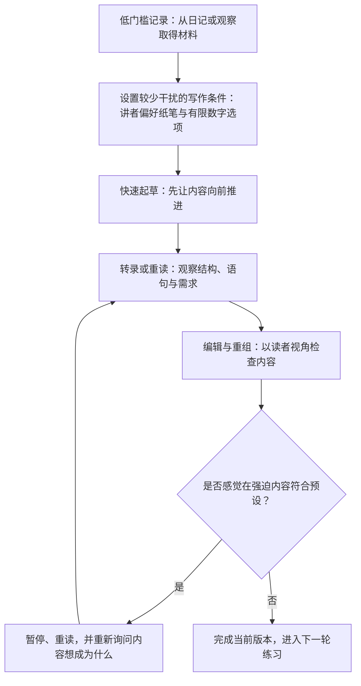

# 总结

## 核心摘要

这不是一套“每天写满四小时就能高产”的方法论，而是一位短篇故事创作者对自己当天写作状态和长期练习的回顾。讲者自述当天在较少中断的情况下写了约 5–6 小时、完成 12 页手写内容；这些数字属于他的单日经验，不构成他人可复制的时长、产量或专注力基准。

他的流程可以概括为三件事：

1. **先用低门槛记录建立材料感。** 写作起点是晨间或晚间日记：记录当天所见、感受、问题和次日目标。讲者把这称为从“脑中的想法”走到“纸上已有内容”的过渡，而不是一开始就要求自己写出可发布的故事。
2. **把发散与收束拆开。** 起草时尽量快速、持续地向前，不一边写一边追求完美；随后把手写内容转录到电脑，在第二次阅读时观察需要修改之处，再进入编辑与重组。
3. **把分心和卡顿视为流程信号。** 他用手写、可选择项更少的环境和温和的自我提醒，把注意力拉回页面；编辑时一旦感觉自己正在强迫故事或文章变成某个预设样子，就暂停、重读并重新问“内容想成为什么”。这是一种个人的复盘信号，不是已验证的恢复技术。

## 这份个人流程真正可借鉴的部分

- **把“开始”做得比“成品”小。** 日记可以只是观察，不必立即承担发表、质量或受众反应的压力。
- **避免在同一轮同时做两类判断。** 起草阶段主要负责产生候选材料；编辑阶段才负责结构、可读性、删改与读者视角。对需要事实准确、合规或可复现的技术写作，仍应另行设置资料核验和审校门槛。
- **为自己识别分心与强迫的提示。** 对讲者而言，手机/内容消费、对成品表现的想象，以及“必须写成某种样子”的压力，都会把注意力从页面带走。别人可以借用这一观察框架，但不能直接复制他的工具、时长或节奏。

讲者转述手写的一种价值，是它减少了电子邮件、视频和其他数字选项的可得性；这张帧只是该个人偏好的语义锚点，并未展示纸笔、环境或实际无干扰状态。

## 事实核验与写作边界

### 有限支持的三类说法

- **[部分确认] 手写与键盘/移动设备在特定任务中的认知指标可能不同。** 一项 36 名大学生的 EEG 研究和一项受控记忆任务研究都观察到媒介差异；但它们没有证明手写会提高文学创作质量、沉浸感或无干扰写作时长，也不支持“手写普遍优于键盘”。[EEG 研究](https://pubmed.ncbi.nlm.nih.gov/38343894/)、[记忆任务研究](https://pubmed.ncbi.nlm.nih.gov/33815075/)
- **[部分确认] 降低数字刺激的可访问性可能影响注意力，但结果不单向。** 自己的手机仅在场可能降低可用认知能力的实验结果，与另一项未发现显著注意力主效应的年轻成人研究并存。因此，“少一个数字选项”可以是讲者的环境设计选择，不能写成保证专注的规则。[手机在场实验](https://doi.org/10.1086/691462)、[后续研究](https://pubmed.ncbi.nlm.nih.gov/40422303/)
- **[部分确认] 在稳定情境中重复行为，可能逐渐提高自动性。** 这能有限支持“把日记放进固定时段/情境”的思路；它不等于会自动喜欢写作、获得灵感、在固定天数养成习惯或延长专注时长。[Lally 等人的现实情境研究](https://doi.org/10.1002/ejsp.674)

### 仍应保留为个人观点的四类说法

- **[未验证]** “多数人停止写日记是因为期待过高”以及“晨晚日记能训练注意力”不是当前证据能直接推出的结论。表达性写作的系统综述也不足以把日记外推成健康成人的注意力训练或写作产出承诺。[系统综述](https://pubmed.ncbi.nlm.nih.gov/40397857/)
- **[未验证]** “任何写作者都应快速完成初稿、先不编辑”是讲者尤其面向虚构/个人表达的流程选择，不是论文、技术文档或所有创作任务的通用最佳实践。
- **[未验证]** “快速产出大量故事比拉长编辑周期学得更多、能抬高质量下限”是讲者当前阶段的工作假设，未给出可比较的质量指标或对照。
- **[未验证]** “创意运动员”以及“持续创作比无尽消费更好”的框架是价值判断；关于技术使人普遍远离共享体验的宽泛因果叙述也没有在视频中被定义或验证。

## 一句带走

把写作当作一轮可观察的练习：先取得材料，再在不同阶段做不同的判断；借用他人的流程时，保留自己的任务边界、证据标准和恢复节奏。

# 辅助理解

## 辅助理解：把“写得久”还原成一条可调整的个人流程

下面的图是根据讲者个人叙述整理的理解框架，不是画面实录，也不是科学验证过的生产力模型。它刻意把“开始、起草、编辑、暂停”拆开：这样读者讨论的不是“如何强迫自己写四小时”，而是每一步各自需要什么判断。

这张图的核心不是延长单次写作时间，而是给每一种困难指定位置：没有材料时回到记录；起草时不要同时进行过度审判；编辑时才承担结构与读者体验；感觉卡住时先复看，而不是把更多时长当作唯一答案。

## 三种模式，三种不同的任务

| 模式 | 讲者在做什么 | 可以观察什么 | 不能据此承诺什么 |
| --- | --- | --- | --- |
| 记录 | 写下所见、感受、问题、目标 | 是否更容易获得下一轮可写的材料 | 日记必然训练注意力、人人都会爱上写作 |
| 起草 | 手写或快速写出候选内容，暂不追求完成度 | 是否能区分“生成材料”和“评判材料” | 不编辑一定更有灵感、初稿越快质量越高 |
| 编辑 | 转录、重读、删改、调整结构 | 哪些地方偏离读者路径或原本意图 | 短编辑周期普遍更优，或高产必然抬高质量 |

讲者把起草称为较快、较少回头的阶段，把编辑称为较慢、较费注意力的阶段。这个区分尤其适合讨论虚构或个人表达；技术、学术、法律、医疗等写作不能把“先凭感觉”替代事实核验、来源审查或风险控制。

## 用“边界”理解手写与少干扰

讲者引用的手写观点，重点不是证明纸笔神奇，而是减少当下可做的其他数字活动：没有邮件、视频或浏览器入口时，他会把无聊感留在写作现场。研究只能给出有限的旁证：手写与键盘/移动设备在特定认知任务上可能有不同指标，手机在场对注意力的研究结果也并不一致；这些都不足以推导出“手写保证无干扰”或“移开手机就能写四小时”。[手写 EEG 研究](https://pubmed.ncbi.nlm.nih.gov/38343894/)、[手机在场研究](https://doi.org/10.1086/691462)、[结果不一致的后续研究](https://pubmed.ncbi.nlm.nih.gov/40422303/)

因此，更稳妥的问题是：**此刻哪些选项会把我从当前任务带走？** 对某些人，答案可能是手机；对另一些人，可能是通知、过高的成品预期、模糊的任务边界，或把起草和编辑硬塞进同一分钟。可尝试改变一个变量并观察，而不是把讲者的纸笔偏好复制成规定。

## 卡住时的复盘：先辨认“强迫感”

讲者给出的一个编辑信号是：当你觉得自己正强迫故事、文章或其他内容变成它本不是的样子时，退一步再读。这个判断不自动告诉你该删什么、也不保证作品会更好；它的价值是把“卡住”转化为可追问的问题：

1. 我在维护的是原始意图，还是一个未经检验的预设结局？
2. 当前文本缺的是材料、结构、证据，还是只是需要休息后再看？
3. 这份文本的读者、风险和验收标准是什么？
4. 如果是技术或事实性写作，哪些说法需要来源、测试或同行复核？

这张帧只锚定讲者对“强迫内容”的个人判断，并不展示草稿、删改过程或恢复效果。

## 一个不承诺结果的练习模板

如果想把视频转成自己的小实验，可以用低风险的创意任务测试一次，而不是设定“必须专注四小时”的 KPI：

1. 选一个 10–20 分钟可完成的记录题目，例如描述今天听到的一个声音或一个场景。
2. 只设置一个干扰边界，例如把手机放到看不见的位置，或关闭一种通知；记录条件，不把它当作万能解法。
3. 先写完，再标记一次最想回头编辑的地方；把编辑放到第二轮。
4. 记录主观分心次数、完成感和需要改动的类型，而不是只记字数或时长。
5. 连续几次后比较：什么条件对你有帮助，什么条件没有帮助。

稳定情境下的重复可能有助于行为自动性，但没有可靠的固定天数、时长或产量承诺；是否保留某个做法，应由你的任务类型、身体状态、风险和实际产出质量共同决定。[习惯形成研究](https://doi.org/10.1002/ejsp.674)

## 事实边界速查

- **部分确认：** 特定任务中，书写媒介可能对应不同认知指标；稳定情境中的重复可能提升自动性；降低数字刺激可能改变一些人的注意力条件。三者都受任务、个体与环境限制。
- **未验证：** 日记已被证明训练注意力；快速初稿适合每个人；高产和短编辑周期必然提升质量；“创意运动员”必然比消费带来更好的生活。
- **应保留为讲者自述：** 当天 5–6 小时、12 页手写、长期晨晚日记、手写工具偏好、故事数量与编辑速度。它们可启发观察，不应变成他人配额。

## 一句话复盘

与其追求一条神奇的无干扰公式，不如把创作拆成可观察的循环：材料从哪里来、干扰从哪里进、何时生成、何时评判、何时退一步重读。

# Data

## 增强转写稿

[00:00] Hello my friend
[00:01] Today we're going to talk about the writing process
[00:03] Today I spent about so many hours
[00:06] 5 or 6 hours writing without any distractions
[00:09] Without wanting to go on my phone
[00:11] Without wanting to do something else
[00:13] Just totally immersed in the page
[00:16] I got 12 pages handwritten
[00:18] And that was a pretty good day for me
[00:20] I write and perform short stories on the internet
[00:23] I have been writing consistently for a number of years now
[00:26] I think 3 years
[00:27] And that all started with a very basic journaling practice
[00:31] What I want to share with you today is how to start writing
[00:34] Why you should
[00:35] And yeah, let's start with that
[00:39] My writing practice started as just journaling
[00:42] I bought a physical journal from the store
[00:44] I bought a pen and I started just recording my thoughts
[00:47] My goal was to write stories
[00:50] But that was really hard
[00:51] Like it was just difficult to take an idea in my head
[00:54] And make it exist on the page
[00:56] I really overestimated
[00:58] Or I'm sorry, underestimated
[00:59] The gap between idea and execution
[01:02] Very different things
[01:04] And so the only thing I was capable of writing
[01:07] In the beginning was just my thoughts
[01:09] What was going on in my world
[01:10] My feelings
[01:11] What happened to me that day
[01:12] What I was thinking about
[01:13] What my goals were for the next day
[01:15] I just started writing it down
[01:16] It wasn't anything fancy
[01:17] It wasn't anything that I thought I would publish anywhere
[01:20] I just got used to the feeling of putting pen to paper
[01:23] The actual sensation of writing
[01:25] And over time
[01:26] Just by continuing to do that
[01:28] Having a little ritual of journaling
[01:29] In the morning and sometimes at night
[01:32] I fell in love with it
[01:32] Like I started to crave it
[01:35] I would be on the train
[01:36] And I wanted to take out my journal
[01:37] And write what was going on
[01:39] Nothing crazy
[01:39] Just like what sounds was I hearing on the train
[01:43] What did I see around me
[01:44] You know, what day was it
[01:45] What period of my life was I in
[01:49] And I think it's really important to touch on this
[01:51] Because most people stop writing
[01:53] Or stop journaling
[01:54] Because they have a really high expectation
[01:56] Of creating something
[01:58] Right, they want it to be a thing
[02:00] That they can share
[02:00] Or they want it to be good
[02:02] And it's like, no, that's not what it is
[02:03] It's a digestive process of your brain
[02:06] Does that make sense?
[02:06] It's the same
[02:07] Like, you know, you take in information
[02:09] And then you expel it
[02:11] And that's really what writing is
[02:12] In the beginning, what journaling is
[02:14] You're just getting stuff out of your body
[02:16] What needs to come out
[02:17] You are slowly training your ability
[02:19] To observe the world around you
[02:22] And that's a really important skill
[02:24] Especially in today's day and age
[02:25] Where people are really distracted
[02:27] Right, the norm nowadays
[02:29] Is to be caught up in your phone
[02:30] Or to be caught up in some, you know
[02:34] Something that doesn't matter
[02:35] Most people are not going about their lives
[02:37] Actually paying attention
[02:39] Trying to pay attention to what's happening
[02:40] Training your ability to pay attention
[02:42] Is a very important skill
[02:43] And journaling
[02:45] In the morning and at night
[02:46] Is a great way to do that
[02:47] It's hard to give advice on it
[02:48] Because you really don't want to be
[02:50] Thinking about tactics
[02:53] You really just want to get
[02:55] The feeling in your body
[02:56] So I wake up in the morning
[02:57] I go to the gym, I come back
[02:59] And I sit down and I fill pages
[03:00] For the first half of the day
[03:02] It's not perfect right away
[03:04] But then I kind of settle into it
[03:06] And I just stay patient with myself
[03:08] I notice my attention drifting
[03:10] Thinking about something else
[03:11] Thinking about what the finished product
[03:12] Is going to be like
[03:13] Oh, how many views is this going to get
[03:15] Oh, are people going to like it
[03:17] What are my grandparents going to say
[03:18] When I become successful
[03:21] I just catch that train of thought
[03:22] I bring myself back to the page
[03:24] Not with punishment
[03:25] Not like, Oh, you're so bad at this
[03:27] You're so, you know, brain-rotted
[03:30] No, just bringing myself right back here
[03:32] I'm going to keep writing
[03:33] It's very calm, very loving self-talk
[03:36] Took some time to practice that
[03:38] But I, you know, I
[03:40] I wrote like two stories today
[03:42] I drafted two stories
[03:44] That feels great
[03:45] It's very important for me to share this
[03:47] Because I've talked about
[03:48] I've talked very generally
[03:50] About this practice for the last couple of years
[03:52] Replacing consumption with creativity
[03:54] Becoming a creator as an antidote
[03:56] To the consumption
[03:58] Cheap dopamine lifestyle
[04:00] I am in it right now
[04:01] Like, proper
[04:02] I am kind of
[04:03] I am exercising
[04:04] I am doing the thing
[04:06] That I've spent so much time talking about
[04:08] I am practicing what I've preached
[04:10] And that feels great
[04:11] And I just want to share that
[04:11] So I know this might be
[04:13] A little bit all over the place
[04:15] Bear with me, okay
[04:17] Let's talk about the writing process itself
[04:19] I've gotten some questions on this
[04:20] Like what, you know
[04:22] I write by hand
[04:23] And I have some reasons I do that
[04:25] I want to talk to you about how I do it
[04:26] So I write by hand
[04:28] First and foremost
[04:28] When I'm drafting a story
[04:30] Specifically fiction
[04:32] I want to write by hand
[04:33] This is a practice I first learned from
[04:36] Neal Gaiman
[04:37] Is the author of American Gods
[04:38] The Graveyard Book, Coraline
[04:40] As well as Chuck Palahniuk
[04:41] Author of Fight Club, Choke
[04:43] Survivor, number of other great books
[04:45] Those are two big inspirations for me
[04:47] And I discovered their advice
[04:50] A few years ago when I first started journaling
[04:53] They talk about writing by hand
[04:55] For a number of reasons
[04:56] Neal Gaiman writes by hand
[04:57] Because there's no distractions
[04:59] He can go with a notebook into a cafe
[05:01] Or a public place
[05:02] And just sit and write
[05:04] And on days where he doesn't feel like writing
[05:06] He doesn't have email to check
[05:07] He doesn't have YouTube to watch
[05:09] He doesn't have music to listen to
[05:10] He is able to get himself bored
[05:13] Bored to the point
[05:14] That writing is more interesting than sitting
[05:16] And doing nothing
[05:17] The rule he gives himself is that
[05:19] You don't have to write
[05:20] You don't have to do anything
[05:22] But you can't do anything except for write
[05:25] And so that's how that goes
[05:27] And then Chuck Palahniuk
[05:28] I haven't heard him talk extensively about it
[05:30] But he was on the Joe Rogan podcast famously
[05:34] And he was like
[05:36] Talking about the writing process with Joe
[05:38] And Joe was talking about writing by keyboard
[05:41] And he was like, oh, that's not writing
[05:43] That's typing
[05:44] Typing is a thing you do in airports
[05:45] Or when you can't do anything else
[05:47] Writing is by hand
[05:48] And there was something about that
[05:49] And it resonated with me
[05:50] Because this is a little bit
[05:52] Ooey-gooey woo-woo
[05:53] But there's something magical
[05:56] Kind of sacred about writing by hand
[05:58] It's just a very human thing
[06:01] I think there's magic that happens when you do that
[06:03] There's something about the tactile sensation
[06:06] Right, a feeling, an actual pen
[06:07] The instrument in your hands as you're writing
[06:10] Feeling the words make themselves
[06:14] I like it a lot
[06:15] And right now I'm using a fountain pen
[06:19] That I really like
[06:20] I fill it up with a little ink bottle
[06:23] And I write in these big Moleskine notebooks
[06:26] None of this is sponsored
[06:27] Although I would love to partner with that
[06:30] Because I love their products
[06:31] But yeah, there's just
[06:36] It just feels like magic when you're doing it
[06:38] That's a good reason
[06:41] When I was a child
[06:42] Hang on, let me grab my pencil
[06:45] So when I was a kid
[06:46] I would spend hours in my room
[06:49] Thinking up stories and twiddling
[06:52] With like a little pencil
[06:54] At first it was like a wand
[06:55] Like a magician's wand
[06:57] But then it became a pencil like this
[06:58] And I would like make little figure eight motions
[07:01] And become hypnotized by the images
[07:04] By the vision
[07:04] The sight of the pencil waving
[07:08] Anyway
[07:09] I think it's a form of stimming
[07:10] I don't I don't know
[07:11] But I would do that
[07:14] And I would imagine stories
[07:16] And I would go deep into my imagination
[07:17] And I would spend hours doing this as a child
[07:19] This is what I did instead of playing video games
[07:22] Like I just genuinely wanted to be doing that
[07:24] By writing by hand
[07:26] By using this pen
[07:27] I tap into that a little bit
[07:28] So I get sucked into the story
[07:30] Sucked into what I'm writing
[07:31] Through the combination of the sensation of writing
[07:34] And then the actual
[07:36] The visual stimuli of the words appearing on the page
[07:39] This is so in the weeds
[07:40] I don't know how relevant this is for you
[07:41] But like that's how I start
[07:43] I crave the feeling of pen on paper
[07:46] Because I've spent so much time doing it
[07:47] There is an emotional release that happens
[07:49] There's like
[07:50] There's satisfaction that comes from bringing your ideas
[07:53] Out of your brain and onto the page
[07:55] And then you combine that with the tactile sensation
[07:57] And your brain creates an association
[07:59] So you associate the writing sensation
[08:02] With the thinking and the
[08:03] And literally bringing your ideas to life
[08:05] Which is magic, right
[08:07] And then you become addicted to doing magic
[08:10] Okay, so that's the drafting process
[08:13] When I'm drafting it's a fast, furious thing
[08:15] I want to get the idea out of me as quickly as possible
[08:18] I try to do it without editing, without
[08:21] You know, I'm not thinking
[08:22] I'm not working backwards at all
[08:24] I just keep moving
[08:24] I take the idea and I try to take it to its natural end
[08:27] As quickly as possible
[08:29] That's an idea I got from Joyce Carol Oates
[08:31] Who's one of the most accomplished story writers of all time
[08:33] And really I'm so inspired by
[08:36] How prolific her career has been
[08:37] She just writes with a blue-collar work ethic
[08:40] Like constantly writes
[08:42] 8 to 10 hours a day, every day
[08:45] Doesn't talk about it, just does it
[08:47] And she talks about finishing your first draft
[08:50] Very quickly
[08:50] I recommend this for anyone who's writing
[08:54] No matter what it is
[08:55] Whether it is a short story
[08:56] Or an essay you're doing for school
[08:58] Get the first draft done quickly
[09:00] Don't try to get it perfect
[09:01] Don't try to perfect the first paragraph
[09:04] Right away, just get the rough draft
[09:06] And then go back and edit it
[09:08] It just really helps
[09:09] Because once you start editing
[09:10] You start second guessing yourself
[09:12] You get too much in your head
[09:14] And it's
[09:16] You can't really
[09:18] You lose the magic a little bit
[09:20] Because you're trying to
[09:21] You're in editing mode
[09:22] You're in architect mode
[09:23] As opposed to magician mode
[09:25] I'm hoping this makes sense to you
[09:27] Ray Bradbury, author of
[09:29] What did he write?
[09:31] Bunch of things
[09:32] He wrote
[09:34] Fahrenheit 451, Good Lord
[09:36] And a number of other things
[09:37] That I'm blanking on right now
[09:38] Number of short stories
[09:40] Part of his advice is don't think
[09:42] Right when you're drafting
[09:43] When you're writing the first draft
[09:44] Don't think
[09:45] Sit down and feel
[09:47] That's what writing is
[09:48] Is it's honest feeling
[09:50] Now this obviously is different
[09:51] If you're a technical writer
[09:52] If you're writing a technical document
[09:54] With a series of steps
[09:55] You're not going to feel your way through that
[09:57] But for a personal essay
[09:59] Or something that requires your perspective
[10:01] Your humanity
[10:02] Which is super important to write
[10:04] You need that in the age of AI
[10:06] You got to just feel it out first
[10:08] And then you can make it make sense later
[10:09] That's the drafting process
[10:11] I feel
[10:13] I feel
[10:14] And then I take that draft
[10:16] And I transcribe it
[10:17] Into my computer
[10:19] Without thinking
[10:20] So I'm still not editing it
[10:21] I literally just write word for word
[10:22] Everything that I wrote
[10:24] This is between seven and ten pages
[10:25] Of drafted material
[10:26] So I get some good typing practice
[10:28] I'm not thinking at all
[10:29] I'm thinking about other stuff
[10:30] As I'm doing this
[10:31] Or sometimes
[10:32] Actually no, that's not true
[10:33] As I'm typing it out
[10:35] Into my computer
[10:36] That's the first time
[10:37] That I read back
[10:38] Through what I just wrote
[10:40] So I'm slowing down now
[10:41] I'm reading the sentences
[10:43] And noticing
[10:45] What's going to have to change
[10:46] And what my feeling is
[10:48] On the second pass through it
[10:49] And I don't change anything yet
[10:51] Except for a period here
[10:52] Maybe a word change here and there
[10:53] But the bulk of it
[10:55] I'm just typing it out
[10:56] Getting the material loaded in
[10:57] So I've mined the raw material
[10:59] The raw or
[11:01] And now I'm going to
[11:02] I'm going to carry it over
[11:03] Into the facility
[11:05] This is a metaphor
[11:06] And then I'm going to refine it
[11:08] That's the editing process
[11:10] The refining process
[11:12] And that's where I am editing
[11:13] And this part is currently
[11:16] I want to say least favorite
[11:17] It's just it's not
[11:19] It's harder
[11:20] It's probably the hardest part
[11:21] Is taking this raw material
[11:23] That I've felt and intuited
[11:27] Out of my subconscious
[11:29] And working it
[11:31] Reworking it
[11:32] Performing surgery on it
[11:33] Moving this piece over here
[11:34] Expanding this part
[11:36] Shortening this
[11:37] And you just read it
[11:38] Over and over
[11:39] And over again
[11:40] From the perspective of a reader
[11:42] Trying to hold the reader's hand
[11:44] As you go through the draft
[11:48] You know, making it fun
[11:50] Making it not boring
[11:52] Making it exciting
[11:54] Taking people on a journey
[11:56] There's so much of that
[11:57] Like it's a very
[11:59] It's a pretty tedious process
[12:01] And it requires a great deal of focus
[12:02] If the drafting process is like
[12:04] Fast and kind of in the moment
[12:05] And breathless almost
[12:07] The drafting is like
[12:08] It's like
[12:10] It's more like
[12:12] I don't even know what to compare it to
[12:14] I don't do many other things
[12:18] It's just tedious
[12:20] It's like coding probably
[12:21] You have to just get it right
[12:23] And there's still some feeling in that
[12:24] There's still rewriting
[12:25] And sometimes you're expanding sections out
[12:28] And you really see what the story wants to be
[12:31] This is an idea from George Saunders
[12:32] He's been a phenomenal inspiration for me
[12:34] One of the great short story writers
[12:35] Of our time
[12:36] Is that you can't really control
[12:38] What a story is
[12:39] You know, you might have an idea
[12:40] For what it needs to be
[12:42] Or what I'm sorry
[12:43] What you want it to be in the beginning
[12:45] But you have to accept that it
[12:47] Might be something completely different
[12:49] Right, the story that you're bringing
[12:50] Out of your subconscious mind
[12:52] Might have a life of its own
[12:53] It might be something completely different
[12:55] And it's your job as the writer
[12:56] To get out of the way
[12:57] And let it become what it needs to be
[12:59] You have to kind of hold its hand
[13:01] As it grows up
[13:03] And becomes this living breathing thing
[13:04] That might be very different
[13:05] So you might have an idea
[13:06] Of how you want it to end
[13:07] Or what a certain way
[13:09] You want it to go
[13:10] Or the specific moment you're building to
[13:13] And it might not
[13:14] It might feel forced to do that
[13:16] And when you notice that
[13:17] When you notice
[13:18] That you're trying to force it into a box
[13:20] That doesn't work for it
[13:21] You have to take a step back
[13:22] And ask yourself what the story wants to be
[13:25] You'll notice when you're trying to
[13:27] Force a story or an essay
[13:28] Or something to be something it's not
[13:31] It's no longer fun
[13:32] You feel all of this pressure
[13:34] And you don't feel any magic
[13:36] And I think this is a really important point
[13:37] When you feel yourself distanced
[13:39] From the magic
[13:40] The magic that you felt when you were drafting
[13:42] It's this very childlike excitement
[13:44] Of getting this idea out of you
[13:47] When you start losing that
[13:48] You need to pause
[13:50] Because if you're losing it
[13:53] The audience is going to lose it
[13:54] The reader is going to lose it
[13:55] For sure
[13:57] So pause
[13:58] Look at the story again
[14:00] What does it want to be
[14:02] So I do that in the editing process as well
[14:04] The editing process lasts from
[14:06] Anywhere from a day to a few days
[14:08] I typically work very fast
[14:10] And that's because I know that
[14:12] I just want to get stories out quickly
[14:14] I don't think that a long editing timeline
[14:17] Will make them that much better
[14:19] At the skill level I'm at right now
[14:20] I think I will learn a lot more
[14:22] By producing a lot of stories very quickly
[14:24] And improving with each one
[14:26] So as opposed to raising my ceiling
[14:28] And becoming as making a story
[14:30] As good as it possibly can be
[14:32] I'd rather raise my floor
[14:34] By producing as many stories as I can
[14:36] Within reason
[14:37] While still making them pretty good
[14:40] And the raw material
[14:42] Getting better over time
[14:43] That's the working theory
[14:45] So I edit pretty quickly
[14:46] And then also there's a comfort in that
[14:48] Which is that even though
[14:49] The deadlines can be pretty stressful
[14:51] Wanting to put a story out over the course
[14:53] Of three days or a week
[14:58] Like it's stressful because the deadline
[15:00] Is looming
[15:01] But it's nice because you know
[15:03] That once the deadline's over
[15:04] It's done
[15:05] You can move on
[15:06] So sometimes you're chasing
[15:07] The excitement of a story
[15:08] Being something really special
[15:09] And sometimes you're just chasing
[15:10] The relief of it being over
[15:12] And that's fine
[15:13] Because your feelings are a very
[15:16] They're a shifting thing
[15:18] In the moment sometimes you're like
[15:19] I don't like this
[15:20] I think this is really bad
[15:21] But if you just stick with it
[15:22] And just kind of get the story
[15:24] Over the hump
[15:25] Get it done
[15:26] Get it finished
[15:27] Get it out to the world
[15:28] So that you can move on to the next one
[15:29] You find that it actually turns out really well
[15:30] People really like it
[15:31] I've had that experience a number of times
[15:33] Over the last twenty-something stories
[15:35] I've written and performed and published
[15:37] Sometimes the work you think is horrible
[15:41] Performs really well
[15:42] Which is interesting
[15:43] Or people resonate with it
[15:44] So you never really know
[15:45] That's why where I'm at
[15:47] In the process now
[15:48] I'm just trying to finish
[15:49] As much as I can and get it out
[15:50] And that's my process right now
[15:52] I thought I would share that
[15:54] In case it's helpful
[15:55] If you have any other questions
[15:56] About my current process
[15:58] Specifically let me know
[16:00] I think the last point
[16:02] For today's little video journal
[16:04] Is just talking about the concept
[16:06] Of the creative athlete
[16:07] Which I talk about all the time now
[16:09] No I don't
[16:10] I've talked about it a few times
[16:12] And we're going to talk about it today
[16:14] Becoming a creative athlete
[16:16] This is what we're aiming at
[16:18] For those of us who are tired
[16:20] Of consuming mindlessly
[16:22] Who are tired of being consumers
[16:23] In the age of cheap dopamine
[16:24] And endless content
[16:26] That's only going to get worse
[16:27] We need an alternative
[16:30] We need something to give our attention to
[16:32] And for a long time
[16:33] I didn't know exactly what that was
[16:34] Until like I've laid out in this video
[16:36] I found a process
[16:37] I discovered painstakingly
[16:39] Built over time
[16:40] A process that works for me
[16:42] Being a creative athlete
[16:44] Is the option
[16:45] You find a creative practice
[16:46] That fires you up
[16:47] That you enjoy
[16:48] That channels your soul
[16:50] And then you practice it
[16:51] The way an athlete practices their sport
[16:53] You show up and you train
[16:55] You understand that there is
[16:56] A great deal of challenge
[16:58] And rigor
[16:59] That goes into this
[17:00] It's not just playtime
[17:02] All the time
[17:03] It's like you have to show up
[17:05] And work out
[17:06] There is a very direct parallel
[17:08] Between creative work
[17:10] And physical training
[17:14] And getting in good shape
[17:16] Both practices
[17:17] Are very important to my life
[17:18] And I think as a creative athlete
[17:19] You should have both
[17:20] So training
[17:22] For me resistance training
[17:23] Calisthenics bodyweight training
[17:24] I love that
[17:25] That's a big part of my life
[17:26] That's how I feel
[17:27] Like a healthy and strong
[17:29] And it plays right into
[17:30] The creative stuff as well
[17:32] When I sit down to write
[17:33] That's like my creative work out
[17:34] For the day
[17:36] And I really give myself to that
[17:38] And not every work out is perfect
[17:39] Some days are stronger than others
[17:41] Some days I break personal records
[17:43] I would say today was like a PR day
[17:45] In terms of writing
[17:46] This is all over the place
[17:48] Good lord
[17:49] Yeah, so everything I've talked about today
[17:53] Is part of being a creative athlete
[17:55] If you're here for the journey
[17:56] I just am inviting you to join me
[17:58] This is what we're aiming at
[18:00] This is what we're going to give
[18:01] The next 10, 20, 30, 40, 50, 60 years of our life to
[18:05] Is finding a replacement to consumption
[18:09] To endless consumption
[18:11] And entertainment
[18:12] And external satisfaction
[18:15] Short term gratification
[18:16] An alternative that is better than that
[18:18] Which in my view is creative work
[18:22] And then sharing that creative work
[18:24] And then eventually getting to the point
[18:25] That we're doing this in person
[18:26] Around a fire
[18:27] Or in a room
[18:29] In a physical space
[18:30] Where we can perform and share stories
[18:33] That's what humanity is all about
[18:35] I think that's deep down what we want
[18:37] We want to share this human experience
[18:40] With each other
[18:41] And we've become so distanced from that
[18:43] In the last decade or so with this technology
[18:45] That we haven't been psychologically prepared for
[18:48] So a lot of it isn't our fault
[18:50] But it is our responsibility
[18:51] You and me
[18:52] To figure it out now in the modern age
[18:54] So that our kids
[18:56] Have something better to live for
[18:58] So that we have something better to live for
[19:00] I can tell you confidently from the front lines
[19:02] I am getting closer to it every day
[19:04] I love what I'm doing
[19:05] I'm grateful for it
[19:06] I'm grateful to have you here for the journey
[19:08] And I am cordially, warmly, ecstatically
[19:11] Inviting you to join me
[19:13] I'll see you on the front lines
[19:15] Have a great day

## 原始转写稿

[00:00] Hello my friend
[00:01] Today we're going to talk about the writing process
[00:03] Today I spent about so many hours
[00:06] 5 or 6 hours writing without any distractions
[00:09] Without wanting to go on my phone
[00:11] Without wanting to do something else
[00:13] Just totally immersed in the page
[00:16] I got 12 pages handwritten
[00:18] And that was a pretty good day for me
[00:20] I write and perform short stories on the internet
[00:23] I have been writing consistently for a number of years now
[00:26] I think 3 years
[00:27] And that all started with a very basic journaling practice
[00:31] What I want to share with you today is how to start writing
[00:34] Why you should
[00:35] And yeah, let's start with that
[00:39] My writing practice started as just journaling
[00:42] I bought a physical journal from the store
[00:44] I bought a pen and I started just recording my thoughts
[00:47] My goal was to write stories
[00:50] But that was really hard
[00:51] Like it was just difficult to take an idea in my head
[00:54] And make it exist on the page
[00:56] I really overestimated
[00:58] Or I'm sorry, underestimated
[00:59] The gap between idea and execution
[01:02] Very different things
[01:04] And so the only thing I was capable of writing
[01:07] In the beginning was just my thoughts
[01:09] What was going on in my world
[01:10] My feelings
[01:11] What happened to me that day
[01:12] What I was thinking about
[01:13] What my goals were for the next day
[01:15] I just started writing it down
[01:16] It wasn't anything fancy
[01:17] It wasn't anything that I thought I would publish anywhere
[01:20] I just got used to the feeling of putting pen to paper
[01:23] The actual sensation of writing
[01:25] And over time
[01:26] Just by continuing to do that
[01:28] Having a little ritual of journaling
[01:29] In the morning and sometimes at night
[01:32] I fell in love with it
[01:32] Like I started to crave it
[01:35] I would be on the train
[01:36] And I wanted to take out my journal
[01:37] And write what was going on
[01:39] Nothing crazy
[01:39] Just like what sounds was I hearing on the train
[01:43] What did I see around me
[01:44] You know, what day was it
[01:45] What period of my life was I in
[01:49] And I think it's really important to touch on this
[01:51] Because most people stop writing
[01:53] Or stop journaling
[01:54] Because they have a really high expectation
[01:56] Of creating something
[01:58] Right, they want it to be a thing
[02:00] That they can share
[02:00] Or they want it to be good
[02:02] And it's like, no, that's not what it is
[02:03] It's a digestive process of your brain
[02:06] Does that make sense?
[02:06] It's the same
[02:07] Like, you know, you take in information
[02:09] And then you expel it
[02:11] And that's really what writing is
[02:12] In the beginning, what journaling is
[02:14] You're just getting stuff out of your body
[02:16] What needs to come out
[02:17] You are slowly training your ability
[02:19] To observe the world around you
[02:22] And that's a really important skill
[02:24] Especially in today's day and age
[02:25] Where people are really distracted
[02:27] Right, the norm nowadays
[02:29] Is to be caught up in your phone
[02:30] Or to be caught up in some, you know
[02:34] Something that doesn't matter
[02:35] Most people are not going about their lives
[02:37] Actually paying attention
[02:39] Trying to pay attention to what's happening
[02:40] Training your ability to pay attention
[02:42] Is a very important skill
[02:43] And journaling
[02:45] In the morning and at night
[02:46] Is a great way to do that
[02:47] It's hard to give advice on it
[02:48] Because you really don't want to be
[02:50] Thinking about tactics
[02:53] You really just want to get
[02:55] The feeling in your body
[02:56] So I wake up in the morning
[02:57] I go to the gym, I come back
[02:59] And I sit down and I fill pages
[03:00] For the first half of the day
[03:02] It's not perfect right away
[03:04] But then I kind of settle into it
[03:06] And I just stay patient with myself
[03:08] I notice my attention drifting
[03:10] Thinking about something else
[03:11] Thinking about what the finished product
[03:12] Is going to be like
[03:13] Oh, how many views is this going to get
[03:15] Oh, are people going to like it
[03:17] What are my grandparents going to say
[03:18] When I become successful
[03:21] I just catch that train of thought
[03:22] I bring myself back to the page
[03:24] Not with punishment
[03:25] Not likeOh, you're so bad at this
[03:27] You're so, you know, brain-rotted
[03:30] No, just bringing myself right back here
[03:32] I'm going to keep writing
[03:33] It's very calm, very loving self-talk
[03:36] Took some time to practice that
[03:38] But I, you know, I
[03:40] I wrote like two stories today
[03:42] I drafted two stories
[03:44] That feels great
[03:45] It's very important for me to share this
[03:47] Because I've talked about
[03:48] I've talked very generally
[03:50] About this practice for the last couple of years
[03:52] Replacing consumption with creativity
[03:54] Becoming a creator as an antidote
[03:56] To the consumption
[03:58] Cheap dopamine lifestyle
[04:00] I am in it right now
[04:01] Like, proper
[04:02] I am kind of
[04:03] I am exercising
[04:04] I am doing the thing
[04:06] That I've spent so much time talking about
[04:08] I am practicing what I've preached
[04:10] And that feels great
[04:11] And I just want to share that
[04:11] So I know this might be
[04:13] A little bit all over the place
[04:15] Bear with me, okay
[04:17] Let's talk about the writing process itself
[04:19] I've gotten some questions on this
[04:20] Like what, you know
[04:22] I write by hand
[04:23] And I have some reasons I do that
[04:25] I want to talk to you about how I do it
[04:26] So I write by hand
[04:28] First and foremost
[04:28] When I'm drafting a story
[04:30] Specifically fiction
[04:32] I want to write by hand
[04:33] This is a practice I first learned from
[04:36] Neal Gaiman
[04:37] Is the author of American Gods
[04:38] The graveyard book, Coraline
[04:40] As well as Chuck Pollanek
[04:41] Author of Fight Club, Choke
[04:43] Survivor, number of other great books
[04:45] Those are two big inspirations for me
[04:47] And I discovered their advice
[04:50] A few years ago when I first started journaling
[04:53] They talk about writing by hand
[04:55] For a number of reasons
[04:56] Neal Gaiman writes by hand
[04:57] Because there's no distractions
[04:59] He can go with a notebook into a cafe
[05:01] Or a public place
[05:02] And just sit and write
[05:04] And on days where he doesn't feel like writing
[05:06] He doesn't have email to check
[05:07] He doesn't have YouTube to watch
[05:09] He doesn't have music to listen to
[05:10] He is able to get himself bored
[05:13] Bored to the point
[05:14] That writing is more interesting than sitting
[05:16] And doing nothing
[05:17] The rule he gives himself is that
[05:19] You don't have to write
[05:20] You don't have to do anything
[05:22] But you can't do anything except for write
[05:25] And so that's how that goes
[05:27] And then Chuck Pollanek
[05:28] I haven't heard him talk extensively about it
[05:30] But he was on the Joe Rogan podcast famously
[05:34] And he was like
[05:36] Talking about the writing process with Joe
[05:38] And Joe was talking about writing by keyboard
[05:41] And he was like, oh, that's not writing
[05:43] That's typing
[05:44] Typing is a thing you do in airports
[05:45] Or when you can't do anything else
[05:47] Writing is by hand
[05:48] And there was something about that
[05:49] And it resonated with me
[05:50] Because this is a little bit
[05:52] Ooie gooie woo woo
[05:53] But there's something magical
[05:56] Kind of sacred about writing by hand
[05:58] It's just a very human thing
[06:01] I think there's magic that happens when you do that
[06:03] There's something about the tactile sensation
[06:06] Right, a feeling, an actual pen
[06:07] The instrument in your hands as you're writing
[06:10] Feeling the words make themselves
[06:14] I like it a lot
[06:15] And right now I'm using a fountain pen
[06:19] That I really like
[06:20] I fill it up with a little ink bottle
[06:23] And I write in these big moleskin notebooks
[06:26] None of this is sponsored
[06:27] Although I would love to partner with that
[06:30] Because I love their products
[06:31] But yeah, there's just
[06:36] It just feels like magic when you're doing it
[06:38] That's a good reason
[06:41] When I was a child
[06:42] Hang on, let me grab my pencil
[06:45] So when I was a kid
[06:46] I would spend hours in my room
[06:49] Thinking up stories and twiddling
[06:52] With like a little pencil
[06:54] At first it was like a wand
[06:55] Like a magician's wand
[06:57] But then it became a pencil like this
[06:58] And I would like make little figure eight motions
[07:01] And become hypnotized by the images
[07:04] By the vision
[07:04] The sight of the pencil waving
[07:08] Anyway
[07:09] I think it's a form of stimming
[07:10] I don't I don't know
[07:11] But I would do that
[07:14] And I would imagine stories
[07:16] And I would go deep into my imagination
[07:17] And I would spend hours doing this as a child
[07:19] This is what I did instead of playing video games
[07:22] Like I just genuinely wanted to be doing that
[07:24] By writing by hand
[07:26] By using this pen
[07:27] I tap into that a little bit
[07:28] So I get sucked into the story
[07:30] Sucked into what I'm writing
[07:31] Through the combination of the sensation of writing
[07:34] And then the actual
[07:36] The visual stimuli of the words appearing on the page
[07:39] This is so in the weeds
[07:40] I don't know how relevant this is for you
[07:41] But like that's how I start
[07:43] I crave the feeling of pen on paper
[07:46] Because I've spent so much time doing it
[07:47] There is an emotional release that happens
[07:49] There's like
[07:50] There's satisfaction that comes from bringing your ideas
[07:53] Out of your brain and onto the page
[07:55] And then you combine that with the tactile sensation
[07:57] And your brain creates an association
[07:59] So you associate the writing sensation
[08:02] With the thinking and the
[08:03] And literally bringing your ideas to life
[08:05] Which is magic, right
[08:07] And then you become addicted to doing magic
[08:10] Okay, so that's the drafting process
[08:13] When I'm drafting it's a fast, furious thing
[08:15] I want to get the idea out of me as quickly as possible
[08:18] I try to do it without editing, without
[08:21] You know, I'm not thinking
[08:22] I'm not working backwards at all
[08:24] I just keep moving
[08:24] I take the idea and I try to take it to its natural end
[08:27] As quickly as possible
[08:29] That's an idea I got from Joyce Carol Oates
[08:31] Who's one of the most accomplished story writers of all time
[08:33] And really I'm so inspired by
[08:36] How prolific her career has been
[08:37] She just writes with a blue-collar work ethic
[08:40] Like constantly writes
[08:42] 8 to 10 hours a day, every day
[08:45] Doesn't talk about it, just does it
[08:47] And she talks about finishing your first draft
[08:50] Very quickly
[08:50] I recommend this for anyone who's writing
[08:54] No matter what it is
[08:55] Whether it is a short story
[08:56] Or an essay you're doing for school
[08:58] Get the first draft done quickly
[09:00] Don't try to get it perfect
[09:01] Don't try to perfect the first paragraph
[09:04] Right away, just get the rough draft
[09:06] And then go back and edit it
[09:08] It just really helps
[09:09] Because once you start editing
[09:10] You start second guessing yourself
[09:12] You get too much in your head
[09:14] And it's
[09:16] You can't really
[09:18] You lose the magic a little bit
[09:20] Because you're trying to
[09:21] You're in editing mode
[09:22] You're in architect mode
[09:23] As opposed to magician mode
[09:25] I'm hoping this makes sense to you
[09:27] Ray Bradbury, author of
[09:29] What did he write?
[09:31] Bunch of things
[09:32] He wrote
[09:34] Fahrenheit 451, Good Lord
[09:36] And a number of other things
[09:37] That I'm blanking on right now
[09:38] Number of short stories
[09:40] Part of his advice is don't think
[09:42] Right when you're drafting
[09:43] When you're writing the first draft
[09:44] Don't think
[09:45] Sit down and feel
[09:47] That's what writing is
[09:48] Is it's honest feeling
[09:50] Now this obviously is different
[09:51] If you're a technical writer
[09:52] If you're writing a technical document
[09:54] With a series of steps
[09:55] You're not going to feel your way through that
[09:57] But for a personal essay
[09:59] Or something that requires your perspective
[10:01] Your humanity
[10:02] Which is super important to write
[10:04] You need that in the age of AI
[10:06] You got to just feel it out first
[10:08] And then you can make it make sense later
[10:09] That's the drafting process
[10:11] I feel
[10:13] I feel
[10:14] And then I take that draft
[10:16] And I transcribe it
[10:17] Into my computer
[10:19] Without thinking
[10:20] So I'm still not editing it
[10:21] I literally just write word for word
[10:22] Everything that I wrote
[10:24] This is between seven and ten pages
[10:25] Of drafted material
[10:26] So I get some good typing practice
[10:28] I'm not thinking at all
[10:29] I'm thinking about other stuff
[10:30] As I'm doing this
[10:31] Or sometimes
[10:32] Actually no, that's not true
[10:33] As I'm typing it out
[10:35] Into my computer
[10:36] That's the first time
[10:37] That I read back
[10:38] Through what I just wrote
[10:40] So I'm slowing down now
[10:41] I'm reading the sentences
[10:43] And noticing
[10:45] What's going to have to change
[10:46] And what my feeling is
[10:48] On the second pass through it
[10:49] And I don't change anything yet
[10:51] Except for a period here
[10:52] Maybe a word change here and there
[10:53] But the bulk of it
[10:55] I'm just typing it out
[10:56] Getting the material loaded in
[10:57] So I've mined the raw material
[10:59] The raw or
[11:01] And now I'm going to
[11:02] I'm going to carry it over
[11:03] Into the facility
[11:05] This is a metaphor
[11:06] And then I'm going to refine it
[11:08] That's the editing process
[11:10] The refining process
[11:12] And that's where I am editing
[11:13] And this part is currently
[11:16] I want to say least favorite
[11:17] It's just it's not
[11:19] It's harder
[11:20] It's probably the hardest part
[11:21] Is taking this raw material
[11:23] That I've felt and intuited
[11:27] Out of my subconscious
[11:29] And working it
[11:31] Reworking it
[11:32] Performing surgery on it
[11:33] Moving this piece over here
[11:34] Expanding this part
[11:36] Shortening this
[11:37] And you just read it
[11:38] Over and over
[11:39] And over again
[11:40] From the perspective of a reader
[11:42] Trying to hold the reader's hand
[11:44] As you go through the draft
[11:48] You know, making it fun
[11:50] Making it not boring
[11:52] Making it exciting
[11:54] Taking people on a journey
[11:56] There's so much of that
[11:57] Like it's a very
[11:59] It's a pretty tedious process
[12:01] And it requires a great deal of focus
[12:02] If the drafting process is like
[12:04] Fast and kind of in the moment
[12:05] And breathless almost
[12:07] The drafting is like
[12:08] It's like
[12:10] It's more like
[12:12] I don't even know what to compare it to
[12:14] I don't do many other things
[12:18] It's just tedious
[12:20] It's like coding probably
[12:21] You have to just get it right
[12:23] And there's still some feeling in that
[12:24] There's still rewriting
[12:25] And sometimes you're expanding sections out
[12:28] And you really see what the story wants to be
[12:31] This is an idea from George Saunders
[12:32] He's been a phenomenal inspiration for me
[12:34] One of the great short story writers
[12:35] Of our time
[12:36] Is that you can't really control
[12:38] What a story is
[12:39] You know, you might have an idea
[12:40] For what it needs to be
[12:42] Or what I'm sorry
[12:43] What you want it to be in the beginning
[12:45] But you have to accept that it
[12:47] Might be something completely different
[12:49] Right, the story that you're bringing
[12:50] Out of your subconscious mind
[12:52] Might have a life of its own
[12:53] It might be something completely different
[12:55] And it's your job as the writer
[12:56] To get out of the way
[12:57] And let it become what it needs to be
[12:59] You have to kind of hold its hand
[13:01] As it grows up
[13:03] And becomes this living breathing thing
[13:04] That might be very different
[13:05] So you might have an idea
[13:06] Of how you want it to end
[13:07] Or what a certain way
[13:09] You want it to go
[13:10] Or the specific moment you're building to
[13:13] And it might not
[13:14] It might feel forced to do that
[13:16] And when you notice that
[13:17] When you notice
[13:18] That you're trying to force it into a box
[13:20] That doesn't work for it
[13:21] You have to take a step back
[13:22] And ask yourself what the story wants to be
[13:25] You'll notice when you're trying to
[13:27] Force a story or an essay
[13:28] Or something to be something it's not
[13:31] It's no longer fun
[13:32] You feel all of this pressure
[13:34] And you don't feel any magic
[13:36] And I think this is a really important point
[13:37] When you feel yourself distanced
[13:39] From the magic
[13:40] The magic that you felt when you were drafting
[13:42] It's this very childlike excitement
[13:44] Of getting this idea out of you
[13:47] When you start losing that
[13:48] You need to pause
[13:50] Because if you're losing it
[13:53] The audience is going to lose it
[13:54] The reader is going to lose it
[13:55] For sure
[13:57] So pause
[13:58] Look at the story again
[14:00] What does it want to be
[14:02] So I do that in the editing process as well
[14:04] The editing process lasts from
[14:06] Anywhere from a day to a few days
[14:08] I typically work very fast
[14:10] And that's because I know that
[14:12] I just want to get stories out quickly
[14:14] I don't think that a long editing timeline
[14:17] Will make them that much better
[14:19] At the skill level I'm at right now
[14:20] I think I will learn a lot more
[14:22] By producing a lot of stories very quickly
[14:24] And improving with each one
[14:26] So as opposed to raising my ceiling
[14:28] And becoming as making a story
[14:30] As good as it possibly can be
[14:32] I'd rather raise my floor
[14:34] By producing as many stories as I can
[14:36] Within reason
[14:37] While still making them pretty good
[14:40] And the raw material
[14:42] Getting better over time
[14:43] That's the working theory
[14:45] So I edit pretty quickly
[14:46] And then also there's a comfort in that
[14:48] Which is that even though
[14:49] The deadlines can be pretty stressful
[14:51] Wanting to put a story out over the course
[14:53] Of three days or a week
[14:58] Like it's stressful because the deadline
[15:00] Is looming
[15:01] But it's nice because you know
[15:03] That once the deadline's over
[15:04] It's done
[15:05] You can move on
[15:06] So sometimes you're chasing
[15:07] The excitement of a story
[15:08] Being something really special
[15:09] And sometimes you're just chasing
[15:10] The relief of it being over
[15:12] And that's fine
[15:13] Because your feelings are a very
[15:16] They're a shifting thing
[15:18] In the moment sometimes you're like
[15:19] I don't like this
[15:20] I think this is really bad
[15:21] But if you just stick with it
[15:22] And just kind of get the story
[15:24] Over the hump
[15:25] Get it done
[15:26] Get it finished
[15:27] Get it out to the world
[15:28] So that you can move on to the next one
[15:29] You find that it actually turns out really well
[15:30] People really like it
[15:31] I've had that experience a number of times
[15:33] Over the last twenty-something stories
[15:35] I've written and performed and published
[15:37] Sometimes the work you think is horrible
[15:41] Performs really well
[15:42] Which is interesting
[15:43] Or people resonate with it
[15:44] So you never really know
[15:45] That's why where I'm at
[15:47] In the process now
[15:48] I'm just trying to finish
[15:49] As much as I can and get it out
[15:50] And that's my process right now
[15:52] I thought I would share that
[15:54] In case it's helpful
[15:55] If you have any other questions
[15:56] About my current process
[15:58] Specifically let me know
[16:00] I think the last point
[16:02] For today's little video journal
[16:04] Is just talking about the concept
[16:06] Of the creative athlete
[16:07] Which I talk about all the time now
[16:09] No I don't
[16:10] I've talked about it a few times
[16:12] And we're going to talk about it today
[16:14] Becoming a creative athlete
[16:16] This is what we're aiming at
[16:18] For those of us who are tired
[16:20] Of consuming mindlessly
[16:22] Who are tired of being consumers
[16:23] In the age of cheap dopamine
[16:24] And endless content
[16:26] That's only going to get worse
[16:27] We need an alternative
[16:30] We need something to give our attention to
[16:32] And for a long time
[16:33] I didn't know exactly what that was
[16:34] Until like I've laid out in this video
[16:36] I found a process
[16:37] I discovered painstakingly
[16:39] Built over time
[16:40] A process that works for me
[16:42] Being a creative athlete
[16:44] Is the option
[16:45] You find a creative practice
[16:46] That fires you up
[16:47] That you enjoy
[16:48] That channels your soul
[16:50] And then you practice it
[16:51] The way an athlete practices their sport
[16:53] You show up and you train
[16:55] You understand that there is
[16:56] A great deal of challenge
[16:58] And rigor
[16:59] That goes into this
[17:00] It's not just playtime
[17:02] All the time
[17:03] It's like you have to show up
[17:05] And work out
[17:06] There is a very direct parallel
[17:08] Between creative work
[17:10] And physical training
[17:14] And getting in good shape
[17:16] Both practices
[17:17] Are very important to my life
[17:18] And I think as a creative athlete
[17:19] You should have both
[17:20] So training
[17:22] For me resistance training
[17:23] Calisthenics bodyweight training
[17:24] I love that
[17:25] That's a big part of my life
[17:26] That's how I feel
[17:27] Like a healthy and strong
[17:29] And it plays right into
[17:30] The creative stuff as well
[17:32] When I sit down to write
[17:33] That's like my creative work out
[17:34] For the day
[17:36] And I really give myself to that
[17:38] And not every work out is perfect
[17:39] Some days are stronger than others
[17:41] Some days I break personal records
[17:43] I would say today was like a PR day
[17:45] In terms of writing
[17:46] This is all over the place
[17:48] Good lord
[17:49] Yeah, so everything I've talked about today
[17:53] Is part of being a creative athlete
[17:55] If you're here for the journey
[17:56] I just am inviting you to join me
[17:58] This is what we're aiming at
[18:00] This is what we're going to give
[18:01] The next 10, 20, 30, 40, 50, 60 years of our life to
[18:05] Is finding a replacement to consumption
[18:09] To endless consumption
[18:11] And entertainment
[18:12] And external satisfaction
[18:15] Short term gratification
[18:16] An alternative that is better than that
[18:18] Which in my view is creative work
[18:22] And then sharing that creative work
[18:24] And then eventually getting to the point
[18:25] That we're doing this in person
[18:26] Around a fire
[18:27] Or in a room
[18:29] In a physical space
[18:30] Where we can perform and share stories
[18:33] That's what humanity is all about
[18:35] I think that's deep down what we want
[18:37] We want to share this human experience
[18:40] With each other
[18:41] And we've become so distanced from that
[18:43] In the last decade or so with this technology
[18:45] That we haven't been psychologically prepared for
[18:48] So a lot of it isn't our fault
[18:50] But it is our responsibility
[18:51] You and me
[18:52] To figure it out now in the modern age
[18:54] So that our kids
[18:56] Have something better to live for
[18:58] So that we have something better to live for
[19:00] I can tell you confidently from the front lines
[19:02] I am getting closer to it every day
[19:04] I love what I'm doing
[19:05] I'm grateful for it
[19:06] I'm grateful to have you here for the journey
[19:08] And I am cordially, warmly, ecstatically
[19:11] Inviting you to join me
[19:13] I'll see you on the front lines
[19:15] Have a great day

## 原始关键帧

### 关键帧 1

### 关键帧 2

### 关键帧 3

### 关键帧 4

### 关键帧 5

### 关键帧 6

### 关键帧 7

### 关键帧 8

### 关键帧 9

### 关键帧 10

