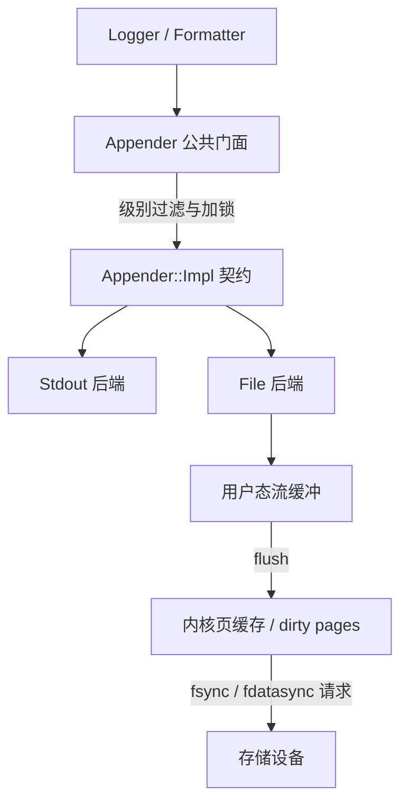

# 总结稿

[打开单页 HTML 总结](assets/bilibili-BV1Ms8B6vEvG-summary.html)

## 核心结论

视频以 C++20 手写一个日志 Appender 抽象：用公开门面与 PImpl 隐藏实现，通过工厂控制具体后端创建，以虚接口统一控制台/文件输出，并把日志级别、互斥、格式化、`flush` 与 `sync` 分层。[00:00–45:24] 后半段落地 Stdout/File Appender，并结合 Linux 脏页写回解释持久化路径。[45:24–73:30]

## 设计脉络

- **收窄公共接口**：删除不需要的复制/移动操作，公开日志级别与输出方法，具体资源放进私有实现。[05:12–22:48]
- **抽象后端契约**：`Appender::Impl` 提供 `writeUnlocked / flushUnlocked / syncUnlocked`，门面负责锁与级别判断，子类实现控制台或文件行为。[22:19–37:36]
- **两层刷新语义**：`flush` 处理用户态流缓冲，`sync` 进一步请求内核把缓存数据提交到存储设备。[45:15–49:05]
- **平台实现边界**：C++20 的标准 `ofstream` 没有可移植的 native handle，因此底层同步需要 C `FILE*`、平台 API 或非标准扩展；标准 `native_handle` 到 C++26 才加入。[59:19–67:41]
- **编译与修正**：视频保留了边写边编译、修正拼写和分号的过程，最终通过编译。[67:48–73:30]

## 实现边界与事实核查

> [!warning] Appender 只是教学骨架
> 截图和讲解不能证明生产完备性。仍需审查短写、错误码、异常/析构策略、锁粒度、递归日志、进程崩溃一致性、日志轮转、异步队列、背压以及跨平台测试。

- [45:36] 关于 `fflush` 与 `fsync/fdatasync` 的分层方向获 POSIX 部分支持，但同步调用成功也不等同于对所有文件系统、设备缓存与断电场景的绝对保证：[POSIX fflush](https://pubs.opengroup.org/onlinepubs/9699919799.2013edition/functions/fflush.html)、[POSIX fsync](https://pubs.opengroup.org/onlinepubs/009695399/functions/fsync.html)。
- [49:57] `dirty_writeback_centisecs` 等参数的单位和语义可由 [Linux 内核文档](https://docs.kernel.org/admin-guide/sysctl/vm.html)确认；视频中的 500/3000/20/10 只是当时机器配置，不是所有系统的固定默认值。
- [59:19] C++20 缺少标准 file-stream native handle 的说法获确认；C++26 接口参见 [WG21 P1759R6](https://www.open-std.org/jtc1/sc22/wg21/docs/papers/2023/p1759r6.html)。

## 实践建议

先写清楚 Appender 的契约：写入是否同步、何时丢弃、错误如何报告、`flush` 和 durable sync 分别保证什么。再决定自研还是采用成熟库；不要因为 PImpl、原子 level 或 mutex 的存在，就推断整个实现已线程安全或高性能。

## 观众讨论与补充

本次仅有 11 条热门顶层候选（平台可见 23、抓取 13）与 1 条当前可访问弹幕，不能代表总体。两条匿名问题有评审价值：其一询问场外结算应发送原始日志还是只发送战斗结果；其二询问自研 logger 与 spdlog 的差异。二者都是**未解决的观众问题**，嵌套回复正文未采集，不能当作视频结论。唯一弹幕位于 28:00–28:30，只有 1 条且 burst score 为 0，不能称为热点。

# 辅助理解

## 辅助理解

Appender 的核心不是“把字符串写出去”，而是把**稳定接口、并发控制、后端差异和持久化等级**拆开。

### 门面与实现各管什么

- 门面维持稳定 API、对象语义和受控创建。
- Impl 提供可替换后端契约。
- `Unlocked` 方法意味着调用者应已满足锁约定，并不等于方法天然线程安全。
- 原子日志等级只保护该状态，不自动覆盖文件句柄、格式化器和生命周期。

### `write`、`flush`、`sync` 的保证逐级增强

| 操作 | 主要跨越的边界 | 不能直接保证 |
|---|---|---|
| `write` | 应用逻辑 → 流/后端 | 已离开进程缓冲 |
| `flush` | 用户态缓冲 → OS | 已稳定抗断电 |
| `fsync/fdatasync` 类请求 | 内核缓存 → 相关设备 | 所有硬件/文件系统上的绝对耐久性 |

### 生产化检查表

1. 短写、磁盘满、权限错误如何上报？
2. 多线程下锁覆盖到哪里，是否可能递归或死锁？
3. 崩溃时允许丢多少日志，是否需要批量、队列与背压？
4. rotation、reopen、时钟与格式化由谁负责？
5. Linux、Windows 与不同文件系统上的持久化语义如何测试？

### 观众问题如何转成设计问题

“发送日志还是领域结果”是在问数据契约、重放与耦合；“与 spdlog 比怎样”是在问现成能力、运维生态和长期维护成本。它们适合加入评审清单，但不能替代源码、基准和故障测试。

## 外部事实核验

### 声明 1（45:36）

- 视频陈述：flush 把应用程序流缓冲区的数据交给操作系统，而 sync/fdatasync 再请求把内核缓存的数据提交到存储设备。
- 核验状态：部分确认
- 核验结果：POSIX `fflush` 要求把输出流中未写出的数据写到文件；`fsync`/`fdatasync` 请求把缓存数据传到相关存储设备。该分层方向正确，但规范也提示即使 fsync 成功，是否已经处于绝对抗断电的安全介质仍可能依赖实现与设备。
- 检索日期：2026-08-27
- 来源：
  - [POSIX fflush](https://pubs.opengroup.org/onlinepubs/9699919799.2013edition/functions/fflush.html)（primary）
  - [POSIX fsync](https://pubs.opengroup.org/onlinepubs/009695399/functions/fsync.html)（primary）

### 声明 2（49:57）

- 视频陈述：Linux 的 dirty_writeback_centisecs=500 表示每 5 秒唤醒写回线程，dirty_expire_centisecs=3000 表示 30 秒后脏数据过期；dirty_ratio/background_ratio 分别是 20%/10%。
- 核验状态：部分确认
- 核验结果：Linux 内核文档确认这些 sysctl 的单位和语义：writeback 值是唤醒间隔，expire 值是变为可写回的年龄，ratio 是相对可用内存的阈值。但视频展示的 500/3000/20/10 是该机器配置（也常见于默认配置），均可运行时调整，不能当成所有 Linux 系统的固定值。
- 检索日期：2026-08-27
- 来源：
  - [Linux kernel /proc/sys/vm documentation](https://docs.kernel.org/admin-guide/sysctl/vm.html)（primary）

### 声明 3（59:19）

- 视频陈述：C++20 的 std::ofstream 没有标准接口取得底层原生文件句柄；标准 native_handle 到 C++26 才加入。
- 核验状态：已确认
- 核验结果：WG21 的 P1759 提案及已采纳的 C++26 `native_handle` 接口支持该说法：C++20 标准库没有可移植的 file-stream native handle，虽然具体实现可能提供非标准扩展。
- 检索日期：2026-08-27
- 来源：
  - [WG21 P1759R6: Native handles and file streams](https://www.open-std.org/jtc1/sc22/wg21/docs/papers/2023/p1759r6.html)（primary）
  - [WG21 2023 Kona motions](https://www.open-std.org/jtc1/sc22/wg21/docs/papers/2023/n4959.html)（primary）

# Data

## 增强转写稿

[00:00] Hello,大家好,我叫花坚克,是一名在一线大厂从事游戏后台开发工作将近10年的程序员,参与研发了两款线上日火军超过百万的MMORPG游戏,比较擅长的是C++服务器开发和游戏后台架构。
[00:15] 我这个专栏讲的是如何使用C++20标准实现一套多reactor+多线程+多协程的高性能服务器内核。
[00:24] 我们先来盘点一下,我们日志模块已经完成了哪些内容的开发。
[00:33] 我们已经实现了LogLevel,LogLevel它是用来定义日志等级,然后我们实现了一个E9Buffer,我们实现了一个自定义的Buffer,然后它是用作日志缓冲区。
[00:47] 它就相当于在内存中给组装一行日志开辟了一个位置,然后我们还实现了Formatter,它是用来定义如何在这个日志缓冲区里面去拼装一条既定格式的日志。
[01:00] 到目前为止,我们这条日志还是在内存里面,我们还需要定义这条日志应该往哪个方向去输出,就是一条日志它在开发调试的时候,
[01:12] 它可以直接输出在我们显示器的控制台上,正式发布之后,日志一般就不会往控制台输出了,而是输出到文件中存在那个磁盘上,或者是通过网络接口,把一个日志发送到另外一个环境。
[01:28] OK,那我们今天就来定义这个Appender,我们就来定义这个Appender,Appender它是什么呢?Appender就是对日志输出终端的一个抽象定义,就是它表达了我们应该往哪里去输出日志,就是这个Appender,我们有控制台输出,我们有文件输出,我们还有那个网络输出,对吧,我们可以把日志发送到控制台的屏幕上显示,
[01:57] 记录在文件里,还可以通过网络去发送到另外一个机器上,对吧,我们有这么多Appender,然后我们要定一个这样一个Appender的抽象,我们把这个,这些日志终端统一给它管理起来,OK,那我们就直接马来马。
[02:14] Appender它是,它有一些是可以,它有一些是需要公开的地方,就比如我们在这里logger我们定一个,就定一个Appender,点H,OK,慢慢来,我们现在周末有的有的时间,慢慢来。
[02:31] 我们先是头文件保护,if not defined,然后是凭时include,凭时logger,然后是Appender,Appender,点H,然后define,这个就是头文件保护的,保护我们的那个头文件只会被多次包含的时候只有一份定义。
[02:56] And if,OK,然后,包含我们所需要的头文件,它包含include memory,因为我们需要用到智能指针,include string,然后我们,还要把我们自己的头文件包含进来,我们放一个。
[03:16] include,凭时export,就是我们需要定义那个一些接口的一些标记。
[03:24] include,我们是凭时logger,loggerlevel,点H,OK。
[03:39] 然后把我们的代码放在凭时命名空间下,我们订一个limbspace,凭时,然后,然后我们在前置,我们在前置订一个命名空间的,命名空间中的AppenderAccess类,这个就有点抽象了,limbspace,detail。
[04:01] 这里我们只是前置声明一下,我们有这么一个AppenderAccess,我们有这么一个类,我们前置声明这么一个类。
[04:12] 它这个是干嘛的呢,这个access类,它是用来代理我们的内部权限,这个access,它是严格控制谁能访问我们的Appender里面的一个私有实现,就是我们将会采用接口和实现,隔离的实现方式,就是,暴露在这里的呢,它是全部都是接口,你能看到接口,然后呢,我们通过,我们通过那个。
[04:35] 呃,我们通过这个,这种方式implement和接口隔离的方式,来隐藏,来做到接口和实现隔离,然后隐藏内部细节,我们只是暴露最小的接口给调用者使用,然后这个。
[04:51] 这个access,呃,这个AppenderAccess呢,它就相当于一个友元代理,这个我们后面介绍,我们先把它声明一下,声明有这么个东西。
[04:59] ok,那我们再定义Appender里面class,呃,我们把它定为一个排斥接口,API,然后Appender,然后呢,final,它不希望被继承。
[05:12] ok,那我们就先定义它,public。
[05:22] 呃,我们先,我们先定义它的一个private,先看它有哪些数据。
[05:28] ok,那我们有它,我们把它的explace,我们把它的那个构造还说定义为私有。
[05:35] 先不,先不写出来吧,再介绍,然后std,哦。
[05:42] 这个应该先从,这个应该先从那个,先从它的那个public开始定义,我们声,我们声明一个内部实现类,我们class,呃,im,implement。
[05:56] 我们,我们就声明一个这么一个内,我们就声明一个内部实现类,声明一个内部实现类,然后呢,我们再来去定义private的部分。
[06:08] 哦,定一个,有那个,有那个ptr,然后把它implement,然后noexcept,就是保证它不,不抛异常。
[06:23] 就是我们提供一个私有的Appender构造函数,对吧,这个Appender构造函数,它不,不会直接暴露给它调用者组装,
[06:31] 而是由我们定义的受控工厂,而是由我们定义的受控工厂函数来,来去创建,就是说它可以进一步的减少暴露面,
[06:40] 就是用户它只能调用我们的,我们提供给它的一些函数来组装。
[06:46] 比如说,我们是makeStdoutAppender,StdoutAppender,或者makeFileAppender,这些接口来创建Appender,然后它的一个具体实现的,
[06:56] 它的一个具体实现,就通过这个,就是通过这个东西来,来指向,就是它去指向,就是这个,就是这个,接口和实现相分离的这种,这种,这种模式,
[07:08] 就是implement,这个implement,它,一定是指向我们提供的一个合法的一个具体实现,
[07:17] 就是说,这样可以避免,避免传入空指针,或者是未经支持的implement,
[07:23] 就是说,我只提供你,只提供给你,我已经提供给你的这个,这个,这个实现,
[07:31] 那我们再,我们再定一个std,unique_ptr<Implement>,implement,就是这个,这个是独占的所有权,
[07:42] 这个独占的智能指针,这个独占的智能指针,就是如果它的系统,它的系统里面只能有一份,
[07:47] 这个就非常明确它的一个所有权,然后我们再把刚刚那个f,ind,friend,class,detail,AppenderAccess,
[08:06] 我们把,我们把这个类,这个类我们提前把声明一下,就是告诉编译器有这个类,
[08:11] 但是你现在现在还不知道它是长什么样,没关系,我先提前声明一下,
[08:15] 然后让它是成为我这个Appender的一个友元,友元函数,OK,
[08:23] 那我们再去递引它那个共有部分,共有部分的我们首先让编译器帮我们生成一个默认析构函数,
[08:29] Appender,default,可是优美一点,
[08:37] 然后我们把那个拷贝构造函数,拷贝构造函数和移动拷贝构造和移动赋值构造全部给它禁掉,
[08:47] Appender,这个不需要,不需要它得到一个,它不需要被拷贝,const,Appender,这个是拷贝构造函数,对吧,
[09:01] 然后等于delete,这个是C++11的一个语法,就是Appender,operator,operator等于const,Appender,等于delete,
[09:21] 然后呢还有就是移动拷贝和移动赋值,Appender,Appender,down-to-dinit,然后是Appender,Appender,然后operator,down-to-hard,Appender.
[09:52] 这个就是CCR11提供的一个标准,就是把这几个方法全部给它禁掉,
[09:58] 那我们再定义设置日志等级和获取日志等级的两个接口,
[10:04] 因为我们的Appender,怎么说呢,Appender里面它也有个日志等级,Appender里面日志等级就决定了我要不要去构造这个,
[10:12] 我要不要去构造这个,Appender这个日志等级呢,决定了我这个Appender要不要去输出这个,要不要去输出这个日志,
[10:24] 比如说我现在有三个Appender,一个是控制台Appender,一个是文件Appender,一个是网络Appender,
[10:31] 那我的那个控制台Appender,他就可以把所有日志全部输出来,然后文件Appender,Appender,我可以把只把error和是fatal日志给输出来,
[10:42] 然后网络Appender,我只是把info的所有日志给输出来,对吧,我们不同的Appender,它是有不同的日志等级的,
[10:49] 那我这个Appender呢,这个Appender的一个log-level呢,他就可以决定我这个Appender要不要把这条日志输出,对吧,
[10:56] 他不决定,他不决定这个日志要不要被构造出来,但是他决定我这个,这条日志要不要往我这个,要不要往我这个中单去输出,
[11:05] 所以呢,我们把它搞两个设置日志等级和获取日志等级的一个接口,let's set a level,
[11:13] 他是log-level,然后呢,ok,然后他是不抛异常,然后呢,我们再定一个loaded discard,然后是log-level,get-level,
[11:34] concept,noexcept,不抛异常,ok,然后我们再定一两个刷新接口,void flush,void flush接口,
[11:48] 这个接口是干嘛的呢,flush接口它是用于把日志从进程的缓冲区,就是进程里面,我不是,我会打开很多流嘛,
[11:57] 比如说文件流或者是控制它,它里面也有流,对吧,它会有很多流,它打开一个输出流,
[12:04] 这就是这个流呢,是属于我们这个应用进程的,那flush呢,它就是把这个数据从我们应用进程里的缓冲区,
[12:12] 流的缓冲区给它输出到操作系统的缓冲区,也就是操作系统的脏页,
[12:18] 就是那个脏东西对吧,液就是液码的液,它操作系统里面,它那个内存不是分为一液一液的吗,
[12:28] 它把它输出到内存的脏页,就是操作系统的脏页,就是这个flush就是干这个事的,
[12:33] 我们比如我们输出,我们输出indl的时候呢,它就包含indl等于什么,indl这个是讲解的内容,indl它等于是,
[12:45] 它等于一个换行符,等于一个换行符加上flush,它就等于一个换行符加一个flush,
[12:54] 它就说既换行,然后又把这个数据呢,从我的这个流缓冲区里面,给它输出到操作系统的那个脏页里面去,
[13:03] 它是这样的一个功能,OK,然后我们还定一个,我们还定一个sync接口, void sync接口,
[13:11] 这个接口是干嘛的呢,这个接口是要求操作系统把数据,从操作系统的缓冲区,
[13:17] 也就是操作系统的脏页,给它提交到磁盘的文件缓冲区里面去,磁盘IO嘛,我们做磁盘IO,磁盘的那个比如我们sdd的,
[13:28] sdd对吧,比如我们hddd,或者一些磁盘介质,对吧,我们会有,我们它磁盘会有缓冲区,这个sync它就是要求操作系统把这个数据从,
[13:42] 把数据从操作系统的那个脏页提交到磁盘的那个缓冲区里面去,它是两个不同的一个,
[13:50] 两个不同的功能,我待会详细介绍一下他们俩之间的一个差别,OK,那我们再声明一下,我们再声明一下那个,
[14:00] Appender了一个指针,我们是用比较现代的一点语法,Appender,ptr,然后它等于sddshared,sharedptr,然后是Appender,然后呢,我们再定义两个,我们再创建Appender,
[14:21] 我们再声明两个创建Appender的函数,我们再声明两个创建Appender的函数,no discard,no discard,然后是函使api,然后呢,AppenderPtr,ptr,然后makestdout,Appender,我们,
[14:41] 创建一个控制台输出的一个,控制台输出的一个那个日志,我们再创建一个no discard,然后是函使api,Appender,ptr,然后是make,spile,Appender,Appender,
[14:58] 它要接受一个,它要接受一个那个file name作为参数,std string,file name,OK,我们定义了,我们定义了这两个函数呢,这两个函数是用来创建控制台,Appender,和创建文件,Appender的,
[15:18] 就是将来你还可以,将来你还可以创建,就是说输出到网络的Appender,对吧,但我们这里就不提供了,就是说你可以通过网络Appender,把日志从当前的这个机器,发送到另外一台机器,
[15:31] 但是这个对我们来说,要求就是绕的有点远了,所以我们现在不提供网络Appender,将来如果你想扩展,你可以在这里搞,对吧,你可以搞一个什么日志监控平台,
[15:40] 实时地就看到一些日志,你会搞这些东西,OK,这个是将来你的功夫在个人了,那我们再看私有的部分,私有的部分呢,我们刚刚这个地方,它只是在里面声明,对吧,还没有定义,
[15:54] 那我们在不可建的这个部分,我们在不可建,不给外面提供的这个可建的一个sauce下面,Appender,impl.h,OK,我们在定义,我们在定义它的一个实现类,对吧,我们这个东西叫它的实现类,
[16:13] 这个Appender,只是接口类,这个只是接口类,这个impl.h,这个impl.h是它的一个实现类,我们再去定义它的一个实现类,
[16:24] 这个实现类,它就可以指向具体的实现,对吧,它可以指向,随便指向某一种Appender,OK,那我们还是老样子,我们定义它的一个头文件保护,
[16:37] 谈实,src,logger,然后呢,是Appender,Appender,然后impl.h,然后呢,是define,define,把这个创下来,就避免它搞错了,
[16:59] 诶,多了一个亿,OK,然后包含我们的头文件,include to make,我们有一些,我们的那个日志等级,它是可以支持那个叫什么,支持动态设置的,
[17:23] 然后呢,我们把它变成原子类型,然后呢,因为我们要用到,因为我们要用到那个文件的底层接口,因为我们要用到文件底层接口,
[17:39] 我们要让它从操作系统的内核直接提交到,呃,磁盘的那个磁盘的那个,缓冲区,我们需要动它底层接口,然后我们再定义,memory,
[17:52] memory,我们要架索对吧,mutex,include string,include stringview,OK,然后我们把刚刚的Appender,包含进来,排时logger,然后呢,是Appender,
[18:21] 我们是不是有几个接口已经,已经被,已经被定义了,我们看一下,memory跟string已经有了,对吧,然后呢,我们把这玩儿去掉,memory跟string已经有了,
[18:42] logger live也有了,OK,那我们就把重复的头文件给它去掉,这样的话可以稍稍加速一下它的一个预处理的一个速度,OK,那我们的代码还是继续放在我们的name space,排时,排时下面的,
[18:57] 我们再,我们再去定义这个实现类的一个方,实现类的一个,定义实现类,这个语法,这个语法呢,它是,它是怎么回事呢,它是,在这里声明,我在这类里面去声明,在我Appender里面去声明有这么一个类,然后呢,我在外面去定义这子类,这个语法,这个语法大家去熟悉一下,
[19:23] 其实就是把这个类插入到这个类,再定一个内部类的,内部类的这样的一个方式,就是我在这里声明有这么一个东西,我在我里面有一个类不类叫implement,然后呢,我在外面去定义它,就是这样的一个小语法,好吧,这个大家熟悉一下,
[19:38] OK,那我们先定义它的一个private的部分,它的private的部分,它就只有一个level,对,就是它决定我要不要去往我这个Appender里面去输出,对吧,
[19:51] 对吧,它是atomic的,atomic,atomic,然后loglevel,level类型,然后mlevel,它等于什么,它的初始值是loglevel,level,然后是logleveldebug,
[20:18] 我们是让它等于debug的一个初始值,OK,那我们再定义它的一个public的接口部分,它的接口部分,我们首先是定义,定义的那个虚析构函数,
[20:31] 虚析构函数,virtual,virtual,诶,干嘛写错了,virtual,等别人一起帮我们生成default的版本就行了,为什么要定义这个虚析构函数呢,
[20:49] 因为我们这个类,我们这个类将会,将会作为控制台Appender,或者是FileAppender,或者是网络Appender,它的一个父类,就是为了能够使用父类指针,
[21:00] 释放它所指向的子类,我们必须去指定这个虚析构函数,这个是cgi与法的一个部分,大家为大家提一下,大家注意一下这个地方,
[21:11] 然后我们定一个写函数的一个函数,写日志的这样一个函数,virtual的Appender,我们把这个Appender,然后它是什么,
[21:20] 我要写哪个,哪个,哪个等级的一个日志,对吧,我们是nogglevel,然后呢,std,srv,我们构造好一个日志之后呢,我们会拿到它一个数,srv,这样一个数据,formatted,formatted,
[21:39] 呃,应该是两个T吧,record,ok,它是不抛异常结构的,不抛异常的一个结构,呃,就是它这个,这个是用来写日志的,对吧,这个Appender是用来写日志的,
[21:55] 它接受一个函数是日志等级,还有一个就是,呃,已经格式化,格式化的,格式化的,这样的一个日志数据,然后它是stdv类型的这样的一个函数格式,然后不抛异常,这个,这个应该大家可能比较熟悉了,把这个往一边拉一点,
[22:19] 不复从这怎么回事,好吧,然后呢,我们再定义设置等级的接口,设置日志等级的接口,然后我们是void set level,set level,它是log level, level, level,对吧,然后是noexcept,noexcept,然后呢,还有就是,或许日志等级的一个接口,
[22:48] 或许日志等级的接口,那些是[[nodiscard]],然后是log level,get level,然后呢,是const,然后是noexcept,
[23:05] 然后呢,我们定义两个接口,void flush,void sync,ok,这两个接口我刚刚已经介绍过了,flush接口呢,就是把它从程序缓中去,
[23:18] 把它提交到操作系统缓中去,然后呢,sync呢,是把它从操作系统缓中去,提交到那个spanel缓中去,ok,我们再定义几个子类必须实现的一个接口,
[23:29] 子类必须实现的一些方法,through tag,t,的,子类实现的方法我们放这里,它都是virtual,virtual,然后void,它是write_unlocked,我们会在上层架座,然后写,然后,然后是用几个不架组的这样的一个接口,
[23:53] std,std,std view,
[24:00] std view,然后是for mighty record,然后nice,不抛异常,然后呢flush,virtual,void flush,unlocked,
[24:17] non accept,这个是必须交给子类去实现,我们把它定义为纯虚接口,等于0,对吧,纯虚接口,virtual,void,sync,unlocked,
[24:35] no accept,等于0,就是纯虚接口,表示我这个类,它不去实现,它必须交给我的子类去实现,就是说我这个必须去作为接口,
[24:45] 就是它就用来定义接口的,ok,那我们还要定一个,它的一个锁对吧,锁,它是std mutex,对吧,我们,它放心大板去用mutex,mutex,
[25:00] ok,这个是用来互斥锁,就是我们之前,我们在前几节去测量了,它多一个线程的时候,它的性能是很好的,对吧,这个cd20对它有,对它进行过优化,
[25:12] 我们还定义什么呢,我们再来定义刚刚的那个AppenderAccess类,它就是另外一个命名空间了,它就是detail命名空间,它放在这里面,
[25:30] 然后是class access,对吧,AppenderAccess,然后也是评备继承,它只有几个记载接口,public,
[25:51] no discard,no discard,然后呢,static,static,appender,pdr,然后是make std out,appender,
[26:06] no discard,static,appender,pdr,然后是make file,appender,然后是,然后是std string,file name,
[26:22] ok,然后还定一个static void,这个是用来写日志的结构,append,append,然后const,我要往哪一个appender里面去写呢,appender,
[26:38] ptr,我要往哪个appender里面去写呢,appender,然后呢,是log level,log level,然后呢,还有就是日志内容,
[26:52] 然后是formatted record,然后呢,就是no except,这个结构,这个是干嘛的呢,就是这个access类我们之前前面提到过对吧,
[27:11] 这个access,这个AppenderAccess,它是用来控制,控制这个,控制这个appender里面的这个访问权限的,它用来集中管理这个appender的私有成员的访问,
[27:24] 就是用来创建这个appender,创建这个appender,就是为后面,就是我们为后面logger提供内部的appender通道,就是我们后面会有封装一个logger,然后它会提供一个直接向appender里面去输出,输出的这样一个appender通道,
[27:41] 而不是把底层写日日的接口直接给调用着,就这样做有什么好处呢,我们回头看一下这个appender,它只保留了,它只保留了那个日志级别配置,刷新和同步的接口,对吧,
[27:55] 我们在学那个面向对象开发语言的时候,一直在说什么,抽象,封装,继承,多态这几个概念,对不对,封装呢,它不是简单的设计public,protect, private,这几个权限级别那么简单,它不只是设置几个接口级别那么简单,
[28:13] 像这个access,像这个AppenderAccess,这种严格控制权限访问的机制,它就是一种很高明的封装手段,它就是一种封装手段,
[28:23] 大家看一下,这个就是一种,这就是一种封装手段,也是一种抽象手段,对吧,它把一些细节全部
[28:31] 屏蔽了,然后只提供一些接口,对吧,只给你有限的访问,这就是一种,这就是一种实现和接口隔离的手段,然后通过它去作为媒介
[28:43] 这就是一种封装的一个手段吧,大家可以看一下,就是它严格控制调用者,就是这个模块的调用者,你能看见什么,你不能看见什么
[28:56] 这个好处呢,可能需要大家写的,写一定的代码才能够去体会,这个地方给大家提一下,慢慢体会,好吧
[29:04] 那我们这个,要不要切视频,不用切,我们就继续讲,那我们再定一个那个Appender.cc吧,就是它的一个实现,在Appender.cc,OK,没写错吧
[29:23] Appender.cc
[29:26] 就是有了前面的铺垫呢,我们这个Appender.cc就比较好讲了,就比较好讲了,那我们先来包含一下它的一个投文件,include,include,logger,然后是Appender,implement,implement.h,没写错吧
[29:50] 然后我们再定,再定我们其它的一些需要包含的投文件,see error number,see error number,然后呢include,std,see std,io,就是real定义过,我看看,我看看啊
[30:12] 这也定义过,对吧,这也定义过,那我这个就不要了,然后呢,再定义,see stream,stream好像也定义过,然后 then,io stream,io stream
[30:29] include std except,哎呀,我写错了,这个件很不舒服,system error,include utility,OK
[30:53] 然后把我们的,把我们的那个panse macro,搞进来,panse,micro.h,OK
[31:05] 然后我们需要处理一下平台的差异,我们还要包含两个东西,if defined,132,如果定了,它是132平台的,我们需要包含这个,io.h
[31:22] 这个是为什么呢,这是我们要去用到那个文件的底层接口了,else
[31:31] 这个就是为了用来,这个就是为了用那个这个接口,这个接口它是跟那个操作系统非常相关的,它需要去提交,提交那个,提交那个内核的一个数据到,到那个,到那个iL缓中区里面去
[32:00] OK,然后我们把这个给它丢到左边去,三段,这个给它,再停一下,再停一下
[32:19] OK,那我们,那我们定义我们的,Appender 构造函数,就是这里,这里我们把它,这个匿名的构造函数给它定义一下,我们首先定义我们的名空间,name space,name space 盘时
[32:36] Appender,Appender,它接受的一个什么产数,它接受的是unique ptr的吧,std,unique ptr是什么,implement,然后im,implement non-incept,implement
[33:06] std move,implement 就是这个构造函数,它依赖外,它外部注入具体的实现,它通过外部把这个implement给它注入进来,然后通过那个std move 转移这个对象的所有权,因为这个东西呢,它是
[33:26] 它这个指认,全局只能有一个指向它,OK,那我们再定义,我们再定义那个set-level 跟那个get-level 两个接口,loid,appender,set-level 和log-level,level non-incept
[33:57] 它是交给,因为它这个appender 里面是没有这个,这个搞错,它这个appender 里面,它这个appender 里面是没有那个日志等级的,它具体的实现是放在这里头
[34:12] 是通过一个,通过一个这样的一个指针,对吧,一个只能指针,是指向,指向,指向这个它的一个具体实现的,那我们这个设置等级呢,就是让它的一个具体实现去,让它的具体实现去设置等级,set,我们把它传递进去,set-level 然后呢,是level
[34:32] OK,然后呢,log-level 许日志,许日志等级,appender-get-level, const-noexcept,return-implement-get-level
[34:54] 这个就比较好写了,然后呢,就是这个暴露,暴露给外部使用的进入,统统的就是传递给它的一个具体实现,revolute-Appender flush, flush,然后呢,也是return
[35:15] 它这个不需要return,它是implement flush,然后是void-Appender,think,think 然后是传递给具体实现,让它去think
[35:38] 你具体实现指向哪一个Appender,它就实线程哪一个Appender,就是这个只是作为外部调用的一个接口
[35:48] OK,那这几个接口呢,就是这几个接口呢,它是Appender 它是负责,就是负责传递调用请求,然后把请求传递给一个具体的实现
[35:58] 这个具体的实现它是没有定的,对吧,它是通过外部注入的,它注入的是控制台的Appender,还是文件Appender,还是网络Appender,这都没有定义的,但是它的行为是,它的接口是一样的,对吧,它的接口是一样的
[36:12] 我们再去定义,我们再去定义那个,我们再去定义那个implement 这一层的,这一层的那个,这一层的实现,我们是void-Appender,Appender 然后是implement,然后Appender,对吧,那我们接口是写对了吗
[36:33] 对,Appender,Appender 把这个接口抄下来,抄过来,是写的难受
[36:46] 这个差了,这个已经实现了
[36:53] 这个东西有点
[36:59] 呃,这里我们就刚刚我们说了,这个Appender 它里面,它的具体实现,它里面是有个日质等级的吧,它要判断你的这个日质等级是比我要高,如果你不比我要高,那我就不输出
[37:11] ok,那么if static cost
[37:15] std
[37:18] 直接用我们的吧,U8
[37:21] U8
[37:23] level 就是你的这个level 是不是,如果小于
[37:28] std
[37:30] static
[37:32] cost
[37:34] U8
[37:37] get level
[37:41] 如果比我们的等级小,就return
[37:44] ok,那如果,呃,如果说
[37:47] 就是先判断一下我们的这个日质等级,如果当前的日质等级低于
[37:52] 就是此耳喷的接受的日质等级呢,那我就不把这个耳喷里面去发
[37:57] 但我之前我们,我们介绍过的,我们可以搞docker Appender,就有些Appender呢,他只接受那种比较错的,你比较高的,比如说
[38:05] air or fatal日,是用来那个快速订问问题的,我们是有那种不同级别的Appender在里面的
[38:12] ok,那我们这里必须try一下
[38:15] try,然后catch
[38:23] 呃
[38:26] 我先把代码写出来吧
[38:28] std
[38:30] lock
[38:32] guard
[38:35] std
[38:37] multapse
[38:39] lock
[38:44] multapse,ok
[38:46] 然后呢,我们就把,我们就调这个接口,formated
[38:50] 我们就调这个接口去把它写进去,然后如果说我们的
[38:55] level等级是fatal的
[39:10] 我们还要把它flush一下
[39:16] 我解释一下,哈,我们try为什么要去try
[39:20] 这个接口它是那个nine accept的,这个接口它也是nine accept的,但是这一行,这一行它不是,它不是异常安全的
[39:28] 这一行不是异常安全的,就是这里必须try一下,因为我们架锁有可能会发生异常
[39:33] std,multapse,lock,就是我们有一个,我们有一个叫么std
[39:38] multapse,然后呢,这个lock还说
[39:43] 这个lock还说,它在极端情况下,它可能会泡,泡出,它会泡出system
[39:48] error这个异常,它有可能会泡出这个异常,对吧,然后我们的那个lock guard
[39:53] 然后我们的那个lock
[39:59] lock guard,它也不是,它也不是nine accept,它也不是nine accept这样的一个接口
[40:06] 就是为了应对这一行在极端情况下,极端情况下可能会泡出异常
[40:11] 我们必须在这里接住它,我们必须在这里接住它,否则我们这个接口就没办法保证
[40:16] 不泡异常,对吧,我们必须把我们异常在这里
[40:20] 在这个函数里面把它自己消化,它才可能不让这个异常往外逃逸,对吧,我们才要这么做
[40:28] 这个就是说,如果说我这个当前的日志等级,它是一个非投的一个
[40:33] 它是一个非投的这样的一个
[40:37] 这样的一个等级,就可能是比较严重了,那我要立马把这个
[40:42] 日志从这个叫什么,从那个我们的那个
[40:47] 从我们进程的那个缓冲区,刷到操作系统内核那边去
[40:52] 是这样的一个意图吧
[40:56] 这里其实都是纯蓄接口,这里都是纯蓄接口,它要依靠此类去实现,这里都是调用那个
[41:04] 就是面向接口编程,对吧,面向接口编程,我们是有之前建设过极大原则,是设计模式的极大原则
[41:11] 对吧,面向接口编程,然后ok,那我们这里
[41:15] 我们这里操作的全部是接口,具体实现了,就是说我们不同的实现有不同的一个行为
[41:21] ok,那我们开启一下,开启一下是ConstaXPR
[41:29] 然后是std stringviewMessage,它等于什么
[41:36] 它等于给空认识吧,pen,slogger,然后Appender, operation, operation field,就写给我们
[41:51] 然后我们把它写到标准标准标准错误里面去,fwrite
[41:56] fwrite message.data
[42:00] 然后是message.size
[42:08] stderr,我们把它写到标准错误里面去
[42:13] ok,这个是我们的一个写日志的接口,那我们再定义那个
[42:18] 我们再定义它设置日志等级和获取日志等级的这样的接口
[42:23] avoid orpender
[42:27] implement,然后是set-level,它是log-level-level-noexcept
[42:39] 然后我们是原子变量对吧,level-store-level
[42:47] 它是std内存序 memory_order_release
[43:10] 然后我们再获取日志等级,[[nodiscard]]
[43:15] 这就不用写了,市民里面写了,这就不用写了
[43:20] log-level-level-Appender-implement-get-level-const-noexcept-return
[43:38] level-level-download,然后是std-memory_order_acquire
[43:51] 必须要保证内存序宽,怎么写来,quire
[43:58] 然后flush void,flush接口就是把我们的数据从内存序刷到操作系统
[44:06] avoid orpender-flush
[44:17] 它是std,要加个锁,log-guard
[44:22] log-guard,std-multax
[44:28] log-guard,这个应该是它的一个模板材数,std-multax
[44:37] blog,加到我们自己所让,multax
[44:44] 然后它调用的是flush,nock,我们家属是在这一层加的,然后去调用它的无所结构
[44:53] 然后二sync是一样的,我们把它刷一刷吧
[44:58] void orpender-implement-sync,这个我来刷一下
[45:15] 然后sync unlocked,具体它是怎么实现的,交给它的籽类去实现
[45:24] 这里稍微给大家补充一点操作系统相关的一个小知识
[45:30] 就是说,这个方便理解,就是为了继续讲下去,这个必须讲一下这个地方
[45:36] 就是我们应用程序,它打开一个流,比如说我们打开一个文件流,它就有一个流缓冲区,对吧
[45:42] 这个就是我在刚刚视频里面提到的,这个就是用户流缓冲区,比如说我们file-sync
[45:49] 就比如说我们有一个大写的那个file-sync,它有一个stdio缓冲区,对吧
[45:55] 还有就是说C++的fstream,fstream它有一个叫什么,它有一个叫filebuf那个东西
[46:01] 对吧,这个都是我们所说的那个流缓冲区,也就是我们所提到的应用程序的缓冲区
[46:06] 那在操作系统层面呢,操作系统它还有类存缓存,类存页缓存,类存页缓存
[46:14] 它通常是按照那个文件页管理的,这个是所有竞争共享的,然后在设备,设备,就是存储设备的这一层呢
[46:24] 还有存储设备的一个缓冲区,它可能位于磁盘的控制器,比如SSD或者HDD它的这个固件当中
[46:32] 我们是有三级缓存的,我们一条日志输出到那个终端里面,它是有三级缓存的
[46:38] 第一级缓存的就是我们应用程序的那个那个那个那个流的吧,文件流啊,或者是其他控制台那个流啊,我们会有一个流缓冲区
[46:47] 然后文件里面,在操作系统里面呢,它会有一个类存缓存页,就是类存缓存页,它是所有竞争共享的
[46:55] 比如我们那个脏页,对吧,还有就是设备,就是设备
[47:00] 存储设备存的,它有存储设备存的那个缓冲区,就是它可能会位于那个磁盘控制器,或者SSD的那个固件当中
[47:08] 那个flush接口,我们那个flush接口,通常它只把,它只把用户台的数据,它只把数据从那个用户台的那个缓冲区提交到内核,它不代表已经落盘了
[47:22] 就是如果这个时候系统掉电了,那日志还是可能会出现丢失的,那个flush接口,它只做了
[47:30] 数据从用户台提交到内核,那think接口干嘛呢?think接口通常是把内核缓存,就是内核里面的内缓存页的数据交给设备
[47:41] 它是几个,它是有,它是有几个层次,它是有应用层缓冲区,如那个什么fail信的sddio,对吧,缓冲区
[48:02] 或者cga的,cga的,cga的什么,f,stream的failbuf,对吧,这个是应用层缓冲区
[48:15] 还有就是操作系统,操作系统层面,它是有什么,内存缓存页,有了系统,脏页,脏页
[48:28] 然后设备存储,设备,存储设备层面,它有什么,它有存储设备缓冲区
[48:45] 如,四盘,控制器,ssd,hdd,它会有这种东西,我们是有三几缓存的,那第一几缓存我们是flush,对吧,我们flush,flush接口
[49:01] flush接口
[49:05] flush接口只是让我们的数据从这一层,从这一层到操作系统层,那么sync接口呢,sync接口呢,它就是强制操作系统把这个脏页提前
[49:15] 提交,提交到设备上去,设备它要不要立马落盘呢,其实这个也是没法控制的,设备它,它也不是立马就落盘的,它也有一个自己的机制,只是它时间非常非常短了
[49:28] OK,那我们,嗯,就是说如果我们指flush,对吧,我们指flush,如果这个时候,呃,系统掉电了,它还是可能会丢的
[49:39] 那我们作为一个扩展,作为一个扩展,我们看一下这个,我们看一下这个叫什么,我们看一下我们这个操作系统的一个商业配置
[49:49] 对吧,我们输入一下,把这个命令提进去,然后输出一下那个密码
[49:57] 那我们看一下,呃,就是这个dirty redback,dirty redback这个东西呢,这个是干嘛的呢,它等于500,它的单位是10毫秒,它的单位是10毫秒
[50:14] 它的单位是10毫秒,所以说这个500就是5秒,它的含义是什么呢,就是内核的后台线程,它去检查这个脏页的周期,又没5秒检查一次,是否有脏页需要写入
[50:28] 然后还有一个dirty x-bears,dirty x-bears,这个,这个是3000毫秒,呃,不,3000,它单位是10毫秒,也就是说3000也就是30秒,它的含义是什么呢,它的含义就是说脏页在内存中停留多久后,被视为过期,就是过期的脏页呢,会被优先的写入,写入到磁盘
[50:55] 还有那个dirty racial,dirty racial,dirty racial是干嘛的呢,当脏页占系统内存的20%强制同步写入,它会阻塞写入线程直到脏页减少
[51:12] 然后是脏页background racial,脏页background racial,等下喝口水,就是这个脏页background racial,就是当脏页占系统内存的10%,就是系统它会启动后台异步写入,它不阻塞写线程,它不阻塞写入线程,它是后台写入,这几个重要材料是我这边给大家稍微列了一下
[51:41] 暂停可以看一下,那种喜欢做笔记,可以写一下这几个笔记,OK
[51:47] 就说我们内核刷新的两个维度,第一个是实践维度,就是那个dirty x-pair,30 seconds,30 seconds,30秒,就是脏页超过30秒,它会标记为过期,但过期不等于立马就写入,还有一个数量维度,数量维度就是dirty background racial,这个dirty background racial,dirty background racial是10%
[52:17] 这个数量维度,当脏页达到系统内存10%时,启动后台写入,就是如果脏页数量比较小,比较少,脏页数量比较少,即使你的这个脏页过期了,它也不是立马就写入的
[52:33] 还有一个就是检查周期,这个5秒钟的那个检查周期,这个,对,就是这个,我们又把它写上来,它应该是500,对吧,它的单位是10毫秒,对吧,它的单位是10毫秒
[52:48] 就是每5秒检查一次,就是是否有脏页需要写入,就检查时它评估时间和数量
[52:57] 我们稍微总结一下,就是内核每5秒检查一次,每5秒检查一次,然后检查时会同时考虑时间和数量两个维度
[53:07] 就是过期的脏页,它会被标记,但是它的写入行为还是要受数量影响
[53:15] 就是有了这些信息之后,我们再来解释一下,就是为什么需要Flush接口和Sink接口,就是日志,日志,日志呢,别的应用场景我没有发言权,但是在游戏应用场景来说,日志是一种极其重要的运营资产,就是日志它是一种极其重要的运营资产
[53:34] 我们要解到有一些游戏,它会进行一些场外结算的逻辑,就是说随着游戏的运行,日志它会不断的不断的被输出到另外一个平台,然后在另外一个平台进行分析和结算
[53:49] 就是运营或者策划,它不用去改游戏版本,它就能够在场外轻松的替换结算逻辑
[53:59] 打英雄联盟吧,我们打英雄联盟,打完一局之后,它会播放一个victory,对不对,那个标志,等你的那个victory,它那个动画播放完了,其实你的那个结算数据,它已经被发到你的那个大厅服务器了
[54:14] 它这个结算,就我了解好像就是场外结算的,就是除了英雄联盟之外,还有其他的一些游戏,它也是通过把日志输出到另外一个平台进行场外结算的
[54:25] 比如说我们那些MVP,我们那些MVP怎么能够实施知道呢,我们在冠战的时候,我们怎么知道一个人的KDA是多少,打完之后立马就能解算出MVP是多少
[54:38] 它是通过那个日志逸不结算的,所以说日志它是非常非常重要的一个运营资产,对吧
[54:46] Flush接口了,它把数据从应用程序的流幻上去输出到那个操作系统的内核脏页,但是这个时候它的那个数据还在,还在内核当中对吧
[54:57] 就是刚刚我们通过刚刚这一段的讲解,就是脏页呢,它可能在内存中大概停留30秒,如果你的内存比较大,脏页没有达到那个输出的预值,它可能停留的时间更久
[55:08] 如果这个时候你的系统突然崩溃,那这些脏页它可能会丢失,因此我们需要通过Flush和Sync,这两个接口配合,对吧,配合来达到我们那个日志相对安全,达到我们那个日志相对安全,就是把它从
[55:26] 从应用存缓冲区搞到内存缓冲区,再从,再按照一定的机制搞到那个自帆缓冲区,是这样的一个,这样的一个机制,ok,那我大概,大概讲清楚了吧,如果不进入,我们在这个群里再讨论,好吧,那我们接着开始来马代马
[55:41] 接下来我们实现两个openter,两个openter,它来实现这个控制台的这些接口的
[55:49] 我们实现一个控制,它是用来实现这个openter的一些接口的,我们实现一个控制台openter,we class StdoutAppender
[56:04] openter,我们稍微快一点,因为前面讲解用了太长时间,final,final,然后是public,它继承我们的那个openter的implement
[56:18] 然后我们接着去实现,它先写public,private,它没有private的部分吧,这个std,它所需要的就是std out嘛,这个是全局的
[56:36] 它不需要private的部分,ok,那我们就去来实现了几个接口吧,那么就 void,right,然后是std streamview,formatted record,然后是noexcept,然后是overwrite,overwrite,它继承我的,继承我的那个负累的一些接口
[57:01] 然后它就是setout.write,然后是formatted record.data,然后是static class,强制转换,std stream size,它是什么,formatted size
[57:28] 这个就是我们的write 接口,然后我们再写一个flush结构,void,flush,flush,unlocked,next,overwrite,它是做什么,它是std,setout.flush,还有就是sync结构,sync,unlocked,然后呢,next,overwrite,
[57:58] 它其实这个控制台呢,我们不需要sync,对吧,我们这个接口就直接让它指向flush,我们就flush,unlocked,unlocked,我们直接让它指向flush,ok,那我们再订一个,我们再订一个文件的,我们再订一个文件的Appender,class file Appender,Appender,implement,implement,implement
[58:29] 然后final,public,继承,继承我们的Appender,implement,错了,然后它是需要一个private,它是需要一个private的一个成员的,它是需要什么,它是需要指向文件的那个,指针对不对,我们是用std file
[58:54] m file,等于什么,ptr,就是它的一个成员只有一个,就是打开的那个文件指针,就是我们为什么要用这种c风格的file指针呢,而不是用那个什么,而不是用那个叫什么,std叫什么,ofstream,我们为什么不用ofstream这个对象呢,就是因为操作,因为我们那个
[59:19] 要操作底层,底层的同步接口,在c++20当中的我们这个ofstream,ofstream它没有提供
[59:26] 标准的,可以值得方法去获取底层的文件描述符务,就是如果使用std
[59:33] off,off,ofstream,比较难实现我们这个sync接口,比较难实现我们那个sync接口
[59:40] 就是另外呢,我们使用这个file指针,我们使用这个file指针,它在调用f right和flush接口的时候,它不会抛异场
[59:49] 它只会通过返回值和全局的error number去报错,它不抛异场,它比较适合我们的这个noexcept的接口
[59:56] 所以我,所以我们在这里是用那个file,而不是用这个,这个这个大家了解一下好了
[60:01] 我们到26,c++26标准的时候,这个std ofstream,它才提供可以操作底层的这样一个接口,但是我们20还没有这种东西
[60:10] 好吧,我们,我们,这个是我们决策的一个一句,public, public,然后呢,我们是,我们现在来
[60:24] 诶,对搞错了,这个不是public,我们不能够把,我们不能把protective这样的一个接口改,又把它从小级别改成大级别
[60:34] 我们只能把protective改成private,不能够把protective改成public,刚好又是比物,对吧,这个其实也是,呃,这个,这个,这个,这个,它要,它要提供呢,它是什么
[60:45] 它要给它,给它各个函数对吧,它是implicit,implicit,implicit,file,Appender,然后呢,它是const
[60:58] 什么叫const,const std ofstream,file name,按照我们的规范对吧,然后它干嘛,判断你是不是给了一个空的file name,点empty
[61:17] 制造寒兽里面,如果你出现这种极端不负责任的这种行为对吧,我们直接抛一场invalid,invalid argument
[61:32] 我们先说吧,invalid argument,它是logger,file name, cannot beempty,然后呢,再把它打开,mfile,它等于,等于stdfopen,fopen是什么,file name,file name.cstream
[62:03] 我们是用ab的方式,a就是Appender,a就是Appender,追加写入,如果文件不存在,这自动创建,如果文件存在,这每次在末尾追加,b呢就是binary,二进制模式,它在windows上呢,加这个b是很有用的,它可以避免,就是说进行那个换行转换,换,转换
[62:22] windows它的换行转换,换转换是两个字符,缸F,反正两个字符,然后我们直接按照原始字节写入,就是可以在windows上避免那个字符转换,行为行模字符转换,那在另一个字上加上钢笔,其实没什么了用
[62:41] 那么判断一下,如果打开文件失败对吧,它还等于等于这个点吗,空指针的话,我们再slow一下,slowSTD systemError,系统Error,它是errno,errno是系统提供的一个全局的一个辩量
[62:59] STD GenericGrid,CatGrid,然后是FilledOpen,FilledToOpenCatLoggerFile,我们再把LoggerFile,把名字给输出来,然后便于排错,FileName
[63:30] 构造函数给它写好了,然后我们再写一下析构函数,析构函数就要对这个纸针进行释放对吧,我们是FileAppender,overwrite,overwrite,然后是efile不等于空指针,判断一下,别搞诈了
[63:52] 先把它的数据给它刷到操作系统里面去,efile,先把数据从我们的那个缓冲区里面给它刷到操作系统的那个盒子脏页,这个我已经讲了好多遍了
[64:07] fclose,fclose,把这个剧柄给它关掉,emfile,剧柄关掉,ok,那这个就,那这个构造函数和析构函数就写好了,我们再去定义它的几个Private,protected,protected的这几个接口
[64:24] 然后void write,unlocked,scd string view,不然太高一点,不然不好看,view,formatted record,然后它是把它no accept,overwrite,然后它是,它干嘛,它是scdf write,formatted data,
[64:52] 每个字一字解,然后它常做是formatted点size,写到哪,写到emfile这个去笔里面去,ok,那我们flush接口,void flush handled,它是干嘛,no accept,no accept,然后是overwrite,它是调用scdf flush,fflush,fflush,flush,
[65:22] 然后呢,再去调用它的那个sync unlocked,sync unlocked,然后no accept,overwrite,如果是windows平台,if defined,
[65:48] if defined,windows平台,1,3,2,它是调用什么,调用commit,这个就很底层了,number,emfile,这个通过它这个emfile就拿着它的那个文件描述符的那个fd,然后进去flush,else,else就当成它是nilus,
[66:18] 然后它调的结果是不一样的f,data,sync,data,sync,然后呢,是也通过file number,file number,不太想发现的,你有下面不太想发现的,这个就是不标准的一个东西,很file,emfile,ok,然后呢end if,end if,那还有什么东西,
[66:48] 我们再定义,我们再定义那个什么,好长了呀,我们快点搞完吧,我们再定义那个open the access,它这个结果就比较简单了,open the,open the pdr,detail,open the access,然后是make open the,
[67:18] return,open the pdr,open the cd,通过外部注入对吧,unique,unique,std,这个,这个结果就比较简单了,我们就搞快点,
[67:48] 这个搞错了,这个是make,这个,这个应该写错了,
[68:19] 那个file,open,file,open,std,spring,file name,然后return,open the pdr,open the,然后是std,make,unique,make,unique,file,file name,
[68:48] OK,我们再定一个协制制的接口,void,detail,pnd,access,然后是appended,const,appended,ptr,然后是appended,appended,然后是log,level,pnd,pnd,pnd,pnd,pnd,pnd,pnd,pnd,pnd,pnd,pnd,pnd,pnd,pnd,pnd,pnd,pnd,pnd,pnd,pnd,pnd,pnd,pnd,pnd,pnd,pnd,pnd,pnd,pnd,pnd,pnd,pnd,pnd,pnd,pnd,pnd,pnd,pnd,pnd,pnd,pnd,pnd,pnd,pnd,pnd,pnd,pnd,pnd,pnd,pnd,pnd,pnd,pnd,pnd,pnd,p
[69:18] 这个我们就不需要了,这个结构已经,那这个写错了,应该没什么了吧,这个结构我们把它抄下来。关掉。
[69:43] 然后写吧,level,level,然后sdd,stream view,format record,line except。
[70:05] 他是干嘛?if,up and down。不等于 now,up and down。
[70:17] 然后我们再定义两个全局函数用来创建这个up and down结构。它作为外部调用的结构。up and down,ppr,然后make sd out of under。
[70:41] 然后是return,detail,up and access,make,别搞错了。然后再创建up and down,ppr,然后是make file,up and down。
[71:05] 它接受的参数是std,stream,file name。我们是return,detail,Appender,access,然后是make,file,Appender,然后是std,move,file name。
[71:36] 差不多就这么多吧。这个没办法单独测,就是等我们的那个模块日日整完了,我们再把那个format一起测一下。
[71:46] 我们看一下它会不会有报错。是这个RM新GunF CMake点点。GunJ-20。它说什么include拍摄。
[72:17] 没有那个if defined的。我得搞错了,写是include的了。是哪儿。up and down,Appender,up and down,这个写错了对吧。
[72:31] 它是if not defined,还是搞错了。这个是什么。第42行43行。它说declaration,我这个东西。
[72:52] It's not a definition.看一下。42行。42行。
[73:23] Appender sync.
[73:30] 我再看看。眼花了对吧。这里多了一个分号。多了一个分号。我们再编一下。我编通过了。
[73:45] 当我这个代码,我会把格式稍微整理一下,然后就给它提交到github上去。github,它是,你可以到那個,可以到那个叫什么,可以到kt上,到kt上,到那个kt上,上去搜谈时,就能找到这个2026。
[74:15] 这个这个用户,这个用户下面的这个盘时项目,你可以找找到它的原码,好吧,好吧,然后最后打个扣啊,就是我们有一个群,就是欢迎大家一起来加群,加群来一起讨论,讨论一些技术问题吧,也可能会讨论一些就业问题啊,什么的。
[74:33] 嗯,也主要是围绕着盘时项目这个这个这个话题的讨论吧,然后加群有一个暗号,呃,兼入盘时,就是,而且还会在群里同步一些资料啊,就是群里面用到,就是这个视频里面的一些脚本啊,什么的,软件啊,或者是一些书籍的一些分享之类的,也会在群里丢到群里面,就是,就是加群有时候大家一起吹吹吹聊聊天,还是挺好玩的,就是,有这边有个群,好吧,加一下。
[75:02] 然后给自己打个 call,欢迎大家一键三连,就是大家点赞,关注,不迷路,进入盘时,下集再见。

## 原始转写稿

[00:00] Hello,大家好,我叫花坚克,是一名在一线大厂从事游戏后台开发工作将近10年的程序员,参与研发了两款线上日火军超过百万的MMORPG游戏,比较擅长的是C++服务器开发和游戏后台架构。
[00:15] 我这个专栏讲的是如何使用C++20标准实现一套多reactor+多线程+多协程的高性能服务器内核。
[00:24] 我们先来盘点一下,我们日致模块已经完成了哪些内容的开发。
[00:33] 我们已经实现了LogLevel,LogLevel它是用来定义日致等级,然后我们实现了一个E9Buffer,我们实现了一个自定义的Buffer,然后它是用作日致缓冲区。
[00:47] 它就相当于在内存中给组装一行日致开辟了一个位置,然后我们还实现了FoMatter,它是用来定义如何在这个日致款中区里面去拼装一条既定格式的日致。
[01:00] 到目前为止,我们这条日致还是在内存里面,我们还需要定义这条日致应该往哪个方向去输出,就是一条日致它在开发调试的时候,
[01:12] 它可以直接输出在我们显示器的控制台上,正式发布之后,日致一般就不会往控制台输出了,而是输出到文件中存在那个磁盘上,或者是通过网络接口,把一个日致发送到另外一个环境。
[01:28] OK,那我们今天就来定义这个Opener,我们就来定义这个Opener,Opener它是什么呢?Opener就是对日致输出中端的一个抽象定义,就是它表达了我们应该往哪里去输出日致,就是这个Opener,我们有控制台输出,我们有文件输出,我们还有那个网络输出,对吧,我们可以把日致发送到控制台的屏幕上显示,
[01:57] 记录在文件里,还可以通过网络去发送到另外一个机器上,对吧,我们有这么多Opener,然后我们要定一个这样一个Opener的抽象,我们把这个,这些日致中端统一给它管理起来,OK,那我们就直接马来马。
[02:14] Opener它是,它有一些是可以,它有一些是需要公开的地方,就比如我们在这里logger我们定一个,就定一个Opener,点H,OK,慢慢来,我们现在周末有的有的时间,慢慢来。
[02:31] 我们先是头文件保护,if not defined,然后是凭时include,凭时logger,然后是upender,upender,点H,然后define,这个就是头文件保护的,保护我们的那个头文件只会被多次包含的时候只有一份定义。
[02:56] And if,OK,然后,包含我们所需要的头文件,它包含include memory,因为我们需要用到智能指针,include string,然后我们,还要把我们自己的头文件包含进来,我们放一个。
[03:16] include,凭时export,就是我们需要定义那个一些接口的一些标记。
[03:24] include,我们是凭时logger,loggerlevel,点H,OK。
[03:39] 然后把我们的代码放在凭时铭空间下,我们订一个limbspace,凭时,然后,然后我们在前置,我们在前置订一个铭空间的,铭空间中的upender access类,这个就有点抽象了,limbspace,detail。
[04:01] 这里我们只是前置声明一下,我们有这么一个upender access,我们有这么一个类,我们前置声明这么一个类。
[04:12] 它这个是干嘛的呢,这个access类,它是用来代理我们的内部权限,这个access,它是严格控制谁能访问我们的upender里面的一个私有实现,就是我们将会采用接口和实现,隔离的实现方式,就是,暴露在这里的呢,它是全部都是接口,你能看到接口,然后呢,我们通过,我们通过那个。
[04:35] 呃,我们通过这个,这种方式implement和接口隔离的方式,来隐藏,来做到接口和实现隔离,然后隐藏内部细节,我们只是暴露最小的接口给调用者使用,然后这个。
[04:51] 这个access,呃,这个upender access呢,它就相当于一个有缘代理,这个我们后面介绍,我们先把它声明一下,声明有这么个东西。
[04:59] ok,那我们再定义upender里面class,呃,我们把它定为一个排斥接口,API,然后upender,然后呢,final,它不希望被记成。
[05:12] ok,那我们就先定义它,public。
[05:22] 呃,我们先,我们先定义它的一个private,先看它有哪些数据。
[05:28] ok,那我们有它,我们把它的explace,我们把它的那个构造还说定义为私有。
[05:35] 先不,先不写出来吧,再介绍,然后std,哦。
[05:42] 这个应该先从,这个应该先从那个,先从它的那个public开始定义,我们声,我们声明一个内部实现内,我们class,呃,im,implement。
[05:56] 我们,我们就声明一个这么一个内,我们就声明一个内部实现内,声明一个内部实现内,然后呢,我们再来去定义private的部分。
[06:08] 哦,定一个,有那个,有那个ptr,然后把它implement,然后not accept,就是保证它不,不抛一场。
[06:23] 就是我们提供一个私有的upender构造函数,对吧,这个upender构造函数,它不,不会直接暴露给它调用者组装,
[06:31] 而是由我们定义的受控工厂,而是由我们定义的受控工厂函数来,来去创建,就是说它可以进一步的减少暴露面,
[06:40] 就是用户它只能调用我们的,我们提供给它的一些函数来组装。
[06:46] 比如说,我们是makestdlpender,stdlpender,或者makefilepender,这些接口来创建upender,然后它的一个具体实现的,
[06:56] 它的一个具体实现,就通过这个,就是通过这个东西来,来指向,就是它去指向,就是这个,就是这个,接口和实现相分离的这种,这种,这种模式,
[07:08] 就是implement,这个implement,它,一定是指向我们提供的一个合法的一个具体实现,
[07:17] 就是说,这样可以避免,避免传入控制帧,或者是未经支持的implement,
[07:23] 就是说,我只提供你,只提供给你,我已经提供给你的这个,这个,这个实现,
[07:31] 那我们再,我们再定一个std,uniqueimplement,implement,就是这个,这个是独占的共享制,
[07:42] 这个独占的智能指正,这个独占的智能指正,就是如果它的系统,它的系统里面只能有一份,
[07:47] 这个就非常明确它的一个所有权,然后我们再把刚刚那个f,ind,friend,class,detail,access or pender,
[08:06] 我们把,我们把这个类,这个类我们提前把声明一下,就是告诉边界系线有这个类,
[08:11] 但是你现在现在还不知道它是长什么样,没关系,我先提前声明一下,
[08:15] 然后让它是成为我这个upender的一个有缘,有缘函数,OK,
[08:23] 那我们再去递引它那个共有部分,共有部分的我们首先让边界系帮我们生成一个默认的系统函数,
[08:29] upender,default,可是优美一点,
[08:37] 然后我们把那个考备构造函数,复制构造函数和移动考备构造和移动复制构造全部给它进调,
[08:47] pender,这个不需要,不需要它得到一个,它不需要被考备,const,upender,这个是考备构造函数,对吧,
[09:01] 然后等于delete,这个是C++11的一个语法,就是upender,operator,operator等于const,upender,等于delete,
[09:21] 然后呢还有就是移动拷贝和移动复制,upender,upender,down-to-dinit,然后是upender,upender,然后operator,down-to-hard,upender.
[09:52] 这个就是CCR11提供的一个标准,就是把这几个方法全部给它禁掉,
[09:58] 那我们再定义设置日治等级和获取日治等级的两个接口,
[10:04] 因为我们的upender,怎么说呢,upender里面它也有个日治等级,upender里面日治等级就决定了我要不要去构造这个,
[10:12] 我要不要去构造这个,upender这个日治等级呢,决定了我这个upender要不要去输出这个,要不要去输出这个日治,
[10:24] 比如说我现在有三个upender,一个是控制台upender,一个是文件upender,一个是网络upender,
[10:31] 那我的那个控制台upender,他就可以把所有日治全部输出来,然后文件upender,upender,我可以把只把arrow和是fatal日治给输出来,
[10:42] 然后网络upender,我只是把info的所有日治给输出来,对吧,我们不同的upender,它是有不同的日治等级的,
[10:49] 那我这个upender呢,这个upender的一个log-level呢,他就可以决定我这个upender要不要把这条日治输出,对吧,
[10:56] 他不决定,他不决定这个日治要不要被构造出来,但是他决定我这个,这条日治要不要忘我这个,要不要忘我这个中单去输出,
[11:05] 所以呢,我们把它搞两个设置日治等级和获取日治等级的一个借口,let's set a level,
[11:13] 他是log-level,然后呢,ok,然后他是不冲一场,然后呢,我们再定一个loaded discard,然后是log-level,get-level,
[11:34] concept,not accept,不冲一场,ok,然后我们再定一两个刷新借口,void flash,void flash借口,
[11:48] 这个借口是干嘛的呢,flash借口它是用于把日治从进程的缓冲区,就是进程里面,我不是,我会打开很多流嘛,
[11:57] 比如说文件流或者是控制它,它里面也有流,对吧,它会有很多流,它打开一个输出流,
[12:04] 这就是这个流呢,是属于我们这个应用进程的,那flash呢,它就是把这个数据从我们应用进程里的缓冲区,
[12:12] 流的缓冲区给它输出到操作系统的缓冲区,也就是操作系统的脏液,
[12:18] 就是那个脏东西对吧,液就是液码的液,它操作系统里面,它那个内存不是分为一液一液的吗,
[12:28] 它把它输出到内存的脏液,就是操作系统的脏液,就是这个flash就是干这个事的,
[12:33] 我们比如我们输出,我们输出indl的时候呢,它就包含indl等于什么,indl这个是讲解的内容,indl它等于是,
[12:45] 它等于一个换行服,等于一个换行服加上flash,它就等于一个换行服加一个flash,
[12:54] 它就说既换行,然后又把这个数据呢,从我的这个流缓冲区里面,给它输出到操作系统的那个脏液里面去,
[13:03] 它是这样的一个功能,OK,然后我们还定一个,我们还定一个sync接口, void sync接口,
[13:11] 这个接口是干嘛的呢,这个接口是要求操作系统把数据,从操作系统的缓冲区,
[13:17] 也就是操作系统的脏液,给它提交到磁盘的文件缓冲区里面去,磁盘IO嘛,我们做磁盘IO,磁盘的那个比如我们sdd的,
[13:28] sdd对吧,比如我们hddd,或者一些磁盘介质,对吧,我们会有,我们它磁盘会有缓冲区,这个sync它就是要求操作系统把这个数据从,
[13:42] 把数据从操作系统的那个脏液提交到磁盘的那个缓冲区里面去,它是两个不同的一个,
[13:50] 两个不同的功能,我待会详细介绍一下他们俩之间的一个差别,OK,那我们再声明一下,我们再声明一下那个,
[14:00] upender了一个指针,我们是用比较现代的一点语法,upender,ptr,然后它等于sddshared,sharedptr,然后是upender,然后呢,我们再定义两个,我们再创建upender,
[14:21] 我们再声明两个创建upender的函数,我们再声明两个创建upender的函数,no discard,no discard,然后是函使api,然后呢,upenderptr,ptr,然后makestdout,upender,我们,
[14:41] 创建一个控制台输出的一个,控制台输出的一个那个日子,我们再创建一个no discard,然后是函使api,upender,ptr,然后是make,spile,upender,upender,
[14:58] 它要接受一个,它要接受一个那个file name作为猜数,std string,file name,OK,我们定义了,我们定义了这两个函数呢,这两个函数是用来创建控制台,upender,和创建文件,upender的,
[15:18] 就是将来你还可以,将来你还可以创建,就是说输出到网络的upender,对吧,但我们这里就不提供了,就是说你可以通过网络upender,把日子从当前的这个机器,发送到另外一台机器,
[15:31] 但是这个对我们来说,要求就是绕的有点远了,所以我们现在不提供网络upender,将来如果你想扩展,你可以在这里搞,对吧,你可以搞一个什么日子监控平台,
[15:40] 实实的就看到一些日子,你会搞这些东西,OK,这个是将来你的功夫在个人了,那我们再看私有的部分,私有的部分呢,我们刚刚这个地方,它只是在里面声明,对吧,还没有定义,
[15:54] 那我们在不可建的这个部分,我们在不可建,不给外面提供的这个可建的一个sauce下面,upender,impl.h,OK,我们在定义,我们在定义它的一个实现类,对吧,我们这个东西叫它的实现类,
[16:13] 这个upender,只是接口类,这个只是接口类,这个impl.h,这个impl.h是它的一个实现类,我们再去定义它的一个实现类,
[16:24] 这个实现类,它就可以指向具体的实现,对吧,它可以指向,随便指向某一种upender,OK,那我们还是老样子,我们定义它的一个投稳键保护,
[16:37] 谈实,src,logger,然后呢,是upender,upender,然后impl.h,然后呢,是define,define,把这个创下来,就避免它搞错了,
[16:59] 诶,多了一个亿,OK,然后包含我们的投稳键,include to make,我们有一些,我们的那个日治等级,它是可以支持那个叫什么,支持动态设置的,
[17:23] 然后呢,我们把它变成原子类型,然后呢,因为我们要用到,因为我们要用到那个文件的底层接口,因为我们要用到文件底层接口,
[17:39] 我们要让它从操作系统的内核直接提交到,呃,磁盘的那个磁盘的那个,缓冲区,我们需要动它底层接口,然后我们再定义,memory,
[17:52] memory,我们要架索对吧,mutex,include string,include stringview,OK,然后我们把刚刚的upender,包含进来,排时logger,然后呢,是upender,
[18:21] 我们是不是有几个接口已经,已经被,已经被定义了,我们看一下,memory跟string已经有了,对吧,然后呢,我们把这玩儿去掉,memory跟string已经有了,
[18:42] logger live也有了,OK,那我们就把重复的头文件给它去掉,这样的话可以稍稍加速一下它的一个预处理的一个速度,OK,那我们的代码还是继续放在我们的name space,排时,排时下面的,
[18:57] 我们再,我们再去定义这个实现类的一个方,实现类的一个,定义实现类,这个语法,这个语法呢,它是,它是怎么回事呢,它是,在这里声明,我在这类里面去声明,在我upender里面去声明有这么一个类,然后呢,我在外面去定义这类类,这个语法,这个语法大家去熟悉一下,
[19:23] 其实就是把这个类插入到这个类,再定一个内部类的,内部类的这样的一个方式,就是我在这里声明有这么一个东西,我在我里面有一个类不类叫implement,然后呢,我在外面去定义它,就是这样的一个小语法,好吧,这个大家熟悉一下,
[19:38] OK,那我们先定义它的一个private的部分,它的private的部分,它就只有一个level,对,就是它决定我要不要去往我这个upender里面去输出,对吧,
[19:51] 对吧,它是automate的,automate,automate,然后loglevel,level类型,然后mlevel,它等于什么,它的处置值是loglevel,level,然后是logleveldebug,
[20:18] 我们是让它等于debug的一个处置值,OK,那我们再定义它的一个public的接口部分,它的接口部分,我们首先是定义,定义的那个虚极空函数,
[20:31] 虚极空函数,virtual,virtual,诶,干嘛写错了,virtual,等别人一起帮我们生成default的版本就行了,为什么要定义这个虚极空函数呢,
[20:49] 因为我们这个类,我们这个类将会,将会作为控制台upender,或者是fileupender,或者是网络upender,它的一个负类,就是为了能够使用负类止针,
[21:00] 释放它所指向的类类,我们必须去指定这个虚极空函数,这个是cgi与法的一个部分,大家为大家提一下,大家注意一下这个地方,
[21:11] 然后我们定一个写函数的一个函数,写日治的这样一个函数,virtual的upender,我们把这个upender,然后它是什么,
[21:20] 我要写哪个,哪个,哪个等级的一个日治,对吧,我们是nogglevel,然后呢,std,srv,我们构造好一个日治之后呢,我们会拿到它一个数,srv,这样一个数据,formited,formited,
[21:39] 呃,应该是两个T吧,record,ok,它是不夸一场结构的,不夸一场的一个结构,呃,就是它这个,这个是用来写日治的,对吧,这个upender是用来写日治的,
[21:55] 它接受一个函数是日治等级,还有一个就是,呃,已经隔世好,隔世好的,隔世好的,这样的一个日治数据,然后它是stdv类型的这样的一个函数格式,然后不夸一场,这个,这个应该大家可能比较熟悉了,把这个往一边拉一点,
[22:19] 不复从这怎么回事,好吧,然后呢,我们再定义设置等级的接口,设置日治等级的接口,然后我们是void set level,set level,它是log level, level, level,对吧,然后是nine set,nine set,然后呢,还有就是,或许日治等级的一个接口,
[22:48] 或许日治等级的接口,那些是no discord,然后是log level,get level,然后呢,是const,然后是nine set,
[23:05] 然后呢,我们定义两个接口,void flash,void sync,ok,这两个接口我刚刚已经介绍过了,flash接口呢,就是把它从程序缓中去,
[23:18] 把它提交到操作系统缓中去,然后呢,sync呢,是把它从操作系统缓中去,提交到那个spanel缓中去,ok,我们再定义几个字类必须实现的一个接口,
[23:29] 字类必须实现的一些方法,through tag,t,的,字类实现的方法我们放这里,它都是virtual,virtual,然后void,它是right,unlocked,我们会在上层架座,然后写,然后,然后是用几个不架组的这样的一个接口,
[23:53] std,std,std view,
[24:00] std view,然后是for mighty record,然后nice,不抛异常,然后呢flash,virtual,void flash,unlocked,
[24:17] non accept,这个是必须交给字类去实现,我们把它定义为纯虚接口,等于0,对吧,纯虚接口,virtual,void,sync,unlocked,
[24:35] no accept,等于0,就是纯虚接口,表示我这个类,它不去实现,它必须交给我的字类去实现,就是说我这个必须去作为接口,
[24:45] 就是它就用来定义接口的,ok,那我们还要定一个,它的一个锁对吧,锁,它是std mutex,对吧,我们,它放心大板去用mutex,mutex,
[25:00] ok,这个是用来护制锁,就是我们之前,我们在前几节去测量了,它多一个现成的时候,它的性能是很好的,对吧,这个cd20对它有,对它进行过优化,
[25:12] 我们还定义什么呢,我们再来定义刚刚的那个opener access类,它就是另外一个名空键了,它就是detail名空键,它放在这里面,
[25:30] 然后是class access,对吧,opener access,然后也是评备继承,它只有几个记载接口,public,
[25:51] no discard,no discard,然后呢,static,static,appender,pdr,然后是make std out,appender,
[26:06] no discard,static,appender,pdr,然后是make file,appender,然后是,然后是std string,file name,
[26:22] ok,然后还定一个static void,这个是用来写日治的结构,append,append,然后const,我要往哪一个appender里面去写呢,appender,
[26:38] ptr,我要往哪个appender里面去写呢,appender,然后呢,是log level,log level,然后呢,还有就是日治内容,
[26:52] 然后是formatted record,然后呢,就是no except,这个结构,这个是干嘛的呢,就是这个access类我们之前前面提到过对吧,
[27:11] 这个access,这个appender access,它是用来控制,控制这个,控制这个appender里面的这个访问权限的,它用来集中管理这个appender的私有成员的访问,
[27:24] 就是用来创建这个appender,创建这个appender,就是为后面,就是我们为后面logger提供内部的appender通道,就是我们后面会有封装一个logger,然后它会提供一个直接向appender里面去输出,输出的这样一个appender通道,
[27:41] 而不是把底层写日日的接口直接给调用着,就这样做有什么好处呢,我们回头看一下这个appender,它只保留了,它只保留了那个日治级别配置,刷新和同步的接口,对吧,
[27:55] 我们在学那个面向对象开发语言的时候,一直在说什么,抽象,封装,继承,多态这几个概念,对不对,封装呢,它不是简单的设计public,protect, private,这几个权限级别那么简单,它不只是设置几个接口级别那么简单,
[28:13] 像这个access,像这个appender access,这种严格控制权限访问的机制,它就是一种很高明的封装手段,它就是一种封装手段,
[28:23] 大家看一下,这个就是一种,这就是一种封装手段,也是一种抽象手段,对吧,它把一些细节全部
[28:31] 屏蔽了,然后只提供一些接口,对吧,只给你有限的访问,这就是一种,这就是一种实现和接口隔离的手段,然后通过它去作为媒介
[28:43] 这就是一种封装的一个手段吧,大家可以看一下,就是它严格控制调用者,就是这个模块的调用者,你能看见什么,你不能看见什么
[28:56] 这个好处呢,可能需要大家写的,写一定的代码才能够去体会,这个地方给大家提一下,慢慢体会,好吧
[29:04] 那我们这个,要不要切视频,不用切,我们就继续讲,那我们再定一个那个upender.cc吧,就是它的一个实现,在upender.cc,OK,没写错吧
[29:23] upender.cc
[29:26] 就是有了前面的铺垫呢,我们这个upender.cc就比较好讲了,就比较好讲了,那我们先来包含一下它的一个投文件,include,include,logger,然后是upender,implement,implement.h,没写错吧
[29:50] 然后我们再定,再定我们其它的一些需要包含的投文件,see error number,see error number,然后呢include,std,see std,io,就是real定义过,我看看,我看看啊
[30:12] 这也定义过,对吧,这也定义过,那我这个就不要了,然后呢,再定义,see stream,stream好像也定义过,然后 then,io stream,io stream
[30:29] include std except,哎呀,我写错了,这个件很不舒服,system error,include utility,OK
[30:53] 然后把我们的,把我们的那个panse macro,搞进来,panse,micro.h,OK
[31:05] 然后我们需要处理一下平台的差异,我们还要包含两个东西,if defined,132,如果定了,它是132平台的,我们需要包含这个,io.h
[31:22] 这个是为什么呢,这是我们要去用到那个文件的底层接口了,else
[31:31] 这个就是为了用来,这个就是为了用那个这个接口,这个接口它是跟那个操作系统非常相关的,它需要去提交,提交那个,提交那个内核的一个数据到,到那个,到那个iL缓中区里面去
[32:00] OK,然后我们把这个给它丢到左边去,三段,这个给它,再停一下,再停一下
[32:19] OK,那我们,那我们定义我们的,Appender 构造函数,就是这里,这里我们把它,这个匿名的构造函数给它定义一下,我们首先定义我们的名空间,name space,name space 盘时
[32:36] Appender,Appender,它接受的一个什么产数,它接受的是unique ptr的吧,std,unique ptr是什么,implement,然后im,implement non-incept,implement
[33:06] std move,implement 就是这个构造函数,它依赖外,它外部注入具体的实现,它通过外部把这个implement给它注入进来,然后通过那个std move 转移这个对象的所有权,因为这个东西呢,它是
[33:26] 它这个指认,全局只能有一个指向它,OK,那我们再定义,我们再定义那个set-level 跟那个get-level 两个借口,loid,appender,set-level 和log-level,level non-incept
[33:57] 它是交给,因为它这个appender 里面是没有这个,这个搞错,它这个appender 里面,它这个appender 里面是没有那个日治等级的,它具体的实现是放在这里头
[34:12] 是通过一个,通过一个这样的一个指针,对吧,一个只能指针,是指向,指向,指向这个它的一个具体实现的,那我们这个设置等级呢,就是让它的一个具体实现去,让它的具体实现去设置等级,set,我们把它传递进去,set-level 然后呢,是level
[34:32] OK,然后呢,log-level 许日治,许日治等级,appender-get-level, const-9cept,return-implement-get-level
[34:54] 这个就比较好写了,然后呢,就是这个暴露,暴露给外部使用的进入,统统的就是传递给它的一个具体实现,revolute-opender flash, flash,然后呢,也是return
[35:15] 它这个不需要return,它是implement flash,然后是void-opender,think,think 然后是传递给具体实现,让它去think
[35:38] 你具体实现指向哪一个opender,它就实现成哪一个opender,就是这个只是作为外部调用的一个接口
[35:48] OK,那这几个接口呢,就是这几个接口呢,它是opender 它是负责,就是负责传递调用请求,然后把请求传递给一个具体的实现
[35:58] 这个具体的实现它是没有定的,对吧,它是通过外部注入的,它注入的是控制台的opender,还是文件opender,还是网络opender,这都没有定义的,但是它的行为是,它的接口是一样的,对吧,它的接口是一样的
[36:12] 我们再去定义,我们再去定义那个,我们再去定义那个implement 这一层的,这一层的那个,这一层的实现,我们是void-opender,opender 然后是implement,然后ipender,对吧,那我们接口是写对了吗
[36:33] 对,ipender,ipender 把这个接口抄下来,抄过来,是写的难受
[36:46] 这个差了,这个已经实现了
[36:53] 这个东西有点
[36:59] 呃,这里我们就刚刚我们说了,这个pender 它里面,它的具体实现,它里面是有个日质等级的吧,它要判断你的这个日质等级是比我要高,如果你不比我要高,那我就不输出
[37:11] ok,那么if static cost
[37:15] std
[37:18] 直接用我们的吧,U8
[37:21] U8
[37:23] level 就是你的这个level 是不是,如果小于
[37:28] std
[37:30] static
[37:32] cost
[37:34] U8
[37:37] get level
[37:41] 如果比我们的等级小,就return
[37:44] ok,那如果,呃,如果说
[37:47] 就是先判断一下我们的这个日质等级,如果当前的日质等级低于
[37:52] 就是此耳喷的接受的日质等级呢,那我就不把这个耳喷里面去发
[37:57] 但我之前我们,我们介绍过的,我们可以搞docker pender,就有些pender呢,他只接受那种比较错的,你比较高的,比如说
[38:05] air or fatal日,是用来那个快速订问问题的,我们是有那种不同级别的pender在里面的
[38:12] ok,那我们这里必须try一下
[38:15] try,然后catch
[38:23] 呃
[38:26] 我先把代码写出来吧
[38:28] std
[38:30] lock
[38:32] guard
[38:35] std
[38:37] multapse
[38:39] lock
[38:44] multapse,ok
[38:46] 然后呢,我们就把,我们就调这个接口,formated
[38:50] 我们就调这个接口去把它写进去,然后如果说我们的
[38:55] level等级是fatal的
[39:10] 我们还要把它flash一下
[39:16] 我解释一下,哈,我们try为什么要去try
[39:20] 这个接口它是那个nine accept的,这个接口它也是nine accept的,但是这一行,这一行它不是,它不是异常安全的
[39:28] 这一行不是异常安全的,就是这里必须try一下,因为我们架锁有可能会发生异常
[39:33] std,multapse,lock,就是我们有一个,我们有一个叫么std
[39:38] multapse,然后呢,这个lock还说
[39:43] 这个lock还说,它在极端情况下,它可能会泡,泡出,它会泡出system
[39:48] error这个异常,它有可能会泡出这个异常,对吧,然后我们的那个lock guard
[39:53] 然后我们的那个lock
[39:59] lock guard,它也不是,它也不是nine accept,它也不是nine accept这样的一个接口
[40:06] 就是为了应对这一行在极端情况下,极端情况下可能会泡出异常
[40:11] 我们必须在这里接住它,我们必须在这里接住它,否则我们这个接口就没办法保证
[40:16] 不泡异常,对吧,我们必须把我们异常在这里
[40:20] 在这个函数里面把它自己消化,它才可能不让这个异常往外逃逸,对吧,我们才要这么做
[40:28] 这个就是说,如果说我这个当前的日治等级,它是一个非投的一个
[40:33] 它是一个非投的这样的一个
[40:37] 这样的一个等级,就可能是比较严重了,那我要立马把这个
[40:42] 日治从这个叫什么,从那个我们的那个
[40:47] 从我们进程的那个缓冲区,刷到操作系统内核那边去
[40:52] 是这样的一个意图吧
[40:56] 这里其实都是纯蓄接口,这里都是纯蓄接口,它要依靠此类去实现,这里都是调用那个
[41:04] 就是面向接口编程,对吧,面向接口编程,我们是有之前建设过极大原则,是设计模式的极大原则
[41:11] 对吧,面向接口编程,然后ok,那我们这里
[41:15] 我们这里操作的全部是接口,具体实现了,就是说我们不同的实现有不同的一个行为
[41:21] ok,那我们开启一下,开启一下是ConstaXPR
[41:29] 然后是std stringviewMessage,它等于什么
[41:36] 它等于给空认识吧,pen,slogger,然后pender, operation, operation field,就写给我们
[41:51] 然后我们把它写到标准标准标准错误里面去,fwrite
[41:56] fwrite message.data
[42:00] 然后是message.size
[42:08] std er,我们把它写到标准错误里面去
[42:13] ok,这个是我们的一个写日治的接口,那我们再定义那个
[42:18] 我们再定义它设置日治等级和获取日治等级的这样的接口
[42:23] avoid orpender
[42:27] implement,然后是set-level,它是log-level-level-9cept
[42:39] 然后我们是原子辩量对吧,level-store-level
[42:47] 它是std内存序宽松,memory-order-release
[43:10] 然后我们再获取日治等级,notice God
[43:15] 这就不用写了,市民里面写了,这就不用写了
[43:20] log-level-level-opender-implement-get-level-const-9cept-return
[43:38] level-level-download,然后是std-memory-order-quire
[43:51] 必须要保证内存序宽,怎么写来,quire
[43:58] 然后flash void,flash接口就是把我们的数据从内存序刷到操作系统
[44:06] avoid orpender-flash
[44:17] 它是std,要加个锁,log-guard
[44:22] log-guard,std-multax
[44:28] log-guard,这个应该是它的一个模板材数,std-multax
[44:37] blog,加到我们自己所让,multax
[44:44] 然后它调用的是flash,nock,我们家属是在这一层加的,然后去调用它的无所结构
[44:53] 然后二sync是一样的,我们把它刷一刷吧
[44:58] void orpender-implement-sync,这个我来刷一下
[45:15] 然后sync unlocked,具体它是怎么实现的,交给它的籽类去实现
[45:24] 这里稍微给大家补充一点操作系统相关的一个小知识
[45:30] 就是说,这个方便理解,就是为了继续讲下去,这个必须讲一下这个地方
[45:36] 就是我们应用程序,它打开一个流,比如说我们打开一个文件流,它就有一个流缓冲区,对吧
[45:42] 这个就是我在刚刚视频里面提到的,这个就是用户流缓冲区,比如说我们file-sync
[45:49] 就比如说我们有一个大写的那个file-sync,它有一个stdl缓冲区,对吧
[45:55] 还有就是说C++的fstrm,fstrm它有一个叫什么,它有一个叫file-buffer那个东西
[46:01] 对吧,这个都是我们所说的那个流缓冲区,也就是我们所提到的应用程序的缓冲区
[46:06] 那在操作系统层面呢,操作系统它还有类存缓存,类存页缓存,类存页缓存
[46:14] 它通常是按照那个文件页管理的,这个是所有竞争共享的,然后在设备,设备,就是存储设备的这一层呢
[46:24] 还有存储设备的一个缓冲区,它可能位于磁盘的控制器,比如SSD或者HDD它的这个固件当中
[46:32] 我们是有三级缓存的,我们一条日字输出到那个中端里面,它是有三级缓存的
[46:38] 第一级缓存的就是我们应用程序的那个那个那个那个流的吧,文件流啊,或者是其他控制台那个流啊,我们会有一个流缓冲区
[46:47] 然后文件里面,在操作系统里面呢,它会有一个类存缓存页,就是类存缓存页,它是所有竞争共享的
[46:55] 比如我们那个脏页,对吧,还有就是设备,就是设备
[47:00] 存储设备存的,它有存储设备存的那个缓冲区,就是它可能会位于那个磁盘控制器,或者SSD的那个固件当中
[47:08] 那个flash接口,我们那个flash接口,通常它只把,它只把用户台的数据,它只把数据从那个用户台的那个缓冲区提交到内核,它不代表已经落盘了
[47:22] 就是如果这个时候系统掉电了,那日子还是可能会出现丢失的,那个flash接口,它只做了
[47:30] 数据从用户台提交到内核,那think接口干嘛呢?think接口通常是把内核缓存,就是内核里面的内缓存页的数据交给设备
[47:41] 它是几个,它是有,它是有几个层次,它是有应用层缓冲区,如那个什么fail信的sddio,对吧,缓冲区
[48:02] 或者cga的,cga的,cga的什么,f,stream的failbuf,对吧,这个是应用层缓冲区
[48:15] 还有就是操作系统,操作系统层面,它是有什么,内存缓存页,有了系统,脏页,脏页
[48:28] 然后设备存储,设备,存储设备层面,它有什么,它有存储设备缓冲区
[48:45] 如,四盘,控制器,ssd,hdd,它会有这种东西,我们是有三几缓存的,那第一几缓存我们是flash,对吧,我们flash,flash接口
[49:01] flash接口
[49:05] flash接口只是让我们的数据从这一层,从这一层到操作系统层,那么sync接口呢,sync接口呢,它就是强制操作系统把这个脏页提前
[49:15] 提交,提交到设备上去,设备它要不要立马落盘呢,其实这个也是没法控制的,设备它,它也不是立马就落盘的,它也有一个自己的机制,只是它时间非常非常短了
[49:28] OK,那我们,嗯,就是说如果我们指flash,对吧,我们指flash,如果这个时候,呃,系统掉电了,它还是可能会丢的
[49:39] 那我们作为一个扩展,作为一个扩展,我们看一下这个,我们看一下这个叫什么,我们看一下我们这个操作系统的一个商业配置
[49:49] 对吧,我们输入一下,把这个命令提进去,然后输出一下那个密码
[49:57] 那我们看一下,呃,就是这个dirty redback,dirty redback这个东西呢,这个是干嘛的呢,它等于500,它的单位是10毫秒,它的单位是10毫秒
[50:14] 它的单位是10毫秒,所以说这个500就是5秒,它的含义是什么呢,就是内核的后台现成,它去检查这个脏业的周期,又没5秒检查一次,是否有脏业需要写入
[50:28] 然后还有一个dirty x-bears,dirty x-bears,这个,这个是3000毫秒,呃,不,3000,它单位是10毫秒,也就是说3000也就是30秒,它的含义是什么呢,它的含义就是说脏业在内存中停留多久后,被视为过期,就是过期的脏业呢,会被优先的写入,写入到司法
[50:55] 还有那个dirty racial,dirty racial,dirty racial是干嘛的呢,当脏业占系统内存的20%强制同步写入,它会阻塞写入现成直到脏业减少
[51:12] 然后是脏业background racial,脏业background racial,等下喝口水,就是这个脏业background racial,就是当脏业占系统内存的10%,就是系统它会启动后台异步写入,它不阻塞写现成,它不阻塞写入进成,它是后台写入,这几个重要材料是我这边给大家稍微列了一下
[51:41] 暂停可以看一下,那种喜欢做笔记,可以写一下这几个笔记,OK
[51:47] 就说我们内核刷新的两个维度,第一个是实践维度,就是那个dirty x-pair,30 seconds,30 seconds,30秒,就是脏业超过30秒,它会标记为过期,但过期不等于立马就写入,还有一个数量维度,数量维度就是dirty background racial,这个dirty background racial,dirty background racial是10%
[52:17] 这个数量维度,当脏业达到系统内存10%时,启动后台写入,就是如果脏业数量比较小,比较少,脏业数量比较少,即使你的这个脏业过期了,它也不是立马就写入的
[52:33] 还有一个就是检查周期,这个5秒钟的那个检查周期,这个,对,就是这个,我们又把它写上来,它应该是500,对吧,它的单位是10毫秒,对吧,它的单位是10毫秒
[52:48] 就是每5秒检查一次,就是是否有脏业需要写入,就检查时它评估时间和数量
[52:57] 我们稍微总结一下,就是内核每5秒检查一次,每5秒检查一次,然后检查时会同时考虑时间和数量两个维度
[53:07] 就是过期的脏业,它会被标记,但是它的写入行为还是要受数量影响
[53:15] 就是有了这些信息之后,我们再来解释一下,就是为什么需要Flash接口和Sink接口,就是日治,日治,日治呢,别的应用场景我没有发言权,但是在游戏应用场景来说,日治是一种极其重要的运营资产,就是日治它是一种极其重要的运营资产
[53:34] 我们要解到有一些游戏,它会进行一些场外结算的逻辑,就是说随着游戏的运行,日治它会不断的不断的被输出到另外一个平台,然后在另外一个平台进行分析和结算
[53:49] 就是运营或者策划,它不用去改游戏版本,它就能够在场外轻松的替换结算逻辑
[53:59] 打英雄联盟吧,我们打英雄联盟,打完一局之后,它会播放一个victory,对不对,那个标志,等你的那个victory,它那个动画播放完了,其实你的那个结算数据,它已经被发到你的那个大厅服务器了
[54:14] 它这个结算,就我了解好像就是场外结算的,就是除了英雄联盟之外,还有其他的一些游戏,它也是通过把日治输出到另外一个平台进行场外结算的
[54:25] 比如说我们那些MVP,我们那些MVP怎么能够实施知道呢,我们在冠战的时候,我们怎么知道一个人的KDA是多少,打完之后立马就能解算出MVP是多少
[54:38] 它是通过那个日治逸不结算的,所以说日治它是非常非常重要的一个运营资产,对吧
[54:46] Flash接口了,它把数据从应用程序的流幻上去输出到那个操作系统的内核脏页,但是这个时候它的那个数据还在,还在内核当中对吧
[54:57] 就是刚刚我们通过刚刚这一段的讲解,就是脏页呢,它可能在内存中大概停留30秒,如果你的内存比较大,脏页没有达到那个输出的预值,它可能停留的时间更久
[55:08] 如果这个时候你的系统突然崩溃,那这些脏页它可能会丢失,因此我们需要通过Flash和Sync,这两个接口配合,对吧,配合来达到我们那个日治相对安全,达到我们那个日治相对安全,就是把它从
[55:26] 从应用存款中区搞到内存款中区,再从,再按照一定的机制搞到那个自帆款中区,是这样的一个,这样的一个机制,ok,那我大概,大概讲清楚了吧,如果不进入,我们在这个群里再讨论,好吧,那我们接着开始来马代马
[55:41] 接下来我们实现两个openter,两个openter,它来实现这个控制台的这些接口的
[55:49] 我们实现一个控制,它是用来实现这个openter的一些接口的,我们实现一个控制台openter,we class std outopenter
[56:04] openter,我们稍微快一点,因为前面讲解用了太长时间,final,final,然后是public,它继承我们的那个openter的implement
[56:18] 然后我们接着去实现,它先写public,private,它没有private的部分吧,这个std,它所需要的就是std out嘛,这个是全局的
[56:36] 它不需要private的部分,ok,那我们就去来实现了几个接口吧,那么就 void,right,然后是std streamview,formatted record,然后是next,except,然后是overwrite,overwrite,它继承我的,继承我的那个负累的一些接口
[57:01] 然后它就是setout.write,然后是formatted record.data,然后是static class,强制转换,std stream size,它是什么,formatted size
[57:28] 这个就是我们的right结构,然后我们再写一个flash结构,void,flash,flash,unlocked,next,overwrite,它是做什么,它是std,setout.flash,还有就是sync结构,sync,unlocked,然后呢,next,overwrite,
[57:58] 它其实这个控制台呢,我们不需要sync,对吧,我们这个接口就直接让它指向flash,我们就flash,unlocked,unlocked,我们直接让它指向flash,ok,那我们再订一个,我们再订一个文件的,我们再订一个文件的upender,class file upender,upender,implement,implement,implement
[58:29] 然后final,public,继承,继承我们的upender,implement,错了,然后它是需要一个private,它是需要一个private的一个成员的,它是需要什么,它是需要指向文件的那个,指针对不对,我们是用std file
[58:54] m file,等于什么,ptr,就是它的一个成员只有一个,就是打开的那个文件指针,就是我们为什么要用这种c风格的file指针呢,而不是用那个什么,而不是用那个叫什么,std叫什么,offstream,我们为什么不用offstream这个对象呢,就是因为操作,因为我们那个
[59:19] 要操作底层,底层的同步接口,在c++20当中的我们这个offstream,offstream它没有提供
[59:26] 标准的,可以值得方法去获取底层的文件描述服务,就是如果使用std
[59:33] off,off,offstream,比较难实现我们这个sync接口,比较难实现我们那个sync接口
[59:40] 就是另外呢,我们使用这个file指针,我们使用这个file指针,它在调用f right和flash接口的时候,它不会抛异场
[59:49] 它只会通过返回值和全局的arrow number去报错,它不抛异场,它比较适合我们的这个9cept的接口
[59:56] 所以我,所以我们在这里是用那个file,而不是用这个,这个这个大家了解一下好了
[60:01] 我们到26,c++26标准的时候,这个std offstream,它才提供可以操作底层的这样一个接口,但是我们20还没有这种东西
[60:10] 好吧,我们,我们,这个是我们决策的一个一句,public, public,然后呢,我们是,我们现在来
[60:24] 诶,对搞错了,这个不是public,我们不能够把,我们不能把protective这样的一个接口改,又把它从小级别改成大级别
[60:34] 我们只能把protective改成private,不能够把protective改成public,刚好又是比物,对吧,这个其实也是,呃,这个,这个,这个,这个,它要,它要提供呢,它是什么
[60:45] 它要给它,给它各个函数对吧,它是implicit,implicit,implicit,file,upender,然后呢,它是const
[60:58] 什么叫const,const std offstream,file name,按照我们的规范对吧,然后它干嘛,判断你是不是给了一个空的file name,点empty
[61:17] 制造寒兽里面,如果你出现这种极端不负责任的这种行为对吧,我们直接抛一场invalid,invalid argument
[61:32] 我们先说吧,invalid argument,它是logger,file name, cannot beempty,然后呢,再把它打开,mfile,它等于,等于stdfopen,fopen是什么,file name,file name.cstream
[62:03] 我们是用ab的方式,a就是upender,a就是upender,追加写入,如果文件不存在,这自动创建,如果文件存在,这每次在末尾追加,b呢就是binary,二进之模式,它在windows上呢,加这个b是很有用的,它可以避免,就是说进行那个换行转换,换,转换
[62:22] windows它的换行转换,换转换是两个字符,缸F,反正两个字符,然后我们直接按照原始字节写入,就是可以在windows上避免那个字符转换,行为行模字符转换,那在另一个字上加上钢笔,其实没什么了用
[62:41] 那么判断一下,如果打开文件失败对吧,它还等于等于这个点吗,控制针的话,我们再slow一下,slowSTD systemError,系统Error,它是ErrorNumber,ErrorNumber是系统提供的一个全局的一个辩量
[62:59] STD GenericGrid,CatGrid,然后是FilledOpen,FilledToOpenCatLoggerFile,我们再把LoggerFile,把名字给输出来,然后便于排座,FileName
[63:30] 各的寒树给它写好了,然后我们再写一下吸垢寒树,吸垢寒树就要对这个纸针进行释放对吧,我们是FilledPender,overwrite,overwrite,然后是efile不等于控制针,判断一下,别搞诈了
[63:52] 先把它的数据给它刷到操作系统里面去,efile,先把数据从我们的那个缓冲区里面给它刷到操作系统的那个盒子脏液,这个我已经讲了好多遍了
[64:07] fclose,fclose,把这个剧柄给它关掉,emfile,剧柄关掉,ok,那这个就,那这个各的寒树和吸垢寒树就写好了,我们再去定义它的几个Private,protected,protected的这几个借口
[64:24] 然后void write,unlocked,scd string view,不然太高一点,不然不好看,view,formatted record,然后它是把它no accept,overwrite,然后它是,它干嘛,它是scdf write,formatted data,
[64:52] 每个字一字解,然后它常做是formatted点size,写到哪,写到emfile这个去笔里面去,ok,那我们flash借口,void flash handled,它是干嘛,no accept,no accept,然后是overwrite,它是调用scdf flash,fflash,fflash,flash,
[65:22] 然后呢,再去调用它的那个sync unlocked,sync unlocked,然后no accept,overwrite,如果是windows平台,if defined,
[65:48] if defined,windows平台,1,3,2,它是调用什么,调用commit,这个就很底层了,number,emfile,这个通过它这个emfile就拿着它的那个文件描述服的那个fd,然后进去flash,else,else就当成它是nilus,
[66:18] 然后它调的结果是不一样的f,data,sync,data,sync,然后呢,是也通过file number,file number,不太想发现的,你有下面不太想发现的,这个就是不标准的一个东西,很file,emfile,ok,然后呢end if,end if,那还有什么东西,
[66:48] 我们再定义,我们再定义那个什么,好长了呀,我们快点搞完吧,我们再定义那个open the access,它这个结果就比较简单了,open the,open the pdr,detail,open the access,然后是make open the,
[67:18] return,open the pdr,open the cd,通过外部注入对吧,unique,unique,std,这个,这个结果就比较简单了,我们就搞快点,
[67:48] 这个搞错了,这个是make,这个,这个应该写错了,
[68:19] 那个file,open,file,open,std,spring,file name,然后return,open the pdr,open the,然后是std,make,unique,make,unique,file,file name,
[68:48] OK,我们再定一个协制制的接口,void,detail,pnd,access,然后是appended,const,appended,ptr,然后是appended,appended,然后是log,level,pnd,pnd,pnd,pnd,pnd,pnd,pnd,pnd,pnd,pnd,pnd,pnd,pnd,pnd,pnd,pnd,pnd,pnd,pnd,pnd,pnd,pnd,pnd,pnd,pnd,pnd,pnd,pnd,pnd,pnd,pnd,pnd,pnd,pnd,pnd,pnd,pnd,pnd,pnd,pnd,pnd,pnd,pnd,pnd,pnd,pnd,pnd,pnd,pnd,pnd,pnd,pnd,pnd,pnd,pnd,p
[69:18] 这个我们就不需要了,这个结构已经,那这个写错了,应该没什么了吧,这个结构我们把它抄下来。关掉。
[69:43] 然后写吧,level,level,然后sdd,stream view,format record,line except。
[70:05] 他是干嘛?if,up and down。不等于 now,up and down。
[70:17] 然后我们再定义两个全局函数用来创建这个up and down结构。它作为外部调用的结构。up and down,ppr,然后make sd out of under。
[70:41] 然后是return,detail,up and access,make,别搞错了。然后再创建up and down,ppr,然后是make file,up and down。
[71:05] 它接受的参数是std,stream,file name。我们是return,detail,pender,access,然后是make,file,pender,然后是std,move,file name。
[71:36] 差不多就这么多吧。这个没办法单独测,就是等我们的那个模块日日整完了,我们再把那个format一起测一下。
[71:46] 我们看一下它会不会有爆错。是这个RM新GunF CMake点点。GunJ-20。它说什么include拍摄。
[72:17] 没有那个if defined的。我得搞错了,写是include的了。是哪儿。up and down,pender,up and down,这个写错了对吧。
[72:31] 它是if not defined,还是搞错了。这个是什么。第42行43行。它说declaration,我这个东西。
[72:52] It's not a definition.看一下。42行。42行。
[73:23] pender sync.
[73:30] 我再看看。眼花了对吧。这里多了一个分号。多了一个分号。我们再编一下。我编通过了。
[73:45] 当我这个代码,我会把格式稍微整理一下,然后就给它提交到github上去。github,它是,你可以到那個,可以到那个叫什么,可以到kt上,到kt上,到那个kt上,上去搜谈时,就能找到这个2026。
[74:15] 这个这个用户,这个用户下面的这个盘时项目,你可以找找到它的原码,好吧,好吧,然后最后打个扣啊,就是我们有一个群,就是欢迎大家一起来加群,加群来一起讨论,讨论一些技术问题吧,也可能会讨论一些就业问题啊,什么的。
[74:33] 嗯,也主要是围绕着盘时项目这个这个这个话题的讨论吧,然后加群有一个暗号,呃,兼入盘时,就是,而且还会在群里同步一些资料啊,就是群里面用到,就是这个视频里面的一些脚本啊,什么的,软件啊,或者是一些书籍的一些分享之类的,也会在群里丢到群里面,就是,就是加群有时候大家一起吹吹吹聊聊天,还是挺好玩的,就是,有这边有个群,好吧,加一下。
[75:02] 然后给自己打个 call,欢迎大家一键三连,就是大家点赞,关注,不迷路,进入盘时,下集再见。

## 原始关键帧

### 关键帧 1

### 关键帧 2

### 关键帧 3

### 关键帧 4

### 关键帧 5

### 关键帧 6

### 关键帧 7

### 关键帧 8

### 关键帧 9

### 关键帧 10

## 补充原始数据

- [bilibili-BV1Ms8B6vEvG-comments.jsonl](assets/bilibili-BV1Ms8B6vEvG-comments.jsonl)
- [bilibili-BV1Ms8B6vEvG-comment-candidates.json](assets/bilibili-BV1Ms8B6vEvG-comment-candidates.json)
- [bilibili-BV1Ms8B6vEvG-danmaku.jsonl](assets/bilibili-BV1Ms8B6vEvG-danmaku.jsonl)
- [bilibili-BV1Ms8B6vEvG-danmaku-analysis.json](assets/bilibili-BV1Ms8B6vEvG-danmaku-analysis.json)
- [bilibili-BV1Ms8B6vEvG-summary.html](assets/bilibili-BV1Ms8B6vEvG-summary.html)
