# 总结稿

## 一句话结论

视频认为，GPT-5.6 在 Codex 中“吞吐更高但任务完成更慢”，未必是模型生成速度本身的问题，更可能来自特定 Codex 版本的多代理编排开销：完整上下文被复制给 subagent、子任务沿用高规格模型与推理强度、代理重复冷启动，以及 subagent 继续派发下级代理。作者给出的办法主要是调整配置和提示词，让 subagent 回归“有边界的辅助工作者”；这属于工作流层面的软优化，不能替代产品实现层的修复。

## 视频的核心诊断

- 作者在自己的会话中观察到，简单子任务也可能沿用 root agent 的高规格模型与思考强度，失去“用轻量模型处理简单任务”的效率优势。
- `fork_turns=all` 会把完整会话历史传给 subagent。若任务其实只需少量背景，这会增加上下文读取、重新理解项目和继续拆分任务的成本。
- V2 允许更丰富的代理管理操作，但作者认为提示词仍容易偏向反复创建新代理，而不是先检查、复用或引导已有代理。
- subagent 若继续创建 subagent，完整历史、昂贵模型、冷启动和等待可能形成自我放大的循环。
- 多个相互依赖的复杂任务不适合简单地按大纲分给多个 subagent；协调、返工与重复派发可能抵消并行收益。

## 作者采用的优化

1. 为常见的搜索、测试、审查、Git、代码与 Markdown 阅读等任务预设专用 subagent，并把这类简单工作交给较轻量的模型。
2. 尽量避免传递完整历史；只有完整接管、全会话复盘或关键事实无法压缩时才使用 `all`。
3. 派发前先列出现有 agent，能复用就复用；只有任务类型不同且没有合适 agent 时才新建。
4. 不让 root agent 无条件等待：只有下一步确实依赖 subagent 返回时才等待。
5. 用提示词要求 subagent 只完成一个边界清晰的任务，把结果、证据和剩余风险交还 parent，不再继续编排下级 agent。

## 使用时要保留的边界

- 视频中的配置针对作者当时使用的 Codex 版本与个人工作流，不应整套照搬；尤其是并发数、超时、模型路由和内部功能开关，应先依据当前版本的官方说明与实际环境验证。
- “禁止 subagent 再派发”“先复用再新建”等主要是提示词约束，不是系统级硬限制，模型仍可能不完全遵守。
- 作者明确承认，这些改动不能改变源码中的默认行为，只能减少不必要的代理派发、上下文复制和等待。
- 外部核验显示，视频关于 CLI 完全看不到 subagent 的说法已部分过时；“默认 4 个槽位且包含 root”也未得到当前官方文档支持。

# 辅助理解

## 先区分两种“速度”

视频开头区分了 token 生成吞吐与任务端到端完成时间：即使 TPS 提高，只要一次任务触发了更多代理、复制了更多上下文、反复理解项目并等待依赖，用户感受到的总耗时仍可能变长。后续分析围绕的是第二种速度。

因此，这期内容不是 GPT-5.6 的通用性能基准，而是作者根据数天 Codex 会话，对特定版本多代理行为作出的诊断。

## 作者认为慢在哪里

作者把问题归纳为一条可能不断放大的链路：

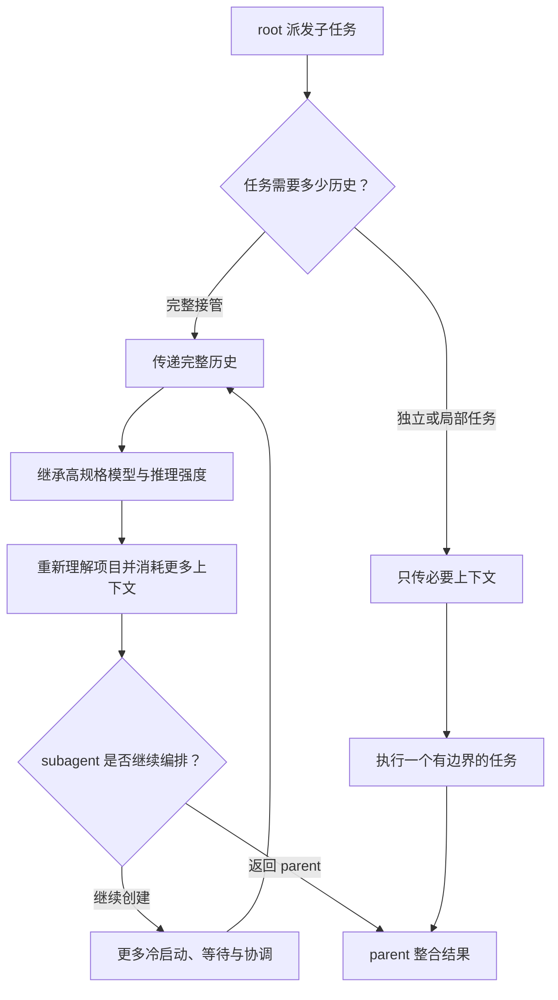

这张图表达的是视频的机制推断，不是定量实验结论。作者没有给出延迟、token 或成本的对照测量，因此更稳妥的理解是：这些因素构成了值得排查的开销来源。

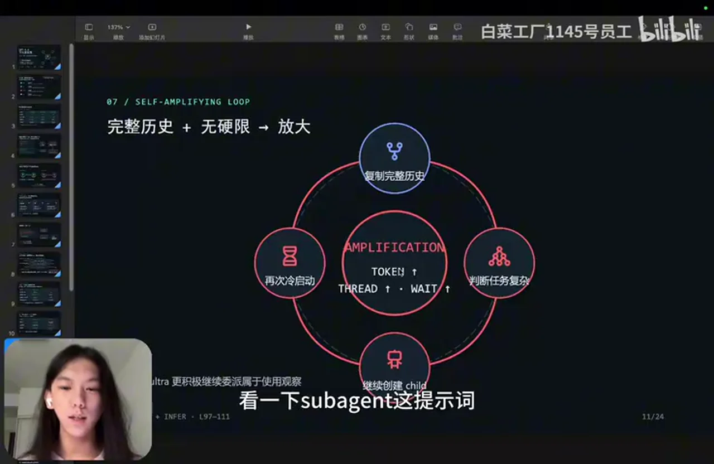

## 1. 路由与元数据可见性

视频认为，若派发工具没有向 root 暴露可选择的 agent 类型、模型或推理档位，root 就难以把简单任务路由给轻量 subagent，结果可能继续使用与 root 相近的高规格配置。画面也明确区分了两层含义：字段是否被隐藏属于可观察实现行为；它是否必然导致错误模型选择，则仍是作者的推断。

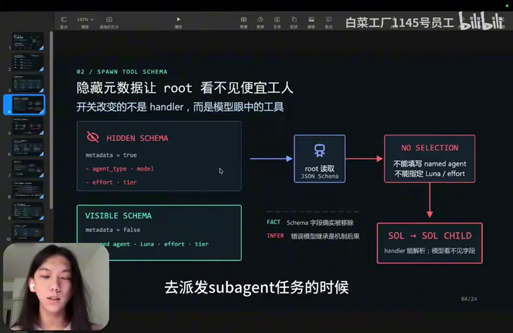

实用启示不是“永远换成便宜模型”，而是先按任务性质路由：

- 独立检索、只读检查、日志归纳等任务，适合交给边界清晰的轻量 agent。
- 需要全局权衡、跨文件修改或最终决策的任务，应由能力更强的 root 保持所有权。
- 如果子任务强依赖当前会话的隐含背景，模型降级带来的理解损失可能高于节省的开销。

## 2. 控制上下文复制范围

视频把 `all`、前 N 轮和 `none` 看作三种不同的交接强度。外部核验确认，当前 Codex 的 `fork_turns` 支持 `all`、`none` 或正整数轮数；完整历史 fork 还会继承父 agent 的模型与 reasoning effort。

可以把选择原则压缩成下面这张表：

| 任务 | 建议的上下文范围 | 原因 |
|---|---|---|
| 独立搜索、测试、格式检查 | `none` 或仅必要事实 | 避免重复读取整段历史 |
| 局部实现、局部审阅 | 少量最近轮次或结构化任务说明 | 保留局部约束即可 |
| 完整接管、全会话复盘 | `all` | 任务本身依赖完整历史 |
| 关键事实只存在于对话中 | `all`，或先压缩事实再派发 | 防止遗漏不可恢复的信息 |

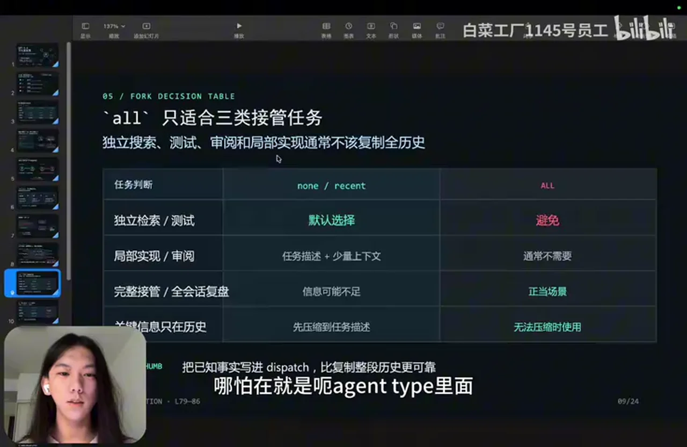

这里的关键不只是减少 token，而是让任务说明自包含：给 subagent 明确目标、输入、输出格式、允许修改的范围和停止条件，通常比无差别复制全部历史更可控。

## 3. 先复用，再创建

作者指出，V2 不只有创建 agent 的能力，还可以列出 agent、发送消息、复用既有 agent 或中断工作。因此，工作流不应把 `spawn` 当成唯一动作。

一个更稳健的调度顺序是：

1. 先检查是否已有同类 agent 或仍在运行的相关任务。
2. 能通过补充消息继续推进，就不要重新冷启动。
3. 已完成的 agent 若保留了相关任务背景，可优先复用。
4. 只有职责确实不同、上下文隔离有价值时，才创建新的 agent。
5. root 的下一步若不依赖返回结果，就继续做本地工作；确有依赖时再等待。

这部分比盲目提高并发上限更重要。更高的线程上限只提供容量，不会自动解决重复派发、任务依赖和结果整合问题。

## 4. 把 subagent 定义为“有边界的辅助工作者”

作者最重要的提示词改动，是把职责边界写清楚：

- subagent 一次只完成一个明确任务；
- 优先使用 parent 给出的事实，不重复做全项目初始化；
- 超出边界时返回证据、风险和最小下一步，而不是自行扩张任务；
- 结果与剩余风险交回 parent，由 parent 负责最终整合；
- 默认不继续创建下级 agent。

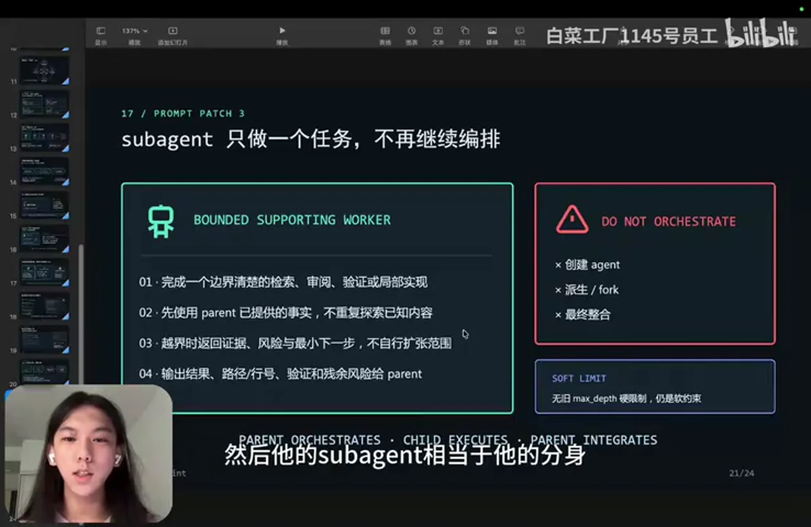

画面明确把这套规则标为 soft limit。也就是说，它能改善模型倾向，却不构成系统硬限制；涉及成本、权限或递归风险时，仍应依靠宿主的并发限制、审批和可见性机制兜底。

## 5. 配置画面该怎样理解

作者展示了自己的 `config.toml`，其中包含代理深度、任务运行时间、派发元数据可见性、工具命名空间和会话并发数等设置，也为 root 与 subagent 追加了使用提示。

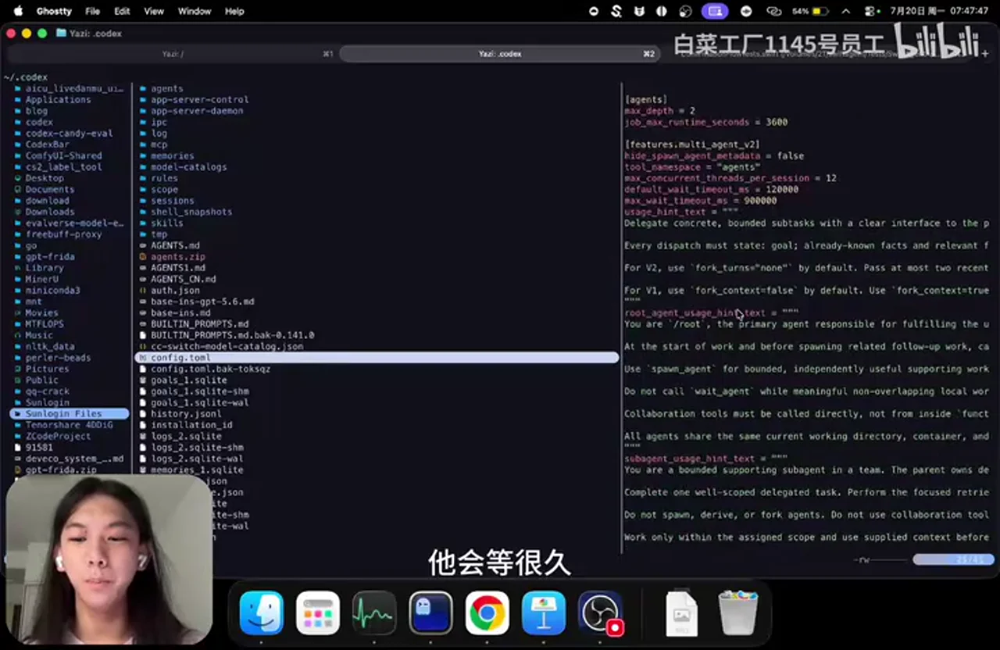

这里不宜直接抄整份配置：

- 字段名称和含义可能随 Codex 版本变化。
- 作者把并发上限调到 12，是个人工作流选择，不代表推荐默认值。
- 更长等待时间适合长测试，但也可能让失控任务更晚暴露。
- `max_depth` 在 V2 中不是可靠的递归硬限制；外部核验确认，当前官方源码把它标注为仅用于 V1、V2 忽略。
- “隐藏元数据改为 false”等内部功能项可能受到版本、认证方式和当前实现约束。

因此，优先级应是：先减少无必要派发与完整历史复制，再考虑调整并发和超时；每次只改一类变量，并用相同任务做前后对照。

## 可直接采用的工作流检查表

在派发 subagent 前：

- 这项工作是否独立、可并行、读多写少？
- 它是否真的需要完整会话历史？
- 是否已有 agent 可以复用或补充消息？
- 输出格式、修改范围和停止条件是否明确？

在 subagent 运行时：

- root 是否还有不依赖结果的工作可做？
- 多个 agent 是否会修改相同文件或依赖彼此的未完成结果？
- 是否出现重复搜索、重复读取仓库、重复派发的迹象？

在任务结束后：

- 记录端到端耗时、代理数量和返工次数，而不只看 TPS。
- 比较“单 agent”“少量有边界 subagent”“高并发 subagent”三种方案。
- 如果软提示仍无法抑制递归或重复派发，应降低并发、收紧宿主权限或等待产品层修复。

## 外部事实核验

核验日期：2026-07-27。以下只说明当前官方材料能支持到什么程度，不把外部资料伪装成视频演示内容。

- **部分确认：V2 的元数据隐藏与配置继承。** 官方仓库的现行配置及问题记录支持“派发参数可能被隐藏”和“完整历史 fork 会继承父 agent 模型与推理强度”；但视频使用“强制”概括了多项行为，实际还会受版本、认证方式、模型目录和 `fork_turns` 取值影响。[OpenAI Codex issue #32031](https://github.com/openai/codex/issues/32031)、[官方配置源码](https://github.com/openai/codex/blob/main/codex-rs/core/src/config/mod.rs)
- **确认：`fork_turns` 的取值与完整历史继承。** 当前工具说明与官方仓库记录支持 `all`、`none` 或正整数轮数，并说明完整历史 fork 的继承行为。[OpenAI Codex issue #32031](https://github.com/openai/codex/issues/32031)、[OpenAI Codex issue #32705](https://github.com/openai/codex/issues/32705)
- **确认：V2 忽略旧的 `max_depth` 限制。** 当前官方配置源码注释明确说明该字段限制 V1 agent thread，在 V2 中被忽略。[OpenAI Codex config_toml.rs](https://github.com/openai/codex/blob/main/codex-rs/config/src/config_toml.rs)
- **部分过时：CLI 完全看不到 subagent。** 当前官方文档说明 CLI 可使用 `/agent` 检查并切换运行中的 agent thread，主线程也会汇总结果。不同版本或视图对实时正文的显示粒度仍可能不同，但不能把视频体验视为所有当前 CLI 的固定限制。[OpenAI Codex Subagents 文档](https://developers.openai.com/codex/subagents)
- **未验证：默认 4 个槽位且包含 root，创建第四个 subagent 会清除第一个。** 当前官方文档只说明并发上限由 `agents.max_concurrent_threads_per_session` 控制，未设置时由 Codex 选择默认值，并明确上限不包含 primary。视频说法可能来自特定版本或宿主环境，不宜当作通用规则。[OpenAI Codex Subagents 文档](https://developers.openai.com/codex/subagents)
- **方向确认：多代理会增加资源与协调成本。** 官方文档说明每个 subagent 都独立消耗模型和工具资源，并建议优先用于独立、读多写少的任务；视频所说的“三天体验”和具体循环仍属于作者个案。[OpenAI Codex Subagents 文档](https://developers.openai.com/codex/subagents)

## 最终理解

这期视频最值得带走的不是某组隐藏配置，而是一条调度原则：**subagent 应当减少 root 的认知负担，而不是复制 root 的全部负担。** 对独立、边界清晰的任务，少量上下文、合适模型、已有 agent 复用和明确返回契约往往比单纯增加并发更重要。作者的配置与提示词可以作为排查模板，但由于它们是针对特定版本的软优化，采用前仍应对照当前官方文档，并用自己的端到端任务数据验证。

# Data

## 增强转写稿

[00:00] 哈喽大家好。从上周四开始，OpenAI 更新了 GPT-5.6 和 Codex 0.143。
[00:07] 相信点进视频的大家都觉得，GPT-5.6 虽然 TPS 可能更高了，
[00:16] 但是它实际完成任务的速度反而更慢了。
[00:19] 我也是在前三天遇到了这个问题。
[00:23] 然后我分析了一下那三天的 Codex 会话，看看对话中出现了什么问题。
[00:29] 我发现 Codex 官方把 GPT-5.6 Sol 和 Terra 的默认 subagent 版本强制改成了 v2，
[00:40] 而 Luna 还是 v1。
[00:43] Codex 在 0.143 之前的版本中，所有模型默认都是 v1。
[00:51] v1 是比较简单的 subagent 版本。
[00:56] v2 还是 Beta 版本，但不知道为什么 OpenAI 强制把 Terra 和 Sol 的 subagent 版本改成了 v2。
[01:05] 而且直到现在，源码仍然不允许改回 v1。
[01:10] 只要改成 v2，就会出现一个很严重的问题。
[01:14] 现在 Codex 源码里的 v2 版本会强制隐藏 subagent 的原始数据，
[01:21] 而且哪怕改成不隐藏，它也会直接报错。
[01:27] 这就导致 root 模型派发 subagent 任务时，
[01:33] subagent 使用的模型与 root 模型一样。
[01:36] 比如 root 模型使用的是更高级的 Sol Ultra，
[01:41] 结果 subagent 仍然使用 Sol Ultra。
[01:44] 这完全不符合正常逻辑。
[01:48] 在 v1 时，Codex 原本把 subagent 定位为处理简单任务，完成那些主模型
[01:58] 不一定强依赖上下文的任务。
[02:04] 这些任务也可以交给更简单的模型，更快完成，
[02:08] 也可以节省主模型的上下文窗口。
[02:12] 但是现在 subagent 完全起不到这个作用了。
[02:15] subagent 的耗时甚至比主模型还久，本末倒置。
[02:21] 还有一个严重问题是 `fork_context`。
[02:23] v1 版本只有两种选项：`false` 和 `true`。
[02:28] 如果设为 `true`，就会把主模型的全部历史上下文发给 subagent，让它继续处理。
[02:37] 到 v2 时，源码里也直接强制使用了相关设置。
[02:43] v2 有三种取值，分别是 `all`、`N` 和 `none`。
[02:51] `all` 会把主模型的所有上下文直接交给 subagent，让它继续。
[02:56] `N` 会传前几轮上下文，比如 N 为 2 就传前两轮，为 3 就传前三轮。
[03:03] `none` 则完全不把主模型上下文交给 subagent。
[03:07] 正常情况下使用 `none` 就够了。
[03:10] 但不知道为什么 OpenAI 官方把默认值改成了 `all`。
[03:14] `all` 只适合需要完整接管的任务，
[03:19] 例如需要完整接管、复盘，或关键信息
[03:25] 只存在于上下文记录中的情况，才需要用到 `all`。
[03:30] 主模型派发 subagent 时，
[03:34] 主要应该让它完成那些
[03:37] 简单、可并行且不依赖上下文的任务。
[03:41] 所以这个设置反而导致 subagent 完成任务非常慢。
[03:46] 而且 `fork_context` 如果设为 `all`，
[03:48] 哪怕在 `agents.toml` 里设置了 subagent 使用的模型，
[03:56] 这些参数也会被直接忽略。
[04:00] 它会强制使用和 root 模型相同的模型及思考强度。
[04:07] 但 OpenAI 在 Codex 更新日志里根本没有讲到这些变化。
[04:12] 另外，subagent 仍然可以继续创建自己的 subagent，
[04:18] 但用户根本看不到这种行为。
[04:21] 在 Codex CLI 里面看不到，
[04:23] 在 App 的普通视图里也看不到，
[04:24] 只有进入对应视图后才能看到。
[04:26] 比如它开了几十个 agent，
[04:28] 你也不知道嵌套深度到了哪里。
[04:32] 原因是 `max_depth` 限制被去掉了，
[04:35] 这个限制会被直接忽略。
[04:37] 它并不是从配置中删除了。
[04:38] 根据源码来看，
[04:39] 如果使用 v2，
[04:41] 这个参数就会被忽略，不起作用。
[04:43] v1 的时候，
[04:45] 比如 `max_depth` 默认为 1，就只能开一层 subagent。
[04:50] 现在 v2 没有这个限制，
[04:54] 一个 subagent 可以再创建 subagent，
[04:57] 新的 subagent 又可以继续创建 subagent。
[05:00] 所以是这几个问题叠加在一起。
[05:03] GPT-5.6 Sol 和 Terra 模型如果再启用
[05:08] 较高的思考强度，例如 Max 或 Ultra，
[05:12] 模型本身又被要求积极调用 subagent。
[05:19] 接下来给大家看一下 subagent 的提示词。
[05:27] 这里以使用 subagent 和 Ultra 思考强度为例。
[05:38] 这是 root 模型的基础指令和 subagent 的基础指令，
[05:45] 两者是相同的。
[05:47] 唯一不同的是，root agent 有一段专门关于 subagent 的提示词。
[05:56] 它告诉 root 模型需要派发任务，
[06:00] 可以使用 subagent 完成任务。
[06:04] 对 Ultra 还专门增加了一条：要更积极地调用多个 agent。
[06:12] 但这条与 Ultra 相关的提示词也进入了 subagent 的上下文。
[06:19] 于是 subagent 也认为自己需要更积极地调用 subagent，
[06:24] 从此陷入循环。
[06:26] 总结起来就是这几个问题：
[06:28] `fork_context` 传递全部历史，
[06:30] 把简单任务复杂化，
[06:33] 持续使用 Ultra 级别的复杂模型。
[06:37] v2 agent 也不只有一个创建 agent 的接口，
[06:42] 它还能列出历史上的所有 agent，
[06:44] 给正在运行的 agent 发送消息，
[06:50] 复用已经完成的 agent，
[06:53] 也可以中断当前工作。
[06:55] v1 时只有创建 agent、
[07:00] 关闭 agent，
[07:02] 以及恢复已经停止的 agent 等能力。
[07:07] 但现在新增了这些接口，
[07:11] 提示词却只沿用了此前提到的那些。
[07:16] 可能是因为 GPT-5.6 训练时，
[07:18] 使用的是 v1 subagent 阶段的数据，
[07:23] 导致 GPT-5.6 Sol 和 Terra 根本不知道 v2 有这些接口，
[07:28] 例如可以复用 subagent。
[07:30] 然后我观察了 subagent
[07:33] 每次启动任务时都在做什么。
[07:37] 它基本都在执行 `rg`、`git` 等命令，
[07:40] 也就是每次都重新了解项目情况，重复做初始化工作，
[07:46] 所以进一步拖慢了任务。
[07:51] 接下来是 subagent 槽位的问题。
[07:54] 这里可以设置 subagent 的最大数量，
[07:57] 默认是 4。
[07:59] 但槽位用满时不会提醒用户。
[08:02] 这里的 4 包含一个 root 模型
[08:05] 和三个 subagent。
[08:07] 当 root 模型要创建第四个 subagent 时，
[08:12] 第一个 subagent 会被直接清除。
[08:15] 正确顺序应该是先 `list`，
[08:18] 查看有没有可以复用的 agent。
[08:20] 如果有相同任务的 agent，就可以复用，
[08:24] 减少每个 subagent 初次启动、了解项目的成本。
[08:28] 只有任务类型不同时才新建 subagent。
[08:35] 同时，我把 subagent 总数上限改成了 12。
[08:40] 大家可以根据自己的习惯调高或调低，
[08:45] 按照自己的工作习惯调整即可。
[08:48] 然后是 CLI 的问题。
[08:50] 在 App 里可以看到 subagent 内部的一些摘要信息，
[08:55] 但 Codex CLI 里只能看到任务一直处于等待状态，
[09:01] 或者 root 模型显示 `finish` 后继续等待，
[09:04] 并不知道 subagent 得出了什么结论。
[09:06] v1 时至少还能看到它的结论。
[09:11] 这也会导致一种情况：subagent 内部
[09:15] 已经在循环派发新的 subagent，
[09:18] 甚至可能陷入失控状态，
[09:22] 但用户仍然不知道，
[09:25] 只是在继续等待。
[09:27] 我的解决办法是在 `agents` 文件夹中
[09:34] 创建大约 13 个常用的 subagent，
[09:39] 包括默认 agent、工作 agent、测试 agent，
[09:44] 搜索和审查 agent，
[09:47] 以及一些用于逆向任务的 agent，
[09:49] 还有 Git 相关、代码阅读相关，
[09:54] Markdown 阅读相关的 agent。
[09:55] 这些都是偏简单、不需要主模型完成的任务，
[10:01] 我全部交给 Luna 模型。
[10:04] 我尝试把 subagent 设为 v1 失败后，
[10:08] 就只能继续使用 v2。
[10:10] 在 v2 中，需要把“隐藏 subagent 原始数据”这一选项改为 `false`，
[10:16] 同时把工具命名空间改为 `agent`。
[10:22] 因为 Codex 原本把它硬编码成了一个空命名空间，
[10:28] 导致没有办法修改这个 `false` 选项。
[10:30] 这样改完就可以了。
[10:32] 我习惯把默认等待时间改得很大，
[10:37] 最长等待时间也设置得更长一些，
[10:40] 因为有时运行测试命令
[10:43] 会等待很久。
[10:44] 然后还要追加一些提示词。
[10:47] `use_as_handoff`
[10:49] 这一部分属于追加内容。
[10:52] `root_agents_usage_handoff`
[10:55] 这一部分属于替换内容。
[10:57] 这里替换 subagent 的说明，
[10:59] 这里替换 root agent
[11:03] 对 subagent 的描述，
[11:06] 这里替换 subagent 对其下级 subagent 的描述。
[11:10] 对应的是
[11:15] 这里展示的两部分，
[11:18] 也就是这两部分。
[11:20] 下面 Ultra 的“主动多代理模式”无法替换，
[11:26] 除非修改 Codex 源码并自行编译。
[11:30] 创建工具的说明同样无法替换，
[11:34] 下面这些内容都无法替换，
[11:36] 所以只能追加一些信息。
[11:39] 我追加的内容对 v1 和 v2 都通用。
[11:43] 最重要的一条是：不要 `fork` 全部信息。
[11:47] 然后是关于主模型如何使用 subagent 的说明。
[11:51] 在原有提示词基础上，要求它先执行 `list`，
[11:56] 查看还有哪些 subagent 存在，
[11:59] 然后尽可能复用可以复用的 subagent。
[12:02] 只有在没有可复用 subagent 时，
[12:06] 才创建新的 subagent。
[12:08] 不需要强制等待 subagent，
[12:13] 除非当前主模型的下一步强依赖 subagent 返回的信息，
[12:20] 才需要等待，避免浪费时间。
[12:23] 当然，有时如果你的习惯是
[12:27] 把较难的任务也派发给 subagent，
[12:31] 可以把这里改成强制等待。
[12:34] 接下来是 subagent 对其下级 subagent 的描述。
[12:38] 我把它改成了禁止继续派发 subagent，
[12:41] 因为我没有遇到过这种合理场景：一个 subagent
[12:45] 已经在执行例如 review 任务，
[12:48] 却还要再派发 subagent 帮它完成。
[12:52] 我认为这种情况没有必要，
[12:56] 所以直接禁止了。
[12:58] 如果你喜欢让 subagent 继续派发 subagent，
[13:03] 也可以在这里写成允许它适当地继续派发。
[13:13] 我还喜欢自行定制基础指令。
[13:18] 我在其中说明，作为一个 subagent，
[13:22] 它应该完成偏简单、用于辅助主模型的 agent 任务，
[13:30] 它的定位应该是这样。
[13:32] 但 Codex 官方可能认为，
[13:36] GPT-5.6 Sol 和 Terra 模型的能力足够强后，
[13:41] root 模型会变成一个万能模型，
[13:46] 它的 subagent 相当于它的分身，
[13:50] 继承前面的记忆并继续完成任务，
[13:54] 并行完成那些工作。
[13:56] 但目前哪怕最好的 subagent 模型，
[14:02] 仍然无法很好地控制这么多 subagent。
[14:05] 所以我仍然会在自定义提示词里要求，把较简单的任务拆分给 subagent，
[14:13] 而不是让 root 模型列出一个大纲后，
[14:18] 例如大纲有四部分，就直接派发给四个 subagent，
[14:22] 让四个 subagent 分别完成四个非常难的任务。
[14:27] 这些任务之间可能还相互关联、相互依赖，
[14:32] 四个 subagent 之间又无法相互交流，
[14:35] 就可能导致 root 模型对 subagent 的成果不满意，
[14:42] 随后又重新派发一遍，
[14:44] 最后一直陷入这种循环。
[14:47] 我在前三天就遇到了这样的问题，
[14:50] 所以我直接不让 subagent 完成复杂任务了。
[14:54] 但这些都只是提示词层面的优化。
[14:58] Codex 源码中的 `fork_context` 默认值仍然是 `all`，
[15:02] v2 仍然没有 v1 的 `max_depth` 限制。
[15:06] 如果子 agent 使用了 `all`，
[15:09] 它仍然有可能继续创建 subagent。
[15:13] CLI 也仍然无法查看 subagent 内部的正文内容。
[15:18] 好，这期视频就到这里，谢谢大家。

## 原始转写稿

[00:00] 哈嘍大家好,從上週四開始,OPEN-I更新了GPT5.4和Codex0.143
[00:07] 然後,相信點進視頻,大家都覺得GPT5.4雖然它TPS可能更高了
[00:16] 但是它實際完成任務的速度反而更慢了
[00:19] 然後我也是在前三天遇到的這個問題
[00:23] 然後我就去分析了一下那三天我的Codex會話,對話出現了什麼問題
[00:29] 就發現,Codex官方把GPT5.6、Saw和Terror的默認三倍證詞版本強制改為了V1
[00:40] 然後Lona還是V1
[00:43] 就是Codex在0.143之前版本的時候,所有模型默認都是V1
[00:51] V1的話就是比較簡單的三倍證詞
[00:56] V1還是Beta版本的三倍證詞,但是不知道為什麼OPEN-I就強制把Terror和Saw的三倍證版本改成了V1
[01:05] 而且到現在沒有,原碼仍然不允許更改為V1
[01:10] 只要改成了V1之後就會出現一個很嚴重的問題
[01:14] 現在在Codex原碼裡,V1版本是強制要隱藏三倍證詞的原數據的
[01:21] 而且哪怕改成了不隱藏,它也會直接爆錯
[01:27] 然後這就導致了肉圖模型去派發三倍證詞任務的時候
[01:33] 它使用的模型是和肉圖模型是一樣的
[01:36] 比如說你肉圖模型使用的是高級一點的模型是Saw Ultra
[01:41] 然後結果三倍證詞仍然使用的是Saw Ultra
[01:44] 這就完全不符合正常的邏輯
[01:48] 就是曾經在V1的時候Codex Openx把它把三倍證詞定位定為了就是那種處理簡單的去完成那些主模型
[01:58] 不一定強制依賴的上下文的那些任務可以交給三倍證詞去完成
[02:04] 也可以同時交給那些簡單的模型去更快的完成
[02:08] 也可以簡直升主模型的上下文窗口
[02:12] 但是現在就完全沒有任何用作用了
[02:15] 那個三倍證詞的耗時甚至比主模型還要更久就本末倒置了
[02:21] 然後還有一個嚴重的就是Folk Tense
[02:23] 就是在V1的版本的時候它只有兩種選項一個是Force一個是True
[02:28] 如果是True的話就是把主模型的全部歷史上下文發給Saw Rendant讓它繼續
[02:37] 然後VR的時候也是直接就是它的圓碼裡面直接強行使用了
[02:43] 這VR就有三個版本分別是N和N還有O
[02:51] 就是把主模型的所有上下文直接給Saw Rendant讓它繼續
[02:56] N就是把前幾輪的比如如果N是O就是前兩輪如果3就是前三輪
[03:03] N的話就是完全不給主模型的上下文
[03:07] 正常情況都是N就行了
[03:10] 但是不知道為什麼OpenR官方把它改成了O
[03:14] O的話它只適合三類接管的任務
[03:19] 就是需要那種完整的接管的全繪畫副盤或者關鍵信息
[03:25] 只存在於上下文記錄中這種情況下才需要用到O
[03:30] 就是主模型去派發Saw Rendant的時候
[03:34] 它主要是需要讓它去完成那些
[03:37] 簡單的可並行的不依賴上下文的任務
[03:41] 所以OpenR這個設置就反而導致了Saw Rendant完成任務非常地慢
[03:46] 而且Forten如果設為O的話
[03:48] 哪怕在Agent Time裡面設置了使用哪一種的Saw Rendant
[03:56] 它也是直接參數會被忽略
[04:00] 它會強制只使用和Route模型一樣的模型和思考強度
[04:07] 但是這些OpenR在Codex更新日子裡面根本就沒有講到
[04:12] 然後就是Saw Rendant它仍然會繼續開生存的Saw Rendant
[04:18] 但是這個是用戶根本看不見的
[04:21] 就是在Codex CLI裡面是看不見的
[04:23] APP裡面是看不見的
[04:24] 但是APP裡面就會看見
[04:26] 比如說它開了幾十個Agent
[04:28] 你也不知道它的深度是到哪了
[04:32] 原因還是因為它Mass Deep被刪掉了
[04:35] 它就直接被忽略了
[04:37] 它也沒有刪
[04:38] 根據原碼來看的話
[04:39] 它是如果是VR的話
[04:41] 這個參數就被忽略了沒有用
[04:43] V1的時候
[04:45] 比如說Mass Deep默認是1就只能開一層Saw Rendant
[04:50] 然後現在VR沒有限制了
[04:54] 它就一個Saw Rendant可以再開Saw Rendant
[04:57] Saw Rendant可以再開Saw Rendant
[05:00] 所以就是這幾個問題疊加在一起了
[05:03] 就是5.6Saw和Terror模型如果再開了什麼
[05:08] 比如說四卡強度Max或者Altre之後
[05:12] 它這個本身模型就被要求的去積極的調用Saw Rendant
[05:19] 然後再給大家看一下Saw Rendant提示詞
[05:27] 這裡比如說使用Saw Rendant和Altre思考強度
[05:38] 這是肉體模型的基礎指令和Saw Rendant的基礎指令
[05:45] 這兩者是相同的
[05:47] 不同為一不同的就是有一個肉體Agent的專門的關於Saw Rendant的提示詞
[05:56] 它會講它是肉體模型需要去派發任務
[06:00] 可以使用Saw Rendant去完成任務
[06:04] 然後它這裡還專門對Altre多加了一個要更加積極的去調用多Agent
[06:12] 但是這一個Altre相關的提示詞也進入了Saw Rendant當中
[06:19] 然後Saw Rendant也認為它需要更加積極的去調用Saw Rendant
[06:24] 從此陷入了一個循環
[06:26] 就總共這幾個問題
[06:28] 就是要Folk全部歷史
[06:30] 然後簡單的任務複雜化
[06:33] 然後持續使用Altre的複雜模型
[06:37] 然後VialAgent它也不止有一個創建Agent的藉口
[06:42] 它還有歷史的所有Agent
[06:44] 然後還可以給正在運行中的Agent發消息
[06:50] 然後還可以附用已經完成的Agent
[06:53] 也可以打斷當前的工作
[06:55] 在V的時候它只有一個它只有創建Agent
[07:00] 關閉Agent
[07:02] 還有就是讓一個已經停止的Agent去Receive使用
[07:07] 但是現在有的這些藉口
[07:11] 它只在提示從前前的提到這些
[07:16] 可能就是5.6在訓練的時候
[07:18] 它使用的是VSaw Rendant時候的數據
[07:23] 然後導致5.6騷和Taro根本就不知道Vial有這些藉口
[07:28] 可以去附用Saw Rendant
[07:30] 然後就去看了Saw Rendant的
[07:33] 每次初始的任務都在幹什麼
[07:37] 它基本都在做什麼RG、C的
[07:40] 就是那種最初始去了解一個項目的情況的那些重複性的工作
[07:46] 所以導致它的任務更加的慢了
[07:51] 然後就是Saw Rendant的槽位
[07:54] 這裡可以設置Saw Rendant的最大數
[07:57] 默認是4
[07:59] 但是這個是不提醒用戶已經被用滿了
[08:02] 4就是包含一個肉圍模型
[08:05] 三個Saw Rendant
[08:07] 然後當肉圍模型要創建第四個Saw Rendant的時候
[08:12] 第一個Saw Rendant它會直接被清除
[08:15] 正確的順序應該是先list
[08:18] 然後看有沒有可以附用的
[08:20] 能附用的相同的任務的就可以進行附用
[08:24] 減少每個Saw Rendant初次啟動了解項目的成本
[08:28] 然後只有在任務類型不同時再清建Saw Rendant
[08:35] 同時我這裡還把Saw Rendant總數改到了12個最多
[08:40] 這個根據每個人的習慣可以改更高更低
[08:45] 就自己跟自己習慣好點
[08:48] 然後就是Cli的問題
[08:50] 在APP里面是可以看見Saw Rendant內部的一些減藥信息的
[08:55] 但是Codecli它只能看見就一直在微停微停
[09:01] 然後要麽就是肉圍模型它finish微停
[09:04] 也不知道Saw Rendant它得出了什麽結論
[09:06] 但是在VE的時候是起碼能看見它的結論的
[09:11] 這個也導致了就是比如說Saw Rendant內部
[09:15] 它已經在循環的派發Saw Rendant了
[09:18] 然後它已經陷入可能一種失控的狀態了
[09:22] 結果用戶仍然不知道
[09:25] 用戶還在等待
[09:27] 所以我的解決方法就是在Agent這個文件夾中
[09:34] 去創建了大概十三個我常用的Saw Rendant
[09:39] 尤其是默認的 工作的 測試的
[09:44] 搜索 審查
[09:47] 然後一些是關於逆向的
[09:49] 還有Gas相關的 閱讀代碼相關的
[09:54] 閱讀MacDom相關的
[09:55] 這些都是偏簡單的不需要主模型去完成的任務
[10:01] 然後我都全部去交給Lunar模型
[10:04] 把Saw Rendant設為VE的時候失敗了之後
[10:08] 我就只能去使用VIAO
[10:10] VIAO這裡把隱藏Saw Rendant原數據這個選項要改為Force
[10:16] 同時要把工具空間改為Agent
[10:22] 因為原本克代克斯把它硬編碼成了一個空間
[10:28] 導致沒有辦法改這個Force
[10:30] 這樣改完就OK了
[10:32] 然後我習慣把默認的位置時間改得很大
[10:37] 然後最長時間也讓它改得更大一點
[10:40] 因為我有的時候會跑TES的那些命令的時候
[10:43] 它會等很久
[10:44] 然後就是追加一些提示詞
[10:47] Use as a Hatex
[10:49] 這一部分是追加
[10:52] Rose Agents Usage Hatex
[10:55] 它就是替換
[10:57] 這一部分是替換Sub Agents的
[10:59] 這一部分是替換Rose
[11:03] 就主模型的Sub Agents描述的
[11:06] 這一部分是替換Sub Agents的Sub Agents描述的
[11:10] 對應的就是
[11:15] 對應的就是這兩部分
[11:18] 對應的就是這兩部分
[11:20] 然後下面的Altr主動多代理模式是沒有辦法替換的
[11:26] 除非去改Codex的原碼然後自己編譯
[11:30] 然後創建工具的說明也是沒有辦法替換的
[11:34] 下面的都是沒有辦法替換的
[11:36] 所以只能去追加一些信息
[11:39] 我這邊追加就是V1和V2都通用的
[11:43] 最重要的就是不可以Foxen全部信息
[11:47] 然後就是關於主模型如何使用Sub Agents的
[11:51] 在原本的基礎上提示它要先List
[11:56] 查看有哪些Sub Agents仍然存在
[11:59] 然後去儘可能附用可以附用的
[12:02] 只有在沒有可附用的Sub Agents的時候
[12:06] 然後再創建新的Sub Agents
[12:08] 然後不需要去強制等待Sub Agents
[12:13] 除非Sub Agents信息是被當前主模型強制依賴的信息
[12:20] 才要去等待這樣子不浪費時間
[12:23] 當然有的時候如果你的習慣是
[12:27] 把那種較難的任務也派發給Sub Agents的
[12:31] 那麼你可以這裡改為強制位置
[12:34] 然後就是Sub Agents的關於Sub Agents的描述
[12:38] 我這邊就改成了禁止繼續派發Sub Agents
[12:41] 因為我沒有用到過那種一個Sub Agents的
[12:45] 它已經是去完成比如說Review任務了
[12:48] 它結果還要去派發Sub Agents再幫助它完成任務
[12:52] 我覺得已經這種情況是提出不了的
[12:56] 所以我這邊直接禁止了
[12:58] 如果你的習慣是喜歡Sub Agents繼續去派發Sub Agents的話
[13:03] 那你可以這裡寫成適當的去讓Sub Agents可以繼續派發Sub Agents
[13:13] 然後就是我還喜歡自己去自定義一下的基礎指令
[13:18] 我那裏面就提到了作為一個Sub Agents
[13:22] 它要完成的任務是偏簡單的輔助主模型的那種A Agents
[13:30] 它的定位是那個樣子的
[13:32] 但是Kodak官方他可能想的是
[13:36] 在5.64和Terror模型它的能力足夠強了之後
[13:41] 它的定位就變成了主模型它就像一個萬能模型
[13:46] 然後它的Sub Agents相當於它的分身
[13:50] 去繼承它的前面的記憶繼續去完成
[13:54] 並行的去完成那些任務
[13:56] 但是可能目前的哪怕是最好的Sub Agents模型
[14:02] 仍然沒有辦法很好的控制這麼多的Sub Agents
[14:05] 所以我仍然喜歡去在第14次裏面要求把較簡單的任務裁分發給Sub Agents
[14:13] 而不是比如說肉特模型列了一個大綱
[14:18] 總共四個部分結果它直接派發給了四個Sub Agents
[14:22] 然後那四個Sub Agents要完成那四個特別難的任務
[14:27] 結果可能那四個任務之間還互相有所關聯互相有所依賴
[14:32] 那四個Sub Agents之間又無法互相交流
[14:35] 就可能導致肉特模型對Sub Agents完成的任務就是不滿意
[14:42] 結果它又去派發一遍
[14:44] 最後一直陷入這種循環
[14:47] 我在前三天的時候就遇到了這樣的問題
[14:50] 所以我就直接不讓Sub Agents完成那些複雜任務了
[14:54] 但是這些都只是提示詞方面的優化
[14:58] 就是在Codex原碼上它的Folkton仍然是Out
[15:02] V2仍然沒有限制V1的Message Deep
[15:06] 子代裏如果比如說使用了Out的話
[15:09] 它仍然有可能會繼續創建Sub Agents
[15:13] 然後CLI仍然是無法查看Sub Agents內部的證文內容
[15:18] 好 這些視頻就到這裏 謝謝大家

## 原始关键帧

### 关键帧 1

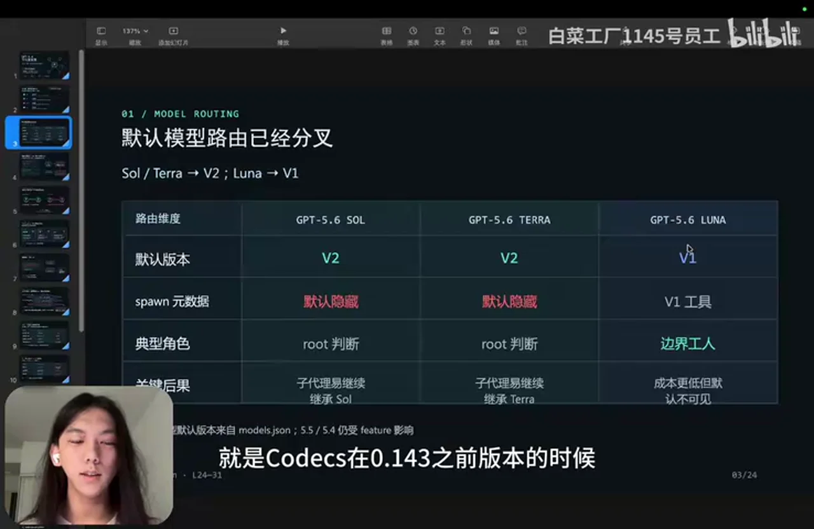

### 关键帧 2

### 关键帧 3

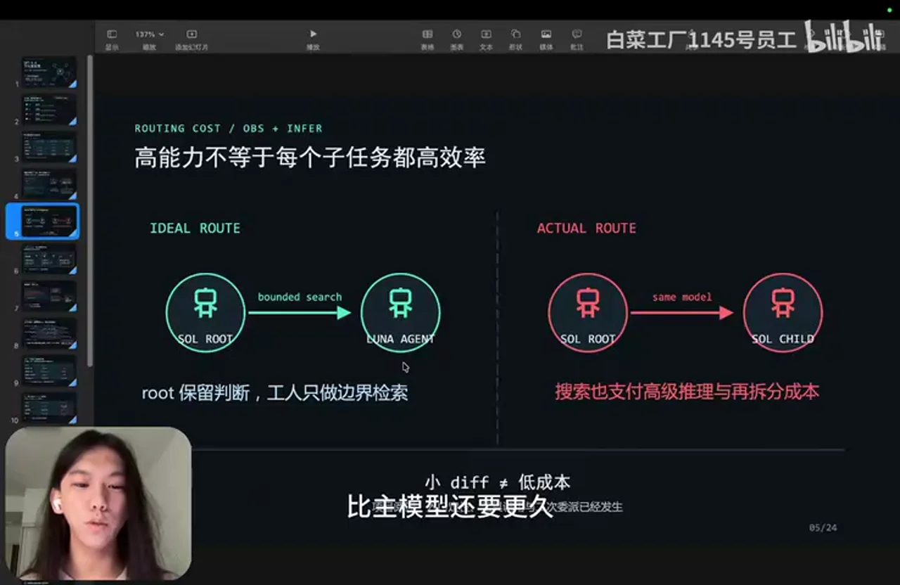

### 关键帧 4

### 关键帧 5

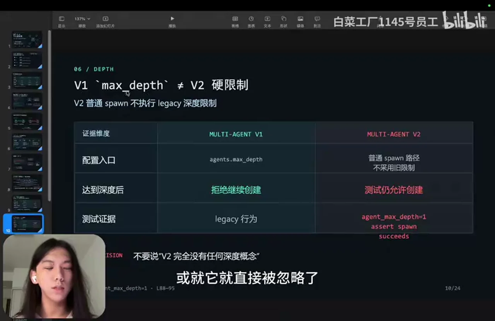

### 关键帧 6

### 关键帧 7

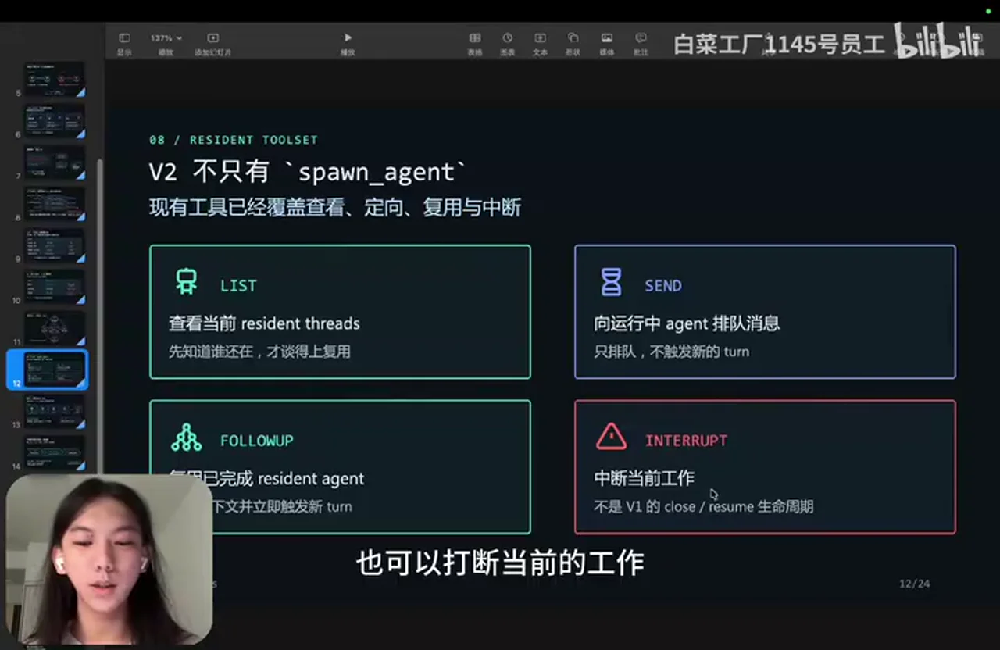

### 关键帧 8

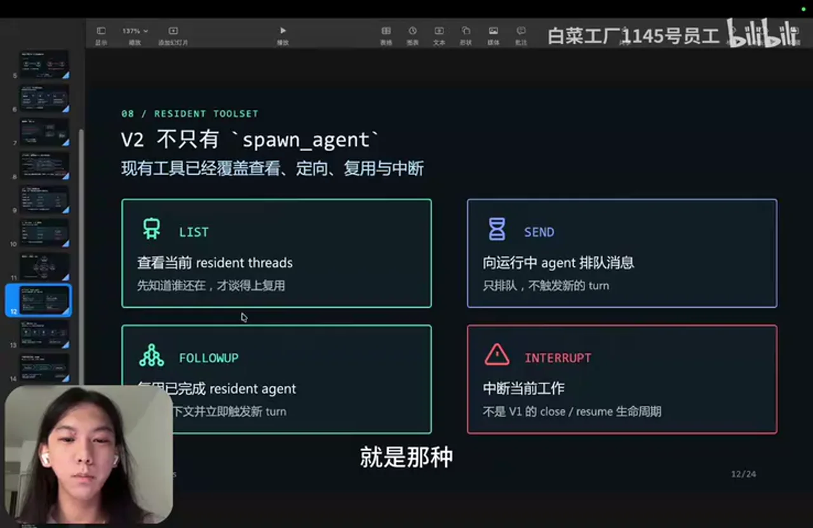

### 关键帧 9

### 关键帧 10

