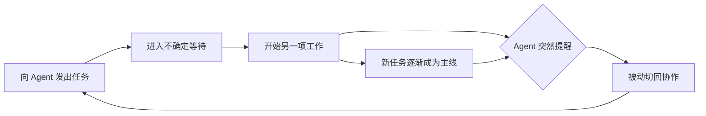
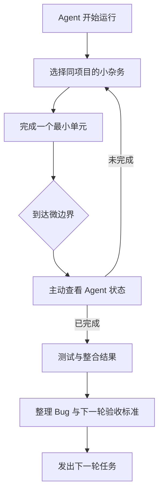
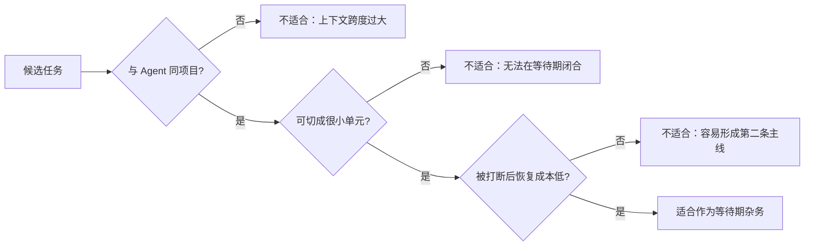
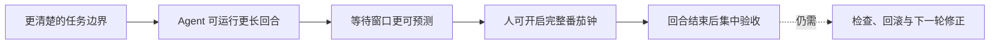

# 总结稿

[打开单页 HTML 总结](assets/bilibili-BV1JQbi6LE2Z-summary.html)

## 核心结论

作者遇到的并不只是“Agent 工作时我该做什么”，而是**不可预测的完成提醒夺走了切换时机**：番茄钟铃声原本代表一个完整工作段结束，Agent 的额外铃声却在任意时刻触发响应；等待期间随手开启的小任务又可能逐渐变成新的主线，于是人会在两个任务之间反复被动切换。[00:15–01:32]

作者当前觉得有效的做法可以概括为两条：

1. **关闭 Agent 铃声，把检查安排在自己的任务微边界。** 完成一个很小的步骤后，再主动查看 Agent 状态，而不是收到声音就立即切换。[01:45–02:08]
2. **等待期只做同一项目内、低沉浸、可随时停止的杂务。** 例如测试单个项目、整理 Bug 清单、审查变更，以及准备下一轮验收标准或任务清单。[02:08–03:32]

核心原则是：**不要消灭切换，而要把“何时切换”的主权拿回来，并降低切换时的上下文跨度。**

## 一套可直接尝试的流程

### 1. 发任务前

- 明确这一轮 Agent 要完成什么。
- 写下最小验收标准，避免 Agent 返回后才重新回忆目标。
- 预先列出 2～4 个同项目的低沉浸杂务。

### 2. Agent 运行时

- 关闭强提醒，或降级为不触发立即响应的轻提示。
- 不启动深度写作、复杂设计等容易形成新心流的工作。
- 从测试、审查 diff、整理 Bug、补验收标准等任务中挑一个最小单元。

### 3. 到达微边界时

- 每测完一项、审完一小段 diff、记完一个 Bug，才主动检查 Agent。
- 若 Agent 尚未完成，再进入下一个小单元；若已完成，则在自然停顿处切回。

### 4. Agent 返回后

- 先按验收标准测试和整合，而不是立刻继续追加模糊指令。
- 把新发现的问题写入清单，再决定下一轮任务边界。

## 为什么这种安排更顺

- **信号不冲突**：番茄钟仍只代表人工设定的工作段结束，Agent 通知不再复用同一种强制切换信号。
- **上下文更连续**：等待任务与 Agent 任务属于同一项目，只是在同一“频道”内换挡。[03:03–03:24]
- **任务粒度匹配**：小测试或清单项能在等待窗口中完整收尾，不容易被 Agent 返回打断一半。[02:44–03:32]
- **掌控感更强**：检查动作由人主动发起，切换落在自然停顿点。[01:50–02:08]

## 当前方案与进阶方案

作者还设想了一个进阶工作流：把边界、验收标准和禁区写得足够清楚，让 Agent 独立运行更长回合；人则可以在这段确定性更强的等待期内开启一个完整番茄钟。[03:52–04:18]

但作者明确说明，这对 PRD 和任务边界表达能力要求更高；以自己当前的开发经验，还不能保证 Agent 在长回合中不出错，因此它只是未来方向，而不是已经验证可行的方案。[04:18–04:30]

## 适用边界

- 这是作者的**个人工作流经验**，不是关于心流、通知设计或 Agent 效率的一般性实证结论；事实核验文件也未识别出需要外部核验的客观或时效性主张。
- 关闭铃声适合能够主动检查、且任务失败不会立即造成严重后果的场景；若构建失败、安全告警或线上事故需要及时响应，应保留分级提醒。
- “同项目杂务”必须足够小、可中断。若审查或调试本身已经进入深度推理，就不再是合适的等待填充任务。
- 长回合 Agent 的前提是边界清楚、验收可执行，并且仍有检查与回滚机制；不能把“更少通知”等同于“无需监督”。

## 观众样本说明

本次仅获取到 2 条热门顶层评论候选和 1 条当前可访问弹幕，且没有嵌套回复；样本不足以概括观众共识，也没有选出能提供独立限定、问题或纠错的评论。因此不把互动量或单条弹幕写成对视频观点的支持证据。

# 辅助理解

## 问题不是“等待”，而是“突袭式切换”

视频描述的循环是：把任务交给 Agent 后，人为了利用等待时间转去做别的事；Agent 在不可预测的时刻发出完成提醒，人又被拉回协作界面。真正的摩擦来自两个因素叠加：[00:15–01:32]

- **切换时机由通知决定**，而不是由人的自然停顿决定。
- **等待任务可能反客为主**，一旦进入新的心流，再切回就会产生明显割裂。

这里的重点不是要求完全不切换，而是区分两种切换：

| 切换方式 | 触发点 | 主观体验 |
|---|---|---|
| 通知驱动 | Agent 随机完成时 | 像“突袭”，正在进行的动作没有收尾 |
| 微边界驱动 | 测完一项、记完一个 Bug、审完一小段 diff | 像主动换挡，当前动作已经闭合 |

## 当前解法：把等待变成同频道内的短循环

作者的方案不是寻找更多消遣，而是重新设计一个短反馈循环：[01:45–03:52]

1. 关闭 Agent 的强铃声，仅保留轻量状态提示。
2. Agent 运行时，只处理同项目的低沉浸杂务。
3. 每完成一个最小单元，就到达一次“微边界”。
4. 只在微边界主动检查 Agent；未完成就继续下一个小单元。

### 合适任务的筛选器

一个等待期任务应同时满足三项：

视频给出的典型例子包括：测试、审查 diff、整理 Bug 清单，以及准备下一轮验收标准。深度写作或需要持续推理的任务则不适合，因为它们很容易形成新的心流。[02:20–03:32]

## 两种时间尺度

当前方案和未来方案处理的是不同长度的 Agent 回合：

| Agent 回合 | 人的配套节奏 | 关键能力 |
|---|---|---|
| 短且结束时间不确定 | 同项目微任务 → 微边界检查 | 控制通知、切小任务 |
| 足够长且边界较清楚 | 独立开启一个完整番茄钟 | PRD、验收标准、禁区与可靠监督 |

未来方案的逻辑是：如果任务边界足够清楚，Agent 可以运行一个长回合，等待期便长到足以容纳另一段完整工作。但作者并未把它呈现为现成答案；相反，他坦承自己目前还写不出足以避免 Agent 出错的 PRD。[03:52–04:30]

## 不要过度推广

- “关闭铃声后感觉对了”是作者的个人体验，不代表所有人都应关闭通知。
- 同项目切换通常比跨项目切换更连贯，是视频给出的工作流解释；本视频没有提供对照实验或效率数据。
- PRD 更清楚可能帮助 Agent 跑长回合，但并不保证无错误，也不能替代测试、验收和回滚。
- 观众材料只有 2 条热门评论候选与 1 条当前弹幕，且未形成有价值的独立补充；不据此推断观众共识。

## 外部事实核验

> 外部事实核验已完成（2026-08-18），未发现值得独立核验的客观声明。

# Data

## 增强转写稿

# 校正字幕

[00:00] 大家好,我是熙和
[00:01] 今天要分享的内容是关于在vibe coding的时候会出现心流状态被打断的一个情况
[00:08] 具体的问题就是我在开发小工具的时候
[00:11] 我不知道怎么很好的处理agent等待的时间,让我保持心流状态
[00:15] 具体的问题就是当我发出一个任务给agent,那我要等他去干活
[00:19] 然后等的这段时间呢,我会再做一些自己的事情
[00:22] 但是他会提醒我,然后让我回去,然后再跟AI协作一下
[00:26] 这个心流状态总是被打断
[00:29] 那我比较喜欢的番茄钟的那种沉浸式心流状态
[00:34] 其实是我发起任务我定节奏和我执行
[00:37] agent的协作他那个提醒声音是我在番茄钟结束铃之外的另外一个声音
[00:43] 那有两个铃声会来提醒我
[00:47] 其实是影响了我在执行番茄工作法的时候
[00:50] 铃响就结束心流状态
[00:54] 然后去休息
[00:56] 然后再去工作的这个条件反射
[01:00] 由于之前在番茄工作法之间非常好,就是铃响了
[01:04] 我就会从沉浸式的心流状态出来,而agent的铃声则误用了这个信号
[01:09] 而且他会突然的打断我在做的事情
[01:13] 此外就是这个等待的时间不确定嘛,所以我会去找一些去在等待期间干的事情
[01:18] 但是呢,这些小任务容易在我等待的时候,做着这个小任务进入心流状态之后
[01:24] 成为某种程度上的主线任务
[01:26] 然后agent的铃响就会过来打断我,就让我不是很舒服
[01:32] 问题不在于说我缺更多的填空活动,就是在等待时间做的事情
[01:38] 也不是说我着急去想硬agent
[01:41] 而是我需要一个比较好的状态来解决它
[01:45] 所以我相应的找了一个解决方案
[01:47] 这个解决方案叫做我去把agent的铃声关掉
[01:50] 然后我会在自己配置的任务的编辑界面处查看agent有没有完成
[01:55] 这样子的话,那个打断会比较轻,然后可以自己来决定我手头在agent工作的时候配置的任务
[02:01] 我什么时候去切一下,这个切的动作在我手上还是能够让我觉得比较有掌握感
[02:08] 此外就是在空闲等待agent开发的过程中配合项目相同的开发的杂物
[02:17] 具体来说就是什么任务比较合适呢
[02:20] 不能是那种容易进入心流状态的,就是深度思考写作之类的
[02:24] 要配在项目内的,而且它是那种可以被打断的小事
[02:30] 比如说测试或者是去整理bug清单
[02:33] 就是我上一期讲到的bug清单
[02:37] 修bug的时候发现新的bug,然后就把它整理出来
[02:39] 以及下一轮的验收标准或者下一轮想要让它做的事情
[02:44] 这里测试就提到说测试是一个非常好的选项
[02:47] 因为你本来就要配合测试和整合,因为agent帮你去编写了
[02:51] 而且测试是可以被很小的分割,测试项可以很小
[02:55] 测完一条就是一个v编辑,这时候就可以去看agent有没有把活干完
[03:00] 这样子的话也不会有比较强烈的打断
[03:03] 而且测试本来和agent在做的工作是一个上下文的,都是一个任务的一个小分支
[03:08] 所以没有出现到切换频道,而是变得同一个项目内的低沉浸杂物
[03:18] 而且它有一定的好处就是不会有那种切换频道的感觉
[03:24] 而是切换小任务的感觉
[03:27] 此外就是这个时间长短和等待期的时间长短是相匹配的
[03:32] 不存在正工作的有意思,然后被agent叫过回来
[03:36] 第二就是关掉铃声,我关掉铃声之后,我一下就感觉对了
[03:41] 因为我实际上把铃声关掉了,它还是会有一个非常小的框框过来提醒我
[03:46] 但那个提醒是比较轻量的,也不会很大的影响我之前在使用番茄钟培养出来的习惯
[03:52] 这是我当前的解决方案,然后我跟AI协调的时候有一个未来的解决方案
[03:55] 它在和我说,就是如果我能写好PRD 文档,就是确定好边界验收标准之类的话
[04:02] agent就可以跑一个比较长的回合
[04:04] 这样子的话,我可以让agent去跑那个比较长的回合
[04:07] 那我另开一个番茄钟,在这个长回合期间,agent在干活,我又在干另外一个活
[04:13] 这样子的话,那个等待够长,中间我可以额外开一个番茄钟的那种状态
[04:18] 但是有一个问题就是,我现在是一个比较小白的开发者
[04:22] 所以就是我写不出能让agent不出错的prd,这个方法是不可行的
[04:26] 可能我后续能够把它写得越来越好,所以是一个未来才能落地的方案
[04:31] 然后这就是我这期要分享的怎么去解决在vibe coding的过程中去处理那个等待时间
[04:39] 然后不要因为摸鱼,摸得自己状态都没了的那种问题
[04:44] 然后如果你也跟我面临一样的问题,你有没有什么比我现在想到这个解决方案更好的方案
[04:49] 欢迎在评论区告诉我,好,这就是本期的内容
[04:52] 感谢大家聆听,下期再见,拜拜

## 原始转写稿

[00:00] 大家好,我是希河
[00:01] 今天要分享的内容是关于在webcoding的时候会出现线流状态被打断的一个情况
[00:08] 具体的问题就是我在开发小工具的时候
[00:11] 我不知道怎么很好的处理agent等待的时间,让我保持线流状态
[00:15] 具体的问题就是当我发出一个任务给agent,那我要等他去干活
[00:19] 然后等的这段时间呢,我会再做一些自己的事情
[00:22] 但是他会提醒我,然后让我回去,然后再跟AI协作一下
[00:26] 这个线流状态总是被打断
[00:29] 那我比较喜欢的番茄中的那种沉浸式线流状态
[00:34] 其实是我发起任务我定节奏和我执行
[00:37] agent的协作他那个提醒声音是我在番茄中结束零之外的另外一个声音
[00:43] 那有两个零声会来提醒我
[00:47] 其实是影响了我在执行番茄工作法的时候
[00:50] 领响就结束线流状态
[00:54] 然后去休息
[00:56] 然后再去工作的这个条件反射
[01:00] 由于之前在番茄工作法之间非常好,就是领响了
[01:04] 我就会从沉浸式的线流状态出来,而agent的零声则雾用了这个信号
[01:09] 而且他会突然的打断我在做的事情
[01:13] 此外就是这个等待的时间不确定嘛,所以我会去找一些去在等待期间干的事情
[01:18] 但是呢,这些小任务容易在我等待的时候,做着这个小任务进入线流状态之后
[01:24] 成为某种程度上的主线任务
[01:26] 然后agent的领响就会过来打断我,就让我不是很舒服
[01:32] 问题不在于说我缺更多的舔空活动,就是在等待时间做的事情
[01:38] 也不是说我着急去想硬agent
[01:41] 而是我需要一个比较好的状态来解决它
[01:45] 所以我相应的找了一个解决方案
[01:47] 这个解决方案叫做我去把agent的零声关掉
[01:50] 然后我会在自己配置的任务的微编界处查看agent有没有完成
[01:55] 这样子的话,那个打断会比较轻,然后可以自己来决定我手头在agent工作的时候配置的任务
[02:01] 我什么时候去切一下,这个切的动作在我手上还是能够让我觉得比较有掌握感
[02:08] 此外就是在空闲等待agent开发的过程中配合项目相同的开发的杂物
[02:17] 具体来说就是什么任务比较合适呢
[02:20] 不能是那种容易进入心流状态的,就是深度思考写作之类的
[02:24] 要配在项目内的,而且它是那种可以被打断的小事
[02:30] 比如说测试或者是去整理bug清单
[02:33] 就是我上一期讲到的bug清单
[02:37] 修bug的时候发现新的bug,然后就把它整理出来
[02:39] 以及下一轮的验收标准或者下一轮想要让它做的事情
[02:44] 这里测试就提到说测试是一个非常好的选项
[02:47] 因为你本来就要配合测试和整合,因为agent帮你去编写了
[02:51] 而且测试是可以被很小的分割,测试相可以很小
[02:55] 测完一条就是一个v编辑,这时候就可以去看agent有没有把活干完
[03:00] 这样子的话也不会有比较强烈的打断
[03:03] 而且测试本来和agent在做的工作是一个上下吻的,都是一个任务的一个小分之二
[03:08] 所以没有出现到切换频道,而是变得同一个项目内的低沉浸杂物
[03:18] 而且它有一定的好处就是不会有那种切换频道的感觉
[03:24] 而是切换小任务的感觉
[03:27] 此外就是这个时间长短和等待期的时间长短是相匹配的
[03:32] 不存在正工作的有意思,然后被agent叫过回来
[03:36] 第二就是关掉零声,我关掉零声之后,我一下就感觉对了
[03:41] 因为我实际上把零声关掉了,它还是会有一个非常小的框框过来提醒我
[03:46] 但那个提醒是比较轻量的,也不会很大的影响我之前在使用番茄中培养出来的习惯
[03:52] 这是我当前的解决方,然后我跟AI协调的时候有一个未来的解决方
[03:55] 它在和我说,就是如果我能写好prd软档,就是确定好边界验收标准之类的话
[04:02] agent就可以跑一个比较长的回合
[04:04] 这样子的话,我可以让agent去跑那个比较长的回合
[04:07] 那我另开一个番茄中,在这个长回合期间,agent在干活,我又在干另外一个活
[04:13] 这样子的话,那个等待够长,中间我可以额外开一个番茄中的那种状态
[04:18] 但是有一个问题就是,我现在是一个比较小白的开发者
[04:22] 所以就是我写不出能让agent不出错的prd,这个方法是不可行的
[04:26] 可能我后续能够把它写得越来越者,所以是一个未来才能落地的方案
[04:31] 然后这就是我这期要分享的怎么去解决在webcoding的过程中去处理那个等待时间
[04:39] 然后不要因为摸鱼,摸得自己状态都没了的那种问题
[04:44] 然后如果你也跟我面临一样的问题,你有没有什么比我现在想到这个解决方案更好的方案
[04:49] 欢迎在评论区告诉我,好,这就是本期的内容
[04:52] 感谢大家联听,下期再见,拜拜

## 原始关键帧

### 关键帧 1

### 关键帧 2

### 关键帧 3

### 关键帧 4

### 关键帧 5

### 关键帧 6

### 关键帧 7

### 关键帧 8

### 关键帧 9

### 关键帧 10

## 补充原始数据

- [bilibili-BV1JQbi6LE2Z-comments.jsonl](assets/bilibili-BV1JQbi6LE2Z-comments.jsonl)
- [bilibili-BV1JQbi6LE2Z-comment-candidates.json](assets/bilibili-BV1JQbi6LE2Z-comment-candidates.json)
- [bilibili-BV1JQbi6LE2Z-danmaku.jsonl](assets/bilibili-BV1JQbi6LE2Z-danmaku.jsonl)
- [bilibili-BV1JQbi6LE2Z-danmaku-analysis.json](assets/bilibili-BV1JQbi6LE2Z-danmaku-analysis.json)
- [bilibili-BV1JQbi6LE2Z-visual-summary.png](assets/bilibili-BV1JQbi6LE2Z-visual-summary.png)
- [bilibili-BV1JQbi6LE2Z-summary.html](assets/bilibili-BV1JQbi6LE2Z-summary.html)
