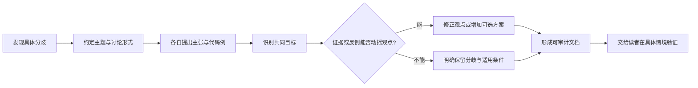
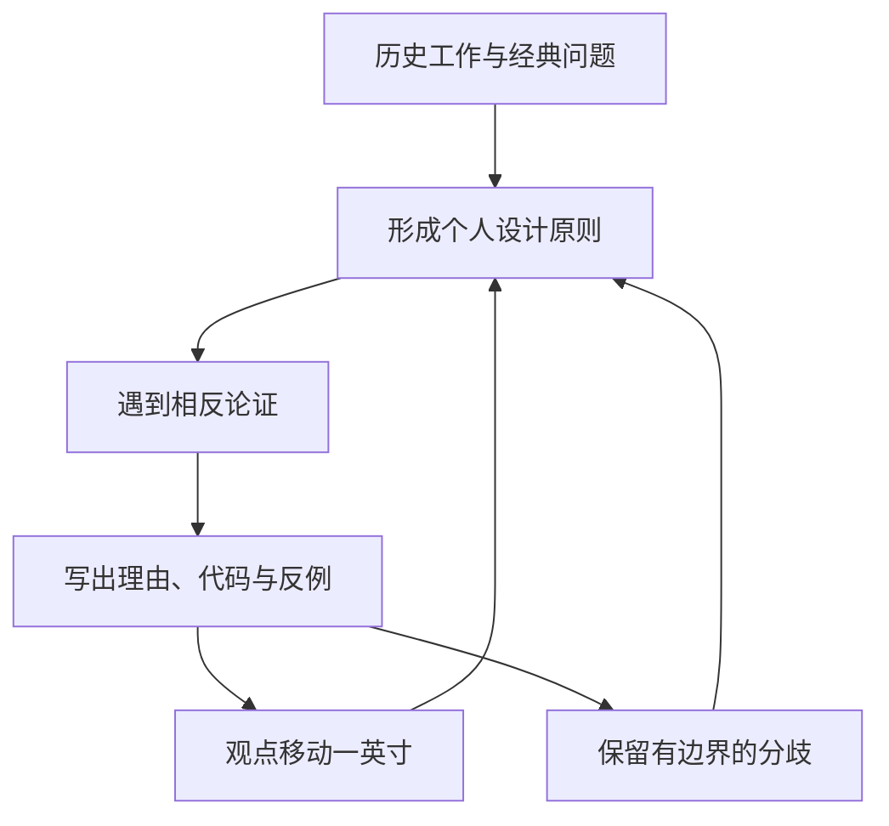

# 总结稿

[打开单页 HTML 总结](assets/bilibili-BV1yHhP6YENh-summary.html)

## 核心结论

这场对谈最有价值的不是判定《软件设计哲学》或《代码整洁之道》谁胜谁负，而是展示**如何让强分歧变成可检验、可修正的设计讨论**：把争论写下来，选出具体命题和代码例子，区分共同目标与策略差异，允许双方只移动“一英寸”，也允许保留分歧。[03:35–06:44][39:34–42:17]

## 书面辩论如何形成

- Book Overflow 最初邀请双方在线辩论，Robert Martin 建议改为书面形式；Ousterhout 后来认为书面往返让双方有时间推理、编写代码例子并删除无价值岔路。[03:35–06:15]
- 双方公开讨论集中在三个主题：**方法长度、注释、测试驱动开发（TDD）**。[12:03–13:43]
- 公开仓库确认讨论发生于 2024 年 9 月至 2025 年 2 月，并列出这三个主题：[APOSD vs Clean Code discussion](https://github.com/johnousterhout/aposd-vs-clean-code)。

## 三个可迁移的讨论原则

1. **减少认知负荷，但承认受众不同。** Ousterhout 主张尽量减少读者需要预先掌握的信息；Martin 认为紧密团队可共享更多背景，而开放受众应假设更少知识。双方在注释与背景假设上仍有距离。[34:43–38:54]
2. **把方法长度当权衡，不当教条。** Ousterhout 认为超短方法存在风险，Martin 偏好短方法；讨论后双方都报告了有限移动，但仍保留明显差异。[40:10–41:28]
3. **用反例和替代方案逼迫观点更新。** Martin 表示 Ousterhout 提出了一种他无法反驳的 TDD 方案，因此把它作为可选做法纳入第二版。[41:33–42:17]

## 深度思考与历史连续性

对谈还把软件设计放回思想史：Dijkstra 的结构化程序设计、Parnas 的模块分解、Tom DeMarco 的结构化分析与数据流图等，构成两位嘉宾观点形成的背景。[22:55–28:41] 他们担忧短内容使工程师获得宽而浅的意见，却缺少历史脉络与长时间推理。[29:42–33:56]

## 事实核查边界

- **书面讨论主题：确认。** 主仓库列出 Method Length、Comments、TDD，且记录讨论时间。[GitHub 主仓库](https://github.com/johnousterhout/aposd-vs-clean-code) [00:56]
- **纳入《Clean Code》第二版：确认当事人公开陈述。** 仓库首页说明 Martin 已把 Ousterhout 的若干想法及整份讨论整合进第二版；这里只确认公开陈述，不推断当前出版进度。[GitHub 主仓库](https://github.com/johnousterhout/aposd-vs-clean-code) [41:33]
- 长方法、深模块、注释和 TDD 的优劣属于设计立场，不能脱离代码、团队和变更成本简单判真。

## 观众讨论与补充

本次只有 3 条热门顶层候选和 1 条当前可访问弹幕，且不含嵌套回复，无法判断观众偏向哪一方。唯一有增量的评论提供另一 BVID、已核验的 GitHub 仓库和章节线索；其书籍关系已由事实核查确认到“仓库中的当事人陈述”层级。38:30–39:00 仅一条弹幕、burst=0，不构成热点。

# 辅助理解

## 辅助理解：把技术争论设计成学习系统

这是一场多人远程对谈，不是单人授课。真正的“产物”既包括观点，也包括讨论机制：从口头邀约转向书面往返，让双方能引用代码、反思措辞、删除岔路并保留可审计记录。[03:35–06:44]

## 三个争点不是三道选择题

### 方法长度

Martin 偏好短方法，Ousterhout 更警惕过度切碎造成跳转与隐藏整体意图。讨论后的结果不是统一阈值，而是双方承认了对方风险：短方法可能降低局部复杂度，也可能增加跨方法追踪成本。[12:03–13:43][40:40–41:28]

### 注释与读者背景

Ousterhout 把设计目标表述为减少读者必须装进脑中的信息；Martin 则区分紧密团队与开放受众，认为前者可共享更多背景。[34:43–38:54] 可执行的折中是：不要用注释复述代码，而要记录接口契约、非显然约束、权衡和“为什么不采用另一方案”。

### TDD

对谈没有把 TDD 简化为信仰测试。Martin 表示 Ousterhout 提出了一种他无法击穿的方案，因此愿意把它作为另一选项纳入书中 [41:33–42:17]。重要的是让测试顺序服务于设计反馈，而不是只争论标签。

## 思想来源为何重要

在 [22:55–28:41]，双方回顾 Dijkstra、Parnas、Tom DeMarco、数据流图、功能分解、设计契约等影响。画面只是嘉宾口述语境，不是方法优越性的证据；但它提醒我们：很多“新争论”已有几十年的概念积累。

## 从设计观点回到真实系统

后段提到 Homa、Linux 内核驱动等真实系统工作 [48:23–48:27]，但抽样画面只记录口述声明，没有提交链接，不能当作 upstream 完成证据。它在笔记中的作用是提醒：设计原则最终要经受真实接口、性能、维护与协作约束，而不能只在书名之间比较。

## 一份不伤害协作的辩论清单

1. 把“你错了”改写成可定位的主张、代码例和失败条件。
2. 先写共同目标：认知负荷、可维护性、缺陷反馈还是交付速度？
3. 区分团队内背景与开放受众，不假设一个策略适用于所有读者。
4. 记录哪部分观点改变、哪部分保留，以及各自适用条件。
5. 把自尊留在家里；胜利标准是文档变得更精确，而不是对方完全投降。[51:43–52:12]

## 观众讨论与补充

3 条热门候选主要是外部资料线索与中配需求，1 条当前可访问弹幕不足以分析立场。不能由这个样本判断哪套哲学更受欢迎；评论互动量也不是技术证据。

## 外部事实核验

### 声明 1（00:56）

- 视频陈述：John Ousterhout 与 Robert “Uncle Bob” Martin 进行过书面讨论，主题包括方法长度、注释和 TDD。
- 核验状态：已确认
- 核验结果：双方公开的主仓库说明讨论发生于 2024 年 9 月至 2025 年 2 月，并列出 Method Length、Comments、TDD 三个主题。
- 检索日期：2026-08-26
- 来源：
  - [APOSD vs Clean Code discussion](https://github.com/johnousterhout/aposd-vs-clean-code)（primary）

### 声明 2（41:33）

- 视频陈述：Uncle Bob 表示会把这次讨论和 John 的若干观点纳入《Clean Code》第二版。
- 核验状态：已确认
- 核验结果：公开讨论仓库首页由当事人写明：Bob 已将 John 的若干想法以及整份讨论文档整合进《Clean Code》第二版。这里只确认该公开陈述，不推断当前出版进度。
- 检索日期：2026-08-26
- 来源：
  - [APOSD vs Clean Code discussion](https://github.com/johnousterhout/aposd-vs-clean-code)（primary）

# Data

## 增强转写稿

[00:00] I tend to have pretty strong opinions at any given point in time, but I hope others will have to be the judge of whether this is really true. I hope that I would change my opinions when I encounter superior arguments. And I like having, I like having no holds barred arguments. I think that reasoned and informed disagreement is on the road to enlightenment.
[00:30] Hey there. Welcome to Book Overflow, the podcast for software engineers by software engineers, where every week we read one of the best technical books in the world in an effort to improve our craft.
[00:37] I am Carter Morgan, and I'm joined here as always by my cohost, Nathan Toups. How you doing, Nathan?
[00:41] Doing great. Hey, everybody.
[00:43] Well, we have something really special for you this week's folks. We've hinted to it in past episodes, but we had on the podcast both John Ousterhout and Robert Uncle Bob Martin, well, link it in the show notes.
[00:56] But if you haven't seen recently about maybe a couple of weeks ago, a month ago or so, they published a discussion between them, analyzing the differences between their different philosophies, John, a philosophy of software design and Bob clean code.
[01:11] Now we've had them both on the podcast separately and you'll find out in the interview that discussion kind of started with us and we introduced them and yeah, you'll hear the whole story throughout the podcast.
[01:23] But they were gracious enough after publishing the discussion to agree to come on to the podcast to talk about how it came to be, what it was like working together, and yeah, just really, really cool stuff.
[01:33] I mean, Nathan, what can our audience expect?
[01:36] Yeah, it was great. I highly recommend reading the paper before you listen to the podcast though. Don't let it stop you. We do recap some of it.
[01:47] Both of them came to the table with well-reasoned arguments on three main areas on how you build methods and functions, commenting, philosophy on commenting, and then also on test-driven development.
[02:00] So these are three topics that John Ousterhout had strong opinions about in this approach to philosophy of software design, and he was really happy to be able to debate Uncle Bob.
[02:10] They originally were going to do this on our podcast, but we couldn't get to an agreement of the format, and it turned out that I think this was actually a superior way.
[02:18] I think John brings this up is that they got time to reason about this and type out code examples and really debate it and discuss it, and then we got to review that with them.
[02:29] It was really nice, and I think the both of them came out of it really appreciating the other person's viewpoint, even if they strongly disagree on some of the stuff.
[02:37] I mean, these two are absolute titans in the industry. I think every one of us as software engineers have been affected by their opinions in one way or another.
[02:45] So this is really a very, very special moment, and I believe the only as of this recording instance of the two of them talking together publicly.
[02:56] So really this something special folks, we really hope you enjoy it.
[03:00] So please enjoy this discussion between Robert Uncle Bob Martin and John Ousterhout as they reflect their differences between their two competing coding philosophies.
[03:11] Well, thank you so much for joining us today, Bob and John.It's a pleasure to have you both back on again, but this time together. How are you guys doing?
[03:19] Doing great. Good. Good. Good. Well, we're like, we're excited to have you guys back. This is kind of funny because back in September or so we reached out to you guys and said, Hey, would you guys like to come on the podcast and we couldn't make it work out for various reasons,
[03:35] but I was browsing Reddit, like a couple weeks ago, and I saw someone have posted something on John's GitHub, and it was, to my surprise, a conversation between you two about the difference in your philosophies between clean code
[03:48] and a philosophy of software design. And I was like, and just it said, like, these are conversations that began in late 2024. I'm like, wait a minute, I think we introduced these guys.
[03:58] And so I was like, and so we reached back out and we're happy to that you guys both agreed to come back on because we're just kind of so curious about how all that went, what it was like working together.
[04:10] And I guess, yeah, maybe just help us understand, you know, we kind of left off with those last emails, but what motivated you guys to kind of keep the conversation going and, you know, to produce this document.
[04:23] Well, you're right, it is your fault. So, we had this initial contact back whenever was last fall, and we were thinking we would do a kind of an online debate with you all, and then actually Bob said no to that.
[04:40] He said, I don't think that'll work out very well. But I'd be happy to do a written one where we can take more time and plan through it. And I was actually pretty disappointed at the time because I was looking forward to having the debate.
[04:53] And then I grudgingly agreed to follow Bob's lead and see how it turned out. And it turned out he was completely right on the whole thing. Actually, it worked, I think way better in written form than it could possibly have worked.
[05:10] I would like to do it live in person because it gave us an opportunity to think through our ideas a little bit more, to explore things. Honestly, the documents that is published now, although it's still pretty long, is only a tiny fraction of our conversations.
[05:32] I'm curious, you can go back and look through all the various git revisions to see how much material we have deleted. We would kind of get in arguments and then just sort of go tit for tat, ktit for tat, wandering off into the weeds, which of course would have happened if we'd done this live as well.
[05:48] And then we eventually realized, actually, there's really nothing interesting in this discussion we just had. So we could delete that. I think about one of the, one of the things we really care about here, what are the big issues and, and you know what's Bob's opinion and what's my opinion and how are they different.
[06:01] So, this is an example where I think the written format just worked out really well. I just want to thank Bob for having refused the initial online discussion because I don't think it would have been as productive as what we ended up with.
[06:15] It was a great experience for me. John is great to work with. We agree on a lot of things. We disagree on a lot of things, but it was all extremely civil and, you know, maybe a couple of pointed jabs here and there, but, but all in good spirits, all in good fun.
[06:32] And I look back on the process and think, well, that was extremely rewarding to the extent that I've taken the entire conversation and it's the, it's published in the appendix.
[06:44] of the second edition of clean code. So, so, I'm, I'm very happy with the way things turned out.
[06:52] Well, I think what surprises me, you two are both very accomplished in your own rights. You are, you know, older. I think some people might think you're set in your ways.
[07:04] I kind of thought, well, I kind of thought like, I don't know, you've both read and successful books, you both have followings within the software engineering community.
[07:14] I might, if it were me, I might have just been like, yeah, whatever, I'm happy with what I got here. To me, it was really inspiring to see you two still say, well, no, let's, let's figure it out.
[07:23] Let's figure out where we differ. Let's figure out, you know, yeah, just where everything lines up. I guess my question is like, why bother?
[07:31] At your ages, I mean, I don't know, how do you feel about that, Bob? What motivates you to still, at this point in your career, want to hash these things out with, you know, fellow thinkers?
[07:42] When I wrote the book initially, Clean Code, it was an existential struggle. You know, who am I to write a book named Clean Code? And I was like, oh, come on, I can't do that. I can't tell people what to do.
[07:59] And then at some point I thought, well, if not me, who if not now when so I went ahead and wrote it and always with the idea that, you know, I could be really wrong about a lot of this stuff.
[08:13] And there have been plenty of people to tell me I'm wrong since then. But John came out with this book, Philosophy of Software, which I really like, Philosophy of Software Design, I really like that book.
[08:28] And then with the opportunity to do this debate and to do a written thing, I thought that could be really valuable for me, just from the point of view of learning someone from someone who's got a similar duration in experience that I do.
[08:48] Although I think our specific experiences are very different. And so I looked at it as a great opportunity for me to learn a whole bunch of stuff. And I did, I learned a whole bunch of stuff.
[09:03] I mean, how about you, John? I mean, what motivates you to still be engaging like this? Well, first of all, I guess I hate to admit it, but I guess it's fair to call me old now.Although, even that, I find a little bit irksome, but it's true.
[09:19] I think Nathan's old, so you know. But I hope people won't think of me as set in my ways. That would be, that would be a catastrophe to me. I hope I'm never so old that I become set in my ways. I like to think of myself as serially opinionated.
[09:36] I tend to have pretty strong opinions at any given point in time, but I hope others will have to be the judge of whether this is really true. I hope that I would change my opinions when I encounter superior arguments.
[09:49] I like having, I like having no holds barred arguments, because I think that reasoned and informed disagreement is on the road to enlightenment. You know, that if you can disagree with something, but do it in a very reasonable, informed way,
[10:07] not just sort of an insulting way, then you can learn from that. And by the way, when I wrote a philosophy of software design, I had many of the same kinds of insecurities that Bob talked about with clean code.
[10:22] I had my set of opinions that I had developed over my career, which I still feel fairly strongly about, for the most part. But I had no idea whether are these were the right opinions. I had, I tried to have reasoning in the book.
[10:39] You can read the book, you can see I tried to justify all the opinions, but how do I know that I'm actually right? And the answer I don't for sure, I just have my, my evidence and that's all I work from. But one of the reasons for writing the book was to try and attract differing views so I could see.
[10:55] Are these opinions right? Do they actually stand up when somebody attacks these? Can I actually defend them? So, I'm always interested in engaging with other people who have different points of views. And one of the things I wondered when I wrote the book also is, is it possible that in software design there can be multiple very different
[11:13] few points, maybe even conflicting approaches, which are in fact, both good ways to do software design, is it possible that there are. So far, all the evidence I've seen suggests no, I don't believe, I believe there is so far, but you know, but I'm still interested in hearing somebody else has a different view, I'd love to hear it.
[11:30] So, that was part of my motivation for wanting to have the discussion with Bob. That's great. Yeah, when I first read through it, I've read through it a couple of times now, I read through it one more time yesterday, just to be ready for this conversation.
[11:46] And what really struck me is that you cover significant ground in this. And, even though it is, both of you can have very strong opinions. It was very cordial. And at least that was the tone that I read when I was reading it.
[12:03] How did you settle on those three major topics that that are in the, that are in the discussion, I guess for the listener, if you haven't read this, or maybe you're a little rusty, the three major topics were a conversation about method length and the appropriateness of method length comments, and then a section on test driven development.
[12:25] I guess, I'll ask John, you can go first and then, and then I'd love to follow up. Yeah, so I think I picked those topics to start off the discussions that were three things I wanted to talk about because those are places where, you know, I've read clean code and where I disagree fairly strongly with the advice given in clean code.
[12:41] But I raised those because I wanted to try and talk through those conflicts.
[12:56] Yeah, so I wanted to do a follow up with with Bob on the three topics were these three topics that you were happy to discuss as well, or were there other topics that you wish you'd been able to explore.
[12:59] Those three topics are the three topics and John picked them out and and set the outline of the discussion.But if you go online and you look at criticisms of clean code, you will find those three topics scattered around the web everywhere.
[13:16] You know, method length, I like really short methods other people don't comments, you know, I don't like a lot of comments other people like a lot of comments.And then of course, there's test driven development, which has been a controversial topic for the last 25 years.
[13:32] So, those are the three, the big three.I'm not sure there's any other topic that rises to the level of those three.
[13:43] There, I actually had a longer list of topics where I disagree with clean code with those were the, those were the three biggies and for sake of trying to manage the length of the document which is already pretty significant.
[13:59] I'm excited, probably not, not worth bringing those up.Although it was interesting, is that, if you look at the, there was a discussion on on Reddit, and then discussion on hacker news about the about our document, what's interesting about that discussion is actually other people in the discussion raised all of the other issues that I thought about raising
[14:17] but didn't raise a sort of interesting that that the collective ideas of those groups actually cover everything we talked about and probably everything we thought about.
[14:28] You mentioned right feeling a little self conscious both of you when you set out to write you know clean code or philosophy of software design.
[14:41] I think that's something we felt when we started the podcast and both of you by the way we're so generous coming on the podcast the first time I think we had like 100 subscribers and both of you volunteered.
[14:51] We reached out and we're over at 10,000 now so it's been going great and as we've gained, you know, a little bit of, you know, notoriety.
[15:00] Because we kind of felt that way at the beginning like who are we who are we to like say we're going to read these books and talk about them or who are we to reach out to john Osterhout or Uncle Bob and ask him, hey, can we ask you some questions about your book.
[15:13] What is it you think, what is it that kind of got you over that hump, right, of thinking, I shouldn't do this, some, you know, I'm not qualified because I think a lot of software engineers can struggle with feeling similarly whether it might not be writing a book or starting a podcast but stepping up for a leadership role or applying to a new job or anything like that.
[15:36] I mean, Bob, what are your thoughts on all of that.It reminds me of the biblical book of judges, right, the every everyone did what was right in his own sight, that was the theme of that book and there was no king in Israel in those days and and people just kind of did whatever.
[15:58] And that's software.That's programming, especially programming in the current century, and the previous century, for that matter, we all just kind of do whatever.
[16:13] And for one person to tell another, you should do it this way, was impolite, because everybody was kind of a free agent, everybody, everybody could do anything.
[16:28] The years went by for me, I grew more and more frustrated looking at the code that I was seeing, especially when I became a consultant and had to look at lots of other code and I thought now wait a minute, there have to be some basic rules here, some basic ideas and I think I've got some kind of handle on that.
[16:49] And then it just came down to that famous statement, right, if not me, who if not now when, and I just made the decision, okay, I'm going to write this and let the chips fall where they may.
[17:02] I had no idea that it was going to be a really popular book, I had a really good idea that most people would hate it.
[17:10] And, you know, to some extent, that's correct.
[17:17] Great, John, I'd love a follow up on that too, as well, like what, what got you over the, the hump to.
[17:25] Well, so first of all, I'm not as polite as Uncle Bob, and so I've, you know, I have never been shy about speaking my mind on things.
[17:34] It's part of my, part of my life philosophy, I like engaging in, you can call it intellectual conflict, if you will, but sort of hard discussions, so I like, I like saying things that are a little bit outrageous to see how other people react to them to see,
[17:48] is this hold up, you know, can this withstand scrutiny or not, so, so I, I had less inhibitions to start with, but for me, the book really followed on after I taught a class, so the motivation for me was a lifelong love of writing software
[18:07] and doing software design and thinking about the right way to do it, it's just, it's always something that I've, you know, it's one of the things I live for, doing software design.
[18:15] And what really bugged me is that we don't teach it in any of our classes, there's basically no class anywhere in the world at any university, except for the one I developed at Stanford, that teaches software design.
[18:28] And that just kind of sat in my gut and, and bothered me for a decade or more.
[18:34] And then I started thinking about, well, who is going to teach this class because the problem is, most faculty don't code enough to even understand what software design, because you have to learn it through your own personal experience if there's no classes.
[18:46] So, you know, in most faculty, don't know how to code, don't really don't code much, don't know much about software design, but I've always written a lot of code, so I started thinking, well, if anybody has a chance of doing this, I probably have as good a chance as anybody who's teaching at any university, because I've written, you know, 300,000 lines of code in my career.
[19:05] And then I just find, what's the worst that could happen, you know, I teach this class and I completely crash and burn, the students hate it, nobody learns anything, and well, at least I tried.
[19:17] So, I, I just decided I'm going to try teaching the class, so I gave it a shot, and the students loved it was really as fabulous experience where you could see lights coming on and the students eyes over the course of the quarter they're changing how they think about software design.
[19:31] It was really big success. And then I started giving talks about the class, and people said, Well, you should write a book on this.
[19:38] And then so finally I had a sabbatical and I decided to write the book. So my, my path to the book was maybe a little bit less direct than Bob's, but, but I think it's the same idea that really feeling passionately about this topic and loving the topic, and wanting people to do it right, and thinking somebody's got to stand up and say these things that need to be said.
[20:00] So, I'll just take a chance the worst that could happen as I embarrass myself.
[20:07] That's great. So, you said over over 300,000 lines of code. Imagine traveling back in time, you're maybe 50,000 lines of code in, where there conclusions that you had reached in your like philosophy of software at that point that you wish you could go back and say, Hey, actually, there's a better way of doing this.
[20:28] Like, what have you learned on your path that maybe you were doing a bunch of and then you changed over time.
[20:40] That's a tough one.
[20:43] Because I, you know, I've occasionally thought, when did my ideas about software design start to emerge in my programming career. And I'm not sure they had really emerged very much when I was at the 50,000 line level.
[20:53] That would have been back when I was still a graduate student, I think, you know, working on my first and second operating systems, but not my third.
[21:01] And so, I didn't have, you know, I didn't have much to go by then, there were really didn't do code reviews back then those just weren't done.
[21:11] And so, and there was nobody to teach me, my advisor didn't really code, I had two different advisors and grad school, neither of them really coded much.
[21:20] And so, I was just figuring things out of myself having bad experiences and thinking there's got to be a better way to write this.
[21:27] But I don't think, I'm not really sure when my opinions about coding, so it might have, it might have taken, you know, could have taken 20 or 30 years really before I started having more concrete opinions about coding.
[21:40] And they didn't didn't really all pull them together until the first time I taught the class, which was 2015. So that was only about 10 years ago.
[21:47] And so, I'm curious, Bob, over your career, when did your ideas about design start to gel? Can you identify a specific time?
[21:55] Oh, yeah, I think I wrote my first paper on software design in 1972.
[22:06] And that would have made me 20 years old.
[22:09] And I was working at a company, we were writing an assembly language, and we had this.
[22:16] IBM System 7, and the IBM System 7 had this interesting instruction that allowed you to spawn threads, sort of.
[22:25] It saved registers, and it kind of squirreled things away, so it made it made it easy to create threads.
[22:32] And that really started my brain going out.
[22:35] Well, wait a minute, if you've got threads like this, and they can start to interleave, you could have really interesting problems.
[22:43] This is long before I knew about reentrancy or concurrent update issues.
[22:47] And I started writing about it, just just for myself, just writing papers.
[22:52] I never submitted the papers, I just wrote about them.
[22:55] Then I would, I started reading the works of Dijkstra.
[22:59] I read structured programming by Dijkstra, and I read a bunch of articles about that.
[23:03] And I thought that was so brilliant.
[23:05] The idea of structuring software in these lovely little recursive blocks that didn't have go-tos, right?
[23:11] Sequence selection and iteration.
[23:13] And I started writing about that.
[23:15] I designed a course, still like 1973 or something.
[23:19] I designed a course, and I gave it to the training director of our company.
[23:25] And he was ecstatic, because nobody had ever given him a course before.
[23:30] So they flew me out to St. Louis, and I gave the course to a bunch of programmers out there.
[23:34] I only taught it once.
[23:36] And then my boss was very mad at me because I had taken the time to write a course instead of working on the project I was supposed to be working on.
[23:46] But that's kind of been the way it's been for me.
[23:49] I stumble on ideas, and then I write about them, and I teach them, and I get a bunch of people in a room and yell at them.
[23:57] And then I get feedback.
[23:59] And that's occurred many, many times in my career over and over and over again.
[24:06] I have this compulsion to expound on my ideas and then get feedback.
[24:14] And I have the opinions that are currently in the clean code book, which is now 16 years old.
[24:23] It went through probably two revolutions.
[24:29] Had I written that book 10 years earlier, it would have been a very different book.
[24:33] Had I written it five years before that, it would have been a very different book then.
[24:37] And the second edition is a very different book.
[24:42] So, you know, a lot of turmoil, a lot of change, opinions shift, ideas get altered because of this constant exchange.
[24:52] The John was talking about, right?
[24:54] The debate of intellectual ideas, a good, rigorous debate where you're not quite at the point of hurting everybody's feelings, but you're getting close.
[25:05] Bob, I'm curious.You mentioned Dijkstra's work, which I also read as well.
[25:09] Did you read David Parnas' paper on the criteria to be used in decomposing systems into modules?
[25:15] Yes.
[25:16] It came out around, it was early 1970s.
[25:17] For me, that was the paper that really opened my eyes to software design.
[25:21] I would say if there was one thing that really triggered my thinking about software, it was that paper.
[25:26] I still consider that to me one of the two most important papers in software engineering in the world.
[25:31] I'm curious if you read that as well and if that impacted your thinking.
[25:37] Yeah, I did read that, but I read it probably a decade later.
[25:40] You know, we didn't have an internet in those days, so you kind of stumbled upon these things instead of getting them fed into your brain through the electronic media.
[25:50] So yeah, I stumbled across Parnas probably in the 80s and started reading a lot of his work.
[25:59] I think I've got a whole volume of his stuff up on the shelf up there.
[26:03] And there's a lot of other people too.
[26:06] One of the saddest things in our industry is that there is an enormous amount of extremely good work
[26:18] that most programmers have no knowledge of.
[26:27] I'm curious, so we've mentioned Dykstra and Parnas.
[26:31] My view is that there isn't a lot out there on software design.
[26:36] And that's one of the reasons I wrote APOSD.
[26:39] But I'm curious, are there other things that you consider kind of seminal writings on software design
[26:46] at the same level as Dykstra and Parnas?
[26:49] Oh, sure.
[26:51] I was extremely influenced by Tom DeMarco's work on structured analysis,
[26:57] dataflow diagrams, and the functional decomposition top level down.
[27:04] There's a secondary book that goes along with that by Mylar Paige Jones,
[27:08] where he talks about a way to take a data flow diagram, I mean large data flow diagram and recompose it as a set of modules.
[27:19] That was a very important book for me.
[27:22] Butch's work in the 90s in an attempt to get some handle on this object stuff that was starting to come out at the time.
[27:32] That was very impactful for me.
[27:36] Then you get into Bertrand Meyer and designed by contract and the way you can create interfaces that self correct each other.
[27:45] That was very impactful.
[27:47] I could go on and on on this topic.
[27:51] There's just been a wealth of very good ideas that have been published in books that for the most part modern programmers don't know exist.
[28:02] That's sad to me.
[28:07] If I teach a computer science course, I would start at the atom,
[28:15] and I would go all the way from Grace Hopper to John Bacchus to Dijkstra to Ken Thompson and Dennis Ritchie.
[28:26] I would walk through all these decisions and how they were made so that the students had this continuity of thought and then could apply that continuity of thought to their own work.
[28:41] I don't think that exists right now.
[28:45] You guys both bring up interesting points, hearing you reflect on some of these seminal works that you found really influential when forming your kind of philosophies.
[28:58] But you're talking about, like you said, books, you're talking about papers.
[29:01] These days, I think you're right, Bob, that not as many people read books or papers, a lot of us get, you know, a lot of our opinions and synthesize our worldviews from social media, right?
[29:14] I mean, there's tons and tons of people, all they do is talk about code on, I guess, X these days, right, or Reddit or hacker news or, you know, anything like that.
[29:25] What are your guys's thoughts on that change?
[29:29] What have we gained from entering a world like that?
[29:31] What have we lost from maybe not reading the quote unquote classics more?
[29:38] I'll start with you, John, and then Bob, I'd love to hear your opinion, too.
[29:42] The old tradeoff between breadth and depth.
[29:45] You know, I think with the Twitter world now, you can read information on a gazillion topics, you know, you're 20 miles wide and a quarter of an inch deep.
[29:55] I mostly, I mostly lament that because I personally, I really believe in the value of deep thinking, taking something and really thinking hard a long time about it.
[30:09] It's one of the great things about, I think, about doing a PhD.It's this time in your life where you can explore one topic in excruciating detail and really become the world's expert.
[30:17] It's a unique experience people have in their lives because you don't, you know, you won't have opportunities to do that.
[30:22] So, I worry a little bit that, you know, that that we're becoming too shallow.
[30:28] So we're going to have too many opinions backed by too little meaningful data.
[30:35] And what about you, Bob? Maybe I'm just too old to appreciate this.
[30:39] No, no, what do you think, Bob?
[30:42] Well, I agree with that viewpoint.
[30:45] The Internet obviously gives us this, this barrage of current information with no reflection on history at all.
[30:54] No, no even concept of where the ideas came from or why they came from or how they evolved.
[31:01] It's just current, current, current.This is how we do things right now, right now, right now.
[31:05] And everybody is all spun up into that, into that mindset.
[31:12] And by God, you can get a lot more done, a lot faster if you take an hour and reflect back on, you know, the work from 20 years ago or 30 years ago or 40 years ago.
[31:25] You can simplify an awful lot of stuff if you just go back there and take the long view and go, you know, somebody else has solved this problem a long time ago.
[31:37] The Design Patterns book.This is really, this, this gets into my craw.1995, these guys came up with the Design Patterns book, which was the restatement of a bunch of problems that had been solved over the last 30 years.
[31:51] And all they did was give them canonical names and canonical forms.
[31:56] And the attitude in today's media is that it's archaic, it's old, it's all about workarounds for bad languages, which is just dumb.
[32:06] It's just, it's just the dumbest point of view you can take on that particular book, but it's, it's just the way that these, the social media stuff is going.
[32:15] It's right now, it's all the time, right now, and you've got to talk like this, and it's got to be really loud.
[32:21] And you better have something over here that's moving in the background, because you can't focus on one thing, you have to be focusing on seven things all at the same time.
[32:29] I'm such a stickler with TV, I hate the idea of like, go talk about, go, it's a second screen show, like, if it's a second screen show, it's not a show at all.
[32:37] And like, I'm really big, I'm like, put your phone down, enjoy, it's a visual medium, a pre, you know, if you're not going to appreciate it, then don't watch it.
[32:46] I mean, we're biased here on the podcast, because that was our thought when starting the podcast too.
[32:50] I think it's even like our tagline on the website, which is we live in a world of short form content, you know, and in that world, it's important to engage with long form ideas.
[33:00] And we have been shocked doing the podcast, how many books we read.
[33:05] John, well, both of yours, Bob, we read Clean Coder, which was more kind of about professional conduct, and John, we read yours, which is more about software design.
[33:15] And I was shocked at how many things we would read in both of those books, that like surface level, I was kind of like, yeah, yeah, I understand this concept, like, you know, maybe I should skip this chapter or whatever.
[33:24] But then the more time you spend with it, and again, this is just reading through a couple chapters, this isn't writing a book, or like you said, John, like doing a PhD or something.
[33:33] I was surprised how much I kind of had to interrogate my own assumptions.
[33:37] And it's nice because you either realize, maybe I didn't understand this as well as I thought I did, or you realize, well, actually maybe I don't support this idea as much.
[33:48] Or a lot of times the outcome is just, I didn't change my mind, but I have a much better understanding of why I believe what I believe.
[33:56] And you can't get that from a tweet.
[33:58] To get back to the debate, I think there's some juicy stuff in here that I wanted to follow up on.
[34:04] So, let me, one of them, there seemed to be like an aesthetic that I think both of you sort of danced around on.
[34:14] I think, John, you mentioned I of the reader when talking about complexity.
[34:21] I would, I guess my question is like, how should developers account for the different backgrounds that maybe the other engineers that they're collaborating with might bring to the table when you're designing code.
[34:37] Is that something that you should consider when you're designing code of like, who's the audience that you're collaborating with.
[34:43] Well, sort of, but it keys back into the whole issue of cognitive load.
[34:49] So, and my view is that one of the most important things you're trying to do in designing code is to reduce the amount of information somebody has to have in their mind in order to work with that code.
[35:02] And so, when you talk about different backgrounds, I think what you're saying is that some people are already experts in some area.
[35:09] Others are not experts, that is, they already have this information in their mind.So, what you'd like to do is to write your code such that you just don't need to have that in your mind to minimize that.
[35:20] So, if you're doing good design, I would argue that the code will be readable and workable by a large number of people with different backgrounds because you've reduced the number of assumptions and expectations that you've placed on the reader.
[35:34] Yeah, that's great.That makes sense.And I know that the two of you have different approaches.Bob,what would your philosophy or approach be to that as far as like thinking about, you know, I have the reader in your approach?
[35:51] Well, sometimes you know exactly who is going to be reading your code.I mean, you're working inside a team.The code is private.It's not going to ever get out of the company.
[36:02] There's maybe three or four people who are going to be interacting with this code and even if one of them quits, another one's going to come in and absorb the same background.
[36:11] In which case, you've got a fair bit of license.You know, you can put into your head the mental model of the people who will be reading this code and then you can trust that they'll be able to understand what you're doing.
[36:27] On the other hand, sometimes you're writing code that has a wide open audience and then the rules are really different.
[36:34] And you have to take a step way, way back and say, okay, my audience knows nothing.
[36:42] They know the language and that's about it.And I'm going to have to tread very carefully and change my viewpoint from a professor to a third grade teacher.
[36:56] And that's the way I would look at that.
[37:00] Now, in my career, I've been very fortunate to have both of those situations that I've had to deal with.
[37:11] I've worked in extremely tight-knit teams where the technical knowledge was really well known in everybody's heads and it's a very comfortable situation to be in.And I've also had to write software for an open audience that's just wide open.
[37:31] And then it's a little harder and it's a little more thought you have to put into how you're going to get the message across.
[37:42] In both cases, you are writing for other people.You are not writing for the machine.
[37:50] The machine is an observer, a bystander.The machine has to understand what you're saying, but your job as a programmer is to make other programmers understand.
[38:05] Now, this is an area where I think Bob and I disagreed, and that Bob is more comfortable assuming more background on the part of readers, at least in some situations.And one of the reasons why Bob argued, he didn't need comments, a lot of situations is because he thought,
[38:21] Well, this code is only going to be looked at by a tight-knit team.Everybody knows everything that's going on.No need to describe it.Whereas, my opinion is that even in those groups, if you're working on a system of any size, people can't keep it all in their memory.
[38:34] And now maybe this is a reflection of my age and infirmity, but I find within a few months of writing something, I've forgotten what I wrote myself.
[38:42] So, my opinion is that you should, if possible, try to never assume any significant expertise on the part of the reader.But that's an area where I think we maybe disagree a bit.
[38:54] Yeah, that was well specified in the document.We had that debate, and neither of us moved ground on it.
[39:03] I've thought a lot about that, since reading your book, John, that idea of cognitive load, I think sometimes we, as engineers, think that's the job, right?
[39:15] The job is to get so good at storing all of this context in our head all of the time.And then you don't realize, well, maybe that's not the job.
[39:27] Maybe the job is to write code in such a way where you don't have to constantly store all that information in your head.
[39:34] I mean, when you guys, like you said, you have this comment, or you have this discussion, you don't really move ground either way.
[39:41] I get the impression, neither of you are particularly bothered by that, right?You both, you know, just agree to disagree.
[39:46] That can be challenging for developers sometimes, right?Sometimes developers feel like they want to win, right?
[39:51] Or they, you know, they want their way to, you know, prevail.Is that something you struggled with earlier in your careers?
[39:58] Is that something you've always been good at?And, you know, just these days, how do you, what advice would you have to developers who maybe aren't able to kind of agree to disagree?
[40:10] Well, I should start by saying, I'm a very competitive person.I don't ever like to lose.So, but, you know, I, I recommend, I recognize that disagreements exist.
[40:23] The world, I'm not going to convince everybody in the world that my opinions are right on every issue.
[40:29] So, I'm actually one of my challenges for the discussion was to see, are there areas in which I can convince Bob to change his mind?
[40:36] Or are we going to end up where, at the end of the day, we all have exactly the same views?
[40:40] And, actually, I think, I think there are areas where Bob's opinions softened, or at least, now, maybe they'd already soften for what was in clean code, but, but they seem a little bit different to me,
[40:52] like on the area of the small methods, I think Bob has maybe is a little bit more aware of the risks of having super small methods than at least the original version of clean code did.
[41:02] And, actually, my opinions have changed at least a bit, also, in that, honestly, I'm finding more cases where I am comfortable chopping up larger methods into smaller methods than I think I would have if we hadn't had our discussion.
[41:18] Now, I'm nowhere near where Bob is on this.We're still, I mean, you know, we're, we're miles apart, but rather than being 10 miles apart, maybe we're only nine or nine and a half miles apart now.
[41:28] And, I feel like, actually, I have shifted a little bit in his direction.
[41:33] I have certainly moved as well, and I've put this into the second edition of clean code, and in several cases, I've credited you, John, for these ideas.
[41:43] So, my views on test-driven development, for example, you came up with a scheme that I hadn't thought of before, and I couldn't shoot holes in it.
[41:56] So, I had to think about it for a long time and realized, okay, maybe it's not the way I'm going to do it all the time, but there doesn't seem to be anything I can complain about it.
[42:11] And so, you know, I put that in the book as well, said, okay, this is another option, you can, you could do it this way.
[42:17] So, yeah, the discussion definitely moved me on certain opinions, and I'll go along with John there, you know, move me an inch, not a mile, but an inch is good, you know, you want to move an inch if you can move an inch.
[42:32] So, thank you, John.
[42:38] This is great, I was actually worried when I started reading about the Prime Generator, I was like, oh no, is this going to be like a straw man, you know, we're basically debating some code that wasn't necessarily representative,
[42:55] but it turned into something that was really cool.It was interesting to see both of you reimplement this with your viewpoint on what good composition was,
[43:05] and reasoning on why.
[43:08] And I really appreciate it, like, again, I went from this place where I'm like, oh boy, like this is just going to be tough to read to being like once we're in like the second section, I think.
[43:17] It was really cool to see the back and forth of like, oh, well, this is why I made this approach, or here's why short variable names, but more comments are better, and it felt like,
[43:28] like, maybe I'm doing this at like a, you know, a lower level where I've had debates like this in, you know, code reviews, but it was really cool to see like two,
[43:39] you know, two sort of personalities in the world where, you know, both of your books come up in conversation, like all the time when people are talking about things or why you're trying to like,
[43:49] use, oh, well, in this book, it says to do it this way, and this is why, like, they'll defend their arguments with this.And so it was cool to see the two of you duke it out, like, I will say that was like a very, very fun.
[44:02] What I wanted to ask is, like, I know that Bob, you mentioned that, you know, John's views have actually influenced a second edition of the book that you're writing.
[44:13] John, I have a question for you, which is, do you think any of this debate is going to end up coming up in your, in your class at Stanford, as far as like talking about approaches and,
[44:26] you know, maybe pointing people to read, read this if they maybe are, you know, thinking about things differently.
[44:32] Well, it probably would accept that I'm almost certainly going to retire at the end of this year and so I've probably taught the class for the last time unfortunately.
[44:43] Oh, man.
[44:44] Actually, one of my, one of the sad things about retirement is that I won't be teaching that class anymore because now we'll be back to a point where there are no classes in the world on software design, which is kind of sad.
[44:55] I would love it if somebody else, other people, other schools would start teaching that class, but so far, no takes on that.
[45:04] By the way, when I retire, I won't stop coding.
[45:07] One of the reasons for retirement is so I have more time to code.
[45:10] So, I won't be going away in that respect, but I, but I won't be teaching the class anymore.
[45:16] But if I was, I would definitely assign that discussion for students to read and we'd have an in class discussion about it.
[45:23] You know, and I, and I would probably encourage students, I'd make, maybe make students take ones, choose students have to take one side or the other and argue with each other about that.
[45:32] I think it would be a really fun discussion to, to have students have one of the things about the class is that it's a, it's not a lecture style class as much more of a studio style class was maybe three or four lectures at the beginning of the quarter where I kind of set the stage and everything after that is, it's all discussions.
[45:49] So, I think that would have made a really interesting part of the class.
[45:54] So, what's next on the horizon for the both of you.
[45:57] I mean, that's exciting for you, John retiring.
[46:00] I know Bob, you're working on second edition of clean code.
[46:03] I want to say Bob, weren't you working on a book?
[46:06] You talked about kind of detailing some of the biggest figures in computer history from like inception to now.
[46:12] Was there something like that?
[46:14] Here it is.
[46:16] There we go.
[46:17] We programmers, I remember.
[46:19] That's awesome.
[46:21] Well, I mean, so is that, I mean, both of you.
[46:23] So, I guess maybe I'll start with you, Bob.
[46:25] I mean, is that kind of what's consuming your time right now?
[46:27] Have you moved on to other things or what's going on?
[46:30] Second edition of clean code is what's taking my time right now.
[46:35] That's really close.
[46:37] I'm going to submit the final manuscript at the end of the month and the book should probably be ready in August.
[46:45] I have no plans after that.
[46:48] Now, I have said that every year for the last 10 years.
[46:53] So, I don't know what's coming, something, but I don't know what it is right now.
[46:59] I may actually just take a little bit of time and fly my airplane around and see what else I can think of.
[47:09] And how about you, Johnny?
[47:10] Well, congrats on the retirement, by the way.
[47:13] I mean, do you say you're going to keep coding?
[47:16] Are you hoping to keep writing?
[47:18] Is there a second edition of a philosophy of software design in the future or does anything else?
[47:23] The great thing about being a professor is you can fractionally retire.
[47:28] I'll become professor emeritus, which means I keep my office at Stanford.
[47:32] I'll probably keep coming in pretty much every day of the week like I'm doing right now.
[47:36] And you do the things you want and then you don't have to do the things about being a faculty member that you don't like, like raising research funding.
[47:42] So, my least favorite activity as a professor.
[47:45] So, no more of that.
[47:46] So, I basically reverted back to being an individual contributor again.
[47:50] And the main thing I'm doing is I'm working on a new transport protocol called Homa,
[47:54] which I believe should replace TCP for most uses in data centers for large-scale applications.
[48:01] Now, actually doing that is easier said than done.
[48:05] But the start-off is a research project for one of my graduate students.
[48:09] It was his PhD dissertation and the results were so amazing.
[48:12] Really just completely exceeded my expectations that I've made it my personal goal to see if we can actually get it into widespread use.
[48:19] So, I've personally developed a driver for it that runs in the Linux kernel.
[48:23] In fact, right now, I'm in the process of upstreaming that into the Linux kernel sources.
[48:27] So, I'm going through the code view process getting beat up on by the Linux developers.
[48:32] By the way, totally fairly beat up.
[48:34] They point out all sorts of problems that I wasn't aware of.
[48:37] And so, I'll probably continue working on that for a while until either it succeeds or I figure out why it can't.
[48:42] And then, there'll be other things after that, I'm sure.
[48:44] But I'll probably be doing, you know, more coding stuff.
[48:51] That's so cool.
[48:52] I actually, I've started tracking Homa.
[48:55] After you, when we interviewed you the first time,
[48:59] you had mentioned that you were doing Linux kernel work.
[49:04] And that one of the areas that you, you know, a lot of contribution would be helpful is better comments and better stuff in that area.
[49:12] And so, that actually kicked off.I'm like, well, what is he working on?
[49:15] And so, I think I noticed on Hacker news or something Homa had popped up.
[49:19] And I was delighted to see that your name had been associated with that.
[49:24] I'm excited.
[49:25] I mean, my background is the systems administration and SRE work.
[49:29] And so, data center performance is something like with the bits flowing over the wire really matters to me.
[49:35] And so, I was like, I really hope this gets traction.That sounds really cool.
[49:41] Well, thank you both so much for coming on.
[49:43] We have jokes, but I think we're going to do it.
[49:45] We are going to be submitting a pull request to the discussion repository to get some sort of credit.
[49:52] We can attach a link to this conversation about it.I think that would be awesome.
[49:59] And again, just so great to have you guys on.It really is like.
[50:05] I remember reading once, I wish I could find it, but someone on Twitter posted, it was just like a little blog post.
[50:10] But they kind of said the title of the blog post was how to be useful.
[50:13] And I remember two steps really stood out to me was have strong opinions and become famous.
[50:20] And they're basically saying, if you have strong opinions, you either sway people towards your opinion,
[50:25] or you give someone that they become more clarified and they're thinking against your opinion.
[50:30] And they say by becoming famous, you can spread your ideas, right?
[50:33] And you two, I think exemplify that to a T, at least within, you know, the software engineering world.
[50:39] So, I guess, thank you so much for being useful.
[50:43] Thank you for freely sharing your ideas, not just on this podcast, but through your books and through the discussion.
[50:49] You guys published.And yeah, we just can't thank you guys enough for coming on.
[50:53] Do you guys have any closing thoughts before we wrap up and leave our audience.
[50:56] Well, thank you for inviting us to be on your podcast, cast both individually and then together that kind of kicked off the whole discussion.
[51:05] I've been actually hoping to have a debate with Bob for years.
[51:09] I was because I had these disagreements with clean code kind of percolating in my mind.
[51:12] And you guys facilitated that.
[51:14] And so, we got to have the debate and I hope that the results of that people will consider productive and useful.
[51:23] And I'm not sure I can say that any better than John did.
[51:26] Thank you guys for pulling us together.
[51:28] It turned out to be a great exercise for me.
[51:33] I learned a lot.
[51:34] I'm happy with the end result.
[51:37] And it was a great pleasure to engage intellectually with somebody like you, John.
[51:43] Thank you.And likewise, I like having no holds barred technical discussions where the key thing is leave your ego at home.
[51:54] You know, other people can say things that may be completely conflict with your opinions.
[51:59] You don't take it personally.It's just a fun intellectual argument to see whose ideas can withstand scrutiny.
[52:05] And so, the discussion really was kind of perfect.
[52:09] No holds barred technical discussion that I really enjoy having.
[52:12] And I think that those kinds of discussions tend to produce useful results.
[52:16] And thank you both for the street cred for us.
[52:19] I've had it happen a couple of times with co-workers.
[52:21] They brought up your discussion, like, "Oh yeah, I was reading on Reddit."
[52:24] And I said like, "Oh, is that the Uncle Bob John Ousterhout thing?"
[52:27] They're like, "Yeah, I'm like, oh yeah, I think that's my fault."
[52:31] It obviously had an impact, though.
[52:34] We actually recently had the creator of HTMX, who's like big into hypermedia, JavaScript minimalism, Carson Gross.
[52:41] And we were just having a conversation.
[52:42] And he was like, "Oh yeah, there's this debate between Jon Osterhout and Uncle Bob."
[52:47] And he just brought it up in the interview.
[52:49] And I was like, "This is cool."
[52:50] I'm happy that this is making people's wheels turn on thinking about this stuff.
[52:55] Because I think no matter which conclusion you reach on which style is better,
[53:00] being mindful about it is so important, right?
[53:03] Spending more time thinking about why you're building stuff the way you build it is so cool.
[53:08] Well, thanks again, both of you.
[53:11] Really such a pleasure to have you on.
[53:12] And thank you listeners for tuning in.
[53:14] You can always find us at bookoverflow.io.
[53:17] That's our website.
[53:18] You can contact us at contact@bookoverflow.io.
[53:21] I'm on Twitter or X or whatever you call it @cardermorgan.
[53:24] The podcast is the @bookoverflow pod.
[53:26] And Nathan does his work with Functionally Imperative, his newsletter at functionallyimperative.com.
[53:31] And Bob and Jon, thank you so much for coming on.
[53:34] It really, it could have been more of a pleasure for both of us.
[53:37] Thank you.
[53:38] Fun talk.
[53:39] All right, see you later, folks.
[53:41] All right.

## 原始转写稿

[00:00] 我 tend to have pretty strong opinions at any given point in time, but I hope others will have to be the judge of whether this is really true. I hope that I would change my opinions when I encounter superior arguments. And I like having, I like having no holds barred arguments. I think that reasoned and informed disagreement is that's on the road to enlightenment.
[00:30] Hey there. Welcome to Book Overflows, the podcast for software engineers by software engineers, where every week we read one of the best technical books in the world in an effort to improve our craft.
[00:37] I am Carter Morgan, and I'm joined here as always by my cohost, Nathan Tubbs. How you doing, Nathan?
[00:41] Doing great. Hey, everybody.
[00:43] Well, we have something really special for you this week's folks. We've hinted to it in past episodes, but we had on the podcast both John Osterhoutt and Robert Uncle Bob Martin, well, link it in the show notes.
[00:56] But if you haven't seen recently about maybe a couple of weeks ago, a month ago or so, they published a discussion between them, analyzing the differences between their different philosophies, John, a philosophy of software design and Bob clean code.
[01:11] Now we've had them both on the podcast separately and you'll find out in the interview that discussion kind of started with us and we introduced them and yeah, you'll hear the whole story throughout the podcast.
[01:23] But they were gracious enough after publishing the discussion to agree to come on to the podcast to talk about how it came to be, what it was like working together, and yeah, just really, really cool stuff.
[01:33] I mean, Nathan, what can our audience expect?
[01:36] Yeah, it was great. I highly recommend reading the paper before you listen to the podcast though. Don't let it stop you. We do recap some of it.
[01:47] Both of them came to the table with well-reasoned arguments on three main areas on how you build methods and functions, commenting, philosophy on commenting, and then also on test-driven development.
[02:00] So these are three topics that John Osterhoutt had strong opinions about in this approach to philosophy of software design, and he was really happy to be able to debate Uncle Bob.
[02:10] They originally were going to do this on our podcast, but we couldn't get to an agreement of the format, and it turned out that I think this was actually a superior way.
[02:18] I think John brings this up is that they got time to reason about this and type out code examples and really debate it and discuss it, and then we got to review that with them.
[02:29] It was really nice, and I think the both of them came out of it really appreciating the other person's viewpoint, even if they strongly disagree on some of the stuff.
[02:37] I mean, these two are absolute titans in the industry. I think every one of us as software engineers have been affected by their opinions in one way or another.
[02:45] So this is really a very, very special moment, and I believe the only as of this recording instance of the two of them talking together publicly.
[02:56] So really this something special folks, we really hope you enjoy it.
[03:00] So please enjoy this discussion between Robert Uncle Bob Martin and John Osterhout as they reflect their differences between their two competing coding philosophies.
[03:11] Well, thank you so much for joining us today, Bob and John.It's a pleasure to have you both back on again, but this time together. How are you guys doing?
[03:19] Doing great. Good. Good. Good. Well, we're like, we're excited to have you guys back. This is kind of funny because back in September or so we reached out to you guys and said, Hey, would you guys like to come on the podcast and we couldn't make it work out for various reasons,
[03:35] but I was browsing Reddit, like a couple weeks ago, and I saw someone have posted something on John's GitHub, and it was, to my surprise, a conversation between you two about the difference in your philosophies between clean code
[03:48] and a philosophy of software design. And I was like, and just it said, like, these are conversations that began in late 2024. I'm like, wait a minute, I think we introduced these guys.
[03:58] And so I was like, and so we reached back out and we're happy to that you guys both agreed to come back on because we're just kind of so curious about how all that went, what it was like working together.
[04:10] And I guess, yeah, maybe just help us understand, you know, we kind of left off with those last emails, but what motivated you guys to kind of keep the conversation going and, you know, to produce this document.
[04:23] Well, you're right, it is your fault. So, we had this initial contact back whenever was last fall, and we were thinking we would do a kind of an online debate with you all, and then actually Bob said no to that.
[04:40] He said, I don't think that'll work out very well. But I'd be happy to do a written one where we can take more time and plan through it. And I was actually pretty disappointed at the time because I was looking forward to having the debate.
[04:53] And then I grudgingly agreed to follow Bob's lead and see how it turned out. And it turned out he was completely right on the whole thing. Actually, it worked, I think way better in written form than it could possibly have worked.
[05:10] I would like to do it live in person because it gave us an opportunity to think through our ideas a little bit more, to explore things. Honestly, the documents that is published now, although it's still pretty long, is only a tiny fraction of our conversations.
[05:32] I'm curious, you can go back and look through all the various git revisions to see how much material we have deleted. We would kind of get in arguments and then just sort of go tit for tat, knit for nat, wandering off into the weeds, which of course would have happened if we'd done this live as well.
[05:48] And then we eventually realized, actually, there's really nothing interesting in this discussion we just had. So we could delete that. I think about one of the, one of the things we really care about here, what are the big issues and, and you know what's Bob's opinion and what's my opinion and how are they different.
[06:01] So, this is an example where I think the written format just worked out really well. I just want to thank Bob for having refused the initial online discussion because I don't think it would have been as productive as what we ended up with.
[06:15] It was a great experience for me. John is great to work with. We agree on a lot of things. We disagree on a lot of things, but it was all extremely civil and, you know, maybe a couple of pointed jabs here and there, but, but all in good spirits, all in good fun.
[06:32] And I look back on the process and think, well, that was extremely rewarding to the extent that I've taken the entire conversation and it's the, it's published in the appendix.
[06:44] of the second edition of clean code. So, so, I'm, I'm very happy with the way things turned out.
[06:52] Well, I think what surprises me, you two are both very accomplished in your own rights. You are, you know, older. I think some people might think you're set in your ways.
[07:04] I kind of thought, well, I kind of thought like, I don't know, you've both read and successful books, you both have followings within the software engineering community.
[07:14] I might, if it were me, I might have just been like, yeah, whatever, I'm happy with what I got here. To me, it was really inspiring to see you two still say, well, no, let's, let's figure it out.
[07:23] Let's figure out where we differ. Let's figure out, you know, yeah, just where everything lines up. I guess my question is like, why bother?
[07:31] At your ages, I mean, I don't know, how do you feel about that, Bob? What motivates you to still, at this point in your career, want to hash these things out with, you know, fellow thinkers?
[07:42] When I wrote the book initially, Clean Code, it was an existential struggle. You know, who am I to write a book named Clean Code? And I was like, oh, come on, I can't do that. I can't tell people what to do.
[07:59] And then at some point I thought, well, if not me, who if not now when so I went ahead and wrote it and always with the idea that, you know, I could be really wrong about a lot of this stuff.
[08:13] And there have been plenty of people to tell me I'm wrong since then. But John came out with this book, Philosophy of Software, which I really like, Philosophy of Software Design, I really like that book.
[08:28] And then with the opportunity to do this debate and to do a written thing, I thought that could be really valuable for me, just from the point of view of learning someone from someone who's got a similar duration in experience that I do.
[08:48] Although I think our specific experiences are very different. And so I looked at it as a great opportunity for me to learn a whole bunch of stuff. And I did, I learned a whole bunch of stuff.
[09:03] I mean, how about you, John? I mean, what motivates you to still be engaging like this? Well, first of all, I guess I hate to admit it, but I guess it's fair to call me old now.Although, even that, I find a little bit irksome, but it's true.
[09:19] I think Nathan's old, so you know. But I hope people won't think of me as set in my ways. That would be, that would be a catastrophe to me. I hope I'm never so old that I become set in my ways. I like to think of myself as serially opinionated.
[09:36] I tend to have pretty strong opinions at any given point in time, but I hope others will have to be the judge of whether this is really true. I hope that I would change my opinions when I encounter superior arguments.
[09:49] I like having, I like having no holds barred arguments, because I think that reasoned and informed disagreement is that's on the road to enlightenment. You know, that if you can disagree with something, but do it in a very reasonable, informed way,
[10:07] not just sort of an insulting way, then you can learn from that. And by the way, when I wrote a philosophy of software design, I had many of the same kinds of insecurities that Bob talked about with clean code.
[10:22] I had my set of opinions that I had developed over my career, which I still feel fairly strongly about, for the most part. But I had no idea whether are these were the right opinions. I had, I tried to have reasoning in the book.
[10:39] You can read the book, you can see I tried to justify all the opinions, but how do I know that I'm actually right? And the answer I don't for sure, I just have my, my evidence and that's all I work from. But one of the reasons for writing the book was to try and attract differing views so I could see.
[10:55] Are these opinions right? Do they actually stand up when somebody attacks these? Can I actually defend them? So, I'm always interested in engaging with other people who have different points of views. And one of the things I wondered when I wrote the book also is, is it possible that in software design there can be multiple very different
[11:13] few points, maybe even conflicting approaches, which are in fact, both good ways to do software design, is it possible that there are. So far, all the evidence I've seen suggests no, I don't believe, I believe there is so far, but you know, but I'm still interested in hearing somebody else has a different view, I'd love to hear it.
[11:30] So, that was part of my motivation for wanting to have the discussion with Bob. That's great. Yeah, when I first read through it, I've read through it a couple of times now, I read through it one more time yesterday, just to be ready for this conversation.
[11:46] And what really struck me is that you cover significant ground in this. And, even though it is, both of you can have very strong opinions. It was very cordial. And at least that was the tone that I read when I was reading it.
[12:03] How did you settle on those three major topics that that are in the, that are in the discussion, I guess for the listener, if you haven't read this, or maybe you're a little rusty, the three major topics were a conversation about method length and the appropriateness of method length comments, and then a section on test driven development.
[12:25] I guess, I'll ask John, you can go first and then, and then I'd love to follow up. Yeah, so I think I picked those topics to start off the discussions that were three things I wanted to talk about because those are places where, you know, I've read clean code and where I disagree fairly strongly with the advice given in clean code.
[12:41] But I raised those because I wanted to try and talk through those conflicts.
[12:56] Yeah, so I wanted to do a follow up with with Bob on the three topics were these three topics that you were happy to discuss as well, or were there other topics that you wish you'd been able to explore.
[12:59] Those three topics are the three topics and John picked them out and and set the outline of the discussion.But if you go online and you look at criticisms of clean code, you will find those three topics scattered around the web everywhere.
[13:16] You know, method length, I like really short methods other people don't comments, you know, I don't like a lot of comments other people like a lot of comments.And then of course, there's test driven development, which has been a controversial topic for the last 25 years.
[13:32] So, those are the three, the big three.I'm not sure there's any other topic that rises to the level of those three.
[13:43] There, I actually had a longer list of topics where I disagree with clean code with those were the, those were the three biggies and for sake of trying to manage the length of the document which is already pretty significant.
[13:59] I'm excited, probably not, not worth bringing those up.Although it was interesting, is that, if you look at the, there was a discussion on on Reddit, and then discussion on hacker news about the about our document, what's interesting about that discussion is actually other people in the discussion raised all of the other issues that I thought about raising
[14:17] but didn't raise a sort of interesting that that the collective ideas of those groups actually cover everything we talked about and probably everything we thought about.
[14:28] You mentioned right feeling a little self conscious both of you when you set out to write you know clean code or philosophy of software design.
[14:41] I think that's something we felt when we started the podcast and both of you by the way we're so generous coming on the podcast the first time I think we had like 100 subscribers and both of you volunteered.
[14:51] We reached out and we're over at 10,000 now so it's been going great and as we've gained, you know, a little bit of, you know, notoriety.
[15:00] Because we kind of felt that way at the beginning like who are we who are we to like say we're going to read these books and talk about them or who are we to reach out to john Osterhout or Uncle Bob and ask him, hey, can we ask you some questions about your book.
[15:13] What is it you think, what is it that kind of got you over that hump, right, of thinking, I shouldn't do this, some, you know, I'm not qualified because I think a lot of software engineers can struggle with feeling similarly whether it might not be writing a book or starting a podcast but stepping up for a leadership role or applying to a new job or anything like that.
[15:36] I mean, Bob, what are your thoughts on all of that.It reminds me of the biblical book of judges, right, the every everyone did what was right in his own site, that was the theme of that book and there was no king in Israel in those days and and people just kind of did whatever.
[15:58] And that's software.That's programming, especially programming in the current century, and the previous century, for that matter, we all just kind of do whatever.
[16:13] And for one person to tell another, you should do it this way, was impolite, because everybody was kind of a free agent, everybody, everybody could do anything.
[16:28] The years went by for me, I grew more and more frustrated looking at the code that I was seeing, especially when I became a consultant and had to look at lots of other code and I thought now wait a minute, there have to be some basic rules here, some basic ideas and I think I've got some kind of handle on that.
[16:49] And then it just came down to that famous statement, right, if not me, who if not now when, and I just made the decision, okay, I'm going to write this and let the chips fall where they may.
[17:02] I had no idea that it was going to be a really popular book, I had a really good idea that most people would hate it.
[17:10] And, you know, to some extent, that's correct.
[17:17] Great, John, I'd love a follow up on that too, as well, like what, what got you over the, the hump to.
[17:25] Well, so first of all, I'm not as polite as Uncle Bob, and so I've, you know, I have never been shy about speaking my mind on things.
[17:34] It's part of my, part of my life philosophy, I like engaging in, you can call it intellectual conflict, if you will, but sort of hard discussions, so I like, I like saying things that are a little bit outrageous to see how other people react to them to see,
[17:48] is this hold up, you know, can this withstand scrutiny or not, so, so I, I had less inhibitions to start with, but for me, the book really followed on after I taught a class, so the motivation for me was a lifelong love of writing software
[18:07] and doing software design and thinking about the right way to do it, it's just, it's always something that I've, you know, it's one of the things I live for, doing software design.
[18:15] And what really bugged me is that we don't teach it in any of our classes, there's basically no class anywhere in the world at any university, except for the one I developed at Stanford, that teaches software design.
[18:28] And that just kind of sat in my gut and, and bothered me for a decade or more.
[18:34] And then I started thinking about, well, who is going to teach this class because the problem is, most faculty don't code enough to even understand what software design, because you have to learn it through your own personal experience if there's no classes.
[18:46] So, you know, in most faculty, don't know how to code, don't really don't code much, don't know much about software design, but I've always written a lot of codes, so I started thinking, well, if anybody has a chance of doing this, I probably have as good a chance as anybody who's teaching at any university, because I've written, you know, 300,000 lines of code in my career.
[19:05] And then I just find, what's the worst that could happen, you know, I teach this class and I completely crash and burn, the students hate it, nobody learns anything, and well, at least I tried.
[19:17] So, I, I just decided I'm going to try teaching the class, so I gave it a shot, and the students loved it was really as fabulous experience where you could see lights coming on and the students eyes over the course of the quarter they're changing how they think about software design.
[19:31] It was really big success. And then I started giving talks about the class, and people said, Well, you should write a book on this.
[19:38] And then so finally I had a sabbatical and I decided to write the book. So my, my path to the book was maybe a little bit less direct than Bob's, but, but I think it's the same idea that really feeling passionately about this topic and loving the topic, and wanting people to do it right, and thinking somebody's got to stand up and say these things that need to be said.
[20:00] So, I'll just take a chance the worst that could happen as I embarrass myself.
[20:07] That's great. So, you said over over 300,000 lines of code. Imagine traveling back in time, you're maybe 50,000 lines of code in, where there conclusions that you had reached in your like philosophy of software at that point that you wish you could go back and say, Hey, actually, there's a better way of doing this.
[20:28] Like, what have you learned on your path that maybe you were doing a bunch of and then you changed over time.
[20:40] That's a tough one.
[20:43] Because I, you know, I've occasionally thought, when did my ideas about software design start to emerge in my programming career. And I'm not sure they had really emerged very much when I was at the 50,000 line level.
[20:53] That would have been back when I was still a graduate student, I think, you know, working on my first and second operating systems, but not my third.
[21:01] And so, I didn't have, you know, I didn't have much to go by then, there were really didn't do code reviews back then those just weren't done.
[21:11] And so, and there was nobody to teach me, my advisor didn't really code, I had two different advisors and grad school, neither of them really coded much.
[21:20] And so, I was just figuring things out of myself having bad experiences and thinking there's got to be a better way to write this.
[21:27] But I don't think, I'm not really sure when my opinions about coding, so it might have, it might have taken, you know, could have taken 20 or 30 years really before I started having more concrete opinions about coding.
[21:40] And they didn't didn't really all pull them together until the first time I taught the class, which was 2015. So that was only about 10 years ago.
[21:47] And so, I'm curious, Bob, over your career, when did your ideas about design start to gel? Can you identify a specific time?
[21:55] Oh, yeah, I think I wrote my first paper on software design in 1972.
[22:06] And that would have made me 20 years old.
[22:09] And I was working at a company, we were writing an assembly language, and we had this.
[22:16] IBM System 7, and the IBM System 7 had this interesting instruction that allowed you to spawn threads, sort of.
[22:25] It saved registers, and it kind of squirreled things away, so it made it made it easy to create threads.
[22:32] And that really started my brain going out.
[22:35] Well, wait a minute, if you've got threads like this, and they can start to interleave, you could have really interesting problems.
[22:43] This is long before I knew about reentrancy or concurrent update issues.
[22:47] And I started writing about it, just just for myself, just writing papers.
[22:52] I never submitted the papers, I just wrote about them.
[22:55] Then I would, I started reading the works of Dijkstra.
[22:59] I read structured programming by Dijkstra, and I read a bunch of articles about that.
[23:03] And I thought that was so brilliant.
[23:05] The idea of structuring software in these lovely little recursive blocks that didn't have go-tos, right?
[23:11] Sequence selection and iteration.
[23:13] And I started writing about that.
[23:15] I designed a course, still like 1973 or something.
[23:19] I designed a course, and I gave it to the training director of our company.
[23:25] And he was ecstatic, because nobody had ever given him a course before.
[23:30] So they flew me out to St. Louis, and I gave the course to a bunch of programmers out there.
[23:34] I only taught it once.
[23:36] And then my boss was very mad at me because I had taken the time to write a course instead of working on the project I was supposed to be working on.
[23:46] But that's kind of been the way it's been for me.
[23:49] I stumble on ideas, and then I write about them, and I teach them, and I get a bunch of people in a room and yell at them.
[23:57] And then I get feedback.
[23:59] And that's occurred many, many times in my career over and over and over again.
[24:06] I have this compulsion to expound on my ideas and then get feedback.
[24:14] And I have the opinions that are currently in the clean code book, which is now 16 years old.
[24:23] It went through probably two revolutions.
[24:29] Had I written that book 10 years earlier, it would have been a very different book.
[24:33] Had I written it five years before that, it would have been a very different book then.
[24:37] And the second edition is a very different book.
[24:42] So, you know, a lot of turmoil, a lot of change, opinions shift, ideas get altered because of this constant exchange.
[24:52] The John was talking about, right?
[24:54] The debate of intellectual ideas, a good, rigorous debate where you're not quite at the point of hurting everybody's feelings, but you're getting close.
[25:05] Bob, I'm curious.You mentioned Dijkstra's work, which I also read as well.
[25:09] Did you read David Parnas' paper on the criteria to be used in decomposing systems into modules?
[25:15] Yes.
[25:16] It came out around, it was early 1970s.
[25:17] For me, that was the paper that really opened my eyes to software design.
[25:21] I would say if there was one thing that really triggered my thinking about software, it was that paper.
[25:26] I still consider that to me one of the two most important papers in software engineering in the world.
[25:31] I'm curious if you read that as well and if that impacted your thinking.
[25:37] Yeah, I did read that, but I read it probably a decade later.
[25:40] You know, we didn't have an internet in those days, so you kind of stumbled upon these things instead of getting them fed into your brain through the electronic media.
[25:50] So yeah, I stumbled across Parnas probably in the 80s and started reading a lot of his work.
[25:59] I think I've got a whole volume of his stuff up on the shelf up there.
[26:03] And there's a lot of other people too.
[26:06] One of the saddest things in our industry is that there is an enormous amount of extremely good work
[26:18] that most programmers have no knowledge of.
[26:27] I'm curious, so we've mentioned Dykstra and Parnas.
[26:31] My view is that there isn't a lot out there on software design.
[26:36] And that's one of the reasons I wrote APOSD.
[26:39] But I'm curious, are there other things that you consider kind of seminal writings on software design
[26:46] at the same level as Dykstra and Parnas?
[26:49] Oh, sure.
[26:51] I was extremely influenced by Tom DeMarco's work on structured analysis,
[26:57] dataflow diagrams, and the functional decomposition top level down.
[27:04] There's a secondary book that goes along with that by Mylar Paige Jones,
[27:08] where he talks about a way to take a data flow diagram, I mean large data flow diagram and recompose it as a set of modules.
[27:19] That was a very important book for me.
[27:22] Butch's work in the 90s in an attempt to get some handle on this object stuff that was starting to come out at the time.
[27:32] That was very impactful for me.
[27:36] Then you get into Bertrand Meyer and designed by contract and the way you can create interfaces that self correct each other.
[27:45] That was very impactful.
[27:47] I could go on and on on this topic.
[27:51] There's just been a wealth of very good ideas that have been published in books that for the most part modern programmers don't know exist.
[28:02] That's sad to me.
[28:07] If I teach a computer science course, I would start at the atom,
[28:15] and I would go all the way from Grace Hopper to John Bacchus to Dijkstra to Ken Thompson and Dennis Ritchie.
[28:26] I would walk through all these decisions and how they were made so that the students had this continuity of thought and then could apply that continuity of thought to their own work.
[28:41] I don't think that exists right now.
[28:45] You guys both bring up interesting points, hearing you reflect on some of these seminal works that you found really influential when forming your kind of philosophies.
[28:58] But you're talking about, like you said, books, you're talking about papers.
[29:01] These days, I think you're right, Bob, that not as many people read books or papers, a lot of us get, you know, a lot of our opinions and synthesize our worldviews from social media, right?
[29:14] I mean, there's tons and tons of people, all they do is talk about code on, I guess, X these days, right, or Reddit or hacker news or, you know, anything like that.
[29:25] What are your guys's thoughts on that change?
[29:29] What have we gained from entering a world like that?
[29:31] What have we lost from maybe not reading the quote unquote classics more?
[29:38] I'll start with you, John, and then Bob, I'd love to hear your opinion, too.
[29:42] The old tradeoff between breadth and depth.
[29:45] You know, I think with the Twitter world now, you can read information on a gazillion topics, you know, you're 20 miles wide and a quarter of an inch deep.
[29:55] I mostly, I mostly lament that because I personally, I really believe in the value of deep thinking, taking something and really thinking hard a long time about it.
[30:09] It's one of the great things about, I think, about doing a PhD.It's this time in your life where you can explore one topic in excruciating detail and really become the world's expert.
[30:17] It's a unique experience people have in their lives because you don't, you know, you won't have opportunities to do that.
[30:22] So, I worry a little bit that, you know, that that we're becoming too shallow.
[30:28] So we're going to have too many opinions backed by too little meaningful data.
[30:35] And what about you, Bob? Maybe I'm just too old to appreciate this.
[30:39] No, no, what do you think, Bob?
[30:42] Well, I agree with that viewpoint.
[30:45] The Internet obviously gives us this, this barrage of current information with no reflection on history at all.
[30:54] No, no even concept of where the ideas came from or why they came from or how they evolved.
[31:01] It's just current, current, current.This is how we do things right now, right now, right now.
[31:05] And everybody is all spun up into that, into that mindset.
[31:12] And by God, you can get a lot more done, a lot faster if you take an hour and reflect back on, you know, the work from 20 years ago or 30 years ago or 40 years ago.
[31:25] You can simplify an awful lot of stuff if you just go back there and take the long view and go, you know, somebody else has solved this problem a long time ago.
[31:37] The Design Patterns book.This is really, this, this gets into my craw.1995, these guys came up with the Design Patterns book, which was the restatement of a bunch of problems that had been solved over the last 30 years.
[31:51] And all they did was give them canonical names and canonical forms.
[31:56] And the attitude in today's media is that it's archaic, it's old, it's all about workarounds for bad languages, which is just dumb.
[32:06] It's just, it's just the dumbest point of view you can take on that particular book, but it's, it's just the way that these, the social media stuff is going.
[32:15] It's right now, it's all the time, right now, and you've got to talk like this, and it's got to be really loud.
[32:21] And you better have something over here that's moving in the background, because you can't focus on one thing, you have to be focusing on seven things all at the same time.
[32:29] I'm such a stickler with TV, I hate the idea of like, go talk about, go, it's a second screen show, like, if it's a second screen show, it's not a show at all.
[32:37] And like, I'm really big, I'm like, put your phone down, enjoy, it's a visual medium, a pre, you know, if you're not going to appreciate it, then don't watch it.
[32:46] I mean, we're biased here on the podcast, because that was our thought when starting the podcast too.
[32:50] I think it's even like our tagline on the website, which is we live in a world of short form content, you know, and in that world, it's important to engage with long form ideas.
[33:00] And we have been shocked doing the podcast, how many books we read.
[33:05] John, well, both of yours, Bob, we read Clean Coder, which was more kind of about professional conduct, and John, we read yours, which is more about software design.
[33:15] And I was shocked at how many things we would read in both of those books, that like surface level, I was kind of like, yeah, yeah, I understand this concept, like, you know, maybe I should skip this chapter or whatever.
[33:24] But then the more time you spend with it, and again, this is just reading through a couple chapters, this isn't writing a book, or like you said, John, like doing a PhD or something.
[33:33] I was surprised how much I kind of had to interrogate my own assumptions.
[33:37] And it's nice because you either realize, maybe I didn't understand this as well as I thought I did, or you realize, well, actually maybe I don't support this idea as much.
[33:48] Or a lot of times the outcome is just, I didn't change my mind, but I have a much better understanding of why I believe what I believe.
[33:56] And you can't get that from a tweet.
[33:58] To get back to the debate, I think there's some juicy stuff in here that I wanted to follow up on.
[34:04] So, let me, one of them, there seemed to be like an aesthetic that I think both of you sort of danced around on.
[34:14] I think, John, you mentioned I of the reader when talking about complexity.
[34:21] I would, I guess my question is like, how should developers account for the different backgrounds that maybe the other engineers that they're collaborating with might bring to the table when you're designing code.
[34:37] Is that something that you should consider when you're designing code of like, who's the audience that you're collaborating with.
[34:43] Well, sort of, but it keys back into the whole issue of cognitive load.
[34:49] So, and my view is that one of the most important things you're trying to do in designing code is to reduce the amount of information somebody has to have in their mind in order to work with that code.
[35:02] And so, when you talk about different backgrounds, I think what you're saying is that some people are already experts in some area.
[35:09] Others are not experts, that is, they already have this information in their mind.So, what you'd like to do is to write your code such that you just don't need to have that in your mind to minimize that.
[35:20] So, if you're doing good design, I would argue that the code will be readable and workable by a large number of people with different backgrounds because you've reduced the number of assumptions and expectations that you've placed on the reader.
[35:34] Yeah, that's great.That makes sense.And I know that the two of you have different approaches.Bob,what would your philosophy or approach be to that as far as like thinking about, you know, I have the reader in your approach?
[35:51] Well, sometimes you know exactly who is going to be reading your code.I mean, you're working inside a team.The code is private.It's not going to ever get out of the company.
[36:02] There's maybe three or four people who are going to be interacting with this code and even if one of them quits, another one's going to come in and absorb the same background.
[36:11] In which case, you've got a fair bit of license.You know, you can put into your head the mental model of the people who will be reading this code and then you can trust that they'll be able to understand what you're doing.
[36:27] On the other hand, sometimes you're writing code that has a wide open audience and then the rules are really different.
[36:34] And you have to take a step way, way back and say, okay, my audience knows nothing.
[36:42] They know the language and that's about it.And I'm going to have to tread very carefully and change my viewpoint from a professor to a third grade teacher.
[36:56] And that's the way I would look at that.
[37:00] Now, in my career, I've been very fortunate to have both of those situations that I've had to deal with.
[37:11] I've worked in extremely tight-knit teams where the technical knowledge was really well known in everybody's heads and it's a very comfortable situation to be in.And I've also had to write software for an open audience that's just wide open.
[37:31] And then it's a little harder and it's a little more thought you have to put into how you're going to get the message across.
[37:42] In both cases, you are writing for other people.You are not writing for the machine.
[37:50] The machine is an observer, a bystander.The machine has to understand what you're saying, but your job as a programmer is to make other programmers understand.
[38:05] Now, this is an area where I think Bob and I disagreed, and that Bob is more comfortable assuming more background on the part of readers, at least in some situations.And one of the reasons why Bob argued, he didn't need comments, a lot of situations is because he thought,
[38:21] Well, this code is only going to be looked at by a tight-knit team.Everybody knows everything that's going on.No need to describe it.Whereas, my opinion is that even in those groups, if you're working on a system of any size, people can't keep it all in their memory.
[38:34] And now maybe this is a reflection of my age and infirmity, but I find within a few months of writing something, I've forgotten what I wrote myself.
[38:42] So, my opinion is that you should, if possible, try to never assume any significant expertise on the part of the reader.But that's an area where I think we maybe disagree a bit.
[38:54] Yeah, that was well specified in the document.We had that debate, and neither of us moved ground on it.
[39:03] I've thought a lot about that, since reading your book, John, that idea of cognitive load, I think sometimes we, as engineers, think that's the job, right?
[39:15] The job is to get so good at storing all of this context in our head all of the time.And then you don't realize, well, maybe that's not the job.
[39:27] Maybe the job is to write code in such a way where you don't have to constantly store all that information in your head.
[39:34] I mean, when you guys, like you said, you have this comment, or you have this discussion, you don't really move ground either way.
[39:41] I get the impression, neither of you are particularly bothered by that, right?You both, you know, just agree to disagree.
[39:46] That can be challenging for developers sometimes, right?Sometimes developers feel like they want to win, right?
[39:51] Or they, you know, they want their way to, you know, prevail.Is that something you struggled with earlier in your careers?
[39:58] Is that something you've always been good at?And, you know, just these days, how do you, what advice would you have to developers who maybe aren't able to kind of agree to disagree?
[40:10] Well, I should start by saying, I'm a very competitive person.I don't ever like to lose.So, but, you know, I, I recommend, I recognize that disagreements exist.
[40:23] The world, I'm not going to convince everybody in the world that my opinions are right on every issue.
[40:29] So, I'm actually one of my challenges for the discussion was to see, are there areas in which I can convince Bob to change his mind?
[40:36] Or are we going to end up where, at the end of the day, we all have exactly the same views?
[40:40] And, actually, I think, I think there are areas where Bob's opinions softened, or at least, now, maybe they'd already soften for what was in clean code, but, but they seem a little bit different to me,
[40:52] like on the area of the small methods, I think Bob has maybe is a little bit more aware of the risks of having super small methods than at least the original version of clean code did.
[41:02] And, actually, my opinions have changed at least a bit, also, in that, honestly, I'm finding more cases where I am comfortable chopping up larger methods into smaller methods than I think I would have if we hadn't had our discussion.
[41:18] Now, I'm nowhere near where Bob is on this.We're still, I mean, you know, we're, we're miles apart, but rather than being 10 miles apart, maybe we're only nine or nine and a half miles apart now.
[41:28] And, I feel like, actually, I have shifted a little bit in his direction.
[41:33] I have certainly moved as well, and I've put this into the second edition of clean code, and in several cases, I've credited you, John, for these ideas.
[41:43] So, my views on test-driven development, for example, you came up with a scheme that I hadn't thought of before, and I couldn't shoot holes in it.
[41:56] So, I had to think about it for a long time and realized, okay, maybe it's not the way I'm going to do it all the time, but there doesn't seem to be anything I can complain about it.
[42:11] And so, you know, I put that in the book as well, said, okay, this is another option, you can, you could do it this way.
[42:17] So, yeah, the discussion definitely moved me on certain opinions, and I'll go along with John there, you know, move me an inch, not a mile, but an inch is good, you know, you want to move an inch if you can move an inch.
[42:32] So, thank you, John.
[42:38] This is great, I was actually worried when I started reading about the Prime Generator, I was like, oh no, is this going to be like a straw man, you know, we're basically debating some code that wasn't necessarily representative,
[42:55] but it turned into something that was really cool.It was interesting to see both of you reimplement this with your viewpoint on what good composition was,
[43:05] and reasoning on why.
[43:08] And I really appreciate it, like, again, I went from this place where I'm like, oh boy, like this is just going to be tough to read to being like once we're in like the second section, I think.
[43:17] It was really cool to see the back and forth of like, oh, well, this is why I made this approach, or here's why short variable names, but more comments are better, and it felt like,
[43:28] like, maybe I'm doing this at like a, you know, a lower level where I've had debates like this in, you know, code reviews, but it was really cool to see like two,
[43:39] you know, two sort of personalities in the world where, you know, both of your books come up in conversation, like all the time when people are talking about things or why you're trying to like,
[43:49] use, oh, well, in this book, it says to do it this way, and this is why, like, they'll defend their arguments with this.And so it was cool to see the two of you duke it out, like, I will say that was like a very, very fun.
[44:02] What I wanted to ask is, like, I know that Bob, you mentioned that, you know, John's views have actually influenced a second edition of the book that you're writing.
[44:13] John, I have a question for you, which is, do you think any of this debate is going to end up coming up in your, in your class at Stanford, as far as like talking about approaches and,
[44:26] you know, maybe pointing people to read, read this if they maybe are, you know, thinking about things differently.
[44:32] Well, it probably would accept that I'm almost certainly going to retire at the end of this year and so I've probably taught the class for the last time unfortunately.
[44:43] Oh, man.
[44:44] Actually, one of my, one of the sad things about retirement is that I won't be teaching that class anymore because now we'll be back to a point where there are no classes in the world on software design, which is kind of sad.
[44:55] I would love it if somebody else, other people, other schools would start teaching that class, but so far, no takes on that.
[45:04] By the way, when I retire, I won't stop coding.
[45:07] One of the reasons for retirement is so I have more time to code.
[45:10] So, I won't be going away in that respect, but I, but I won't be teaching the class anymore.
[45:16] But if I was, I would definitely assign that discussion for students to read and we'd have an in class discussion about it.
[45:23] You know, and I, and I would probably encourage students, I'd make, maybe make students take ones, choose students have to take one side or the other and argue with each other about that.
[45:32] I think it would be a really fun discussion to, to have students have one of the things about the class is that it's a, it's not a lecture style class as much more of a studio style class was maybe three or four lectures at the beginning of the quarter where I kind of set the stage and everything after that is, it's all discussions.
[45:49] So, I think that would have made a really interesting part of the class.
[45:54] So, what's next on the horizon for the both of you.
[45:57] I mean, that's exciting for you, John retiring.
[46:00] I know Bob, you're working on second edition of clean code.
[46:03] I want to say Bob, weren't you working on a book?
[46:06] You talked about kind of detailing some of the biggest figures in computer history from like inception to now.
[46:12] Was there something like that?
[46:14] Here it is.
[46:16] There we go.
[46:17] We programmers, I remember.
[46:19] That's awesome.
[46:21] Well, I mean, so is that, I mean, both of you.
[46:23] So, I guess maybe I'll start with you, Bob.
[46:25] I mean, is that kind of what's consuming your time right now?
[46:27] Have you moved on to other things or what's going on?
[46:30] Second edition of clean code is what's taking my time right now.
[46:35] That's really close.
[46:37] I'm going to submit the final manuscript at the end of the month and the book should probably be ready in August.
[46:45] I have no plans after that.
[46:48] Now, I have said that every year for the last 10 years.
[46:53] So, I don't know what's coming, something, but I don't know what it is right now.
[46:59] I may actually just take a little bit of time and fly my airplane around and see what else I can think of.
[47:09] And how about you, Johnny?
[47:10] Well, congrats on the retirement, by the way.
[47:13] I mean, do you say you're going to keep coding?
[47:16] Are you hoping to keep writing?
[47:18] Is there a second edition of a philosophy of software design in the future or does anything else?
[47:23] The great thing about being a professor is you can fractionally retire.
[47:28] I'll become professor emeritus, which means I keep my office at Stanford.
[47:32] I'll probably keep coming in pretty much every day of the week like I'm doing right now.
[47:36] And you do the things you want and then you don't have to do the things about being a faculty member that you don't like, like raising research funding.
[47:42] So, my least favorite activity as a professor.
[47:45] So, no more of that.
[47:46] So, I basically reverted back to being an individual contributor again.
[47:50] And the main thing I'm doing is I'm working on a new transport protocol called HOMA,
[47:54] which I believe should replace TCP for most uses in data centers for large-scale applications.
[48:01] Now, actually doing that is easier said than done.
[48:05] But the start-off is a research project for one of my graduate students.
[48:09] It was his PhD dissertation and the results were so amazing.
[48:12] Really just completely exceeded my expectations that I've made it my personal goal to see if we can actually get it into widespread use.
[48:19] So, I've personally developed a driver for it that runs in the Linux kernel.
[48:23] In fact, right now, I'm in the process of upstreaming that into the Linux kernel sources.
[48:27] So, I'm going through the code view process getting beat up on by the Linux developers.
[48:32] By the way, totally fairly beat up.
[48:34] They point out all sorts of problems that I wasn't aware of.
[48:37] And so, I'll probably continue working on that for a while until either it succeeds or I figure out why it can't.
[48:42] And then, there'll be other things after that, I'm sure.
[48:44] But I'll probably be doing, you know, more coding stuff.
[48:51] That's so cool.
[48:52] I actually, I've started tracking HOMA.
[48:55] After you, when we interviewed you the first time,
[48:59] you had mentioned that you were doing Linux kernel work.
[49:04] And that one of the areas that you, you know, a lot of contribution would be helpful is better comments and better stuff in that area.
[49:12] And so, that actually kicked off.I'm like, well, what is he working on?
[49:15] And so, I think I noticed on Hacker news or something HOMA had popped up.
[49:19] And I was delighted to see that your name had been associated with that.
[49:24] I'm excited.
[49:25] I mean, my background is the systems administration and SRE work.
[49:29] And so, data center performance is something like with the bits flowing over the wire really matters to me.
[49:35] And so, I was like, I really hope this gets traction.That sounds really cool.
[49:41] Well, thank you both so much for coming on.
[49:43] We have jokes, but I think we're going to do it.
[49:45] We are going to be submitting a pull request to the discussion repository to get some sort of credit.
[49:52] We can attach a link to this conversation about it.I think that would be awesome.
[49:59] And again, just so great to have you guys on.It really is like.
[50:05] I remember reading once, I wish I could find it, but someone on Twitter posted, it was just like a little blog post.
[50:10] But they kind of said the title of the blog post was how to be useful.
[50:13] And I remember two steps really stood out to me was have strong opinions and become famous.
[50:20] And they're basically saying, if you have strong opinions, you either sway people towards your opinion,
[50:25] or you give someone that they become more clarified and they're thinking against your opinion.
[50:30] And they say by becoming famous, you can spread your ideas, right?
[50:33] And you two, I think exemplify that to a T, at least within, you know, the software engineering world.
[50:39] So, I guess, thank you so much for being useful.
[50:43] Thank you for freely sharing your ideas, not just on this podcast, but through your books and through the discussion.
[50:49] You guys published.And yeah, we just can't thank you guys enough for coming on.
[50:53] Do you guys have any closing thoughts before we wrap up and leave our audience.
[50:56] Well, thank you for inviting us to be on your podcast, cast both individually and then together that kind of kicked off the whole discussion.
[51:05] I've been actually hoping to have a debate with Bob for years.
[51:09] I was because I had these disagreements with clean code kind of percolating in my mind.
[51:12] And you guys facilitated that.
[51:14] And so, we got to have the debate and I hope that the results of that people will consider productive and useful.
[51:23] And I'm not sure I can say that any better than John did.
[51:26] Thank you guys for pulling us together.
[51:28] It turned out to be a great exercise for me.
[51:33] I learned a lot.
[51:34] I'm happy with the end result.
[51:37] And it was a great pleasure to engage intellectually with somebody like you, John.
[51:43] Thank you.And likewise, I like having no holds barred technical discussions where the key thing is leave your ego at home.
[51:54] You know, other people can say things that may be completely conflict with your opinions.
[51:59] You don't take it personally.It's just a fun intellectual argument to see whose ideas can withstand scrutiny.
[52:05] And so, the discussion really was kind of perfect.
[52:09] No holds barred technical discussion that I really enjoy having.
[52:12] And I think that those kinds of discussions tend to produce useful results.
[52:16] And thank you both for the street cred for us.
[52:19] I've had it happen a couple of times with co-workers.
[52:21] They brought up your discussion, like, "Oh yeah, I was reading on Reddit."
[52:24] And I said like, "Oh, is that the Uncle Bob Jono sort of thing?"
[52:27] They're like, "Yeah, I'm like, oh yeah, I think that's my fault."
[52:31] It obviously had an impact, though.
[52:34] We actually recently had the creator of HTMX, who's like big into hypermedia, JavaScript minimalism, Carson Gross.
[52:41] And we were just having a conversation.
[52:42] And he was like, "Oh yeah, there's this debate between Jon Osterhout and Uncle Bob."
[52:47] And he just brought it up in the interview.
[52:49] And I was like, "This is cool."
[52:50] I'm happy that this is making people's wheels turn on thinking about this stuff.
[52:55] Because I think no matter which conclusion you reach on which style is better,
[53:00] being mindful about it is so important, right?
[53:03] Spending more time thinking about why you're building stuff the way you build it is so cool.
[53:08] Well, thanks again, both of you.
[53:11] Really such a pleasure to have you on.
[53:12] And thank you listeners for tuning in.
[53:14] You can always find us at bookoverflow.io.
[53:17] That's our website.
[53:18] You can contact us at contact@bookoverflow.io.
[53:21] I'm on Twitter or X or whatever you call it @cardermorgan.
[53:24] The podcast is the @bookoverflow pod.
[53:26] And Nathan does his work with Functionally Imperative, his newsletter at functionallyimperative.com.
[53:31] And Bob and Jon, thank you so much for coming on.
[53:34] It really, it could have been more of a pleasure for both of us.
[53:37] Thank you.
[53:38] Fun talk.
[53:39] All right, see you later, folks.
[53:41] All right.

## 原始关键帧

### 关键帧 1

### 关键帧 2

### 关键帧 3

### 关键帧 4

### 关键帧 5

### 关键帧 6

### 关键帧 7

### 关键帧 8

### 关键帧 9

### 关键帧 10

## 补充原始数据

- [bilibili-BV1yHhP6YENh-comments.jsonl](assets/bilibili-BV1yHhP6YENh-comments.jsonl)
- [bilibili-BV1yHhP6YENh-comment-candidates.json](assets/bilibili-BV1yHhP6YENh-comment-candidates.json)
- [bilibili-BV1yHhP6YENh-danmaku.jsonl](assets/bilibili-BV1yHhP6YENh-danmaku.jsonl)
- [bilibili-BV1yHhP6YENh-danmaku-analysis.json](assets/bilibili-BV1yHhP6YENh-danmaku-analysis.json)
- [bilibili-BV1yHhP6YENh-summary.html](assets/bilibili-BV1yHhP6YENh-summary.html)
