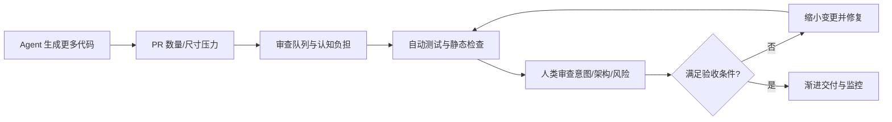

# 总结稿

[打开单页 HTML 总结](assets/bilibili-BV1GRgc6DE7z-summary.html)

> [!warning] 转录范围限制
> [12:01] 后字幕退化为重复占位，后半正文不可用。本文只总结 [00:00–12:01] 可理解口播；约 [14:30] 的自动化图可作为画面线索，但不冒充可靠口播。

## 核心结论

视频浏览 Cursor 2026 Developer Habits Report，并提出一个重要转换：当 Agent 让代码和 PR 变多，程序员的稀缺价值不再只是“多写代码”，而是建立能持续审查、测试、分解和交付的工程系统。报告里的数字是 **Cursor 官方产品聚合数据中的描述性趋势**；它们不能证明 AI 导致生产率、质量或业务价值提升。

## 可用口播中的主线

- **报告框架**：[00:31–01:21] 讲者列出代码速度、模型经济性、头部用户差距、上下文增长和自动化五个主题，并在 [01:04] 概览输入 token 与缓存读取上升。
- **代码量与大 PR**：[01:26–03:16] 报告称其样本中每位开发者每周新增代码上升、PR 变大；讲者提醒代码行不是完美指标，并担心大型 PR 难以维持审查质量。官方报告确认这些趋势，但只适用于 Cursor 汇总数据；至少 1,000 行变更的 mega PR 占比上升不证明 AI 是原因。[Cursor Developer Habits Report](https://cursor.com/insights)
- **Agent 会话变深**：[03:18–04:27] 工具调用次数上升被当作会话更深的代理指标。官方数据从 2026-03-01 的 113.63 增至 2026-05-16 的 145.08，约 30%；它不等于模型更智能或任务更正确。[官方报告](https://cursor.com/insights)
- **短期代码留存**：[04:33–05:17] 已接受 AI 代码在 60 分钟后仍存在的比例约从 76% 到 80.6%。这只是 60 分钟窗口，不代表长期维护、正确、上线或安全。[官方报告](https://cursor.com/insights)
- **模型成本与质量权衡**：[05:18–09:02] 讲者比较请求成本、每条接受代码成本和 CursorBench 前沿；这些指标依赖模型版本、任务组合与内部基准，不能当通用模型总排名。
- **token 与头部用户差距**：[09:03–12:01] 讲者讨论 token 使用及头部用户差距。官方报告显示 2026 年 1–5 月 cache-read 约占 token 活动 88.4%–90.3%，但这是 Cursor 计量口径，不是所有供应商的成本节省率；P99 的 46× AI 行/日和 15× 合并 PR 也不等于质量或个人价值 46×/15×。[官方报告](https://cursor.com/insights)

## 从“代码工厂”到工程控制面

视频在 [01:13–01:21] 提到从基础提示转向“生产高质量软件的系统/工厂”。可执行的 AI 辅助推断是：

1. 把任务拆小并定义验收条件；
2. 限制 PR 尺寸和变更面；
3. 自动运行静态检查、单测、集成测试与安全扫描；
4. 让人类审查意图、架构、风险和不可自动判定的行为；
5. 用缺陷率、回滚、交付周期和用户结果评估，而不是只数代码行/token。

## 指标证据卡

| 指标 | 它实际测量 | 不能推出 |
|---|---|---|
| 新增代码行 | Cursor 样本中的代码产出代理 | 生产率、质量、业务价值 |
| mega PR 占比 | ≥1,000 行变更的合并 PR 比例 | 因果、复杂度或正确性 |
| 工具调用/会话 | Agent 调用深度/频率 | 智能、成功率 |
| 60 分钟存活 | 接受代码短时仍存在 | 长期维护、上线 |
| cache-read token | Cursor token 活动构成 | 通用成本节省或质量 |

## 观众讨论与补充

本次热门顶层评论候选为 0、current-accessible 弹幕为 0，不形成可分析样本。空结果不能支持或反驳视频观点，也不能说明无人讨论。

# 辅助理解

> [!warning] 只使用 [00:00–12:01] 可理解口播；[12:01] 后为重复占位。

## 真正的瓶颈如何迁移

这张图是基于视频“代码工厂”概览与工程常识的 AI 辅助推断，不是报告直接证明的因果模型。

帧 1 是报告五主题目录，适合导航；网页自述不是独立证据。

帧 2 显示 Cursor 样本中新增代码行的上升趋势，同时讲者提醒行数不是完美指标。应把它当描述性代理量，而非生产率曲线。

帧 4 的工具调用折线支持“会话变深/变长”的计量说法，不证明复杂任务完成得更好。

帧 8 展示 CursorBench 的成本—分数前沿；这是内部评测、版本敏感，适合做选择框架而非绝对排名。

## token cache 的正确读法

[01:04] 口播只给出“上下文增长、更多缓存”的概览。更具体的 cache-read 占比来自 [Cursor 官方报告](https://cursor.com/insights)：2026 年 1–5 月约 88.4%–90.3%。它描述 Cursor agent token 活动，不等于缓存命中使质量提升，也不能套到所有供应商价格。

## 审查工厂的四道门

1. **意图门**：需求、约束、不可变条件是否明确。
2. **机器门**：格式、类型、测试、依赖与安全扫描是否自动化。
3. **人类门**：架构、权限、数据损失、可解释性是否有人负责。
4. **运行门**：灰度、监控、回滚和用户结果是否闭环。

## 用什么指标替代“写了多少”

- 交付周期与等待时间；
- 变更失败率、回滚率、线上缺陷；
- PR 审查时长和变更尺寸；
- 测试有效性与关键路径覆盖；
- 用户结果和维护成本。

这些是理解视频风险讨论的工程化延伸，不是 Cursor 报告已经测得的全部指标。

## 外部事实核验

### 声明 1（00:34）

- 视频陈述：Cursor 的 2026 Developer Habits Report 称其用户的编码速度同比翻倍，且每周新增代码自 2026 年初加速增长。
- 核验状态：已确认
- 核验结果：确认，但只适用于 Cursor 汇总产品数据。官方报告把“编码速度同比翻倍”作为主题，并给出每位开发者每周新增代码从 2025 年初约 3.6K 上升到 2026-05-16 的 8.6K。报告自身也承认新增代码行不是完美生产率指标；不能外推为所有开发者效率或代码质量翻倍。
- 检索日期：2026-08-28
- 来源：
  - [Cursor — The Developer Habits Report (Spring 2026)](https://cursor.com/insights)（primary）

### 声明 2（02:14）

- 视频陈述：Cursor 数据中每个 PR 的新增代码行数同比约增长 2.5 倍，且至少 1,000 行变更的 mega PR 更常见。
- 核验状态：已确认
- 核验结果：确认。官方报告明确说每个 PR 新增行数的 p75 同比约 2.5 倍；其表格从 2025-01-01 的 125.86 增至 2026-05-16 的 345.02。报告把 mega PR 定义为至少 1,000 行变更，其合并 PR 占比同期从约 8% 升至 13.8%。这些是 Cursor 数据中的描述性趋势，不证明 AI 单独造成增长。
- 检索日期：2026-08-28
- 来源：
  - [Cursor — The Developer Habits Report (Developer acceleration)](https://cursor.com/insights)（primary）

### 声明 3（03:50）

- 视频陈述：Cursor 的平均每会话工具调用数在两个月内上升约 30%。
- 核验状态：已确认
- 核验结果：确认。官方报告给出的平均工具调用数从 2026-03-01 的 113.63 上升到 2026-05-16 的 145.08，并概括为近两个月约增长 30%。这衡量调用深度/频率，不等同于模型智能或真实任务生产率提高；视频把它视为模型质量代理属于评论。
- 检索日期：2026-08-28
- 来源：
  - [Cursor — The Developer Habits Report (Agent sessions are getting deeper)](https://cursor.com/insights)（primary）

### 声明 4（04:33）

- 视频陈述：Cursor 中已接受的 AI 代码在 60 分钟后仍存在的比例，自 2026 年初约 76% 上升到约 81%。
- 核验状态：已确认
- 核验结果：确认。官方报告的 survival share 从 2026 年 1 月约 76% 上升到 5 月约 80.6%。指标只检查接受后的 AI 行在 60 分钟时是否仍存在，不代表长期留存、正确性、可维护性或已进入生产。
- 检索日期：2026-08-28
- 来源：
  - [Cursor — The Developer Habits Report (AI-generated code is surviving longer)](https://cursor.com/insights)（primary）

### 声明 5（09:50）

- 视频陈述：Cursor 的顶尖 1% 用户与中位用户差距很大，其中合并 PR 约为 15 倍。
- 核验状态：已确认
- 核验结果：确认。官方报告给出的 p99/p50 比率为 AI lines/dev/day 46x、merged PRs/dev/wk 15x；比较基准分别是中位活跃用户和中位活跃 PR 作者。它说明 Cursor 使用/产出高度集中，不等同于前 1% 的软件质量、业务价值或个人生产率高出同样倍数。
- 检索日期：2026-08-28
- 来源：
  - [Cursor — The Developer Habits Report (Inequality steepens at the tail)](https://cursor.com/insights)（primary）

### 声明 6（01:04）

- 视频陈述：Context is growing; there is a dramatic increase in input tokens and a shift toward caching as much as possible.
- 核验状态：已确认
- 核验结果：确认。官方报告称输入/输出 token 比率快速上升；2026 年 1–5 月的 token 构成表中 cache-read 约占 88.4%–90.3%，显著高于 input、output 与 cache-write。该比例是 Cursor agent 活动的计量口径，不能直接当作所有模型供应商的成本节省比例或缓存命中带来的质量提升。
- 检索日期：2026-08-28
- 来源：
  - [Cursor — The Developer Habits Report (The rise of context)](https://cursor.com/insights)（primary）

# Data

## 增强转写稿

[00:00] I've been writing code for the last 15 years
[00:02] and working as a software engineer for the last 10
[00:05] and yet it feels like software engineering as a whole
[00:07] is changing so fast every couple of months
[00:10] as new models come out or as coding agents get better
[00:13] and it can be kind of hard to understand these trends
[00:15] so cursor we just released a bunch of data
[00:18] on how AI assisted development and coding agents
[00:21] have been changing the field of software engineering
[00:24] so I want to read through it live
[00:25] and give some of my commentary on how I think about this
[00:28] and how it's affected
[00:29] my own work as an engineer
[00:31] this developer habits report
[00:33] is going to talk about five things
[00:34] so coding speed is doubling year over year
[00:37] we're seeing larger PRs
[00:38] we'll talk more about that
[00:39] agent generated code is sticking around
[00:42] we've benchmarked many different model families
[00:44] and the cost per line
[00:46] and the cost to actually submit these requests
[00:48] is very different
[00:49] across different models and different providers
[00:52] we see this trend of the top 1%
[00:54] power users of AI and coding agents
[00:57] really being very productive
[00:59] and having a larger separation
[01:01] with the rest of users
[01:04] context is growing
[01:05] we see a dramatic increase in input tokens
[01:08] and a shift towards trying to cache
[01:10] as much as possible which makes sense
[01:12] and then we're seeing a lot of people
[01:13] evolve from more basic prompts
[01:15] to kind of building this system
[01:17] building this factory
[01:18] that's going to help you produce
[01:19] high quality software
[01:21] and we have some interesting data
[01:23] to help talk about this
[01:24] so let's start with developer acceleration
[01:28] developers are now adding more code per week
[01:30] with growth accelerating since the start of 2026
[01:33] now I wanted to add this
[01:34] it's not a perfect metric
[01:36] but I do think that lines of code added
[01:38] is at least directionally interesting
[01:40] obviously you can add lots of bad code
[01:42] and that's actually a net negative
[01:45] for the codebase
[01:46] but when you do look at this in aggregate
[01:48] across the cursor user data
[01:50] it does show this trend
[01:51] of how more and more developers
[01:53] are both creating more projects
[01:55] trying out new ideas
[01:56] trying out new prototypes
[01:59] other people outside of the development process
[02:01] are being able to contribute
[02:02] to building software
[02:03] which I think is
[02:05] by and large a very good thing
[02:07] but that does come
[02:08] with its own challenges
[02:09] so we can't look at just that
[02:10] one bit of data in isolation
[02:14] notably code additions
[02:15] are growing in PR
[02:17] so the lines added per PR
[02:18] is up two and a half times
[02:20] year over year
[02:20] and that's continuing to grow
[02:22] and then specifically
[02:23] I think this mega PR
[02:25] which is fascinating to me
[02:27] the number of PRs with a thousand
[02:29] lines change
[02:29] are becoming more and more common
[02:31] which makes sense
[02:32] you see people
[02:33] who are kind of vibing out these PRs
[02:35] with tons of changes
[02:37] maybe they don't yet understand
[02:38] what a lock file is
[02:39] and why it added
[02:41] thousands of lines of codes
[02:42] in their diff
[02:43] or maybe they accidentally
[02:45] generated some code
[02:46] and it needs to be ignored in Git
[02:48] or maybe it's just
[02:49] actually just a ton of code
[02:52] and
[02:53] I think this is really interesting
[02:54] for two reasons
[02:55] one, you see this spike
[02:56] around the holidays
[02:57] which I think is when a lot of
[02:58] people started to explore
[02:59] the latest models
[03:00] Opus 4.5
[03:01] kind of getting into cursor
[03:02] trying this and applying it
[03:04] or other coding agents
[03:05] and then
[03:06] secondly
[03:07] I think that
[03:08] these mega PRs
[03:09] do pose
[03:10] a real challenge for developers
[03:12] it's hard to maintain quality
[03:14] as the number of lines of code
[03:16] produced grows
[03:18] and in general
[03:19] that code can become a liability
[03:21] I had a tweet about this
[03:22] earlier if you want to go check it out
[03:24] but
[03:25] you should be trying to minimize
[03:27] the amount of code
[03:28] and an agent without proper
[03:30] wielding
[03:31] and control
[03:32] is going to be happy to write
[03:33] a lot of code for you
[03:34] some of that code you might
[03:35] not even need
[03:36] it might be overly defensive
[03:37] it might be
[03:38] overly backwards compatible
[03:40] for situations that
[03:41] don't really even matter
[03:42] or don't exist
[03:43] so it really takes a lot of
[03:45] nuance to do this well
[03:46] and a lot of these patterns
[03:47] are still
[03:48] really being figured out
[03:50] but interestingly
[03:51] in the past couple months
[03:53] if you look at tool calls
[03:54] so writing or editing files
[03:56] or running shell commands
[03:58] searching the web
[03:59] for example
[03:59] you're seeing this continue to rise
[04:01] about 30%
[04:03] and for me
[04:04] the way I think about this is
[04:05] agents and models
[04:07] are generally getting better
[04:08] at calling tools
[04:10] and if you call tools
[04:11] it's a pretty good approximation
[04:13] of an agent's usefulness
[04:14] if they're making more file changes
[04:16] if they're reading the web
[04:17] the running shell commands
[04:18] it's probably a more productive
[04:20] and helpful agent for you
[04:21] so I kind of view this chart
[04:24] as general model intelligence
[04:26] and model quality
[04:27] improving over time
[04:28] which I find really interesting
[04:30] and then the last part
[04:32] in this section
[04:33] a generated code
[04:34] is surviving longer
[04:35] this is a really interesting stat
[04:36] that cursor can help
[04:37] provide through our data
[04:38] but AI lines
[04:39] that have been accepted
[04:40] are still present after 60 minutes
[04:43] and you know
[04:43] you could argue
[04:44] what the correct duration
[04:46] of that time should be
[04:48] I think for me
[04:49] what I take away is that
[04:50] code is very sticky
[04:52] and that's why a lot of people
[04:52] say that adding tons and tons of code
[04:54] is kind of a liability to the
[04:56] maintenance of that software over time
[04:58] so with great power
[04:59] comes great responsibility
[05:00] yes it's amazing
[05:01] that we can generate
[05:02] and write lots of code
[05:04] but the
[05:05] you know
[05:05] the senior staff engineers
[05:07] the code-based architects
[05:08] the people who are thinking about
[05:09] how to build these systems
[05:10] and make them maintainable over time
[05:12] are also trying to fight against
[05:14] and they're using AI
[05:16] to work against the AI
[05:17] to make code review easier
[05:19] to make sure we're not
[05:20] overly adding things that we don't need
[05:22] and I expect this trend just to continue to rise
[05:25] I don't think there's
[05:26] a perfect solution in the market right now
[05:27] that has figured this out
[05:28] everyone is still
[05:29] grappling with
[05:31] the ease of generating code
[05:33] through agents and what that means
[05:34] for the software systems
[05:35] that we maintain over time
[05:37] okay
[05:38] section 2
[05:39] intelligence
[05:40] this is really interesting
[05:41] I mean
[05:42] there's a deeper
[05:44] philosophical thing here I think
[05:45] which is
[05:46] why do people like opus
[05:48] why do people like GPT
[05:50] why do people like other models
[05:51] and there is
[05:54] some correlation between
[05:56] how you view the warmth
[05:58] and the response of the model
[06:00] and the brand of the model
[06:01] and you're kind of
[06:02] building this relationship
[06:04] kind of like it was a co-worker
[06:05] to where you might be willing to pay a premium
[06:07] for using that model
[06:09] I think a lot of people like
[06:10] the Claude models
[06:11] a lot of people like the GPT models
[06:12] and both of them are somewhat converging on some
[06:15] best practices for
[06:17] how you should respond
[06:19] how eager you should be to make edits
[06:20] how much you should push back
[06:22] how much you should continue working on long horizon tasks
[06:24] without having to
[06:25] ask for a bunch of clarifying questions
[06:27] this is really tough
[06:28] and getting this model behavior right
[06:30] is been a multi-year effort for
[06:32] all of the model labs
[06:34] so it's interesting here to see
[06:35] that generally the Claude models are a bit more expensive
[06:38] but then when you look at
[06:39] the cost per accepted line
[06:42] this is where things start to get interesting
[06:44] so if a model is more expensive
[06:46] but it helps you get your job done faster
[06:49] does that mean that it's actually the same cost
[06:52] as maybe a cheaper model
[06:53] that's going to make a bunch of edits
[06:54] or just work a lot longer
[06:56] I think in some cases yes
[06:58] like if you can get
[06:59] the most intelligent model
[07:00] to one shot something
[07:02] it will be overall
[07:04] a lower price than
[07:06] a very unintelligent model
[07:08] just spinning its wheels
[07:09] for a very long time
[07:11] but this is a nuanced question
[07:13] because for most of your agentic work
[07:16] probably everything is not requiring
[07:18] that level of intelligence
[07:19] or that level of
[07:21] one shot capabilities
[07:23] so if you use the most
[07:24] expensive model for everything
[07:25] it will add up
[07:26] and I think we've seen that
[07:28] already happening with some companies
[07:29] is they're trying to figure out
[07:30] how to balance
[07:32] using very very smart models
[07:34] and also the economics of
[07:36] thousands of engineers
[07:37] who are writing code now
[07:39] every day using these tools
[07:40] and trying to find the right balance
[07:42] of price performance and cost
[07:45] and so we're seeing this
[07:46] both in our own internal evals
[07:49] called cursor bench
[07:50] as well as external evals
[07:51] where people are trying to figure out
[07:52] where on this
[07:54] on this chart they want to fit
[07:56] so the average cost per task
[07:58] on the x axis
[07:59] and on the y axis
[08:00] we have the percentage
[08:02] that the model scores
[08:03] on our evals
[08:04] and
[08:06] you know you might argue that
[08:07] well this is a cursor bench
[08:08] so obviously cursor models
[08:10] are going to score well here
[08:12] which I think there is some
[08:15] there are many ways
[08:16] we try to make that not true
[08:18] and make sure we're not just
[08:19] patting our own benchmarks
[08:21] right
[08:21] but I think it's also to take this
[08:23] with a grain of salt
[08:23] and compare it against other
[08:25] external benchmarks
[08:26] for example we report on terminal
[08:27] bench and
[08:28] SWE-bench multilingual
[08:30] and then there's artificial
[08:31] analysis
[08:31] and a bunch of other
[08:32] external benchmarks
[08:33] where you can kind of
[08:34] make your own comparison here
[08:35] so for example the artificial
[08:36] analysis benchmark is pretty
[08:38] similar to the results
[08:39] that we're seeing here
[08:41] but what is trying to show
[08:42] in my opinion
[08:42] the bigger conversation is
[08:44] how much do we value
[08:45] intelligence to a certain
[08:46] price point
[08:47] and especially
[08:48] the total time it takes
[08:49] to get a task done
[08:51] but there's a fast
[08:51] variant of a model
[08:52] and it's economically
[08:53] much more affordable
[08:55] than maybe a different
[08:56] fast model
[08:57] doesn't make more sense
[08:57] for us to use that
[08:59] and get the work done
[08:59] more quickly
[09:01] kind of depends
[09:01] kind of depends on the team
[09:03] ok
[09:04] the power user gap
[09:05] number three
[09:07] this is really interesting
[09:08] this one kind of blew my mind
[09:10] I mean it makes sense
[09:10] you see people building these
[09:12] wild things on x
[09:13] and you hear about these
[09:14] people who are just
[09:15] using a ton of agents
[09:17] and creating
[09:17] wild things
[09:19] and when you
[09:20] look at this usage
[09:21] you see a small
[09:22] share of developers
[09:23] it's just writing
[09:24] a ton of code
[09:25] with AI
[09:26] or building these
[09:27] very complex
[09:29] agent systems
[09:30] and using a lot
[09:31] of tokens
[09:31] and they're using
[09:32] tokens to
[09:33] automate software
[09:34] which we'll talk
[09:34] about later
[09:36] but I think
[09:37] for me the thing
[09:38] to take away here
[09:39] is
[09:39] somewhat similar
[09:40] to lines of code
[09:41] produced
[09:42] I think tokens
[09:43] consumed
[09:44] is not a perfect measure
[09:45] I think there is
[09:46] some amount of
[09:47] token waste here
[09:49] where
[09:50] even the people
[09:51] in the top 1%
[09:52] on the bleeding edge
[09:53] of trying out
[09:54] and using these models
[09:55] and these agents
[09:56] as much as they can
[09:57] they are willingly
[09:58] knowing that
[09:58] this is not a perfect
[10:00] measure of productivity
[10:01] that some tokens
[10:02] are
[10:03] kind of wasted
[10:04] in the pursuit of
[10:06] whatever this means
[10:07] to you but becoming
[10:08] more AI native
[10:09] figuring out AI
[10:11] agent workflows
[10:12] whatever
[10:13] you know
[10:13] WordSalad
[10:14] you want to use
[10:15] to describe that
[10:16] everyone is trying
[10:17] to disrupt themselves
[10:19] and figure out
[10:19] how they use
[10:20] these tools
[10:21] and for a lot
[10:22] of people
[10:22] especially a lot
[10:23] of companies
[10:24] they're willing
[10:24] to have
[10:25] some error bars
[10:26] on
[10:27] how much
[10:27] of that token
[10:29] usage
[10:29] is actually
[10:30] just kind
[10:30] of throw away
[10:31] in pursuit
[10:32] of that larger
[10:32] goal of
[10:33] upskilling
[10:34] or reskilling
[10:35] an entire workforce
[10:36] so it's interesting
[10:37] I think
[10:38] what it means
[10:38] to me is
[10:39] it is worth
[10:40] investing
[10:41] in learning
[10:42] the latest models
[10:43] learning the latest agents
[10:44] and it's also
[10:45] okay to come
[10:46] at that
[10:46] with this
[10:47] critical eye
[10:48] of
[10:48] cost
[10:49] to intelligence
[10:50] to performance
[10:51] and trying
[10:52] to get the most
[10:53] value out
[10:53] of the tools
[10:54] that you're using
[10:55] so when
[10:56] you look at
[10:56] these developers
[10:57] kind of
[10:57] pulling away
[10:59] from the median
[10:59] developers
[11:00] this chart
[11:01] is measuring
[11:02] in lines
[11:02] of the code
[11:02] per week
[11:03] which we've
[11:03] already
[11:03] kind of talked
[11:04] about
[11:04] is
[11:05] you know
[11:05] an imperfect
[11:06] measure
[11:06] but still
[11:06] interesting
[11:07] and then
[11:08] here's
[11:09] another interesting
[11:09] thing
[11:10] when you look
[11:10] at the lines
[11:11] of code
[11:11] the median
[11:12] active user
[11:13] merges
[11:14] they merge
[11:15] fifteen
[11:15] times
[11:16] more
[11:16] prs
[11:18] so that's
[11:18] really interesting
[11:19] I actually
[11:20] like
[11:20] merged
[11:21] prs
[11:22] as a better
[11:22] metric
[11:23] than just
[11:23] lines of
[11:23] code added
[11:24] cause
[11:25] presumably
[11:26] for some
[11:27] compliance reasons
[11:28] a lot
[11:28] of companies
[11:29] need
[11:29] to have
[11:30] at least
[11:30] one
[11:31] human reviewer
[11:31] sign off
[11:32] on a pr
[11:33] so if
[11:33] that's
[11:33] the case
[11:34] and a pr
[11:35] is getting
[11:35] merged
[11:36] there's
[11:36] at least
[11:36] some human
[11:37] reviewer
[11:37] doing
[11:38] some
[11:38] sort
[11:39] of
[11:39] check
[11:40] now
[11:40] it might
[11:40] just be
[11:41] a cursory check
[11:42] no pun intended
[11:43] but they're
[11:43] doing
[11:44] some
[11:45] review
[11:45] of
[11:45] the
[11:45] code
[11:46] and
[11:47] for a PR
[11:47] to get
[11:47] merged
[11:48] and
[11:48] to know
[11:48] that
[11:48] that
[11:48] code
[11:48] is
[11:49] going
[11:49] to
[11:49] production
[11:49] and
[11:49] someone
[11:50] is
[11:50] going
[11:50] to be
[11:50] responsible
[11:51] for
[11:51] that
[11:51] code
[11:52] it
[11:52] is
[11:52] a
[11:52] higher
[11:52] bar
[11:53] than
[11:54] I
[11:54] just
[11:54] generated
[11:55] a
[11:55] bunch
[11:55] of
[11:55] code
[11:55] and
[11:56] I
[11:56] just
[11:56] like
[11:56] vibe
[11:56] out
[11:56] this
[11:57] prototype
[11:57] right
[11:58] so
[11:58] that's
[11:58] pretty
[11:58] interesting
[11:59] and
[11:59] I
[11:59] think
[11:59] it
[12:00] speaks
[12:00] back
[12:00] to
[12:01] what
[12:01] I
[12:01] was
[12:01] saying
[12:01] (字幕製作:貝爾)
[12:32] (字幕製作:貝爾)
[13:01] (字幕製作:貝爾)
[13:31] (字幕製作:貝爾)
[14:01] (字幕製作:貝爾)
[14:31] (字幕製作:貝爾)
[14:51] (字幕製作:貝爾)
[15:01] (字幕製作:貝爾)
[15:29] (字幕製作:貝爾)
[15:56] (字幕製作:貝爾)

## 原始转写稿

[00:00] I've been writing code for the last 15 years
[00:02] and working as a software engineer for the last 10
[00:05] and yet it feels like software engineering as a whole
[00:07] is changing so fast every couple of months
[00:10] as new models come out or as coding agents get better
[00:13] and it can be kind of hard to understand these trends
[00:15] so cursor we just released a bunch of data
[00:18] on how AI assisted development and coding agents
[00:21] have been changing the field of software engineering
[00:24] so I want to read through it live
[00:25] and give some of my commentary on how I think about this
[00:28] and how it's affected
[00:29] my own work as an engineer
[00:31] this developer habits report
[00:33] is going to talk about five things
[00:34] so coding speed is doubling year over year
[00:37] we're seeing larger PRs
[00:38] we'll talk more about that
[00:39] agent generated code is sticking around
[00:42] we've benchmarked many different model families
[00:44] and the cost per line
[00:46] and the cost to actually submit these requests
[00:48] is very different
[00:49] across different models and different providers
[00:52] we see this trend of the top 1%
[00:54] power users of AI and coding agents
[00:57] really being very productive
[00:59] and having a larger separation
[01:01] with the restof users
[01:04] context is growing
[01:05] we see a dramatic increase in input tokens
[01:08] and a shift towards trying to cache
[01:10] as much as possible which makes sense
[01:12] and then we're seeing a lot of people
[01:13] evolve from more basic prompts
[01:15] to kind of building this system
[01:17] building this factory
[01:18] that's going to help you produce
[01:19] high quality software
[01:21] and we have some interesting data
[01:23] to help talk about this
[01:24] so let's start with developer acceleration
[01:28] developers are now adding more code per week
[01:30] with growth accelerating since the start of 2026
[01:33] now I wanted to add this
[01:34] it's not a perfect metric
[01:36] but I do think that lines of code added
[01:38] is atleast directionally interesting
[01:40] obviously you can add lots of bad code
[01:42] and that's actually a net negative
[01:45] for the codebase
[01:46] but when you do look at this in aggregate
[01:48] across the cursor user data
[01:50] it does show this trend
[01:51] of how more and more developers
[01:53] are both creating more projects
[01:55] trying out new ideas
[01:56] trying out new prototypes
[01:59] other people outside of the development process
[02:01] are being able to contribute
[02:02] to building software
[02:03] which I think is
[02:05] by and large a very good thing
[02:07] but that does come
[02:08] with its own challenges
[02:09] so we can't look at just that
[02:10] one bit of datain isolation
[02:14] notably code additions
[02:15] are growing in PR
[02:17] so the lines added per PR
[02:18] is up two and a half times
[02:20] year over year
[02:20] and that's continuing to grow
[02:22] and then specifically
[02:23] I think this mega PR
[02:25] which is fascinating to me
[02:27] the number of PRs with a thousand
[02:29] lines change
[02:29] are becoming more and more common
[02:31] which makes sense
[02:32] you see people
[02:33] who are kind of viving out these PRs
[02:35] with tons of changes
[02:37] maybe they don't yet understand
[02:38] what a lock file is
[02:39] and why it added
[02:41] thousands of lines of codes
[02:42] in their diff
[02:43] or maybe they accidentally
[02:45] generated some code
[02:46] and it needs to be ignored and gets
[02:48] or maybe it's just
[02:49] actually just a ton of code
[02:52] and
[02:53] I think this is really interesting
[02:54] for two reasons
[02:55] one, you see this spike
[02:56] around the holidays
[02:57] which I think is when a lot of
[02:58] people started to explore
[02:59] the latest models
[03:00] obus45
[03:01] kind of getting into cursor
[03:02] trying this and applying it
[03:04] or other coding agents
[03:05] and then
[03:06] secondly
[03:07] I think that
[03:08] these mega PRs
[03:09] do pose
[03:10] a real challenge for developers
[03:12] it's hard to maintain quality
[03:14] as the number of lines of code
[03:16] produced grows
[03:18] and in general
[03:19] that code can become a liability
[03:21] I had a tweet about this
[03:22] earlier if you want to go check it out
[03:24] but
[03:25] you should be trying to minimize
[03:27] the amount of code
[03:28] and an agent without proper
[03:30] weedleding
[03:31] and control
[03:32] is going to be happy to write
[03:33] a lot of code for you
[03:34] some of that code you might
[03:35] not even need
[03:36] it might be overly defensive
[03:37] it might be
[03:38] overly backwards compatible
[03:40] for situations that
[03:41] don't really even matter
[03:42] or don't exist
[03:43] so it really takes a lot of
[03:45] nuance to do this well
[03:46] and a lot of these patterns
[03:47] are still
[03:48] really being figured out
[03:50] but interestingly
[03:51] in the past couple months
[03:53] if you look at tool calls
[03:54] so writing or editing files
[03:56] or running shell commands
[03:58] searching the web
[03:59] for example
[03:59] you're seeing this continue to rise
[04:01] about 30%
[04:03] and for me
[04:04] the way I think about this is
[04:05] agents and models
[04:07] are generally getting better
[04:08] at calling tools
[04:10] and if you call tools
[04:11] it's a pretty good approximation
[04:13] of an agent's usefulness
[04:14] if they're making more file changes
[04:16] if they're reading the web
[04:17] the running shell commands
[04:18] it's probably a more productive
[04:20] and helpful agent for you
[04:21] so I kind of view this chart
[04:24] as general model intelligence
[04:26] and model quality
[04:27] improving over time
[04:28] which I find really interesting
[04:30] and then the last part
[04:32] in this section
[04:33] a generated code
[04:34] is surviving longer
[04:35] this is a really interesting stat
[04:36] that cursor can help
[04:37] provide through our data
[04:38] but AI lines
[04:39] that have been accepted
[04:40] are still present after 60 minutes
[04:43] and you know
[04:43] you could argue
[04:44] what the correct duration
[04:46] of that time should be
[04:48] I think for me
[04:49] what I take away is that
[04:50] code is very sticky
[04:52] and that's why a lot of people
[04:52] say that adding tons and tons of code
[04:54] is kind of a liability to the
[04:56] maintenance of that software over time
[04:58] so with great power
[04:59] comes great responsibility
[05:00] yes it's amazing
[05:01] that we can generate
[05:02] and write lots of code
[05:04] but the
[05:05] you know
[05:05] the senior staff engineers
[05:07] the code-based architects
[05:08] the people who are thinking about
[05:09] how to build these systems
[05:10] and make them maintainable over time
[05:12] are also trying to fight against
[05:14] and they're using AI
[05:16] to work against the AI
[05:17] to make code review easier
[05:19] to make sure we're not
[05:20] overly adding things that we don't need
[05:22] and I expect this trend just to continue to rise
[05:25] I don't think there's
[05:26] a perfect solution in the market right now
[05:27] that has figured this out
[05:28] everyone is still
[05:29] grappling with
[05:31] the ease of generating code
[05:33] through agents and what that means
[05:34] for the software systems
[05:35] that we maintain over time
[05:37] okay
[05:38] section 2
[05:39] intelligence
[05:40] this is really interesting
[05:41] I mean
[05:42] there's a deeper
[05:44] philosophical thing here I think
[05:45] which is
[05:46] why do people like opus
[05:48] why do people like GPT
[05:50] why do people like other models
[05:51] and there is
[05:54] some correlation between
[05:56] how you view the warmth
[05:58] and the response of the model
[06:00] and the brand of the model
[06:01] and you're kind of
[06:02] building this relationship
[06:04] kind of like it was a co-worker
[06:05] to where you might be willing to pay a premium
[06:07] for using that model
[06:09] I think a lot of people like
[06:10] the cloud models
[06:11] a lot of people like the GPT models
[06:12] and both of them are somewhat converging on some
[06:15] best practices for
[06:17] how you should respond
[06:19] how eager you should be to make edits
[06:20] how much you should push back
[06:22] how much you should continue working on long horizon tasks
[06:24] without having to
[06:25] ask for a bunch of clarifying questions
[06:27] this is really tough
[06:28] and getting this model behavior right
[06:30] is been a multi-year effort for
[06:32] all of the model labs
[06:34] so it's interesting here to see
[06:35] that generally the cloud models are a bit more expensive
[06:38] but then when you look at
[06:39] the cost per accepted line
[06:42] this is where things start to get interesting
[06:44] so if a model is more expensive
[06:46] but it helps you get your job done faster
[06:49] does that mean that it's actually the same cost
[06:52] as maybe a cheaper model
[06:53] that's going to make a bunch of edits
[06:54] or just work a lot longer
[06:56] I think in some cases yes
[06:58] like if you can get
[06:59] the most intelligent model
[07:00] to one shot something
[07:02] it will be overall
[07:04] a lower price than
[07:06] a very unintelligent model
[07:08] just spinning its wheels
[07:09] for a very long time
[07:11] but this is a nuanced question
[07:13] because for most of your agentic work
[07:16] probably everything is not requiring
[07:18] that level of intelligence
[07:19] or that level of
[07:21] one shot capabilities
[07:23] so if you use the most
[07:24] expensive model for everything
[07:25] it will add up
[07:26] and I think we've seen that
[07:28] already happening with some companies
[07:29] is they're trying to figure out
[07:30] how to balance
[07:32] using very very smart models
[07:34] and also the economics of
[07:36] thousands of engineers
[07:37] who are writing code now
[07:39] every day using these tools
[07:40] and trying to find the right balance
[07:42] of price performance and cost
[07:45] and so we're seeing this
[07:46] both in our own internal evals
[07:49] called cursor bench
[07:50] as well as external evals
[07:51] where people are trying to figure out
[07:52] where on this
[07:54] on this chart they want to fit
[07:56] so the average cost per task
[07:58] on the x axis
[07:59] and on the y axis
[08:00] we have the percentage
[08:02] that the model scores
[08:03] on our evals
[08:04] and
[08:06] you know you might argue that
[08:07] well this is a cursor bench
[08:08] so obviously cursor models
[08:10] are going to score well here
[08:12] which I think there is some
[08:15] there are many ways
[08:16] we try to make that not true
[08:18] and make sure we're not just
[08:19] patting our own benchmarks
[08:21] right
[08:21] but I think it's also to take this
[08:23] with a grain of salt
[08:23] and compare it against other
[08:25] external benchmarks
[08:26] for example we report on terminal
[08:27] bench and
[08:28] sweebench multilingual
[08:30] and then there's artificial
[08:31] analysis
[08:31] and a bunch of other
[08:32] external benchmarks
[08:33] where you can kind of
[08:34] make your own comparison here
[08:35] so for example the artificial
[08:36] analysis benchmark is pretty
[08:38] similar to the results
[08:39] that we're seeing here
[08:41] but what is trying to show
[08:42] in my opinion
[08:42] the bigger conversation is
[08:44] how much do we value
[08:45] intelligence to a certain
[08:46] presspoint
[08:47] and especially
[08:48] the total time it takes
[08:49] to get a task done
[08:51] but there's a fast
[08:51] variant of a model
[08:52] and it's economically
[08:53] much more affordable
[08:55] than maybe a different
[08:56] fast model
[08:57] doesn't make more sense
[08:57] for us to use that
[08:59] and get the work done
[08:59] more quickly
[09:01] kind of depends
[09:01] kind of depends on the team
[09:03] ok
[09:04] the power user gap
[09:05] number three
[09:07] this is really interesting
[09:08] this one kind of blew my mind
[09:10] I mean it makes sense
[09:10] you see people building these
[09:12] wild things on x
[09:13] and you hear about these
[09:14] people who are just
[09:15] using a ton of agents
[09:17] and creating
[09:17] wild things
[09:19] and when you
[09:20] look at this usage
[09:21] you see a small
[09:22] share of developers
[09:23] it's just writing
[09:24] a ton of code
[09:25] with AI
[09:26] or building these
[09:27] very complex
[09:29] agent systems
[09:30] and using a lot
[09:31] of tokens
[09:31] and they're using
[09:32] tokens to
[09:33] automate software
[09:34] which we'll talk
[09:34] about later
[09:36] but I think
[09:37] for me the thing
[09:38] to take away here
[09:39] is
[09:39] somewhat similar
[09:40] to lines of code
[09:41] produced
[09:42] I think tokens
[09:43] consumed
[09:44] is not a perfect measure
[09:45] I think there is
[09:46] some amount of
[09:47] token waste here
[09:49] where
[09:50] even the people
[09:51] in the top 1%
[09:52] on the bleeding edge
[09:53] of trying out
[09:54] and using these models
[09:55] and these agents
[09:56] as much as they can
[09:57] they are willingly
[09:58] knowing that
[09:58] this is not a perfect
[10:00] measure of productivity
[10:01] that some tokens
[10:02] are
[10:03] kind of wasted
[10:04] in the pursuit of
[10:06] whatever this means
[10:07] to you but becoming
[10:08] more AI native
[10:09] figuring out AI
[10:11] agent workflows
[10:12] whatever
[10:13] you know
[10:13] WordSalad
[10:14] you want to use
[10:15] to describe that
[10:16] everyone is trying
[10:17] to disrupt themselves
[10:19] and figure out
[10:19] how they use
[10:20] these tools
[10:21] and for a lot
[10:22] of people
[10:22] especially a lot
[10:23] of companies
[10:24] they're willing
[10:24] to have
[10:25] some error bars
[10:26] on
[10:27] how much
[10:27] of that token
[10:29] usage
[10:29] is actually
[10:30] just kind
[10:30] of throw away
[10:31] in pursuit
[10:32] of that larger
[10:32] goal of
[10:33] upskilling
[10:34] or reskilling
[10:35] an entire workforce
[10:36] so it's interesting
[10:37] I think
[10:38] what it means
[10:38] to me is
[10:39] it is worth
[10:40] investing
[10:41] in learning
[10:42] the latest models
[10:43] learning the latest agents
[10:44] and it's also
[10:45] okay to come
[10:46] at that
[10:46] with this
[10:47] critical eye
[10:48] of
[10:48] cost
[10:49] to intelligence
[10:50] to performance
[10:51] and trying
[10:52] to get the most
[10:53] value out
[10:53] of the tools
[10:54] that you're using
[10:55] so when
[10:56] you look at
[10:56] these developers
[10:57] kind of
[10:57] pulling away
[10:59] from the median
[10:59] developers
[11:00] this chart
[11:01] is measuring
[11:02] in lines
[11:02] of the code
[11:02] per week
[11:03] which we've
[11:03] already
[11:03] kind of talked
[11:04] about
[11:04] is
[11:05] you know
[11:05] an imperfect
[11:06] measure
[11:06] but still
[11:06] interesting
[11:07] and then
[11:08] here's
[11:09] another interesting
[11:09] thing
[11:10] when you look
[11:10] at the lines
[11:11] of code
[11:11] the median
[11:12] active user
[11:13] merges
[11:14] they merge
[11:15] fifteen
[11:15] times
[11:16] more
[11:16] prs
[11:18] so that's
[11:18] really interesting
[11:19] I actually
[11:20] like
[11:20] merged
[11:21] prs
[11:22] as a better
[11:22] metric
[11:23] than just
[11:23] linesof
[11:23] code added
[11:24] cause
[11:25] presumably
[11:26] for some
[11:27] compliance reasons
[11:28] a lot
[11:28] of companies
[11:29] need
[11:29] to have
[11:30] at least
[11:30] one
[11:31] human reviewer
[11:31] sign up
[11:32] on a pr
[11:33] so if
[11:33] that's
[11:33] the case
[11:34] and a pr
[11:35] is getting
[11:35] merged
[11:36] there's
[11:36] at least
[11:36] some human
[11:37] reviewer
[11:37] doing
[11:38] some
[11:38] sort
[11:39] of
[11:39] check
[11:40] now
[11:40] it might
[11:40] just be
[11:41] a cursory check
[11:42] no pun intended
[11:43] but they're
[11:43] doing
[11:44] some
[11:45] review
[11:45] of
[11:45] the
[11:45] code
[11:46] and
[11:47] for a PR
[11:47] to get
[11:47] merged
[11:48] and
[11:48] to know
[11:48] that
[11:48] that
[11:48] code
[11:48] is
[11:49] going
[11:49] to
[11:49] production
[11:49] and
[11:49] someone
[11:50] is
[11:50] going
[11:50] to be
[11:50] responsible
[11:51] for
[11:51] that
[11:51] code
[11:52] it
[11:52] is
[11:52] a
[11:52] hire
[11:52] bar
[11:53] than
[11:54] I
[11:54] just
[11:54] generated
[11:55] a
[11:55] bunch
[11:55] of
[11:55] code
[11:55] and
[11:56] I
[11:56] just
[11:56] like
[11:56] vibe
[11:56] out
[11:56] this
[11:57] prototype
[11:57] right
[11:58] so
[11:58] that's
[11:58] pretty
[11:58] interesting
[11:59] and
[11:59] I
[11:59] think
[11:59] it
[12:00] speaks
[12:00] back
[12:00] to
[12:01] what
[12:01] I
[12:01] was
[12:01] saying
[12:01] (字幕製作:貝爾)
[12:32] (字幕製作:貝爾)
[13:01] (字幕製作:貝爾)
[13:31] (字幕製作:貝爾)
[14:01] (字幕製作:貝爾)
[14:31] (字幕製作:貝爾)
[14:51] (字幕製作:貝爾)
[15:01] (字幕製作:貝爾)
[15:29] (字幕製作:貝爾)
[15:56] (字幕製作:貝爾)

## 原始关键帧

### 关键帧 1

### 关键帧 2

### 关键帧 3

### 关键帧 4

### 关键帧 5

### 关键帧 6

### 关键帧 7

### 关键帧 8

### 关键帧 9

### 关键帧 10

## 补充原始数据

- [bilibili-BV1GRgc6DE7z-comments.jsonl](assets/bilibili-BV1GRgc6DE7z-comments.jsonl)
- [bilibili-BV1GRgc6DE7z-comment-candidates.json](assets/bilibili-BV1GRgc6DE7z-comment-candidates.json)
- [bilibili-BV1GRgc6DE7z-danmaku.jsonl](assets/bilibili-BV1GRgc6DE7z-danmaku.jsonl)
- [bilibili-BV1GRgc6DE7z-danmaku-analysis.json](assets/bilibili-BV1GRgc6DE7z-danmaku-analysis.json)
- [bilibili-BV1GRgc6DE7z-summary.html](assets/bilibili-BV1GRgc6DE7z-summary.html)
