# 总结稿

## 核心结论

视频把中间件 SDK 的价值定义为：在业务代码与具体客户端之间建立稳定边界，集中承载切换实现、命名空间、序列化、重试等工程规则；但“包一层”本身不是目标，只有当它能减少重复、隔离变化或收敛复杂度时才值得存在。

讲者给出六条设计原则：

1. **安全默认值**：默认配置应按故障时可控的工作区间设计，而不是直接采用组件理论上限。
2. **显式优于隐式，配置优于魔法**：避免因环境或隐藏约定而产生不可预测行为。
3. **能力面小、扩展点多**：核心 API 只覆盖必要能力，日志、重试、序列化等通过模块或 SPI 逐步扩展。
4. **失败可见、兜底可控**：不要吞掉异常并伪装成成功；记录后仍应保留上层所依赖的失败语义。
5. **版本语义化**：用版本号表达兼容性，并在发布信息中明确破坏性变更。
6. **封装不是万金油**：新增一层会同时增加复杂度并可能产生性能成本，应比较有无该层时的总收益。

## 外部核验补充

- “小能力面、可插拔扩展”可由 Java SPI 这类机制实现，但“扩展点越多越好”不是普遍定律，仍需控制接口稳定性与维护成本。[Oracle：Service Provider Interfaces 简介](https://docs.oracle.com/javase/tutorial/sound/SPI-intro.html)
- [Semantic Versioning 2.0.0](https://semver.org/)规定：不兼容的公共 API 变更应提升主版本号，向后兼容的新功能提升次版本号，向后兼容的修复提升补丁号。视频强调“明确标记破坏性变更”的方向正确；发布说明和迁移指南则是 SemVer 之外的配套实践。

# 辅助理解

## 辅助理解：SDK 是边界政策，不只是转发层

### 1. 六条原则实际在控制三类风险

**视频内容：**前四条原则的完整列表集中展示在同一页，说明讲者关注的不只是 API 外观，而是默认行为、可预测性、扩展方式和失败传播。

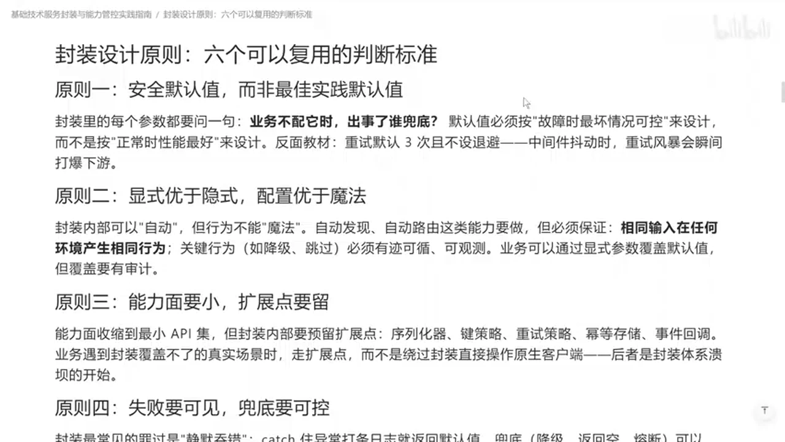

可以把六条原则重组为三层控制：

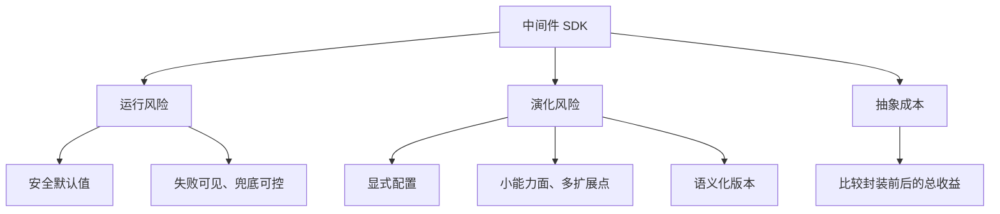

这三层分别回答：故障时是否可控、未来变化是否可管理，以及新增抽象是否真的值得。

### 2. 默认值应来自“安全工作区间”，而不是能力上限

**视频内容：**讲者用数据库最多支持 100 个连接、压测后 50 个连接更稳定的例子说明：理论上限不等于安全默认值。默认配置应在业务没有显式设置时仍能控制最坏情况，而不是把资源推到极限。

**AI 辅助推断：**这不是说所有连接池都应设置为上限的一半。视频中的 100/50 是示例；可迁移的方法是先定义延迟、错误率、资源占用等失效边界，再用压测和生产数据确定默认值，并允许业务在可观测、受约束的范围内覆盖它。

### 3. “小能力面、多扩展点”是把变化隔离到插件边界

**视频内容：**核心层只提供当前业务必需的能力，把重试、日志、序列化等变化较大的功能留给模块化扩展；讲者以 Java SPI 为例，主张从“一步到位的大而全 SDK”转向小模块拼装。后半部分的原则总览补齐了失败、版本和封装成本三项。

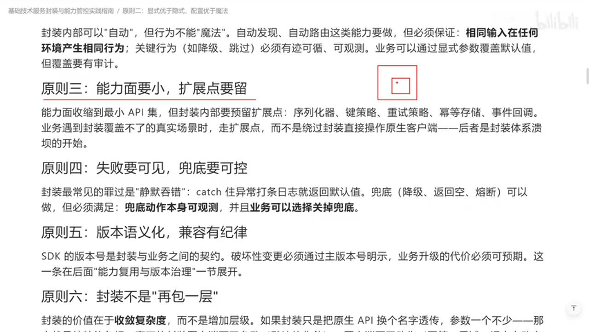

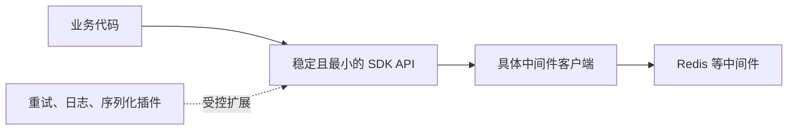

**外部核验补充：**Oracle 的 Java SPI 文档展示了消费者通过稳定 API 发现服务提供者、而不直接依赖实现类的机制，这支持视频所说的可插拔扩展方式；但文档并不证明任何 SDK 都应设计大量扩展点。[Oracle：Service Provider Interfaces 简介](https://docs.oracle.com/javase/tutorial/sound/SPI-intro.html)

### 4. 失败处理不能改写调用契约

**视频内容：**如果 SDK 在内部 `try-catch` 后只写日志、不再抛出异常，上层会把失败误认为成功，原有的重试和错误响应也会失效。讲者建议可以补充日志，但不能悄悄破坏原始错误语义。

**AI 辅助推断：**“失败可见”不等于所有底层异常都原样外泄。较稳妥的做法是：把底层异常映射为稳定的 SDK 错误类型，同时保留原因链、错误码和可观测记录；兜底策略则由调用方显式选择或由契约明确规定。关键是调用者能够区分成功、可重试失败、不可重试失败与降级结果。

### 5. 版本号是兼容性契约，不是装饰

**视频内容：**讲者主张用三段版本号表达变更性质，并在提交和发布信息中明确指出破坏性变更。

**外部核验补充：**SemVer 2.0.0 的准确规则是：不兼容公共 API 变更提升主版本，向后兼容的新功能提升次版本，向后兼容的修复提升补丁版本。[Semantic Versioning 2.0.0](https://semver.org/) 因此视频中的总体方向成立，但不能只凭“新增功能”推断兼容性；只要公共 API 不兼容，就应按破坏性变更处理。

### 6. 最后一问：去掉这一层会发生什么？

**视频内容：**讲者用“去掉 SDK 后，业务是否会重复写更多代码、反复处理同一核心规则”作为是否封装的判断题。封装提高替换性和一致性，也会增加层级、复杂度并可能影响性能。

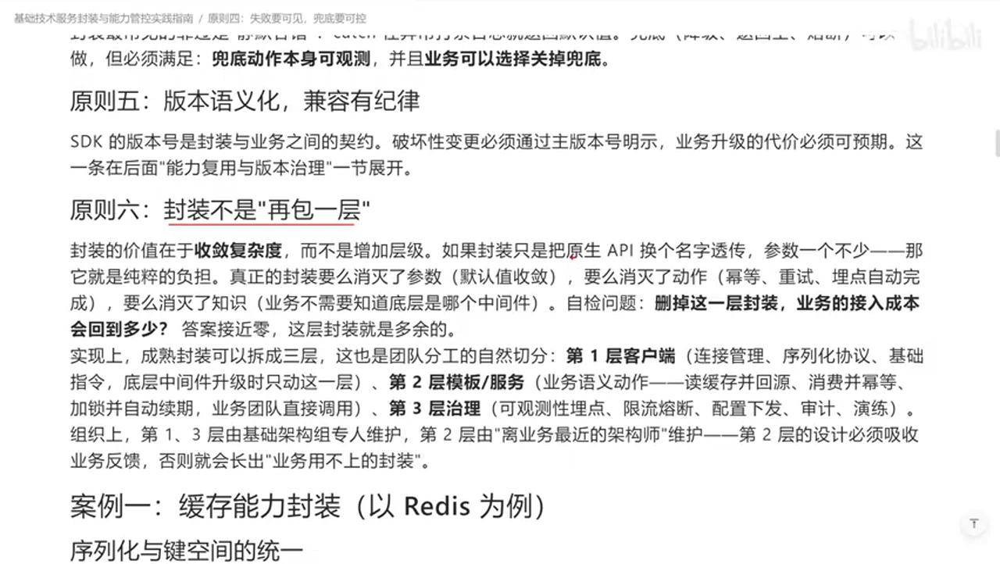

**AI 辅助推断：**可以把是否封装转成一张证据清单：是否存在多个调用方、是否需要统一故障策略、具体实现是否可能替换、抽象能否稳定、额外调用与维护成本是否可接受。若收益只是假想的“未来可能用到”，而当前没有重复与变化压力，保持直接调用通常更诚实。

## 与相关笔记的连接

[[clips/来点干货,关于代码架构与AI复审我的浅显理解.md|关于代码架构与 AI 复审的浅显理解]]解决的是项目级模块边界、依赖方向和复审规则如何显式化；本视频解决的是组件接入边界中的默认值、失败语义、扩展点与版本契约。组合阅读后，可以从“项目模块如何分权”继续下钻到“单个 SDK 如何守住接口契约”，并把这些规则进一步交给人工或 AI 复审。

# Data

## 增强转写稿

[00:00] 说明话众上讲话你好 欢迎来到阿提拉级的假购求白奖
[00:03] 我是一名的IT私人公认老七
[00:05] 到现在我已经录制了十多门与编程加购的最新课程
[00:08] 同时还会提供简历优化模拟面识off选择
[00:11] 课讹称制导 工作建议等多种服务
[00:13] 只要我有经验的事情一定坦诚相待
[00:16] 有兴趣的小伙伴可以看一下评论区
[00:18] 好的 那今天咱们来说一个特别实用的话题
[00:22] 大家经常进行关于中间件或者各种组件的 SDK 封装
[00:28] 那我今天要给大家分享6个核心原则
[00:31] 这是大家必须要在实战中关注的事情
[00:34] 好，我们回到笔记来进行讲解
[00:36] 首先咱们来简单回顾一下
[00:38] 为什么要对组件能力进行封装
[00:40] 来 我们看一下 比如说现在我们有个Redis
[00:43] 那在Redis之前的话咱们也知道
[00:46] 实际应用开发中，比如说有 Redisson 或者各种各样的 Redis 客户端
[00:49] 我们程序直接调用具体的这个客户端
[00:53] 当然可以完成对Redis访问这个无需质疑
[00:57] 但为什么你看到成熟的软件开发者
[00:59] 他都可以在外边包一层的 主要目的有两个
[01:02] 第一个 未来在实际开发中
[01:05] 比如说内部的这个组件发生了变化
[01:08] 发现Redis有了大的问题
[01:10] 我们可以尽快地切换到其他的开源组件上
[01:15] 这是第一个 而第二个在内部中
[01:18] 比如说关于重试、关于命名、关于命名空间的切割
[01:23] 这些的默认行为工程层面上的
[01:27] 我们都可以把它封装到 SDK 的规则中
[01:30] 让我们的程序员不用关注具体的这些工程层面上的细节
[01:34] 直接调用接口以后
[01:35] 按照公司的分门别类的特性和业务规则
[01:39] 来把它存储在不同的地方
[01:42] 所以你发现了吧
[01:43] 针对于 SDK 的封装是非常有讲究的
[01:46] 但是在这个过程中到底有哪些需要注意的核心原则是容易破坏我们整体性了呢
[01:53] 主要有六个
[01:54] 第一个核心原则称为安全默认值
[01:58] 所谓安全默认是指
[02:00] 当业务不配置它时，出了事谁兜底
[02:05] 默认值必须考虑在故障最坏的情况下可控来设计
[02:11] 怎么理解
[02:11] 一有开发的时候
[02:12] 比如说咱们现在有一个数据库
[02:15] 那这个数据库呢
[02:16] 比如说它最多可以支持 100 个连接
[02:19] 那如果你在使用 SDK 的时候
[02:22] 配置的这个连接是 100 个
[02:24] 其实就错了
[02:26] 因为你这里虽然是100个
[02:28] 但我们程序中
[02:29] 比如说真的要跑到 100 个连接的时候
[02:31] 像咱们的应用程序出现了高 I/O 的情况
[02:35] 那实际经过压测的时候
[02:37] 好 一般的情况
[02:38] 50个连接的时候
[02:39] 它是最稳定的
[02:41] 超过50个
[02:42] 逐渐的我们的逻辑就会产生了缓慢
[02:46] 那这时我们的安全默认值
[02:48] 不应该取这个上限 100，而是取 50
[02:52] 这是一个在经常我们业务开发中
[02:54] 容易被忽略的问题
[02:56] 这是第一个
[02:57] 那第二个叫做显式优于隐式
[03:00] 配置优于魔法
[03:02] 经常的大家会听说过一个名词叫做
[03:05] 约定优于配置
[03:07] 这针对于咱们开发框架是没问题的
[03:10] 但是针对于我们封装的组件
[03:13] 这无疑是种灾难
[03:15] 因为有很多的隐式规范
[03:17] 没有明确的话
[03:18] 要么让使用它的程序员去读文档
[03:22] 要么的话就产生了各种各样意料之外的事
[03:25] 以前我们就遇到过这种情况
[03:26] 比如说现在我们有两台服务器
[03:29] 这两台服务器在业务开发的时候
[03:31] 本地都会有一个配置文件
[03:34] 那按照这个来说
[03:35] 比如说原本上面是 10 个数据库连接配置的
[03:38] 那这个是5个
[03:39] 那在业务处理的时候
[03:41] 我们的SDK的话
[03:42] 以服务器上的这个配置为准
[03:45] 其实这就是比较麻烦的事
[03:47] 因为在不同的场景下
[03:49] 你选择了不同的行为
[03:51] 那在SDK封装的时候
[03:54] 我们就要明确的
[03:55] 比如说你把这个原本的远端的拿到了本地来说
[03:59] 比如说针对这两个环境
[04:01] 那一个是5
[04:03] 一个是10
[04:04] 你在这个SDK的层面上
[04:05] 你把它进行拉取
[04:07] 那这个拉取的源头
[04:08] 比如说可以来自于咱们公司内部的配置中心
[04:11] 你去拉它
[04:12] 那当然是没问题的
[04:14] 但你要这么封装的话
[04:15] 就可能会产生
[04:17] 由于连接到不同的环境
[04:19] 有一些隐式的配置
[04:20] 会让我们在进行项目管理的时候
[04:23] 产生不必要的麻烦
[04:25] 所以在 SDK 封装来说
[04:27] 显式优于隐式，配置
[04:29] 优于魔法
[04:30] 这是它的含义所在
[04:32] 而第三个
[04:33] 能力面要小
[04:34] 扩展点要多
[04:36] 你不能说在我们进行SDK封装的时候
[04:38] 一次性把所有可能出现的乱七八糟的功能
[04:42] 全都拉进去
[04:43] 那又胖又肿
[04:45] 还难用对吧
[04:46] 怎么办呢
[04:47] 比如咱们现在
[04:48] 那以目前来说
[04:49] 外围的是我们的SDK
[04:51] 内部是我们 Redisson 的客户端
[04:53] 外部通过咱们 SDK 调用 Redisson
[04:56] 然后去访问redis
[04:57] 这当然没问题是吧
[04:59] 那涉及到比如说
[05:00] 重试，还有关于日志的封装
[05:03] 序列化如何去实现
[05:05] 这些的话
[05:05] 原本其实都是需要在SDK层面上
[05:08] 来进行的声明
[05:09] 那在这个过程下
[05:11] 你可以把必要的组件
[05:13] 比如说
[05:14] 序列化
[05:15] 这些东西来
[05:16] 关于重试的
[05:17] 它可能不是最必要的
[05:19] 那你可以现在不做
[05:20] 但是在程序代码上留下预留点
[05:23] 那未来
[05:23] 你可以通过比如说
[05:25] Java 的 SPI 或者类似这种扩展机制
[05:28] 你在启动的时候
[05:29] 从我们这个必要的
[05:31] 比如 Maven 仓库中
[05:32] 把它拉取到本地来
[05:34] 那你就自动的形成了
[05:36] 这样的新的功能扩展
[05:38] 所以功能面要小
[05:40] 一开始只去设计
[05:42] 能够满足业务要求的最小的功能点
[05:45] 然后预留下足够的扩展点
[05:47] 需要的时候
[05:48] 对外进行开放
[05:49] 把我们的程序
[05:50] 是从一步到位
[05:52] 变成了小块模块的拼装
[05:55] 而第四个失败要可见
[05:57] 兜底要可控
[05:58] 以前我们在封装的时候
[06:00] 遇到过类似这样的情况
[06:01] 一个SDK开发的时候
[06:03] 好
[06:03] 那调用了组件
[06:05] 然后结果呢
[06:05] 这个组件用了一个 try-catch
[06:08] 把我们原本的应该抛出的错误
[06:11] 我给你包装出来了
[06:12] 又开始打印到日志里边去
[06:14] 那这可能就会导致一个很麻烦的事
[06:17] 原本上层的组件
[06:19] 它呢是依赖于这个抛出的异常
[06:22] 然后来进行比如说重试啊
[06:24] 返回各种故障的错误
[06:26] 现在你给它直接 catch 在里边去了
[06:28] 那人家再从外侧调用的时候
[06:30] 那跟调用成功是一模一样的
[06:34] 那这原有的逻辑就可能会产生变化
[06:37] 所以失败要可见
[06:39] 兜底要可控的逻辑是
[06:41] 你不应该破坏原有的行为
[06:44] 你可以说捕捉一下日志
[06:46] 然后再把原有的逻辑给的扔出去
[06:48] 你不要破坏原有的一些逻辑和套路
[06:53] 而第五个是版本要语义化
[06:56] 作为 SDK 开发包的时候
[06:57] 有的时候和业务是高度绑定的
[07:00] 在业务常见的就是xy和z三段式的
[07:03] 比如说1点10点2
[07:05] 那么xyz的这个版本化
[07:07] 其实也是非常关键的
[07:09] 在业务开发时
[07:11] 针对 SDK 每一个版本
[07:13] 它可能有向上兼容的
[07:14] 有可能有不向上兼容的
[07:16] 默认情况下
[07:17] 一般我们说大版本号x
[07:19] 比如说从1升到了二代
[07:21] 那这个一般默认就不向上兼容
[07:24] 但是到了y这边
[07:26] 那它一般说比如说1.0升级到了2.0
[07:30] 那意味着就是在功能层面上
[07:32] 额外的来进行附加
[07:34] 大家都说情况下y里面的数字增加它是向上兼容的
[07:38] 而z对应到的是修复某一个具体的bug
[07:42] 99%的情况下
[07:44] Z 的调整是不会对原功能产生破坏性的
[07:48] 那在过程背后有一些
[07:51] 比如说y确实由于功能的需要
[07:53] 对原始的版本是上一版本不兼容了
[07:56] 这时你就必须要在我们进行这个业务开发的时候
[08:00] 尤其在进行发版的时候明确的它说
[08:04] 这是一个破坏性变更
[08:06] 在提交和发布信息中要明确
[08:09] 针对哪个版本以后
[08:11] 那么它就不进行了兼容
[08:13] 最后就是封装
[08:14] 它不是一个万金油
[08:16] 我们经常提到的一个就是软件解耦的过程中
[08:20] 没有什么是包一层解决不了的
[08:22] 如果包一层解决不了就包两层
[08:24] 其实这是一句玩笑话
[08:26] 因为在实际项目中
[08:28] 包一层的代价是软件的复杂度增加了
[08:32] 软件的这个扩展性虽然提高了
[08:34] 但是性能相应的会降低
[08:37] 那在业务开发中怎么去判断呢
[08:39] 你就去验证一下
[08:41] 如果我们把刚才说到的包一层的这个SDK
[08:44] 你去掉的话
[08:45] 作为业务开发人员会带来什么样的代价
[08:48] 是代码更多了
[08:49] 还是核心功能
[08:51] 必须每一次都要手动书写还是怎么样的
[08:54] 那么你就要去平衡
[08:56] 我加上这层以后和去掉这层以后
[08:59] 到底哪个收益会更大
[09:01] 是否这个包一层是可有可无的
[09:03] 如果答案是可有可无
[09:05] 那我们的建议是不去封装它
[09:08] 这就是我们看到了
[09:10] 对于 SDK 的一个核心的处理指标
[09:13] 不是为了包装而去包装
[09:15] 每一次都是一个性能
[09:17] 成本还有扩展性之间的平衡和取舍
[09:21] 以上就是我们现在说针对SDK封装的时候的一些
[09:25] 最佳的考量点，希望我今天的分享能对你有一些启发。

## 原始转写稿

[00:00] 说明话众上讲话你好 欢迎来到阿提拉级的假购求白奖
[00:03] 我是一名的IT私人公认老七
[00:05] 到现在我已经录制了十多门与编程加购的最新课程
[00:08] 同时还会提供简历优化模拟面识off选择
[00:11] 课讹称制导 工作建议等多种服务
[00:13] 只要我有经验的事情一定坦诚相待
[00:16] 有兴趣的小伙伴可以看一下评论区
[00:18] 好的 那今天咱们来说一个特别实用的话题
[00:22] 大家经常来进行关于中间线或者是各种组建的SVK封装
[00:28] 那我今天要给大家分享6个核心原则
[00:31] 这是大家必须要在实战中关注的事情
[00:34] 老会计我们回到笔记来进行讲解
[00:36] 首先咱们来简单回顾一下
[00:38] 为什么要对组建能力提升的封装
[00:40] 来 我们看一下 比如说现在我们有个Redis
[00:43] 那在Redis之前的话咱们也知道
[00:46] 自己应用开发中比如说有Redis或者各种各样的Redis客户端
[00:49] 我们程序直接调用具体的这个客户端
[00:53] 当然可以完成对Redis访问这个无需质疑
[00:57] 但为什么你看到成熟的软件开发者
[00:59] 他都可以在外边包一层的 主要目的有两个
[01:02] 第一个 未来在实际开发中
[01:05] 比如说内部的这个组建发生了变化
[01:08] 发现Redis有了大的问题
[01:10] 我们可以尽快的切换到其他的开发上做开发的组建上
[01:15] 这是第一个 而第二个在内部中
[01:18] 比如说关于重视 关于命名 关于命名空间的切割
[01:23] 这些的默认行为工程层面上的
[01:27] 我们都可以把它封装到了SVK的规则中
[01:30] 让我们的程序员不用关注具体的这些工程层面上的细节
[01:34] 直接带用接口以后
[01:35] 好 按照公司的纷纷别类的特性和业务规则
[01:39] 来把它存储在不同的地方
[01:42] 所以你发现了吧
[01:43] 针对于SVK的封装是非常有讲究的
[01:46] 但是在这个过程中到底有哪些需要注意的核心原则是容易破坏我们整体性了呢
[01:53] 主要有六个
[01:54] 第一个 核心原则是称为叫安全默认值
[01:58] 所谓安全默认是指
[02:00] 当业务不派它时出了事谁偷敌的情况
[02:05] 默认值必须考虑在故障最坏的情况下可控来设计
[02:11] 怎么理解
[02:11] 一有开发的时候
[02:12] 比如说咱们现在一个数据户
[02:15] 那这个数据户呢
[02:16] 比如说它最多可以支持100个联系
[02:19] 那如果你在这使用SVK的时候
[02:22] 好 我派一致的这个联系是100个
[02:24] 其实就错了
[02:26] 因为你这里虽然是100个
[02:28] 但我们程序中
[02:29] 比如说真的要跑到100个联系的时候
[02:31] 像咱们的应用程序出现了高I/O的情况
[02:35] 那实际经过压侧的时候
[02:37] 好 一般的情况
[02:38] 50个连接的时候
[02:39] 它是最稳定的
[02:41] 超过50个
[02:42] 逐渐的我们的逻辑就会产生了缓慢
[02:46] 那这时我们的安全默认值
[02:48] 不是应该取这个上线100而是取50
[02:52] 这是一个在经常我们业务开发中
[02:54] 容易被忽略的问题
[02:56] 这是第一个
[02:57] 那第二个叫做显示优于隐视
[03:00] 配置优于模法
[03:02] 经常的大家会听说过一个名词叫做
[03:05] 约定俗成大于配置
[03:07] 这针对于咱们开发框架是没问题的
[03:10] 但是针对于我们封装的祖先
[03:13] 这无疑是种灾难
[03:15] 因为有很多的隐视规范
[03:17] 没有明确的话
[03:18] 要么让使用它的程序员去读温党去
[03:22] 要么的话就产生了各种各样意料之外的事
[03:25] 以前我们就遇到过这种情况
[03:26] 比如说现在我们有两台服务器
[03:29] 这两台服务器在业务开发的时候
[03:31] 本地都会有一个配置零件
[03:34] 那按照这个来说
[03:35] 比如说原本上面是10个数据互联阶配置的
[03:38] 那这个是5个
[03:39] 那在业务处理的时候
[03:41] 我们的sdk的话
[03:42] 以服务器上的这个配置为准
[03:45] 其实这就是比较麻烦的事
[03:47] 因为在不同的场景下
[03:49] 你选择了不同的行为
[03:51] 那在sdk封装的时候
[03:54] 我们就要明确的
[03:55] 比如说你把这个原本的远端的拿到了本地来说
[03:59] 比如说针对这两个环境
[04:01] 那一个是5
[04:03] 一个是10
[04:04] 你在这个sdk的层面上
[04:05] 你把它进行拉取
[04:07] 那这个拉取的源头
[04:08] 比如说可以来自于咱们公司内部的配中心
[04:11] 你去拉它
[04:12] 那当然是没问题的
[04:14] 但你要这么风扇的话
[04:15] 就可能会产生
[04:17] 由于连接到不同的环境
[04:19] 有一些隐适的配置
[04:20] 会让我们在进行项目管理的时候
[04:23] 产生不必要的麻烦
[04:25] 所以在这sdk封装来说
[04:27] 显示优于配置
[04:29] 优于魔法
[04:30] 这是它的含义所在
[04:32] 而第三个
[04:33] 能力面要小
[04:34] 扩展电要多
[04:36] 你不能说在我们进行sdk封装的时候
[04:38] 一次性把所有可能出现的烂锡八道的功能
[04:42] 全都拉进去
[04:43] 那又胖又肿
[04:45] 还难用对吧
[04:46] 怎么办呢
[04:47] 比如咱们现在
[04:48] 那以目前来说
[04:49] 外围的是我们的sdk
[04:51] 内部是我们redition的客户端
[04:53] 外部通过咱们sdk调用redition
[04:56] 然后去访问redis
[04:57] 这当然没问题是吧
[04:59] 那设计到比如说
[05:00] 从事还有关于日治的封装
[05:03] 序列化如何去实现
[05:05] 这些的话
[05:05] 原本其实都是需要在sdk层面上
[05:08] 来进行的声明
[05:09] 那在这个过程下
[05:11] 你可以把必要的组件
[05:13] 比如说
[05:14] 序列化件
[05:15] t这些东西来
[05:16] 关于重视的
[05:17] 它可能不是最必要的
[05:19] 那你可以现在不做
[05:20] 但是在程序代码上留下预留点
[05:23] 那未来
[05:23] 你可以通过比如说
[05:25] java的spig或者类似这种扩展机制
[05:28] 你在启动的时候
[05:29] 从我们这个必要的
[05:31] 比如名为仓库中
[05:32] 把它拉取到本地来
[05:34] 那你就自动的形成了
[05:36] 这样的新的功能扩展
[05:38] 所以功能这样要小
[05:40] 一开始只去设计
[05:42] 能够满足业务要求的最小的功能点
[05:45] 然后预留下足够的扩展点
[05:47] 需要的时候
[05:48] 对外进行开放
[05:49] 把我们的程序
[05:50] 是从一步到位
[05:52] 变成了小块模块的拼装
[05:55] 而第四个失败要可见
[05:57] 兜底要可控
[05:58] 以前我们在封装的时候
[06:00] 遇到过类似这样的情况
[06:01] 一个sdk开发的时候
[06:03] 好
[06:03] 那调用了组件
[06:05] 然后结果呢
[06:05] 这个组件用了一个tritest
[06:08] 把我们原本的应该抛出的错误
[06:11] 我给你包装出来了
[06:12] 用开始打印到日质里边去
[06:14] 那这可能就会导致一个很麻烦的事
[06:17] 原本上层的组件
[06:19] 它呢是依赖于这个抛出的异常
[06:22] 然后来进行比如说重视啊
[06:24] 返回各种的古旧的错误
[06:26] 现在你给它直接揣一揣里边去了
[06:28] 那人家在从外侧充用的时候
[06:30] 那跟充用成功是一模一样的
[06:34] 那这原有的逻辑就可能会产生变化
[06:37] 所以失败要可见
[06:39] 到底要可控的逻辑是
[06:41] 你不应该破坏原有的行为
[06:44] 你可以说捕捉一下日质
[06:46] 然后再把原有的逻辑给的扔出去
[06:48] 你不要破坏原有的一些逻辑和套路
[06:53] 而第五个是版本要语异化
[06:56] 作为sd开发包的时候
[06:57] 有的时候和业务是高度绑定的
[07:00] 在业务常见的就是xy和z三段式的
[07:03] 比如说1点10点2
[07:05] 那么xyz的这个版本化
[07:07] 其实也是非常关键的
[07:09] 在业务开发时
[07:11] 针对svk每一个版本
[07:13] 它可能有向上兼容的
[07:14] 有可能有不向上兼容的
[07:16] 默认情况下
[07:17] 一般我们说大版本号x
[07:19] 比如说从1升到了二代
[07:21] 那这个一般默认就不向上兼容
[07:24] 但是到了y这边
[07:26] 那它一般说比如说1.0升级到了2.0
[07:30] 那意味着就是在功能层面上
[07:32] 额外的来进行附加
[07:34] 大家都说情况下y里面的数字增加它是向上兼容的
[07:38] 而z对应到的是修复某一个具体的bug
[07:42] 99%的情况下
[07:44] z的调整是不会产生对于前功能的或坏性的
[07:48] 那在过程背后有一些
[07:51] 比如说y确实由于功能的需要
[07:53] 对原始的版本是上一版本不兼容了
[07:56] 这时你就必须要在我们进行这个业务开发的时候
[08:00] 尤其在进行发版的时候明确的它说
[08:04] 近时一个破坏性变工
[08:06] 在提交和发布信息中要明确
[08:09] 针对哪个版本以后
[08:11] 那么它就不进行了兼容
[08:13] 最后就是封装
[08:14] 它不是一个万件油
[08:16] 我们经常提到的一个就是软件解偶的过程中
[08:20] 没有什么是包一层解决不了的
[08:22] 如果包一层解决不了就包两层
[08:24] 其实这是一句玩笑话
[08:26] 因为在实际项目中
[08:28] 包一层的代价是软件的复杂度增加了
[08:32] 软件的这个扩展性虽然提高了
[08:34] 但是性能相应的会降低
[08:37] 那在业务开发中怎么去判断呢
[08:39] 你就去验证一下
[08:41] 如果我们把刚才说到的包一层的这个sdk
[08:44] 你去掉的话
[08:45] 作为业务开发人员会带来什么样的代价
[08:48] 是代码更多了
[08:49] 还是核心功能
[08:51] 必须每一次都要手动输血还是怎么样的
[08:54] 那么你就要去平衡
[08:56] 我加上这层以后和去掉这层以后
[08:59] 到底哪个收益会更大
[09:01] 是否这个包一层是可有可无的
[09:03] 如果答案是可有可无
[09:05] 那我们的建议是不去封装它
[09:08] 这就是我们看到了
[09:10] 对于sdk的一个核心的处理指标
[09:13] 不是为了包装而去包装
[09:15] 每一次都是一个性能
[09:17] 成本还有扩展性之间的平衡和取舍
[09:21] 以上就是我们现在说针对sdk封装的时候的一些
[09:25] 最佳的考量點希望我今天的分享能對你有一些企劃

## 原始关键帧

### 关键帧 1

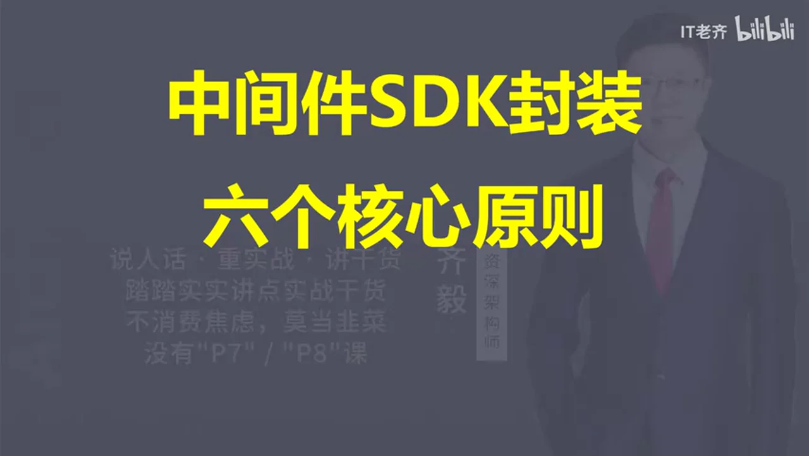

### 关键帧 2

### 关键帧 3

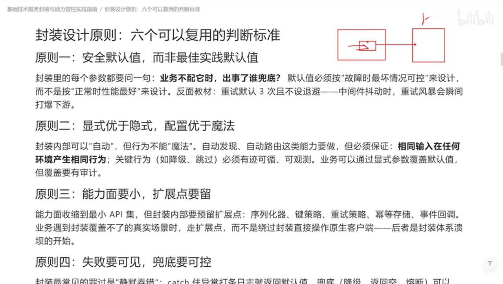

### 关键帧 4

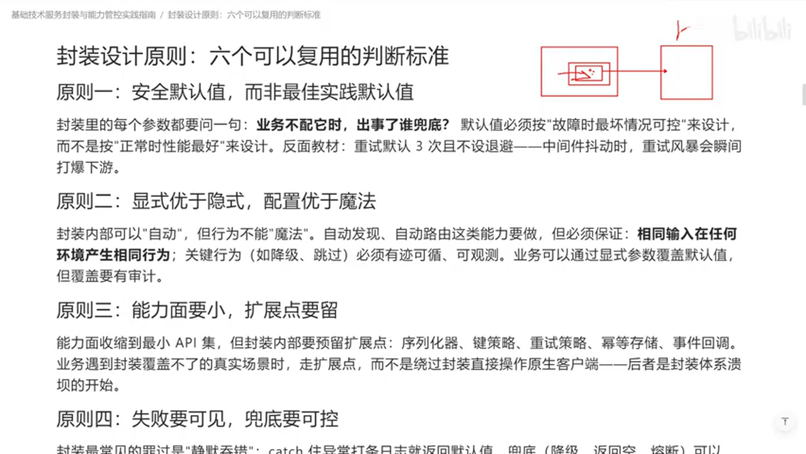

### 关键帧 5

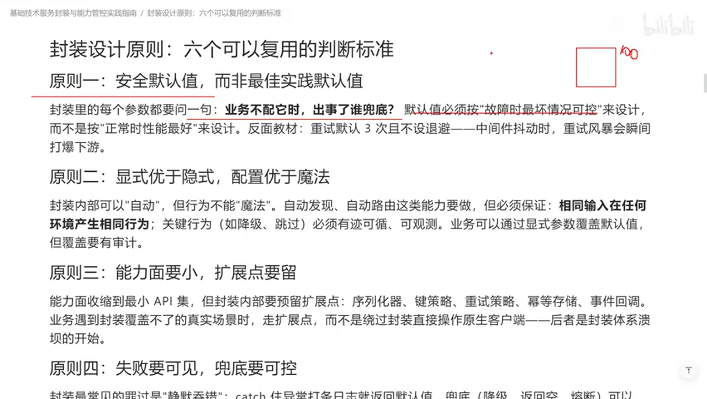

### 关键帧 6

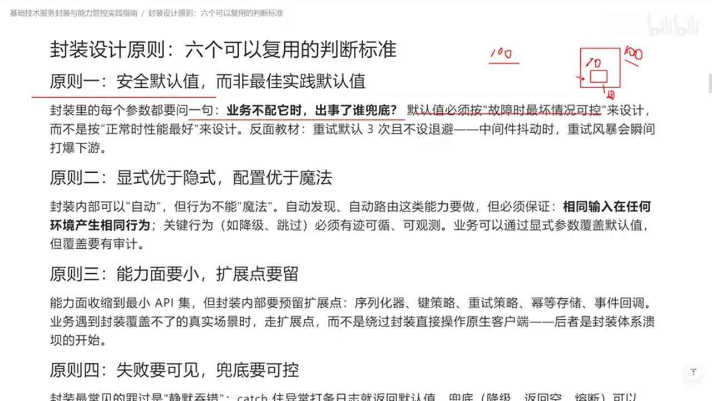

### 关键帧 7

### 关键帧 8

### 关键帧 9

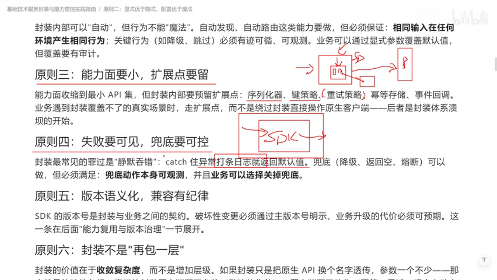

### 关键帧 10

