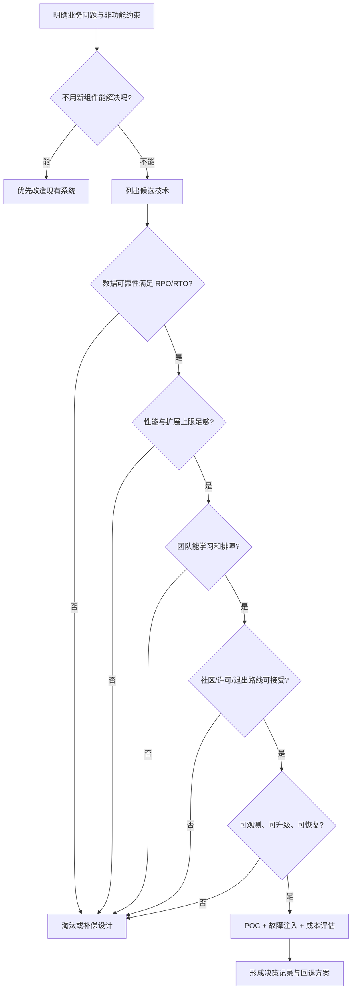

# 总结稿

[打开单页 HTML 总结](assets/bilibili-BV1vs8Y6FEf6-summary.html)

## 核心结论

开源技术选型不是“比较功能最多、性能最高的产品”，而是用一组约束逐层排除不适合当前场景的方案：**先确认确有业务问题，再依次检查数据风险、增长上限、团队承接能力、长期治理与许可、生产可观测性**。六项原则不是六个平行打分项，而是一条从“为什么引入”到“上线后能否持续维护”的审查链。

## 六项递进原则

1. **必要性与场景适配**（[00:41–03:16]）：先问“不引入能否解决”，再问候选组件具体解决哪个问题。产品没有脱离工作负载的绝对好坏；一致性、延迟、吞吐、隔离和成本目标必须写清。
2. **数据可靠性与一致性**（[03:58–05:20]）：明确 RPO、RTO、复制与持久化策略，并用故障演练验证。MySQL 官方文档确认默认复制为异步、也支持半同步复制；异步模式下源库故障可能损失尚未传至副本的事务。[MySQL 半同步复制手册](https://dev.mysql.com/doc/refman/8.4/en/replication-semisync.html)
3. **性能与扩展上限**（[05:22–06:30]）：不要只看今天的平均负载，要问峰值、增长、扩容方式、数据重平衡和迁移代价。视频对“传统 MySQL 手工迁移”的概括较宽，实际必须绑定版本、拓扑与运维工具。
4. **团队技能与学习成本**（[06:32–07:25]）：技术由人维护；至少要明确谁能独立排障、招聘是否可行、新成员多久上手。视频称“Istio 在中国使用很少”并归因于人才、成本和排障难度，但没有可靠的时间、地域和样本口径，**只能视为讲者经验判断，不能当采用率事实**。
5. **社区生态与长期维护**（[07:25–08:34]）：检查维护活跃度、issue/PR 响应、发布节奏、治理集中度、许可证和退出路线。Redis 的许可存在明显版本漂移：**7.2 及以前为 BSD-3-Clause；7.4 起为 RSALv2/SSPLv1 双许可；Redis 8 又加入 AGPLv3 选项**。因此视频笼统说“Redis 7.x 改为 SSPL”不准确，任何决策都应以目标版本的当前官方许可为准。[Redis Licensing Overview](https://redis.io/legal/licenses/) · [Redis 许可变更公告](https://redis.io/blog/redis-adopts-dual-source-available-licensing/)
6. **可观测性与可运维性**（[08:34–09:25]）：上线前确认指标、日志、告警、诊断手段和滚动升级路径。MySQL Server 通常不原生暴露 Prometheus 指标，但可通过 `mysqld_exporter` 等集成采集，不能简化成“完全不支持 Prometheus”。[Prometheus mysqld_exporter](https://github.com/prometheus/mysqld_exporter)

## 三个必须校准的技术细节

- **Redis AOF 不是“默认必丢一秒”**：`appendfsync everysec` 下，故障时存在约一秒的潜在数据丢失窗口；这是风险上限描述，不是每次故障的必然结果。RDB 的潜在窗口通常与快照间隔有关，可能更长。[Redis persistence](https://redis.io/docs/latest/operate/oss_and_stack/management/persistence/)
- **Pulsar 多租户方向得到官方资料支持**（[03:17–03:57]）：tenant/namespace 可承载认证、授权、配额和隔离策略，并支持 broker/bookie 隔离；但视频关于当时其他 MQ “不成熟”的说法缺少年份与版本，无法精确核查。[Pulsar Multi Tenancy](https://pulsar.apache.org/docs/4.0.x/concepts-multi-tenancy/) · [Pulsar Isolation](https://pulsar.apache.org/docs/4.2.x/administration-isolation/)
- **产品级口号不能代替配置级验证**：复制、持久化、扩容和可观测能力都会随版本、拓扑和配置改变；选型结论必须落到可复现的 POC 与故障演练。

## 可直接复用的选型清单

- **问题**：不用新组件能否解决？必须解决的功能与非功能约束是什么？
- **数据**：RPO/RTO 是多少？复制、持久化与故障切换的损失窗口是否被演练验证？
- **容量**：今天规模、三年规模与峰值系数是什么？scale-up、scale-out、迁移和重平衡代价怎样？
- **人员**：谁能维护？招聘与培训成本多大？出现复杂故障时是否有人能独立定位？
- **持续性**：近期开源活动、发布节奏、治理结构、许可证、替代品和迁移路径是否清楚？
- **生产性**：指标、日志、告警、诊断、备份恢复和滚动升级是否齐全？复杂组件的运维人力是否计入总成本？

## 观众讨论与补充

本次只有 **5 条热门顶层评论候选**；平台/API 可见 8 条，抓取与候选均为 5 条，且不含嵌套回复。评论倾向风险规避，提出了项目治理集中度、机构信誉和安全合规等补充维度，也出现“按来源地一刀切”的过度简化。它们只能作为待检验问题，不能作为项目质量证明或总体观众意见。

一位观众称其项目因使用 fastjson 被安全扫描要求整改；这是未经核验的个人经历，只能提示把安全扫描与合规门槛纳入选型。另有评论按 Spring、Apache、大厂等品牌排序或排斥某一来源地，这些启发式不能替代对具体版本、治理、许可证、漏洞响应和退出成本的逐项审查。

弹幕元数据报告平台有 1 条，但本次 `current_accessible` 实际取得 **0 条**，没有可分析文本，因而不能推断弹幕情绪、共识或热点。

## 一句话行动建议

把六项原则改写成带证据栏的“淘汰清单”：任何候选只要在关键业务适配、数据损失边界或生产可维护性上无法给出可验证答案，就先暂停引入；通过者再比较性能和成本，而不是反过来。

# 辅助理解

## 辅助理解：从“技术比较”转向“约束淘汰”

六项原则最好理解成一道逐层收紧的闸门。前一关回答“值不值得引入”，中间几关回答“会不会在数据、容量或人员上失控”，最后两关回答“项目和系统能否活到退役”。

### 1. 问题先于产品

画面把“业务问题匹配”置于第一原则。正确顺序是先写出工作负载和约束，再要求每个候选回答“你具体解决我的哪个问题”。例如 Redis 适不适合作存储，取决于一致性、持久性、延迟和数据价值，而不是一句“Redis 能不能替代 MySQL”。

可以把需求压缩成四行：

- 输入规模与峰值；
- 一致性、RPO、RTO；
- 延迟与吞吐目标；
- 预算、人员与交付期限。

如果这四行写不出来，产品对比表越精细，越可能是在精确回答错误的问题。

### 2. 先测不可逆损失，再看跑分

数据丢失通常比短时性能下降更难补救，所以应先验证复制、持久化和切换行为。视频的 Redis AOF 表述需要收窄：`appendfsync everysec` 表示故障时可能有约一秒风险窗口，并非每次都必然丢一秒。MySQL 默认异步复制的确可能留下尚未同步的事务，半同步复制则以等待副本确认为代价提高完整性。

一次有价值的 POC 不应只跑吞吐测试，还应主动停止主节点、制造网络延迟、观察副本追赶，并记录真实 RPO/RTO。随后才评估峰值、增长、scale-up/scale-out 和数据迁移成本。

### 3. “有人会”是架构约束，不是软性偏好

第四、第五原则把技术边界扩大到组织和时间：谁能值班、谁能定位内核级问题、招聘是否可行、项目是否持续发布、许可证会不会改变、迁移出口是否存在。它们会直接改变总拥有成本。

但不要把经验判断升级为统计事实。视频对 Istio 在中国采用率的说法没有可靠样本、地域和时间口径，只能作为“复杂封装可能提高排障门槛”的提醒。类似地，项目所属机构或来源地只能提供搜索线索，不能替代项目级尽调。

Redis 许可也说明“技术不变、约束会变”：7.2 及以前、7.4、8+ 的可选许可不同。选型记录必须写明**具体版本 + 许可文本 + 使用方式**，而不是只写“采用 Redis”。

### 4. 上线不是终点，能被理解和修复才算可用

第六原则关心生产系统是否“看得见、查得了、修得动”。指标、日志、追踪、告警、备份恢复、升级路径和故障手册，应在选型阶段验证，而不是上线后补票。MySQL 通常通过 `mysqld_exporter` 等集成接入 Prometheus；这说明“需要额外集成”和“完全不支持”是两种不同判断。

### 决策记录模板

| 闸门 | 必答问题 | 合格证据 | 常见误区 |
|---|---|---|---|
| 必要性 | 不引入能否解决？ | 现状基线、问题定义 | 先选产品再找场景 |
| 数据 | 最坏损失与恢复多久？ | 故障演练、RPO/RTO | 把默认值当保证 |
| 容量 | 峰值与三年增长能否承载？ | 压测、扩缩容演练 | 只看功能清单 |
| 团队 | 谁能维护和排障？ | 人员清单、培训计划 | 把学习成本记为零 |
| 持续性 | 许可、治理、退出路线？ | 版本许可、迁移 POC | 用品牌或地域替代审查 |
| 生产性 | 如何观察、升级、恢复？ | 仪表盘、告警、Runbook | 上线后再补可观测性 |

## 观众意见的正确用法

5 条热门顶层评论候选可以帮助发现“治理集中度”“安全扫描”“维护连续性”等追问，但不能用于给项目排名。样本来自热门排序，不含嵌套回复，也不能代表全体观众。弹幕实际可访问文本为 0 条，因此没有弹幕热点或情绪可分析。

把评论转成问题，而不是结论：

- 不问“某地项目是否都不可靠”，而问“该项目近六个月维护、漏洞响应和退出路线如何”；
- 不问“某基金会品牌是否必然更好”，而问“治理权、发布权和关键维护者是否过度集中”；
- 不把个人整改经历当漏洞证明，而把组织的安全扫描、SBOM 与修复 SLA 写进准入门槛。

## 校准后的知识边界

- Pulsar 多租户及 broker/bookie 隔离得到官方文档支持，但视频对同期其他 MQ 成熟度的判断缺少年份与版本。
- Redis AOF 的“一秒”是特定 fsync 策略下的潜在窗口，不是必然结果。
- Redis 许可结论必须按目标版本刷新；视频的“7.x 全部改为 SSPL”已经过宽且过时。
- Istio 地区采用率及其因果归因未经可靠数据支持。
- 课件帧用于说明作者的检查框架，不是产品行为的现场测试证据。

## 外部事实核验

### 声明 1（03:32）

- 视频陈述：Apache Pulsar 天然适配云原生多租户，并能做逻辑和物理隔离。
- 核验状态：已确认
- 核验结果：官方文档确认 Pulsar 从设计上支持多租户；tenant/namespace 可承载认证、授权、配额和隔离策略，并支持 broker/bookie 层隔离。因此主张方向成立。
- 检索日期：2026-08-25
- 来源：
  - [Apache Pulsar Multi Tenancy](https://pulsar.apache.org/docs/4.0.x/concepts-multi-tenancy/)（primary）
  - [Apache Pulsar Isolation](https://pulsar.apache.org/docs/4.2.x/administration-isolation/)（primary）

### 声明 2（04:24）

- 视频陈述：MySQL 默认异步复制，源库故障切换时可能丢失尚未同步的事务；也支持半同步复制。
- 核验状态：已确认
- 核验结果：MySQL 官方手册确认默认复制为异步，已提交事务可能尚未传到副本；半同步复制可在提交返回前等待副本确认，从而提高数据完整性。
- 检索日期：2026-08-25
- 来源：
  - [MySQL Reference Manual: Semisynchronous Replication](https://dev.mysql.com/doc/refman/8.4/en/replication-semisync.html)（primary）

### 声明 3（04:46）

- 视频陈述：Redis AOF 默认策略下可能丢一秒数据，RDB 的潜在丢失窗口更大。
- 核验状态：已确认
- 核验结果：Redis 官方文档确认 appendfsync everysec 是典型默认 AOF 策略，故障时数据可能旧至约一秒；RDB 按快照间隔持久化，可能丢失最近数分钟数据。应理解为风险窗口，而非必然丢失。
- 检索日期：2026-08-25
- 来源：
  - [Redis persistence](https://redis.io/docs/latest/operate/oss_and_stack/management/persistence/)（primary）

### 声明 4（06:57）

- 视频陈述：Istio 在中国使用很少，主要因为人才少、价格高且排障难。
- 核验状态：未验证
- 核验结果：未找到具有明确时间、样本与地域口径的一手采用率数据支持“中国使用很少”及其因果归因。该说法属于讲者经验判断。
- 检索日期：2026-08-25
- 来源：未找到可链接来源

### 声明 5（07:58）

- 视频陈述：Redis 7.x 从开放许可改为 SSPL，封死衍生路线并可能带来商业成本。
- 核验状态：已过时
- 核验结果：版本表述不准确。Redis 7.2 及以前仍为 BSD-3-Clause；从 7.4 起改为 RSALv2/SSPLv1 双许可，两者均非 OSI 批准。Redis 8 起又增加 OSI 批准的 AGPLv3 选项。因此视频指出许可风险是对的，但“7.x”概括过宽且已被后续变化部分更新。
- 检索日期：2026-08-25
- 来源：
  - [Redis Licensing Overview](https://redis.io/legal/licenses/)（primary）
  - [Redis Adopts Dual Source-Available Licensing](https://redis.io/blog/redis-adopts-dual-source-available-licensing/)（primary）

### 声明 6（08:47）

- 视频陈述：MySQL 默认不支持 Prometheus，需要额外部署 MySQL Exporter。
- 核验状态：部分确认
- 核验结果：作为“原生指标端点”的表述基本成立：Prometheus 官方生态使用 mysqld_exporter 抓取 MySQL 指标；但说 MySQL ‘不支持 Prometheus’过于绝对，实际可通过官方生态 Exporter 和其他集成实现。
- 检索日期：2026-08-25
- 来源：
  - [Prometheus mysqld_exporter](https://github.com/prometheus/mysqld_exporter)（primary）

# Data

## 增强转写稿

[00:00] 说完话,正式来讲看后,你好,欢迎来到IT 老齐的架构 900 讲
[00:03] 我是您的 IT 私人顾问老齐
[00:05] 到现在我已经录制了十多门与编程架构的最新课程
[00:08] 同时还会提供简历优化模拟面试、offer 选择、课程指导,工作建议等多种服务
[00:13] 只要我有经验的事情,一定坦诚相待
[00:16] 有兴趣的小伙伴可以看一下评论区
[00:18] 今天我们分享一个特别实用的内容
[00:21] 在开源的组件选型,技术选型的过程中
[00:25] 有哪六个重要的原则,是我在过去20年时间里边一直在践行,没有犯错的呢
[00:32] 来,我们看一下吧
[00:33] 好,老规矩,我们回到笔记来进行讲解
[00:35] 作为这六原则的话,是一次递进的
[00:38] 首先,我们来说第一个原则
[00:41] 第一个原则叫做必要性与问题适配原则
[00:43] 什么意思呢?
[00:44] 我们在要引入一个中间件的时候
[00:47] 首先,咱们要考虑一个
[00:49] 到底如果不引入这个中间件,我们能不能解决问题
[00:53] 比如很多同学会把Redis作为一个前置
[00:56] 然后我们把它作为数据的缓存,提高系统的性能查询
[01:00] 那当然,要增加Redis的一套服务器,对吧
[01:04] 那还有一种可能呢
[01:06] 之前我们就在工行的时候,针对Oracle数据库发现
[01:09] 针对某些特定表和路由到某些特定服务器的时候,它就是会慢
[01:14] 然后我们通过对资源的合理的配置增加
[01:17] 在Oracle内部的内存来说,增加了更大的缓存,达到了相同的效果
[01:22] 那这样,不但没有增加额外的成本
[01:25] 同时呢,还让我们的性能提升了
[01:28] 这就是你看一个优秀的、成熟的架构师、软件设计者
[01:33] 他要做的事情
[01:34] 那针对我们当前的情况,先问
[01:37] 这个事情如果不用,它能不能解决
[01:40] 如果答案是否定的,说必须要用
[01:43] 那我们再去说,怎么用,选哪个
[01:46] 最常见的一些问题就是,你选错了
[01:49] 那这是一个根基性的问题
[01:52] 一旦选错,那未来就是天坑,需要大规模的调整
[01:56] 而这里,很多同学会产生一个错误的现象,说
[02:00] 我们用Redis,就是不能替代MySQL
[02:03] 其实这也有时偏颇
[02:05] 在技术选型的时候,你要为具体的业务问题先匹配
[02:10] 比如,如果我们是做传统的金融应用
[02:14] 我们需要数据进行,事务能力的可靠存储
[02:17] 那这时,如果你使用Redis,作为核心存储
[02:21] 那就是有问题的,对吧
[02:23] 但是,如果我们是一个超高并发的系统
[02:28] 可以牺牲数据的一致性,优先保证用户的高速响应
[02:32] 那使用Redis,那就是没问题的
[02:35] 你像阿里、京东,都是这么做的
[02:38] 所以,作为这个组件选型
[02:41] 它要结合我们业务的场景,来不断的去适配
[02:45] 那在行业中,有一些常规场景下的技术选型
[02:50] 比如说,不要用Redis作核心存储
[02:53] 如果低频率的强调实时性的东西
[02:57] 不要用Kafka作低频的小消息的传递
[03:00] 像诸如此类的这种业务错配,是要调整起来
[03:04] 未来是非常昂贵的
[03:06] 这是我们说到的第一个问题
[03:08] 你要先弄清楚,本次引入要解决什么问题
[03:12] 而这些组件,它能否很好的帮助我们解决
[03:16] 例如,早些年我们就会发现一个现象
[03:19] 在RabbitMQ和Kafka,还不是那么成熟的时候
[03:24] 我们现在需要做一个底层的MQ消息队列
[03:27] 核心的关注点是,存在是否支持多租户
[03:32] 国外又很火的Pulsar就是引入到了我们的视野
[03:36] 因为它天然的就是云原生适配
[03:39] 多租户不单可以做逻辑的隔离,还能做物理的隔离
[03:43] 这特别适配于我们现有的场景
[03:47] 至于它的性能好与坏,或者它的可靠性同样很优秀
[03:51] 但并不是第一考虑
[03:53] 经过这样的一个处理以后,我们选择了Pulsar
[03:56] 作为一个底层支持
[03:58] 第二点,便是数据的可靠性
[04:00] 作为中间建,数据库,各种组件
[04:03] 最终的数据和性能之间,它们彼此是一个此消彼长的
[04:08] 比如你想要数据更为可靠,更强的一致性
[04:11] 那可能就要去牺牲同步阻塞的时间
[04:14] 所以你要用什么样的场景,就必须要了解对应的数据产品
[04:20] 它是如何做到数据同步,或者数据处理的
[04:24] 比如MySQL中,它既支持了纯粹的异步传输
[04:29] 但是在主从切换的时候,异步传输会导致数据没来得及同步
[04:33] 会导致丢失的问题
[04:35] 还还支持半同步,同步传输
[04:38] 那如果你使用MySQL,是不是要在这里边选择合适
[04:43] 使用我们自己的场景呢?
[04:45] 同时,作为Redis来说,默认的AOF,默认情况下
[04:49] 基于日志,会丢一秒的数据
[04:52] 而RDB的数据丢失,它的可能间隔会比较大
[04:56] 那因此Redis这些特性是否满足呢?
[05:00] 关于这些数据的可靠性和分发的一致性
[05:03] 这是我们考虑的最重要的点
[05:06] 那在我们最终实践中,尽可能地优先保证数据不丢的情况下
[05:12] 来提升性能,如果性能实在拉不到
[05:16] 那我们再去考虑,牺牲一些一致性
[05:19] 这是我们思考的维度
[05:22] 而第三个,性能和扩展上限
[05:25] 有句老话说的好,这个性能不够，设备来凑
[05:29] 作为我们的中间线也好,数据库也好
[05:32] 是否支持水平扩容,是一个非常重要的指标
[05:36] 现在我们的软件是没问题
[05:39] 那过了三年五年,业务量大,数据量大以后,那会出现什么呢?
[05:43] 所以你要去了解
[05:44] 如果我们要扩展新的节点,新的集群
[05:49] 它能否扛得住,或者它遷移的代价究竟有多大
[05:55] 比如现在很多的分布式的数据库
[05:57] 你直接加新节点,配置上,所有的底层的数据分发全都给你做好了
[06:03] 但是很多传统的MySQL,你要加入新节点,新集群的时候
[06:07] 那这个还往往需要大量的手动迁移的工作
[06:12] 所以在业务实战过程,性能和扩展性是我们要评估的另外一个考量点
[06:18] 而这些是你要了解底层它的设计的
[06:21] 并不是说架构师简单的知道我以前别的项目用什么
[06:26] 现在我就拿过来用,不是的,那叫做刻舟求剑
[06:29] 一定要与我们场景来进行适配
[06:32] 第四个,这是很多同学容易忽略的,叫做团队技能和学习成本
[06:38] 在进行系统评估的时候,第一个约束叫做有人会,没错
[06:44] 如果一个东西很新,没人会,那你这个东西再好
[06:50] 那都是架在那，出了问题,没人修,没人管
[06:53] 这里边的技术风险,成本都会爆炸
[06:57] 你就拿现在咱们说到Istio这么好
[07:00] 它封装程度很高,直接在Istio服务网格上部署各种各样的应用程序,没问题吧
[07:05] 但是为什么在中国现在用的还很少,不就是因为会它的人太少了吗
[07:10] 一是价格高,另外出了问题以后排查的难度大,它封装程度太高了
[07:16] 在实际的项目中,团队和学习成本也是不能被忽略的
[07:21] 至少你在团队中要有一个对这东西非常熟悉的人
[07:25] 而第五个,社区生态和长期维护,活的久比跑的快,更加重要
[07:31] 这里边我们就要重点点名某A字开头的一个厂商
[07:36] 出了名的管杀不管埋,一开始很好的设计出来了以后
[07:40] 但是随着内部裁员也好,还是什么也好
[07:43] 大量的原本优秀的组件和使用它开发的这些项目,它就抛弃不管了
[07:49] 所以社区生态它是否稳健,也是非常关键的
[07:53] 另外还有一点需要关注,就是它的许可协议是什么样的
[07:57] 早些年Redis的话,它7.X的协议,从原始的很开放的版本变成了SSPL东西
[08:06] 一下子就封死了云原生的路,人们也会因为你改造可能会产生了商业成本
[08:13] 那么我们不去选择它,这里长期维护和社区生态不代表了
[08:19] 我们的软件不能用,它不维护了,还有一个就是协议发生了变化
[08:24] 选择了更严格的协议,以前我们的这些运用场景套在新协议上
[08:29] 这里的问题其实并不罕见,像Redis、ES都是诸如此类的
[08:34] 原则6,可观测性,我们的软件是否内置了足够的日志、指标
[08:41] 它的这些监控点或者预留的监控信息,这也是我们重要的考量点
[08:46] 比如MySQL,它就默认对Prometheus没支持,我们需要额外去部署像什么
[08:53] MySQL Exporter,这些东西你说它可以做到,但是相比起原生支持来说还是要差不少的
[09:01] 而我为什么把可观测性和可运维性放得这么高呢,是因为上生产了以后
[09:07] 那整个运行的过程对我们来说是个黑盒子呀,我们只有通过可运维性可观测性的
[09:13] 这些指标日志才能了解它,它跑得对不对,跑得快不快呀
[09:18] 而这些东西,改造的工作量越少,适配程度越高,那自然是越好的
[09:25] 好,以上就是我给大家分享的,我自己技术选型的六个原则,希望能对您有一些帮助和启发

## 原始转写稿

[00:00] 说完话,正式来讲看后,你好,欢迎来到阿提老街的架构九百奖
[00:03] 我是一名的IT私人公认老七
[00:05] 到现在我已经录制了十多门与编程架构的最新课程
[00:08] 同时还会提供简历优化模拟面识,off选择,课讹程制导,工作建议等多种服务
[00:13] 只要我有经验的事情,一定坦诚相待
[00:16] 有兴趣的小伙伴可以看一下评论区
[00:18] 今天我们分享一个特别实用的内容
[00:21] 在开源的组建选型,技术选型的过程中
[00:25] 有哪六个重要的原则,是我在过去20年时间里边一直在建型,没有犯错的呢
[00:32] 来,我们看一下吧
[00:33] 好,老规矩,我们回到笔记来进行讲解
[00:35] 作为这六原则的话,是一次递进的
[00:38] 首先,我们来说第一个原则
[00:41] 第一个原则叫做一页五问题的适配原则
[00:43] 什么意思呢?
[00:44] 我们在要引入一个中间界的时候
[00:47] 首先,咱们要考虑一个
[00:49] 到底如果不引入这个中间界,我们能不能解决问题
[00:53] 比如很多同学会把Redis作为一个前置
[00:56] 然后我们把它作为数据的缓存,提高系统的性能查询
[01:00] 那当然,要增加Redis的一套服务器,对吧
[01:04] 那还有一种可能呢
[01:06] 之前我们就在工行的时候,针对Oreco数据库发现
[01:09] 针对某些特定表和路由到某些特定服务器的时候,它就是会慢
[01:14] 然后我们通过对资源的合理的配置增加
[01:17] 在Oreco内部的内存来说,增加了更大的缓存,达到了相同的效果
[01:22] 那这样,不但没有增加额外的成本
[01:25] 同时呢,还让我们的性能提升了
[01:28] 这就是你看一个优秀的、成熟的架构师、软件设计者
[01:33] 他要做的事情
[01:34] 那针对我们当前的情况,先问
[01:37] 这个事情如果不用,它能不能解决
[01:40] 如果答案是否定的,说必须要用
[01:43] 那我们再去说,怎么用,选哪个
[01:46] 最常见的一些问题就是,你选错了
[01:49] 那这是一个根基性的问题
[01:52] 一旦选错,那未来就是天空,需要大规模的调整
[01:56] 而这里,很多同学会产生一个错误的现象,说
[02:00] 我们用Redis,就是不能替代Messico
[02:03] 其实这也有时偏颇
[02:05] 在技术选型的时候,你要为具体的业务问题先匹配
[02:10] 比如,如果我们是做传统的金融应用
[02:14] 我们需要数据进行,事务能力的可靠存储
[02:17] 那这时,如果你使用Redis,作为核心存储
[02:21] 那就是有问题的,对吧
[02:23] 但是,如果我们是一个超高并发的系统
[02:28] 可以牺牲数据的一致性,优先保证用户的高速响应
[02:32] 那使用Redis,那就是没问题的
[02:35] 你像阿里、京东,都是这么做的
[02:38] 所以,作为这个组建选型
[02:41] 它要结合我们业务的场景,来不断的去适配
[02:45] 那在行业中,有一些常规场景下的技术选型
[02:50] 比如说,不要用Redis作核心存储
[02:53] 如果低频率的强调实施性的东西
[02:57] 不要用卡夫卡作低频的小消息的传递
[03:00] 像诸如此类的这种业务错配,是要调整起来
[03:04] 未来是非常昂贵的
[03:06] 这是我们说到的第一个问题
[03:08] 你要先弄清楚,本次引入要解决什么问题
[03:12] 而这些组建,它能否很好的帮助我们解决
[03:16] 例如,早些年我们就会发现一个现象
[03:19] 在Ribbit MQ和卡夫卡,还不是那么成熟的时候
[03:24] 我们现在需要做一个底层的MQ消息对列
[03:27] 核心的关注点是,存在是否支持多组互
[03:32] 国外又很火的PoSa就是引入到了我们的事业
[03:36] 因为它天然的就是云原生适配
[03:39] 多组互不单可以做逻辑的隔离,还能做物理的隔离
[03:43] 这特别适配于我们现有的场景
[03:47] 至于它的性能好与坏,或者它的可靠性同样很优秀
[03:51] 但并不是第一考虑
[03:53] 经过这样的一个处理以后,我们选择了PoSa
[03:56] 作为一个底层支持
[03:58] 第二点,便是数据的可靠性
[04:00] 作为中间建,数据户,各种组建
[04:03] 最终的数据和性能之间,它们彼此是一个此消彼长的
[04:08] 比如你想要数据更为可靠,更强的一致性
[04:11] 那可能就要去牺牲同步组色的时间
[04:14] 所以你要用什么样的场景,就必须要了解对应的数据产品
[04:20] 它是如何做到数据同步,或者数据处理的
[04:24] 比如MySQL中,它既支持了纯粹的异补传输
[04:29] 但是在主统切换的时候,异补传输会导致数据没来得及同步
[04:33] 会导致丢失的问题
[04:35] 还还支持半同步,同步传输
[04:38] 那如果你使用MySQL,是不是要在这里边选择合适
[04:43] 使用我们自己的场景呢?
[04:45] 同时,作为Redis来说,默认的AOF,默认情况下
[04:49] 基于日治,会丢一秒的数据
[04:52] 而RDB的数据丢失,它的可能间隔会比较大
[04:56] 那因此Redis这些特性是否满足呢?
[05:00] 关于这些数据的可靠性和分发的一致性
[05:03] 这是我们考虑的最重要的点
[05:06] 那在我们最终实践中,仅可能的优先保证数据不丢的情况下
[05:12] 来提升性能,如果性能实在拉不到
[05:16] 那我们再去考虑,牺牲一些一致性
[05:19] 这是我们思考的维度
[05:22] 而第三个,性能和扩展上限
[05:25] 有句老话说的好,这个性能不够,设为凑
[05:29] 作为我们的中间线也好,数据库也好
[05:32] 是否支持水平扩容,是一个非常重要的指标
[05:36] 现在我们的软件是没问题
[05:39] 那过了三年五年,业务量大,数据量大以后,那会出现什么呢?
[05:43] 所以你要去了解
[05:44] 如果我们要扩展新的节点,新的集群
[05:49] 它能否扛得住,或者它遷移的代价是否足多大
[05:55] 比如现在很多的分布式的数据库
[05:57] 你直接加新节点,配置上,所有的底层的数据分发全都给你做好了
[06:03] 但是很多传统的Messico,你要加入新节点,新集群的时候
[06:07] 那这个还往往需要大量的手动迁移的工作
[06:12] 所以在业务实战过程,性能和扩展性是我们要评估的另外一个考量点
[06:18] 而这些是你要了解底层它的设计的
[06:21] 并不是说架构师简单的知道我以前别的项目用什么
[06:26] 现在我就拿过来用,不是的,那叫做克州球舰
[06:29] 一定要与我们场景来进行适配
[06:32] 第四个,这是很多同学容易忽略的,叫做团队技能和学习成本
[06:38] 在进行系统评估的时候,第一个约束叫做有人会,没错
[06:44] 如果一个东西很新,没人会,那你这个东西再好
[06:50] 那都是架车单,出轮问题,没人修,没人赶
[06:53] 这里边的技术风险,成本都会爆炸
[06:57] 你就拿现在咱们说到Estio这么好
[07:00] 它封装程度很高,直接在Estio服务网格上部署各种各样的应用程序,没问题吧
[07:05] 但是为什么在中国现在用的还很少,不就是因为会它的人太少了吗
[07:10] 一是价格高,另外出了问题以后排差的难度大,它封装程度太高了
[07:16] 在实际的项目中,团队和学习成本也是不能被忽略的
[07:21] 至少你在团队中要有一个对这东西非常熟悉的人
[07:25] 而第五个,社区生态和长期维护,活的久比跑的快,更加重要
[07:31] 这里边我们就要重点点名某A字开头的一个厂商
[07:36] 出了名的管杀不管埋,一开始很好的设计出来了以后
[07:40] 但是随着内部裁员也好,还是什么也好
[07:43] 大量的原本优秀的组件和使用它开发的这些项目,它就抛筹不管了
[07:49] 所以社区生态它是否稳健,也是非常关键的
[07:53] 另外还有一点需要关注,就是它的协议维护是什么样的
[07:57] 早些年Redis的话,它7.X的协议,从原始的很开放的版本变成了SSPL东西
[08:06] 一下子就封死了音乐生的录,人们也会因为你改造可能会产生了商业成本
[08:13] 那么我们不去选择它,这里长期维护和社区生态不代表了
[08:19] 我们的软件不能用,它不维护了,还有一个就是协议发生了变化
[08:24] 选择了更严格的协议,以前我们的这些运用场景套在新协议上
[08:29] 这里的问题轻时并不罕见,像Redis、ES都是主如此类的
[08:34] 原则6,可观测性,我们的软件是否内置了足够的日治、指标
[08:41] 它的这些监控点或者预留的监控信息,这也是我们重要的考量点
[08:46] 比如Messico,它就默认对普隆明斯没支持,我们需要额外去部署像什么
[08:53] Messico exporter,这些东西你说它可以做到,但是相比起原生支持来说还是要差不少的
[09:01] 而我为什么把可观测性和可运为性放得这么高呢,是因为上生产了以后
[09:07] 那整个运行的过程对我们来说是个黑盒子呀,我们只有通过可运为性可观测性的
[09:13] 这些指标日治才能了解它,它跑得对不对,跑得快不快呀
[09:18] 而这些东西,改造的工作量越少,适配程度越高,那自然是越好的
[09:25] 好,以上就是我给大家分享的,我自己基础选项的六个原则,希望能对您有一些帮助和启发

## 原始关键帧

### 关键帧 1

### 关键帧 2

### 关键帧 3

### 关键帧 4

### 关键帧 5

### 关键帧 6

### 关键帧 7

### 关键帧 8

### 关键帧 9

### 关键帧 10

## 补充原始数据

- [bilibili-BV1vs8Y6FEf6-comments.jsonl](assets/bilibili-BV1vs8Y6FEf6-comments.jsonl)
- [bilibili-BV1vs8Y6FEf6-comment-candidates.json](assets/bilibili-BV1vs8Y6FEf6-comment-candidates.json)
- [bilibili-BV1vs8Y6FEf6-danmaku.jsonl](assets/bilibili-BV1vs8Y6FEf6-danmaku.jsonl)
- [bilibili-BV1vs8Y6FEf6-danmaku-analysis.json](assets/bilibili-BV1vs8Y6FEf6-danmaku-analysis.json)
- [bilibili-BV1vs8Y6FEf6-visual-summary.png](assets/bilibili-BV1vs8Y6FEf6-visual-summary.png)
- [bilibili-BV1vs8Y6FEf6-summary.html](assets/bilibili-BV1vs8Y6FEf6-summary.html)
