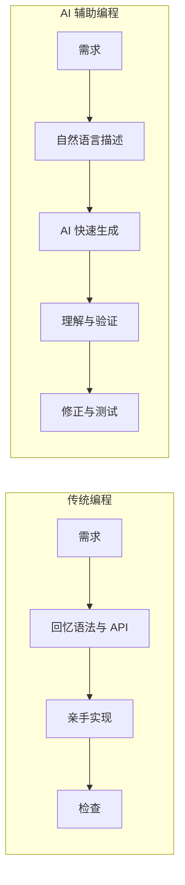
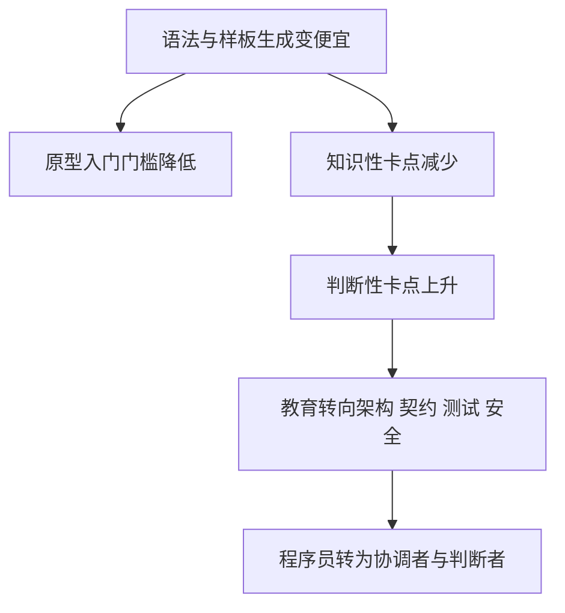
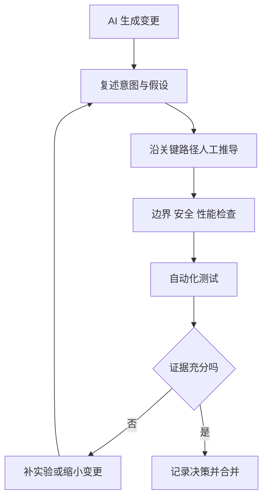

# 总结稿

## 核心结论

视频认为，AI 没有消除编程的认知负担，而是把困难从“回忆怎么写”迁移到“判断这样写是否正确”。语法、API 和样板代码可由 AI 充当外部记忆来补齐，但开发者必须投入更多精力理解执行路径、验证边界条件、评估安全性、维护性及系统一致性，因此生成更快并不等于工作更轻松。

视频据此概括四个转变：生成原型的入门门槛降低，但生成好代码所需的判断门槛可能升高；知识性卡点转为判断性卡点；教育重点应从语法记忆转向架构、契约、状态、故障模式和测试；程序员角色则由“知识容器”转为协调者、判断者和 AI 编排者。

## 实践建议

- 不只衡量 AI 节省了多少编码时间，还要衡量验证、修正和维护成本。
- 对关键路径保持亲手推导，持续检查、质疑并测试 AI 输出，以维护代码库心智模型。
- 团队不应以代码行数或工具熟练度作为主要绩效标准，应更重视架构决策、系统思维与非功能需求判断。
- 接受 AI 的生成效率，但不把最终判断权交给模型。

## 核验边界

已定位 Jeremy Osborn 2026 年发表的 CACM 同名文章；Official ACM 于 7 月 29 日转载。原文明确列出视频转述的四项转变，因此出处与核心框架得到确认。[CACM 原文](https://cacm.acm.org/opinion/ai-didnt-make-programming-easier-it-just-made-it-differently-difficult/) · [Official ACM 转载](https://theofficialacm.substack.com/p/ai-didnt-make-programming-easier)

原文也提出“过度外包思考可能削弱内部心智模型”的风险，并援引多项相关研究；但这仍是跨研究的综合推断，不应扩写成已由单一因果实验普遍证明的定律。

# 辅助理解

## 辅助理解

### 1. AI 改变的是认知负担的分布

**视频内容：** 传统编程的主要阻力常是知识性卡点：记不住语法、API、函数签名或常见模式。AI 把这些内容外部化后，开发者能快速获得可运行实现，但新的卡点变成判断：实现是否正确、安全、可维护，是否覆盖边界并符合整体设计。



视频的核心不是“AI 无效”，而是总成本的构成发生变化：

```text
传统成本 ≈ 回忆 + 实现 + 少量验证
AI 成本 ≈ 需求表达 + 生成 + 大量理解/验证 + 修正
```

是否真正提效，取决于后半段能否被工程化，而不能只看生成速度。

### 2. 四个转变可以归为一条能力迁移链

**视频内容：** 四项转变彼此相连，而不是四个孤立趋势。



- **门槛悖论**：能生成代码更容易，能判断好代码仍然困难。
- **困难迁移**：问题由“怎么写”变为“这是否真的对”。
- **教育迁移**：语法熟练度的重要性下降，复杂系统中的反馈训练上升。
- **角色迁移**：开发者从直接生产每行代码，转为维护目标、约束和系统一致性。


这句“代码不再是思考的唯一表现形式”很关键：规格、接口契约、测试、审查结论和决策记录也都是工程思考的产物。

### 3. “编排者”具体要做什么

**视频内容：** 编排不是只会给 AI 下指令，而是保有系统心智模型，并决定哪些任务可委托、哪些结论必须人工验证。开发者仍要把机器输出整合回人的意图。

**AI 辅助推断：** 可以把编排责任拆成四层：

1. **定义目标**：把需求写成可观察的行为和验收标准。
2. **提供约束**：给出架构边界、接口契约、安全与性能预算。
3. **要求证据**：测试结果、静态检查、基准数据和变更影响说明。
4. **作最终判断**：处理证据冲突，决定接受、返工或换方案。


因此，“AI 复审 AI”只能增加一层证据，不能消除人的责任；若多个模型共享相同错误前提，它们可能给出一致但错误的答案。

### 4. 如何避免只获得表面速度

**视频内容：** 作者建议持续亲手推导关键逻辑，在思想层面与 AI 并行工作，并通过检查、验证和质疑维持心智模型。组织层面则应减少对代码行数、工具熟练度的迷信，转而评价架构决策、系统思维和非功能需求敏感度。

一个可操作的复审循环是：



**AI 辅助推断：** 团队还可观察“生成后返工时间”“缺陷逃逸率”“审查者能否解释关键路径”“架构违规数量”，这些指标比单纯统计生成代码量更接近真实收益。

### 5. 必须保留的证据边界

**外部核验补充：** 已定位 Jeremy Osborn 2026 年发表的 CACM 同名文章；Official ACM 于 7 月 29 日转载。原文明确列出“新从业者进入、困难形式变化、教育转型、程序员从知识载体转为编排者”四项转变，确认了视频的出处与核心框架。[CACM 原文](https://cacm.acm.org/opinion/ai-didnt-make-programming-easier-it-just-made-it-differently-difficult/) · [Official ACM 转载](https://theofficialacm.substack.com/p/ai-didnt-make-programming-easier)

视频在 09:25 进一步声称，把太多思考外包给 AI 会导致代码心智模型逐渐弱化。CACM 原文确实作出这一风险判断，并援引代码理解、AI 辅助编程与学习研究；但该强因果表述仍是跨研究的综合推断，不宜当作单一实验已普遍证明的定律。更稳妥的实践立场是：把它当作需要防范的风险假设，通过关键逻辑复述、人工推导、代码审查和测试来监控。

# Data

## 增强转写稿

[00:00] 你有沒有覺得用了 AI 寫代碼之後工作反而變得更累了
[00:11] 不是那種完全寫不出代碼的無力和挫敗感
[00:14] 而是一種全新的更隱蔽的疲憊感
[00:17] 你花在閱讀代碼審查 AI 輸出反覆推理驗證上的時間
[00:23] 遠遠超過了實際動手寫代碼的時間
[00:26] 以前寫一個函數你在想怎麼實現
[00:29] 現在 AI 把實現扔給你
[00:31] 你卻在想它的實現到底對不對
[00:33] 這種感受其實不是你的錯覺
[00:35] 就在今年一篇發表在
[00:37] Communications of the ACM 上的文章
[00:40] 提出了一個非常新穎的觀點
[00:42] AI 並沒有讓編程變簡單
[00:44] 它只是讓編程變難得更不一樣了
[00:47] 這句話值得你仔細品味一下
[00:49] 它不是否定 AI 的價值
[00:51] 而是在揭示一個被大部分人忽略的事實
[00:54] 編程的困難形態已經發生了根本性的遷移
[00:57] 而大多數從業者還沒有意識到
[00:59] 這種遷移意味著什麼
[01:01] 要理解這個觀點
[01:02] 我們得先回顧一下
[01:04] 傳統編程在認知層面到底是什麼樣的
[01:07] 幾十年來的實證研究告訴我們
[01:09] 編程一直是一種極高強度的認知活動
[01:13] 程序員依賴工作記憶和長期記憶
[01:16] 來操控各種抽象概念
[01:18] 控制流 數據結構 軟件架構
[01:21] 模塊間的依賴關係 狀態變化的追蹤
[01:24] 在這個經典模型裡 記憶和回憶能力即是編程的核心能力
[01:29] 也是最大的瓶頸
[01:30] 你需要記住語法規則 記住 API 的用法
[01:34] 參數順序和返回值類型
[01:37] 記住常見的設計模式 記住各種邊界情況如何處理
[01:42] 一個優秀的程序員
[01:43] 在某種程度上就是一個語法和模式記憶大師
[01:47] 我們經常說的寫代碼寫的流暢
[01:50] 其實很大程度上是因為你不用去翻文檔 就能把東西寫出來
[01:55] 這是一種認知流暢度
[01:56] 它建立在大量記憶的基礎上
[01:59] 但現在不一樣了
[02:00] AI 編程助手正在從根本上改變這個認知模型
[02:04] 這些工具本質上就是一個外部記憶系統
[02:07] 他們幫你承擔了語法回憶的負擔
[02:10] 幫你完成了樣板代碼的生成
[02:12] 也幫你記住那些你記不住的 API 用法
[02:15] 你可以用自然語言描述你的需求
[02:17] AI 幫你把具體的代碼實現填充進去
[02:20] 這聽起來太棒了對不對
[02:22] 但關鍵在這裡
[02:23] 當記憶負擔減輕之後
[02:25] 什麼東西變得更加重要了
[02:27] 答案是推理能力 架構理解能力 判斷力
[02:31] 以及對代碼結構的整體感知
[02:34] 以前你花 70% 的精力在回憶上
[02:37] 只有 30% 用於推理
[02:40] 現在這個比例正在顛倒過來
[02:42] 這聽起來像是好事
[02:44] 但問題在於我們的教育體系
[02:47] 招聘標準 行業文化
[02:49] 幾乎全都是圍繞回憶能力建立起來的
[02:52] 我們突然面對一個需要更多判斷力
[02:55] 更少記憶力的新環境
[02:57] 大多數人其實是不適應的
[02:59] 這就引出了一個更深刻的問題
[03:02] 會編程這件事正在被重新定義
[03:05] 但它並沒有變得更容易
[03:06] 也沒有貶低程序員的價值
[03:09] 恰恰相反
[03:10] 它對程序員的能力提出了更高的要求
[03:13] 這篇文章總結了四個關鍵轉變
[03:15] 我想逐一展開來說
[03:17] 因為每一個都對我們的日常工作
[03:19] 有直接的影響
[03:20] 第一個轉變是入門門檻的變化
[03:22] 但這是一種矛盾式的變化
[03:24] 一方面確實有更多人可以進入這個行業了
[03:28] 很多因為記不住語法
[03:30] 搞不清 API 細節而放棄編程的人
[03:32] 現在有了新的入門路徑
[03:34] 你不需要記住那麼多東西
[03:36] 你就可以用自然語言
[03:37] 讓 AI 幫你生成一個能跑的原型
[03:39] 這對行業的開放性來說
[03:41] 確實是個好消息
[03:42] 但另一方面
[03:43] 一個令人不安的悖論也隨之出現
[03:46] 生成代碼的門檻降低了
[03:48] 但生成好代碼的門檻反而可能提高了
[03:51] 為什麼
[03:51] 因為評判一段代碼是否優秀
[03:53] 需要的是判斷力
[03:55] 你需要知道這段代碼是否足夠安全
[03:57] 是否易於維護
[03:59] 是否經得起未來需求的變更
[04:01] 是否符合整個系統的設計約束
[04:03] 這些判斷力比記憶力難培養的多
[04:06] 一個新手可以用 AI 寫出能跑的代碼
[04:09] 但它可能完全不知道自己寫出來的東西
[04:11] 存在安全隱患
[04:13] 或者雖然能跑
[04:14] 但會在高併發下全面崩潰
[04:16] 判斷力的缺失比記憶力的缺失更難彌補
[04:19] 因為記憶力可以靠查文檔來解決
[04:21] 但判斷力只能靠實踐
[04:23] 反饋
[04:24] 犯錯
[04:25] 和深度思考來培養
[04:27] 第二個轉變是
[04:28] 工作本身的困難性質發生了變化
[04:31] 這一點非常重要
[04:33] 因為它直接解釋了
[04:34] 為什麼很多有經驗的程序員
[04:36] 反而覺得用了 AI 之後更累了
[04:39] 在傳統編程中
[04:41] 你的卡點往往是知識性的
[04:43] 你不記得某個函數的簽名
[04:45] 你不知道某個庫怎麼用
[04:47] 你不知道某種設計模式的具體寫法
[04:50] 這些卡點雖然煩人
[04:52] 但解決方案很明確
[04:54] 查文檔
[04:55] 搜資料
[04:56] 翻之前寫過的代碼
[04:58] 但在 AI 輔助編程中
[05:00] 這些知識性的卡點幾乎消失了
[05:02] 取而代之的是什麼呢
[05:04] 是判斷性的卡點
[05:06] AI 給你生成了一段代碼
[05:07] 看起來好像是對的
[05:09] 但你無法100%確定它真的正確
[05:12] 你開始花大量時間去讀這段代碼
[05:16] 去推理它的執行路徑
[05:18] 去思考是否有遺漏的邊界情況
[05:21] 去測試它是否真的滿足你的需求
[05:24] 你可能以前花10分鐘寫代碼
[05:26] 花5分鐘檢查
[05:27] 現在花30秒生成代碼
[05:29] 花1個小時驗證和修正
[05:31] 這就是所謂的不同形式的困難
[05:34] 從怎麼寫
[05:35] 變成了這樣寫到底對不對
[05:37] 從認知科學的角度看
[05:39] 這是一種更高級別的困難
[05:41] 它需要的不是記憶的精確性
[05:44] 而是推理的可靠性和判斷的準確性
[05:47] 這恰恰是更難系統化
[05:50] 更難教學的
[05:51] 第三個轉變是教育範式的轉變
[05:54] 傳統的編程教育
[05:55] 非常注重語法教學和語言特性
[05:58] 我們花大量時間去教學生
[06:01] 某個語言的細節
[06:02] 某種框架的用法
[06:04] 某種模式的寫法
[06:06] 但當AI可以充當一個完美的語法老師的時候
[06:09] 這種教育的價值就大大折扣了
[06:12] 未來的編程教育
[06:13] 或者說真正有價值的教育
[06:15] 應該更多關注什麼呢
[06:17] 文章給出的方向很清楚
[06:19] 架構設計、接口契約、狀態管理
[06:22] 故障模式分析、約束協商、測試構建
[06:25] 安全性思維、長期可維護性
[06:28] 這些都不是靠實踐一遍就學會的
[06:30] 他們需要在真實的
[06:32] 複雜的系統中反覆訓練
[06:34] 才能內化為一種思維方式
[06:36] 代碼不再是思考的唯一表現形式
[06:38] 它只是思考的一種輸出
[06:40] 開發者必須同時擁有分析能力和評判能力
[06:44] 分析AI產出的代碼是否合理
[06:46] 評判這些代碼在更大的系統上下文中
[06:49] 是否合適
[06:50] 這其實比在沒有AI輔助的時代要求更高了
[06:54] 第四個轉變是最核心的
[06:56] 程序員的角色正在發生根本性變化
[06:58] 程序員不再是知識的容器
[07:00] 以前我們說一個程序員 厲害
[07:03] 往往是因為他腦子裏裝了很多東西
[07:05] 記的多 寫的快
[07:07] 但在AI時代
[07:08] 這些優勢正在被迅速壓縮
[07:11] 那麼新的優勢是什麼
[07:12] 是你作為協調者和判斷者的能力
[07:16] 你不需要記住所有東西
[07:18] 但你需要理解系統的各個部分
[07:20] 如何組合在一起
[07:22] 需要維護整個系統的完整性和一致性
[07:25] 需要決定什麼才是真正重要的
[07:27] 什麼是可以委託給AI的
[07:29] 文章用了一個非常精準的詞來描述這種能力
[07:34] Orchestrating agent，也就是編排者
[07:37] 這個時代最有能力的開發者
[07:40] 不是打字最快的人
[07:42] 也不是記的最多的人
[07:43] 而是那些能夠保持深度心智模型
[07:46] 同時把一切干擾因素外包出去的人
[07:50] 他們能把AI當做一種認知假肢
[07:53] 非常有用 非常快速
[07:55] 但沒有能力最終判斷什麼是對 什麼是錯
[07:58] 這四重轉變疊加在一起
[08:01] 指向一個統一的結論
[08:02] AI並沒有侵蝕編程的認知實質
[08:06] 而是在重新分配它
[08:07] 當外部記憶變得豐富
[08:09] 代碼生成變得極其廉價之後
[08:12] 程序員的真正價值就轉移到了更深層的地方
[08:15] 解讀需求 結構推理 價值判斷
[08:18] 軟件開發未來的核心競爭力
[08:20] 屬於那些能夠在多個維度上同時清晰思考的人
[08:25] 屬於那些在快速變化中
[08:28] 依然能維持穩定心智模型的人
[08:30] 也屬於那些能夠熟練的將機器輸出
[08:34] 整合到人類意圖中的人
[08:36] 為了讓你對這種感覺有更具體的認知
[08:38] 我們可以用一個對比來說明
[08:40] 傳統編程中最難的部分是回憶
[08:44] 我該怎麼實現這個功能
[08:45] 你要回憶語法 回憶API
[08:48] 回憶之前見過的類似實現
[08:50] AI時代最難的部分是判斷
[08:53] 這個方案真的合理嗎
[08:54] 你要判斷它是否正確 是否高效
[08:57] 是否可維護
[08:58] 是否在更大的系統邊界內成立
[09:01] 從基於回憶的編程
[09:03] 轉向基於判斷的編程
[09:05] 這不是一個微小的調整
[09:06] 這是編程這個行業最根本的認知變革
[09:10] 認知負擔並沒有消失
[09:11] 它只是從記憶遷移到了推理
[09:14] 你的大腦並沒有變得更輕鬆
[09:17] 只是疲勞的方式完全不同了
[09:19] 但這同時也意味著一個更深層的
[09:23] 甚至有些反直覺的挑戰
[09:25] 研究表明 如果你把太多思考
[09:28] 外包給AI
[09:29] 你的心智模型會逐漸弱化
[09:31] 這不是一種推測
[09:33] 而是大量實證研究的結論
[09:35] 穩定的代碼庫心智模型
[09:37] 對於在大型代碼庫中
[09:39] 導航和進行邏輯推理是不可或缺的
[09:42] 當你不再自己推導代碼的執行路徑
[09:45] 不再自己反覆思考邊界情況
[09:48] 不再自己親手構建那些
[09:50] 解決問題的邏輯鏈條
[09:52] 你的內部模型會逐漸退化
[09:54] AI減少了寫代碼的時間
[09:56] 但它增加了驗證代碼的時間
[09:59] 它本質上是一種認知負載的模態遷移
[10:02] 而不是認知負載的真正移除
[10:05] 這意味著如果你完全依賴AI
[10:07] 短期內你可能感覺效率提升了
[10:10] 但長期來看
[10:11] 你的核心判斷力可能反而在下降
[10:13] 這正是最危險的地方
[10:15] 你以為自己在變得更高效
[10:17] 實際上你在變得越來越依賴那個拐杖
[10:20] 那麼面對這種結構性的轉變
[10:22] 我們作為從業者應該怎麼做呢
[10:24] 我覺得至少可以從
[10:26] 以下幾個層面來思考
[10:28] 第一個層面是意識層面
[10:29] 不要再用AI能不能省時間
[10:32] 這個框架來思考問題了
[10:34] 真正重要的問題是
[10:35] 我作為程序員的核心能力
[10:37] 在被AI改變之後
[10:39] 我該如何重新定義自己的價值
[10:42] 你需要清醒的認識到自己的優勢
[10:44] 正在從記憶力和執行力
[10:46] 轉向判斷力和架構能力
[10:48] 第二個層面是行為層面
[10:50] 即使AI可以幫你完成大部分編碼工作
[10:54] 你仍然需要定期親手推導關鍵邏輯
[10:57] 這就像健身
[10:58] 你不能因為有了電梯就不再走路
[11:01] 否則你的腿部肌肉會萎縮
[11:03] 你可以讓AI寫代碼
[11:05] 但你必須在思想層面上和它並行工作
[11:08] 不斷檢查驗證質疑它的輸出
[11:11] 這個過程本身
[11:12] 就是你維持心智模型的最佳訓練
[11:15] 第三個層面是組織層面
[11:16] 如果你是一個技術團隊的負責人
[11:19] 你需要重新思考對工程師的評價標準
[11:22] 不能用寫了多少行代碼來衡量產出
[11:25] 也不能用工具熟練度來衡量能力
[11:29] 像架構決策質量
[11:31] 系統級思維能力
[11:32] 對非功能性需求的敏感度
[11:34] 這些過去被認為是軟技能
[11:37] 或者高階能力的東西
[11:38] 現在正在變成所有級別工程師
[11:41] 都需要具備的基礎能力
[11:43] 回到這篇文章最核心的那句話
[11:45] AI沒有讓編程變簡單
[11:48] 它只是讓編程變難得更不一樣了
[11:50] 這句話之所以值得反覆琢磨
[11:53] 是因為它既沒有盲目吹捧AI的到來
[11:56] 也沒有否定AI的巨大價值
[11:58] 而是在說編程這個行業
[12:00] 正在經歷一次本質性的認知升級
[12:03] 就像當年從彙編語言到高級語言的轉變一樣
[12:07] 程序員的工作內容變了
[12:08] 但思維質量的要求不僅沒有降低
[12:11] 反而更高了
[12:12] 過去你需要好記性
[12:14] 現在你需要好判斷力
[12:16] 過去瓶頸在記憶的容量和速度
[12:19] 現在瓶頸在推力的深度和可靠性
[12:22] 這兩種能力沒有高下之分
[12:24] 但後者的培養曲線可能更陡峭
[12:26] 因為它依賴的不是重複和背誦
[12:29] 而是持續的在複雜系統環境中的
[12:31] 深度參與和反饋循環
[12:34] 最後我想說
[12:35] 對於每一個身處這個行業的人來說
[12:38] 最好的策略其實很簡單
[12:40] 不要抗拒變化
[12:41] 因為抗拒沒有用
[12:43] 但也不要全盤接受所有AI輸出
[12:46] 因為機器沒有判斷力
[12:47] 你需要做的是深刻理解
[12:49] 這種困難遷移背後的本質邏輯
[12:52] 然後有針對性的提升自己
[12:55] 在新範式下真正需要的能力
[12:57] 未來的編程不是人與機器的對抗
[12:59] 而是人與機器的深度協作
[13:01] 而在這場協作中
[13:03] 人類的判斷力始終是最不可替代的那一環
[13:06] 好 今天就到這裡
[13:07] 如果你對這個話題有自己的感受和想法
[13:10] 歡迎在評論區分享
[13:11] 我們下期再見

## 原始转写稿

[00:00] 你有沒有覺得用了 AI 寫代碼之後工作反而變得更累了
[00:11] 不是那種完全寫不出代碼的無力和挫敗感
[00:14] 而是一種全新的更隱蔽的疲憊感
[00:17] 你畫在閱讀代碼審查 AI 輸出反覆推理驗證上的時間
[00:23] 遠遠超過了實際動手寫代碼的時間
[00:26] 以前寫一個函數你在想怎麼實現
[00:29] 現在 AI 把實現扔給你
[00:31] 你卻在想它的實現到底對不對
[00:33] 這種感受其實不是你的錯覺
[00:35] 就在今年一篇發表在
[00:37] Communications of the ACM 上的文章
[00:40] 提出了一個非常悉意的觀點
[00:42] AI 並沒有讓變成變簡單
[00:44] 它只是讓變成變難得更不一樣了
[00:47] 這句話值得你仔細評慰一下
[00:49] 它不是否定 AI 的價值
[00:51] 而是在揭示一個被大部分人忽略的事實
[00:54] 編程的困難形態已經發生了根本性的遷移
[00:57] 而大多數從業者還沒有意識到
[00:59] 這種遷移意味著什麼
[01:01] 要理解這個觀點
[01:02] 我們得先回顧一下
[01:04] 傳統編程在認知層面到底是什麼樣的
[01:07] 幾十年來的實證研究告訴我們
[01:09] 編程一直是一種極高強度的認知活動
[01:13] 程序員依賴工作記憶和長期記憶
[01:16] 來操控各種抽箱概念
[01:18] 控制流 數據結構 軟件架構
[01:21] 模塊間的依賴關係 狀態變化的追蹤
[01:24] 在這個經典模型裡 記憶和回憶能力 計施編程的核心能力
[01:29] 也是最大的瓶頸
[01:30] 你需要記住語法規則 記住 API 的用法
[01:34] 參數順序和返回之類型
[01:37] 記住常見的設計模式 記住各種編界情況如何處理
[01:42] 一個優秀的程序員
[01:43] 在某種程度上就是一個語法和模式記憶大師
[01:47] 我們經常說的寫代碼寫的流暢
[01:50] 其實很大程度上是因為你不用去翻文檔 就能把東西寫出來
[01:55] 這是一種認知流暢度
[01:56] 它建立在大量記憶的基礎上
[01:59] 但現在不一樣了
[02:00] AI 編程助手正在從根本上改變這個認知模型
[02:04] 這些工具本質上就是一個外部記憶系統
[02:07] 他們幫你承擔了語法回憶的負擔
[02:10] 幫你完成了樣板代碼的生成
[02:12] 也幫你記住那些你記不住的 API 用法
[02:15] 你可以用自然語言描述你的需求
[02:17] AI 幫你把具體的代碼實現填充進去
[02:20] 這聽起來太棒了對不對
[02:22] 但關鍵在這裡
[02:23] 當記憶負擔減輕之後
[02:25] 什麼東西變得更加重要了
[02:27] 答案是推理能力 架構理解能力 判斷力
[02:31] 以及對代碼結構的整體感知
[02:34] 以前你花 70% 的經歷在回憶上
[02:37] 只有 30% 用於推理
[02:40] 現在這個比例正在顛倒過來
[02:42] 這聽起來像是好事
[02:44] 但問題在於我們的教育體系
[02:47] 招聘標準 行業文化
[02:49] 幾乎全都是圍繞回憶能力建立起來的
[02:52] 我們突然面對一個需要更多判斷力
[02:55] 更少記憶力的新環境
[02:57] 大多數人其實是不適應的
[02:59] 這就引出了一個更深刻的問題
[03:02] 會變成這件事正在被重新定義
[03:05] 但它並沒有變得更容易
[03:06] 也沒有貶低程序員的價值
[03:09] 恰恰相反
[03:10] 它對程序員的能力提出了更高的要求
[03:13] 這篇文章總結了四個關鍵轉變
[03:15] 我想主意展開來說
[03:17] 因為每一個都對我們的日常工作
[03:19] 有直接的影響
[03:20] 第一個轉變是入門門檻的變化
[03:22] 但這是一種矛盾式的變化
[03:24] 一方面確實有更多人可以進入這個行業了
[03:28] 很多因為記不住語法
[03:30] 搞不清 API 細節而放棄編程的人
[03:32] 現在有了新的入門路徑
[03:34] 你不需要記住那麼多東西
[03:36] 你就可以用自然語言
[03:37] 讓 AI 幫你生成一個能跑的原型
[03:39] 這對行業的開放性來說
[03:41] 確實是個好消息
[03:42] 但另一方面
[03:43] 一個令人不安的悖論也隨之出現
[03:46] 生成代碼的門檻降低了
[03:48] 但生成好代碼的門檻反而可能提高了
[03:51] 為什麼
[03:51] 因為評判一段代碼是否優秀
[03:53] 需要的是判斷力
[03:55] 你需要知道這段代碼是否足夠安全
[03:57] 是否意欲維護
[03:59] 是否經得起未來需求的變更
[04:01] 是否符合整個系統的設計約束
[04:03] 這些判斷力比記憶力難培養的多
[04:06] 一個新手可以用 AI 寫出能跑的代碼
[04:09] 但它可能完全不知道自己寫出來的東西
[04:11] 存在安全隱患
[04:13] 或者雖然能跑
[04:14] 但會在高頻發下全面崩潰
[04:16] 判斷力的缺失比記憶力的缺失更難彌補
[04:19] 因為記憶力可以靠查文檔來解決
[04:21] 但判斷力只能靠實踐
[04:23] 反饋
[04:24] 犯錯
[04:25] 和深度思考來培養
[04:27] 第二個轉變是
[04:28] 工作本身的困難性質發生了變化
[04:31] 這一點非常重要
[04:33] 因為它直接解釋了
[04:34] 為什麼很多有經驗的程序員
[04:36] 反而覺得用了 AI 之後更累了
[04:39] 在傳統編程中
[04:41] 你的卡點往往是知識性的
[04:43] 你不記得某個喊出的簽名
[04:45] 你不知道某個庫怎麼用
[04:47] 你不知道某種設計模式的具體寫法
[04:50] 這些卡點雖然凡人
[04:52] 但解決方案很明確
[04:54] 查文檔
[04:55] 搜資料
[04:56] 翻之前寫過的代碼
[04:58] 但在 AI 輔助編程中
[05:00] 這些知識性的卡點幾乎消失了
[05:02] 取而代之的是什麼呢
[05:04] 是判斷性的卡點
[05:06] AI 給你生成了一段代碼
[05:07] 看起來好像是對的
[05:09] 但你無法100%確定它真的正確
[05:12] 你開始花大量時間去讀這段代碼
[05:16] 去推理它的執行路徑
[05:18] 去思考是否有遺漏的邊界情況
[05:21] 去測試它是否真的滿足你的需求
[05:24] 你可能以前花10分鐘寫代碼
[05:26] 花5分鐘檢查
[05:27] 現在花30秒生成代碼
[05:29] 花1個小時驗證和修證
[05:31] 這就是所謂的不同形式的困難
[05:34] 從怎麼寫
[05:35] 變成了這樣寫到底對不對
[05:37] 從認知科學的角度看
[05:39] 這是一種更高級別的困難
[05:41] 它需要的不是記憶的精確性
[05:44] 而是推理的可靠性和判斷的準確性
[05:47] 這恰恰是更難系統化
[05:50] 更難教學的
[05:51] 第三個轉變是教育範式的轉變
[05:54] 傳統的編程教育
[05:55] 非常注重語法教學和語言特性
[05:58] 我們花大量時間去教學審
[06:01] 某個語言的細節
[06:02] 某種框架的用法
[06:04] 某種模式的寫法
[06:06] 但當AI可以充當一個完美的語法老師的時候
[06:09] 這種教育的價值就大大折扣了
[06:12] 未來的編程教育
[06:13] 或者說真正有價值的教育
[06:15] 應該更多關注什麼呢
[06:17] 文章給出的方向很清楚
[06:19] 架構設計 接口契約 狀態管理
[06:22] 故障模式分析 約束協商 測試構建
[06:25] 安全性思維 長期可為互信
[06:28] 這些都不是靠實際應變的學會的
[06:30] 他們需要在真實的
[06:32] 複雜的系統中反覆訓練
[06:34] 才能內化為一種思維方式
[06:36] 代碼不再是思考的唯一表現形式
[06:38] 它只是思考的一種輸出
[06:40] 開發者必須同時擁有分析能力和評判能力
[06:44] 分析AI產出的代碼是否合理
[06:46] 評判這些代碼在更大的系統上下文中
[06:49] 是否合適
[06:50] 這其實比在沒有AI輔助的時代要求更高了
[06:54] 第四個轉變是最核心的
[06:56] 程序員的角色正在發生根本性變化
[06:58] 程序員不再是知識的容器
[07:00] 以前我們說一個程序員 厲害
[07:03] 往往是因為他腦子裏裝了很多東西
[07:05] 記的多 寫的快
[07:07] 但在AI時代
[07:08] 這些優勢正在被迅速壓縮
[07:11] 那麼新的優勢是什麼
[07:12] 是你作為協調者和判斷者的能力
[07:16] 你不需要記住所有東西
[07:18] 但你需要理解系統的各個部分
[07:20] 如何組合在一起
[07:22] 需要維護整個系統的完整性和意志性
[07:25] 需要決定什麼才是真正重要的
[07:27] 什麼是可以委託給AI的
[07:29] 文章用了一個非常精準的詞來描述這種能力
[07:34] Orchestrating agent 也就是編排者
[07:37] 這個時代最有能力的開發者
[07:40] 不是大字最快的人
[07:42] 也不是記的最多的人
[07:43] 而是那些能夠保持深度思維模型
[07:46] 同時把一切干擾因素外包出去的人
[07:50] 他們能把AI當做一種認知假知
[07:53] 非常有用 非常快速
[07:55] 但沒有能力最終判斷什麼是對 什麼是錯
[07:58] 這四重轉變疊加在一起
[08:01] 指向一個統一的結論
[08:02] AI並沒有侵蝕編程的認知實質
[08:06] 而是在重新分配它
[08:07] 當外部記憶變得豐富
[08:09] 代碼生成變得極其廉價之後
[08:12] 程序員的真正價值就轉移到了更深層的地方
[08:15] 解讀需求 結構推理 價值判斷
[08:18] 軟件開發未來的核心競爭力
[08:20] 屬於那些能夠在多個遲度上同時清晰思考的人
[08:25] 屬於那些在快速變化中
[08:28] 依然能維持穩定心智模型的人
[08:30] 也屬於那些能夠熟練的將機器輸出
[08:34] 整合到人類意圖中的人
[08:36] 為了讓你對這種感覺有更具體的認知
[08:38] 我們可以用一個對比來說明
[08:40] 傳統變成中最難的部分是回憶
[08:44] 我該怎麼實現這個功能
[08:45] 你要回憶語法 回憶API
[08:48] 回憶之前見過的類似實現
[08:50] AI時代最難的部分是判斷
[08:53] 這個方案真的合理嗎
[08:54] 你要判斷它是否正確 是否高效
[08:57] 是否可維護
[08:58] 是否在更大的系統邊界內成立
[09:01] 從基於回憶的變成
[09:03] 轉向基於判斷的變成
[09:05] 這不是一個微小的調整
[09:06] 這是變成這個行業最根本的認知變革
[09:10] 認知負擔並沒有消失
[09:11] 它只是從監所遷移到了推理
[09:14] 你的大腦並沒有變得更輕鬆
[09:17] 只是疲勞的方式完全不同了
[09:19] 但這同時也意味著一個更深層的
[09:23] 甚至有些反直覺的挑戰
[09:25] 研究表明 如果你把太多思考
[09:28] 外包給AI
[09:29] 你的心智模型會逐漸弱化
[09:31] 這不是一種推測
[09:33] 而是大量實證研究的結論
[09:35] 穩定的代碼庫心智模型
[09:37] 對於在大型代碼庫中
[09:39] 導航和進行邏輯推理是不可豁缺的
[09:42] 當你不再自己推導代碼的執行路徑
[09:45] 不再自己反覆思考邊界情況
[09:48] 不再自己親手構建那些
[09:50] 解決問題的邏輯鏈條
[09:52] 你的內部模型會逐漸退化
[09:54] AI減少了寫代碼的時間
[09:56] 但它增加了驗證代碼的時間
[09:59] 它本質上是一種認知負載的模態遷移
[10:02] 而不是認知負載的真正移除
[10:05] 這意味著如果你完全依賴AI
[10:07] 短期內你可能感覺效率提升了
[10:10] 但長期來看
[10:11] 你的核心判斷力可能反而在下降
[10:13] 這正是最危險的地方
[10:15] 你以為自己在變得更高效
[10:17] 實際上你在變得越來越依賴那個拐杖
[10:20] 那麼面對這種結構性的轉變
[10:22] 我們作為從業者應該怎麼做呢
[10:24] 我覺得至少可以從
[10:26] 以下幾個層面來思考
[10:28] 第一個層面是意識層面
[10:29] 不要再用AI能不能省時間
[10:32] 這個框架來思考問題了
[10:34] 真正重要的問題是
[10:35] 我作為程序員的核心能力
[10:37] 在被AI改變之後
[10:39] 我該如何重新定義自己的價值
[10:42] 你需要清醒的認識到自己的優勢
[10:44] 正在從記憶力和執行力
[10:46] 轉向判斷力和架構能力
[10:48] 第二個層面是行為層面
[10:50] 即使AI可以幫你完成大部分編碼工作
[10:54] 你仍然需要定期親手推導關鍵邏輯
[10:57] 這就像健身
[10:58] 你不能因為有了電梯就不再走路
[11:01] 否則你的腿部肌肉會萎縮
[11:03] 你可以讓AI寫代碼
[11:05] 但你必須在思想層面上和它並行工作
[11:08] 不斷檢查驗證質疑它的輸出
[11:11] 這個過程本身
[11:12] 就是你維持心智模型的最佳訓練
[11:15] 第三個層面是組織層面
[11:16] 如果你是一個技術團隊的負責人
[11:19] 你需要重新思考對工程師的評價標準
[11:22] 不能用寫了多少行代碼來衡量產出
[11:25] 也不能用工具熟練度來衡量能力
[11:29] 想架構決策質量
[11:31] 系統及思維能力
[11:32] 對非功能性需求的敏感度
[11:34] 這些過去被認為是軟技能
[11:37] 或者高階能力的東西
[11:38] 現在正在變成所有級別工程師
[11:41] 都需要具備的基礎能力
[11:43] 回到這篇文章最核心的那句話
[11:45] AI沒有讓編程變簡單
[11:48] 它只是讓編程變難得更不一樣了
[11:50] 這句話之所以值得反覆琢磨
[11:53] 是因為它既沒有茂木吹捧AI的到來
[11:56] 也沒有否定AI的巨大價值
[11:58] 而是在說編程這個行業
[12:00] 正在經歷一次本質性的認知升級
[12:03] 就像當年從會邊語言到高級語言的轉變一樣
[12:07] 程序員的工作內容變了
[12:08] 但思維質量的要求不僅沒有降低
[12:11] 反而更高了
[12:12] 過去你需要好記性
[12:14] 現在你需要好判斷力
[12:16] 過去平緊在記憶的容量和速度
[12:19] 現在平緊在推力的深度和可靠性
[12:22] 這兩種能力沒有高下之分
[12:24] 但後者的培養曲線可能更陡峭
[12:26] 因為它依賴的不是重複和備送
[12:29] 而是持續的在複雜系統環境中的
[12:31] 深度參與和反饋循環
[12:34] 最後我想說
[12:35] 對於每一個身處這個行業的人來說
[12:38] 最好的策略其實很簡單
[12:40] 不要抗拒變化
[12:41] 因為抗拒沒有用
[12:43] 但也不要全盤接受所有AI輸出
[12:46] 因為機器沒有判斷力
[12:47] 你需要做的是深刻理解
[12:49] 這種困難遷移背後的本質邏輯
[12:52] 然後有針對性的提升自己
[12:55] 在心範時下真正需要的能力
[12:57] 未來的編程不是人與機器的對抗
[12:59] 而是人與機器的深度協作
[13:01] 而在這場協作中
[13:03] 人類的判斷力始終是最不可替代的那一環
[13:06] 好 今天就到這裡
[13:07] 如果你對這個話題有自己的感受和想法
[13:10] 歡迎在評論區分享
[13:11] 我們下期再見

## 原始关键帧

### 关键帧 1


### 关键帧 2


### 关键帧 3


### 关键帧 4


### 关键帧 5


### 关键帧 6


### 关键帧 7


### 关键帧 8


### 关键帧 9


### 关键帧 10


