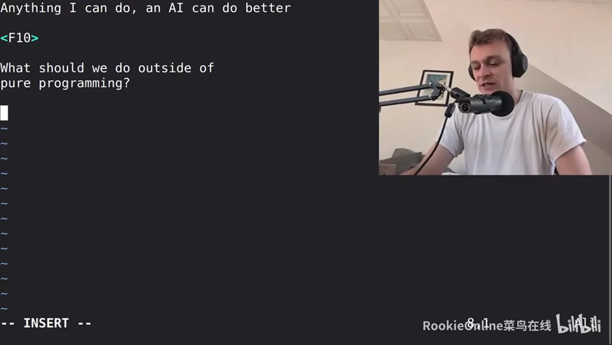
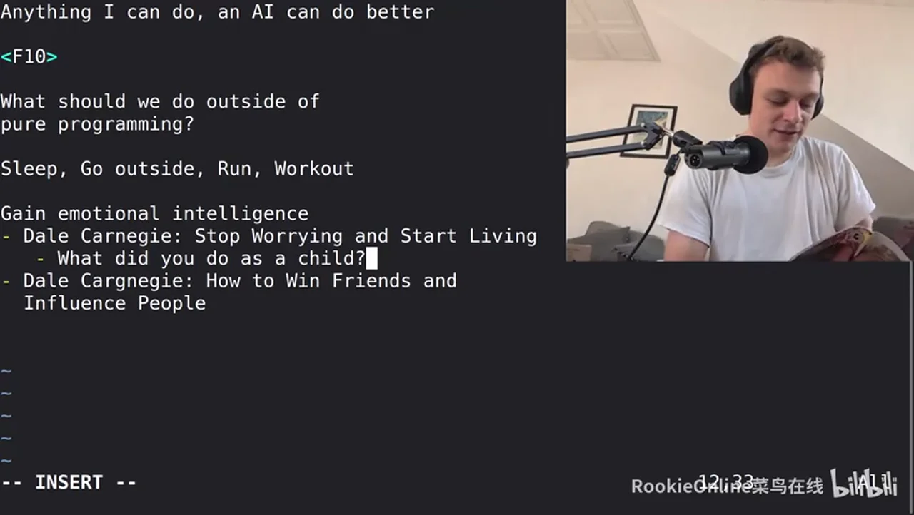
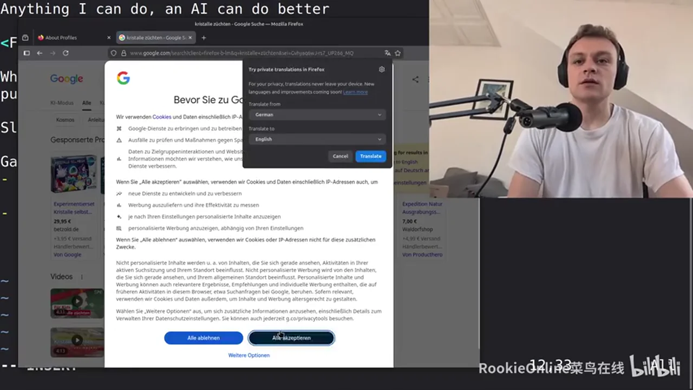
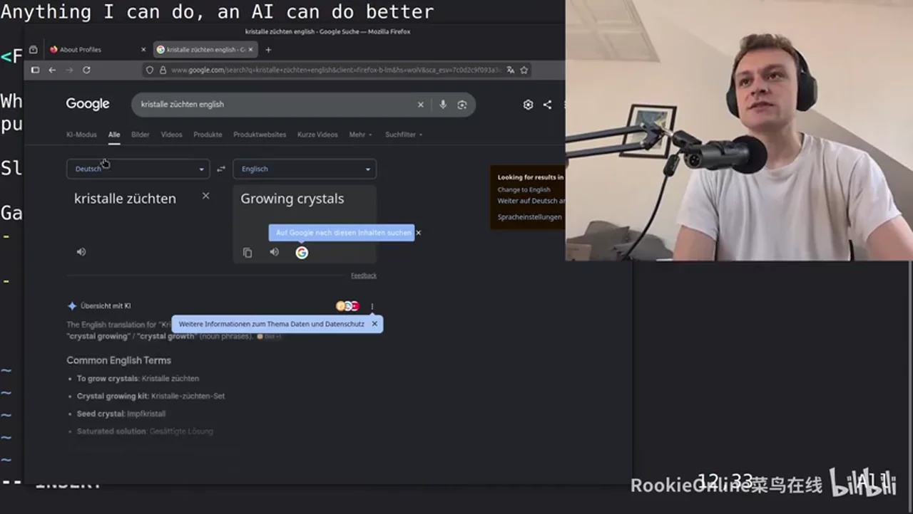
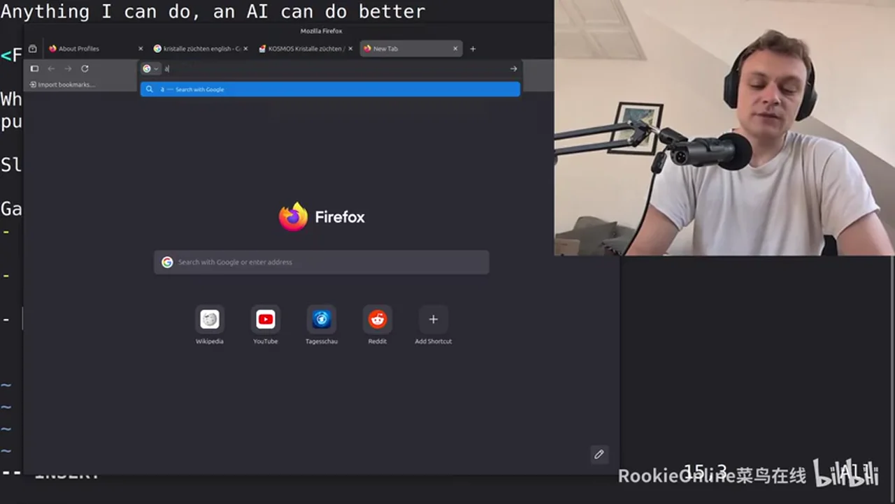
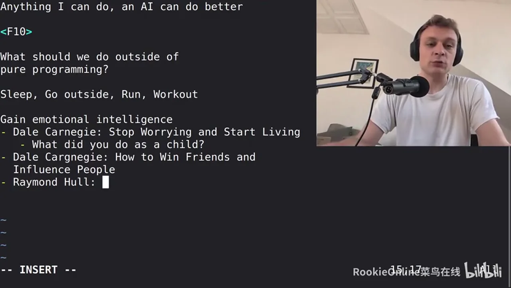
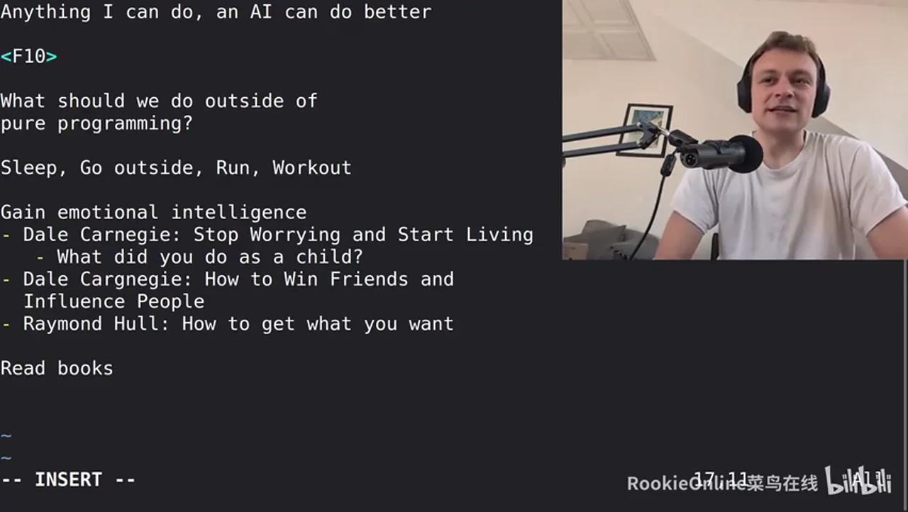
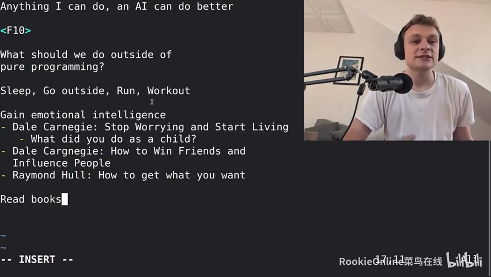
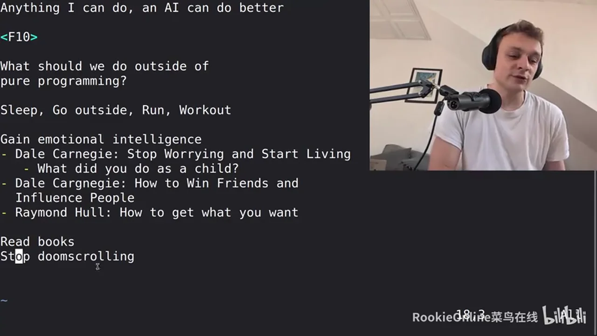
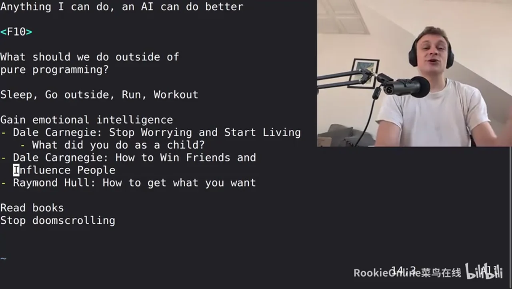

# 总结稿

暂无总结。

# 辅助理解

# Data

## 原始转写稿

[00:00] hi everybody in today's video we're going to talk about things to learn about because in recent months and years I found that anything I can do an AI can do better I have produced I don't know how many videos that I produced 150 videos maybe maybe even more and I have already approaching 200 videos on this channel where I hand code see projects without AI by myself and almost I can do better.
[00:30] Every video contains a comment from someone mentioning that AI would do what you do in one hour in under one minute and it's correct right those guys are those guys are fully correct and I've been recording these videos because they are just fun for me and it's super awesome to actually process thoughts in my brain that's what my brain is what what it exists for right your.
[00:58] your brain as well so our brains exist for processing things and I like to program things so my brain does something productive if I don't do something productive all my brain does is think stupid stupid stuff it's like in Dostoevsky crime and punishment or in these kinds of books where people are somehow bored and because they are bored they start doing and thinking stupid negative shit so.
[01:28] should I just accept that anything that I can do an AI can do better and instead I just should just let an AI do everything probably for most things yes because it is actually better and faster but then the question is what should I do with the free time with time that I don't spend programming.
[01:48] Because now the programming that the writing of code part is now is now gone what should I do with the rest of the time and here I want to gather some thoughts maybe you wonder why there's an F10 here I just thought it looked cool when I typed F10 in the terminal it somehow look cool and I kept it so.
[02:09] What should we do instead or what should we do with the time with the.
[02:19] What should we do outside of pure programming and here I consider using AI to create code pure programming right so.
[02:29] When an AI is not creating code for us or we're not typing code ourselves what do we do because now we're super fast.
[02:37] And that's the question so.
[02:40] Yes the low level stuff is mostly gone due to AI and but there are so many other interesting things in life for example keeping it to engineering you can move to a higher level you can go to systems engineering and draft and.
[02:56] You can design planes you can design satellites you can design I don't know cars right and then you can work with an AI to create those things to bring them to reality this is quite high level and of course an AI can also do that so.
[03:13] Damn so this doesn't work so what should we do instead.
[03:18] Maybe we shouldn't use an AI to do our job well wait what is something in AI can't do that's maybe the question something that an AI an AI can't do right now that we should spend our time with well first of all sleep.
[03:38] Sleep we should sleep a lot right we should sleep eight to nine hours a day that's completely clear so go to sleep an AI can't sleep for you.
[03:48] And I can't keep your body healthy and go outside.
[03:55] Run.
[03:58] Work out if you enjoy working out I hate working out I enjoy running a lot so I go outside and run pretty much every day.
[04:07] And that's what I do and that's stuff that an AI can't do for you but of course that's not what you expected so what do you do.
[04:15] Outside of your program not that an AI has taken over your job you should also expand your capabilities as a human because your job is not just it's not just producing code it's also.
[04:34] Finding your way through emotional.And political labyrinth.In the corporate world something like that so you should you should gain emotional intelligence that's something in an AI can answer upon but you won't face situations where you need emotional intelligence.
[05:02] In real life where you can quickly refer to an AI that's something that has to come from yourself right and for those things I recommend reading for example Dale Carnegie read read books guys Dale Carnegie how to stop.
[05:20] Stop worrying and start living that's one of the books that another is Dale Carnegie how to influence people and make friends how to make friends how to win friends.
[05:41] And influence people this is not really about making friends per se as you this is not really about making friends.
[05:51] As you might.Imagine this is about properly this is about nicely dealing with people such that you don't.
[06:03] You don't end up in unnecessarily stupid situations.I'm still checking if the video is still running yes okay so.
[06:13] This book helps you to start living your life and design your life according to how you want to live this is super important right.
[06:23] Stop worrying worrying is like driving with a pulled handbrake I've been worrying worrying all my all my life I'm still worrying all the time and it's the number one thing keeping me from living my life and that's also part of the reason.
[06:36] Why I'm recording this video I started worrying about AI suddenly right.I'm not really worried about AI but I did this topic just came up in my head and I thought I have to record a video about about this I'm worrying about other things in my life but that's not for YouTube.
[06:53] And start living you need to start living guys and there are simple things to do for example plan your day somehow or.
[07:02] What else was there do things that you like what what did you do as a child that's a good point let's write this down what did you did you do as a child when you were a child so if you are feeling approaching depression or somehow your character changes you grow resentful you.
[07:24] Yeah somehow your life doesn't feel nice anymore what did you do as a child remember those things that's super important what did you do as a child that brought you happiness for example for me that's really.
[07:42] The number one example for me and I read so many comics Disney comics Mickey Mouse and Donald Duck I love those and I just got myself.
[07:54] A another one to read I know it's it's for children right.
[08:00] But I just enjoy it it's just looking at this flicking through the pages I love these as a child I have I still have boxes in my parents home.
[08:11] Full with hundreds of these comics and I just recently got them from the attic they were it was a dusted box that I haven't opened in 15 years and I'm rereading those things it's.
[08:27] Have a look at those pages they are happy they are right that's something that and those things are things that you have to do yourself those are not things that an AI can do for you an AI can accelerate you and I can't make.
[08:42] You enjoy life again so what did you do as a child that you enjoy that you enjoyed and ask yourself.
[08:51] Can you do that right now possibly did you okay if you went to the playground and.
[08:59] Play with other kids maybe it's not possible anymore yeah but you can you can meet friends and go to something that is playground ish maybe climbing gym or whatever right.
[09:11] You can go to the playground after when it's dark and no children around anymore and do some just sit there whatever run over the playground I don't care.
[09:22] So what did you do as a child that brought you happiness is that something that you can do right now maybe as a child one more example.
[09:30] As a child I haven't done that yet but something that I enjoyed as a child was I'm not pulling up a browser now or okay.
[09:43] Five Fox about is that already a new profile yeah okay I did the following crystal it's and how is it called in English growing crystals.
[10:06] Saha got the sounds like I was a drug dealer know this is about.This is something I enjoyed very much as a kid.It's these tools here at these toys.
[10:21] That allow you to grow your own crystals and as a child I was incredibly explorative and interested in science and I still am.
[10:31] Right that's also part of the reason why I record these YouTube videos and I grew crystals and I think there were some solution soluble powders in that box and you have to put it into water and cook it and then you.
[10:47] You hang a thread into the cooked water with the solution and then you see over the next couple of days that crystals start growing and attaching to the threat that is suspended in the water.
[10:59] So it's super interesting that's those are things that I enjoyed as a kid and I could technically do them as an adult as well right and you can you can do these things too.
[11:10] So this is a start living do step worrying do things that you simply enjoy.Of course this is not a solution for AI taking our jobs yeah.
[11:22] Fully clear but still you need to do something with your life if you completely focus your life on your career.
[11:28] And you focus on gaining knowledge and now there is an AI that can just that you can just instruct to do the things that you have studied years to do it to be able to do manually.
[11:40] Now it's completely obsolete because you know can instruct any AI and it the AI will do the job for you.
[11:46] So you can still perform your job but you can't perform your daily enjoyment and that's what's important that's what's incredibly important.
[11:55] Then how to win friends and influence people is not about how to win friends unfortunately or well maybe you can win friends but it's taking interest in other people it's about.
[12:04] It's about getting along with people better than you are getting along with them right now and especially avoiding useless conflict.
[12:16] Ok.Because interacting with people is also half of your career and it's incredibly important how you interact with them.
[12:27] Don't unnecessarily upset people if it can be avoided or if you have to upset them in some way for example by explaining them why the technical solution is completely shit and has to be discarded.
[12:40] Then you tell it to them in some professional nice way you collaborate with them.
[12:47] Just be nice to people right be nice to people.Don't entangle yourself in emotional arguments so that's incredibly important and then there's another book that's super.
[13:05] Nice what was it called?I think the original is an English one as well.
[13:12] I know in German it's called alles ist erreichbar.Yeah Raymond Hull everything.
[13:22] Ah how to get what you want how to get what you want.
[13:27] Read books guys they are incredibly beneficial Raymond Hull.
[13:34] Same guy who conceptionalized the Peter principle and which is about that people cannot be promoted beyond their capabilities and if you keep promoting people they will end up in a position in which they are not capable anymore.
[13:51] Because as long as they are capable in professional environments and their job you keep promoting them and at some point they stop being capable and then you don't promote them.
[14:01] Everything everyone every higher manager tends to be someone who is not capable to do his job.
[14:09] It's quite a funny thing so it's a nice concept and this is the concept that made Raymond Hull famous but he's also written this other book how to get what you want and this book is primarily about.
[14:26] About aggregating a list of life goals 10 goals that you want to reach in your life and you write down this list every single day every single morning you wake up and then you write that list by hand.
[14:41] You don't make a mistake when writing it if you make a mistake you discard that piece of paper and rewrite it from scratch you have to carefully write every single.
[14:51] One of your goals that you want to reach they must be positive encouraging goals for example I want to.
[14:58] Earn X amount of money but it doesn't have to be about money also can be I want to propose to my girlfriend by the end of this month some things like that right things that you can that you can reach.
[15:12] That you can accomplish and then you aggregate 10 of those goals and you write them down every single day.
[15:21] I want to learn a language I want to be reach Russian B2 level by the end of this year.
[15:29] And then you write down that list and every single day that lich that that list becomes more and more etched in your brain.
[15:38] It's it's become an automatic part of your day of your morning routine and then what you can even expand on it by picking the.
[15:49] Oh no wait you have to sort the list by putting the most accomplishable goals.
[15:57] At the top so the first one is this the one that you can just accomplish quickest for example I want to clean my room it's super simple.
[16:06] Or if that's too much for you I want to bring out the old bottles old empty bottles out of my room something like super simple.
[16:15] Right then the next goal is something slightly more difficult I want to eat healthy for a single day something like that.
[16:25] And then the goals grow increasingly harder or bigger for example goals seven might be I want to see the United States I have never been to the United States I am based in Germany for those who do not do not know.
[16:44] Or I want to reach Russian sea one conversational level right and don't worry.
[16:52] No don't worry don't don't wonder I'm not wearing trousers or yeah I'm not wearing pants.
[16:58] And the last goal might be something super super long term for example I want to have three kids.
[17:08] Or I want to.No forget about earning I want to.
[17:23] I want to.Make an orbital flight with Blue Origin something like that you want to go to space.
[17:33] This can be your super long term goal so you make that list of goals.
[17:39] And.The top every day for the top three goals that you know down everything singly so you write a list of ten goals and the top three goals you elaborate steps like five steps per goal how you accomplish it and then it's absolutely unavoidable.
[18:01] That you are going to reach all of those goals for example for me when I started this YouTube channel I use this list and I wrote down goals I want to reach a thousand subscribers.
[18:13] Then I wrote down a goal I want to reach 5000 subscribers then I wrote down the goal when I reach the goals of course I take them off the list and it's super satisfying and whenever I take a goal off the list I can think of a new goal I want to reach.
[18:29] Then it doesn't need to be increasing amounts of money or increasing amounts of subscribers but it can also be something completely different for example I reached a 10,000 subscribers and now I want to replace that I don't want to focus on YouTube anymore I want to replace it with focusing on.
[18:45] I'm running now I want to be able to run a marathon for example right so you somehow design your life and it's just super nice so this is one approach to to to live your life to planet as it's something that I have personally found very rewarding so.
[19:06] Read books guys yes and AI could you could also converse with an AI on these things but AI's are usually not very consistent books are also not always consistent but they are.
[19:18] These couple of books they are I think all of them are at least 708090 years old so they are established time tested proven knowledge.
[19:30] I'm written by a human it's just something different so read books reading books and also helps you step to stop doom scrolling so.
[19:40] While an AI helps you in your day to day job a eyes harm you outside of your work by by consuming your time through algorithms that that optimize in keeping you tied to your smartphone to social media so you need to find alternatives to doom scrolling and one of those alternatives one the single best one is probably in in my opinion reading books.
[20:10] I read a lot I still do scroll daily so I'm not myself completely rid of it but I try to improve here this is one area I need to significantly improve I recently also saw a YouTube video where someone recommended gaming.
[20:27] And specifically dopamine low in dopamine single player games but here I can't really come much because I don't game at all.
[20:42] Okay so these are some things you should you should in my opinion do outside of your job outside of dealing with a I stressing about AI.
[20:55] Live your life think of things that are completely detached from technology that are orthogonal from toward the influence of technology and.
[21:09] Make goals grow more intelligent emotionally intelligent I'm not I'm not talking about becoming more intelligent as.
[21:26] Like a dictionary or like like a resource because all of this is replaced by AI but now you can spend time and focus to become a better human.
[21:34] So start learning languages start making lists of goals that you that you want to achieve.
[21:42] Read books those are super valuable what else is there.
[21:47] I recently discovered that I still have a very old bike in my in my old in my former home where my parents live and I just.
[22:02] Start repairing it because it wasn't usable because it has been used as an inventory for replacement parts so some parts have been removed and put onto other bikes to repair the other bikes but now I decided to.
[22:18] To repair this old bike and now after replacing several of the parts and repairing it and adjusting the gears and doing all these kinds of things which I also enjoy to repairing it things also super valuable.
[22:34] I have a working bike now and I'm able to.
[22:39] To use it so it's there are things in life outside of AI alright.
[22:45] I think I've wrapped this up you probably got the message right.
[22:50] I'm just thinking is there anything that anything else that I wanted to say because I before I record a video I always have thousands of ideas thousands of bullet points in my brain of things that I want to talk about.
[23:03] But I'm not sure anymore so relive the inner child set goals for yourself outside of technology start living you can still go outside and do things in the real world.
[23:22] AI helps you to do your job AI harms your free time by doing scrolling try to avoid this start reading books and then you're on a very good track start thinking positively and these books really help you with with thinking positively.
[23:39] Of course learning about technology in is an incredible eight with dealing properly with AI because you can validate AI output and also you can better interact with them by having control of the technology for example if you can properly deal with terminals which.
[23:57] Only a very very small fraction of humans can do.
[24:01] And then you can use cloud code which can directly access your files and help you do your job right if you and so knowing technology like terminals is already a very big help.
[24:14] In using AI if you use if you don't know how to terminals work then you are tied to chat GPT only you're restricted to chat GPT only where you have to copy and paste context back and forth between your IDE and then or your terminal and chat GPT and you go back and forth.
[24:32] You know how most people use AI but it's it's not necessary you can even facilitate this so you can still improve your technological knowledge for example by getting my no nonsense C programming course which is linked in the YouTube description below the video which teaches you a lot about how I use the terminal which also enables you to use the terminal for AI development and for modern development.
[24:55] So have a look at this course I highly recommend it.
[24:58] It teaches you how computers work how C programming works how terminals work all the small tricks tips and tricks that I use in my daily work for getting things done and I'm really good at getting things done.
[25:10] And.
[25:14] And this so these are things that you can use to improve your life by removing friction adding more experiences and I would even say I'm stop trying to fight the best AI and all of these things as I am stop trying to worry about what AI will do with your job if you are a good if you are well able to.
[25:44] To dictate AI what to do and get your job done don't worry about your job usually if you and this is one of my core philosophies and professional life and I told this sentence to my colleagues very often because whenever they are.
[26:01] Whenever they are frustrated about what they are currently working on and I say this sentence is my one of my favorite things it's.
[26:15] So whatever you do try to do it well whether you use AI for it or you don't use AI for it you can of course facilitate AI development by knowing terminals very well but then outside of all of this stuff outside of doing your job very well do all of these guys.
[26:44] Sleep go outside run workout read books read those books make goals stop doom scrolling and then start living your life I'm trying to do this as well if.
[26:55] And also put in the comments things that you've been doing recently to.
[27:01] To improve your life to start living like a real human being is supposed to live because AI is here to stay.
[27:09] And worrying about it is not beneficial at all you have to work together with it and then outside of your job outside of your studies.
[27:18] Continue or.Reignite the spark in yourself this is what it's what's important alright that's it I hope you enjoyed this one and see you next time bye bye.

## 原始关键帧

### 关键帧 1

### 关键帧 2

### 关键帧 3

### 关键帧 4

### 关键帧 5

### 关键帧 6

### 关键帧 7

### 关键帧 8

### 关键帧 9

### 关键帧 10

