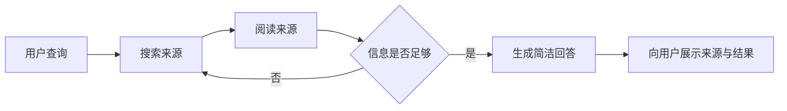

# 总结稿

[打开单页 HTML 总结](assets/bilibili-BV1Unbz6AEda-summary.html)

> [!danger] 仅 0–129.8 秒导言（疑似 P1）/ 不完整捕获，非完整课程总结
> 当前只有 **0–129.8 秒**字幕与约 130 秒画面，占 manifest 聚合时长 16,517 秒的约 **0.79%**。这与多 P 视频只抓到 P1/课程介绍相符，但现有证据不能确定是 CID、分 P 选择还是捕获阶段范围不一致。以下所有内容只覆盖导言，绝不代表约 4 小时 35 分课程。

## 导言中实际讲了什么

讲者宣布将用 TypeScript 从零构建 deep search 应用，计划采用 Vercel AI SDK、Next.js、Postgres 与 Drizzle，并通过尝试、失败和迭代学习。[00:00–00:32] **当前捕获没有进入任何具体代码、数据库结构、测试或成品演示。**

导言把 deep research 描述为：搜索大量来源并汇总成长报告；把 deep search 描述为更小的可复用原语：接收查询、搜索网页、阅读来源、判断是否继续搜索，最后给出较简洁回答。[00:35–01:36]

```text
query → search → read sources → decide whether to continue → concise answer
```

讲者还把良好 UX 视为 AI 应用的重要差异点，计划先做简单版本，再逐步增加复杂度并接入聊天界面。[01:41–02:07] 这些都是**课程计划与开场定位**，不是已捕获的实现结果。

## 事实核查边界

- 截至 2026-08-28，Google Gemini、OpenAI 和 Anthropic Claude 均有 Deep Research/Research 功能；可用范围与套餐会变化，参见 [Google Gemini 帮助](https://support.google.com/gemini/answer/15719111?hl=en)、[OpenAI deep research](https://openai.com/index/introducing-deep-research/)、[Anthropic Research 帮助](https://support.anthropic.com/en/articles/11088861-using-research-on-claude-ai)。[00:43]
- [01:21] 检索和阅读来源可作为降低幻觉风险的措施，但不是保证。检索可能错误/不相关，模型也可能误读来源；参见 [检索增强研究](https://aclanthology.org/2021.findings-emnlp.320/)与 [OpenAI Deep Research System Card](https://deploymentsafety.openai.com/deep-research)。

## 明确不可总结的内容

由于只捕获 0–129.8 秒，本文**不能**概括完整课程结构、TypeScript 具体实现、Postgres/Drizzle 设计、Redis、LangFuse、Evalite 等后续内容是否实际讲授，也不能评价代码正确性、测试、性能、生产可用性、UI 成品或最终项目效果。需要按正确分 P/CID 重新捕获完整内容后再分析。

## 观众讨论与补充

本次热门顶层评论候选为 0、current-accessible 弹幕为 0。空结果只说明本次接口可见数据为空，不证明完整课程无人观看、没有意见或没有争议；捕获仅 0.79% 与 audience 空样本是两个不同限制。不存在可分析语义簇、热点或精选评论，也不伪造观众图表。

# 辅助理解

## 辅助理解

> [!danger] 范围固定：仅 0–129.8 秒导言（疑似 P1）/ 不完整捕获
> 以下图和帧只解释开场提出的概念与计划，不代表完整课程实现。manifest 聚合时长约 16,517 秒（4:35:17），当前覆盖约 0.79%；现象与多 P 只抓到 P1 相符，但故障原因尚未确认。



这张循环只重述导言 [01:06–01:26] 的 deep search 原语；当前捕获没有展示其 TypeScript 代码、停止条件实现、评估或错误处理。


该帧只显示开场引用的 Jina.ai DeepSearch/DeepResearch 文章标题，可证明概念来源与课程灵感；不是课程实现成果或完整目录。[00:35–00:40]


讲者人像锚定从 deep research 转向 deep search 的概念段。[01:10 附近] 画面没有流程图、来源或代码，解释必须以字幕为准。

### Deep search 与 deep research：仅按导言比较

| 导言中的表述 | Deep search | Deep research |
|---|---|---|
| 输出 | 相对简洁回答 | 汇总大量来源的长报告 |
| 形态 | 可复用的较小原语 | 更专门的研究体验 |
| 共同点 | 搜索并阅读来源 | 搜索并阅读来源 |

### 证据层级

- **视频导言**：计划采用的技术栈、搜索—阅读—判断循环、聊天 UX 目标。
- **事实核查**：主流产品有 Research 功能；检索只能降低而非消除幻觉。
- **AI 辅助推断**：生产实现至少要定义来源质量、停止条件、引用对齐、失败模式与成本上限；这些并未在当前捕获中展示。

### 不可越界

不要用当前帧或字幕说明 Postgres/Redis/LangFuse 等完整课程内容；不要声称项目已经实现、测试或达到生产质量。先修复多 P/CID 捕获范围，再做完整总结。

## 外部事实核验

### 声明 1（00:43）

- 视频陈述：Google has deep research, OpenAI has deep research, Claude has research.
- 核验状态：已确认
- 核验结果：确认（截至 2026-08-28）。Google Gemini Apps 官方帮助提供 Deep Research；OpenAI 官方发布了 deep research；Anthropic 官方帮助中心提供 Claude 的 Research 功能。产品可用范围、套餐和入口会随时间变化，后续使用前仍应查看各自当前文档。
- 检索日期：2026-08-28
- 来源：
  - [Google Gemini Apps Help — Use Deep Research in Gemini Apps](https://support.google.com/gemini/answer/15719111?hl=en)（primary）
  - [OpenAI — Introducing deep research](https://openai.com/index/introducing-deep-research/)（primary）
  - [Anthropic Help Center — Using Research on Claude](https://support.anthropic.com/en/articles/11088861-using-research-on-claude-ai)（primary）

### 声明 2（01:21）

- 视频陈述：This acts as a guard against hallucinations.
- 核验状态：部分确认
- 核验结果：部分确认。同行评审研究发现，检索增强能在对话任务中降低幻觉；这支持把来源检索视为一种缓解措施。但它不是保证：检索结果可能错误或不相关，模型也可能误读来源。OpenAI 的 deep research 安全资料同样记录了仍会出现幻觉的情况，因此应表述为“降低风险”，而不是“杜绝幻觉”。
- 检索日期：2026-08-28
- 来源：
  - [Shuster et al. — Retrieval Augmentation Reduces Hallucination in Conversation](https://aclanthology.org/2021.findings-emnlp.320/)（primary）
  - [OpenAI — Deep Research System Card](https://deploymentsafety.openai.com/deep-research)（primary）

# Data

## 增强转写稿

[00:00] Hello folks, and welcome to my course on implementing deep search in TypeScript.
[00:05] We're going to be building an application from the ground up, winding our way through all the nasty little journeys that go into building a complex app.
[00:13] We're going to hit dead ends that don't work, we're going to experiment with things.
[00:17] We're going to end up with something pretty solid, but on the way we're going to learn what works and what doesn't in this space.
[00:22] We're going to be doing it with the Vercel AI SDK, with Next.js, with Postgres, with Drizzle.
[00:26] And these tools should be either be very familiar to you already, or will be very familiar to you by the time we finish.
[00:32] But what is it that we're actually building?What are we aiming for?
[00:35] Well, I got inspired to build this course based on this article on Jina AI.
[00:39] It's a practical guide to implementing deep search/deep research.
[00:43] Deep research implementations are like everywhere right now.
[00:46] Google has deep research,OpenAI has deep research,Claude has research.
[00:50] And the process of deep research is you search a corpus of information like the web, let's say.
[00:55] You take all the information you've gathered, hundreds of sources, and you pull it all together into this huge great big report.
[01:01] And while this is useful, obviously, I didn't think it was that widely applicable to many different projects.
[01:06] Deep search, though, is a much simpler primitive and can actually fit into lots of different systems.
[01:11] You take the user query, you then search the web, read the sources that you gather,
[01:15] and then reason whether you need to continue searching.
[01:18] And then finally, you produce a relatively concise answer to that user query.
[01:21] This acts as a guard against hallucinations.And in pretty much any AI application,
[01:26] you're going to be worried about controlling the AI,forcing it to rely on actual sources of information instead of its training data.
[01:33] So whereas deep research is very specialized to a certain type of UI,
[01:36] the concepts behind deep search can be applied to many different AI applications.
[01:41] We're going to be building a simple version of this first and then adding more complexity as we try to squeeze out more performance from our system.
[01:48] And along the way,we're going to be building a chat-based UI and hooking this up to it.
[01:52] Because,and I keep banging this drum,I really think the differentiator between good and great AI apps
[01:58] is not the AI itself,but the user experience.
[02:01] And so let's try to build a really awesome AI app that has as few hallucinations as possible
[02:07] and the best user experience we can possibly create.

## 原始转写稿

[00:00] Hello folks, and welcome to my course on implementing deep search in TypeScript.
[00:05] We're going to be building an application from the ground up, winding our way through all the nasty little journeys that go into building a complex app.
[00:13] We're going to hit dead ends that don't work, we're going to experiment with things.
[00:17] We're going to end up with something pretty solid, but on the way we're going to learn what works and what doesn't in this space.
[00:22] We're going to be doing it with the Vercel AISDK, with Next.js, with Postgres, with Drizzle.
[00:26] And these tools should be either be very familiar to you already, or will be very familiar to you by the time we finish.
[00:32] But what is it that we're actually building?What are we aiming for?
[00:35] Well, I got inspired to build this course based on this article on Gina.ai.
[00:39] It's a practical guide to implementing deep search/deep research.
[00:43] Deep research implementations are like everywhere right now.
[00:46] Google has deep research,OpenAI has deep research,Claude has research.
[00:50] And the process of deep research is you search a corpus of information like the web, let's say.
[00:55] You take all the information you've gathered, hundreds of sources, and you pull it all together into this huge great big report.
[01:01] And while this is useful, obviously, I didn't think it was that widely applicable to many different projects.
[01:06] Deep search, though, is a much simpler primitive and can actually fit into lots of different systems.
[01:11] You take the user query, you then search the web, read the sources that you gather,
[01:15] and then reason whether you need to continue searching.
[01:18] And then finally, you produce a relatively concise answer to that user query.
[01:21] This acts as a guard against hallucinations.And in pretty much any AI application,
[01:26] you're going to be worried about controlling the AI,forcing it to rely on actual sources of information instead of its training data.
[01:33] So whereas deep research is very specialized to a certain type of UI,
[01:36] the concepts behind deep search can be applied to many different AI applications.
[01:41] We're going to be building a simple version of this first and then adding more complexity as we try to squeeze out more performance from our system.
[01:48] And along the way,we're going to be building a chat-based UI and hooking this up to it.
[01:52] Because,and I keep banging this drum,I really think the differentiator between good and great AI apps
[01:58] is not the AI itself,but the user experience.
[02:01] And so let's try to build a really awesome AI app that has as few hallucinations as possible
[02:07] and the best user experience we can possibly create.

## 原始关键帧

### 关键帧 1


### 关键帧 2


### 关键帧 3


### 关键帧 4


### 关键帧 5


### 关键帧 6


### 关键帧 7


### 关键帧 8


### 关键帧 9


### 关键帧 10


## 补充原始数据

- [bilibili-BV1Unbz6AEda-comments.jsonl](assets/bilibili-BV1Unbz6AEda-comments.jsonl)
- [bilibili-BV1Unbz6AEda-comment-candidates.json](assets/bilibili-BV1Unbz6AEda-comment-candidates.json)
- [bilibili-BV1Unbz6AEda-danmaku.jsonl](assets/bilibili-BV1Unbz6AEda-danmaku.jsonl)
- [bilibili-BV1Unbz6AEda-danmaku-analysis.json](assets/bilibili-BV1Unbz6AEda-danmaku-analysis.json)
- [bilibili-BV1Unbz6AEda-summary.html](assets/bilibili-BV1Unbz6AEda-summary.html)
