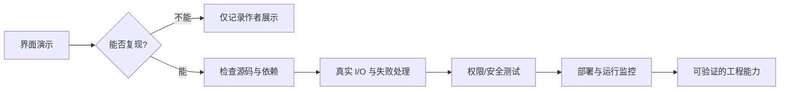
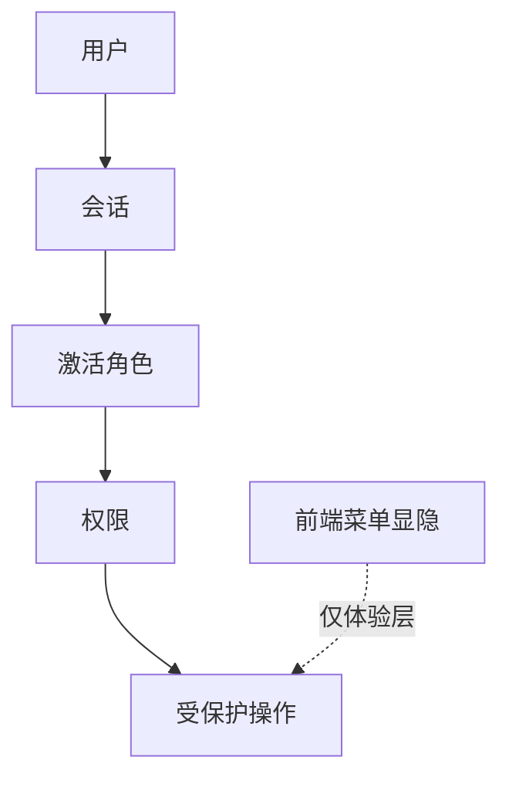

# 总结稿

[打开单页 HTML 总结](assets/bilibili-BV1knuR6SEMn-summary.html)

## 核心结论

这是一段约 29 分钟的后台管理模板走查：作者展示 AO Admin Pro 的工作台、低代码设计器、组件库、数据页面、用户/角色/菜单界面、主题与多语言，并把它放进“用 Codex 做 100 个可上线项目”的系列计划中。最稳妥的理解是：**视频证明作者当时能操作一套覆盖面很广的前端演示界面，但不等于其技术栈、安全授权、后端闭环、生产质量或开源状态已经独立验证。**

## 内容结构

- **定位与作者自述**：[00:32–01:47] 作者称项目由 React 19、TypeScript、Vite 等构建，借助 Codex 开发，并明确第一个项目“只是一个前端模板”。技术栈仅有发布者口述/简介，缺少仓库清单，仍属**未核实**。
- **低代码与 AI 中心演示**：[02:28–05:12] 依次展示接口编排、页面设计器、表单/报表/打印、代码生成、AI 对话、助手与工作流入口。画面能证明对应 UI 存在，不证明真实数据库/第三方调用、生成代码质量或模型服务闭环。
- **组件与后台常用页面**：[06:12–15:48] 快速浏览表单、表格、反馈、数据展示、拖拽、导入导出、图表和模板页面；作者在 [14:17–14:30] 也主动承认数据分析处仍有问题、录完后再修。
- **权限相关界面**：[17:24–18:20] 展示用户、多角色、角色和三级菜单配置。外部核查只能确认 RBAC 涉及用户、角色、权限与会话间的授权关系；仅有前端配置界面不能证明后端强制、继承/冲突语义或绕过防护已实现。[NIST RBAC 项目](https://csrc.nist.gov/projects/role-based-access-control)
- **开发记录、主题与国际化**：[20:39–28:58] 作者展示提交历史、深浅色/主题切换、个人中心、登录和约七种语言，并说项目之后会放到 Gitee/GitHub。

## 三层证据标记

| 层级 | 可以说什么 | 不能推出什么 |
|---|---|---|
| 演示 | 画面存在设计器、组件页、角色/菜单页、主题切换等入口 | 功能完整、数据真实、安全、性能或生产可用 |
| 作者承诺 | 作者计划持续做 100 个项目，并计划公开仓库、接受反馈 | 已上线 100 个项目、已完全开源或长期维护 |
| 外部验证 | 当前只对 RBAC 定义边界找到权威资料 | 实际依赖版本、授权强制和仓库归属已确认 |

## 实践建议

1. 把这套界面当需求清单而非验收结果：逐项标注“仅 UI / 有真实 I/O / 有测试 / 有权限强制 / 已部署”。
2. 获取仓库后先核对 `package.json`、锁文件、许可证和提交历史，再确认技术栈与开源状态。
3. 对 RBAC 做后端拒绝测试、越权测试、角色冲突测试；不要用“看得到配置页”替代安全验证。
4. 对低代码编排验证鉴权、错误恢复、密钥管理、日志和可观测性；对 AI 功能验证模型来源、数据边界与失败模式。

## 事实核查边界

- **技术栈：未核实。** 视频与简介来自同一发布者，当前没有源码或依赖清单。
- **RBAC：未核实。** 界面展示不足以证明授权约束正确执行，参见 [NIST RBAC](https://csrc.nist.gov/projects/role-based-access-control)。
- **完全开源：未核实且视频内部时态冲突。** [15:51] 称“完全开源”，但 [20:07–20:17]、[28:58] 又说完善后/之后会放到 Gitee 和 GitHub；当前没有唯一可归属的一手仓库链接。

## 观众讨论与补充

本次是 20 条热门顶层候选（抓取 30/接口报告 45），不含嵌套回复；弹幕实际抓取 0 条。讨论主要追问源码/技术栈、接口编排的真实 I/O、权限/多租户、组件拆分与上线闭环，并有一条具体反馈称菜单激活态未随主题变化。另有观众猜测参考了 art design pro，这只是**待核线索**，不是来源证明。热门排序、UP 主点赞/回复会造成偏差，不能外推为总体意见。

# 辅助理解

## 如何理解这类“功能很多”的项目演示

关键不是数菜单，而是把每项能力放回证据链：看到 UI，只能确认 UI；看到作者承诺，只能确认承诺；拿到仓库、测试与部署证据后，才可能判断实现质量。

## 能力地图，而不是完成度地图

- 低代码：页面设计、表单、报表、打印、接口编排入口。
- AI：对话、助手、客服、模型管理和工作流入口。
- 后台基础：表格、反馈、导航、图表、内容、用户/角色/菜单。
- 体验层：响应式、多主题、多语言、登录与个人中心。

这些分类来自视频走查；“完整、稳定、安全”不是它们的同义词。

帧 2 的三栏页面设计器最能说明作者在演示什么：左侧组件、中间画布、右侧属性。但它只证明设计器界面存在，不能证明生成代码、接口联调或版本迁移质量。

帧 4 补充组件交互维度，展示拖拽排序布局。静态帧不能证明拖拽结果或状态持久化，应回到视频与代码测试。

帧 8 与浅色工作台形成主题对照，支持“有主题切换”的画面判断；卡片数据仍是演示样例。

## RBAC 为什么不能靠页面截图验收

视频 [17:24–18:20] 展示用户、角色和菜单配置，但“按钮不可见”不等于服务器拒绝非法请求。根据 [NIST RBAC](https://csrc.nist.gov/projects/role-based-access-control)，授权关系必须落实到用户、角色、权限与会话。这里的“需做越权测试”是 AI 辅助的工程建议，不是视频已经完成的事项。

## 一份可执行验收表

1. **依赖**：仓库、commit、`package.json`、lockfile、许可证是否一致。
2. **低代码**：保存、版本、回滚、真实接口、错误分支是否可复现。
3. **RBAC**：直接请求受限 API 是否被后端拒绝；多角色冲突怎样处理。
4. **AI**：模型/密钥在哪里；提示注入、数据泄露、超时和成本怎样处理。
5. **上线**：构建、部署、监控、备份、迁移、可访问性与性能是否有证据。

## 观众线索如何使用

评论对源码、接口编排和多租户的追问可转成验收项；“参考 art design pro”与潜在项目链接必须独立核验。它们是观众意见，不是视频事实或版权/来源判定。

## 外部事实核验

### 声明 1（00:32）

- 视频陈述：该后台模板实际使用 React 19、TypeScript、Vite 7、Tailwind CSS 4、ECharts、Radix UI 与 i18next。
- 核验状态：未验证
- 核验结果：未核实。视频画面和简介都列出这组技术栈，但二者来自同一发布者；当前材料没有给出可访问的源码仓库、package.json、锁文件或构建产物清单，无法独立确认实际依赖和版本。此项只能作为作者对演示项目的陈述。
- 检索日期：2026-08-28
- 来源：未找到可链接来源

### 声明 2（17:24）

- 视频陈述：演示中的用户、角色和菜单页面已经构成可用的 RBAC 权限系统。
- 核验状态：未验证
- 核验结果：未核实。视频展示了用户、角色、多角色选择和菜单配置界面，但没有展示授权决策、后端强制校验、权限继承/冲突语义或绕过测试。NIST 对 RBAC 的定义涉及用户、角色、权限及会话之间的授权关系；仅有前端配置 UI 不能证明这些约束已被正确执行。
- 检索日期：2026-08-28
- 来源：
  - [NIST — Role Based Access Control](https://csrc.nist.gov/projects/role-based-access-control)（primary）

### 声明 3（15:51）

- 视频陈述：“这个项目是完全开源的”；后文又说之后会开源到 Gitee 和 GitHub。
- 核验状态：未验证
- 核验结果：未核实，且视频内部存在时态冲突。[15:51] 称项目“完全开源”，[20:07–20:17] 与 [28:58] 又表示完善后/之后才会放到 Gitee 和 GitHub。当前材料没有仓库 URL，公开搜索也未找到可唯一归属于该演示项目的一手仓库，因此不能写成已上线开源事实。
- 检索日期：2026-08-28
- 来源：未找到可链接来源

# Data

## 增强转写稿

[00:00] 大家好,就是我最近就是Vibe Coding了一个新的项目
[00:04] 就是AO Admin Pro,就是通用后台管理
[00:10] 通用了后台管理那个模板
[00:15] AO的话是我新公司,就是OBUS DRAFT OVERLOAD
[00:23] 就是抽象重载
[00:25] 然后这个新的这个东西,这个后台管理系统的话
[00:32] 我用的是React 19 + TypeScript + Vite构建它
[00:35] 然后的话是个响应式的,还有就是可以有有多个主题
[00:44] 然后的话,还有就是支持多语言,多翻译,就多语言
[00:51] 大概就是七国语言
[00:53] 记住这样的话,用到的就是React 19 + TypeScript + Vite
[00:58] 然后React Router,然后Tailwind CSS,ECharts,然后还有Radix UI,还有reactmode,这些
[01:14] i18next,就是用多语言,这用Node.js + TypeScript就是node.js
[01:24] 大概是node,我这应该用的是node.js20
[01:29] 我给你看一下就是这个词,我用就是Codex写的
[01:35] 我最近要做就是用Codex,然后实现就是写Web 代码
[01:43] 然后100个,就是上线的项目,这是我第一个项目
[01:47] 这第一个项目的话,它只是一个前端的模板
[01:51] 我这还有其他项目,这是这个项目,这个是WebStorm
[01:58] 然后这具体的样子呢,我给你看一下,最开始里面有很多功能
[02:03] 这个的话是,见面的话就是有点像就是一个,之前有一个模板,我主要借鉴的那个模板
[02:15] 然后它这里面有工作台,管理员,仪表台,分析业,然后有电子商务
[02:24] 一般的话主要就是用工作台就行,就在手里面
[02:28] 然后我这里面有低代码中心,就是支持接口编排,这样看这里,可以先编排接口,我要充电接口
[02:36] 然后这里就是低代码,可以就是路上转,然后还有就是java,还有jet
[02:43] 然后它页面设计器,页面设计器的话是一个编辑的,就是这一种
[02:50] 就这样拖动筆栏,拖动,然后今天编辑,再这样删掉那,这是模板,然后呢,还有表单引擎
[03:02] 这就是表单,可以把表单拖进来,就像这样,放进一个表单,然后报表引擎
[03:12] 报表,还有打印模板,打印模板的话,那就是比如打印一张A4纸,就打印出来
[03:22] 然后还有代码生成器,声音器这里的话,可以声称就是各种的代码,比如是java系列
[03:28] 打空制系列,然后verdex的TATS,然后server用力的,这种,这可能这样,如果它给一个就拥护中心
[03:43] 然后数据部管理,还有发部管理,讲,设计代码中心,然后AI中心的话,有AI的对话,这是一般的就是AI的对话
[03:51] 那AI对话的话,一般的话,这里可以就是签话一个主题,就是写一句话,水平这样的话,都好一些,水平在这里,和弦在这里
[04:03] 下面在里面,可以直接在这里对话,多个对话
[04:09] 然后这主题的话,还只是混合,混合是要这样,这样,还有AI,还有一个的话,就是双链,双链这两个都有
[04:28] 有左边这个,也有右边,这边是第一个,这口面牌,然后为了切换成就是这地方
[04:40] 然后下面的话,还有就是AI助手,AI助手的话,就是跟AI一些工具吧,这里有计单顾问,研发助手小的,其实就跟类似D5那种东西
[04:55] 然后还有AI客服,就AI客服,AI发动自动就是牛天打电话,然后这是顾,鸡日子,还有模型管理,然后AI 工作流
[05:12] 这里也是类似D5的AI 工作流编排,然后是内容管理,内容管理的话,有文章卡片
[05:20] 就2024年了,2023年,卡片,然后点进去的话,就对应了文章,可以编辑文章,可以预览文章,然后文章的发布,文章的列表,分类管理
[05:37] 这里是各种分类,它就后端,前端,手指铺,设计,UI这种,分类管理,然后标签管理,这种标签,然后这里的话,就一般就是模板都会有的,就是结果页面,就是成功提交和失败页面
[05:54] 就冻结,招呼冻结,或者招呼还不用申请资格,像这样子,然后一长页面的话,它有就是,看这里403,404,500,这样就常用那些,这个500个,或几块小叉那种页面
[06:12] 然后下面就是我们这个重头戏,逐渐的东西,我们这里逐渐非常多,逐渐的总团的话,大概有就是有这些,有这个按钮,还有表达一下数据,反馈,好像一下工具都有,分为这几种
[06:27] 反正看第一种,第一种的话,就按钮的话,这种,这按钮的话都比较像,就是那种,就是Element UI那种,有这种,按,还有实心的,有描边的,还有这种10的,还有大圆角的,还有链接的,然后尺寸,然后还描边尺寸,然后状态的,就是这种,禁用状态,还有加载中的,这些按钮
[06:55] 在这里,有点击,有点处理,然后左侧,比较新鲜,圣徒比较综合的组合
[07:06] 按钮还是挺多的,然后表达,表达的话,有输入框,广播动输入框,搜索框,还有就是用户名,邮箱,这个常用的,然后密码,就是暂时收入密码,还有错误这个
[07:21] 下拉框,给我选择北京,还有默认值的,还有禁用状态,然后可以在这里边,可以输入,这个搜索单框,可以输入北京,输入北京,然后它就输入北京,这样的,还有多选下拉框,这种,就在选择UE,这样的
[07:43] 单选和复选,复选的组,然后开关这种,就是一般,一般的这些就是组下都有,然后数据表达,数据表达就像这种,比较正面,它有就是关键词的搜索,然后呢,有状态,然后搜索,然后重置,然后,还有进入角色,然后弹窗反馈,这里,它就弹窗这种,确设搜索
[08:13] 确定有删除这个,不准确定,小点通知,警告,这种,还有数据展示,这种数据展示的话,有这个,统计卡片,有多色标签,然后小红点,这种,头像组,然后还有这些,时间线,这个是标记时间线,比如项目立项,然后设计评审,然后开发启动,提测上线,正式发布,这样的
[08:43] 然后,不准挑,看一下这种,还不准挑这种,像这,比如,签线进息器,然后有将,个人证,实名,完了,这样子,导航组建的话,我们就写下来,然后用户,行单,那种,这样子,它下面这种,还有这种,就能带这个,可以关闭的这种,面包屑
[09:06] 面包屑有这种,分页器,还有分月,这是分页功能
[09:13] 然后,还有完整,分月,就是它这个,有多少条,多少条,还有这种,左右的,还有调质,里面都有,下拉菜单,还有数形,树形控件,就数形工具,然后下面是图标库
[09:30] 图标库的话,这里,有这些,这是现在,我这个,模板里面,支持这些图标
[09:35] 模板里面,有这个,比如,看这种,基本的图标都有,比如用户啊,还有就手样啊,还有就是文件啊,文件家啊,拍照啊,图片都有
[09:45] 图字啊,保存啊,然后下面,出个滚动,还有加载这个数据,它的图字加载,然后下面就开吊成碑,还有翻页时钟,这个比较像图
[10:00] 嗯,这里,这是它介绍的,这个是,就是,就是具体的一个,代码啊,这一块
[10:11] 然后下面,还有图,两个框,这个就没啥好说了,这个是编辑,然后这里,还有就是一些,加图啊,写线啊,这样的
[10:20] 加图,写几,然后还有就是,这个
[10:28] 然后再往下走,图片裁剪,图片裁剪的话,在这一块可以用,1比1,16比9,然后4比3,3比2都有这些
[10:40] 嗯,我上传了一张图片,我看一下,我先让一下有啥图片啊
[10:48] 比如这张图,它可以进入拆简
[10:53] 就在这里,我要进入拆简,像这样,往去,在那边,下面,然后继续走,继续走,然后就是二维码
[11:00] 二维码的话,就可以提供二维码内容,然后给一个尺寸,然后颜色,然后高级选项,然后就生成一个二维码出来
[11:10] 再往下走,我要视频播放器,这个的话就是一个,一个就可以跟飞速玩,开启画中画,然后播放,这样子,一个视频播放器
[11:26] 播放一个视频,然后它这个加速,我要加到150mAh,这播放声音比较大,然后下一个往上拖拽,拖拽这一块的话,看这里,然后在这边拖拽功能,就是这里,它可以整理这里,往上拖拽,拖拽动,下里,好,可以,像这样,然后容器间的拖拽,就是它这里,然后到右边这里拖拽进来,也是可以的
[11:56] 然后右键菜单,右键菜单的话,这里,然后它就,这是自定义context menu吗,实现掩饰了,它这几个右键菜单,就这样,然后这两个插头,水印,水印的话,就是它就是图片见到用到水印,这是水印往后拖拽动,一个模板,怎么样,然后文字滚动,这个是文字滚动,就像系统通知啊,系统公告
[12:26] 它会用到这东西,然后也就是无线网上,就是无缝的滚动,这样,无滚动加摆,然后还有橫向的爆码灯,还这样
[12:37] 然后礼花,礼花这里看,这里是出一出,然后两侧礼花,然后出入星星,这样就是撤销,然后操作电卧行动,还不好
[12:50] 然后一个Excel,导入导出,这个也是正常的,就是导出功能,导出一个Excel,让导出员工数据,像这样
[13:00] 再看一下吧,就这样看,在员工数据也导出出来了,就它这个里边表面的信息,然后导入一个Excel,这里还只是导入
[13:12] 然后我非常喜欢一个功能叫词云图,这个话,在经常会,就是在那个主要会遇到一个名叫词云图,所以点击它是资云,然后查看它的认识,有ARC能100
[13:24] 然后数据分析是82,这个话,这在后边配置的人,这个还挺好看的
[13:32] 然后这是主要组件,然后这里的话,我是支持就是关闭当前标签和关闭左边标签,右下标签啊,这些都有的
[13:38] 反正这里的话是可以说,就是折叠,这都是可以的
[13:45] 然后左边中心讲完了,然后下一个我们再还有数据分析,比如访问统计
[13:53] 然后这里,访问统计
[13:57] 然后这里对面,然后地区,这个是应该还没有数据
[14:06] 他这里,这个这里可以自己,就是配的数据,然后用户画像
[14:17] 这里还有一个问题,没事后面修一下,然后转化漏斗
[14:24] 我记一下数据分析,但是我再回头修一下
[14:30] 就是一会儿我录完视频就修一下,然后前段线
[14:33] 就超级管理员21分系,然后我标签页
[14:38] 那大概快速过一下吧,因为这些组件基本上就是一万模板都有的,他高级表格,不用他
[14:45] 然后基础表格
[14:47] 搜索表的
[14:49] 左右布局表格,这种左右布局的
[14:56] 然后这里
[15:00] 然后模板中心的话,有卡片,这是卡片
[15:04] 然后还有横幅,看这种,看这种,立即开中横幅,比较大的横幅
[15:12] 这个,看这,这,这,这,还挺好看的,那图表
[15:18] 图表的话用的是基于ECharts的图表
[15:22] 然后日历,日历在领导
[15:27] 聊天,聊天的话,这里就是,比如就是现在的,聊天的模板
[15:35] 聊天,然后下楼发布,那聊天,这里还有就是
[15:40] 标签
[15:44] 好吧,这些功能还得加,然后定价
[15:47] 增加,比如你选择技术版,专业版和旗下版
[15:51] 啊,这个的话,这是模板啊,这个是,这个不是我这个定价,我这个项目是完全开源的
[15:55] 这个只是,那它这个,模板中心里面,提供的模板,然后地图模板,它这里我支持就是
[16:02] 啊,这个世界,这是中国地图,它还有剪辑,黑剪辑
[16:07] 剪辑湖北,对吧,特别是在湖北看这个
[16:11] 宝能量
[16:12] 看,会议的宝能量
[16:16] 像这样
[16:19] 然后的话,还有气泡地图
[16:22] 然后还有世界地图
[16:24] 被地图热一句话,中国或者是美国
[16:30] 然后媒体库的话,就是一般的媒体库,文件,图片,视频,文档都有
[16:36] 这是媒体,然后会下载下载这些图片
[16:39] 能销工具的话,有优惠券
[16:44] 优惠券,然后活动管理,然后还有就推动
[16:50] 然后定单管理,就想做正常的定单处理,配送很完成,就类似它那种,就是外卖
[16:58] 然后这是消息中心,有通知,通知这些
[17:06] 那再往下走,然后还有生存配合,生存配合的话,比如就是我那边还有一个,就是叫做卖剧工坊
[17:12] 它可以生成剧本的,修改,改变方向卡
[17:15] 这的话,是一个多次,保存配置,大概有多的配置
[17:19] 然后下面就是系统管理,系统管理的话,就经常就是所有我们买都基本都有的
[17:24] 由用户,是吧,用户,用户管理
[17:27] 这已经支持这个用户头像,用户这个
[17:32] 用户名称,还有它那个邮箱
[17:35] 然后还有角色,角色的话,支持多角色
[17:38] 那毕竟用户,还可以点,可以选择多一个角色
[17:43] 然后角色管理的话
[17:45] 车机管理员,系统管理员,内部编辑
[17:48] 这些,就是串铁的角色,原来名称玩飞鞠,用户管理,角色
[17:56] 就正常的就RBAC管理系统
[17:59] 然后下一个就是菜单,菜单那一块的话,支持就是决定的,可以很不展开
[18:04] 这是三层,就是包括按钮
[18:07] 三层的,三层的这个菜单
[18:11] 然后日志,日志的话,是分为登录日志,还有操作日志,还有异常日志
[18:17] 还有导书日志的
[18:20] 字典管理的话,就正常的就是,角色类型,串铁管理员,用户管理,是吧,正常奉进去
[18:28] 就对一些,就是字典化,就是那种
[18:33] Enum,Enum就是那种,就没举类型的话,比较
[18:37] 是用于这种,判断
[18:40] 自点,还有一些,就是存一些字不算,或者什么,相关的,存摘的相关的
[18:45] 然后系统配置,系统配置里面,这有占顶管理,还有邮件管理,存负管理,配置,还有按钮配置,送质配置和主题外观
[18:56] 然后服务系管理,服务系管理的话,就像
[19:00] 还有就是开发日志,还有这种,对于多的服务系顶管理就显示好了
[19:05] 文件管理的话,就是跟它那个媒体管理差不多,就指它这里可以上传文件
[19:12] 然后进行文件上传之类的
[19:16] 好了,那咱们现在说的说完就它基本的功能了,这个就是我这模板基本的一些
[19:22] 功能,就是在它,在之前那个,在我参考的那个模板之
[19:29] 就之前我用,就是那个模板
[19:34] 这是,就是参考那个模板
[19:39] 那么模板基础上我加了一些功能
[19:42] 加了一些功能,然后的话
[19:45] 这里,然后还有就是这里,就是刷新,刷新页面
[19:50] 然后还有这个,这个的话,红色彩
[19:55] 红色彩,就是这里,后面的点击,它这里,分析鱼儿,分析鱼儿是这里
[19:59] 这些就是这一个快捷的一个应用导航,我要礼花
[20:04] 还有聊天
[20:07] 官方文档,官方文档的话,在时间我还有,这项目是咱们在Gitee 和 GitHub的场开源
[20:13] 就暂时的话,等我看完之后,大家计划
[20:17] 然后这个支持的话,这个,这是我们自己公司
[20:21] 就是我们北京抽药充满科技有限公司,我先打个广告
[20:25] 在我们公司,之后还有就是陆续的,还有很多很重要的产品
[20:28] 然后需要,就是,希望大家支持吧
[20:32] 就是,希望大家可以使用,使用我们的产品
[20:39] 南哥天日志,也是,就是这里,然后,就是,提交,这是写了已经
[20:45] 外部扣景,用Codex写的,写了一段时间,把想要的,把想要的功能都加进去
[20:52] 然后还有,就是这个,Bilibili,Bilibili,她现在视频我还没发布,她后边的话,我发布视频
[20:58] 对,她是参议员,是吧,我用的就是这一块,就是,大家好,今天要给大家,我参考的,就是,就这一款,就是二条然后电视腐肉,我参考的,就是她这家,她这,她这个,我把她这个模板做得非常不错,我推荐给大家使用一下
[21:16] 这个主要界面,我参考的是这个模板
[21:19] 然后的话,大家看一下,就是,但是我在她的基础上,有一家的,比如她这个,还有,就是,就是,陈平
[21:26] 然后我在她的基础上,她那个,她只支持,就是,前几中文和英文,但是我这里支持四国语,就是,就是,西国语,然后,比如日本,看这里
[21:34] 所有的都变成日文了
[21:37] 这里我以前就签网到日本语,然后还有一个签网,翻译中文,这样的话,对,对,对,就是,粗海,对吧,就多那个,多语言,这一块我们已经做好了
[21:46] 这样的话,方便大家使用
[21:50] 多语言,这一块,人家是按28n,用的时间,比如韩语,看这里能使用,看这里,1月,2月,3月
[21:59] 让我们签网,这样回解体中文
[22:03] 然后的话,她还有哪些功能呢,就是
[22:07] 她这个,但是,就是,半天黑夜签网,这个也是有的
[22:12] 而且,我这是,都是,是多少人提的
[22:16] 我这里,还有,就是,然后,这个,对,对,通知
[22:19] 然后,这个是聊天,就是,L,L,L数手,L就是我们公司的点称
[22:27] 然后,这里,这里的话,我们在,是,这是多少人提出的,还有几点,几点,是,看这几点
[22:40] 活力子,几点
[22:42] 就是非常简单的,那种几点,看这里,都是这种点,黑白灰的这种,行不行
[22:49] 这种形式,也是比较好看的
[22:52] 然后,还有,就是,活力子
[22:56] 这是紫色的一个
[23:00] 然后,千万的黑,千万的,改天,黑夜
[23:03] 她这里,这个主题,每一套,每一个主题,都有白天,黑夜的设置
[23:08] 然后,还有,这个,这个,这是一个,彩蛋
[23:12] 这是我后边一个,比如,因为我叫做,漫,漫,漫句,漫画,工坊
[23:16] 这是,漫句,工坊
[23:18] 这是,漫句,工坊
[23:20] 这是,这个,彩蛋
[23:25] 我后边,有一套,英文,叫做,漫句,工坊
[23:27] 然后,期待,就是,上线,之后,一大架,见面
[23:32] 我靠,有点,卡
[23:35] 录屏,有点,卡,要,消息,你一下
[23:38] 然后,这个,这个,切换,里面
[23:40] 然后,再,她,下一个,她,森林,这个
[23:43] 这是,比较,小,清,清的,一个,然后,开始,切换,过来
[23:49] 主题呢,大家喜欢哪种,我看到,今天用哪个,看这个,《日落城》,这也挺好看的
[24:00] 然后,变串了
[24:10] 然后,我怎么老是点到这个,设置啊
[24:13] 这有点,节目效果了
[24:14] 就,玫瑰金
[24:16] 看一下,玫瑰金
[24:18] 这就,挺好看的
[24:20] 玫瑰金这个,这个是,白天,你,我看,晚上,忘记,还行
[24:26] 然后,下面,这些,是吧,下面,这些,就,比如,这个,按钮,直接按钮位置,比如,这里,可以,刻在,按,顶部
[24:32] 刻在,按,顶部,看这里
[24:34] 刻在,按,顶部这个,是吧
[24:39] 然后,一般,就,这个,然后,还有,主题色
[24:42] 主题的颜色也可以改,像这主题的颜色也可以改,这样的自定义性的非常好,有主题你喜欢的粉色,粉色跟这个,粉色跟这个比较大,跟这个比较大,看这里,粉色跟这个比较大吧,谢谢。
[25:08] 然后继续,然后这一容器宽度可以改的,肌肉默认和宽度,一般是默认,然后你设置开始多多标签栏,多标签栏,手工型,然后显示这边侧件篮,这个可以安置,然后显示快速入口,就是这个,这个,快速入口。
[25:36] 可以把,其实可以把快速入口,还有显示重载,还有这个重重载可以开,好,面包屑,面包屑,多一点橙线,关掉,像这样,这样子比较轻松。
[25:47] 然后下面的话,可以设置这桌多标签栏,沫里线和线,这这个其实在那个就是在那个就是,在这个模板里面,也是都有的,在这个在这个就是这个桌标模板里面都有的都有,这个模板我很推荐大家使用,大家好,今天要给大家介绍,这个模板我很推荐大家使用,
[26:05] 但是,既然我现在用的,嗯,就是我在下场我自己模板,但是当然的话,我更希望就大家用我不自己模板。
[26:14] 就是我们AO的第一款产品,就是这款AO的面膀肉,就是我们通用后下关系系统的模板。
[26:21] 然后接下来我们看一下,就是它这个,嗯,我把这个还是打开了。
[26:26] 然后在这里,然后的话,你得有个人中心,个人中心的话,对于内容还挺弱的。
[26:37] 中心嘛,基本的东西都有,还比较代替时长,还有对于登陆,障碍状态,然后就是头像啊这些子。
[26:51] 然后还有这个,杜马是卖地工房,这也是个彩蛋,拿下面团队个人标签,然后基本资料,然后还有这个工作天号,九四全线,你都。
[27:08] 然后接着走,接着走,然后还有账号安全,就这里的话我把个人中心和账号安全分开了,因为它俩本来就先是应该是领色。
[27:19] 它这里账号安全的话,在管理密码,还有就是它的安全评分,是修改密码,双重验证,登陆且都。
[27:28] 然后还有消息中心,消息中心的话,就是消息中心的通知。
[27:32] 那现在有退出登陆,退登陆的话,这个就是我这个后台的那个登陆界面,还有独特界面。
[27:42] 那这里的话,其实也是可以先化成这个叫那语言,比如说日本的日语,就是把这多语言就非常好用,因为我们这时就是很多种语言,就七个语言大概。
[27:53] 所以的话,嗯,大家这个对出海的话,出海可以包住,就是对对对出海,对吧,就是伤亡出海,比如做那个ERP,或者是那个撒虎的出海,或者做一些仿战官网之类出海,还比较有用。
[28:13] 然后切换到这个漫画工法,漫画工法,漫画工法也比较偏狠色,其实。这里是可以切换主题的,经常的话,一般都是经典蓝,经典蓝是对最普通的这个,然后这个主题间特别的改成蓝色,跟这些都是可以改的,也能切换白天和黑夜。
[28:38] 然后这里可以点注册,然后这里是登录,这里有个华方言证码,就跟那个模板一样,然后还有忘记密码,再等一下。
[28:50] 然后这里的话,这有快捷方式,可以直接去看登录,注册,忘记密码,等一下。
[28:58] 这也有帮助于三倍,这个就是AO三线助手,OK,大概就是这么多功能,大家可以就是,这个项目之后,会猜源到Gate和Gate Hub,到时候就是大家可以就是,可以直接在上拉,在那个Gate上拉取,拉取大家都可以直接可以用,模板里面内容还挺多的,谢谢大家。
[29:24] 希望大家就是能,就是使用起来更方便,有啥问题的话,其实可不反馈,我这边话会即时进行,进行就是更新和修改,好了,就先这样吧。

## 原始转写稿

[00:00] 大家好,就是我最近就是web靠近了一个新的项目
[00:04] 就是AO 和耳耳的面和肉,就是通用后台管理
[00:10] 通用了后台管理那个模板
[00:15] AO的话是我新公司,就是OBUS DRAFT OVERLOAD
[00:23] 就是抽象重载
[00:25] 然后这个新的这个东西,这个后台管理系统的话
[00:32] 我用的是react1+tab-tribe的位子构建它
[00:35] 然后的话是个响应式的,还有就是可以有有多个主题
[00:44] 然后的话,还有就是支持多语言,多翻译,就多语言
[00:51] 大概就是七国语言
[00:53] 记住这样的话,用到的就是react1+tab-tribe的位子
[00:58] 然后reactrouter,然后tell-vendor,tell-vendor,css,eachhast,然后还有redict,还有reactmode,这些
[01:14] 18nk,就是用多语言,这用node18+tab-tribe就是node.js
[01:24] 大概是node,我这应该用的是node.js20
[01:29] 我给你看一下就是这个词,我用就是code叉写的
[01:35] 我最近要做就是用code叉,然后实现就是写webcode
[01:43] 然后100个,就是上线的项目,这是我第一个项目
[01:47] 这第一个项目的话,它只是一个前端的模板
[01:51] 我这还有其他项目,这是这个项目,这个是webstore
[01:58] 然后这具体的样子呢,我给你看一下,最开始里面有很多功能
[02:03] 这个的话是,见面的话就是有点像就是一个,之前有一个模板,我主要借鉴的那个模板
[02:15] 然后它这里面有工作台,管理员,仪表台,分析业,然后有电子商务
[02:24] 一般的话主要就是用工作台就行,就在手里面
[02:28] 然后我这里面有地带码中心,就是支持接口编排,这样看这里,可以先编排接口,我要充电接口
[02:36] 然后这里就是地带码,可以就是路上转,然后还有就是java,还有jet
[02:43] 然后它页面设计器,页面设计器的话是一个编辑的,就是这一种
[02:50] 就这样拖动筆栏,拖动,然后今天编辑,再这样删掉那,这是模板,然后呢,还有表弹引擎
[03:02] 这就是表弹,可以把表弹拖进来,就像这样,放进一个表弹,然后报表引擎
[03:12] 报表,还有打印模板,打印模板的话,那就是比如打印一张A4纸,就打印出来
[03:22] 然后还有代码声音器,声音器这里的话,可以声称就是各种的代码,比如是java系列
[03:28] 打空制系列,然后verdex的TATS,然后server用力的,这种,这可能这样,如果它给一个就拥护中心
[03:43] 然后数据部管理,还有发部管理,讲,设计代码中心,然后AI中心的话,有AI的对话,这是一般的就是AI的对话
[03:51] 那AI对话的话,一般的话,这里可以就是签话一个主题,就是写一句话,水平这样的话,都好一些,水平在这里,和弦在这里
[04:03] 下面在里面,可以直接在这里对话,多个对话
[04:09] 然后这主题的话,还只是混合,混合是要这样,这样,还有AI,还有一个的话,就是双链,双链这两个都有
[04:28] 有左边这个,也有右边,这边是第一个,这口面牌,然后为了切换成就是这地方
[04:40] 然后下面的话,还有就是AI助手,AI助手的话,就是跟AI一些工具吧,这里有计单顾问,研发助手小的,其实就跟类似D5那种东西
[04:55] 然后还有AI客服,就AI客服,AI发动自动就是牛天打电话,然后这是顾,鸡日子,还有模型管理,然后AI工作留
[05:12] 这里也是类似D5的AI工作留变台,然后是内容管理,内容管理的话,有文章卡片
[05:20] 就2024年了,2023年,卡片,然后点进去的话,就对应了文章,可以编辑文章,可以预览文章,然后文章的发布,文章的列表,分类管理
[05:37] 这里是各种分类,它就后端,前端,手指铺,设计,UI这种,分类管理,然后标签管理,这种标签,然后这里的话,就一般就是模板都会有的,就是结果页面,就是成功提交和失败页面
[05:54] 就冻结,招呼冻结,或者招呼还不用申请资格,像这样子,然后一长页面的话,它有就是,看这里403,404,500,这样就常用那些,这个500个,或几块小叉那种页面
[06:12] 然后下面就是我们这个重头戏,逐渐的东西,我们这里逐渐非常多,逐渐的总团的话,大概有就是有这些,有这个按钮,还有表达一下数据,反馈,好像一下工具都有,分为这几种
[06:27] 反正看第一种,第一种的话,就按钮的话,这种,这按钮的话都比较像,就是那种,就是Element UI那种,有这种,按,还有实心的,有描边的,还有这种10的,还有大圆角的,还有链接的,然后尺寸,然后还描边尺寸,然后状态的,就是这种,金用状态,还有加载中的,这些按钮
[06:55] 在这里,有点击,有点处理,然后左侧,比较新鲜,圣徒比较综合的组合
[07:06] 按钮还是挺多的,然后表达,表达的话,有收入框,广播动收入框,收走框,还有就是用户名,邮箱,这个常用的,然后密码,就是暂时收入密码,还有错误这个
[07:21] 下拉框,给我选择北京,还有默认值的,还有金用状态,然后可以在这里边,可以输入,这个搜索单框,可以输入北京,输入北京,然后它就输入北京,这样的,还有多选下拉框,这种,就在选择UE,这样的
[07:43] 单选和复选,复选的组,然后开关这种,就是一般,一般的这些就是组下都有,然后数据表达,数据表达就像这种,比较正面,它有就是关键词的搜索,然后呢,有状态,然后搜索,然后重置,然后,还有进入角色,然后弹创反馈,这里,它就弹创这种,确设搜索
[08:13] 确定有删除这个,不准确定,小点通知,警告,这种,还有数据展示,这种数据展示的话,有这个,投计卡片,有多色标签,然后小红点,这种,投向组,然后还有这些,时间线,这个是标记时间线,比如项目立项,然后设计评审,然后开发启动,提侧上线,正式发布,这样的
[08:43] 然后,不准挑,看一下这种,还不准挑这种,像这,比如,签线进息器,然后有将,个人证,实名,完了,这样子,导航组建的话,我们就写下来,然后用户,行单,那种,这样子,它下面这种,还有这种,就能带这个,可以关闭的这种,棉薄线
[09:06] 棉薄线有这种,分月器,还有分月,这是分月工的
[09:13] 然后,还有完整,分月,就是它这个,有多少条,多少条,还有这种,左右的,还有调质,里面都有,下拉菜单,还有数形,数形锤,就数形工具,然后下面是图标库
[09:30] 图标库的话,这里,有这些,这是现在,我这个,模板里面,支持这些图标
[09:35] 模板里面,有这个,比如,看这种,基本的图标都有,比如用户啊,还有就手样啊,还有就是文件啊,文件家啊,拍照啊,图片都有
[09:45] 图字啊,保存啊,然后下面,出个滚动,还有加载这个数据,它的图字加载,然后下面就开吊成碑,还有翻页时钟,这个比较像图
[10:00] 嗯,这里,这是它介绍的,这个是,就是,就是具体的一个,代码啊,这一块
[10:11] 然后下面,还有图,两个框,这个就没啥好说了,这个是编辑,然后这里,还有就是一些,加图啊,写线啊,这样的
[10:20] 加图,写几,然后还有就是,这个
[10:28] 然后再往下走,图下拆简,图下拆简的话,在这一块可以用,1比1,16比9,然后4比3,3比2都有这些
[10:40] 嗯,我上传了一张图片,我看一下,我先让一下有啥图片啊
[10:48] 比如这张图,它可以进入拆简
[10:53] 就在这里,我要进入拆简,像这样,往去,在那边,下面,然后继续走,继续走,然后就是二维码
[11:00] 二维码的话,就可以提供二维码内容,然后给一个尺寸,然后颜色,然后高级选项,然后就生成一个二维码出来
[11:10] 再往下走,我要视频播放器,这个的话就是一个,一个就可以跟飞速玩,开启画中画,然后播放,这样子,一个视频播放器
[11:26] 播放一个视频,然后它这个加速,我要加到150mAh,这播放声音比较大,然后下一个往上拖拽,拖拽这一块的话,看这里,然后在这边拖拽功能,就是这里,它可以整理这里,往上拖拽,拖拽动,下里,好,可以,像这样,然后容器间的拖拽,就是它这里,然后到右边这里拖拽进来,也是可以的
[11:56] 然后右键采单,右键采单的话,这里,然后它就,这是自定义contact的manual吗,实现掩饰了,它这几个右键采单,就这样,然后这两个插头,水液,水液的话,就是它就是图片见到用到水液,这是水液往后拖拽动,一个模板,怎么样,然后文字滚动,这个是文字滚动,就像系统通知啊,系统公告
[12:26] 它会用到这东西,然后也就是无线网上,就是无缝的滚动,这样,无滚动加摆,然后还有橫向的爆码灯,还这样
[12:37] 然后理花,理花这里看,这里是出一出,然后两侧理花,然后出入星星,这样就是撤销,然后操作电卧行动,还不好
[12:50] 然后一个赛绕,导入导出,这个也是正常的,就是导出功能,导出一个赛绕,让导出员工数据,像这样
[13:00] 再看一下吧,就这样看,在员工数据也导出出来了,就它这个里边表面的信息,然后导入一个赛绕,这里还只是导入
[13:12] 然后我非常喜欢一个功能叫资云图,这个话,在经常会,就是在那个主要会遇到一个名叫资云图,所以点击它是资云,然后查看它的认识,有ARC能100
[13:24] 然后数据分析是82,这个话,这在后边配置的人,这个还挺好看的
[13:32] 然后这是主要重庆,然后这里的话,我是支持就是光明当前标签和光明左边标签,右下标签啊,这些都有的
[13:38] 反正这里的话是可以说,就是折叠,这都是可以的
[13:45] 然后左边中心讲完了,然后下一个我们再还有数据分析,比如访问的通计
[13:53] 然后这里,访问的通计
[13:57] 然后这里对面,然后地区,这个是应该还没有数据
[14:06] 他这里,这个这里可以自己,就是配的数据,然后用户画像
[14:17] 这里还有一个问题,没事后面修一下,然后转化漏斗
[14:24] 我记一下数据分析,但是我再回头修一下
[14:30] 就是一会儿我录完视频就修一下,然后前段线
[14:33] 就超级管理员21分系,然后我标签页
[14:38] 那大概快速过一下吧,因为这些预件基本上就是一万模板都有的,他高级表格,不用他
[14:45] 然后基础表格
[14:47] 搜索表的
[14:49] 左右布局表格,这种左右布局的
[14:56] 然后这里
[15:00] 然后模板中心的话,有卡片,这是卡片
[15:04] 然后还有横幅,看这种,看这种,立即开中横幅,比较大的横幅
[15:12] 这个,看这,这,这,这,还挺好看的,那图表
[15:18] 图表的话用的是基于依差的图表
[15:22] 然后日丽,日丽在领导
[15:27] 柔天,柔天的话,这里就是,比如就是现在的,柔天的模板
[15:35] 柔天,然后下楼发布,那柔天,这里还有就是
[15:40] 标签
[15:44] 好吧,这些功能还得加,然后定价
[15:47] 增加,比如你选择技术版,专业版和旗下版
[15:51] 啊,这个的话,这是模板啊,这个是,这个不是我这个定价,我这个项目是完全开玩的
[15:55] 这个只是,那它这个,模板中心里面,提供的模板,然后地图模板,它这里我支持就是
[16:02] 啊,这个世界,这是中国地图,它还有剪辑,黑剪辑
[16:07] 剪辑湖北,对吧,特别是在湖北看这个
[16:11] 宝能量
[16:12] 看,会议的宝能量
[16:16] 像这样
[16:19] 然后的话,还有气泡地图
[16:22] 然后还有世界地图
[16:24] 被地图热一句话,中国或者是美国
[16:30] 然后媒体库的话,就是一般的媒体库,文件,图片,视频,文档都有
[16:36] 这是媒体,然后会下载下载这些图片
[16:39] 能销工具的话,有优惠券
[16:44] 优惠券,然后活动管理,然后还有就推动
[16:50] 然后定单管理,就想做正常的定单处理,配送很完成,就类似它那种,就是外卖
[16:58] 然后这是小业中心,有通知,通知这些
[17:06] 那再往下走,然后还有生存配合,生存配合的话,比如就是我那边还有一个,就是叫做卖剧工坊
[17:12] 它可以生存剧本的,修改,改变方向卡
[17:15] 这的话,是一个多次,保存配置,大概有多的配置
[17:19] 然后下面就是系统管理,系统管理的话,就经常就是所有我们买都基本都有的
[17:24] 由用户,是吧,用户,用户管理
[17:27] 这已经支持这个用户投降,用户这个
[17:32] 用户名称,还有它那个邮箱
[17:35] 然后还有角色,角色的话,支持多角色
[17:38] 那毕竟用户,还可以点,可以选择多一个角色
[17:43] 然后角色管理的话
[17:45] 车机管理员,系统管理员,内部编辑
[17:48] 这些,就是串铁的角色,原来名称玩飞鞠,用户管理,角色
[17:56] 就正常的就RBIC管理系统
[17:59] 然后下一个就是彩单,彩单那一块的话,支持就是决定的,可以很不展开
[18:04] 这是三层,就是包括按钮
[18:07] 三层的,三层的这个彩单
[18:11] 然后日致,日致的话,是分为登录日致,还有操作日致,还有异常日致
[18:17] 还有导书日致的
[18:20] 自点管理的话,就正常的就是,角色类型,串铁管理员,用户管理,是吧,正常奉进去
[18:28] 就对一些,就是自点化,就是那种
[18:33] 一纳摩,一纳摩就是那种,就没举类型的话,比较
[18:37] 是用于这种,判断
[18:40] 自点,还有一些,就是存一些字不算,或者什么,相关的,存摘的相关的
[18:45] 然后系统配置,系统配置里面,这有占顶管理,还有邮件管理,存负管理,配置,还有按钮配置,送质配置和主题外观
[18:56] 然后服务系管理,服务系管理的话,就像
[19:00] 还有就是开发日致,还有这种,对于多的服务系顶管理就显示好了
[19:05] 文件管理的话,就是跟它那个媒体管理差不多,就指它这里可以上传文件
[19:12] 然后进行文件上传之类的
[19:16] 好了,那咱们现在说的说完就它基本的功能了,这个就是我这摩摆基本的一些
[19:22] 功能,就是在它,在之前那个,在我参考的那个摩摆之
[19:29] 就之前我用,就是那个摩摆
[19:34] 这是,就是参考那个摩摆
[19:39] 那么摩摆基础上我加了一些功能
[19:42] 加了一些功能,然后的话
[19:45] 这里,然后还有就是这里,就是刷新,刷新页面
[19:50] 然后还有这个,这个的话,红色彩
[19:55] 红色彩,就是这里,后面的点击,它这里,分析鱼儿,分析鱼儿是这里
[19:59] 这些就是这一个快捷的一个应用导航,我要理花
[20:04] 还有聊天
[20:07] 官方文档,官方文档的话,在时间我还有,这项目是咱们在比特哈和地的场开源
[20:13] 就暂时的话,等我看完之后,大家计划
[20:17] 然后这个支持的话,这个,这是我们自己公司
[20:21] 就是我们北京抽药充满科技有限公司,我先打个广告
[20:25] 在我们公司,之后还有就是陆续的,还有很多很重要的产品
[20:28] 然后需要,就是,希望大家支持吧
[20:32] 就是,希望大家可以使用,使用我们的产品
[20:39] 南哥天日志,也是,就是这里,然后,就是,提交,这是写了已经
[20:45] 外部扣景,用扣子叉写的,写了一段时间,把想要的,把想要的功能都加进去
[20:52] 然后还有,就是这个,Bilibili,Bilibili,她现在视频我还没发布,她后边的话,我发布视频
[20:58] 对,她是参议员,是吧,我用的就是这一块,就是,大家好,今天要给大家,我参考的,就是,就这一款,就是二条然后电视腐肉,我参考的,就是她这家,她这,她这个,我把她这个模板做得非常不错,我推荐给大家使用一下
[21:16] 这个主要界面,我参考的是这个模板
[21:19] 然后的话,大家看一下,就是,但是我在她的基础上,有一家的,比如她这个,还有,就是,就是,陈平
[21:26] 然后我在她的基础上,她那个,她只支持,就是,前几中文和英文,但是我这里支持四国语,就是,就是,西国语,然后,比如日本,看这里
[21:34] 所有的都变成日文了
[21:37] 这里我以前就签网到日本语,然后还有一个签网,翻译中文,这样的话,对,对,对,就是,粗海,对吧,就多那个,多语言,这一块我们已经做好了
[21:46] 这样的话,方便大家使用
[21:50] 粗语言,这一块,人家是按28n,用的时间,比如韩语,看这里能使用,看这里,1月,2月,3月
[21:59] 让我们签网,这样回解体中文
[22:03] 然后的话,她还有哪些功能呢,就是
[22:07] 她这个,但是,就是,半天黑夜签网,这个也是有的
[22:12] 而且,我这是,都是,是多少人提的
[22:16] 我这里,还有,就是,然后,这个,对,对,通知
[22:19] 然后,这个是聊天,就是,L,L,L数手,L就是我们公司的点称
[22:27] 然后,这里,这里的话,我们在,是,这是多少人提出的,还有几点,几点,是,看这几点
[22:40] 活力子,几点
[22:42] 就是非常简单的,那种几点,看这里,都是这种点,黑白灰的这种,行不行
[22:49] 这种形式,也是比较好看的
[22:52] 然后,还有,就是,活力子
[22:56] 这是紫色的一个
[23:00] 然后,千万的黑,千万的,改天,黑夜
[23:03] 她这里,这个主题,每一套,每一个主题,都有白天,黑夜的设置
[23:08] 然后,还有,这个,这个,这是一个,彩蛋
[23:12] 这是我后边一个,比如,因为我叫做,漫,漫,漫句,漫画,工坊
[23:16] 这是,漫句,工坊
[23:18] 这是,漫句,工坊
[23:20] 这是,这个,彩蛋
[23:25] 我后边,有一套,英文,叫做,漫句,工坊
[23:27] 然后,期待,就是,上线,之后,一大架,见面
[23:32] 我靠,有点,卡
[23:35] 露屏,有点,卡,要,消息,你一下
[23:38] 然后,这个,这个,切换,里面
[23:40] 然后,再,她,下一个,她,森林,这个
[23:43] 这是,比较,小,清,清的,一个,然后,开始,切换,过来
[23:49] 主题呢,大家喜欢哪种,我看到,今天用哪个,看这个,《日落城》,这也挺好看的
[24:00] 然后,变串了
[24:10] 然后,我怎么老是点到这个,设置啊
[24:13] 这有点,节目效果了
[24:14] 就,玫瑰金
[24:16] 看一下,玫瑰金
[24:18] 这就,挺好看的
[24:20] 玫瑰金这个,这个是,白天,你,我看,晚上,忘记,还行
[24:26] 然后,下面,这些,是吧,下面,这些,就,比如,这个,按钮,直接按钮位置,比如,这里,可以,刻在,按,顶部
[24:32] 刻在,按,顶部,看这里
[24:34] 刻在,按,顶部这个,是吧
[24:39] 然后,一般,就,这个,然后,还有,主题色
[24:42] 主期的颜色也可以改,像这主期的颜色也可以改,这样的自制性化学的非常好,有主期你喜欢的粉色,粉色跟这个,粉色跟这个比较大,跟这个比较大,看这里,粉色跟这个比较大吧,谢谢。
[25:08] 然后继续,然后这一容器宽度可以改的,肌肉默认和宽度,一般是默认,然后你设置开始多桌标签篮,桌标签篮,手工型,然后显示这边侧件篮,这个可以安置,然后显示快速入口,就是这个,这个,快速入口。
[25:36] 可以把,其实可以把快速入口,还有显示重载,还有这个重重载可以开,好,面包线,面包线,多一点橙线,关掉,像这样,这样子比较轻松。
[25:47] 然后下面的话,可以设置这桌桌标签篮,沫里线和线,这这个其实在那个就是在那个就是,在这个模板里面,也是都有的,在这个在这个就是这个桌标模板里面都有的都有,这个模板我很推荐大家使用,大家好,今天要给大家介绍,这个模板我很推荐大家使用,
[26:05] 但是,既然我现在用的,嗯,就是我在下场我自己模板,但是当然的话,我更希望就大家用我不自己模板。
[26:14] 就是我们AO的第一款产品,就是这款AO的面膀肉,就是我们通用后下关系系统的模板。
[26:21] 然后接下来我们看一下,就是它这个,嗯,我把这个还是打开了。
[26:26] 然后在这里,然后的话,你得有个人中心,个人中心的话,对于内容还挺弱的。
[26:37] 中心嘛,基本的东西都有,还比较代替时长,还有对于登陆,障碍状态,然后就是头像啊这些子。
[26:51] 然后还有这个,杜马是卖地工房,这也是个彩蛋,拿下面团队个人标签,然后基本资料,然后还有这个工作天号,九四全线,你都。
[27:08] 然后接着走,接着走,然后还有账号安全,就这里的话我把个人中心和账号安全分开了,因为它俩本来就先是应该是领色。
[27:19] 它这里账号安全的话,在管理密码,还有就是它的安全评分,是修改密码,双重验证,登陆且都。
[27:28] 然后还有小理中心,小理中心的话,就是小理中心的通知。
[27:32] 那现在有退出登陆,退登陆的话,这个就是我这个后台的那个登陆界面,还有独特界面。
[27:42] 那这里的话,其实也是可以先化成这个叫那语言,比如说日本的日语,就是把这多语言就非常好用,因为我们这时就是很多种语言,就七个语言大概。
[27:53] 所以的话,嗯,大家这个对出海的话,出海可以包住,就是对对对出海,对吧,就是伤亡出海,比如做那个ERP,或者是那个撒虎的出海,或者做一些仿战官网之类出海,还比较有用。
[28:13] 然后切换到这个漫画工法,漫画工法,漫画工法也比较偏狠色,其实。这里是可以切换主期的,经常的话,一般都是经典蓝,经典蓝是对最普通的这个,然后这个主期间特别的改成蓝色,跟这些都是可以改的,也能切换白天和黑夜。
[28:38] 然后这里可以点注册,然后这里是登录,这里有个华方言证码,就跟那个模板一样,然后还有忘记密码,再等一下。
[28:50] 然后这里的话,这有快捷方式,可以直接去看登录,注册,忘记密码,等一下。
[28:58] 这也有帮助于三倍,这个就是AO三线助手,OK,大概就是这么多功能,大家可以就是,这个项目之后,会猜源到Gate和Gate Hub,到时候就是大家可以就是,可以直接在上拉,在那个Gate上拉取,拉取大家都可以直接可以用,模板里面内容还挺多的,谢谢大家。
[29:24] 希望大家就是能,就是使用起来更方便,有啥问题的话,其实可不反馈,我这边话会即时进行,进行就是更新和修改,好了,就先这样吧。

## 原始关键帧

### 关键帧 1

### 关键帧 2

### 关键帧 3

### 关键帧 4

### 关键帧 5

### 关键帧 6

### 关键帧 7

### 关键帧 8

### 关键帧 9

### 关键帧 10

## 补充原始数据

- [bilibili-BV1knuR6SEMn-comments.jsonl](assets/bilibili-BV1knuR6SEMn-comments.jsonl)
- [bilibili-BV1knuR6SEMn-comment-candidates.json](assets/bilibili-BV1knuR6SEMn-comment-candidates.json)
- [bilibili-BV1knuR6SEMn-danmaku.jsonl](assets/bilibili-BV1knuR6SEMn-danmaku.jsonl)
- [bilibili-BV1knuR6SEMn-danmaku-analysis.json](assets/bilibili-BV1knuR6SEMn-danmaku-analysis.json)
- [bilibili-BV1knuR6SEMn-summary.html](assets/bilibili-BV1knuR6SEMn-summary.html)
