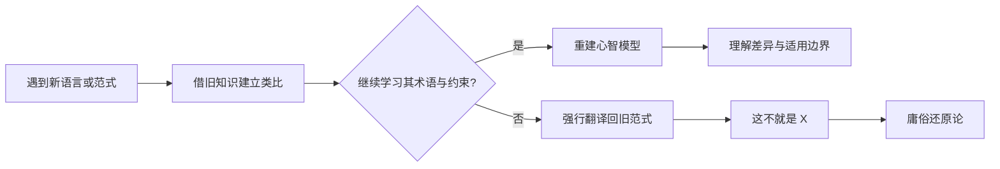
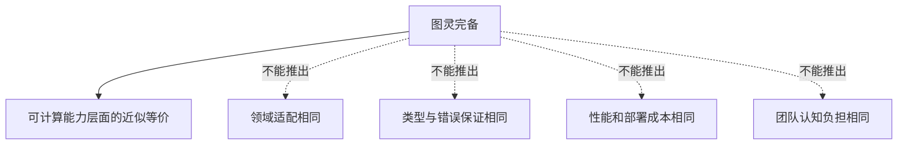

# 总结稿

## 核心结论

视频批评的不是“还原”本身，而是把某一种语言、范式或抽象当成解释全部编程世界的唯一尺度。诸如“一切皆对象”“一切皆函数”“C++ 也支持”“学会一门语言就一通百通”，在限定语境中可以帮助理解；一旦被当成普遍本体论，就会把新范式强行翻译回旧范式，使学习者只看到熟悉语法的变体，而看不到语言通过**鼓励什么、限制什么、禁止什么**所表达的设计思想。

视频用 OOP、继承、Haskell 类型类、Rust trait、Lambda Cube、依值类型和无类型 Lambda 演算等例子说明：程序语言并不存在一套简单、固定、适用于所有体系的“变量—函数—类型—流程”四元素。即使可以在某个形式体系中把多种构造编码成函数，也不能据此断言它们在工程语义、认知作用和语言设计上没有差异。“可互相编码”不等于“值得用同一种方式理解和使用”。

最后给出的学习方法是“以手指月，见月忘指”：旧知识可作为类比的起点，但抵达新体系后，应采用它自己的术语、约束与评价标准，允许原有心智模型被重建，而不是不断证明“这不就是我早就会的东西”。

## 论证脉络

1. **反对语言万能论**：图灵完备只描述可计算性边界，无法回答领域适配、类型保证、维护成本与表达方式。
2. **反对范式崇拜**：视频尤其批评把 OOP、继承、设计模式或 C++ 的多范式能力当成普遍最优解。
3. **用还原法反证还原法**：变量、类型和控制流可以在特定理论里被编码为函数，但“一切皆函数”同样只是局部视角。
4. **以反例打破固定元素表**：纯函数式语言、声明式体系与 UTLC 表明，常见语言构件并非跨体系不变的本体。
5. **回到学习方法**：类比不是问题；拒绝接受新概念自身的差异，才会形成“知见障”。

## 核验边界

- “一切程序语言都是图灵完备的”是过度概括，并非一切程序语言都图灵完备。Dhall 官方文档将其明确定义为非图灵完备的程序语言，CEL 也出于安全和可预测执行的目标故意保持非图灵完备。视频更稳固的工程结论是：即使两门语言都图灵完备，也不代表它们的安全性、领域适配和心智模型等价。[Dhall 安全保证](https://docs.dhall-lang.org/discussions/Safety-guarantees.html) · [CEL 官方概览](https://cel.dev/)
- 视频关于多态的说法需降格理解：经典分类确实区分参数多态、包含/子类型多态与特设多态；Haskell 类型类是重载机制，Rust trait 是由具体类型实现的抽象接口，但不能把 Rust trait 与 Haskell 类型类完全等同，或把 trait 整体只归为特设多态。[Cardelli 与 Wegner 论文](https://www.classes.cs.uchicago.edu/archive/2012/spring/22300-1/papers/Cardelli-Wegner.pdf) · [Haskell 98 报告](https://www.haskell.org/onlinereport/decls.html#sect4.3) · [Rust Reference](https://doc.rust-lang.org/reference/items/traits.html)
- Lambda Cube 包含“类型依赖于项”等依赖关系，依值类型的核心判断得到确认；但“类型像普通运行时值一样运算”只是口语化说法，形式上仍需区分项、类型、种类及相应抽象。[Barendregt：Pure Type Systems](https://homepages.inf.ed.ac.uk/wadler/papers/barendregt/pure-type-systems.pdf)
- UTLC 即无类型 Lambda 演算，可作为缺少常规静态类型区分的形式体系；有些语义论述会称其为“单一类型（unityped）”，这不改变视频所讨论的常规静态类型区别。[CMU 课程材料](https://www.cs.cmu.edu/~iliano/courses/15S-CMU-CS312/handouts/untyped.pdf)
- “继承已经被证明是死路”“某语言最佳”等属于讲者的强烈评价，不是经核验的普遍工程定律。更稳妥的结论是：继承、组合、类型类和 trait 各有语义与约束，应按问题选择。

# 辅助理解

## 1. 真正的问题不是还原，而是丢失差异

**视频内容：** 还原可以揭示结构，也可以制造错觉。把新概念映射到熟悉概念，是学习的入口；若映射之后不再研究新体系独有的约束，就会把“可类比”误认成“完全相同”。

这张图以“坏结局”呈现视频的警告：若所有新知识都被旧范式吞没，学习看似省力，实则只能在原有认知里循环。

**AI 辅助推断：** 可以用一个三问检查自己是否在进行有益类比：

1. 映射保留了哪些性质？
2. 哪些性质在映射中丢失了？
3. 新体系刻意禁止或不鼓励什么？

第三问尤其重要。语言设计不仅由“能做什么”定义，也由默认路径、约束和不可表达性塑造。例如两门语言都能实现同一算法，并不代表它们提供了相同的错误空间、组合方式和可维护性。

## 2. “图灵完备”为什么不足以指导工程选择

**视频内容：** “都图灵完备”只能支持一种非常弱的等价：在理想化资源条件下，它们能表达同一类可计算函数。它不能推出语言在系统编程、并发、证明、安全、部署或团队协作上等价。

这与 [[clips/【Tech Podcast】AI没让编程变简单，它只是让困难换了种形式.md|AI 没让编程变简单，它只是让困难换了种形式]] 形成互补：本视频解释“同一种计算为何可以由不同范式组织”；关联笔记则说明工具进步往往只是转移复杂性。两者合读可得：能力等价或生成更快，都不能替代对复杂性落点的判断。

**外部核验纠正：** 视频开头的“一切程序语言都是图灵完备的”不成立为普遍命题。例如 [Dhall](https://docs.dhall-lang.org/discussions/Safety-guarantees.html) 和 [CEL](https://cel.dev/) 都由官方明确设计为非图灵完备语言。因而更精确的说法是：**对那些确实图灵完备的语言，这种计算能力层面的共性仍不足以指导工程选择。**

## 3. “一切皆 X”是一种透镜，不是世界本身

**视频内容：** 讲者先演示如何把变量、类型和控制流都描述成函数，再立即指出这种游戏的局限。编码层面的可归约性，并不抹掉概念在教学、语义与工程中的区别。

四体液图在这里不是编程证据，而是视觉类比：一个体系可以结构完整、解释统一，却仍可能因为把局部模型当成世界本身而误导实践。

**外部核验补充：** 多态也不能被一句口号压平。经典文献区分参数多态、包含/子类型多态和特设多态；[Haskell 报告](https://www.haskell.org/onlinereport/decls.html#sect4.3)将类型类用于重载，[Rust Reference](https://doc.rust-lang.org/reference/items/traits.html)把 trait 定义为可由类型实现的抽象接口。二者有关联，但并非语义完全相同。

同样，[Lambda Cube 的形式化资料](https://homepages.inf.ed.ac.uk/wadler/papers/barendregt/pure-type-systems.pdf)支持“类型可依赖项”等依赖维度；这不意味着项、类型、种类可以不加区分地统称为普通运行时值。视频的直觉方向成立，口语化表达仍须保留形式边界。

## 4. 更可靠的跨范式学习流程

**AI 辅助推断：** 将视频的“指月”隐喻转成可操作流程：

此帧中的“DO NOT LOOK UP”与“见月忘指”共同收束论证：类比只是导航标记，不是目的地。真正掌握一门新语言，意味着能够解释它为何让某些写法自然、让另一些写法困难，而不只是把旧代码逐句翻译过去。

## 观众讨论与补充

热评样本中，有观众把“复杂性不会消失，只会改变形态”作为工程限定；也有人分享从 Java/OOP 转向 Haskell、Rust 等体系时，迁移体验接近重新学习。这些是**观众观点与个人经验**，不是语言理论证明，但能补足视频较强调“范式纯度”而较少讨论团队成本的一面。

另一个有价值的问题是：把“顺序、条件、循环”作为初学教学抽象，是否也属于庸俗还原？更合理的区分是：**明确适用范围且允许日后修正的简化，是脚手架；宣称它们是所有程序的终极本体，才是视频所批评的还原论。**

样本限制：评论仅为 50 条匿名热评中的候选，不含楼中楼；弹幕仅抓取当前可访问的 23 条，并非历史全集。点赞和讨论热度不能证明技术观点正确。

## 外部事实核验

### 声明 1（00:00）

- 视频陈述：The video opens with the claim that all programming languages are Turing complete.
- 核验状态：存在矛盾
- 核验结果：Contradicted as a universal statement. Many widely used general-purpose languages are modeled as Turing-complete under idealized assumptions, but programming languages need not be Turing-complete. Dhall officially describes itself as a non-Turing-complete programming language so that well-typed evaluation terminates, and the official Common Expression Language documentation likewise identifies CEL as non-Turing-complete by design. The narrower engineering point?that Turing-completeness alone does not make languages equivalent in safety, ergonomics, or domain fit?remains sound.
- 检索日期：2026-08-14
- 来源：
  - [Dhall documentation ? Safety guarantees: Turing-completeness](https://docs.dhall-lang.org/discussions/Safety-guarantees.html)（primary）
  - [Common Expression Language ? official overview](https://cel.dev/)（primary）

### 声明 2（03:00）

- 视频陈述：The video distinguishes parametric polymorphism and ad-hoc polymorphism from subtype polymorphism, citing Haskell type classes and Rust traits as examples.
- 核验状态：部分确认
- 核验结果：Partially confirmed. Cardelli and Wegner's foundational taxonomy distinguishes universal polymorphism (including parametric and inclusion/subtype polymorphism) from ad-hoc polymorphism (overloading and coercion). The Haskell Report explicitly presents type classes as an overloading mechanism, and the Rust Reference defines traits as abstract interfaces implemented for specific types. Treating Rust traits wholesale as identical to Haskell type classes or as only ad-hoc polymorphism would be an oversimplification because their semantics and dispatch forms differ.
- 检索日期：2026-08-14
- 来源：
  - [Cardelli and Wegner — On Understanding Types, Data Abstraction, and Polymorphism](https://www.classes.cs.uchicago.edu/archive/2012/spring/22300-1/papers/Cardelli-Wegner.pdf)（primary）
  - [Haskell 98 Report — Type Classes and Overloading](https://www.haskell.org/onlinereport/decls.html#sect4.3)（primary）
  - [The Rust Reference — Traits](https://doc.rust-lang.org/reference/items/traits.html)（primary）

### 声明 3（06:54）

- 视频陈述：The video says the Lambda Cube includes dependent types, in which types can be operated on and can depend on ordinary values.
- 核验状态：已确认
- 核验结果：Confirmed in substance. Barendregt's Lambda Cube organizes typed lambda calculi by allowable dependencies, including types depending on terms (dependent types) and constructors mapping types to types. The wording 'types can be operated on' is informal; the formal framework distinguishes terms, types, kinds, abstractions, and products rather than treating all of them as ordinary runtime values.
- 检索日期：2026-08-14
- 来源：
  - [Henk Barendregt — Lambda Calculi with Types / Pure Type Systems](https://homepages.inf.ed.ac.uk/wadler/papers/barendregt/pure-type-systems.pdf)（primary）
  - [Carnegie Mellon 15-312 — Dependent Types](https://www.cs.cmu.edu/~fp/courses/15312-f04/lectures/27-dependent.html)（secondary）

### 声明 4（09:10）

- 视频陈述：UTLC is expanded as Untyped Lambda Calculus, or untyped lambda calculus.
- 核验状态：已确认
- 核验结果：Confirmed. Standard programming-languages course material uses 'the untyped lambda-calculus' for the formal system; UTLC is the conventional abbreviation formed from that name.
- 检索日期：2026-08-14
- 来源：
  - [Carnegie Mellon 15-312 — The Untyped Lambda-Calculus](https://www.cs.cmu.edu/~iliano/courses/15S-CMU-CS312/handouts/untyped.pdf)（secondary）

### 声明 5（09:18）

- 视频陈述：The speaker uses UTLC as an example of a formalism without a conventional static type distinction.
- 核验状态：已确认
- 核验结果：Confirmed. The cited CMU notes describe untyped languages as languages that do not use types and therefore have no static semantics, and describe untyped lambda calculus as a language of untyped functions in which every closed expression is a well-formed program. A technical nuance is that some semantic accounts call it 'unityped' because all terms can be represented under one universal type; that does not supply the conventional static distinctions the video is discussing.
- 检索日期：2026-08-14
- 来源：
  - [Carnegie Mellon 15-312 — Untyped Languages](https://www.cs.cmu.edu/~iliano/courses/15S-CMU-CS312/handouts/untyped.pdf)（secondary）
  - [Stanford Encyclopedia of Philosophy — The Lambda Calculus: Adding types](https://plato.stanford.edu/entries/lambda-calculus/#AddiType)（secondary）

# Data

## 增强转写稿

[00:00] 一切程序语言都是图灵完备的
[00:03] 你只需要学懂一种程序语言
[00:05] 你就可以一通百通学懂所有的程序语言
[00:08] 这种庸俗的还原论已经毒害了很多人
[00:11] 而且所谓的一切程序语言都是图灵完备的
[00:14] 这不是一句信息量为零的废话吗
[00:17] 所有的通用语言都有它更优越的特定领域
[00:20] 你会用Python去写系统内核吗
[00:22] 你幻想 一切皆某某会毒害你的思想
[00:25] 一旦你见到了一个新事物
[00:27] 你就下意识的说这不就是叉叉叉叉吗
[00:30] 你完了
[00:31] 你将永远无法挣脱母语范式带给你的诅咒
[00:34] 难以真正理解新的编程范式
[00:36] 学习新语言对你来说不在社区
[00:38] 而是乏味的重复甚至苦意
[00:40] 你达成了坏结局
[00:41] 痛苦的信息
[00:46] 而在所有的庸俗还原论中
[00:48] 最庸俗的就是OOP神论
[00:49] 所有的OOP神论中最庸俗的就是Java神论
[00:52] 部分Java用户对OOP和设计模式的推崇
[00:56] 就像是有人拿着血按钮对他说
[00:58] 万物非主唯有对象然后折断一样
[01:00] 然后好多人一个小伙子就变得磨烂了
[01:02] 开始拿着32种设计模式丈量一切
[01:05] 知道的说他是学编程学的
[01:06] 不知道的
[01:07] 以为他是看神秘复苏看的
[01:09] 我说白了
[01:10] 崇敬是距离理解最遥远的距离
[01:12] 你要不要真的去学学Smalltalk
[01:14] 看看设计模式是不是这么用
[01:16] 大罗金仙丢给麻瓜的
[01:18] 基础链体硬气功
[01:20] 被当作是天书了属于是
[01:21] 做妄道来了都要输一声好爽
[01:24] 更别提在OOP的三大核心特性
[01:26] 封装继承多态中
[01:28] 继承已经被实践证明是死路
[01:30] OOP用户的世界观中
[01:32] 世界上只存在两种语言
[01:33] 一种是过程式
[01:34] 比如C和汇编
[01:35] 他们代表蛮荒的
[01:37] 危险的古代编程
[01:38] 另外一种是面向对象
[01:39] 比如说Java和Python
[01:41] 他们代表安全的现代语言
[01:43] 然而实际上由于子类型不可判定
[01:45] 所有建立在子类型上的类型系统
[01:48] 那都是基础不牢
[01:49] 地动山妖鬼入侵前路移进
[01:51] 达个比方你能够想象正常人类一代一代的翻眼
[01:55] 最终生出了一个伟人吗
[01:57] 我差五亿
[01:57] 这是什么鬼一入侵
[01:59] 这是编程还是在拍曼德拉纪录
[02:01] 所以关键到底继承究竟是什么
[02:03] 它绝对不是一套类型系统的基石
[02:06] 它只是一种强大危险
[02:07] 应该在受限范围内使用的语言特性
[02:11] 就如同他们看不起的C 语言的指针一般
[02:13] 而且继承的危害更深
[02:15] 因为它的拥趸坚定的认为它是
[02:18] 现代的安全的万物基于的
[02:22] 说到这里自然有神人变经
[02:25] 他说你毁了面向对象
[02:27] 我们要如何开发软件工程了
[02:29] 首先我可没说继承不能使用
[02:32] 我说的是应该限制性的使用
[02:35] C 程序员爱用指针和 goto
[02:37] 谁能拦得住它了
[02:38] 其次
[02:39] Java 庸俗还原论
[02:40] 把一切还原成OOP的语法糖
[02:42] 我说Lambda 表达式是函数式编程的基础
[02:45] 他说这不就是调用函数的语法堂吗
[02:49] 早该有人这么对你说了
[02:51] 继承只不过是代码复用的语法糖
[02:55] 真正稳健安全现代的编程实践是怎样的
[03:00] 类型层面用参数多态和特设多态
[03:03] 来代替子类型多态
[03:05] 这方面的最佳实践是Haskell的类型类
[03:08] 还有偷了类型类的Rust的trait
[03:11] 代码层面组合优于继承已经是被说烂了
[03:15] 当然最佳实践依然是Haskell 和 Rust
[03:20] 除了Java 拥趸之外
[03:22] 最大的庸俗还原论就是C++还原论
[03:25] 和Java不同
[03:26] C++是多范式的
[03:28] 所以不管你说什么
[03:29] 他都会来一句C++也支持
[03:32] 然后下一句就是
[03:33] 你没有C++快
[03:35] 不如用C++了写
[03:37] 但是有没有一种可能
[03:38] C++就是样样都通样样都不纯
[03:42] 看C++信徒宣称C++支持
[03:44] 函数式编程
[03:45] 就像有一个杀人魔把你老婆杀了
[03:47] 剥了皮套在身上
[03:49] 还喊你达岭
[03:52] 他问你爱不爱
[03:53] 我只想看看你到底有几张脸
[03:56] 我想说的是
[03:57] 一种编程范图的关键
[03:58] 并不仅在于你能干什么
[04:00] 还在于你不能
[04:01] 以及绝对不要干什么
[04:03] C++信徒论道
[04:05] 替C++变经的时候
[04:08] 都很谦逊
[04:09] 一口一个
[04:10] 没有人能够精通C++
[04:12] 是语言太强大
[04:13] 凡人难以驾驭
[04:15] 但是进入实践之后
[04:16] 立刻眼高手低
[04:18] 在那些真正的C++专家呕心沥血
[04:21] 写出来的实用性代码里面
[04:23] 随手一个new
[04:23] 全都完蛋了
[04:25] C++还原论的恐怖在于
[04:28] 把缝合怪当成全能
[04:30] 把语言的上限和开发者的上限
[04:32] 当做辩经的材料
[04:33] 我说白了
[04:34] 一门程序语言
[04:36] 根本就不应该什么事都能干
[04:39] 当然
[04:40] 也有一些稍有求知精神的小伙伴
[04:42] 他们会走马观花地把他
[04:44] 听说过的程序语言
[04:45] 全部都潦草地学一遍
[04:47] 然后就潦草地开始定义
[04:49] 程序语言的基本元素
[04:51] 这种任务就不说
[04:52] 他潦草地学过的那些语言
[04:54] 基本上也都是一些命令式语言
[04:57] 这不就是把庸俗还原论者
[04:59] 最爱的那一套一切接某某
[05:01] 换成了他自己的一套私设吗
[05:03] 我看还不如Java神论的
[05:04] 起码一切皆对象
[05:06] 还有一本 Java
[05:08] 以及加瓦轻碟余圣军
[05:10] 祭父马士兵保驾护航
[05:12] 这种过早的试图定义
[05:14] 程序语言的基本元素的行为
[05:16] 最终会成为一种知见障
[05:18] 一旦你知道
[05:18] 并且发自内心的相信A是A
[05:21] 你就再也想象不了
[05:22] 在另外一个体系中A
[05:24] 可能可以是B
[05:27] 我曾经见过一个小伙子
[05:29] 他学了几门程序语言之后
[05:30] 非常自信的
[05:32] 宣布他的发现
[05:33] 他宣称所有的程序语言
[05:35] 都有这样的四大基本元素
[05:36] 那就是变量
[05:38] 函数
[05:38] 类型
[05:39] 流程
[05:40] 太棒了
[05:41] 就像是古希腊哲学家
[05:43] 第一次发现了四元素学说
[05:45] 发现世间万物
[05:47] 都是由土气水火构成的一样
[05:51] 又如同希波克拉底发明四体液学说
[05:54] 我看这个理论一确立
[05:56] 传统老西医离放血疗法也是不远了
[05:59] 什么
[06:00] 你觉得他说得很对
[06:02] 有多少人是认同这套理论的
[06:05] 有多少人同意
[06:06] 变量
[06:07] 函数
[06:07] 类型
[06:08] 流程
[06:09] 就是程序语言的四大基本元素的
[06:14] 给一个人破障
[06:15] 也是破
[06:16] 给一群人破障
[06:17] 也是破
[06:18] 我们今天就一起破了吧
[06:21] 在发表暴论之前
[06:22] 我先植入一些前置知识
[06:24] 在程序语言的领域
[06:26] 有三个一等性
[06:27] 分别是值的一等性
[06:29] 函数的一等性
[06:29] 类型的一等性
[06:31] 值的一等性就是你可以定义
[06:32] 复制传递一个基本类型的值
[06:35] 函数的一等性
[06:36] 就是你可以将函数
[06:37] 当做普通值来定义传递和复制
[06:39] 这就涉及到闭包和高阶函数
[06:42] 也就是所谓的
[06:44] 函数层面运算
[06:45] 类型的一等性
[06:46] 顾名思义
[06:46] 就是可以将类型当做普通值来定义和传递
[06:49] 也就是所谓的
[06:51] 类型层面运算
[06:52] 而站在更高的层面
[06:54] 类型理论的世界里面有一种叫做Lambda Cube的理论
[06:57] Lambda Cube中存在一种叫做依值类型的东西
[07:00] 在依值类型中
[07:01] 类型不但可以作为一等值来运算
[07:04] 甚至可以依赖普通值来构造
[07:07] 接受这些前置知识之后
[07:09] 回过头来再看四元素创世论
[07:13] 一个函数
[07:14] 当然一个函数就是一个函数
[07:17] 那么一个变量
[07:19] 你以为一个变量就不是一个函数了吗
[07:21] 错了
[07:22] 变量是它所在的类型的零元函数
[07:25] 同理
[07:27] 一个类型
[07:28] 包括高阶类型
[07:29] 其实也只不过是类型层面的函数
[07:32] 那么流程控制语句
[07:34] 其实也完全可以是还原成表达式
[07:37] 然后再进而还原成函数
[07:39] 其实所谓的if 语句
[07:41] 只不过是一个Bool道一一到一二
[07:44] 到一一或一二的函数
[07:46] 你看
[07:50] 这么一看的话
[07:50] 哪有什么四大基本元素
[07:53] 分明就是函数
[07:54] 函数
[07:54] 函数
[07:55] 函数
[07:56] 只有一大基本元素
[07:57] 那就是函数
[07:58] 一切皆函数
[07:59] 用这道手法呢
[08:00] 我们还可以继续证明
[08:01] 一切皆表达式
[08:03] 但是我想观众已经发现这种游戏的无聊了
[08:09] 实际上
[08:10] 一切皆函数也好
[08:11] 一切皆对象也好
[08:12] 一切皆文件也好
[08:14] 他们都是成立的
[08:15] 但是都只是在某种语境
[08:17] 某种上下文中成立
[08:19] 一旦你把它当做是衡量一切的尺子
[08:23] 他们就从手中好用的工具
[08:25] 变成了某种知见障
[08:26] 开始妨碍你进步了
[08:29] 这就是我为什么说
[08:30] 庸俗还原论
[08:32] 是对你思想的一种毒害的原因
[08:36] 不过到了这一步
[08:37] 可能有人会反驳
[08:39] 你说了这么多
[08:39] 并没有否认四大元素在所有语言中都存在
[08:44] 我看你才是庸俗还原论吧
[08:46] 把安好好的四大基本元素
[08:48] 还原成了庸俗的函数
[08:50] 函数一元论
[08:51] 好
[08:51] 话都说到这里了
[08:52] 那我也直说了
[08:53] 这四大元素每个都可以不存在
[08:56] 你不信吗
[08:57] 首先是变量
[08:59] 在强调不可变性的纯函数语言中
[09:02] 不存在变量
[09:03] 然后对于声明式编程和函数式编程
[09:07] 流程控制是可以不存在的
[09:09] 再然后
[09:10] 你听说过UTLC吗
[09:13] Untyped Lambda Calculus
[09:15] 无类型Lambda演算
[09:16] 在UTLC中
[09:18] 所有的表达式都属于无类型，λa. a 等于 a 到 a
[09:23] 再者在纯命令式编程中
[09:26] 函数也是不必要的
[09:28] 以上这些要么是编程范式大类
[09:31] 要么是编程范式理论基础
[09:33] 他们都可以抛弃程序语言中的某种
[09:37] 所谓基本元素
[09:39] 那么
[09:40] 你还觉得程序语言真的存在某种基本元素吗
[09:45] 最后
[09:46] 多说两句
[09:47] 我很讨厌不负责任的叠甲
[09:50] 如果你认同一种理论
[09:51] 你就说你认同
[09:52] 比如你就大大方方的说
[09:54] 我认为一切皆对象
[09:56] 真想要叠甲
[09:58] 你请说
[09:59] 我认为一切皆对象
[10:00] 如果我错了
[10:01] 请你指出
[10:02] 不要说
[10:03] 我认为一切几乎皆对象
[10:06] 其实你打心眼底里
[10:08] 相信一切皆对象吗
[10:10] 但是你很虚伪
[10:11] 你表面上留有余地
[10:12] 实际上不肯为一切皆对象的理论担责
[10:16] 其他两位在事实面前可能会醒悟
[10:19] 但是你永远不会
[10:20] 因为你无法选中
[10:24] 在见识到编程范式的多样性之后
[10:26] 有人会醒悟
[10:26] 有人会装死
[10:27] 还有人会变成小黑子
[10:29] 一个人的世界观受到冲击之后
[10:31] 不去重建世界观
[10:32] 而是疯狂攻击
[10:33] 不符合他世界观的东西
[10:34] 我认为这是很可悲的
[10:36] 比如说函数式编程
[10:37] 每年都在被道心破碎的程序员疯狂地怼
[10:41] 不
[10:41] 这个世界上怎么可能有
[10:43] OOP之外的编程范式
[10:45] 你一定是在骗我
[10:47] 然而事实是
[10:48] 他奉为圭臬的主流编程语言
[10:50] 每年都在增加函数式特性
[10:53] 几乎成为了主流语言的军备竞赛了
[10:56] 谁都不想要被时代淘汰
[10:58] 尤其是那个Python
[11:00] 他嘴上是一句不提
[11:01] 但是背地里
[11:03] 疯狂地增加
[11:04] 疯狂的抄袭Haskell特性
[11:06] 简直就是罗斯福
[11:08] 嘴上反共
[11:09] 行动上比共还共
[11:11] 前几天
[11:12] 群友分享了一个
[11:13] 函数式抨击者的视频
[11:15] 这位博主表示
[11:17] 我不喜欢函数式编程
[11:18] 因为函数式编程喜欢搞链式调用
[11:21] 没有中间变量不方便调试
[11:23] 然后他严肃地展示了一个链式调用的
[11:28] 链式调用了几个Map和Future的例子
[11:31] 然后他说
[11:33] 这就是FP风格
[11:34] 我不喜欢这种风格
[11:36] 看不出中间哪不错了
[11:38] 我啊
[11:39] 还是喜欢每一步都声明一个中间变量
[11:42] 这样更清楚
[11:43] 更方便查看
[11:46] 我说实话
[11:47] 槽点实在是有点太多了
[11:49] 这不提怎么会有人觉得函数式编程就是链式调用
[11:52] 和所谓的异步流
[11:54] 我也不爱写异步流
[11:56] 问题是
[11:57] 你拿着几个甚至连副作用都没有的函数链式调用
[12:01] 说你分不清
[12:02] 你是李火旺吗
[12:04] 这种函数你能分不清
[12:05] 那只能说明你在类型理论这一块是
[12:08] 一点苦都不肯吃
[12:09] 一点点知识都不想学
[12:12] 说到这个群
[12:13] 这次也走个面
[12:14] 这个群就是我们交流函数式编程的一个群
[12:17] 群名叫做编程三味书
[12:20] 如果你对函数式编程或者程序语言感兴趣的话
[12:24] 欢迎加群讨论
[12:26] 最后呢我想可能还存在一种人
[12:28] 他们是真心想要学习更多不同的编程范式
[12:31] 但是还原论是理解新思想成本最低的方式了
[12:35] 你把还你把类比学习法说成是庸俗还原论
[12:39] 那么我们还有更高效的学习法吗
[12:41] 不是这样的兄弟
[12:42] 不是这样的
[12:43] 类比学习法不是庸俗还原论
[12:46] 只有你不肯真正接受新思想
[12:48] 用旧体系解构新思想的本质的时候
[12:51] 你才陷入了庸俗还原论
[12:54] 禅宗有一个概念叫做望月之手指
[12:58] 新的知识如同天上的月亮
[13:00] 旧的认知是指向月亮的手指
[13:03] 手指可以指出月亮的方向
[13:05] 但手指本身不是月亮
[13:07] 所以真正的类比学习法
[13:09] 就是以手指月
[13:11] 见月忘指
[13:14] 当然我也经常做一些程序语言介绍的视频
[13:17] 我做视频的时候会尽量使用贴合这门语言的名词和术语
[13:22] 因为一个名词表面上是称呼而已
[13:25] 实际上是你是否真心的接受了这门语言
[13:29] 以及它背后的编程体系
[13:31] 我不想误导人
[13:35] 而程序语言的领域又何止是月亮和手指
[13:39] 一方面C C++ Java Python
[13:42] 他们手拉着手说
[13:44] We are the world
[13:45] 我们是全世界
[13:47] 另外一方面Haskell ML OCaml
[13:51] 他们的说No no no
[13:53] 你们在地球上
[13:54] 我们在火星上
[13:55] 我们的距离太远差别太大
[13:58] 然而程序语言的世界可是一片宇宙
[14:02] 你以为半人马座alpha星上就没有程序语言了吗
[14:06] 最后的最后
[14:08] 给自己打个广告
[14:09] 我最近在介绍一种叫做Verse的语言
[14:12] 以前还做过一个介绍
[14:14] Haskell 函数式编程的系列视频
[14:16] 感兴趣的可以走个面
[14:19] 谢谢大家观看

## 原始转写稿

[00:00] 一切程序语言都是图灵完备的
[00:03] 你只需要学懂一种程序语言
[00:05] 你就可以一通百通学懂所有的程序语言
[00:08] 这种拥促的还原论已经毒害了很多人
[00:11] 而且所谓的一切程序语言都是图灵完备的
[00:14] 这不是一句信息量为零的废话吗
[00:17] 所有的通用语言都有它更优越的特定领域
[00:20] 你会用拍子去写系统内核吗
[00:22] 你幻想 一切皆某某会毒害你的思想
[00:25] 一旦你见到了一个新事物
[00:27] 你就下意识的说这不就是叉叉叉叉吗
[00:30] 你完了
[00:31] 你将永远无法征脱母语范氏带给你的诅咒
[00:34] 难以真正理解新的变成范氏
[00:36] 学习新语言对你来说不在社区
[00:38] 而是乏味的重复甚至苦意
[00:40] 你达成了坏结局
[00:41] 痛苦的信息
[00:46] 而在所有的拥促还原论中
[00:48] 最拥促的就是OP神论
[00:49] 所有的OP神论中最拥促的就是java神论
[00:52] 部分java用户对OP和设计模式的推崇
[00:56] 就像是有人拿着血按钮对他说
[00:58] 万物非主唯有对象然后折断一样
[01:00] 然后好多人一个小伙子就变得磨烂了
[01:02] 开始拿着32种设计模式称良一切
[01:05] 知道的说他是学编程学的
[01:06] 不知道的
[01:07] 以为他是看神秘复苏看的
[01:09] 我说白了
[01:10] 冲锦是距离理解最遥远的距离
[01:12] 你要不要真的去学学small talk
[01:14] 看看设计模式是不是这么用
[01:16] 大罗金仙丢给麻瓜的
[01:18] 基础链体硬气功
[01:20] 被当作是天书了属于是
[01:21] 做妄道来了都要输一声好爽
[01:24] 更别提在OP的三大核心特性
[01:26] 封装继承多态中
[01:28] 继承已经被学术证明是死路
[01:30] OP用户的世界观众
[01:32] 世界上只存在两种语言
[01:33] 一种是过程式
[01:34] 比如C和汇边
[01:35] 他们代表蛮荒的
[01:37] 危险的古代变成
[01:38] 另外一种是面向对象
[01:39] 比如说java和pazen
[01:41] 他们代表安全的现代语言
[01:43] 然而实际上由于紫类型不可判定
[01:45] 所有建立在紫类型上的类型系统
[01:48] 那都是基础不牢
[01:49] 地动山妖鬼入侵前路移进
[01:51] 达个比方你能够想象正常人类一代一代的翻眼
[01:55] 最终生出了一个伟人吗
[01:57] 我差五亿
[01:57] 这是什么鬼一入侵
[01:59] 这是编程还是在拍曼德拉纪录
[02:01] 所以关键到底继承究竟是什么
[02:03] 它绝对不是一套类型系统的技术
[02:06] 它只是一种强大危险
[02:07] 应该在受限范围内使用的语言特性
[02:11] 就如同他们看不起的思语言的指认一般
[02:13] 而且继承的危害更深
[02:15] 因为它的拥吞坚定的认为它是
[02:18] 现代的安全的万物鸡鱼的
[02:22] 说到这里自然有神人变经
[02:25] 他说你毁了变相对象
[02:27] 我们要如何开发软件工程了
[02:29] 首先我可没说继承不能使用
[02:32] 我说的是应该限制性的使用
[02:35] C程学员爱用指针和勾兔
[02:37] 谁能拦得住它了
[02:38] 其次
[02:39] Java用速还原论
[02:40] 把一切还原成OP的语法堂
[02:42] 我说Lambda表达试试寒术试编程的基础
[02:45] 他说这不就是毁掉韩数的语法堂吗
[02:49] 早该有人这么对你说了
[02:51] 继承只不过是代码附用的语法堂
[02:55] 真正稳健安全现代的变成实践是怎样的
[03:00] 类型层面用参数多太和特设多太
[03:03] 来代替子类型多太
[03:05] 这方面的最佳实践是Hasco的类型类
[03:08] 还有偷了类型类的Rustre的Treat
[03:11] 代码层面组合优域继承已经是被说暗了
[03:15] 当然最佳实践依然是Hasco和Rustre
[03:20] 除了Java拥顿之外
[03:22] 最大的用速还原论就是C++还原论
[03:25] 和Java不同
[03:26] C++是多贩式的
[03:28] 所以不管你说什么
[03:29] 他都会来一句C++也支持
[03:32] 然后下一句就是
[03:33] 你没有C++快
[03:35] 不如用C++了写
[03:37] 但是有没有一种可能
[03:38] C++就是样样都通样样都不纯
[03:42] 看C++信徒宣称C++支持
[03:44] 函数式变成
[03:45] 就像有一个杀人魔把你老婆杀了
[03:47] 剥了皮套在身上
[03:49] 还喊你达岭
[03:52] 他问你爱不爱
[03:53] 我只想看看你到底有几张脸
[03:56] 我想说的是
[03:57] 一种编程范图的关键
[03:58] 并不仅在于你能干什么
[04:00] 还在于你不能
[04:01] 以及绝对不要干什么
[04:03] C++信徒论道
[04:05] 替C++变经的时候
[04:08] 都很谦逊
[04:09] 一口一个
[04:10] 没有人能够精通C++
[04:12] 是语言太强大
[04:13] 凡人难以驾驭
[04:15] 但是进入实践之后
[04:16] 立刻眼高手低
[04:18] 在那些真正的C++专家欧星力穴
[04:21] 写出来的事务性代码里面
[04:23] 随手一个new
[04:23] 全都完蛋了
[04:25] C++还原论的恐怖在于
[04:28] 把逢和怪当成全能
[04:30] 把语言的上线和开发者的上线
[04:32] 当做变经的材料
[04:33] 我说白了
[04:34] 一门程序语言
[04:36] 根本就不应该什么事都能干
[04:39] 当然
[04:40] 也有一些稍有求之精神的小伙伴
[04:42] 他们会走马观花地把他
[04:44] 听说过的程序语言
[04:45] 全部都了草的学一遍
[04:47] 然后就了草的开始定义
[04:49] 程序语言的基本元素
[04:51] 这种任务就不说
[04:52] 他了草的学过的那些语言
[04:54] 基本上也都是一些命令式语言
[04:57] 这不就是把拥苏还原论者
[04:59] 最爱的那一套一切接某某
[05:01] 换成了他自己的一套私设吗
[05:03] 我看还不如加瓦神论的
[05:04] 起码一切皆对象
[05:06] 还有一博恩加瓦
[05:08] 以及加瓦轻碟余圣军
[05:10] 祭父马士兵保驾护航
[05:12] 这种过早的试图定义
[05:14] 程序语言的基本元素的行为
[05:16] 最终会成为一种支建杖
[05:18] 一旦你知道
[05:18] 并且发自内心的相信A是A
[05:21] 你就再也想象不了
[05:22] 在另外一个体系中A
[05:24] 可能可以是B
[05:27] 我曾经见过一个小伙子
[05:29] 他学了几门程序语言之后
[05:30] 非常自信的
[05:32] 宣布他的发现
[05:33] 他宣称所有的程序语言
[05:35] 都有这样的四大基本元素
[05:36] 那就是变量
[05:38] 函数
[05:38] 类型
[05:39] 流程
[05:40] 太棒了
[05:41] 就像是古希腊哲学家
[05:43] 第一次发现了四元素学书
[05:45] 发现世间万物
[05:47] 都是由土气水火构成的一样
[05:51] 又如同西伯克底发明四体业学书
[05:54] 我看这个理论一确立
[05:56] 传统老西医离放血疗法也是不远了
[05:59] 什么
[06:00] 你觉得他说得很对
[06:02] 有多少人是认同这套理论的
[06:05] 有多少人同意
[06:06] 变量
[06:07] 函数
[06:07] 类型
[06:08] 流程
[06:09] 就是程序语言的四大基本元素的
[06:14] 给一个人破账
[06:15] 也是破
[06:16] 给一群人破账
[06:17] 也是破
[06:18] 我们今天就一起破了吧
[06:21] 在发表暴论之前
[06:22] 我先植入一些前置知识
[06:24] 在程序语言的领域
[06:26] 有三个一等性
[06:27] 分别是值的一等性
[06:29] 函数的一等性
[06:29] 类型的一等性
[06:31] 值的一等性就是你可以定义
[06:32] 复职传递一个基本类型的值
[06:35] 函数的一等性
[06:36] 就是你可以将函数
[06:37] 当做普通值来定义传递和复职
[06:39] 这就涉及到碧包和高等函数
[06:42] 也就是所谓的
[06:44] 函数层面运算
[06:45] 类型的一等性
[06:46] 顾名的SE
[06:46] 就是可以将类型当做普通值来定义和传递
[06:49] 也就是所谓的
[06:51] 类型层面运算
[06:52] 而站在更高的层面
[06:54] 类型理论的世界里面有一种叫做Lambda Cube的理论
[06:57] Lambda Cube中存在一种叫做一直类型的东西
[07:00] 在一直类型中
[07:01] 类型不但可以作为一等值来运算
[07:04] 甚至可以依赖普通值来构造
[07:07] 接受这些前置知识之后
[07:09] 回过头来再看四元素创世论
[07:13] 一个函数
[07:14] 当然一个函数就是一个函数
[07:17] 那么一个变量
[07:19] 你以为一个变量就不是一个函数了吗
[07:21] 错了
[07:22] 变量是它所在的类型的零元函数
[07:25] 同理
[07:27] 一个类型
[07:28] 包括高阶类型
[07:29] 其实也只不过是类型层面的函数
[07:32] 那么流程控制语句
[07:34] 其实也完全可以是还原成表达式
[07:37] 然后再进而还原成函数
[07:39] 其实所谓的义父语句
[07:41] 只不过是一个波尔道一一到一二
[07:44] 到一一或一二的函数
[07:46] 你看
[07:50] 这么一看的话
[07:50] 哪有什么四大基本元素
[07:53] 分明就是函数
[07:54] 函数
[07:54] 函数
[07:55] 函数
[07:56] 只有一大基本元素
[07:57] 那就是函数
[07:58] 一切就函数
[07:59] 用这道手法呢
[08:00] 我们还可以继续证明
[08:01] 一切皆表达式
[08:03] 但是我想观众已经发现这种游戏的无聊了
[08:09] 实际上
[08:10] 一切皆函数也好
[08:11] 一切皆对象也好
[08:12] 一切皆文件也好
[08:14] 他们都是成立的
[08:15] 但是都只是在某种语境
[08:17] 某种上下文重成立
[08:19] 一旦你把它当做是撑凉一切的尺子
[08:23] 他们就从手中好用的工具
[08:25] 变成了某种枝剑杖
[08:26] 开始妨碍你进步了
[08:29] 这就是我为什么说
[08:30] 雍俗还原论
[08:32] 是对你思想的一种毒害的原因
[08:36] 不过到了这一步
[08:37] 可能有人会反驳
[08:39] 你说了这么多
[08:39] 并没有否认四大元素在所有语言中都存在
[08:44] 我看你才是雍俗还原论吧
[08:46] 把安好好的四大基本元素
[08:48] 还原成了雍俗的函数
[08:50] 函数一元论
[08:51] 好
[08:51] 话都说到这里了
[08:52] 那我也直说了
[08:53] 这四大元素每个都可以不存在
[08:56] 你不信吗
[08:57] 首先是变量
[08:59] 在强调不可变性的纯函数语言中
[09:02] 不存在变量
[09:03] 然后对于胜名式变成和函数式变成
[09:07] 流程控制是可以不存在的
[09:09] 再然后
[09:10] 你听说过Utlc吗
[09:13] UntypedLambdaCalculus
[09:15] 无类型Lambda演算
[09:16] 在Utlc中
[09:18] 所有的表达式都属于无类型gA等于A到A
[09:23] 再者在纯命令式编程中
[09:26] 函数也是不必要的
[09:28] 以上这些要么是编程犯式大类
[09:31] 要么是编程犯式理论基础
[09:33] 他们都可以抛弃程序语言中的某种
[09:37] 所谓基本元素
[09:39] 那么
[09:40] 你还觉得程序语言真的存在某种基本元素吗
[09:45] 最后
[09:46] 多说两句
[09:47] 我很讨厌不负责任的叠加
[09:50] 如果你认同一种理论
[09:51] 你就说你认同
[09:52] 比如你就大大方方的说
[09:54] 我认为一切皆对象
[09:56] 真想要叠加
[09:58] 你请说
[09:59] 我认为一切皆对象
[10:00] 如果我错了
[10:01] 请你指出
[10:02] 不要说
[10:03] 我认为一切几乎皆对象
[10:06] 其实你打心眼底里
[10:08] 相信一切皆对象吗
[10:10] 但是你很虚伪
[10:11] 你表面上留有余地
[10:12] 实际上不肯为一切皆对象的理论单则
[10:16] 其他两位在事实面前可能会行误
[10:19] 但是你永远不会
[10:20] 因为你无法选中
[10:24] 在见识到编程范氏的多样性之后
[10:26] 有人会行误
[10:26] 有人会装死
[10:27] 还有人会变成小黑子
[10:29] 一个人的世界观受到冲击之后
[10:31] 不去重建世界观
[10:32] 而是疯狂攻击
[10:33] 不符合他世界观的东西
[10:34] 我认为这是很可悲的
[10:36] 比如说韩束士编程
[10:37] 每年都在被道心破碎的程序员疯狂地毁
[10:41] 不
[10:41] 这个世界上怎么可能有
[10:43] OP之外的编程范氏
[10:45] 你一定是在骗我
[10:47] 然而事实是
[10:48] 他奉为归孽的主流程序员
[10:50] 每年都在增加韩束士特性
[10:53] 几乎成为了主流语言的军备竞赛了
[10:56] 谁都不想要被时代淘汰
[10:58] 尤其是那个Python
[11:00] 他作为上一事一句不提
[11:01] 但是背地里
[11:03] 疯狂地增加
[11:04] 疯狂的抄袭Haskell特性
[11:06] 简直就是罗斯福
[11:08] 嘴上反共
[11:09] 行动上比共还共
[11:11] 前几天
[11:12] 群友分享了一个
[11:13] 韩束士抨击者的视频
[11:15] 这位博主表示
[11:17] 我不喜欢韩束士编程
[11:18] 因为韩束士编程喜欢搞练识调用
[11:21] 没有中间变量不方便调识
[11:23] 然后他严肃地展示了一个练识调用的
[11:28] 练识调用了几个Map和Future的例子
[11:31] 然后他说
[11:33] 这就是FP风格
[11:34] 我不喜欢这种风格
[11:36] 看不出中间哪不错了
[11:38] 我啊
[11:39] 还是喜欢每一步都声明一个中间变量
[11:42] 这样更清楚
[11:43] 更方便查看
[11:46] 我说实话
[11:47] 草顶实在是有点太多了
[11:49] 这不提怎么会有人觉得韩束士编程就是练识调用
[11:52] 和所谓的异行流
[11:54] 我也不爱写异行流
[11:56] 问题是
[11:57] 你拿着几个甚至连副作用都没有的韩束练识调用
[12:01] 说你分不清
[12:02] 你是离火旺吗
[12:04] 这种韩束你能分不清
[12:05] 那只能说明你在类型理论这一块是
[12:08] 一点苦都不肯吃
[12:09] 一点点知识都不想学
[12:12] 说到这个群
[12:13] 这次也走个面
[12:14] 这个群就是我们交流韩束士编程的一个群
[12:17] 群名叫做编程三位书
[12:20] 如果你对韩束士编程或者程序与言感兴趣的话
[12:24] 欢迎加群讨论
[12:26] 最后呢我想可能还存在一种人
[12:28] 他们是真心想要学习更多不同的编程范氏
[12:31] 但是还原论是理解心思想成本最低的方式了
[12:35] 你把还你把类笔学习法说成是拥俗还原论
[12:39] 那么我们还有更高校的学习法吗
[12:41] 不是这样的兄弟
[12:42] 不是这样的
[12:43] 类笔学习法不是拥俗还原论
[12:46] 只有你不肯真正接受心思想
[12:48] 用旧体系解构心思想的本质的时候
[12:51] 你才陷入了拥俗还原论
[12:54] 缠综有一个概念叫做望月之手指
[12:58] 新的知识如同天上的月亮
[13:00] 旧的认知是指向月亮的手指
[13:03] 手指可以指出月亮的方向
[13:05] 但手指本身不是月亮
[13:07] 所以真正的类笔学习法
[13:09] 就是一手指月
[13:11] 见月望指
[13:14] 大扑我也经常做一些程序语言介绍的视频
[13:17] 我做视频的时候会尽量使用贴合这门语言的名词和数语
[13:22] 因为一个名词表面上是称呼而已
[13:25] 实际上是你是否真心的接受了这门语言
[13:29] 以及它背后的编程体系
[13:31] 我不想误导人
[13:35] 而程序语言的领域又何止是月亮和手指
[13:39] 一方面C C++ Java Python
[13:42] 他们手拉着手说
[13:44] We are the world
[13:45] 我们是全世界
[13:47] 另外一方面Huskow ML OCaml
[13:51] 他们的说No no no
[13:53] 你们在地球上
[13:54] 我们在火星上
[13:55] 我们的距离太远差别太大
[13:58] 然而程序语言的世界可是一片宇宙
[14:02] 你以为半人马座alpha星上就没有程序语言了吗
[14:06] 最后的最后
[14:08] 给自己打个广告
[14:09] 我最近在介绍一种叫做verse的语言
[14:12] 以前还做过一个介绍
[14:14] Huskow寒出石编程的系列视频
[14:16] 感兴趣的可以走个面
[14:19] 谢谢大家观看

## 原始关键帧

### 关键帧 1

### 关键帧 2

### 关键帧 3

### 关键帧 4

### 关键帧 5

### 关键帧 6

### 关键帧 7

### 关键帧 8

### 关键帧 9

### 关键帧 10

## 补充原始数据

- [bilibili-BV1zwgW6xEMv-comments.jsonl](assets/bilibili-BV1zwgW6xEMv-comments.jsonl)
- [bilibili-BV1zwgW6xEMv-comment-candidates.json](assets/bilibili-BV1zwgW6xEMv-comment-candidates.json)
- [bilibili-BV1zwgW6xEMv-danmaku.jsonl](assets/bilibili-BV1zwgW6xEMv-danmaku.jsonl)
- [bilibili-BV1zwgW6xEMv-danmaku-analysis.json](assets/bilibili-BV1zwgW6xEMv-danmaku-analysis.json)
