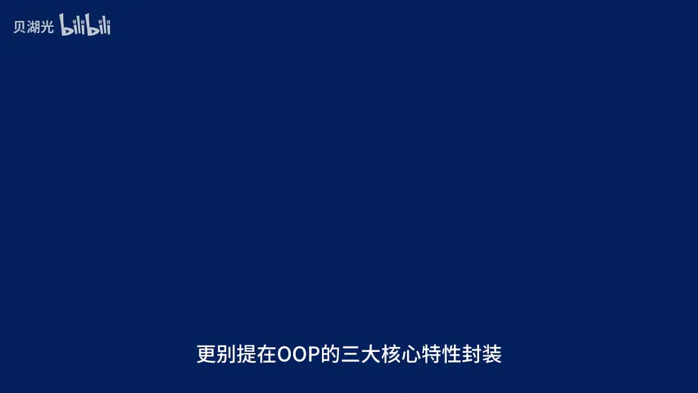
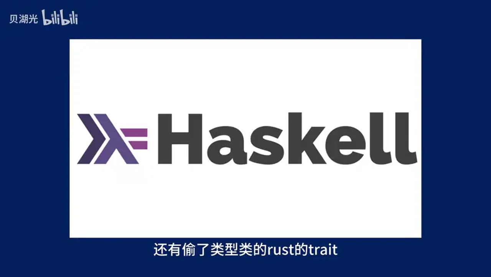
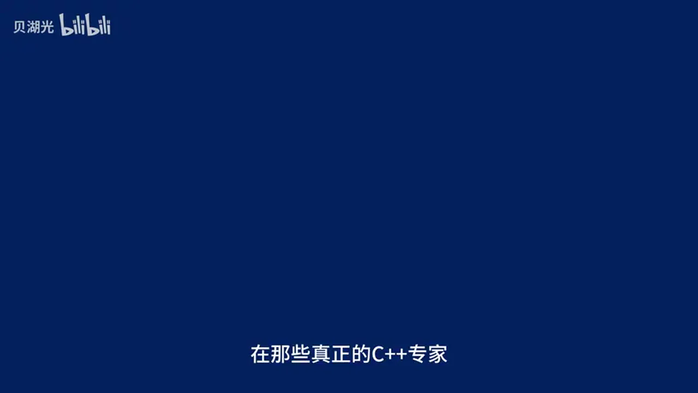
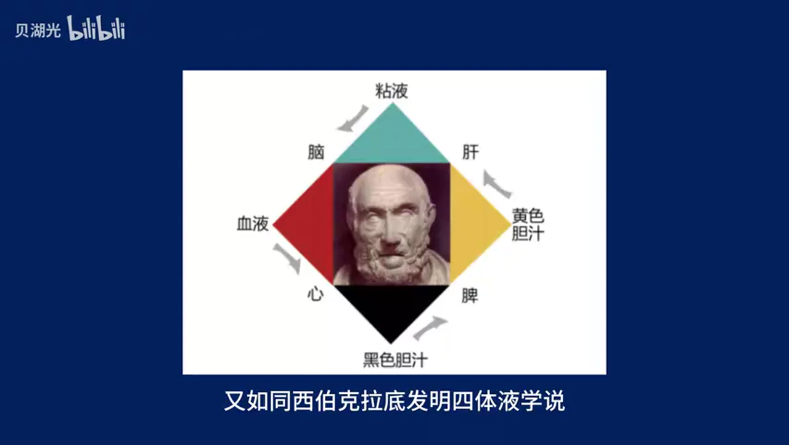
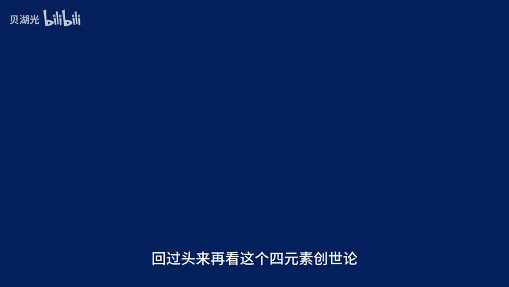
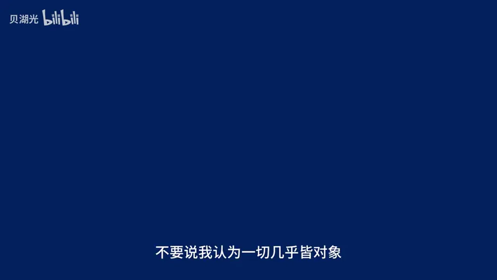
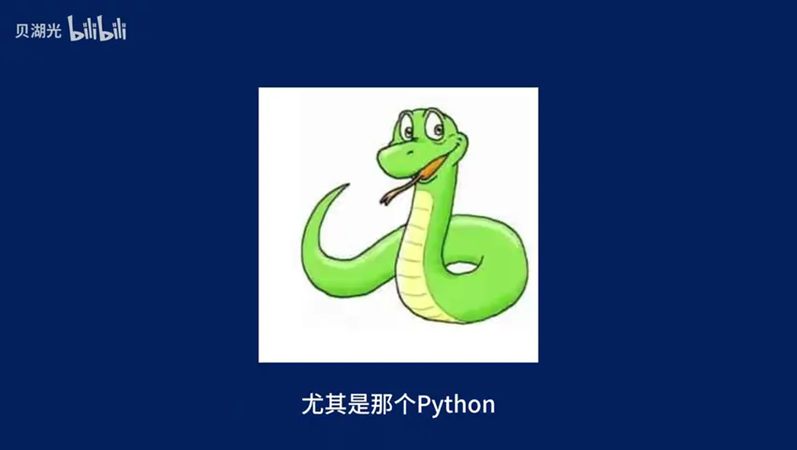
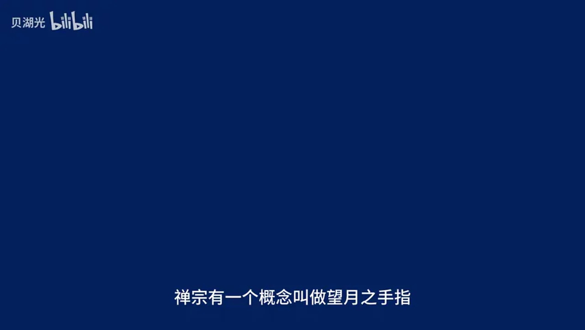
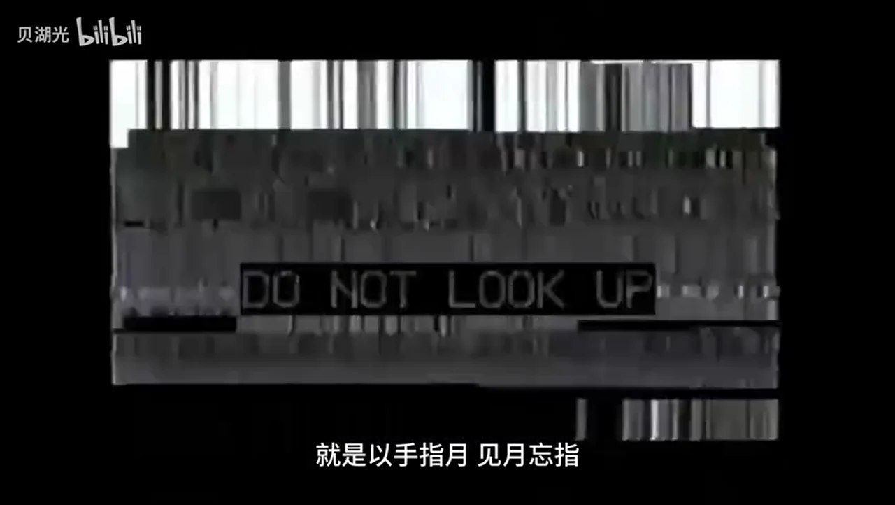

# 总结稿

暂无总结。

# 辅助理解

# Data

## 原始转写稿

[00:00] 一切程序语言都是图灵完备的
[00:03] 你只需要学懂一种程序语言
[00:05] 你就可以一通百通学懂所有的程序语言
[00:08] 这种拥促的还原论已经毒害了很多人
[00:11] 而且所谓的一切程序语言都是图灵完备的
[00:14] 这不是一句信息量为零的废话吗
[00:17] 所有的通用语言都有它更优越的特定领域
[00:20] 你会用拍子去写系统内核吗
[00:22] 你幻想 一切皆某某会毒害你的思想
[00:25] 一旦你见到了一个新事物
[00:27] 你就下意识的说这不就是叉叉叉叉吗
[00:30] 你完了
[00:31] 你将永远无法征脱母语范氏带给你的诅咒
[00:34] 难以真正理解新的变成范氏
[00:36] 学习新语言对你来说不在社区
[00:38] 而是乏味的重复甚至苦意
[00:40] 你达成了坏结局
[00:41] 痛苦的信息
[00:46] 而在所有的拥促还原论中
[00:48] 最拥促的就是OP神论
[00:49] 所有的OP神论中最拥促的就是java神论
[00:52] 部分java用户对OP和设计模式的推崇
[00:56] 就像是有人拿着血按钮对他说
[00:58] 万物非主唯有对象然后折断一样
[01:00] 然后好多人一个小伙子就变得磨烂了
[01:02] 开始拿着32种设计模式称良一切
[01:05] 知道的说他是学编程学的
[01:06] 不知道的
[01:07] 以为他是看神秘复苏看的
[01:09] 我说白了
[01:10] 冲锦是距离理解最遥远的距离
[01:12] 你要不要真的去学学small talk
[01:14] 看看设计模式是不是这么用
[01:16] 大罗金仙丢给麻瓜的
[01:18] 基础链体硬气功
[01:20] 被当作是天书了属于是
[01:21] 做妄道来了都要输一声好爽
[01:24] 更别提在OP的三大核心特性
[01:26] 封装继承多态中
[01:28] 继承已经被学术证明是死路
[01:30] OP用户的世界观众
[01:32] 世界上只存在两种语言
[01:33] 一种是过程式
[01:34] 比如C和汇边
[01:35] 他们代表蛮荒的
[01:37] 危险的古代变成
[01:38] 另外一种是面向对象
[01:39] 比如说java和pazen
[01:41] 他们代表安全的现代语言
[01:43] 然而实际上由于紫类型不可判定
[01:45] 所有建立在紫类型上的类型系统
[01:48] 那都是基础不牢
[01:49] 地动山妖鬼入侵前路移进
[01:51] 达个比方你能够想象正常人类一代一代的翻眼
[01:55] 最终生出了一个伟人吗
[01:57] 我差五亿
[01:57] 这是什么鬼一入侵
[01:59] 这是编程还是在拍曼德拉纪录
[02:01] 所以关键到底继承究竟是什么
[02:03] 它绝对不是一套类型系统的技术
[02:06] 它只是一种强大危险
[02:07] 应该在受限范围内使用的语言特性
[02:11] 就如同他们看不起的思语言的指认一般
[02:13] 而且继承的危害更深
[02:15] 因为它的拥吞坚定的认为它是
[02:18] 现代的安全的万物鸡鱼的
[02:22] 说到这里自然有神人变经
[02:25] 他说你毁了变相对象
[02:27] 我们要如何开发软件工程了
[02:29] 首先我可没说继承不能使用
[02:32] 我说的是应该限制性的使用
[02:35] C程学员爱用指针和勾兔
[02:37] 谁能拦得住它了
[02:38] 其次
[02:39] Java用速还原论
[02:40] 把一切还原成OP的语法堂
[02:42] 我说Lambda表达试试寒术试编程的基础
[02:45] 他说这不就是毁掉韩数的语法堂吗
[02:49] 早该有人这么对你说了
[02:51] 继承只不过是代码附用的语法堂
[02:55] 真正稳健安全现代的变成实践是怎样的
[03:00] 类型层面用参数多太和特设多太
[03:03] 来代替子类型多太
[03:05] 这方面的最佳实践是Hasco的类型类
[03:08] 还有偷了类型类的Rustre的Treat
[03:11] 代码层面组合优域继承已经是被说暗了
[03:15] 当然最佳实践依然是Hasco和Rustre
[03:20] 除了Java拥顿之外
[03:22] 最大的用速还原论就是C++还原论
[03:25] 和Java不同
[03:26] C++是多贩式的
[03:28] 所以不管你说什么
[03:29] 他都会来一句C++也支持
[03:32] 然后下一句就是
[03:33] 你没有C++快
[03:35] 不如用C++了写
[03:37] 但是有没有一种可能
[03:38] C++就是样样都通样样都不纯
[03:42] 看C++信徒宣称C++支持
[03:44] 函数式变成
[03:45] 就像有一个杀人魔把你老婆杀了
[03:47] 剥了皮套在身上
[03:49] 还喊你达岭
[03:52] 他问你爱不爱
[03:53] 我只想看看你到底有几张脸
[03:56] 我想说的是
[03:57] 一种编程范图的关键
[03:58] 并不仅在于你能干什么
[04:00] 还在于你不能
[04:01] 以及绝对不要干什么
[04:03] C++信徒论道
[04:05] 替C++变经的时候
[04:08] 都很谦逊
[04:09] 一口一个
[04:10] 没有人能够精通C++
[04:12] 是语言太强大
[04:13] 凡人难以驾驭
[04:15] 但是进入实践之后
[04:16] 立刻眼高手低
[04:18] 在那些真正的C++专家欧星力穴
[04:21] 写出来的事务性代码里面
[04:23] 随手一个new
[04:23] 全都完蛋了
[04:25] C++还原论的恐怖在于
[04:28] 把逢和怪当成全能
[04:30] 把语言的上线和开发者的上线
[04:32] 当做变经的材料
[04:33] 我说白了
[04:34] 一门程序语言
[04:36] 根本就不应该什么事都能干
[04:39] 当然
[04:40] 也有一些稍有求之精神的小伙伴
[04:42] 他们会走马观花地把他
[04:44] 听说过的程序语言
[04:45] 全部都了草的学一遍
[04:47] 然后就了草的开始定义
[04:49] 程序语言的基本元素
[04:51] 这种任务就不说
[04:52] 他了草的学过的那些语言
[04:54] 基本上也都是一些命令式语言
[04:57] 这不就是把拥苏还原论者
[04:59] 最爱的那一套一切接某某
[05:01] 换成了他自己的一套私设吗
[05:03] 我看还不如加瓦神论的
[05:04] 起码一切皆对象
[05:06] 还有一博恩加瓦
[05:08] 以及加瓦轻碟余圣军
[05:10] 祭父马士兵保驾护航
[05:12] 这种过早的试图定义
[05:14] 程序语言的基本元素的行为
[05:16] 最终会成为一种支建杖
[05:18] 一旦你知道
[05:18] 并且发自内心的相信A是A
[05:21] 你就再也想象不了
[05:22] 在另外一个体系中A
[05:24] 可能可以是B
[05:27] 我曾经见过一个小伙子
[05:29] 他学了几门程序语言之后
[05:30] 非常自信的
[05:32] 宣布他的发现
[05:33] 他宣称所有的程序语言
[05:35] 都有这样的四大基本元素
[05:36] 那就是变量
[05:38] 函数
[05:38] 类型
[05:39] 流程
[05:40] 太棒了
[05:41] 就像是古希腊哲学家
[05:43] 第一次发现了四元素学书
[05:45] 发现世间万物
[05:47] 都是由土气水火构成的一样
[05:51] 又如同西伯克底发明四体业学书
[05:54] 我看这个理论一确立
[05:56] 传统老西医离放血疗法也是不远了
[05:59] 什么
[06:00] 你觉得他说得很对
[06:02] 有多少人是认同这套理论的
[06:05] 有多少人同意
[06:06] 变量
[06:07] 函数
[06:07] 类型
[06:08] 流程
[06:09] 就是程序语言的四大基本元素的
[06:14] 给一个人破账
[06:15] 也是破
[06:16] 给一群人破账
[06:17] 也是破
[06:18] 我们今天就一起破了吧
[06:21] 在发表暴论之前
[06:22] 我先植入一些前置知识
[06:24] 在程序语言的领域
[06:26] 有三个一等性
[06:27] 分别是值的一等性
[06:29] 函数的一等性
[06:29] 类型的一等性
[06:31] 值的一等性就是你可以定义
[06:32] 复职传递一个基本类型的值
[06:35] 函数的一等性
[06:36] 就是你可以将函数
[06:37] 当做普通值来定义传递和复职
[06:39] 这就涉及到碧包和高等函数
[06:42] 也就是所谓的
[06:44] 函数层面运算
[06:45] 类型的一等性
[06:46] 顾名的SE
[06:46] 就是可以将类型当做普通值来定义和传递
[06:49] 也就是所谓的
[06:51] 类型层面运算
[06:52] 而站在更高的层面
[06:54] 类型理论的世界里面有一种叫做Lambda Cube的理论
[06:57] Lambda Cube中存在一种叫做一直类型的东西
[07:00] 在一直类型中
[07:01] 类型不但可以作为一等值来运算
[07:04] 甚至可以依赖普通值来构造
[07:07] 接受这些前置知识之后
[07:09] 回过头来再看四元素创世论
[07:13] 一个函数
[07:14] 当然一个函数就是一个函数
[07:17] 那么一个变量
[07:19] 你以为一个变量就不是一个函数了吗
[07:21] 错了
[07:22] 变量是它所在的类型的零元函数
[07:25] 同理
[07:27] 一个类型
[07:28] 包括高阶类型
[07:29] 其实也只不过是类型层面的函数
[07:32] 那么流程控制语句
[07:34] 其实也完全可以是还原成表达式
[07:37] 然后再进而还原成函数
[07:39] 其实所谓的义父语句
[07:41] 只不过是一个波尔道一一到一二
[07:44] 到一一或一二的函数
[07:46] 你看
[07:50] 这么一看的话
[07:50] 哪有什么四大基本元素
[07:53] 分明就是函数
[07:54] 函数
[07:54] 函数
[07:55] 函数
[07:56] 只有一大基本元素
[07:57] 那就是函数
[07:58] 一切就函数
[07:59] 用这道手法呢
[08:00] 我们还可以继续证明
[08:01] 一切皆表达式
[08:03] 但是我想观众已经发现这种游戏的无聊了
[08:09] 实际上
[08:10] 一切皆函数也好
[08:11] 一切皆对象也好
[08:12] 一切皆文件也好
[08:14] 他们都是成立的
[08:15] 但是都只是在某种语境
[08:17] 某种上下文重成立
[08:19] 一旦你把它当做是撑凉一切的尺子
[08:23] 他们就从手中好用的工具
[08:25] 变成了某种枝剑杖
[08:26] 开始妨碍你进步了
[08:29] 这就是我为什么说
[08:30] 雍俗还原论
[08:32] 是对你思想的一种毒害的原因
[08:36] 不过到了这一步
[08:37] 可能有人会反驳
[08:39] 你说了这么多
[08:39] 并没有否认四大元素在所有语言中都存在
[08:44] 我看你才是雍俗还原论吧
[08:46] 把安好好的四大基本元素
[08:48] 还原成了雍俗的函数
[08:50] 函数一元论
[08:51] 好
[08:51] 话都说到这里了
[08:52] 那我也直说了
[08:53] 这四大元素每个都可以不存在
[08:56] 你不信吗
[08:57] 首先是变量
[08:59] 在强调不可变性的纯函数语言中
[09:02] 不存在变量
[09:03] 然后对于胜名式变成和函数式变成
[09:07] 流程控制是可以不存在的
[09:09] 再然后
[09:10] 你听说过Utlc吗
[09:13] UntypedLambdaCalculus
[09:15] 无类型Lambda演算
[09:16] 在Utlc中
[09:18] 所有的表达式都属于无类型gA等于A到A
[09:23] 再者在纯命令式编程中
[09:26] 函数也是不必要的
[09:28] 以上这些要么是编程犯式大类
[09:31] 要么是编程犯式理论基础
[09:33] 他们都可以抛弃程序语言中的某种
[09:37] 所谓基本元素
[09:39] 那么
[09:40] 你还觉得程序语言真的存在某种基本元素吗
[09:45] 最后
[09:46] 多说两句
[09:47] 我很讨厌不负责任的叠加
[09:50] 如果你认同一种理论
[09:51] 你就说你认同
[09:52] 比如你就大大方方的说
[09:54] 我认为一切皆对象
[09:56] 真想要叠加
[09:58] 你请说
[09:59] 我认为一切皆对象
[10:00] 如果我错了
[10:01] 请你指出
[10:02] 不要说
[10:03] 我认为一切几乎皆对象
[10:06] 其实你打心眼底里
[10:08] 相信一切皆对象吗
[10:10] 但是你很虚伪
[10:11] 你表面上留有余地
[10:12] 实际上不肯为一切皆对象的理论单则
[10:16] 其他两位在事实面前可能会行误
[10:19] 但是你永远不会
[10:20] 因为你无法选中
[10:24] 在见识到编程范氏的多样性之后
[10:26] 有人会行误
[10:26] 有人会装死
[10:27] 还有人会变成小黑子
[10:29] 一个人的世界观受到冲击之后
[10:31] 不去重建世界观
[10:32] 而是疯狂攻击
[10:33] 不符合他世界观的东西
[10:34] 我认为这是很可悲的
[10:36] 比如说韩束士编程
[10:37] 每年都在被道心破碎的程序员疯狂地毁
[10:41] 不
[10:41] 这个世界上怎么可能有
[10:43] OP之外的编程范氏
[10:45] 你一定是在骗我
[10:47] 然而事实是
[10:48] 他奉为归孽的主流程序员
[10:50] 每年都在增加韩束士特性
[10:53] 几乎成为了主流语言的军备竞赛了
[10:56] 谁都不想要被时代淘汰
[10:58] 尤其是那个Python
[11:00] 他作为上一事一句不提
[11:01] 但是背地里
[11:03] 疯狂地增加
[11:04] 疯狂的抄袭Haskell特性
[11:06] 简直就是罗斯福
[11:08] 嘴上反共
[11:09] 行动上比共还共
[11:11] 前几天
[11:12] 群友分享了一个
[11:13] 韩束士抨击者的视频
[11:15] 这位博主表示
[11:17] 我不喜欢韩束士编程
[11:18] 因为韩束士编程喜欢搞练识调用
[11:21] 没有中间变量不方便调识
[11:23] 然后他严肃地展示了一个练识调用的
[11:28] 练识调用了几个Map和Future的例子
[11:31] 然后他说
[11:33] 这就是FP风格
[11:34] 我不喜欢这种风格
[11:36] 看不出中间哪不错了
[11:38] 我啊
[11:39] 还是喜欢每一步都声明一个中间变量
[11:42] 这样更清楚
[11:43] 更方便查看
[11:46] 我说实话
[11:47] 草顶实在是有点太多了
[11:49] 这不提怎么会有人觉得韩束士编程就是练识调用
[11:52] 和所谓的异行流
[11:54] 我也不爱写异行流
[11:56] 问题是
[11:57] 你拿着几个甚至连副作用都没有的韩束练识调用
[12:01] 说你分不清
[12:02] 你是离火旺吗
[12:04] 这种韩束你能分不清
[12:05] 那只能说明你在类型理论这一块是
[12:08] 一点苦都不肯吃
[12:09] 一点点知识都不想学
[12:12] 说到这个群
[12:13] 这次也走个面
[12:14] 这个群就是我们交流韩束士编程的一个群
[12:17] 群名叫做编程三位书
[12:20] 如果你对韩束士编程或者程序与言感兴趣的话
[12:24] 欢迎加群讨论
[12:26] 最后呢我想可能还存在一种人
[12:28] 他们是真心想要学习更多不同的编程范氏
[12:31] 但是还原论是理解心思想成本最低的方式了
[12:35] 你把还你把类笔学习法说成是拥俗还原论
[12:39] 那么我们还有更高校的学习法吗
[12:41] 不是这样的兄弟
[12:42] 不是这样的
[12:43] 类笔学习法不是拥俗还原论
[12:46] 只有你不肯真正接受心思想
[12:48] 用旧体系解构心思想的本质的时候
[12:51] 你才陷入了拥俗还原论
[12:54] 缠综有一个概念叫做望月之手指
[12:58] 新的知识如同天上的月亮
[13:00] 旧的认知是指向月亮的手指
[13:03] 手指可以指出月亮的方向
[13:05] 但手指本身不是月亮
[13:07] 所以真正的类笔学习法
[13:09] 就是一手指月
[13:11] 见月望指
[13:14] 大扑我也经常做一些程序语言介绍的视频
[13:17] 我做视频的时候会尽量使用贴合这门语言的名词和数语
[13:22] 因为一个名词表面上是称呼而已
[13:25] 实际上是你是否真心的接受了这门语言
[13:29] 以及它背后的编程体系
[13:31] 我不想误导人
[13:35] 而程序语言的领域又何止是月亮和手指
[13:39] 一方面C C++ Java Python
[13:42] 他们手拉着手说
[13:44] We are the world
[13:45] 我们是全世界
[13:47] 另外一方面Huskow ML OCaml
[13:51] 他们的说No no no
[13:53] 你们在地球上
[13:54] 我们在火星上
[13:55] 我们的距离太远差别太大
[13:58] 然而程序语言的世界可是一片宇宙
[14:02] 你以为半人马座alpha星上就没有程序语言了吗
[14:06] 最后的最后
[14:08] 给自己打个广告
[14:09] 我最近在介绍一种叫做verse的语言
[14:12] 以前还做过一个介绍
[14:14] Huskow寒出石编程的系列视频
[14:16] 感兴趣的可以走个面
[14:19] 谢谢大家观看

## 原始关键帧

### 关键帧 1

### 关键帧 2

### 关键帧 3

### 关键帧 4

### 关键帧 5

### 关键帧 6

### 关键帧 7

### 关键帧 8

### 关键帧 9

### 关键帧 10

