# 总结稿

## 核心观点

视频借《士兵突击》中的许三多与《肖申克的救赎》中的安迪，对照老马与老布，讨论人在长期缺乏反馈、看不到出路时如何避免被环境驯化。它认为，最消磨人的并非一次失败，而是努力与放弃似乎都没有区别：当反馈消失，时间会把人推向敷衍、麻木和认命，最终连“还可以有另一种活法”的想象也被封闭。

许三多修路、安迪凿墙之所以能坚持，并不是因为他们确定会得到奖励或成功，而是把意义放在行动本身：做自己认定正确的事，以可掌控的具体行动抵抗不可掌控的环境。修一寸路、凿下一点墙粉，都会给空虚的时间留下形状，把“没有回应的等待”改造成“仍在前进的过程”。

这种行动还在持续塑造身份。许三多不是被发配后便只能混日子的“孬兵”，安迪也不只是一名囚犯；每一次选择都在回答“我要成为什么样的人”。因此，精神自由不是等环境解除限制，而是在限制中仍保留一件由自己决定、能够持续去做的事。

视频最终把希望重新定义为一种由选择和行动搭成的稳定结构，而不是等待出现的情绪或外界保证。人在看不到希望时仍能坚持做难而正确的事，是因为每次行动都会让墙薄一分、让路长一寸；不是先看见光再出发，而是在持续前行中逐渐创造光亮。

# 辅助理解

## 一条主线：从“反馈消失”到“行动生成希望”

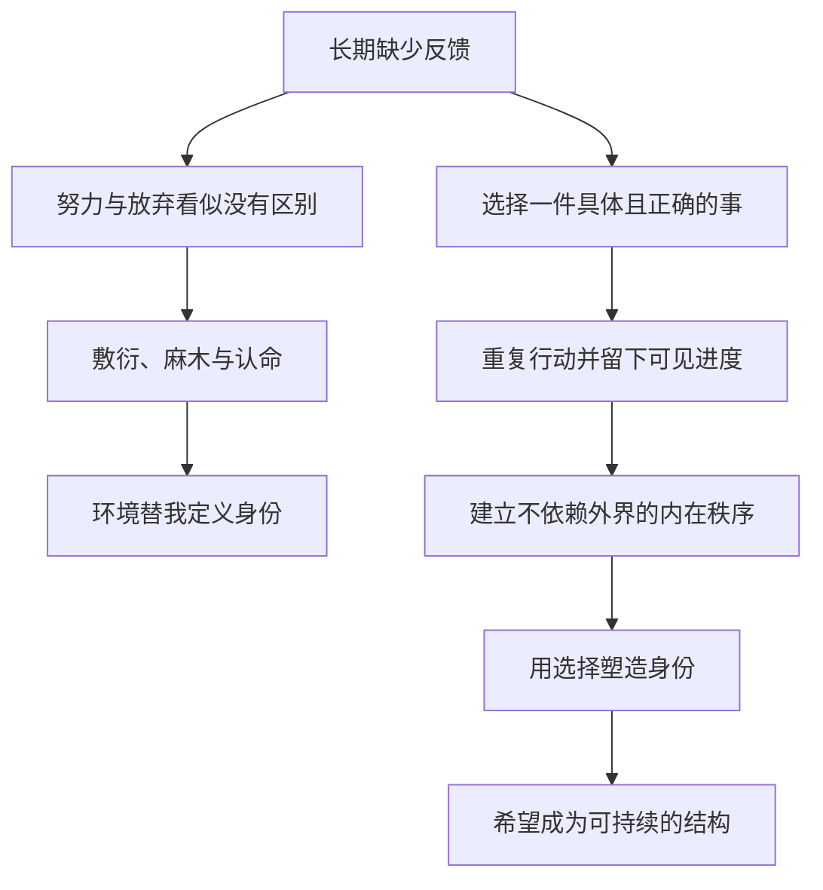

### 视频证据

视频首先把“荒原”和“高墙”并置为精神困境：人无处可去、无事可做，也得不到命运的回应（00:36–01:11）。作者随后用老马和老布说明两种被环境驯化的结果——一个在长期徒劳中逐渐得过且过，另一个对监狱秩序产生依赖，以至于离开后失去生活的支点（01:57–07:40）。

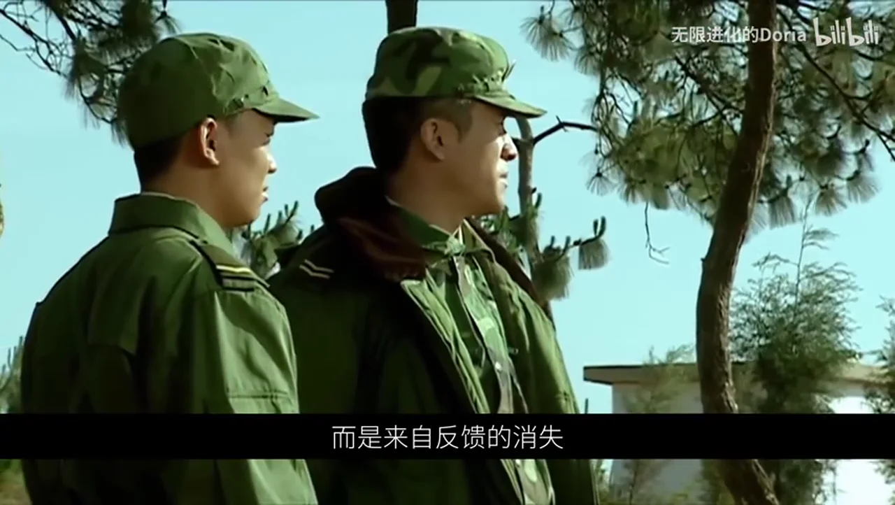

与之相对，许三多日复一日搬石、码齐、铺平，安迪则在无数夜晚持续凿墙。视频强调，两人行动时都没有确定的回报：修路未被承诺能换来调离，隧道也可能永远凿不通（09:19–10:13）。他们坚持的关键，是把意义安放在行动本身，而非结果上（10:13–10:52）。

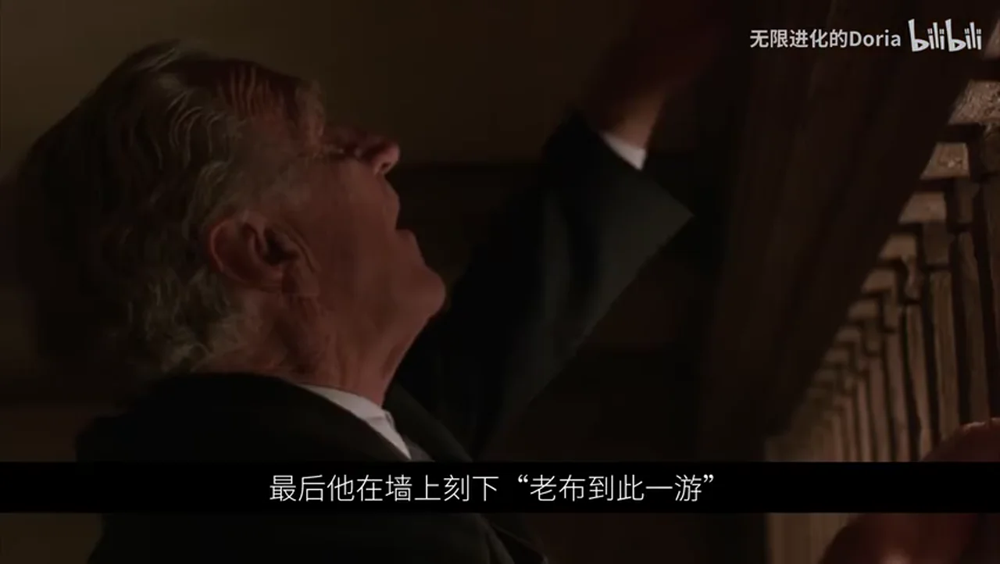

到后半段，论证从“坚持做什么”推进到“行动使人成为什么”：修路让许三多成为坚守本分的兵，凿墙让安迪保持自由意志；当环境不给人理想身份时，人仍能用选择与行动塑造自己（11:34–12:13）。

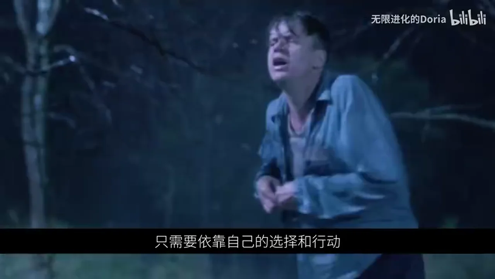

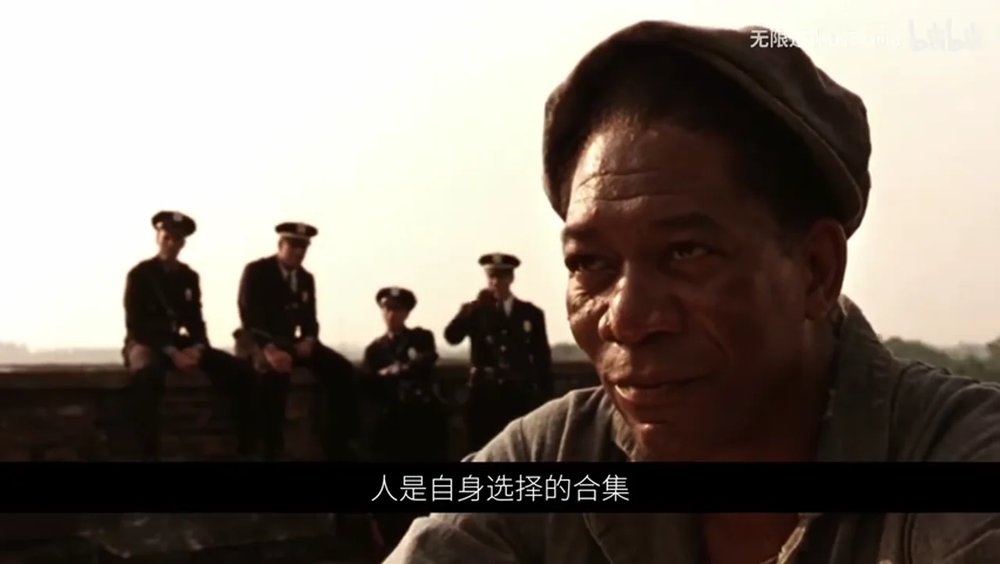

最后，具体而重复的劳动把空虚时间变成看得见的进度；进度本身又成为希望。视频据此总结：人不是当前处境，而是自身选择的合计；希望也不是稍纵即逝的情绪，而是由一次次行动累积起来、足以承受黑暗的结构（13:13–16:42）。

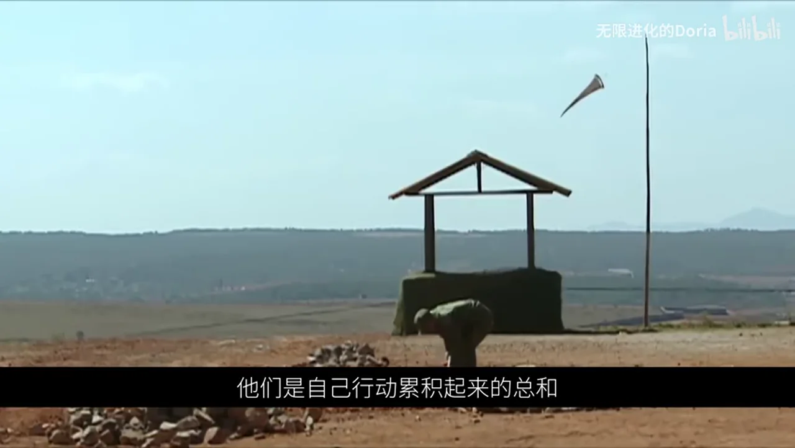

### 作者解读

以下是视频作者的价值判断与阐释，不是影片或剧集直接证明的普遍规律：

- “虚无”最危险的机制，是让人把暂时处境误认成终身宿命，并逐渐失去想象另一种生活的能力。
- “正确的事”不以立刻有用或得到认可为标准，而以它是否维持人的主体性、秩序感和自我认同为标准。
- 许三多与安迪的行动并非只是一种成功策略；即使结果仍不确定，行动已经在当下完成了一次对环境定义的拒绝。
- 因而，坚持不是用乐观情绪强撑，而是把宏大而遥远的希望拆成今天能够完成、能够留下痕迹的一小步。

### 外部核验

外部资料只用于核对作品情节，不把视频的哲学推论包装成客观事实：

- 《士兵突击》的故事资料支持许三多进入草原五班这一情节；《肖申克的救赎》的权威影片资料支持安迪是银行家、因双重谋杀指控入狱且被作品呈现为蒙冤者（00:00–00:15）。来源：[央视《士兵突击》故事梗概](https://www.cctv.com/teleplay/special/C20086/20071130/107199.shtml)、[Oscars.org 影片页面](https://www.oscars.org/events/shawshank-redemption)、[American Film Institute 影片页面](https://watch.afi.com/movie/the-shawshank-redemption)。核验状态：确认。
- 央视评论资料支持老马曾是优秀班长、到草原五班后逐渐变得随波逐流这一人物背景（02:01–02:30）。来源：[央视评论](https://news.cctv.com/military/20070829/109181.shtml)。核验状态：确认。
- 公开剧情梗概与剧本支持老布服刑约五十年、假释后无法适应外界生活的情节（03:11–03:27）。来源：[IMDb 剧情梗概](https://www.imdb.com/title/tt0111161/plotsummary/)、[Script Slug 剧本](https://www.scriptslug.com/script/the-shawshank-redemption-1994)。核验状态：确认。
- 央视资料支持许三多把修路当作任务、靠一人之力持续完成道路；但“没有任何调离承诺”没有得到资料逐字证明（09:19–09:38）。来源：[央视《士兵突击》故事梗概](https://www.cctv.com/teleplay/special/C20086/20071130/107199.shtml)、[央视相关评论](https://finance.cctv.com/20080121/101210.shtml)。核验状态：部分确认。
- 公开剧本与剧情资料支持安迪使用石锤挖隧道、经污水管逃出以及雨中张开双臂等情节，并与约十九年的时间跨度一致（09:38–09:56、12:13–12:46）。来源：[Script Slug 剧本](https://www.scriptslug.com/script/the-shawshank-redemption-1994)、[IMDb 剧情梗概](https://www.imdb.com/title/tt0111161/plotsummary/)。核验状态：确认。

### 可落地的方法

把视频的论证转成个人实践，可以用四个问题校准行动：

1. 这件事即使短期没有回报，我仍认为它正确吗？
2. 我能否把它缩小到今天可完成、可重复的一步？
3. 这一步会留下什么可见痕迹，让时间不再只是消耗？
4. 重复这个选择，正在把我塑造成怎样的人？

这套方法不保证外部结果，却能把注意力从“命运何时回应”移回“我今天仍能选择什么”。视频真正提供的不是成功承诺，而是一种在不确定中保住行动能力和自我定义权的结构。

# Data

## 增强转写稿

# 校正转录

> 领域：影视文本分析、存在主义心理与个人成长
> 校正原则：只改正高置信度的人名、片名、同音字和明显语义错误；不确定对白保留原转写。

[0.00-3.96] 《士兵突击》讲的是一个农村娃参军
[3.96-5.52] 《肖申克的救赎》
[5.52-8.36] 讲的是一个银行家含冤入狱
[8.36-11.80] 许三多被扔在了无边无际的荒原上
[11.80-15.20] 安迪被关进了阴森冰冷的高墙里
[15.20-17.60] 前者消磨一个人的心气
[17.60-19.80] 后者泯灭一个人的希望
[19.80-22.32] 然而他们一个在草原上
[22.32-25.04] 日复一日心无旁物的修路
[25.04-26.44] 一个在监狱里
[26.44-29.36] 年复一年悄无声息地凿墙
[29.36-31.92] 不同的故事不同的命运
[31.92-33.12] 但本质上
[33.12-36.28] 他们都在对抗着同一种精神困境
[36.28-39.08] 那就是环境对一个人的驯化
[39.08-42.28] 草原和监狱其实是同一种隐喻
[42.28-44.80] 他们象征着我们每一个人
[44.80-46.76] 都会经历的人生阶段
[46.76-50.00] 那些看不见出路也找不到意义的时刻
[50.00-52.00] 你感觉自己无处可去
[52.00-53.20] 无事可做
[53.20-54.48] 也无人在乎
[54.48-56.60] 日子一天天过去
[56.60-57.72] 你做了什么
[57.72-58.88] 没做什么
[58.88-60.32] 没有任何区别
[60.32-62.52] 无论你努力还是放弃
[62.52-64.36] 都得不到命运的回应
[64.36-67.32] 生活像一潭波澜不惊的死水
[67.32-68.64] 永远沉默着
[68.64-71.00] 永远不给你任何的声响
[71.00-73.32] 人这一生最难熬的
[73.32-75.08] 往往不是大苦大难
[75.08-77.72] 而是漫长的无望的徒劳
[77.72-80.12] 当生活被抽空了意义
[80.12-82.72] 时间就不再只是时间
[82.72-84.76] 而成了一把磨人的钝刀
[84.76-87.52] 一点一点耗损着人的心气
[87.52-89.40] 让你慢慢接受平庸
[89.40-90.56] 习惯敷衍
[90.56-94.12] 于是日子只剩下了重复和消耗
[94.12-96.16] 生活变成了一场
[96.16-98.48] 看不见尽头的无期徒刑
[98.48-100.36] 一个人内心的虚无感
[100.36-102.20] 其实并不来自失败
[102.20-104.72] 而是来自反馈的消失
[104.72-108.44] 真正的牢笼也不是高墙或者荒原
[108.44-110.00] 而是得不到反馈
[110.00-111.84] 看不到希望的环境
[111.84-113.28] 在这样的环境里
[113.28-114.96] 你会选择怎么活
[114.96-117.84] 大多数人都会慢慢被融解掉
[117.84-119.56] 像草原五班的老马
[119.56-121.16] 像《肖申克的救赎》里的老布
[121.16-123.12] 老马刚到五班的时候
[123.12-125.32] 是红三连最好的班长
[125.32-127.00] 他带着一腔热血
[127.00-128.76] 想在那一片荒原上
[128.76-130.80] 好好地干出点样子
[130.80-132.76] 可是很快他就发现
[132.76-133.60] 在这里
[133.60-134.88] 没有人看他
[134.88-136.08] 没有人管他
[136.08-137.64] 认真没有用
[137.64-139.36] 努力也白费
[139.36-141.12] 他做的好与不好
[141.12-142.68] 甚至做与不做
[142.68-144.28] 都没有任何区别
[144.28-147.20] 老马并不是一夜之间堕落的
[147.20-149.76] 他是在一次次的徒劳无功中
[149.76-152.36] 一点点地学会了得过且过
[152.36-153.88] 今天妥协一点
[153.88-155.36] 明天放弃一点
[155.36-157.96] 等到某一天突然反应过来的时候
[157.96-159.04] 自己早就
[159.04-161.64] 活成了当初最讨厌的样子
[161.64-163.16] 一个人受得了累
[163.16-164.16] 扛得住苦
[164.16-165.56] 却很难抵抗
[165.56-167.88] 日复一日温水般的消磨
[169.12-171.44] 这荒原十几公里
[171.44-173.92] 就我们几个
[173.92-175.60] 要想在这儿待一下
[175.60-177.48] 那就得明白
[177.48-178.80] 多数人是好
[178.80-180.04] 少数人是坏
[180.04-180.80] 你
[189.88-191.08] 老布也是这样
[191.08-193.60] 他在肖申克监狱里待了五十年
[193.60-194.88] 监狱的规矩
[194.88-196.28] 就是他的规矩
[196.28-197.60] 监狱的秩序
[197.60-199.04] 就是他的秩序
[199.04-200.44] 他不需要思考
[200.44-201.68] 只需要服从
[201.68-203.96] 他的一切身份与尊严
[203.96-205.84] 都建立在高墙之内
[205.84-207.36] 五十年的时间
[207.36-208.84] 足够让一个人
[208.84-209.76] 把牢笼
[209.76-211.60] 当成自己的整个世界
[211.60-213.88] 但他不再向往墙外的世界
[213.88-216.48] 他不再想象墙外的生活
[216.48-217.84] 墙外的自由
[217.84-219.08] 对于他而言
[219.08-220.80] 就已经不再存在了
[220.80-222.36] 他也就丧失了
[222.36-224.04] 自由生活的能力
[224.04-225.24] 所以当老布
[225.24-227.24] 终于获得假释的时候
[227.24-229.04] 他没有丝毫的喜悦
[229.04-230.64] 只有无尽的惶恐
[230.64-232.28] 因为墙外的世界
[232.28-233.36] 对他而言
[233.36-235.20] 不是自由与新生
[235.20-237.96] 而是巨大的陌生和茫然
[237.96-240.76] 他不知道应该怎么过普通人的生活
[240.76-242.36] 不知道自己是谁
[242.36-243.40] 该做什么
[243.40-245.00] 在无边的自由里
[245.00-247.76] 他反而彻底丧失了存在感
[261.64-263.64] 可能我得把我给给你拿走
[263.64-265.24] 然后把食物给你拿走
[265.24-266.64] 所以他们会把我送回家
[266.64-269.04] 我可以把管理人送回家里
[269.04-271.24] 就像一个贡献的样子
[272.64-274.24] 我估计我太年轻了
[274.24-276.64] 这种不合适的意义了
[276.64-278.64] 我不喜欢这种事
[278.64-281.64] 我一直都很担心
[281.64-284.64] 我决定不让我留下
[291.64-297.64] 最后他在墙上刻下“老布到此一游”
[297.64-301.64] 然后把自己的身子轻轻地挂了上去
[301.64-307.64] 然后在墙上刻下“老布到此一游”
[307.64-311.64] 然后把自己的身子轻轻地挂了上去
[311.64-314.64] 最后他在墙上刻下“老布到此一游”
[314.64-318.64] 然后把自己的身子轻轻地挂了上去
[318.64-321.64] 老马和老布一个在荒原中堕落
[321.64-323.64] 一个在自由中崩溃
[323.64-325.64] 这就是虚无最残忍的地方
[325.64-327.64] 它不动声色地
[327.64-328.64] 用时间
[328.64-329.64] 用疲惫
[329.64-330.64] 用失望
[330.64-334.64] 一点点的磨掉一个人的心气和希望
[334.64-337.64] 让人慢慢变得消沉和麻木
[337.64-340.64] 当老马和老布渐渐不再不满
[340.64-341.64] 不再质疑
[341.64-342.64] 不再反抗
[342.64-344.64] 甚至不再感觉被困
[344.64-348.64] 他们的精神就被驯服了
[348.64-350.64] 却以为自己只是适应了
[350.64-353.64] 于是环境允许他们是什么样
[353.64-354.64] 他们就活成什么样
[354.64-357.64] 身边的人怎么活他们就怎么活
[357.64-361.64] 被环境驯服的人只能顺应环境的惯性活着
[361.64-363.64] 然而惯性的终点
[363.64-366.64] 就是把自己活成环境的一部分
[366.64-368.64] 这就是一个人被体制化的过程
[368.64-371.64] 它不会让你感到撕心裂肺的痛苦
[371.64-375.64] 但他却能让你悄无声息的消失
[375.64-377.64] 最终活成芸芸众生里
[377.64-379.64] 最平庸最麻木的一个
[379.64-381.64] Brooks ain't no bug
[381.64-387.64] It's just institutionalized
[387.64-390.64] Institutionalized, my ass
[390.64-392.64] The man's been in here 50 years
[392.64-394.64] 50 years
[394.64-396.64] This is all he knows
[396.64-398.64] In here he's an important man
[398.64-400.64] He's an educated man
[400.64-403.64] Outside is nothing
[403.64-407.64] Just a used up con with arthritis in both hands
[407.64-410.64] Probably couldn't get a library card if he tried
[410.64-412.64] You know what I'm trying to say?
[412.64-416.64] Red, I do believe you're talking out of your ass
[416.64-419.64] You believe whatever you want, Floyd
[419.64-423.64] But I'm telling you these walls are funny
[423.64-427.64] If you hate them
[427.64-431.64] Then you get used to them
[431.64-434.64] Enough time passes
[434.64-437.64] You get so you depend on them
[437.64-440.64] That's institutionalized
[440.64-443.64] Shit, you can never get like that
[443.64-445.64] Oh yeah?
[445.64-448.64] Say that when you've been here as long as Brooks has
[448.64-452.64] God damn right
[452.64-454.64] They send you here for life
[454.64-457.64] That's exactly what they take
[457.64-460.64] The part that counts, anyway
[460.64-463.64] 而体制化真正可怕的地方
[463.64-465.64] 并不在于进入一个人的身体
[465.64-468.64] 而在于封锁了一个人的想象
[468.64-470.64] 它让你无法想象另一种活法
[470.64-472.64] 无法想象另一种人生
[472.64-475.64] 就像老马想象不到荒原上
[475.64-477.64] 也可以认真的做事
[477.64-479.64] 老布想象不到高墙外
[479.64-481.64] 也可以好好地生活
[481.64-483.64] 当一个人不再向往更好的生活
[483.64-485.64] 不再期待更好的自己
[485.64-487.64] 它就真的被彻底困住了
[487.64-489.64] 真正困住一个人的
[489.64-491.64] 从来都不是环境
[491.64-493.64] 而是内心枯竭的希望
[493.64-495.64] 和绝望的臆想
[495.64-498.64] 我们属于正规军当中
[498.64-500.64] 有了不多
[500.64-502.64] 没了不少的那一部分
[502.64-505.64] 我们的主要出路呢
[505.64-509.64] 也就是要认清这一现状
[509.64-512.64] 不要做不该做的事情
[512.64-514.64] 就是连想都不要想
[514.64-516.64] 这就是一个无神论者的
[516.64-518.64] 现实生活方式
[518.64-520.64] 所以体制化的本质
[520.64-522.64] 就是一个人开始认命
[522.64-523.64] 开始相信
[523.64-525.64] 生活就只能是这样
[525.64-528.64] 我也就只能这样活着
[528.64-529.64] 这就是为什么
[529.64-532.64] 五班的其他人都选择混日子
[532.64-535.64] 肖申克的其他人都逐渐被同化
[535.64-537.64] 因为找不到属于自己的意义
[537.64-539.64] 所以只能相信
[539.64-540.64] 既然大家都这样
[540.64-542.64] 那我也只能这样
[542.64-544.64] 可是许三多没有相信
[544.64-546.64] 安迪也没有认命
[546.64-548.64] 草原上荒凉孤寂
[548.64-550.64] 监狱里暗无天日
[550.64-552.64] 所有人都在妥协
[552.64-553.64] 在沉沦
[553.64-554.64] 只有他们两个人
[554.64-556.64] 固执地做着别人眼里
[556.64-557.64] 没有意义
[557.64-559.64] 没有尽头的事情
[559.64-561.64] 没有人告诉许三多
[561.64-563.64] 修好了路就能够离开
[563.64-564.64] 甚至没有人觉得
[564.64-567.64] 在荒原上修一条路有什么用
[567.64-570.64] 可许三多只管日复一日地搬石头
[570.64-572.64] 码齐、铺平
[572.64-575.64] 每天风雨无阻的只管认认真真
[575.64-578.64] 踏踏实实的做好手上的事情
[578.64-580.64] 同样也没有人告诉安迪
[580.64-582.64] 凿通了这堵墙就能出去
[582.64-585.64] 甚至他随时都有可能被发现
[585.64-586.64] 被严惩
[586.64-589.64] 可他依然在19年里的无数个夜晚
[589.64-592.64] 靠着一把藏在圣经里的小锤子
[592.64-594.64] 一点一点地凿着一堵
[594.64-596.64] 看不见终点的墙
[596.64-598.64] 他们都在做一件没有反馈
[598.64-599.64] 没有奖励
[599.64-602.64] 甚至可能没有任何结果的事情
[602.64-604.64] 可他们都没有放弃
[604.64-605.64] 都没有停下
[605.64-608.64] 为什么在看不到任何希望的日子里
[608.64-610.64] 他们依然还能坚持
[610.64-613.64] 做着一件艰难而漫长的事情
[613.64-614.64] 答案其实很简单
[614.64-616.64] 因为他们把行动的意义
[616.64-618.64] 安放在了行动本身上
[618.64-620.64] 而不是行动的结果上
[620.64-622.64] 许三多修路
[622.64-624.64] 不是因为想要这条路被谁看见
[624.64-626.64] 然后把他调走
[626.64-627.64] 他日复一日的修路
[627.64-629.64] 是因为他真的觉得
[629.64-630.64] 修路这件事本身
[630.64-632.64] 就是一件正确的事情
[632.64-634.64] 而安迪凿墙
[634.64-635.64] 也不是因为确定
[635.64-638.64] 自己能够靠着这条隧道逃出去
[638.64-640.64] 他年复一年地凿墙
[640.64-642.64] 只是因为凿墙这件事情本身
[642.64-644.64] 就是他对抗整个环境
[644.64-645.64] 最有利的方式
[645.64-647.64] 他们都不是为了这件事情
[647.64-649.64] 带来的任何结果
[649.64-652.64] 他们就只是为了这件事情本身
[652.64-654.64] 他们不是在追求确定的结果
[654.64-657.64] 他们是在抵抗过程的消失
[657.64-660.64] 只有当一个人在做自己认定的
[660.64-662.64] 是正确的事情的时候
[662.64-664.64] 他才不会因为过程的起伏
[664.64-666.64] 和结果的模糊而停止
[666.64-668.64] 修路和凿墙的行动本身
[668.64-671.64] 就是在混乱无序的外在世界里
[671.64-673.64] 为自己构建起一套
[673.64-675.64] 稳定而坚韧的内在秩序
[675.64-677.64] 在草原五班
[677.64-679.64] 一个人如果什么都不做
[679.64-681.64] 就会被荒原慢慢吞没
[681.64-683.64] 而修路和凿墙
[683.64-685.64] 本质上是同一种选择
[685.64-687.64] 那就是拒绝环境
[687.64-689.64] 给予自己的身份和定义
[689.64-691.64] 然后用自己的双手
[691.64-694.64] 为自己创造出另一种存在的方式
[694.64-696.64] 修路让许三多
[696.64-698.64] 不再是一个被发配到五班的兵
[698.64-701.64] 他是一个能够坚守本分的兵
[701.64-703.64] 凿墙让安迪
[703.64-706.64] 不再是一个被关在监狱里的囚犯
[706.64-708.64] 这就是修路和凿墙
[708.64-711.64] 安迪不再是一个被关在监狱里的囚犯
[711.64-714.64] 他是一个拥有自由意志的人
[714.64-716.64] 修路和凿墙就是他们
[716.64-718.64] 确认自我身份的方式
[718.64-721.64] 当世界无法给予他们想要的身份时
[721.64-723.64] 他们选择用行动
[723.64-725.64] 塑造自己的身份
[725.64-727.64] 而这种确认自我的方式
[727.64-730.64] 不需要依赖外界的反馈和认可
[730.64-733.64] 只需要依靠自己的选择和行动
[733.64-735.64] 安迪用了十九年凿墙
[735.64-737.64] 漫长的 沉默的
[737.64-739.64] 没有回应的十九年
[739.64-741.64] 但他最后爬过那条隧洞
[741.64-743.64] 爬过肮脏的下水道
[743.64-746.64] 站在暴雨中张开双臂时
[746.64-748.64] 他是完全自由的
[748.64-750.64] 然而自由并不是他在那一刻
[750.64-752.64] 才终于获得的
[752.64-754.64] 在过去无数个深夜里
[754.64-756.64] 每一个凿向墙壁的瞬间
[756.64-758.64] 每一个敲击石头的时刻
[758.64-761.64] 他就已经把自己活成一个自由的人了
[761.64-765.64] 与其说许三多和安迪改变了自己的命运
[765.64-768.64] 不如说他们是在命运中成为了自己
[768.64-770.64] 他们没有变成环境
[770.64-772.64] 想要他们变成的样子
[772.64-774.64] 他们时时刻刻都在成为
[774.64-776.64] 自己想要成为的人
[776.64-778.64] 对于一个普通人来说
[778.64-780.64] 获得肉体的自由很容易
[780.64-783.64] 但拥有精神的自由却最难
[783.64-784.64] 任何一种环境
[784.64-786.64] 当你身在其中
[786.64-787.64] 却找不到意义时
[787.64-790.64] 它就变成了囚禁你的精神牢笼
[790.64-792.64] 许三多和安迪之所以
[792.64-794.64] 无法被剥夺精神的自由
[794.64-796.64] 是因为他们的意义感
[796.64-799.64] 从不来自于结果，而来源于重复
[799.64-802.64] 修路和凿墙都是极其具体的
[802.64-804.64] 枯燥的漫长的事情
[804.64-806.64] 但许三多的双手可以摸到
[806.64-809.64] 一块又一块石头的棱角
[809.64-811.64] 安迪的小锤能够凿下一点
[811.64-813.64] 又一点墙壁的粉末
[813.64-816.64] 他们把空虚且难熬的时间
[816.64-818.64] 通过微小而持续的行动
[818.64-821.64] 变成了有方向 有形状
[821.64-823.64] 看得见 摸得着的路径
[823.64-825.64] 而这些路径就是真实的
[825.64-828.64] 清晰的具体的进度
[828.64-830.64] 而进度本身就是希望
[830.64-833.64] 只要进度还在向前进
[833.64-836.64] 就永远值得满怀希望
[836.64-838.64] 所谓自由就是在任何处境中
[838.64-841.64] 都能做一件完全属于自己的事
[841.64-844.64] 我做不是为了改变世界
[844.64-846.64] 而是为了不被世界改变
[846.64-849.64] 当世界不再回应你的时候
[849.64-852.64] 你还能够选择用行动回应自己
[852.64-855.64] 这就是一个人对抗虚无的终极力量
[855.64-858.64] 许三多的路，在五班所有人看来
[858.64-860.64] 都是徒劳无功的
[860.64-862.64] 安迪的隧道 在所有人看来
[862.64-864.64] 都是痴心妄想的
[864.64-867.64] 可恰恰 是这些看似无用的事
[867.64-869.64] 最终救赎了他们
[869.64-872.64] 世俗眼中的有用，必须要迎合环境的规则
[872.64-874.64] 得到确定的结果
[874.64-878.64] 而环境 训化一个人最隐秘而强大的方式
[878.64-881.64] 就在于他垄断了对于有用的定义
[881.64-884.64] 他让人只会选择做规则框架之内的
[884.64-887.64] 有用的事情 久而久之
[887.64-890.64] 一个人就逐渐沦为了系统的零件
[890.64-892.64] 和环境的延伸
[892.64-894.64] 而那些看似无用的事情
[894.64-896.64] 是由自己掌控的边界
[896.64-898.64] 即便这件事情很小
[898.64-900.64] 小到其他人都不屑一顾
[900.64-902.64] 甚至嗤之以鼻
[902.64-905.64] 可他的存在本身就在无声的宣告着
[905.64-908.64] 你还拥有属于自己的选择
[908.64-910.64] 这个选择就是自由
[910.64-913.64] 而这些看似微不足道的自由
[913.64-915.64] 却足以支撑一个人
[915.64-918.64] 穿越这世间一切的荒原与高墙
[918.64-921.64] 老马和老布把暂时的境遇
[921.64-923.64] 当成了一生的宿命
[923.64-924.64] 而许三多和安迪
[924.64-926.64] 却无论身处怎样的绝境
[926.64-929.64] 都永远有属于自己的选择
[929.64-931.64] 人不是当前的处境
[931.64-933.64] 人是自身选择的合计
[933.64-935.64] 当一个人选择了自由
[935.64-937.64] 许三多就不是孬兵
[937.64-939.64] 安迪也不是囚犯
[939.64-940.64] 他们是自己行动
[940.64-942.64] 累积起来的总和
[942.64-944.64] 每次的行动本身
[944.64-946.64] 就是对于当前生活的微小越狱
[946.64-949.64] 希望不是一种情绪
[949.64-951.64] 因为情绪稍纵即逝
[951.64-954.64] 希望是一种坚定的结构
[954.64-956.64] 是你用选择和行动
[956.64-958.64] 一点一点构建起来的
[958.64-960.64] 能够承受漫长黑暗的勇气
[960.64-961.64] 与力量
[961.64-963.64] 不是要站在原地
[963.64-964.64] 等到天亮了再走
[964.64-966.64] 而是走着走着
[966.64-968.64] 才能慢慢看见光亮
[968.64-970.64] 不是一定要等着有了反馈
[970.64-971.64] 再继续坚持
[971.64-973.64] 而是只有一直坚持住
[973.64-975.64] 命运才会对你发出回应
[975.64-978.64] 生活才会为你做出改变
[978.64-980.64] 许三多和安迪相信的
[980.64-981.64] 不是隧道的尽头
[981.64-983.64] 一定有光明的出路
[983.64-984.64] 他们相信的是
[984.64-986.64] 每用力地向前凿一下
[986.64-987.64] 铺一点
[987.64-989.64] 墙就必定会薄一分
[989.64-991.64] 路就必定会长一寸
[991.64-992.64] 这大概就是一个人
[992.64-994.64] 在无人问津的岁月
[994.64-996.64] 和看不到希望的日子里
[996.64-999.64] 还能坚持着走下去的唯一原因
[999.64-1002.64] 因为走下去本身就是希望
[1027.64-1029.64] 有东西
[1029.64-1031.64] 在里面
[1031.64-1033.64] 他们不可以触碰
[1033.64-1035.64] 他们不可以触碰
[1035.64-1037.64] 是你的
[1037.64-1039.64] 我们会谈谈
[1040.64-1042.64] 希望
[1042.64-1044.64] 希望

## 原始转写稿

[00:00] 士兵突击讲的是一个农村娃入参军
[00:03] 肖森克的救赎
[00:05] 讲的是一个银行家含冤入狱
[00:08] 雪山多被认在了无边无际的荒原上
[00:11] 安迪被关进了阴森冰冷的高墙里
[00:15] 前者消磨一个人的心气
[00:17] 后者泯灭一个人的希望
[00:19] 然而他们一个在草原上
[00:22] 日复一日心无旁物的修路
[00:25] 一个在监狱里
[00:26] 年复一年悄无深际的早墙
[00:29] 不同的故事不同的命运
[00:31] 但本质上
[00:33] 他们都在对抗着同一种精神困境
[00:36] 那就是环境对一个人的训话
[00:39] 草原和监狱其实是同一种隐喻
[00:42] 他们象征着我们每一个人
[00:44] 都会经历的人生阶段
[00:46] 那些看不见出路也找不到意义的时刻
[00:50] 你感觉自己无处可去
[00:52] 无是可做
[00:53] 也无人在乎
[00:54] 日子一天天过去
[00:56] 你做了什么
[00:57] 没做什么
[00:58] 没有任何区别
[01:00] 无论你努力还是放弃
[01:02] 都得不到命运的回应
[01:04] 生活像一坛波澜不经的死水
[01:07] 永远沉默着
[01:08] 永远不给你任何的声响
[01:11] 人这一生最难熬的
[01:13] 往往不是大苦大难
[01:15] 而是漫长的无望的徒劳
[01:17] 当生活被抽空了意义
[01:20] 时间就不再只是时间
[01:22] 而成了一把魔人的炖刀
[01:24] 一点一点耗损着人的心气
[01:27] 让你慢慢接受平庸
[01:29] 习惯敷衍
[01:30] 于是日子只剩下了重复和消耗
[01:34] 生活变成了一场
[01:36] 看不见镜头的武器徒心
[01:38] 一个人内心的虚无感
[01:40] 其实并不来自失败
[01:42] 而是来自反馈的消失
[01:44] 真正的牢笼也不是高墙或者荒原
[01:48] 而是得不到反馈
[01:50] 看不到希望的环境
[01:51] 在这样的环境里
[01:53] 你会选择怎么活
[01:54] 大多数人都会慢慢被融解掉
[01:57] 像草原武班的老马
[01:59] 像肖胜克的老布
[02:01] 老马刚到武班的时候
[02:03] 是洪三连最好的班长
[02:05] 他带着一枪热血
[02:07] 想在那一片荒原上
[02:08] 好好地干出点样子
[02:10] 可是很快他就发现
[02:12] 在这里
[02:13] 没有人看他
[02:14] 没有人管他
[02:16] 认真没有用
[02:17] 努力也白费
[02:19] 他做的好与不好
[02:21] 甚至做与不做
[02:22] 都没有任何区别
[02:24] 老马并不是一夜之间堕落的
[02:27] 他是在一次次的徒劳武功中
[02:29] 一点点地学会了德国且过
[02:32] 今天妥协一点
[02:33] 明天放弃一点
[02:35] 等到某一天突然反映过来的时候
[02:37] 自己早就
[02:39] 活成了当初最讨厌的样子
[02:41] 一个人受得了累
[02:43] 扛得住库
[02:44] 却很难抵抗
[02:45] 日复一日温水般的消磨
[02:49] 这荒原十几公里
[02:51] 就我们几个
[02:53] 要想在这儿待一下
[02:55] 那就得明白
[02:57] 多数人是好
[02:58] 少数人是坏
[03:00] 你
[03:09] 老布也是这样
[03:11] 他在肖胜课里待了五十年
[03:13] 监狱的规矩
[03:14] 就是他的规矩
[03:16] 监狱的秩序
[03:17] 就是他的秩序
[03:19] 他不需要思考
[03:20] 只需要服从
[03:21] 他的一切身份与尊严
[03:23] 都建立在高墙之内
[03:25] 五十年的时间
[03:27] 足够让一个人
[03:28] 把牢笼
[03:29] 当成自己的整个世界
[03:31] 但他不再向往墙外的世界
[03:33] 但他不再想向墙外的生活
[03:36] 墙外的自由
[03:37] 对于他而言
[03:39] 就已经不再存在了
[03:40] 他也就丧失了
[03:42] 自由生活的能力
[03:44] 所以当老布
[03:45] 终于获得假释的时候
[03:47] 他没有丝毫的喜悦
[03:49] 只有无尽的惶恐
[03:50] 因为墙外的世界
[03:52] 对他而言
[03:53] 不是自由与新生
[03:55] 而是巨大的陌生和萌染
[03:57] 他不知道应该怎么过普通人的生活
[04:00] 不知道自己是谁
[04:02] 该做什么
[04:03] 在无边的自由里
[04:05] 他反而彻底丧失了存在感
[04:21] 可能我得把我给给你拿走
[04:23] 然后把食物给你拿走
[04:25] 所以他们会把我送回家
[04:26] 我可以把管理人送回家里
[04:29] 就像一个贡献的样子
[04:32] 我估计我太年轻了
[04:34] 这种不合适的意义了
[04:36] 我不喜欢这种事
[04:38] 我一直都很担心
[04:41] 我决定不让我留下
[04:51] 最后他在墙上刻下老布到此一游
[04:57] 然后把自己的一身都轻轻的挂了上去
[05:01] 然后在墙上刻下老布到此一游
[05:07] 然后把自己的一身都轻轻的挂了上去
[05:11] 最后他在墙上刻下老布到此一游
[05:14] 然后把自己的一身都轻轻的挂了上去
[05:18] 老马和老布一个在荒原中堕落
[05:21] 一个在自由中崩溃
[05:23] 这就是虚无最残忍的地方
[05:25] 他不动身色的
[05:27] 用时间
[05:28] 用疲惫
[05:29] 用失望
[05:30] 一点点的磨掉一个人的心气和希望
[05:34] 让人慢慢变得消沉和麻木
[05:37] 当老马和老布渐渐不再不满
[05:40] 不再质疑
[05:41] 不再反抗
[05:42] 甚至不再感觉被困
[05:44] 他们的精神就被驯服了
[05:48] 却以为自己只是适应了
[05:50] 于是环境允许他们是什么样
[05:53] 他们就活成什么样
[05:54] 身边的人怎么活他们就怎么活
[05:57] 被环境驯服的人只能顺应环境的惯性活着
[06:01] 然而惯性的终点
[06:03] 就是把自己活成环境的一部分
[06:06] 这就是一个人体质化的过程
[06:08] 他不会让你感到私心劣肺的痛苦
[06:11] 但他却能让你悄无声息的消失
[06:15] 最终活成云云众生理
[06:17] 最平庸最麻木的一个
[06:19] Brux ain't no bug
[06:21] It's just institutionalized
[06:27] Institutionalized by ass
[06:30] The man's been in here 50 years
[06:32] 50 years
[06:34] This is all he knows
[06:36] In here he's an important man
[06:38] He's an educated man
[06:40] Outside is nothing
[06:43] Just a used up con with arthritis in both hands
[06:47] Probably couldn't get a library card if he tried
[06:50] You know what I'm trying to say?
[06:52] Red, I do believe you're talking out of your ass
[06:56] You believe whatever you want, Floyd
[06:59] But I'm telling you these walls are funny
[07:03] If you hate them
[07:07] Then you get used to them
[07:11] Enough time passes
[07:14] You get so you depend on them
[07:17] Ass institutionalized
[07:20] Shit, you can never get like that
[07:23] Oh yeah?
[07:25] Say that when you've been here as long as Brux has
[07:28] God damn right
[07:32] You send you here for life
[07:34] That's exactly what they take
[07:37] Party counts anyway
[07:40] 而体制化真正可怕的地方
[07:43] 并不在于进入一个人的身体
[07:45] 而在于封锁了一个人的想象
[07:48] 它让你无法想象另一种活法
[07:50] 无法想象另一种人生
[07:52] 就像老马想象不到荒原上
[07:55] 也可以认真的做事
[07:57] 老布想象不到高墙外
[07:59] 也可以好好地生活
[08:01] 当一个人不再向往更好的生活
[08:03] 不再期待更好的自己
[08:05] 它就真的被彻底困住了
[08:07] 真正困住一个人的
[08:09] 从来都不是环境
[08:11] 而是内心枯竭的希望
[08:13] 和绝望的念想
[08:15] 我们属于正规军当中
[08:18] 有了不多
[08:20] 没了不少的那一部分
[08:22] 我们的主要出路呢
[08:25] 也就是要认清这一现状
[08:29] 不要做不该做的事情
[08:32] 就是连想都不要想
[08:34] 这就是一个无神论者的
[08:36] 现实生活方式
[08:38] 所以体制化的本质
[08:40] 就是一个人开始任命
[08:42] 开始相信
[08:43] 生活就只能是这样
[08:45] 我也就只能这样活着
[08:48] 这就是为什么
[08:49] 武班的其他人都选择混日子
[08:52] 小生课的其他人都逐渐被童话
[08:55] 因为找不到属于自己的意义
[08:57] 所以只能相信
[08:59] 既然大家都这样
[09:00] 那我也只能这样
[09:02] 可是许三多没有相信
[09:04] 安迪也没有任命
[09:06] 草原上荒凉孤寂
[09:08] 监狱里暗无天日
[09:10] 所有人都在妥协
[09:12] 在沉沦
[09:13] 只有他们两个人
[09:14] 固执的坐着别人眼里
[09:16] 没有意义
[09:17] 没有镜头的事情
[09:19] 没有人告诉许三多
[09:21] 修好了路就能够离开
[09:23] 甚至没有人觉得
[09:24] 在荒原上收一条路有什么用
[09:27] 可许三多只管日付一日的班石头
[09:30] 马旗 铺平
[09:32] 每天风雨无阻的只管认认真真
[09:35] 踏踏实实的做好手上的事情
[09:38] 同样也没有人告诉安迪
[09:40] 遭通了这堵墙就能出去
[09:42] 甚至他随时都有可能被发现
[09:45] 被严沉
[09:46] 可他依然在19年里的无数个夜晚
[09:49] 靠着一把藏在圣经里的小锤子
[09:52] 一点一点的遭着一堵
[09:54] 看不见终点的墙
[09:56] 他们都在做一件没有反馈
[09:58] 没有奖励
[09:59] 甚至可能没有任何结果的事情
[10:02] 可他们都没有放弃
[10:04] 都没有停下
[10:05] 为什么在看不到任何希望的日子里
[10:08] 他们依然还能坚持
[10:10] 做着一件艰难而漫长的事情
[10:13] 答案其实很简单
[10:14] 因为他们把行动的意义
[10:16] 安放在了行动本身上
[10:18] 而不是行动的结果上
[10:20] 许三多修路
[10:22] 不是因为想要这条路被谁看见
[10:24] 然后把他调走
[10:26] 他日复一日的修路
[10:27] 是因为他真的觉得
[10:29] 修路这件事本身
[10:30] 就是一件正确的事情
[10:32] 而安蒂早强
[10:34] 也不是因为确定
[10:35] 自己能够靠着这条隧道逃出去
[10:38] 他年复一年的早强
[10:40] 只是因为早强这件事情本身
[10:42] 就是他对抗整个环境
[10:44] 最有利的方式
[10:45] 他们都不是为了这件事情
[10:47] 带来的任何结果
[10:49] 他们就只是为了这件事情本身
[10:52] 他们不是在追求确定的结果
[10:54] 他们是在抵抗过程的消失
[10:57] 只有当一个人在做自己认定的
[11:00] 是正确的事情的时候
[11:02] 他才不会因为过程的起伏
[11:04] 和结果的模糊而停止
[11:06] 修路和早强的行动本身
[11:08] 就是在混乱无需的外在世界里
[11:11] 为自己构建起一套
[11:13] 稳定而坚韧的内在秩序
[11:15] 在草原舞班
[11:17] 一个人如果什么都不做
[11:19] 就会被荒原慢慢吞没
[11:21] 而修路和早强
[11:23] 本质上是同一种选择
[11:25] 那就是拒绝环境
[11:27] 给予自己的身份和定义
[11:29] 然后用自己的双手
[11:31] 为自己创造出另一种存在的方式
[11:34] 修路让许三多
[11:36] 不再是一个被发配到舞班的兵
[11:38] 他是一个能够坚守本分的兵
[11:41] 早强让安迪
[11:43] 不再是一个被关在监狱里的囚犯
[11:46] 这就是修路和早强
[11:48] 安迪不再是一个被关在监狱里的囚犯
[11:51] 他是一个拥有自由意志的人
[11:54] 修路和早强就是他们
[11:56] 确认自我身份的方式
[11:58] 当世界无法给予他们想要的身份时
[12:01] 他们选择用行动
[12:03] 塑造自己的身份
[12:05] 而这种确认自我的方式
[12:07] 不需要依赖外界的反馈和认可
[12:10] 只需要依靠自己的选择和行动
[12:13] 安迪用了十九年早强
[12:15] 漫长的 沉默的
[12:17] 没有回应的十九年
[12:19] 但他最后爬过那条碎洞
[12:21] 爬过脏屋的下水道
[12:23] 站在暴雨中张开双臂时
[12:26] 他是完全自由的
[12:28] 然而自由并不是他在那一刻
[12:30] 才终于获得的
[12:32] 在过去无数个深夜里
[12:34] 每一个早向强斃的瞬间
[12:36] 每一个敲击石头的时刻
[12:38] 他就已经把自己活成一个自由的人了
[12:41] 与其说许章多和安迪改变了自己的命运
[12:45] 就说他们是在命运中成为了自己
[12:48] 他们没有变成环境
[12:50] 想要他们变成的样子
[12:52] 他们时时刻刻都在成为
[12:54] 自己想要成为的人
[12:56] 对于一个普通人来说
[12:58] 获得肉体的自由很容易
[13:00] 但拥有精神的自由却最难
[13:03] 任何一种环境
[13:04] 当你身在其中
[13:06] 却找不到意义时
[13:07] 他就变成了求尽你的精神牢笼
[13:10] 许章多和安迪之所以
[13:12] 无法被剥夺精神的自由
[13:14] 是因为他们的意义改
[13:16] 从过来自于结果而来源于重复
[13:19] 修路和早墙都是极其具体的
[13:22] 枯燥的漫长的事情
[13:24] 但许章多的双手可以摸到
[13:26] 一块又一块石头的棱角
[13:29] 安迪的小锤能够遭下一点
[13:31] 又一点墙壁的粉末
[13:33] 他们把空气浅难熬的时间
[13:36] 通过微小而持续的行动
[13:38] 变成了有方向 有形状
[13:41] 看得见 摸得着的路径
[13:43] 而这些路径就是真实的
[13:45] 清晰的具体的进度
[13:48] 而进度本身就是希望
[13:50] 只要进度还在向前进
[13:53] 就永远值得满怀希望
[13:56] 所谓自由就是在任何处境中
[13:58] 都能做一件完全属于自己的事
[14:01] 我做不是为了改变世界
[14:04] 而是为了不被世界改变
[14:06] 当世界不再回忆你的时候
[14:09] 你还能够选择用行动回应自己
[14:12] 这就是一个人对抗虚无的终极力量
[14:15] 水上多的路 在舞班所有人看来
[14:18] 都是徒劳武功的
[14:20] 安迪的隧道 在所有人看来
[14:22] 都是痴心妄想的
[14:24] 可恰恰 是这些看似无用的事
[14:27] 最终就输了他们
[14:29] 世所眼中的有用 必须要迎合环境的规则
[14:32] 得到确定的结果
[14:34] 而环境 训化一个人最隐秘而强大的方式
[14:38] 就在于他垄断了对于有用的定义
[14:41] 他让人只会选择做规则框架之内的
[14:44] 有用的事情 久而久之
[14:47] 一个人就如见沦为了系统的零件
[14:50] 和环境的延伸
[14:52] 而那些看似无用的事情
[14:54] 是由自己掌控的边界
[14:56] 即便这件事情很小
[14:58] 小到其他人都不懈一顾
[15:00] 甚至吃吃一笔
[15:02] 可他的存在本身就在无声的宣告着
[15:05] 你还拥有属于自己的选择
[15:08] 这个选择就是自由
[15:10] 而这些看似微顾足道的自由
[15:13] 却足以支撑一个人
[15:15] 穿越这世间一切的荒原与高强
[15:18] 老马和老布把暂时的境域
[15:21] 当成了一生的宿命
[15:23] 而雪山都和安迪
[15:24] 却无论伸出怎样的绝境
[15:26] 都永远有属于自己的选择
[15:29] 人不是当前的处境
[15:31] 人是自身选择的合机
[15:33] 当一个人选择了自由
[15:35] 雪山多就不是弄兵
[15:37] 安迪也不是囚犯
[15:39] 他们是自己行动
[15:40] 累积起来的总和
[15:42] 每次的行动本身
[15:44] 就是对于当前生活的微小乐欲
[15:46] 希望不是一种情绪
[15:49] 因为情绪稍纵即逝
[15:51] 希望是一种坚定的结构
[15:54] 是你用选择和行动
[15:56] 一点一点构建起来的
[15:58] 能够承受漫长黑暗的勇气
[16:00] 与力量
[16:01] 不是要站在原地
[16:03] 等到天亮了再走
[16:04] 而是走着走着
[16:06] 才能慢慢看见光亮
[16:08] 一定要等着有了反馈
[16:10] 再继续坚持
[16:11] 而是只有一直坚持住
[16:13] 命运才会对你发出回应
[16:15] 生活才会为你做出改变
[16:18] 雪山多和安迪相信的
[16:20] 不是隧道的镜头
[16:21] 一定有光明的出路
[16:23] 他们相信的是
[16:24] 每用力的向前早一下
[16:26] 铺一点
[16:27] 墙就必定会薄一分
[16:29] 路就必定会长一寸
[16:31] 这大概就是一个人
[16:32] 在无人问津的岁月
[16:34] 和看不到希望的日子里
[16:36] 还能坚持着走下去的唯一原因
[16:39] 因为走下去本身就是希望
[17:07] 有东西
[17:09] 在里面
[17:11] 他们不可以触碰
[17:13] 他们不可以触碰
[17:15] 是你的
[17:17] 我们会谈谈
[17:20] 希望
[17:22] 希望

## 原始关键帧

### 关键帧 1

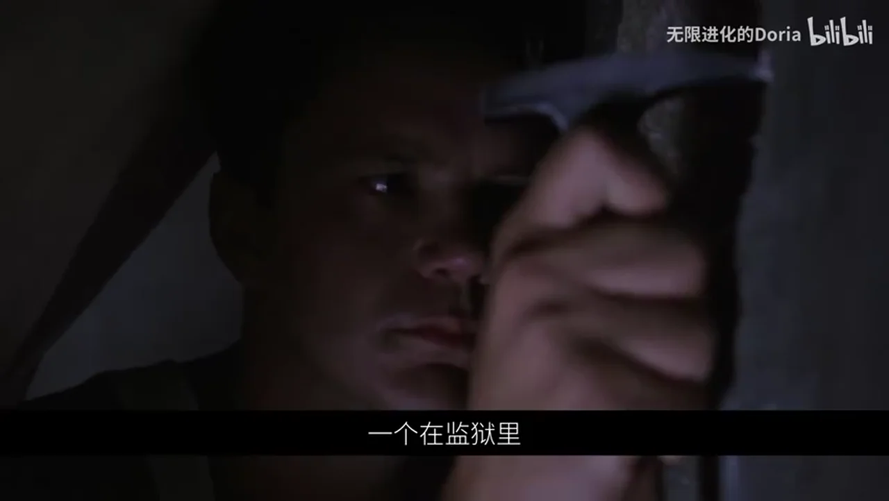

### 关键帧 2

### 关键帧 3

### 关键帧 4

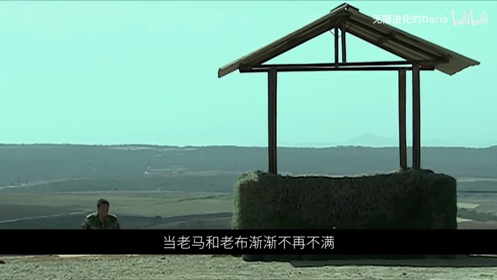

### 关键帧 5

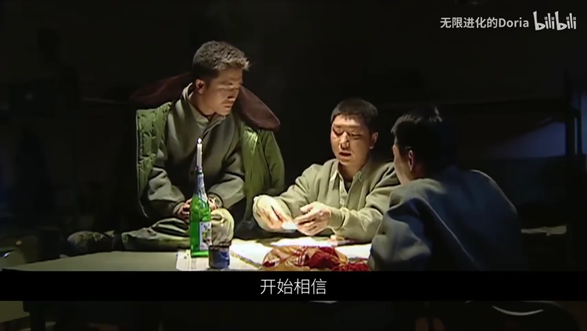

### 关键帧 6

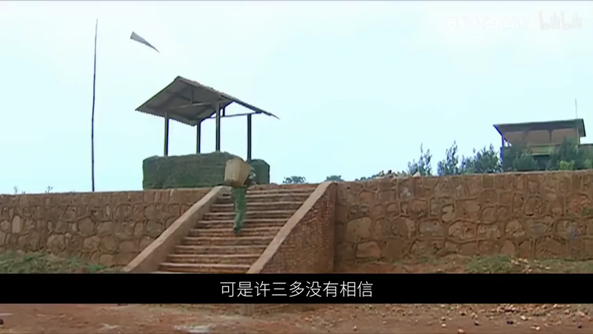

### 关键帧 7

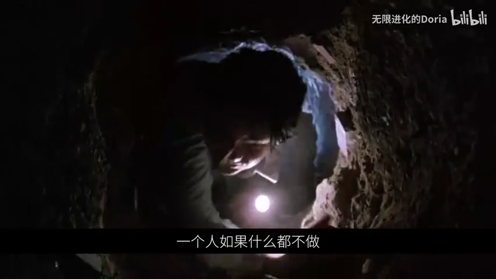

### 关键帧 8

### 关键帧 9

### 关键帧 10

