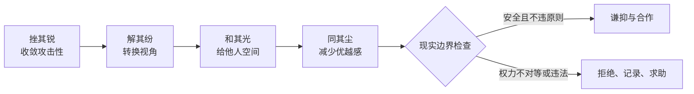

# 总结稿

[打开单页 HTML 总结](assets/bilibili-BV19W8J6pEec-summary.html)

## 中心论点

视频把“挫其锐，解其纷，和其光，同其尘”现代化解释为四种人际行动：收敛攻击性的锋芒、化解单一视角、给他人发挥空间、放下品味优越感。[00:21–04:29] 这是一套通俗处世阐释，不等于《道德经》的唯一原义，也不能从影视 B-roll 推出心理或社会规律。

## 四步框架

1. **挫其锐**：有能力但不以聪明刺人，知道何时不说破、给他人留体面。[00:24–01:22]
2. **解其纷**：不把自身经验和偏好强加给别人，尝试理解对方所处位置。[01:23–02:23]
3. **和其光**：不与他人争夺光芒，看到价值并给对方发挥位置；视频以蔺相如、廉颇故事作例。[02:24–03:13]
4. **同其尘**：减少品味鄙视链，尊重一个人投入热爱时的认真，最终把四步总结为“放下我执”。[03:29–04:29]

## 原典、史事与现代阐释的边界

- “挫其锐，解其纷，和其光，同其尘”确见通行本《道德经》第五十六章（亦见第四章）；“大方无隅”见第四十一章，“为学日益，为道日损”见第四十八章。参见 [《老子》汇校版](https://zh.wikisource.org/wiki/%E8%80%81%E5%AD%90_(%E5%8C%AF%E6%A0%A1%E7%89%88))。[00:21、00:25、03:38]
- “己所不欲，勿施于人”见《论语·颜渊》；视频的“己所欲，亦勿施于人”是为了说明不要强加偏好的现代推演，不是经典原句。[《论语·颜渊》](https://zh.wikisource.org/wiki/%E8%AB%96%E8%AA%9E/%E9%A1%8F%E6%B7%B5%E7%AC%AC%E5%8D%81%E4%BA%8C) [02:12]
- 《史记》确载蔺相如因国家之急避让廉颇、廉颇肉袒负荆谢罪；“让廉颇的光留在战场”是视频的价值阐释。[《史记·卷081》](https://zh.wikisource.org/wiki/%E5%8F%B2%E8%A8%98/%E5%8D%B7081) [02:44–03:07]
- 所有推荐帧都是影视片段/B-roll 与大字文案，没有原典页、研究数据或可核验人物画面，只能做段落导航。

## 实践建议：把格言改写成边界明确的行为

- 不隐藏能力与成果；隐藏的是羞辱他人的冲动。
- 不以“和光同尘”为由违背法律、原则或安全边界。
- 面对权力不对等，优先评估退出渠道、记录、支持网络和明确拒绝。
- 把“理解他人”与“同意他人”分开；把“给空间”与“放弃责任”分开。

## 观众讨论与补充

20 条热门候选（平台报告 271）与 39/73 条 current-accessible 弹幕呈现明显争议：有人认可和解与谦抑，也有人强调“藏傲气不藏本事”、担心权力不对等下被利用，或批评把经典鸡汤化。00:00–00:30 的 8 条和 04:00–04:30 的 6 条只是本次不完整采集中的候选集中段，不能说明赞同还是反对。最高互动问题有 151 条嵌套回复但正文不可见。观众阐释不是原典或效果证据。

# 辅助理解

## 辅助理解

视频用夜景 B-roll 和“大方无隅”式文案开启“挫其锐”。画面只标记叙事段落，不是原典或行为效果证据。

这帧的大字“己所欲，亦勿施于人”是作者的现代延伸，不是《论语》原句。它可帮助理解“不强加偏好”，但应与核验过的原文分开。

庄园/汽车 B-roll 用来表现“留出位置、让别人发挥价值”。它不证明特定管理策略有效。[02:40 附近]

办公室影视片段承担四步收束：“不断放下我执”。这是视频作者总结，不是影视对白或可测量心理机制。[04:09]

### 证据层级

| 层级 | 本文中的内容 | 结论力度 |
|---|---|---|
| 事实核查 | 经典确有相关句子；蔺相如史事核心可确认 | 可就文本/史事确认 |
| 视频观点 | 四句对应四种现代人际行为 | 通俗阐释，不是唯一原义 |
| 观众观点 | 藏锋、权力风险、鸡汤化质疑 | 评审线索，不是事实证明 |
| AI 辅助推断 | 给四步加入“现实边界检查” | 综合建议，非视频原话 |

### AI 辅助推断：两轴判断

应用格言前同时问：**我是否仍在诚实展示能力？我是否保留原则与退出权？** 若“谦抑”要求隐藏关键事实、承受违法伤害或放弃拒绝权，它已经偏离合作策略。

## 外部事实核验

### 声明 1（00:21）

- 视频陈述：《道德经》用“挫其锐，解其纷，和其光，同其尘”描述“和光同尘”。
- 核验状态：已确认
- 核验结果：确认。通行本《道德经》第五十六章含“挫其锐，解其纷，和其光，同其尘”（该句亦见第四章）。视频后面对四句的人际关系解释属于讲述者的现代阐释，而非原文逐句注解。
- 检索日期：2026-08-28
- 来源：
  - [维基文库 — 老子（汇校版）](https://zh.wikisource.org/wiki/%E8%80%81%E5%AD%90_(%E5%8C%AF%E6%A0%A1%E7%89%88))（primary）

### 声明 2（00:25）

- 视频陈述：《道德经》中有“大方无隅”。
- 核验状态：已确认
- 核验结果：确认。通行本《道德经》第四十一章列有“大方无隅，大器晚成，大音希声，大象无形”。
- 检索日期：2026-08-28
- 来源：
  - [维基文库 — 老子（汇校版）](https://zh.wikisource.org/wiki/%E8%80%81%E5%AD%90_(%E5%8C%AF%E6%A0%A1%E7%89%88))（primary）

### 声明 3（02:12）

- 视频陈述：儒家经典有“己所不欲，勿施于人”；视频进一步提出“己所欲，亦勿施于人”。
- 核验状态：部分确认
- 核验结果：前半句确认见《论语·颜渊》。后半句不是该章原文，而是视频为说明“不要把自己的偏好强加给别人”所作的现代推演，应与经典引文区分。
- 检索日期：2026-08-28
- 来源：
  - [维基文库 — 論語·顏淵第十二](https://zh.wikisource.org/wiki/%E8%AB%96%E8%AA%9E/%E9%A1%8F%E6%B7%B5%E7%AC%AC%E5%8D%81%E4%BA%8C)（primary）

### 声明 4（02:44）

- 视频陈述：蔺相如为避免与廉颇内斗而退让，廉颇后来负荆请罪。
- 核验状态：已确认
- 核验结果：核心史事确认。《史记·廉颇蔺相如列传》记载蔺相如避让廉颇，并以秦国因两人在而不敢加兵、应“先国家之急而后私仇”解释；廉颇闻之“肉袒负荆”至门谢罪。视频关于“让廉颇的光留在战场”的说法是现代价值阐释。
- 检索日期：2026-08-28
- 来源：
  - [维基文库 — 史記·卷081](https://zh.wikisource.org/wiki/%E5%8F%B2%E8%A8%98/%E5%8D%B7081)（primary）

### 声明 5（03:38）

- 视频陈述：《道德经》中有“为学日益，为道日损”。
- 核验状态：已确认
- 核验结果：确认。通行本《道德经》第四十八章以“为学日益，为道日损”开篇。视频把它解释为减少偏见、执念和优越感，是讲述者的应用性阐释。
- 检索日期：2026-08-28
- 来源：
  - [维基文库 — 老子（汇校版）](https://zh.wikisource.org/wiki/%E8%80%81%E5%AD%90_(%E5%8C%AF%E6%A0%A1%E7%89%88))（primary）

# Data

## 增强转写稿

[00:00] 一个人见过世面的最高境界是什么
[00:02] 道德经用四个字概括
[00:03] 那就是和光同尘
[00:05] 你身边有没有这样一种人
[00:06] 他看上去没有任何攻击性
[00:08] 但你就是觉得他很厉害
[00:09] 跟他相处又特别舒服
[00:11] 这才是真正见过世面的认知高手
[00:13] 和光同尘不是让我们同流合污
[00:15] 稀里糊涂的混日子
[00:17] 而是一种顶级的智慧和修行
[00:19] 想达到这个境界
[00:20] 要经历四个过程
[00:21] 挫其锐，解其纷，和其光，同其尘
[00:24] 先说挫其锐
[00:25] 《道德经》里讲“大方无隅”
[00:27] 真正宏大的东西反而看不到棱角
[00:30] 真正聪明的人越低调活得越好
[00:32] 这世上的聪明人不少
[00:33] 能看穿事物的本质是优势
[00:35] 可这个优势用错了地方
[00:37] 就是催命符
[00:38] 你比别人看得透
[00:39] 还非要当众说出来
[00:41] 对方感受到的不是佩服
[00:42] 而是羞耻
[00:43] 人一旦感到羞耻
[00:44] 第一反应
[00:45] 不是反省
[00:46] 是排斥
[00:46] 甚至报复
[00:47] 哪怕他知道你说得对
[00:49] 也不会感谢你
[00:50] 没人喜欢被人看穿
[00:51] 这是人性
[00:52] 没有例外
[00:53] 杨修就是最典型的例子
[00:54] 他总能猜中曹操的心思又偏偏忍不住说出来
[00:57] 他以为自己在展示才华
[00:59] 曹操感受到的却是威胁
[01:00] 在权力身边
[01:01] 聪明到让上位者失去安全感
[01:03] 本身就是危险
[01:04] 《西游记》里的悟空也是一样
[01:06] 他悟性极高
[01:07] 但过于高调张扬
[01:08] 这种锐气天地都容不下
[01:09] 菩提祖师把他赶下山
[01:11] 看起来是惩罚
[01:12] 其实也是保护
[01:13] 悟空只有本事
[01:14] 还没有驾驭本事的心性
[01:16] 不先磨掉那股张扬的锐气
[01:17] 现在学的越多
[01:18] 以后惹的祸就越大
[01:24] 当然不会把你当成威胁
[01:26] 你不急着彰显自己
[01:27] 别人反而会觉得你深藏不露
[01:29] 有底蕴
[01:30] 可光会藏还不够
[01:31] 藏久了
[01:32] 亲和力
[01:33] 也会被人误解成没有实力
[01:34] 这时候就需要解其纷
[01:36] 儒家讲“仁者爱人”
[01:37] 这个爱不是陪着别人难过
[01:39] 而是看懂他为什么难过
[01:40] 又被什么东西困住
[01:42] 人和人之间的很多矛盾
[01:43] 表面上真的是事情
[01:44] 里面真正的症结
[01:46] 却是面子 利益和委屈
[01:47] 真正会解其纷的人
[01:49] 能找到别人看不见的那个结
[01:51] 帮双方把事情理顺
[01:52] 而不是站在旁边和稀泥
[01:54] 但这里有个很重要的分寸
[01:56] 叫看破不说破
[01:57] 心里清楚就够了
[01:58] 没必要当众揭穿
[01:59] 看见别人走错路
[02:00] 悄悄把路灯调亮
[02:02] 比当众拉着他说
[02:03] 你走错了 有效得多
[02:04] 话到嘴边留三分
[02:06] 不是胆小是给别人留体面
[02:07] 也给自己留条路
[02:08] 解其纷更深的一层
[02:10] 是放下对好坏对错的执著
[02:12] 己所不欲，勿施于人
[02:13] 大家都懂
[02:14] 可自己喜欢的东西
[02:15] 同样也不能强加给别人
[02:17] 也就是 己所欲，亦勿施于人
[02:19] 人人的处境和利益不同
[02:22] 你认定的答案
[02:23] 不能直接套在别人身上
[02:24] 真正能解其纷的人
[02:26] 不急着争对错
[02:27] 他会看清各自的处境
[02:28] 找到一个双方都能走下去的方向
[02:30] 但还有一步
[02:31] 很多人一辈子都跨不过去
[02:33] 那就是和其光
[02:34] 和其光说白了就是让别人发光
[02:36] 哪怕他们的光芒盖过自己的
[02:38] 每个人都希望自己的长处被看见
[02:40] 真正的高手懂得给别人留出位置
[02:42] 让他们把价值发挥出来
[02:44] 蔺相如就把这件事做到了极致
[02:46] 廉颇处处找他的麻烦
[02:47] 没有硬碰硬 这是挫其锐
[02:49] 后来他借门客之口把话传出去
[02:51] 两个人如果内斗
[02:52] 最高兴的只会是秦国
[02:54] 这句话帮廉颇看清了
[02:55] 国家利益的大局
[02:56] 也解开了他心里的结
[02:58] 这是解其纷
[02:59] 最后蔺相如让廉颇明白
[03:00] 他真正的光应该留在战场上
[03:02] 没必要浪费在争一时高低上
[03:04] 廉颇幡然醒悟 负荆请罪
[03:06] 蔺相如用自己的退让
[03:07] 点亮了廉颇真正该发光的地方
[03:10] 也保住了赵国的安稳
[03:11] 这才是和其光
[03:12] 他不是让你随口夸人
[03:13] 只会显得虚伪 真正有用的是看见一个人的价值
[03:18] 再给他一个发挥价值的空间
[03:19] 人只有在真正被需要的时候
[03:20] 才能获得最深的满足感
[03:22] 走到最后一步
[03:23] 也是最难被理解的一步
[03:25] 就是同其尘
[03:26] 尘就是俗物
[03:27] 就是那些普通琐碎
[03:29] 在你看来上不了台面的东西
[03:31] 这个世界从来不缺鄙视链
[03:32] 听古典的看不起听流行的
[03:34] 读纯文学的看不起刷网文小说的
[03:36] 好像爱好一换 人也跟着高了一等
[03:38] 《道德经》里讲“为学日益，为道日损”
[03:41] 学知识是在做加法
[03:42] 悟道却是在做减法
[03:44] 把那些多余的偏见
[03:45] 执念和优越感一点点拿掉
[03:47] 真正见过世面的人内心是开放的
[03:49] 阳春白雪和普通人的烟火气
[03:51] 都能进入他的世界
[03:53] 品味不是他用来给别人划分等级的工具
[03:55] 所谓高雅和通俗本来就是相对的
[03:57] 今天被嫌弃土掉渣的东西
[03:59] 过几年又会成为复古潮流
[04:01] 同其尘尊重的不是某种爱好本身
[04:04] 而是一个人沉浸在热爱里时的那股认真劲
[04:07] 那股劲没有高低贵贱
[04:08] 回头再看这四步
[04:09] 其实就是一个不断放下我执的过程 挫其锐
[04:12] 是放下好胜心去融入他人
[04:14] 解其纷是放下自我的视角去理解他人
[04:17] 和其光是放下嫉妒的我去成就他人同其尘
[04:20] 是放下傲慢的我去拥抱众生
[04:23] 等这些东西都放下了
[04:24] 剩下的那个人没有攻击性
[04:26] 但你就是觉得他厉害了
[04:27] 跟他在一起也会觉得舒服
[04:29] 这就是和光同尘
[04:30] 你的光还在只是变得柔和了
[04:32] 身边的人也能被照亮
[04:34] 这才是一个人见过世面以后
[04:36] 最通透也最温柔的状态

## 原始转写稿

[00:00] 一个人见过世面的最高境界是什么
[00:02] 道德经用四个字概括
[00:03] 那就是和光同尘
[00:05] 你身边有没有这样一种人
[00:06] 他看上去没有任何攻击性
[00:08] 但你就是觉得他很厉害
[00:09] 跟他相处又特别舒服
[00:11] 这才是真正见过世面的认知高手
[00:13] 和光同尘不是让我们同流合物
[00:15] 稀里糊涂的昏日子
[00:17] 而是一种顶级的智慧和休息
[00:19] 想达到这个境界
[00:20] 要经历四个过程
[00:21] 错其瑞 解其分 何其光 同其尘
[00:24] 先说错其瑞
[00:25] 道德经理讲大方无语
[00:27] 真正宏大的东西反而看不到棱角
[00:30] 真正聪明的人越低调活得越好
[00:32] 这世上的聪明人不少
[00:33] 能看穿事物的本质是优势
[00:35] 可这个优势用错了地方
[00:37] 就是催眠福
[00:38] 你比别人看得透
[00:39] 还非要当众说出来
[00:41] 对方感受到的不是佩服
[00:42] 而是羞耻
[00:43] 人一旦感到羞耻
[00:44] 第一反应
[00:45] 不是反显
[00:46] 是排斥
[00:46] 甚至报复
[00:47] 哪怕他知道你说得对
[00:49] 也不会感谢你
[00:50] 为人喜欢被人看穿
[00:51] 这是人性
[00:52] 没有例外
[00:53] 扬修就是最典型的例子
[00:54] 他总能猜中曹操的心思又偏偏忍不住说出来
[00:57] 他以为自己在展示才华
[00:59] 曹操感受到的却是威胁
[01:00] 在权力身边
[01:01] 聪明道让上位者失去安全感
[01:03] 本身就是危险
[01:04] 西邮纪里的悟空也是一样
[01:06] 他物性极高
[01:07] 但过于高调张扬
[01:08] 这种瑞其天地都容不下
[01:09] 菩提祖师把他赶下山
[01:11] 看起来是惩罚
[01:12] 其实也是保护
[01:13] 悟空只有本事
[01:14] 还没有驾驭本事的心性
[01:16] 不先磨掉那股张扬的瑞其
[01:17] 现在学的越多
[01:18] 以后惹的祸就越大
[01:24] 当然不会把你当成威胁
[01:26] 你不急着张险自己
[01:27] 别人反而会觉得你深藏不露
[01:29] 有抵运
[01:30] 可光会藏还不够
[01:31] 藏久了
[01:32] 亲和力
[01:33] 也会被人误解成没有实力
[01:34] 这时候就需要解其分
[01:36] 如加讲人者爱人
[01:37] 这个爱不是陪着别人难过
[01:39] 而是看懂他为什么难过
[01:40] 又被什么东西困住
[01:42] 人和人之间的很多矛盾
[01:43] 表面上真的是事情
[01:44] 里面真正的争结
[01:46] 却是面子 利益和委屈
[01:47] 真正会解其分的人
[01:49] 能找到别人看不见的那个结
[01:51] 帮双方把事情理顺
[01:52] 而不是站在旁边或心里
[01:54] 但这里有个很重要的分寸
[01:56] 叫看破不说破
[01:57] 心里清楚就够了
[01:58] 没必要当众揭穿
[01:59] 看见别人走错路
[02:00] 悄悄把路灯调亮
[02:02] 比当众拉着他说
[02:03] 你走错了 有效得多
[02:04] 画到嘴边留三分
[02:06] 不是胆小是给别人留体面
[02:07] 也给自己留条路
[02:08] 解其分更深的一层
[02:10] 是放下对好坏对错的执主
[02:12] 极所不欲 勿施欲人
[02:13] 大家都懂
[02:14] 可自己喜欢的东西
[02:15] 同样也不能强加给别人
[02:17] 也就是 极所欲 意无施欲人
[02:19] 人人的处境和利益不同
[02:22] 你认定的答案
[02:23] 不能直接套在别人身上
[02:24] 真正能解其分的人
[02:26] 不急着争对错
[02:27] 他会看清各自的处境
[02:28] 找到一个双方都能走下去的方向
[02:30] 但还有一步
[02:31] 很多人一辈子都跨不过去
[02:33] 那就是和其光
[02:34] 和其光说白了就是让别人发光
[02:36] 哪怕他们的光芒盖过自己的
[02:38] 每个人都希望自己的常处被看见
[02:40] 真正的高手懂得给别人留出位置
[02:42] 让他们把价值发挥出来
[02:44] 令相如就把这件事做到了极致
[02:46] 连坡处处找他的麻烦
[02:47] 没有硬碰硬 这是错其轮
[02:49] 后来他借门客之口把话传出去
[02:51] 两个人如果内斗
[02:52] 最高兴的只会是起锅
[02:54] 这句话帮连坡看清了
[02:55] 国家利益的大局
[02:56] 也解开了他心里的解
[02:58] 这是解其分
[02:59] 最后令相如让连坡明白
[03:00] 他真正的光应该留在战场上
[03:02] 没必要浪费在争议时高低上
[03:04] 连坡翻染醒悟 负荆请罪
[03:06] 令相如用自己的退了
[03:07] 点亮了连坡真正该发光的地方
[03:10] 也保住了照顾的安稳
[03:11] 这才是和其光
[03:12] 他不是让你随口夸人
[03:13] 只会显得虚伪 真正有用的是看见一个人的价值
[03:18] 再给他一个发挥价值的空间
[03:19] 人只有在真正被需要的时候
[03:20] 才能获得最深的满足感
[03:22] 走到最后一步
[03:23] 也是最难被理解的一步
[03:25] 就是通气沉
[03:26] 沉就是俗物
[03:27] 就是那些普通索粹
[03:29] 在你看来上不了台面的东西
[03:31] 这个世界从来不缺鄙视链
[03:32] 听古典的看不起听流行的
[03:34] 读纯文学的看不起刷网文小说的
[03:36] 好像爱好一换 人也跟着高了一等
[03:38] 道德经理讲 维学日益 围道日损
[03:41] 学知识是在做加法
[03:42] 步道却是在做减法
[03:44] 把那些多余的偏见
[03:45] 执念和优越感一点点拿掉
[03:47] 真正见过世面的人内心是开放的
[03:49] 洋春白雪和普通人的烟火气
[03:51] 都能进入他的世界
[03:53] 品味不是他用来给别人划分等级的工具
[03:55] 所谓高雅和通俗本来就是相对的
[03:57] 今天被贤气吐掉渣的东西
[03:59] 过几年又会成为复古潮流
[04:01] 通气沉尊重的不是某种爱好本身
[04:04] 而是一个人沉浸在热爱理时的那股认真劲
[04:07] 那股劲没有高低贵贱
[04:08] 回头再看这四步
[04:09] 其实就是一个不断放下我职的过程 错其瑞
[04:12] 是放下好胜心去融入他人
[04:14] 解其分是放下自我的视角去理解他人
[04:17] 和其光是放下嫉妒的我去成就他人通气沉
[04:20] 是放下傲慢的我去拥抱众生
[04:23] 等这些东西都放下了
[04:24] 剩下的那个人没有攻击性
[04:26] 但你就是觉得他厉害了
[04:27] 跟他在一起也会觉得舒服
[04:29] 这就是和光同沉
[04:30] 你的光还在只是变得柔和了
[04:32] 身边的人也能被照亮
[04:34] 这才是一个人见过世面以后
[04:36] 最通透也最温柔的状态

## 原始关键帧

### 关键帧 1

### 关键帧 2

### 关键帧 3

### 关键帧 4

### 关键帧 5

### 关键帧 6

### 关键帧 7

### 关键帧 8

### 关键帧 9

### 关键帧 10

## 补充原始数据

- [bilibili-BV19W8J6pEec-comments.jsonl](assets/bilibili-BV19W8J6pEec-comments.jsonl)
- [bilibili-BV19W8J6pEec-comment-candidates.json](assets/bilibili-BV19W8J6pEec-comment-candidates.json)
- [bilibili-BV19W8J6pEec-danmaku.jsonl](assets/bilibili-BV19W8J6pEec-danmaku.jsonl)
- [bilibili-BV19W8J6pEec-danmaku-analysis.json](assets/bilibili-BV19W8J6pEec-danmaku-analysis.json)
- [bilibili-BV19W8J6pEec-summary.html](assets/bilibili-BV19W8J6pEec-summary.html)
