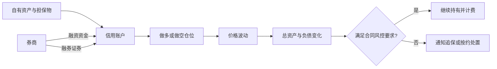
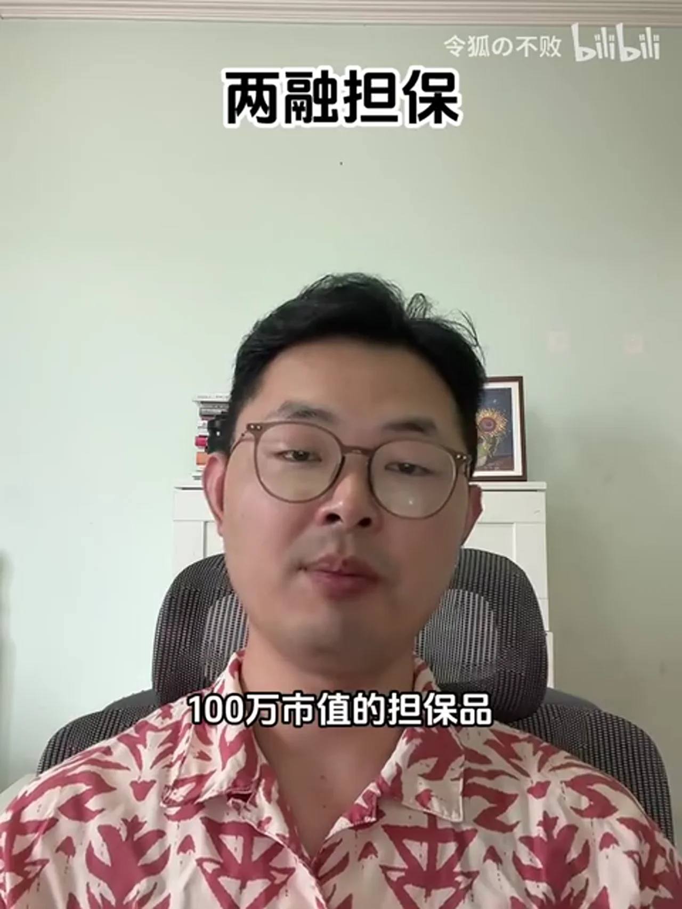
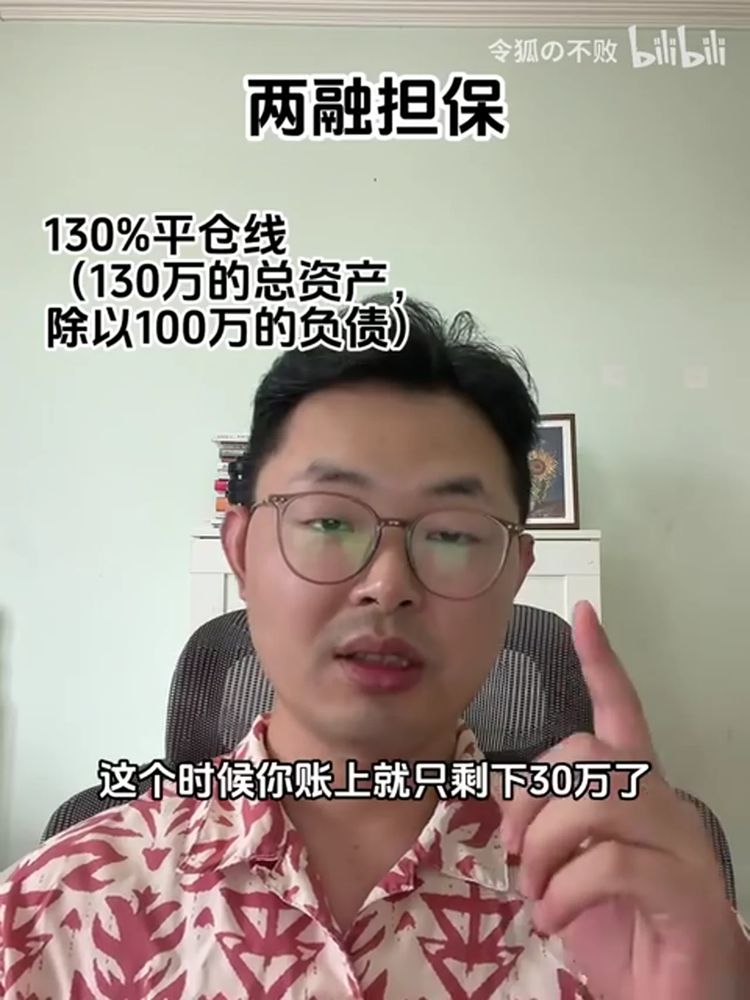
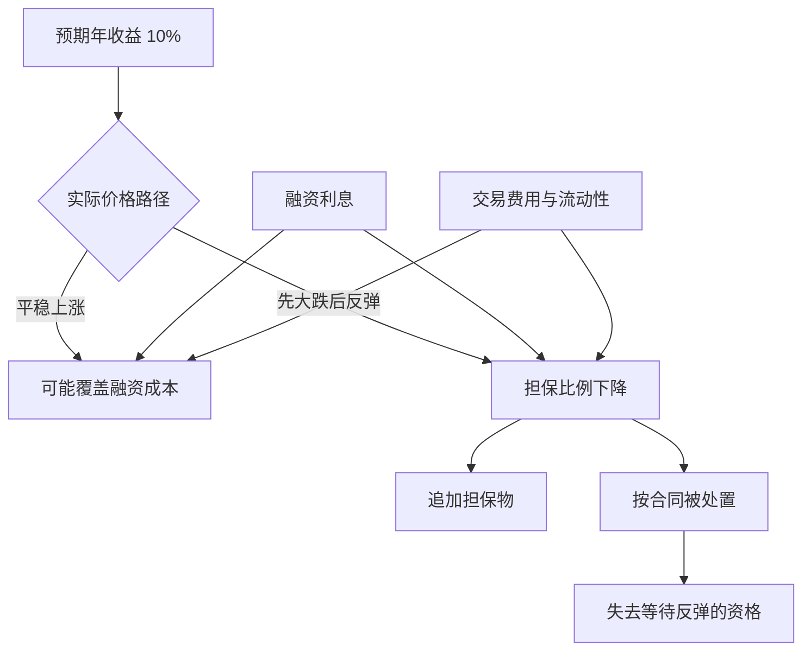
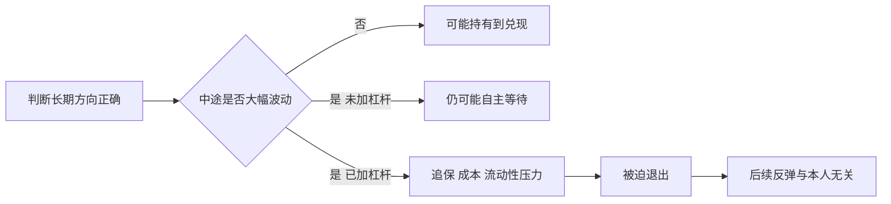
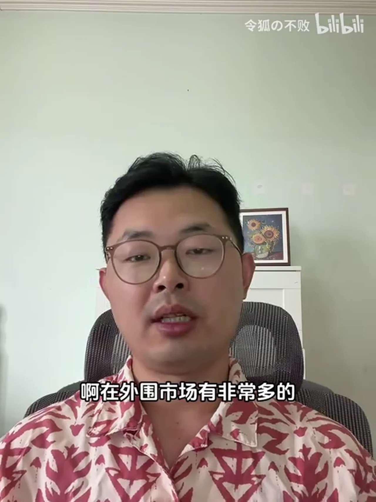

# 总结稿

> [!warning] 教育用途与风险提示
> 本笔记仅用于理解融资融券和杠杆风险，不构成投资建议、开户建议或收益承诺。两融利率、可充抵保证金证券、折算率、追保线、处置期限及强平条件会随券商、客户和合同变化；实际操作前必须阅读开户券商的最新公示、风险揭示书与合同。

## 核心结论

视频从 A 股融资融券讲解杠杆：融资是向券商借款买入，融券是借入证券卖出后再买回归还。两者都需要担保物，会产生利息或费用，并受标的范围、合约期限、维持担保比例与券商风控约束。视频的主要态度是普通投资者应极度谨慎，因为杠杆放大的不仅是收益，也包括波动、成本和被迫退出的风险。

杠杆最危险的地方并非简单地“亏得更快”，而是会剥夺等待的权利：未加杠杆的持仓可能有时间等待基本面兑现，融资账户却可能因担保比例下降、无法追加担保物或标的缺乏流动性而被处置。即便后续价格反弹，已经强平的投资者也无法参与恢复；若处置后仍不足清偿，还可能继续负债。

视频还反驳“融资成本 4%，预期收益 10%，所以稳定套利 6%”这一思路：预期收益不是确定现金流，利息却会随实际使用天数累积；路径中的波动和追保约束可能在年化收益兑现前就终止仓位。因此，判断杠杆不能只比较期望收益率与利率，还要考虑回撤路径、流动性、期限、合同条款与极端损失。

## 关键机制

- **开户门槛**：当前规则要求从事证券交易满半年，且最近 20 个交易日日均证券类资产不低于 50 万元；还需通过风险承受能力、征信和券商适当性审查，并非满足两个数字即可当然开通。[证监会《证券公司融资融券业务管理办法》](https://www.csrc.gov.cn/csrc/c106256/c1654005/content.shtml)
- **初始融资保证金**：自 2026 年 1 月 19 日起，沪市新开融资买入的融资保证金比例不得低于 100%；通知实施前尚未了结的融资合约及其展期仍按原规定执行。若用证券充抵保证金，还要按折算率计入，券商也可采用更严格的差异化控制；因此视频中“100 万元市值通常融六七十万元”只是可能示例，不是统一额度。[上交所 2026 年调整通知](https://www.sse.com.cn/lawandrules/sselawsrules2025/trade/specific/margin/c/c_20260114_10805174.shtml) · [上交所实施细则](https://www.sse.com.cn/lawandrules/sselawsrules2025/trade/specific/margin/c/c_20250616_10782015.shtml)
- **期限**：单笔融资、融券期限最长不超过 6 个月；可申请展期，但每次不超过 6 个月，是否获批取决于券商评估与合同约定。[上交所融资融券交易实施细则](https://www.sse.com.cn/lawandrules/sselawsrules2025/trade/specific/margin/c/c_20250616_10782015.shtml)
- **计息**：融资通常按实际使用资金天数逐日计息，负债跨节假日存在时仍会产生利息；分母、结息和利率调整方式以合同为准。[华泰证券合同修订对照表](https://crm.htsc.com.cn/doc/2023/304102/3dc3cf33-9a40-46a2-9813-aed846487263.pdf)
- **维持担保与处置**：视频中的“150% 警戒、130% 平仓”不能视为全国统一现行阈值。2019 年已取消统一最低维持担保比例 130% 的限制，改由券商结合客户资信、担保物质量和自身风险承受能力在合同中约定最低比例、追保期限与处置方式。[证监会机制优化说明](https://www.csrc.gov.cn/csrc/c100028/c1000931/content.shtml)
- **利率**：视频所称普遍 3%—5% 未获权威全市场统计支持。规则允许券商与客户自主商定，公开基准与实际优惠可能差异很大；核验时亦有券商公示 8.35% 的融资利率。[证监会管理办法](https://www.csrc.gov.cn/csrc/c106256/c1654005/content.shtml) · [国投证券业务公示](https://www.essence.com.cn/business/security/rzrq)

## 需要保留的边界

视频中的个股年波动幅度、融券占比、历史人物损失和“普通人碰都不要碰”等内容，分别属于未核验估计、时效数据、历史叙述或讲者立场，不应替代当前规则和个人风险评估。核心可迁移认识是：杠杆把价格路径、融资成本和合同处置权引入投资结果，风险并不能用“低利率”单独概括。

# 辅助理解

> [!danger] 非投资建议
> 以下内容只解释机制与风险，不建议任何人使用融资融券。实际阈值、利率、担保物折算率、通知期限和强平条件以你与券商签署的最新合同为准。

## 1. 两融不是简单的“收益乘倍数”

**视频内容：** 融资是借钱做多，融券是借证券卖出做空。两者都不是免费增加仓位，而是把券商、担保物、费用、期限和处置规则引入交易。

该帧标出“融资和融券”，适合作为两类业务的入口。融券做空还具有收益上限与潜在损失不对称、券源和召回等额外问题，不能把它简单理解为融资的镜像。

## 2. 维持担保比例：公式简单，合同后果不简单

**视频内容：** 讲者用“总资产 ÷ 总负债”解释维持担保比例，并以 150%/130% 展示警戒、追保和强平风险。

担保物是获得信用的基础，但股票等担保物本身也会下跌，且通常按折算率计入。也就是说，风险发生时可能同时出现：持仓价格下跌、担保物缩水、可用保证金减少和融资费用继续累积。

**2026 年现行规则补充：** 自 2026 年 1 月 19 日起，上交所要求新开融资买入的融资保证金比例不得低于 100%；实施前存量融资合约及其展期仍按原规定。这个“100%”不等于“100 万元证券市值必然可融 100 万元”：证券担保物需先按折算率计入，还受券商风控、集中度和合同约束。因而视频的“六七十万元”只能当作情境示例，实际可融额度必须查具体券商和标的。[上交所 2026 年通知](https://www.sse.com.cn/lawandrules/sselawsrules2025/trade/specific/margin/c/c_20260114_10805174.shtml) · [上交所实施细则](https://www.sse.com.cn/lawandrules/sselawsrules2025/trade/specific/margin/c/c_20250616_10782015.shtml)

**外部核验纠正（重要）：** 图中 130% 例子有助于理解比例，却**不是全国统一的现行平仓阈值**。证监会与沪深交易所自 2019 年起取消统一最低维持担保比例 130% 的限制，改由证券公司根据客户资信、担保物质量和自身风险承受能力约定最低比例、追保期限与处置方式。[证监会说明](https://www.csrc.gov.cn/csrc/c100028/c1000931/content.shtml) 因此：

- 150%/130% 仍可能出现在某些券商参数中，但属于具体券商规则；
- 跌破某一比例不必然在同一时点立即成交强平，通知、补仓期限和处置方式依合同而定；
- 标的跌停或流动性不足时，券商也可能无法按预期价格卖出，账户可能形成超过本金的损失。

## 3. 为什么“10% 收益减 4% 利息”不是无风险套利

**视频内容：** 讲者强调利息是确定成本，而股票收益与实现路径不确定。即使最终价格方向判断正确，中途回撤也可能先触发风控。

**AI 辅助推断：** 评估杠杆至少要同时看五个变量，而不能只做利差减法：

1. 收益分布，而非单一年化预期；
2. 最大回撤及回撤发生时间；
3. 担保物与持仓是否同向下跌；
4. 追加资金能力和可操作时间；
5. 利率、期限、流动性及合同处置条款。

视频所述“融资利率普遍 3%—5%”缺少全市场权威统计。现行规则允许券商与客户自主商定，公开基准也可能显著更高；应查具体券商公示和本人合同，而不是把视频区间当作报价。[证监会管理办法](https://www.csrc.gov.cn/csrc/c106256/c1654005/content.shtml) · [国投证券业务公示](https://www.essence.com.cn/business/security/rzrq)

## 4. 期限和逐日计息会改变决策空间

**外部核验补充：** 交易所细则规定单笔融资、融券期限最长不超过 6 个月；到期前可以申请展期，每次不超过 6 个月，但券商要评估信用、负债与维持担保比例，因此展期不是自动权利。[上交所实施细则](https://www.sse.com.cn/lawandrules/sselawsrules2025/trade/specific/margin/c/c_20250616_10782015.shtml)

融资按实际使用天数逐日计息，只要负债在假期继续存在，休市通常不会让利息暂停；具体计息分母、结息方式和利率调整仍看合同。[华泰证券合同材料](https://crm.htsc.com.cn/doc/2023/304102/3dc3cf33-9a40-46a2-9813-aed846487263.pdf) 这解释了视频所谓“杠杆剥夺时间选择权”：等待本身有成本，而且等待期限受外部契约约束。

## 5. 把杠杆风险理解为路径风险

**视频内容：** 未加杠杆时，投资者可能承受浮亏并等待；加杠杆后，账户能否活到价格恢复取决于中途路径。高杠杆下，小幅不利波动即可造成巨大权益损失；20 倍杠杆对应 5% 的简单反向变动就可在忽略费用和处置机制时耗尽权益。

这不是说未加杠杆就不会永久亏损，而是说明杠杆新增了一种失败方式：**观点最终正确，但账户在正确到来之前已经失去生存能力。**

## 观众讨论与补充

热评中一类观点认可“不稳定盈利且经常大幅回撤者不宜加杠杆”；另一类反对把结论绝对化，指出杠杆也可能用于风险配平。这些都只是**观众立场**，不能证明某种策略安全。是否降低单一资产风险，还取决于相关性、再平衡、融资条件和尾部情景；“风险配平”不等于“风险消失”。

另有观众追问交易经验门槛是否为 24 个月。当前核验的证监会规则是**从事证券交易不足半年不得开户**，并要求最近 20 个交易日日均证券类资产不低于 50 万元，还需完成券商适当性审查。[证监会管理办法](https://www.csrc.gov.cn/csrc/c106256/c1654005/content.shtml) 评论中的“24 个月”未获本次权威证据支持，不能作为更正。

样本限制：评论实际抓取 14 条，弹幕抓取 5 条，均不是随机样本或历史全集；个别交易经历、点赞和弹幕热点不构成收益或安全性证据。

## 外部事实核验

### 声明 1（00:38）

- 视频陈述：The speaker says margin-financing rates can commonly be around 3% to 4% at recording time.
- 核验状态：未验证
- 核验结果：未验证，且不应把该区间当作统一市场利率。证监会现行规则规定融资利率由证券公司与客户自主商定；证券公司公开基准也可能明显高于视频所称区间，例如国投证券页面在核验时公示的融资利率为8.35%。优惠利率可能因券商、客户、资金规模和合同而异，未找到权威全市场统计证明3%—4%属于普遍水平。
- 检索日期：2026-08-14
- 来源：
  - [中国证监会：证券公司融资融券业务管理办法](https://www.csrc.gov.cn/csrc/c106256/c1654005/content.shtml)（primary）
  - [国投证券：融资融券业务信息公示](https://www.essence.com.cn/business/security/rzrq)（primary）

### 声明 2（01:40）

- 视频陈述：The video states that opening margin-financing and securities-lending eligibility requires 500,000 yuan and six months of trading experience.
- 核验状态：已确认
- 核验结果：基本确认，但“50万元”有精确定义：证券公司不得为从事证券交易不足半年，或最近20个交易日日均证券类资产低于50万元的客户开立信用账户；此外还要通过风险承受能力、征信与券商适当性审查，因此并非满足两个数字即可当然开通。
- 检索日期：2026-08-14
- 来源：
  - [中国证监会：证券公司融资融券业务管理办法](https://www.csrc.gov.cn/csrc/c106256/c1654005/content.shtml)（primary）

### 声明 3（02:29）

- 视频陈述：The video says financing 1 million yuan requires at least 1 million yuan of market-value collateral, and that in practice 1 million yuan of collateral may commonly support only about 600,000 to 700,000 yuan of financing.
- 核验状态：部分确认
- 核验结果：Partially confirmed as an illustration, not a universal quota. Effective 2026-01-19, the Shanghai Stock Exchange requires the financing margin ratio for new financing purchases to be no lower than 100%; financing contracts opened before implementation, including their extensions, continue under the former rule. When securities rather than cash are used as collateral, their market value is converted using applicable collateral conversion rates, and brokers may impose stricter, differentiated controls. Thus 1 million yuan of securities by market value may support materially less than 1 million yuan of financing, and 600,000?700,000 yuan can be a plausible example, but the exact amount depends on the security, conversion rate, broker rules, concentration controls, and contract; it is not a market-wide fixed range.
- 检索日期：2026-08-14
- 来源：
  - [???????????????????????????2026?5??](https://www.sse.com.cn/lawandrules/sselawsrules2025/trade/specific/margin/c/c_20260114_10805174.shtml)（primary）
  - [??????????????????2023????](https://www.sse.com.cn/lawandrules/sselawsrules2025/trade/specific/margin/c/c_20250616_10782015.shtml)（primary）

### 声明 4（02:43）

- 视频陈述：The video states a 150% warning level and discusses 130% as the level at which a broker may require additional collateral or liquidate positions.
- 核验状态：已过时
- 核验结果：作为全国统一规则的表述已经过时。证监会和沪深交易所自2019年起取消统一的最低维持担保比例130%限制，改由证券公司结合客户资信、担保物质量和自身风险承受能力在合同中约定最低比例、追保期限及处置方式。150%警戒线、130%平仓线仍可见于部分券商当前风控参数，但属于具体券商合同规则，且低于平仓线通常先触发通知和约定期限内补仓；是否及何时强平应以客户合同和券商最新公示为准。
- 检索日期：2026-08-14
- 来源：
  - [中国证监会：融资融券交易机制优化实现落地](https://www.csrc.gov.cn/csrc/c100028/c1000931/content.shtml)（primary）
  - [中国证监会：证券公司融资融券业务管理办法](https://www.csrc.gov.cn/csrc/c106256/c1654005/content.shtml)（primary）
  - [国投证券：融资融券业务信息公示](https://www.essence.com.cn/business/security/rzrq)（primary）

### 声明 5（03:30）

- 视频陈述：The video says a single margin contract has a maximum term of six months and may be extended on application.
- 核验状态：已确认
- 核验结果：确认。上交所现行有效的2023年修订细则规定，融资、融券期限最长不超过6个月；到期前会员可根据客户申请办理展期，每次展期不得超过6个月，并须事先评估客户信用、负债和维持担保比例。展期不是自动权利，仍取决于券商评估和合同约定。
- 检索日期：2026-08-14
- 来源：
  - [上海证券交易所融资融券交易实施细则（2023年修订）](https://www.sse.com.cn/lawandrules/sselawsrules2025/trade/specific/margin/c/c_20250616_10782015.shtml)（primary）

### 声明 6（04:43）

- 视频陈述：The speaker says financing rates had fallen from above 8% historically to roughly 4%–5%, with lower negotiated rates for larger accounts.
- 核验状态：部分确认
- 核验结果：历史上公开基准超过8%可由券商公告佐证，且规则确实允许券商与客户协商利率；但“现在一般4%—5%”及大额账户可谈到更低水平缺少权威全市场统计，不能概括为普遍行情。核验时不同券商公开基准仍可能为8.35%，实际执行应以具体券商、具体客户和合同为准。
- 检索日期：2026-08-14
- 来源：
  - [中国证监会：证券公司融资融券业务管理办法](https://www.csrc.gov.cn/csrc/c106256/c1654005/content.shtml)（primary）
  - [广发证券：融资利率与融券费率](https://www.gf.com.cn/business/finance/news/rate)（primary）
  - [国投证券：融资融券业务信息公示](https://www.essence.com.cn/business/security/rzrq)（primary）

### 声明 7（05:07）

- 视频陈述：The video says margin interest accrues daily, including non-trading holidays.
- 核验状态：已确认
- 核验结果：基本确认。券商合同示例按实际使用资金天数逐日计息，并以每日融资余额乘年利率除以360计算；只要融资负债在节假日期间继续存在，实际使用天数并不会因休市停止，因此会继续产生利息。具体计息口径、分母、结息和调整方式仍以客户合同及券商通知为准。
- 检索日期：2026-08-14
- 来源：
  - [华泰证券：《融资融券业务合同》修订对照表](https://crm.htsc.com.cn/doc/2023/304102/3dc3cf33-9a40-46a2-9813-aed846487263.pdf)（primary）
  - [中国证监会：证券公司融资融券业务管理办法](https://www.csrc.gov.cn/csrc/c106256/c1654005/content.shtml)（primary）

# Data

## 增强转写稿

[00:00] 阿基米德说 给我一个杠杆 我可以撬起整个地球
[00:03] 但是在股市里面 如果给你一个杠杆
[00:05] 你可能会撬起一个地球 亏着裤衩子都不是
[00:07] 芒格说 三个东西会毁掉一个聪明人
[00:10] 分别是酒精 女人和杠杆
[00:12] 我倒是很奉行芒格的这句话
[00:15] 第一 我几乎不喝酒
[00:16] 第二 我不介意女色
[00:17] 我连女朋友也没有
[00:19] 第三 我对杠杆的使用也是非常的谨慎
[00:21] 不过 这怎么听起来像个loser呢
[00:25] 这两种情况下 提到杠杆 大家都是谈虎色变
[00:28] 但是杠杆在我们生活中真的是无处不在
[00:30] 比如说房贷 首付二十万，买一个一百万的房子
[00:33] 这不就是某种程度上的五倍杠杆吗
[00:36] 另外 我遇到很多人问的一个问题是
[00:38] 目前的融资利率一般可以做到3%或者4%
[00:42] 但是你说我可以在市场上找到一个稳健的
[00:45] 年化6%的投资
[00:46] 那这样是否就意味着中间有两三个点可以套利呢
[00:51] 什么是杠杆
[00:52] 我们应该如何去利用它
[00:54] 今天 从零开始投的系列
[00:55] 我们一起来聊一聊这个话题
[00:58] 杠杆简单来说就是借钱炒股
[01:00] 在国际上 有非常多的金融产品都是围绕它来做的
[01:03] 但是在A股这个问题就非常简单了
[01:05] 杠杆主要的工具就是两融
[01:07] 也就是我们常说的融资和融券
[01:10] 所以融资就是你找券商借钱去投资
[01:13] 加杠杆做多
[01:15] 你看好一个股票 但是本金不够
[01:16] 就可以找券商去借钱买入
[01:18] 融券就是相反 就是加杠杆做空
[01:21] 你觉得一个股票的股价可能会下跌
[01:24] 可以先从券商那里借来股票卖出
[01:27] 假如说股价真的如你所料果然跌了
[01:30] 从五块钱跌到两块
[01:31] 你就可以再以两块钱的价格再买回来相同的股票
[01:35] 还给券商
[01:36] 原理上就是这么简单
[01:38] 但是这里面有几个需要注意的点
[01:40] 第一 两融是有门槛的
[01:43] 不是你想玩就能玩的
[01:45] 它的要求是50 万资金、6 个月的交易经验
[01:47] 50万是A股里面重要的一个门槛
[01:50] 我们之前都讲过
[01:51] 开通创业板 北交所 港股通都是要求50万
[01:55] 假如你的资金量很小或者说入市的时间比较短
[01:58] 那么你就没有资格玩两融的游戏
[02:00] 这样做也是为了保护一些新手的股民
[02:04] 第二 A股不是所有的公司都可以上两融
[02:07] 目前开通了两融的公司超过4000家
[02:10] 还是占了绝大部分的
[02:12] 怎么去分辨这些公司呢
[02:13] 你只要在股票代码的后面看到融这个字
[02:17] 就代表这家公司可以用两融去交易
[02:20] 第三保证金
[02:22] 你从券商里面融资或者融券是需要抵押品的
[02:25] 这个抵押品可以是现金也可以是股票
[02:27] 比如说你想融100万
[02:29] 就至少要先有一百万市值的担保品
[02:33] 这个比例并不是一比一
[02:34] 理想的情况是一比一
[02:36] 但是在实际的情况中一般一百万也就只能融到六七十万
[02:40] 主要原因是这里有一个维持担保比例的问题
[02:43] 券商每天都会去算你的总资产除以总负债
[02:47] 一般警戒线是150%
[02:49] 一旦到了130%就是说你有100万的借款
[02:52] 在对应的总资产值有30万
[02:55] 券商就会主动联系你让你追加保证金
[02:57] 如果你补不上那么券商就会强制卖出
[03:00] 请注意这个时候你账上就只剩下30万了
[03:03] 这个就叫做爆仓
[03:05] 当然还有一些特殊情况
[03:07] 比如说我运气特别不好
[03:08] 买到了这个公司一字跌停
[03:10] 我想卖但是卖不出去
[03:12] 券商强制平仓也卖不出去
[03:14] 对不起这种情况就叫做穿仓
[03:17] 你的本金将直接归零，并且额外亏的钱和利息
[03:21] 还要补给券商
[03:22] 我可以向你保证券商的动作是非常快的
[03:25] 你在现实中会被迅速的收割得一文不剩
[03:29] 这里还有一点需要注意
[03:30] 就是两融的单笔合约期限最长是6个月
[03:33] 到期可以申请展期
[03:35] 但是你要知道这个东西不是永远
[03:38] 第四点就是两融余额
[03:40] 这个也是大家经常能听到的一个名词
[03:42] 我们经常能看到新闻说
[03:43] 现在的A股两融余额已经超过了2万亿
[03:46] 超过了3万亿
[03:48] 那么什么是两融余额呢
[03:50] 就是你融资融券欠了钱
[03:52] 也就是全体A股股民借入的
[03:55] 需要还给券商的钱
[03:56] 两融余额超过2万亿
[03:58] 就是全体股民借了券商2万多亿
[04:01] 很多人都把这个当做分析市场活跃度的重要指标
[04:04] 当两融余额创下的历史新高
[04:05] 他们就说市场多么多么的好
[04:08] 有些博主每天去分析两融余额
[04:10] 就靠这个数字活着了
[04:12] 但是你让我看这个东西就没啥意义
[04:14] 或者说你可以把它当做一个反向的这个
[04:16] 我给大家说两个说句
[04:18] 第一在过去7月份两融余额蒸发了4000亿
[04:21] 整个股市经历了一场巨大的去杠杆的过程
[04:24] 至于为什么大家都懂
[04:26] 第二大家都知道最近两融余额处在历史的什么分位吧
[04:30] 从绝对值上看就是历史最高水平
[04:33] 但是如果从相对值上看就是和流通市值去比
[04:36] 只能算一个中等偏下的水平
[04:38] 至于这个代表是什么
[04:40] 我不去做判断
[04:42] 第五关于两融利率问题
[04:44] 目前两融利率都下降了很多
[04:46] 这也是券商内卷的一个结果
[04:47] 我记得最早的时候
[04:48] 它这个利息是8个多点
[04:50] 现在一般都是四五个点
[04:51] 假如你的资金多一些
[04:52] 可以和券商去谈
[04:54] 三个多点也是可以的
[04:55] 假如你的钱更多
[04:57] 有几千万
[04:58] 可以和券商谈到2点
[05:00] 但是假如你的钱更多
[05:03] 那我就不知道超出我的接触范围了
[05:06] 下面还有一点需要注意
[05:07] 就是两融是随借随还的
[05:09] 是按天计算利息的
[05:11] 请注意是按天
[05:12] 不是按交易日
[05:13] 所以放假也是收利息的
[05:15] 这里有什么影响呢
[05:16] 主要就是针对于那些做短线的人
[05:18] 那些做短线又上杠杆的人
[05:20] 他们可能会比较在意放假这个事
[05:22] 毕竟要白付几天的利息
[05:25] 所以他们很喜欢讨论假期
[05:26] 应该是持币还是持仓
[05:28] 当然我觉得这种讨论都挺无聊的
[05:31] 我们前面提到了两融
[05:32] 其实绝大部分指的都是融资
[05:34] 融券只是其中很小的一部分
[05:36] 它占到两融总额的应该1%都不到
[05:39] 我本人也从来没有用过融券
[05:41] 我也不建议大家去用
[05:42] 做空这个事利润是有限的
[05:44] 风险是无限的
[05:45] 对于价值投资者来说是没有什么参与价值
[05:48] 关于两融大概就聊这么多
[05:49] 但是我们需要知道
[05:50] 广义上的杠杆并不是只有两融
[05:53] 比如说在国内你可以做场外的配资
[05:55] 你可以去找专门的配资公司可以贷款
[05:58] 他们都是一种杠杆
[05:59] 在国外上杠杆的手段就更多了
[06:01] 5倍杠杆 8倍杠杆
[06:02] 有一些特殊的金融产品
[06:04] 甚至可以有20倍以上的杠杆
[06:05] 也就说你只要跌5%账户就清零了
[06:08] 但是这些东西和我们这儿都无关就不多聊了
[06:12] 最后来聊一下
[06:13] 普通人应该去如何看待杠杆
[06:14] 一句话
[06:15] 碰都不要碰
[06:16] 千万不要加杠杆
[06:17] 下面我从本质上去解释一下
[06:19] 为什么不要去用杠杆
[06:21] 第一杠杆唯一不能对抗的就是波动
[06:24] 而股市里面唯一不缺的也是波动
[06:27] 第二杠杆剥夺了你投资中最重要的一个权利
[06:30] 就是时间的选择权
[06:33] 我们先听两个故事
[06:34] 第一个故事是利弗莫尔
[06:36] 他是华尔街历史上最知名的投机大师
[06:38] 他写的《股票大作手回忆录》
[06:40] 是无数投资者推崇的投资圣经
[06:42] 很多人去模仿他
[06:44] 这位投机大师一辈子都在用杠杆
[06:46] 他所有的投资都是建立在杠杆之上
[06:49] 巅峰时期无论是做空还是做多
[06:51] 都是二三十倍的杠杆
[06:52] 这种刀尖舔血的操作使得他经历了四次破产
[06:56] 我其实很无法理解
[06:57] 一个四次破产最后吞枪自杀的人
[07:00] 为什么会有这么多人去竞相模仿呢
[07:02] 他的经历确实是很传奇
[07:04] 但是我想问你
[07:04] 普通人是否能够承受得住一次破产的
[07:08] 恐怕一次爆仓
[07:09] 就是永远无法爬出来的深渊了
[07:12] 第二个故事来自价值投资鼻祖格雷厄姆
[07:14] 价值大师也是上过杠杆的
[07:16] 在美国大萧条时期
[07:17] 格雷厄姆加杠杆抄底
[07:19] 结果市场持续暴跌
[07:20] 最终导致账面浮亏达到了70%
[07:23] 如果以现代的眼光去
[07:24] 看格雷厄姆抄底的时机可谓不好
[07:27] 假如他没有加杠杆
[07:28] 而是用现有的资金去扛住
[07:30] 那么大萧条过后
[07:31] 他的收益已经非常可怕 但是因为加了杠杆他扛不住
[07:35] 这也就是我前面提到的
[07:37] 杠杆最大的问题之一
[07:38] 就是剥夺了你对时间的选择权
[07:41] 杠杆的诱惑在于
[07:42] 他可以跳过时间加速兑现
[07:44] 但是这种兑现是建立在你极其精准的时机把握上的
[07:47] 你等待不起
[07:49] 假如你选择了杠杆
[07:50] 你就放弃了投资中的复利
[07:52] 长期主义和慢慢变富
[07:54] 巴菲特说投资中最重要的原则就是不要亏损
[07:57] 但是他买入一家公司之后
[07:58] 经常是先亏个一年半的
[08:00] 所以他这里指的并不是表面上的亏损
[08:03] 而是本金的永久性损失
[08:05] 就算你浮亏一个30%或者50%
[08:08] 还是有机会等待他重新长回来了
[08:10] 但是一旦你加上了杠杆
[08:12] 你的本金完全有可能清零
[08:14] 你将永久的失去游戏资格
[08:16] 这种例子最近太多了 特别是个股
[08:19] 今天跌二十几个点 明天涨了十几个点
[08:21] 看似股价又回来了
[08:22] 但是对于那些加了几倍杠杆的人
[08:24] 下跌的那天 他们就已经game over了
[08:26] 第二天就算再涨 100 个点
[08:28] 也和他们没有关系了
[08:30] 这里面还有一个非常有意思的情况
[08:33] 就是股市最高点的时候
[08:35] 他们可以加最高的杠杆
[08:36] 但是跌下来了
[08:37] 他们又开始限制杠杆率
[08:39] 也就是说在下跌的时候
[08:41] 你可以享受最疯狂的暴击
[08:43] 但是超跌的时候 对不起
[08:45] 你就只能缓慢爬坡了
[08:47] 当然这是题外话
[08:48] 回到杠杆的问题
[08:50] 有的朋友可能会说
[08:51] 我们这没有这么的高的杠杆
[08:53] 我们才不到一倍
[08:54] 不会出现那种极端情况
[08:56] 我们的融资利息是4%
[08:57] 但是我可以一年轻松做到10%
[09:00] 这中间有6个点的套利
[09:01] 我何乐而不为呢
[09:03] 这里就要提到我前面说的另外一点
[09:06] 就是杠杆唯一不能对抗的就是波动
[09:08] 而股市里唯一不缺的也是波动
[09:11] 我给大家一个统计数字
[09:12] 一家公司的股价上下波动
[09:14] 一年平均波动的幅度值多少
[09:17] 我可以给大家一个大致的数字
[09:18] 过去几年 主板大概是40%
[09:20] 创业板和科创板大概是50%
[09:23] 也就是说一家公司在一年之内
[09:25] 上涨50%和下跌50%
[09:27] 都是属于正常的波动
[09:30] 请问你一倍杠杆能够承受得住这样
[09:33] 正常的波动吗
[09:34] 答案是杠杆刚好可以让你清零
[09:37] 巴菲特说如果你足够聪明
[09:39] 你就不需要杠杆
[09:40] 如果你愚蠢
[09:40] 那么杠杆只会放大你的愚蠢
[09:42] 其实这里面还有一个非常朴素的角度
[09:45] 假如我们把投资行为看作一家上市公司
[09:47] 你会投资一家负债很高的公司吗
[09:50] 一个需要借钱去经营的企业
[09:52] 一个建立在资本杠杆上的企业
[09:54] 是一个好的企业吗
[09:56] 我想答案是很明显的
[09:58] 好 这期视频就到这里
[09:59] 如果你觉得内容有用的话
[10:01] 请给我一个点赞和关注
[10:03] 拜托各位

## 原始转写稿

[00:00] 阿基米德说 给我一个杠杆 我可以撬起整个地球
[00:03] 但是在股市里面 如果给你一个杠杆
[00:05] 你可能会道歉一个地球 亏着裤衩子都不是
[00:07] 芒哥说 三个东西会毁掉一个聪明人
[00:10] 分别是酒精 女人和杠杆
[00:12] 我倒是很奉行芒哥的这句话
[00:15] 第一 我几乎不喝酒
[00:16] 第二 我不介意女色
[00:17] 我连女朋友也没有
[00:19] 第三 我对杠杆的使用也是非常的谨慎
[00:21] 不过 这怎么听起来像个loser呢
[00:25] 这两个情况下 提到杠杆 大家都是弹虎色变
[00:28] 但是杠杆在我们生活中真的是无数不在
[00:30] 比如说房贷 首富二十万 每一个一百万的房子
[00:33] 这不就是某种程度上的五倍杠杆吗
[00:36] 另外 我遇到很多人问的一个问题是
[00:38] 目前的融资利率一般可以做到3%或者4%
[00:42] 但是你说我可以在市场上找到一个稳健的
[00:45] 年化6%的投资
[00:46] 那这样是否就意味着中间有两三个点可以套利呢
[00:51] 什么是杠杆
[00:52] 我们应该如何去利用它
[00:54] 今天 从零开始投的系列
[00:55] 我们一起来聊一聊这个话题
[00:58] 杠杆简单来说就是借钱炒股
[01:00] 在卫视上 有非常多的金融产品都是围绕它来做的
[01:03] 但是在A股这个问题就非常简单了
[01:05] 杠杆主要的工具就是两拢
[01:07] 也就是我们常说的融资和融券
[01:10] 所以融资就是你找券商借钱去投资
[01:13] 加杠杆做多
[01:15] 你看好一个股票 但是本金不够
[01:16] 就可以找券商去借钱买入
[01:18] 融券就是相反 就是加杠杆做空
[01:21] 你觉得一个股票的股价可能会下跌
[01:24] 可以先从券商那里借来股本卖出
[01:27] 假如说股价真的如你所料果然跌了
[01:30] 从小外年跌到两块
[01:31] 你就可以再以两块钱的价格再买回来相同的股本
[01:35] 还给券商
[01:36] 原理上就是这么简单
[01:38] 但是这里面有几个需要注意的点
[01:40] 第一 两融是有门槛的
[01:43] 不是你想玩就能玩的
[01:45] 它的要求是50万资金6个月的交易经验
[01:47] 50万是A股里面重要的一个门槛
[01:50] 我们之前都讲过
[01:51] 开通创业版 北交所 港股通都是要求50万
[01:55] 假如你的资金量很小或者说入市的时间比较短
[01:58] 那么你就没有资格玩两融的游戏
[02:00] 这样做也是为了刮一些新手的股民
[02:04] 第二 A股不是所有的公司都可以上两融
[02:07] 目前开通了两融的公司超过4000家
[02:10] 还是占了绝大部分的
[02:12] 怎么去分辨这些公司呢
[02:13] 你只要在股票代码的后面看到融这个字
[02:17] 就代表这家公司可以用两融去交易
[02:20] 第三保证金
[02:22] 你从券上的里面融资或者融券是需要抵押品的
[02:25] 这个抵押品可以是现金也可以是股票
[02:27] 比如说你想融100万
[02:29] 就至少要先有一百万市值的单保品
[02:33] 这个比例并不是一比一
[02:34] 理想的情况是一比一
[02:36] 但是在实际的情况中一般一百万也就只能融到六七十万
[02:40] 主要原因是这里有一个维持单保比例的问题
[02:43] 券商每天都会去算你的总资产出于总负债
[02:47] 一般警戒线是150%
[02:49] 一旦到了130%就是说你有100万的借款
[02:52] 在对应的总资产值有30万
[02:55] 券商就会主动联系你让你追加保证金
[02:57] 如果你补不上那么券商就会强制卖出
[03:00] 请注意这个时候你账上就只剩下30万了
[03:03] 这个就叫做爆仓
[03:05] 当然还有一些特殊情况
[03:07] 比如说我运气特别不好
[03:08] 买到了这个公司一字跌停
[03:10] 我想卖但是卖不出去
[03:12] 券商强制平仓也卖不出去
[03:14] 对不起这种情况就叫做穿仓
[03:17] 你的本金将直接关联并且额外亏的钱和利息
[03:21] 还要补给券商
[03:22] 我可以向你保证券商的动作是非常快的
[03:25] 你在现实中会被迅速的搜刮的议文不深
[03:29] 这里还有一点需要注意
[03:30] 就是两容的单笔合约期限最长是6个月
[03:33] 到期可以申请展期
[03:35] 但是你要知道这个东西不是永远
[03:38] 第四点就是两容预额
[03:40] 这个也是大家经常能听到的一个名词
[03:42] 我们经常能看到新闻说
[03:43] 现在的A股两容预额已经超过了2万亿
[03:46] 超过了3万亿
[03:48] 那么什么是两容预额呢
[03:50] 就是你融资融券欠了钱
[03:52] 也就是全体A股股民借出的
[03:55] 需要还给券商的钱
[03:56] 两容预额超过2万亿
[03:58] 就是全体股民借了券商2万多亿
[04:01] 很多人都把这个当做分析市场活跃度的重要准备
[04:04] 当两容预额创下的历史新高
[04:05] 他们就说市场多么多么的好
[04:08] 有些博主每天去分析两容预额
[04:10] 就靠这个数字活着了
[04:12] 但是你让我看这个东西就没啥意义
[04:14] 或者说你可以把它当做一个反向的这个
[04:16] 我给大家说两个说句
[04:18] 第一在过去7月份两容预额蒸发了4000亿
[04:21] 整个股市经历了一场巨大的区方的过程
[04:24] 至于为什么大家都懂
[04:26] 第二大家都知道最近两容预额处在历史的什么分位吧
[04:30] 从绝对之上看就是历史最高视频
[04:33] 但是如果从相对之上看就是和流动市值去比
[04:36] 只能算一个中等天下的市值
[04:38] 至于这个代表是什么
[04:40] 我不去做半段
[04:42] 第五关于两容预预问题
[04:44] 目前两容预预都下降了很多
[04:46] 这也是券商内卷的一个结果
[04:47] 我记得最早的时候
[04:48] 它这个历史是8个多点
[04:50] 现在一般都是四五个点
[04:51] 假如你的资金多一些
[04:52] 可以和券商去谈
[04:54] 三个多点也是可以的
[04:55] 假如你的钱更多
[04:57] 有几千万
[04:58] 可以和券商谈到2点
[05:00] 但是假如你的钱更多
[05:03] 那我就不知道抄出我的接触范围了
[05:06] 下面还有一点需要注意
[05:07] 就是两容是随便随环的
[05:09] 是按天计算历史的
[05:11] 请注意是按天
[05:12] 不是按交易日
[05:13] 所以放假也是受历史的
[05:15] 这里有什么影响呢
[05:16] 主要就是针对于那些做短线的人
[05:18] 那些做短线又上杠杆的人
[05:20] 他们可能会比较在意放假这个事
[05:22] 毕竟要白负几天的历史
[05:25] 所以他们很喜欢讨论假期
[05:26] 应该是持币还是持倉
[05:28] 当然我觉得这种讨论都挺无聊的
[05:31] 我们前面提到了两容
[05:32] 其实局大部分指的都是融刺
[05:34] 融刺只是其中很小的一部分
[05:36] 它占到两容总额的应该1%都不到
[05:39] 我本人也从来没有用过融刺
[05:41] 我也不建议大家去用
[05:42] 做空这个事利润是有限的
[05:44] 风险是无限的
[05:45] 对于价值投资者来说是没有什么参与价值
[05:48] 关于两容大概就聊这么多
[05:49] 但是我们需要知道
[05:50] 广一上的杠杆并不是只有两容
[05:53] 比如说在国内你可以做常外的配置
[05:55] 你可以去找专门的配置公司可以贷款
[05:58] 他们都是一种杠杆
[05:59] 在国外上杠杆的手段就更多了
[06:01] 5倍杠杆 8倍杠杆
[06:02] 有一些特殊的金融产品
[06:04] 甚至可以有20倍以上的杠杆
[06:05] 也就说你只要跌5%账户就清零了
[06:08] 但是这些东西和我们这儿都无关就不多聊了
[06:12] 最后来聊一下
[06:13] 普通人应该去如何看待杠杆
[06:14] 一句话
[06:15] 攀多了磨合
[06:16] 千万不要打开
[06:17] 下面我从本质上去解释一下
[06:19] 为什么不要去用杠杆
[06:21] 第一杠杆唯一不能对抗的就是波动
[06:24] 而股市里面唯一不缺的也是波动
[06:27] 第二杠杆波夺了你投资中最重要的一个权利
[06:30] 就是时间的选择圈
[06:33] 我们先听两个故事
[06:34] 第一个故事是利弗莫尔
[06:36] 他是华尔街历史上最知名的投机大师
[06:38] 他写的股票大作者不一路
[06:40] 是无数投资者推崇的投资圣经
[06:42] 很多人去模仿他
[06:44] 这位投机大师一辈子都在用杠杆
[06:46] 他所有的投资都是建立在杠杆之上
[06:49] 电风时期无论是做空还是做朵
[06:51] 都是二三十辈的杠杆
[06:52] 这种刀尖填写的操作使得他经历了四次破产
[06:56] 我其实很无法理解
[06:57] 一个四次破产最后吞枪自杀的人
[07:00] 为什么会有这么多人去近乡模仿呢
[07:02] 他的经历确实是很传奇
[07:04] 但是我想问你
[07:04] 普通人是否能够承设得住一次破产的
[07:08] 恐怕一次暴丧
[07:09] 就是永远无法爬出来的深渊了
[07:12] 第二个故事来自价值投资比组格雷厄模
[07:14] 价值大师也是上过杠杆的
[07:16] 在美国大压调时期
[07:17] 格雷厄模加杠杆抄底
[07:19] 结果市场持续暴跌
[07:20] 最终导致账面浮亏达到了70%
[07:23] 如果以现代的影响剧
[07:24] 看格雷厄模抄底的时机可谓不好
[07:27] 假如他没有加杠杆
[07:28] 而是用现有的资金去扛住
[07:30] 那么大削削过后
[07:31] 他的收费已经非常可怕 但是因为加了杠杆他扛不住
[07:35] 这也就是我前面提到的
[07:37] 杠杆最大的问题之一
[07:38] 就是剥夺了你对时间的选择权
[07:41] 杠杆的诱惑在于
[07:42] 他可以跳过时间加速兑现
[07:44] 但是这种兑现是建立在你极其精准的时机把握上的
[07:47] 你等待不起
[07:49] 假如你选择了杠杆
[07:50] 你就放弃了投资中的负利
[07:52] 长期主义和慢慢蝙蝠
[07:54] 巴特说投资中最壮的原则就是不要亏损
[07:57] 但是他买入加工之后
[07:58] 经常是先亏个一年半的
[08:00] 所以他这里指的并不是表面上的亏损
[08:03] 而是本金的永久性损失
[08:05] 就算你伏克一个30%或者50%
[08:08] 还是有机会等待他重新长回来了
[08:10] 但是一旦你加上了杠杆
[08:12] 你的本金完全有可能清零
[08:14] 你将永久的失去游戏资格
[08:16] 这种例子最近太多了 特别是韩国
[08:19] 今天第二十几个点 明天长了十几个点
[08:21] 看似股价又回来了
[08:22] 但是对于那些加了几倍杠杆的人
[08:24] 下跌的那天 他们就已经game over了
[08:26] 第二天就算再长100个点
[08:28] 也和他们没有关系了
[08:30] 这里面还有一个非常有意思的情况
[08:33] 就是股市最高点的时候
[08:35] 他们可以加最高的杠杆
[08:36] 但是跌下来了
[08:37] 他们又开始限制杠杆率
[08:39] 也就是说在下跌的时候
[08:41] 你可以享受最疯狂的崩击
[08:43] 但是超跌的时候 对不起
[08:45] 你就只能缓慢爬坡了
[08:47] 当然这是题外话
[08:48] 回到杠杆的问题
[08:50] 有的朋友可能会说
[08:51] 我们这没有这么的高的杠杆
[08:53] 我们才不到一倍
[08:54] 不会出现那种极端情况
[08:56] 我们的融资利息是4%
[08:57] 但是我可以一年轻松做到10%
[09:00] 这中间有6个点的套利
[09:01] 我何来而不为呢
[09:03] 这里就要提到我前面说的另外一点
[09:06] 就是杠杆唯一不能对抗的就是波动
[09:08] 而股市里唯一不缺的也是波动
[09:11] 我给大家一个统计说辞
[09:12] 一家公司的股价上下波动
[09:14] 一年平均波动的幅度值多少
[09:17] 我可以给大家一个大致的说辞
[09:18] 过去几年 主板大概是40%
[09:20] 穿越板和扣上板大概是50%
[09:23] 也就是说一家公司在一年之内
[09:25] 上涨50%和下跌50%
[09:27] 都是属于正常的波动
[09:30] 请问你一辈子杠杆能够承受得住这样
[09:33] 正常的波动吗
[09:34] 答案是刚刚考可以让你清理
[09:37] 拜托特说如果你足够聪明
[09:39] 你就不需要杠杆
[09:40] 如果你愚蠢
[09:40] 那么杠杆只会放大你的愚蠢
[09:42] 其实这里面还有一个非常朴素的角度
[09:45] 假如我们把投资行为看着一家上车公司
[09:47] 你为投资一家负债很高的公司吗
[09:50] 一个需要借钱去经营的企业
[09:52] 一个建立在资本杠杆上的企业
[09:54] 是一个好的企业吗
[09:56] 我想答案是很明显的
[09:58] 好 这些视频就到这里
[09:59] 如果你觉得内容有用的话
[10:01] 请给我一个点外和关注
[10:03] 拜托各位

## 原始关键帧

### 关键帧 1

### 关键帧 2

### 关键帧 3

### 关键帧 4

### 关键帧 5

### 关键帧 6

### 关键帧 7

### 关键帧 8

### 关键帧 9

### 关键帧 10

## 补充原始数据

- [bilibili-BV13wgL6WEwk-comments.jsonl](assets/bilibili-BV13wgL6WEwk-comments.jsonl)
- [bilibili-BV13wgL6WEwk-comment-candidates.json](assets/bilibili-BV13wgL6WEwk-comment-candidates.json)
- [bilibili-BV13wgL6WEwk-danmaku.jsonl](assets/bilibili-BV13wgL6WEwk-danmaku.jsonl)
- [bilibili-BV13wgL6WEwk-danmaku-analysis.json](assets/bilibili-BV13wgL6WEwk-danmaku-analysis.json)
