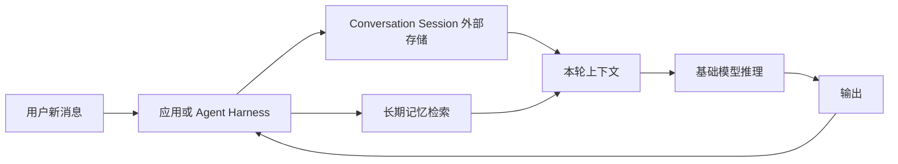
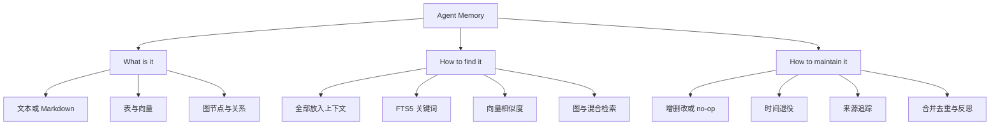
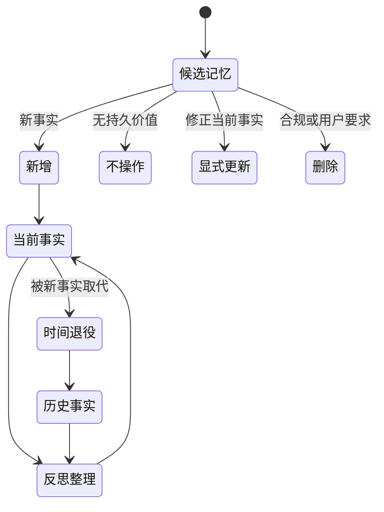
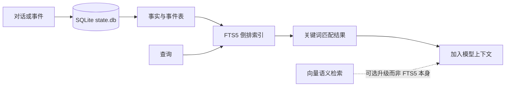
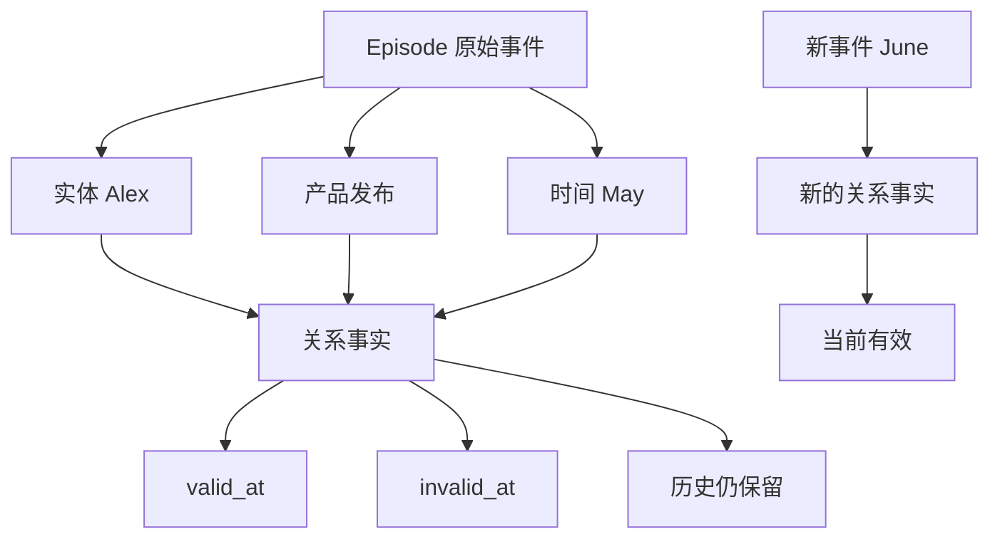
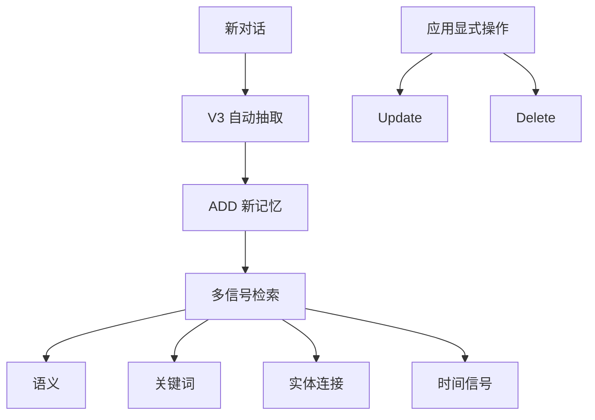
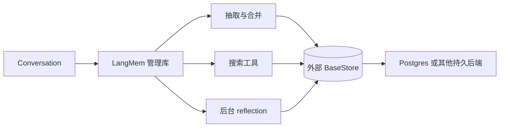
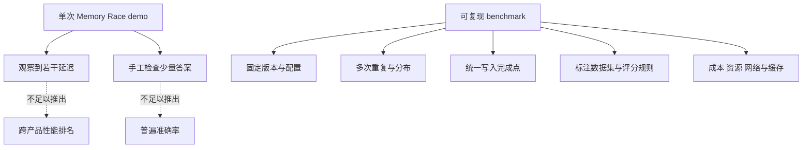

# 总结稿

[打开单页 HTML 总结](assets/bilibili-BV1DabS6vEba-summary.html)

## 核心结论

这期视频最有价值的不是给五种方案排出永久名次，而是提供三个问题：**记忆存成什么、如何找到、怎样维护**。作者 Sean 用文本/Markdown、SQLite/FTS5、向量检索、mem0、Zep/Graphiti 与 LangMem 做教学比较；这些方案并非互斥的“成熟度五层”，而是存储表示、检索策略、维护逻辑、管理库和托管服务的不同组合。

## 先分清三类信息

### 1. 作者的教学框架

- **记忆对象**：procedural（技能/做法）、semantic（可复用事实）、episodic（带时间的经历）。
- **三支柱**：What is it、How to find it、How to maintain it。
- **五层比较**：是作者为本次讲解组织材料的框架，不是行业标准，也不能推出“越靠后越先进”。Waku 官方仓库本身也把 SQLite/FTS5、pgvector 和 mem0/Zep 等写成可替换或升级路径，而不是互斥层级：[ShenSeanChen/waku-agent](https://github.com/ShenSeanChen/waku-agent)。

### 2. 当前官方产品能力

- **基础 LLM 推理不会自行跨调用形成持久记忆**；跨调用状态通常由请求上下文、conversation/session、缓存或外部存储提供。OpenAI 把跨 Responses 调用状态明确建模为 [Conversations](https://platform.openai.com/docs/api-reference/conversations)，Anthropic Claude Code 也通过 session 的 [continue/resume](https://docs.anthropic.com/en/docs/claude-code/cli-usage) 恢复对话。因此应说“模型外状态”，而不是断言所有 API 端点绝对无状态。
- **SQLite FTS5** 是全文/关键词搜索模块，不是向量语义检索；Waku 当前仓库确认默认把记忆放在 `.waku/state.db`，用 FTS5 查 facts/episodes。SQLite 的正式能力见 [SQLite FTS5 Extension](https://www.sqlite.org/fts5.html)。
- **mem0** 同时有开源 SDK/自托管与托管 Platform，但视频中的产品界面与自动 CRUD 逻辑已经版本漂移。当前 V3 自动抽取是 **ADD-only**，显式 update/delete API 仍存在；当前 Platform 使用语义、关键词、实体和时间等多信号检索。详见 [Platform: Migrating to the New Memory Algorithm](https://docs.mem0.ai/migration/platform-v2-to-v3) 与 [Graph Memory](https://github.com/mem0ai/mem0/blob/main/docs/platform/features/graph-memory.mdx)。不能因 [mem0 开源仓库](https://github.com/mem0ai/mem0) 是 Apache-2.0，就推断托管图能力全部开源。
- **Zep 与 Graphiti 要分开**：Graphiti 是开源 temporal context graph 引擎，支持有效时间窗、历史保留、provenance，以及 semantic + BM25 + graph traversal 的混合检索；Zep 是生产托管 context infrastructure，使用其专有 Context Graph Engine。边界见 [getzep/graphiti](https://github.com/getzep/graphiti)。
- **LangMem 是管理库，不是托管存储**：它提供抽取、更新、搜索与后台 reflection 工具，持久性来自外部 BaseStore/数据库；InMemoryStore 重启会丢失，生产需另配持久后端。见 [langchain-ai/langmem](https://github.com/langchain-ai/langmem)。
- **“Anthropic dreaming”未核实**：没有找到 Anthropic 用这个词正式命名 agent 空闲期记忆合并/清理机制的同义出处；[Interpretability Dreams](https://www.anthropic.com/research/interpretability-dreams) 讨论的是机械可解释性愿景，不是该产品机制。这里应标作作者类比。

### 3. 单次 Memory Race 演示

视频用晚宴事实做了一次演示，显示 SQLite、mem0、LangMem、Zep 和 no-memory control 的若干返回时间与答案。它**不是性能排行榜**：没有重复、分布、误差条、固定 commit/版本、统一冷热缓存、网络区域、写入完成点、资源统计或公开评分集；各系统完成的工作也不同，例如本地 FTS5 检索与异步图构建不可直接比较。

因此只能写“作者在该配置的一次演示中观察到 SQLite/mem0 较快、LangMem 较慢、Zep 构图等待较长”，不能写成产品普遍速度结论。原演示见 [视频本身](https://www.bilibili.com/video/BV1DabS6vEba/)。

## 一个更可靠的选型方法

1. **先定义记忆语义**：事实、事件、技能、原始对话还是关系历史？
2. **再决定检索**：全部进上下文、FTS5 关键词、向量、图遍历或混合召回。
3. **设计维护闭环**：新增、显式纠正/删除、时间退役、来源追踪、去重、审计和回滚。
4. **按真实负载评测**：准确率、误召回、时效、p50/p95、成本、并发、写入一致性和删除完整性。
5. **绑定版本与部署**：产品、计划、SDK/API、模型、图/向量后端、区域和测试日期缺一不可。

## 隐私与安全边界

记忆不是只有价值，也可能是长期隐私和质量负债。应最小化保存原始对话与敏感信息，记录 provenance，支持用户查看、纠正、导出和删除，并防止不同用户/租户记忆串线。任何自动 consolidation/reflection 都可能把错误压缩成“稳定事实”，需要日志、回滚与人工复核。

### 观众讨论（从属信息）

观众提出了三类有用问题：长期向量检索的 token/成本会不会随记忆增长；Zep 云服务中的用户 memory 实际存在哪里；日记等高敏感场景应如何选型。另有一名用户在特定一周内切换 mem0、Hindsight、Supermemory 等工具，报告衰减、旧记忆误召回、提取频率、版本锁定和加密可见性问题。这些是个人体验与核验线索，不是当前产品事实或统一 benchmark。

样本只来自抓取的 **15/平台报告 28** 条顶层热门评论，候选 15 条，且没有嵌套回复正文，存在热门偏差；弹幕为 **0 条 current-accessible**，无法推断热点或总体情绪。工具功能、默认值、性能、维护状态与隐私政策都必须按版本和日期重新核对。

## 一句话带走

**Agent memory 不是“选一个数据库”——它是状态边界、检索、维护、评测与数据治理共同组成的系统。**

# 辅助理解

## 从“模型失忆”说起，但不要把 API 说成绝对无状态

基础模型的一次推理不会因为调用结束就自动改写权重并永久记住上一轮。跨调用记忆通常由模型外状态提供：应用重发历史、维护 conversation/session、检索外部存储，或由产品恢复缓存与会话。OpenAI 的 [Conversations API](https://platform.openai.com/docs/api-reference/conversations) 就是“存储和检索跨 Responses 调用状态”的独立资源；Claude Code 的 [CLI reference](https://docs.anthropic.com/en/docs/claude-code/cli-usage) 也把 `--continue` 与 `--resume <session-id>` 暴露为产品级会话恢复。

所以更精确的表述是：**基础推理没有自生的跨调用持久记忆，产品可以在模型外保存并重新提供状态。** 这也解释了为什么“记忆系统”首先是 harness 的工程问题。

## 作者框架的真正价值：三个正交问题

作者把记忆设计拆成：它是什么、如何找到、怎样维护。这个拆法比“五层排名”更稳定，因为同一产品可能同时包含表、向量和图，也可能把维护逻辑放在 SDK 中、存储放在另一个数据库中。

frame 5 是教学白板，不是行业标准。它把表示、检索、维护并列，正适合做导航；下方“五层”表被裁切，也不能据此推导产品成熟度顺序。Waku 官方仓库的 [upgrade paths](https://github.com/ShenSeanChen/waku-agent) 也说明 SQLite FTS5、pgvector、mem0/Zep 等是可替换组合，而不是互斥层级。

## 维护比“存进去”更难

把每轮对话 append 到数据库只解决了写入，没有解决事实冲突、过时、来源、删除和质量漂移。作者提出 DECIDE、RETIRE、ATTRIBUTE、REFLECT 四类动作，很适合作为设计检查表，但它们不是所有产品共有的标准 API。

真正的生产实现还需要：触发条件、并发冲突、审计日志、provenance、回滚、用户纠正、彻底删除，以及防止 consolidation 把模型幻觉固化为长期事实。

“Anthropic dreaming”在这里不能当作官方术语。Anthropic 的 [Interpretability Dreams](https://www.anthropic.com/research/interpretability-dreams) 是机械可解释性研究愿景，不是 agent 空闲期合并/删除记忆的产品架构；未找到同词同义的官方出处。可以称其为作者对离线 reflection 的类比，而 LangMem 的官方 [API reference](https://langchain-ai.github.io/langmem/reference/) 确实提供名为 `ReflectionExecutor` 的后台调度原语。

## SQLite 与 FTS5：本地、透明，但不是语义万能层

Waku 当前官方仓库把 `.waku/state.db` 作为可查询源，facts 和 episodes 由 FTS5 做关键词检索，并生成可读的 `MEMORY.md` 镜像。[SQLite FTS5 Extension](https://www.sqlite.org/fts5.html) 的官方定义是全文搜索虚拟表模块，支持 MATCH、短语、前缀、NEAR、布尔组合和 BM25 排序。

优势是本地、可查看、容易备份和审计；限制是同义改写、跨语言、复杂关系和时间推理未必靠关键词就能解决。SQLite 能启用 FTS5，不代表任何叫 `state.db` 的应用都真的在使用它；本视频对应的 Waku 实现由 [官方仓库](https://github.com/ShenSeanChen/waku-agent) 额外确认。

## 图记忆：Graphiti 的时间语义，不等于 Zep 全部开源

[getzep/graphiti](https://github.com/getzep/graphiti) 把 Graphiti 定义为开源 temporal context graph engine：实体和关系来自 episodes，事实有有效时间窗，被新信息 supersede 后保留历史，且保留来源 lineage；检索组合 semantic、BM25 与 graph traversal。

这张关系图只说明节点—边表示，不证明抽取正确、查询快或冲突处理无误。官方仓库还明确区分：**Graphiti 是 OSS 引擎；Zep 是托管 context infrastructure，底层使用专有 Context Graph Engine。** 因此视频里的 Zep UI、Zep Cloud 延迟和 Graphiti 自托管能力不能互相代替。

## mem0：视频展示的是一个版本切片

视频将 mem0 讲成 row memory 与 graph memory，并讨论 add/update/delete/no-op/supersede。到 2026-08-20，官方 [V2 到 V3 迁移说明](https://docs.mem0.ai/migration/platform-v2-to-v3) 已表明自动抽取改为 **ADD-only**：新事实累积，不在抽取阶段自动覆盖或删除；显式 [Update Memory](https://docs.mem0.ai/core-concepts/memory-operations/update) 与 delete 操作仍可由应用调用。当前检索融合语义、关键词、实体和时间信号，而不是旧版单一向量分数。

frame 6 的 Memories 表格只证明某一时点 UI 展示了实体、内容、类别、Lifecycle 和操作入口，不证明自动维护准确或删除彻底。[mem0 开源仓库](https://github.com/mem0ai/mem0) 使用 Apache-2.0，但当前托管 Platform 的图/排序能力与 OSS 后端不能无条件视为相同；官方 [Graph Memory](https://github.com/mem0ai/mem0/blob/main/docs/platform/features/graph-memory.mdx) 页面也需按计划与版本读取。

## LangMem：管理动作在库里，持久性在外部 store

[langchain-ai/langmem](https://github.com/langchain-ai/langmem) 提供抽取、更新、搜索、后台管理和 prompt 优化原语，能与任意存储系统配合，并原生集成 LangGraph store。其示例明确指出 InMemoryStore 重启后数据丢失，生产要换成 AsyncPostgresStore 等持久后端。

frame 8 的 `langmem_native.py`、`mem0_native.py`、`zep_native.py` 只显示代码入口存在，并不证明这些适配器运行结果相同。正确说法是“LangMem 不自带一个托管持久数据库”，而不是“LangMem 什么都不存”。

## 为什么 Memory Race 不能成为排行榜

一次演示可以发现集成问题，却不能直接估计产品的普遍速度和正确性。视频没有提供重复次数、分布、误差条、固定 commit、相同部署边界、统一 ingestion 完成点和标注数据集。Zep 可能还在异步构图，而 SQLite 已开始本地 FTS5 查询，计时对象并不相同。

原始演示见 [视频](https://www.bilibili.com/video/BV1DabS6vEba/)。稳妥表述只能是“作者在该次配置观察到的结果”。Waku 仓库本身还强调 deterministic eval 与 LLM-as-judge 应分开，这种纪律同样适用于记忆评测。

## 选型矩阵：先按问题，不按品牌

| 问题 | 最低成本起点 | 何时升级 |
|---|---|---|
| 少量可读偏好/规则 | Markdown + 全量上下文 | 上下文过长、冲突增多时 |
| 本地事实/事件与精确词查询 | SQLite + FTS5 | 同义、跨语言或模糊召回重要时 |
| 大量语义相似检索 | 向量索引 + metadata | 关系与时间历史成为核心时 |
| 实体关系、有效时间、历史查询 | Graphiti/Zep 类 temporal graph | 先确认写入成本、异步一致性与运维 |
| 抽取、更新、后台 reflection 工作流 | LangMem + 外部 store | 仍需自行选择持久后端和评测 |

无论选择哪种，都需要 provenance、租户隔离、用户纠正/删除、备份、导出、注入防护和可复现评测。

### 观众讨论与限制

评论中最有价值的补充是：长期记忆增长会带来检索与 token 成本；云端 memory 需要确认数据驻留、加密、训练用途和删除；私人日记属于高敏感场景，不能只按速度选型。另有单用户报告 mem0、Hindsight、Supermemory 等在特定周、特定 Hermes/RAG 配置下的衰减、旧记忆误召回、提取频率、版本锁定和可观察性问题。这些是核验线索，不是当前产品事实。

样本为抓取 **15/平台报告 28** 条顶层热门评论，候选 15 条，无嵌套回复正文，存在热门偏差；弹幕为 **0 条 current-accessible**，无法分析热点或总体情绪。工具默认、计划、定价、维护、性能和隐私政策都需绑定版本与日期。

## 最终理解

Agent memory 的难点不在“记得越多越好”，而在**只保存值得保留的内容、在需要时找到正确版本、能解释来源、允许纠正与删除，并用可复现实验验证收益**。五层框架可帮助入门，官方能力决定当前能做什么，单次 demo 只能暴露集成体验；三者必须分开。

## 外部事实核验

### 声明 1（00:04）

- 视频陈述：每次 LLM 调用都没有持久记忆，ChatGPT、Claude Code 等产品之所以能记住，是因为模型外包了一层记忆系统。
- 核验状态：部分确认
- 核验结果：核心表述成立，但必须限定到基础推理与模型权重层。OpenAI 的官方 Conversations API 明确把跨 Responses 调用的会话状态建模为可创建和管理的 conversation；数据控制文档也把 Responses 的保存称为 Application State。Anthropic 的 Claude Code 官方 CLI 则用 continue/resume 和 session ID 恢复会话。这些都支持‘应用或产品在模型外管理并重新提供状态’，而不是一次基础模型推理自动改写权重并永久记住。不过，不同 API 可能提供服务器端 conversation/thread、缓存或会话恢复，所以不宜把‘每次调用绝对无状态’写成所有端点的共同接口保证。
- 检索日期：2026-08-20
- 来源：
  - [Conversations | OpenAI API Reference](https://platform.openai.com/docs/api-reference/conversations)（primary）
  - [Data controls in the OpenAI platform](https://platform.openai.com/docs/models/default-usage-policies-by-endpoint)（primary）
  - [CLI reference | Claude Code](https://docs.anthropic.com/en/docs/claude-code/cli-usage)（primary）

### 声明 2（05:47）

- 视频陈述：SQLite 方案把状态和记忆存进 `state.db`，再由 FTS5 做关键词搜索。
- 核验状态：已确认
- 核验结果：确认当前官方仓库这样定位。Waku Agent README 称默认记忆是 `.waku/state.db` 中的 SQLite + FTS5，并把 facts/episodes 表描述为可由 FTS5 关键词检索；仓库也把它与可选的 Supabase pgvector 语义检索区分。SQLite 官方文档确认 FTS5 是一个提供全文检索的虚拟表模块，支持 MATCH、词项/短语/前缀/NEAR/布尔查询和 BM25 排序。需要保留边界：FTS5 是关键词/全文索引能力，不等于向量语义检索；SQLite 支持 FTS5 也不能自动证明其他应用启用了它。
- 检索日期：2026-08-20
- 来源：
  - [ShenSeanChen/waku-agent](https://github.com/ShenSeanChen/waku-agent)（primary）
  - [SQLite FTS5 Extension](https://www.sqlite.org/fts5.html)（primary）

### 声明 3（14:36）

- 视频陈述：mem0 有 row memory 和 graph memory，两者使用向量；row memory 会自动执行 add、update、delete、no-op、supersede，graph 是 Pro 能力；mem0 是开源的。
- 核验状态：部分确认
- 核验结果：部分确认且需要按 2026-08-20 的当前版本改写。官方 GitHub 仓库仍为 Apache-2.0 开源，Mem0 官方也区分 Platform 与 Open Source。当前 V3 Platform 自动抽取已经改为 ADD-only：新增事实累积，不再在抽取阶段自动 UPDATE/DELETE；显式 update/delete API 仍存在。当前 Platform 的所谓 graph memory 已转向内建的实体提取、跨记忆连接以及语义、关键词、实体和时间信号融合排序，不应沿用旧版‘独立外部图数据库 + relations 字段’的描述。官方图记忆页面称实体连接/检索增强自动用于所有计划，而交互式 graph view 才受 Pro/Enterprise 限制；当前 OSS 与 Platform 的能力和实现也不应混为一谈。故‘mem0 开源’成立，但不能推出视频展示的托管图能力全部开源，也不能继续把旧自动 CRUD/NOOP/supersede 流程写成当前默认。
- 检索日期：2026-08-20
- 来源：
  - [mem0ai/mem0](https://github.com/mem0ai/mem0)（primary）
  - [Platform: Migrating to the New Memory Algorithm](https://docs.mem0.ai/migration/platform-v2-to-v3)（primary）
  - [How Mem0 Works](https://github.com/mem0ai/mem0/blob/main/docs/core-concepts/how-it-works.mdx)（primary）
  - [Graph Memory](https://github.com/mem0ai/mem0/blob/main/docs/platform/features/graph-memory.mdx)（primary）
  - [Update Memory](https://docs.mem0.ai/core-concepts/memory-operations/update)（primary）

### 声明 4（16:29）

- 视频陈述：Zep 默认使用时序图，节点与边带时间/有效性，旧事实失效但保留历史，并结合向量检索与图遍历。
- 核验状态：已确认
- 核验结果：核心能力确认，但要区分 Zep 与 Graphiti。Graphiti 官方仓库将自身定义为构建和查询 temporal context graphs 的开源框架，事实带有效时间窗，旧事实被 newer information supersede 后仍保留历史；检索组合 semantic embeddings、BM25 keyword 和 graph traversal，并保留到 episode 的 provenance。相同官方仓库又明确区分：Zep 是面向生产的托管 context graph infrastructure，底层使用其 proprietary Context Graph Engine；Graphiti 是可自行部署和运维的开源 temporal context graph engine。因而不能把 Zep Cloud 的托管实现、延迟与默认配置直接等同于 Graphiti OSS，也不能只写成‘Zep 等于开源 Graphiti’。
- 检索日期：2026-08-20
- 来源：
  - [getzep/graphiti](https://github.com/getzep/graphiti)（primary）
  - [Welcome to Graphiti! | Zep Documentation](https://help.getzep.com/graphiti/getting-started/welcome)（primary）

### 声明 5（17:24）

- 视频陈述：LangMem 是 package，不是 storage，所以界面里没有自己的 store。
- 核验状态：已确认
- 核验结果：确认，但‘没有 store’应写得更精确。LangMem 官方仓库称其提供可用于任意 storage system 的功能原语，并原生集成 LangGraph storage layer；示例明确说明 InMemoryStore 重启后丢失，生产环境应换用 AsyncPostgresStore 或类似数据库持久化。其 API 提供 memory manager、manage/search tools 和后台 ReflectionExecutor，但持久性来自传入的 LangGraph BaseStore 或用户选择的其他后端。故 LangMem 是记忆管理 SDK/库，而不是独立托管数据库；它可以与持久存储组合，不能说‘什么都不存’。
- 检索日期：2026-08-20
- 来源：
  - [langchain-ai/langmem](https://github.com/langchain-ai/langmem)（primary）
  - [LangMem API Reference](https://langchain-ai.github.io/langmem/reference/)（primary）

### 声明 6（09:00）

- 视频陈述：agent 在空闲时反思、合并重复和清理旧记忆，可对应 Anthropic 的 ‘dreaming’。
- 核验状态：未验证
- 核验结果：未能从 Anthropic 官方文档、新闻或研究页面核实这一同词同义归因。Anthropic 官方确实讨论 Claude Code/Agent SDK 的长任务记忆管理，也有题为 ‘Interpretability Dreams’ 的研究愿景页面，但后者讨论机械可解释性研究目标，并不是 agent 空闲期记忆巩固产品或标准。LangMem 官方 API 倒是明确提供 ReflectionExecutor，用于远程或后台调度记忆管理。正式笔记应把 ‘dreaming’ 写成作者的类比，除非能给出 Anthropic 的精确原始出处；不要写成 Anthropic 已命名或发布的标准架构。
- 检索日期：2026-08-20
- 来源：
  - [Introducing Claude Sonnet 4.5](https://www.anthropic.com/news/claude-sonnet-4-5)（primary）
  - [Interpretability Dreams](https://www.anthropic.com/research/interpretability-dreams)（primary）
  - [LangMem API Reference](https://langchain-ai.github.io/langmem/reference/)（primary）

### 声明 7（09:47）

- 视频陈述：以文本/SQLite、向量、mem0、Zep 时序图和 LangMem 等组成五层来比较 agent memory。
- 核验状态：未验证
- 核验结果：不应当作行业标准。Waku Agent 官方仓库自身把 semantic、episodic、procedural 称为记忆支柱，同时又把 SQLite+FTS5、Supabase pgvector、mem0/Letta/Zep列为可替换或升级的实现；mem0 当前同时使用 SQL、向量、关键词、实体和时间信号；LangMem 又可写入不同 BaseStore。说明表示形式、检索方式、维护工具和托管产品会重叠，无法构成互斥的单轴层级。五层适合作为作者的教学比较框架，不能推导 ‘层数越高越先进’ 或 ‘每个产品只属于一层’。
- 检索日期：2026-08-20
- 来源：
  - [ShenSeanChen/waku-agent](https://github.com/ShenSeanChen/waku-agent)（primary）
  - [How Mem0 Works](https://github.com/mem0ai/mem0/blob/main/docs/core-concepts/how-it-works.mdx)（primary）
  - [langchain-ai/langmem](https://github.com/langchain-ai/langmem)（primary）

### 声明 8（23:18）

- 视频陈述：一次 dinner-party demo 中展示各方案的返回时间与少量回答，并据此评价 SQLite/mem0 较快、LangMem 较慢、Zep 很慢。
- 核验状态：存在矛盾
- 核验结果：不能作为 benchmark。视频展示的是一次可视化 demo：没有重复试验、分布、误差条、固定版本/commit、标准化的本地与托管边界、网络区域、冷暖缓存、统一写入完成点、资源统计或公开评分规则；各系统完成的工作也不同，例如 Zep/Graphiti 可能在异步构图而 SQLite 只做本地 FTS5 检索。少量手工检查的预期字符串也不构成准确率评测。Waku 官方仓库另有明确区分 deterministic eval 与 LLM-as-judge 的评测纪律，但当前仓库页面没有把该视频的单次 Memory Race 发布为带协议、数据集、重复与统计量的可复现 benchmark。正确写法是‘作者在该配置的一次演示中观察到’，不能给出跨产品普遍排名。
- 检索日期：2026-08-20
- 来源：
  - [一口气搞懂AI Agent五种记忆架构/SQLite/mem0/Zep/LangMem实测竞速](https://www.bilibili.com/video/BV1DabS6vEba/)（primary）
  - [ShenSeanChen/waku-agent](https://github.com/ShenSeanChen/waku-agent)（primary）

# Data

## 增强转写稿

# Corrected Transcript

- Video ID: `BV1DabS6vEba`
- Domain: AI agent architecture, long-term memory, retrieval, knowledge graphs, and developer tooling
- Editorial rule: every timestamp token and source-line order is preserved. Only high-confidence product names, AI-memory terminology, code/database terms, and clear ASR errors were normalized. Unclear demo utterances were retained.
- Verification boundary: product capabilities, pricing/edition boundaries, open-source status, GitHub stars, architecture details, and performance observations are time-sensitive. The demo is one author's implementation/run, not a controlled benchmark.

## Terminology

- **working memory** — information available to the current agent run/context; not synonymous with durable storage.
- **procedural memory** — procedures/skills describing how to perform tasks.
- **semantic memory** — durable facts or concepts.
- **episodic memory** — dated events or prior experiences.
- **RAG (retrieval-augmented generation)** — retrieves external context before generation.
- **Agentic RAG** — an agent chooses or iterates retrieval/actions rather than executing one fixed retrieval pass.
- **Graph RAG** — graph-structured entities/relations participate in retrieval; implementations vary.
- **retrieval gate** — application logic deciding whether/what memory or tool to retrieve.
- **SQLite / FTS5** — embedded relational database / SQLite full-text search extension.
- **pgvector / Supabase / Weaviate / Pinecone** — vector extension/platform/services; product features and licensing change over time.
- **mem0** — agent-memory product/library discussed with row and graph memory; verify current editions and open-source boundaries.
- **Zep / Graphiti** — Zep is the product/service; Graphiti is its temporal knowledge-graph framework/library. Do not use the names interchangeably without checking current docs.
- **LangMem** — LangChain ecosystem package for memory extraction/management; it is not itself a storage backend.
- **consolidation** — post-processing that distills or merges accumulated interactions into durable memory.
- **retire / supersede** — mark a fact as no longer current while retaining history; distinct from deletion.
- **reflect** — scheduled/post-run synthesis, deduplication, or pruning; not one standardized algorithm.
- **provenance / attribution** — origin and lineage of a memory item.
- **tracing** — runtime observation/recording of calls, tools, retrievals, and outputs; not the same as provenance.
- **temporal graph** — graph whose facts/edges have time/validity semantics.
- **no-op** — choose not to modify stored memory.

## Transcript
[00:00] Hey, I'm Sean
[00:00] So, memory is a super popular term in AI agent systems recently
[00:04] And the reason for that is that any LLM call does not carry persistent memory across calls
[00:10] The reason why ChatGPT and Claude Code remembers what you talked about from the past
[00:14] is because it has already crafted this memory system for their own AI agent harness
[00:19] Today, we're going to cover five different ways of how you're going to architect an AI agent memory around the harness you built
[00:25] And previous, you have watched our videos, we have created this AI agent harness called Waku agent
[00:30] It basically has this agent run that has a loop for the agent to call tools, delegate sub agents for tasks
[00:37] And at the same time, it's going to prepare this working memory with retrieving from three main pillars
[00:43] Which is procedural memories, in our case, it's a skill
[00:47] semantic memory, which is some durable facts
[00:50] And episodic memory, which is some dated events
[00:53] And that was pretty much similar to how Hermes agents crafted their own memory system
[00:58] But if you're serious about building agents, I'm sure you have been bombarded with information such as
[01:02] RAG, Agentic RAG, Graph RAG, retrieval-augmented generation has always been there
[01:08] But there's no retrievals or embeddings in Hermes and Waku agent
[01:13] We're going to tell you the difference between these two separate systems
[01:16] Because there are two different ways of retrieving memories
[01:19] And I hope this would be helpful for you, because eventually it depends on you
[01:23] What kind of memory systems matters the most to your use case
[01:26] And then you should make a decision by yourself
[01:28] And if you want to try out all these agent harness and memory systems and everything
[01:32] We have built an open source project called
[01:35] ShenSeanChen/Waku-agent
[01:37] And we recently received more than 1.3 thousand stars
[01:41] So thanks everyone for your support
[01:42] And we would love to have you to contribute to this repo
[01:45] And the way to use it is very simple
[01:47] You can either pip install waku-agent
[01:49] Or you can git clone this repo and then start working on it
[01:52] Once you start running it, you will have an agent like this
[01:55] And you can ask the questions and be like
[01:56] What is on my calendar today
[01:59] If you have your calendar properly set up
[02:02] And it's going to pass through the retrieval gate
[02:05] And then use the tools like list events to check out calendar
[02:08] And all these kinds of stuff
[02:09] So this is a proper agent harness that will allow you to
[02:11] Play around with your memory system
[02:13] And tools that you build for yourself
[02:15] After finishing the tracing and giving us back the answers
[02:19] We're pretty much done for one agent run
[02:20] And we also built up this arena for memory systems
[02:23] To compare a few different memory layers options on the market
[02:26] We're going to show you all the real code
[02:27] And implementations at the latter half of the video
[02:30] For now, let's jump back to the system design
[02:31] For the concept explanations first
[02:33] First things first
[02:35] Here's how I would think about agent memories
[02:37] I would think about three main pillars first
[02:40] What is it?
[02:41] How to find it?
[02:42] And how do we maintain it?
[02:44] Normally an agent memory will be stored in three different ways
[02:48] The first one is text or markdown file
[02:50] Just like your memory.md
[02:52] For example, if you come to Hermes
[02:54] And just ask any questions and say hi
[02:57] And then you will see your root directory
[02:59] And if you scroll down to dot Hermes
[03:02] Right here
[03:03] And then scroll down
[03:04] You can find out that
[03:07] And then you'll see a folder called memory
[03:08] And then double click on this memory.md
[03:11] We'll show you the memories right here
[03:12] Okay, so this is just plain text
[03:14] And it's going to be fed into the context window
[03:17] Whenever you ask any questions
[03:19] And similarly in Waku Agent
[03:21] If you clone this repo
[03:22] After you ask some first questions
[03:25] You will be able to find this folder called dot waku
[03:27] And then you can find things like SOUL.md
[03:29] Which is a system prompt for your agent's memory
[03:32] So basically it can be just in plain text
[03:35] Or if things get more complicated
[03:37] It can store them in the table
[03:38] Like a spreadsheet or like a google sheet
[03:41] With rows and columns
[03:42] All these kind of stuff just like an excel sheet
[03:44] And last but not least
[03:45] We can also store information in a graph
[03:47] With nodes and edges
[03:49] And for people who are not familiar with graphs
[03:51] It's basically a way to build up connections
[03:53] Between information
[03:55] And I found this really cool tool called Zep
[03:58] And they have this relational graph
[04:00] That after you use this memory layer
[04:02] To store information
[04:04] It will plot this out for you
[04:05] For example, let's take a look
[04:07] Let's say this founder called alex
[04:09] And alex has been to this lisbon AI meetup event
[04:14] For his robotic startup
[04:17] And you can see that these information
[04:20] All interconnected
[04:21] So it started with this username
[04:22] Called for Quickstart Zep3
[04:24] And alex similarly has a product launch date
[04:27] And those were in say in May
[04:30] They had a product launch
[04:32] In June also had a product launch
[04:34] So graph is just a way to store information
[04:36] That helps you find connections between infos
[04:40] And I think these are the three major ways
[04:41] Of storing memories
[04:43] But people might be asking
[04:44] Where is embedding for retrieval augmented generation
[04:47] It depends on what vector source you're using
[04:49] If you're using Supabase pgvector like myself
[04:52] It's going to be still in rows in the table
[04:54] But then some of the columns are going to be vectors
[04:58] Or you can store them in a NoSQL database
[05:00] So that's what is it
[05:02] And then now it comes to
[05:03] How does our agent find out about it
[05:05] There are four ways for our agent to find the memories
[05:08] The first one is do nothing
[05:11] Remember the memory.md
[05:12] That we showed you earlier for Hermes
[05:14] That's basically do nothing
[05:15] Because if the memory.md is not too long
[05:19] It's supposed to be read by default by the LLMs
[05:22] So that it's always in the context anyways
[05:24] Remember if you use Claude Code
[05:26] You can see how much percentage of the context
[05:28] When they have you used
[05:29] And sometimes it's huge
[05:31] And the reason is because some of the memories
[05:33] Are just going to be preloaded there
[05:35] And also of course there are a bunch of
[05:37] tool-call definitions, MCP definitions
[05:41] your SOUL.md which is the system prompt for the role that the agent is playing
[05:47] Other than that we can also do keyword
[05:49] Which is something that SQLite has
[05:51] Which is a standard called FTS5
[05:54] All you need to know is basically
[05:55] It's doing keyword searching
[05:56] Okay and an example in Hermes
[05:59] Is that if you go
[06:00] If you come to Hermes and you scroll down
[06:02] Again the same folder
[06:03] There's something called state.db
[06:06] And if you open that
[06:07] It can see a SQLite schema here
[06:10] All right and the
[06:12] And the keyword search is basically
[06:14] Given these state.db
[06:17] We're just going to search the keywords of the information
[06:20] And the third one is for retrieval augmented generation
[06:22] It's something that
[06:23] It's basically checking the similarity between two words
[06:26] Say say let's let's say
[06:28] You're asking a question regarding my favorite food
[06:31] And the word food might be embedded into a vector of space
[06:35] You know 1024 by one
[06:37] And then it's going to just calculate
[06:38] What other words that are embedded
[06:40] In the same dimensions in our database
[06:43] Have a high similarity to food
[06:45] Maybe it's going to be apple
[06:46] Maybe it's going to be sausages
[06:48] Or so on and so forth
[06:49] Okay so what we're trying to do
[06:50] Is doing a semantic search
[06:52] Instead of just doing keywords
[06:54] Last but not least is Graph RAG
[06:56] What Graph RAG does is very simple
[06:57] Remember I showed you about the graphs earlier
[07:00] What it does is basically
[07:01] It's still embedding the information
[07:03] But it embeds things like the nodes
[07:05] Okay maybe embed you know product launch date
[07:07] And it also embed that
[07:09] That edge like is it
[07:11] Is it a part of the observation
[07:13] Or is it a relationship
[07:14] Okay and
[07:16] And all of these will be embeddings
[07:18] The similarity search will just find out
[07:19] You know what's similar to the question
[07:21] That the user asked
[07:23] And then eventually it might return
[07:24] A relationship graph here
[07:26] So that the agent has more context
[07:27] About the memories in relationships
[07:29] So now how do we maintain it
[07:32] I have summarized this into
[07:33] Four main ways of maintaining a memory system
[07:37] The first one is you got to make a decision
[07:40] Which is do we add
[07:42] Do we delete
[07:42] Do we overwrite some previous information
[07:44] Do we do nothing
[07:46] Okay this one means no operations
[07:48] Or do we retire some information
[07:50] Which by the way is different from deleting
[07:52] Because we're not deleting it
[07:53] We're invalidating
[07:55] The previous information with some time range
[07:57] What does that mean
[07:58] We launched waku agent one month ago
[08:00] And it got 1,000 stars in the first 25 days
[08:04] Okay and then the next day
[08:05] I'm telling the agent
[08:06] Today is day 26
[08:07] And the waku agent has got 1.3,000 stars
[08:10] So it increased 30% in just one day
[08:13] And then what should happen
[08:15] Is that instead of deleting the fact that
[08:18] This GitHub repo has gained
[08:20] 1,000 stars in 25 days
[08:21] Which is still important information
[08:24] It can probably just invalidate it
[08:25] And be like hey
[08:26] The latest stars is 1.3,000 already
[08:29] And you can trace back to one day before
[08:32] Which is 1,000 stars
[08:34] And these contexts are still important
[08:36] For future tracing purposes
[08:38] The third one is called attribute
[08:40] Which in human language is that
[08:42] It's basically tracing
[08:44] Where the source comes from
[08:46] Maybe I got the memory from the users
[08:48] Communicating with your agent
[08:50] Or maybe I got it from some web search
[08:52] Or maybe it got it from some calendar search
[08:56] Depends on where the source comes from
[08:59] And last but not least
[09:00] We are talking about reflect
[09:02] Which is
[09:03] It's going to drop or merge some of the duplicates
[09:05] Or some of the outdated information
[09:07] I mean it's kind of similar to delete
[09:09] And kind of similar to retire
[09:11] But reflect sometimes can link to
[09:13] What Anthropic has proposed
[09:14] Which is dreaming
[09:16] Dreaming happens when we're not working
[09:18] When the agent is running
[09:19] It's like busy accumulating facts
[09:21] Accumulating episodic memories
[09:23] Accumulating procedures into skills
[09:26] But then when it's not running
[09:27] We can probably schedule some tasks
[09:28] To let it reflect on everything
[09:31] That we have collected
[09:32] And then merge some of the duplicates
[09:34] Or drop some of the stuff
[09:35] That are not important anymore
[09:36] So it's kind of like a post-mortem
[09:38] Or post-process step
[09:42] To update or maintain the memory system
[09:45] Are you guys still with me?
[09:46] Good, let's keep going
[09:47] Now let's see some different types
[09:49] Of memory systems with real products
[09:52] And let me add the vector store here
[09:54] So first thing first
[09:55] Plain text ways of storing memories
[09:58] Examples are Hermes and Waku Agent
[10:01] I've shown you SOUL.md earlier
[10:03] Which is text
[10:03] And it's basically system prompt
[10:06] And you can just edit it
[10:08] If we come back to
[10:10] If we check out the SOUL.md of Hermes
[10:13] You can see that my Hermes has a personality
[10:15] Which is it should always talk like Pikachu
[10:18] It should say Pikapi all the time
[10:20] And there's some variations
[10:22] You can say Pika or Pika Pika or Pikapi
[10:25] And Pikapi reserved for addressing
[10:28] Me directly
[10:30] It should call me as Pikapi
[10:32] Because in the anime
[10:33] Pikachu also called Satoshi or Ash
[10:35] Pikapi
[10:35] And you can edit this to anything else
[10:38] So it's very simple to understand
[10:40] And skills is a procedure for example
[10:43] Research about all AI agent videos on the internet
[10:46] And then inform me every morning
[10:47] What are some of the latest news that Sean's stories should
[10:51] Sean AI story should cover for the next video
[10:53] Right, this is a procedure. This is a skill
[10:55] And it's usually loaded by trigger
[10:58] Okay, so if I'm asking my agent and be like
[11:00] Hey, trigger that skill for Sean AI posts
[11:04] And then it should run it
[11:05] And then fetch it for me
[11:07] And I should be always be able to just edit it myself
[11:09] Memory.md
[11:10] Which is some durable facts
[11:12] That you should keep accumulating
[11:13] When you're talking to agents like these
[11:15] This is from a previous video
[11:17] For showing you how to build agent harness in real code
[11:19] And the way that we build up semantic memory
[11:21] Which is basically memories.md
[11:24] Is that every time when you have a conversation
[11:26] With the agent from the user prompt to the LLM
[11:29] To the reply
[11:30] It should save the history into the state.db
[11:33] Which is our SQLite database
[11:35] And then you should consolidate the information
[11:37] After every say five or ten conversations
[11:41] Using some cheaper auxiliary models
[11:44] And then you should distill the facts into the memory.md
[11:47] And these memories usually are loaded in context
[11:49] Because that's important
[11:50] But it can also make it retrievable
[11:52] It can build up a retrieval gates
[11:55] Like what we do in Waku agent
[11:58] And I should decide if it should call up some skills
[12:01] Call up some semantic memories and stuff
[12:03] It doesn't have to always be there
[12:05] But you can do that if you want to
[12:06] And remember agent harness is very flexible
[12:09] You don't have to stick to any standard
[12:10] You can just craft your own harness
[12:13] What eventually what makes what lasts forever
[12:16] What matters most to you eventually is the memories
[12:19] If you're accumulating these memories
[12:21] And then store them well and prepare them well
[12:23] And then take care of them
[12:24] Then these memories are the most valuable assets
[12:26] For any AI agent harness
[12:29] Whether or not we should have a retrieval gate
[12:30] That's completely up to you
[12:33] And last but not least
[12:34] Remember we just showed you the state.db
[12:36] Which is the SQLite database
[12:38] And it's a relational database with roles
[12:40] And you're doing the keyword searching
[12:42] For how to find it
[12:44] And then the way we maintain it
[12:45] Is that you can just edit it yourself
[12:47] Like if you click on here
[12:50] Yeah, you can just write things into the state db
[12:53] Or you can wait for the agent harness to consolidate it
[12:56] Like what I showed you in Waku agent
[12:58] The consolidation
[13:00] And in the real code
[13:01] We also have a consolidation module right here
[13:05] You click into it
[13:06] You can see what happened in consolidations
[13:08] In the past history
[13:11] So that was plain text style
[13:12] What else do we have?
[13:13] We've got Supabase
[13:16] Weaviate, Pinecone
[13:18] Which have vector stores
[13:20] Well, Supabase is a relational database
[13:22] So it's technically not a vector store
[13:24] But they do have a vector extension
[13:27] Called pgvector
[13:29] Which is technically a vector store
[13:30] That you can use
[13:31] Vector stores usually store information in vectors
[13:34] Which as I mentioned earlier
[13:36] Is going to embed every single word into
[13:39] A high dimensional vectors with numbers in it
[13:42] Because computers cannot process on words
[13:44] They can only can
[13:45] They can only process numbers
[13:47] Or higher dimensions of numbers
[13:49] That's why vectors are very useful
[13:51] And they can store some metadata
[13:52] For example, what does this vector really mean
[13:54] And what some other information should be carried with it
[13:58] And the way we find it
[13:59] Is that we're going to do this thing
[14:01] Called similarity search
[14:02] Remember earlier we say that
[14:04] We're going to put a number
[14:05] Put a high dimensional number vector on the word food
[14:09] And then you're going to search
[14:10] The space similarity
[14:12] Space distance between food and apple and sausages
[14:15] And then grab those food
[14:16] That's in our storage in our memories
[14:19] And the way we maintain it
[14:20] Is that you basically just upsert
[14:22] Or delete information from it
[14:23] But you can make it a little bit smarter
[14:25] If you have a vector store
[14:26] In your agent harness
[14:28] And you can just design it
[14:29] In a similar way
[14:31] Like our consolidation module
[14:32] I showed you earlier for state db
[14:34] But instead it's for vector stores
[14:36] And now we're looking at some memory tools
[14:38] Out there on the market
[14:40] mem0 is one of the interesting examples
[14:42] They have two ways of storing memories
[14:44] One is called row memory
[14:45] Another one is called graph memory
[14:48] What a row memory does
[14:49] Is that I'll just show an example
[14:51] This is a portal I'm in for mem0
[14:54] And then they have a tab called memories
[14:56] If I just click into one of them
[14:59] And this one says
[15:00] We have a German buyer
[15:02] And this German buyer requires
[15:03] Vegan certifications on every SKU
[15:06] That they got sold for
[15:07] This is basically just a semantic memory
[15:10] Like a durable fact that will last here forever
[15:13] And if you have an agent
[15:14] And you can ask them questions
[15:15] And it should pull information from
[15:16] The mem0 memory layer
[15:19] I don't know if they did plain keyword search here
[15:21] Or doing some embeddings or rags
[15:23] Because I mean
[15:24] I mean yes they are open source
[15:26] But this is an enterprise version
[15:27] So I'm not sure
[15:28] Which one they're actually using behind the scene
[15:30] For a row memory
[15:31] The way you maintain it is basically
[15:32] It's very simple
[15:34] You add, update, delete or do nothing
[15:36] Or supersede it
[15:37] Supersede is basically what we covered earlier
[15:39] Which is you don't delete the information
[15:41] But you make the previous one go outdated
[15:44] And you say hey
[15:44] We have 1.3 thousand stars for Waku Agent now
[15:47] Not 1 thousand stars anymore
[15:48] But we do not want to delete the fact that
[15:50] It has 1 thousand stars in the first 25 days
[15:53] And mem0 also has graph memory
[15:56] Graph memory, remember what we said
[15:58] It's basically nodes and edges
[16:00] And then it can store things in vectors
[16:02] Row memory also is stored in vectors
[16:04] Sorry I forgot about that
[16:05] Both of them stored in vectors
[16:06] And it's going to check traversal
[16:08] Which means you're going to check the entire graph
[16:11] For information
[16:12] And also it does add, update, delete, and noop
[16:16] I'm not too sure if it does supersede
[16:17] Maybe it does too
[16:20] For these things you should check the source code
[16:22] Unfortunately the graph feature for mem0
[16:26] Needs me to upgrade to their pro
[16:27] Which I'm not going to do
[16:29] Because I found an alternative tool called Zep
[16:32] Remember this chart I showed you
[16:34] This is their graph
[16:35] So what Zep does is
[16:40] A memory called temporal graph memory
[16:41] Which means that this graph is evolving over time
[16:44] It's got the nodes, it's got the edges
[16:47] It's got the validity
[16:48] Which as they claim
[16:50] The way you find these information
[16:52] Is using vector search on nodes and edges
[16:55] And across the entire graph traversal
[16:58] And the difference is that
[16:59] Here it can invalidate with some time range
[17:03] Like superseding
[17:04] It's like similar to superseding
[17:05] You never delete it
[17:06] But the history survives here
[17:08] And if you check Zep
[17:09] It's by default using graph
[17:11] And you can check the previous batches of conversations
[17:16] And you can check the threads
[17:19] Stuff like that
[17:20] I will show you real examples
[17:21] Of all these memory layers in just a moment
[17:24] Last but not least
[17:24] We got LangChain memories
[17:26] Which is called LangMem
[17:28] LangMem is just LangMem
[17:30] There's no stores
[17:31] It's basically a package
[17:32] That allows you to store locally
[17:34] And it's your own stores search
[17:36] That you're using
[17:37] And you're extracting and resolving
[17:40] The store update
[17:42] Before writing into anything into it
[17:44] So this is kind of the high-level overview
[17:46] Of memory layers for AI agent
[17:50] As I explained earlier
[17:51] You should pick the right one
[17:52] For your own agent harness
[17:53] And you should take good care of it
[17:55] For Waku agent
[17:55] We're currently working on
[17:56] Some more comprehensive memory layers
[17:58] So please stay tuned
[17:59] And if you're interested
[18:00] Please leave a comment
[18:01] Or join our community
[18:02] And if you want to participate in this
[18:04] Or try the early versions
[18:05] Of Waku memory agent layers
[18:07] You can come to our community
[18:09] In seanchen.io
[18:11] And here you'll be able to join our community
[18:13] Where I'll be replying questions live
[18:15] Every two weeks with our community
[18:17] Or you can just click into any of my social media
[18:19] To communicate with us
[18:20] Now let's start testing things
[18:23] Again, come to Waku agent GitHub repo
[18:26] You can either run this in a terminal
[18:28] To a pip install
[18:29] Or you can just click on it
[18:30] UV run Waku dashboard
[18:32] We'll bring you to
[18:34] We'll bring you to an agent harness
[18:35] Visualization like this
[18:37] In the arena section
[18:38] We have built up this thing called Memory Race
[18:40] And the way we do
[18:41] We deal with Memory Race
[18:42] Is that we have a set of questions
[18:45] For example, if I choose the dinner party
[18:47] With some facts and questions
[18:49] And I zoom in a little bit
[18:51] I can see that stuff
[18:52] I'm going to tell each one of these memory layers
[18:53] And if you come to what they get asked
[18:56] It's going to say
[18:57] What I'm going to tell each one of these
[18:59] Memory layers
[19:01] For example, Jensen Huang is coming
[19:03] And last time he knocked my chili oil
[19:05] On to the white rug
[19:06] And Elon Musk is coming too
[19:08] And he said he would get here at seven o'clock
[19:11] And Tom Holland
[19:12] The spider-man is also on a list
[19:14] And he told me the ending of his next film
[19:16] Over coffee last Tuesday
[19:18] Remember Tom Holland can never keep the secrets
[19:20] Of a unpublished film
[19:22] That's basically the memory I want to tell
[19:24] To these memory layers
[19:26] And there are some simple questions
[19:27] Right, if you ask about Jensen
[19:29] It's going to say
[19:30] Okay, he basically knocked off my chili oil
[19:33] If I ask a question related to
[19:35] How much does Paul Graham owe me in Chinese
[19:38] Paul Graham owes me twenty dollars
[19:40] All right, because
[19:42] Because here he says that
[19:43] He owes me twenty quid from Sourdough
[19:47] We met in Lisbon
[19:49] Quid is the way you say pounds in the UK
[19:52] Because poker is British
[19:53] Anyways
[19:54] And at the bottom we can see that
[19:56] We have listed a few memory stores
[19:58] We're including SQLite, mem0, LangMem, Zep, and the control group
[20:03] I'm not doing Supabase yet
[20:04] Because we're not testing embeddings here
[20:06] If you're interested in RAG and embeddings
[20:08] Please check out my previous videos
[20:09] On Agentic RAG and RAG
[20:12] They're all in this channel
[20:13] So feel free to look them up
[20:15] Okay, and I can click on
[20:16] ReadStore to check the current memories
[20:19] So it's pretty much empty
[20:20] For the current date
[20:21] Because I have cleaned up
[20:23] The other memories you saw earlier
[20:24] We're just some legacies
[20:25] From the previous iterations
[20:26] So what I'm going to do now is that
[20:27] I'm going to click on
[20:28] Ask five stores
[20:30] If I swerve down
[20:32] You can see that
[20:33] We are now telling these facts
[20:35] To each one of these memories
[20:37] Okay
[20:38] With control being the one
[20:40] That will just be having no memories
[20:42] And let's see if it actually works
[20:45] If we ask the same question
[20:46] To the control group
[20:48] This is a seeding process
[20:49] We're going to tell these facts
[20:51] To each one of these memory layers
[20:53] And then later it's going to ask the questions
[20:55] And see how fast they respond
[20:57] Okay
[20:58] And because writing it takes some time
[20:59] So I'll just leave this for a second
[21:01] And we can come back to this in a bit
[21:03] I want to show you exactly how to use
[21:06] Some of these memory layers in plain code
[21:08] If you come to Waku agent
[21:10] And we can check out the folder called examples
[21:14] Okay
[21:14] We open examples
[21:16] And there's a folder called memory native
[21:20] And here we have a LangMem native
[21:25] Which is the LangChain memory
[21:27] And if you scroll down to row 42
[21:30] We've added some facts
[21:32] Like I met Alex at Lisbon AI Meetup
[21:35] Product launch is scheduled for May
[21:36] Actually the launch moved to June
[21:38] Remember this is a superseding
[21:39] Like making the previous information
[21:41] Not deleting it
[21:42] But it's basically outdated
[21:44] And there's some questions
[21:45] What is the product launch
[21:46] What data we push to ship date to
[21:49] And fabo hui shim shi hou in Chinese
[21:51] So that we can see if it actually works
[21:54] And then later you can see that
[21:58] We are creating this memory manager
[22:00] With this manager
[22:01] And then for every fact
[22:03] We're going to invoke a conversation
[22:05] All right
[22:06] Another example is a mem0 native
[22:09] So if we click into it
[22:10] And scroll down a little bit
[22:12] You can see that we have the same facts
[22:14] And questions for mem0
[22:16] You need to create a memory client first
[22:18] And then for every fact
[22:20] We can do client add
[22:21] Which is writing the memory into mem0
[22:24] And then later you can test it with
[22:27] Some real questions with some searches
[22:28] Okay
[22:29] Similarly
[22:30] We have a Supabase native here
[22:32] Exact the same process
[22:34] But for Supabase
[22:35] You need to do some embeddings
[22:37] And later you're going to do retrievals
[22:40] Using the embeddings
[22:41] And last but not least with Zep
[22:43] We've fed the same questions and facts again
[22:45] And we have built up a client from Zep
[22:50] And for every fact
[22:53] It's slightly different here for Zep
[22:55] Because it's by default a temporal graph memory
[22:58] For every client, for every graph
[23:00] You're going to add the fact
[23:01] Okay
[23:02] And then it's going to build up the graph for you
[23:05] Okay
[23:06] And then you can use the client-graph search
[23:10] To find out the results using this query
[23:14] Okay
[23:15] Feel free to try this out
[23:17] Okay, let's come back to here
[23:18] We can see that except Zep
[23:21] Everybody else has finished the work
[23:24] Let's see
[23:25] So make it bigger
[23:28] When did Jensen knock
[23:29] What did Jensen wanna knock onto my rug
[23:33] And NVIDIA should be paying for this
[23:36] It passed for each one of these memories
[23:39] Except Zep is still taking time to build the graph
[23:43] I have no idea
[23:44] But I feel it's because
[23:46] That building the graph takes time
[23:48] Okay, maybe that's why
[23:50] And it took 4.6 seconds for SQLite
[23:54] And the answer is correct
[23:55] Jensen knocked chili oil onto the white rug
[23:58] And mem0 just said chili oil very fast
[24:03] Very straightforward
[24:04] But took a slightly longer time than SQLite
[24:06] And LangChain
[24:07] LangMem took the longest time
[24:09] 7.5 seconds
[24:11] Zep is still sitting
[24:12] Which is taking forever
[24:14] And the control group
[24:14] Absolutely have no information about this
[24:16] Which the answer is correct
[24:17] Because it should not
[24:19] I don't have any record of that
[24:20] That's right
[24:21] And when I asked the question
[24:23] How much did Paul Graham owe me
[24:24] Which is supposed to be 20 quid
[24:26] Sqlite answered it correctly
[24:28] In English
[24:29] It took it 10.3 seconds
[24:31] I don't know
[24:32] Maybe because SQLite is a little bit too simple
[24:34] For keyword searching
[24:35] So it doesn't really know
[24:37] How to search in Chinese
[24:39] Because the memory was in English
[24:40] But seems like mem0 got it
[24:42] And then it said
[24:43] Reply to me in Chinese
[24:44] Say Paul Graham still owes me 20 pounds
[24:47] And he lost it when he was betting with me
[24:49] In BrightStore, in Lisbon
[24:52] That's right
[24:53] And LangMem also has a correct answer
[24:58] And the control group
[25:01] Also doesn't have anything
[25:03] And when did Elon arrive here
[25:06] It's supposed to be 9 p.m.
[25:07] Instead of 7 p.m.
[25:09] Why is that?
[25:10] Because
[25:11] Oh, because we have an update
[25:13] You see update on Elon
[25:14] He can't get here until 9 p.m.
[25:16] Instead of 7 p.m.
[25:17] So we're doing a bit of an overwriting
[25:19] Or superseding
[25:21] Right, because maybe this
[25:22] I don't think this is overwriting
[25:23] This is superseding
[25:24] Because it's supposed to
[25:26] Keep the previous information
[25:28] But make it kind of outdated
[25:30] And if you scroll down
[25:31] You can see that
[25:32] All three of them answered correctly
[25:35] And my control group says
[25:37] There's no events on the calendar with Elon
[25:39] So it searched the memory
[25:41] And used some tools to check the calendar
[25:43] It didn't happen
[25:44] Okay, cool guys
[25:47] If I click on read stores again
[25:49] You can see that SQLite mem0
[25:52] And Zep also has some memories already
[25:55] LangMem has nothing
[25:56] Because it's a package
[25:57] Control group is control group
[25:59] If you click on see all
[26:00] You can see all of the memories
[26:02] So you should also be able to find them
[26:05] In each one of these platforms
[26:07] If you come to memories
[26:08] You can see a lot of them
[26:09] Okay, this was the stuff
[26:12] We ran six minutes ago
[26:13] For these durable facts
[26:16] And for Zep
[26:17] We should be able to see them too
[26:19] Let's see
[26:20] It's very unintuitive on Zep
[26:22] What exactly is happening
[26:26] I don't know where to find them
[26:28] To be honest
[26:28] Okay, I think in users
[26:30] Every time when I do an agent run
[26:32] It's creating a new user
[26:33] So maybe I should click on this new one
[26:37] And view the graph
[26:39] Okay, good
[26:41] It's from Waku agent arena
[26:44] And it knows the sourdough bet
[26:46] All right
[26:47] Paul Graham owes me 20 quid
[26:49] And it was in Lisbon
[26:50] Okay, good
[26:51] And Elon basically knocked off the chili oil
[26:55] Unto my white rug
[26:56] You see it is building the graph
[26:57] Which is pretty cool
[26:58] But took some really long time
[27:01] Jesus
[27:02] Still seeding it
[27:04] Oh my god
[27:05] Yeah, maybe saving data
[27:06] Using temporal graph is a pain
[27:09] Because it's being delayed for so long
[27:12] But I think this relationship
[27:16] With graphs, nodes, and edges
[27:18] Probably still worth it
[27:19] While we're still waiting for Zep
[27:21] Let's take a look at my main website
[27:23] seanchen.io
[27:25] And every two weeks
[27:26] I will be hosting a live session
[27:32] On this Waku community
[27:34] And if you join us
[27:35] I will be able to answer your questions
[27:38] Live in our discord channel
[27:40] In our previous session
[27:41] People asked me questions regarding
[27:43] All of our system design
[27:45] And they have some implementation
[27:47] Or deployment questions regarding
[27:49] You know Waku Agent
[27:50] And Hermes Agent, Pi Agent
[27:53] If you're interested in kind of a conversation with us
[27:55] Come join us
[27:55] Thanks
[27:56] Back to Zep
[27:57] Now it's asking the questions
[27:59] Finally
[28:00] Waiting, waiting
[28:01] Okay, let's come to Zep
[28:02] And check again about its graph
[28:06] View the graph
[28:08] Tom Holland is here
[28:10] His next film
[28:11] Oh, you see
[28:12] You see this edge carries information
[28:15] Because Tom Holland
[28:16] And his next film
[28:18] It means nothing
[28:19] But look at this edge
[28:20] This edge is saying
[28:21] Revealed ending of
[28:22] So Tom Holland revealed
[28:23] The ending of his next movie
[28:24] So it did some summarization for me
[28:26] Okay
[28:27] And the Paul Graham is a node
[28:28] And program owes me 20 quid
[28:31] And he owes
[28:32] What could agent arena
[28:34] Which I don't understand
[28:35] But here
[28:36] There is
[28:38] You know, dropped on
[28:39] You know
[28:40] Somebody dropped the chili oil
[28:42] On to my white rug
[28:44] All right
[28:45] Not
[28:46] Not entirely sure
[28:47] You know
[28:48] The chili oil stained the white rug
[28:50] But it didn't say Elon
[28:52] I'm not entirely sure
[28:53] This is doing its job
[28:56] All right
[28:56] But I don't know
[28:57] It looks kind of smart
[28:59] That it built this graph
[29:00] But yeah
[29:01] It's a
[29:03] I feel like you lost some information here
[29:05] And it's taking forever
[29:07] Maybe it's an overkill
[29:08] For a lot of these smaller use cases
[29:10] Which is why I think that Hermes
[29:13] And Pi agent
[29:14] Or try to make things very simple
[29:16] And it will just
[29:18] You know, make things easier
[29:19] For everyone to get started with
[29:22] And it doesn't take that much time
[29:24] Okay
[29:25] I kind of lost my patience
[29:27] Whoa
[29:28] Finally
[29:32] Finished asking the questions
[29:34] Jensen dropped the chili oil
[29:38] Okay
[29:39] Now it's finally asking the question
[29:40] Previously it was just all waiting
[29:41] You see
[29:42] 4.9 seconds
[29:43] 4.9 seconds
[29:45] 6.4 seconds
[29:46] Okay, Zep is taking forever
[29:48] I think
[29:49] I have lost patience for it
[29:51] I'll just keep it that way
[29:53] Zep team
[29:53] If you're watching this
[29:54] I think this is a big pain point
[29:56] Love your product
[29:57] Love your visualization
[29:58] But please fix speed
[30:00] Or at least do something about it
[30:01] For making a simpler task faster
[30:04] Cool guys
[30:04] So this is a quick summary
[30:06] Of five different ways
[30:07] Of how we can craft agent memories
[30:10] For our AI agent harness
[30:13] And I hope this is helpful
[30:14] If you have any questions
[30:15] Feel free to leave us a comment
[30:16] And join us community
[30:17] And give us a star on GitHub
[30:19] And try our Waku Agent
[30:21] For your own implementation
[30:23] Thank you very much
[30:24] I will see you next time
[30:25] Thanks

## 原始转写稿

[00:00] Hey, I'm also Sean
[00:00] So, memory is a super popular term in AI agent systems recently
[00:04] And the reason for that is that any LLM call does not carry any weight for long terms
[00:10] The reason why your chatGPT and clock code remembers what you talked about from the past
[00:14] is because it has already crafted this memory system for their own AI agent harness
[00:19] Today, we're going to cover five different ways of how you're going to architect an AI agent memory around the harness you built
[00:25] And previous, you have watched our videos, we have created this AI agent harness called Waku agent
[00:30] It basically has this agent run that has a loop for the agent to call tools, delegate sub agents for tasks
[00:37] And at the same time, it's going to prepare this working memory with retrieving from three main pillars
[00:43] Which is procedural memories, in our case, it's a skill
[00:47] Semitic memory, which is some durable facts
[00:50] And episodic memory, which is some dated events
[00:53] And that was pretty much similar to how Hermes agents crafted their own memory system
[00:58] But if you're serious about building agents, I'm sure you have been bombarded with information such as
[01:02] Rags, agentic rag, graph rag, retrieval organic energy has always been there
[01:08] But there's no retrievals or embeddings in Hermes and Waku agent
[01:13] We're going to tell you the difference between these two separate systems
[01:16] Because there are two different ways of retrieving memories
[01:19] And I hope this would be helpful for you, because eventually it depends on you
[01:23] What kind of memory systems matters the most to your use case
[01:26] And then you should make a decision by yourself
[01:28] And if you want to try out all these agent harness and memory systems and everything
[01:32] We have built an open source project called
[01:35] shanjongshan/waku-agent
[01:37] And we recently received more than 1.3 thousand stars
[01:41] So thanks everyone for your support
[01:42] And we would love to have you to contribute to this repo
[01:45] And the way to use it is very simple
[01:47] You can either pip install waku agent
[01:49] Or you can get clone this repo and then start working on it
[01:52] Once you start running it, you will have an agent like this
[01:55] And you can ask the questions and be like
[01:56] What is on my calendar today
[01:59] If you have your calendar properly set up
[02:02] And it's going to pass through the retrieval gate
[02:05] And then use the tools like list events to check out calendar
[02:08] And all these kinds of stuff
[02:09] So this is a proper agent harness that will allow you to
[02:11] Play around with your memory system
[02:13] And tools that you build for yourself
[02:15] After finishing the tracing and giving us back the answers
[02:19] We're pretty much done for one agent run
[02:20] And we also built up this arena for memory systems
[02:23] To compare a few different memory layers options on the market
[02:26] We're going to show you all the real code
[02:27] And implementations at the latter half of the video
[02:30] For now, let's jump back to the system design
[02:31] For the concept explanations first
[02:33] First things first
[02:35] Here's how I would think about agent memories
[02:37] I would think about three man pillars first
[02:40] What is it?
[02:41] How to find it?
[02:42] And how do we maintain it?
[02:44] Normally an agent memory will be stored in three different ways
[02:48] The first one is text or markdown file
[02:50] Just like your memory.md
[02:52] For example, if you come to Hermes
[02:54] And just ask any questions and say hi
[02:57] And then you will see your root directory
[02:59] And if you scroll down to dot Hermes
[03:02] Right here
[03:03] And then scroll down
[03:04] You can find out that
[03:07] And then you'll see a folder called memory
[03:08] And then double click on this memory.md
[03:11] We'll show you the memories right here
[03:12] Okay, so this is just plain text
[03:14] And it's going to be fed into the context window
[03:17] Whenever you ask any questions
[03:19] And similarly in waku asian
[03:21] If you clone this repo
[03:22] After you ask some first questions
[03:25] You will be able to find this folder called dot waku
[03:27] And then you can find things like soda.md
[03:29] Which is a system prompt for your asian memory
[03:32] So basically it can be just in plain text
[03:35] Or if things get more complicated
[03:37] It can store them in the table
[03:38] Like a spreadsheet or like a google sheet
[03:41] With rows and columns
[03:42] All these kind of stuff just like an excel sheet
[03:44] And last but not least
[03:45] We can also store information in a graph
[03:47] With nodes and edges
[03:49] And for people who are not familiar with graphs
[03:51] It's basically a way to build up connections
[03:53] Between information
[03:55] And I found this really cool tool called zap
[03:58] And they have this relational graph
[04:00] That after you use this memory layer
[04:02] To store information
[04:04] It will plot this out for you
[04:05] For example, let's take a look
[04:07] Let's say this founder called alex
[04:09] And alex has been to this lisbon AI meetup event
[04:14] For his robotic startup
[04:17] And you can see that these information
[04:20] All interconnected
[04:21] So it started with this username
[04:22] Called for Quickstart Zep3
[04:24] And alex similarly has a product launch date
[04:27] And those were in say in May
[04:30] They had a product launch
[04:32] In June also had a product launch
[04:34] So graph is just a way to store information
[04:36] That helps you find connections between infos
[04:40] And I think these are the three major ways
[04:41] Of storing memories
[04:43] But people might be asking
[04:44] Where is embedding for retrieval augmented generation
[04:47] It depends on what vector source you're using
[04:49] If you're using superbase PG vector like myself
[04:52] It's going to be still in rows in the table
[04:54] But then some of the columns are going to be vectors
[04:58] Or you can store them in a no SQL database
[05:00] So that's what is it
[05:02] And then now it comes to
[05:03] How does our agent find out about it
[05:05] There are four ways for our agent to find the memories
[05:08] The first one is do nothing
[05:11] Remember the memory.md
[05:12] That we showed you earlier for Hermes
[05:14] That's basically do nothing
[05:15] Because if the memory.md is not too long
[05:19] It's supposed to be read by default by the LMS
[05:22] So that it's always in the context anyways
[05:24] Remember if you use clock code
[05:26] You can see how much percentage of the context
[05:28] When they have you used
[05:29] And sometimes it's huge
[05:31] And the reason is because some of the memories
[05:33] Are just going to be preloaded there
[05:35] And also of course there are a bunch of
[05:37] Tool calls definitions mcp definitions
[05:41] You're sold out md which is the system prompt for the role that the agent is playing
[05:47] Other than that we can also do keyword
[05:49] Which is something that SQLite has
[05:51] Which is a standard called FTS5
[05:54] All you need to know is basically
[05:55] It's doing keyword searching
[05:56] Okay and an example in Hermes
[05:59] Is that if you go
[06:00] If you come to Hermes and you scroll down
[06:02] Again the same folder
[06:03] There's something called state.db
[06:06] And if you open that
[06:07] It can see a SQLite schema here
[06:10] All right and the
[06:12] And the keyword search is basically
[06:14] Given these state.db
[06:17] We're just going to search the keywords of the information
[06:20] And the third one is for retrieval augmented generation
[06:22] It's something that
[06:23] It's basically checking the similarity between two words
[06:26] Say say let's let's say
[06:28] You're asking a question regarding my favorite food
[06:31] And the word food might be embedded into a vector of space
[06:35] You know 1024 by one
[06:37] And then it's going to just calculate
[06:38] What other words that are embedded
[06:40] In the same dimensions in our database
[06:43] Have a high similarity to food
[06:45] Maybe it's going to be apple
[06:46] Maybe it's going to be sausages
[06:48] Or so on and so forth
[06:49] Okay so what we're trying to do
[06:50] Is doing a semantic search
[06:52] Instead of just doing keywords
[06:54] Last but not least is graph rack
[06:56] What graph rack does is very simple
[06:57] Remember I showed you about the graphs earlier
[07:00] What it does is basically
[07:01] It's still embedding the information
[07:03] But it embeds things like the nose
[07:05] Okay maybe embed you know product launch date
[07:07] And it also embed that
[07:09] That edge like is it
[07:11] Is it a part of the observation
[07:13] Or is it a relationship
[07:14] Okay and
[07:16] And all of these will be embeddings
[07:18] The similarity search will just find out
[07:19] You know what's similar to the question
[07:21] That the user asked
[07:23] And then eventually it might return
[07:24] A relationship graph here
[07:26] So that the agent has more context
[07:27] About the memories in relationships
[07:29] So now how do we maintain it
[07:32] I have summarized this into
[07:33] Four main ways of maintaining a memory system
[07:37] The first one is you got to make a decision
[07:40] Which is do we add
[07:42] Do we delete
[07:42] Do we overwrite some previous information
[07:44] Do we do nothing
[07:46] Okay this one means no operations
[07:48] Or do we retire some information
[07:50] Which by the way is different from deleting
[07:52] Because we're not deleting it
[07:53] We're invalidating
[07:55] The previous information with some time range
[07:57] What does that mean
[07:58] We launched waku agent one month ago
[08:00] And it got 1,000 stars in the first 25 days
[08:04] Okay and then the next day
[08:05] I'm telling the agent
[08:06] Today is day 26
[08:07] And the waku agent has got 1.3,000 stars
[08:10] So it increased 30% in just one day
[08:13] And then what should happen
[08:15] Is that instead of deleting the fact that
[08:18] This GitHub repo has gained
[08:20] 1,000 stars in 25 days
[08:21] Which is still important information
[08:24] It can probably just invalidate it
[08:25] And be like hey
[08:26] The latest stars is 1.3,000 already
[08:29] And you can trace back to one day before
[08:32] Which is 1,000 stars
[08:34] And these contexts are still important
[08:36] For future tracing purposes
[08:38] The third one is called attribute
[08:40] Which in human language is that
[08:42] It's basically tracing
[08:44] Where the source comes from
[08:46] Maybe I got the memory from the users
[08:48] Communicating with your agent
[08:50] Or maybe I got it from some web search
[08:52] Or maybe it got it from some calendar search
[08:56] Depends on where the source comes from
[08:59] And last but not least
[09:00] We are talking about reflect
[09:02] Which is
[09:03] It's going to drop or merge some of the duplicates
[09:05] Or some of the outdated information
[09:07] I mean it's kind of similar to delete
[09:09] And kind of similar to retire
[09:11] But reflect sometimes can link to
[09:13] What Anthropica has proposed
[09:14] Which is dreaming
[09:16] Dreaming happens when we're not working
[09:18] When the agent is running
[09:19] It's like busy accumulating facts
[09:21] Accumulating episodic memories
[09:23] Accumulating procedures into skills
[09:26] But then when it's not running
[09:27] We can probably schedule some tasks
[09:28] To let it reflect on everything
[09:31] That we have collected
[09:32] And then merge some of the duplicates
[09:34] Or drop some of the stuff
[09:35] That are not important anymore
[09:36] So it's kind of like a post-mortem
[09:38] Or post-process step
[09:42] To update or maintain the memory system
[09:45] Are you guys still with me?
[09:46] Good, let's keep going
[09:47] Now let's see some different types
[09:49] Of memory systems with real products
[09:52] And let me add the vector store here
[09:54] So first thing first
[09:55] Plain text ways of storing memories
[09:58] Examples are Hermes and Wakku agent
[10:01] I've shown you Sol earlier
[10:03] Which is text
[10:03] And it's basically system prompt
[10:06] And you can just edit it
[10:08] If we come back to
[10:10] If we check out the Sol of Hermes
[10:13] You can see that my Hermes has a personality
[10:15] Which is it should always talk like Pikachu
[10:18] It should say Pikapi all the time
[10:20] And there's some variations
[10:22] You can say Pika or Pika Pika or Pikapi
[10:25] And Pikapi reserved for addressing
[10:28] Me directly
[10:30] It should call me as Pikapi
[10:32] Because in the anime
[10:33] Pikachu also called Satoshi or Ash
[10:35] Pikapi
[10:35] And you can edit this to anything else
[10:38] So it's very simple to understand
[10:40] And skills is a procedure for example
[10:43] Research about all AI agent videos on the internet
[10:46] And then inform me every morning
[10:47] What are some of the latest news that Sean's stories should
[10:51] Sean AI story should cover for the next video
[10:53] Right, this is a procedure. This is a skill
[10:55] And it's usually loaded by trigger
[10:58] Okay, so if I'm asking my agent and be like
[11:00] Hey, trigger that skill for Sean AI posts
[11:04] And then it should run it
[11:05] And then fetch it for me
[11:07] And I should be always be able to just edit it myself
[11:09] Memory.md
[11:10] Which is some durable facts
[11:12] That you should keep accumulating
[11:13] When you're talking to agents like these
[11:15] This is from a previous video
[11:17] For showing you how to build agent harness in real code
[11:19] And the way that we build up semantic memory
[11:21] Which is basically memories.md
[11:24] Is that every time when you have a conversation
[11:26] With the agent from the user prompt to the LLM
[11:29] To the reply
[11:30] It should save the history into the state.db
[11:33] Which is our SQLite database
[11:35] And then you should consolidate the information
[11:37] After every say five or ten conversations
[11:41] Using some cheaper auxiliary models
[11:44] And then you should distill the facts into the memory.md
[11:47] And these memories usually are loaded in context
[11:49] Because that's important
[11:50] But it can also make it retrievable
[11:52] It can build up a retrieval gates
[11:55] Like what we do in Waku agent
[11:58] And I should decide if it should call up some skills
[12:01] Call up some semantic memories and stuff
[12:03] It doesn't have to always be there
[12:05] But you can do that if you want to
[12:06] And remember agent harness is very flexible
[12:09] You don't have to stick to any standard
[12:10] You can just craft your own harness
[12:13] What eventually what makes what lasts forever
[12:16] What matters most to you eventually is the memories
[12:19] If you're accumulating these memories
[12:21] And then store them well and prepare them well
[12:23] And then take care of them
[12:24] Then these memories are the most valuable assets
[12:26] For any AI agent harness
[12:29] Whether or not we should have a retrieval gate
[12:30] That's completely up to you
[12:33] And last but not least
[12:34] Remember we just showed you the state.db
[12:36] Which is the SQLite database
[12:38] And it's a relational database with roles
[12:40] And you're doing the keyword searching
[12:42] For how to find it
[12:44] And then the way we maintain it
[12:45] Is that you can just edit it yourself
[12:47] Like if you click on here
[12:50] Yeah, you can just write things into the state db
[12:53] Or you can wait for the agent harness to consolidate it
[12:56] Like what I showed you in Waku agent
[12:58] The consolidation
[13:00] And in the real code
[13:01] We also have a consolidation module right here
[13:05] You click into it
[13:06] You can see what happened in consolidations
[13:08] In the past history
[13:11] So that was plain text style
[13:12] What else do we have?
[13:13] We've got superbase
[13:16] WeVit, pinecon
[13:18] Which have vector stores
[13:20] Well, superbase is a relational database
[13:22] So it's technically not a vector store
[13:24] But they do have a SQLite extension
[13:27] Called PG vector
[13:29] Which is technically a vector store
[13:30] That you can use
[13:31] Vector stores usually store information in vectors
[13:34] Which as I mentioned earlier
[13:36] Is going to embed every single word into
[13:39] A high dimensional vectors with numbers in it
[13:42] Because computers cannot process on words
[13:44] They can only can
[13:45] They can only process numbers
[13:47] Or higher dimensions of numbers
[13:49] That's why vectors are very useful
[13:51] And they can store some metadata
[13:52] For example, what does this vector really mean
[13:54] And what some other information should be carried with it
[13:58] And the way we find it
[13:59] Is that we're going to do this thing
[14:01] Called similarity search
[14:02] Remember earlier we say that
[14:04] We're going to put a number
[14:05] Put a high dimensional number vector on the word food
[14:09] And then you're going to search
[14:10] The space similarity
[14:12] Space distance between food and apple and sausages
[14:15] And then grab those food
[14:16] That's in our storage in our memories
[14:19] And the way we maintain it
[14:20] Is that you basically just absurd
[14:22] Or delete information from it
[14:23] But you can make it a little bit smarter
[14:25] If you have a vector store
[14:26] In your agent harness
[14:28] And you can just design it
[14:29] In a similar way
[14:31] Like our consolidation module
[14:32] I showed you earlier for state db
[14:34] But instead it's for vector stores
[14:36] And now we're looking at some memory tools
[14:38] Out there on the market
[14:40] MeanZero is one of the interesting examples
[14:42] They have two ways of storing memories
[14:44] One is called row memory
[14:45] Another one is called graph memory
[14:48] What a row memory does
[14:49] Is that I'll just show an example
[14:51] This is a portal I'm in for meme zero
[14:54] And then they have a tab called memories
[14:56] If I just click into one of them
[14:59] And this one says
[15:00] We have a German buyer
[15:02] And this German buyer requires
[15:03] Vegan certifications on every SKU
[15:06] That they got sold for
[15:07] This is basically just a semantic memory
[15:10] Like a durable fact that will last here forever
[15:13] And if you have an agent
[15:14] And you can ask them questions
[15:15] And it should pull information from
[15:16] The meme zero memory layer
[15:19] I don't know if they did plain keyword search here
[15:21] Or doing some embeddings or rags
[15:23] Because I mean
[15:24] I mean yes they are open source
[15:26] But this is an enterprise version
[15:27] So I'm not sure
[15:28] Which one they're actually using behind the scene
[15:30] For a row memory
[15:31] The way you maintain it is basically
[15:32] It's very simple
[15:34] You add, update, delete or do nothing
[15:36] Or supersede it
[15:37] Supersede is basically what we covered earlier
[15:39] Which is you don't delete the information
[15:41] But you make the previous one go outdated
[15:44] And you say hey
[15:44] We have 1.3 thousand stars for Wakui agent now
[15:47] Not 1 thousand stars anymore
[15:48] But we do not want to delete the fact that
[15:50] It has 1 thousand stars in the first 25 days
[15:53] And meme zero also has graph memory
[15:56] Graph remember what we said
[15:58] It's basically nose and edges
[16:00] And then it can store things in vectors
[16:02] Row memory also is stored in vectors
[16:04] Sorry I forgot about that
[16:05] Both of them stored in vectors
[16:06] And it's going to check traversal
[16:08] Which means you're going to check the entire graph
[16:11] For information
[16:12] And also it does add, update, delete, and noop
[16:16] I'm not too sure if it does supersede
[16:17] Maybe it does too
[16:20] For these things you should check the source code
[16:22] Unfortunately the graph feature for meme zero
[16:26] Needs me to upgrade to their pro
[16:27] Which I'm not going to do
[16:29] Because I found an alternative tool called ZEP
[16:32] Remember this chart I showed you
[16:34] This is their graph
[16:35] So what ZEP does is
[16:40] A memory called temporal graph memory
[16:41] Which means that this graph is evolving over time
[16:44] It's got the nose, it's got the edges
[16:47] It's got the validity
[16:48] Which as they claim
[16:50] The way you find these information
[16:52] Is using vector search on nose and edges
[16:55] And across the entire graph traversal
[16:58] And the difference is that
[16:59] Here it can invalidate with some time range
[17:03] Like superseding
[17:04] It's like similar to superseding
[17:05] You never delete it
[17:06] But the history survives here
[17:08] And if you check ZEP
[17:09] It's by default using graph
[17:11] And you can check the previous batches of conversations
[17:16] And you can check the threads
[17:19] Stuff like that
[17:20] I will show you real examples
[17:21] Of all these memory layers in just a moment
[17:24] Last but not least
[17:24] We got lane chain memories
[17:26] Which is called lane meme
[17:28] Lane meme is just lane meme
[17:30] There's no stores
[17:31] It's basically a package
[17:32] That allows you to store locally
[17:34] And it's your own stores search
[17:36] That you're using
[17:37] And you're extracting and resolving
[17:40] The store update
[17:42] Before writing into anything into it
[17:44] So this is kind of the high-level overview
[17:46] Of memory layers for AI agent
[17:50] As I explained earlier
[17:51] You should pick the right one
[17:52] For your own agent harness
[17:53] And you should take good care of it
[17:55] For Waku agent
[17:55] We're currently working on
[17:56] Some more comprehensive memory layers
[17:58] So please stay tuned
[17:59] And if you're interested
[18:00] Please leave a comment
[18:01] Or join our community
[18:02] And if you want to participate in this
[18:04] Or try the early versions
[18:05] Of Waku memory agent layers
[18:07] You can come to our community
[18:09] In Shaanchen.io
[18:11] And here you'll be able to join our community
[18:13] Where I'll be replying questions live
[18:15] Every two weeks with our community
[18:17] Or you can just click into any of my social media
[18:19] To communicate with us
[18:20] Now let's start testing things
[18:23] Again, come to Waku agent GitHub repo
[18:26] You can either run this in a terminal
[18:28] To a pip install
[18:29] Or you can just click on it
[18:30] UV run Waku dashboard
[18:32] We'll bring you to
[18:34] We'll bring you to an agent harness
[18:35] Visualization like this
[18:37] In the arena section
[18:38] We have built up this thing called memory rays
[18:40] And the way we do
[18:41] We deal with memory rays
[18:42] Is that we have a set of questions
[18:45] For example, if I choose the dinner party
[18:47] With some facts and questions
[18:49] And I zoom in a little bit
[18:51] I can see that stuff
[18:52] I'm going to tell each one of these memory layers
[18:53] And if you come to what they get asked
[18:56] It's going to say
[18:57] What I'm going to tell each one of these
[18:59] Memory layers
[19:01] For example, Jensen Huang is coming
[19:03] And last time he knocked my chili oil
[19:05] On to the right rug
[19:06] And Elon Musk is coming too
[19:08] And he said he would get here at seven o'clock
[19:11] And Tom Holland
[19:12] The spider-man is also on a list
[19:14] And he told me the ending of his next film
[19:16] Over coffee last Tuesday
[19:18] Remember Tom Holland can never keep the secrets
[19:20] Of a unpublished film
[19:22] That's basically the memory I want to tell
[19:24] To these memory layers
[19:26] And there are some simple questions
[19:27] Right, if you ask about Jensen
[19:29] It's going to say
[19:30] Okay, he basically knocked off my chili oil
[19:33] If I ask a question related to
[19:35] How much does the program owe me in Chinese
[19:38] Program owes me twenty dollars
[19:40] All right, because
[19:42] Because here he says that
[19:43] He owes me twenty quid from Sourdough
[19:47] We met in Lisbon
[19:49] Quid is the way you say pounds in the UK
[19:52] Because poker is British
[19:53] Anyways
[19:54] And at the bottom we can see that
[19:56] We have listed a few memory stores
[19:58] We including SQLite, MemeZero, Langming, Zap, Control
[20:03] I'm not doing superbase yet
[20:04] Because we're not testing embeddings here
[20:06] If you're interested in rags and embeddings
[20:08] Please check out my previous videos
[20:09] On agentic rags and rags
[20:12] They're all in this channel
[20:13] So feel free to look them up
[20:15] Okay, and I can click on
[20:16] ReadStore to check the current memories
[20:19] So it's pretty much empty
[20:20] For the current date
[20:21] Because I have cleaned up
[20:23] The other memories you saw earlier
[20:24] We're just some legacies
[20:25] From the previous iterations
[20:26] So what I'm going to do now is that
[20:27] I'm going to click on
[20:28] Ask five stores
[20:30] If I swerve down
[20:32] You can see that
[20:33] We are now telling these facts
[20:35] To each one of these memories
[20:37] Okay
[20:38] With control being the one
[20:40] That will just be having no memories
[20:42] And let's see if it actually works
[20:45] If we ask the same question
[20:46] To the control group
[20:48] This is a seeding process
[20:49] We're going to tell these facts
[20:51] To each one of these memory layers
[20:53] And then later it's going to ask the questions
[20:55] And see how fast they respond
[20:57] Okay
[20:58] And because writing it takes some time
[20:59] So I'll just leave this for a second
[21:01] And we can come back to this in a bit
[21:03] I want to show you exactly how to use
[21:06] Some of these memory layers in plain code
[21:08] If you come to Waku agent
[21:10] And we can check out the folder called examples
[21:14] Okay
[21:14] We open examples
[21:16] And there's a folder called memory native
[21:20] And here we have a LAN meme native
[21:25] Which is the LAN chain memory
[21:27] And if you scroll down to row 42
[21:30] We've added some facts
[21:32] Like I met Alex at Lisbon AI Meetup
[21:35] Product launch is scheduled for May
[21:36] Actually the launch moved to June
[21:38] Remember this is a super seeding
[21:39] Like making the previous information
[21:41] Not deleting it
[21:42] But it's basically outdated
[21:44] And there's some questions
[21:45] What is the product launch
[21:46] What data we push to ship date to
[21:49] And fabo hui shim shi hou in Chinese
[21:51] So that we can see if it actually works
[21:54] And then later you can see that
[21:58] We are creating this memory manager
[22:00] With this manager
[22:01] And then for every fact
[22:03] We're going to invoke a conversation
[22:05] All right
[22:06] Another example is a meme zero native
[22:09] So if we click into it
[22:10] And scroll down a little bit
[22:12] You can see that we have the same facts
[22:14] And questions for meme zero
[22:16] You need to create a memory client first
[22:18] And then for every fact
[22:20] We can do client add
[22:21] Which is writing the memory into meme zero
[22:24] And then later you can test it with
[22:27] Some real questions with some searches
[22:28] Okay
[22:29] Similarly
[22:30] We have a super base native here
[22:32] Exact the same process
[22:34] But for super base
[22:35] You need to do some embeddings
[22:37] And later you're going to do retrievals
[22:40] Using the embeddings
[22:41] And last but not least with ZEP
[22:43] We've fed the same questions and facts again
[22:45] And we have built up a client from ZEP
[22:50] And for every fact
[22:53] It's slightly different here for ZEP
[22:55] Because it's by default a temporal graph memory
[22:58] For every client, for every graph
[23:00] You're going to add the fact
[23:01] Okay
[23:02] And then it's going to build up the graph for you
[23:05] Okay
[23:06] And then you can use the client-graph search
[23:10] To find out the results using this query
[23:14] Okay
[23:15] Feel free to try this out
[23:17] Okay, let's come back to here
[23:18] We can see that except ZEP
[23:21] Everybody else has finished the work
[23:24] Let's see
[23:25] So make it bigger
[23:28] When did Jensen knock
[23:29] What did Jensen wanna knock onto my rug
[23:33] And NVIDIA should be paying for this
[23:36] It passed for each one of these memories
[23:39] Except ZEP is still taking time to build the graph
[23:43] I have no idea
[23:44] But I feel it's because
[23:46] That building the graph takes time
[23:48] Okay, maybe that's why
[23:50] And it took 4.6 seconds for SQLite
[23:54] And the answer is correct
[23:55] Jensen knocked chili oil onto the white rug
[23:58] And meme 0 just said chili oil very fast
[24:03] Very straightforward
[24:04] But took a slightly longer time than SQLite
[24:06] And the land chain
[24:07] Land meme took the longest time
[24:09] 7.5 seconds
[24:11] ZEP is still sitting
[24:12] Which is taking forever
[24:14] And the control group
[24:14] Absolutely have no information about this
[24:16] Which the answer is correct
[24:17] Because it should not
[24:19] I don't have any record of that
[24:20] That's right
[24:21] And when I asked the question
[24:23] How much did Paul Graham owe me
[24:24] Which is supposed to be 20 quid
[24:26] Sqlite answered it correctly
[24:28] In English
[24:29] It took it 10.3 seconds
[24:31] I don't know
[24:32] Maybe because SQLite is a little bit too simple
[24:34] For keyword searching
[24:35] So it doesn't really know
[24:37] How to search in Chinese
[24:39] Because the memory was in English
[24:40] But seems like meme 0 got it
[24:42] And then it said
[24:43] Reply to me in Chinese
[24:44] Say Paul Graham still owes me 20 pounds
[24:47] And he lost it when he was betting with me
[24:49] In BrightStore, in Lisbon
[24:52] That's right
[24:53] And land meme also has a correct answer
[24:58] And the control group
[25:01] Also doesn't have anything
[25:03] And when did Elon arrive here
[25:06] It's supposed to be 9 p.m.
[25:07] Instead of 7 p.m.
[25:09] Why is that?
[25:10] Because
[25:11] Oh, because we have an update
[25:13] You see update on Elon
[25:14] He can't get here until 9 p.m.
[25:16] Instead of 7 p.m.
[25:17] So we're doing a bit of an overwriting
[25:19] Or superseding
[25:21] Right, because maybe this
[25:22] I don't think this is overwriting
[25:23] This is superseding
[25:24] Because it's supposed to
[25:26] Keep the previous information
[25:28] But make it kind of outdated
[25:30] And if you scroll down
[25:31] You can see that
[25:32] All three of them answered correctly
[25:35] And my control group says
[25:37] There's no events on the calendar with Elon
[25:39] So it searched the memory
[25:41] And used some tools to check the calendar
[25:43] It didn't happen
[25:44] Okay, cool guys
[25:47] If I click on read stores again
[25:49] You can see that SQLite meme 0
[25:52] And Zep or it also has some memories already
[25:55] Land meme has nothing
[25:56] Because it's a package
[25:57] Control group is control group
[25:59] If you click on see all
[26:00] You can see all of the memories
[26:02] So you should also be able to find them
[26:05] In each one of these platforms
[26:07] If you come to memories
[26:08] You can see a lot of them
[26:09] Okay, this was the stuff
[26:12] We ran six minutes ago
[26:13] For these durable facts
[26:16] And for Zep
[26:17] We should be able to see them too
[26:19] Let's see
[26:20] It's very unintuitive on Zep
[26:22] What exactly is happening
[26:26] I don't know where to find them
[26:28] To be honest
[26:28] Okay, I think in users
[26:30] Every time when I do an agent run
[26:32] It's creating a new user
[26:33] So maybe I should click on this new one
[26:37] And view the graph
[26:39] Okay, good
[26:41] It's from Waku agent arena
[26:44] And it knows the sourdough bed
[26:46] All right
[26:47] Program owes me 20 quid
[26:49] And it was in Lisbon
[26:50] Okay, good
[26:51] And Elon basically knocked off the chili oil
[26:55] Unto my white rug
[26:56] You see it is building the graph
[26:57] Which is pretty cool
[26:58] But took some really long time
[27:01] Jesus
[27:02] Still seeding it
[27:04] Oh my god
[27:05] Yeah, maybe saving data
[27:06] Using temporal graph is a pain
[27:09] Because it's being delayed for so long
[27:12] But I think this relationship
[27:16] With graphs, nodes, and edges
[27:18] Probably still worth it
[27:19] While we're still waiting for Zep
[27:21] Let's take a look at my main website
[27:23] Sean Chen.io
[27:25] And every two weeks
[27:26] I will be hosting a live session
[27:32] On this wall community
[27:34] And if you join us
[27:35] I will be able to answer your questions
[27:38] Live in our discord channel
[27:40] In our previous session
[27:41] People asked me questions regarding
[27:43] All of our system design
[27:45] And they have some implementation
[27:47] Or deployment questions regarding
[27:49] You know what, who agent
[27:50] And hermit's agent, pie agent
[27:53] If you're interested in kind of a conversation with us
[27:55] Come join us
[27:55] Thanks
[27:56] Back to Zep
[27:57] Now it's asking the questions
[27:59] Finally
[28:00] Waiting, waiting
[28:01] Okay, let's come to Zep
[28:02] And check again about its graph
[28:06] View the graph
[28:08] Tom Holland is here
[28:10] His next film
[28:11] Oh, you see
[28:12] You see this edge carries information
[28:15] Because Tom Holland
[28:16] And his next film
[28:18] It means nothing
[28:19] But look at this edge
[28:20] This edge is saying
[28:21] Revealed ending of
[28:22] So Tom Holland revealed
[28:23] The ending of his next movie
[28:24] So it did some summarization for me
[28:26] Okay
[28:27] And the program is node
[28:28] And program owes me 20 quid
[28:31] And he owes
[28:32] What could agent arena
[28:34] Which I don't understand
[28:35] But here
[28:36] There is
[28:38] You know, dropped on
[28:39] You know
[28:40] Somebody dropped the chili oil
[28:42] On to my white rug
[28:44] All right
[28:45] Not
[28:46] Not entirely sure
[28:47] You know
[28:48] The chili oil stained the white rug
[28:50] But it didn't say Elon
[28:52] I'm not entirely sure
[28:53] This is doing its job
[28:56] All right
[28:56] But I don't know
[28:57] It looks kind of smart
[28:59] That it built this graph
[29:00] But yeah
[29:01] It's a
[29:03] I feel like you lost some information here
[29:05] And it's taking forever
[29:07] Maybe it's an overkill
[29:08] For a lot of these smaller use cases
[29:10] Which is why I think that Hermes
[29:13] And Pi agent
[29:14] Or try to make things very simple
[29:16] And it will just
[29:18] You know, make things easier
[29:19] For everyone to get started with
[29:22] And it doesn't take that much time
[29:24] Okay
[29:25] I kind of lost my patience
[29:27] Whoa
[29:28] Finally
[29:32] Finished asking the questions
[29:34] Genison dropped the chili oil
[29:38] Okay
[29:39] Now it's finally asking the question
[29:40] Previously it was just all waiting
[29:41] You see
[29:42] 4.9 seconds
[29:43] 4.9 seconds
[29:45] 6.4 seconds
[29:46] Okay, Zepp is taking forever
[29:48] I think
[29:49] I have lost patience for it
[29:51] I'll just keep it that way
[29:53] Zepp team
[29:53] If you're watching this
[29:54] I think this is a big pain point
[29:56] Love your product
[29:57] Love your visualization
[29:58] But please fix speed
[30:00] Or at least do something about it
[30:01] For making a simpler task faster
[30:04] Cool guys
[30:04] So this is a quick summary
[30:06] Of five different ways
[30:07] Of how we can craft agent memories
[30:10] For our AI agent harness
[30:13] And I hope this is helpful
[30:14] If you have any questions
[30:15] Feel free to leave us a comment
[30:16] And join us community
[30:17] And give us a start on GitHub
[30:19] And try our walk of agent
[30:21] For your own implementation
[30:23] Thank you very much
[30:24] I will see you next time
[30:25] Thanks

## 原始关键帧

### 关键帧 1

### 关键帧 2

### 关键帧 3

### 关键帧 4

### 关键帧 5

### 关键帧 6

### 关键帧 7

### 关键帧 8

### 关键帧 9

### 关键帧 10

## 补充原始数据

- [bilibili-BV1DabS6vEba-comments.jsonl](assets/bilibili-BV1DabS6vEba-comments.jsonl)
- [bilibili-BV1DabS6vEba-comment-candidates.json](assets/bilibili-BV1DabS6vEba-comment-candidates.json)
- [bilibili-BV1DabS6vEba-danmaku.jsonl](assets/bilibili-BV1DabS6vEba-danmaku.jsonl)
- [bilibili-BV1DabS6vEba-danmaku-analysis.json](assets/bilibili-BV1DabS6vEba-danmaku-analysis.json)
- [bilibili-BV1DabS6vEba-summary.html](assets/bilibili-BV1DabS6vEba-summary.html)
