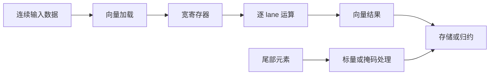
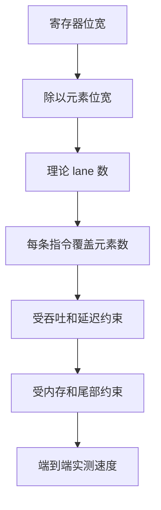
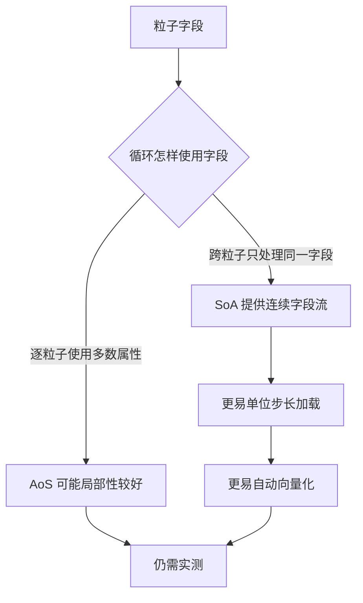
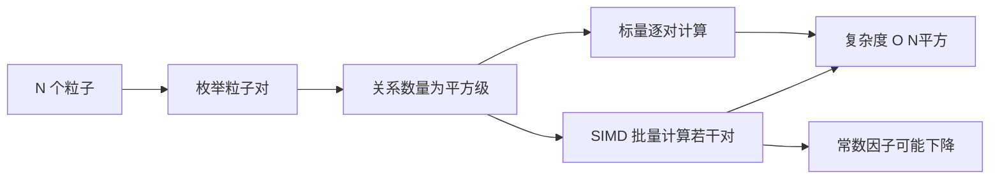
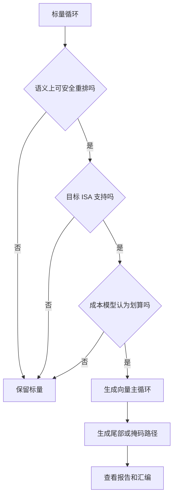
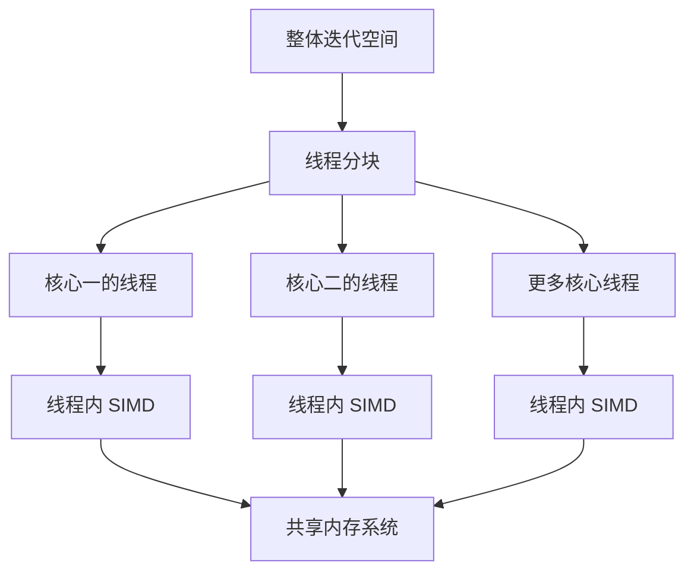

# 总结稿

[打开单页 HTML 总结](assets/bilibili-BV1jeb26qE2u-summary.html)

## 核心摘要

这段视频用一个直接计算所有粒子对作用力的二维引力模拟，解释 SIMD（Single Instruction, Multiple Data）：**让一条指令在多个数据 lane 上执行同类运算**。它提供的是单个指令流内部的数据级并行，不会因为使用向量指令就自动创建更多线程或要求另一个 CPU 核心。AMD 架构手册对 SIMD 的定义与此一致；Microsoft 也明确区分自动向量化和会涉及线程池、同步的自动并行化：[AMD SIMD 指令手册](https://docs.amd.com/api/khub/documents/ioQiNhSqxlMkRaU~IyGQYQ/content)、[Microsoft 自动并行化与自动向量化](https://learn.microsoft.com/en-us/cpp/parallel/auto-parallelization-and-auto-vectorization?view=msvc-170)。

最重要的边界是：**向量宽度是潜在并行度，不是端到端加速倍数**。256 位寄存器确实可以容纳 8 个 32 位浮点数，但加载、存储、除法、平方根、归约、尾部元素、分支、内存带宽和标量代码都会消耗时间。视频没有给出 CPU、编译器、参数、计时、重复次数或正确性误差，因此 demo 只能说明“可以更顺畅”，不能写成便携的 benchmark，更不能从 8 个 lane 推导“必然快 8 倍”。

## 从标量到向量

标量代码一次处理一个元素；向量代码把多个同类型元素打包进宽寄存器，再用对应的打包指令并行计算。x86 中，XMM、YMM、ZMM 分别对应 128、256、512 位寄存器视图。按位宽计算，它们分别可容纳 4、8、16 个 32 位浮点元素。Intel 官方资料确认 AVX 引入 256 位向量处理、AVX2 扩展 256 位整数 SIMD、AVX-512 提供 512/256/128 位向量操作：[Intel 指令集扩展说明](https://www.intel.com/content/www/us/en/support/articles/000005779/processors.html)。

{{frame:0002}}

这张图适合建立“寄存器变宽”的直觉。它没有说明某项运算是否在目标 CPU 上存在，也没有证明宽度翻倍就会让程序同比加速。

{{frame:0004}}

这张图用两个 YMM 输入和一个 YMM 输出展示打包加法的教学模型。实际助记符、元素类型、lane 数和吞吐取决于具体 ISA 子集与处理器。

## 为什么 N-body 仍然是 O(N²)

若每个粒子都与其他粒子计算一次作用，直接 all-pairs 求解需要处理约 `N(N−1)` 个有序关系，或在利用对称性时处理约 `N(N−1)/2` 个无序关系；两者都属于 O(N²)。NVIDIA 的官方开发者出版物也把直接 all-pairs N-body 描述为 O(N²)：[Fast N-Body Simulation with CUDA](https://developer.nvidia.com/gpugems/gpugems3/part-v-physics-simulation/chapter-31-fast-n-body-simulation-cuda)。

SIMD 能降低“每对作用”的周期数和动态指令数，却不减少数学上的粒子对数量。因此它改善的是固定 `N` 下的常数因子，不改变增长阶。若想改变复杂度，需要 Barnes–Hut、快速多极子等算法级变化；本视频没有测试这些算法。

## AoS 与 SoA：让所需字段连续

粒子若按 Array of Structures（AoS）存放，内存通常是：

`x0, y0, vx0, vy0, m0, x1, y1, vx1, vy1, m1 ...`

若某个内循环只连续读取 `x`，相邻 `x` 之间隔着其他字段，可能需要跨步加载、gather 或 shuffle。Structure of Arrays（SoA）则把字段分别存成：

`x0, x1, x2 ...`、`y0, y1, y2 ...`、`m0, m1, m2 ...`

{{frame:0009}}

原帧只展示 AoS；SoA 是用于对照的概念补充。Intel 的向量化指南指出，SoA 可为逐字段循环形成 unit-stride 连续访问，更容易向量化；但 Intel 同时说明 AoS 在一次使用一个对象的大多数字段时具有良好局部性，SoA 也可能增加字段间距离和 TLB 压力：[Vectorization Programming Guidelines](https://www.intel.com/content/www/us/en/docs/dpcpp-cpp-compiler/developer-guide-reference/2023-0/vectorization-programming-guidelines.html)、[Memory Layout Transformations](https://www.intel.com/content/www/us/en/developer/articles/technical/memory-layout-transformations.html)。

所以，“SoA 更快”必须改写为：“**对视频这种逐字段批处理循环，SoA 往往更容易产生连续向量加载；对其他访问模式未必更好**。”AoSoA、分块和热/冷字段拆分也可能是更合适的折中。

## 自动向量化不是保证

现代编译器能够把部分标量循环改写成 SIMD。LLVM 有 Loop Vectorizer 和 SLP Vectorizer，并用合法性检查与目标相关成本模型决定是否向量化、使用多宽向量；GCC 也提供 loop/SLP vectorization 和成本模型；MSVC 根据 `/arch` 目标选择 SSE2、AVX、AVX2 或 Arm NEON：[LLVM Auto-Vectorization](https://llvm.org/docs/Vectorizers.html)、[GCC Optimize Options](https://gcc.gnu.org/onlinedocs/gcc/Optimize-Options.html)、[MSVC Auto-Vectorizer](https://learn.microsoft.com/en-us/cpp/parallel/auto-parallelization-and-auto-vectorization?view=msvc-170)。

{{frame:0010}}

这张图并排展示同一个数组加法循环的标量与 SIMD 汇编形态，适合说明“源代码相似，生成指令可能不同”。但它未给出编译器、版本、优化选项、目标 CPU、别名假设和尾部处理，不能代表所有编译结果。

自动向量化常受以下因素影响：

- 指针别名和循环依赖是否能被证明安全；
- 循环次数、尾部元素与运行时检查成本；
- 分支、函数调用、异常和不支持的数据类型；
- 浮点重排、FMA 与近似倒数/平方根是否允许；
- 目标 ISA 与部署 CPU 是否匹配；
- 编译器成本模型是否判断“值得”。

正确做法是查看 vectorization report 与生成汇编，再用等价且充分优化的标量基线做测量。

## AVX2、AVX-512 与 FMA 的硬件边界

AVX2、AVX-512、FMA 是不同扩展，不是所有 x86-64 处理器的共同基线。是否可用取决于 CPU feature、操作系统扩展状态、编译目标和运行时派发。Intel 将这些扩展分开列出，并为支持处理器提供查询入口：[Intel 指令集扩展说明](https://www.intel.com/content/www/us/en/support/articles/000005779/processors.html)。

即便 CPU 支持 FMA，编译器也不一定生成 FMA；表达式形式、浮点语义和编译选项都会影响选择。FMA 还会把乘加合并为一次舍入，可能让数值结果与分离的乘法、加法略有不同。视频没有提供真实汇编，因此不能断言 demo 使用了 FMA、AVX2 或 AVX-512。

## SIMD 与多线程可以叠加

线程级并行可把循环迭代分配到多个核心；每个线程内部还可以使用 SIMD。Intel OpenMP 文档明确提供 `parallel for simd`、`for simd` 等组合结构：[OpenMP Pragmas](https://www.intel.com/content/www/us/en/docs/dpcpp-cpp-compiler/developer-guide-reference/2023-0/openmp-pragmas.html)。

但“核心数 × lane 数”只是理想化并行宽度，不是实测倍数。实际收益会受到串行部分、负载不均、同步、共享缓存、NUMA、内存带宽、归约、尾部和向量频率影响。线程与 SIMD 也可能竞争同一内存系统。

## 如何验证自己的 SIMD 优化

1. 固定 CPU、操作系统、编译器版本和完整编译参数。
2. 记录目标 ISA，以及运行时实际采用的代码路径。
3. 检查编译器向量化报告和最终汇编。
4. 将算法变化、数据布局变化、SIMD 与多线程分别做消融测试。
5. 使用同等优化的标量基线，并多次测量中位数与分布。
6. 分离计算、渲染、碰撞处理和数据转换时间。
7. 记录粒子数、时间步、预热、线程亲和性和硬件频率。
8. 检查数值误差：归约顺序、FMA、近似平方根和长期轨迹都可能改变结果。

## 观众反馈与样本限制

观众材料只应作为理解提示。本次评论接口总量为 35 条，实际获取 16 条，候选评论 16 条；弹幕 7 条。样本覆盖有限，弹幕尤其稀疏，不能计算稳定的情绪比例、判断“观众普遍认为 SIMD 有多快”或形成可靠热点。任何性能结论仍应回到硬件、编译器、代码和可复现实验。

## 最值得带走的结论

SIMD 的真正价值不是“神奇地增加核心”，而是让**同一核心的一条指令处理多个同类元素**。它最需要的通常不是一条炫目的 intrinsic，而是可批处理的算法、连续的数据布局、编译器能证明安全的循环，以及严格的测量。先区分 lane 宽度、指令吞吐与端到端速度，再谈优化结果。

# 辅助理解

## 理解框架

这份理解稿把视频拆成四个层次：算法要处理多少关系、数据怎样排列、指令一次覆盖多少元素、工作怎样分配到核心。只有把四层分开，才不会把“8 个 float lane”误写成“程序必然快 8 倍”。

## 图一：从内存到 SIMD 结果

宽寄存器只是中间容器。输入若不连续，或结果需要横向归约，加载与整理成本可能抵消部分并行收益。

## 图二：宽度、lane 与性能不是同一个量

256 位除以 32 位得到 8 个 float lane，这是容量事实；从 8 lane 到实际速度之间还隔着整个执行与内存系统。LLVM 的成本模型甚至可能选择宽度 1，即不向量化：[LLVM Vectorizers](https://llvm.org/docs/Vectorizers.html)。

## 图三：AoS 与 SoA 的访问差异

Intel 文档明确指出，SoA 可减少 gather/scatter，但会牺牲不同字段间的局部性；数据访问模式决定布局选择：[Memory Layout Transformations](https://www.intel.com/content/www/us/en/developer/articles/technical/memory-layout-transformations.html)。

## 图四：复杂度与常数因子

直接 all-pairs 求解的增长阶不会因 SIMD 改变。算法级优化与实现级优化解决的是不同问题。

## 图五：编译器向量化决策

LLVM、GCC 与 MSVC 都能自动向量化，但都受合法性、目标和盈利性约束：[LLVM](https://llvm.org/docs/Vectorizers.html)、[GCC](https://gcc.gnu.org/onlinedocs/gcc/Optimize-Options.html)、[MSVC](https://learn.microsoft.com/en-us/cpp/parallel/auto-parallelization-and-auto-vectorization?view=msvc-170)。

## 图六：线程与 SIMD 两层并行

OpenMP 的 `parallel for simd` 说明两层并行可以组合：[Intel OpenMP Pragmas](https://www.intel.com/content/www/us/en/docs/dpcpp-cpp-compiler/developer-guide-reference/2023-0/openmp-pragmas.html)。但所有线程仍可能竞争缓存、内存带宽与功耗预算。

## 图七：性能结论的证据链

视频只展示定性 demo，没有完整走完这条证据链。因此综合稿不报告加速倍数。

## 一次优化实验应该怎样拆分

| 实验 | 只改变什么 | 回答的问题 |
|---|---|---|
| A | 编译优化等级 | 编译器基础优化贡献多少 |
| B | AoS 改 SoA | 数据布局本身贡献多少 |
| C | 允许或禁止向量化 | SIMD 贡献多少 |
| D | 线程数 | 多核并行贡献多少 |
| E | SIMD 加线程 | 两层组合是否受带宽限制 |
| F | 精确与近似数学 | 性能换来了多少数值误差 |

若同时改变算法、布局、编译参数和线程数，就无法把速度变化归因于 SIMD。

## 汇编检查清单

- 是否真的出现目标宽度的向量加载、运算与存储？
- 是否有大量 gather、shuffle、广播或标量插入？
- 尾部循环怎样处理？是否有运行时别名检查？
- 平方根、除法和归约是否仍是瓶颈？
- 是否生成 FMA；浮点重排是否符合正确性要求？
- 二进制是否包含不同 ISA 的运行时派发路径？
- 目标机器是否实际支持该扩展？

## 常见误区

1. **把 lane 数当加速倍数**：lane 只描述一次可容纳的元素数。
2. **把 SIMD 当多线程**：SIMD 不会自己创建线程。
3. **把 SoA 当万能布局**：是否更好取决于字段访问模式。
4. **看到循环就假定自动向量化**：必须看编译器报告和汇编。
5. **把视觉流畅当 benchmark**：渲染、碰撞和录屏都会混入结果。
6. **把 AVX-512 当 x86-64 标配**：ISA 支持依 CPU、OS 和编译目标。
7. **把实现优化当算法优化**：SIMD 不会改变 O(N²)。

## 观众材料边界

本次接口总量为 35 条评论，实际获取 16 条，候选评论 16 条；弹幕 7 条。有限反馈可以提示读者关注“为什么更快”“编译器能否自动做”，但不足以建立情绪比例、性能共识或热点。技术结论必须依赖架构文档、编译器输出和可复现实验。

## 最终理解

SIMD 优化是一条完整链路：**算法暴露同构工作 → 数据布局提供连续输入 → ISA 提供合适向量操作 → 编译器或程序员生成正确代码 → 基准验证真实收益与误差**。链路中任何一环不足，都可能让理论 lane 宽度无法转化为实际性能。

## 外部事实核验

### 声明 1（00:33）

- 视频陈述：视频把 SIMD 描述为单核、单线程内部的数据级并行。
- 核验状态：已确认
- 核验结果：confirmed。AMD 的架构手册将 SIMD 定义为同一数学操作同时作用于多个数据流；Microsoft 也明确区分自动向量化与会产生线程池、同步等开销的自动并行化。执行 SIMD 指令本身不会创建操作系统线程，也不要求第二个核心，但仍占用当前核心的向量寄存器、执行单元、加载/存储、缓存与功耗预算。
- 检索日期：2026-08-20
- 来源：
  - [AMD64 Architecture Programmer’s Manual, Volume 4: 128-Bit, 256-Bit, and 512-Bit Media Instructions](https://docs.amd.com/api/khub/documents/ioQiNhSqxlMkRaU~IyGQYQ/content)（primary）
  - [Auto-Parallelization and Auto-Vectorization | Microsoft Learn](https://learn.microsoft.com/en-us/cpp/parallel/auto-parallelization-and-auto-vectorization?view=msvc-170)（primary）

### 声明 2（04:30）

- 视频陈述：视频用寄存器宽度和 lane 数解释 SSE、AVX/AVX2 与 AVX-512。
- 核验状态：已确认
- 核验结果：confirmed，但要区分寄存器容量与指令集能力。Intel 官方资料说明 AVX 引入 256 位向量处理、AVX2 扩展 256 位整数 SIMD、AVX-512 提供 512/256/128 位向量操作；Intel AVX-512 文档明确 512 位可打包 16 个单精度浮点数。AMD 手册说明 XMM 是 YMM 低 128 位的重叠视图，YMM 支持 256 位。按位宽除以 32，可得 128/256/512 位分别容纳 4/8/16 个 32 位元素。Arm 的 ACLE 也确认 128 位 Neon 向量可容纳 4 个 32 位元素，说明 lane 数是宽度与元素大小的算术关系，而非 x86 独有。
- 检索日期：2026-08-20
- 来源：
  - [Intel® Instruction Set Extensions Technology](https://www.intel.com/content/www/us/en/support/articles/000005779/processors.html)（primary）
  - [Intel® AVX-512 Instructions](https://www.intel.com/content/www/us/en/developer/articles/technical/intel-avx-512-instructions.html)（primary）
  - [AMD64 Architecture Programmer’s Manual, Volume 4](https://www.amd.com/content/dam/amd/en/documents/processor-tech-docs/programmer-references/26568.pdf)（primary）
  - [Arm C Language Extensions — Advanced SIMD (Neon) intrinsics](https://arm-software.github.io/acle/main/acle.html#advanced-simd-neon-intrinsics)（primary）

### 声明 3（06:45）

- 视频陈述：视频以 8 个 float lane 说明 AVX/AVX2 的潜在并行宽度。
- 核验状态：已确认
- 核验结果：confirmed for capacity；256÷32=8，且 AVX 提供 256 位浮点向量处理。但“8 个 lane”不是“端到端必然快 8 倍”：LLVM 的向量器会通过目标相关成本模型选择宽度，甚至在不划算时选择不向量化；加载、存储、除法/平方根、归约、尾部处理、分支、内存带宽和标量部分都会降低实际收益。
- 检索日期：2026-08-20
- 来源：
  - [Intel® Instruction Set Extensions Technology](https://www.intel.com/content/www/us/en/support/articles/000005779/processors.html)（primary）
  - [Auto-Vectorization in LLVM](https://llvm.org/docs/Vectorizers.html)（primary）
  - [LLVM Vectorization Plan](https://llvm.org/docs/VectorizationPlan.html)（primary）

### 声明 4（13:19）

- 视频陈述：视频把粒子结构从 AoS 改为 SoA，以便连续载入多个 x、y、质量等字段。
- 核验状态：已确认
- 核验结果：confirmed with qualification。Intel 的向量化指南指出，SoA 让同一字段形成 unit-stride 连续访问，通常更适合向量化；其内存布局文档也说明 AoS→SoA 可减少 gather/scatter。但 Intel 同时明确：AoS 在一次使用单个对象多数或全部字段时具有良好局部性，SoA 会降低不同字段间的局部性并可能增加 TLB 压力，AoSoA 有时更合适。因此这是取决于访问模式的优化，不是“所有程序 SoA 都更快”。
- 检索日期：2026-08-20
- 来源：
  - [Vectorization Programming Guidelines](https://www.intel.com/content/www/us/en/docs/dpcpp-cpp-compiler/developer-guide-reference/2023-0/vectorization-programming-guidelines.html)（primary）
  - [Memory Layout Transformations](https://www.intel.com/content/www/us/en/developer/articles/technical/memory-layout-transformations.html)（primary）

### 声明 5（15:33）

- 视频陈述：视频展示了 AVX 风格向量指令，并讨论编译器生成 SIMD。
- 核验状态：已确认
- 核验结果：confirmed。Intel 将 AVX、AVX2 和 AVX-512分别列为不同扩展，并提供各自支持的处理器列表；Microsoft 文档说明自动向量器根据 `/arch` 目标选择 SSE2、AVX、AVX2 或 Arm NEON，并可用运行时检查守护较新的指令。AMD 手册也把 AVX、AVX2、AVX-512、FMA 列为独立扩展。FMA 是否生成还受表达式、浮点语义和编译选项影响，视频画面不足以证明示例实际用了 FMA。
- 检索日期：2026-08-20
- 来源：
  - [Intel® Instruction Set Extensions Technology](https://www.intel.com/content/www/us/en/support/articles/000005779/processors.html)（primary）
  - [Auto-Parallelization and Auto-Vectorization | Microsoft Learn](https://learn.microsoft.com/en-us/cpp/parallel/auto-parallelization-and-auto-vectorization?view=msvc-170)（primary）
  - [AMD64 Architecture Programmer’s Manual, Volume 4](https://docs.amd.com/api/khub/documents/ioQiNhSqxlMkRaU~IyGQYQ/content)（primary）

### 声明 6（16:05）

- 视频陈述：视频明确区分“同时算更多 pair”与“减少 pair 数量”。
- 核验状态：已确认
- 核验结果：confirmed。NVIDIA 官方开发者出版物把 all-pairs N-body 描述为计算 N×N 的成对作用网格，复杂度为 O(N²)。将多个 pair 打包进一条 SIMD 指令可以减少每对相互作用的周期数和动态指令数，但数学上仍需处理 Θ(N²) 个关系；对称复用只改变常数。
- 检索日期：2026-08-20
- 来源：
  - [Fast N-Body Simulation with CUDA | NVIDIA Developer](https://developer.nvidia.com/gpugems/gpugems3/part-v-physics-simulation/chapter-31-fast-n-body-simulation-cuda)（secondary）

### 声明 7（16:55）

- 视频陈述：视频称编译器在很多情况下会自动把循环改写为 SIMD。
- 核验状态：已确认
- 核验结果：confirmed。LLVM 有 Loop Vectorizer 与 SLP Vectorizer，并通过合法性检查和目标相关成本模型决定是否以及以多宽向量化；其诊断选项可报告成功、失败与原因。GCC 提供 loop/SLP vectorization 和不同成本模型；MSVC 的 Auto-Vectorizer 根据目标 ISA 发出 SSE2/AVX/AVX2/NEON。别名、控制流、调用、数据类型、浮点规则、trip count、目标 ISA 与盈利性均可能阻止向量化。
- 检索日期：2026-08-20
- 来源：
  - [Auto-Vectorization in LLVM](https://llvm.org/docs/Vectorizers.html)（primary）
  - [Optimize Options | GCC](https://gcc.gnu.org/onlinedocs/gcc/Optimize-Options.html)（primary）
  - [Auto-Parallelization and Auto-Vectorization | Microsoft Learn](https://learn.microsoft.com/en-us/cpp/parallel/auto-parallelization-and-auto-vectorization?view=msvc-170)（primary）

### 声明 8（17:47）

- 视频陈述：视频把核心数与每核 SIMD lane 视为两层可组合并行性。
- 核验状态：已确认
- 核验结果：confirmed in principle。Intel 的 OpenMP 文档明确 `parallel for simd`/`for simd` 可把循环迭代分配到多个线程，同时让每个线程并发执行 SIMD 迭代；其 SIMD-enabled function 文档也明确描述多核并行和向量 ISA 并行可以同时使用。实际收益仍受线程调度、负载均衡、同步、缓存/NUMA、内存带宽、功耗与向量频率影响。
- 检索日期：2026-08-20
- 来源：
  - [OpenMP* Pragmas | Intel oneAPI DPC++/C++ Compiler](https://www.intel.com/content/www/us/en/docs/dpcpp-cpp-compiler/developer-guide-reference/2023-0/openmp-pragmas.html)（primary）
  - [SIMD-Enabled Functions | Intel oneAPI DPC++/C++ Compiler](https://www.intel.com/content/www/us/en/docs/dpcpp-cpp-compiler/developer-guide-reference/2025-2/simd-enabled-functions.html)（primary）

### 声明 9（18:17）

- 视频陈述：视频用核心数量乘以每个向量可处理的元素数，说明理论上可同时推进的计算数量。
- 核验状态：已确认
- 核验结果：confirmed only as an upper-bound intuition。Intel OpenMP 文档证明线程级与 SIMD 级并行能够组合；LLVM/GCC 文档同时显示向量化是否盈利需要成本模型判断，宽度甚至可能选择为 1。串行部分、同步、负载不均、尾部、内存带宽、指令吞吐、归约、核心共享资源及频率变化都会使实际速度低于简单乘积。
- 检索日期：2026-08-20
- 来源：
  - [OpenMP* Pragmas | Intel oneAPI DPC++/C++ Compiler](https://www.intel.com/content/www/us/en/docs/dpcpp-cpp-compiler/developer-guide-reference/2023-0/openmp-pragmas.html)（primary）
  - [Auto-Vectorization in LLVM](https://llvm.org/docs/Vectorizers.html)（primary）
  - [Optimize Options | GCC](https://gcc.gnu.org/onlinedocs/gcc/Optimize-Options.html)（primary）

# Data

## 增强转写稿

# Corrected Transcript

- Video ID: `BV1jeb26qE2u`
- Domain: CPU SIMD/vectorization, memory layout, cache behavior, compiler optimization, and N-body gravity simulation
- Editorial rule: all timestamp tokens and source-line order are preserved. Only high-confidence ASR terminology, proper names, arithmetic words, and clearly corrupted technical phrases were corrected.
- Evidence boundary: the transcript explains a qualitative optimization model and a video demonstration. It does not by itself establish a portable speedup across CPUs, compilers, data sets, or builds.

## Terminology

- **SIMD** — single instruction, multiple data; vector lanes execute the same operation per instruction.
- **SSE / AVX / AVX2 / AVX-512** — x86 SIMD instruction-set families with different widths and capabilities. Availability depends on the CPU, operating system state, compiler target, and instruction subset.
- **XMM / YMM / ZMM** — 128-bit, 256-bit, and 512-bit architectural vector-register names in relevant x86 extensions.
- **vectorization** — transforming scalar work into vector operations; may be explicit (intrinsics/assembly) or compiler auto-vectorization.
- **AoS / SoA** — array of structures versus structure of arrays. SoA often makes one field across many elements contiguous; neither layout is universally faster.
- **cache line** — the block transferred between memory hierarchy levels; line size is implementation-specific, commonly 64 bytes on many modern CPUs but not universal.
- **alignment** — an address relationship to a byte boundary. Its performance and correctness impact depends on ISA, instruction, CPU generation, and compiler.
- **FMA** — fused multiply-add; can improve throughput/accuracy for suitable expressions but may change floating-point rounding relative to separate multiply and add.
- **compiler auto-vectorization** — compiler optimization that requires appropriate flags, legality proof, profitable cost modeling, and compatible code/data layout.
- **O(N²)** — asymptotic complexity of the all-pairs interaction used in the demo. SIMD reduces work per interaction but does not change the number of pairs.

## Transcript
[00:00] 我这里有一个很简单的重力模拟器
[00:03] 它让我能创建一团初始条件各异的粒子
[00:06] 然后观察系统在重力作用下如何演化
[00:09] 我们通常认为计算机很擅长模拟
[00:12] 但事实上,它们的性能很大程度上取决于我们使用的算法
[00:17] 比如这里,我增加初始粒子数量时
[00:20] 程序渲染就开始卡顿了
[00:22] 这是因为我的算法计算了所有粒子两两之间的影响
[00:26] 所以它的时间复杂度是O(N²)
[00:29] 现在,有很多方法可以加速这个计算
[00:33] 但在这个视频里,我要讲的是一种叫做SIMD的硬件特性
[00:38] 它能让我们并行执行某些任务
[00:40] 而不需要额外的线程或处理器核心
[00:43] Hi,朋友们,我是乔治,这里是Core Dumped
[00:48] 当我们想让计算机执行数学运算
[00:51] 比如加法时,我们会把它写成一行代码
[00:54] 但正如我之前说过很多次的,处理器可能需要执行多条指令才能完成这个操作
[01:00] 通常，计算机做算术运算时，会用到一组通用寄存器
[01:05] 它们的大小通常和架构有关
[01:07] 16 位处理器通常有 16 位通用寄存器
[01:11] 32 位处理器有 32 位通用寄存器，以此类推
[01:16] 这些计算器的大小决定了处理器一次能方便的处理多少位
[01:21] 例如,32位系统通常不能在一个基本操作里直接完成两个64位数的相加
[01:28] 相反,它必须把它们分成更小的块来处理
[01:32] 通常一次处理32位,这就需要多个步骤
[01:35] 今天我们要探讨的差不多是相反的想法
[01:40] 现代处理器还有另一种计算器,叫做向量寄存器
[01:45] 这些计算器比通用寄存器宽的多
[01:48] 它们不是把这些位都用来表示一个巨大的数
[01:52] 而是可以同时存放和操作多个较小的数
[01:55] 这基本上就是SIMD背后的思想
[01:59] SIMD代表单指令多数据
[02:02] 它依赖于宽的向量寄存器,其内容可以看成多个较小的独立元素
[02:07] 通常称为通道
[02:09] 所以我们可以自由决定如何解释这些巨大计算器中的信息
[02:14] 然后一条指令可以同时对所有这些通道执行相同的操作
[02:19] 例如一个128位的向量寄存器
[02:23] 可以存放4个32位的数值,8个16位的数值,或者16个8位的数值
[02:29] 仔细想想,这非常有用,因为它本质上是一种并行方式
[02:34] 不需要我们创建额外的线程,也不必依赖额外的处理核心
[02:38] 这种将多个数值打包到一个向量寄存器中
[02:42] 并对所有数值执行相同操作的方式通常称为打包操作
[02:47] 然而，SIMD 有一个主要限制
[02:51] 我们可以把数据划分成多个通道,但SIMD指令执行的操作通常对每个通道都一样
[02:58] 所以才叫单指令,多数据
[03:01] 注意,我不是说SIMD只能执行一种操作
[03:05] 不同的操作可以一个接一个的执行
[03:08] 限制在于每条指令会同时对所有通道执行相同的操作
[03:14] 你看,在这种抽象层次上,CPU指令应该描述相对简单的操作
[03:20] 就像告诉CPU,把这两个数加起来很简单一样
[03:24] 让它把所有这些成对的数加起来也比较简单
[03:29] 但让它在一个通道做加法,另一个通道做乘法,再下一个做除法,再下一个做减法
[03:36] 就是个截然不同的问题了
[03:39] 只有4种操作和4个通道就已经有4的4次方,也就是256种不同的操作组合
[03:46] 如果有32条通道,就会有4的32次方中可能组合,而这还只考虑了加减乘除
[03:54] 实际的处理器,支持的操作要多得多
[03:57] 这并不是说在物理上造不出让不同通道执行不同操作的硬件
[04:02] 问题在于,这样做需要更复杂的指令编码和控制硬件
[04:06] 同时也会丧失让SIMD高效的根本简洁性
[04:10] 所以,SIMD硬件的设计理念就是,我们有很多不同的数据需要执行相同的操作
[04:17] 现在你可能会想,CPU怎么知道应该如何解读向量寄存器呢?
[04:22] 它怎么知道应该把向量寄存器分成多少个通道呢?
[04:27] 不出所料,这个信息就来自指令本身
[04:30] 编码格式取决于架构，我们来看看 x86-64 SIMD 指令是怎么工作的
[04:37] 在 AVX 指令集中，很多向量指令助记符以 V 开头
[04:41] 表示我们正在执行向量打包运算
[04:44] 向量寄存器的名字能提示宽度：XMM 寄存器
[04:50] 宽 128 位，YMM 宽 256 位，ZMM 宽 512 位
[04:56] 然后指令本身会告诉处理器,寄存器里的内容该怎么解释
[05:01] 在汇编语言里，指令会带一个后缀
[05:04] 比如,在整数运算中,B表示字节,也就是8位整数
[05:09] W表示字,也就是16位整数
[05:13] D表示双字,也就是32位整数
[05:16] 而 Q 表示四字（quadword），也就是 64 位整数
[05:20] 而 PS 和 PD 分别表示打包单精度和打包双精度浮点数
[05:23] 所以寄存器告诉CPU,我们要处理多少位
[05:27] 指令则告诉它,这些位该怎么解释
[05:30] 根据这两点信息,就能确定通道数量
[05:34] 不过,还有一点很重要
[05:36] 并不是每种数据类型都支持所有操作
[05:40] 例如，x86-64 架构针对多种整数宽度提供了打包乘法指令
[05:46] 但没有提供直接的8位打包乘法指令
[05:49] 这是因为8位整数相乘,很容易溢出
[05:53] 当需要将 8 位整数相乘时，通常先将其扩展
[05:57] 然后使用更宽的通道进行乘法运算
[06:01] 对于除法,情况有些不同
[06:04] 整数除法在硬件中相对复杂且速度较慢
[06:08] 为了高效处理多个 SIMD 通道，复制足够多的整数除法器
[06:13] 会占用大量芯片面积，但除法运算远不如加减乘法常用
[06:18] 因此，x86 SIMD 的打包除法主要针对浮点数实现
[06:24] 在进入模拟示例之前,我需要先说明另一件事
[06:28] 正如我刚才所说,在展示模拟演示之前,还有一点需要先说明一下
[06:34] 每当我们在寄存器中对数据进行操作时,这些数据通常需要先从内存加载
[06:40] 当然,向量寄存器也有从内存加载大块数据的指令
[06:45] 例如，一条 256 位加载指令可以从内存中读取连续的 256 位到 YMM 寄存器中
[06:54] 如果我们需要的所有值在内存中紧挨着,这种方法效果非常好
[06:59] 但这带来一个重要的局限,如果他们不挨着呢?
[07:05] 如果我们需要的值分散在内存各处,一次简单的连续向量加载就无法一次性把他们全部加载进来
[07:13] 有办法可以绕过这一点,我们可以进行多次加载,然后用混洗指令重新排列数据
[07:20] 或者，在支持的指令集上，我们可以使用所谓的 gather（收集）指令
[07:24] 它可以从多个内存位置收集直到一个向量寄存器中
[07:29] 但这些方法需要额外的开销,可能抵消并行运算带来的部分性能提升
[07:34] 所以,在使用SIMD提升性能时,数据在内存中的布局至关重要
[07:40] 这就回到了我们的重力模拟
[07:43] 为了教学,我选择了一种最简单但也最低效的方法,计算所有粒子两两之间的相互作用
[07:51] 你可能听说过,引力是由质量产生的
[07:55] 让我们来看两个粒子,我们叫他们II和J
[07:59] 他们的质量使他们之间产生了引力
[08:02] 根据牛顿万有引力定律，这个引力的大小与它们质量的乘积成正比，与它们距离的平方成反比
[08:09] 再乘以引力常数G
[08:13] 现在,既然我们要确定每个粒子随时间变化的位置,我们真正关心的是引力如何使每个粒子加速
[08:20] 根据牛顿第二定律,力等于质量乘以加速度
[08:24] 将其与引力方程结合，我们会发现粒子 J 对粒子 I 产生的加速度与 J 的质量成正比，与它们距离的平方成反比
[08:34] 换句话说,J的质量越大,它对I产生的加速度就越大
[08:39] 但随着他们之间的距离增大,这个加速度迅速减小
[08:44] 而且由于我们处理的是二维问题,加速度不只是一个数值
[08:49] 它是一个向量
[08:52] 它有水平分量和垂直分量
[08:57] 一旦我们知道了这个加速度,就可以在一个小时间步内用它来更新粒子的速度
[09:02] 然后更新它在两个轴上的位置
[09:05] 这样我们就知道更新屏幕时该把粒子画在哪里
[09:10] 当然,我们还需要确定I产生的引力如何影响J
[09:15] 很简单,对吧
[09:17] 当我们增加粒子数量时,事情就变得更有趣了
[09:22] 粒子I不再只收另一个粒子的影响
[09:26] 它受到系统中所有其他粒子的引力影响
[09:29] 每个粒子都以不同的大小和方向加速它
[09:33] 一个粒子不能同时独立的遵循所有这些加速度
[09:37] 但由于加速度是一个向量
[09:39] 我们只需将所有这些加速度向量相加,得到粒子的合加速度
[09:44] 如果粒子最初是静止的,这个加速度会使它开始朝那个方向移动
[09:49] 如果它已经在运动,它的速度会根据那个加速度改变
[09:54] 所以模拟要做的就是计算每个粒子受到系统中其他所有粒子作用产生的合加速度
[10:00] 一旦计算出这些加速度,我们就更新每个粒子的速度和位置
[10:05] 所有粒子位置更新完后,整个过程就重新开始
[10:09] 因为粒子移动了,它们之间的距离也就变了
[10:13] 这意味着引力作用变了
[10:15] 之前算出的加速度向量不再有效,需要重新计算
[10:20] 为了让我们觉得这是流畅的引力运动,整个过程必须非常快
[10:25] 当然,为了增加趣味,模拟还会检测碰撞并合并粒子,形成更大质量的物体
[10:31] 让小物体开始绕它们转
[10:34] 我不会细讲那部分的工作原理,因为不是本视频的重点
[10:37] 但我会在简介里留个链接,方便你试玩代码
[10:42] 正如我在开头提到的,问题在于粒子数量高到一定程度后
[10:47] 我的电脑就无法足够快地完成这些计算,让模拟实时流畅运行了
[10:52] 所以我们现在的目标是用SIMD指令来加速
[10:57] 任意时刻,粒子都有水平和垂直位置,水平和垂直速度,以及质量
[11:05] 仔细观察引力计算,在计算另一个粒子产生的加速度之前
[11:09] 我们首先需要确定它们之间的距离
[11:12] 而要计算这个距离,我们需要它们水平和垂直方向上的距离差
[11:17] 幸运的是,计算这些数值非常简单
[11:21] 这里希望大家注意的是,要得到这些数值需要多少算数运算
[11:27] 首先,做一次减法算出水平差,再做一次减法算出垂直差
[11:32] 我们需要两次乘法对这两个差值平方，一次加法把两个平方相加
[11:37] 最后开平方得到距离
[11:40] 光是确定一对粒子之间的距离,就需要6次算数运算,更不用说计算加速度了
[11:46] 记住,每一次相互作用,都要重复这些步骤,以及后续所有步骤
[11:52] 如果有N个粒子,每个粒子都要考虑其他N减一个粒子
[11:58] 而这正是SIMD真正有趣的地方
[12:01] 我不想重新设计模拟,只想让它跑得更快
[12:05] 与其一次,只算粒子i和粒子j的水平距离,不如同时计算粒子i与多个其他粒子的水平距离
[12:14] 如果位置用 32 位单精度浮点数存储，一个 256 位向量寄存器一次能存 8 个位置
[12:22] 所以,我们可以把粒子i的x坐标,复制到一个向量寄存器的8个通道里
[12:27] 再把另外8个粒子的x坐标,载入另一个寄存器,然后相减
[12:32] 一次 SIMD 减法同时算出 8 个水平距离差
[12:38] 只有一个问题,但我们的数据在内存中的排列方式可能不便于这样操作
[12:45] 如果我写一个模拟粒子的程序,最自然的表示方式可能就像这样
[12:50] 一个粒子就是一个结构体,包含x坐标,y坐标,x速度,y速度和质量
[12:58] 而整个系统就是这些粒子结构体组成的数组
[13:03] 从编程角度看,这完全合理
[13:06] 属于同一个粒子的所有数据都存放在一起
[13:10] 问题在于,我们需要操作的值散布在内存各处
[13:14] 如果我要获取8个不同粒子的x坐标,这些值在内存中并不相邻
[13:19] 而对于 SIMD，我们需要的正好相反：多个粒子的同一属性应该连续存放
[13:25] 所以这种分散既不利于加载数据到向量寄存器，也不利于缓存效率
[13:31] 因为现代CPU通常不会只从内存中取我们请求的那一个值
[13:35] 相反,CPU会把内存中临近的一大块区域,也就是所谓的缓存行,加载到CPU缓存中
[13:43] 使用结构体数组时,如果我们只需要x坐标,缓存行还会顺带加载 y坐标,速度和质量
[13:51] 所以大量加载进来的数据对当前操作毫无用处
[13:56] 而且由于每个缓存行中能容纳的我们实际需要的值更少
[14:00] CPU就可能需要更频繁的从内存中获取新的缓存行,就为了收集那些分散的x坐标
[14:07] 解决办法有点不那么优雅：不采用结构体数组（AoS），而是采用数组结构体（SoA）
[14:14] 现在,我们有一个数组存所有x坐标,一个存所有y坐标,一个存所有x方向速度
[14:21] 一个存所有y方向速度,还有一个存所有质量
[14:26] 现在,一个粒子的各个属性在内存中是分开的,但多个粒子的同一属性却是连续存储的
[14:33] 这正是我们需要的，无论对 SIMD 还是缓存效率而言都是如此
[14:38] 我们真正需要的数据能更多的放进同一个缓存行,而且由于这些数据在内存中是连续的
[14:45] 它们也能更高效地直接加载进向量寄存器
[14:50] 现在,处理器可以用一次连续向量加载读取8个x坐标,并同时处理它们
[14:57] 在这个,只考虑9个粒子的粒子中,粒子i与另外8个粒子相互作用
[15:03] 当我们使用32位浮点数时,这恰好能完美地放入一个256位向量中
[15:09] 所以,一旦加载完成,这8个水平差值,就可以用一次向量减法全部算出
[15:16] 如果粒子数增加到数百或数千,它们就无法放进单个向量寄存器了
[15:21] 但这并不是问题,我们只需分批处理它们
[15:25] 8个一组,一组,接一组的处理
[15:29] 这仍然比逐一处理每一次相互作用要好得多
[15:33] 得到所有水平差值后,可以用另一次向量减法算出8个垂直差值
[15:43] 如果需要多步算术运算才能算出某个值，中间结果可以存在内存数组中
[15:48] 或者尽量保留在向量寄存器里继续计算
[15:51] 这样后续操作,也能并行处理这8个相互作用
[15:55] 如果我们用这种方法,尽可能地将引力相互作用计算并行化
[16:00] 一直到粒子位置的更新计算,我们就能做到这一点
[16:05] 同样，相互作用的计算方式仍然完全相同，复杂度仍然是 O(N²)
[16:12] 我们并没有减少模拟必须完成的工作量,只是更充分地利用硬件,让这些工作完成得更快
[16:19] 如果我们进一步增加粒子数量,即使是SIMD版本也开始变得吃力
[16:26] 我觉得SIMD有个奇怪的地方,指令本身其实非常简单直观就像我们在视频前面看到的那样
[16:33] 难点在于重构算法和它的数据,让这些指令能真正被高效地利用起来
[16:38] 有时这意味着要改变一些根本性的东西,比如数据在内存中的布局
[16:44] 原本写法看起来非常自然的算法,可能得用稍微别扭的方式重新组织
[16:50] 这样在运行时,我们希望一起处理的值,才能存储在一起
[16:55] 好消息是,我们并不总是需要亲自动手写SIMD专用代码
[17:00] 现代编译器的优化技术很擅长识别那些可以用 SIMD 执行的常见模式
[17:07] 这个过程就叫编译器自动向量化
[17:11] 编译器不必生成一次,只处理一个值的标量指令,而是能自动生成一次,处理多个值的向量指令
[17:19] 当然,前提是启用了优化并且代码结构支持向量化
[17:24] 有几种常见模式,编译器尤其擅长识别并自动向量化
[17:30] 可惜这个视频已经挺长了,所以我没法在这里逐一讲解
[17:35] 如果你们想要一个单独的视频,介绍编译器如何识别这些模式,把普通代码转换为SIMD指令,请在评论里告诉我
[17:47] 最后还有一件事我想提一下就是在讨论SIMD指令时常被忽略的一点
[17:52] 现代CPU并不只有一个执行核心,它们有多个能并行运行代码的核心,并且每个核心都有自己独立的向量执行资源
[18:03] 所以 SIMD 和多线程并不是互相竞争的并行方式，实际上我们可以同时使用它们
[18:09] 不同线程可运行在不同核心上,同时每个核心也在执行SIMD指令
[18:17] 这带来了两个层次的并行,多个核心并行执行不同工作,每个核心内部多个SIMD通道,同时处理多个数值
[18:27] 在非常理想的情况下，可用并行度大致与核心数量和 SIMD 通道数量的乘积成比例，但真正达到接近这种性能提升要困难得多
[18:38] 一旦设计多线程,我们就不只需要考虑数据,在内存中的组织方式了
[18:44] 我们还要考虑工作如何在线程之间分配,而且每当线程需要相互协调时,部分理论并行性就会损失
[18:52] 因此,虽然结合多线程和SIMD可能非常强大,但要充分发挥两者优势,需要更精心的算法设计
[19:00] 今天就到这里,如果你喜欢这个视频,或学到了新知识,请点赞,点赞是免费的,这对我帮助很大
[19:10] 下次见

## 原始转写稿

[00:00] 我这里有一个很简单的重力模拟器
[00:03] 它让我能创建一团初始条件各异的粒子
[00:06] 然后观察系统在重力作用下如何演化
[00:09] 我们通常认为计算机很擅长模拟
[00:12] 但事实上,它们的性能很大程度上取决于我们使用的算法
[00:17] 比如这里,我增加初始粒子数量时
[00:20] 程序渲染就开始卡顿了
[00:22] 这是因为我的算法计算了所有粒子两两之间的影响
[00:26] 所以它的时间复杂度是On平方
[00:29] 现在,有很多方法可以加速这个计算
[00:33] 但在这个视频里,我要讲的是一种叫做CMD的硬件特性
[00:38] 它能让我们并行执行某些任务
[00:40] 而不需要额外的现成或处理器核心
[00:43] Hi,朋友们,我是乔治,这里是CoreDompt
[00:48] 当我们想让计算机执行数学运算
[00:51] 比如加法时,我们会把它写成一行代码
[00:54] 但正如我之前说过很多次的,处理器可能需要执行多条指令才能完成这个操作
[01:00] 通常,计算机做算数运算时,会用到一组通用计算器
[01:05] 它们的大小通常和架构有关
[01:07] 16位处理器通常有16位通用计算器
[01:11] 32位处理器有32位通用计算器,以此类推
[01:16] 这些计算器的大小决定了处理器一次能方便的处理多少位
[01:21] 例如,32位系统通常不能在一个基本操作里直接完成两个64位数的箱夹
[01:28] 相反,它必须把它们分成更小的块来处理
[01:32] 通常一次处理32位,这就需要多个步骤
[01:35] 今天我们要探讨的差不多是相反的想法
[01:40] 现代处理器还有另一种计算器,叫做相量计算器
[01:45] 这些计算器比通用计算器宽的多
[01:48] 它们不是把这些位都用来表示一个巨大的数
[01:52] 而是可以同时存放和操作多个较小的数
[01:55] 这基本上就是SIMD背后的思想
[01:59] SIMD代表单指令多数据
[02:02] 它依赖于宽的相量计算器,其内容可以看成多个较小的独立元素
[02:07] 通常称为通道
[02:09] 所以我们可以自由决定如何解释这些巨大计算器中的信息
[02:14] 然后一条指令可以同时对所有这些通道执行相同的操作
[02:19] 例如一个128位的相量计算器
[02:23] 可以存放4个32位的数值,8个16位的数值,或者16个8位的数值
[02:29] 仔细想想,这非常有用,因为它本质上是一种并行方式
[02:34] 不需要我们创建额外的线程,也不必依赖额外的处理核心
[02:38] 这种将多个数值打包到一个相量计算器中
[02:42] 并对所有数值执行相同操作的方式通常称为打包操作
[02:47] 然而,IMD有一个主要限制
[02:51] 我们可以把数据划分成多个通道,但SIMD指令执行的操作通常对每个通道都一样
[02:58] 所以才叫单指令,多数据
[03:01] 注意,我不是说CMD只能执行一种操作
[03:05] 不同的操作可以一个接一个的执行
[03:08] 限制在于每条指令会同时对所有通道执行相同的操作
[03:14] 你看,在这种抽象层次上,CPU指令应该描述相对简单的操作
[03:20] 就像告诉CPU,把这两个数加起来很简单一样
[03:24] 让它把所有这些成对的数加起来也比较简单
[03:29] 但让它在一个通道做加法,另一个通道做乘法,再下一个做处法,再下一个做减法
[03:36] 就是个截然不同的问题了
[03:39] 只有4种操作和4个通道就已经有4的4次方,也就是256种不同的操作组合
[03:46] 如果有32条通道,就会有4的32次方中可能组合,而这还只考虑了加减乘除
[03:54] 实际的处理器,支持的操作要多得多
[03:57] 这并不是说在物理上造不出让不同通道执行不同操作的硬件
[04:02] 问题在于,这样做需要更复杂的指令编码和控制硬件
[04:06] 同时也会丧失让CMD高效的根本简洁性
[04:10] 所以,3MD硬件的设计理念就是,我们有很多不同的数据需要执行相同的操作
[04:17] 现在你可能会想,CPU怎么知道应该如何解读相量计存器呢?
[04:22] 它怎么知道应该把相量计存器分成多少个通道呢?
[04:27] 不出所料,这个信息就来自指令本身
[04:30] 编码格式取决于架构,我们来看看X86-64CMD指令是怎么工作的
[04:37] 在AVX指令级里,很多相量指令以VP或V开头
[04:41] 表示我们正在执行相量打包运算
[04:44] 相量计存器的名字就能告诉我们,它的宽度XMM计存器
[04:50] 宽128位,MM宽256位,ZMM宽512位
[04:56] 然后指令本身会告诉处理器,计存器里的内容该怎么解释
[05:01] 在会边语言里,指令会带一个后维
[05:04] 比如,在整数运算中,B表示字节,也就是8位整数
[05:09] W表示字,也就是16位整数
[05:13] D表示双字,也就是32位整数
[05:16] 而Q表示4字,也就是64位整数
[05:20] 而PS和PD则用于辅典数
[05:23] 所以计存器告诉CPU,我们要处理多少位
[05:27] 指令则告诉它,这些位该怎么解释
[05:30] 根据这两点信息,就能确定通道数量
[05:34] 不过,还有一点很重要
[05:36] 并不是每种数据类型都支持所有操作
[05:40] 例如,X8664架构,针对多种整数宽度,提供了打包惩罚指令
[05:46] 但没有提供直接的8位打包惩罚指令
[05:49] 这是因为8位整数相乘,很容易溢出
[05:53] 当需要将8位指相乘时,通常先将其扩展
[05:57] 然后使用更宽的通道进行惩罚运算
[06:01] 对于处法,情况有些不同
[06:04] 整数处法在硬件中相对复杂且速度较慢
[06:08] 为了高效处理多个SIMD通道,而复制足够多的整数处法器
[06:13] 会占用大量芯片面积,但处法运算远不如加减乘成用
[06:18] 因此,打包处法紧针对辅典数实现
[06:24] 在进入模拟势力之前,我需要先说明另一件事
[06:28] 正如我刚才所说,在展示模拟演示之前,还有一点需要先说明一下
[06:34] 每当我们在计存器中对数据进行操作时,这些数据通常需要先从内存加载
[06:40] 当然,相量计存器也有从内存加载大块数据的指令
[06:45] 例如,一条256位加载指令可以从内存中读取256个连续的位到YMM计存器中
[06:54] 如果我们需要的所有值在内存中紧挨着,这种方法效果非常好
[06:59] 但这带来一个重要的局限,如果他们不挨着呢?
[07:05] 如果我们需要的值分散在内存各处,一次简单的连续相量加载就无法一次性把他们全部加载进来
[07:13] 有办法可以绕过这一点,我们可以进行多次加载,然后用混袭指令重新排列数据
[07:20] 或者,在支持的指令级上,我们可以使用所谓的收集指令
[07:24] 它可以从多个内存位置收集直到一个相量计存器中
[07:29] 但这些方法需要额外的开销,可能抵消并行运算带来的部分性能提升
[07:34] 所以,在使用SMI提升性能时,数据在内存中的布局至关重要
[07:40] 这就回到了我们的中理模拟
[07:43] 为了教学,我选择了一种最简单但也最低效的方法,计算所有粒子两两之间的相互作用
[07:51] 你可能听说过,引力是由质量产生的
[07:55] 让我们来看两个粒子,我们叫他们II和J
[07:59] 他们的质量使他们之间产生了引力
[08:02] 根据牛顿外有引力定律,这个引力的大小与他们质量的成绩成正比与他们距离的平方成反比
[08:09] 再乘以引力常数G
[08:13] 现在,既然我们要确定每个粒子随时间变化的位置,我们真正关心的是引力如何使每个粒子加速
[08:20] 根据牛顿第二定律,力等于质量乘以加速度
[08:24] 将其与引力方程结合,我们会发现粒子J对粒子I产生的加速度与J的质量成正比与他们距离的平方成反比
[08:34] 换句话说,J的质量越大,它对I产生的加速度就越大
[08:39] 但随着他们之间的距离增大,这个加速度迅速减小
[08:44] 而且由于我们处理的是二维问题,加速度不只是一个数值
[08:49] 它是一个相量
[08:52] 它有水平分量和垂直分量
[08:57] 一旦我们知道了这个加速度,就可以在一个小时间部内用它来更新粒子的速度
[09:02] 然后更新它在两个轴上的位置
[09:05] 这样我们就知道更新屏幕时该把粒子画在哪里
[09:10] 当然,我们还需要确定I产生的引力如何影响J
[09:15] 很简单,对吧
[09:17] 当我们增加粒子数量时,事情就变得更有趣了
[09:22] 粒子I不再只收另一个粒子的影响
[09:26] 它受到系统中所有其他粒子的引力影响
[09:29] 每个粒子都以不同的大小和方向加速它
[09:33] 一个粒子不能同时独立的遵循所有这些加速度
[09:37] 但由于加速度是一个相量
[09:39] 我们只需将所有这些加速度相量相加,得到粒子的合加速度
[09:44] 如果粒子最初是静止的,这个加速度会使它开始朝那个方向移动
[09:49] 如果它已经在运动,它的速度会根据那个加速度改变
[09:54] 所以模拟要做的就是计算每个粒子收到系统中其他所有粒子作用产生的合加速度
[10:00] 一旦计算出这些加速度,我们就更新每个粒子的速度和位置
[10:05] 所有粒子位置更新完后,整个过程就重新开始
[10:09] 因为粒子移动了,它们之间的距离也就变了
[10:13] 这意味着引力作用变了
[10:15] 之前算出的加速度相量不再有效,需要重新计算
[10:20] 为了让我们觉得这是流畅的引力运动,整个过程必须非常快
[10:25] 当然,为了增加趣味,模拟还会检测碰撞并合并粒子,形成更大质量的物体
[10:31] 让小物体开始绕它们转
[10:34] 我不会细讲那部分的工作原理,因为不是本视频的重点
[10:37] 但我会在简介里留个链接,方便你试玩代码
[10:42] 正如我在开头提到的,问题在于粒子数量高到一定程度后
[10:47] 我的电脑就无法足够快地完成这些计算,让模拟实施流畅运行了
[10:52] 所以我们现在的目标是用CMD指令来加速
[10:57] 人意时刻,粒子都有水平和垂直位置,水平和垂直速度,以及质量
[11:05] 仔细观察引力计算,在计算另一个粒子产生的加速度之前
[11:09] 我们首先需要确定它们之间的距离
[11:12] 而要计算这个距离,我们需要它们水平和垂直方向上的距离差
[11:17] 幸运的是,计算这些数值非常简单
[11:21] 这里希望大家注意的是,要得到这些数值需要多少算数运算
[11:27] 首先,做一次减法算出水平差,再做一次减法算出垂直差
[11:32] 我们需要两次惩罚对这两个直球平方,一次加法把两个平方相加
[11:37] 最后开平方得到距离
[11:40] 光是确定一对粒子之间的距离,就需要6次算数运算,更不用说计算加速度了
[11:46] 记住,每一次相互作用,都要重复这些步骤,以及后续所有步骤
[11:52] 如果有N个粒子,每个粒子都要考虑其他N减一个粒子
[11:58] 而这正是CMD真正有趣的地方
[12:01] 我不想重新设计模拟,只想让它跑得更快
[12:05] 与其一次,只算粒子i和粒子j的水平距离,不如同时计算粒子i与多个其他粒子的水平距离
[12:14] 如果位置用32位单经度辅典数存储,一个256位相量计存器,一次能存8个位置
[12:22] 所以,我们可以把粒子i的x坐标,复制到一个相量计存器的8个通道理
[12:27] 再把另外8个粒子的x坐标,载入另一个计存器,然后相见
[12:32] 一次CMD减法,同时算出8个水平距离
[12:38] 只有一个问题,但我们的数据在内存中的排列方式可能不便于这样操作
[12:45] 如果我写一个模拟粒子的程序,最自然的表示方式可能就像这样
[12:50] 一个粒子就是一个结构体,包含x坐标,y坐标,x速度,y速度和质量
[12:58] 而整个系统就是这些粒子结构体组成的数组
[13:03] 从编程角度看,这完全合理
[13:06] 属于同一个粒子的所有数据都存放在一起
[13:10] 问题在于,我们需要操作的值散布在内存各处
[13:14] 如果我要获取8个不同粒子的x坐标,这些值在内存中并不相邻
[13:19] 而对于CMD,我们需要的正好相反,多个粒子的同一属性应该连续存放
[13:25] 所以这种分散既不利于夹载数据到相量计存器,也不利于缓存效率
[13:31] 因为现代CPU通常不会只从内存中取我们请求的那一个值
[13:35] 相反,CPU会把内存中临近的一大块区域,也就是所谓的缓存行,夹载到CPU缓存中
[13:43] 使用结构体数组时,如果我们只需要x坐标,缓存行还会顺带夹载 y坐标,速度和质量
[13:51] 所以大量加载进来的数据对当前操作毫无用处
[13:56] 而且由于每个缓存行中能容纳的我们实际需要的值更少
[14:00] CPU就可能需要更频繁的从内存中获取新的缓存型,就为了收集那些分散的x坐标
[14:07] 解决办法有点不那么优雅,不采用结构体数组,而是采用数组结构体
[14:14] 现在,我们有一个数组存所有x坐标,一个存所有y坐标,一个存所有x方向速度
[14:21] 一个存所有y方向速度,还有一个存所有质量
[14:26] 现在,一个例子的各个属性在内存中是分开的,但多个例子的同一属性却是连续存储的
[14:33] 这正是我们需要的,无论对cmd还是缓存效率而言都是如此
[14:38] 我们真正需要的数据能更多的放进同一个缓存行,而且由于这些数据在内存中是连续的
[14:45] 它们也能更高效地直接加载进香量级存器
[14:50] 现在,处理器可以用一次连续香量加载读取8个x坐标,并同时处理它们
[14:57] 在这个,只考虑9个例子的例子中,例子i与另外8个例子相互作用
[15:03] 当我们使用32位辅典数时,这恰好能完美地放入一个256位香量中
[15:09] 所以,一旦加载完成,这8个水平差值,就可以用一次香量减法全部算出
[15:16] 如果例子数增加到数百或数千,它们就无法放进单个香量级存器了
[15:21] 但这并不是问题,我们只需分批处理它们
[15:25] 8个一组,一组,接一组的处理
[15:29] 这仍然比注意处理每一次相互作用要好得多
[15:33] 得到所有水平差值后,可以用另一次香量减法算出8个垂直差值
[15:43] 如果需要多不算数,才能算出某个值,中间结果可以存在内存的数组中
[15:48] 或者尽量保留在香量级存器里继续计算
[15:51] 这样后续操作,也能并行处理这8个相互作用
[15:55] 如果我们用这种方法,尽可能地将引力相互作用计算并行化
[16:00] 一直到例子位置的更新计算,我们就能做到这一点
[16:05] 同样,相互作用的计算方式仍然完全相同,复杂度仍然是ON平方
[16:12] 我们并没有减少模拟必须完成的工作量,只是更充分地利用硬件,让这些工作完成得更快
[16:19] 如果我们进一步增加例子数量,即使是3MD版本也开始变得吃力
[16:26] 我觉得CMD有个奇怪的地方,指令本身其实非常简单直观就像我们在视频前面看到的那样
[16:33] 难点在于重构算法和它的数据,让这些指令能真正被高效地利用起来
[16:38] 有时这意味着要改变一些根本性的东西,比如数据在内存中的布局
[16:44] 原本写法看起来非常自然的算法,可能得用稍微别扭的方式重新组织
[16:50] 这样在运行时,我们希望一起处理的值,才能存储在一起
[16:55] 好消息是,我们并不总是需要亲自动手写CMD专用代码
[17:00] 现代编译器的优化技术很擅长识别那些可以用CMD执行的常见模式
[17:07] 这个过程就叫自动项量化
[17:11] 编译器不必生成一次,只处理一个值的标辆指令,而是能自动生成一次,处理多个值的项量指令
[17:19] 当然,前提是启用了优化并且代码结构支持项量化
[17:24] 有几种常见模式,编译器尤其擅长识别并自动项量化
[17:30] 可惜这个视频已经挺长了,所以我没法在这里逐一讲解
[17:35] 如果你们想要一个单独的视频,介绍编译器如何识别这些模式,把普通代码转换为CMD指令,请在评论里告诉我
[17:47] 最后还有一件事我想提一下就是在讨论CMD指令时常被忽略的一点
[17:52] 现代CPU并不只有一个执行核心,它们有多个能并行运行代码的核心,并且每个核心都有自己独立的项量执行资源
[18:03] 所以CMD和多线程并不是互相竞争的并行方式,实际上我们可以同时使用它们
[18:09] 不同线程可运行在不同核心上,同时每个核心也在执行SIMD指令
[18:17] 这带来了两个层次的并行,多个核心并行执行不同工作,每个核心内部多个SIMD通道,同时处理多个数值
[18:27] 在非常理想的情况下,可用的并行度大致与核心数量乘以SIMD通道数量乘比例,但真正达到接近那种性能提升要困难得多
[18:38] 一旦设计多线程,我们就不只需要考虑数据,在内存中的组织方式了
[18:44] 我们还要考虑工作如何在线程之间分配,而且每当线程需要相互协调时,部分理论并行性就会损失
[18:52] 因此,虽然结合多线程和SIMD可能非常强大,但要充分发挥两者优势,需要更精心的算法设计
[19:00] 今天就到这里,如果你喜欢这个视频,或学到了新知识,请点赞,点赞是免费的,这对我帮助很大
[19:10] 下次见

## 原始关键帧

### 关键帧 1

### 关键帧 2

### 关键帧 3

### 关键帧 4

### 关键帧 5

### 关键帧 6

### 关键帧 7

### 关键帧 8

### 关键帧 9

### 关键帧 10

## 补充原始数据

- [bilibili-BV1jeb26qE2u-comments.jsonl](assets/bilibili-BV1jeb26qE2u-comments.jsonl)
- [bilibili-BV1jeb26qE2u-comment-candidates.json](assets/bilibili-BV1jeb26qE2u-comment-candidates.json)
- [bilibili-BV1jeb26qE2u-danmaku.jsonl](assets/bilibili-BV1jeb26qE2u-danmaku.jsonl)
- [bilibili-BV1jeb26qE2u-danmaku-analysis.json](assets/bilibili-BV1jeb26qE2u-danmaku-analysis.json)
- [bilibili-BV1jeb26qE2u-summary.html](assets/bilibili-BV1jeb26qE2u-summary.html)
