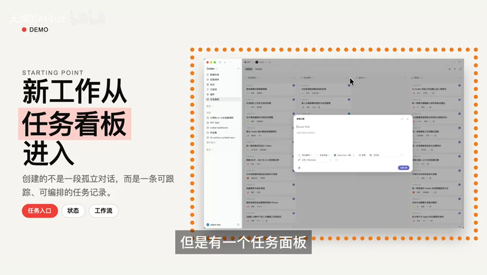
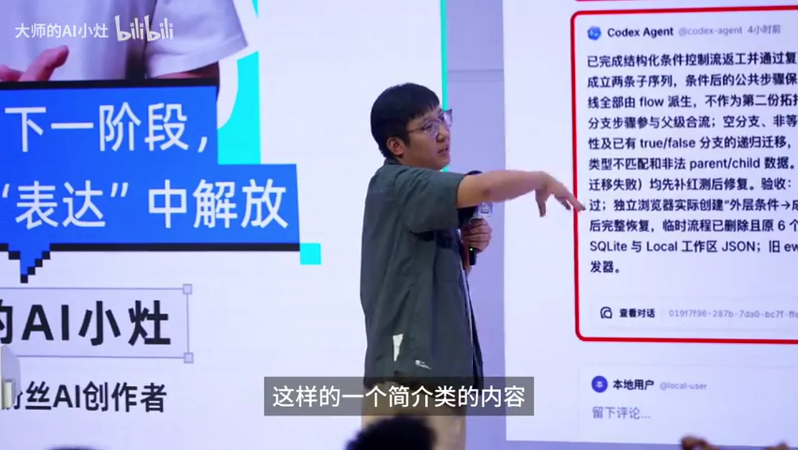
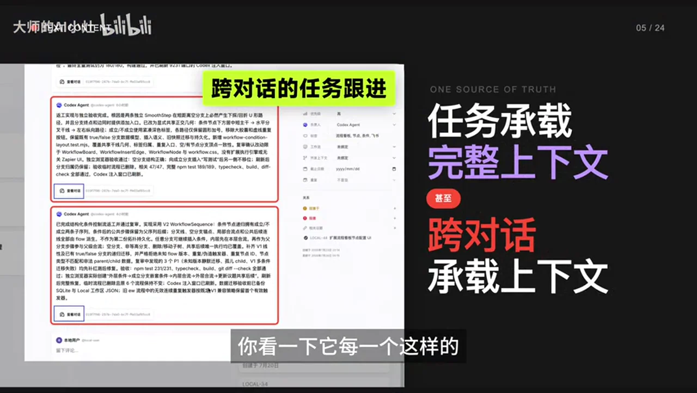
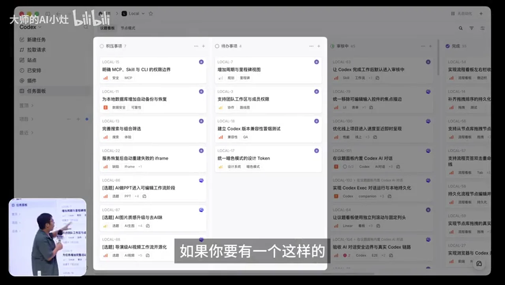
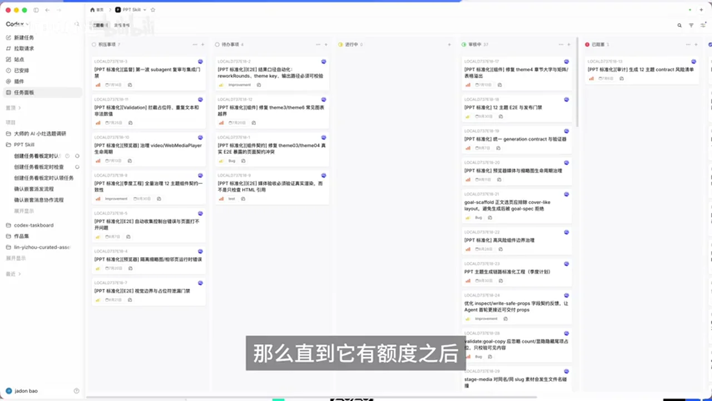
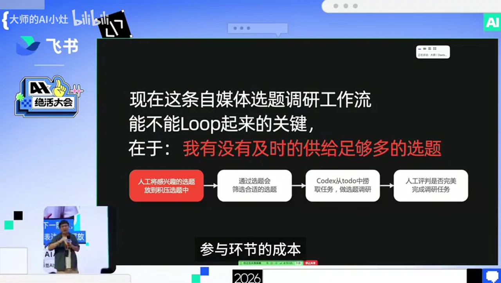
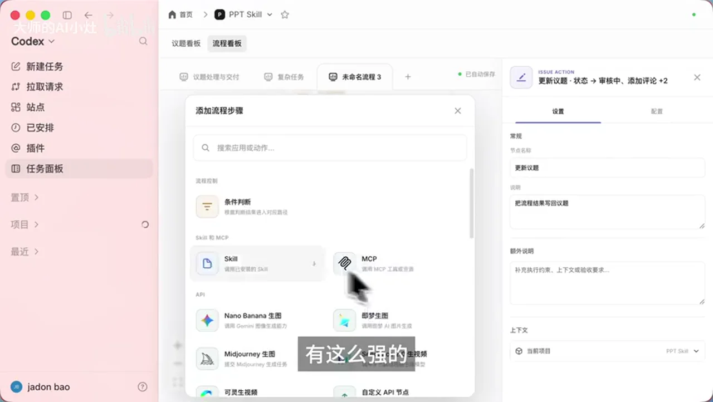

# 总结稿

暂无总结。

# 辅助理解

# Data

## 原始转写稿

[00:00] 我已经不太通过
[00:01] Codex对话来管理整个的开发流程了
[00:03] 也就是说我这个上下文
[00:05] 被海量的噪声信息淹没了
[00:07] 我过去的一个月里面
[00:09] 我几乎现在就是
[00:10] 五小时工作 三小时睡觉
[00:12] 我都不知道谁是老板
[00:13] 对
[00:15] 想办法把人的成本拉到无限低
[00:17] 你不要高估人的判断和审判能力
[00:20] 大家见过叫做
[00:22] 最近Codex比较火的
[00:23] 叫做去换Codex皮肤 对不对
[00:27] 这个都见过吧
[00:28] 那你们有没有用过
[00:30] 自己定制功能的Codex
[00:32] 没有吧
[00:33] 行 今天我就给大家看一看
[00:35] 就是你可以除了那个对话框之外
[00:38] 还有其他的方式跟Codex交互
[00:41] 其实就是这个是我今天的一个开场语
[00:44] 叫做我已经不太通过Codex对话
[00:46] 来管理整个的开发流程了
[00:48] 那么我来做了一件事情呢
[00:51] 就是本来我是想通过PVT来讲解
[00:53] 但是大仙觉得我这个东西
[00:55] 讲起来很有意思
[00:57] 所以说我今天会通过真的去掩饰
[01:00] 然后和PVT结合起来来去讲解这个内容
[01:03] 大家一定遇到过这样的情况
[01:04] 就是你的Codex跟我的应该也差不多
[01:07] 就是这里面已经积攒了非常多的对话了
[01:10] 但是你会发现你想
[01:13] 比如说你对你的一个复杂的项目
[01:14] 其中一个功能进行
[01:16] 二次的编辑
[01:17] 你会发现你无从着起
[01:19] 我来给大家复现一下这个场景
[01:20] 我是会怎么样
[01:21] 首先大家可以看一下
[01:22] 这个是我自己用的Codex
[01:25] 但是有一个任务面板
[01:27] 这个是我自己给我的Codex加的一个功能
[01:30] 比如说我最近在做一个PVTScale
[01:33] 这个项目打开了之后
[01:34] 我不去开启一个新的对话
[01:36] 而是在代办事项里面去添加一个新的任务
[01:41] 然后这个任务添加完了之后
[01:42] 我想告诉AI的事情
[01:43] 不要去干扰我的进程
[01:44] 我只是在做一个测试
[01:46] 它又会在这里面挂起来
[01:47] 挂起来了之后
[01:48] Codex就会定时地去寻回
[01:51] 从这个代办事项里面去捞任务去做
[01:55] 它捞出来的任务就会放到进行中
[01:58] 它自己把任务觉得自己快完成了之后
[02:01] 它会把这个东西放到审核中
[02:03] 我再去审核
[02:04] 其实这个东西大家可能
[02:07] 我不知道有没有在场有没有开发者
[02:10] 或者说是做过特别复杂的外部coding项目的人
[02:12] 如果说大家有的话
[02:14] 可能能理解到这个东西有什么用
[02:16] 如果说没有也没关系
[02:18] 我来给大家讲这个东西到底是怎么用
[02:20] 我开发一个项目了之后
[02:22] 其中一个功能我可能会先跟一个对话去聊
[02:26] 我想怎么做这个功能
[02:28] 然后还会有一个对话去把这个功能完整的实现
[02:31] 然后最后这个功能如果出了问题
[02:33] 我并不会在继续这个对话中
[02:36] 继续跟它把bug修完
[02:37] 而是我会单独建一个bug修理的这样的对话
[02:41] 所有的人应该都是这样吧
[02:42] 没有人有特别好的习惯叫做
[02:44] 我哪个功能要素圆的哪个对话去对话的吧
[02:47] 没有吧
[02:47] 而且还有一个更加严重的情况
[02:50] 就是coDEX自从更新了
[02:53] 它可以自己换起新的对话了之后
[02:56] 你的对话的基数就会海量的增长
[02:59] 导致我根本就没有办法从我的对话中找到
[03:02] 我当时开发那个功能
[03:04] 它的对话到底是什么样
[03:06] 也就是说我这个上下文被海量的噪声信息淹没了
[03:10] 这个对话框到底还是不是我们最终的一个
[03:14] 跟AI协奏的产品形态
[03:16] 那它就不是了
[03:17] 那么你回过头来看这个任务面板
[03:19] 就会变得清晰
[03:21] 这个任务面板有什么用
[03:22] 我会把我的任务放在这里
[03:24] 然后coDEX会去认领
[03:26] 认领了之后
[03:27] 它做完那会放在这里
[03:28] 那么我在这里打开的
[03:31] 就只有跟这个功能相关的上下文
[03:34] 可以看一下这个过程大概是一个什么样的过程
[03:40] 这个就是其中的一个卡片
[03:42] 那么它点开长什么样子呢
[03:46] 它点开就长这个样子
[03:47] 你会发现它会对这个任务进行一个完整的一个说明
[03:52] 这个是一个就是它对你这个功能开发的一个简介
[03:59] 然后再往下面这些是什么
[04:00] 是我发现它开发的不是很好
[04:02] 那我就继续给它评论
[04:04] 评论完了之后
[04:05] 它再去针对我的评论
[04:07] 继续进行二次的开发
[04:09] 也就是说这个东西它其实是以任务维度
[04:12] 以功能维度去记录你的这样的一个对话过程
[04:16] 那么有人会问那这样的一个简介的内容
[04:20] 就是这个长评的详情页
[04:21] 它到底附属于哪个对话
[04:23] 它哪个对话都不附属于
[04:25] 你看一下它每一个这样的一个更改的内容了之后
[04:29] 它会有一个查看对话的这样的一个按钮
[04:31] 也就是说其实它可以跨越不同的对话
[04:35] 来去所引你其中的一条线
[04:38] 你对某一个功能来去解释修改和更新的这样的一个东西
[04:43] 这个灵感是哪里来的呢
[04:45] 就是我们做互联网公司工作的话
[04:48] 那其实一定会遇到一个情况
[04:50] 就是非常复杂的一个大工作的话
[04:52] 我们会拉一个100人的大群
[04:54] 但是那个PMO绝对不允许我们在那个大群里面去讨论项目细节
[05:00] 为什么 因为会被淹没
[05:01] 所以说它必须要你去拉小群
[05:05] 拉小群去讨论技术细节
[05:07] 也就是说整个的过程
[05:09] 关于功能相关的过程都要集中在一起才能看得清
[05:13] 那么这个其实就是刚才那个任务面板的一个逻辑
[05:16] 这个任务面板其实还有第二个点
[05:18] 就是我觉得可能也是大家非常痛的点
[05:20] 也是我自己很痛的点
[05:22] 就是我在开发产品的时候会发现一种现象
[05:25] 有一些功能我其实没想清楚
[05:27] 我直接打个对话去跟他聊的话
[05:29] 他就进入了一个直接去帮我执行的这样的一个过程了
[05:33] 那这种东西应该记得哪里
[05:35] 所以说你如果没有想清楚的话
[05:37] 会在最左侧有一个羈押事项
[05:40] 也就是说你可以再不是直接让Codex去制作
[05:44] 以及你自己的一些私人想法的时候
[05:47] 你可以记录在这里
[05:49] 当有一天你发行的想法成熟了
[05:51] 你再把它拉到带办事项里面
[05:54] 那么Codex才会在这个尺子里面去捞取你的需求
[05:58] 也就是说这个里面是专门记录你的灵感
[06:01] 我会经常发现一个问题
[06:03] 就是我在webcoding的时候
[06:04] 它在进行一项重大的改革
[06:06] 那么这个重大的改革
[06:08] 我不能加任何的小功能再让它去同步迭代
[06:11] 那么我不知道它之间互相的影响
[06:13] 那我就只能在这等着它
[06:15] 我要等它运行完
[06:17] 然后我在布置我的工作
[06:19] 我都不知道谁是老板
[06:21] 所以说这里面最重要的点就在于
[06:23] 你可以让它自己去运行
[06:26] 然后你把你的方案写好
[06:28] 直到它成熟了之后再把它拉过去
[06:31] 这个其实是一个更符合我们一般在公司工作会说去迭代产品的
[06:37] 这样的一个思维方式
[06:39] 还有一个点
[06:39] 就是大家会预到叫做你的工作时间
[06:42] 其实是由codex工作时间决定的
[06:45] 它额都用完了
[06:46] 我就得停
[06:47] 我根本就没有办法
[06:48] 叫做按照我正常八个小时的时间来
[06:51] 我过去的一个月里面
[06:53] 我几乎现在就是五小时工作
[06:55] 三小时睡觉
[06:56] 就是完全是匹配它的需求
[06:58] 但是如果你要有一个这样的一个家事项
[07:01] 和代办事项这样的一个内容
[07:04] 能够这个池子存在的话
[07:06] 那么它额度如果用完了
[07:08] 它就不会把这个东西往这里面去捞
[07:11] 那么直到它有额度之后
[07:13] 它的自动化才会正常的运行
[07:15] 然后把这个东西继续捞过来
[07:17] 也就是说你可以先进行你的工作
[07:20] 而不必要等它任何的
[07:22] 比如说正在运行
[07:24] 导致你没有办法给它布置需求
[07:25] 或者说额度消失了
[07:27] 没有办法给它布置需求
[07:28] 或者说你晚上睡觉
[07:30] 你没有办法给它布置需求
[07:31] 你是按照你的弹性时间来
[07:33] 那么我们再换一种思路
[07:35] 就是这套流程除了开发之外
[07:38] 那如果我不外部coding的话
[07:39] 那么它还能用在我什么样的地方呢
[07:41] 其实它可以用在很多地方
[07:43] 比如说它可以用在我作为一个自媒体博主
[07:46] 我会去做一件事情叫做选题调研
[07:49] 我会去挖掘全网很多好的选题
[07:52] 我放到这个机压事项里面
[07:54] 然后有一天我会把它提出来
[07:56] 让AI去帮助我去做这个选题调研
[07:58] 那么这个流程在这里面也是能够跑通的
[08:02] 那我可以给大家看一下它大概跑出来是一个什么样的结果
[08:05] 那么打开这里面你可以看
[08:07] 叫做这个机压事项其实就是我对于我的一些选题
[08:11] 但是我没有想好让它去做
[08:13] 我只是有要一个地方纪录这些东西
[08:16] 我觉得它好
[08:17] 但是这些好转化成能做还需要一个步骤
[08:20] 就是我们周一的选题会
[08:21] 比如说有一个关于Cloud Code这样的一个选题
[08:24] 那么我放到这里了之后
[08:26] 它才会去拉全网Cloud Code相关的教程
[08:29] 来去告诉我这个选题怎么讲
[08:31] 市面上大家都在怎么讲
[08:32] 那可以看一下它这个调研好的东西大概长什么样子呢
[08:36] 你可以看到就是它会给你一个任务清单
[08:38] 就是它大概调研好了之后
[08:40] 它会给你说一段话
[08:42] 然后你可以看一看它到底干了什么
[08:44] 然后最后它其实会交付给你一个链接
[08:46] 就是一个调研完的一个完整的链接
[08:49] 最好的承载形式其实还是飞出文档
[08:51] 因为人和AI的交付可能是MD
[08:54] 但是人与人之间交付的话
[08:55] 它还是需要一个副文本的内容出现
[08:57] 包括你可以一件分享给其他人
[08:59] 这个都是一个要好的选择
[09:01] 那么它大概就讲这个样子
[09:03] 如果说你觉得它电源的不好
[09:05] 那么你的最好的办法就是
[09:08] 在这里给它留一条评论
[09:09] 然后你说你的电源方向歪了
[09:11] 或者说怎么样
[09:12] 然后你再把它
[09:15] 你可以把它拖回来
[09:17] 然后拖回来之后
[09:18] 这个AI就会
[09:19] CodeX就会定时的从这里面去抓
[09:22] 抓这个过程
[09:23] 抓这个任务
[09:24] 然后放到这里面
[09:25] 然后来去自主地继续运行
[09:28] 然后这个工具其实只是第一步
[09:30] 但是我其实今天还想讲一个事情
[09:32] 就是除了一个工具之外
[09:34] 那么还有没有一些
[09:35] 其他的一个更关键的问题
[09:37] 什么意思
[09:38] 就是我其实在形成一个loop
[09:40] 然后让它自己去做调研
[09:42] 但是这个loop里面有一个非常关键的一点
[09:44] 就是什么呢
[09:45] 是它能不能运行起来
[09:47] 其实在于叫做
[09:48] 我有没有给它提供足够多的选题
[09:51] 如果说我没有往那个GR的库里面
[09:53] 去提供选题的话
[09:55] 那么它就永远不可能走后面的流程
[09:57] 所以说这个我觉得也是
[09:59] 大家在做loop的时候遇到的一个
[10:00] 非常严重的问题
[10:02] 就是你其实把人在这里面
[10:04] 参与的环节的成本拉到太高了
[10:07] 我可以告诉你
[10:07] 我是怎么解决这个问题的
[10:09] 就是我让CodeX设置了一个自动化
[10:12] 让它每周日晚去收集本周
[10:14] 我在各个平台点赞收藏过的视频和文章
[10:18] 也就是说点赞收藏看视频这个事情
[10:21] 是我每天都要做的事情
[10:22] 即使没有这个流程
[10:24] 我也要做
[10:25] 所以说如果说你只叫做
[10:27] 你每周要花时间去给CodeX去布置任务
[10:31] 你要去调研哪些选题
[10:33] 你永远做不成这件事情的
[10:35] 那么最好的办法是什么
[10:36] 让它静默处理
[10:37] 让它从这个喜好里面去找出
[10:40] 什么样的选题是你喜欢的
[10:42] 然后这里面跟AI相关的是什么
[10:45] 然后直接拉到我刚刚说的那个工作榴里面
[10:48] 那么CodeX就可以自己去调研
[10:50] 也就是说如果说我一个月都没有想起来去做这件事情
[10:54] 我最后打开这个面板里面
[10:56] 也是有一些雖然说没有经过挑选
[10:59] 但是它在自己运作
[11:00] 并且可以让我去判断哪些可以继续推进的东西
[11:04] 那么再进一步我还讲
[11:05] 就是你也可以把同事的东西也拉进来
[11:07] 什么意思
[11:08] 就是你给同事的CodeX设置一个自动化
[11:12] 让他们把他们点赞收藏的跟AI相关的内容
[11:16] 放到一个非说的多位表格里面
[11:18] 然后让你的CodeX从那个非说的多位表格里面
[11:22] 把相关的内容也摘取到刚才的那个工作榴里面
[11:26] 那么其实你形成的
[11:28] 就是你们公司对于整个选题的一个喜好库
[11:32] 然后让它自己去运行就可以了
[11:34] 那么这个才是我觉得
[11:36] loop里面大家做到的最难的一件事情
[11:40] 就是你必须要让这个可持续运行的这个agent的工作榴
[11:43] 设置一个没有人参与的时候
[11:45] 它也能自己运转的一个降级方案
[11:48] 想办法把人的成本拉到无限低
[11:51] 你不要高估人的判断和审核能力
[11:53] 你可以定期的
[11:55] 就是比如说你有一个webcoding项目放在github上
[11:57] 那你可以让你的CodeX定期从github上去摘取那个意识
[12:01] 然后放到整个的这个加示项里面
[12:04] 然后供你筛选
[12:05] 那你自己就不用去看了
[12:07] 你每天只需要检查这个列表
[12:09] 看一看哪些问题是应该修复的
[12:11] 把它挪到代办事项里
[12:13] 然后CodeX就从这个尺子里面去摘取相关的东西
[12:16] 然后去进一步的这样的一个操作
[12:18] 不过有些有些小项目我建议就不要放在这个计压事项里面了
[12:23] 直接让CodeX拉到这个代办里面
[12:25] 它直接就干了
[12:26] 但是你还是要注意一下
[12:27] 万一有人想要搞你的话
[12:30] 到在艺术里面提一些不好的东西对不对
[12:32] 你还是要多加一轮人的审核
[12:34] 所以说这个也是这个计压事项的一个重要的一个用法
[12:37] 就是你要把人的判断留出来
[12:40] 否则的话CodeX自己运行
[12:42] 它会有一些黑盒的现象
[12:43] 你不知道它会怎么样
[12:45] 最后就是给大家演示一下
[12:46] 就是除了刚才那个工作面板之外
[12:49] 它可能我们在CodeX里面还能再做一些其他形式的东西吗
[12:53] 也可以
[12:54] 原来我们发现工作流是一个不好的一个方法
[12:57] 但是你发现有这么强的一个AI加持的情况下
[13:00] 你建立一个新的这种工作流的这个形态
[13:03] 往往是一个更好的选择
[13:05] 为什么
[13:05] 因为不是所有的任务都是线性的
[13:07] 比如说我写出一个脚本出来
[13:09] 这个脚本可能去做视频
[13:10] 可能去写文章
[13:12] 可能去干其他什么东西
[13:14] 那我刚才那一套叫做代办事项进行中和最后的一个完成
[13:19] 它这样线性的就走不通
[13:20] 你需要一个这样的可以去做分支的这样的一个结果
[13:24] 当然这个也是另一套的模式
[13:26] 就是你也可以在这里面去设置一些
[13:29] 当然这是我们的畅想 设计一些API的一个接口
[13:32] 让CodeX可以调用这个接口
[13:34] 然后去直接想用那个吉梦去生图
[13:37] 或者说吉梦去生视频都是可以做到的
[13:40] 那么你其实对这个流程的一个监管
[13:42] 像我们之前提到过的多一阵的这个东西
[13:44] 其实早就存在了
[13:45] 但是为什么大家觉得不好用
[13:47] 是因为多一阵的一直运行在一个总控A阵
[13:50] 它的下面的一些分支
[13:51] 你其实看不到它
[13:52] 但这样的方式由你自己管理
[13:54] 你其实可以很清晰地看到
[13:56] 它们之间传递的上下文是什么样子
[13:58] 它的流程整个是长什么样子
[14:01] 那么我们这个项目因为做得比较匆忙
[14:03] 然后也是希望在今天能够给大家看看
[14:05] 就是如果说有动手能力比较强的
[14:08] 可以去这个地方然后去把它当了到你的本地
[14:12] 然后去试一试
[14:14] 就是我刚才那个任务面板
[14:15] 那么如果说大家想等更稳定的版本的话
[14:18] 那就等我们不多的人手再来开发吧
[14:24] 谢谢大家

## 原始关键帧

### 关键帧 1

### 关键帧 2

### 关键帧 3

### 关键帧 4

### 关键帧 5

### 关键帧 6

### 关键帧 7

### 关键帧 8

### 关键帧 9

### 关键帧 10

