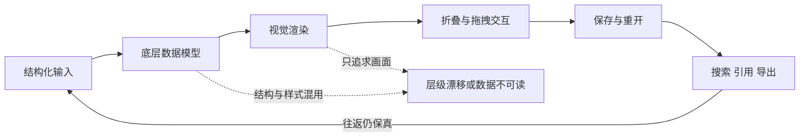
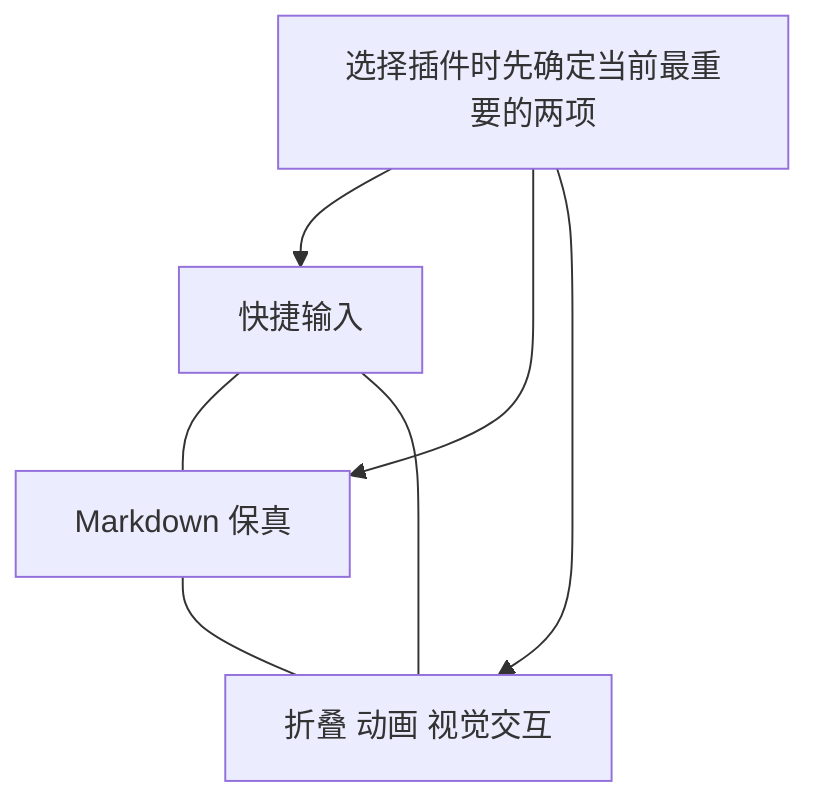
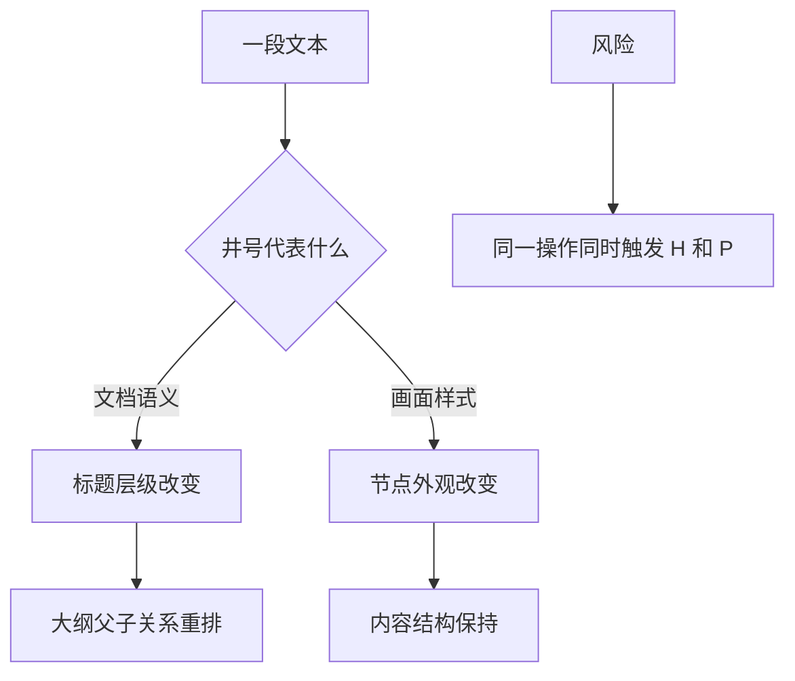
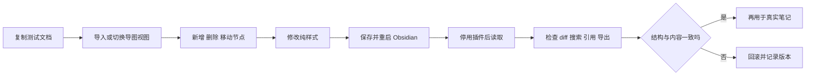

# 总结稿

[打开单页 HTML 总结](assets/bilibili-BV1AoT76CEQ9-summary.html)

## 一句话结论

这不是一份简单的“插件排行榜”，而是作者从两个月的试用中逐渐形成的一套判断框架：**思维导图插件真正竞争的，不只是画面，而是结构化输入、Markdown 数据保真、节点交互与视觉表达之间如何取舍。** 作者最终没有选出全能“插件之王”，而是建议按创作阶段和核心约束选择细分工具。

> [!important] 时效边界
> 插件功能、缺陷与推荐均是作者在视频录制时、特定版本和个人工作流中的观察，不代表当前版本仍完全相同。尤其是数据安全、导入导出和结构保存问题，采用前应以插件最新说明并用测试库复现。

## 从“不会用”到看懂思维导图

作者原本以 Markdown 完成结构化写作，对思维导图并无强需求。Lovely Mindmap 的极简设计让他意识到：它不是另造一种文件，而是在 Canvas 上补足 `Tab` 创建子节点、`Enter` 创建同级节点等操作。由此，他把思维导图的第一核心价值概括为：**用低摩擦快捷键持续输入结构**（01:06–02:27）。

随后他在实际测评中总结出一个“不可能三角”（02:53–04:28）：

1. 快捷、连续的结构化输入；
2. 与 Markdown/文本结构之间可靠转换；
3. 节点展开、收起及连贯动画。

作者观察到，当时许多插件只能把其中两项做好。这不是断言三者在技术上永远不可兼得，而是对当时插件生态的经验归纳。

## 两条开发路线，各自牺牲什么

### Markdown → 思维导图

这一路线优先保留已有文本并把它渲染为导图：

- **Mind Map NextGen**：功能极简，但节点展开、收起及动画完整。
- **Better Mind Map**：作者尤其欣赏其展开节点时同步调整视野的动画；视觉朴素，但能把注意力自动带到当前分支。
- **Markdown XMind**：用无序列表承载大纲，再渲染为 XMind 风格；`Enter`/`Tab` 的体验接近原生导图，学习成本低。
- **MarkMind**：对标题、段落、引用、表格、行内代码等 Markdown 内容的展示和编辑能力很强；但作者在当时版本中发现，若把标题标记同时当成视觉样式和文档层级，保存后可能改变原来的逻辑结构。切换到 Basic 模式可保住节点样式与结构，却会牺牲部分段落渲染能力（07:39–10:33）。

这里的根本难题是：Markdown 中的 `#` 表示数据结构，而图形界面中的“标题样式”可能只是视觉表达。若插件把二者混为一谈，用户以为自己在改样式，实际却改写了大纲语义。

### 思维导图 → Markdown

另一条路线先提供漂亮、顺滑的画布交互，再设法把结果导出或映射回 Markdown。作者认为这类工具往往视觉和拖拽体验更强，但与 Obsidian 原生文本生态的融合较弱，尤其要检查：

- 插件停用后文字是否仍可读取、搜索和引用；
- 段落被保存为正文、备注还是节点；
- 文件名、层级和引用是否能稳定往返；
- 导入、编辑、保存后是否出现结构漂移。

画面中的 KMind 展示了从 Markdown 导入并生成完整导图的效果；Simple Mind Map 则让作者看到“段落级节点”、粘贴时保留/忽略层级以及用上级节点承接文件名等数据架构设计（11:06–15:19）。这些评价同样只对应作者测试时的版本。

## 技术壁垒：文本、容器与画布互相牵制

作者把问题解释为动态文本布局：容器宽度影响文字换行，换行又反过来改变容器尺寸；节点、连线、视野和交互随后都要重新计算。把文字完全当图形渲染可以换取流畅度，却可能导致全局重绘、局部布局难以独立控制，或让文本语义退化（05:56–07:18）。

因此，选择插件时不能只看截图，而要同时检查三层：

- **数据层**：正文、标题、段落、引用、文件名如何保存；
- **渲染层**：CSS、DOM/Canvas、节点布局怎样呈现这些数据；
- **交互层**：快捷键、折叠、拖拽、撤销和视野动画是否自然。

## 从 Steph Ango 的设计哲学继续推演

作者借 Obsidian CEO **Steph Ango** 的文章，把思维导图重新理解为“有样式的无序列表”：内容仍是结构化文本，样式是一套可以重复使用的约束。经核验，Steph Ango 确为 Obsidian CEO、不是联合创始人，也是 **Minimal** 主题作者；其文章确实提出“Style is consistent constraint”以及“思维应灵活、过程应可重复”。参见 [Obsidian 团队页](https://obsidian.md/about)、[Minimal 官方主题页](https://community.obsidian.md/themes/minimal) 与 [原文](https://stephango.com/style)（16:17–17:13）。

作者由此提出三层推演，后两层属于设计设想而非已完成产品：

1. **样式压缩决策**：统一的节点、线条和展开方式减少重复选择。
2. **导图自带时间线**：中心词到分支的顺序展开可直接转化为演示或视频动画。
3. **阶段性创作面板**：头脑风暴阶段强调快速输入，梳理阶段强调拖拽和画面；同一个标题符号在文本面板中决定结构，在图像面板中只决定样式，避免视觉编辑污染文档语义。

最终愿景是“一次文字创作，多种表达输出”：同一份底层内容可以生成导图、海报、演示或视频。但画面中的海报仅用于说明作者设想的潜力，不能视为所有被测插件已经普遍具备的能力。

## Excalidraw：反例，也是潜在平台

作者一方面把 **Excalidraw** 当作对照：复杂绘图自由度高，但当时的思维导图体验缺少他所需的节点折叠和线性展开；另一方面又认为其自由节点、SVG 输出和开放生态可能成为动画导图的底层（21:11–22:52）。

事实核查确认：Obsidian 核心应用并非开源；Obsidian Excalidraw 插件具有公开源码，插件仓库标示为 AGPL-3.0，上游 Excalidraw 编辑器采用 MIT License。两者是相关但不同的项目，不能混用许可证概念。参见 [Obsidian 官方仓库说明](https://github.com/obsidianmd/obsidian-releases)、[Obsidian Excalidraw 插件仓库](https://github.com/zsviczian/obsidian-excalidraw-plugin) 与 [上游 Excalidraw](https://github.com/excalidraw/excalidraw)。作者对 Excalidraw “之后应该会很强”的判断属于预测。

## 如何按自己的需求选择

| 你的首要目标 | 优先检查 | 可接受的代价 |
|---|---|---|
| 快速写大纲 | `Enter`/`Tab`、连续输入、低学习成本 | 视觉自由度较低 |
| 长文与知识库融合 | 原生 Markdown、段落/引用/链接保真、插件停用后可读 | 画面或动画不一定最强 |
| 展示与演示 | 折叠、自动聚焦、线性展开、主题样式 | 需额外验证数据往返 |
| 复杂关系绘图 | 自由节点、连线、SVG/图片输出 | 结构化文本输入可能更慢 |

最稳妥的评测方法是准备一份包含多级标题、普通段落、任务列表、引用、表格、代码、公式和链接的测试文档，依次执行“导入 → 编辑样式 → 调整层级 → 保存 → 重开 → 停用插件 → 搜索/引用”。只看第一次渲染，很容易漏掉真正重要的数据问题。

## 事实核查：插件市场数字的限定

- 2026-05-12，Obsidian 官方确实上线了新的 Community 目录、开发者后台和**自动化审核系统**；但官方没有把它明确称作生成式 AI 审核。参见 [The future of Obsidian plugins](https://obsidian.md/blog/future-of-plugins/)。
- 官方口径是“过去几天处理了超过 2,300 个排队 submissions”，且统计包含插件与主题；“处理”也不等于全部通过并上架。因此视频中“单日上新近 1,000 个插件”（00:32）的精确数字未获证实，不宜作为生态规模数据引用。

## 观众讨论与补充

> [!note] 样本边界
> 以下仅来自匿名热评候选和当前可访问弹幕：共抓取 26 条顶层热评、选出 20 条候选；嵌套回复未纳入。弹幕仅抓到 1 条，不能用于判断整体情绪或热点。

观众讨论主要补充了三类问题：一是 Canvas 或大纲工具是否已经足以替代导图；二是 XMind、MindManager、Markmap、MarkXMind、Excalidraw Mindmap Builder 等替代路线；三是从 Obsidian 到外部工具的导出、调用和自动化工作流。这些内容可以扩展试用清单，却只是个人意见或使用报告，不能证明某款插件当前版本更好，也不能替代安全与数据保真测试。

## 可以带走的判断

- 思维导图的价值未必是“二维”，而可能是**快速、连续地输入层级结构**。
- 好看的渲染不等于可靠的数据模型；插件停用后的可读性比一次漂亮截图更重要。
- “结构”和“样式”应尽量分离：标题层级属于数据，颜色、粗细和节点外观属于视图。
- 不要寻找抽象的全能冠军；先确定当前处于输入、梳理、展示还是复杂绘图阶段。
- 把视频中的插件优缺点视作测试线索，而不是永久结论。

# 辅助理解

## 辅助理解

### 1. 这场测评真正测的是什么

作者表面上比较思维导图插件，实际在追问一条内容从输入到复用的完整链路：

真正的优劣不是某个环节“最好看”，而是整条链路能否闭环。frame 1 把原始 Markdown 与展示结果放在同一画面，正好说明作者为何坚持同时检查输入结构与最终视图。

### 2. “不可能三角”不是定律，而是诊断工具

在作者测试时点，许多插件难以同时做到：

- 写作阶段通常更看重快捷输入与 Markdown 保真；
- 梳理阶段更看重结构保真与折叠/拖拽；
- 演示阶段可能优先视觉与动画，但仍需保留可回退的数据源。

frame 2 展示了主题、布局、线条和节点等大量外观控制；它提醒我们，丰富的视图选项只是评价的一部分，必须回到数据模型检查。

### 3. 为什么“改个样式”会改坏结构

Markdown 的标题标记同时携带语义和层级。如果导图插件把 `## 标题` 中的井号只当成“放大、加粗”的视觉指令，用户在图上改变标题等级时，底层文档的父子关系也可能随之改变。

更稳健的设计是让内容、结构与视图配置分层：正文仍是可读 Markdown，布局、主题、线型放在独立属性中。frame 10 展示的 `type: mindmap`、布局、主题和线型属性，就是这种分离思路的直观例子。

### 4. 动态文本布局为什么难

思维导图中的文本不是固定图片：字体和容器宽度会决定换行，换行又改变节点高度；节点尺寸变化后，兄弟节点、连线、画布边界和当前视野都可能需要重算。

因此“流畅”“局部可编辑”“结构可保存”常常不是一个渲染技巧就能同时解决。frame 4 将纯文本、CSS、Canvas/DOM、React 组件、控件与数据模型画在一起，是视频中最有解释价值的技术图。

### 5. 从导图到创作系统：哪些是观察，哪些是设想

作者观察到思维导图天然存在“中心词 → 分支逐步展开”的顺序，于是把它类比为时间线，并继续推演海报、手账、演示和视频输出。这里需要分三层理解：

1. **已观察**：节点结构可以顺序展开，部分插件已有自动聚焦或动画。
2. **可实现的设计方向**：用可复用样式约束动画，减少逐元素调整。
3. **作者设想**：阶段性创作面板与“一次文字创作、全平台输出”。

frame 9 展示了三种海报/信息图形态，它适合说明第三层的想象空间；不能据此推断所有被测插件目前都能从 Markdown 自动生成这些成品。

### 6. 一个更可靠的试用实验

不要直接把生产笔记交给新插件。复制一份测试文档，并记录每一步：

至少覆盖多级标题、普通段落、任务列表、引用、表格、代码、公式和链接。frame 5 展示了 Markdown 被完整导入成导图的外观，但实验必须继续走到“保存、重开、停用插件”之后，才算验证完成。

### 7. 事实与观点的边界

- **已核验事实**：Steph Ango 是 Obsidian CEO、不是联合创始人，也是 Minimal 作者；Obsidian 核心应用不开源；Obsidian Excalidraw 插件公开源码。
- **需要限定的事实**：2026 年 5 月官方上线的是自动化审核系统；官方披露的是数日处理 2,300+ 个排队 submissions，不支持“单日上新近 1,000 个插件”的说法。
- **作者观察**：各插件在测试版本中的功能、缺陷、动画和数据处理表现。
- **作者观点/预测**：思维导图是“有样式的无序列表”、阶段性创作面板、Excalidraw 生态可能弯道超车。
- **观众意见**：Canvas、外部导图软件或其他插件是否更合适；这些只能作为继续测试的线索。

把这五类内容分开，才能既保留视频的启发性，又避免把版本体验、设计推断或热评偏好误写成稳定事实。

## 外部事实核验

### 声明 1（00:29）

- 视频陈述：视频称，2026 年 5 月 Obsidian 引入了 AI 来辅助审核插件市场。
- 核验状态：部分确认
- 核验结果：部分确认，且应把措辞校正为“自动化审核”。Obsidian 官方于 2026-05-12 发布新 Community 目录、开发者后台和 automated review system；系统会对每个版本检查开发者政策、代码质量、已知漏洞与恶意软件，人工审核仍会继续。官方材料没有把这套系统明确描述为生成式 AI 或 AI 审核，因此“AI 辅助”属于视频作者的概括，不能由官方来源直接确认。
- 检索日期：2026-08-18
- 来源：
  - [Obsidian — The future of Obsidian plugins](https://obsidian.md/blog/future-of-plugins/)（primary）

### 声明 2（00:32）

- 视频陈述：视频称，审核机制变化后，插件市场在一天之内上新了将近一千个插件。
- 核验状态：未验证
- 核验结果：未验证该精确数量和时间窗口。Obsidian 官方只确认新系统在“过去几天”处理了超过 2,300 个排队中的 submissions，并称自 2020 年 API 发布以来社区已创建超过 4,000 个 plugins and themes。submission 可能是插件或主题，处理完成也不等于全部通过并作为新插件上架；官方页面没有给出“一天净新增近 1,000 个插件”的统计。因此可确认审核积压在 2026 年 5 月被大规模处理，但不应复述视频的单日新增数字。
- 检索日期：2026-08-18
- 来源：
  - [Obsidian — The future of Obsidian plugins](https://obsidian.md/blog/future-of-plugins/)（primary）
  - [Obsidian official releases and community directory repository](https://github.com/obsidianmd/obsidian-releases)（primary）

### 声明 3（16:17）

- 视频陈述：视频称 Steph Ango 是 Obsidian 的现任 CEO，但不是 Obsidian 创始人。
- 核验状态：已确认
- 核验结果：确认。Obsidian 官方 About 页面列 Steph Ango（@kepano）为 CEO，同时将 Shida Li 列为 co-founder/CTO、Erica Xu 列为 co-founder/COO；该页面没有把 Steph 列为联合创始人。因此截至核验日，视频对其当前职位及非创始人身份的表述成立。
- 检索日期：2026-08-18
- 来源：
  - [Obsidian — About](https://obsidian.md/about)（primary）

### 声明 4（16:22）

- 视频陈述：视频称 Steph Ango 是 Obsidian 热门 Minimal 主题的作者。
- 核验状态：已确认
- 核验结果：确认。Obsidian 官方 Community 主题页把 Minimal 的作者标为 kepano；Minimal 的官方 GitHub 仓库位于 kepano 账号下，Steph Ango 的 GitHub 资料也将该仓库列为其项目。官方主题页还显示该主题获得过 Obsidian 官方 Best Theme 奖。视频中的 ASR“minimum”应校正为“Minimal”。
- 检索日期：2026-08-18
- 来源：
  - [Obsidian Community — Minimal theme](https://community.obsidian.md/themes/minimal)（primary）
  - [kepano/obsidian-minimal](https://github.com/kepano/obsidian-minimal)（primary）

### 声明 5（16:35）

- 视频陈述：视频称 Steph Ango 的一篇文章核心思想是“样式是一套约束”，并由此引出“思维应灵活、过程应可重复”。
- 核验状态：已确认
- 核验结果：确认这是对原文的忠实概括。Steph Ango 的文章标题为“Style is consistent constraint”，正文明确写道 style 是一套需要坚持的约束，并提出想法可以变化，但过程应保持可重复；文章还说明稳定风格能减少未来决策并节省时间。这里核验的是文章确实表达了这些观点，不代表它们是经实验验证的普遍规律。
- 检索日期：2026-08-18
- 来源：
  - [Steph Ango — Style is consistent constraint](https://stephango.com/style)（primary）

### 声明 6（22:32）

- 视频陈述：视频称 Obsidian 不是开源软件。
- 核验状态：已确认
- 核验结果：确认。Obsidian 官方 GitHub 组织下的 releases/community-directory 仓库在 README 中明确说明，Obsidian is not open source software，该仓库也不包含 Obsidian 的源代码。需要区分“核心应用不开源”与“拥有公开 API、官方开放格式项目及大量开源社区插件”；后者不改变核心应用的闭源状态。
- 检索日期：2026-08-18
- 来源：
  - [obsidianmd/obsidian-releases](https://github.com/obsidianmd/obsidian-releases)（primary）

### 声明 7（22:34）

- 视频陈述：视频称 Excalidraw（ASR 中多次识别为“XG”）是一个开源的 Obsidian 插件。
- 核验状态：已确认
- 核验结果：确认。Obsidian Excalidraw 插件的公开官方仓库包含完整源代码，GitHub 将仓库标示为 AGPL-3.0 licensed；插件所集成的上游 Excalidraw 编辑器同样公开源码并采用 MIT License。因而“该插件开源”成立，但应注意插件仓库与上游编辑器是相关但不同的项目，许可证也不同。
- 检索日期：2026-08-18
- 来源：
  - [zsviczian/obsidian-excalidraw-plugin](https://github.com/zsviczian/obsidian-excalidraw-plugin)（primary）
  - [Obsidian Excalidraw plugin — LICENSE](https://github.com/zsviczian/obsidian-excalidraw-plugin/blob/master/LICENSE)（primary）
  - [excalidraw/excalidraw](https://github.com/excalidraw/excalidraw)（primary）

# Data

## 增强转写稿

# 校正字幕

[00:00] 今天这个视频讲的是我在Obsidian插件市场里面挑选思维导图插件的过程
[00:04] 如果只对最后的挑选结果感兴趣的观众朋友可以看
[00:07] 现在即将突入 这就是我的筛选结果
[00:09] 然后现在这个视频就可以关掉了
[00:11] 因为现在这个视频我都能继续做了将近两个月
[00:13] 我发现的不光光是插件准确的说
[00:16] 做了一个不使用思维导图来进行创作的人
[00:18] 浅泼了我在最开始的时候
[00:20] 觉得没有任何一个思维导图插件是值得推荐的
[00:23] 所以尽管当时思维导图相关的评论挺多的
[00:25] 这个选题我还是想过放弃 但是怎么说呢 我的运气是有点好吧
[00:29] 5月的时候Obi引入了AI来辅助审核插件市场
[00:32] 于是一天之内插件市场就上新了将近一千个新的插件
[00:35] 这个时候我再通过搜索思维导图和Mindmap这两个关键字
[00:38] 我就把所有能搜到的思维导图插件都下来下来
[00:41] 然后一个一个的开始测
[00:43] 这一次由于看的插件实在是太多了
[00:45] 因为我把所有能搜到的相关的插件都用了一下
[00:48] 于是作为一个非思维导图用户
[00:50] 我的固有认知就被一点点的打破了
[00:52] 我慢慢看懂了这个工具 所以今天我不光想要分享插件还想要分享
[00:55] 我是如何被这些插件种草了思维导图
[00:58] 现在就让我们把时间拉回到两个月间
[01:00] 那时的我还非常没有测评 动力觉得自己是为了测而测
[01:03] 直到我测测测着突然之间就迷路了
[01:06] 让我迷路的插件叫做Lovely Mindmap
[01:08] 而它让我产生迷路的原因是它的思维方式非常的极简
[01:12] 当时我已经测了一批的思维导图插件了
[01:15] 所以我启用了Lovely Mindmap之后
[01:17] 我就想在文件家这里新建一个思维导图发现 哎 没有入口
[01:20] 然后我就Ctrl+P 掉出来命令行菜单
[01:23] Lovely Mindmap
[01:24] 然后发现这里也不能新建思维导图
[01:26] 然后我在文件菜单这里点了一下
[01:28] 发现也没有新建思维导图的入口
[01:30] 而这三种方式就是绝大多数插件新建思维导图的方式
[01:34] 然后我就迷路了
[01:35] 于是我点开了PKmer的插件介绍也仔细约度了一下
[01:37] 发现这个插件是要配合白板插件一起使用的
[01:40] 在白板里面如果你想要画一个思维导图的话
[01:43] 你得自己画节点 画完节点之后再把节点之间连接下来
[01:46] 你按Tab 键或是回车键它会有一些其他的效果
[01:49] 但是如果安装完节点插件之后
[01:51] 你按Tab 键它就会出现节点的子节点并且连好线
[01:55] 你按回车键它就会出现兄弟节点并且连好线
[01:57] 所以这个极简主义的插件它就只是起到了一个快捷键的作用
[02:01] 所以这个时候它突然间意识到
[02:03] 思维导图最最核心的优势就是通过快捷键来完成结构性的输入
[02:07] 常用思维导图的人会觉得这玩意还需要我发现一下
[02:10] 对呀
[02:11] 因为我不用思维导图
[02:12] 我是用Markdown来做结构性输入的 插往Markdown起 连最简单的标题一我都需要按琴号进行加空格两个键
[02:18] 如果是标题二标题三我还要按三个键四个键
[02:20] 所以就在那个当下我突然间就对插件测评的工作变得真情实感了
[02:24] 因为我发现如果我能用思维导图的快捷键来写大纲的话
[02:27] 我的创作效率是不是要快到飞起
[02:29] 我很快就发现了一个我非常喜欢起现在确实也在用的插件叫做Lightman的Map
[02:33] 这个插件它真的是非常的美貌
[02:35] 它的每一份美貌
[02:36] 它的节点 配色 线条弧度都长在我的身边一点上 唯一的美中不足就是我是写大长文
[02:43] 它的这个节点没法都收起来
[02:44] 于是我就想要一个同样美貌的插件 而且还能够把这个节点收起来
[02:49] 于是我就开始接着探索这个插件市场 忘了好多插件之后
[02:53] 我就探索出来一个神奇的不可能三角
[02:55] 这个不可能三角的意思是说我发现有大量的思维导图插件
[02:59] 它只能支持快捷输入 将输入渲染为MD格式以及节点的展开与收起
[03:04] 这三项功能中的两项
[03:06] 大批两的插件 它是不能同时支持这三项功能的
[03:09] 具体情况 大家可以看现在这张图
[03:11] 首先 选这些插件放到这张图上并不是因为这些插件不好
[03:15] 而是因为这几个插件的长处非常长 同时断处也非常短
[03:19] 比如说这个Excalidraw拙功能超强的吧
[03:21] 但是它的思维导图功能居然都不能支持节点的展开与收起
[03:25] 所以节点的展开与收起是什么非常了不起的功能吗
[03:28] 要知道Mind Map NextGen 它是一个功能超级级简的插件
[03:31] 它只负责把MD文件渲染为一个思维导图
[03:34] 但这么功能级简的一个插件它不光支持节点的展开与收起
[03:37] 它还给节点的展开与收起 配上非常漂亮的动画
[03:40] 而讲到动画 我就不得不提一下Better Mind Map
[03:43] 这个画面非常简陋的插件
[03:45] 对你的信 这个画面非常简陋的插件却贡献了
[03:48] 我觉得整个Obsidian 插件界最完美的思维导图动画思路
[03:52] 就是它会在节点展开与收起的时候自动的调整你的观看视野
[03:57] 什么意思呢 就是当你打开一个节点的同时
[03:59] 会打开这个节点相关的视野
[04:01] 而当你关闭这个节点的时候 它也会把相关的视野也关上
[04:05] 于是我们就总能够轻而易举的就关注到画面上的展示重点了
[04:09] 这个动画思路我觉得真的是超强的
[04:11] 这才是我需要的思维导图动画思路
[04:13] 对我当时就产生了一个疑问
[04:15] 为什么连功能级简的插件
[04:17] 它都能够配上非常高级的动画功能非常齐全的插件
[04:21] 反而连基本的节点的收起和展开都做不到呢
[04:24] 而且当然是大批量的插件都只能同时完成这三个功能中的两个
[04:28] 所以我就觉得这里应该是有某种技术壁垒
[04:31] 在阻挠插件的作者们
[04:32] 这个时候又一个级件插件出现了并且拯救了我
[04:35] 它叫做Markdown XMind
[04:37] 一开始使用这个插件的时候
[04:38] 我发现它要求我把文字放到一个以X-Mind为开头的代码块里
[04:42] 当时我想说这个插件封了吧
[04:43] 它不会要求我先学一个编程语言吧
[04:45] 然后我就仔细看到它这个语法
[04:47] 然后我发现我想多了
[04:48] 这个插件的学习成本基本上是零
[04:50] 这个插件的逻辑是你在写文件的时候不要用Mark Down的语法来写大纲
[04:54] 而是直接用无序列表的方式来写大纲
[04:57] 写完之后这个插件就会把你写的内容渲染成一个X-Mind的招牌样式的形式
[05:03] 这个设计绝不绝
[05:04] 当然咱写的东西不是思维导图
[05:06] 但是操作上确实感觉自己在使用思维导图
[05:09] 都是回车生成同级节点
[05:11] Tab生成下级节点
[05:13] 而且产出它也是一个思维导图
[05:16] 我就觉得这个插件的设计有点子东西
[05:18] 这时候我就明白为什么有那么多的思维导图插件都不会把宣传为Mark Down的标题
[05:23] 因为这些作者应该是把用户的输入体验作为设计的
[05:27] 第一优先级他们就是想要调用回车和Tab这样的快捷键
[05:31] 在这个时候我就意识到思维导图的一个底层逻辑可能
[05:34] 就是说思维导图它其实只是一种种特殊的方式来进行渲染的无序列表
[05:39] 那作为计算机的人我们马上就想到造成不可能三角的技术壁垒
[05:44] 不会又是内容算法和样式在打架吧
[05:47] 这个时候毕竟给我推送了一个视频
[05:49] 就是这个视频其实下面的评论以及相关的视频推荐
[05:53] 解决了我所有的关于思维导图相关的疑惑
[05:56] 这个视频就解释了为啥思维导图这些东西总是会很卡
[05:59] 他说像思维导图这样子的东西都会牵扯到文字的动态排版
[06:03] 老技术是说你让文字排队去领取自己的美貌的样式
[06:08] 这排队当然就会导致等待于是就会出现卡顿
[06:11] 然后这个视频里面就提出来一个新的解决方案
[06:13] 说你文字就不要当成文字了
[06:15] 你直接把文字当成图画
[06:17] 那文字就不用去排队了
[06:19] 你直接作为画面的一部分计算就好了
[06:21] 因为现在的对存算东西是非常快的
[06:23] 于是你只要刷新渲染的快
[06:25] 大家是根本感觉不到卡顿的
[06:27] OB里面就有一批思维导图插件是使用了这个新技术的
[06:31] 卡顿的确实是没有了
[06:33] 但是新的问题出现了
[06:34] 以Simple Mind Map作为例子
[06:36] 我们先画一个字上而下的图
[06:38] 现在我想要再插入一个字左而右的图
[06:41] 于是我就会得到两个字左而右的图
[06:44] 因为新算法会把画面上的一切都按新的思路重新画一遍
[06:49] 太多的技术细节对于我们用户来说其实是没有意义的
[06:51] 我们只需要有一个大概的概念就行了
[06:53] 就是容器的大小它会决定文字的大小
[06:55] 而文字的换行又会反过来把这个容器给撑开
[06:58] 就这么一个简单的问题
[06:59] 就会牵扯到现在这张图上这么一大堆技术
[07:02] 以及相关的开发路径问题
[07:04] 这时候一句话就出现在文导字里
[07:05] 天赋即牢笼
[07:07] 现在这个上景下就是技术天赋
[07:08] 就会导致技术牢笼
[07:09] 也就是技术壁垒
[07:10] 由于Obsidian它确实是一个比较年轻的平台
[07:13] 而技术壁垒需要插件创作者们花时间去功课
[07:16] 所以在当时我就意识到在现在这个阶段
[07:18] 我应该是没有办法找到一个思维导图插件之王这样子的插件
[07:22] 我只能沿着技术壁垒导致的这两条开发路线
[07:25] 慢慢的找到细分领域上最强的插件
[07:28] 推荐给大家
[07:29] 就行了
[07:30] 于是就有了现在这个视频
[07:31] 而讲到现在第一条技术路线
[07:33] 也就是从Markdown到思维导图上
[07:35] 这条开发路线上
[07:36] 细分领域的王者级插件
[07:37] 我其实都已经介绍完了
[07:39] 我唯一没有讲的是这条路线上的MarkMind
[07:42] MarkMind作者应该是插件事成里面
[07:44] 第一批做思维导图插件的
[07:48] 而误判那个插件
[07:49] 这个插件讲的就是MarkMind
[07:51] 我当时为什么会产生这么一个误判
[07:53] 是因为我在测MarkMind时候发生一个很严重的问题
[07:56] 叫做丢失文章的逻辑结构
[07:58] 现在我们用MarkMind来打开一个文章
[08:00] 这个文章是我专门用来测MD格式的渲染的
[08:02] 里面包括了MD的所有的格式
[08:05] 大家可以看一下它的这个渲染
[08:06] 是非常完美的
[08:07] 标题里面不同的层级会有不同的渲染的样式
[08:10] 那个是也是能够渲染出来的
[08:12] 最强的是它能够渲染段落
[08:14] 所以如果你用文件
[08:15] 它是直接可以把文件调用且显示出来
[08:18] 表格也是表格的样子
[08:19] 行内代码它可以支持你直接在这个图上进行复制
[08:23] 标注它也是支持你的点开去展开和关闭的
[08:26] 我最喜欢MarkMind功能
[08:28] 其实就是它改图是非常方便的
[08:30] 比如说我现在不想让渲染这两个字这么大
[08:32] 我就直接把它前面的这个标题符号给删掉
[08:35] 它就会变成图上比重最轻的那个样式
[08:38] 也就是段落的样式
[08:39] 再比如说很多sweat out to插件
[08:41] 它其实是不支持渲染段落的
[08:43] 所以我觉得段落的这个地方需要强调一下它是可以渲染的
[08:47] 比如说井号键加空格就是标题一
[08:48] 它就会调用标题一的样式放在这里
[08:51] 你想要标题二也行标题三也行都是可以的
[08:54] 再紧接着看这个节点
[08:55] 这个节点上次是有点多了
[08:56] 这个MarkMind它不光支持换行
[08:59] 而且它同一个节点内还有不同的样式
[09:01] 就改起来过你说超级爽的
[09:02] 然后改好我们就把它保存一下
[09:04] 再次打开这个结构就完蛋了
[09:06] 比如说渲染作为一个标题
[09:08] 已经可它的内容平起平坐了
[09:10] 像刚才那个段落
[09:11] 它也不在它当时的那个位置
[09:13] 它怎么变成大标题了
[09:14] 然后引用那个节点不是改成两行吗
[09:17] 它的结构也完全完蛋了
[09:18] 你来解释一下是为什么
[09:19] 就是在刚才那个操作里面
[09:20] 其实是底层逻辑上是有两个结构的
[09:23] 就是我当看到图的时候
[09:25] 我就是认为我在改图
[09:26] 所以我就是想用快速的改一下文字的样式
[09:28] 因为我觉得它改起来超方便的
[09:29] 所以我是希望它保持这个思维导图的逻辑结构的同时
[09:33] 某一个节点的样式是改一改
[09:36] 但是由于这个插线现在调用这个技术
[09:38] 只是就针对文字进行渲染
[09:40] 所以它就把我想要用样式那个地方
[09:43] 转染成了一个新的逻辑结构
[09:45] 而且像我这样瞎用的人还挺多的
[09:47] 因为我在网上看到好多人都留言说
[09:49] 不知道他们的会丢失数据
[09:51] 然后但是这个问题
[09:52] 我之所以放到这个推荐插件的视频里面
[09:54] 就说明这个作者肯定已经把这个问题解决掉了
[09:56] 它的解决方式很聪明
[09:58] 至于为什么聪明后面会说
[09:59] 而且操作起来也是不会复杂的
[10:01] 就是大家生成思维导图之后
[10:03] 你用Markdown的形式打开一下
[10:04] 然后在属性这里把Markdown变成Basic
[10:07] 这个时候你再把它打开成思维导图的话
[10:10] 你去修改每一个节点的样式
[10:12] 关上之后再打开这个逻辑结构就不会改变了
[10:14] 而且这个样式也是可以保持在这个地方的
[10:17] 但是这是一个取舍方向的内容
[10:18] 大家知道吧
[10:19] 就是Markdown的在Basic的形式下
[10:21] 就跟那些独立的思维导图软件是一样的
[10:24] 因为它也在这个时候不能够渲染段落了
[10:26] 所以刚才为大家演示的那个文件当中
[10:29] 与段落相关的问题
[10:31] 就是即使是这样子操作一下
[10:32] 它还是会存在的
[10:33] 所以这就是一个取舍问题
[10:35] 所以就跟你们说
[10:36] 如何架构段落的渲染
[10:37] 是思维导图界非常非常大的一个问题
[10:40] 这个问题难道什么程度呢
[10:41] 它不光拦住了从Markdown 到导图这条开发路径上的创作者
[10:45] 它把另外一条开发路径
[10:47] 也就是说从思维导图转到Markdown平台
[10:51] 这个创作路径上的创作者也拦住了
[10:53] 另外一条开发路径
[10:55] 这条路程上的插件作者就没有那么多了
[10:57] 我当时测的时候是只发现了两个
[10:59] 而这两个插件就有两种对段落的处理方法
[11:03] 而且处理一下来一个有千秋
[11:04] 所以在这里多给大家展示一下
[11:06] 首先想在keyman的里面使用我们已经写好怎么个当文件的话
[11:10] 你需要先复制你想要导入的Markdown文件的内容
[11:13] 然后这里有一个导入按钮点它
[11:14] 然后再复制粘贴区域吧
[11:16] 粘贴好刚才复制的内容
[11:18] 你就能写好的文件就会变成思维导图了
[11:21] keyman的认为标题下面的段落是标题这个节点的备注
[11:24] 我标题下面的段落都是正文
[11:27] 所以我是用不上这个插件
[11:28] 但我觉得这个速度可以展示一下
[11:30] 刚才画面出现的时候
[11:31] 大家有没有觉得这个画风突变
[11:33] 眼前突然间漂亮了很多
[11:34] 没错
[11:35] 就是从思维导图到Markdown
[11:37] 这个开发路线上的插件特点就是这样子的
[11:40] 他们与画面相关的内容都做得非常漂亮
[11:43] 尤其是交互
[11:44] 但是他们也有一个致命的缺点
[11:47] 就是跟obkMarkdown的融合上做的不怎么好
[11:49] 尤其是keyman的你都已经长得这么漂亮了
[11:52] 结果我个人受到执行闭环这个概念的影响
[11:55] 所以我习惯在做完图之后
[11:57] 多一个动作就是我会关闭图像内的插件
[12:00] 就这个多余的动作算是我个人的减压小妙招法
[12:03] 就是告诉我这个工作终于做完了
[12:05] 不管这活做怎么样
[12:06] 但是现在我心里爽了
[12:07] 就是起到这么一个作用
[12:08] 结果这个习惯居然让我发现了keyman的一个要命的设定
[12:12] 就是在不打开插件的情况下
[12:13] 用它创建的所有文件都打不开
[12:16] 我当时就是偶然之间发现这件事情的时候
[12:19] 我简直下个半死
[12:20] 就是发现错诊如果我很荣幸被你看到这个视频的话
[12:25] 你能不能先把这些东西给改一下
[12:26] 因为这个数据不安全
[12:27] 我觉得是太要命了
[12:28] 我可以分享一下其他插件的作者做法
[12:31] 比如说像skyro前稿提到的Markdown的高级版本
[12:34] 以及一会我要说的Simple Mind Map
[12:37] 就是这些插件虽然是图像插件
[12:38] 但是如果你平常不打开插件本人
[12:40] 你也是可以看到和引用图里面的文字数据的
[12:44] 这也是为啥我平常都不开这些图像插件
[12:46] 因为不开也不影响我调用这里面的文字
[12:48] 讲完了kman的如何处理段落之后
[12:49] 我们来讲一下Simple Mind Map是如何处理段落的
[12:52] 用Simple Mind Map新建导图之后
[12:54] 它这里也有一个导入键
[12:55] 你按了它就能够选择文件
[12:57] 然后把文件整个导入键台了
[12:59] 大家应该能够感觉到吧
[13:00] Simple Mind Map跟ob的融合会更强一点
[13:04] 但是它导进来之后的渲染
[13:06] 还是指渲染标题是不渲染段落的
[13:09] Simple Mind Map怎么处理段落呢
[13:11] 还记得之前我们曾经说过
[13:12] MarkMind的作者非常聪明
[13:13] 所有的王者级别的插件作者在处理段落上
[13:17] 最终都会达到一个共识
[13:18] 就是段落级节点
[13:20] MarkMindBasic模式就聪明在它所有的节点样式
[13:24] 其实都是段落样式
[13:25] 所以在它这个模式下
[13:28] 你调用标题1就是加一个井号键
[13:30] 你调用标题2的样式
[13:32] 你就放两个井号键加空格
[13:34] 所以在它的那个渲染逻辑里面就变成了
[13:37] 你可以通过添加井号键
[13:39] 调用不同的标题样式
[13:41] 附加到几个节点上
[13:43] 也就是说
[13:45] 顶级的插件作者们到最后才意识到一件事情
[13:49] Markdown和思维导图一样
[13:51] 他们都应该是依附于底层渲染
[13:54] 给段落附与样式
[13:56] 而不是给标题赋予一样式
[13:59] 而所有作者里面目前这个阶段
[14:01] Simple Mind Map作者是目前对这个事情理解最深刻的
[14:05] 准确的说是
[14:06] 就是这个作者的数据架构能力是很强的
[14:09] 它真的是给我展现出来一个
[14:10] 就是长期使用思维导图图的人的架构能力有多强
[14:13] 就经验过我很多次
[14:14] 比如刚才我们不是已经说到了
[14:16] 我们要把复制的内容粘贴下来吗
[14:19] 它会给你三个选择
[14:20] 但是今天我们这家战客保留层级和忽略层级
[14:23] 忽略层级呢
[14:23] 就是默认把粘贴来的段落当成子节点
[14:26] 这很常见的
[14:26] 但是它多了一个保留层级
[14:29] 保留层级就很有意思了
[14:30] 你粘贴过来的东西会多一个上级节点
[14:33] 为什么这里有意思呢
[14:34] 是因为这个节点可以作为文件名
[14:37] 而且它设定的操作时间点是非常好的
[14:40] 你只需要在粘贴的这个瞬间
[14:43] 再去思考这些内容是独自混
[14:45] 还是跟个老大混
[14:46] 有很多插件想不清楚这个流程
[14:48] 所以他们会强制我走一些流程
[14:50] 有更多的插件根本就忘记了思维导图图
[14:52] 也需要有一个文件名这件事
[14:54] Simple Mind Map是所有思维导图中
[14:56] 对文件名的处理最好的插件
[14:59] 而Simple Mind Map这个插件里面
[15:01] 还有很多像这样子举重若轻
[15:03] 让人用起来春风拂面的设计
[15:06] 所以我会给这个插件再专门出一些视频
[15:09] 现在我只能会再说一个
[15:11] 就是这个插件给我带来的
[15:14] 让我对整个思维导图插件市场
[15:16] 产生了无限灵感的这么一个细节
[15:19] 这个细节是我在深度使用Simple Mind Map的时候遇到的
[15:22] 大家来跟着我感受一下
[15:24] 现在我们要把标题456一一放到任务列表123这里
[15:27] 大家注意哦
[15:28] 标题6的时候我会专门操作错误一次
[15:30] 然后撤销这个操作
[15:31] 进行正确的操作
[15:33] 再进行一些其他我想要的操作
[15:34] 好的
[15:34] 现在我们把这些东西都撤销掉回到一开始的状态
[15:37] 现在大家假装自己是一个知识博主
[15:39] 然后我们就是要录制一段把标题456放到任务列表123这样子的视频
[15:44] 哈哈哈
[15:44] 感受到了吗
[15:45] 我们得到了一个完全正确的演示过程
[15:47] 大家应该注意到了吧
[15:48] 这中间我犯错的一部分他不见了
[15:51] 多好的插件
[15:51] 他自动的忽视了我的错误他只记得我正确的模样哎
[15:55] 这个细节为什么会让我产生无限的灵感呢
[15:57] 因为在那一刻我意识到了思维导图
[15:59] 他是自带时间线的
[16:00] 就是我们末日一个思维导图会先展开他的中心词
[16:03] 再顺时针的一点点展开他的分支
[16:06] 而围绕时间线进行编辑的软件叫PR
[16:08] 以时间线为核心的产出方式叫做视频
[16:11] 大家现在又没有跟我一样灵感开始爆发呀
[16:13] 于是当时一篇文章非常突兀地就出现在了文道脑子里
[16:17] 去年我偶然发现Obsidian的现任CEO Steph Ango他并不是Obsidian的创始人
[16:21] 而是Obsidian里面最受欢迎的主题
[16:23] Minimal的作者
[16:24] 于是呢当时我就产生一个困惑
[16:26] 创始人和其他技术人员为什么会同意让一个后来的福面艺的前端当上这个CEO
[16:32] 我当时给这个问题找到的答案呢
[16:34] 是Steph Ango的一篇博文
[16:35] 这篇博文的核心思想是
[16:37] 样式是一套约束
[16:39] 而如果以这篇文章为脉络重新树立今天我们所遇到的一切
[16:43] 我想大家也可以理解为什么他会成为CEO
[16:47] 样式源于一致性拥有样式能打开你的想象力
[16:50] 常文写作他就是一个线性的写作
[16:52] Markdown和思维导图呢给这些段落富裕的样式
[16:55] 于是我们的想象力就打开了
[16:57] 这个依伟的线性结构就被我们自己想象成一个二维的有作标的这么一个结构
[17:03] 于是我们能够拥有事业而且能够更便捷的欣赏我们的这个文字产出
[17:08] 你的思维应该灵活
[17:10] 但过程应当可重复
[17:11] 从操作这个角度上来讲
[17:13] 思维导图他就是一种有样式的无序列表
[17:16] 而我常常使用的另外一种有样式的无序列表叫做PPT
[17:21] 那么思维导图是不是可以按照PPT的方式来进行渲染呢
[17:25] 大家应该有没有播发一下
[17:27] 而好看的PPT和难看的PPT的一个核心差别
[17:30] 就是好看的PPT是有动画的
[17:33] 但是一般的PPT动画制作比较复杂
[17:36] 因为要思考的东西实在是太多了
[17:39] 样式是一套你必须坚守的约束
[17:42] 思维导图的样式就约束了他的动画模式
[17:47] 啥意思呢
[17:47] 思维导图根本不需要那么多的动画选择
[17:50] 只需要一个线性展开就行了
[17:52] 甚至更简单一点
[17:53] 我们把每个节点的增加
[17:55] 隔几秒放出来一下
[17:56] 就能够做成不错的动画效果对不对
[17:59] 你可以探索多种约束
[18:01] 按自己的规则来玩
[18:03] 用了刚才的动画思路
[18:04] 我们就会发现像时间线图 鱼骨图和表格
[18:08] 这些图的动画逻辑
[18:10] 好像也能要么线性展开一下
[18:12] 要不然隔几秒放一下
[18:14] 对不对
[18:14] 收集你喜欢的约束 不寻常的约束
[18:16] 会让事情变得更有趣
[18:19] 在思维导图界不寻常的约束有两种
[18:22] 第一种叫做节点样式自定义
[18:25] 第二种叫做节点的自由
[18:27] 思维导图的节点
[18:28] 一旦我们可以自定义他的样式和长度
[18:31] 那么我们就可以把中心主题隐藏一下
[18:35] 再把节点的长度拉到对齐
[18:37] 于是我们就可以得到像这样这样或者这样子的海报
[18:41] 或者是手账对不对
[18:43] 而在刚才这个基础上
[18:45] 如果这个思维导图再支持一下自由节点
[18:48] 那么现在画面中的这个动画
[18:50] 思维导图是不是也可以做了
[18:52] 大家此刻灵感爆棚了吧
[18:55] 你总可以在以后更改它们
[18:57] 毕竟这是你的样式
[18:58] 这不是终身承诺
[19:00] 只是你做事的方式
[19:01] 暂时如此 暂时如此
[19:05] 也就是说创作是有不同的时段的
[19:07] 那么会不会在不同时段的创作
[19:09] 我们需要的思维导图的核心也不一样呢
[19:12] 那我们是否就可以有一个阶段性的创作面板出现呢
[19:16] 比如说头脑风暴阶段
[19:18] 我们的面板就主要支持快捷进行大纲输入
[19:21] 那梳理阶段
[19:23] 我们的这个思维导图就主要支持在漂亮画面上
[19:26] 进行优雅的拖动
[19:28] 你不需要为所有事情都固定样式
[19:30] 做一个惊喜的选择
[19:31] 哪些需要一致性
[19:32] 哪些不需要一致性
[19:33] 还记得就是井号进加空格表示标题
[19:35] 这个东西在前面曾经引发过数据的丢失
[19:38] 而且这是很多思维导图串相都会遇到的问题
[19:41] 那么引入了刚才的阶段性创作面板之后
[19:44] 那么是不是就可以在不同的面板下
[19:46] 同样都是这个标题样式
[19:48] 我们产生不一样的处理方式呢
[19:51] 比如说在马克档这个面板下
[19:53] 井号进加空格
[19:54] 它表示的是标题影响的是大纲结构
[19:57] 再比如说在图像这个面板下
[19:59] 井号进加标题
[20:00] 就会被记录为样式
[20:01] 不会写入文档结构
[20:03] 那个数据丢失问题
[20:05] 是不是就可以解决一下了
[20:06] 样式能给你杠杆
[20:07] 每次重复使用你的样式都能节省时间
[20:10] 耐用的样式是很好的投资
[20:11] 如果按照我梦里的这个思维导图的样态的话
[20:14] 思维导图介绍样式的核心生产力就变成了
[20:17] 我只需要进行文字创作
[20:18] 就能获得原创的图片和视频
[20:20] 真正的一次创作全平台更新
[20:22] 如果有这么一个插件
[20:23] 我都不能想象我家会有多爽
[20:25] 如果你坚持你的约束的时间足够长
[20:27] 你的样式就会变成一种有凝聚力且可识别的视角
[20:31] 我就是像刚刚那样在理解思维导图的过程当中
[20:33] 情感被一点点地点燃了于是我就被凝结成了思维导图的用户
[20:38] 因为作为一个在Obsidian上的非思维导图用户
[20:41] 在我之前的心里面
[20:42] 思维导图插件一直有两个严厉的父亲
[20:44] 一位是以花枣的乱为代表的大纲类插件
[20:48] 如果一个用户只是进行线性的创作
[20:50] 也就是说他并不需要使用自由节点
[20:53] 来完成复杂逻辑的展示的话
[20:55] 我觉得有相当大的一批人会选用大纲类插件
[20:58] 而不是选用思维导图类插件
[21:01] 而如果我确实有制作复杂逻辑图的这样子一个需求的话
[21:06] 那么这些支持自由节点的思维导图类插件
[21:09] 也会遇到一个强劲的对手
[21:11] 这就是Excalidraw
[21:12] 大家现在看到的这段动画
[21:14] 就是我使用Excalidraw导出的SVG和PPT结合在一起做出来的
[21:18] 在做这个动画的过程当中
[21:19] 画图其实并不消耗时间
[21:21] 我画时间最多的是下面这三件事情
[21:23] 首先为了画面好看
[21:25] 在GG里面我需要不停的调整间距和对齐
[21:27] 其次当我把这个思维图挪到PPT之后
[21:30] 又为了让PPT的画面里面有合理的元素在
[21:32] 我又要在PPT里面在不停的调整间距和对齐
[21:35] 然后最后就是我必须继续重复的
[21:37] 在PPT里面深无可恋的添加线性展开这个动画
[21:40] 而这些耗时的事情
[21:41] 如果使用思维导图的话都将不复存在
[21:43] 就是在这个时刻我就理解了
[21:45] 为什么Excalidraw的插件作者在最近一年在不断的折腾思维导图
[21:49] 因为兼具室也和生长方向都被约束的思维导图
[21:53] 一旦支持了自由节点
[21:54] 那么在作图上是远远高于Excalidraw的
[21:57] 最后我想要说的是
[21:59] Excalidraw的思维导图功能
[22:01] 虽然今天一直是作为反面教材出现的
[22:03] 但是它之后应该会很强
[22:05] 它为什么没有节点的展开与说起
[22:07] 是因为Excalidraw在以前
[22:09] 一直是要用容器来展示文件的内容的
[22:12] 所以Excalidraw现在必须要补全文字内容的数据架构
[22:16] 才有可能做出思维导图
[22:18] 而显然Excalidraw在这个阶段已经在这方面受到了一点点成果了
[22:22] 而刚才我讲过的阶段性创作页面的概念大家还记得吗
[22:26] 这个概念就是Excalidraw给我的想法
[22:29] 而Excalidraw带来的最大的挑战是什么呢
[22:32] 虽然Obsidian不是一个开源的软件
[22:34] 但是Excalidraw是一个开源的插件
[22:37] 也就是说有没有可能有一批像Batman的Map那样子
[22:41] 专注于画面交互的作者
[22:44] 正专注用Excalidraw作为底层来做动画渲染类的插件
[22:49] 如果有的话这一类插件是非常有可能弯道超车
[22:52] 今天所有的思维导图类插件的
[22:54] 不是当时我想到这个时候就觉得这个竞争有点激烈
[22:57] 于是我就诱惑了一个主题叫做如何进行战略和则不过
[22:59] 这的话题就跟我们的插件一笔的优点远了
[23:01] 就不细聊了
[23:02] 我当时逛的最有启发性的视频是这个
[23:04] 推荐给感兴趣的朋友们
[23:06] 今天的分享就到这里了
[23:07] 希望喜欢知识管理内容的朋友们关注一下
[23:09] PKMer这个账号哦

## 原始转写稿

[00:00] 今天这个视频讲的是我在Obsidian插件市场里面挑选四维岛图插件的过程
[00:04] 如果只对最后的挑选结果感兴趣的观众朋友可以看
[00:07] 现在即将突入 这就是我的筛选结果
[00:09] 然后现在这个视频就可以关掉了
[00:11] 因为现在这个视频我都能继续做了将近两个月
[00:13] 我发现的不光光是插件准确的说
[00:16] 做了一个不使用四维岛图来进行创作的人
[00:18] 浅泼了我在最开始的时候
[00:20] 觉得没有任何一个四维岛图插件是值得推荐的
[00:23] 所以尽管当时四维岛图相关的评论挺多的
[00:25] 这个选题我还是想过放弃 但是怎么说呢 我的运气是有点好吧
[00:29] 5月的时候Obi引入了AI来辅助审核插件市场
[00:32] 于是一天之内插件市场就上行了将近一天个性的插件
[00:35] 这个时候我再通过搜索四维岛图和Mandemap这两个关键字
[00:38] 我就把所有能搜到的四维岛图插件都下来下来
[00:41] 然后一个一个的开始测
[00:43] 这一次由于看的插件实在是太多了
[00:45] 因为我把所有能搜到的相关的插件都用了一下
[00:48] 于是作为一个非四维岛图用户
[00:50] 我的固有人质就被一点点的打破了
[00:52] 我慢慢看懂了这个工具 所以今天我不光想要分享插件还想要分享
[00:55] 我是如何被这些插件种草了四维岛图
[00:58] 现在就让我们把时间拉回到两个月间
[01:00] 那时的我还非常没有测评 动力觉得自己是为了测而测
[01:03] 直到我测测测着突然之间就迷路了
[01:06] 让我迷路的插件叫做LovelyMandemap
[01:08] 而它让我产生迷路的原因是它的四维方式非常的极简
[01:12] 当时我已经测了一批的四维岛图插件了
[01:15] 所以我启用了LovelyMandemap之后
[01:17] 我就想在文件家这里新建一个四维岛图发现 哎 没有入口
[01:20] 然后我就扛车屁 掉出来命令行菜单
[01:23] LovelyMandemap
[01:24] 然后发现这里也不能新建四维岛图
[01:26] 然后我在文件菜单这里点了一下
[01:28] 发现也没有新建四维岛图的入口
[01:30] 而这三种方式就是绝大多数插件新建四维岛图的方式
[01:34] 然后我就迷路了
[01:35] 于是我点开了PKmer的插件介绍也仔细约度了一下
[01:37] 发现这个插件是要配合白板插件一起使用的
[01:40] 在白板里面如果你想要画一个四维岛图的话
[01:43] 你得自己画节点 画完节点之后再把节点之间连接下来
[01:46] 你按Type键或是回车键它会有一些其他的效果
[01:49] 但是如果安装完节点插件之后
[01:51] 你按Type键它就会出现节点的字节点并且连好线
[01:55] 你按回车键它就会出现兄弟节点并且连好线
[01:57] 所以这个集间主义的插件它就只是起到了一个快捷键的作用
[02:01] 所以这个时候它突然间意识到
[02:03] 四维岛图最最核心的优势就是通过快捷键来完成结构性的输入
[02:07] 惨动四维岛图的人会觉得这玩意还需要我发现一下
[02:10] 对呀
[02:11] 因为我不用四维岛图
[02:12] 我是用麦克档来做结构性输入的 插往麦克档起 连最简单的标题一我都需要按琴号进行加空格两个键
[02:18] 如果是标题二标题三我还要按三个键四个键
[02:20] 所以就在那个当下我突然间就对插件测评的工作变得真情实感了
[02:24] 因为我发现如果我能用四维岛图的快捷键来写大纲的话
[02:27] 我的创作效率是不是要快到飞起
[02:29] 我很快就发现了一个我非常喜欢起现在确实也在用的插件叫做Lightman的Map
[02:33] 这个插件它真的是非常的美貌
[02:35] 它的每一份美貌
[02:36] 它的节点 配色 信条弧度都长在我的身边一点上 唯一的美中不足就是我是写大长纹
[02:43] 它的这个节点 阿彪都说起来
[02:44] 于是我就想要一个同样美貌的插件 而且还能够把这个节点收起来
[02:49] 于是我就开始接着探索这个插件市场 忘了好多插件之后
[02:53] 我就探索出来一个神奇的不可能三角
[02:55] 这个不可能三角的意思是说我发现有大量的四维岛图插件
[02:59] 它只能支持配件输入 将输入眩展为MD格式以及节点的展开与收起
[03:04] 这三项功能中的两项
[03:06] 大批两的插件 它是不能同时支持这三项功能的
[03:09] 具体情况 大家可以看现在这张图
[03:11] 首先 选这些插件放到这张图上并不是因为这些插件不好
[03:15] 而是因为这几个插件的长处非常长 同时断处也非常短
[03:19] 比如说这个XDI拙功能超强的吧
[03:21] 但是它的四维岛图功能居然都不能支持节点的展开与收起
[03:25] 所以节点的展开与收起是什么非常了不起的功能吗
[03:28] 要知道Nanda Map Next Gen 它是一个功能超级级简的插件
[03:31] 它只负责把MD文件渲染为一个四维岛图
[03:34] 但这么功能级简的一个插件它不光支持节点的展开与收起
[03:37] 它还给节点的展开与收起 配上非常漂亮的动画
[03:40] 而讲到动画 我就不得不提一下BatteryMand Map
[03:43] 这个画面非常简陋的插件
[03:45] 对你的信 这个画面非常简陋的插件却贡献了
[03:48] 我觉得整个OP插件解最完美的四维岛图动画思路
[03:52] 就是它会在节点展开与收起的时候自动的调整你的观看视野
[03:57] 什么意思呢 就是当你打开一个节点的同时
[03:59] 会打开这个节点相关的视野
[04:01] 而当你关闭这个节点的时候 它也会把相关的视野也关上
[04:05] 于是我们就总能够轻而易举的就关注到画面上的展示重点了
[04:09] 这个动画思路我觉得真的是超强的
[04:11] 这才是我需要的四维岛图动画思路
[04:13] 对我当时就产生了一个疑问
[04:15] 为什么连功能级简的插件
[04:17] 它都能够配上非常高级的动画功能非常齐全的插件
[04:21] 反而连基本的节点的收起和展开都做不到呢
[04:24] 而且当然是大批量的插件都只能同时完成这三个功能中的两个
[04:28] 所以我就觉得这里应该是有某种技术壁垒
[04:31] 在阻挠插件的作者们
[04:32] 这个时候又一个级件插件出现了并且拯救了我
[04:35] 它叫做Mark X-Mind
[04:37] 一开始使用这个插件的时候
[04:38] 我发现它要求我把文字放到一个以X-Mind为开头的代码块里
[04:42] 当时我想说这个插件封了吧
[04:43] 它不会要求我先学一个编程语言吧
[04:45] 然后我就仔细看到它这个语法
[04:47] 然后我发现我想多了
[04:48] 这个插件的学习成本基本上是零
[04:50] 这个插件的逻辑是你在写文件的时候不要用Mark Down的语法来写大纲
[04:54] 而是直接用无需列表的方式来写大纲
[04:57] 写完之后这个插件就会把你写的内容渲染成一个X-Mind的招牌样式的形式
[05:03] 这个设计绝不绝
[05:04] 当然咱写的东西不是四里导图
[05:06] 但是操作上确实感觉自己在使用四里导图
[05:09] 都是毁车生成同级节点
[05:11] 踏不生成下级节点
[05:13] 而且产出它也是一个四里导图
[05:16] 我就觉得这个插件的设计有点子东西
[05:18] 这时候我就明白为什么有那么多的四里导图插件都不会把宣传为Mark Down的标题
[05:23] 因为这些作者应该是把用户的输入体验作为设计的
[05:27] 第一优先级他们就是想要调用回车和Tab这样的快捷键
[05:31] 在这个时候我就意识到四里导图的一个底层逻辑可能
[05:34] 就是说四里导图它其实只是一种种特殊的方式来进行渲染的无需列表
[05:39] 那作为计算器的人我们马上就想到造成不可能三角的技术壁垒
[05:44] 不会又是内容算法和样式在打架吧
[05:47] 这个时候毕竟给我推送了一个视频
[05:49] 就是这个视频其实下面的评论以及相关的视频推荐
[05:53] 解决了我所有的关于四里导图相关的疑惑
[05:56] 这个视频就解释了为啥四里导图这些东西总是会很卡
[05:59] 他说像四里导图这样子的东西都会牵扯到文字的动态排版
[06:03] 老技术是说你让文字排队去领取自己的美貌的样式
[06:08] 这排队当然就会导致等待于是就会出现卡顿
[06:11] 然后这个视频里面就提出来一个新的解决方案
[06:13] 说你文字就不要当成文字了
[06:15] 你直接把文字当成图画
[06:17] 那文字就不用去排队了
[06:19] 你直接作为画面的一部分计算就好了
[06:21] 因为现在的对存算东西是非常快的
[06:23] 于是你只要刷新渲染的快
[06:25] 大家是根本感觉不到卡顿的
[06:27] OB里面就有一批四里导图插件是使用了这个新技术的
[06:31] 卡顿的确实是没有了
[06:33] 但是新的问题出现了
[06:34] 以新部分的map作为例子
[06:36] 我们先画一个字上而下的图
[06:38] 现在我想要再插入一个字左而右的图
[06:41] 于是我就会得到两个字左而右的图
[06:44] 因为新算法会把画面上的一切都按新的思路重新画一遍
[06:49] 太多的技术细节对于我们用户来说其实是没有意义的
[06:51] 我们只需要有一个大概的概念就行了
[06:53] 就是容器的大小它会决定文字的大小
[06:55] 而文字的换行又会反过来把这个容器给撑开
[06:58] 就这么一个简单的问题
[06:59] 就会牵扯到现在这张图上这么一大堆技术
[07:02] 以及相关的开发路径问题
[07:04] 这时候一句话就出现在文导字里
[07:05] 天赋街陶笼
[07:07] 现在这个上景下就是技术天赋
[07:08] 就会导致技术牢笼
[07:09] 也就是技术壁垒
[07:10] 由于OB City它确实是一个比较年轻的平台
[07:13] 而技术壁垒需要插件创作者们花时间去功课
[07:16] 所以在当时我就意识到在现在这个阶段
[07:18] 我应该是没有办法找到一个思维导徒插件之王这样子的插件
[07:22] 我只能沿着技术壁垒导致的这两条开发路线
[07:25] 慢慢的找到细分领域上最强的插件
[07:28] 推荐给大家
[07:29] 就行了
[07:30] 于是就有了现在这个视频
[07:31] 而讲到现在第一条技术路线
[07:33] 也就是从Markdown到思维导徒上
[07:35] 这条开发路线上
[07:36] 细分领域的帮者机插件
[07:37] 我其实都已经介绍完了
[07:39] 我唯一没有讲的是这条路线上的Markman
[07:42] Markman的作者应该是插件事成里面
[07:44] 第一批做思维导徒插件的
[07:48] 而误判那个插件
[07:49] 这个插件讲的就是Markman
[07:51] 我当时为什么会产生这么一个误判
[07:53] 是因为我在测Markman的时候发生一个很严重的问题
[07:56] 叫做丢失文章的逻辑结构
[07:58] 现在我们用Markman的来打开一个文章
[08:00] 这个文章是我专门用来测MD格式的渲染的
[08:02] 里面包括了MD的所有的格式
[08:05] 大家可以看一下它的这个渲染
[08:06] 是非常完美的
[08:07] 标题里面不同的层机会有不同的渲染的样式
[08:10] 那个是也是能够渲染出来的
[08:12] 最强的是它能够渲染断路
[08:14] 所以如果你用文件
[08:15] 它是直接可以把文件调用且显示出来
[08:18] 表格也是表格的样子
[08:19] 行内代码它可以支持你直接在这个图上进行复制
[08:23] 标注它也是支持你的点开去展开和关闭的
[08:26] 我最喜欢Markman的功能
[08:28] 其实就是它改图是非常方便的
[08:30] 比如说我现在不想让渲染这两个字这么大
[08:32] 我就直接把它前面的这个标题符号给升掉
[08:35] 它就会变成图上比重最轻的那个样式
[08:38] 也就是断路的样式
[08:39] 再比如说很多sweat out to插件
[08:41] 它其实是不支持渲染断路的
[08:43] 所以我觉得断路的这个地方需要强调一下它是可以渲染的
[08:47] 比如说警号键加空格就是标题一
[08:48] 它就会调用标题一的样式放在这里
[08:51] 你想要标题二也行标题三也行都是可以的
[08:54] 再紧接着看这个节点
[08:55] 这个节点上次是有点多了
[08:56] 这个Markman它不光支持换行
[08:59] 而且它同一个节点内还有不同的样式
[09:01] 就改起来过你说超级爽的
[09:02] 然后改好我们就把它保存一下
[09:04] 再次打开这个结构就完蛋了
[09:06] 比如说渲染作为一个标题
[09:08] 已经可它的内容平起平坐了
[09:10] 像刚才那个断路
[09:11] 它也不在它当时的那个位置
[09:13] 它怎么变成大标题了
[09:14] 然后引用那个节点不是改成两行吗
[09:17] 它的结构也完全完蛋了
[09:18] 你来解释一下是为什么
[09:19] 就是在刚才那个操作里面
[09:20] 其实是底层逻辑上是有两个结构的
[09:23] 就是我当看到图的时候
[09:25] 我就是认为我在改图
[09:26] 所以我就是想用快速的改一下文字的样式
[09:28] 因为我觉得它改起来超方便的
[09:29] 所以我是希望它保持这个思维导渡的逻辑结构的同时
[09:33] 某一个节点的样式是改一改
[09:36] 但是由于这个插线现在调用这个技术
[09:38] 只是就针对文字进行渲染
[09:40] 所以它就把我想要用样式那个地方
[09:43] 转染成了一个新的逻辑结构
[09:45] 而且像我这样瞎用的人还挺多的
[09:47] 因为我在网上看到好多人都留言说
[09:49] 不知道他们的会丢失数据
[09:51] 然后但是这个问题
[09:52] 我之所以放到这个推荐查检的视频里面
[09:54] 就说明这个作者肯定已经把这个问题解决掉了
[09:56] 它的解决方式很聪明
[09:58] 至于为什么聪明后面会说
[09:59] 而且操作起来也是不会复杂的
[10:01] 就是大家生辰思维导渡之后
[10:03] 你用markdown的形式打开一下
[10:04] 然后在属性这里把markdown变成basic
[10:07] 这个时候你再把它打开成思维导渡的话
[10:10] 你去修改每一个节点的样式
[10:12] 关上之后再打开这个逻辑结构就不会改变了
[10:14] 而且这个样式也是可以保持在这个地方的
[10:17] 但是这是一个取舍方向的内容
[10:18] 大家知道吧
[10:19] 就是markdown的在basic的形式下
[10:21] 就跟那些不大型的思维导渡转间是一样的
[10:24] 因为它也在这个时候不能够渲染断落了
[10:26] 所以刚才为大家演示的那个文件当中
[10:29] 与断落相关的问题
[10:31] 就是即使是这样子操作一下
[10:32] 它还是会存在的
[10:33] 所以这就是一个取舍问题
[10:35] 所以就跟你们说
[10:36] 如何架构断落的渲染
[10:37] 是思维可度界非常非常大的一个问题
[10:40] 这个问题难道什么程度呢
[10:41] 它不光拦住了从markdown到导渡这条开发路径上的创作者
[10:45] 它把另外一条开发路径
[10:47] 也就是说从思维导渡转到markdown平台
[10:51] 这个创作路径上的创作者也拦住了
[10:53] 另外一条开发路径
[10:55] 这条路程上的插件作者就没有那么多了
[10:57] 我当时测的时候是只发现了两个
[10:59] 而这两个插件就有两种对断落的处理方法
[11:03] 而且处理一下来一个有千秋
[11:04] 所以在这里多给大家展示一下
[11:06] 首先想在keyman的里面使用我们已经写好怎么个当文件的话
[11:10] 你需要先复制你想要导入的markdown文件的内容
[11:13] 然后这里有一个导入按钮点它
[11:14] 然后再复制粘贴区域吧
[11:16] 粘贴好刚才复制的内容
[11:18] 你就能写好的文件就会变成思维导图了
[11:21] keyman的认为标题下面的段落是标题这个节点的备注
[11:24] 我标题下面的段落都是正文
[11:27] 所以我是用不上这个插件
[11:28] 但我觉得这个速度可以展示一下
[11:30] 刚才画面出现的时候
[11:31] 大家有没有觉得这个画风突变
[11:33] 眼前突然间漂亮了很多
[11:34] 没错
[11:35] 就是从思维导渡到markdown
[11:37] 这个开发录像上的插件特点就是这样子的
[11:40] 他们与画面相关的内容都做得非常漂亮
[11:43] 尤其是交互
[11:44] 但是他们也有一个致命的缺点
[11:47] 就是跟obkmarkdown的融合上做的不怎么好
[11:49] 尤其是keyman的你都已经长得这么漂亮了
[11:52] 结果我个人受到执行边界这个概念的影响
[11:55] 所以我习惯在做完图之后
[11:57] 多一个动作就是我会关闭图像内的插件
[12:00] 就这个多余的动作算是我个人的简压小妙招法
[12:03] 就是告诉我这个工作终于做完了
[12:05] 不管这活做怎么样
[12:06] 但是现在我心里爽了
[12:07] 就是起到这么一个作用
[12:08] 结果这个习惯居然让我发现了keyman的一个要命的设定
[12:12] 就是在不打开插件的情况下
[12:13] 用它创建的所有文件都打不开
[12:16] 我当时就是偶然之间发现这件事情的时候
[12:19] 我简直下个半死
[12:20] 就是发现错诊如果我很荣幸被你看到这个视频的话
[12:25] 你能不能先把这些东西给改一下
[12:26] 因为这个数据不安全
[12:27] 我觉得是太要命了
[12:28] 我可以分享一下其他插件的作者做法
[12:31] 比如说像skyro前稿提到的markdown的高级版本
[12:34] 以及一会我要说的simpleman的map
[12:37] 就是这些插件虽然是图像插件
[12:38] 但是如果你平常不打开插件本人
[12:40] 你也是可以看到和引用图里面的文字数据的
[12:44] 这也是为啥我平常都不开这些图像插件
[12:46] 因为不开也不影响我调用这里面的文字
[12:48] 讲完了kman的如何处理断落之后
[12:49] 我们来讲一下simpleman的map是如何处理断落的
[12:52] 用simpleman的map新建导图之后
[12:54] 它这里也有一个导入键
[12:55] 你按了它就能够选择文件
[12:57] 然后把文件整个导入键台了
[12:59] 大家应该能够感觉到吧
[13:00] simpleman的map跟ob的融合会更强一点
[13:04] 但是它导进来之后的渲染
[13:06] 还是指渲染标题是不渲染断落的
[13:09] simpleman的map怎么处理断落呢
[13:11] 还记得之前我们曾经说过
[13:12] Markman的的作者非常聪明
[13:13] 所有的王者级别的插件作者在处理断落上
[13:17] 最终都会达到一个共识
[13:18] 就是断落级节点
[13:20] Markman的basic模式就聪明在它所有的节点样式
[13:24] 其实都是断落样式
[13:25] 所以在它这个模式下
[13:28] 你调用标题1就是加一个警号键
[13:30] 你调用标题2的样式
[13:32] 你就放两个警号键加共课
[13:34] 所以在它的那个渲染逻辑里面就变成了
[13:37] 你可以通过添加警号键
[13:39] 调用不同的标题样式
[13:41] 附加到几个节点上
[13:43] 也就是说
[13:45] 顶级的插件作者们到最后才意识到一件事情
[13:49] Markdown和Swedot一样
[13:51] 他们都应该是依附于底层渲染
[13:54] 给断落附与样式
[13:56] 而不是给标题赋予一样式
[13:59] 而所有作者里面目前这个阶段
[14:01] Simpleman的map作者是目前对这个事情理解最深刻的
[14:05] 准确的说是
[14:06] 就是这个作者的数据架构能力是很强的
[14:09] 它真的是给我展现出来一个
[14:10] 就是长期使用Swedot图的人的架构能力有多强
[14:13] 就经验过我很多次
[14:14] 比如刚才我们不是已经说到了
[14:16] 我们要把复制的内容沾添下来吗
[14:19] 它会给你三个选择
[14:20] 但是今天我们这家战客保留层级和忽略层级
[14:23] 忽略层级呢
[14:23] 就是默认把沾添来的断落当成字节点
[14:26] 这很常见的
[14:26] 但是它多了一个保留层级
[14:29] 保留层级就很有意思了
[14:30] 你沾添过来的东西会多一个上期节点
[14:33] 为什么这里有意思呢
[14:34] 是因为这个节点可以作为文件名
[14:37] 而且它设定的操作时间点是非常好的
[14:40] 你只需要在沾添的这个瞬间
[14:43] 再去思考这些内容是独自混
[14:45] 还是跟个老大混
[14:46] 有很多插件想不清楚这个流程
[14:48] 所以他们会强制我走一些流程
[14:50] 有更多的插件根本就忘记了Swedot图
[14:52] 也需要有一个文件名这件事
[14:54] Symphomint Map是所有四维导图中
[14:56] 对文件名的处理最好的插件
[14:59] 而Symphomint Map这个插件里面
[15:01] 还有很多像这样子举重弱气
[15:03] 让人用起来春风拂面的设计
[15:06] 所以我会给这个插件再专门出一些视频
[15:09] 现在我只能会再说一个
[15:11] 就是这个插件给我带来的
[15:14] 让我对整个四维导图插件市场
[15:16] 产生了无限灵感的这么一个细节
[15:19] 这个细节是我在深度使用Symphomint Map的时候遇到的
[15:22] 大家来跟着我感受一下
[15:24] 现在我们要把标题456一一放到任务列表123这里
[15:27] 大家注意哦
[15:28] 标题6的时候我会专门操作错误一次
[15:30] 然后撤销这个操作
[15:31] 进行正确的操作
[15:33] 再进行一些其他我想要的操作
[15:34] 好的
[15:34] 现在我们把这些东西都撤销掉回到一开始的状态
[15:37] 现在大家假装自己是一个知识博主
[15:39] 然后我们就是要录制一段把标题456放到任务列表123这样子的视频
[15:44] 哈哈哈
[15:44] 感受到了吗
[15:45] 我们得到了一个完全正确的演示过程
[15:47] 大家应该注意到了吧
[15:48] 这中间我犯错的一部分他不见了
[15:51] 多好的插件
[15:51] 他自动的忽视了我的错误他只记得我正确的模样哎
[15:55] 这个细节为什么会让我产生无限的灵感呢
[15:57] 因为在那一刻我意识到了四维岛族
[15:59] 他是自带时间线的
[16:00] 就是我们末日一个四维岛族会先展开他的中心词
[16:03] 再顺时针的一点点展开他的分支
[16:06] 而围绕时间线进行编辑的软件叫PR
[16:08] 以时间线为核心的产出方式叫做视频
[16:11] 大家现在又没有跟我一样灵感开始爆发呀
[16:13] 于是当时一篇文章非常突兀地就出现在了文道脑子里
[16:17] 去年我偶然发现欧币的现任CEO staff angle他并不是欧币的创始人
[16:21] 而是欧币里面最受欢迎的主题
[16:23] minimum的作者
[16:24] 于是呢当时我就产生一个困惑
[16:26] 创始人和其他技术人员为什么会同意让一个后来的福面艺的前端当上这个CEO
[16:32] 我当时给这个问题找到的答案呢
[16:34] 是staff angle的一篇博文
[16:35] 这篇博文的核心思想是
[16:37] 量式是一套约束
[16:39] 而如果以这篇文章为脉络重新树立今天我们所遇到的一切
[16:43] 我想大家也可以理解为什么他会成为CEO
[16:47] 量式源于以致性拥有样式能打开你的想象力
[16:50] 常文写作他就是一个线性的写作
[16:52] markdown和思维岛图呢给这些断落富裕的样式
[16:55] 于是我们的想象力就打开了
[16:57] 这个依伟的线性结构就被我们自己想象成一个二维的有作标的这么一个结构
[17:03] 于是我们能够拥有事业而且能够更便捷的欣赏我们的这个文字产出
[17:08] 你的思维应该灵活
[17:10] 但过程应当可重复
[17:11] 从操作这个角度上来讲
[17:13] 思维岛图他就是一种有样式的无需列表
[17:16] 而我常常使用的另外一种有样式的无需列表叫做PPT
[17:21] 那么思维岛图是不是可以按照PPT的方式来进行渲染呢
[17:25] 大家应该有没有播发一下
[17:27] 而好看的PPT和难看的PPT的一个核心差别
[17:30] 就是好看的PPT是有动画的
[17:33] 但是一般的PPT动画制作比较复杂
[17:36] 因为要思考的东西实在是太多了
[17:39] 样式是一套你必须坚守的约束
[17:42] 思维岛图的样式就约束了他的动画模式
[17:47] 啥意思呢
[17:47] 思维岛图根本不需要那么多的动画选择
[17:50] 只需要一个线性展开就行了
[17:52] 甚至更简单一点
[17:53] 我们把每个节点的增加
[17:55] 隔几秒放出来一下
[17:56] 就能够做成不错的动画效果对不对
[17:59] 你可以探索多种约束
[18:01] 按自己的规则来玩
[18:03] 用了刚才的动画思路
[18:04] 我们就会发现像时间线图 与骨头和表格
[18:08] 这些图的动画逻辑
[18:10] 好像也能要么线性展开一下
[18:12] 要不然隔几秒放一下
[18:14] 对不对
[18:14] 收集你喜欢的约束 不寻常的约束
[18:16] 会让事情变得更有趣
[18:19] 在思维岛图界不寻常的约束有两种
[18:22] 第一种叫做节点样式自定义
[18:25] 第二种叫做节点的自由
[18:27] 思维岛图的节点
[18:28] 一旦我们可以自定义他的样式和长度
[18:31] 那么我们就可以把中心主题隐藏一下
[18:35] 再把节点的长度拉到对击
[18:37] 于是我们就可以得到像这样这样或者这样子的海报
[18:41] 或者是手掌对不对
[18:43] 而在刚才这个基础上
[18:45] 如果这个思维岛图再次吃一下自由节点
[18:48] 那么现在画面中的这个动画
[18:50] 思维岛图是不是也可以做了
[18:52] 大家此刻林站爆棚了吧
[18:55] 你总可以在以后更给他们
[18:57] 毕竟这是你的样式
[18:58] 这不是终身承诺
[19:00] 只是你做实的方式
[19:01] 暂时如此 暂时如此
[19:05] 也就是说创作是有不同的时段的
[19:07] 那么会不会在不同时段的创作
[19:09] 我们需要的思维岛图的核心也不一样呢
[19:12] 那我们是否就可以有一个阶段性的创作面板出现呢
[19:16] 比如说头脑风暴阶段
[19:18] 我们的面板就主要支持快捷进其大哥
[19:21] 那梳理阶段
[19:23] 我们的这个思维岛图就主要支持在漂亮画面上
[19:26] 些新优雅的涂动
[19:28] 你不需要为所有事情都固定样式
[19:30] 做一个惊喜的选择
[19:31] 哪些需要意志性
[19:32] 哪些不需要意志性
[19:33] 还记得就是景号进加空格表示标题
[19:35] 这个东西在前面曾经引发过数据的丢失
[19:38] 而且这是很多思维岛图串相都会遇到的问题
[19:41] 那么引入了刚才的阶段性创作面板之后
[19:44] 那么是不是就可以在不同的面板下
[19:46] 同样都是这个标题样式
[19:48] 我们产生不一样的处理方式呢
[19:51] 比如说在马克档这个面板下
[19:53] 景号进加空格
[19:54] 它表示的是标题影响的是大纲结构
[19:57] 再比如说在图像这个面板下
[19:59] 景号进加标题
[20:00] 就会被记录为样式
[20:01] 不会写入文档加构
[20:03] 那个数据丢失问题
[20:05] 是不是就可以解决一下了
[20:06] 样式能给你重码
[20:07] 每次重复使用你的样式都能节省时间
[20:10] 耐用的样式是很好的投资
[20:11] 如果按照我梦里的这个思维岛图的让态的话
[20:14] 思维岛图介绍样式的核心生产力就变成了
[20:17] 我只需要进行文字创策
[20:18] 就能获得本创的图片和视频
[20:20] 真正的一次创作全平台更新
[20:22] 如果有这么一个插件
[20:23] 我都不能想象我家会有多爽
[20:25] 如果你坚持你的约束的时间足够长
[20:27] 你的样式就会变成一种有凝聚力且可识别的视角
[20:31] 我就是像刚刚那样在理解思维岛图的过程当中
[20:33] 你敢被一点点的点燃了于是我就被凝结成了思维岛图的用户
[20:38] 因为作为一个在Obsidian上的非思维岛图用户
[20:41] 在我之前的心里面
[20:42] 思维岛图插件一直有两个严厉的父亲
[20:44] 一位是以花枣的乱为代表的大纲类插件
[20:48] 如果一个用户只是进行现行的创作
[20:50] 也就是说他并不需要使用自由界点
[20:53] 来完成复杂逻辑的展示的话
[20:55] 我觉得有相当大的一批人会选用大纲类插件
[20:58] 而不是选用思维岛图类插件
[21:01] 而如果我确实有制作复杂逻辑图的这样子一个需求的话
[21:06] 那么这些支持自由界点的思维岛图类插件
[21:09] 也会遇到一个强劲的对手
[21:11] 这就是XG
[21:12] 大家现在看到的这段动画
[21:14] 就是我使用XG导出的SVG和PPT结合在一起做出来的
[21:18] 在做这个动画的过程当中
[21:19] 画图其实并不消耗时间
[21:21] 我画时间最多的是下面这三件事情
[21:23] 首先为了画面好看
[21:25] 在GG里面我需要不停的调整兼具和追起
[21:27] 其次当我把这个思维图挪到PPT之后
[21:30] 又为了让PPT的画面里面有合理的元素在
[21:32] 我又要在PPT里面在不停的调整兼具和追起
[21:35] 然后最后就是我必须继续重复的
[21:37] 在PPT里面深无可恋的添加线性展开这个动画
[21:40] 而这些号是的事情
[21:41] 如果使用思维岛图的话都将不复存在
[21:43] 就是在这个时刻我就理解了
[21:45] 为什么XG的插件作者在最近一年在不断的折腾思维岛图
[21:49] 因为兼具室也和生长方向都被约束的思维岛图
[21:53] 一旦支持了自由界点
[21:54] 那么在作图上是远远高于XG的
[21:57] 最后我想要说的是
[21:59] XG的思维岛图功能
[22:01] 虽然今天一直是作为反面教材出现的
[22:03] 但是它之后应该会很强
[22:05] 它为什么没有节点的展开与说起
[22:07] 是因为XG在以前
[22:09] 一直是要用容器来展示文件的内容的
[22:12] 所以XG现在必须要补权文字内容的数据架构
[22:16] 才有可能做出思维岛图
[22:18] 而显然XG在这个阶段已经在这方面受到了一点点成果了
[22:22] 而刚才我讲过的阶段性创作页面的概念大家还记得吗
[22:26] 这个概念就是XG给我的想法
[22:29] 而XG带来的最大的挑战是什么呢
[22:32] 虽然Obsidian不是一个开源的软件
[22:34] 但是XG是一个开源的插件
[22:37] 也就是说有没有可能有一批像Batman的Map那样子
[22:41] 专注于画面交获的作者
[22:44] 正专注用XG作为底层来做动画渲染类的插件
[22:49] 如果有的话这一类插件是非常有可能弯道超车
[22:52] 今天所有的思维岛图类插件的
[22:54] 不是当时我想到这个时候就觉得这个竞争有点积累
[22:57] 于是我就诱惑了一个主题叫做如何进行战略和则不过
[22:59] 这的话题就跟我们的插件一笔的优点远了
[23:01] 就不悉聊了
[23:02] 我当时逛的最有启发性的视频是这个
[23:04] 推荐给感兴趣的朋友们
[23:06] 今天的分享就到这里了
[23:07] 希望喜欢支持管理内容的朋友们关注一下
[23:09] PK嘛这个账号哦

## 原始关键帧

### 关键帧 1

### 关键帧 2

### 关键帧 3

### 关键帧 4

### 关键帧 5

### 关键帧 6

### 关键帧 7

### 关键帧 8

### 关键帧 9

### 关键帧 10

## 补充原始数据

- [bilibili-BV1AoT76CEQ9-comments.jsonl](assets/bilibili-BV1AoT76CEQ9-comments.jsonl)
- [bilibili-BV1AoT76CEQ9-comment-candidates.json](assets/bilibili-BV1AoT76CEQ9-comment-candidates.json)
- [bilibili-BV1AoT76CEQ9-danmaku.jsonl](assets/bilibili-BV1AoT76CEQ9-danmaku.jsonl)
- [bilibili-BV1AoT76CEQ9-danmaku-analysis.json](assets/bilibili-BV1AoT76CEQ9-danmaku-analysis.json)
- [bilibili-BV1AoT76CEQ9-visual-summary.png](assets/bilibili-BV1AoT76CEQ9-visual-summary.png)
- [bilibili-BV1AoT76CEQ9-summary.html](assets/bilibili-BV1AoT76CEQ9-summary.html)
