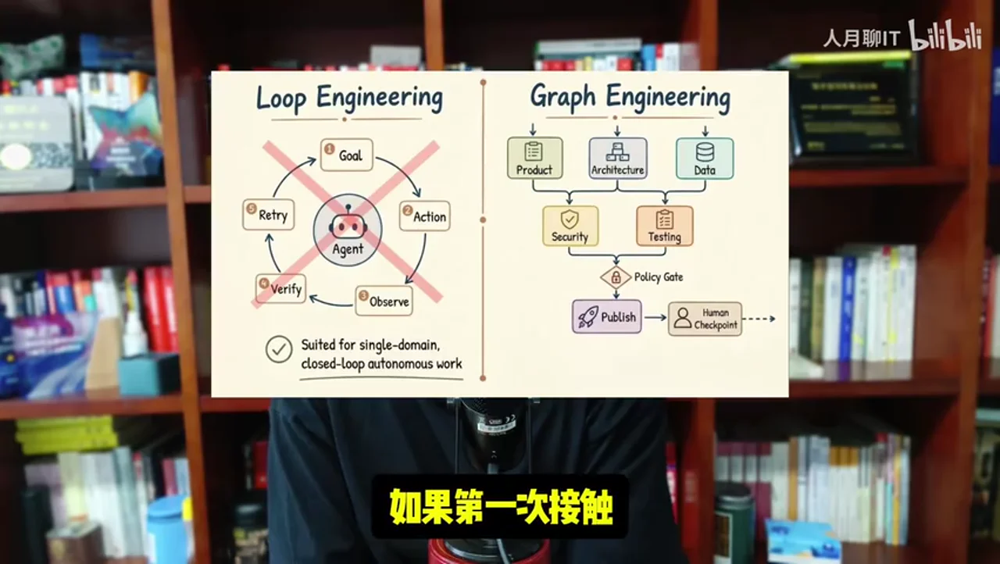
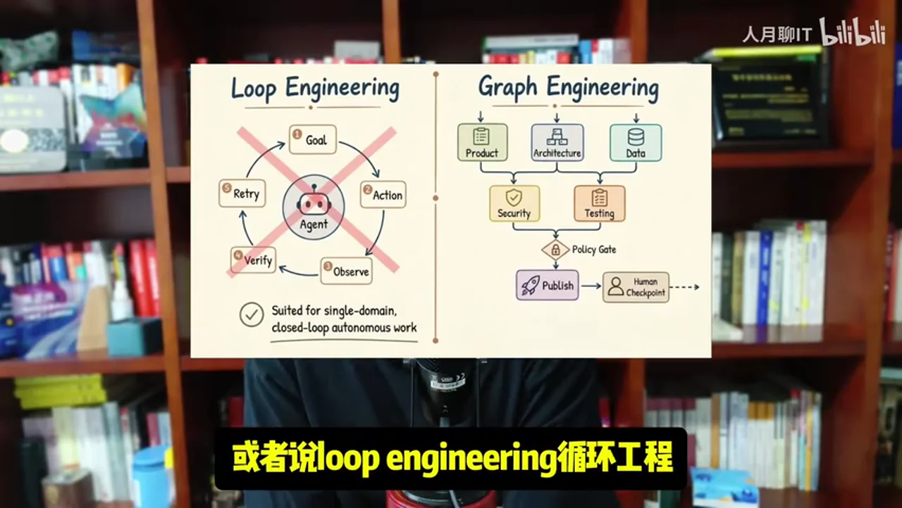
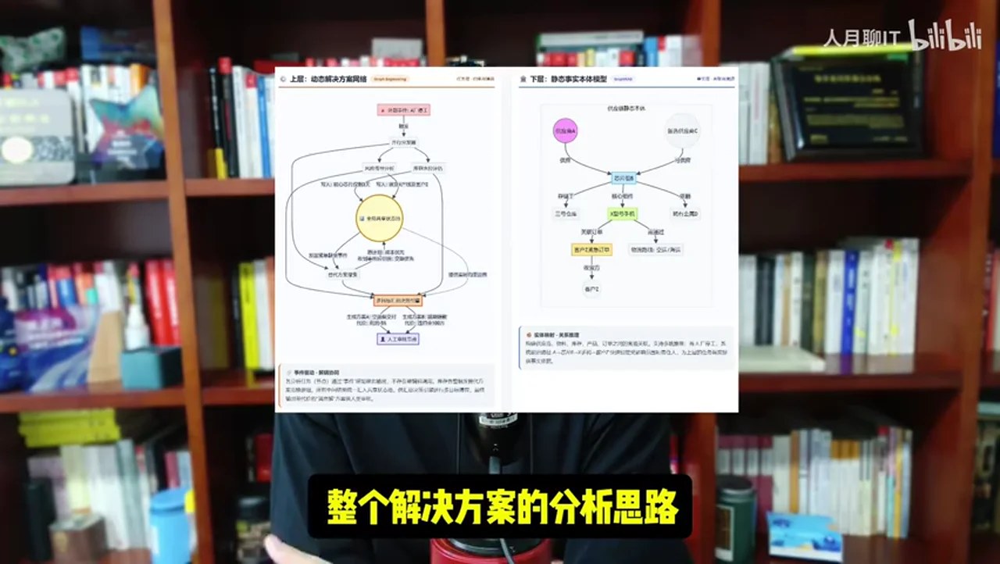
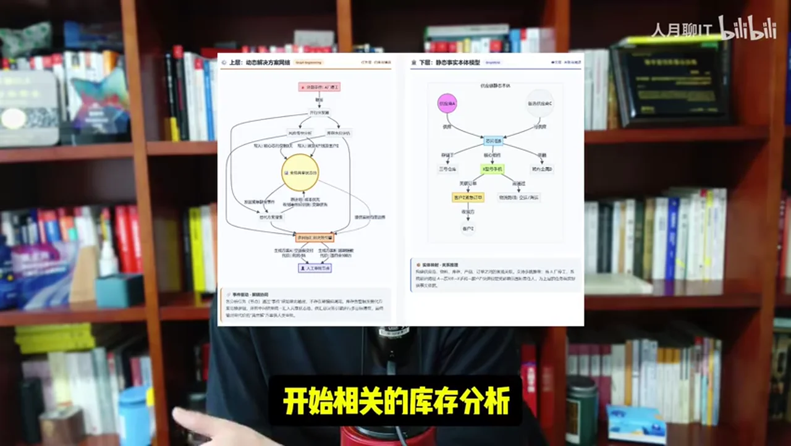

# 总结稿

暂无总结。

# 辅助理解

# Data

## 原始转写稿

[00:00] Hello 大家好 我是任月聊一題
[00:03] 今天簡單的跟大家聊一下Graph engineering圖工程
[00:07] 所以大家如果第一次接觸這個概念的話就感覺跟我們前面談過的Graphreg
[00:13] 或者說loop engineering循環工程相當的類似
[00:17] 難道這個概念
[00:19] 僅僅就是前面已有的概念的簡單的柔和或者是雜交嗎
[00:23] 實際上不是
[00:25] 就是說對於圖工程
[00:27] 大家一定要理解清楚
[00:29] 它往往更多的是在多任務多智能體協同下面
[00:34] 才會出現的一種面向任務面線解決方案的工程化解決思路
[00:42] 我們先拿loop engineering來說
[00:44] 如果你讓AI去解決一個事情
[00:49] 它就是單個任務線條雖然說它中間分了相當多的步驟
[00:53] 但是它仍然適合計劃執行反思
[00:57] 循環迭代的這種方式
[01:00] 那麼它走循環工程完全就可以解決
[01:04] 但是對於很多複雜的任務往往它是涉及到多任務協同
[01:08] 而且多個任務之間有相互制約和影響
[01:13] 也就是說當有一個任務執行到流水線的中間的時候它可能會觸發一些事件出來
[01:19] 然後去制約和影響其他任務的執行
[01:23] 那麼在這種情況下面你就可以看得到多個任務之間形成了一個相互之間關聯依賴制約的
[01:31] 複雜的任務網絡
[01:33] 如果滿足這個特點
[01:35] 那一般就會涉及到graph engineering圖工程
[01:38] 所以我一直在強調圖工程它一定是面向任務面向解決方案的
[01:43] 當你出現對於複雜問題的解決
[01:46] 只要符合多任務的拆解
[01:49] 符合任務之間存在相互制約和影響
[01:52] 那麼它往往就適合圖工程的解決方案
[01:56] 然後從圖工程我又聯想回我原來一直在講本體論和本體建模
[02:02] 因為在本體建模的底層也是相關的抽象的模型和抽象的知識網絡
[02:07] 那麼在本體論裡面是不是也應該引入圖工程相關的一些思路呢
[02:12] 我覺得是完全可行的
[02:14] 因為我們原來在本體建模裡面進行建模它更多的是面向
[02:20] 底層的知識素材或者叫知識點的建模
[02:24] 我們整個的本體建模並沒有面向場景面向解決方案
[02:30] 而對於具體面向場景這一塊的事情我們完完全全交給了AI
[02:35] 它自己去進行相應的一些複雜意圖的識別
[02:39] 但是對於複雜任務的處理我剛才已經講到了
[02:43] 它往往涉及到多任務的協同涉及到多任務之間本身就有相負的制約依賴關係
[02:50] 你對於一個複雜的場景你究竟應該分成幾步幾個步驟來做
[02:54] 每個步驟之間有什麼約束規則你都要提前定義
[02:58] 類似於我經常講過的一個場景類似於關鍵物料的供應鏈中段
[03:02] 你怎麼樣去分析
[03:04] 你實際上整個解決方案的分析思路你是可以並行開始相關的庫存分析計劃分析和相關的成本開支分析的
[03:12] 但是這三個並行的任務分析鏈條中間它本身又存在相負制約影響
[03:18] 比如說庫存本身已經下到預警的損位
[03:21] 你可能要實時觸發相應的成本分析或者是計劃分析
[03:25] 這樣的話多任務鏈條之間就形成了一個完整的任務網絡
[03:30] 那麼在這種情況下面
[03:32] 如果我皮錢不去定義任務解決方案的圖工程
[03:37] 我把只這麼複雜的一個事情全部交給AI自己進行意圖識別去跑
[03:42] 那它很有可能跑出來的結果跟我期望的天差半別
[03:46] 所以基於剛才我講的一個總結簡單來講就是實際上在我們的本體建模裡面
[03:53] 是有必要引入
[03:55] Graph Engineer人的
[03:57] 也就是說引入了以後我們的整個的抽象建模知識網絡分成了兩成
[04:02] 原來的一層的知識網絡更多的是面向知識點和知識素材的
[04:07] 新構建的這一層知識網絡是面向任務和解決方案的
[04:11] 同時這兩層知識網絡之間又形成了相負調用和依賴的基層關係
[04:17] 這樣我們構建出來的完整的本體模型它才是真正的面向場景
[04:21] 能夠解決我們業務問題帶來業務價值的本體模型
[04:25] 好了今天關於圖工程簡單的分享就到這裡
[04:28] 再見

## 原始关键帧

### 关键帧 1

### 关键帧 2

### 关键帧 3

### 关键帧 4

### 关键帧 5

### 关键帧 6

### 关键帧 7

### 关键帧 8

### 关键帧 9

### 关键帧 10

