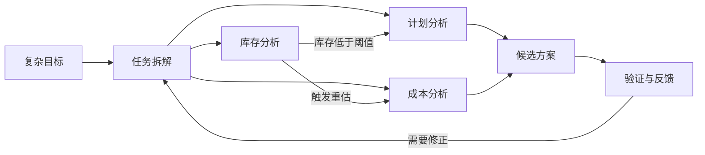

# 总结稿

## 核心观点

视频提出“Graph Engineering（图工程）”这一工作框架：当问题不再是单个 Agent 围绕一个目标执行“计划—行动—观察—验证—重试”的闭环，而是包含多个相互依赖、相互制约的任务时，需要把任务、依赖、触发条件和解决路径显式组织成图。

## 内容脉络

- **Loop Engineering 的适用边界**：单任务即使包含多个步骤，仍可通过迭代闭环推进；但复杂业务常有多个可并行或互相影响的子任务，一个任务的事件还可能触发其他任务。
- **从循环转向任务网络**：Graph Engineering 的重点不是简单增加 Agent 数量，而是事先定义任务如何拆解、节点间有哪些依赖与约束，以及什么状态变化会触发后续分析。
- **示例**：面对物料供应中断，可并行分析库存、计划和成本，但库存跌至预警水位又可能触发或改变成本与计划分析。最终方案不是一条固定流水线，而是一张动态任务网络。
- **对知识建模的扩展**：讲者主张在面向“知识点、知识素材”的底层知识网络之上，再建立面向“任务、场景和解决方案”的网络，并记录两层之间的调用与依赖关系。

## 结论

视频的实践主张是：不要只把复杂问题交给 AI 自主识别意图并任意寻路；应由工程设计明确任务边界、依赖和解题结构，让 AI 在受约束的图中协作。这样，知识模型才可能从“存放知识”进一步走向“支持具体场景中的问题解决”。

# 辅助理解

## 辅助理解

### 视频内容：Loop 与 Graph 的差别

Loop Engineering 主要解决“一个目标如何持续纠偏”，Graph Engineering 则进一步解决“多个任务由谁先做、谁依赖谁、什么事件触发谁”。前者的核心是反馈闭环，后者的核心是显式的任务拓扑。

图并没有消灭循环：每个节点内部仍可执行局部闭环；变化在于，外层由任务依赖图协调多个闭环。Frame 7 将“围绕问题反复回流”与“把分析路径和依赖显式化”的两种组织方式并列呈现。

### 视频内容：两层知识网络

讲者区分了两种建模对象：

| 层次 | 主要节点 | 回答的问题 |
|---|---|---|
| 知识素材层 | 概念、事实、规则、资料 | “系统知道什么？” |
| 任务方案层 | 场景、任务、依赖、解决步骤 | “遇到这个问题该怎样组织行动？” |

第二层不是复制第一层，而是引用底层知识完成特定任务。视频由此把知识网络从检索结构扩展为解决方案的执行结构。

### AI 辅助推断：可落地的工程要素

若把视频观点落实到系统设计，可以为每个任务节点补充四类约束：输入与输出契约、进入条件、验证规则、失败后的转移路径。这样，“图”才不只是可视化流程，而是可执行、可检查、可恢复的控制结构。这是根据视频框架作出的工程化延伸，并非讲者逐项给出的规范。

### 外部核验补充

“Graph Engineering”目前不是已有统一标准定义的行业术语。可核验的是，主流 Agent 工程实践确实会把顺序流程、路由、并行化以及 evaluator–optimizer 等模式组合起来处理多阶段任务；因此视频所说的图式编排具有实践对应物，但其“两层知识网络”定义应视为讲者自己的框架，而非通行标准。参见 [Anthropic：Building effective agents](https://www.anthropic.com/engineering/building-effective-agents)。

# Data

## 增强转写稿

[00:00] Hello 大家好 我是人月聊IT
[00:03] 今天簡單的跟大家聊一下Graph engineering圖工程
[00:07] 所以大家如果第一次接觸這個概念的話就感覺跟我們前面談過的GraphRAG
[00:13] 或者說loop engineering循環工程相當的類似
[00:17] 難道這個概念
[00:19] 僅僅就是前面已有的概念的簡單的糅合或者是雜交嗎
[00:23] 實際上不是
[00:25] 就是說對於圖工程
[00:27] 大家一定要理解清楚
[00:29] 它往往更多的是在多任務多智能體協同下面
[00:34] 才會出現的一種面向任務、面向解決方案的工程化解決思路
[00:42] 我們先拿loop engineering來說
[00:44] 如果你讓AI去解決一個事情
[00:49] 它就是單個任務線條雖然說它中間分了相當多的步驟
[00:53] 但是它仍然適合計劃執行反思
[00:57] 循環迭代的這種方式
[01:00] 那麼它走循環工程完全就可以解決
[01:04] 但是對於很多複雜的任務往往它是涉及到多任務協同
[01:08] 而且多個任務之間有相互制約和影響
[01:13] 也就是說當有一個任務執行到流水線的中間的時候它可能會觸發一些事件出來
[01:19] 然後去制約和影響其他任務的執行
[01:23] 那麼在這種情況下面你就可以看得到多個任務之間形成了一個相互之間關聯依賴制約的
[01:31] 複雜的任務網絡
[01:33] 如果滿足這個特點
[01:35] 那一般就會涉及到graph engineering圖工程
[01:38] 所以我一直在強調圖工程它一定是面向任務面向解決方案的
[01:43] 當你出現對於複雜問題的解決
[01:46] 只要符合多任務的拆解
[01:49] 符合任務之間存在相互制約和影響
[01:52] 那麼它往往就適合圖工程的解決方案
[01:56] 然後從圖工程我又聯想回我原來一直在講本體論和本體建模
[02:02] 因為在本體建模的底層也是相關的抽象的模型和抽象的知識網絡
[02:07] 那麼在本體論裡面是不是也應該引入圖工程相關的一些思路呢
[02:12] 我覺得是完全可行的
[02:14] 因為我們原來在本體建模裡面進行建模它更多的是面向
[02:20] 底層的知識素材或者叫知識點的建模
[02:24] 我們整個的本體建模並沒有面向場景面向解決方案
[02:30] 而對於具體面向場景這一塊的事情我們完完全全交給了AI
[02:35] 它自己去進行相應的一些複雜意圖的識別
[02:39] 但是對於複雜任務的處理我剛才已經講到了
[02:43] 它往往涉及到多任務的協同涉及到多任務之間本身就有相互的制約依賴關係
[02:50] 你對於一個複雜的場景你究竟應該分成幾步幾個步驟來做
[02:54] 每個步驟之間有什麼約束規則你都要提前定義
[02:58] 類似於我經常講過的一個場景類似於關鍵物料的供應鏈中斷
[03:02] 你怎麼樣去分析
[03:04] 你實際上整個解決方案的分析思路你是可以並行開始相關的庫存分析計劃分析和相關的成本開支分析的
[03:12] 但是這三個並行的任務分析鏈條中間它本身又存在相互制約影響
[03:18] 比如說庫存本身已經下到預警的水位
[03:21] 你可能要實時觸發相應的成本分析或者是計劃分析
[03:25] 這樣的話多任務鏈條之間就形成了一個完整的任務網絡
[03:30] 那麼在這種情況下面
[03:32] 如果我提前不去定義任務解決方案的圖工程
[03:37] 我把這麼複雜的一個事情全部交給AI自己進行意圖識別去跑
[03:42] 那它很有可能跑出來的結果跟我期望的天差地別
[03:46] 所以基於剛才我講的一個總結簡單來講就是實際上在我們的本體建模裡面
[03:53] 是有必要引入
[03:55] Graph Engineering
[03:57] 也就是說引入了以後我們的整個的抽象建模知識網絡分成了兩層
[04:02] 原來的一層的知識網絡更多的是面向知識點和知識素材的
[04:07] 新構建的這一層知識網絡是面向任務和解決方案的
[04:11] 同時這兩層知識網絡之間又形成了相互調用和依賴的基礎關係
[04:17] 這樣我們構建出來的完整的本體模型它才是真正的面向場景
[04:21] 能夠解決我們業務問題帶來業務價值的本體模型
[04:25] 好了今天關於圖工程簡單的分享就到這裡
[04:28] 再見

## 原始转写稿

[00:00] Hello 大家好 我是任月聊一題
[00:03] 今天簡單的跟大家聊一下Graph engineering圖工程
[00:07] 所以大家如果第一次接觸這個概念的話就感覺跟我們前面談過的Graphreg
[00:13] 或者說loop engineering循環工程相當的類似
[00:17] 難道這個概念
[00:19] 僅僅就是前面已有的概念的簡單的柔和或者是雜交嗎
[00:23] 實際上不是
[00:25] 就是說對於圖工程
[00:27] 大家一定要理解清楚
[00:29] 它往往更多的是在多任務多智能體協同下面
[00:34] 才會出現的一種面向任務面線解決方案的工程化解決思路
[00:42] 我們先拿loop engineering來說
[00:44] 如果你讓AI去解決一個事情
[00:49] 它就是單個任務線條雖然說它中間分了相當多的步驟
[00:53] 但是它仍然適合計劃執行反思
[00:57] 循環迭代的這種方式
[01:00] 那麼它走循環工程完全就可以解決
[01:04] 但是對於很多複雜的任務往往它是涉及到多任務協同
[01:08] 而且多個任務之間有相互制約和影響
[01:13] 也就是說當有一個任務執行到流水線的中間的時候它可能會觸發一些事件出來
[01:19] 然後去制約和影響其他任務的執行
[01:23] 那麼在這種情況下面你就可以看得到多個任務之間形成了一個相互之間關聯依賴制約的
[01:31] 複雜的任務網絡
[01:33] 如果滿足這個特點
[01:35] 那一般就會涉及到graph engineering圖工程
[01:38] 所以我一直在強調圖工程它一定是面向任務面向解決方案的
[01:43] 當你出現對於複雜問題的解決
[01:46] 只要符合多任務的拆解
[01:49] 符合任務之間存在相互制約和影響
[01:52] 那麼它往往就適合圖工程的解決方案
[01:56] 然後從圖工程我又聯想回我原來一直在講本體論和本體建模
[02:02] 因為在本體建模的底層也是相關的抽象的模型和抽象的知識網絡
[02:07] 那麼在本體論裡面是不是也應該引入圖工程相關的一些思路呢
[02:12] 我覺得是完全可行的
[02:14] 因為我們原來在本體建模裡面進行建模它更多的是面向
[02:20] 底層的知識素材或者叫知識點的建模
[02:24] 我們整個的本體建模並沒有面向場景面向解決方案
[02:30] 而對於具體面向場景這一塊的事情我們完完全全交給了AI
[02:35] 它自己去進行相應的一些複雜意圖的識別
[02:39] 但是對於複雜任務的處理我剛才已經講到了
[02:43] 它往往涉及到多任務的協同涉及到多任務之間本身就有相負的制約依賴關係
[02:50] 你對於一個複雜的場景你究竟應該分成幾步幾個步驟來做
[02:54] 每個步驟之間有什麼約束規則你都要提前定義
[02:58] 類似於我經常講過的一個場景類似於關鍵物料的供應鏈中段
[03:02] 你怎麼樣去分析
[03:04] 你實際上整個解決方案的分析思路你是可以並行開始相關的庫存分析計劃分析和相關的成本開支分析的
[03:12] 但是這三個並行的任務分析鏈條中間它本身又存在相負制約影響
[03:18] 比如說庫存本身已經下到預警的損位
[03:21] 你可能要實時觸發相應的成本分析或者是計劃分析
[03:25] 這樣的話多任務鏈條之間就形成了一個完整的任務網絡
[03:30] 那麼在這種情況下面
[03:32] 如果我皮錢不去定義任務解決方案的圖工程
[03:37] 我把只這麼複雜的一個事情全部交給AI自己進行意圖識別去跑
[03:42] 那它很有可能跑出來的結果跟我期望的天差半別
[03:46] 所以基於剛才我講的一個總結簡單來講就是實際上在我們的本體建模裡面
[03:53] 是有必要引入
[03:55] Graph Engineer人的
[03:57] 也就是說引入了以後我們的整個的抽象建模知識網絡分成了兩成
[04:02] 原來的一層的知識網絡更多的是面向知識點和知識素材的
[04:07] 新構建的這一層知識網絡是面向任務和解決方案的
[04:11] 同時這兩層知識網絡之間又形成了相負調用和依賴的基層關係
[04:17] 這樣我們構建出來的完整的本體模型它才是真正的面向場景
[04:21] 能夠解決我們業務問題帶來業務價值的本體模型
[04:25] 好了今天關於圖工程簡單的分享就到這裡
[04:28] 再見

## 原始关键帧

### 关键帧 1

### 关键帧 2

### 关键帧 3

### 关键帧 4

### 关键帧 5

### 关键帧 6

### 关键帧 7

### 关键帧 8

### 关键帧 9

### 关键帧 10

